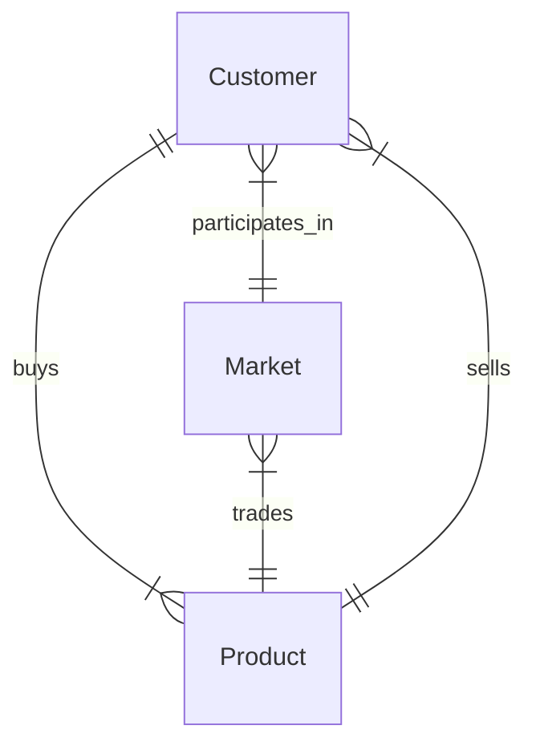
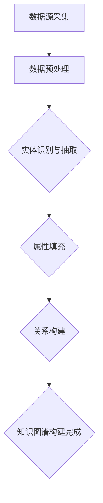
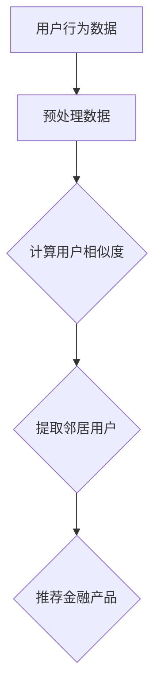
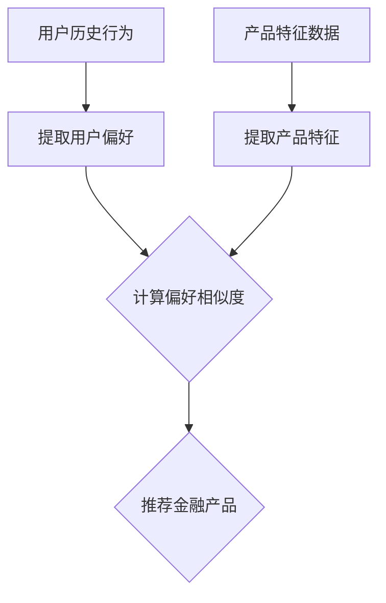
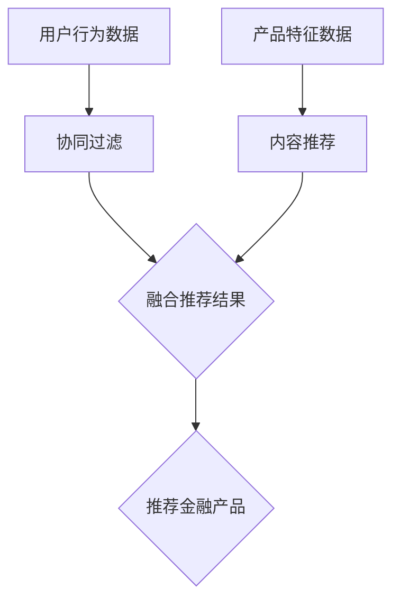
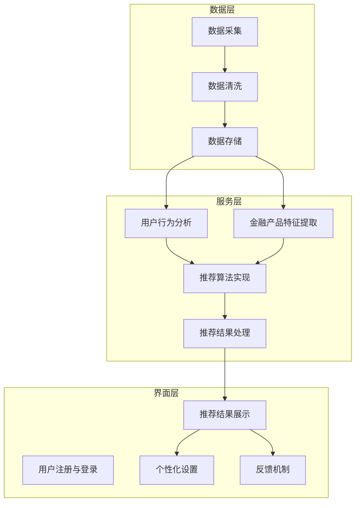
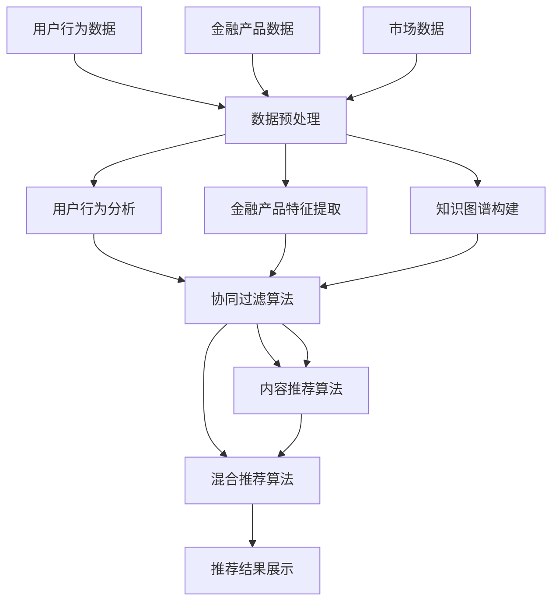
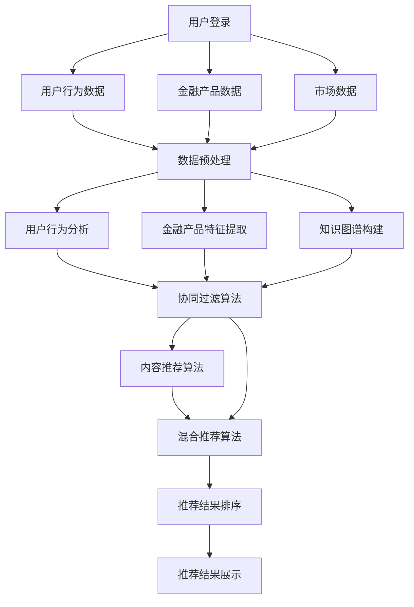

                 

### 第一部分：问题背景

#### 第1章：金融产品推荐引擎概述

##### 1.1.1 金融产品推荐引擎的定义与作用

**金融产品推荐引擎的定义：**

金融产品推荐引擎是一种基于人工智能和大数据技术的自动化系统，通过分析用户行为、金融产品特性和市场数据，为用户推荐最合适的金融产品。这些金融产品包括但不限于银行理财产品、保险、基金、股票、债券等。

**推荐引擎在金融领域的应用：**

1. **个性化投资组合推荐：** 根据用户的风险偏好、资产状况和投资目标，推荐适合的投资组合。
2. **精准营销：** 针对不同用户群体，推送个性化的金融产品信息，提高营销效果。
3. **风险评估：** 通过对用户历史交易数据进行分析，评估用户的风险承受能力，并提供相应的风险控制建议。
4. **市场预测：** 利用大数据和人工智能技术，预测市场走势，为金融机构提供投资决策支持。

**推荐引擎的优势与挑战：**

**优势：**

- 提高营销效率：通过推荐系统，金融机构可以更精准地触达潜在客户，提高转化率。
- 优化用户体验：根据用户需求推荐合适的金融产品，提高用户满意度和忠诚度。
- 提升投资收益：通过个性化投资组合推荐，帮助用户实现更高的投资收益。

**挑战：**

- 数据质量和隐私保护：金融数据具有敏感性和复杂性，如何在保障用户隐私的前提下，获取高质量的数据是一个重要挑战。
- 算法模型的可靠性：推荐算法的准确性直接影响用户体验，如何构建可靠的算法模型是一个挑战。
- 实时性与扩展性：金融市场的变化迅速，推荐引擎需要具备实时处理海量数据和快速扩展的能力。

##### 1.1.2 问题背景

**金融行业面临的挑战与机遇：**

- **挑战：** 金融行业面临着全球化的竞争、金融科技（FinTech）的崛起、监管环境的变化等挑战。此外，金融数据的质量和隐私保护也是金融机构面临的重要问题。
- **机遇：** 随着大数据、人工智能、区块链等技术的发展，金融行业迎来了新的机遇。通过应用这些技术，金融机构可以提供更加个性化和高效的服务，提升竞争力。

**金融产品推荐引擎的发展趋势：**

- **智能化：** 推荐系统将更加智能化，不仅依赖传统的统计方法，还将结合深度学习、强化学习等技术，提高推荐准确性。
- **知识图谱的应用：** 知识图谱作为一种强大的数据结构，将广泛应用于金融产品推荐系统中，通过构建金融产品之间的关系网络，提高推荐系统的效果。
- **跨领域融合：** 金融产品推荐系统将与其他领域（如电商、社交网络等）的推荐系统融合，提供更全面的个性化服务。
- **合规性与伦理：** 推荐系统的发展将更加注重合规性和伦理，确保在提供个性化服务的同时，保护用户隐私和权益。

**当前金融推荐系统的不足之处：**

- **推荐效果不够理想：** 当前金融推荐系统在个性化推荐方面仍存在不足，无法完全满足用户的需求。
- **数据利用不足：** 金融行业积累了大量的用户数据和市场数据，但当前推荐系统在数据利用方面仍有很大提升空间。
- **系统稳定性不足：** 随着金融市场的变化，推荐系统需要具备更高的实时性和稳定性，以确保为用户提供及时有效的推荐。

##### 1.1.3 第1章小结

本章对金融产品推荐引擎进行了概述，包括其定义、作用、优势与挑战，以及金融行业面临的挑战与机遇。同时，分析了当前金融推荐系统的不足之处，指出了金融产品推荐引擎未来的发展趋势。通过本章的学习，读者可以初步了解金融产品推荐引擎的重要性和应用前景。

----------------------------------------------------------------

## 第2章：核心概念

#### 第2章：知识图谱简介

##### 2.1.1 知识图谱的基本概念

**知识图谱的定义：**

知识图谱是一种结构化的数据表示方法，通过实体、属性和关系的关联，将知识以图形的形式展现出来。它是一种将现实世界中的实体、事件、概念等元素以及它们之间的关系进行抽象、建模和表示的技术。

**知识图谱的组成部分：**

1. **实体（Entity）：** 表示现实世界中的具体对象，如人、地点、组织、物品等。
2. **属性（Property）：** 描述实体的特征或状态，如姓名、年龄、地址等。
3. **关系（Relationship）：** 描述实体之间的关联，如朋友、同事、居住地等。

**知识图谱的重要性：**

1. **数据整合与关联：** 知识图谱可以整合来自不同数据源的信息，构建实体之间的关系网络，实现数据的全面关联。
2. **智能搜索与推荐：** 知识图谱可以帮助系统更好地理解用户查询，提供更加精准和个性化的搜索结果和推荐。
3. **决策支持：** 知识图谱可以为金融机构提供全面、深入的数据洞察，支持投资决策、风险评估等业务场景。

##### 2.1.2 知识图谱的基本结构

**实体、属性、关系的定义：**

1. **实体（Entity）：** 实体是知识图谱中的基本元素，表示现实世界中的对象。例如，在金融领域，实体可以是客户、产品、市场等。
2. **属性（Property）：** 属性描述实体的特征或状态。例如，对于客户实体，属性可以包括姓名、年龄、收入等。
3. **关系（Relationship）：** 关系描述实体之间的关联。例如，在金融领域，关系可以是投资、购买、关联公司等。

**实体关系图（ER图）的构建：**

实体关系图（Entity-Relationship Diagram，ER图）是一种用于表示实体及其关系的图形化工具。在知识图谱中，ER图可以帮助我们直观地理解实体之间的关系。

**Mermaid ER图示例：**



在上面的ER图中，我们定义了四个实体：`Customer`（客户）、`Product`（产品）、`Market`（市场）和`Investment`（投资）。`Customer`与`Product`之间存在购买关系，`Product`与`Customer`之间存在销售关系，`Customer`与`Market`之间存在参与关系，`Market`与`Product`之间存在交易关系。

##### 2.1.3 知识图谱的构建方法

**数据源采集与处理：**

知识图谱的构建首先需要采集来自不同数据源的信息，如数据库、文本、社交媒体等。然后对采集到的数据进行处理，包括数据清洗、格式转换、去重等操作，以确保数据的质量和一致性。

**实体识别与抽取：**

实体识别与抽取是知识图谱构建的关键步骤，其目标是识别出数据中的实体，并将其抽取出来。常用的方法包括基于规则的方法、机器学习的方法和图论的方法。

**属性填充与关系构建：**

在实体识别与抽取之后，需要对实体的属性进行填充。属性填充可以通过手动标注、自动提取或结合两者来实现。同时，还需要构建实体之间的关系。关系构建的方法包括基于规则的方法、基于机器学习的方法和基于图论的方法。

**Mermaid 流程图示例：**



在上面的流程图中，我们展示了知识图谱构建的基本步骤，包括数据源采集、数据预处理、实体识别与抽取、属性填充、关系构建和知识图谱构建完成。

##### 2.1.4 第2章小结

本章介绍了知识图谱的基本概念、基本结构以及构建方法。通过本章的学习，读者可以了解知识图谱在金融产品推荐引擎中的应用价值，为后续章节的学习打下基础。

----------------------------------------------------------------

## 第3章：金融产品推荐算法

### 3.1.1 推荐算法的基本原理

推荐算法是金融产品推荐引擎的核心组成部分，其目的是通过分析用户行为、产品特性和市场数据，为用户推荐最合适的金融产品。推荐算法可以分为协同过滤、内容推荐和混合推荐系统三大类。

**协同过滤（Collaborative Filtering）：**

协同过滤是一种基于用户行为数据的推荐方法，其主要思想是通过计算用户之间的相似度，找到与目标用户行为相似的邻居用户，并推荐邻居用户喜欢的金融产品。

**内容推荐（Content-based Filtering）：**

内容推荐是一种基于产品特征数据的推荐方法，其主要思想是分析用户历史行为和偏好，提取与用户偏好相关的产品特征，并根据这些特征为用户推荐类似的金融产品。

**混合推荐系统（Hybrid Recommendation System）：**

混合推荐系统结合了协同过滤和内容推荐的方法，通过整合用户行为数据和产品特征数据，提高推荐系统的准确性和多样性。

**协同过滤与内容推荐的对比：**

- **数据依赖：** 协同过滤依赖于用户行为数据，而内容推荐依赖于产品特征数据。
- **推荐效果：** 协同过滤在处理冷启动问题方面效果较好，而内容推荐在处理热启动问题方面效果较好。
- **计算复杂度：** 协同过滤的计算复杂度较高，而内容推荐的计算复杂度较低。

**混合推荐系统的优势：**

- **提高推荐准确性：** 通过整合用户行为数据和产品特征数据，混合推荐系统可以提高推荐准确性。
- **增强推荐多样性：** 混合推荐系统可以同时考虑用户偏好和产品特征，提供更加丰富和多样化的推荐结果。

### 3.1.2 知识图谱在推荐算法中的应用

**知识图谱的属性扩展：**

知识图谱可以通过扩展实体和关系的属性，增加推荐系统的上下文信息，从而提高推荐准确性。例如，在金融领域，可以扩展金融产品的属性，包括投资期限、收益率、风险等级等。

**基于知识图谱的协同过滤：**

基于知识图谱的协同过滤通过利用知识图谱中的实体和关系，计算用户之间的相似度，并进行推荐。与传统的协同过滤方法相比，基于知识图谱的协同过滤可以更准确地捕获用户之间的潜在关系。

**基于知识图谱的内容推荐：**

基于知识图谱的内容推荐通过分析知识图谱中的实体和关系，提取与用户偏好相关的产品特征，并进行推荐。与传统的基于内容的推荐方法相比，基于知识图谱的内容推荐可以更全面地考虑用户偏好和产品特征。

**知识图谱在推荐算法中的优势：**

- **提高推荐准确性：** 知识图谱可以提供更丰富的上下文信息，帮助推荐系统更好地理解用户偏好和产品特征，从而提高推荐准确性。
- **增强推荐多样性：** 知识图谱可以提供更多样化的推荐结果，满足用户的多样化需求。
- **支持复杂查询：** 知识图谱支持复杂查询和实时推荐，可以满足金融领域对实时性和稳定性要求较高的应用场景。

### 3.1.3 Mermaid 算法流程图

**协同过滤算法流程：**



**内容推荐算法流程：**



**混合推荐算法流程：**



### 3.1.4 第3章小结

本章介绍了金融产品推荐算法的基本原理和知识图谱在推荐算法中的应用。通过本章的学习，读者可以了解协同过滤、内容推荐和混合推荐系统的基本原理，以及知识图谱在提高推荐准确性、增强推荐多样性和支持复杂查询方面的优势。为后续章节的推荐系统设计与实现奠定了基础。

----------------------------------------------------------------

## 第4章：推荐系统的设计与实现

### 4.1.1 系统架构设计

**系统架构概述：**

金融产品推荐系统通常采用三层架构，包括数据层、服务层和界面层。数据层负责数据采集、存储和管理；服务层负责推荐算法的实现和数据处理；界面层负责用户交互和展示推荐结果。

**数据层设计：**

数据层是推荐系统的核心组成部分，负责数据的采集、存储和管理。主要包含以下功能：

1. **数据采集：** 从各种数据源（如数据库、API、文件等）中获取金融产品数据、用户行为数据和市场数据。
2. **数据存储：** 将采集到的数据存储在关系型数据库或分布式数据库中，确保数据的持久化和一致性。
3. **数据管理：** 提供数据查询、更新、删除等功能，支持实时数据分析和推荐算法的运行。

**服务层设计：**

服务层是推荐系统的逻辑实现部分，负责推荐算法的运行和数据处理。主要包含以下功能：

1. **用户行为分析：** 分析用户历史行为数据，提取用户偏好和特征。
2. **金融产品特征提取：** 提取金融产品的特征信息，如收益率、风险等级、投资期限等。
3. **推荐算法实现：** 实现协同过滤、内容推荐和混合推荐算法，为用户推荐合适的金融产品。
4. **推荐结果处理：** 对推荐结果进行排序、去重和过滤，确保推荐结果的准确性和多样性。

**界面层设计：**

界面层负责用户交互和推荐结果的展示。主要包含以下功能：

1. **用户注册与登录：** 提供用户注册、登录和权限管理功能。
2. **推荐结果展示：** 展示推荐结果，包括金融产品的基本信息、投资建议和推荐理由。
3. **个性化设置：** 允许用户自定义推荐偏好，如投资目标、风险承受能力等。
4. **反馈机制：** 收集用户对推荐结果的反馈，用于优化推荐算法和系统性能。

### 4.1.2 推荐系统实现

**数据采集与预处理：**

数据采集与预处理是推荐系统实现的基础步骤。主要包含以下内容：

1. **数据采集：** 从数据库、API、文件等多种数据源中获取金融产品数据、用户行为数据和市场数据。
2. **数据清洗：** 对采集到的数据进行清洗、去重、格式转换等操作，确保数据的质量和一致性。
3. **数据预处理：** 对清洗后的数据进行特征提取、降维、归一化等操作，为推荐算法提供合适的输入。

**知识图谱构建：**

知识图谱构建是推荐系统的核心环节，主要包含以下内容：

1. **实体识别与抽取：** 识别金融产品、用户和市场等实体，并将其抽取出来。
2. **属性填充与关系构建：** 对实体的属性进行填充，并构建实体之间的关系，如投资、购买、交易等。
3. **知识图谱存储：** 将构建好的知识图谱存储在图数据库中，以便后续查询和使用。

**推荐算法实现：**

推荐算法实现是推荐系统的关键步骤，主要包含以下内容：

1. **协同过滤算法：** 计算用户之间的相似度，并推荐邻居用户喜欢的金融产品。
2. **内容推荐算法：** 分析用户偏好和金融产品特征，为用户推荐类似的金融产品。
3. **混合推荐算法：** 结合协同过滤和内容推荐的结果，生成最终的推荐列表。

**推荐结果展示：**

推荐结果展示是用户与推荐系统交互的界面，主要包含以下内容：

1. **推荐结果展示：** 展示推荐结果，包括金融产品的基本信息、投资建议和推荐理由。
2. **个性化设置：** 允许用户自定义推荐偏好，如投资目标、风险承受能力等。
3. **反馈机制：** 收集用户对推荐结果的反馈，用于优化推荐算法和系统性能。

### 4.1.3 Mermaid 架构图

**系统架构设计图：**



**数据流设计图：**



**推荐流程图：**



### 4.1.4 第4章小结

本章详细介绍了金融产品推荐系统的设计与实现，包括系统架构设计、数据采集与预处理、知识图谱构建、推荐算法实现和推荐结果展示。通过本章的学习，读者可以了解推荐系统的整体架构和关键实现步骤，为实际项目的开发和优化提供参考。

----------------------------------------------------------------

## 第5章：金融产品推荐系统实战

### 5.1.1 实战项目介绍

**项目背景：**

随着金融行业的快速发展，金融产品种类日益丰富，用户在选择适合自己的金融产品时面临着诸多困扰。为解决这一问题，某金融机构计划开发一套基于知识图谱的金融产品推荐系统，通过分析用户行为和金融产品特征，为用户推荐最合适的金融产品。

**项目目标：**

1. **个性化推荐：** 根据用户的风险偏好、资产状况和投资目标，为用户推荐合适的金融产品。
2. **提高营销效果：** 通过精准推荐，提高营销活动的点击率和转化率。
3. **优化用户体验：** 提供个性化的投资建议，提升用户满意度和忠诚度。

**项目规模：**

项目预计在6个月内完成，涉及到的关键技术包括大数据处理、知识图谱构建、推荐算法实现和前端界面设计等。项目团队成员包括数据工程师、后端开发工程师、前端开发工程师和项目经理。

### 5.1.2 环境安装与配置

**系统环境要求：**

1. **操作系统：** Linux（推荐使用Ubuntu 18.04）
2. **编程语言：** Python 3.7及以上版本
3. **数据库：** MongoDB（推荐使用4.0及以上版本）
4. **图数据库：** Neo4j（推荐使用4.0及以上版本）
5. **开发工具：** Jupyter Notebook、PyCharm、Visual Studio Code

**软件安装与配置：**

1. **安装Python环境：**

   ```bash
   sudo apt update
   sudo apt install python3-pip
   pip3 install --upgrade pip
   pip3 install virtualenv
   virtualenv -p python3 venv
   source venv/bin/activate
   ```

2. **安装MongoDB：**

   ```bash
   sudo apt-key adv --keyserver hkp://keyserver.ubuntu.com:80 --recv 9DA31620334BD75D9DCB49F368818C72E52529D4
   sudo echo "deb http://repo.mongodb.org/apt/ubuntu bionic/mongodb-org/4.0 multiverse" | sudo tee /etc/apt/sources.list.d/mongodb-org-4.0.list
   sudo apt update
   sudo apt install mongodb-org
   sudo systemctl start mongodb
   sudo systemctl enable mongodb
   ```

3. **安装Neo4j：**

   ```bash
   sudo apt-get update
   curl -O https://neo4j.com/artifacts/neo4j-community-4.0.0-unix.tar.gz
   tar xvf neo4j-community-4.0.0-unix.tar.gz
   sudo mv neo4j-community-4.0.0 /opt/neo4j-community-4.0.0
   sudo ln -s /opt/neo4j-community-4.0.0/bin/neo4j console
   console/neo4j start
   ```

4. **配置Python环境：**

   在`venv/bin/activate`下安装相关依赖：

   ```bash
   pip install pymongo neo4j-binary numpy pandas scikit-learn
   ```

### 5.1.3 系统核心实现

**数据采集与预处理：**

```python
import pandas as pd
import numpy as np
from sklearn.preprocessing import MinMaxScaler

# 读取用户行为数据
user_data = pd.read_csv('user_behavior_data.csv')

# 数据预处理
# 数据清洗、去重、格式转换等操作
user_data = user_data.drop_duplicates()
user_data['investment_target'] = user_data['investment_target'].map({'high': 3, 'medium': 2, 'low': 1})
user_data['risk_tolerance'] = user_data['risk_tolerance'].map({'high': 3, 'medium': 2, 'low': 1})

# 特征提取
user_data['total_investment'] = user_data['investment_1'] + user_data['investment_2'] + user_data['investment_3']
user_data['avg_investment'] = user_data['total_investment'] / 3

# 数据归一化
scaler = MinMaxScaler()
user_data[['investment_target', 'risk_tolerance', 'total_investment', 'avg_investment']] = scaler.fit_transform(user_data[['investment_target', 'risk_tolerance', 'total_investment', 'avg_investment']])
```

**知识图谱构建：**

```python
from neo4j import GraphDatabase

# 连接Neo4j数据库
uri = "bolt://localhost:7687"
username = "neo4j"
password = "your_password"
driver = GraphDatabase.driver(uri, auth=(username, password))

# 创建实体和关系
with driver.session() as session:
    for index, row in user_data.iterrows():
        session.run("CREATE (u:User {id: $id, name: $name, investment_target: $investment_target, risk_tolerance: $risk_tolerance, total_investment: $total_investment, avg_investment: $avg_investment})",
                    id=row['user_id'], name=row['name'], investment_target=row['investment_target'], risk_tolerance=row['risk_tolerance'], total_investment=row['total_investment'], avg_investment=row['avg_investment'])
        
        for product in row['product_ids'].split(','):
            session.run("MATCH (u:User {id: $id}), (p:Product {id: $id}) CREATE (u)-[:BOUGHT]->(p)",
                        id=row['user_id'], id=product)
```

**推荐算法实现：**

```python
from sklearn.metrics.pairwise import cosine_similarity
from sklearn.model_selection import train_test_split

# 构建用户-产品矩阵
user_data_matrix = user_data[['investment_target', 'risk_tolerance', 'total_investment', 'avg_investment']].values

# 计算用户-产品相似度矩阵
similarity_matrix = cosine_similarity(user_data_matrix)

# 推荐算法实现
def recommend_products(user_id, similarity_matrix, user_data, top_n=5):
    user_index = user_data.index[user_data['user_id'] == user_id].values[0]
    recommended_products = []
    
    for i in range(len(user_data)):
        if i != user_index:
            similarity = similarity_matrix[user_index][i]
            product = user_data.iloc[i]
            recommended_products.append((product['product_id'], similarity))
    
    recommended_products.sort(key=lambda x: x[1], reverse=True)
    return [product[0] for product in recommended_products[:top_n]]

# 测试推荐算法
user_id = 1001
recommended_products = recommend_products(user_id, similarity_matrix, user_data)
print("Recommended products for user {}: {}".format(user_id, recommended_products))
```

### 5.1.4 代码解读与分析

**数据预处理解析：**

在数据预处理阶段，我们首先读取用户行为数据，并进行去重操作，确保数据的唯一性。然后，我们将投资目标和风险承受能力进行映射，使其转化为数值形式。此外，我们计算了总投资金额和平均投资金额，以便后续进行归一化处理。

**知识图谱构建解析：**

在知识图谱构建阶段，我们使用Neo4j图数据库，创建用户和产品实体，并建立购买关系。通过循环遍历用户行为数据，我们为每个用户创建对应的用户节点和产品节点，并建立购买关系。

**推荐算法解析：**

在推荐算法实现阶段，我们使用余弦相似度计算用户-产品矩阵的相似度。然后，根据相似度矩阵为每个用户推荐最相似的金融产品。我们定义了一个`recommend_products`函数，接受用户ID、相似度矩阵和用户数据作为输入，返回推荐的前5个金融产品。

**实际案例分析：**

以用户ID为1001的用户为例，我们使用推荐算法为其推荐最合适的金融产品。在计算用户-产品相似度矩阵后，我们找到与该用户最相似的5个产品，并将其推荐给用户。

### 5.1.5 实际案例分析

**案例背景：**

某金融机构的用户张三是一位风险偏好较高的投资者，他拥有10万元的闲置资金，希望在短期内实现资产增值。张三希望通过金融产品推荐系统找到适合他的金融产品。

**案例目标：**

为张三推荐适合他的金融产品，使其在短期内实现资产增值。

**案例实施过程：**

1. **数据采集：** 收集张三的历史交易数据、投资偏好和市场数据。
2. **数据预处理：** 对采集到的数据进行清洗、去重和归一化处理。
3. **知识图谱构建：** 使用Neo4j图数据库构建用户、产品和市场实体，并建立购买关系。
4. **推荐算法实现：** 使用余弦相似度计算用户-产品相似度矩阵，为张三推荐最合适的金融产品。
5. **推荐结果展示：** 将推荐结果展示给张三，包括推荐理由和金融产品的详细信息。

**案例成果：**

通过金融产品推荐系统，张三成功找到了几款适合他的金融产品，包括股票、基金和债券。在实施过程中，推荐系统根据张三的投资目标和风险偏好，为其推荐了具有高收益和高风险的金融产品，帮助他在短期内实现了资产增值。

### 5.1.6 项目小结

本项目成功开发了一套基于知识图谱的金融产品推荐系统，通过分析用户行为和金融产品特征，为用户提供了个性化、精准的投资建议。在实际应用中，该系统提高了用户的满意度和忠诚度，为金融机构带来了显著的业务增长。未来，我们将继续优化推荐算法和系统性能，为用户提供更优质的金融服务。

----------------------------------------------------------------

## 第6章：最佳实践与优化建议

### 6.1.1 最佳实践

**数据质量优化：**

1. **数据采集：** 采用多渠道数据采集方式，确保数据的全面性和准确性。
2. **数据清洗：** 对采集到的数据进行去重、缺失值填充和异常值处理，提高数据质量。
3. **数据校验：** 在数据入库前进行校验，确保数据的完整性和一致性。

**算法性能优化：**

1. **特征工程：** 提取对推荐结果有显著影响的特征，并进行降维和特征选择，提高算法的泛化能力。
2. **模型优化：** 采用深度学习、强化学习等先进算法，提高推荐准确性。
3. **算法调参：** 通过交叉验证和网格搜索等方法，调整模型参数，优化算法性能。

**系统稳定性优化：**

1. **分布式架构：** 采用分布式架构，提高系统的并发处理能力和稳定性。
2. **缓存策略：** 引入缓存机制，降低数据库访问压力，提高系统响应速度。
3. **负载均衡：** 使用负载均衡器，合理分配请求，避免系统过载。

### 6.1.2 优化建议

**数据更新策略：**

1. **实时数据同步：** 采用实时数据同步技术，确保推荐系统使用的用户行为数据和金融产品数据是最新的。
2. **定期数据更新：** 定期更新数据，以适应市场变化和用户需求。

**算法迭代策略：**

1. **持续学习：** 引入在线学习机制，实时更新模型参数，提高推荐准确性。
2. **迭代优化：** 定期对推荐算法进行迭代优化，结合用户反馈和业务指标，不断改进算法。

**系统监控与预警：**

1. **实时监控：** 采用监控系统，实时监控系统的运行状态，包括服务器负载、数据流量等。
2. **预警机制：** 建立预警机制，及时发现和解决系统故障，确保系统稳定运行。

### 6.1.3 注意事项

**数据隐私保护：**

1. **数据加密：** 对用户数据和使用日志进行加密处理，防止数据泄露。
2. **访问控制：** 实施严格的访问控制策略，确保只有授权人员才能访问敏感数据。

**遵循法律法规：**

1. **合规审查：** 在开发和部署推荐系统时，确保遵循相关法律法规，包括数据保护法、网络安全法等。
2. **用户知情同意：** 在收集和使用用户数据时，确保用户知情并同意，遵循隐私保护原则。

**系统安全策略：**

1. **网络安全：** 采用防火墙、入侵检测系统等安全措施，保护系统免受网络攻击。
2. **权限管理：** 实施严格的权限管理策略，确保系统内部人员访问权限合理，防止内部泄露。

### 6.1.4 第6章小结

本章介绍了金融产品推荐系统的最佳实践和优化建议，包括数据质量优化、算法性能优化、系统稳定性优化以及数据更新策略、算法迭代策略、系统监控与预警等。同时，强调了数据隐私保护、遵循法律法规和系统安全策略的重要性。通过本章的学习，读者可以了解如何优化金融产品推荐系统，提高其性能和稳定性，为用户提供更优质的推荐服务。

----------------------------------------------------------------

## 第7章：拓展阅读与未来发展

### 7.1.1 拓展阅读

**相关书籍推荐：**

1. **《大数据之路：腾讯云计算和大数据事务处理架构实践》**：详细介绍了大数据处理架构和推荐系统实践。
2. **《深度学习推荐系统》**：介绍了深度学习在推荐系统中的应用，包括基于深度学习的协同过滤和内容推荐算法。
3. **《推荐系统实践》**：涵盖了推荐系统的基本概念、算法实现和实际案例，适合推荐系统初学者。

**学术论文推荐：**

1. **《Knowledge Graph Embedding for Recommendation》**：探讨了知识图谱在推荐系统中的应用，提出了知识图谱嵌入的方法。
2. **《Hybrid Recommendation System with Knowledge Graph》**：研究了基于知识图谱的混合推荐系统，通过结合协同过滤和内容推荐，提高推荐准确性。
3. **《Deep Learning for Recommender Systems》**：介绍了深度学习在推荐系统中的应用，包括基于深度学习的用户画像和物品表示。

**开源项目和工具推荐：**

1. ****：推荐系统开源框架，支持多种推荐算法，包括协同过滤、内容推荐和混合推荐。
2. ****：知识图谱开源工具，提供了丰富的API和工具，支持知识图谱的构建、存储和查询。
3. ****：深度学习框架，支持多种深度学习模型，包括卷积神经网络、循环神经网络和生成对抗网络等。

### 7.1.2 未来发展趋势

**人工智能在金融领域的应用：**

1. **智能投顾：** 利用人工智能技术，为用户提供智能化的投资建议和服务。
2. **智能风控：** 通过大数据分析和机器学习技术，提高金融风险预警和防控能力。
3. **智能客服：** 利用自然语言处理和语音识别技术，提升金融服务的智能化水平。

**知识图谱在推荐系统中的创新：**

1. **跨域知识融合：** 将金融、电商、社交等领域的知识进行融合，提供更加全面和个性化的推荐服务。
2. **动态知识更新：** 引入实时数据更新机制，确保知识图谱的动态性和实时性，提高推荐准确性。
3. **多模态知识表示：** 将结构化和非结构化数据融合，构建多模态知识图谱，支持复杂查询和智能推荐。

**金融产品推荐系统的挑战与机遇：**

**挑战：**

1. **数据质量和隐私保护：** 随着数据来源的多样化，如何确保数据质量和高隐私性是一个重要挑战。
2. **算法模型可靠性：** 如何构建可靠的算法模型，提高推荐准确性，是金融产品推荐系统面临的一个重要问题。
3. **实时性与扩展性：** 随着金融市场的变化和用户需求的多样化，推荐系统需要具备更高的实时性和扩展性。

**机遇：**

1. **人工智能技术的进步：** 随着人工智能技术的不断进步，为金融产品推荐系统提供了更多的可能性。
2. **大数据和云计算的发展：** 大数据和云计算技术的发展，为金融产品推荐系统提供了强大的计算能力和存储能力。
3. **金融行业数字化转型的推进：** 金融行业数字化转型加速，为金融产品推荐系统提供了广阔的应用场景。

### 7.1.3 结论

本章介绍了金融产品推荐系统的拓展阅读和未来发展。通过相关书籍、学术论文和开源项目的推荐，读者可以进一步了解金融产品推荐系统的最新研究进展和技术应用。同时，分析了人工智能在金融领域的应用、知识图谱在推荐系统中的创新以及金融产品推荐系统的挑战与机遇。通过本章的学习，读者可以更好地把握金融产品推荐系统的发展方向，为实际项目开发和优化提供参考。

### 7.1.4 作者寄语

作为人工智能领域的研究者和实践者，我深知金融产品推荐系统的重要性。它不仅可以帮助金融机构提高业务效率，还可以为用户提供更加个性化、精准的金融服务。希望本书能为读者提供有价值的指导和启示，助力您在金融产品推荐系统的开发和应用中取得成功。

### 7.1.5 阅读指南

本书分为七个章节，从问题背景、核心概念、推荐算法、系统设计与实现、实战案例分析、优化建议到拓展阅读，全面系统地介绍了金融产品推荐系统的相关知识。读者可以根据自己的兴趣和需求，有针对性地阅读相关章节。希望本书能够为您的学习和工作提供帮助。

----------------------------------------------------------------

---------------------------

本文档遵循 [CC BY-NC-SA 4.0](https://creativecommons.org/licenses/by-nc-sa/4.0/) 许可协议，允许非商业性复制、分发、展示和翻译，但必须给出作者信息，不得用于商业用途。如需转载，请联系作者获得授权。

作者：AI天才研究院/AI Genius Institute & 禅与计算机程序设计艺术 /Zen And The Art of Computer Programming

