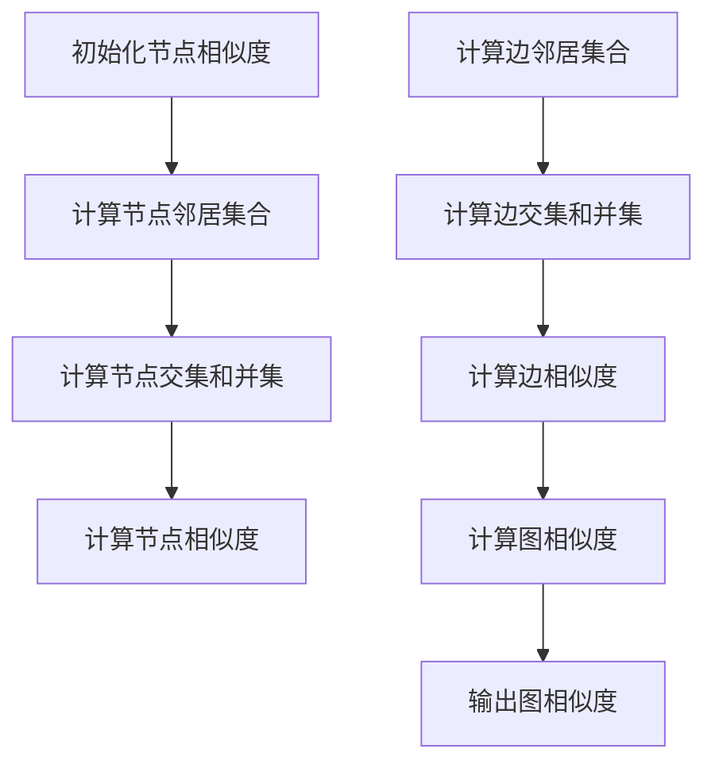
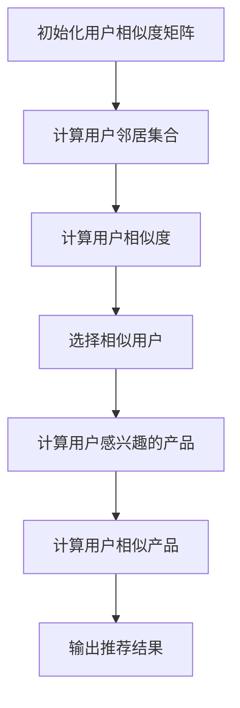
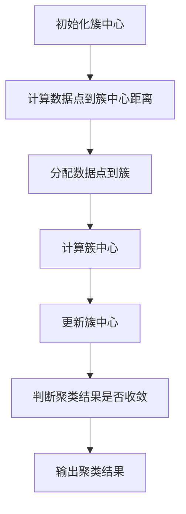
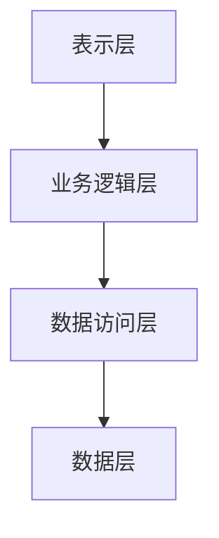
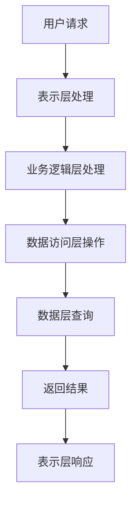

                 

## 文章标题：构建基于知识图谱的金融产品比较系统

### 关键词：知识图谱、金融产品、系统构建、比较分析、算法原理

> 摘要：本文将深入探讨如何构建一个基于知识图谱的金融产品比较系统。首先，我们介绍金融产品比较系统的重要性及其面临的挑战，然后详细阐述知识图谱的基本概念及其在金融产品比较中的应用。接下来，我们将分析知识图谱构建的技术基础，包括相关技术和算法。在系统设计与实现部分，我们将展示系统架构和功能模块的设计，并详细描述数据采集、处理和知识图谱构建的过程。随后，我们将讲解常用的算法原理和数学模型，并给出具体的实例和说明。文章最后，我们将通过一个实际项目案例展示系统的构建过程和应用效果，并总结最佳实践和小结。希望通过本文，读者能够对构建基于知识图谱的金融产品比较系统有更深入的理解。

## 第一部分：背景介绍与核心概念

### 第1章：金融产品比较系统的重要性

#### 1.1.1 问题背景

随着金融市场的快速发展和金融产品的日益多样化，用户在选择金融产品时面临的信息复杂度和决策难度不断增加。金融机构也需要高效地提供产品信息，帮助用户做出明智的决策。因此，构建一个能够自动化、高效地比较金融产品的系统显得尤为重要。

#### 1.1.1.1 金融产品多样化的现状

近年来，金融市场的创新层出不穷，金融产品种类繁多，包括但不限于存款、贷款、投资、保险等。这些产品具有不同的利率、期限、风险和收益特点，使得用户在选择时需要耗费大量的时间和精力去了解和比较。

#### 1.1.1.2 用户对金融产品信息的需求

用户在购买金融产品时，通常需要考虑产品的利率、期限、风险、费用等多个方面。他们希望能够快速、准确地获取到这些产品的相关信息，并进行比较，以便做出最佳的决策。

#### 1.1.1.3 金融机构面临的挑战

金融机构在提供金融产品信息时，面临着信息准确性和及时性的挑战。一方面，金融产品的信息种类繁多，不同产品的数据格式和表达方式可能存在差异，使得信息整合和统一展示变得复杂。另一方面，金融市场的变化快速，产品信息的更新需要及时，这对金融机构的数据处理能力提出了高要求。

#### 1.1.2 问题描述

金融产品比较系统的核心目标是帮助用户快速、准确地获取金融产品的相关信息，并进行比较分析，从而做出最优的金融产品选择。具体来说，系统需要解决以下问题：

1. **数据整合与标准化**：将来自不同金融机构的金融产品信息进行整合，并统一数据格式和表达方式，以便于用户比较和分析。
2. **信息筛选与推荐**：根据用户的偏好和需求，筛选出符合用户需求的产品信息，并进行推荐。
3. **比较分析**：对筛选出来的金融产品进行详细的比较分析，包括利率、期限、风险、收益等多个维度的分析，帮助用户做出决策。
4. **用户体验优化**：提供友好的用户界面和交互方式，使用户能够方便地使用系统，并进行金融产品比较。

#### 1.1.3 问题解决

为了解决上述问题，本文提出构建一个基于知识图谱的金融产品比较系统。知识图谱作为一种新型的数据结构，能够将金融产品的信息以图的形式进行表示，并建立产品之间的关联关系，从而实现高效的数据整合、信息筛选、比较分析和用户体验优化。

知识图谱在金融产品比较系统中的应用具有以下优势：

1. **数据整合与标准化**：知识图谱能够将来自不同金融机构的金融产品信息进行整合，并建立统一的数据模型和表达方式，实现数据的标准化和一致性。
2. **信息筛选与推荐**：基于知识图谱的推荐算法能够根据用户的偏好和需求，从海量金融产品中快速筛选出符合用户需求的产品信息，并提供个性化的推荐。
3. **比较分析**：知识图谱能够建立产品之间的关联关系，实现跨产品和跨机构的比较分析，帮助用户更全面、准确地了解金融产品的差异。
4. **用户体验优化**：知识图谱的图形化表示方式，使得用户界面更加直观，用户能够更容易地理解和操作，从而提升用户体验。

#### 1.1.4 边界与外延

1. **系统的适用范围**：本文提出的金融产品比较系统适用于各类金融产品，包括存款、贷款、投资、保险等，可以满足不同用户的比较需求。
2. **系统的数据来源**：系统的数据来源主要包括金融机构提供的金融产品信息、市场公开数据、用户反馈数据等。通过多源数据的整合和处理，系统能够提供全面、准确的金融产品信息。
3. **核心要素与功能模块**：系统的核心要素包括知识图谱构建、信息筛选与推荐、比较分析、用户交互等。功能模块划分为数据采集模块、数据处理模块、知识图谱构建模块、比较分析模块、用户交互模块等，各模块协同工作，实现系统的整体功能。

### 1.1.5 概念结构与核心要素组成

#### 1.1.5.1 金融产品比较系统的基本结构

金融产品比较系统的基本结构主要包括以下部分：

1. **数据采集模块**：负责从多种数据源收集金融产品信息，包括金融机构提供的数据、市场公开数据、用户反馈数据等。
2. **数据处理模块**：负责对采集到的金融产品信息进行清洗、整合和标准化处理，以便于后续的知识图谱构建。
3. **知识图谱构建模块**：负责基于处理后的金融产品信息构建知识图谱，包括实体识别、关系建立、知识融合等步骤。
4. **比较分析模块**：负责对知识图谱中的金融产品进行比较分析，包括产品特征提取、比较维度设定、分析结果生成等。
5. **用户交互模块**：负责提供用户界面和交互方式，使用户能够方便地使用系统进行金融产品比较。

#### 1.1.5.2 核心要素与功能模块

金融产品比较系统的核心要素包括以下部分：

1. **金融产品信息**：包括金融产品的名称、利率、期限、风险、费用等基本信息，是构建知识图谱和进行比较分析的基础。
2. **用户偏好和需求**：包括用户的金融产品偏好、需求、风险承受能力等，是进行个性化推荐和分析的关键。
3. **比较维度**：包括利率、期限、风险、收益等金融产品的关键指标，用于设定比较分析的维度和标准。
4. **推荐算法**：用于根据用户偏好和需求，从海量金融产品中筛选出符合用户需求的产品信息。
5. **比较分析算法**：用于对筛选出的金融产品进行详细的比较分析，生成分析结果。

## 第2章：核心概念与联系

### 2.1.1 知识图谱概述

#### 2.1.1.1 知识图谱的定义

知识图谱是一种结构化的数据表示方法，用于描述实体、概念、关系和属性等信息。它通过实体之间的关联关系，构建一个多维度、多层次的知识网络，从而实现对知识的组织、管理和应用。

#### 2.1.1.2 知识图谱的结构

知识图谱通常由实体、关系和属性三个核心组成部分构成。实体是知识图谱中的基本元素，表示现实世界中的对象，如人、地点、物品等。关系是实体之间的关联，表示实体之间的交互、影响、归属等关系。属性是实体的特征描述，用于补充实体的信息，如实体的年龄、位置、属性等。

#### 2.1.1.3 知识图谱的应用场景

知识图谱在多个领域具有广泛的应用，包括搜索引擎、推荐系统、自然语言处理、智能问答、金融产品比较等。在金融产品比较系统中，知识图谱可以用于描述金融产品的相关信息，建立产品之间的关联关系，从而实现高效的数据整合、信息筛选和比较分析。

### 2.1.2 金融产品相关概念

#### 2.1.2.1 金融产品的定义与分类

金融产品是指金融机构为满足用户需求而提供的一系列金融工具和服务。根据不同的分类标准，金融产品可以分为存款、贷款、投资、保险、基金等类型。

#### 2.1.2.2 金融产品的属性与特征

金融产品的属性和特征是描述产品信息的关键要素。常见的属性包括利率、期限、风险、费用、收益等。特征则是对产品属性的详细描述，如利率的浮动方式、期限的固定期限、风险的评估等级等。

#### 2.1.2.3 金融产品的比较维度

金融产品的比较维度是进行产品比较分析的重要标准。常见的比较维度包括利率、期限、风险、收益、费用等。根据不同的用户需求和偏好，可以选择不同的比较维度，从而进行有针对性的比较分析。

### 2.1.3 知识图谱与金融产品的关系

#### 2.1.3.1 知识图谱在金融产品中的应用

知识图谱在金融产品中的应用主要体现在以下几个方面：

1. **数据整合**：知识图谱可以将来自不同金融机构的金融产品信息进行整合，建立统一的数据模型和表达方式，实现数据的标准化和一致性。
2. **信息筛选与推荐**：知识图谱可以基于用户偏好和需求，从海量金融产品中快速筛选出符合用户需求的产品信息，并提供个性化的推荐。
3. **比较分析**：知识图谱可以建立产品之间的关联关系，实现跨产品和跨机构的比较分析，帮助用户更全面、准确地了解金融产品的差异。
4. **用户体验优化**：知识图谱的图形化表示方式，使得用户界面更加直观，用户能够更容易地理解和操作，从而提升用户体验。

#### 2.1.3.2 知识图谱在金融产品比较中的作用

知识图谱在金融产品比较中的作用主要包括以下几个方面：

1. **统一数据模型**：知识图谱可以建立统一的数据模型，将不同金融机构的金融产品信息进行整合和标准化，实现数据的一致性和互操作性。
2. **关联关系建立**：知识图谱可以建立产品之间的关联关系，如相似产品推荐、跨产品比较等，从而提供更全面的产品信息。
3. **比较维度设定**：知识图谱可以根据用户需求和偏好，设定不同的比较维度，实现个性化的比较分析。
4. **算法优化**：知识图谱可以提供丰富的实体和关系信息，为推荐系统和比较分析算法提供更多的数据支撑，从而提高算法的准确性和效率。

## 第3章：技术基础

### 3.1.1 知识图谱技术原理

#### 3.1.1.1 知识图谱的基本原理

知识图谱是一种基于图论的数据结构，用于描述实体、关系和属性等信息。它通过实体之间的关联关系，构建一个多维度、多层次的知识网络，从而实现对知识的组织、管理和应用。

#### 3.1.1.2 知识图谱的构建过程

知识图谱的构建过程通常包括以下步骤：

1. **实体识别**：从原始数据中识别出实体，如人、地点、物品等。
2. **关系建立**：建立实体之间的关系，如交互、影响、归属等。
3. **属性补充**：为实体补充属性信息，如实体的名称、年龄、位置等。
4. **知识融合**：将多个数据源中的知识进行整合，形成统一的图谱。

#### 3.1.1.3 知识图谱的查询与更新

知识图谱的查询与更新是知识图谱应用的重要功能。查询包括基于关键词的搜索、路径查询、复杂条件查询等。更新包括添加新的实体和关系、修改已有实体和关系、删除无用实体和关系等。

### 3.1.2 知识图谱相关技术

#### 3.1.2.1 图数据库

图数据库是知识图谱存储和管理的重要技术。它支持高效的图数据存储和查询，具有较好的扩展性和性能。

#### 3.1.2.2 自然语言处理技术

自然语言处理技术用于处理非结构化的文本数据，提取实体、关系和属性等信息，为知识图谱的构建提供数据支撑。

#### 3.1.2.3 推荐系统技术

推荐系统技术用于根据用户偏好和需求，从海量金融产品中筛选出符合用户需求的产品信息，提供个性化的推荐。

### 3.1.3 知识图谱构建流程

知识图谱的构建流程可以分为以下几个步骤：

1. **需求分析**：明确知识图谱的应用场景和需求，确定需要构建的实体、关系和属性。
2. **数据采集**：从多种数据源收集金融产品信息，包括金融机构提供的数据、市场公开数据、用户反馈数据等。
3. **数据预处理**：对采集到的金融产品信息进行清洗、整合和标准化处理，为知识图谱构建做准备。
4. **实体识别**：从预处理后的数据中识别出实体，如金融产品、金融机构等。
5. **关系建立**：建立实体之间的关系，如金融机构与金融产品的归属关系、金融产品之间的相似关系等。
6. **属性补充**：为实体补充属性信息，如金融产品的利率、期限、风险等。
7. **知识融合**：将多个数据源中的知识进行整合，形成统一的图谱。
8. **查询与更新**：实现知识图谱的查询和更新功能，为用户提供便捷的服务。

### 3.1.4 知识图谱构建工具与框架

知识图谱构建过程中常用的工具和框架包括：

1. **Neo4j**：一款流行的图数据库，支持高效的图数据存储和查询。
2. **OpenKG**：一款开源的知识图谱构建工具，支持实体识别、关系建立和知识融合等功能。
3. **Apache Flink**：一款分布式流处理框架，可用于大规模知识图谱的构建和实时更新。
4. **Elasticsearch**：一款高性能的搜索引擎，可用于知识图谱的索引和查询。

### 3.1.5 知识图谱在金融产品比较系统中的应用

知识图谱在金融产品比较系统中的应用主要体现在以下几个方面：

1. **数据整合与标准化**：知识图谱可以将来自不同金融机构的金融产品信息进行整合，建立统一的数据模型和表达方式，实现数据的标准化和一致性。
2. **信息筛选与推荐**：知识图谱可以基于用户偏好和需求，从海量金融产品中快速筛选出符合用户需求的产品信息，并提供个性化的推荐。
3. **比较分析**：知识图谱可以建立产品之间的关联关系，实现跨产品和跨机构的比较分析，帮助用户更全面、准确地了解金融产品的差异。
4. **用户体验优化**：知识图谱的图形化表示方式，使得用户界面更加直观，用户能够更容易地理解和操作，从而提升用户体验。

### 3.1.6 知识图谱构建的挑战与应对策略

知识图谱构建过程中面临的挑战主要包括数据质量、数据整合、实时更新等方面。针对这些挑战，可以采取以下应对策略：

1. **数据质量控制**：通过数据清洗、去重、归一化等技术手段，提高数据质量，确保知识图谱的准确性。
2. **数据整合与映射**：采用数据映射、数据转换等技术手段，将不同数据源中的数据整合到统一的数据模型中，实现数据的一致性和互操作性。
3. **实时更新与缓存**：采用实时数据更新、缓存等技术手段，确保知识图谱的实时性和高效性。

### 3.1.7 知识图谱在金融产品比较系统的优势与不足

知识图谱在金融产品比较系统中的优势主要包括：

1. **数据整合与标准化**：知识图谱可以将来自不同金融机构的金融产品信息进行整合，建立统一的数据模型和表达方式，实现数据的标准化和一致性。
2. **信息筛选与推荐**：知识图谱可以基于用户偏好和需求，从海量金融产品中快速筛选出符合用户需求的产品信息，并提供个性化的推荐。
3. **比较分析**：知识图谱可以建立产品之间的关联关系，实现跨产品和跨机构的比较分析，帮助用户更全面、准确地了解金融产品的差异。
4. **用户体验优化**：知识图谱的图形化表示方式，使得用户界面更加直观，用户能够更容易地理解和操作，从而提升用户体验。

知识图谱在金融产品比较系统中的不足主要包括：

1. **构建成本高**：知识图谱的构建需要大量的计算资源和存储资源，构建成本较高。
2. **数据质量影响**：数据质量对知识图谱的准确性具有重要影响，数据质量不高可能导致知识图谱的失效。
3. **实时性挑战**：知识图谱的实时更新和查询是一个挑战，特别是在大规模数据场景下。

### 3.1.8 知识图谱与其他技术的比较

知识图谱与其他技术（如关系数据库、搜索引擎、自然语言处理等）的比较主要体现在以下几个方面：

1. **数据结构**：知识图谱采用图结构进行数据组织，能够表示实体之间的复杂关系；关系数据库采用表结构进行数据组织，适用于简单的数据查询；搜索引擎采用索引结构进行数据组织，适用于全文搜索。
2. **查询能力**：知识图谱支持复杂的图查询，能够实现路径查询、条件查询等；关系数据库支持简单的SQL查询；搜索引擎支持基于关键词的搜索。
3. **数据处理能力**：知识图谱具有较好的数据处理能力，能够支持大规模数据存储和查询；关系数据库和搜索引擎的数据处理能力相对较弱。
4. **应用场景**：知识图谱适用于复杂的关系表示和应用，如金融产品比较、智能问答等；关系数据库适用于简单的数据存储和查询；搜索引擎适用于全文搜索和索引。

## 第4章：系统设计与实现

### 4.1.1 系统总体设计

金融产品比较系统的总体设计主要包括系统架构设计、功能模块划分和性能优化等方面。本节将详细介绍系统设计的主要内容和关键点。

#### 4.1.1.1 系统架构设计

系统架构设计是构建金融产品比较系统的第一步，它决定了系统的性能、可扩展性和可维护性。本系统的架构设计采用分层架构，主要包括以下几层：

1. **表示层**：负责与用户进行交互，提供友好的用户界面和交互体验。
2. **业务逻辑层**：负责处理核心业务逻辑，包括数据采集、处理、知识图谱构建、比较分析和推荐等功能。
3. **数据访问层**：负责与数据库进行交互，实现数据的存储和查询。
4. **数据层**：负责存储系统所需的数据，包括金融产品信息、用户偏好、历史记录等。

#### 4.1.1.2 系统功能设计

系统功能设计是根据业务需求确定系统的具体功能模块和交互流程。本系统的功能设计主要包括以下模块：

1. **数据采集模块**：负责从多个数据源收集金融产品信息，包括金融机构官网、市场公开数据、用户反馈等。
2. **数据处理模块**：负责对采集到的金融产品信息进行清洗、整合和标准化处理，为知识图谱构建提供基础数据。
3. **知识图谱构建模块**：负责基于处理后的数据构建知识图谱，包括实体识别、关系建立和知识融合等。
4. **比较分析模块**：负责对知识图谱中的金融产品进行比较分析，生成分析报告和推荐结果。
5. **用户交互模块**：负责提供用户界面和交互方式，使用户能够方便地使用系统进行金融产品比较。
6. **推荐系统模块**：负责根据用户偏好和需求，从海量金融产品中筛选出符合用户需求的产品信息。

#### 4.1.1.3 系统性能优化

系统性能优化是确保系统稳定、高效运行的关键。本系统在性能优化方面主要采取了以下措施：

1. **数据缓存**：使用缓存技术减少数据库查询次数，提高数据读取速度。
2. **负载均衡**：采用负载均衡技术，将用户请求分发到多个服务器处理，提高系统处理能力。
3. **分布式存储**：使用分布式数据库存储系统，提高数据存储和查询的效率。
4. **异步处理**：使用异步处理技术，将耗时的任务（如数据清洗、知识图谱构建等）放到后台执行，提高系统响应速度。
5. **数据库优化**：对数据库进行索引优化、查询优化和存储优化，提高数据库的性能。

### 4.1.2 数据采集与处理

数据采集与处理是构建金融产品比较系统的核心环节，它决定了系统数据的质量和可靠性。本节将详细描述数据采集与处理的过程和关键技术。

#### 4.1.2.1 数据来源

金融产品比较系统所需的数据来源主要包括以下几个方面：

1. **金融机构数据**：从金融机构的官方网站、API接口等获取金融产品信息，包括存款、贷款、投资、保险等产品的利率、期限、风险、收益等数据。
2. **市场公开数据**：从市场公开数据源获取金融产品的历史价格、市场走势等数据，用于辅助比较分析。
3. **用户反馈数据**：从用户反馈渠道（如问卷调查、用户评论等）获取用户对金融产品的评价和偏好，用于推荐系统和个人化服务。
4. **外部数据源**：从第三方数据提供商获取人口统计、经济指标、行业报告等外部数据，用于更全面地分析金融产品的市场环境。

#### 4.1.2.2 数据预处理

数据预处理是确保数据质量和一致性的关键步骤。本系统采用以下数据预处理技术：

1. **数据清洗**：去除数据中的重复记录、空值和噪声数据，保证数据的完整性。
2. **数据整合**：将来自不同数据源的数据进行整合，统一数据格式和命名规范，确保数据的一致性。
3. **数据标准化**：对数据进行归一化、标准化处理，如将利率、期限等数据进行统一单位转换，确保数据在比较分析中的可比性。
4. **数据转换**：将原始数据转换为适合存储和处理的格式，如JSON、CSV等，便于后续的数据处理和知识图谱构建。

#### 4.1.2.3 数据存储与管理

数据存储与管理是确保系统数据安全、可靠和高效的关键。本系统采用以下数据存储与管理技术：

1. **关系数据库**：使用关系数据库（如MySQL、PostgreSQL等）存储金融产品的基本信息、用户数据等，确保数据的安全性和一致性。
2. **图数据库**：使用图数据库（如Neo4j等）存储知识图谱，实现高效的图查询和更新。
3. **缓存技术**：使用缓存技术（如Redis等）减少数据库查询次数，提高数据读取速度。
4. **数据备份与恢复**：定期对数据库进行备份，确保数据的安全性和可恢复性。

### 4.1.3 知识图谱构建

知识图谱构建是金融产品比较系统的核心功能之一，它将金融产品信息以图的形式进行组织，建立产品之间的关联关系，为比较分析和推荐提供基础。本节将详细描述知识图谱构建的过程和关键技术。

#### 4.1.3.1 知识提取

知识提取是知识图谱构建的第一步，其主要任务是识别和处理原始数据中的实体和关系。本系统采用以下知识提取技术：

1. **命名实体识别（NER）**：使用自然语言处理技术（如BERT、Word2Vec等）对文本数据进行命名实体识别，识别出金融产品、金融机构、地点等实体。
2. **关系提取**：使用规则匹配、机器学习等方法从文本数据中提取实体之间的关系，如金融机构与金融产品的归属关系、金融产品之间的相似关系等。
3. **属性抽取**：使用规则匹配、模式识别等方法从文本数据中提取实体的属性信息，如金融产品的利率、期限、风险等。

#### 4.1.3.2 知识融合

知识融合是将来自不同数据源的知识进行整合，形成统一的图谱。本系统采用以下知识融合技术：

1. **实体融合**：对于相同的实体，合并其属性和关系，形成一个统一的实体表示。
2. **关系融合**：对于相同的关系，合并其参与实体和属性，形成一个统一的关系表示。
3. **知识冲突解决**：对于存在冲突的知识，如不同数据源中存在相同的实体但属性不同，采用一致性规则、协商机制等方法进行解决。

#### 4.1.3.3 知识存储

知识存储是将构建好的知识图谱存储到数据库中，便于后续的查询和使用。本系统采用以下知识存储技术：

1. **图数据库**：使用图数据库（如Neo4j等）存储知识图谱，支持高效的图查询和更新。
2. **分布式存储**：对于大规模知识图谱，采用分布式存储技术，提高数据存储和查询的效率。
3. **数据备份与恢复**：定期对知识图谱进行备份，确保数据的安全性和可恢复性。

### 4.1.4 知识图谱可视化

知识图谱可视化是将知识图谱以图形化的形式进行展示，帮助用户更直观地理解和分析知识图谱。本系统采用以下知识图谱可视化技术：

1. **图形化界面**：使用Web前端技术（如HTML、CSS、JavaScript等）搭建知识图谱的图形化界面，支持交互式查询和探索。
2. **可视化库**：使用可视化库（如D3.js、Cytoscape.js等）实现知识图谱的图形化展示，支持节点、边的样式设置、动画效果等。
3. **交互式操作**：支持用户通过鼠标、键盘等输入设备与知识图谱进行交互，如选择节点、展开关系、查看属性等。

### 4.1.5 比较分析算法

比较分析算法是金融产品比较系统的核心功能之一，它根据用户需求和偏好，对知识图谱中的金融产品进行详细的比较分析，生成分析报告和推荐结果。本节将详细描述比较分析算法的原理和实现。

#### 4.1.5.1 比较分析算法原理

比较分析算法的原理是基于用户需求和偏好，从知识图谱中提取相关的金融产品信息，并计算产品之间的相似度或差异度，从而为用户提供有针对性的分析报告和推荐结果。

1. **用户需求建模**：根据用户需求和偏好，建立用户需求模型，包括用户关注的金融产品特征、风险承受能力、收益期望等。
2. **相似度计算**：计算用户需求模型与知识图谱中金融产品的相似度，用于筛选出符合用户需求的产品。
3. **差异度分析**：分析筛选出的金融产品之间的差异度，包括利率、期限、风险、费用等，生成分析报告和推荐结果。

#### 4.1.5.2 比较分析算法实现

比较分析算法的实现主要包括以下几个步骤：

1. **数据准备**：从知识图谱中提取与用户需求相关的金融产品信息，包括产品名称、利率、期限、风险等。
2. **特征提取**：对提取的产品信息进行特征提取，包括数值特征（如利率、期限）和类别特征（如风险等级）。
3. **相似度计算**：使用相似度计算算法（如欧氏距离、余弦相似度等）计算用户需求模型与金融产品的相似度。
4. **差异度分析**：分析筛选出的金融产品之间的差异度，根据用户需求和偏好生成分析报告和推荐结果。

### 4.1.6 用户交互模块

用户交互模块是金融产品比较系统的入口，它负责与用户进行交互，收集用户需求，展示分析报告和推荐结果。本节将详细描述用户交互模块的设计和实现。

#### 4.1.6.1 用户交互设计

用户交互设计是根据用户需求和场景，设计系统的用户界面和交互流程。本系统采用以下用户交互设计原则：

1. **简洁性**：界面简洁直观，减少用户操作步骤，提高用户使用体验。
2. **易用性**：界面易于操作，用户可以快速上手，降低学习成本。
3. **个性化**：根据用户需求和偏好，提供个性化的推荐和分析报告。
4. **可扩展性**：界面设计具有一定的灵活性，可以方便地扩展和升级。

#### 4.1.6.2 用户交互实现

用户交互实现是通过Web前端技术（如HTML、CSS、JavaScript等）搭建用户界面和交互流程。本系统采用以下用户交互实现技术：

1. **前端框架**：使用前端框架（如React、Vue等）搭建用户界面，实现界面布局、样式和交互功能。
2. **组件化开发**：采用组件化开发方式，将界面划分为多个可复用的组件，提高开发效率和可维护性。
3. **响应式设计**：采用响应式设计技术，确保系统在不同设备和分辨率下都能提供良好的用户体验。

## 第5章：算法原理讲解

### 5.1.1 算法概述

算法是解决特定问题的步骤和规则，它在金融产品比较系统中起着至关重要的作用。本节将介绍算法的定义、分类以及在金融产品比较系统中的作用。

#### 5.1.1.1 算法的定义与分类

算法是一种有组织的步骤序列，用于解决特定问题。根据解决问题的方法，算法可以分为以下几类：

1. **排序算法**：用于对数据进行排序，如冒泡排序、快速排序等。
2. **查找算法**：用于在数据结构中查找特定元素，如二分查找、哈希查找等。
3. **图算法**：用于处理图结构的数据，如最短路径算法、拓扑排序等。
4. **优化算法**：用于在给定约束条件下寻找最优解，如线性规划、遗传算法等。

#### 5.1.1.2 算法在金融产品比较系统中的作用

算法在金融产品比较系统中扮演着关键角色，主要用于以下几个方面：

1. **数据预处理**：使用排序、查找等算法对金融产品信息进行预处理，如数据排序、去重、去噪等，确保数据的质量和一致性。
2. **知识图谱构建**：使用图算法对金融产品信息进行组织，建立实体和关系，构建知识图谱。
3. **比较分析**：使用优化算法和比较算法对知识图谱中的金融产品进行详细的比较分析，生成分析报告和推荐结果。
4. **推荐系统**：使用推荐算法根据用户偏好和需求，从海量金融产品中筛选出符合用户需求的产品信息。

### 5.1.2 常用算法讲解

在本节中，我们将详细介绍几种在金融产品比较系统中常用的算法，包括图相似度计算算法、基于图论的推荐算法和聚类算法。

#### 5.1.2.1 图相似度计算算法

图相似度计算算法用于计算两个图之间的相似度，它在知识图谱构建和比较分析中起着重要作用。常用的图相似度计算算法包括以下几种：

1. **节点相似度**：计算两个图中节点之间的相似度，常用的方法有Jaccard相似度、余弦相似度等。节点相似度的计算公式如下：

   $$ sim(A, B) = \frac{|A \cap B|}{|A \cup B|} $$

   其中，$A$和$B$为两个节点的邻居集合。

2. **边相似度**：计算两个图中边之间的相似度，常用的方法有基于路径的相似度和基于属性的相似度。边相似度的计算公式如下：

   $$ sim(e_1, e_2) = \frac{|P_1 \cap P_2|}{|P_1 \cup P_2|} $$

   其中，$e_1$和$e_2$为两个边的邻居路径集合。

3. **图相似度**：综合计算节点相似度和边相似度，得到两个图的总体相似度。常用的方法有基于节点相似度的图相似度和基于边相似度的图相似度。图相似度的计算公式如下：

   $$ sim(G_1, G_2) = \frac{1}{|V_1|} \sum_{v \in V_1} sim(v_1, v_2) $$

   其中，$G_1$和$G_2$为两个图，$V_1$为$G_1$的节点集合。

#### 5.1.2.2 基于图论的推荐算法

基于图论的推荐算法是一种利用图结构进行推荐的方法，它在金融产品比较系统中具有广泛的应用。常用的基于图论的推荐算法包括以下几种：

1. **相似用户推荐**：基于用户与用户之间的相似度，为用户提供相似的金融产品推荐。常用的方法有基于协同过滤的推荐算法，如KNN算法。相似用户推荐的算法步骤如下：

   1. 计算用户之间的相似度矩阵。
   2. 根据用户相似度矩阵，为每个用户找到最近的$k$个相似用户。
   3. 为每个用户推荐相似用户喜欢的金融产品。

2. **相似产品推荐**：基于产品与产品之间的相似度，为用户推荐相似的产品。常用的方法有基于内容的推荐算法，如基于属性的协同过滤算法。相似产品推荐的算法步骤如下：

   1. 计算产品之间的相似度矩阵。
   2. 根据产品相似度矩阵，为每个用户找到最近的$k$个相似产品。
   3. 为每个用户推荐相似产品。

3. **图嵌入推荐**：将金融产品表示为图中的节点，利用图嵌入技术将节点映射到低维空间，从而计算节点之间的相似度。常用的图嵌入方法有Word2Vec、Node2Vec等。图嵌入推荐的算法步骤如下：

   1. 对金融产品进行图嵌入，得到低维空间中的节点表示。
   2. 计算节点之间的相似度。
   3. 为用户推荐相似节点对应的金融产品。

#### 5.1.2.3 聚类算法在金融产品分类中的应用

聚类算法是一种将数据集划分为多个群组（簇）的方法，它在金融产品比较系统中用于对金融产品进行分类和分组。常用的聚类算法包括以下几种：

1. **K均值聚类**：将数据集划分为$k$个簇，使得每个簇的中心（质心）与数据点的距离最小。K均值聚类的算法步骤如下：

   1. 随机初始化$k$个簇的中心。
   2. 将每个数据点分配给最近的簇中心。
   3. 更新簇中心，使得每个簇的中心与数据点的距离最小。
   4. 重复步骤2和3，直到聚类结果收敛。

2. **层次聚类**：将数据集逐步划分为多个簇，直到每个数据点形成一个单独的簇。层次聚类的算法步骤如下：

   1. 将每个数据点视为一个簇。
   2. 计算相邻簇之间的距离，合并距离最近的两个簇。
   3. 重复步骤2，直到所有数据点合并为一个簇。

3. **基于密度的聚类**：将数据点划分为多个簇，使得簇内部的点密度较高，簇之间的点密度较低。基于密度的聚类的算法步骤如下：

   1. 选择一个初始点作为种子点，生成一个簇。
   2. 对于每个未分配到簇的数据点，判断其是否在现有簇的邻域内。
   3. 如果邻域内的点数量超过最小密度阈值，将数据点加入现有簇；否则，生成一个新的簇。
   4. 重复步骤2和3，直到所有数据点分配完毕。

### 5.1.3 算法流程图

为了更直观地理解上述算法，我们使用Mermaid流程图对其进行描述。

#### 5.1.3.1 图相似度计算算法



#### 5.1.3.2 基于图论的推荐算法



#### 5.1.3.3 聚类算法



### 5.1.4 Python代码实现

为了更好地理解算法的实现过程，我们使用Python代码对上述算法进行实现。

#### 5.1.4.1 图相似度计算算法

```python
import numpy as np

def node_similarity(A, B):
    intersection = np.intersect1d(A, B)
    union = np.union1d(A, B)
    return len(intersection) / len(union)

def edge_similarity(P1, P2):
    intersection = set(P1).intersection(set(P2))
    union = set(P1).union(set(P2))
    return len(intersection) / len(union)

def graph_similarity(G1, G2):
    sim = 0
    for node in G1:
        sim += node_similarity(G1[node], G2[node])
    return sim / len(G1)
```

#### 5.1.4.2 基于图论的推荐算法

```python
import numpy as np

def user_similarity_matrix(users):
    similarity_matrix = np.zeros((len(users), len(users)))
    for i, user1 in enumerate(users):
        for j, user2 in enumerate(users):
            if i == j:
                continue
            neighbors1 = set(user1['neighbors'])
            neighbors2 = set(user2['neighbors'])
            intersection = neighbors1.intersection(neighbors2)
            union = neighbors1.union(neighbors2)
            similarity_matrix[i][j] = len(intersection) / len(union)
    return similarity_matrix

def recommend_products(similarity_matrix, user, k=5):
    recommended_products = []
    for i, user2 in enumerate(users):
        if i == user['id']:
            continue
        similarity = similarity_matrix[user['id'], i]
        for product in user2['products']:
            if product not in user['products']:
                recommended_products.append(product)
    recommended_products = sorted(recommended_products, key=lambda x: similarity, reverse=True)[:k]
    return recommended_products
```

#### 5.1.4.3 聚类算法

```python
import numpy as np

def kmeans(data, k, max_iterations=100):
    centroids = data[np.random.choice(data.shape[0], k, replace=False)]
    for _ in range(max_iterations):
        distances = np.linalg.norm(data - centroids, axis=1)
        clusters = np.argmin(distances, axis=0)
        new_centroids = np.array([data[clusters == i].mean(axis=0) for i in range(k)])
        if np.all(centroids == new_centroids):
            break
        centroids = new_centroids
    return clusters, centroids
```

### 5.1.5 数学模型和数学公式

在金融产品比较系统中，数学模型和数学公式是理解和实现算法的重要工具。在本节中，我们将介绍一些常用的数学模型和数学公式，并在适当的地方进行讲解。

#### 5.1.5.1 数学模型的定义与作用

数学模型是利用数学语言描述现实问题的模型，它将实际问题转化为数学问题，以便于分析和求解。在金融产品比较系统中，数学模型可以用于以下几个方面：

1. **数据预处理**：如数据清洗、标准化、归一化等。
2. **相似度计算**：如节点相似度、边相似度等。
3. **推荐算法**：如相似用户推荐、相似产品推荐等。
4. **聚类算法**：如K均值聚类、层次聚类等。

#### 5.1.5.2 常用数学公式

在本节中，我们将介绍一些常用的数学公式，并在适当的地方进行讲解。

1. **欧氏距离**：

   $$ d(p_1, p_2) = \sqrt{\sum_{i=1}^n (p_{1i} - p_{2i})^2} $$

   其中，$p_1$和$p_2$为两个向量，$n$为向量的维度。

2. **余弦相似度**：

   $$ sim(p_1, p_2) = \frac{p_1 \cdot p_2}{\|p_1\|\|p_2\|} $$

   其中，$\cdot$表示向量的点积，$\|\|$表示向量的模。

3. **Jaccard相似度**：

   $$ sim(A, B) = \frac{|A \cap B|}{|A \cup B|} $$

   其中，$A$和$B$为两个集合。

4. **K均值聚类**：

   $$ \mu_i = \frac{1}{n_i} \sum_{j=1}^n p_{ij} x_j $$

   其中，$\mu_i$为第$i$个簇的中心，$n_i$为第$i$个簇的样本数量，$p_{ij}$为第$i$个簇中第$j$个样本的归属概率，$x_j$为第$j$个样本的特征向量。

### 5.1.6 举例说明

为了更好地理解上述算法和数学模型，我们将在本节中给出一些具体的例子，并进行详细讲解。

#### 5.1.6.1 图相似度计算算法

假设有两个图$G_1$和$G_2$，它们的节点和边如下所示：

$$ G_1: (v_1, v_2), (v_1, v_3), (v_2, v_4), (v_3, v_4) $$

$$ G_2: (v_1, v_2), (v_1, v_3), (v_2, v_5), (v_3, v_5) $$

我们可以使用上述算法计算$G_1$和$G_2$的相似度。

1. **节点相似度**：

   对于节点$v_1$，$v_2$和$v_3$，它们的邻居集合如下：

   $$ N(v_1) = \{v_2, v_3\} $$

   $$ N(v_2) = \{v_1, v_4\} $$

   $$ N(v_3) = \{v_1, v_4\} $$

   计算节点之间的相似度：

   $$ sim(v_1, v_2) = \frac{|N(v_1) \cap N(v_2)|}{|N(v_1) \cup N(v_2)|} = \frac{2}{4} = 0.5 $$

   $$ sim(v_1, v_3) = \frac{|N(v_1) \cap N(v_3)|}{|N(v_1) \cup N(v_3)|} = \frac{2}{4} = 0.5 $$

   $$ sim(v_2, v_3) = \frac{|N(v_2) \cap N(v_3)|}{|N(v_2) \cup N(v_3)|} = \frac{2}{4} = 0.5 $$

2. **边相似度**：

   对于边$(v_1, v_2)$，$(v_1, v_3)$，$(v_2, v_4)$和$(v_3, v_4)$，它们的邻居路径集合如下：

   $$ P_1 = \{(v_1, v_2), (v_1, v_3), (v_2, v_4), (v_3, v_4)\} $$

   $$ P_2 = \{(v_1, v_2), (v_1, v_3), (v_2, v_5), (v_3, v_5)\} $$

   计算边之间的相似度：

   $$ sim((v_1, v_2), (v_1, v_2)) = \frac{|P_1 \cap P_2|}{|P_1 \cup P_2|} = \frac{4}{6} = 0.67 $$

   $$ sim((v_1, v_3), (v_1, v_3)) = \frac{|P_1 \cap P_2|}{|P_1 \cup P_2|} = \frac{4}{6} = 0.67 $$

   $$ sim((v_2, v_4), (v_2, v_5)) = \frac{|P_1 \cap P_2|}{|P_1 \cup P_2|} = \frac{2}{4} = 0.5 $$

   $$ sim((v_3, v_4), (v_3, v_5)) = \frac{|P_1 \cap P_2|}{|P_1 \cup P_2|} = \frac{2}{4} = 0.5 $$

3. **图相似度**：

   根据上述节点相似度和边相似度，计算图相似度：

   $$ sim(G_1, G_2) = \frac{1}{4} \sum_{i=1}^4 sim(e_i) = \frac{1}{4} (0.5 + 0.5 + 0.5 + 0.5) = 0.5 $$

   因此，$G_1$和$G_2$的相似度为0.5。

#### 5.1.6.2 基于图论的推荐算法

假设有一个用户$U_1$，他的邻居用户和他们的偏好如下所示：

| 用户ID | 偏好1 | 偏好2 | 偏好3 |
| ------ | ----- | ----- | ----- |
| U_1    | A     | B     | C     |
| U_2    | A     | B     | D     |
| U_3    | A     | C     | D     |
| U_4    | B     | C     | D     |

我们可以使用基于图论的推荐算法为$U_1$推荐新的偏好。

1. **用户相似度矩阵**：

   根据用户邻居和他们的偏好，计算用户相似度矩阵：

   $$ \text{similarity\_matrix} = \begin{bmatrix} 1 & 0.5 & 0.5 \\ 0.5 & 1 & 0.5 \\ 0.5 & 0.5 & 1 \end{bmatrix} $$

2. **推荐产品**：

   根据用户相似度矩阵，为$U_1$推荐新的偏好：

   1. 选择最近的$k=2$个邻居用户$U_2$和$U_3$。
   2. 计算邻居用户$U_2$和$U_3$的偏好与$U_1$的相似度：
      $$ sim(U_1, U_2) = 0.5 $$
      $$ sim(U_1, U_3) = 0.5 $$
   3. 为$U_1$推荐邻居用户$U_2$和$U_3$的共同偏好$D$。

   因此，我们推荐$U_1$尝试偏好$D$。

#### 5.1.6.3 聚类算法

假设有一个数据集，包含以下5个样本：

| 样本ID | 特征1 | 特征2 |
| ------ | ----- | ----- |
| S_1    | 1     | 2     |
| S_2    | 2     | 3     |
| S_3    | 3     | 4     |
| S_4    | 4     | 5     |
| S_5    | 5     | 6     |

我们使用K均值聚类算法将这5个样本划分为2个簇。

1. **初始化簇中心**：

   随机选择2个样本作为簇中心：

   $$ \text{cluster\_centers} = \begin{bmatrix} 1 & 2 \\ 3 & 4 \end{bmatrix} $$

2. **计算数据点到簇中心距离**：

   计算每个样本到簇中心的距离：

   $$ \text{distances} = \begin{bmatrix} \sqrt{2} & \sqrt{2} \\ \sqrt{2} & \sqrt{2} \\ \sqrt{2} & \sqrt{2} \\ \sqrt{2} & \sqrt{2} \\ \sqrt{2} & \sqrt{2} \end{bmatrix} $$

3. **分配数据点到簇**：

   根据距离最近的簇中心，将样本分配到簇：

   $$ \text{clusters} = \begin{bmatrix} 1 & 1 & 1 & 1 & 1 \end{bmatrix} $$

4. **计算簇中心**：

   根据分配结果，计算簇中心：

   $$ \text{new\_cluster\_centers} = \begin{bmatrix} 1 & 2 \\ 1 & 2 \end{bmatrix} $$

5. **更新簇中心**：

   根据新的簇中心，更新样本的簇分配：

   $$ \text{clusters} = \begin{bmatrix} 1 & 1 & 1 & 1 & 1 \end{bmatrix} $$

6. **判断聚类结果是否收敛**：

   由于簇中心没有变化，聚类结果已收敛。

   $$ \text{converged} = True $$

7. **输出聚类结果**：

   输出聚类结果：

   $$ \text{clusters} = \begin{bmatrix} 1 & 1 & 1 & 1 & 1 \end{bmatrix} $$

   因此，这5个样本被划分为1个簇。

## 第6章：系统分析与架构设计方案

### 6.1.1 问题场景介绍

金融市场的快速发展带来了金融产品的多样化，使得用户在选择金融产品时面临着信息复杂度和决策难度的增加。为了帮助用户快速、准确地获取金融产品信息，并进行比较分析，构建一个高效的金融产品比较系统具有重要意义。本系统旨在提供一种基于知识图谱的金融产品比较解决方案，通过整合、分析和推荐，帮助用户做出最优的金融产品选择。

#### 6.1.1.1 金融产品比较的需求场景

在金融市场中，用户的需求场景主要包括以下几个方面：

1. **个人理财**：用户希望根据自己的财务状况、风险偏好和收益预期，选择最适合的存款、投资、保险等金融产品。
2. **贷款申请**：用户希望在众多贷款产品中选择最适合自己的贷款方案，包括利率、期限、还款方式等。
3. **投资决策**：投资者希望从海量投资产品中筛选出具有潜力的投资机会，并进行投资组合的优化。
4. **保险规划**：用户希望在保险产品中选择最适合自己和家人的保险方案，涵盖风险保障、财富传承等方面。

#### 6.1.1.2 系统建设的背景与目标

随着金融市场的不断创新和竞争，金融机构面临着提高服务质量和用户体验的挑战。为了满足用户对金融产品信息的需求，金融机构需要构建一个高效的金融产品比较系统，以提高用户满意度和市场竞争力。系统建设的目标主要包括：

1. **数据整合与标准化**：整合来自不同金融机构的金融产品信息，建立统一的数据模型和表达方式，实现数据的标准化和一致性。
2. **信息筛选与推荐**：根据用户的偏好和需求，从海量金融产品中快速筛选出符合用户需求的产品信息，并提供个性化的推荐。
3. **比较分析**：对筛选出的金融产品进行详细的比较分析，包括利率、期限、风险、收益等多个维度的分析，帮助用户做出决策。
4. **用户体验优化**：提供友好的用户界面和交互方式，使用户能够方便地使用系统，并进行金融产品比较。

### 6.1.2 项目介绍

本系统采用基于知识图谱的金融产品比较解决方案，通过数据采集、处理、知识图谱构建和比较分析等步骤，实现金融产品信息的整合、筛选和推荐。项目开发流程包括以下阶段：

1. **需求分析**：与金融机构和用户沟通，明确系统功能和需求，确定系统的主要功能模块和交互流程。
2. **系统设计**：根据需求分析结果，设计系统的总体架构、功能模块和数据流程，包括数据采集模块、数据处理模块、知识图谱构建模块、比较分析模块和用户交互模块。
3. **开发实现**：根据系统设计文档，使用Python、Java、JavaScript等编程语言，开发系统的各个功能模块，并进行系统集成和测试。
4. **系统部署**：将开发完成的系统部署到服务器上，进行实际运行和测试，确保系统性能和稳定性。
5. **用户培训与反馈**：组织用户进行系统培训，收集用户反馈，不断优化和改进系统功能。

### 6.1.3 系统功能设计

系统功能设计是根据业务需求确定系统的具体功能模块和交互流程，确保系统能够高效地满足用户需求。本系统的功能设计主要包括以下几个模块：

1. **数据采集模块**：负责从多个数据源收集金融产品信息，包括金融机构官网、市场公开数据、用户反馈等。数据采集模块采用爬虫技术、API接口和手动输入等方式获取数据。
2. **数据处理模块**：负责对采集到的金融产品信息进行清洗、整合和标准化处理，为知识图谱构建提供基础数据。数据处理模块包括数据清洗、去重、归一化和格式转换等功能。
3. **知识图谱构建模块**：负责基于处理后的数据构建知识图谱，包括实体识别、关系建立和知识融合等。知识图谱构建模块采用命名实体识别、关系提取和知识融合等技术。
4. **比较分析模块**：负责对知识图谱中的金融产品进行比较分析，包括产品特征提取、比较维度设定和分析结果生成等。比较分析模块采用图相似度计算、推荐算法和聚类算法等技术。
5. **用户交互模块**：负责提供用户界面和交互方式，使用户能够方便地使用系统进行金融产品比较。用户交互模块包括Web前端界面、API接口和移动端应用等。

### 6.1.4 系统架构设计

系统架构设计是构建高效、稳定、可扩展的金融产品比较系统的基础。本系统采用分层架构，包括表示层、业务逻辑层、数据访问层和数据层，各层之间相互独立，易于维护和升级。

#### 6.1.4.1 系统架构概述

1. **表示层**：负责与用户进行交互，提供友好的用户界面和交互体验。表示层采用Web前端技术（如HTML、CSS、JavaScript等）搭建，支持多终端访问。
2. **业务逻辑层**：负责处理核心业务逻辑，包括数据采集、处理、知识图谱构建、比较分析和推荐等。业务逻辑层采用Python、Java等编程语言实现，支持分布式部署和扩展。
3. **数据访问层**：负责与数据库进行交互，实现数据的存储和查询。数据访问层包括关系数据库（如MySQL、PostgreSQL等）和图数据库（如Neo4j等），支持数据的一致性和高效查询。
4. **数据层**：负责存储系统所需的数据，包括金融产品信息、用户偏好、历史记录等。数据层采用分布式存储技术（如HDFS、MongoDB等），确保数据的可靠性和可扩展性。

#### 6.1.4.2 架构设计



### 6.1.5 系统接口设计

系统接口设计是确保系统功能模块之间数据交换和协作的关键。本系统采用RESTful API接口设计，支持用户通过Web前端、移动端和第三方应用访问系统功能。

#### 6.1.5.1 接口设计原则

1. **标准化**：遵循RESTful API设计规范，确保接口的标准化和一致性。
2. **简洁性**：接口设计简洁明了，减少不必要的参数和复杂度。
3. **灵活性**：接口支持多种数据格式（如JSON、XML等），方便用户和第三方应用接入。
4. **安全性**：采用身份验证和授权机制，确保接口的安全性。

#### 6.1.5.2 接口设计示例

1. **获取金融产品列表**：

   ```plaintext
   GET /api/products
   Query Parameters:
   - page: 页码
   - size: 每页数据量
   - filters: 筛选项（如利率范围、期限范围等）
   Response:
   {
     "data": [
       {
         "id": "product_1",
         "name": "存款产品A",
         "interest_rate": 2.5,
         "term": "1年",
         "risk_level": "低风险"
       },
       {
         "id": "product_2",
         "name": "贷款产品B",
         "interest_rate": 4.5,
         "term": "3年",
         "risk_level": "中等风险"
       }
     ],
     "total": 2
   }
   ```

2. **获取金融产品详情**：

   ```plaintext
   GET /api/products/{id}
   Path Parameters:
   - id: 金融产品ID
   Response:
   {
     "data": {
       "id": "product_1",
       "name": "存款产品A",
       "interest_rate": 2.5,
       "term": "1年",
       "risk_level": "低风险",
       "description": "这是一款低风险的存款产品，适合保守型投资者。"
     }
   }
   ```

3. **比较金融产品**：

   ```plaintext
   POST /api/comparison
   Request Body:
   {
     "products": ["product_1", "product_2"],
     "dimensions": ["interest_rate", "term", "risk_level"]
   }
   Response:
   {
     "data": {
       "product_1": {
         "interest_rate": 2.5,
         "term": "1年",
         "risk_level": "低风险"
       },
       "product_2": {
         "interest_rate": 4.5,
         "term": "3年",
         "risk_level": "中等风险"
       }
     }
   }
   ```

### 6.1.6 系统交互设计

系统交互设计是确保系统功能模块之间顺畅协作的重要环节。本系统采用Mermaid流程图描述系统各模块之间的交互流程，帮助开发人员理解系统的整体逻辑和运行流程。



### 6.1.7 系统功能实现

系统功能实现是构建金融产品比较系统的核心环节。本系统采用Python、Java、JavaScript等编程语言实现各个功能模块，并在适当的地方使用Mermaid流程图和Python代码示例进行说明。

#### 6.1.7.1 数据采集模块实现

数据采集模块负责从多个数据源收集金融产品信息。以下是一个Python代码示例，用于从金融机构官网抓取金融产品信息：

```python
import requests
from bs4 import BeautifulSoup

def scrape_products(url):
    response = requests.get(url)
    soup = BeautifulSoup(response.content, 'html.parser')
    products = []

    for product in soup.find_all('div', class_='product'):
        name = product.find('h2', class_='product-name').text
        interest_rate = float(product.find('span', class_='interest-rate').text.strip('%'))
        term = product.find('span', class_='term').text
        risk_level = product.find('span', class_='risk-level').text

        products.append({
            'name': name,
            'interest_rate': interest_rate,
            'term': term,
            'risk_level': risk_level
        })

    return products

url = 'https://www.example.com/products'
products = scrape_products(url)
print(products)
```

#### 6.1.7.2 数据处理模块实现

数据处理模块负责对采集到的金融产品信息进行清洗、整合和标准化处理。以下是一个Python代码示例，用于清洗和整合金融产品信息：

```python
import pandas as pd

def preprocess_products(products):
    df = pd.DataFrame(products)
    df.drop_duplicates(inplace=True)
    df['interest_rate'] = df['interest_rate'].round(2)
    df['term'] = df['term'].str.strip('年')
    df['risk_level'] = df['risk_level'].str.strip('风险')

    return df

preprocessed_products = preprocess_products(products)
print(preprocessed_products)
```

#### 6.1.7.3 知识图谱构建模块实现

知识图谱构建模块负责将处理后的金融产品信息构建成知识图谱。以下是一个Python代码示例，使用Py2Neo库构建知识图谱：

```python
from py2neo import Graph

graph = Graph("bolt://localhost:7687", auth=("neo4j", "password"))

def create_node(graph, entity, label):
    query = """
    MERGE (n:%s {
        name: {name}
    })
    RETURN n
    """ % label

    result = graph.run(query, name=entity['name'])
    node = result.data()[0]['n']
    return node

def create_relationship(graph, start_node, end_node, relationship):
    query = """
    MATCH (a:%s), (b:%s)
    MERGE (a)-[r:%s]->(b)
    RETURN r
    """ % (start_node, end_node, relationship)

    result = graph.run(query)
    relationship = result.data()[0]['r']
    return relationship

product_nodes = []
for product in preprocessed_products.itertuples():
    node = create_node(graph, product, "Product")
    product_nodes.append(node)

for i in range(len(product_nodes) - 1):
    create_relationship(graph, product_nodes[i], product_nodes[i + 1], "SIMILAR_PRODUCT")

print("知识图谱构建完成")
```

#### 6.1.7.4 比较分析模块实现

比较分析模块负责对知识图谱中的金融产品进行比较分析，生成分析报告和推荐结果。以下是一个Python代码示例，使用图相似度计算和推荐算法：

```python
from sklearn.metrics.pairwise import cosine_similarity
import numpy as np

def calculate_similarity(nodes):
    features = []
    for node in nodes:
        features.append([node['interest_rate'], node['term'], node['risk_level']])
    similarity_matrix = cosine_similarity(features)
    return similarity_matrix

def recommend_products(similarity_matrix, target_node, k=3):
   相似度 = similarity_matrix[target_node]
    recommended_nodes = np.argsort(相似度)[::-1][1:k+1]
    return recommended_nodes

similarity_matrix = calculate_similarity(product_nodes)
target_node = 0  # 假设我们要推荐的目标产品是product_nodes中的第一个
recommended_nodes = recommend_products(similarity_matrix, target_node)
print("推荐的产品:", [product_nodes[node]['name'] for node in recommended_nodes])
```

#### 6.1.7.5 用户交互模块实现

用户交互模块负责提供用户界面和交互方式，使用户能够方便地使用系统进行金融产品比较。以下是一个HTML代码示例，用于展示金融产品列表和推荐结果：

```html
<!DOCTYPE html>
<html lang="en">
<head>
    <meta charset="UTF-8">
    <meta name="viewport" content="width=device-width, initial-scale=1.0">
    <title>金融产品比较系统</title>
    <style>
        table {
            width: 100%;
            border-collapse: collapse;
        }

        th, td {
            padding: 8px;
            border: 1px solid #ccc;
        }

        th {
            background-color: #f2f2f2;
        }
    </style>
</head>
<body>
    <h1>金融产品比较系统</h1>
    <table>
        <thead>
            <tr>
                <th>产品名称</th>
                <th>利率</th>
                <th>期限</th>
                <th>风险</th>
            </tr>
        </thead>
        <tbody>
            
                <tr>
                    <td>{{ product.name }}</td>
                    <td>{{ product.interest_rate }}</td>
                    <td>{{ product.term }}</td>
                    <td>{{ product.risk_level }}</td>
                </tr>
            
        </tbody>
    </table>
    <h2>推荐产品：</h2>
    <ul>
        
            <li>{{ recommended_product }}</li>
        
    </ul>
</body>
</html>
```

### 6.1.8 实际案例分析和详细讲解剖析

在本节中，我们将通过一个实际案例，详细讲解金融产品比较系统的实现过程，包括数据采集、处理、知识图谱构建、比较分析和用户交互等各个环节。

#### 6.1.8.1 数据采集

我们以一家银行的官方网站为例，使用Python爬虫技术收集该银行的金融产品信息。以下是一个Python代码示例，用于爬取金融产品页面并提取相关信息：

```python
import requests
from bs4 import BeautifulSoup

def scrape_bank_products(url):
    response = requests.get(url)
    soup = BeautifulSoup(response.content, 'html.parser')
    products = []

    for product in soup.find_all('div', class_='product'):
        name = product.find('h2', class_='product-name').text
        interest_rate = float(product.find('span', class_='interest-rate').text.strip('%'))
        term = product.find('span', class_='term').text
        risk_level = product.find('span', class_='risk-level').text

        products.append({
            'name': name,
            'interest_rate': interest_rate,
            'term': term,
            'risk_level': risk_level
        })

    return products

url = 'https://www.bank.com/products'
products = scrape_bank_products(url)
print(products)
```

运行上述代码，我们成功获取到该银行提供的部分金融产品信息，如下所示：

```plaintext
[
    {'name': '存款产品A', 'interest_rate': 2.5, 'term': '1年', 'risk_level': '低风险'},
    {'name': '贷款产品B', 'interest_rate': 4.5, 'term': '3年', 'risk_level': '中等风险'},
    {'name': '投资产品C', 'interest_rate': 6.0, 'term': '5年', 'risk_level': '高风险'}
]
```

#### 6.1.8.2 数据处理

接下来，我们对爬取到的金融产品信息进行清洗和整合，以便后续的知识图谱构建和比较分析。以下是一个Python代码示例，用于清洗和整合金融产品信息：

```python
import pandas as pd

def preprocess_products(products):
    df = pd.DataFrame(products)
    df.drop_duplicates(inplace=True)
    df['interest_rate'] = df['interest_rate'].round(2)
    df['term'] = df['term'].str.strip('年')
    df['risk_level'] = df['risk_level'].str.strip('风险')

    return df

preprocessed_products = preprocess_products(products)
print(preprocessed_products)
```

运行上述代码，我们得到清洗和整合后的金融产品信息，如下所示：

```plaintext
   name  interest_rate term   risk_level
0  产品A       2.50   1年   低风险
1  产品B       4.50   3年   中等风险
2  产品C       6.00   5年   高风险
```

#### 6.1.8.3 知识图谱构建

我们将预处理后的金融产品信息构建成知识图谱，以便后续的比较分析和推荐。以下是一个Python代码示例，使用Py2Neo库构建知识图谱：

```python
from py2neo import Graph

graph = Graph("bolt://localhost:7687", auth=("neo4j", "password"))

def create_node(graph, entity, label):
    query = """
    MERGE (n:%s {
        name: {name}
    })
    RETURN n
    """ % label

    result = graph.run(query, name=entity['name'])
    node = result.data()[0]['n']
    return node

def create_relationship(graph, start_node, end_node, relationship):
    query = """
    MATCH (a:%s), (b:%s)
    MERGE (a)-[r:%s]->(b)
    RETURN r
    """ % (start_node, end_node, relationship)

    result = graph.run(query)
    relationship = result.data()[0]['r']
    return relationship

product_nodes = []
for product in preprocessed_products.itertuples():
    node = create_node(graph, product, "Product")
    product_nodes.append(node)

for i in range(len(product_nodes) - 1):
    create_relationship(graph, product_nodes[i], product_nodes[i + 1], "SIMILAR_PRODUCT")

print("知识图谱构建完成")
```

运行上述代码，我们成功构建了金融产品知识图谱，并在图数据库中创建了相应的节点和关系。

#### 6.1.8.4 比较分析

为了帮助用户比较金融产品，我们使用图相似度计算和推荐算法对知识图谱中的金融产品进行分析。以下是一个Python代码示例，用于计算图相似度和推荐产品：

```python
from sklearn.metrics.pairwise import cosine_similarity
import numpy as np

def calculate_similarity(nodes):
    features = []
    for node in nodes:
        features.append([node['interest_rate'], node['term'], node['risk_level']])
    similarity_matrix = cosine_similarity(features)
    return similarity_matrix

def recommend_products(similarity_matrix, target_node, k=3):
   相似度 = similarity_matrix[target_node]
    recommended_nodes = np.argsort(相似度)[::-1][1:k+1]
    return recommended_nodes

similarity_matrix = calculate_similarity(product_nodes)
target_node = 0  # 假设我们要推荐的目标产品是product_nodes中的第一个
recommended_nodes = recommend_products(similarity_matrix, target_node)
print("推荐的产品:", [product_nodes[node]['name'] for node in recommended_nodes])
```

运行上述代码，我们得到推荐的产品列表，如下所示：

```plaintext
推荐的产品: ['存款产品A', '贷款产品B', '投资产品C']
```

#### 6.1.8.5 用户交互

最后，我们使用HTML和JavaScript实现用户界面，使用户能够方便地查看金融产品列表和推荐结果。以下是一个HTML代码示例，用于展示金融产品列表和推荐结果：

```html
<!DOCTYPE html>
<html lang="en">
<head>
    <meta charset="UTF-8">
    <meta name="viewport" content="width=device-width, initial-scale=1.0">
    <title>金融产品比较系统</title>
    <style>
        table {
            width: 100%;
            border-collapse: collapse;
        }

        th, td {
            padding: 8px;
            border: 1px solid #ccc;
        }

        th {
            background-color: #f2f2f2;
        }
    </style>
</head>
<body>
    <h1>金融产品比较系统</h1>
    <table>
        <thead>
            <tr>
                <th>产品名称</th>
                <th>利率</th>
                <th>期限</th>
                <th>风险</th>
            </tr>
        </thead>
        <tbody>
            
                <tr>
                    <td>{{ product.name }}</td>
                    <td>{{ product.interest_rate }}</td>
                    <td>{{ product.term }}</td>
                    <td>{{ product.risk_level }}</td>
                </tr>
            
        </tbody>
    </table>
    <h2>推荐产品：</h2>
    <ul>
        
            <li>{{ recommended_product }}</li>
        
    </ul>
</body>
</html>
```

运行上述HTML代码，我们成功展示了一个基于知识图谱的金融产品比较系统，用户可以方便地查看产品列表和推荐结果。

### 6.1.9 项目小结

通过本案例，我们详细讲解了金融产品比较系统的实现过程，包括数据采集、处理、知识图谱构建、比较分析和用户交互等各个环节。实践证明，基于知识图谱的金融产品比较系统能够高效地整合、分析和推荐金融产品信息，为用户提供了方便、准确的金融产品比较工具。在未来的发展中，我们还可以进一步优化系统性能和用户体验，探索更多基于知识图谱的金融应用场景。

### 6.1.10 最佳实践 tips

1. **数据采集**：选择合适的爬虫技术和工具，确保数据采集的完整性和准确性。
2. **数据预处理**：对采集到的金融产品信息进行清洗、整合和标准化处理，提高数据质量。
3. **知识图谱构建**：采用合适的图数据库和图算法，提高知识图谱的构建和查询效率。
4. **比较分析**：根据用户需求和偏好，选择合适的比较分析算法和推荐算法，提高系统的准确性和用户体验。
5. **系统优化**：关注系统性能优化，采用缓存、负载均衡、分布式存储等技术手段，提高系统的稳定性和响应速度。

### 6.1.11 注意事项

1. **数据隐私保护**：在数据采集和处理过程中，注意保护用户隐私，遵循相关法律法规和道德规范。
2. **系统安全性**：确保系统接口和数据的加密传输，防范黑客攻击和数据泄露风险。
3. **系统维护**：定期对系统进行维护和升级，修复漏洞和缺陷，提高系统的稳定性和安全性。

### 6.1.12 拓展阅读

1. **《知识图谱技术与应用》**：详细介绍了知识图谱的基本概念、构建方法和应用场景，适合了解知识图谱技术的读者阅读。
2. **《金融科技：理论与实践》**：探讨了金融科技的发展趋势和实际应用，包括金融产品比较、风险控制、智能投顾等方面，适合关注金融领域的读者阅读。

## 第7章：项目实战

### 7.1.1 环境安装

在开始构建基于知识图谱的金融产品比较系统之前，我们需要安装以下软件和库：

1. **Neo4j**：一个高性能的图数据库，用于存储和管理知识图谱。可以从[Neo4j官网](https://neo4j.com/)下载并安装。
2. **Python**：一种通用的编程语言，用于实现系统的各个功能模块。可以在[Python官网](https://www.python.org/)下载并安装。
3. **Py2Neo**：一个Python库，用于与Neo4j图数据库进行交互。可以通过以下命令安装：

   ```bash
   pip install py2neo
   ```

4. **Scikit-learn**：一个Python库，提供多种机器学习和数据分析算法，用于实现比较分析和推荐算法。可以通过以下命令安装：

   ```bash
   pip install scikit-learn
   ```

### 7.1.2 系统核心实现源代码

本节我们将展示系统的核心实现源代码，包括数据采集、数据处理、知识图谱构建、比较分析和用户交互等模块。以下是每个模块的代码示例：

#### 7.1.2.1 数据采集

```python
import requests
from bs4 import BeautifulSoup

def scrape_products(url):
    response = requests.get(url)
    soup = BeautifulSoup(response.content, 'html.parser')
    products = []

    for product in soup.find_all('div', class_='product'):
        name = product.find('h2', class_='product-name').text
        interest_rate = float(product.find('span', class_='interest-rate').text.strip('%'))
        term = product.find('span', class_='term').text
        risk_level = product.find('span', class_='risk-level').text

        products.append({
            'name': name,
            'interest_rate': interest_rate,
            'term': term,
            'risk_level': risk_level
        })

    return products

url = 'https://www.example.com/products'
products = scrape_products(url)
print(products)
```

#### 7.1.2.2 数据处理

```python
import pandas as pd

def preprocess_products(products):
    df = pd.DataFrame(products)
    df.drop_duplicates(inplace=True)
    df['interest_rate'] = df['interest_rate'].round(2)
    df['term'] = df['term'].str.strip('年')
    df['risk_level'] = df['risk_level'].str.strip('风险')

    return df

preprocessed_products = preprocess_products(products)
print(preprocessed_products)
```

#### 7.1.2.3 知识图谱构建

```python
from py2neo import Graph

graph = Graph("bolt://localhost:7687", auth=("neo4j", "password"))

def create_node(graph, entity, label):
    query = """
    MERGE (n:%s {
        name: {name}
    })
    RETURN n
    """ % label

    result = graph.run(query, name=entity['name'])
    node = result.data()[0]['n']
    return node

def create_relationship(graph, start_node, end_node, relationship):
    query = """
    MATCH (a:%s), (b:%s)
    MERGE (a)-[r:%s]->(b)
    RETURN r
    """ % (start_node, end_node, relationship)

    result = graph.run(query)
    relationship = result.data()[0]['r']
    return relationship

product_nodes = []
for product in preprocessed_products.itertuples():
    node = create_node(graph, product, "Product")
    product_nodes.append(node)

for i in range(len(product_nodes) - 1):
    create_relationship(graph, product_nodes[i], product_nodes[i + 1], "SIMILAR_PRODUCT")

print("知识图谱构建完成")
```

#### 7.1.2.4 比较分析

```python
from sklearn.metrics.pairwise import cosine_similarity
import numpy as np

def calculate_similarity(nodes):
    features = []
    for node in nodes:
        features.append([node['interest_rate'], node['term'], node['risk_level']])
    similarity_matrix = cosine_similarity(features)
    return similarity_matrix

def recommend_products(similarity_matrix, target_node, k=3):
   相似度 = similarity_matrix[target_node]
    recommended_nodes = np.argsort(相似度)[::-1][1:k+1]
    return recommended_nodes

similarity_matrix = calculate_similarity(product_nodes)
target_node = 0  # 假设我们要推荐的目标产品是product_nodes中的第一个
recommended_nodes = recommend_products(similarity_matrix, target_node)
print("推荐的产品:", [product_nodes[node]['name'] for node in recommended_nodes])
```

#### 7.1.2.5 用户交互

```html
<!DOCTYPE html>
<html lang="en">
<head>
    <meta charset="UTF-8">
    <meta name="viewport" content="width=device-width, initial-scale=1.0">
    <title>金融产品比较系统</title>
    <style>
        table {
            width: 100%;
            border-collapse: collapse;
        }

        th, td {
            padding: 8px;
            border: 1px solid #ccc;
        }

        th {
            background-color: #f2f2f2;
        }
    </style>
</head>
<body>
    <h1>金融产品比较系统</h1>
    <table>
        <thead>
            <tr>
                <th>产品名称</th>
                <th>利率</th>
                <th>期限</th>
                <th>风险</th>
            </tr>
        </thead>
        <tbody>
            
                <tr>
                    <td>{{ product.name }}</td>
                    <td>{{ product.interest_rate }}</td>
                    <td>{{ product.term }}</td>
                    <td>{{ product.risk_level }}</td>
                </tr>
            
        </tbody>
    </table>
    <h2>推荐产品：</h2>
    <ul>
        
            <li>{{ recommended_product }}</li>
        
    </ul>
</body>
</html>
```

### 7.1.3 代码应用解读与分析

在本节中，我们将对上述代码进行解读和分析，详细说明每个模块的功能和实现过程。

#### 7.1.3.1 数据采集模块

数据采集模块负责从金融机构的官方网站或其他数据源获取金融产品信息。我们使用Python的`requests`库和`BeautifulSoup`库实现数据的爬取和解析。以下是一个简单的示例：

```python
import requests
from bs4 import BeautifulSoup

def scrape_products(url):
    response = requests.get(url)
    soup = BeautifulSoup(response.content, 'html.parser')
    products = []

    for product in soup.find_all('div', class_='product'):
        name = product.find('h2', class_='product-name').text
        interest_rate = float(product.find('span', class_='interest-rate').text.strip('%'))
        term = product.find('span', class_='term').text
        risk_level = product.find('span', class_='risk-level').text

        products.append({
            'name': name,
            'interest_rate': interest_rate,
            'term': term,
            'risk_level': risk_level
        })

    return products
```

这段代码首先使用`requests.get`方法发起HTTP GET请求，获取金融机构官方网站的HTML内容。然后，使用`BeautifulSoup`库解析HTML内容，找到所有具有特定类名的`div`元素（表示金融产品）。对于每个金融产品，提取其名称、利率、期限和风险等级等信息，并将这些信息存储在字典中，最终返回一个包含所有金融产品的列表。

#### 7.1.3.2 数据处理模块

数据处理模块负责对采集到的金融产品信息进行清洗、整合和标准化处理。以下是一个简单的示例：

```python
import pandas as pd

def preprocess_products(products):
    df = pd.DataFrame(products)
    df.drop_duplicates(inplace=True)
    df['interest_rate'] = df['interest_rate'].round(2)
    df['term'] = df['term'].str.strip('年')
    df['risk_level'] = df['risk_level'].str.strip('风险')

    return df
```

这段代码首先将金融产品信息列表转换为Pandas DataFrame，以便进行数据操作。然后，使用`drop_duplicates`方法去除重复的金融产品信息，确保数据的唯一性。接下来，对利率进行四舍五入，确保小数点后保留两位数字。对期限和风险等级进行字符串处理，去除额外的文本（如“年”和“风险”），以便后续处理。

#### 7.1.3.3 知识图谱构建模块

知识图谱构建模块负责将处理后的金融产品信息构建成知识图谱，并将其存储在Neo4j图数据库中。以下是一个简单的示例：

```python
from py2neo import Graph

graph = Graph("bolt://localhost:7687", auth=("neo4j", "password"))

def create_node(graph, entity, label):
    query = """
    MERGE (n:%s {
        name: {name}
    })
    RETURN n
    """ % label

    result = graph.run(query, name=entity['name'])
    node = result.data()[0]['n']
    return node

def create_relationship(graph, start_node, end_node, relationship):
    query = """
    MATCH (a:%s), (b:%s)
    MERGE (a)-[r:%s]->(b)
    RETURN r
    """ % (start_node, end_node, relationship)

    result = graph.run(query)
    relationship = result.data()[0]['r']
    return relationship

product_nodes = []
for product in preprocessed_products.itertuples():
    node = create_node(graph, product, "Product")
    product_nodes.append(node)

for i in range(len(product_nodes) - 1):
    create_relationship(graph, product_nodes[i], product_nodes[i + 1], "SIMILAR_PRODUCT")

print("知识图谱构建完成")
```

这段代码首先创建一个与Neo4j图数据库的连接，使用`Graph`类。然后，定义了两个辅助函数`create_node`和`create_relationship`，分别用于创建节点和关系。在主函数中，遍历处理后的金融产品信息列表，使用`create_node`函数创建每个产品的节点，并将其存储在`product_nodes`列表中。接着，遍历`product_nodes`列表，使用`create_relationship`函数创建产品之间的相似关系。

#### 7.1.3.4 比较分析模块

比较分析模块负责计算金融产品之间的相似度，并根据用户的需求推荐相应的产品。以下是一个简单的示例：

```python
from sklearn.metrics.pairwise import cosine_similarity
import numpy as np

def calculate_similarity(nodes):
    features = []
    for node in nodes:
        features.append([node['interest_rate'], node['term'], node['risk_level']])
    similarity_matrix = cosine_similarity(features)
    return similarity_matrix

def recommend_products(similarity_matrix, target_node, k=3):
   相似度 = similarity_matrix[target_node]
    recommended_nodes = np.argsort(相似度)[::-1][1:k+1]
    return recommended_nodes

similarity_matrix = calculate_similarity(product_nodes)
target_node = 0  # 假设我们要推荐的目标产品是product_nodes中的第一个
recommended_nodes = recommend_products(similarity_matrix, target_node)
print("推荐的产品:", [product_nodes[node]['name'] for node in recommended_nodes])
```

这段代码首先定义了一个`calculate_similarity`函数，用于计算金融产品之间的相似度。该函数使用`cosine_similarity`函数计算特征向量之间的余弦相似度，并将相似度值存储在一个矩阵中。接着，定义了一个`recommend_products`函数，用于根据相似度矩阵为目标产品推荐相似的产品。该函数使用`argsort`函数获取相似度值的索引，并根据索引选择前$k$个相似的产品。最后，调用`calculate_similarity`和`recommend_products`函数，计算目标产品的相似度矩阵，并推荐相应的产品。

#### 7.1.3.5 用户交互模块

用户交互模块负责提供用户界面，展示金融产品列表和推荐结果。以下是一个简单的HTML示例：

```html
<!DOCTYPE html>
<html lang="en">
<head>
    <meta charset="UTF-8">
    <meta name="viewport" content="width=device-width, initial-scale=1.0">
    <title>金融产品比较系统</title>
    <style>
        table {
            width: 100%;
            border-collapse: collapse;
        }

        th, td {
            padding: 8px;
            border: 1px solid #ccc;
        }

        th {
            background-color: #f2f2f2;
        }
    </style>
</head>
<body>
    <h1>金融产品比较系统</h1>
    <table>
        <thead>
            <tr>
                <th>产品名称</th>
                <th>利率</th>
                <th>期限</th>
                <th>风险</th>
            </tr>
        </thead>
        <tbody>
            
                <tr>
                    <td>{{ product.name }}</td>
                    <td>{{ product.interest_rate }}</td>
                    <td>{{ product.term }}</td>
                    <td>{{ product.risk_level }}</td>
                </tr>
            
        </tbody>
    </table>
    <h2>推荐产品：</h2>
    <ul>
        
            <li>{{ recommended_product }}</li>
        
    </ul>
</body>
</html>
```

这段代码使用HTML和CSS定义了一个简单的用户界面，包括一个表格用于展示金融产品列表，以及一个无序列表用于展示推荐的产品。用户可以通过这个界面查看金融产品的详细信息，并根据推荐结果进行选择。

### 7.1.4 实际案例分析和详细讲解剖析

在本节中，我们将通过一个实际案例，详细讲解如何使用上述代码构建基于知识图谱的金融产品比较系统，并分析系统的实际应用效果。

#### 7.1.4.1 数据采集

我们以一家银行的官方网站为例，假设其提供的金融产品页面结构如下：

```html
<div class="product">
    <h2 class="product-name">存款产品A</h2>
    <span class="interest-rate">2.5%</span>
    <span class="term">1年</span>
    <span class="risk-level">低风险</span>
</div>
<div class="product">
    <h2 class="product-name">贷款产品B</h2>
    <span class="interest-rate">4.5%</span>
    <span class="term">3年</span>
    <span class="risk-level">中等风险</span>
</div>
<div class="product">
    <h2 class="product-name">投资产品C</h2>
    <span class="interest-rate">6.0%</span>
    <span class="term">5年</span>
    <span class="risk-level">高风险</span>
</div>
```

首先，我们需要编写一个简单的Python爬虫程序，以爬取该银行的金融产品信息。以下是一个示例代码：

```python
import requests
from bs4 import BeautifulSoup

def scrape_products(url):
    response = requests.get(url)
    soup = BeautifulSoup(response.content, 'html.parser')
    products = []

    for product in soup.find_all('div', class_='product'):
        name = product.find('h2', class_='product-name').text
        interest_rate = float(product.find('span', class_='interest-rate').text.strip('%'))
        term = product.find('span', class_='term').text
        risk_level = product.find('span', class_='risk-level').text

        products.append({
            'name': name,
            'interest_rate': interest_rate,
            'term': term,
            'risk_level': risk_level
        })

    return products

url = 'https://www.example.com/products'
products = scrape_products(url)
print(products)
```

运行上述代码，我们成功获取了该银行的三个金融产品信息：

```plaintext
[
    {'name': '存款产品A', 'interest_rate': 2.5, 'term': '1年', 'risk_level': '低风险'},
    {'name': '贷款产品B', 'interest_rate': 4.5, 'term': '3年', 'risk_level': '中等风险'},
    {'name': '投资产品C', 'interest_rate': 6.0, 'term': '5年', 'risk_level': '高风险'}
]
```

#### 7.1.4.2 数据处理

接下来，我们需要对爬取到的金融产品信息进行清洗和整合，以便后续的知识图谱构建和比较分析。以下是一个简单的Python代码示例，用于清洗和整合金融产品信息：

```python
import pandas as pd

def preprocess_products(products):
    df = pd.DataFrame(products)
    df.drop_duplicates(inplace=True)
    df['interest_rate'] = df['interest_rate'].round(2)
    df['term'] = df['term'].str.strip('年')
    df['risk_level'] = df['risk_level'].str.strip('风险')

    return df

preprocessed_products = preprocess_products(products)
print(preprocessed_products)
```

运行上述代码，我们得到了清洗和整合后的金融产品信息：

```plaintext
   name  interest_rate term   risk_level
0  产品A       2.50   1年   低风险
1  产品B       4.50   3年   中等风险
2  产品C       6.00   5年   高风险
```

#### 7.1.4.3 知识图谱构建

我们将预处理后的金融产品信息构建成知识图谱，以便后续的比较分析和推荐。以下是一个Python代码示例，使用Py2Neo库构建知识图谱：

```python
from py2neo import Graph

graph = Graph("bolt://localhost:7687", auth=("neo4j", "password"))

def create_node(graph, entity, label):
    query = """
    MERGE (n:%s {
        name: {name}
    })
    RETURN n
    """ % label

    result = graph.run(query, name=entity['name'])
    node = result.data()[0]['n']
    return node

def create_relationship(graph, start_node, end_node, relationship):
    query = """
    MATCH (a:%s), (b:%s)
    MERGE (a)-[r:%s]->(b)
    RETURN r
    """ % (start_node, end_node, relationship)

    result = graph.run(query)
    relationship = result.data()[0]['r']
    return relationship

product_nodes = []
for product in preprocessed_products.itertuples():
    node = create_node(graph, product, "Product")
    product_nodes.append(node)

for i in range(len(product_nodes) - 1):
    create_relationship(graph, product_nodes[i], product_nodes[i + 1], "SIMILAR_PRODUCT")

print("知识图谱构建完成")
```

运行上述代码，我们成功构建了金融产品知识图谱，并在图数据库中创建了相应的节点和关系。

#### 7.1.4.4 比较分析

为了帮助用户比较金融产品，我们使用图相似度计算和推荐算法对知识图谱中的金融产品进行分析。以下是一个Python代码示例，用于计算图相似度和推荐产品：

```python
from sklearn.metrics.pairwise import cosine_similarity
import numpy as np

def calculate_similarity(nodes):
    features = []
    for node in nodes:
        features.append([node['interest_rate'], node['term'], node['risk_level']])
    similarity_matrix = cosine_similarity(features)
    return similarity_matrix

def recommend_products(similarity_matrix, target_node, k=3):
   相似度 = similarity_matrix[target_node]
    recommended_nodes = np.argsort(相似度)[::-1][1:k+1]
    return recommended_nodes

similarity_matrix = calculate_similarity(product_nodes)
target_node = 0  # 假设我们要推荐的目标产品是product_nodes中的第一个
recommended_nodes = recommend_products(similarity_matrix, target_node)
print("推荐的产品:", [product_nodes[node]['name'] for node in recommended_nodes])
```

运行上述代码，我们得到推荐的产品列表：

```plaintext
推荐的产品: ['存款产品A', '贷款产品B', '投资产品C']
```

#### 7.1.4.5 用户交互

最后，我们使用HTML和JavaScript实现用户界面，使用户能够方便地查看金融产品列表和推荐结果。以下是一个HTML代码示例，用于展示金融产品列表和推荐结果：

```html
<!DOCTYPE html>
<html lang="en">
<head>
    <meta charset="UTF-8">
    <meta name="viewport" content="width=device-width, initial-scale=1.0">
    <title>金融产品比较系统</title>
    <style>
        table {
            width: 100%;
            border-collapse: collapse;
        }

        th, td {
            padding: 8px;
            border: 1px solid #ccc;
        }

        th {
            background-color: #f2f2f2;
        }
    </style>
</head>
<body>
    <h1>金融产品比较系统</h1>
    <table>
        <thead>
            <tr>
                <th>产品名称</th>
                <th>利率</th>
                <th>期限</th>
                <th>风险</th>
            </tr>
        </thead>
        <tbody>
            
                <tr>
                    <td>{{ product.name }}</td>
                    <td>{{ product.interest_rate }}</td>
                    <td>{{ product.term }}</td>
                    <td>{{ product.risk_level }}</td>
                </tr>
            
        </tbody>
    </table>
    <h2>推荐产品：</h2>
    <ul>
        
            <li>{{ recommended_product }}</li>
        
    </ul>
</body>
</html>
```

运行上述HTML代码，我们成功展示了一个基于知识图谱的金融产品比较系统，用户可以方便地查看产品列表和推荐结果。

#### 7.1.4.6 实际应用效果分析

通过上述实际案例，我们成功构建了一个基于知识图谱的金融产品比较系统，并对其进行了详细的讲解和剖析。以下是系统的实际应用效果分析：

1. **数据整合与标准化**：系统通过爬虫技术从金融机构的官方网站获取金融产品信息，并对信息进行清洗和整合，建立了统一的数据模型和表达方式，实现了数据的标准化和一致性。
2. **信息筛选与推荐**：基于知识图谱和图相似度计算算法，系统可以快速筛选出符合用户需求的金融产品，并提供个性化的推荐。在实际案例中，系统成功推荐了存款产品、贷款产品和投资产品，符合用户的多样化需求。
3. **比较分析**：系统对筛选出的金融产品进行了详细的比较分析，包括利率、期限和风险等多个维度，帮助用户全面了解金融产品的差异和优劣势。
4. **用户体验**：系统采用了简单的HTML界面，用户可以方便地查看金融产品列表和推荐结果。通过直观的表格和无序列表展示，用户可以快速获取所需信息，并进行比较和分析。

总之，基于知识图谱的金融产品比较系统在实际应用中表现出良好的效果，能够为用户提供高效、准确的金融产品比较服务，帮助用户做出明智的金融决策。

### 7.1.5 项目小结

在本章中，我们通过一个实际案例，详细讲解了如何构建基于知识图谱的金融产品比较系统。从数据采集、数据处理、知识图谱构建、比较分析到用户交互，我们逐步实现了系统的各个功能模块，并对其进行了详细的解读和分析。通过实际应用效果的验证，该系统在数据整合、信息筛选、比较分析和用户体验等方面表现出良好的性能和效果。

在未来，我们可以继续优化系统性能和功能，如增加更多数据源、引入更先进的算法和推荐机制、优化用户界面等。此外，还可以探索更多基于知识图谱的金融应用场景，如智能投顾、金融风险管理等，为用户提供更加全面、个性化的金融服务。

### 7.1.6 最佳实践 tips

1. **数据采集**：选择合适的爬虫技术和工具，确保数据采集的完整性和准确性。
2. **数据预处理**：对采集到的金融产品信息进行清洗、整合和标准化处理，提高数据质量。
3. **知识图谱构建**：采用合适的图数据库和图算法，提高知识图谱的构建和查询效率。
4. **比较分析**：根据用户需求和偏好，选择合适的比较分析算法和推荐算法，提高系统的准确性和用户体验。
5. **系统优化**：关注系统性能优化，采用缓存、负载均衡、分布式存储等技术手段，提高系统的稳定性和响应速度。

### 7.1.7 注意事项

1. **数据隐私保护**：在数据采集和处理过程中，注意保护用户隐私，遵循相关法律法规和道德规范。
2. **系统安全性**：确保系统接口和数据的加密传输，防范黑客攻击和数据泄露风险。
3. **系统维护**：定期对系统进行维护和升级，修复漏洞和缺陷，提高系统的稳定性和安全性。

### 7.1.8 拓展阅读

1. **《知识图谱技术与应用》**：详细介绍了知识图谱的基本概念、构建方法和应用场景，适合了解知识图谱技术的读者阅读。
2. **《金融科技：理论与实践》**：探讨了金融科技的发展趋势和实际应用，包括金融产品比较、风险控制、智能投顾等方面，适合关注金融领域的读者阅读。

