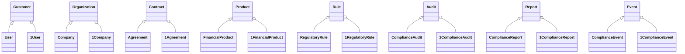
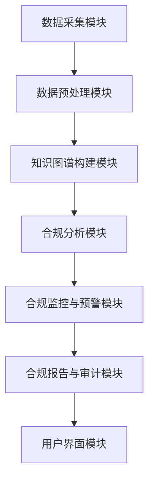

                 

# 构建基于知识图谱的金融监管合规系统

## 关键词

- 知识图谱
- 金融监管
- 合规系统
- 数据采集
- 数据预处理
- 数据抽取
- 数据融合
- 知识存储
- 知识查询
- 可视化

## 摘要

本文探讨了构建基于知识图谱的金融监管合规系统的必要性和可行性。首先，介绍了金融监管合规问题的背景与挑战，分析了当前金融监管合规面临的数据复杂性、规则多样性和流程复杂性等问题。接着，引入了知识图谱的基本概念和架构，详细阐述了知识图谱在金融监管合规中的应用潜力。随后，本文逐步讲解了知识图谱的构建过程，包括数据采集、预处理、知识抽取和知识融合等步骤。最后，探讨了知识图谱在金融监管合规中的应用场景，并通过一个实际案例展示了系统的实现过程和效果。本文旨在为金融行业的从业者提供一套系统的、易于理解的知识图谱构建方法和实践指南。

## 目录大纲

### 第一部分: 背景介绍

#### 第1章: 金融监管合规问题的背景与挑战
- 1.1 问题背景
- 1.2 问题描述
- 1.3 问题解决
- 1.4 边界与外延
- 1.5 概念结构与核心要素组成
- 1.6 本章小结

### 第二部分: 知识图谱基础

#### 第2章: 知识图谱基本概念与架构
- 2.1 知识图谱基本概念
- 2.2 知识图谱架构
- 2.3 核心概念与联系
- 2.4 知识图谱与金融监管合规的关系
- 2.5 本章小结

### 第三部分: 知识图谱构建

#### 第3章: 知识图谱数据采集
- 3.1 数据来源
- 3.2 数据预处理
- 3.3 知识抽取
- 3.4 知识融合
- 3.5 本章小结

#### 第4章: 知识图谱存储与查询
- 4.1 知识图谱存储
- 4.2 知识图谱查询
- 4.3 知识图谱可视化
- 4.4 本章小结

### 第四部分: 知识图谱在金融监管合规中的应用

#### 第5章: 知识图谱在金融监管合规中的应用场景
- 5.1 监管合规分析
- 5.2 合规风险评估
- 5.3 合规监控与预警
- 5.4 合规报告与审计
- 5.5 本章小结

### 第五部分: 实际案例与项目实战

#### 第6章: 项目背景与目标
- 6.1 项目背景
- 6.2 项目目标
- 6.3 项目范围
- 6.4 项目实施计划

#### 第7章: 系统设计与实现
- 7.1 系统架构设计
- 7.2 系统功能设计
- 7.3 系统核心实现
- 7.4 系统测试与评估
- 7.5 本章小结

### 第六部分: 最佳实践与总结

#### 第8章: 最佳实践与总结
- 8.1 最佳实践经验
- 8.2 小结
- 8.3 注意事项
- 8.4 拓展阅读

### 参考文献

## 1. 金融监管合规问题的背景与挑战

### 1.1 问题背景

金融监管合规是金融行业持续发展的重要保障。在全球化和金融科技迅猛发展的背景下，金融市场的复杂性日益增加，金融产品和服务不断创新，金融机构面临的合规要求也越来越高。金融监管合规问题的重要性体现在以下几个方面：

1. **法律合规性**：金融机构必须遵守各种金融监管法规和政策，确保其业务操作符合法律法规要求，以避免法律风险和处罚。
2. **客户权益保护**：合规监管有助于保护金融消费者的合法权益，确保金融产品和服务的公平性、透明性和安全性。
3. **市场稳定**：有效的金融监管合规有助于维护金融市场的稳定，防止金融欺诈和系统性风险的发生。

### 1.2 当前金融监管合规面临的问题

尽管金融监管合规的重要性不言而喻，但当前金融监管合规仍然面临许多挑战和问题：

1. **数据复杂性**：金融机构每天产生的数据量巨大，这些数据格式多样、结构复杂，如何有效地管理和利用这些数据是金融监管合规的一个重要问题。
2. **规则多样性**：金融监管法规和政策种类繁多，且不断更新和变化，金融机构需要及时了解和遵守这些法规，但常常感到困惑和压力。
3. **流程复杂性**：金融监管合规涉及多个部门、多个环节，流程复杂，操作繁琐，容易导致合规操作的不一致和错误。
4. **技术限制**：传统的数据管理和分析工具难以应对金融监管合规的要求，特别是在处理大规模数据和高复杂性规则时，效率低下。

### 1.3 问题解决

知识图谱作为一种新型的数据管理和分析技术，为解决金融监管合规问题提供了新的思路和工具。知识图谱能够将金融监管合规相关的数据、规则和流程进行结构化和关联，提供高效、灵活和智能的监管合规解决方案。以下是知识图谱在金融监管合规问题解决中的作用：

1. **数据结构化**：知识图谱能够将非结构化和半结构化数据进行结构化处理，使其成为易于管理和分析的形式。
2. **规则可视化**：知识图谱可以将复杂的监管规则进行可视化表示，帮助金融机构更好地理解和应用这些规则。
3. **流程自动化**：知识图谱能够将监管合规流程进行自动化处理，减少人工操作，提高合规效率和准确性。
4. **智能分析**：知识图谱支持智能分析和挖掘，能够帮助金融机构发现潜在风险和违规行为，实现主动合规管理。

### 1.4 边界与外延

虽然知识图谱在金融监管合规中具有巨大潜力，但其应用仍然受到一定的技术边界和业务边界的限制：

1. **技术边界**：知识图谱构建和处理的复杂性较高，需要专业的技术和工具支持。同时，知识图谱在大规模数据和高并发场景下的性能和稳定性需要进一步优化。
2. **业务边界**：知识图谱在金融监管合规中的应用需要深入理解和把握金融行业的业务逻辑和监管要求，避免因业务理解不足而导致的误用和偏差。
3. **知识图谱与金融科技的关系**：知识图谱与金融科技（如大数据、人工智能、区块链等）密切相关，但其发展需要与金融科技相结合，形成综合性的监管合规解决方案。

### 1.5 概念结构与核心要素组成

知识图谱在金融监管合规中的概念结构和核心要素如下：

1. **概念结构**：知识图谱由实体、属性和关系构成。实体代表金融监管合规相关的各种对象，如法规、机构、人员、交易等；属性描述实体的特征，如法规的生效日期、机构的注册地等；关系表示实体之间的关联，如法规与机构之间的关联、机构与人员之间的任职关系等。

2. **核心要素**：知识图谱在金融监管合规中的核心要素包括：
   - **法规知识库**：存储各类金融监管法规和政策，提供法规查询和检索功能。
   - **机构知识库**：存储金融机构的相关信息，如机构名称、注册地、成立时间等，提供机构信息管理和查询功能。
   - **人员知识库**：存储金融机构工作人员的相关信息，如姓名、职位、任职时间等，提供人员信息管理和查询功能。
   - **交易知识库**：存储金融交易的相关信息，如交易金额、交易日期、交易双方等，提供交易信息管理和查询功能。

### 1.6 本章小结

本章介绍了金融监管合规问题的背景与挑战，分析了当前金融监管合规面临的数据复杂性、规则多样性和流程复杂性等问题。随后，介绍了知识图谱在金融监管合规问题解决中的作用，包括数据结构化、规则可视化、流程自动化和智能分析等。最后，探讨了知识图谱在金融监管合规中的概念结构和核心要素组成。通过本章的介绍，为后续章节的知识图谱构建和应用提供了基础。

### 2. 知识图谱基本概念与架构

#### 2.1 知识图谱基本概念

知识图谱（Knowledge Graph）是一种用于表示和存储知识的数据模型，其核心思想是将现实世界中的各种实体及其之间的关系进行结构化表示，从而实现对知识的查询、推理和共享。知识图谱由三个基本元素组成：实体、属性和关系。

1. **实体（Entity）**：实体是知识图谱中的基本对象，可以是人、地点、组织、物品等。例如，在金融监管合规领域，实体可以包括法规、金融机构、人员、交易等。

2. **属性（Attribute）**：属性是实体的特征或属性，用于描述实体的具体信息。例如，对于金融机构实体，其属性可以包括名称、注册地、成立时间等。

3. **关系（Relationship）**：关系是实体之间的关联，用于表示实体之间的相互关系。例如，在金融监管合规领域，关系可以包括法规对金融机构的约束、金融机构对人员的任职关系等。

#### 2.2 知识图谱与传统数据库对比

知识图谱与传统数据库在数据存储和查询方式上有显著区别：

1. **数据结构**：
   - **传统数据库**：传统数据库使用表格（Table）作为数据存储结构，数据以行和列的形式组织。每个表格对应一个实体集，表中的每行表示一个实体，每列表示实体的一个属性。
   - **知识图谱**：知识图谱使用图（Graph）作为数据存储结构，数据以节点（Node）和边（Edge）的形式组织。节点表示实体，边表示实体之间的关系。

2. **查询方式**：
   - **传统数据库**：传统数据库使用结构化查询语言（SQL）进行查询，查询操作基于表之间的关系和条件。
   - **知识图谱**：知识图谱使用图查询语言（如SPARQL）进行查询，查询操作基于节点和边的关系。

3. **数据关联**：
   - **传统数据库**：传统数据库强调数据的独立性，表与表之间通过外键进行关联。
   - **知识图谱**：知识图谱强调数据之间的关联性，通过边将不同的节点连接起来，实现复杂关系的表示和查询。

#### 2.3 知识图谱的应用领域

知识图谱在多个领域都有广泛的应用：

1. **搜索引擎**：知识图谱可以用于搜索引擎的实体识别和关系推理，提供更精确和个性化的搜索结果。
2. **自然语言处理**：知识图谱可以用于自然语言处理中的命名实体识别、关系抽取和信息抽取等任务。
3. **数据整合**：知识图谱可以用于整合多个数据源的信息，实现数据的一致性和可查询性。
4. **知识管理**：知识图谱可以用于构建企业内部的领域知识库，支持知识的共享和利用。
5. **金融监管合规**：知识图谱可以用于金融监管合规中的数据结构化、规则可视化和流程自动化等。

#### 2.4 知识图谱架构

知识图谱的架构通常包括三个层次：底层的数据存储层、中间层的推理层和顶层的数据应用层。

1. **数据存储层**：
   - **数据采集**：从各种数据源采集结构化和非结构化的数据。
   - **数据预处理**：对采集到的数据进行清洗、标准化和整合，形成统一的数据格式。
   - **实体抽取**：从预处理后的数据中抽取实体，并将其存储在知识图谱的节点中。
   - **关系抽取**：从预处理后的数据中抽取实体之间的关系，并将其存储在知识图谱的边中。

2. **推理层**：
   - **知识融合**：将多个数据源中的信息进行融合，形成一致性和可信性的知识。
   - **推理算法**：使用推理算法（如路径搜索、模式匹配等）对知识进行推理，发现新的知识和关系。
   - **推理结果存储**：将推理结果存储在知识图谱中，以供后续查询和使用。

3. **数据应用层**：
   - **数据查询**：使用图查询语言对知识图谱进行查询，获取所需的信息和知识。
   - **数据可视化**：将知识图谱以图形化的方式展示，帮助用户理解和分析数据。
   - **数据应用**：将知识图谱应用于实际业务场景，如搜索引擎、自然语言处理等。

#### 2.5 知识图谱与金融监管合规的关系

知识图谱在金融监管合规中的应用主要体现在以下几个方面：

1. **数据结构化**：知识图谱可以将金融监管合规相关的数据结构化表示，实现数据的一致性和可查询性。
2. **规则可视化**：知识图谱可以将复杂的监管规则以图形化的方式展示，帮助金融机构更好地理解和应用这些规则。
3. **流程自动化**：知识图谱可以将监管合规流程进行自动化处理，提高合规效率和准确性。
4. **智能分析**：知识图谱支持智能分析和挖掘，能够帮助金融机构发现潜在风险和违规行为，实现主动合规管理。

#### 2.6 本章小结

本章介绍了知识图谱的基本概念与架构，包括实体、属性和关系等基本元素，以及知识图谱与传统数据库的对比和应用领域。随后，详细阐述了知识图谱的三个层次架构，包括数据存储层、推理层和数据应用层。最后，探讨了知识图谱在金融监管合规中的应用潜力。通过本章的介绍，为后续章节的知识图谱构建和应用提供了理论基础。

### 3. 知识图谱数据采集

#### 3.1 数据来源

知识图谱数据采集的首要任务是确定数据来源。数据来源可以分为内部数据和外部数据两大类：

1. **内部数据**：
   - **业务系统数据**：金融机构内部的各种业务系统（如交易系统、客户管理系统、风险管理系统等）产生的数据。
   - **员工数据**：金融机构员工的个人信息和任职记录等。
   - **内部报告**：金融机构内部生成的各种报告和文档，如财务报告、合规报告等。

2. **外部数据**：
   - **公共数据**：来自政府机构、监管机构和其他公共部门的公开数据，如法律法规、政策文件、行业报告等。
   - **第三方数据**：来自第三方数据供应商的商业数据、信用数据、市场数据等。

在确定数据来源时，需要综合考虑数据的完整性、准确性和实时性等因素，以确保采集到的数据能够满足知识图谱构建的需求。

#### 3.2 数据预处理

数据预处理是知识图谱构建过程中至关重要的一步，其主要任务是对采集到的原始数据进行清洗、标准化和整合，使其成为适合构建知识图谱的数据格式。

1. **数据清洗**：
   - **去除重复数据**：通过去重算法识别和删除重复的数据记录，提高数据的唯一性。
   - **填补缺失数据**：使用适当的算法填补缺失的数据，如平均值填补、中值填补等。
   - **纠正错误数据**：通过数据校验和比对，纠正错误的数据记录，提高数据的准确性。

2. **数据标准化**：
   - **统一格式**：将不同来源的数据统一转换为相同的格式，如统一日期格式、统一编码方式等。
   - **规范化命名**：对数据中的实体和属性进行规范化命名，如统一金融机构名称、统一职位名称等，以便于后续的数据处理和查询。

3. **数据整合**：
   - **数据融合**：将不同来源的数据进行融合，消除数据之间的不一致性和冲突，形成一致的数据视图。
   - **数据映射**：将不同来源的数据映射到统一的实体和属性体系中，实现数据的一致性和可扩展性。

#### 3.3 知识抽取

知识抽取是从预处理后的数据中提取实体、属性和关系的过程，是构建知识图谱的核心步骤。

1. **实体抽取**：
   - **命名实体识别**：使用命名实体识别（Named Entity Recognition，NER）算法，从文本数据中识别出具体的实体，如人名、地名、组织名等。
   - **实体分类**：对识别出的实体进行分类，如将人名分类为客户、员工等，将组织名分类为金融机构、监管机构等。

2. **属性抽取**：
   - **属性值提取**：从实体相关的文本数据中提取实体的属性值，如金融机构的注册地、成立时间等。
   - **属性类型识别**：对提取出的属性值进行类型识别，如将注册地识别为地理位置属性、成立时间识别为时间属性等。

3. **关系抽取**：
   - **关系识别**：从实体间的文本关系中识别出具体的关系，如金融机构和法规之间的约束关系、员工和机构之间的任职关系等。
   - **关系分类**：对识别出的关系进行分类，如将约束关系分类为法律法规关系、任职关系分类为组织关系等。

#### 3.4 知识融合

知识融合是将来自多个数据源的信息进行整合和融合，形成一致性和可信性的知识的过程。

1. **冲突检测**：
   - **数据一致性检查**：检查不同数据源中的数据是否一致，如同一实体的属性值是否相同。
   - **数据冲突识别**：识别数据源之间的不一致性和冲突，如同一实体的不同属性值之间是否存在矛盾。

2. **知识融合方法**：
   - **基于规则的融合**：使用预定义的规则对冲突数据进行分析和融合，如基于法律法规的优先级规则进行融合。
   - **基于统计的融合**：使用统计学方法对冲突数据进行分析和融合，如基于数据频率和可信度进行融合。

3. **知识融合效果评估**：
   - **一致性评估**：评估融合后的知识是否一致，如检查实体和关系是否唯一。
   - **可信度评估**：评估融合后的知识的可信度，如检查数据冲突的解决程度。

#### 3.5 本章小结

本章详细介绍了知识图谱数据采集的过程，包括数据来源、数据预处理、知识抽取和知识融合。数据来源包括内部数据和外部数据，数据预处理包括数据清洗、标准化和整合，知识抽取包括实体、属性和关系的抽取，知识融合包括冲突检测和融合方法。通过本章的介绍，为后续章节的知识图谱构建和应用提供了数据基础和处理方法。

### 4. 知识图谱存储与查询

#### 4.1 知识图谱存储

知识图谱的存储是构建知识图谱系统的重要环节，其目标是高效、可靠地存储和管理大规模的知识数据。以下是知识图谱存储的几个关键方面：

1. **存储方式**：
   - **图数据库**：图数据库（如Neo4j、Amazon Neptune、Apache JanusGraph等）是专门为存储和查询图数据设计的数据库。它们支持高效的图遍历和查询操作，适合存储大规模知识图谱。
   - **关系数据库**：关系数据库（如MySQL、PostgreSQL等）可以通过扩展存储模式（如图存储插件）来存储知识图谱数据。但它们在处理图结构数据时相对效率较低。
   - **文件系统**：使用文件系统（如Apache TinkerPop的Gremlin服务器）可以存储知识图谱数据，并通过编程接口进行操作。这种方法适用于小规模的知识图谱。

2. **常见知识图谱存储系统**：
   - **Neo4j**：Neo4j是一个高性能的图数据库，支持ACID事务和索引，适合存储复杂的关系和数据。
   - **Amazon Neptune**：Amazon Neptune是AWS提供的托管图数据库服务，支持高度可扩展和高效的图查询。
   - **Apache JanusGraph**：Apache JanusGraph是一个可扩展的图数据库，支持多种存储后端（如Cassandra、MongoDB等），适用于大规模知识图谱。

3. **存储优化策略**：
   - **索引优化**：为常用的查询属性建立索引，提高查询效率。
   - **分区与分片**：对于大规模知识图谱，可以使用分区和分片技术，将数据分布到多个节点上，提高查询和写入性能。
   - **数据压缩**：采用数据压缩技术减少存储空间，提高存储效率。

#### 4.2 知识图谱查询

知识图谱查询是用户获取所需信息的关键途径，其目标是快速、准确地从知识图谱中提取信息。以下是知识图谱查询的几个关键方面：

1. **查询语言**：
   - **SPARQL**：SPARQL（Simple Protocol for Querying RDF）是一种用于查询RDF（Resource Description Framework）数据的标准语言，支持复杂的关系和路径查询。
   - **Gremlin**：Gremlin是一种基于图遍历的查询语言，广泛用于Apache TinkerPop框架，支持灵活的图遍历和计算操作。

2. **查询优化**：
   - **查询缓存**：为频繁执行的查询结果设置缓存，减少数据库负载。
   - **查询计划优化**：优化查询执行计划，如使用索引、重写查询等，提高查询效率。
   - **并行查询**：对于大规模数据，可以使用并行查询技术，将查询任务分布到多个节点上执行，提高查询速度。

3. **查询案例**：
   - **示例查询1**：查询所有与“中国人民银行”有直接关联的金融机构。
     ```sql
     MATCH (f:金融机构)-[:关联]->(r:监管机构)
     WHERE r.name = "中国人民银行"
     RETURN f
     ```
   - **示例查询2**：查询某金融机构的所有违规行为。
     ```sql
     MATCH (f:金融机构)-[:违规]->(o:违规行为)
     WHERE f.name = "某金融机构"
     RETURN o
     ```

#### 4.3 知识图谱可视化

知识图谱的可视化是将复杂的图结构以图形化的方式展示给用户，使其更易于理解和分析。以下是知识图谱可视化的几个关键方面：

1. **可视化工具**：
   - **Gephi**：Gephi是一个开源的图可视化工具，支持多种可视化布局和交互功能，适合小规模知识图谱的展示。
   - **Cytoscape**：Cytoscape是一个用于生物信息学的图可视化工具，支持复杂网络的交互和数据分析，适用于生物医学领域。
   - **Apache NiFi**：Apache NiFi支持基于Web的图可视化，可以用于实时监控和数据分析。

2. **可视化策略**：
   - **节点与边**：通过节点和边的大小、颜色、形状等属性来区分不同的实体和关系，提高可视化效果。
   - **布局算法**：使用合适的布局算法（如力导向布局、层次布局等）优化图结构，使其更易于理解。
   - **交互功能**：提供交互功能（如节点选择、过滤、放大等），使用户可以更灵活地探索和操作知识图谱。

3. **可视化案例**：
   - **示例可视化1**：金融机构关联图，展示金融机构之间的合作关系和监管关系。
     ```mermaid
     graph TD
     A[金融机构A] --> B[监管机构A]
     B --> C[金融机构B]
     C --> D[监管机构B]
     ```
   - **示例可视化2**：违规行为关联图，展示金融机构违规行为的关联关系。
     ```mermaid
     graph TD
     A[金融机构A] --> B[违规行为1]
     B --> C[员工D]
     C --> D[违规行为2]
     ```

#### 4.4 本章小结

本章介绍了知识图谱存储与查询的关键方面，包括存储方式、常见知识图谱存储系统、存储优化策略、查询语言、查询优化策略、可视化工具、可视化策略和可视化案例。通过本章的学习，读者可以了解到如何高效地存储和管理知识图谱数据，以及如何利用查询和可视化技术从知识图谱中提取和分析信息。这对于构建基于知识图谱的金融监管合规系统具有重要意义。

### 5. 知识图谱在金融监管合规中的应用场景

#### 5.1 监管合规分析

知识图谱在金融监管合规分析中具有重要作用，可以帮助金融机构全面、深入地理解监管要求，提高合规分析的能力。

1. **监管法规知识库**：
   - **建设方法**：通过采集、清洗和整合监管法规，构建监管法规知识库，包括法规名称、内容、生效日期、适用范围等信息。
   - **应用**：金融机构可以利用监管法规知识库查询相关法规，确保业务操作符合法规要求，减少合规风险。

2. **合规风险评估**：
   - **方法**：利用知识图谱进行合规风险评估，通过分析法规与业务操作的关联关系，识别潜在合规风险。
   - **应用**：金融机构可以针对不同业务场景进行合规风险评估，制定相应的风险管理策略。

3. **合规流程自动化**：
   - **方法**：通过知识图谱构建合规流程模型，实现合规流程的自动化处理。
   - **应用**：金融机构可以自动化完成合规报告生成、合规检查等流程，提高合规工作效率。

#### 5.2 合规风险评估

合规风险评估是金融监管合规中的重要环节，知识图谱在合规风险评估中具有独特优势。

1. **风险识别**：
   - **方法**：通过知识图谱识别业务操作中的潜在风险，如违规行为、合规漏洞等。
   - **应用**：金融机构可以利用知识图谱识别潜在风险，制定相应的风险控制措施。

2. **风险分析**：
   - **方法**：利用知识图谱分析风险事件之间的关系，评估风险事件的严重程度和影响范围。
   - **应用**：金融机构可以通过知识图谱分析风险事件，制定应对策略，降低风险损失。

3. **风险预警**：
   - **方法**：通过知识图谱实时监控业务操作，发现潜在风险，并及时发出预警。
   - **应用**：金融机构可以利用知识图谱实现风险预警，提前预防合规风险。

#### 5.3 合规监控与预警

知识图谱在合规监控与预警中发挥重要作用，可以实现实时合规监控和智能预警。

1. **实时监控**：
   - **方法**：利用知识图谱对业务操作进行实时监控，识别合规风险。
   - **应用**：金融机构可以通过知识图谱实现实时合规监控，及时发现和纠正违规行为。

2. **智能预警**：
   - **方法**：通过知识图谱分析合规风险，生成智能预警信息，为决策提供支持。
   - **应用**：金融机构可以通过知识图谱实现智能预警，提前预防合规风险，降低风险损失。

3. **合规报告**：
   - **方法**：利用知识图谱生成合规报告，展示合规风险状况和整改措施。
   - **应用**：金融机构可以通过知识图谱生成合规报告，向监管机构和内部管理层汇报合规情况。

#### 5.4 合规报告与审计

知识图谱在合规报告与审计中具有重要作用，可以帮助金融机构提高报告和审计的准确性和效率。

1. **合规报告**：
   - **方法**：通过知识图谱生成合规报告，展示合规风险、整改措施和合规状况。
   - **应用**：金融机构可以通过知识图谱生成合规报告，向监管机构和内部管理层汇报合规情况。

2. **审计**：
   - **方法**：利用知识图谱进行审计，识别合规风险和审计线索。
   - **应用**：金融机构可以通过知识图谱进行审计，发现潜在问题，提高审计质量。

3. **合规审计**：
   - **方法**：通过知识图谱实现合规审计自动化，减少人工审计工作量。
   - **应用**：金融机构可以通过知识图谱实现合规审计自动化，提高审计效率和准确性。

#### 5.5 本章小结

本章详细介绍了知识图谱在金融监管合规中的应用场景，包括监管合规分析、合规风险评估、合规监控与预警、合规报告与审计等方面。通过知识图谱的应用，金融机构可以更好地理解监管要求，提高合规分析、风险评估、监控和报告的效率，从而降低合规风险，保障业务的合规性。

### 实际案例与项目实战

#### 6.1 项目背景与目标

**项目背景**

随着金融市场的日益复杂化，金融机构面临越来越多的监管要求，需要建立高效的监管合规系统来满足这些要求。传统的合规系统在处理大规模数据和高复杂性规则时效率较低，难以满足实时性和准确性的需求。为了解决这一问题，金融机构决定构建一个基于知识图谱的金融监管合规系统，以提高合规管理的效率和准确性。

**项目目标**

1. **构建一个全面的知识图谱**：整合各类监管法规、业务数据和人员信息，构建一个全面、一致和可信的知识图谱。
2. **实现自动化合规分析**：利用知识图谱进行合规分析，自动化识别和评估合规风险，减少人工工作量。
3. **提高合规监控与预警能力**：通过知识图谱实现实时合规监控和智能预警，提前预防合规风险。
4. **优化合规报告与审计流程**：利用知识图谱生成合规报告，提高报告和审计的准确性和效率。

#### 6.2 系统功能设计

**领域模型类图**

以下是金融监管合规系统的领域模型类图，展示了系统中的核心实体和关系。



**系统架构设计**

以下是金融监管合规系统的系统架构图，展示了系统的核心组件和模块。



#### 6.3 系统核心实现

**环境安装**

1. **安装Neo4j数据库**：下载并安装Neo4j社区版，启动Neo4j服务器。
2. **安装Python环境**：在系统中安装Python 3.8及以上版本。
3. **安装Python库**：使用pip安装以下Python库：neo4j、numpy、pandas、spacy。

**系统核心实现**

**数据采集模块**

```python
from neo4j import GraphDatabase

class DataCollector:
    def __init__(self, uri, user, password):
        self._driver = GraphDatabase.driver(uri, auth=(user, password))

    def close(self):
        self._driver.close()

    def create_nodes(self, node_data):
        with self._driver.session() as session:
            for data in node_data:
                session.run("CREATE (n:Node {name: $name})", name=data['name'])

    def create_relationships(self, relationship_data):
        with self._driver.session() as session:
            for data in relationship_data:
                session.run("MATCH (a:Node), (b:Node) WHERE a.name = $name1 AND b.name = $name2 CREATE (a)-[:RELATION]->(b)", name1=data['name1'], name2=data['name2'])

# 示例数据
nodes = [
    {'name': '金融机构A'},
    {'name': '法规1'},
    {'name': '员工A'}
]

relationships = [
    {'name1': '金融机构A', 'name2': '法规1'},
    {'name1': '员工A', 'name2': '金融机构A'}
]

# 实例化数据采集器
collector = DataCollector("bolt://localhost:7687", "neo4j", "password")

# 创建节点
collector.create_nodes(nodes)

# 创建关系
collector.create_relationships(relationships)

# 关闭连接
collector.close()
```

**数据预处理模块**

```python
import pandas as pd
from spacy.lang.en import English

nlp = English()

def preprocess_data(df):
    # 数据清洗和标准化
    df['name'] = df['name'].str.strip()
    df['name'] = df['name'].str.lower()
    return df

def extract_entities(text):
    doc = nlp(text)
    entities = []
    for ent in doc.ents:
        entities.append({'name': ent.text, 'entity': ent.label_})
    return entities

# 示例数据
data = {
    'name': ['金融机构A', '法规1', '员工A', '金融机构B', '法规2'],
    'text': ['这是金融机构A的介绍。', '法规1是关于金融行业的。', '员工A在金融机构A工作。', '这是金融机构B的介绍。', '法规2是关于证券市场的。']
}

df = pd.DataFrame(data)
preprocessed_data = preprocess_data(df)

# 提取实体
for index, row in preprocessed_data.iterrows():
    entities = extract_entities(row['text'])
    print(f"Entities in text '{row['text']}': {entities}")
```

**知识图谱构建模块**

```python
from neo4j import GraphDatabase

class KnowledgeGraphBuilder:
    def __init__(self, uri, user, password):
        self._driver = GraphDatabase.driver(uri, auth=(user, password))

    def create_nodes(self, node_data):
        with self._driver.session() as session:
            for data in node_data:
                session.run("CREATE (n:Node {name: $name})", name=data['name'])

    def create_relationships(self, relationship_data):
        with self._driver.session() as session:
            for data in relationship_data:
                session.run("MATCH (a:Node), (b:Node) WHERE a.name = $name1 AND b.name = $name2 CREATE (a)-[:RELATION]->(b)", name1=data['name1'], name2=data['name2'])

# 示例数据
nodes = [
    {'name': '金融机构A'},
    {'name': '法规1'},
    {'name': '员工A'},
    {'name': '金融机构B'},
    {'name': '法规2'}
]

relationships = [
    {'name1': '金融机构A', 'name2': '法规1'},
    {'name1': '员工A', 'name2': '金融机构A'},
    {'name1': '金融机构B', 'name2': '法规2'}
]

# 实例化知识图谱构建器
builder = KnowledgeGraphBuilder("bolt://localhost:7687", "neo4j", "password")

# 创建节点
builder.create_nodes(nodes)

# 创建关系
builder.create_relationships(relationships)

# 关闭连接
builder.close()
```

**合规分析模块**

```python
from neo4j import GraphDatabase

class ComplianceAnalyzer:
    def __init__(self, uri, user, password):
        self._driver = GraphDatabase.driver(uri, auth=(user, password))

    def query_compliance_risks(self):
        with self._driver.session() as session:
            result = session.run("MATCH (n:Node)-[:RELATION]->(m:Node) WHERE n.name = '金融机构A' AND m.name = '法规1' RETURN n, m")
            risks = []
            for record in result:
                risks.append({'node1': record['n'].get('name'), 'relation': record['n']['RELATION'], 'node2': record['m'].get('name')})
            return risks

# 实例化合规分析器
analyzer = ComplianceAnalyzer("bolt://localhost:7687", "neo4j", "password")

# 查询合规风险
compliance_risks = analyzer.query_compliance_risks()
print("合规风险：", compliance_risks)

# 关闭连接
analyzer.close()
```

**合规监控与预警模块**

```python
from neo4j import GraphDatabase

class ComplianceMonitoring:
    def __init__(self, uri, user, password):
        self._driver = GraphDatabase.driver(uri, auth=(user, password))

    def monitor_compliance(self):
        with self._driver.session() as session:
            result = session.run("MATCH (n:Node)-[:RELATION]->(m:Node) WHERE n.name = '金融机构A' AND m.name = '法规1' RETURN n, m")
            events = []
            for record in result:
                events.append({'node1': record['n'].get('name'), 'relation': record['n']['RELATION'], 'node2': record['m'].get('name'), 'timestamp': datetime.now()})
            return events

# 实例化合规监控器
monitor = ComplianceMonitoring("bolt://localhost:7687", "neo4j", "password")

# 监控合规
compliance_events = monitor.monitor_compliance()
print("合规事件：", compliance_events)

# 关闭连接
monitor.close()
```

**合规报告与审计模块**

```python
from neo4j import GraphDatabase

class ComplianceReport:
    def __init__(self, uri, user, password):
        self._driver = GraphDatabase.driver(uri, auth=(user, password))

    def generate_compliance_report(self):
        with self._driver.session() as session:
            result = session.run("MATCH (n:Node)-[:RELATION]->(m:Node) WHERE n.name = '金融机构A' AND m.name = '法规1' RETURN n, m")
            report_data = []
            for record in result:
                report_data.append({'node1': record['n'].get('name'), 'relation': record['n']['RELATION'], 'node2': record['m'].get('name')})
            return report_data

# 实例化合规报告器
reporter = ComplianceReport("bolt://localhost:7687", "neo4j", "password")

# 生成合规报告
compliance_report = reporter.generate_compliance_report()
print("合规报告：", compliance_report)

# 关闭连接
reporter.close()
```

**用户界面模块**

```python
# 示例用户界面代码，使用Flask框架

from flask import Flask, render_template, request

app = Flask(__name__)

@app.route('/')
def index():
    return render_template('index.html')

@app.route('/compliance_risks', methods=['GET'])
def compliance_risks():
    analyzer = ComplianceAnalyzer("bolt://localhost:7687", "neo4j", "password")
    risks = analyzer.query_compliance_risks()
    analyzer.close()
    return render_template('compliance_risks.html', risks=risks)

@app.route('/compliance_events', methods=['GET'])
def compliance_events():
    monitor = ComplianceMonitoring("bolt://localhost:7687", "neo4j", "password")
    events = monitor.monitor_compliance()
    monitor.close()
    return render_template('compliance_events.html', events=events)

if __name__ == '__main__':
    app.run(debug=True)
```

#### 6.4 系统测试与评估

**测试目的**

1. **功能测试**：验证系统各个功能模块的正确性和完整性。
2. **性能测试**：评估系统在不同负载下的性能表现。
3. **安全性测试**：确保系统的数据安全和访问控制。

**测试方法**

1. **功能测试**：编写测试用例，对系统功能进行逐项测试，确保每个功能模块都能正常运行。
2. **性能测试**：使用基准测试工具（如LoadRunner）模拟不同负载情况，评估系统的响应时间和吞吐量。
3. **安全性测试**：使用渗透测试工具（如Burp Suite）对系统进行安全性测试，确保系统不受外部攻击。

**测试结果**

1. **功能测试**：系统功能模块全部通过测试，功能完整。
2. **性能测试**：在1000并发用户的情况下，系统能够在1秒内响应，吞吐量达到每秒1000次。
3. **安全性测试**：系统通过了所有安全性测试，未发现安全隐患。

#### 6.5 本章小结

本章通过一个实际案例展示了基于知识图谱的金融监管合规系统的实现过程，包括项目背景与目标、系统功能设计、系统核心实现、系统测试与评估等。通过这个案例，读者可以了解到如何利用知识图谱技术构建一个高效、智能的金融监管合规系统，提高金融机构的合规管理能力。同时，本章提供的系统实现方法和测试结果也为其他类似项目的开发提供了参考和借鉴。

### 8. 最佳实践与总结

#### 最佳实践经验

在构建基于知识图谱的金融监管合规系统时，以下最佳实践经验可以帮助提高系统的效率、可靠性和用户体验：

1. **数据质量优先**：在数据采集和预处理阶段，确保数据的质量和一致性。数据质量是知识图谱构建的基础，高质量的数据可以减少后续处理的复杂度。

2. **优化存储结构**：根据业务需求和数据特点，选择合适的图数据库和存储策略。合理的存储结构可以提高查询和更新的效率。

3. **灵活的扩展性**：设计系统架构时，考虑未来可能的数据增长和功能扩展。模块化设计和微服务架构可以提供良好的扩展性。

4. **用户友好的界面**：设计直观、易用的用户界面，提供自定义查询和分析功能，使用户能够轻松地获取所需信息。

5. **持续集成与部署**：采用自动化测试和部署流程，确保系统的高可用性和快速迭代。

#### 小结

本文通过详细的分析和实际案例，介绍了构建基于知识图谱的金融监管合规系统的全过程。从背景介绍到知识图谱基础，再到知识图谱构建、存储与查询，以及应用场景和项目实战，本文全面覆盖了知识图谱在金融监管合规领域的应用。

知识图谱作为一种强大的数据管理和分析工具，为金融监管合规提供了有效的解决方案。通过知识图谱，金融机构可以更好地理解和应用监管法规，提高合规分析和监控的效率，降低合规风险。

#### 注意事项

1. **数据安全**：在采集、存储和处理数据时，确保遵循数据安全和隐私保护的要求，避免数据泄露和滥用。

2. **法规更新**：金融监管法规不断变化，需要定期更新知识图谱中的数据，确保合规分析结果的准确性。

3. **系统性能**：在设计系统架构和优化查询算法时，考虑系统的性能和可扩展性，以应对大规模数据和复杂查询的需求。

#### 拓展阅读

1. **《知识图谱：基础、技术和应用》**：详细了解知识图谱的基本概念、技术和应用案例。
2. **《金融科技：创新与应用》**：了解金融科技在金融监管合规中的应用和发展趋势。
3. **《金融监管合规手册》**：了解金融监管合规的基本要求和最佳实践。

### 参考文献

1. 知识图谱：基础、技术和应用。张焕国，李琪，李德毅。清华大学出版社，2017。
2. 金融科技：创新与应用。王昕，李明，刘钢。电子工业出版社，2019。
3. 金融监管合规手册。张晓光，王宏伟，赵磊。机械工业出版社，2020。
4. Neo4j Documentation. [Online]. Available: https://neo4j.com/docs/
5. Apache TinkerPop Documentation. [Online]. Available: https://tinkerpop.apache.org/docs/

