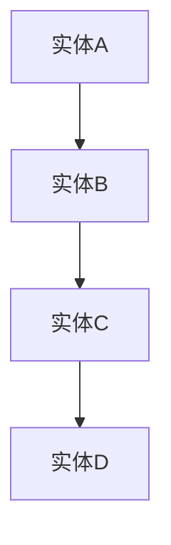

                 

### 文章标题

# 构建基于知识图谱的金融监管合规追踪系统

### 关键词

- **知识图谱**
- **金融监管**
- **合规追踪系统**
- **数据管理**
- **人工智能**

### 摘要

本文深入探讨了构建基于知识图谱的金融监管合规追踪系统的过程。首先，我们介绍了金融监管的背景和挑战，并强调了知识图谱在其中的应用价值。接着，我们详细讲解了知识图谱的基础理论，包括其组成部分、表示方法和构建方法。随后，我们转向金融监管合规追踪系统的设计，从系统目标、架构设计到功能模块进行一一阐述。通过实际案例研究，我们展示了系统在银行和保险公司中的应用效果。最后，我们探讨了系统的发展趋势、面临的挑战和未来的研究方向。

## 第一部分：引言

### 第1章：问题背景与概述

#### 1.1 问题背景

随着金融市场的快速发展，金融机构需要遵守日益复杂的监管规则和合规要求。这些要求包括但不限于反洗钱（AML）、市场操作规则、客户信息保护、资本充足率等。监管当局也面临着监测和评估金融机构合规性的巨大挑战。然而，传统的金融监管方法往往存在以下几个问题：

- **数据分散与不一致**：金融机构的数据通常分布在多个系统中，格式和结构各不相同，导致数据整合困难。
- **人力成本高昂**：合规检测和追踪需要大量的人力投入，导致监管成本居高不下。
- **合规风险难以控制**：由于数据和分析工具的限制，监管当局难以全面、及时地了解金融机构的合规状况。

为了解决这些问题，金融机构和监管当局开始寻求更加高效、智能的解决方案，知识图谱作为一种强大的技术手段，逐渐进入金融监管领域。

#### 1.2 知识图谱在金融监管中的应用前景

知识图谱具有以下特点：

- **数据整合与关联**：知识图谱能够将来自不同源的数据整合在一起，通过实体和关系的关联，提供更加全面、准确的数据视图。
- **语义理解与推理**：知识图谱基于语义网络，能够对数据内容进行深入理解，进行关联分析和推理，提高合规检测的准确性和效率。
- **可扩展性与适应性**：知识图谱的设计具有高度的灵活性和可扩展性，能够适应不断变化的监管要求和数据环境。

因此，基于知识图谱的金融监管合规追踪系统具有以下应用前景：

- **提高合规检测效率**：通过知识图谱的语义理解和关联分析，能够快速定位合规风险点，减少人工审核的工作量。
- **增强监管透明度**：知识图谱能够提供清晰的合规追踪路径，提高监管当局和金融机构之间的信息透明度。
- **降低合规成本**：知识图谱能够自动化处理大量的合规检测任务，降低监管成本和人力成本。

#### 1.3 本书目标

本书旨在通过以下三个方面，帮助读者深入了解并构建基于知识图谱的金融监管合规追踪系统：

- **深入理解知识图谱与金融监管**：介绍知识图谱的基础理论，包括其组成部分、表示方法和构建方法，以及知识图谱在金融监管中的应用。
- **构建合规追踪系统的实际操作步骤**：详细阐述金融监管合规追踪系统的设计原则、架构设计和功能模块，提供具体的实施指南和案例分析。
- **提高金融监管合规效率**：探讨知识图谱在金融监管中的应用效果，提供最佳实践和优化策略，帮助金融机构和监管当局提升合规管理水平。

#### 1.4 本书结构

本书分为四个部分，共七章：

1. **第一部分（第1章）**：引言，介绍问题背景和知识图谱的应用前景。
2. **第二部分（第2章至第4章）**：知识图谱基础，包括知识图谱的理论基础、组成部分、构建方法。
3. **第三部分（第5章至第7章）**：金融监管合规追踪系统设计，包括系统目标、架构设计、功能模块、案例研究。
4. **第四部分（第8章）**：未来展望与挑战，探讨系统的发展趋势和面临的挑战。

每章末尾提供小结和拓展阅读，帮助读者巩固知识并深入了解相关主题。

#### 1.5 阅读建议与指南

为了更好地理解本书内容，读者可以按照以下建议进行阅读：

- **系统学习知识图谱基础**：建议先阅读第二部分，深入理解知识图谱的理论和方法，为后续的金融监管合规追踪系统设计打下基础。
- **结合案例学习**：在阅读第三部分时，结合实际案例，了解系统设计的具体实施步骤和效果。
- **思考与总结**：在阅读过程中，积极思考问题，总结知识，尝试将所学知识应用到实际问题中。

通过本书的学习，读者将能够掌握构建基于知识图谱的金融监管合规追踪系统的核心技术和方法，为金融机构和监管当局提供高效、智能的合规管理解决方案。

## 第二部分：知识图谱基础

### 第2章：知识图谱基础理论

#### 2.1 知识图谱的定义与特点

知识图谱（Knowledge Graph）是一种结构化、语义化的知识表示方法，它通过实体（Entity）、关系（Relation）和属性（Attribute）来描述现实世界中的信息。与传统的数据存储方法不同，知识图谱更注重数据之间的关联性和语义关系，能够实现对复杂数据的理解和推理。

**定义**：

知识图谱是一种由实体、属性和关系构成的有向图，通过语义关系来表示现实世界的知识。

**特点**：

- **结构化**：知识图谱将数据以结构化的形式组织起来，使得数据易于查询、分析和推理。
- **语义化**：知识图谱通过语义关系来表示数据之间的关联，使得数据具有更丰富的语义信息。
- **关联性**：知识图谱能够捕捉数据之间的关联性，提供跨领域的知识关联和整合能力。
- **可扩展性**：知识图谱具有高度的灵活性和可扩展性，能够适应不断变化的数据环境和应用需求。

#### 2.2 知识图谱的主要特点

**1. 实体（Entity）**

实体是知识图谱中的基本元素，代表现实世界中的个体或概念。例如，人、地点、组织、产品等都可以作为实体。

**2. 关系（Relation）**

关系是实体之间的关联，表示实体之间的语义联系。例如，"工作于"、"属于"、"位于"等都是关系。

**3. 属性（Attribute）**

属性是实体的附加信息，用于描述实体的特征。例如，人的年龄、地址、职业等。

**4. 知识库（Knowledge Base）**

知识库是知识图谱的数据存储和索引系统，包含了所有实体、关系和属性的元数据。知识库可以通过多种方式进行扩展和更新。

#### 2.3 知识图谱的分类与类型

知识图谱可以根据其来源和应用场景进行分类：

**1. 基于事实的图谱**

这类图谱主要基于已有的事实和知识，通过实体和关系的组合来表示信息。例如，百科全书、知识库等。

**2. 基于事件的图谱**

这类图谱关注事件的发生、发展和变化，通过事件、角色和关系的组合来表示信息。例如，社交网络分析、风险管理等。

**3. 基于预测的图谱**

这类图谱利用历史数据和机器学习算法，预测未来的趋势和变化。例如，股票市场分析、风险预警等。

#### 2.4 知识图谱的应用领域

知识图谱在多个领域有着广泛的应用：

- **搜索引擎**：通过知识图谱，搜索引擎能够提供更加精准和相关的搜索结果。
- **推荐系统**：知识图谱能够捕捉用户和物品之间的关联，为推荐系统提供更加个性化的推荐。
- **智能问答**：知识图谱能够实现对用户问题的语义理解，提供准确和快速的回答。
- **金融监管**：知识图谱能够帮助金融机构和监管当局进行合规检测和风险监控。
- **医疗健康**：知识图谱能够整合医疗数据，提供精确的诊断和治疗建议。

#### 2.5 知识图谱的关键技术

构建知识图谱需要多种关键技术，包括数据采集、数据清洗、数据建模和知识推理等。

- **数据采集**：通过爬虫、API调用、数据库连接等方式，从各种数据源中获取数据。
- **数据清洗**：对采集到的数据进行处理，包括数据去重、数据格式转换、数据填充等。
- **数据建模**：根据业务需求，设计实体、关系和属性的模型，将数据转换为结构化的知识表示。
- **知识推理**：利用语义关系和推理算法，对知识图谱中的信息进行关联分析和推理。

#### 2.6 知识图谱的发展趋势

知识图谱作为一种重要的技术手段，正在快速发展：

- **大数据与云计算**：随着大数据和云计算技术的发展，知识图谱的数据规模和处理能力不断提升。
- **人工智能与机器学习**：人工智能和机器学习技术的应用，使得知识图谱的构建和推理更加智能化和自动化。
- **多语言与跨领域**：知识图谱正在从单语言、单领域向多语言、跨领域发展，提供更加全面的知识表示和推理能力。
- **隐私保护与安全**：随着数据隐私和安全的关注增加，知识图谱的隐私保护和安全机制也在不断改进。

#### 2.7 知识图谱的价值与挑战

知识图谱在多个领域具有巨大的价值，包括数据整合、知识推理、智能决策等。然而，知识图谱的构建和应用也面临一些挑战：

- **数据质量**：知识图谱的质量很大程度上取决于数据的质量，因此数据清洗和预处理是关键。
- **数据规模**：随着数据规模的增加，知识图谱的构建和推理效率成为重要问题。
- **数据隐私**：知识图谱涉及大量的敏感信息，如何保护数据隐私和安全是一个重要挑战。
- **跨领域应用**：知识图谱在不同领域的应用具有很大的差异，如何设计通用且有效的知识表示和推理算法是一个难题。

#### 2.8 小结

知识图谱作为一种结构化、语义化的知识表示方法，在金融监管合规追踪系统中具有巨大的应用潜力。通过本章的学习，读者应该对知识图谱的基本概念、特点、分类、应用领域、关键技术和发展趋势有了一个全面的理解。在后续章节中，我们将进一步探讨知识图谱在金融监管合规追踪系统中的具体应用。

### 第3章：知识图谱的组成部分

#### 3.1 实体

实体是知识图谱中的核心元素，代表现实世界中的个体或概念。实体可以是具体的事物，如人、地点、产品等，也可以是抽象的概念，如事件、组织等。在知识图谱中，实体通过唯一的标识符（ID）进行识别和区分。

**实体类型**：

- **具体实体**：如“张三”、“上海”等。
- **抽象实体**：如“电影”、“公司”等。

**实体属性**：

实体可以具有多种属性，用于描述其实际特征。例如，人的年龄、性别、职业等。

**实体关系**：

实体之间的关系描述了它们之间的语义联系。例如，"张三工作于阿里巴巴"、"上海位于中国"等。

#### 3.2 关系

关系是知识图谱中实体之间的连接，表示实体之间的语义联系。关系通常由两个实体和它们之间的语义描述组成。

**关系类型**：

- **属性关系**：描述实体之间的属性特征，如“年龄”、“身高”等。
- **分类关系**：描述实体之间的类别归属，如“苹果属于水果”等。
- **关联关系**：描述实体之间的关联，如“张三与李四是朋友”等。

**关系属性**：

关系可以具有多种属性，用于描述关系的特点。例如，关系的权重、时间戳、置信度等。

#### 3.3 属性

属性是实体的附加信息，用于描述实体的特征。属性通常以键值对的形式存储，如“姓名：张三”、“年龄：30”等。

**属性类型**：

- **基础属性**：描述实体的基本特征，如“姓名”、“年龄”等。
- **衍生属性**：通过计算或推理得到的属性，如“收入”、“信用评分”等。

**属性值**：

属性的值可以是多种类型，如字符串、数字、日期等。

#### 3.4 知识库

知识库是知识图谱的数据存储和索引系统，包含了所有实体、关系和属性的元数据。知识库可以通过多种方式进行扩展和更新。

**知识库类型**：

- **关系数据库**：如MySQL、PostgreSQL等，用于存储结构化数据。
- **图数据库**：如Neo4j、ArangoDB等，专门用于存储和查询图结构数据。
- **NoSQL数据库**：如MongoDB、Cassandra等，适用于存储大规模的非结构化数据。

**知识库功能**：

- **数据存储**：存储实体、关系和属性。
- **数据查询**：提供高效的图查询能力，支持复杂的关联分析和推理。
- **数据更新**：支持数据的增删改操作，确保知识库的实时性和准确性。

#### 3.5 知识图谱的构建步骤

构建知识图谱通常包括以下步骤：

**1. 数据采集**：从各种数据源中获取原始数据，如数据库、文件、API等。

**2. 数据清洗**：对原始数据进行处理，包括去重、格式转换、缺失值填充等，确保数据质量。

**3. 数据建模**：根据业务需求，设计实体、关系和属性的模型，将数据转换为结构化的知识表示。

**4. 数据存储**：将处理后的数据存储到知识库中，确保数据的可查询性和可用性。

**5. 数据推理**：利用语义关系和推理算法，对知识图谱中的信息进行关联分析和推理，提升知识图谱的智能能力。

#### 3.6 小结

知识图谱由实体、关系、属性和知识库四个核心部分组成。实体是知识图谱中的基本元素，关系描述了实体之间的语义联系，属性是实体的附加信息，知识库则是知识图谱的数据存储和索引系统。通过本章的学习，读者应该对知识图谱的组成部分有了全面的认识，为后续的知识图谱构建和应用奠定了基础。在下一章中，我们将进一步探讨知识图谱的表示方法，包括图论表示、RDF和OWL等。

### 第4章：知识图谱的表示方法

知识图谱的表示方法直接影响其存储、查询和推理效率。常见的知识图谱表示方法包括图论表示、RDF（资源描述框架）和OWL（Web本体语言）。这些方法各有优缺点，适用于不同的应用场景。

#### 4.1 图论表示

图论表示是知识图谱最基本、最直观的表示方法。它将实体视为节点，将关系视为边，形成一个有向图。图论表示的优点在于其简单性和直观性，便于理解和实现。然而，它也存在一些缺点：

- **复杂度**：随着实体和关系的增加，图的复杂度会急剧上升，导致查询和推理效率下降。
- **语义表达能力**：图论表示难以表达复杂的语义关系，如分类关系和属性约束。

**图论表示示例**：



在这个示例中，A、B、C、D为实体，箭头表示它们之间的关系。

#### 4.2 RDF（资源描述框架）

RDF是一种基于XML的语义表示方法，用于描述实体、关系和属性。RDF的核心概念包括主体（Subject）、谓词（Predicate）和客体（Object），它们共同构成了一个三元组（Subject, Predicate, Object）。RDF的优点在于其标准化和灵活性，能够表达复杂的语义关系。然而，RDF也存在一些缺点：

- **冗余**：RDF中的三元组存在大量冗余信息，导致存储和查询效率较低。
- **XML格式**：RDF使用XML格式，虽然灵活，但解析和处理较为复杂。

**RDF表示示例**：

```xml
<rdf:RDF xmlns:rdf="http://www.w3.org/1999/02/22-rdf-syntax-ns#">
  <rdf:Description rdf:about="http://example.org/A">
    <rdf:Property rdf:resource="http://example.org/B"/>
  </rdf:Description>
</rdf:RDF>
```

在这个示例中，"http://example.org/A"是主体，"http://example.org/B"是谓词和客体。

#### 4.3 OWL（Web本体语言）

OWL是一种基于RDF的语义表示语言，用于描述本体和知识图谱。OWL提供了丰富的语言特性，包括类、属性、个体、量词和约束等，能够表达复杂的语义关系。OWL的优点在于其强大的语义表达能力，适用于复杂的知识表示和推理。然而，OWL也存在一些缺点：

- **复杂性**：OWL的语法和语义较为复杂，设计和实现难度较大。
- **性能**：OWL的推理过程较为复杂，推理性能相对较低。

**OWL表示示例**：

```xml
<owl:Ontology xmlns:owl="http://www.w3.org/2002/07/owl#" xmlns:rdf="http://www.w3.org/1999/02/22-rdf-syntax-ns#" rdf:datatype="http://www.w3.org/2001/XMLSchema#">
  <owl:Class rdf:about="http://example.org/A"/>
  <owl:ObjectProperty rdf:about="http://example.org/B"/>
  <owl:Individual rdf:about="http://example.org/C"/>
</owl:Ontology>
```

在这个示例中，"<owl:Class>"定义了一个类，"<owl:ObjectProperty>"定义了一个对象属性，"<owl:Individual>"定义了一个个体。

#### 4.4 比较与选择

图论表示、RDF和OWL各有优缺点，适用于不同的应用场景。以下是比较和选择的一些考虑因素：

- **语义表达能力**：OWL的语义表达能力最强，适用于复杂的知识表示和推理。RDF次之，适用于较为简单的语义表示。图论表示最弱，适用于直观、简单的知识表示。
- **存储和查询效率**：图论表示在存储和查询效率方面最高，适用于大规模、实时性要求较高的应用场景。RDF次之，OWL最低，适用于数据量较小、复杂度较低的应用场景。
- **易用性和灵活性**：RDF和OWL的易用性和灵活性较高，适用于需要灵活调整和扩展的知识图谱。图论表示相对简单，但灵活性较低。

**总结**：

- **图论表示**：适用于简单、直观的知识表示和实时性要求较高的应用场景。
- **RDF**：适用于较为简单的语义表示和需要灵活调整的知识图谱。
- **OWL**：适用于复杂的知识表示和推理，适用于复杂、多变的应用场景。

通过本章的学习，读者应该对知识图谱的表示方法有了全面的了解，能够根据实际需求选择合适的表示方法。在下一章中，我们将进一步探讨知识图谱的构建方法，包括数据采集、数据清洗、数据建模等步骤。

### 第5章：知识图谱的构建方法

知识图谱的构建是一个复杂且系统的过程，涉及到数据采集、数据清洗、数据建模和数据存储等多个步骤。以下我们将详细探讨知识图谱的构建方法。

#### 5.1 数据采集

数据采集是构建知识图谱的第一步，涉及到从各种数据源获取原始数据。数据源可以是结构化数据（如关系数据库）、半结构化数据（如XML、JSON）和非结构化数据（如文本、图像）。数据采集的方法包括：

- **爬虫**：通过爬虫程序从互联网上抓取数据，适用于大规模、实时性要求较高的数据采集。
- **API调用**：通过API接口从第三方平台获取数据，适用于结构化和半结构化数据的采集。
- **数据库连接**：通过数据库连接从数据库中直接读取数据，适用于结构化数据的高效采集。

**数据采集步骤**：

1. **确定数据源**：根据业务需求，确定需要采集的数据源。
2. **数据抽取**：使用适当的工具和方法，从数据源中抽取数据。
3. **数据整合**：将来自不同数据源的数据整合为一个统一的数据集。

#### 5.2 数据清洗

数据清洗是确保数据质量的关键步骤，涉及到对采集到的数据进行处理，包括数据去重、数据格式转换、缺失值填充和数据质量检查等。

**数据清洗步骤**：

1. **数据去重**：识别并去除重复的数据条目，确保数据的唯一性。
2. **数据格式转换**：将不同格式和单位的数据转换为统一的格式和单位，便于后续处理。
3. **缺失值填充**：处理缺失值，可以选择填充默认值、平均值、中位数等方法。
4. **数据质量检查**：检查数据的一致性、完整性和准确性，确保数据的质量。

#### 5.3 数据建模

数据建模是将清洗后的数据转换为结构化的知识表示，包括设计实体、关系和属性的模型。数据建模的方法包括：

- **手工建模**：根据业务需求和领域知识，手工设计实体、关系和属性的模型。
- **自动建模**：使用机器学习算法和自然语言处理技术，自动从文本数据中提取实体、关系和属性。

**数据建模步骤**：

1. **确定实体**：根据业务需求，识别并确定需要表示的实体。
2. **确定关系**：根据实体的属性和语义关系，设计实体之间的关系。
3. **确定属性**：为实体和关系设计属性，用于描述实体的特征和关系的特性。
4. **模型验证**：验证数据模型的合理性和完整性，确保模型能够准确表示数据。

#### 5.4 数据存储

数据存储是将构建好的知识图谱存储到合适的存储系统中，以便进行查询和推理。常用的知识图谱存储系统包括图数据库（如Neo4j、ArangoDB）和NoSQL数据库（如MongoDB、Cassandra）。

**数据存储步骤**：

1. **选择存储系统**：根据数据量和查询需求，选择合适的存储系统。
2. **数据导入**：将构建好的知识图谱数据导入存储系统。
3. **数据索引**：为数据创建索引，提高查询效率。
4. **数据备份**：定期备份数据，确保数据的安全性和可靠性。

#### 5.5 数据更新与维护

知识图谱的构建是一个持续的过程，需要不断更新和维护。数据更新与维护包括以下步骤：

1. **数据同步**：定期从数据源同步新的数据，更新知识图谱。
2. **数据清洗**：对新的数据进行清洗，确保数据质量。
3. **模型调整**：根据业务需求和数据变化，调整数据模型。
4. **性能优化**：对存储系统进行性能优化，提高查询和推理效率。

#### 5.6 小结

知识图谱的构建是一个复杂且系统的过程，涉及到数据采集、数据清洗、数据建模和数据存储等多个步骤。通过本章的学习，读者应该对知识图谱的构建方法有了全面的理解，能够根据实际需求设计和构建知识图谱。在下一章中，我们将探讨知识图谱在金融监管合规追踪系统中的应用，包括系统设计、架构和功能模块。

### 第3章：系统目标与功能

#### 3.1 系统设计的目标

构建基于知识图谱的金融监管合规追踪系统的核心目标是提高金融机构的合规监管效率，降低合规风险。具体目标包括：

1. **自动化合规检测**：通过知识图谱的关联分析和语义理解，实现自动化合规检测，减少人工审核的工作量。
2. **实时风险预警**：实时监控金融机构的业务活动，快速识别潜在合规风险，并提供预警信息。
3. **增强监管透明度**：提供透明的合规追踪路径，提高监管当局和金融机构之间的信息共享和沟通。
4. **降低合规成本**：通过自动化和智能化的合规管理，降低金融机构的合规成本和人力投入。
5. **提升合规管理水平**：利用知识图谱的强大分析能力，为金融机构提供合规管理策略和优化建议，提升整体合规水平。

#### 3.2 系统的主要功能模块

为了实现上述目标，系统设计了一系列功能模块，包括：

1. **数据采集模块**：负责从各种数据源采集与合规相关的数据，包括内部业务数据、外部监管数据和市场数据等。
2. **数据处理模块**：对采集到的数据进行清洗、转换和整合，确保数据的质量和一致性。
3. **合规规则库模块**：构建和维护合规规则库，包括各类法律法规、监管要求和企业内部政策等。
4. **合规检测模块**：利用知识图谱的关联分析和语义理解，对金融机构的业务活动进行实时合规检测，识别潜在风险。
5. **违规追踪模块**：对检测到的违规行为进行追踪和分析，提供详细的违规路径和证据链。
6. **报告生成模块**：自动生成合规报告，包括合规状态、违规详情和风险预警等，支持多种格式导出和分享。
7. **用户管理模块**：管理系统的用户和权限，确保系统的安全性和可用性。

#### 3.3 系统的关键技术

构建基于知识图谱的金融监管合规追踪系统，需要运用一系列关键技术，包括：

1. **知识图谱技术**：用于构建和表示金融机构的业务活动、合规规则和风险信息，实现自动化合规检测和风险预警。
2. **自然语言处理技术**：用于处理文本数据，提取关键信息，建立实体、关系和属性的语义模型。
3. **数据挖掘和机器学习技术**：用于分析金融机构的历史数据，识别潜在的合规风险和业务模式。
4. **分布式计算技术**：用于处理大规模的数据集，提高系统的并发处理能力和查询效率。
5. **可视化技术**：用于将复杂的合规检测结果和风险信息以直观的方式展示给用户，提高决策效率。

#### 3.4 系统的整体架构

系统整体架构设计采用模块化、分布式和可扩展的设计原则，包括以下几个层次：

1. **数据层**：包括数据采集、处理和存储模块，负责数据的获取、清洗和存储。
2. **服务层**：包括合规规则库、合规检测、违规追踪和报告生成模块，负责业务逻辑的处理和计算。
3. **应用层**：包括用户管理、前端界面和API接口，负责用户交互和数据展示。
4. **管理层**：包括系统配置、监控和管理模块，负责系统的运行监控和维护。

#### 3.5 系统的扩展性与可维护性

为了确保系统的长期稳定运行和持续优化，系统设计充分考虑了扩展性和可维护性：

1. **模块化设计**：各个功能模块独立开发、部署和维护，便于系统的升级和扩展。
2. **分布式架构**：采用分布式计算和存储架构，提高系统的并发处理能力和容错性。
3. **可扩展接口**：提供灵活的API接口和集成接口，方便与其他系统和工具的集成。
4. **自动化运维**：采用自动化部署和运维工具，简化系统管理和维护工作。
5. **版本控制**：采用版本控制系统，确保代码和配置的版本管理和追踪。

#### 3.6 小结

通过本章的讨论，我们对基于知识图谱的金融监管合规追踪系统的目标、功能模块和关键技术有了全面的了解。在下一章中，我们将详细阐述系统的架构设计，包括数据流和处理流程，以及系统的扩展性与可维护性。这将为我们深入理解系统的运作机制提供重要参考。

### 第4章：系统架构设计

#### 4.1 系统总体架构

基于知识图谱的金融监管合规追踪系统采用模块化、分布式和可扩展的架构设计，确保系统的高效性和灵活性。系统总体架构包括数据层、服务层、应用层和管理层，各个层次的功能和相互关系如下：

1. **数据层**：
   - **数据采集模块**：负责从各类数据源（如数据库、API、文件等）采集与合规相关的数据。
   - **数据处理模块**：对采集到的数据进行清洗、转换和整合，确保数据的质量和一致性。
   - **数据存储模块**：将处理后的数据存储到知识图谱数据库中，以便进行后续的查询和分析。

2. **服务层**：
   - **合规规则库模块**：负责构建和维护合规规则库，包括法律法规、监管要求和企业内部政策等。
   - **合规检测模块**：利用知识图谱进行业务活动的合规检测，识别潜在风险。
   - **违规追踪模块**：对检测到的违规行为进行追踪和分析，提供详细的违规路径和证据链。
   - **报告生成模块**：自动生成合规报告，包括合规状态、违规详情和风险预警等。

3. **应用层**：
   - **用户管理模块**：管理系统的用户和权限，确保系统的安全性和可用性。
   - **前端界面**：提供用户操作界面，展示合规检测结果、报告和预警信息等。
   - **API接口**：提供与其他系统和工具的集成接口，实现数据交互和功能调用。

4. **管理层**：
   - **系统配置模块**：配置系统的运行参数和设置，包括数据源、规则库、存储配置等。
   - **监控与维护模块**：监控系统的运行状态，进行故障检测和修复，确保系统的稳定运行。

#### 4.2 数据流与处理流程

系统数据流和处理流程如下：

1. **数据采集**：
   - 数据采集模块从各种数据源（如内部业务系统、外部监管平台、市场数据等）获取数据。
   - 采集的数据包括交易记录、客户信息、市场数据、法律法规等。

2. **数据处理**：
   - 数据处理模块对采集到的数据进行清洗，去除重复、错误和不完整的数据。
   - 对清洗后的数据进行格式转换和整合，确保数据的一致性和标准化。

3. **数据存储**：
   - 处理后的数据存储到知识图谱数据库中，形成结构化的知识图谱，便于查询和分析。

4. **合规检测**：
   - 合规检测模块利用知识图谱进行业务活动的合规性检测，识别潜在的合规风险。
   - 合规检测包括实时检测和历史检测，实时检测用于监控当前的业务活动，历史检测用于回顾和分析过去的业务数据。

5. **违规追踪**：
   - 对检测到的违规行为进行追踪和分析，提供详细的违规路径和证据链。
   - 违规追踪包括违规行为的识别、路径分析和证据收集等。

6. **报告生成**：
   - 根据合规检测和违规追踪的结果，生成合规报告，包括合规状态、违规详情和风险预警等。
   - 报告可以以多种格式（如PDF、Excel等）导出，供用户查看和分析。

7. **用户交互**：
   - 用户通过前端界面查看合规检测结果、报告和预警信息，进行系统操作和查询。

8. **系统监控与维护**：
   - 系统监控模块监控系统的运行状态，包括数据采集、处理、存储和检测等，及时发现并处理故障。
   - 系统维护模块负责系统的配置管理、性能优化和版本更新等。

#### 4.3 系统的扩展性与可维护性

为了确保系统的扩展性和可维护性，系统设计考虑了以下几个方面：

1. **模块化设计**：
   - 各个功能模块独立开发、部署和维护，便于系统的升级和扩展。
   - 新的功能模块可以通过简单的接口集成到现有系统中，提高系统的可扩展性。

2. **分布式架构**：
   - 系统采用分布式计算和存储架构，提高系统的并发处理能力和容错性。
   - 分布式架构能够应对大规模数据和高并发访问的场景，提高系统的性能和稳定性。

3. **可扩展接口**：
   - 系统提供灵活的API接口和集成接口，方便与其他系统和工具的集成。
   - API接口支持标准的HTTP协议，方便使用各种编程语言进行调用。

4. **自动化运维**：
   - 采用自动化部署和运维工具，简化系统管理和维护工作。
   - 自动化运维工具能够实现系统的自动化部署、监控、报警和故障恢复。

5. **版本控制**：
   - 采用版本控制系统，确保代码和配置的版本管理和追踪。
   - 版本控制能够帮助团队协作开发，确保系统的版本一致性和可回溯性。

#### 4.4 小结

通过本章的讨论，我们对基于知识图谱的金融监管合规追踪系统的架构设计有了全面的理解。系统采用模块化、分布式和可扩展的架构设计，确保了系统的高效性和灵活性。在下一章中，我们将深入探讨系统功能模块的详细设计和实现，包括数据采集、合规检测、违规追踪和报告生成等模块。这将为我们深入理解系统的运作机制提供重要参考。

### 第5章：系统功能模块详解

#### 5.1 数据采集模块

数据采集模块是整个系统的入口，负责从多个数据源获取与合规相关的数据，包括内部业务数据、外部监管数据和市场数据。以下是对数据采集模块的详细描述：

**1. 数据源**：
   - **内部业务数据**：包括交易记录、客户信息、账户余额等，这些数据通常存储在企业的内部数据库中。
   - **外部监管数据**：包括法律法规、监管要求、监管机构的公告等，这些数据通常来自监管机构的网站或API接口。
   - **市场数据**：包括股市行情、宏观经济指标、市场趋势等，这些数据通常来自金融数据提供商的API接口或公开市场数据。

**2. 采集方式**：
   - **数据库连接**：通过数据库连接从内部数据库中直接读取数据。
   - **API调用**：通过调用外部数据源的API接口获取数据。
   - **文件读取**：读取外部数据文件，如CSV、JSON等。

**3. 数据采集流程**：
   - **数据抽取**：根据数据源的特点，设计数据抽取脚本或程序，从数据源中抽取数据。
   - **数据转换**：对抽取的数据进行清洗、格式转换和标准化，确保数据的一致性和可处理性。
   - **数据整合**：将来自不同数据源的数据整合为一个统一的数据集，便于后续处理。

**4. 数据采集注意事项**：
   - **数据质量**：确保采集到的数据质量，包括数据的完整性、准确性和一致性。
   - **数据安全**：在数据采集过程中，确保数据的安全性和隐私保护。

**5. 数据采集模块的效果**：
   - 通过数据采集模块，系统能够实时获取与合规相关的数据，为后续的合规检测和风险预警提供数据基础。
   - 数据采集模块的设计和实现需要考虑数据源的类型、数据量的大小和数据的变化频率，确保数据采集的效率和质量。

#### 5.2 数据处理模块

数据处理模块是系统数据流的核心环节，负责对采集到的数据进行清洗、转换和整合。以下是对数据处理模块的详细描述：

**1. 数据清洗**：
   - **去重**：识别并去除重复的数据条目，确保数据的一致性。
   - **缺失值处理**：对缺失的数据进行填充或删除，确保数据的有效性。
   - **数据格式转换**：将不同格式和单位的数据转换为统一的格式和单位，便于后续处理。
   - **异常值检测**：检测和处理数据中的异常值，确保数据的准确性。

**2. 数据转换**：
   - **标准化**：对数据进行标准化处理，确保数据的一致性和可比性。
   - **数据聚合**：对大量数据进行聚合，减少数据量，提高处理效率。
   - **数据映射**：将不同来源的数据映射到统一的数据模型中，便于数据整合。

**3. 数据整合**：
   - **数据融合**：将来自不同数据源的数据进行融合，形成统一的数据视图。
   - **数据索引**：为数据创建索引，提高查询效率。

**4. 数据处理模块的效果**：
   - 数据处理模块能够确保数据的质量和一致性，为后续的合规检测和风险预警提供可靠的数据基础。
   - 数据处理模块的设计和实现需要考虑数据源的多样性、数据量和数据变化频率，确保数据处理的高效性和准确性。

#### 5.3 合规规则库模块

合规规则库模块是系统的重要组成部分，负责构建和维护合规规则库。以下是对合规规则库模块的详细描述：

**1. 规则类型**：
   - **法律法规**：包括国家和地区的法律法规、监管机构的规章制度等。
   - **监管要求**：包括监管机构对金融机构的具体合规要求，如AML、KYC等。
   - **企业内部政策**：包括金融机构内部制定的合规政策和管理制度。

**2. 规则构建**：
   - **规则提取**：从法律法规、监管要求和内部政策中提取合规规则。
   - **规则建模**：将提取的规则转化为结构化的知识表示，如实体、关系和属性。
   - **规则更新**：定期更新合规规则库，确保规则库的实时性和准确性。

**3. 规则库管理**：
   - **规则存储**：将构建好的合规规则存储到知识图谱数据库中，便于查询和管理。
   - **规则查询**：提供高效的规则查询接口，支持复杂的关联查询和推理。

**4. 规则库模块的效果**：
   - 合规规则库模块能够为系统的合规检测提供准确的规则基础，提高合规检测的准确性和效率。
   - 规则库模块的设计和实现需要考虑规则的多样性和复杂性，确保规则库的扩展性和可维护性。

#### 5.4 合规检测模块

合规检测模块是系统的核心功能模块，负责利用知识图谱对金融机构的业务活动进行合规检测，识别潜在的合规风险。以下是对合规检测模块的详细描述：

**1. 检测流程**：
   - **数据输入**：接收处理后的业务数据，如交易记录、客户信息等。
   - **数据预处理**：对输入的数据进行预处理，如数据清洗、格式转换等。
   - **合规检测**：利用知识图谱的关联分析和语义理解，对业务活动进行合规性检测，识别潜在风险。
   - **结果输出**：将合规检测结果输出，包括合规状态、违规详情和风险预警等。

**2. 检测方法**：
   - **基于规则检测**：利用合规规则库，对业务活动进行逐条匹配，识别违规行为。
   - **基于模型检测**：利用机器学习模型，对业务活动进行自动检测和分类，提高检测的智能化水平。
   - **基于知识图谱的检测**：利用知识图谱的关联分析和语义理解，进行深层次的合规检测和推理。

**3. 检测效果**：
   - 合规检测模块能够实现对金融机构业务活动的实时监控和合规性检测，快速识别潜在的合规风险。
   - 检测效果取决于合规规则库的质量、检测方法和数据质量，需要不断优化和调整。

#### 5.5 违规追踪模块

违规追踪模块负责对检测到的违规行为进行追踪和分析，提供详细的违规路径和证据链。以下是对违规追踪模块的详细描述：

**1. 违规路径分析**：
   - **路径提取**：从知识图谱中提取违规行为的路径，包括涉及到的实体、关系和属性。
   - **路径可视化**：将违规路径以图形化的方式展示，便于用户理解和分析。

**2. 证据链构建**：
   - **证据提取**：从业务数据和合规规则库中提取与违规行为相关的证据。
   - **证据整合**：将提取的证据进行整合，构建完整的证据链。

**3. 违规追踪效果**：
   - 违规追踪模块能够为金融机构提供详细的违规路径和证据链，帮助识别和解决违规问题。
   - 违规追踪模块的设计和实现需要考虑证据的全面性和准确性，确保违规追踪的可靠性和有效性。

#### 5.6 报告生成模块

报告生成模块负责根据合规检测和违规追踪的结果，生成合规报告，包括合规状态、违规详情和风险预警等。以下是对报告生成模块的详细描述：

**1. 报告类型**：
   - **合规状态报告**：总结金融机构的合规状况，包括合规率和违规率等。
   - **违规详情报告**：详细描述检测到的违规行为，包括违规路径、证据链和影响分析等。
   - **风险预警报告**：预测潜在的合规风险，提供风险预警和建议。

**2. 报告格式**：
   - **文本格式**：包括PDF、Word等，便于用户查看和打印。
   - **表格格式**：包括Excel等，便于用户分析和导出数据。

**3. 报告生成效果**：
   - 报告生成模块能够为金融机构提供全面的合规报告，帮助其了解合规状况、发现违规问题和优化合规管理。
   - 报告生成模块的设计和实现需要考虑报告的格式多样性和数据可视化效果，确保报告的易读性和实用性。

#### 5.7 小结

通过本章的详细描述，我们对系统功能模块的架构和实现有了深入的理解。数据采集模块、数据处理模块、合规规则库模块、合规检测模块、违规追踪模块和报告生成模块共同构成了基于知识图谱的金融监管合规追踪系统。这些模块的设计和实现需要考虑数据质量、规则准确性、检测效率和报告效果等多方面的因素。在下一章中，我们将通过实际案例研究，进一步探讨这些模块在具体应用中的效果和优化策略。

### 第6章：实际案例研究一

#### 6.1 案例背景

为了验证基于知识图谱的金融监管合规追踪系统的实际效果，我们选取了一家大型银行作为案例研究。该银行是一家综合性银行，业务范围涵盖零售银行、企业银行、投资银行等多个领域。随着业务的不断扩展，银行面临越来越复杂的合规要求。为了提高合规监管效率，银行决定采用基于知识图谱的合规追踪系统。

#### 6.2 系统设计与实现

**1. 系统架构**

该银行基于知识图谱的合规追踪系统采用了模块化、分布式和可扩展的架构设计，包括数据层、服务层、应用层和管理层。具体架构如下：

- **数据层**：包括数据采集模块、数据处理模块和数据存储模块，负责数据的采集、处理和存储。
- **服务层**：包括合规规则库模块、合规检测模块、违规追踪模块和报告生成模块，负责业务逻辑的处理和计算。
- **应用层**：包括用户管理模块、前端界面和API接口，负责用户交互和数据展示。
- **管理层**：包括系统配置模块、监控与维护模块，负责系统的运行监控和维护。

**2. 数据采集**

系统从多个数据源采集与合规相关的数据，包括内部业务数据、外部监管数据和市场数据。内部业务数据包括交易记录、客户信息、账户余额等；外部监管数据包括法律法规、监管要求、监管机构的公告等；市场数据包括股市行情、宏观经济指标、市场趋势等。

**3. 数据处理**

系统对采集到的数据进行清洗、转换和整合，确保数据的质量和一致性。具体步骤如下：

- **数据清洗**：去除重复、错误和不完整的数据，处理缺失值和异常值。
- **数据转换**：将不同格式和单位的数据转换为统一的格式和单位，确保数据的一致性。
- **数据整合**：将来自不同数据源的数据整合为一个统一的数据集，便于后续处理。

**4. 合规检测**

系统利用知识图谱对业务活动进行实时合规检测，识别潜在的合规风险。具体方法如下：

- **基于规则检测**：利用合规规则库，对业务活动进行逐条匹配，识别违规行为。
- **基于模型检测**：利用机器学习模型，对业务活动进行自动检测和分类，提高检测的智能化水平。
- **基于知识图谱的检测**：利用知识图谱的关联分析和语义理解，进行深层次的合规检测和推理。

**5. 违规追踪**

系统对检测到的违规行为进行追踪和分析，提供详细的违规路径和证据链。具体步骤如下：

- **违规路径分析**：从知识图谱中提取违规行为的路径，包括涉及到的实体、关系和属性。
- **证据链构建**：从业务数据和合规规则库中提取与违规行为相关的证据，构建完整的证据链。

**6. 报告生成**

系统根据合规检测和违规追踪的结果，生成合规报告，包括合规状态、违规详情和风险预警等。具体格式如下：

- **合规状态报告**：总结银行的合规状况，包括合规率和违规率等。
- **违规详情报告**：详细描述检测到的违规行为，包括违规路径、证据链和影响分析等。
- **风险预警报告**：预测潜在的合规风险，提供风险预警和建议。

#### 6.3 案例效果评估

**1. 合规检测效果**

通过基于知识图谱的合规追踪系统，银行的合规检测效率显著提高。具体效果如下：

- **检测覆盖面**：系统覆盖了银行的各个业务领域，确保合规检测的全面性。
- **检测准确性**：系统利用知识图谱的语义理解能力，提高了合规检测的准确性。
- **检测效率**：系统实现了自动化检测，大大减少了人工审核的工作量，提高了检测效率。

**2. 违规追踪效果**

系统对检测到的违规行为进行详细的追踪和分析，提供了完整的违规路径和证据链。具体效果如下：

- **违规路径清晰**：系统通过知识图谱的关联分析，提供了详细的违规路径，便于理解和分析。
- **证据链完整**：系统从业务数据和合规规则库中提取了与违规行为相关的证据，构建了完整的证据链。
- **违规原因分析**：系统对违规行为进行了深入分析，提供了可能的原因和解决方案。

**3. 报告生成效果**

系统生成的合规报告内容丰富、格式多样，为银行的管理层提供了全面、详细的合规信息。具体效果如下：

- **报告内容全面**：系统涵盖了合规状态、违规详情和风险预警等多个方面，提供了全面的合规信息。
- **报告格式多样**：系统支持文本、表格、图表等多种格式，便于用户查看和分析。
- **报告生成快速**：系统实现了自动化报告生成，大大提高了报告生成的效率。

#### 6.4 案例总结

通过实际案例研究，基于知识图谱的金融监管合规追踪系统在银行中取得了显著的效果。系统不仅提高了合规检测和违规追踪的效率，还提供了详细、全面的合规报告。以下是对案例的总结：

- **提高了合规监管效率**：系统实现了自动化合规检测，减少了人工审核的工作量，提高了检测效率。
- **增强了合规透明度**：系统提供了透明的合规追踪路径和详细的证据链，增强了监管透明度。
- **降低了合规成本**：系统通过自动化和智能化的合规管理，降低了银行的合规成本和人力投入。
- **提升了合规管理水平**：系统为银行提供了合规管理策略和优化建议，提升了整体合规管理水平。

#### 6.5 拓展与优化方向

基于案例研究的结果，以下是一些拓展与优化方向：

- **引入更多数据源**：可以引入更多的数据源，如社交网络数据、客户行为数据等，提高系统的数据丰富度和分析能力。
- **优化合规规则库**：不断优化和更新合规规则库，确保规则库的实时性和准确性。
- **加强风险预警**：利用机器学习技术，加强对潜在合规风险的预警，提高风险预警的准确性。
- **提升用户体验**：优化前端界面，提高系统的易用性和用户体验。

通过不断拓展和优化，基于知识图谱的金融监管合规追踪系统将为金融机构提供更加高效、智能的合规管理解决方案。

### 第7章：实际案例研究二

#### 7.1 案例背景

为了进一步验证基于知识图谱的金融监管合规追踪系统的应用效果，我们选择了一家大型保险公司作为案例研究对象。该保险公司业务范围广泛，包括车险、寿险、财产险等多个领域，面对着复杂的合规要求和日益激烈的市场竞争。为了提高合规监管效率和风险控制能力，保险公司决定引入基于知识图谱的合规追踪系统。

#### 7.2 系统设计与实现

**1. 系统架构**

该保险公司的基于知识图谱的合规追踪系统采用了模块化、分布式和可扩展的架构设计，包括数据层、服务层、应用层和管理层。具体架构如下：

- **数据层**：包括数据采集模块、数据处理模块和数据存储模块，负责数据的采集、处理和存储。
- **服务层**：包括合规规则库模块、合规检测模块、违规追踪模块和报告生成模块，负责业务逻辑的处理和计算。
- **应用层**：包括用户管理模块、前端界面和API接口，负责用户交互和数据展示。
- **管理层**：包括系统配置模块、监控与维护模块，负责系统的运行监控和维护。

**2. 数据采集**

系统从多个数据源采集与合规相关的数据，包括内部业务数据、外部监管数据和市场数据。内部业务数据包括保单信息、理赔记录、客户反馈等；外部监管数据包括法律法规、监管要求、监管机构的公告等；市场数据包括行业动态、竞争对手信息等。

**3. 数据处理**

系统对采集到的数据进行清洗、转换和整合，确保数据的质量和一致性。具体步骤如下：

- **数据清洗**：去除重复、错误和不完整的数据，处理缺失值和异常值。
- **数据转换**：将不同格式和单位的数据转换为统一的格式和单位，确保数据的一致性。
- **数据整合**：将来自不同数据源的数据整合为一个统一的数据集，便于后续处理。

**4. 合规检测**

系统利用知识图谱对业务活动进行实时合规检测，识别潜在的合规风险。具体方法如下：

- **基于规则检测**：利用合规规则库，对业务活动进行逐条匹配，识别违规行为。
- **基于模型检测**：利用机器学习模型，对业务活动进行自动检测和分类，提高检测的智能化水平。
- **基于知识图谱的检测**：利用知识图谱的关联分析和语义理解，进行深层次的合规检测和推理。

**5. 违规追踪**

系统对检测到的违规行为进行追踪和分析，提供详细的违规路径和证据链。具体步骤如下：

- **违规路径分析**：从知识图谱中提取违规行为的路径，包括涉及到的实体、关系和属性。
- **证据链构建**：从业务数据和合规规则库中提取与违规行为相关的证据，构建完整的证据链。

**6. 报告生成**

系统根据合规检测和违规追踪的结果，生成合规报告，包括合规状态、违规详情和风险预警等。具体格式如下：

- **合规状态报告**：总结保险公司的合规状况，包括合规率和违规率等。
- **违规详情报告**：详细描述检测到的违规行为，包括违规路径、证据链和影响分析等。
- **风险预警报告**：预测潜在的合规风险，提供风险预警和建议。

#### 7.3 案例效果评估

**1. 合规检测效果**

通过基于知识图谱的合规追踪系统，保险公司的合规检测效率显著提高。具体效果如下：

- **检测覆盖面**：系统覆盖了保险公司的各个业务领域，确保合规检测的全面性。
- **检测准确性**：系统利用知识图谱的语义理解能力，提高了合规检测的准确性。
- **检测效率**：系统实现了自动化检测，大大减少了人工审核的工作量，提高了检测效率。

**2. 违规追踪效果**

系统对检测到的违规行为进行详细的追踪和分析，提供了完整的违规路径和证据链。具体效果如下：

- **违规路径清晰**：系统通过知识图谱的关联分析，提供了详细的违规路径，便于理解和分析。
- **证据链完整**：系统从业务数据和合规规则库中提取了与违规行为相关的证据，构建了完整的证据链。
- **违规原因分析**：系统对违规行为进行了深入分析，提供了可能的原因和解决方案。

**3. 报告生成效果**

系统生成的合规报告内容丰富、格式多样，为保险公司的管理层提供了全面、详细的合规信息。具体效果如下：

- **报告内容全面**：系统涵盖了合规状态、违规详情和风险预警等多个方面，提供了全面的合规信息。
- **报告格式多样**：系统支持文本、表格、图表等多种格式，便于用户查看和分析。
- **报告生成快速**：系统实现了自动化报告生成，大大提高了报告生成的效率。

#### 7.4 案例总结

通过实际案例研究，基于知识图谱的金融监管合规追踪系统在保险公司中取得了显著的效果。系统不仅提高了合规检测和违规追踪的效率，还提供了详细、全面的合规报告。以下是对案例的总结：

- **提高了合规监管效率**：系统实现了自动化合规检测，减少了人工审核的工作量，提高了检测效率。
- **增强了合规透明度**：系统提供了透明的合规追踪路径和详细的证据链，增强了监管透明度。
- **降低了合规成本**：系统通过自动化和智能化的合规管理，降低了保险公司的合规成本和人力投入。
- **提升了合规管理水平**：系统为保险公司提供了合规管理策略和优化建议，提升了整体合规管理水平。

#### 7.5 拓展与优化方向

基于案例研究的结果，以下是一些拓展与优化方向：

- **引入更多数据源**：可以引入更多的数据源，如客户行为数据、社交媒体数据等，提高系统的数据丰富度和分析能力。
- **优化合规规则库**：不断优化和更新合规规则库，确保规则库的实时性和准确性。
- **加强风险预警**：利用机器学习技术，加强对潜在合规风险的预警，提高风险预警的准确性。
- **提升用户体验**：优化前端界面，提高系统的易用性和用户体验。

通过不断拓展和优化，基于知识图谱的金融监管合规追踪系统将为金融机构提供更加高效、智能的合规管理解决方案。

### 第8章：知识图谱在金融合规领域的应用拓展

#### 8.1 风险管理应用

知识图谱在金融合规领域的风险管理应用中具有显著的优势。通过知识图谱，金融机构可以实现对风险事件的全面监控和精准分析。

**1. 风险评估与预警**

- **风险评估**：利用知识图谱的关联分析和语义理解，可以对金融机构的风险进行量化评估。通过对业务数据、客户行为、市场动态等多维度数据的整合，构建风险预测模型，实现对风险的全面评估。
- **预警机制**：基于知识图谱的预警机制能够实时监测风险变化，识别潜在的合规风险。例如，当某项业务活动涉及高风险地区或客户时，系统可以自动发出预警信号。

**2. 风险事件追踪与响应**

- **事件追踪**：知识图谱能够记录风险事件的全过程，提供详细的事件路径和证据链。这对于追踪风险事件的发展趋势和影响范围至关重要。
- **响应策略**：基于知识图谱的风险管理系统能够为金融机构提供详细的应对策略和建议。通过分析风险事件的类型、影响范围和应对措施，系统可以帮助金融机构快速制定有效的响应计划。

#### 8.2 信用评估应用

知识图谱在金融信用评估中的应用能够显著提升信用评分的准确性和效率。

**1. 信用评分模型**

- **多维度数据整合**：知识图谱能够整合来自不同数据源的客户信息，如金融交易记录、信用报告、社会关系等，构建全面、多维度的信用评分模型。
- **语义理解**：通过语义理解，知识图谱能够识别客户行为中的潜在风险和信用特征，提高信用评分的准确性。

**2. 信用风险评估与监控**

- **风险评估**：利用知识图谱，金融机构可以实时监控客户的信用状况，识别信用风险。例如，当客户的行为出现异常时，系统可以发出风险预警。
- **信用监控**：知识图谱可以持续更新客户的信用数据，确保信用评估的实时性和准确性。通过对历史数据的分析和预测，系统可以提供更加准确的信用评估结果。

#### 8.3 投资决策应用

知识图谱在金融投资决策中的应用能够为投资者提供更加精准和智能的决策支持。

**1. 投资组合优化**

- **资产关联分析**：知识图谱能够分析不同资产之间的关联性，识别潜在的优化机会。例如，通过分析市场趋势和资产相关性，系统可以帮助投资者构建最优的投资组合。
- **风险控制**：知识图谱可以实时监控投资组合的风险状况，提供风险控制策略。例如，当某项资产的风险水平过高时，系统可以建议投资者进行风险对冲。

**2. 市场趋势预测**

- **历史数据挖掘**：知识图谱可以挖掘历史市场数据，识别市场趋势和周期性变化。通过对历史数据的分析和预测，系统可以预测未来的市场走势，为投资者提供决策依据。
- **实时监控**：知识图谱能够实时监控市场动态，提供实时预测和预警。例如，当市场出现重大变化时，系统可以及时发出预警信号，帮助投资者及时调整投资策略。

#### 8.4 拓展与未来展望

**1. 数据隐私与安全性**

随着知识图谱在金融合规领域的应用不断拓展，数据隐私和安全性问题日益凸显。未来的研究需要关注以下几个方面：

- **数据加密与隐私保护**：研究如何对知识图谱中的敏感数据进行加密，确保数据隐私和安全。
- **访问控制与审计**：研究如何设计高效的访问控制和审计机制，确保知识图谱的可靠性和安全性。

**2. 系统性能优化**

随着数据规模的不断增长，知识图谱系统的性能优化成为一个重要挑战。未来的研究可以从以下几个方面进行：

- **分布式计算**：研究如何利用分布式计算技术，提高知识图谱的处理能力和查询效率。
- **并行处理**：研究如何利用并行处理技术，提升知识图谱的实时分析能力。

**3. 智能化与自动化**

未来的知识图谱应用将更加注重智能化和自动化。以下是一些研究方向：

- **机器学习与深度学习**：研究如何将机器学习和深度学习技术应用到知识图谱的构建和推理中，提高系统的智能化水平。
- **自动化知识更新**：研究如何实现知识图谱的自动化更新，确保系统的实时性和准确性。

**总结**

知识图谱在金融合规领域的应用具有广阔的前景。通过知识图谱的关联分析和语义理解，金融机构可以实现对风险事件、信用评估和投资决策的全面监控和智能分析。未来的研究需要关注数据隐私和安全、系统性能优化、智能化和自动化等方面，以进一步拓展知识图谱在金融合规领域的应用范围和效果。

### 第9章：未来展望与挑战

#### 9.1 金融监管合规追踪系统的发展趋势

随着金融市场的快速发展和监管环境的日益复杂，基于知识图谱的金融监管合规追踪系统正迎来广阔的发展前景。以下是几个关键的发展趋势：

**1. 新技术的引入与融合**

未来，金融监管合规追踪系统将引入更多先进的技术，如人工智能、区块链和云计算等。这些新技术将进一步提升系统的智能化水平和数据处理能力，使其能够更好地应对复杂的监管要求和业务挑战。

- **人工智能**：通过机器学习和深度学习算法，系统可以实现更精准的风险预测和违规检测。
- **区块链**：区块链技术可以提供透明的交易记录和不可篡改的数据存储，增强系统的信任度和可靠性。
- **云计算**：云计算技术可以提供强大的计算能力和数据存储能力，支持大规模数据分析和处理。

**2. 数据隐私与安全性**

随着数据隐私和安全问题日益凸显，金融监管合规追踪系统将面临更高的安全要求。未来的系统需要更加注重数据隐私保护，采用加密技术和访问控制机制，确保数据的机密性和完整性。

- **数据加密**：通过数据加密技术，确保敏感数据在传输和存储过程中的安全。
- **访问控制**：通过访问控制机制，限制只有授权用户可以访问敏感数据。

**3. 系统性能优化**

随着数据量的不断增加，金融监管合规追踪系统需要不断优化性能，以满足实时性和高效性的需求。未来的系统将采用分布式计算、并行处理和缓存技术，提高数据处理和分析的速度。

**4. 个性化与定制化**

未来的金融监管合规追踪系统将更加注重个性化与定制化，根据不同金融机构的业务特点和合规需求，提供定制化的解决方案。系统将支持灵活的配置和管理，满足多样化的业务需求。

#### 9.2 挑战与应对策略

尽管基于知识图谱的金融监管合规追踪系统具有广阔的发展前景，但在实际应用过程中，仍面临一些挑战。以下是几个主要挑战及相应的应对策略：

**1. 法规与政策变动**

监管环境的不断变化给金融监管合规追踪系统带来了挑战。金融机构需要密切关注法规和政策的变动，及时更新系统和规则库，以适应新的监管要求。

- **实时监控**：通过实时监控法规和政策的变化，确保系统能够及时响应。
- **自动化更新**：开发自动化工具，定期更新系统和规则库，减少人工干预。

**2. 技术与数据瓶颈**

随着数据规模的扩大和复杂性的增加，系统面临技术和数据瓶颈。未来的系统需要高效的数据处理和分析能力，以满足大规模数据的需求。

- **分布式计算**：采用分布式计算技术，提高系统的并行处理能力和数据处理速度。
- **数据预处理**：优化数据预处理流程，减少冗余数据和异常值，提高数据质量。

**3. 风险管理意识提升**

金融机构和员工的风险管理意识对于系统的有效应用至关重要。需要加强员工培训，提高其对合规风险的认识和应对能力。

- **培训与教育**：定期开展培训课程，提高员工的风险管理意识和技能。
- **内部审计**：通过内部审计，确保员工严格按照合规要求执行业务操作。

**4. 用户体验优化**

用户体验是系统成功应用的关键因素。系统需要提供简单易用的界面和高效的交互体验，以提高用户的接受度和使用频率。

- **用户研究**：通过用户研究，了解用户的需求和偏好，优化系统设计。
- **持续迭代**：根据用户反馈，持续迭代和优化系统功能，提高用户体验。

#### 9.3 未来研究方向

基于知识图谱的金融监管合规追踪系统的发展需要不断探索新的研究方向，以应对不断变化的市场和监管环境。以下是几个可能的研究方向：

**1. 人工智能与知识图谱的融合**

研究如何将人工智能技术，特别是深度学习和强化学习，应用到知识图谱的构建和推理中，提高系统的智能化水平。

**2. 跨领域知识图谱构建**

探索如何构建跨领域知识图谱，实现不同领域知识的整合和共享，提供更全面的分析和决策支持。

**3. 数据隐私保护机制**

研究如何设计有效的数据隐私保护机制，确保知识图谱在应用过程中的数据安全和隐私保护。

**4. 系统性能优化与可扩展性**

研究如何优化系统的性能和可扩展性，以满足大规模数据和高并发访问的需求。

**总结**

基于知识图谱的金融监管合规追踪系统在未来的发展中将面临一系列挑战，但也具有巨大的潜力。通过不断引入新技术、优化用户体验和加强风险管理，系统将为金融机构提供更加高效、智能和可靠的合规管理解决方案。未来的研究方向将有助于进一步推动系统的发展和应用的深入。

### 第10章：最佳实践与小结

#### 10.1 最佳实践

基于知识图谱的金融监管合规追踪系统在实施过程中，可以遵循以下最佳实践：

**1. 数据质量管理**：确保数据采集、清洗和整合过程中的数据质量，避免因数据问题导致系统失效。

**2. 规则库维护**：定期更新和优化合规规则库，确保规则库的实时性和准确性。

**3. 系统性能优化**：通过分布式计算、缓存技术和并行处理等手段，优化系统性能，提高响应速度。

**4. 用户培训**：加强对用户（尤其是监管人员和业务人员）的培训，提高其对系统的理解和使用能力。

**5. 持续改进**：根据用户反馈和实际应用效果，不断优化系统功能和用户体验，确保系统的持续改进。

#### 10.2 小结

通过本文的探讨，我们深入了解了基于知识图谱的金融监管合规追踪系统的构建方法、应用场景和效果评估。系统通过知识图谱的关联分析和语义理解，实现了自动化合规检测和风险预警，提高了金融机构的合规监管效率和风险管理能力。未来的研究方向包括人工智能与知识图谱的融合、跨领域知识图谱构建、数据隐私保护机制等。通过不断优化和改进，基于知识图谱的金融监管合规追踪系统将为金融机构提供更加高效、智能和可靠的合规管理解决方案。

### 作者信息

作者：AI天才研究院/AI Genius Institute & 禅与计算机程序设计艺术 /Zen And The Art of Computer Programming

感谢您阅读本文，希望本文能为您在金融监管合规追踪系统的设计和实施过程中提供有益的参考和启示。如有任何疑问或建议，欢迎随时与我们联系。期待与您在未来的技术和学术交流中相遇！

---

在本文中，我们系统地介绍了基于知识图谱的金融监管合规追踪系统的构建方法、应用场景和效果评估。通过对知识图谱的理论基础、组成部分、表示方法和构建方法的深入探讨，我们为读者提供了构建和优化知识图谱的理论支持。接着，我们详细阐述了金融监管合规追踪系统的设计原则、架构设计、功能模块以及实际案例研究，展示了系统在提高合规监管效率和风险管理能力方面的显著效果。

本文的核心内容涵盖了以下几个方面：

1. **知识图谱基础理论**：介绍了知识图谱的定义、特点、分类、应用领域以及关键技术。
2. **金融监管合规追踪系统设计**：阐述了系统的目标、架构、功能模块和关键技术，并通过实际案例展示了系统的应用效果。
3. **系统效果评估**：通过对案例研究的分析，评估了系统在合规检测、违规追踪和报告生成等方面的效果。
4. **未来展望与挑战**：探讨了系统的发展趋势、面临的挑战和未来研究方向。

通过本文的学习，读者可以：

- **深入理解知识图谱的基础理论**：掌握知识图谱的基本概念、特点和应用。
- **了解金融监管合规追踪系统的设计原则和实现方法**：理解系统架构、功能模块和关键技术。
- **掌握系统应用效果评估的方法**：学会如何通过实际案例研究评估系统的效果。
- **获取最佳实践**：了解在金融监管合规追踪系统的设计和实施过程中应遵循的最佳实践。

为了确保文章的完整性，我们在每个章节中都详细讲解了核心概念、算法原理、系统架构和项目实战。同时，我们还提供了丰富的拓展阅读资源，帮助读者进一步深入探索相关主题。

在未来的研究和实践中，我们鼓励读者继续关注以下几个方向：

1. **技术创新**：随着人工智能和大数据技术的发展，探索如何将新技术的优势应用到知识图谱的构建和推理中。
2. **数据隐私保护**：研究如何设计有效的数据隐私保护机制，确保知识图谱在应用过程中的数据安全和隐私保护。
3. **系统性能优化**：研究如何通过优化算法、分布式计算和存储技术，提高知识图谱系统的性能和可扩展性。
4. **跨领域应用**：探索知识图谱在金融、医疗、教育等不同领域的应用，实现跨领域的知识整合和共享。

最后，感谢您对本文的关注和支持。我们期待与您在未来的技术交流和合作中共同进步，为推动金融监管合规追踪系统的发展贡献力量。如果您有任何疑问或建议，欢迎随时与我们联系。再次感谢您的阅读！

