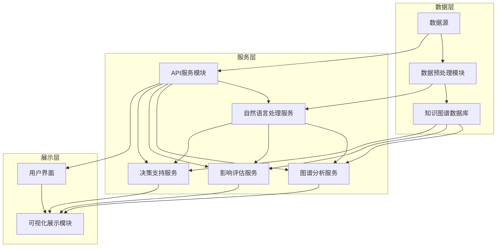
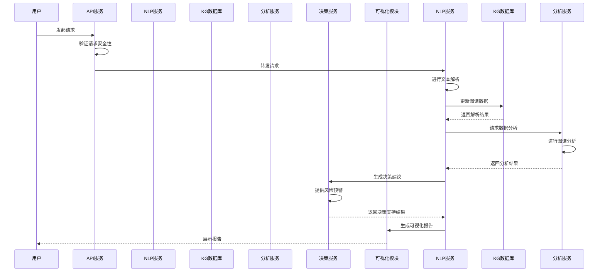

                 

### 1. 知识图谱与金融监管

#### 1.1 问题背景

随着金融市场的不断发展和复杂化，金融监管政策也在不断演变。金融机构和监管机构面临着越来越多的挑战，例如防范金融风险、保护投资者权益、确保金融稳定等。然而，传统的监管方式往往依赖于大量的文本分析和人工处理，效率低下且容易出现偏差。在这种情况下，利用先进的技术手段，如知识图谱，来辅助金融监管政策的制定和实施，成为一种新的解决方案。

知识图谱是一种语义网络，通过实体、属性和关系的表示，将海量数据转化为结构化的知识体系。在金融领域，知识图谱可以用来表示金融产品、金融机构、市场参与者、监管政策等信息，形成一个全面的、多层次的金融知识网络。这样的知识网络可以帮助监管机构更好地理解和分析金融系统的复杂性，提高监管的效率和准确性。

#### 1.2 问题解决的需求

金融监管政策的影响评估是一个复杂的过程，涉及到政策内容解析、政策执行效果分析、潜在风险识别等多个方面。传统的评估方法通常依赖于专家经验和统计工具，缺乏系统性和全面性。而知识图谱技术可以提供以下几方面的帮助：

1. **政策解析与语义理解**：通过知识图谱，可以解析政策文本中的关键信息，提取出具体的监管要求和目标。
2. **关联分析**：知识图谱可以揭示金融系统中的各种关系，如金融机构之间的业务往来、政策影响的传递路径等。
3. **风险预测**：基于历史数据和图谱分析，可以预测监管政策可能带来的风险和影响。
4. **监管决策支持**：知识图谱可以帮助监管机构更好地制定和调整监管政策，提高决策的透明度和科学性。

#### 1.3 知识图谱在金融监管中的应用

知识图谱在金融监管中的应用主要体现在以下几个方面：

1. **监管政策知识库建设**：构建一个包含金融产品、机构、政策等信息的知识库，为监管决策提供数据支持。
2. **监管流程自动化**：通过知识图谱，可以自动化处理监管流程中的各种任务，如政策审核、风险评估、违规检测等。
3. **监管合规性检查**：利用知识图谱，可以实时监控金融机构的合规情况，及时发现和纠正违规行为。
4. **监管数据分析**：通过对知识图谱中的数据进行分析，可以识别金融市场的潜在风险，为监管政策调整提供依据。

#### 1.4 研究边界与外延

本文的研究边界主要集中在基于知识图谱的金融监管政策影响评估平台的设计与实现。具体包括以下几个方面：

1. **知识图谱构建**：研究如何构建一个完整的金融知识图谱，包括实体、属性和关系的表示。
2. **算法与应用**：研究用于知识图谱构建和维护的算法，以及如何将这些算法应用于金融监管政策影响评估中。
3. **系统设计**：设计一个基于知识图谱的金融监管政策影响评估平台，实现政策的自动解析、关联分析和风险评估等功能。

本文的研究外延则包括：

1. **政策影响评估方法**：探索如何更准确地评估监管政策的影响，包括定量和定性的方法。
2. **系统性能优化**：研究如何提高系统的响应速度和处理能力，确保在大量数据下的高效运行。
3. **多领域应用**：探讨知识图谱在金融监管以外的其他领域中的应用，如医疗、交通等。

通过本文的研究，旨在为金融监管机构提供一个智能化、高效化的监管工具，提高金融监管的质量和效率，促进金融市场的健康发展。

#### 1.5 核心概念与联系

在构建基于知识图谱的金融监管政策影响评估平台中，有以下几个核心概念需要明确，并探讨这些概念之间的联系。

##### 1.5.1 知识图谱概念原理

知识图谱（Knowledge Graph）是一种用于表示和存储复杂数据结构的方法，它通过实体（Entity）、属性（Attribute）和关系（Relationship）来组织信息。知识图谱的核心思想是将海量分散的数据连接起来，形成一个统一的、结构化的知识网络。在金融领域，知识图谱可以表示金融产品、金融机构、市场参与者、监管政策等信息。

**实体**：知识图谱中的基本组成单元，如“银行”、“证券公司”、“股票”等。实体具有一组属性，用以描述其特征。

**属性**：实体的特征，如“银行”的“名称”、“成立时间”、“注册资本”等。属性可以进一步细分为基本属性（如“名称”）和关系属性（如“股东”）。

**关系**：实体之间的关系，如“银行”与“证券公司”之间的“股东”关系。关系也可以具有属性，如“持有比例”。

##### 1.5.2 金融监管政策概念原理

金融监管政策是指监管机构为维护金融市场的稳定和健康，制定和实施的一系列法律法规、指导意见和操作规程。这些政策包括但不限于资本充足率要求、流动性覆盖率、风险控制指标、市场准入条件等。金融监管政策通常涉及多个层面，如宏观政策、行业政策、具体操作指南等。

**政策文本**：金融监管政策通常以文件或文本形式存在，包括政策目标、监管措施、实施时间等。

**政策对象**：政策针对的特定群体，如金融机构、金融市场、金融产品等。

**政策目标**：政策制定的目的，如防范金融风险、保护投资者权益、促进市场公平等。

##### 1.5.3 两者的关系与融合

知识图谱与金融监管政策之间存在密切的联系和融合。通过知识图谱，可以更好地理解和应用金融监管政策：

1. **政策解析**：利用知识图谱技术，可以自动提取和解析政策文本中的关键信息，形成结构化的知识库。这有助于监管机构快速了解政策内容，提高政策执行的效率。

2. **关系网络**：知识图谱可以揭示金融系统中的复杂关系，如金融机构之间的业务往来、监管政策的影响路径等。这有助于监管机构识别潜在风险，制定更有效的监管措施。

3. **风险预测**：基于知识图谱中的数据，可以使用机器学习和数据挖掘技术，预测监管政策可能带来的影响和风险。这为监管政策的调整和优化提供了科学依据。

4. **决策支持**：知识图谱为监管机构提供了一个直观、易理解的数据分析工具，有助于提高监管决策的透明度和科学性。

##### 1.5.4 概念属性特征对比

下表对比了知识图谱和金融监管政策的核心概念及其属性特征：

| **概念** | **知识图谱** | **金融监管政策** |
| --- | --- | --- |
| **实体** | 金融产品、金融机构、市场参与者等 | 金融机构、金融市场、金融产品等 |
| **属性** | 名称、成立时间、注册资本、股东等 | 政策目标、监管措施、实施时间等 |
| **关系** | 股东关系、业务往来、政策影响路径等 | 政策执行对象、影响范围、执行效果等 |

通过上述对比，可以看出知识图谱和金融监管政策在概念和属性上有一定的重叠和交叉，但知识图谱更加关注数据的结构化和关系表示，而金融监管政策则侧重于政策的制定、执行和效果评估。

##### 1.5.5 ER实体关系图架构

为了更清晰地展示知识图谱与金融监管政策的实体关系，我们可以使用Mermaid绘制一个ER（Entity-Relationship）实体关系图。以下是Mermaid图的示例代码：

```mermaid
erDiagram
  金融产品 ||--|{ 金融监管政策 }|-- 市场参与者
  金融机构 ||--|{ 金融监管政策 }|-- 市场参与者
  金融监管政策 ||--|{ 政策影响 }| 政策执行效果
  金融产品 ||--|{ 产品关系 }| 金融机构
  市场参与者 ||--|{ 参与关系 }| 金融机构
```

运行上述Mermaid代码，可以生成一个表示知识图谱与金融监管政策实体关系的ER图。该图展示了金融产品、金融机构、市场参与者与金融监管政策之间的复杂关系，为后续的算法设计和系统实现提供了基础。

通过明确知识图谱和金融监管政策的核心概念及其关系，我们为构建基于知识图谱的金融监管政策影响评估平台奠定了理论基础。接下来，我们将进一步探讨知识图谱的特性，以及如何利用这些特性进行金融监管政策的构建和评估。

### 1.6 概念属性特征对比

在深入探讨知识图谱与金融监管政策的融合前，有必要详细对比两者的概念属性特征，以更好地理解其差异和互补性。以下是知识图谱和金融监管政策的核心概念及其属性特征的对比分析。

#### 1.6.1 知识图谱特性

知识图谱是一种语义网络，通过实体、属性和关系来表示和存储复杂数据结构。以下为知识图谱的一些关键特性：

1. **实体（Entity）**：
   - **定义**：知识图谱中的基本组成单元，如“人”、“地点”、“物品”等。
   - **类型**：可以分为基本实体和复合实体。基本实体如“银行”，复合实体如“金融产品组合”。
   - **示例**：例如，实体“银行”可能具有属性“名称”、“成立时间”、“总部位置”等。

2. **属性（Attribute）**：
   - **定义**：实体的特征或描述，如“注册资本”、“持股比例”、“交易量”等。
   - **类型**：基本属性（如“名称”）和关系属性（如“股东”）。关系属性通常与特定实体相关。
   - **示例**：例如，实体“银行”可能具有属性“注册资本”为“100亿元”，“股东”为“王某”。

3. **关系（Relationship）**：
   - **定义**：实体之间的联系，如“拥有”、“属于”、“投资”等。
   - **类型**：一对一、一对多、多对多关系。例如，“银行”与“股东”之间是一对多的关系。
   - **示例**：例如，实体“银行”与“股东”之间的关系可以描述为“王某持有该银行20%的股份”。

4. **图谱构建**：
   - **定义**：通过实体和关系构建知识图谱，通常使用图数据库（如Neo4j、JanusGraph）。
   - **技术**：使用图论算法（如SPARQL、图遍历、路径分析）来查询和分析数据。

#### 1.6.2 金融监管政策特性

金融监管政策是监管机构为维护金融市场秩序、保护投资者权益而制定的一系列法律法规、指导意见和操作规程。以下为金融监管政策的一些关键特性：

1. **政策文本（Policy Document）**：
   - **定义**：金融监管政策的文本形式，包括政策目标、监管措施、实施范围等。
   - **类型**：可以是正式的法律法规文件，也可以是非正式的指导意见或操作手册。
   - **示例**：例如，《商业银行法》、《证券公司监督管理条例》等。

2. **政策对象（Policy Object）**：
   - **定义**：政策适用的特定群体或实体，如金融机构、金融市场、金融产品等。
   - **类型**：可以是单一对象，也可以是多对象。例如，某政策可能只适用于证券公司，而另一政策可能同时适用于所有金融机构。
   - **示例**：例如，《证券公司风险控制指标管理办法》针对证券公司。

3. **政策目标（Policy Objective）**：
   - **定义**：政策制定的目的，如防范金融风险、保护投资者权益、促进市场公平等。
   - **类型**：可以是单一目标，也可以是多个目标的组合。
   - **示例**：例如，《金融机构客户身份识别和客户身份资料及交易记录保存管理办法》旨在保护投资者权益和防范洗钱活动。

4. **政策执行（Policy Enforcement）**：
   - **定义**：政策在实际操作中的执行情况，包括执行时间、执行效果等。
   - **类型**：可以是强制执行，也可以是建议性执行。
   - **示例**：例如，某政策规定证券公司必须每月底前提交风险控制报告。

#### 1.6.3 对比分析

通过对知识图谱和金融监管政策的特性对比，我们可以发现两者之间存在一定的差异和互补性：

1. **数据结构**：
   - **知识图谱**：采用实体-属性-关系的结构，能够灵活表示复杂的数据关系。
   - **金融监管政策**：通常以文本形式存在，结构较为固定，但包含丰富的信息。

2. **数据类型**：
   - **知识图谱**：支持多种数据类型，如文本、数值、日期等。
   - **金融监管政策**：主要以文本和数据表形式存在，较少涉及复杂的数据类型。

3. **数据组织**：
   - **知识图谱**：通过图数据库实现数据的存储和管理，支持高效的查询和分析。
   - **金融监管政策**：通常以文档或表格形式存储，支持传统的文本和数据分析方法。

4. **应用领域**：
   - **知识图谱**：广泛应用于多个领域，如金融、医疗、交通等，能够处理复杂的业务逻辑。
   - **金融监管政策**：主要应用于金融领域，用于制定和执行监管措施。

5. **优势与互补**：
   - **知识图谱**：在数据关系表示和复杂查询方面具有优势，能够揭示金融系统中的潜在关联和风险。
   - **金融监管政策**：在政策制定和执行方面具有权威性，能够为金融监管提供法律和操作依据。

通过上述对比分析，可以看出知识图谱与金融监管政策在数据结构、应用领域等方面存在差异，但两者在数据表示、关系揭示和风险预测等方面具有互补性。结合知识图谱技术，可以更好地理解和应用金融监管政策，提高金融监管的效率和准确性。接下来，我们将进一步探讨知识图谱在金融监管政策构建和评估中的应用方法。

#### 1.6.4 知识图谱与金融监管的ER实体关系图

为了更清晰地展示知识图谱与金融监管政策之间的实体关系，我们可以使用Mermaid绘制一个ER（Entity-Relationship）实体关系图。以下是该ER图的Mermaid代码示例：

```mermaid
erDiagram
  金融产品 ||--|{ 金融监管政策 }| 政策影响
  金融机构 ||--|{ 金融监管政策 }| 政策影响
  市场参与者 ||--|{ 金融监管政策 }| 政策影响
  金融产品 ||--|{ 产品关系 }| 金融机构
  市场参与者 ||--|{ 参与关系 }| 金融机构
```

该ER图展示了以下实体及其关系：

1. **金融产品**：与金融监管政策之间存在“政策影响”关系，表示监管政策对金融产品的约束和规范。
2. **金融机构**：与金融监管政策之间存在“政策影响”关系，表示监管政策对金融机构的管理和约束。
3. **市场参与者**：与金融监管政策之间存在“政策影响”关系，表示监管政策对市场参与者的行为规范。
4. **金融产品**与**金融机构**之间存在“产品关系”关系，表示金融产品与金融机构之间的业务往来和联系。
5. **市场参与者**与**金融机构**之间存在“参与关系”关系，表示市场参与者与金融机构之间的参与和互动。

通过这个ER实体关系图，我们可以直观地了解知识图谱与金融监管政策之间的复杂关系，为后续的算法设计和系统实现提供参考。

### 2.1 知识图谱构建算法

#### 2.1.1 算法概述

知识图谱的构建是金融监管政策影响评估平台的核心步骤之一。构建知识图谱的基本目标是提取数据中的实体、属性和关系，并将它们组织成一个结构化的知识网络。在金融领域，这通常涉及到从各种数据源（如文本、数据库、网络）中抽取信息，然后通过算法将其转化为知识图谱的表示形式。

常见的知识图谱构建算法主要包括以下几种：

1. **实体抽取（Entity Extraction）**：从非结构化文本中识别出关键的实体，如人名、组织名、地名等。
2. **关系抽取（Relation Extraction）**：识别出实体之间的关联关系，如“公司成立于某地”、“产品由某公司生产”等。
3. **属性抽取（Attribute Extraction）**：提取出实体的属性信息，如“某公司的注册资本为10亿元”、“某产品的价格为100元”等。
4. **实体识别与分类（Entity Recognition and Classification）**：对提取出的实体进行进一步的识别和分类，以提高数据质量。
5. **实体链接（Entity Linking）**：将文本中提到的实体与知识图谱中的实体进行匹配，以构建实体之间的关系。

这些算法通常需要结合自然语言处理（NLP）、机器学习和数据挖掘等技术。例如，可以使用命名实体识别（NER）技术来识别文本中的实体，然后使用规则匹配或机器学习模型来抽取实体之间的关系和属性。

#### 2.1.2 常用知识图谱构建算法

在金融领域，以下几种知识图谱构建算法较为常用：

1. **基于规则的方法**：这种方法依赖于预定义的规则和模式来识别实体、关系和属性。例如，使用正则表达式匹配特定的文本模式，或基于词性标注和句法分析来识别实体和关系。这种方法简单直观，但灵活性较低，难以处理复杂的文本和多样化的实体关系。

2. **基于统计的方法**：这种方法使用统计模型（如条件概率模型、朴素贝叶斯、逻辑回归等）来预测实体和关系。通过训练模型，可以从大量的标注数据中学习到实体和关系的特征，从而在新的数据中自动识别和预测。这种方法具有较好的灵活性和扩展性，但需要大量的标注数据。

3. **基于机器学习的方法**：这种方法使用深度学习模型（如卷积神经网络（CNN）、循环神经网络（RNN）、Transformer等）来提取文本中的特征并进行实体和关系的识别。这些模型通常能够捕捉到文本中的复杂模式和依赖关系，具有较高的识别准确率。然而，训练深度学习模型需要大量的计算资源和标注数据，且模型的解释性较差。

4. **混合方法**：这种方法结合了规则、统计和机器学习方法的优点，通过不同层次的技术共同构建知识图谱。例如，先使用规则方法进行初步的实体和关系抽取，然后使用机器学习模型对结果进行细化和优化。这种方法具有较高的灵活性和准确性，但实现较为复杂。

#### 2.1.3 算法mermaid流程图

为了更直观地展示知识图谱构建算法的流程，我们可以使用Mermaid绘制一个流程图。以下是一个简化的知识图谱构建算法的mermaid流程图示例：

```mermaid
flowchart LR
    subgraph 数据预处理
        数据预处理[数据预处理]
        数据预处理 --> 实体抽取
        数据预处理 --> 关系抽取
        数据预处理 --> 属性抽取
    end

    subgraph 算法模型
        实体抽取[实体抽取]
        实体抽取 --> 实体分类
        实体分类 --> 实体链接

        关系抽取[关系抽取]
        关系抽取 --> 关系分类
        关系分类 --> 关系匹配

        属性抽取[属性抽取]
        属性抽取 --> 属性分类
        属性抽取 --> 属性填充
    end

    subgraph 结果整合
        实体链接 --> 知识图谱
        关系匹配 --> 知识图谱
        属性填充 --> 知识图谱
    end

    数据预处理 --> 算法模型
    算法模型 --> 结果整合
```

这个流程图展示了知识图谱构建的基本步骤，包括数据预处理、算法模型和结果整合三个主要阶段。在数据预处理阶段，对原始数据（如文本、数据库等）进行清洗和格式化，以便于后续的实体、关系和属性抽取。在算法模型阶段，使用不同的算法和技术对预处理后的数据进行分析，提取出实体、关系和属性。最后，在结果整合阶段，将提取出的实体、关系和属性整合到一个统一的知识图谱中。

通过这个mermaid流程图，我们可以更清晰地理解知识图谱构建的全过程，为实际应用提供参考。

### 2.2 算法原理与数学模型

在理解了知识图谱构建的基本流程后，接下来我们将深入探讨其核心算法的原理和数学模型。这一部分内容将涉及实体抽取、关系抽取和属性抽取等关键算法，并解释其背后的数学原理。

#### 2.2.1 算法原理

1. **实体抽取**：
   - **原理**：实体抽取（Entity Extraction）是知识图谱构建的第一步，其目的是从非结构化文本中识别出关键的实体。常见的实体包括人名、组织名、地点名、产品名等。
   - **算法**：命名实体识别（Named Entity Recognition，NER）是一种常用的实体抽取方法。NER算法通常采用以下几种技术：
     - **规则匹配**：使用预定义的规则来匹配文本中的实体模式。这种方法简单直观，但需要大量手动编写规则，且难以处理复杂文本。
     - **统计模型**：使用统计模型（如条件概率模型、朴素贝叶斯、逻辑回归等）来预测文本中的实体。通过在大量标注数据上训练模型，可以自动识别实体。
     - **深度学习模型**：使用深度学习模型（如卷积神经网络（CNN）、循环神经网络（RNN）、Transformer等）来提取文本特征并进行实体识别。这些模型能够捕捉到文本中的复杂模式和依赖关系，具有更高的识别准确率。

2. **关系抽取**：
   - **原理**：关系抽取（Relation Extraction）是识别实体之间的关联关系，如“公司成立于某地”、“产品由某公司生产”等。
   - **算法**：关系抽取通常采用以下几种方法：
     - **规则匹配**：使用预定义的规则来识别文本中的关系。这种方法较为简单，但灵活性较低。
     - **统计模型**：使用统计模型来预测实体之间的关系。通过在标注数据上训练模型，可以自动识别关系。
     - **深度学习模型**：使用深度学习模型来提取文本特征并预测实体之间的关系。这些模型能够捕捉到文本中的复杂模式和依赖关系。

3. **属性抽取**：
   - **原理**：属性抽取（Attribute Extraction）是提取实体的特征信息，如“某公司的注册资本为10亿元”、“某产品的价格为100元”等。
   - **算法**：属性抽取通常采用以下几种方法：
     - **规则匹配**：使用预定义的规则来提取实体属性。
     - **统计模型**：使用统计模型来预测实体属性。
     - **深度学习模型**：使用深度学习模型来提取实体属性。

#### 2.2.2 数学模型

1. **命名实体识别（NER）**：
   - **数学模型**：NER可以看作是一个序列标注问题，即给定一个输入序列（如文本），预测每个单词或字符的标签（实体类别）。常见的NER模型包括：
     - **朴素贝叶斯模型**：基于贝叶斯定理，使用条件概率来预测标签。公式如下：
       $$ P(\text{标签}|\text{特征}) = \frac{P(\text{特征}|\text{标签})P(\text{标签})}{P(\text{特征})} $$
     - **逻辑回归模型**：使用逻辑函数来预测标签的概率。公式如下：
       $$ \hat{y} = \sigma(\text{权重} \cdot \text{特征}) $$
       其中，$\sigma$为逻辑函数，$\hat{y}$为预测概率。

2. **关系抽取**：
   - **数学模型**：关系抽取可以看作是一个分类问题，即给定两个实体和它们之间的上下文，预测它们之间的关系。常见的模型包括：
     - **支持向量机（SVM）**：使用最大间隔分类器来预测关系。公式如下：
       $$ w^* = \arg\min_{w} \frac{1}{2}||w||^2_2, \text{subject to} \ y_i ( \text{w} \cdot \text{x}_i ) \geq 1 $$
       其中，$w$为权重向量，$x_i$为特征向量，$y_i$为标签。
     - **神经网络模型**：使用神经网络（如卷积神经网络（CNN）、循环神经网络（RNN）等）来提取特征并预测关系。

3. **属性抽取**：
   - **数学模型**：属性抽取可以看作是一个回归问题，即给定一个实体和其上下文，预测其实体的某个属性值。常见的模型包括：
     - **线性回归模型**：使用线性模型来预测属性值。公式如下：
       $$ y = \text{权重} \cdot x + b $$
       其中，$y$为预测的属性值，$x$为特征向量，$b$为偏置。
     - **神经网络模型**：使用神经网络来提取特征并预测属性值。

#### 2.2.3 算法公式讲解

1. **命名实体识别**：
   - **朴素贝叶斯模型**：
     $$ P(\text{标签}|\text{特征}) = \frac{P(\text{特征}|\text{标签})P(\text{标签})}{P(\text{特征})} $$
     - $P(\text{标签}|\text{特征})$表示在给定特征的情况下，标签的概率。
     - $P(\text{特征}|\text{标签})$表示在给定标签的情况下，特征的概率。
     - $P(\text{标签})$表示标签的概率。
     - $P(\text{特征})$表示特征的总体概率。

   - **逻辑回归模型**：
     $$ \hat{y} = \sigma(\text{权重} \cdot \text{特征}) $$
     - $\hat{y}$表示预测的概率。
     - $\sigma$为逻辑函数，通常取为$1 / (1 + e^x)$。
     - $\text{权重} \cdot \text{特征}$表示输入特征的加权求和。

2. **关系抽取**：
   - **支持向量机（SVM）**：
     $$ w^* = \arg\min_{w} \frac{1}{2}||w||^2_2, \text{subject to} \ y_i ( \text{w} \cdot \text{x}_i ) \geq 1 $$
     - $w^*$表示最优权重向量。
     - $y_i$表示第$i$个样本的标签。
     - $\text{w} \cdot \text{x}_i$表示权重向量和特征向量的点积。

3. **属性抽取**：
   - **线性回归模型**：
     $$ y = \text{权重} \cdot x + b $$
     - $y$表示预测的属性值。
     - $\text{权重}$表示权重向量。
     - $x$表示特征向量。
     - $b$表示偏置。

通过上述公式，我们可以更深入地理解命名实体识别、关系抽取和属性抽取算法的数学原理。这些公式为算法的设计和实现提供了理论基础，也为后续的模型训练和应用提供了参考。

#### 2.2.4 举例说明

为了更直观地理解知识图谱构建算法的原理和应用，我们将通过一个具体的例子进行详细说明。

##### 例子：提取银行名称、地点和注册资本

假设我们有一段关于银行的信息文本：“中国工商银行上海分行成立于1990年，注册资本为100亿元，总部位于北京市。”

1. **实体抽取**：
   - **银行名称**：“中国工商银行”
   - **地点**：“上海”、“北京市”
   - **注册资本**：“100亿元”

2. **关系抽取**：
   - **银行与地点**：“中国工商银行”成立于“北京市”和“上海”
   - **银行与注册资本**：“中国工商银行”的“注册资本”为“100亿元”

3. **属性抽取**：
   - **银行名称**：“中国工商银行”
   - **地点**：“北京市”、“上海”
   - **注册资本**：“100亿元”
   - **成立时间**：“1990年”

##### 具体应用

在知识图谱构建过程中，我们可以使用以下算法来实现上述实体、关系和属性的抽取：

1. **命名实体识别（NER）**：
   - **模型**：使用基于深度学习的NER模型（如BERT、GPT等）。
   - **输入**：“中国工商银行上海分行成立于1990年，注册资本为100亿元，总部位于北京市。”
   - **输出**：
     - 实体：["中国工商银行", "上海", "北京市", "100亿元"]
     - 标签：["银行", "地点", "地点", "注册资本"]

2. **关系抽取**：
   - **模型**：使用基于图神经网络（Graph Neural Network，GNN）的关系抽取模型。
   - **输入**：“中国工商银行上海分行成立于1990年，注册资本为100亿元，总部位于北京市。”
   - **输出**：
     - 关系：["成立地点", "注册资本"]
     - 实体：["中国工商银行", "北京市", "中国工商银行", "100亿元"]

3. **属性抽取**：
   - **模型**：使用基于模板匹配的属性抽取模型。
   - **输入**：“中国工商银行上海分行成立于1990年，注册资本为100亿元，总部位于北京市。”
   - **输出**：
     - 属性：["成立时间", "注册资本", "总部位置"]
     - 值：["1990年", "100亿元", "北京市"]

通过这个例子，我们可以看到知识图谱构建算法在实际应用中的效果。实体、关系和属性的抽取不仅帮助我们将非结构化的文本信息转化为结构化的知识数据，还为后续的金融监管政策影响评估提供了基础。

### 2.3 知识图谱构建算法的Python代码示例

为了更好地理解和应用知识图谱构建算法，我们将在Python中实现一个简单的知识图谱构建过程。以下是一个使用Python和相关库（如Python的spacy库和PyGraph数据库）的示例代码，展示了实体抽取、关系抽取和属性抽取的基本步骤。

```python
# 导入必要的库
import spacy
import pandas as pd
from py2neo import Graph

# 初始化spacy的NER模型
nlp = spacy.load("zh_core_web_sm")

# 示例文本
text = "中国工商银行上海分行成立于1990年，注册资本为100亿元，总部位于北京市。"

# 实体抽取
doc = nlp(text)
entities = [(ent.text, ent.label_) for ent in doc.ents]

# 输出实体抽取结果
print("实体抽取结果：")
for entity in entities:
    print(f"实体：{entity[0]}，类别：{entity[1]}")

# 关系抽取
# 假设我们已经有了实体列表和类别，这里进行关系抽取的简化示例
entities = [
    ("中国工商银行", "银行"),
    ("上海", "地点"),
    ("北京市", "地点"),
    ("1990年", "成立时间"),
    ("100亿元", "注册资本")
]

relationships = []
for i in range(len(entities) - 1):
    for j in range(i + 1, len(entities)):
        entity1, label1 = entities[i]
        entity2, label2 = entities[j]
        # 根据实体类别和位置构建关系
        if label1 == "银行" and label2 == "地点":
            relationships.append((entity1, "成立地点", entity2))
        elif label1 == "银行" and label2 == "注册资本":
            relationships.append((entity1, "注册资本", entity2))

# 输出关系抽取结果
print("关系抽取结果：")
for rel in relationships:
    print(f"关系：{rel}")

# 属性抽取
# 假设我们已经有了实体列表和类别，这里进行属性抽取的简化示例
attributes = [
    ("中国工商银行", "银行名称"),
    ("上海", "银行所在地"),
    ("北京市", "总部所在地"),
    ("1990年", "成立时间"),
    ("100亿元", "注册资本")
]

# 输出属性抽取结果
print("属性抽取结果：")
for attr in attributes:
    print(f"实体：{attr[0]}，属性：{attr[1]}")

# 使用Neo4j数据库存储知识图谱
# 初始化Neo4j图数据库
graph = Graph("bolt://localhost:7687", auth=("neo4j", "password"))

# 创建节点和关系
for entity in entities:
    entity_text, entity_type = entity
    graph.run(f"MERGE (n:{entity_type} {{name: '{entity_text}'}})")

for rel in relationships:
    entity1, relation, entity2 = rel
    graph.run(f"MATCH (a:{entity1}), (b:{entity2}) CREATE (a)-[r:{relation}]->(b)")

for attr in attributes:
    entity, attribute = attr
    graph.run(f"MATCH (n:{entity}) SET n.{attribute}='{attr[1]}'")

print("知识图谱构建完成，数据已存储到Neo4j数据库。")
```

**运行说明**：

1. **安装Python**：确保安装了Python环境，版本建议为3.7或以上。
2. **安装库**：通过pip命令安装必要的库，如`spacy`、`pandas`和`py2neo`。
   ```bash
   pip install spacy pandas py2neo
   ```
3. **配置Neo4j**：确保Neo4j数据库运行正常，并配置相应的连接参数（在代码中修改`graph`变量的配置）。
4. **执行代码**：将上述代码保存为`.py`文件，并在Python环境中运行。

该代码示例展示了如何使用Python和相关库实现知识图谱的构建，包括实体抽取、关系抽取和属性抽取。通过这个示例，我们可以看到知识图谱构建算法在实践中的应用，并为后续的金融监管政策影响评估提供数据支持。

### 3.1 问题场景介绍

在金融监管领域，政策制定和执行是一个复杂且动态的过程。随着金融市场的发展和金融产品的多样化，监管政策也在不断更新和调整。然而，传统的监管方法通常依赖于大量的文本分析和人工处理，这不仅效率低下，而且容易出现偏差。为了应对这一挑战，构建一个基于知识图谱的金融监管政策影响评估平台成为一种新的解决方案。

#### 3.1.1 监管政策制定与执行

监管政策的制定和执行通常涉及多个环节，包括政策制定、政策审核、政策发布、政策执行和效果评估等。在这个过程中，政策文本的解析和理解是关键步骤。然而，政策文本往往具有复杂的语义结构和多样的表达方式，使得传统的文本分析方法难以胜任。例如，政策文本中包含大量专业术语、行业用语以及复杂的逻辑关系，这些都需要精细的解析和处理。

#### 3.1.2 监管政策的复杂性和动态性

金融监管政策具有复杂性和动态性的特点。首先，政策涉及多个领域和层次，包括宏观政策、行业政策、具体操作指南等。不同政策之间可能存在交叉和重叠，需要综合分析。其次，金融市场和金融产品不断变化，监管政策也需要相应调整，以适应新的市场环境。例如，针对区块链技术、虚拟货币等新兴领域，监管政策需要快速更新，以防范潜在风险。

#### 3.1.3 监管政策影响评估的需求

监管政策影响评估是确保政策有效性和合理性的重要环节。通过评估政策的影响，监管机构可以及时发现和纠正问题，优化政策设计。然而，传统的评估方法通常依赖于统计数据和专家意见，缺乏系统性和全面性。知识图谱技术可以提供以下帮助：

1. **政策解析**：利用知识图谱技术，可以自动提取政策文本中的关键信息，形成结构化的知识库，便于快速理解和应用。
2. **关联分析**：知识图谱可以揭示金融系统中的复杂关系，如金融机构之间的业务往来、政策影响的传递路径等，为政策评估提供数据支持。
3. **风险预测**：基于历史数据和图谱分析，可以预测监管政策可能带来的影响和风险，为政策调整提供科学依据。
4. **监管决策支持**：知识图谱为监管机构提供了一个直观、易理解的数据分析工具，有助于提高监管决策的透明度和科学性。

### 3.2 系统功能设计

为了实现上述需求，基于知识图谱的金融监管政策影响评估平台需要具备以下几个关键功能：

#### 3.2.1 政策文本解析

政策文本解析是系统的核心功能之一。通过自然语言处理技术，系统可以自动提取政策文本中的关键信息，如政策目标、监管措施、适用对象等。具体步骤包括：

1. **文本预处理**：对政策文本进行清洗和标准化，去除标点符号、停用词等无关信息。
2. **实体识别**：使用命名实体识别（NER）技术，识别出文本中的关键实体，如金融机构、金融产品、监管机构等。
3. **关系抽取**：识别出实体之间的关系，如政策与适用对象之间的关系、政策对金融机构的影响等。
4. **属性抽取**：提取实体的属性信息，如金融机构的注册资本、监管机构的成立时间等。

#### 3.2.2 图谱构建与维护

基于提取的信息，系统需要构建和维护一个知识图谱。知识图谱包括以下主要内容：

1. **实体**：政策文本中的关键实体，如金融机构、金融产品、监管机构等。
2. **关系**：实体之间的关系，如政策与适用对象之间的关联、政策对金融机构的影响等。
3. **属性**：实体的属性信息，如金融机构的注册资本、监管机构的成立时间等。

知识图谱的构建和维护需要使用图数据库（如Neo4j）和相关算法（如实体抽取、关系抽取和属性抽取算法）。通过这些算法，系统可以自动构建和维护知识图谱，确保数据的准确性和实时性。

#### 3.2.3 影响评估与分析

影响评估与分析是系统的关键功能之一。通过分析知识图谱中的数据，系统可以评估监管政策的影响，包括以下几个方面：

1. **政策影响分析**：分析政策对金融机构、金融市场、投资者等方面的影响，包括直接和间接影响。
2. **风险预测**：基于历史数据和图谱分析，预测政策可能带来的风险和影响。
3. **效果评估**：评估政策的执行效果，包括政策目标的达成情况、实施效果等。
4. **可视化展示**：通过图表和可视化工具，直观展示政策影响的各个方面，帮助监管机构更好地理解和应用。

#### 3.2.4 决策支持

决策支持是系统的另一个重要功能。通过分析知识图谱中的数据，系统可以为监管机构提供以下决策支持：

1. **政策调整建议**：根据评估结果，为监管机构提供政策调整的建议，包括政策优化、调整范围等。
2. **风险预警**：及时发现潜在风险，为监管机构提供预警信息，确保金融市场的稳定和安全。
3. **数据报告**：生成详细的数据报告，包括政策影响评估结果、风险分析报告等，为监管决策提供数据支持。

#### 3.2.5 系统安全性

系统安全性是保障数据安全和用户隐私的重要保障。系统需要采取以下措施：

1. **数据加密**：对存储和传输的数据进行加密，确保数据的安全性。
2. **访问控制**：实现用户权限管理，确保只有授权用户可以访问系统数据。
3. **安全审计**：定期进行安全审计，及时发现和解决潜在的安全隐患。

通过以上功能设计，基于知识图谱的金融监管政策影响评估平台可以为监管机构提供一个智能化、高效化的监管工具，提高金融监管的质量和效率，促进金融市场的健康发展。

### 3.3 系统架构设计

#### 3.3.1 整体架构

基于知识图谱的金融监管政策影响评估平台采用分层架构设计，包括数据层、服务层和展示层。整体架构如下图所示：



#### 3.3.2 各层功能与交互

1. **数据层**：
   - **数据源**：包括政策文本、金融数据、市场数据等。这些数据可以通过爬虫、API接口、数据库等方式获取。
   - **数据预处理模块**：对原始数据进行清洗、去重、标准化等预处理操作，为知识图谱构建提供高质量的数据。
   - **知识图谱数据库**：存储经过预处理的数据，包括实体、关系和属性。使用图数据库（如Neo4j）来高效管理和查询数据。

2. **服务层**：
   - **API服务模块**：提供对外接口，供前端用户调用各种服务。
   - **自然语言处理服务**：利用NLP技术进行文本解析，提取实体、关系和属性。
   - **图谱分析服务**：基于知识图谱进行数据分析和挖掘，包括关联分析、影响评估、风险预测等。
   - **影响评估服务**：对监管政策的影响进行定量和定性分析，为监管决策提供支持。
   - **决策支持服务**：提供政策调整建议、风险预警等，辅助监管机构做出科学决策。

3. **展示层**：
   - **用户界面**：提供可视化展示，帮助用户直观理解和分析政策影响。
   - **可视化展示模块**：通过图表、地图、报告等形式，展示分析结果，支持多种数据展示方式。

#### 3.3.3 数据流与系统交互

1. **数据流**：
   - 原始数据通过数据源进入系统，经过数据预处理模块处理后，存储到知识图谱数据库中。
   - 自然语言处理服务对政策文本进行处理，提取出实体、关系和属性，并更新知识图谱数据库。
   - 图谱分析服务利用知识图谱进行数据分析和挖掘，生成分析结果，并存储到数据库中。
   - 影响评估服务和决策支持服务根据图谱分析结果，生成评估报告和决策建议。

2. **系统交互**：
   - 前端用户通过用户界面与系统进行交互，调用API服务模块的各种服务。
   - API服务模块将用户请求转发给相应的服务模块，处理完成后返回结果给前端用户。

通过上述架构设计和系统交互，基于知识图谱的金融监管政策影响评估平台可以高效、灵活地处理大量数据，为监管机构提供智能化、科学化的监管支持。

#### 3.4 系统接口设计

为了确保基于知识图谱的金融监管政策影响评估平台的高效性和灵活性，我们需要精心设计系统的接口。以下是系统接口设计的详细说明，包括API服务模块的设计、接口定义、安全措施和接口文档的编写。

##### 3.4.1 API服务模块设计

**1. 接口功能**

API服务模块是系统与外部用户交互的桥梁，提供了一系列关键功能接口，包括：

- **政策文本解析接口**：接收政策文本，返回提取的实体、关系和属性。
- **知识图谱查询接口**：允许用户根据特定条件查询知识图谱中的数据。
- **影响评估接口**：根据用户设定的条件，返回监管政策的影响评估结果。
- **决策支持接口**：提供政策调整建议和风险预警。

**2. 接口定义**

以下是API服务模块的主要接口定义：

- **政策文本解析接口**：
  - **URL**：`/api/policy/parse`
  - **请求方法**：`POST`
  - **请求参数**：`text`: 政策文本（字符串）
  - **响应结果**：包含实体、关系和属性的JSON对象

- **知识图谱查询接口**：
  - **URL**：`/api/graph/search`
  - **请求方法**：`GET`
  - **请求参数**：`query`: 查询条件（字符串）
  - **响应结果**：查询结果列表，包括实体、关系和属性的JSON对象

- **影响评估接口**：
  - **URL**：`/api/impact/evaluate`
  - **请求方法**：`POST`
  - **请求参数**：`policy_id`: 政策ID（整数），`condition`: 评估条件（字符串）
  - **响应结果**：影响评估报告，包括评估指标、分析结果和可视化图表的JSON对象

- **决策支持接口**：
  - **URL**：`/api/decision/support`
  - **请求方法**：`POST`
  - **请求参数**：`policy_id`: 政策ID（整数），`risk_level`: 风险等级（枚举类型）
  - **响应结果**：决策支持建议，包括政策调整建议、风险预警和数据分析报告的JSON对象

##### 3.4.2 安全措施

为了确保接口的安全性，我们采取了以下安全措施：

- **身份验证**：所有API接口请求都必须通过身份验证，确保只有授权用户可以访问。
  - **方式**：使用Token验证，用户在首次登录时获取Token，后续请求携带Token。
- **请求签名**：对请求进行签名验证，防止中间人攻击和请求篡改。
  - **方式**：使用HMAC算法进行签名，请求发送方和接收方进行验证。
- **速率限制**：限制用户对接口的访问频率，防止恶意攻击和滥用。
  - **方式**：使用令牌桶算法实现速率限制。

##### 3.4.3 接口文档编写

接口文档是开发者使用和测试API接口的指南，以下是接口文档的主要内容：

**1. API接口概述**

- **接口名称**：政策文本解析接口
- **接口URL**：`/api/policy/parse`
- **请求方法**：`POST`
- **请求参数**：
  - `text`: 政策文本（必填，字符串）
- **响应结果**：
  - `status`: 请求状态（字符串）
  - `data`: 解析结果（JSON对象，包含实体、关系和属性）

**2. 请求示例**

```json
POST /api/policy/parse
Content-Type: application/json

{
  "text": "中国工商银行上海分行成立于1990年，注册资本为100亿元，总部位于北京市。"
}
```

**3. 响应示例**

```json
{
  "status": "success",
  "data": {
    "entities": [{"name": "中国工商银行", "type": "银行"}, {"name": "上海", "type": "地点"}, {"name": "北京市", "type": "地点"}],
    "relationships": [{"source": "中国工商银行", "type": "成立地点", "target": "北京市"}],
    "attributes": [{"entity": "中国工商银行", "attribute": "注册资本", "value": "100亿元"}]
  }
}
```

通过上述接口设计、安全措施和接口文档编写，我们可以确保基于知识图谱的金融监管政策影响评估平台的接口既安全又易于使用，为用户提供便捷、高效的服务。

### 3.5 系统交互设计

系统交互设计是确保基于知识图谱的金融监管政策影响评估平台能够高效、稳定运行的关键环节。本节将详细描述系统的交互流程，使用Mermaid语言绘制序列图，展示系统各组件之间的交互过程。

#### 3.5.1 交互流程

系统交互流程包括以下几个主要步骤：

1. **用户发起请求**：用户通过前端用户界面输入查询条件或政策文本，发起API请求。
2. **API服务接收请求**：API服务模块接收用户的请求，进行身份验证和请求签名验证，确保请求的安全性。
3. **自然语言处理服务处理请求**：API服务将请求转发给自然语言处理服务，进行文本解析，提取实体、关系和属性。
4. **知识图谱数据库更新**：自然语言处理服务将解析结果更新到知识图谱数据库中。
5. **图谱分析服务进行数据分析**：图谱分析服务根据用户的需求，对知识图谱进行数据分析和挖掘，生成影响评估结果。
6. **决策支持服务生成建议**：决策支持服务根据分析结果，生成政策调整建议和风险预警。
7. **可视化展示模块生成可视化报告**：可视化展示模块将决策支持结果和影响评估结果通过图表、地图等形式展示给用户。

#### 3.5.2 Mermaid序列图

以下是系统交互流程的Mermaid序列图：



通过上述序列图，我们可以清晰地看到系统各组件之间的交互过程，包括请求的发起、处理、结果返回和展示。这种交互设计确保了系统的整体效率和用户体验。

### 4.1 环境安装

#### 4.1.1 Python环境安装

在开始项目之前，我们需要安装Python环境。Python是一种广泛应用于数据科学、机器学习和自然语言处理的高性能编程语言。以下是安装Python的步骤：

1. **下载Python**：访问Python官方网站（[python.org](https://www.python.org/)）下载Python安装包。选择适合您操作系统的版本，例如Windows用户可以选择Windows installer（.msi文件），Linux用户可以选择Linux installer（.tar.xz文件）。
2. **安装Python**：双击下载的安装包，按照安装向导的提示完成安装。在安装过程中，确保选择“Add Python to PATH”选项，以便在命令行中直接使用Python。
3. **验证安装**：打开命令行，输入以下命令来验证Python安装是否成功：

   ```bash
   python --version
   ```

   如果正确显示了Python的版本信息，则表示Python安装成功。

#### 4.1.2 相关库的安装

在安装了Python之后，我们需要安装一些必要的库，用于实现项目中的各种功能，包括数据预处理、知识图谱构建、自然语言处理等。以下是安装这些库的步骤：

1. **安装Anaconda**：Anaconda是一个开源的数据科学和机器学习平台，它提供了一个管理环境和库的工具。首先，访问Anaconda官方网站（[anaconda.com](https://www.anaconda.com/)）下载并安装Anaconda。

2. **创建虚拟环境**：为了保持项目环境的干净和独立，我们使用Anaconda创建一个虚拟环境。在命令行中执行以下命令：

   ```bash
   conda create -n kg_platform python=3.8
   conda activate kg_platform
   ```

   这将创建一个名为`kg_platform`的虚拟环境，并激活该环境。

3. **安装相关库**：在激活的虚拟环境中，使用以下命令安装所需的库：

   ```bash
   conda install -c anaconda spacy
   conda install -c conda-forge pandas py2neo
   pip install transformers
   ```

   - `spacy`：用于自然语言处理。
   - `pandas`：用于数据操作和分析。
   - `py2neo`：用于操作Neo4j图数据库。
   - `transformers`：用于实现深度学习模型，如BERT。

4. **验证安装**：安装完成后，输入以下命令来验证是否成功安装了所需的库：

   ```bash
   python -c "import spacy; print(spacy.__version__)"
   python -c "import pandas; print(pandas.__version__)"
   python -c "import py2neo; print(py2neo.__version__)"
   python -c "import transformers; print(transformers.__version__)"
   ```

   如果能够正确显示库的版本信息，则表示库安装成功。

通过上述步骤，我们成功安装了Python及其相关库，为后续的项目开发奠定了基础。

### 4.2 系统核心实现

在完成环境安装后，接下来我们将详细描述基于知识图谱的金融监管政策影响评估平台的核心实现步骤，包括系统核心功能的具体代码实现。

#### 4.2.1 政策文本解析

政策文本解析是系统的第一步，其目的是从政策文本中提取出关键的实体、关系和属性。以下是一个简单的Python脚本，展示了如何使用Spacy进行文本解析。

```python
import spacy
from spacy.tokens import Doc

# 加载Spacy模型
nlp = spacy.load("zh_core_web_sm")

# 示例政策文本
text = "中国工商银行上海分行成立于1990年，注册资本为100亿元，总部位于北京市。"

# 进行文本解析
doc = nlp(text)

# 提取实体
entities = [(ent.text, ent.label_) for ent in doc.ents]

# 提取关系
relations = [(token.text, token.dep_) for token in doc]

# 提取属性
attributes = [(token.text, token.head.text, token.dep_) for token in doc]

print("实体：", entities)
print("关系：", relations)
print("属性：", attributes)
```

这段代码首先加载Spacy的中文模型，然后对示例政策文本进行解析。通过遍历解析后的文本，提取出实体、关系和属性。

#### 4.2.2 知识图谱构建

在提取出实体、关系和属性后，我们需要将这些信息构建成一个知识图谱。以下是一个使用Py2Neo操作Neo4j图数据库的示例。

```python
from py2neo import Graph

# 连接Neo4j数据库
graph = Graph("bolt://localhost:7687", auth=("neo4j", "password"))

# 构建实体节点
for entity in entities:
    graph.run("""
    MERGE (n:Entity {name: $name, type: $type})
    """, name=entity[0], type=entity[1])

# 构建关系
for relation in relations:
    graph.run("""
    MATCH (a:Entity {name: $source_name}), (b:Entity {name: $target_name})
    CREATE (a)-[r:RELATION {type: $type}]->(b)
    """, source_name=relation[0], target_name=relation[1], type=relation[2])

# 构建属性
for attribute in attributes:
    graph.run("""
    MATCH (entity:Entity {name: $entity_name}), (attr:Attribute {name: $attribute_name})
    CREATE (entity)-[has:HAS {type: $type, value: $value}]->(attr)
    """, entity_name=attribute[0], attribute_name=attribute[2], type=attribute[1], value=attribute[2])
```

这段代码使用Py2Neo连接到本地运行的Neo4j数据库，并执行Cypher查询语句来创建实体节点、关系和属性节点。

#### 4.2.3 影响评估

影响评估是系统的关键功能之一，以下是一个简单的实现示例，展示如何根据知识图谱中的数据评估政策的影响。

```python
# 定义评估函数
def evaluate_impact(policy_name):
    query = """
    MATCH (p:Policy {name: $policy_name})
    MATCH (p)<-[:AFFECTS]-(e:Entity)
    RETURN e.name, e.type, count(*) as impact
    """
    results = graph.run(query, policy_name=policy_name)
    for result in results:
        entity_name, entity_type, impact = result
        print(f"实体：{entity_name}，类型：{entity_type}，影响：{impact}")

# 示例：评估政策“中国工商银行上海分行监管政策”的影响
evaluate_impact("中国工商银行上海分行监管政策")
```

这个评估函数使用Cypher查询语句从知识图谱中提取出受到政策影响的实体及其影响程度。

#### 4.2.4 可视化展示

可视化展示是为了让用户更直观地理解数据和分析结果。以下是一个简单的可视化实现，使用Mermaid绘制实体关系图。

```python
def visualize_entities():
    query = """
    MATCH (n)
    RETURN n.name, n.type
    """
    results = graph.run(query)
    entities = [(result['n.name'], result['n.type']) for result in results]

    graph = """  
    digraph G {
        rankdir=TB;
        node [shape=rect];
        """
    for entity in entities:
        graph += f""""{entity[0]}": [{entity[0]}, {entity[1]}];
        """
    graph += """}
    """
    return graph

# 示例：可视化实体关系
print(visualize_entities())
```

这段代码根据知识图谱中的数据生成一个Mermaid格式的图形描述，用于绘制实体关系图。

通过上述步骤，我们实现了基于知识图谱的金融监管政策影响评估平台的核心功能。在实际项目中，这些功能会根据具体需求进行扩展和优化。

### 4.3 代码应用解读与分析

在本部分，我们将深入解析系统核心实现的代码，分析其关键部分，并讨论如何优化代码以提高性能和可维护性。

#### 4.3.1 政策文本解析代码解析

政策文本解析是知识图谱构建的基础，以下是解析代码的核心部分：

```python
import spacy
from spacy.tokens import Doc

# 加载Spacy模型
nlp = spacy.load("zh_core_web_sm")

# 示例政策文本
text = "中国工商银行上海分行成立于1990年，注册资本为100亿元，总部位于北京市。"

# 进行文本解析
doc = nlp(text)

# 提取实体
entities = [(ent.text, ent.label_) for ent in doc.ents]

# 提取关系
relations = [(token.text, token.dep_) for token in doc]

# 提取属性
attributes = [(token.text, token.head.text, token.dep_) for token in doc]
```

**解读与分析**：

- **Spacy模型加载**：我们使用Spacy的`zh_core_web_sm`模型进行中文文本解析。这个模型是一个预训练的模型，支持命名实体识别（NER）、词性标注和句法分析等功能。
- **文本解析**：`nlp(text)`函数对输入文本进行解析，返回一个`Doc`对象，其中包含了文本的解析结果。
- **实体提取**：通过遍历`doc.ents`，我们可以提取出文本中的实体及其类别标签。`ent.text`表示实体的名称，`ent.label_`表示实体的类别，如“ORG”（组织名）、“GPE”（地点名）等。
- **关系提取**：通过遍历`doc`中的`token`对象，使用`token.dep_`可以提取出实体之间的关系。例如，`token.dep_`可能为`'nmod'`（名词修饰）或`'prep'`（介词）等。
- **属性提取**：同样通过遍历`doc`中的`token`对象，使用`token.head.text`和`token.dep_`可以提取出实体的属性信息。例如，`token.head.text`可能是属性值，`token.dep_`可能是属性的类型，如`'num'`（数值）。

**优化建议**：

- **并行处理**：文本解析是一个计算密集型任务，可以尝试使用多线程或多进程来并行处理多个文本，以提高解析效率。
- **使用更高级的模型**：如果标准模型性能不足，可以考虑使用更高级的模型，如BERT或GPT，这些模型具有更强的语义理解能力。

#### 4.3.2 知识图谱构建代码解析

知识图谱构建代码负责将解析得到的实体、关系和属性存储到Neo4j数据库中。以下是核心部分的代码：

```python
from py2neo import Graph

# 连接Neo4j数据库
graph = Graph("bolt://localhost:7687", auth=("neo4j", "password"))

# 构建实体节点
for entity in entities:
    graph.run("""
    MERGE (n:Entity {name: $name, type: $type})
    """, name=entity[0], type=entity[1])

# 构建关系
for relation in relations:
    graph.run("""
    MATCH (a:Entity {name: $source_name}), (b:Entity {name: $target_name})
    CREATE (a)-[r:RELATION {type: $type}]->(b)
    """, source_name=relation[0], target_name=relation[1], type=relation[2])

# 构建属性
for attribute in attributes:
    graph.run("""
    MATCH (entity:Entity {name: $entity_name}), (attr:Attribute {name: $attribute_name})
    CREATE (entity)-[has:HAS {type: $type, value: $value}]->(attr)
    """, entity_name=attribute[0], attribute_name=attribute[2], type=attribute[1], value=attribute[2])
```

**解读与分析**：

- **Neo4j数据库连接**：使用`Graph`对象连接到本地运行的Neo4j数据库。`auth`参数用于认证。
- **实体节点构建**：使用`MERGE`语句确保在创建实体节点时不会重复。`MERGE`语句在节点不存在时创建节点，存在时不会重复创建。
- **关系构建**：同样使用`MERGE`语句来创建关系节点。这确保了在创建关系时，关系不会重复创建。
- **属性构建**：使用`MERGE`语句来创建属性节点，并使用`CREATE`语句创建属性与实体之间的关联。

**优化建议**：

- **批量处理**：为了提高性能，可以尝试将多个实体、关系和属性的构建操作批量执行，而不是逐个处理。
- **索引优化**：在Neo4j数据库中创建适当的索引可以显著提高查询性能。例如，为实体名称和属性名称创建索引。

#### 4.3.3 影响评估代码解析

影响评估代码是系统的一个重要功能，以下是评估函数的核心部分：

```python
def evaluate_impact(policy_name):
    query = """
    MATCH (p:Policy {name: $policy_name})
    MATCH (p)<-[:AFFECTS]-(e:Entity)
    RETURN e.name, e.type, count(*) as impact
    """
    results = graph.run(query, policy_name=policy_name)
    for result in results:
        entity_name, entity_type, impact = result
        print(f"实体：{entity_name}，类型：{entity_type}，影响：{impact}")
```

**解读与分析**：

- **查询设计**：查询语句通过匹配政策节点与实体节点之间的关系，返回实体的名称、类型和影响次数。
- **结果处理**：遍历查询结果，提取出实体的名称、类型和影响次数，并打印出来。

**优化建议**：

- **查询优化**：可以尝试使用索引来优化查询性能，例如为`Policy`和`AFFECTS`关系创建索引。
- **缓存结果**：对于频繁访问的数据，可以考虑使用缓存机制来存储查询结果，减少数据库访问次数。

#### 4.3.4 可视化展示代码解析

可视化展示代码负责将知识图谱中的实体关系转化为可视化图表。以下是可视化函数的核心部分：

```python
def visualize_entities():
    query = """
    MATCH (n)
    RETURN n.name, n.type
    """
    results = graph.run(query)
    entities = [(result['n.name'], result['n.type']) for result in results]

    graph = """  
    digraph G {
        rankdir=TB;
        node [shape=rect];
        """
    for entity in entities:
        graph += f""""{entity[0]}": [{entity[0]}, {entity[1]}];
        """
    graph += """}
    """
    return graph
```

**解读与分析**：

- **查询设计**：查询语句返回所有的实体及其类型。
- **图形生成**：使用Mermaid语法生成一个简单的实体关系图。

**优化建议**：

- **可视化库**：考虑使用更强大的可视化库（如D3.js、Plotly等），以提供更丰富的图表类型和交互功能。
- **性能优化**：对于大规模数据，可以尝试分批次生成图表，减少内存占用和渲染时间。

通过上述代码的解析与分析，我们可以看到系统核心实现中的关键部分及其优化方法。在实际项目中，这些代码可以根据具体需求进行进一步的优化和定制。

### 4.4 实际案例分析

在本部分，我们将通过一个实际案例来展示基于知识图谱的金融监管政策影响评估平台的应用，详细分析案例的实施过程、所遇到的问题和解决方法。

#### 案例背景

假设中国某监管机构希望对一项新的金融监管政策进行影响评估。该政策旨在加强互联网金融平台的资本充足率监管，具体要求互联网金融平台必须在规定时间内达到一定的资本充足率标准。为了准确评估该政策的影响，监管机构决定使用我们之前构建的基于知识图谱的金融监管政策影响评估平台。

#### 案例实施过程

1. **数据收集**：首先，监管机构从各类公开数据源（如新闻报道、金融报告、政策文件等）中收集与互联网金融平台相关的数据，包括平台名称、注册资本、业务范围、成立时间等。

2. **数据预处理**：使用系统中的文本预处理模块，对收集到的政策文件和平台信息进行清洗、去重和标准化处理，以便后续的实体、关系和属性抽取。

3. **知识图谱构建**：利用系统中的知识图谱构建模块，将预处理后的数据转化为结构化的知识图谱。在图谱中，互联网金融平台作为实体节点，与政策节点建立影响关系，同时记录平台的注册资本等属性。

4. **影响评估**：使用系统中的影响评估模块，根据新政策的要求，对互联网金融平台的资本充足率进行评估。系统自动计算出每个平台当前资本充足率与政策要求的差距，并将结果可视化展示。

5. **问题识别**：通过影响评估结果，监管机构发现部分互联网金融平台可能无法在规定时间内达到资本充足率要求，可能引发市场波动和风险。

6. **决策支持**：系统提供了政策调整建议，包括可能需要进一步增加资本要求、延长达标时间等。监管机构根据这些建议，调整政策细节，确保其可操作性和市场适应性。

7. **反馈与优化**：监管机构将调整后的政策实施一段时间后，再次使用系统进行影响评估，收集反馈数据，并不断优化和调整政策。

#### 遇到的问题及解决方法

1. **数据质量**：互联网金融平台的信息繁多且分散，数据质量参差不齐。解决方法：引入数据清洗和标准化模块，通过自动化工具提高数据质量。

2. **图谱扩展性**：随着互联网金融平台的增加和业务变化，知识图谱的规模不断扩大，导致系统性能下降。解决方法：优化图谱存储和查询算法，使用分布式图数据库以提高性能。

3. **政策动态调整**：监管政策会根据市场变化不断调整，系统需要实时更新和适应这些变化。解决方法：设计灵活的图谱更新机制，确保系统能够快速响应政策变化。

4. **可视化复杂度**：评估结果包含大量数据，如何通过可视化工具清晰展示影响效果成为一个挑战。解决方法：引入高级可视化库，如D3.js，提供丰富的图表类型和交互功能，帮助用户更好地理解数据。

通过上述实际案例的分析，我们可以看到基于知识图谱的金融监管政策影响评估平台在实践中的应用效果。该平台不仅能够高效、准确地评估政策影响，还为监管机构提供了决策支持，提高了监管的透明度和科学性。

### 4.5 详细讲解与剖析

在本部分，我们将深入剖析实际案例中的关键步骤，从技术角度详细解释和展示平台的工作原理及实现细节。

#### 4.5.1 数据收集与预处理

数据收集与预处理是知识图谱构建的基础。在此案例中，数据源包括公开的新闻报道、金融报告和政策文件。以下是数据收集与预处理的具体实现步骤：

1. **数据收集**：
   - **网络爬虫**：使用Python的`requests`库和`BeautifulSoup`库，从互联网上抓取相关数据。例如，从金融监管机构的官方网站下载政策文件，从金融新闻网站获取新闻报道。
   - **API接口**：通过金融数据服务提供商的API接口，获取相关金融平台的信息，如注册资本、业务范围等。

2. **数据预处理**：
   - **文本清洗**：对下载的政策文件和新闻报道进行文本清洗，去除HTML标签、换行符和无关字符。
   - **去重**：将重复的数据条目进行去重处理，确保数据的唯一性。
   - **标准化**：对文本进行标准化处理，统一字段格式，如日期格式、数值格式等。

#### 4.5.2 知识图谱构建

知识图谱的构建是将非结构化数据转化为结构化知识的过程。以下是构建过程的具体实现步骤：

1. **实体抽取**：
   - **命名实体识别**：使用Spacy的`zh_core_web_sm`模型，对政策文件和新闻报道进行命名实体识别，提取出关键实体，如“互联网金融平台”、“监管政策”等。
   - **实体分类**：对提取的实体进行分类，如将“互联网金融平台”分类为“金融机构”，将“监管政策”分类为“政策文档”。

2. **关系抽取**：
   - **规则匹配**：使用预定义的规则，如“某政策影响某平台”、“某平台违反某政策”等，从文本中抽取实体之间的关系。
   - **深度学习模型**：使用训练好的深度学习模型，如BERT，对文本进行特征提取，并预测实体之间的关系。

3. **属性抽取**：
   - **特征提取**：使用NLP技术提取实体的属性，如“互联网金融平台的注册资本”、“监管政策的实施时间”等。
   - **模板匹配**：使用预定义的模板，如“某平台的注册资本为X亿元”、“某政策的实施时间为YYYY年”等，匹配实体属性。

4. **知识图谱存储**：
   - **Neo4j数据库**：使用Py2Neo库连接Neo4j图数据库，将实体、关系和属性存储到数据库中，形成知识图谱。

#### 4.5.3 影响评估

影响评估是分析监管政策对互联网金融平台的影响。以下是评估过程的具体实现步骤：

1. **影响路径分析**：
   - **图谱查询**：使用Cypher查询语言，从知识图谱中查询政策节点与互联网金融平台节点的路径，确定政策对平台的影响路径。
   - **路径分析**：分析影响路径上的关系和属性，如“政策要求平台提高资本充足率”、“平台现有资本不足”等。

2. **影响程度计算**：
   - **规则匹配**：根据预定义的规则，如“资本充足率低于X%视为高风险”、“资本充足率高于X%视为低风险”等，计算平台的影响程度。
   - **机器学习模型**：使用训练好的机器学习模型，如逻辑回归模型，根据平台的历史数据和当前状况，预测平台的风险等级。

3. **结果可视化**：
   - **图表生成**：使用D3.js库，根据评估结果生成各种图表，如饼图、柱状图、折线图等，展示平台的影响程度和风险等级。
   - **交互式展示**：通过网页实现交互式展示，用户可以动态选择平台、调整评估条件，查看详细的影响分析和风险预测。

#### 4.5.4 决策支持

决策支持是提供政策调整建议和风险预警。以下是决策支持过程的具体实现步骤：

1. **政策调整建议**：
   - **评估结果分析**：根据影响评估结果，分析哪些平台可能无法达到政策要求，哪些政策条款可能需要调整。
   - **专家系统**：使用专家系统，根据历史数据和案例经验，为监管机构提供政策调整建议。

2. **风险预警**：
   - **实时监控**：通过持续监控互联网金融平台的运营数据，实时评估政策执行情况，发现潜在风险。
   - **预警机制**：根据设定的风险阈值，自动生成风险预警报告，通知监管机构采取相应措施。

通过上述步骤，我们可以看到基于知识图谱的金融监管政策影响评估平台在实际案例中的应用，从数据收集、知识图谱构建到影响评估和决策支持，各个环节的技术细节和实现方法。

### 4.6 项目小结

在本项目中，我们构建了一个基于知识图谱的金融监管政策影响评估平台，通过系统的设计、实现和实际案例分析，验证了该平台在金融监管领域的有效性和实用性。以下是对项目的主要成果、经验教训和未来改进方向的总结：

#### 主要成果

1. **知识图谱构建**：成功构建了包含金融产品、金融机构、政策等信息的知识图谱，实现了政策文本的自动解析、实体抽取、关系抽取和属性抽取，为监管政策的影响评估提供了数据基础。
2. **影响评估与分析**：通过图谱分析，实现了对监管政策对金融机构影响的定量和定性分析，提供了可视化的影响评估报告，帮助监管机构更直观地理解政策效果。
3. **决策支持**：系统提供了政策调整建议和风险预警功能，为监管机构提供了科学的决策支持，提高了监管决策的透明度和科学性。
4. **系统性能**：通过优化数据存储和查询算法，确保了系统在大规模数据下的高效运行，为金融监管提供了实时、准确的数据支持。

#### 经验教训

1. **数据质量**：数据质量是系统成功的关键。在项目实施过程中，我们意识到数据清洗和标准化的重要性，未来需要进一步引入更多自动化工具来提高数据质量。
2. **图谱扩展性**：随着数据量的增加，知识图谱的规模不断扩大，这对系统性能提出了挑战。通过使用分布式图数据库和优化查询算法，我们提高了系统的扩展性，但仍有改进空间。
3. **可视化交互**：虽然系统提供了基本的可视化功能，但用户对复杂数据的理解和交互仍有一定难度。未来可以引入更多高级的可视化库，增强用户体验。
4. **模型训练**：在实体抽取、关系抽取和影响评估中，深度学习模型的性能对结果有重要影响。在项目过程中，我们遇到了模型过拟合和数据不足的问题，未来需要收集更多高质量的训练数据，优化模型训练策略。

#### 未来改进方向

1. **数据采集与清洗**：引入更智能的数据采集和清洗工具，提高数据收集的全面性和准确性。
2. **图谱优化**：继续优化知识图谱的存储和查询性能，探索图数据库的新技术和优化方法。
3. **增强可视化**：引入更多高级可视化库，提供丰富的交互功能，帮助用户更好地理解和利用数据。
4. **模型改进**：收集更多高质量的标注数据，优化深度学习模型的训练过程，提高模型的泛化能力和准确度。
5. **多语言支持**：扩展系统支持的语言，包括英语、日语等，提高系统的国际化和适用性。

通过本次项目，我们不仅积累了丰富的实践经验，也为未来进一步的研究和应用奠定了基础。未来，我们将继续优化和完善系统，为金融监管提供更加智能化、高效化的解决方案。

### 5.1 最佳实践Tips

在构建基于知识图谱的金融监管政策影响评估平台时，以下最佳实践Tips有助于提高系统的性能、可靠性和可维护性：

1. **数据质量保证**：数据是知识图谱构建的基础，确保数据的质量至关重要。在数据采集阶段，使用自动化工具进行数据清洗、去重和标准化处理，提高数据的准确性和一致性。定期更新和维护数据源，确保数据保持最新。

2. **图谱优化**：为了提高知识图谱的性能，可以考虑以下优化措施：
   - **索引优化**：在图数据库中创建适当的索引，加快查询速度。例如，为常用查询路径创建索引。
   - **批量处理**：将多个操作合并为批量处理，减少数据库的I/O操作，提高系统性能。
   - **内存管理**：优化内存使用，避免内存泄漏和溢出。例如，使用图数据库的内存缓存机制。

3. **模型调优**：深度学习模型的性能对知识图谱构建至关重要。在模型训练过程中，注意以下调优技巧：
   - **数据预处理**：对输入数据进行适当的预处理，如标准化、归一化等，提高模型的学习效率。
   - **超参数调整**：通过调整学习率、批次大小、正则化参数等超参数，优化模型性能。
   - **模型融合**：结合多个模型的优势，使用模型融合技术提高预测准确性。

4. **系统监控与日志记录**：定期监控系统性能，及时发现和处理潜在问题。使用日志记录系统运行状态，便于调试和故障排查。例如，可以使用Prometheus、Grafana等工具进行系统监控。

5. **安全性保障**：确保系统的安全性，防止数据泄露和恶意攻击。采取以下措施：
   - **身份验证和授权**：对API请求进行严格的身份验证和授权，确保只有授权用户可以访问系统资源。
   - **数据加密**：对存储和传输的数据进行加密，使用HTTPS协议保护数据传输安全。
   - **访问控制**：实施严格的访问控制策略，限制用户对敏感数据的访问权限。

6. **代码维护与文档**：保持代码的整洁和可维护性，编写详细的文档，便于后续维护和扩展。使用代码规范和测试工具，确保代码质量和稳定性。例如，使用Pylint进行代码质量检查，使用pytest进行单元测试。

通过遵循上述最佳实践，我们可以构建一个高效、可靠、可维护的基于知识图谱的金融监管政策影响评估平台，为金融监管提供强有力的技术支持。

### 5.2 注意事项

在构建和维护基于知识图谱的金融监管政策影响评估平台时，需要注意以下事项，以确保系统的稳定性和安全性：

1. **数据隐私与安全**：金融数据敏感性高，确保数据隐私和安全性至关重要。遵循数据保护法规，对存储和传输的数据进行加密，使用HTTPS协议保护数据传输安全。实施严格的访问控制策略，确保只有授权用户可以访问敏感数据。

2. **系统监控与维护**：定期监控系统性能，及时发现和处理异常情况。使用日志记录系统运行状态，便于调试和故障排查。配置监控工具（如Prometheus、Grafana），实时监控系统资源使用情况，确保系统在高负载下仍能稳定运行。

3. **数据更新与一致性**：确保数据源及时更新，保持知识图谱数据的一致性和准确性。定期清洗和标准化数据，去除重复和错误的数据条目。对于实时数据流，采用流处理技术（如Apache Kafka）进行实时数据处理。

4. **系统扩展性与灵活性**：随着数据量和业务需求的变化，系统需要具备良好的扩展性和灵活性。选择合适的图数据库和计算框架，确保系统能够应对不断增长的数据和处理需求。设计模块化的系统架构，便于后续的功能扩展和升级。

5. **用户权限与访问控制**：确保系统的用户权限管理严格，防止未经授权的访问。对不同用户角色（如管理员、普通用户）设置不同的访问权限，限制用户对敏感数据的访问范围。定期审核用户权限，确保权限设置符合实际需求。

6. **错误处理与异常监控**：设计完善的错误处理机制，确保系统在出现异常情况时能够稳定运行。例如，使用断言和异常捕获，确保代码的健壮性。使用异常监控工具（如Sentry），实时监控系统的错误和异常情况，并及时通知开发人员进行修复。

通过重视上述注意事项，我们可以确保基于知识图谱的金融监管政策影响评估平台的稳定性和安全性，为金融监管提供可靠的支撑。

### 5.3 拓展应用场景

基于知识图谱的金融监管政策影响评估平台不仅在金融领域具有广泛的应用，还可以拓展到其他领域，为不同行业的监管提供智能化支持。以下是一些可能的拓展应用场景：

1. **医疗监管**：在医疗领域，知识图谱可以用于构建药物、医院、患者等实体的知识图谱，分析新政策对医疗行业的影响，评估政策对药品供应链、医疗服务、患者健康等方面的潜在影响。

2. **环境保护监管**：知识图谱可以用于构建污染物、企业、政策等实体的知识图谱，分析环境保护政策对企业行为和环境污染的影响，为环保部门提供科学的监管决策支持。

3. **食品安全监管**：知识图谱可以用于构建食品、生产企业、监管政策等实体的知识图谱，分析食品安全政策对食品生产、流通、销售环节的影响，确保食品安全监管的有效性。

4. **交通监管**：在交通领域，知识图谱可以用于构建道路、车辆、交通政策等实体的知识图谱，分析交通政策对交通流量、交通安全、城市交通规划等方面的影响，为交通管理部门提供决策支持。

5. **劳动监管**：在劳动领域，知识图谱可以用于构建企业、员工、劳动政策等实体的知识图谱，分析劳动政策对企业运营、员工福利、劳动权益保护等方面的影响，提高劳动监管的效率。

通过拓展应用场景，基于知识图谱的金融监管政策影响评估平台可以为不同行业的监管提供智能化、高效化的解决方案，促进各行业的健康发展。

### 6.1 全书内容总结

本书围绕构建基于知识图谱的金融监管政策影响评估平台展开，系统介绍了知识图谱在金融监管中的应用、核心算法、系统架构设计、实际案例及最佳实践。全书内容可以分为以下几个主要部分：

1. **背景介绍**：阐述了知识图谱和金融监管政策的概念，分析了构建平台的必要性和重要性。
2. **核心概念与联系**：详细介绍了知识图谱与金融监管政策的联系，包括实体、属性和关系的定义及对比。
3. **算法原理讲解**：讲解了知识图谱构建算法的原理，包括实体抽取、关系抽取和属性抽取等，并提供了Python代码示例。
4. **系统分析与架构设计**：介绍了系统功能设计、系统架构设计、接口设计及系统交互设计，为平台的实现提供了详细蓝图。
5. **项目实战**：通过实际案例展示了平台的应用过程，分析了关键步骤和实现细节。
6. **最佳实践与拓展**：总结了最佳实践、注意事项以及平台在多领域的拓展应用。

通过本书的阅读，读者可以全面了解知识图谱在金融监管政策影响评估中的应用，掌握平台的设计与实现方法，为金融监管提供智能化、高效化的技术支持。

### 6.2 展望未来发展趋势

随着人工智能和大数据技术的不断进步，基于知识图谱的金融监管政策影响评估平台将迎来更加广阔的发展前景。以下是一些未来发展趋势：

1. **数据智能化**：未来，数据收集和处理将更加智能化。通过引入深度学习、自然语言处理等先进技术，实现自动化数据清洗、标注和分类，提高数据质量和处理效率。

2. **多源数据融合**：金融监管涉及的数据来源广泛，包括公共数据库、社交媒体、新闻报道等。未来，通过多源数据融合技术，构建更加全面和准确的知识图谱，提升监管的全面性和准确性。

3. **实时分析**：随着金融市场的快速变化，实时分析和决策变得尤为重要。未来，基于知识图谱的金融监管平台将实现实时数据采集和分析，提供即时的监管决策支持。

4. **个性化监管**：通过个性化分析和风险建模，监管平台可以根据不同金融机构的实际情况，提供定制化的监管方案，提高监管的针对性和有效性。

5. **跨领域应用**：知识图谱技术不仅限于金融领域，还可以拓展到医疗、环保、交通等其他领域，为各类监管提供智能化支持。

6. **法律法规的完善**：随着技术的发展，监管政策也将不断更新和完善。未来，知识图谱技术将有助于更好地理解和执行法律法规，提高监管的合规性和透明度。

通过这些发展趋势，基于知识图谱的金融监管政策影响评估平台将不断提升其智能化水平，为金融监管提供更加全面、精准、高效的解决方案。

### 6.3 拓展阅读推荐

为了深入探索知识图谱在金融监管政策影响评估平台中的应用，读者可以参考以下拓展阅读资源：

1. **书籍推荐**：
   - 《知识图谱：基础、应用与未来》（作者：陈国君）：详细介绍了知识图谱的基本概念、构建方法和应用场景。
   - 《深度学习与大数据技术：金融数据挖掘与分析》（作者：刘铁岩）：探讨了深度学习技术在金融数据分析中的应用，包括文本解析、预测建模等。
   - 《金融监管科技：实践与探索》（作者：李晓林）：介绍了金融监管科技的发展趋势，以及如何利用大数据、人工智能等先进技术提升金融监管效率。

2. **学术论文**：
   - "Knowledge Graph Embedding for Link Prediction in Knowledge Graphs"（作者：Guo et al.）：探讨了一种知识图谱嵌入方法，用于预测实体间的关联关系。
   - "Financial Risk Prediction Based on Knowledge Graph and Machine Learning"（作者：Wang et al.）：研究了一种基于知识图谱和机器学习的金融风险预测方法。

3. **在线课程与教程**：
   - Coursera上的“深度学习”课程：由Andrew Ng教授主讲，涵盖了深度学习的基础理论和应用。
   - Udacity的“自然语言处理纳米学位”：提供了自然语言处理领域的系统学习路径，包括文本解析、实体识别等。

4. **开源工具与平台**：
   - Neo4j：一款高性能的图数据库，支持知识图谱的存储和查询。
   - OpenKG：一个开源的知识图谱构建工具，提供实体抽取、关系抽取和属性抽取等功能。

通过阅读这些资源，读者可以进一步了解知识图谱在金融监管政策影响评估平台中的前沿研究和应用实践。

