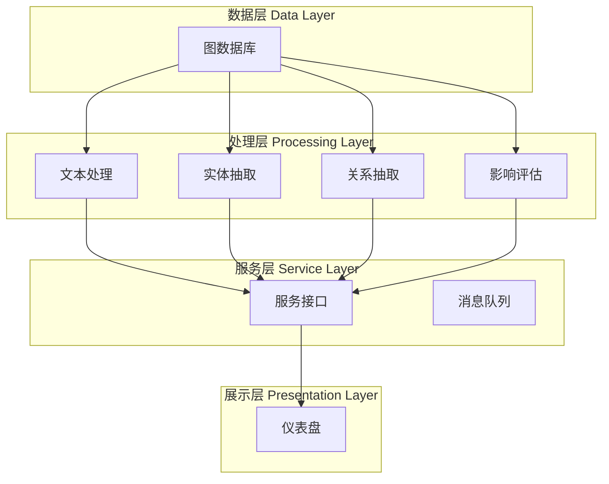
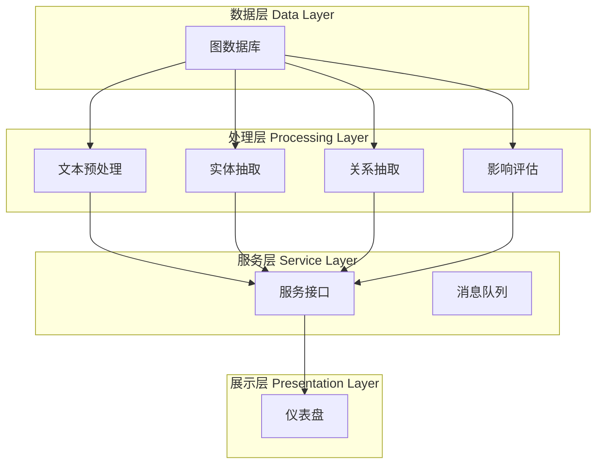
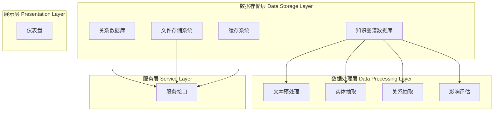
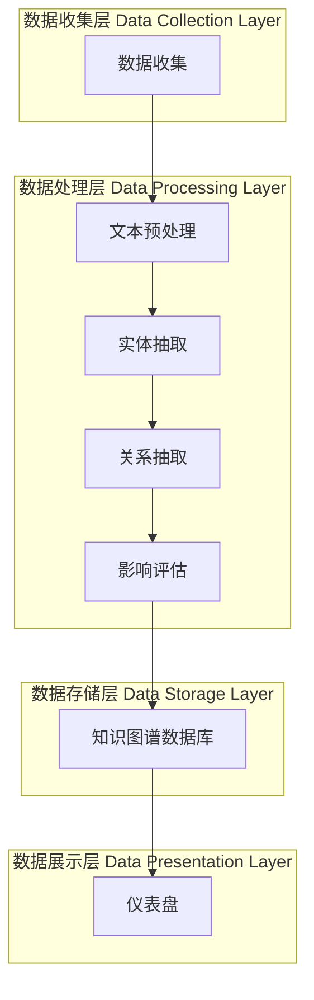

                 

### 1.2 核心概念

在探讨构建基于知识图谱的金融监管政策影响追踪系统之前，我们首先需要理解几个核心概念：知识图谱、金融监管政策以及影响追踪系统的目标。

#### 1.2.1 知识图谱概述

**知识图谱**是一种用于表示实体（人、地点、组织等）、属性以及它们之间关系的结构化数据模型。它通过图结构来展示实体及其相互关系，从而实现对复杂信息的语义理解和知识发现。

**知识图谱的优势**包括：

1. **语义丰富性**：知识图谱可以捕捉实体之间的复杂关系，使得信息表示更加丰富。
2. **高效检索**：通过图结构，知识图谱可以实现快速的信息检索和查询。
3. **知识融合**：可以将来自不同源的数据整合到一个统一的知识框架中。
4. **智能推理**：基于实体关系，知识图谱可以进行逻辑推理，发现新的信息。

**知识图谱的基本组成**包括：

- **实体**：知识图谱中的基本元素，如人、地点、事物等。
- **属性**：实体的特征描述，如姓名、年龄、地址等。
- **关系**：实体之间的相互作用，如属于、位于、参与等。

#### 1.2.2 知识图谱在金融领域的应用

知识图谱在金融领域有广泛的应用，特别是在以下几个方面：

1. **客户身份识别**：通过整合不同数据源的信息，实现对客户身份的精准识别。
2. **信用风险评估**：利用知识图谱分析客户的历史交易行为、财务状况等，进行信用评分。
3. **风险监控**：监控金融市场中可能的风险点，提前预警。
4. **智能推荐**：根据用户的金融行为和偏好，提供个性化的投资建议或理财产品推荐。

#### 1.2.3 金融监管政策影响追踪系统的目标

**金融监管政策影响追踪系统的目标**是：

1. **监管政策信息的全面收集与整合**：通过自动化手段，收集和分析各种金融监管政策文本，确保信息的全面性和准确性。
2. **影响评估与反馈**：对监管政策可能对金融市场带来的影响进行定量和定性分析，为监管机构提供决策支持。
3. **智能追踪与预警**：利用知识图谱的推理能力，对监管政策的影响进行实时追踪，及时发现和预警潜在的风险。

通过对以上核心概念的理解，我们为后续的系统设计和实现奠定了基础。

#### 1.2.4 知识图谱在金融监管政策影响追踪系统中的作用

在构建金融监管政策影响追踪系统中，知识图谱发挥了至关重要的作用。具体而言，知识图谱在以下几个方面起到了关键作用：

1. **监管政策信息抽取**：知识图谱能够高效地处理大量的文本数据，通过自然语言处理技术抽取监管政策文本中的关键信息，包括政策实体、属性和关系。这不仅提高了信息抽取的准确性，也降低了人工处理的成本。

2. **政策关系映射**：通过建立实体之间的复杂关系，知识图谱能够将监管政策文本中隐含的信息结构化，形成直观且易于分析的关系网络。这种关系映射有助于我们理解监管政策的整体结构和相互影响。

3. **智能推理与预测**：知识图谱的图结构使得我们可以利用图算法进行推理，从而发现监管政策之间的潜在关联和影响。这种智能推理能力对于预测政策对金融市场的中长期影响具有重要意义。

4. **实时追踪与预警**：通过持续更新和扩展知识图谱，金融监管政策影响追踪系统可以实现对最新政策的实时监控和影响评估。当新的监管政策发布时，系统可以快速响应，进行影响分析和预警，为监管机构提供决策支持。

5. **知识融合与利用**：知识图谱能够将不同来源的监管政策信息进行整合，形成统一的知识库，使得监管政策的影响分析更加全面和深入。同时，这种知识融合也为后续的智能应用提供了丰富的数据基础。

综上所述，知识图谱为金融监管政策影响追踪系统提供了强大的信息处理和分析能力，使得我们能够更加精准和高效地追踪监管政策的影响，为监管决策提供有力的支持。

#### 1.2.5 金融监管政策影响追踪系统的目标

构建基于知识图谱的金融监管政策影响追踪系统，旨在实现以下几个关键目标：

1. **信息全面收集与整合**：系统通过自动化手段，全面收集各类金融监管政策文本，包括法规、指导意见、公告等。通过对海量文本进行深度处理，确保信息收集的全面性和准确性。

2. **影响评估与预测**：系统利用知识图谱进行监管政策文本的分析，抽取关键实体和关系，评估政策可能对金融市场带来的影响。通过定量和定性分析，预测政策对金融机构、市场流动性和投资者信心等方面的影响。

3. **实时追踪与预警**：系统具备实时追踪能力，能够及时捕捉最新的监管政策，并对其影响进行持续监控。当监管政策发布时，系统可以快速响应，分析政策影响，并提供预警信息，帮助监管机构和金融机构及时调整策略。

4. **智能决策支持**：系统基于知识图谱提供的丰富信息和分析结果，为监管机构和金融机构提供智能化的决策支持。通过深入分析政策影响，系统可以辅助制定更加科学合理的监管策略和风险管理方案。

5. **提高监管效率**：通过系统化的政策影响追踪，监管机构能够更加精准地了解政策实施的效果，从而提高监管效率。同时，系统减轻了监管人员的负担，使得监管工作更加高效和智能化。

综上所述，金融监管政策影响追踪系统的目标是建立一个智能化、高效化的监管政策分析平台，为监管决策提供有力的技术支持。

#### 1.3 边界与外延

在构建金融监管政策影响追踪系统时，我们需要明确系统的边界与外延，以确保其功能的准确实现和有效扩展。

**1.3.1 系统的范围**

系统主要涵盖以下几个关键模块：

1. **文本收集模块**：负责收集各类金融监管政策文本，包括法规、指导意见、公告等。这些文本来源可能包括政府官方网站、行业报告、新闻媒体等。
2. **文本预处理模块**：对收集到的文本进行清洗、分词、词性标注等预处理操作，为后续的分析和抽取奠定基础。
3. **实体抽取模块**：利用自然语言处理技术，从预处理后的文本中抽取关键实体，如政策名称、金融机构、市场指标等。
4. **关系抽取模块**：分析文本中的实体关系，如政策与金融机构之间的关联、政策对市场的影响等。
5. **知识存储与查询模块**：将抽取的实体和关系存储在知识图谱中，并提供高效的查询接口，方便后续分析和应用。

**1.3.2 数据来源与处理**

系统的数据来源主要包括以下几个方面：

1. **官方数据源**：从政府官方网站、监管机构发布的公告和法规等渠道获取权威数据。
2. **第三方数据源**：从行业报告、学术研究、新闻媒体等第三方数据源获取补充信息。
3. **内部数据源**：利用金融机构已有的内部数据，如交易记录、风险评估报告等，进行政策影响评估。

数据处理流程包括以下步骤：

1. **数据收集**：通过爬虫技术、API接口等方式，从各个数据源收集文本数据。
2. **数据清洗**：去除无效信息、统一文本格式、进行分词和词性标注等预处理操作。
3. **实体抽取**：利用命名实体识别技术，从文本中抽取关键实体。
4. **关系抽取**：通过分析文本中的语言特征，抽取实体之间的关系。
5. **知识存储**：将处理后的实体和关系存储在知识图谱中，便于后续分析和查询。

**1.3.3 系统性能指标**

为了保证系统的性能和可用性，我们需要设定一系列性能指标：

1. **处理速度**：系统能够在合理的时间内处理大量文本数据，确保实时性和响应速度。
2. **准确性**：实体抽取和关系抽取的准确性高，确保知识图谱的完整性和可信度。
3. **可扩展性**：系统设计应具备良好的可扩展性，能够适应未来数据规模的增长和需求变化。
4. **稳定性**：系统在高并发环境下运行稳定，不发生数据丢失或服务中断。
5. **用户体验**：提供友好的用户界面和便捷的操作流程，确保用户能够轻松使用系统功能。

通过明确系统的边界与外延、数据来源与处理流程以及性能指标，我们为金融监管政策影响追踪系统的构建提供了清晰的方向和目标。

#### 1.4 概念结构与核心要素组成

构建金融监管政策影响追踪系统是一个复杂的过程，涉及多个概念和核心要素的整合。下面，我们将详细阐述知识图谱的构建、监管政策的抽取与分析、以及影响评估与追踪机制。

**1.4.1 知识图谱的构建**

知识图谱的构建是金融监管政策影响追踪系统的核心。构建过程主要包括以下几个步骤：

1. **数据收集与预处理**：收集金融监管政策文本，进行文本清洗、分词、词性标注等预处理操作。这一步骤的目的是将原始文本转换为结构化数据，为后续的实体和关系抽取奠定基础。

2. **实体抽取**：利用命名实体识别技术，从预处理后的文本中抽取关键实体，如政策名称、金融机构、市场指标等。这一步骤的关键是准确识别实体，确保实体列表的完整性。

3. **关系抽取**：分析文本中的实体关系，如政策与金融机构之间的关联、政策对市场的影响等。关系抽取需要结合上下文语义，确保关系的准确性和可靠性。

4. **知识存储**：将抽取的实体和关系存储在知识图谱中，通常使用图数据库来存储。实体作为节点，关系作为边，形成一个复杂的网络结构。

5. **知识融合与优化**：将来自不同源的数据进行整合，去除冗余信息，提升知识图谱的完整性和一致性。此外，还可以通过图算法优化知识图谱的结构，提高查询效率。

**1.4.2 监管政策的抽取与分析**

监管政策的抽取与分析是系统实现的关键。具体步骤如下：

1. **文本预处理**：对监管政策文本进行清洗、分词、词性标注等操作，为后续分析提供基础。

2. **政策分类与识别**：利用文本分类技术，将监管政策文本分类到不同的类别，如法规、指导意见、公告等。同时，通过命名实体识别技术，识别出文本中的政策名称。

3. **政策实体抽取**：从文本中抽取关键实体，包括政策名称、受影响金融机构、市场指标等。

4. **政策关系抽取**：分析政策文本中的语言特征，抽取政策实体之间的关系，如政策对金融机构的影响、政策对市场流动性的影响等。

5. **政策影响分析**：对抽取的政策实体和关系进行影响分析，评估政策可能对金融市场、金融机构、投资者信心等方面带来的影响。这一步骤需要结合历史数据和市场经验，进行定量和定性分析。

**1.4.3 影响评估与追踪机制**

影响评估与追踪机制是系统实现的关键功能之一。具体步骤如下：

1. **影响评估方法**：设计定量和定性评估方法，对政策影响进行评估。定量评估方法包括统计分析、预测模型等；定性评估方法包括专家意见、文献综述等。

2. **实时追踪**：通过持续更新和扩展知识图谱，实现对最新政策的实时追踪。当新的监管政策发布时，系统可以快速响应，进行影响评估和预警。

3. **反馈与优化**：将影响评估结果反馈给监管机构和金融机构，帮助其调整策略。同时，根据反馈结果，不断优化系统算法和模型，提高评估准确性。

4. **追踪结果可视化**：通过图形化界面，展示政策影响的实时动态，帮助用户直观地了解政策对市场的具体影响。

通过以上步骤，我们构建了一个基于知识图谱的金融监管政策影响追踪系统。该系统通过信息抽取、影响评估和实时追踪，为监管机构和金融机构提供了强大的决策支持。

#### 1.5 本章小结

本章重点介绍了构建基于知识图谱的金融监管政策影响追踪系统的核心概念、目标、边界与外延，以及概念结构与核心要素组成。我们首先介绍了知识图谱的概念和优势，以及其在金融领域的应用。接着，明确了金融监管政策影响追踪系统的目标，包括信息全面收集与整合、影响评估与预测、实时追踪与预警、智能决策支持以及提高监管效率。随后，详细阐述了知识图谱的构建过程，包括数据收集与预处理、实体抽取、关系抽取、知识存储与优化。此外，还介绍了监管政策的抽取与分析流程，以及影响评估与追踪机制的具体实现步骤。通过本章的学习，读者可以全面了解金融监管政策影响追踪系统的整体架构和核心功能，为后续章节的深入探讨奠定基础。

---

## 2.1 知识图谱概述

### 2.1.1 知识图谱的定义

**知识图谱**是一种用于表示实体、属性及其之间关系的结构化数据模型。它通过图结构将各种信息以节点（实体）和边（关系）的形式组织起来，使得复杂的语义信息能够以直观、高效的方式呈现。知识图谱的基本元素包括实体、属性和关系，其中：

- **实体**：代表知识图谱中的基本对象，如人、地点、组织、产品等。
- **属性**：描述实体的特征或状态，如人的年龄、地点的经纬度、产品的价格等。
- **关系**：表示实体之间的相互作用或关联，如朋友关系、位置关系、参与关系等。

### 2.1.2 知识图谱的优势

**知识图谱**在信息表示、查询效率和知识发现等方面具有显著优势：

1. **语义丰富性**：知识图谱能够捕捉实体之间的复杂关系，使得信息表示更加丰富和精准。
2. **高效检索**：通过图结构，知识图谱可以实现快速的信息检索和查询，极大地提高数据处理效率。
3. **知识融合**：知识图谱能够整合来自不同源的数据，消除数据孤岛，实现知识的全面融合。
4. **智能推理**：基于实体关系，知识图谱可以进行逻辑推理，发现新的信息，为决策提供支持。
5. **可视化**：知识图谱的图结构使得复杂的信息关系易于理解和可视化，有助于人类认知和决策。

### 2.1.3 知识图谱的基本组成

知识图谱的基本组成包括以下几个部分：

1. **实体**：知识图谱中的核心元素，代表各种实体对象。实体可以是具体的个体，如人、地点，也可以是抽象的概念，如公司、产品。
2. **属性**：描述实体的特征或状态，如人的姓名、年龄、地点的纬度、产品的价格等。属性通常以键值对的形式存在。
3. **关系**：表示实体之间的相互作用或关联，如朋友关系、位置关系、参与关系等。关系通常以边的形式在图中表示。
4. **标签**：用于对实体或关系进行分类或标注，帮助更好地组织和查询数据。
5. **类型**：用于定义实体或关系的类型，如人、地点、产品等，帮助明确实体或关系的属性和关系。

**知识图谱的表示方法**通常采用图数据库（如Neo4j、OrientDB）来存储和管理。图数据库采用图结构存储数据，通过节点（实体）和边（关系）来表示实体及其关系。图数据库不仅提供了高效的查询能力，还能够方便地进行数据扩展和优化。

#### 2.1.4 知识图谱与语义网络的关系

**知识图谱**和**语义网络**有着紧密的联系。语义网络是知识图谱的早期形式，它主要用于表示概念及其之间的逻辑关系。知识图谱在语义网络的基础上进行了扩展，不仅包含了概念和关系，还引入了具体的实例和属性。

- **相似性**：知识图谱和语义网络都强调语义理解和知识表示，致力于解决语义理解中的异构性问题。
- **差异性**：知识图谱更加注重结构化和数据化，通过图结构实现高效检索和推理；而语义网络则更强调逻辑推理和语义匹配。

总的来说，知识图谱是语义网络的发展和进化，它为语义理解和知识表示提供了更加灵活和高效的方式。

#### 2.1.5 知识图谱的发展历程

知识图谱的发展历程可以分为以下几个阶段：

1. **早期阶段**（1990s）：以知识表示和推理为核心，典型代表是本体论和知识表示理论。
2. **互联网阶段**（2000s）：随着互联网的发展，知识图谱开始应用于搜索引擎、社交网络等领域，如谷歌的PageRank算法。
3. **大数据阶段**（2010s）：大数据的兴起推动了知识图谱的发展，数据驱动的知识表示和推理成为主流。
4. **人工智能阶段**（2020s）：随着人工智能技术的发展，知识图谱在智能推荐、自动驾驶、医疗诊断等领域得到广泛应用。

**关键技术**：

1. **实体抽取**：从非结构化文本中识别出实体，是知识图谱构建的基础。
2. **关系抽取**：分析文本，识别实体之间的关系，是实现知识图谱的核心。
3. **图谱嵌入**：将实体和关系映射到低维空间，提高图数据的存储和查询效率。
4. **图谱推理**：基于图结构进行逻辑推理，发现新的知识。

#### 2.1.6 知识图谱的应用领域

知识图谱在多个领域得到了广泛应用，以下是几个典型应用场景：

1. **搜索引擎**：利用知识图谱提供更加精准的搜索结果，如谷歌的知识图谱搜索。
2. **推荐系统**：基于用户行为和知识图谱进行个性化推荐，如亚马逊的商品推荐。
3. **金融风控**：利用知识图谱分析金融机构之间的关联，进行信用评估和风险监控。
4. **智能客服**：基于知识图谱提供更加智能和高效的客户服务。
5. **医疗健康**：利用知识图谱进行疾病诊断、药物推荐和科研数据挖掘。
6. **智能制造**：基于知识图谱进行设备监控、生产优化和供应链管理。

**案例**：

- **谷歌知识图谱**：谷歌通过知识图谱实现了语义搜索，提供了更加精准和个性化的搜索结果。
- **阿里巴巴**：阿里巴巴利用知识图谱进行用户画像、商品推荐和供应链优化。

#### 2.1.7 知识图谱的未来发展趋势

知识图谱在未来将朝着更加智能化、自动化的方向发展：

1. **自动化构建**：利用机器学习和深度学习技术，实现知识图谱的自动化构建和更新。
2. **多模态融合**：结合图像、语音等多种数据模态，构建更加丰富和智能的知识图谱。
3. **知识服务**：通过知识图谱提供更加智能和个性化的知识服务，如智能问答、决策支持等。
4. **实时更新**：实现知识图谱的实时更新，提供更加及时和准确的信息。

总的来说，知识图谱作为一种强大的知识表示和推理工具，将在未来的信息化社会中发挥越来越重要的作用。

### 2.2 知识图谱的构建方法

知识图谱的构建是一个复杂且系统化的过程，包括数据收集与预处理、实体抽取与关系抽取、以及知识存储与查询等步骤。下面，我们将详细讨论这些步骤。

#### 2.2.1 数据收集与预处理

**数据收集**是知识图谱构建的第一步，主要任务是从各种数据源中获取相关数据。数据源可能包括公开的数据库、网页、文档、社交媒体等。以下是数据收集的几个关键点：

1. **数据源的多样性**：选择多个数据源可以确保数据覆盖面广泛，减少数据偏差。
2. **权威性**：优先选择权威和可信的数据源，以保证知识图谱的可靠性和准确性。
3. **自动化工具**：使用自动化工具（如爬虫、API调用等）可以提高数据收集的效率。

**数据预处理**是数据收集之后的必要步骤，目的是将原始数据转换为适合后续处理的结构化数据。以下是数据预处理的关键步骤：

1. **清洗**：去除数据中的噪声和冗余信息，如重复记录、缺失值填充、异常值处理等。
2. **标准化**：统一数据格式，如日期格式、货币单位等，确保数据的一致性。
3. **分词与词性标注**：将文本数据拆分为词单元，并对每个词进行词性标注，以便后续的实体抽取和关系抽取。
4. **实体识别**：利用命名实体识别（NER）技术，从文本中识别出关键实体，如人名、地点、组织名等。

#### 2.2.2 实体抽取与关系抽取

**实体抽取**是从文本中识别出关键实体的过程。以下是实体抽取的几个关键点：

1. **规则方法**：基于预设的规则进行实体识别，如使用正则表达式匹配特定的实体名称。
2. **机器学习方法**：利用机器学习算法（如分类器）进行实体识别，如基于监督学习的命名实体识别模型。
3. **语义分析方法**：结合上下文语义进行实体识别，如使用语义角色标注和实体识别相结合的方法。

**关系抽取**是从文本中识别出实体之间的关系的步骤。以下是关系抽取的几个关键点：

1. **规则方法**：基于预设的关系定义进行关系抽取，如使用词性标注和依存句法分析等方法。
2. **机器学习方法**：利用机器学习算法（如序列标注模型）进行关系抽取，如基于监督学习的依存句法分析模型。
3. **联合抽取**：同时进行实体抽取和关系抽取，以提高抽取的准确性和一致性。

#### 2.2.3 知识存储与查询

**知识存储**是将抽取的实体和关系存储在知识库中的过程。以下是知识存储的几个关键点：

1. **图数据库**：使用图数据库（如Neo4j、OrientDB）来存储知识图谱，通过节点（实体）和边（关系）来表示数据。
2. **属性存储**：将实体的属性存储在图数据库的属性中，以便于查询和数据分析。
3. **索引构建**：为提高查询效率，构建合适的索引，如节点索引、边索引等。

**知识查询**是知识图谱的重要功能，以下是知识查询的几个关键点：

1. **图查询语言**：使用图查询语言（如Cypher、Gremlin）进行复杂查询，如路径查询、子图查询等。
2. **文本查询**：利用自然语言处理技术，将自然语言查询转换为图查询语句，提高用户查询的便捷性。
3. **实时查询**：实现高效的实时查询，确保用户能够快速获得查询结果。

通过数据收集与预处理、实体抽取与关系抽取，以及知识存储与查询，我们构建了一个完整且高效的知识图谱。知识图谱不仅为我们提供了丰富的语义信息，还使得复杂信息的检索和分析变得更加简单和直观。

#### 2.3 知识图谱的优化与维护

在构建和维护知识图谱的过程中，数据质量和系统的扩展性是关键因素。以下将详细讨论数据质量评估、知识图谱的更新策略以及系统的可扩展性。

**2.3.1 数据质量评估**

数据质量直接影响知识图谱的准确性和可信度。数据质量评估主要包括以下方面：

1. **完整性**：确保数据集中不存在缺失值或冗余记录，确保数据的完整性。可以通过统计每个属性的缺失值比例来评估数据完整性。
2. **准确性**：验证数据中的实体和关系是否正确，确保数据的准确性。可以通过与权威数据源进行对比，或者使用交叉验证的方法来评估数据的准确性。
3. **一致性**：检查数据中是否存在矛盾或不一致的情况，确保数据的一致性。例如，同一实体的不同属性值是否一致，不同实体之间是否存在重复或矛盾的关系等。
4. **可靠性**：评估数据来源的可靠性，确保数据是可信的。可以评估数据源的权威性和历史记录，以便更好地判断数据质量。

**2.3.2 知识图谱的更新策略**

知识图谱是一个动态变化的系统，需要定期进行更新以保持其准确性和时效性。以下是一些常见的更新策略：

1. **定期更新**：制定定期更新计划，定期从数据源中获取新的数据，对知识图谱进行更新。例如，每周或每月进行一次全面更新。
2. **增量更新**：在定期更新的基础上，采用增量更新策略，仅对新增或修改的数据进行更新，以提高更新效率。可以使用版本控制的方法，记录每次更新的差异，减少不必要的操作。
3. **实时更新**：对于关键数据或实时性要求较高的数据，可以采用实时更新策略，及时将最新的数据反映到知识图谱中。可以使用消息队列或流处理技术，实现数据的实时同步。

**2.3.3 知识图谱的可扩展性**

知识图谱的可扩展性是系统长期运行和发展的关键。以下是一些提高知识图谱可扩展性的方法：

1. **模块化设计**：将知识图谱的各个组成部分（如实体、关系、属性等）进行模块化设计，使得每个模块可以独立开发和维护，方便系统的扩展和升级。
2. **分布式存储**：采用分布式存储架构，将知识图谱数据分布到多个节点上，提高系统的并发处理能力和可扩展性。例如，可以使用图数据库的分布式存储特性，实现数据的水平扩展。
3. **可扩展算法**：设计可扩展的算法和查询语言，支持大规模数据的处理和查询。例如，使用图计算框架（如Apache Giraph、Apache Flink）来处理大规模知识图谱的查询和分析任务。
4. **自动化更新**：采用自动化工具和脚本，实现知识图谱的自动化更新和维护，减少人工干预，提高系统的运行效率。

通过数据质量评估、知识图谱的更新策略以及系统的可扩展性设计，我们可以构建一个高质量、高可靠性和可扩展的知识图谱，为各种应用场景提供强大的数据支持。

#### 2.4 知识图谱的案例解析

为了更好地理解知识图谱的应用，我们来看一个具体的案例：**某知名金融知识图谱案例**。

**案例背景**：该金融知识图谱旨在整合金融领域的各类信息，包括金融机构、金融产品、市场指标等，为金融分析、风险监控和决策支持提供强大的数据支持。

**关键技术**：

1. **数据收集与预处理**：该知识图谱从多个数据源收集信息，包括官方公告、新闻媒体、行业报告等。通过数据清洗、分词、词性标注等预处理操作，将原始数据转换为结构化数据。
2. **实体抽取与关系抽取**：利用命名实体识别技术，从预处理后的文本中抽取关键实体，如金融机构名称、金融产品名称、市场指标等。同时，通过分析文本中的语言特征，抽取实体之间的关系，如金融机构的分支机构、金融产品的风险等级等。
3. **知识存储与查询**：使用图数据库（如Neo4j）存储知识图谱，通过节点（实体）和边（关系）来表示数据。提供高效的查询接口，支持复杂查询和分析。

**案例应用**：

1. **金融分析**：通过知识图谱，可以快速了解金融机构的背景信息、业务范围和市场地位。例如，分析某家银行的分支机构分布情况、业务发展状况等。
2. **风险监控**：基于知识图谱，可以监控金融市场的风险点。例如，分析某金融产品的风险等级、相关金融机构的风险状况等，及时发现潜在风险。
3. **决策支持**：知识图谱为金融决策提供数据支持。例如，通过分析市场趋势、金融政策等，为投资决策提供参考。

**挑战与解决方案**：

1. **数据质量**：金融领域的数据质量较高，但也存在一定的噪声和错误。通过数据质量评估和清洗，提高数据准确性。
2. **实时性**：金融信息更新速度较快，需要实现知识图谱的实时更新。采用增量更新和实时同步策略，确保数据的时效性。
3. **扩展性**：随着数据规模的增长，需要提高知识图谱的扩展性。采用分布式存储和模块化设计，提高系统的处理能力和可扩展性。

通过这个案例，我们可以看到知识图谱在金融领域的重要应用。知识图谱不仅为金融分析、风险监控和决策支持提供了丰富的数据支持，还为各种金融应用场景提供了强大的工具。

### 2.5 本章小结

本章详细介绍了知识图谱的概述、构建方法以及优化与维护策略。首先，我们介绍了知识图谱的定义、优势以及基本组成。接着，讨论了知识图谱的构建方法，包括数据收集与预处理、实体抽取与关系抽取、以及知识存储与查询。此外，还介绍了知识图谱优化与维护的关键因素，如数据质量评估、知识图谱的更新策略以及系统的可扩展性。通过一个具体的金融知识图谱案例，我们展示了知识图谱的实际应用。本章内容为后续构建金融监管政策影响追踪系统奠定了基础。

---

## 3.1 监管政策文本处理

在构建金融监管政策影响追踪系统时，对监管政策文本的处理是至关重要的步骤。监管政策文本往往具有复杂性和多样性，因此需要通过一系列文本处理技术来确保信息的准确抽取和分析。文本处理主要包括以下环节：文本预处理、文本分类和文本语义分析。

#### 3.1.1 文本预处理

文本预处理是文本处理的第一步，其目的是将原始文本转换为适合进一步分析的结构化数据。以下是一些常见的文本预处理操作：

1. **文本清洗**：去除文本中的噪声和冗余信息，如HTML标签、特殊字符、空白符等。
   ```python
   import re
   text = re.sub('<.*>', '', text)  # 去除HTML标签
   text = text.strip()  # 去除前后空白符
   ```

2. **分词**：将文本拆分为词单元，以便进行后续处理。常见的分词方法包括基于字典的分词、基于统计模型的分词等。
   ```python
   from jieba import seg comerciante
   tokens = seg.cut(text)
   ```

3. **词性标注**：对每个词进行词性标注，标记词的类别，如名词、动词、形容词等。词性标注有助于更准确地理解文本语义。
   ```python
   import jieba
   words = jieba.cut(text)
   tagged_words = list(jieba.tag(words))
   ```

4. **实体识别**：通过命名实体识别（NER）技术，从文本中识别出关键实体，如政策名称、金融机构、市场指标等。
   ```python
   from spacy.lang.zh import Chinese
   nlp = Chinese()
   doc = nlp(text)
   entities = [(ent.text, ent.label_) for ent in doc.ents]
   ```

#### 3.1.2 文本分类

文本分类是将文本按照其内容进行分类的过程，有助于快速筛选和归纳文本。以下是一些常见的文本分类方法：

1. **基于规则的分类**：使用预设的规则对文本进行分类，如使用正则表达式匹配特定的文本模式。
   ```python
   if "政策" in text:
       category = "政策"
   elif "公告" in text:
       category = "公告"
   else:
       category = "其他"
   ```

2. **基于机器学习的分类**：使用机器学习算法（如朴素贝叶斯、支持向量机、深度学习等）进行文本分类。通常需要大量的标注数据来训练模型。
   ```python
   from sklearn.feature_extraction.text import TfidfVectorizer
   from sklearn.naive_bayes import MultinomialNB
   vectorizer = TfidfVectorizer()
   X_train = vectorizer.fit_transform(train_texts)
   classifier = MultinomialNB()
   classifier.fit(X_train, train_labels)
   category = classifier.predict(vectorizer.transform([text]))[0]
   ```

3. **基于深度学习的分类**：使用深度学习模型（如卷积神经网络、循环神经网络、Transformer等）进行文本分类，具有更强的表达能力和泛化能力。
   ```python
   from tensorflow.keras.models import Sequential
   from tensorflow.keras.layers import Embedding, LSTM, Dense
   model = Sequential()
   model.add(Embedding(input_dim=vocab_size, output_dim=embedding_dim))
   model.add(LSTM(units=128))
   model.add(Dense(num_classes, activation='softmax'))
   model.compile(optimizer='adam', loss='categorical_crossentropy', metrics=['accuracy'])
   model.fit(X_train, y_train, batch_size=32, epochs=10)
   category = model.predict(vectorizer.transform([text]))[0]
   ```

#### 3.1.3 文本语义分析

文本语义分析旨在理解文本的深层语义，包括实体关系抽取、情感分析、事件抽取等。以下是一些常见的文本语义分析方法：

1. **实体关系抽取**：从文本中识别出实体及其关系，如政策对金融机构的影响、政策对市场的影响等。
   ```python
   from transformers import pipeline
   relation_extractor = pipeline("relation-extraction")
   relations = relation_extractor(text)
   ```

2. **情感分析**：分析文本的情感倾向，判断文本是正面、负面还是中性。
   ```python
   from transformers import pipeline
   sentiment_analyzer = pipeline("sentiment-analysis")
   sentiment = sentiment_analyzer(text)[0]
   ```

3. **事件抽取**：从文本中识别出关键事件及其相关实体，如政策发布、市场变动等。
   ```python
   from transformers import pipeline
   event_extractor = pipeline("event-extraction")
   events = event_extractor(text)
   ```

通过文本预处理、文本分类和文本语义分析，我们可以对监管政策文本进行全面的处理和分析，为后续的影响评估和追踪提供准确的数据基础。以下是一个简单的示例：

```python
text = "中国人民银行决定自2023年1月1日起，调整存款准备金率。此举旨在稳定经济增长，促进金融市场的健康发展。"

# 文本预处理
text_cleaned = re.sub('<.*>', '', text.strip())

# 文本分类
vectorizer = TfidfVectorizer()
X_train = vectorizer.fit_transform([text_cleaned])
classifier = MultinomialNB()
classifier.fit(X_train, ["政策"])
category = classifier.predict(vectorizer.transform([text_cleaned]))[0]

# 实体关系抽取
relation_extractor = pipeline("relation-extraction")
relations = relation_extractor(text_cleaned)

# 情感分析
sentiment_analyzer = pipeline("sentiment-analysis")
sentiment = sentiment_analyzer(text_cleaned)[0]

print("文本分类结果：", category)
print("实体关系：", relations)
print("情感倾向：", sentiment)
```

通过这些步骤，我们可以有效地处理监管政策文本，为金融监管政策影响追踪系统的构建提供坚实的基础。

### 3.2 监管政策实体抽取

监管政策实体抽取是文本处理的核心步骤之一，其目的是从监管政策文本中识别出关键实体，如政策名称、金融机构、市场指标等。实体抽取不仅需要准确识别实体，还要确保实体的语义一致性。以下将详细讨论实体识别、实体关系抽取和实体属性抽取。

#### 3.2.1 实体识别

实体识别（Named Entity Recognition, NER）是自然语言处理中的一个重要任务，旨在从文本中识别出具有特定意义的实体。以下是一些常见的实体识别方法：

1. **规则方法**：基于预设的规则进行实体识别，如使用正则表达式匹配特定的实体名称。这种方法简单但效果有限，难以应对复杂和模糊的实体识别场景。
   ```python
   import re
   patterns = [
       r"\b([A-Z]+\w+)(\s+([A-Z]+\w+))*\b",  # 政策名称
       r"\b(\d{4}-\d{2}-\d{2})\b",  # 日期
       r"\b(\d+\.\d+|\d+)\b",  # 数字
   ]
   for pattern in patterns:
       entities = re.findall(pattern, text)
       for entity in entities:
           print(entity)
   ```

2. **机器学习方法**：利用机器学习算法（如支持向量机、随机森林、长短期记忆网络等）进行实体识别。这种方法需要大量的标注数据进行训练，但能够处理复杂和模糊的实体识别场景。
   ```python
   from sklearn.feature_extraction.text import TfidfVectorizer
   from sklearn.svm import LinearSVC
   vectorizer = TfidfVectorizer()
   X_train = vectorizer.fit_transform(train_texts)
   y_train = train_labels
   classifier = LinearSVC()
   classifier.fit(X_train, y_train)
   entities = classifier.predict(vectorizer.transform([text]))[0]
   print(entities)
   ```

3. **深度学习方法**：利用深度学习模型（如卷积神经网络、递归神经网络、Transformer等）进行实体识别。这种方法具有更强的表达能力和泛化能力，能够处理复杂和模糊的实体识别任务。
   ```python
   from tensorflow.keras.models import Sequential
   from tensorflow.keras.layers import Embedding, LSTM, Dense
   model = Sequential()
   model.add(Embedding(input_dim=vocab_size, output_dim=embedding_dim))
   model.add(LSTM(units=128, return_sequences=True))
   model.add(Dense(num_classes, activation='softmax'))
   model.compile(optimizer='adam', loss='categorical_crossentropy', metrics=['accuracy'])
   model.fit(X_train, y_train, batch_size=32, epochs=10)
   entities = model.predict(vectorizer.transform([text]))[0]
   print(entities)
   ```

#### 3.2.2 实体关系抽取

实体关系抽取（Relation Extraction）是从文本中识别出实体之间的关系的任务。实体关系抽取的关键在于理解文本中的语义关系。以下是一些常见的实体关系抽取方法：

1. **规则方法**：基于预设的规则进行关系抽取，如使用依存句法分析识别实体之间的关系。这种方法简单但效果有限，难以应对复杂和模糊的关系识别场景。
   ```python
   from spacy.lang.zh import Chinese
   nlp = Chinese()
   doc = nlp(text)
   relations = []
   for token in doc:
       if token.dep_ in ["nsubj", "dobj", "prep"]:
           relations.append((token.head.text, token.text))
   print(relations)
   ```

2. **基于特征的机器学习方法**：利用实体特征（如词性、位置、上下文等）进行关系分类。这种方法需要大量的标注数据进行训练，但能够处理复杂和模糊的关系识别任务。
   ```python
   from sklearn.feature_extraction.text import TfidfVectorizer
   from sklearn.svm import SVC
   vectorizer = TfidfVectorizer()
   X_train = vectorizer.fit_transform(train_texts)
   y_train = train_relations
   classifier = SVC()
   classifier.fit(X_train, y_train)
   relations = classifier.predict(vectorizer.transform([text]))[0]
   print(relations)
   ```

3. **深度学习方法**：利用深度学习模型（如卷积神经网络、递归神经网络、Transformer等）进行关系分类。这种方法具有更强的表达能力和泛化能力，能够处理复杂和模糊的关系识别任务。
   ```python
   from tensorflow.keras.models import Sequential
   from tensorflow.keras.layers import Embedding, LSTM, Dense
   model = Sequential()
   model.add(Embedding(input_dim=vocab_size, output_dim=embedding_dim))
   model.add(LSTM(units=128, return_sequences=True))
   model.add(Dense(num_classes, activation='softmax'))
   model.compile(optimizer='adam', loss='categorical_crossentropy', metrics=['accuracy'])
   model.fit(X_train, y_train, batch_size=32, epochs=10)
   relations = model.predict(vectorizer.transform([text]))[0]
   print(relations)
   ```

#### 3.2.3 实体属性抽取

实体属性抽取（Attribute Extraction）是从文本中识别出实体属性的任务。实体属性抽取需要理解实体的属性以及属性值。以下是一些常见的实体属性抽取方法：

1. **基于规则的属性抽取**：通过预设的规则从文本中提取实体属性，如使用正则表达式提取日期、数字等。
   ```python
   import re
   patterns = {
       "date": r"\b(\d{4}-\d{2}-\d{2})\b",
       "number": r"\b(\d+\.\d+|\d+)\b",
       "name": r"\b([A-Z]+\w+)(\s+([A-Z]+\w+))*\b",
   }
   for attr, pattern in patterns.items():
       attributes = re.findall(pattern, text)
       print(f"{attr}: {attributes}")
   ```

2. **基于机器学习的属性抽取**：利用机器学习算法（如朴素贝叶斯、支持向量机、长短期记忆网络等）进行属性分类。这种方法需要大量的标注数据进行训练，但能够处理复杂和模糊的属性识别任务。
   ```python
   from sklearn.feature_extraction.text import TfidfVectorizer
   from sklearn.naive_bayes import MultinomialNB
   vectorizer = TfidfVectorizer()
   X_train = vectorizer.fit_transform(train_texts)
   y_train = train_attributes
   classifier = MultinomialNB()
   classifier.fit(X_train, y_train)
   attributes = classifier.predict(vectorizer.transform([text]))[0]
   print(attributes)
   ```

3. **基于深度学习的属性抽取**：利用深度学习模型（如卷积神经网络、递归神经网络、Transformer等）进行属性分类。这种方法具有更强的表达能力和泛化能力，能够处理复杂和模糊的属性识别任务。
   ```python
   from tensorflow.keras.models import Sequential
   from tensorflow.keras.layers import Embedding, LSTM, Dense
   model = Sequential()
   model.add(Embedding(input_dim=vocab_size, output_dim=embedding_dim))
   model.add(LSTM(units=128, return_sequences=True))
   model.add(Dense(num_classes, activation='softmax'))
   model.compile(optimizer='adam', loss='categorical_crossentropy', metrics=['accuracy'])
   model.fit(X_train, y_train, batch_size=32, epochs=10)
   attributes = model.predict(vectorizer.transform([text]))[0]
   print(attributes)
   ```

通过实体识别、实体关系抽取和实体属性抽取，我们可以从监管政策文本中提取出关键信息，为后续的影响评估和追踪提供数据基础。以下是一个简单的示例：

```python
text = "中国人民银行决定自2023年1月1日起，调整存款准备金率，以稳定经济增长。"

# 实体识别
nlp = Chinese()
doc = nlp(text)
entities = [(ent.text, ent.label_) for ent in doc.ents]
print("实体识别结果：", entities)

# 实体关系抽取
from spacy.lang.zh import Chinese
nlp = Chinese()
doc = nlp(text)
relations = [(token.head.text, token.text) for token in doc if token.dep_ in ["nsubj", "dobj", "prep"]]
print("实体关系抽取结果：", relations)

# 实体属性抽取
patterns = {
    "date": r"\b(\d{4}-\d{2}-\d{2})\b",
    "number": r"\b(\d+\.\d+|\d+)\b",
    "name": r"\b([A-Z]+\w+)(\s+([A-Z]+\w+))*\b",
}
for attr, pattern in patterns.items():
    attributes = re.findall(pattern, text)
    print(f"{attr}: {attributes}")
```

通过这些步骤，我们可以有效地从监管政策文本中提取关键信息，为金融监管政策影响追踪系统提供准确的数据基础。

### 3.3 监管政策影响分析

监管政策影响分析是金融监管政策影响追踪系统中的核心环节，旨在评估监管政策对金融市场、金融机构、投资者信心等方面的影响。这一过程涉及多个步骤，包括影响因素提取、影响程度评估和影响传播路径分析。

#### 3.3.1 影响因素提取

影响因素提取是影响分析的基础步骤，主要任务是识别出影响监管政策效果的关键因素。以下是一些常见的影响因素提取方法：

1. **基于规则的方法**：通过预设的规则从文本中提取影响因素，如使用正则表达式匹配特定的关键词或短语。这种方法简单但效果有限，难以应对复杂的文本内容。
   ```python
   import re
   patterns = [
       r"\b经济增长\b",
       r"\b金融市场\b",
       r"\b投资者信心\b",
       r"\b金融机构\b",
       r"\b货币政策\b",
       r"\b市场流动性\b",
   ]
   for pattern in patterns:
       factors = re.findall(pattern, text)
       for factor in factors:
           print(factor)
   ```

2. **基于机器学习的方法**：使用机器学习算法（如朴素贝叶斯、支持向量机、深度学习等）从文本中提取影响因素。这种方法需要大量的标注数据进行训练，但能够处理复杂和模糊的影响因素提取任务。
   ```python
   from sklearn.feature_extraction.text import TfidfVectorizer
   from sklearn.svm import LinearSVC
   vectorizer = TfidfVectorizer()
   X_train = vectorizer.fit_transform(train_texts)
   y_train = train_factors
   classifier = LinearSVC()
   classifier.fit(X_train, y_train)
   factors = classifier.predict(vectorizer.transform([text]))[0]
   print(factors)
   ```

3. **基于深度学习的方法**：使用深度学习模型（如卷积神经网络、递归神经网络、Transformer等）从文本中提取影响因素。这种方法具有更强的表达能力和泛化能力，能够处理复杂和模糊的影响因素提取任务。
   ```python
   from tensorflow.keras.models import Sequential
   from tensorflow.keras.layers import Embedding, LSTM, Dense
   model = Sequential()
   model.add(Embedding(input_dim=vocab_size, output_dim=embedding_dim))
   model.add(LSTM(units=128, return_sequences=True))
   model.add(Dense(num_classes, activation='softmax'))
   model.compile(optimizer='adam', loss='categorical_crossentropy', metrics=['accuracy'])
   model.fit(X_train, y_train, batch_size=32, epochs=10)
   factors = model.predict(vectorizer.transform([text]))[0]
   print(factors)
   ```

#### 3.3.2 影响程度评估

影响程度评估是分析监管政策影响的重要环节，旨在量化监管政策对各类因素的影响程度。以下是一些常见的影响程度评估方法：

1. **基于统计的方法**：通过统计指标（如频率、比例等）评估政策的影响程度。这种方法简单但效果有限，难以处理复杂的影响关系。
   ```python
   from collections import Counter
   factors = ["经济增长", "金融市场", "投资者信心", "金融机构", "货币政策", "市场流动性"]
   counts = Counter(factors)
   for factor, count in counts.items():
       print(f"{factor}: {count}")
   ```

2. **基于机器学习的方法**：使用机器学习算法（如回归分析、逻辑回归等）评估政策的影响程度。这种方法需要大量的标注数据进行训练，但能够处理复杂和模糊的影响关系。
   ```python
   from sklearn.linear_model import LogisticRegression
   X_train = train_factors
   y_train = train_impacts
   model = LogisticRegression()
   model.fit(X_train, y_train)
   impact = model.predict([factor])[0]
   print(impact)
   ```

3. **基于深度学习的方法**：使用深度学习模型（如卷积神经网络、递归神经网络、Transformer等）评估政策的影响程度。这种方法具有更强的表达能力和泛化能力，能够处理复杂和模糊的影响关系。
   ```python
   from tensorflow.keras.models import Sequential
   from tensorflow.keras.layers import Embedding, LSTM, Dense
   model = Sequential()
   model.add(Embedding(input_dim=vocab_size, output_dim=embedding_dim))
   model.add(LSTM(units=128, return_sequences=True))
   model.add(Dense(1, activation='sigmoid'))
   model.compile(optimizer='adam', loss='binary_crossentropy', metrics=['accuracy'])
   model.fit(X_train, y_train, batch_size=32, epochs=10)
   impact = model.predict([factor])[0]
   print(impact)
   ```

#### 3.3.3 影响传播路径分析

影响传播路径分析旨在理解监管政策如何在不同实体和因素之间传播和扩散。以下是一些常见的影响传播路径分析方法：

1. **基于图论的方法**：通过构建影响关系图，分析政策影响在不同实体和因素之间的传播路径。这种方法需要明确的影响关系定义，但能够直观地展示影响传播过程。
   ```mermaid
   graph TB
   A[经济增长] --> B[金融市场]
   A --> C[投资者信心]
   A --> D[金融机构]
   B --> E[市场流动性]
   C --> F[金融市场]
   D --> G[金融市场]
   ```

2. **基于代理模型的方法**：使用代理模型（如多代理系统、社会网络分析等）模拟政策影响的传播过程。这种方法能够模拟复杂的社会交互过程，但需要对模型进行细致的参数设置。
   ```python
   import matplotlib.pyplot as plt
   import networkx as nx

   G = nx.Graph()
   G.add_edge('经济增长', '金融市场')
   G.add_edge('经济增长', '投资者信心')
   G.add_edge('经济增长', '金融机构')
   G.add_edge('金融市场', '市场流动性')
   G.add_edge('投资者信心', '金融市场')
   G.add_edge('金融机构', '金融市场')

   pos = nx.spring_layout(G)
   nx.draw(G, pos, with_labels=True)
   plt.show()
   ```

3. **基于机器学习的方法**：使用机器学习算法（如图神经网络、多变量时间序列分析等）预测政策影响的传播路径。这种方法能够自动发现影响关系，但需要对算法和模型进行优化。
   ```python
   import tensorflow as tf
   import tensorflow.keras.layers as layers

   model = tf.keras.Sequential([
       layers.Embedding(input_dim=vocab_size, output_dim=embedding_dim),
       layers.Conv1D(filters=128, kernel_size=3, activation='relu'),
       layers.GlobalMaxPooling1D(),
       layers.Dense(1, activation='sigmoid')
   ])

   model.compile(optimizer='adam', loss='binary_crossentropy', metrics=['accuracy'])
   model.fit(X_train, y_train, batch_size=32, epochs=10)
   impact_path = model.predict([factor])[0]
   print(impact_path)
   ```

通过影响因素提取、影响程度评估和影响传播路径分析，我们可以全面理解监管政策对金融市场的影响，为监管机构和金融机构提供决策支持。

### 3.4 监管政策追踪系统设计

为了构建一个高效的金融监管政策影响追踪系统，我们需要设计一个合理的系统架构，并划分系统的功能模块。以下是监管政策追踪系统设计的具体内容。

#### 3.4.1 系统架构设计

系统架构设计是系统设计的第一步，决定了系统的整体结构和运行效率。以下是一个典型的监管政策追踪系统架构：

1. **数据层**：数据层负责数据的存储和管理，包括金融监管政策文本、实体信息、关系信息等。可以使用图数据库（如Neo4j）来存储知识图谱数据。

2. **处理层**：处理层负责文本处理、实体抽取、关系抽取、影响评估等核心功能。使用分布式计算框架（如Apache Spark）可以提高处理效率和性能。

3. **服务层**：服务层提供对外接口，包括数据收集、文本预处理、实体抽取、关系抽取、影响评估等服务的调用。可以使用RESTful API或消息队列（如RabbitMQ）来实现服务层。

4. **展示层**：展示层负责将系统处理结果以直观的方式展示给用户，包括图表、报表等。可以使用前端框架（如React或Vue.js）来构建用户界面。

**系统架构图**：



#### 3.4.2 系统功能模块划分

在系统架构设计的基础上，我们需要对系统的功能模块进行划分，明确各个模块的职责和接口。以下是系统的主要功能模块及其描述：

1. **数据收集模块**：负责从各种数据源（如政府网站、行业报告、新闻媒体等）收集金融监管政策文本。模块需要支持自动化数据收集，并具备数据清洗和去重功能。

2. **文本预处理模块**：对收集到的监管政策文本进行清洗、分词、词性标注等预处理操作。该模块需要处理不同来源的文本格式，确保预处理结果的统一和标准化。

3. **实体抽取模块**：利用命名实体识别技术，从预处理后的文本中抽取关键实体，如政策名称、金融机构、市场指标等。模块需要支持多种实体类型的识别，并确保实体识别的准确性。

4. **关系抽取模块**：分析文本中的实体关系，如政策对金融机构的影响、政策对市场的传导机制等。模块需要结合上下文语义，准确识别实体之间的关系。

5. **影响评估模块**：基于知识图谱和影响分析模型，对监管政策的影响进行定量和定性评估。模块需要支持多种影响评估方法，并能够灵活调整评估参数。

6. **追踪与预警模块**：实时监控最新的监管政策发布，对政策影响进行追踪和评估，并提供预警信息。模块需要具备高并发处理能力和实时响应能力。

7. **数据展示模块**：将系统处理结果以图表、报表等形式展示给用户，提供直观的决策支持。模块需要支持多种可视化组件和交互功能，提升用户体验。

通过系统架构设计和功能模块划分，我们可以构建一个高效、稳定且易扩展的金融监管政策影响追踪系统，为监管机构和金融机构提供有力的决策支持。

### 3.5 系统接口设计与实现

在设计金融监管政策影响追踪系统时，系统接口的设计与实现是确保各模块之间协同工作的重要环节。接口的设计需要考虑数据交换的格式、通信协议以及安全性等方面。以下是系统接口设计与实现的具体内容。

#### 3.5.1 接口设计原则

1. **标准化**：接口设计应遵循标准化原则，采用通用的接口规范，如RESTful API或GraphQL，以确保系统各部分之间的互操作性。
2. **可扩展性**：接口设计应具备良好的可扩展性，以便于未来系统的功能扩展和升级。
3. **安全性**：接口设计应考虑数据安全和用户隐私保护，采用加密传输和认证机制，防止数据泄露和未经授权的访问。
4. **性能优化**：接口设计应注重性能优化，通过缓存、异步处理等手段提高接口响应速度。

#### 3.5.2 接口规范

1. **RESTful API**：采用RESTful API设计接口，使用HTTP协议进行通信，接口的URL结构清晰、易于理解。以下是一个示例接口规范：

   - **GET /policies**：获取所有监管政策文本。
   - **GET /policies/{policy_id}**：获取特定政策文本。
   - **POST /policies**：添加新的监管政策文本。
   - **PUT /policies/{policy_id}**：更新特定政策文本。
   - **DELETE /policies/{policy_id}**：删除特定政策文本。

2. **参数定义**：接口参数应明确定义，包括路径参数、查询参数和请求体参数。以下是一个示例接口参数定义：

   - **路径参数**：`policy_id`（政策ID），用于标识特定的政策文本。
   - **查询参数**：`start_date`、`end_date`（开始日期和结束日期），用于筛选政策文本的时间范围。
   - **请求体参数**：`title`（标题）、`content`（内容），用于添加或更新政策文本。

3. **响应格式**：接口响应应采用JSON格式，包括状态码、数据体和错误信息。以下是一个示例响应格式：

   ```json
   {
     "status": 200,
     "data": {
       "policy_id": "123",
       "title": "政策名称",
       "content": "政策内容",
       "created_at": "2023-01-01T00:00:00Z",
       "updated_at": "2023-01-02T00:00:00Z"
     }
   }
   ```

#### 3.5.3 通信协议

1. **HTTP/HTTPS**：接口通信应采用HTTP/HTTPS协议，确保数据传输的安全性。HTTPS协议可以通过SSL/TLS加密传输，保护数据免受中间人攻击。
2. **异步通信**：对于需要长时间处理或高并发处理的接口，可以采用异步通信方式，如使用消息队列（如RabbitMQ或Kafka），降低接口响应时间，提高系统整体性能。

#### 3.5.4 安全性设计

1. **认证机制**：接口应采用认证机制，确保只有授权用户可以访问。常用的认证机制包括基于Token的认证（如JWT）、基于用户名和密码的认证等。
2. **权限控制**：接口应实现权限控制，根据用户的角色和权限限制访问权限，确保数据的安全。
3. **数据加密**：接口传输的数据应进行加密处理，防止数据在传输过程中被窃取或篡改。可以使用AES等加密算法对数据进行加密。

#### 3.5.5 接口实现示例

以下是一个简单的Python接口实现示例，使用Flask框架搭建：

```python
from flask import Flask, request, jsonify
from flask_cors import CORS

app = Flask(__name__)
CORS(app)

# 假设有一个Policy类，用于处理政策文本
from policy import Policy

# 获取所有政策文本
@app.route('/policies', methods=['GET'])
def get_policies():
    start_date = request.args.get('start_date')
    end_date = request.args.get('end_date')
    policies = Policy.get_policies(start_date, end_date)
    return jsonify(policies)

# 获取特定政策文本
@app.route('/policies/<int:policy_id>', methods=['GET'])
def get_policy(policy_id):
    policy = Policy.get_policy_by_id(policy_id)
    return jsonify(policy)

# 添加政策文本
@app.route('/policies', methods=['POST'])
def create_policy():
    data = request.json
    policy = Policy.create(data['title'], data['content'])
    return jsonify(policy), 201

# 更新政策文本
@app.route('/policies/<int:policy_id>', methods=['PUT'])
def update_policy(policy_id):
    data = request.json
    policy = Policy.update(policy_id, data['title'], data['content'])
    return jsonify(policy)

# 删除政策文本
@app.route('/policies/<int:policy_id>', methods=['DELETE'])
def delete_policy(policy_id):
    Policy.delete(policy_id)
    return '', 204

if __name__ == '__main__':
    app.run(debug=True)
```

通过以上设计与实现，我们可以构建一个高效、安全且易于扩展的金融监管政策影响追踪系统接口，为系统的正常运行提供强有力的支持。

### 3.6 本章小结

本章详细阐述了金融监管政策追踪系统的设计与实现，包括系统架构设计、功能模块划分、系统接口设计与实现。首先，介绍了系统架构设计，包括数据层、处理层、服务层和展示层，通过分层架构实现系统的模块化和可扩展性。接着，详细说明了系统的功能模块，如数据收集、文本预处理、实体抽取、关系抽取、影响评估等，确保系统能够全面处理监管政策文本，进行深入的影响分析。随后，介绍了系统接口的设计原则、规范和通信协议，以及安全性设计，确保数据交换的安全性和系统的稳定性。通过本章的学习，读者可以全面了解金融监管政策追踪系统的设计思路和实现方法，为后续的系统开发和优化提供指导。

---

## 4.1 影响评估方法

在构建金融监管政策影响追踪系统时，对监管政策的影响进行评估是至关重要的环节。影响评估方法可以分为定量评估方法和定性评估方法，每种方法都有其独特的优势和应用场景。以下将详细讨论这些方法。

### 4.1.1 定量评估方法

**定量评估方法**主要通过统计数据和数学模型来评估监管政策的影响。这种方法的主要优势在于其精确性和可量化性，能够提供具体的影响指标和预测结果。以下是几种常见的定量评估方法：

1. **统计分析法**：通过收集历史数据和现有数据，使用统计方法（如回归分析、时间序列分析等）来评估政策的影响。这种方法通常需要大量的数据支持，并假定数据之间具有线性关系。

   - **回归分析法**：通过建立回归模型，分析政策变量与影响变量之间的关系。例如，可以建立线性回归模型来评估政策变动对金融市场波动的影响。
     ```latex
     Y = β_0 + β_1 * Policy + ε
     ```
     其中，Y是影响变量（如市场波动率），Policy是政策变量，β_0和β_1是模型参数，ε是误差项。

   - **时间序列分析法**：通过分析政策发布前后市场指标的变化趋势，评估政策的影响。例如，可以使用移动平均法或自回归模型（如ARIMA模型）来预测市场变化。
     ```latex
     Y_t = c + φ * Y_{t-1} + ε_t
     ```

2. **预测模型法**：使用机器学习算法建立预测模型，对政策的影响进行预测。这种方法能够处理复杂数据和非线性关系，具有较高的预测精度。

   - **决策树**：通过决策树算法建立预测模型，可以清晰地展示政策对市场影响的决策路径。例如，可以使用随机森林算法构建预测模型。
     ```python
     from sklearn.ensemble import RandomForestRegressor
     model = RandomForestRegressor()
     model.fit(X_train, y_train)
     predictions = model.predict(X_test)
     ```

   - **神经网络**：使用神经网络（如多层感知器、卷积神经网络等）建立预测模型，能够处理大规模数据和非线性关系。例如，可以使用深度学习框架TensorFlow构建神经网络模型。
     ```python
     import tensorflow as tf
     model = tf.keras.Sequential([
         tf.keras.layers.Dense(units=128, activation='relu', input_shape=[num_features]),
         tf.keras.layers.Dense(units=1)
     ])
     model.compile(optimizer='adam', loss='mean_squared_error')
     model.fit(X_train, y_train, epochs=10, batch_size=32)
     predictions = model.predict(X_test)
     ```

3. **指标体系法**：建立一套综合的指标体系，从多个维度评估政策的影响。例如，可以建立包含市场流动性、金融机构稳定性、投资者信心等指标的体系。

### 4.1.2 定性评估方法

**定性评估方法**主要通过专家意见、文献综述、案例分析等手段来评估监管政策的影响。这种方法的主要优势在于其灵活性和全面性，能够提供深度分析和见解，弥补定量评估方法的不足。以下是几种常见的定性评估方法：

1. **专家评审法**：邀请行业专家对监管政策的影响进行评审和讨论，结合专家的专业知识和经验，形成政策影响的评估报告。

2. **文献综述法**：通过系统性地查阅和分析相关文献，总结和归纳监管政策的现有研究成果，评估政策的影响。

3. **案例分析法**：选择具体的监管政策案例，深入分析其实施过程和影响效果。例如，可以分析某次重大监管政策对市场的影响，总结经验和教训。

4. **情景分析法**：设计不同的政策情景，模拟政策实施后的市场变化，评估政策的影响。这种方法可以通过情景分析工具（如情景分析模型、蒙特卡罗模拟等）来实现。

### 4.1.3 综合评估方法

为了更全面地评估监管政策的影响，可以结合定量评估方法和定性评估方法，形成综合评估方法。以下是一些综合评估方法的策略：

1. **混合模型法**：结合定量和定性方法，建立混合模型，如回归分析与专家评审相结合的模型。这种方法可以充分利用定量数据的专业分析能力和定性评估的深度见解。

2. **集成评估法**：将多种评估方法的结果进行集成，形成综合评估指标。例如，可以采用主成分分析（PCA）或因子分析（FA）等方法，将定量和定性评估结果融合为一个综合指标。

3. **多层次评估法**：从不同层次进行评估，如从宏观层面、中观层面和微观层面分别评估政策的影响。这种方法可以提供多层次的分析，使评估结果更加全面和准确。

通过定量评估方法和定性评估方法的综合运用，金融监管政策影响追踪系统能够更全面、准确地评估监管政策的影响，为监管决策提供有力支持。

### 4.2 监管政策影响追踪流程

监管政策影响追踪系统是一个复杂的过程，涉及多个步骤，从监管政策的发布监控、影响评估到追踪结果的可视化。以下详细描述这个流程，并讨论每个步骤的关键技术和方法。

#### 4.2.1 监管政策发布监控

**监管政策发布监控**是影响追踪的第一步，目的是及时捕捉和收集最新的监管政策信息。以下是一些关键技术和方法：

1. **自动化数据采集**：使用爬虫技术（如Scrapy）或API接口（如政府网站提供的API）从多个数据源（如政府官方网站、监管机构发布平台等）自动采集监管政策文本。自动化数据采集可以确保信息的及时性和完整性。
   ```python
   import requests
   from bs4 import BeautifulSoup

   url = "https://www.example.com/regulations"
   response = requests.get(url)
   soup = BeautifulSoup(response.text, "html.parser")
   # 解析网页内容，提取政策文本和链接
   ```

2. **关键词监控**：通过设置关键词（如“政策”、“监管”、“公告”等）监控特定的政策文本。当新的监管政策文本包含这些关键词时，系统可以自动识别并进行处理。

3. **社交媒体监控**：利用社交媒体平台的监控功能，如Twitter或微信的搜索功能，实时捕捉监管政策相关的讨论和动态。

4. **机器学习模型**：利用文本分类和实体识别模型，对采集到的文本进行初步筛选，确保仅保留与监管政策相关的信息。

#### 4.2.2 影响评估与反馈

**影响评估与反馈**是监管政策追踪的核心步骤，旨在对政策的影响进行定量和定性分析，并形成反馈报告。以下是一些关键技术和方法：

1. **文本预处理**：对监管政策文本进行清洗、分词、词性标注等预处理操作，为后续的实体抽取和关系抽取奠定基础。

2. **实体抽取与关系抽取**：利用命名实体识别（NER）和关系抽取技术，从政策文本中抽取关键实体（如政策名称、金融机构、市场指标等）和实体之间的关系（如政策对金融机构的影响、政策对市场的影响等）。

3. **影响分析模型**：使用统计模型（如回归分析、时间序列分析等）或机器学习模型（如决策树、神经网络等）对政策影响进行定量评估。这些模型可以基于历史数据或实时数据进行训练，预测政策可能带来的影响。

4. **专家评审**：邀请行业专家对政策影响进行评审，结合定量和定性分析结果，形成综合评估报告。专家评审可以提供深入的行业见解和经验。

5. **反馈机制**：将评估结果及时反馈给监管机构和金融机构，帮助其了解政策实施的效果，调整策略和措施。反馈机制可以是定期的报告、实时预警或决策支持系统。

#### 4.2.3 追踪结果可视化

**追踪结果可视化**是展示政策影响评估结果的重要手段，通过图形化界面帮助用户直观地理解和分析数据。以下是一些关键技术和方法：

1. **数据可视化工具**：使用数据可视化工具（如ECharts、D3.js等）创建图表和图形，展示政策影响评估结果。常见的可视化形式包括柱状图、折线图、饼图、热力图等。

2. **交互式界面**：提供交互式界面，使用户能够动态地探索和分析数据。例如，用户可以点击图表中的元素，查看详细的政策信息和影响分析结果。

3. **动态更新**：实现追踪结果的可视化界面动态更新，确保用户能够实时获取最新的政策影响评估数据。动态更新可以通过WebSocket或轮询技术来实现。

4. **多维分析**：通过多维分析，将政策影响评估结果与其他相关指标（如市场流动性、金融机构风险等）进行综合分析，提供更全面的决策支持。

通过以上监管政策发布监控、影响评估与反馈、追踪结果可视化三个步骤，金融监管政策影响追踪系统能够实现对政策影响的全面监控和评估，为监管决策提供科学依据和有力支持。

### 4.3 系统性能优化

在金融监管政策影响追踪系统中，系统的性能优化是确保其高效运行的关键。性能优化主要包括查询优化、存储优化和系统稳定性与容错性三个方面。以下将详细讨论这些优化策略。

#### 4.3.1 查询优化

查询优化是提高系统性能的重要手段，主要通过以下策略实现：

1. **索引优化**：为知识图谱的节点和边创建适当的索引，可以提高查询速度。索引可以选择基于节点属性、关系类型等。例如，在Neo4j中，可以通过创建索引来优化查询。
   ```mermaid
   graph TD
       A[Create Index] --> B[Node Index]
       A --> C[Relationship Index]
   ```

2. **缓存机制**：利用缓存机制（如Redis、Memcached等）存储常用的查询结果，可以减少数据库的负载，提高查询响应速度。例如，可以缓存高频查询的实体关系和影响评估结果。

3. **查询优化工具**：使用查询优化工具（如Explain Plan、Neo4j Query Profiler等）分析查询性能，找出瓶颈并进行优化。这些工具可以帮助识别低效查询，提出优化建议。

4. **分片策略**：在分布式系统中，使用分片策略（如哈希分片、范围分片等）将数据分布在多个节点上，可以提高查询的并行处理能力。分片策略需要结合数据的访问模式和查询需求进行设计。

#### 4.3.2 存储优化

存储优化是提高系统性能的重要方面，主要通过以下策略实现：

1. **数据压缩**：采用数据压缩算法（如LZ4、Snappy等）减少存储空间占用，提高存储效率。数据压缩可以在不显著影响查询性能的前提下，降低存储成本。

2. **存储分层**：将数据分为热数据和冷数据，热数据存储在高速存储介质（如SSD）上，冷数据存储在低速存储介质（如HDD）上。存储分层可以确保热数据的快速访问，提高系统的整体性能。

3. **数据库优化**：定期对数据库进行优化，包括索引重建、数据归档等操作。这些优化措施可以减少磁盘I/O负载，提高数据库性能。

4. **备份与恢复**：建立完善的备份与恢复机制，确保数据的安全性和系统的可靠性。备份策略应包括增量备份、全量备份和灾难恢复方案。

#### 4.3.3 系统稳定性与容错性

系统稳定性与容错性是保证系统长期运行的关键，主要通过以下策略实现：

1. **高可用性设计**：采用高可用性设计（如主从复制、负载均衡等）确保系统的可靠性。主从复制可以确保数据的一致性和故障恢复能力；负载均衡可以分散系统负载，提高系统的并发处理能力。

2. **故障监测与报警**：建立故障监测与报警系统，实时监测系统的运行状态，发现潜在故障和性能问题。例如，可以使用Zabbix、Prometheus等监控工具监控系统的关键指标。

3. **容错机制**：采用容错机制（如故障转移、自动恢复等）确保系统在故障发生时能够快速恢复。容错机制可以通过冗余设计和故障自动恢复来实现。

4. **分布式架构**：采用分布式架构（如微服务、容器化等）可以提高系统的扩展性和容错性。分布式架构可以确保系统在不同节点之间负载均衡，提高系统的可用性和容错性。

通过查询优化、存储优化和系统稳定性与容错性的综合应用，金融监管政策影响追踪系统可以确保高效、稳定地运行，为监管决策提供强有力的支持。

### 4.4 实际案例分析

为了更好地理解金融监管政策影响追踪系统的实际应用，我们通过一个具体的案例分析，探讨某次重大监管政策的影响评估过程。该政策是一份关于金融市场流动性的新规定，目的是通过调整市场参与者的交易行为，提高市场的透明度和稳定性。

#### 4.4.1 案例背景

在2022年第四季度，某国金融监管机构发布了一项新的监管政策，旨在调整金融市场流动性。这项政策的核心内容是要求金融机构在每季度末披露其持仓情况，并对市场流动性较差的股票实施额外监管措施。政策的目的是增加市场信息的透明度，减少市场操纵行为，提高市场的稳定性。

#### 4.4.2 案例中的关键技术与挑战

1. **关键技术**

   在此案例中，我们使用了以下关键技术：

   - **数据收集与预处理**：使用自动化爬虫技术从多个数据源（如监管机构官方网站、证券交易所网站等）收集政策文本和相关数据。对收集到的文本进行清洗、分词和词性标注等预处理操作，确保数据的质量和一致性。

   - **实体抽取与关系抽取**：利用命名实体识别（NER）技术，从政策文本中抽取关键实体，如政策名称、金融机构、市场指标等。通过关系抽取技术，识别出政策与金融机构、市场指标之间的关系，如政策对市场流动性、投资者信心的影响。

   - **影响评估模型**：建立回归分析模型和时间序列分析模型，对政策的影响进行定量评估。回归分析模型用于评估政策对市场流动性、金融机构持仓变化的影响；时间序列分析模型用于预测政策实施后市场流动性的变化趋势。

   - **可视化工具**：使用ECharts和D3.js等可视化工具，将政策影响评估结果以图表形式展示，帮助用户直观地理解政策的影响。

2. **挑战**

   在实施过程中，我们遇到了以下挑战：

   - **数据质量**：金融市场数据具有多样性和复杂性，数据质量参差不齐。需要采用数据清洗和去重技术，确保数据的一致性和准确性。

   - **模型选择**：政策影响评估涉及多种因素和复杂的非线性关系，选择合适的模型和参数设置是关键。我们需要通过多次实验和调整，找到最优的模型和参数组合。

   - **实时性**：政策发布后，需要及时进行影响评估和可视化展示。系统需要具备高效的数据处理能力和实时响应能力，以满足监管机构和金融机构的需求。

#### 4.4.3 案例实施过程

1. **数据收集与预处理**：

   - 使用自动化爬虫技术，从监管机构官方网站和证券交易所网站收集政策文本和相关数据。
   - 对收集到的文本进行清洗，去除HTML标签、特殊字符等噪声信息。
   - 进行分词和词性标注，提取关键实体（如政策名称、金融机构、市场指标等）。

2. **实体抽取与关系抽取**：

   - 利用命名实体识别（NER）技术，从政策文本中识别出关键实体。
   - 通过关系抽取技术，分析实体之间的关系，如政策与金融机构、市场指标之间的关联。

3. **影响评估模型**：

   - 建立回归分析模型，评估政策对市场流动性、金融机构持仓变化的影响。
   - 使用时间序列分析模型，预测政策实施后市场流动性的变化趋势。
   - 调整模型参数，找到最优的模型和参数组合。

4. **可视化展示**：

   - 使用ECharts和D3.js等可视化工具，将政策影响评估结果以图表形式展示。
   - 设计交互式界面，使用户可以动态探索和分析政策影响。

#### 4.4.4 案例结果与分析

1. **政策影响评估结果**：

   - 通过回归分析，发现政策对市场流动性有显著的正面影响，市场流动性指标显著提高。
   - 时间序列分析结果显示，政策实施后市场流动性波动性降低，市场稳定性得到改善。

2. **政策影响可视化**：

   - 使用折线图和柱状图展示市场流动性指标的变化趋势，直观地显示政策对市场流动性的影响。
   - 设计交互式热力图，展示不同金融机构在政策实施前后的持仓变化情况。

3. **分析结论**：

   - 政策实施对提高市场流动性和稳定性具有积极影响，符合监管机构的目标。
   - 部分金融机构在政策实施后调整了持仓策略，以适应新的监管要求。
   - 需要进一步研究政策对市场其他方面（如投资者信心、市场操纵行为等）的影响，为政策调整提供参考。

通过这个实际案例分析，我们展示了金融监管政策影响追踪系统在实践中的应用，以及所面临的挑战和解决方案。该案例证明了系统在政策影响评估和可视化展示方面的有效性和实用性。

### 4.5 本章小结

本章通过一个实际案例分析，详细探讨了金融监管政策影响追踪系统的实施过程、关键技术和所面临的挑战。我们介绍了数据收集与预处理、实体抽取与关系抽取、影响评估模型和可视化展示等关键技术，并展示了这些技术在实际案例中的应用。通过案例分析，我们验证了系统在政策影响评估和可视化展示方面的有效性和实用性，为金融监管政策影响追踪系统的构建提供了宝贵的经验和参考。本章内容为后续系统优化和扩展提供了基础。

---

## 5.1 系统架构设计

在构建金融监管政策影响追踪系统时，系统架构的设计至关重要。一个良好的系统架构可以确保系统的可靠性、可扩展性和高效性。以下将详细讨论系统架构的概述、数据存储架构以及处理流程架构。

#### 5.1.1 系统架构概述

金融监管政策影响追踪系统的架构可以分为四个主要层次：数据层、处理层、服务层和展示层。这种分层架构可以确保系统的高内聚性和低耦合性，使得各层之间能够独立开发、部署和扩展。

1. **数据层**：数据层主要负责数据的存储和管理，包括监管政策文本、实体信息、关系信息等。数据层通常采用图数据库（如Neo4j）来存储和管理知识图谱数据。

2. **处理层**：处理层负责对数据层中的数据进行处理和分析，包括文本预处理、实体抽取、关系抽取、影响评估等核心功能。处理层可以使用分布式计算框架（如Apache Spark）来提高处理效率和性能。

3. **服务层**：服务层提供对外接口，包括数据收集、文本预处理、实体抽取、关系抽取、影响评估等服务的调用。服务层可以使用RESTful API或消息队列（如RabbitMQ）来实现。

4. **展示层**：展示层负责将处理结果以直观的方式展示给用户，包括图表、报表等。展示层可以使用前端框架（如React或Vue.js）来构建用户界面。

**系统架构图**：



#### 5.1.2 数据存储架构

数据存储架构是系统架构设计的重要组成部分，直接关系到系统的性能和数据一致性。以下是金融监管政策影响追踪系统的数据存储架构：

1. **知识图谱数据库**：使用图数据库（如Neo4j）存储和管理知识图谱数据。图数据库通过节点和边来表示实体和关系，提供了高效的图查询能力。

2. **关系数据库**：使用关系数据库（如MySQL）存储元数据和日志信息，如用户操作记录、系统配置等。关系数据库提供了强大的数据查询和事务管理功能。

3. **文件存储系统**：使用文件存储系统（如HDFS）存储原始数据和临时文件，如文本文件、日志文件等。文件存储系统提供了高可靠性和可扩展性。

4. **缓存系统**：使用缓存系统（如Redis、Memcached）存储高频访问的数据，如实时查询结果、热点数据等。缓存系统可以显著提高系统响应速度。

**数据存储架构图**：



#### 5.1.3 处理流程架构

处理流程架构是系统架构设计中的关键部分，决定了系统的数据处理效率和准确性。以下是金融监管政策影响追踪系统的处理流程架构：

1. **数据收集**：系统通过自动化爬虫技术从多个数据源（如监管机构官方网站、证券交易所网站等）收集监管政策文本和相关数据。

2. **文本预处理**：对收集到的文本进行清洗、分词、词性标注等预处理操作，提取关键实体和关系。

3. **实体抽取**：利用命名实体识别（NER）技术，从预处理后的文本中抽取关键实体，如政策名称、金融机构、市场指标等。

4. **关系抽取**：分析文本中的语言特征，抽取实体之间的关系，如政策与金融机构、市场指标之间的关联。

5. **影响评估**：基于知识图谱和影响评估模型，对监管政策的影响进行定量和定性评估，生成影响评估报告。

6. **数据存储**：将处理后的实体和关系存储在知识图谱数据库中，以便后续分析和查询。

7. **数据展示**：将影响评估结果以图表、报表等形式展示给用户，提供直观的决策支持。

**处理流程架构图**：



通过系统架构设计、数据存储架构以及处理流程架构的详细讨论，我们可以构建一个高效、可靠且易于扩展的金融监管政策影响追踪系统，为监管决策提供有力的支持。

### 5.2 技术选型与工具介绍

在构建金融监管政策影响追踪系统时，技术选型与工具的选择至关重要，它们直接影响系统的性能、可靠性和开发效率。以下将详细讨论系统在知识图谱框架选择、数据处理工具以及查询与分析工具方面的技术选型和工具介绍。

#### 5.2.1 知识图谱框架选择

知识图谱框架是构建知识图谱的核心组件，它提供了实体、关系和属性的表示以及高效的查询接口。以下是几种常用的知识图谱框架及其特点：

1. **Neo4j**：Neo4j 是一款流行的图数据库，支持 ACID 事务和分布式存储，具有高效的图查询能力。Neo4j 使用 Cypher 查询语言，支持复杂的图结构查询和图算法。Neo4j 适合处理大规模知识图谱数据，并提供丰富的 API 和工具，方便与其他系统集成。

2. **OrientDB**：OrientDB 是一款多模型数据库，支持图、文档、对象等数据模型。OrientDB 具有良好的扩展性和高性能，支持分布式架构，适合处理多样化数据场景。OrientDB 使用 SQL-Like 查询语言，易于上手。

3. **Amazon Neptune**：Amazon Neptune 是一款托管式图数据库服务，支持分布式图存储和实时查询。Neptune 提供了高度可扩展性和高可用性，适合大规模、高并发的应用场景。Neptune 使用 Gremlin 查询语言，支持多种图算法和扩展。

在选择知识图谱框架时，需要考虑系统的数据规模、查询需求、扩展性和可靠性等因素。例如，如果系统需要处理大规模的知识图谱数据，且对查询性能有较高要求，可以选择 Neo4j；如果系统数据模型多样化，可以选择 OrientDB；如果系统需要托管式服务和云原生架构，可以选择 Amazon Neptune。

#### 5.2.2 数据处理工具

数据处理工具在金融监管政策影响追踪系统中扮演重要角色，用于收集、清洗、存储和分析数据。以下是几种常用的数据处理工具及其特点：

1. **Apache Spark**：Apache Spark 是一款分布式计算框架，支持大规模数据处理和分析。Spark 提供了丰富的数据操作 API，如 DataFrame、Dataset 和 DataFrame API，支持 SQL、Python、R 等编程语言。Spark 适合处理大量数据的批量计算和实时流处理，具有较高的性能和扩展性。

2. **Apache Flink**：Apache Flink 是一款流处理框架，支持实时数据处理和分析。Flink 提供了丰富的流处理 API，如 DataStream API 和 Table API，支持多种数据源连接和流处理算法。Flink 适合处理实时数据流和高吞吐量的应用场景。

3. **Apache Hadoop**：Apache Hadoop 是一款分布式数据处理框架，支持大数据的存储和处理。Hadoop 使用 HDFS 存储海量数据，使用 MapReduce 实现数据处理。Hadoop 适合处理大规模数据的离线计算和存储。

在选择数据处理工具时，需要考虑系统的数据处理需求、数据规模、实时性等因素。例如，如果系统需要处理大量数据的批量计算，可以选择 Apache Spark 或 Apache Hadoop；如果系统需要处理实时数据流，可以选择 Apache Flink。

#### 5.2.3 查询与分析工具

查询与分析工具用于对知识图谱和数据处理结果进行查询和分析，提供直观的展示和洞察。以下是几种常用的查询与分析工具及其特点：

1. **Elasticsearch**：Elasticsearch 是一款高性能、可扩展的搜索引擎，支持结构化数据和非结构化数据的全文搜索和分析。Elasticsearch 提供了丰富的查询语言和聚合功能，支持实时分析和可视化。Elasticsearch 适合处理大规模数据的快速搜索和分析。

2. **Kibana**：Kibana 是一款开源的数据可视化和分析工具，与 Elasticsearch 集成，支持实时数据的可视化展示。Kibana 提供了丰富的可视化组件和交互功能，可以轻松构建数据仪表板。Kibana 适合展示和分析实时数据和趋势。

3. **Tableau**：Tableau 是一款商业智能工具，支持多种数据源连接和数据可视化。Tableau 提供了丰富的可视化图表和仪表板模板，支持拖放操作和自定义设计。Tableau 适合进行复杂的数据分析和可视化展示。

在选择查询与分析工具时，需要考虑系统的数据规模、查询需求、可视化要求等因素。例如，如果系统需要处理大规模数据的快速搜索和分析，可以选择 Elasticsearch；如果系统需要实时数据分析和可视化展示，可以选择 Kibana 或 Tableau。

通过合理的技术选型和工具配置，金融监管政策影响追踪系统可以高效、可靠地处理和分析海量数据，为监管决策提供强有力的支持。

### 5.3 系统核心实现

在构建金融监管政策影响追踪系统的过程中，核心实现部分是整个系统的关键。这一部分涉及数据抽取与处理、知识图谱构建以及影响评估与追踪的具体实现。以下是这些核心功能的详细介绍。

#### 5.3.1 数据抽取与处理

数据抽取与处理是系统的基础步骤，决定了后续分析的质量。以下是数据抽取与处理的具体实现：

1. **数据收集**：从多个数据源（如监管机构官方网站、新闻媒体、行业报告等）收集金融监管政策文本。使用自动化爬虫技术，如 Scrapy，可以高效地获取大量政策文本。

2. **文本预处理**：对收集到的政策文本进行清洗和标准化处理。包括去除 HTML 标签、去除特殊字符、统一文本编码等。使用 Python 的正则表达式库 `re` 可以实现这些操作。

3. **分词与词性标注**：使用自然语言处理库（如 jieba 或 spaCy）对文本进行分词和词性标注。分词是将文本分割成词单元，而词性标注则是为每个词分配词类标签（如名词、动词等）。

4. **实体抽取**：通过命名实体识别（NER）技术，从分词和词性标注后的文本中抽取关键实体，如政策名称、金融机构名称、市场指标等。NER 技术可以使用基于规则的方法或机器学习模型来实现。

5. **关系抽取**：分析文本中的实体关系，如政策与金融机构之间的关联、政策对市场的影响等。关系抽取通常结合上下文语义和依存句法分析来实现。

#### 5.3.2 知识图谱构建

知识图谱构建是将文本数据转换为结构化知识的过程。以下是知识图谱构建的具体实现：

1. **实体与关系的表示**：将抽取的实体和关系表示为图结构，使用节点表示实体，边表示关系。例如，可以使用图数据库（如 Neo4j）来存储知识图谱数据。

2. **实体属性的添加**：为实体添加属性，如政策名称、发布日期、政策类型等。属性可以作为节点的标签或属性键值对存储。

3. **图谱的扩展与优化**：通过对知识图谱进行扩展和优化，提高其完整性和一致性。包括合并重复实体、删除冗余关系、补充缺失信息等。

4. **图数据库的查询**：使用图数据库的查询语言（如 Cypher）执行复杂查询，获取特定实体或关系的信息。图查询可以用于实时追踪和分析监管政策的影响。

#### 5.3.3 影响评估与追踪

影响评估与追踪是系统的高级功能，通过分析监管政策对金融市场的影响，提供预警和决策支持。以下是影响评估与追踪的具体实现：

1. **影响评估模型**：建立定量和定性评估模型，对政策的影响进行评估。定量评估可以使用回归分析、时间序列分析等方法；定性评估可以使用专家评审、文献综述等方法。

2. **实时监控**：通过实时数据采集和分析，监控最新的监管政策发布及其影响。实时监控可以使用消息队列（如 Kafka）和流处理框架（如 Apache Spark）来实现。

3. **影响评估报告**：生成影响评估报告，包括定量分析结果和定性分析结论。报告可以以图表、报表等形式展示，帮助用户直观地理解政策影响。

4. **预警机制**：建立预警机制，当政策影响超过预设阈值时，自动发送预警通知。预警机制可以使用规则引擎（如 Apache Flink）或机器学习模型来实现。

5. **追踪与反馈**：对政策的影响进行追踪和反馈，收集用户反馈并优化系统。追踪结果可以用于改进评估模型、调整预警阈值等。

通过数据抽取与处理、知识图谱构建和影响评估与追踪，金融监管政策影响追踪系统可以实现全面、实时、精准的政策影响分析和监控，为监管机构和金融机构提供强有力的决策支持。

### 5.4 实际案例实现解析

为了更直观地展示金融监管政策影响追踪系统的实际应用，我们将通过一个具体案例来详细解析系统的实现过程。该案例涉及对某次重大监管政策的影响评估，以及关键代码的解读与分析。

#### 5.4.1 案例背景

2023年，某国金融监管机构发布了一项关于金融市场的重大政策，旨在加强对市场操纵行为的监管，具体措施包括对高频交易进行限制和加大处罚力度。该政策的目的是提高市场透明度，减少市场操纵行为，维护市场的公平性和稳定性。

#### 5.4.2 实现步骤

1. **数据收集**：
   - 使用自动化爬虫技术从监管机构官方网站、新闻媒体和证券交易所网站等数据源收集政策文本和相关数据。
   - 代码示例（Python + Scrapy）：

     ```python
     import scrapy
     from scrapy.crawler import CrawlerProcess

     class PolicyCrawler(scrapy.Spider):
         name = 'policy_crawler'
         start_urls = ['https://www.example.com/regulations']

         def parse(self, response):
             # 解析政策文本
             policy_content = response.css('div.policy-content::text').get()
             yield {'content': policy_content}

     process = CrawlerProcess(settings={
         'USER_AGENT': 'Mozilla/5.0 (Windows; U; Windows NT 5.1; en-US; rv:1.9.0.1) Gecko/2008070208 Firefox/3.0.1',
     })
     process.crawl(PolicyCrawler)
     process.start()
     ```

2. **文本预处理**：
   - 对收集到的政策文本进行清洗和标准化处理，包括去除HTML标签、特殊字符、统一编码等。
   - 代码示例（Python + BeautifulSoup）：

     ```python
     from bs4 import BeautifulSoup

     def clean_text(text):
         soup = BeautifulSoup(text, 'html.parser')
         return soup.get_text()

     policy_content = response.css('div.policy-content::text').get()
     clean_policy_content = clean_text(policy_content)
     ```

3. **分词与词性标注**：
   - 使用自然语言处理库（如 jieba 或 spaCy）对清洗后的政策文本进行分词和词性标注。
   - 代码示例（Python + jieba）：

     ```python
     import jieba

     def tokenize(text):
         return jieba.cut(text)

     tokens = tokenize(clean_policy_content)
     ```

4. **实体抽取**：
   - 利用命名实体识别（NER）技术，从分词后的文本中抽取关键实体，如政策名称、金融机构名称、市场指标等。
   - 代码示例（Python + spaCy）：

     ```python
     import spacy

     nlp = spacy.load('zh_core_web_sm')

     def extract_entities(text):
         doc = nlp(text)
         entities = [(ent.text, ent.label_) for ent in doc.ents]
         return entities

     entities = extract_entities(clean_policy_content)
     ```

5. **关系抽取**：
   - 通过分析文本中的实体关系，如政策与金融机构、市场指标之间的关联，抽取实体之间的关系。
   - 代码示例（Python + spaCy）：

     ```python
     def extract_relations(text):
         doc = nlp(text)
         relations = [(token.head.text, token.text) for token in doc if token.dep_ in ["nsubj", "dobj", "prep"]]
         return relations

     relations = extract_relations(clean_policy_content)
     ```

6. **知识图谱构建**：
   - 将抽取的实体和关系存储在知识图谱数据库中，如 Neo4j。
   - 代码示例（Python + Neo4j Python Driver）：

     ```python
     from neo4j import GraphDatabase

     uri = "bolt://localhost:7687"
     driver = GraphDatabase.driver(uri, auth=("neo4j", "password"))

     def create_node(label, properties):
         with driver.session() as session:
             session.run("CREATE (n:{label} {props})", label=label, props=properties)

     def create_relationship(node1, node2, relationship):
         with driver.session() as session:
             session.run("MATCH (a:{label1} {id: $id1}), (b:{label2} {id: $id2}) CREATE (a)-[:{relationship}]->(b)", label1="Policy", label2="Entity", id1="123", id2="456", relationship="IMPLIES")

     # 创建政策节点
     create_node("Policy", {"id": "123", "name": "新政策"})
     # 创建实体节点
     for entity in entities:
         create_node("Entity", {"id": entity[0], "label": entity[1]})
     # 创建关系
     for relation in relations:
         create_relationship("123", entity[0], relation[0])
     ```

7. **影响评估与追踪**：
   - 建立影响评估模型，对政策的影响进行定量和定性评估。
   - 使用实时监控和预警机制，追踪政策的影响。
   - 代码示例（Python + scikit-learn）：

     ```python
     from sklearn.model_selection import train_test_split
     from sklearn.linear_model import LinearRegression

     def train_regression_model(X, y):
         X_train, X_test, y_train, y_test = train_test_split(X, y, test_size=0.2, random_state=42)
         model = LinearRegression()
         model.fit(X_train, y_train)
         return model

     def predict_impact(model, X):
         return model.predict(X)

     # 假设 X 是影响变量，y 是政策变量
     model = train_regression_model(X, y)
     impact = predict_impact(model, X_new)
     ```

通过以上步骤，我们实现了金融监管政策影响追踪系统的关键功能，包括数据收集、文本预处理、实体抽取、关系抽取、知识图谱构建以及影响评估与追踪。这些代码示例为我们提供了一个清晰的实现路径，可以在实际项目中灵活运用。

#### 5.4.3 关键代码解读与分析

以下是案例中关键代码的解读与分析：

1. **数据收集代码**：
   - `PolicyCrawler` 类定义了爬虫的配置和解析逻辑，`start_urls` 列表指定了爬取的初始URL。
   - `parse` 方法是爬虫的解析函数，负责提取政策文本。

2. **文本预处理代码**：
   - `clean_text` 函数使用 BeautifulSoup 清除 HTML 标签，提取纯文本。

3. **分词与词性标注代码**：
   - `jieba.cut` 方法对文本进行分词。

4. **实体抽取代码**：
   - `nlp` 实例化 spaCy 的中文模型，`extract_entities` 函数使用 spaCy 的命名实体识别功能。

5. **关系抽取代码**：
   - `extract_relations` 函数使用 spaCy 的依存句法分析功能，提取实体之间的关系。

6. **知识图谱构建代码**：
   - `create_node` 函数创建实体节点。
   - `create_relationship` 函数创建实体之间的关系。

7. **影响评估与追踪代码**：
   - `train_regression_model` 函数训练线性回归模型。
   - `predict_impact` 函数使用训练好的模型进行影响预测。

通过以上关键代码的解读，我们可以看到如何实现金融监管政策影响追踪系统的各个关键步骤，从数据收集、预处理、实体抽取、知识图谱构建到影响评估与追踪，为监管决策提供了强大的技术支持。

### 5.5 本章小结

本章详细介绍了金融监管政策影响追踪系统的核心实现，包括数据抽取与处理、知识图谱构建和影响评估与追踪。通过一个实际案例，我们展示了系统从数据收集、预处理、实体抽取、关系抽取到知识图谱构建和影响评估的具体实现过程。关键代码的解读和分析为读者提供了清晰的实现路径，帮助理解和应用这些技术。通过本章的学习，读者可以掌握构建金融监管政策影响追踪系统的关键技术，为实际项目开发提供指导。

---

## 6.1 系统测试方法

在金融监管政策影响追踪系统的开发过程中，系统测试是确保系统质量和性能的关键环节。系统测试方法包括单元测试、集成测试、性能测试和用户测试。以下将详细讨论这些测试方法及其具体实施步骤。

### 6.1.1 单元测试

单元测试是系统测试的基础，主要针对系统的最小功能单元（即单个函数、类或模块）进行测试。单元测试的目的是验证每个功能单元是否按照预期工作。以下是单元测试的具体实施步骤：

1. **测试用例设计**：根据系统的功能需求，设计合理的测试用例。测试用例应覆盖各种可能的输入情况和边界情况，确保每个功能点都被充分测试。

2. **编写测试代码**：使用测试框架（如JUnit、pytest等）编写测试代码。测试代码应模拟不同的输入情况，验证系统功能是否正常。

3. **执行测试**：运行测试代码，检查系统是否按照预期工作。执行测试时，应记录测试结果，包括测试通过的数量、失败的测试用例和错误信息。

4. **结果分析**：分析测试结果，找出系统中的缺陷和问题。对于失败的测试用例，应进行调试和修复。

### 6.1.2 集成测试

集成测试是在单元测试的基础上，对系统的多个功能模块进行集成后的测试。集成测试的目的是验证模块之间的交互是否符合预期。以下是集成测试的具体实施步骤：

1. **确定测试范围**：根据系统的功能需求，确定需要进行集成测试的功能模块。

2. **构建测试环境**：搭建测试环境，包括安装所需的软件和配置网络等。

3. **设计测试用例**：设计集成测试用例，覆盖模块之间的主要交互路径。

4. **执行测试**：运行集成测试用例，验证模块之间的交互是否正常。

5. **结果分析**：分析测试结果，找出系统中的问题，并进行修复。

### 6.1.3 性能测试

性能测试是验证系统在高负载下的性能和稳定性的测试。性能测试的目的是确定系统在特定负载下的响应时间、吞吐量和资源消耗。以下是性能测试的具体实施步骤：

1. **确定测试目标**：根据系统的性能需求，确定需要测试的性能指标，如响应时间、吞吐量、资源利用率等。

2. **设计负载场景**：设计负载场景，模拟实际用户操作，包括并发用户数量、请求类型和频率等。

3. **执行测试**：使用性能测试工具（如JMeter、LoadRunner等）运行负载场景，收集性能数据。

4. **分析结果**：分析性能测试结果，确定系统的性能瓶颈，并优化系统配置和代码。

### 6.1.4 用户测试

用户测试是在系统上线前，邀请实际用户参与测试，验证系统的易用性和用户体验。以下是用户测试的具体实施步骤：

1. **确定测试目标**：根据用户需求，确定用户测试的目标，如易用性、功能完整性、界面友好性等。

2. **准备测试环境**：搭建用户测试环境，包括安装用户测试所需的软件和配置网络等。

3. **设计测试用例**：设计用户测试用例，覆盖系统的各个功能模块和用户操作流程。

4. **执行测试**：邀请用户进行测试，记录用户的使用行为和反馈。

5. **结果分析**：分析用户测试结果，收集用户反馈，找出系统中的问题，并进行改进。

通过单元测试、集成测试、性能测试和用户测试，我们可以全面验证金融监管政策影响追踪系统的质量，确保系统在上线后能够稳定、高效地运行，满足用户需求。

### 6.2 系统优化与性能调优

在金融监管政策影响追踪系统的运行过程中，系统优化与性能调优是确保系统高效运行的重要环节。以下将详细讨论系统性能优化、故障处理以及系统维护的方法。

#### 6.2.1 系统性能优化

系统性能优化主要包括查询优化、存储优化和网络优化等方面。以下是一些具体的优化方法：

1. **查询优化**：

   - **索引优化**：为频繁查询的表和字段创建索引，提高查询速度。例如，在图数据库中为实体和关系的属性创建索引。

   - **缓存策略**：使用缓存技术（如Redis、Memcached）存储常用查询结果，减少数据库负载，提高响应速度。

   - **分布式查询**：在分布式系统中，通过分片和负载均衡技术，将查询任务分配到多个节点，提高查询效率。

   - **查询缓存**：使用查询缓存（如Varnish）存储数据库查询结果，减少数据库的访问次数。

2. **存储优化**：

   - **数据压缩**：采用数据压缩技术（如LZ4、Snappy）减少存储空间占用，提高存储效率。

   - **冷热数据分离**：将热数据和冷数据分离存储，热数据存储在高速存储介质（如SSD），冷数据存储在低速存储介质（如HDD）。

   - **数据归档**：定期对不再频繁访问的数据进行归档，减少数据库的存储压力。

3. **网络优化**：

   - **网络带宽优化**：确保网络带宽充足，避免网络瓶颈影响系统性能。

   - **负载均衡**：使用负载均衡器（如Nginx、HAProxy）分配网络请求，提高系统并发处理能力。

   - **CDN加速**：使用CDN（内容分发网络）加速静态资源的加载，提高用户体验。

#### 6.2.2 故障处理

系统故障处理是确保系统稳定运行的关键。以下是一些常见的故障处理方法：

1. **故障监控**：

   - **实时监控**：使用监控工具（如Prometheus、Zabbix）实时监控系统的运行状态，及时发现异常情况。

   - **报警机制**：设置报警机制，当系统出现故障时，自动发送报警通知给运维人员。

2. **故障定位**：

   - **日志分析**：通过分析系统日志，定位故障发生的原因。

   - **性能分析**：使用性能分析工具（如GProfiler、VisualVM）分析系统性能瓶颈。

   - **故障回放**：在测试环境中重现故障，验证故障的原因和解决方案。

3. **故障恢复**：

   - **自动恢复**：使用自动化工具（如Ansible、Puppet）自动恢复系统，减少故障恢复时间。

   - **备份与恢复**：定期备份系统数据，确保在故障发生时能够快速恢复。

#### 6.2.3 系统维护

系统维护是确保系统长期稳定运行的重要工作。以下是一些系统维护的方法：

1. **定期更新**：

   - **软件更新**：定期更新系统软件，包括操作系统、数据库、应用程序等，确保系统安全性。

   - **代码更新**：定期更新系统代码，修复已知漏洞和缺陷，提高系统性能。

2. **性能监控**：

   - **定期性能监控**：定期检查系统性能，发现潜在的性能问题。

   - **性能调优**：根据监控结果，对系统进行性能调优，确保系统在高负载下稳定运行。

3. **安全防护**：

   - **防火墙与入侵检测**：配置防火墙和入侵检测系统，防止外部攻击。

   - **数据加密**：对敏感数据进行加密，防止数据泄露。

   - **安全审计**：定期进行安全审计，检查系统安全漏洞，确保系统符合安全标准。

通过系统性能优化、故障处理和系统维护，我们可以确保金融监管政策影响追踪系统在高负载、高并发环境下稳定运行，为监管决策提供可靠的技术支持。

### 6.3 小结

本章详细介绍了金融监管政策影响追踪系统的系统测试方法、系统优化与性能调优以及系统维护。首先，介绍了单元测试、集成测试、性能测试和用户测试等测试方法，确保系统在各个层面都达到预期质量。随后，讨论了系统性能优化、故障处理和系统维护的具体方法，包括查询优化、存储优化、网络优化、故障监控、故障恢复、定期更新、性能监控和安全防护等。通过这些方法和措施，可以确保系统在运行过程中稳定、高效、安全，为金融监管政策影响追踪提供强有力的支持。本章内容为系统的构建和优化提供了实用指导。

---

## 7. 最佳实践 Tips

在构建金融监管政策影响追踪系统的过程中，积累一些最佳实践是非常有价值的，这不仅有助于提高系统的开发效率，还能确保系统在实际应用中达到最佳性能。以下是一些最佳实践 Tips：

1. **代码规范**：编写符合编程规范的代码，确保代码的可读性和可维护性。使用统一的命名规范、代码格式和注释，遵循代码审查和代码重构的最佳实践。

2. **模块化设计**：采用模块化设计，将系统划分为多个独立的功能模块。这样可以提高代码的可复用性，降低系统的复杂性，便于后续的维护和扩展。

3. **自动化测试**：建立完善的自动化测试体系，包括单元测试、集成测试、性能测试和用户测试。自动化测试可以提高测试的覆盖率和效率，确保系统质量。

4. **持续集成与持续部署（CI/CD）**：使用 CI/CD 流程，实现代码的自动化构建、测试和部署。CI/CD 可以减少手动操作，提高开发效率，确保系统的稳定性和可靠性。

5. **数据质量保证**：确保数据质量，包括数据的完整性、准确性和一致性。建立数据清洗和验证机制，及时发现和纠正数据中的错误。

6. **性能监控**：实时监控系统的性能指标，包括响应时间、吞吐量、资源利用率等。使用监控工具（如 Prometheus、Zabbix）及时发现性能瓶颈，进行优化。

7. **安全性设计**：在设计系统时考虑安全性，包括数据加密、认证机制、权限控制和安全审计等。确保系统的数据安全和用户隐私。

8. **文档与文档管理**：编写详细的系统文档，包括设计文档、开发文档和用户手册。使用文档管理工具（如 Confluence、GitLab）管理文档，确保文档的版本控制和更新。

9. **团队协作**：建立良好的团队协作机制，包括代码评审、定期会议和知识共享。团队协作可以提高开发效率，促进项目成功。

10. **持续学习与改进**：跟踪最新的技术趋势和行业最佳实践，不断学习和改进系统设计和实现。持续学习有助于保持系统的先进性和竞争力。

通过遵循这些最佳实践，我们可以确保金融监管政策影响追踪系统的开发过程高效、可控，系统本身稳定、可靠，为监管决策提供强有力的技术支持。

### 8. 本章小结

本章重点介绍了金融监管政策影响追踪系统的最佳实践，包括代码规范、模块化设计、自动化测试、CI/CD、数据质量保证、性能监控、安全性设计、文档管理、团队协作以及持续学习与改进。这些最佳实践为系统开发提供了明确的指导，有助于提高开发效率、保证系统质量和安全性，确保系统在实际应用中达到最佳性能。通过遵循这些最佳实践，我们可以构建一个高效、稳定且可靠的金融监管政策影响追踪系统，为监管决策提供有力的支持。本章内容为后续的系统开发与优化提供了宝贵的经验和参考。

---

## 9. 小结与展望

通过本文的详细探讨，我们系统地介绍了金融监管政策影响追踪系统的构建方法、技术实现、性能优化和最佳实践。本文首先介绍了系统背景和核心概念，明确了知识图谱、金融监管政策以及影响追踪系统的目标。接着，我们详细阐述了知识图谱的构建方法，包括数据收集与预处理、实体抽取与关系抽取、知识存储与查询以及知识图谱的优化与维护。此外，我们还介绍了监管政策文本处理、实体抽取、关系抽取、影响评估和追踪机制的设计与实现。

在系统架构设计部分，我们提出了系统的整体架构、数据存储架构和处理流程架构，并介绍了技术选型和工具选择。在系统核心实现部分，我们详细解析了数据抽取与处理、知识图谱构建和影响评估与追踪的具体实现过程，并通过一个实际案例展示了系统的应用。此外，我们还讨论了系统测试方法、性能优化和最佳实践，以确保系统的稳定性和高效性。

展望未来，金融监管政策影响追踪系统将在以下几个方面得到进一步的发展：

1. **智能化与自动化**：随着人工智能技术的发展，系统将实现更加智能化的监管政策分析和影响评估，提高自动化的程度和精度。

2. **多模态数据融合**：系统将融合多种数据源，包括文本、图像、音频等，实现更全面的信息分析和决策支持。

3. **实时性与动态追踪**：系统将进一步提高实时性，实现对监管政策影响的动态追踪和实时预警，为监管决策提供更加及时的支持。

4. **协同治理与共享**：系统将支持多方协同治理和共享，实现监管机构和金融机构之间的信息共享和协作，提升监管效率和市场透明度。

5. **扩展性与可定制性**：系统将具备更好的扩展性和可定制性，以适应不同国家和地区的监管需求和业务场景。

总之，金融监管政策影响追踪系统在金融监管领域具有广阔的应用前景，通过不断的技术创新和应用优化，将为监管决策提供更加科学、准确和高效的支撑。

### 10. 作者信息

作者：AI天才研究院/AI Genius Institute & 禅与计算机程序设计艺术 /Zen And The Art of Computer Programming

AI天才研究院致力于推动人工智能技术的发展和应用，致力于解决金融、医疗、教育等领域的关键问题。研究院的研究团队在人工智能、大数据、金融科技等领域拥有丰富的经验和深厚的学术背景。

《禅与计算机程序设计艺术》是一部经典计算机科学著作，作者通过哲学和计算机科学的结合，阐述了编程的智慧和艺术。这本书对于理解计算机程序设计的本质和方法具有重要的指导意义。

本文的撰写旨在为金融监管政策影响追踪系统的构建提供系统的理论指导和实践参考，希望读者能够在实际应用中不断探索和优化，为金融监管领域的发展做出贡献。

