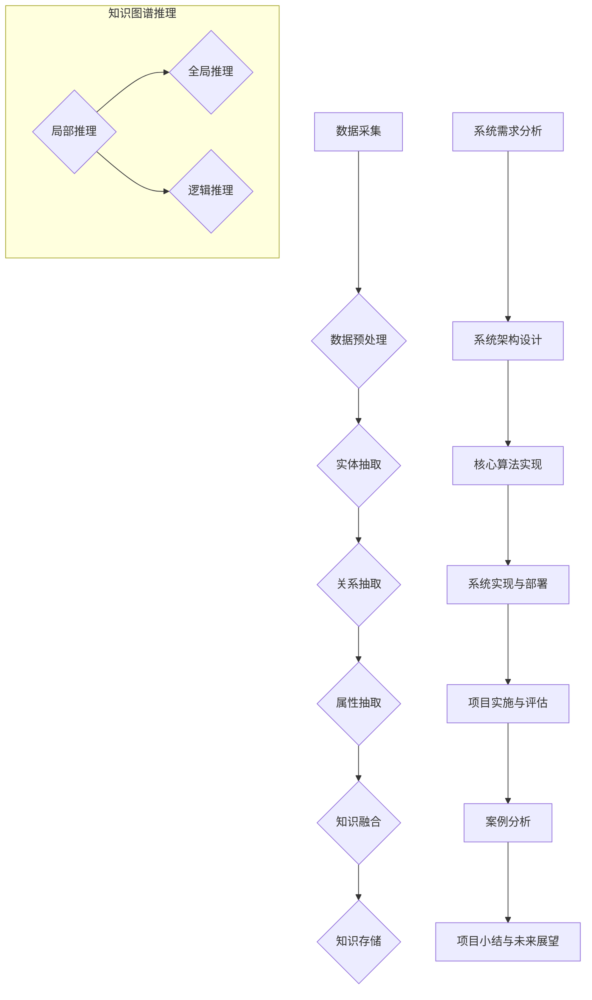

                 

### 《构建基于知识图谱的金融监管政策影响链追踪系统》摘要

本文旨在探讨如何利用知识图谱技术构建金融监管政策影响链追踪系统，以提高金融监管的效率和准确性。随着金融市场的复杂化和全球化，监管政策的影响链变得错综复杂，传统的监管手段已难以应对这一挑战。知识图谱以其强大的数据建模和推理能力，为解决这一难题提供了新的思路。

本文将首先介绍金融监管政策影响链追踪系统的重要性及其面临的挑战，随后深入探讨知识图谱技术的基础知识，包括知识图谱模型、构建方法和评估指标。接着，本文将详细阐述如何获取和处理金融监管政策数据，以及如何构建和优化知识图谱。随后，本文将设计并实现金融监管政策影响链追踪系统的架构，并介绍系统的核心算法和实现细节。

在项目实战部分，本文将通过具体案例展示系统的应用效果，并进行详细的分析和讨论。最后，本文将总结项目的成功经验与不足，对未来的研究方向和行业应用前景进行展望。通过本文的研究，我们期望为金融监管政策影响链追踪系统提供一套切实可行的技术方案，为金融监管工作提供有力支持。### 第一部分：背景与概述

#### 第1章：金融监管政策影响链追踪系统背景

##### 1.1.1 问题的提出

在金融市场快速发展的背景下，金融监管政策的重要性日益凸显。这些政策不仅关系到金融市场的稳定和健康发展，还直接影响到金融机构和投资者的利益。然而，随着金融市场的复杂化和全球化，监管政策的影响链变得越来越错综复杂，传统的监管手段已经难以应对这一挑战。

首先，金融监管政策本身具有复杂性和不确定性。政策涉及多个领域，包括金融产品、金融机构、金融市场等，且政策的变化往往伴随着各种不确定性，如政策制定的速度、力度、适用范围等。这些因素使得监管政策的实施效果难以预测，对金融市场的冲击也难以准确评估。

其次，监管政策的影响链具有高度复杂性。一项政策可能会通过多种途径和环节，对金融市场的多个层面产生深远影响。例如，一项关于资本充足率的新规定，不仅会直接影响银行的贷款发放，还可能通过影响市场信心、改变市场结构等途径，对整个金融市场产生连锁反应。这种复杂性使得传统的监管方法难以全面、系统地分析政策的影响。

此外，监管数据的获取和处理也是一个重大挑战。金融监管政策涉及大量数据，这些数据来源于政府机构、金融机构、行业协会、新闻媒体等不同渠道。如何有效地采集、整合和清洗这些数据，是一个复杂的工程。而且，随着数据量的增加和数据类型的多样化，对数据处理和分析的能力也提出了更高的要求。

##### 1.1.2 问题描述

面对上述挑战，构建一个能够追踪金融监管政策影响链的系统显得尤为重要。这个系统需要具备以下几个关键功能：

1. **政策识别与分类**：系统需要能够识别和分类金融监管政策，明确每个政策的内容、目标和适用范围。

2. **影响链建模**：系统需要能够建立政策影响链的模型，分析政策通过哪些途径和环节对金融市场产生深远影响。

3. **数据获取与处理**：系统需要能够高效地获取和处理监管数据，确保数据的准确性和完整性。

4. **推理与预测**：系统需要利用知识图谱进行推理和预测，评估政策实施后的潜在影响。

5. **可视化与报告**：系统需要提供直观的可视化工具和报告，帮助监管人员和管理者理解政策的影响，做出科学决策。

##### 1.1.3 问题解决

知识图谱技术为解决金融监管政策影响链追踪问题提供了有效的手段。知识图谱是一种用于表示和存储知识的技术，通过实体、属性和关系的网络结构，将海量信息组织成一个结构化的知识库。

在金融监管政策影响链追踪系统中，知识图谱的应用主要体现在以下几个方面：

1. **实体识别与分类**：系统利用知识图谱技术，对金融监管政策中的实体进行识别和分类，如金融机构、金融产品、政策类别等。

2. **关系建模与推理**：系统通过知识图谱建立政策影响链的模型，分析政策如何通过不同途径和环节对金融市场产生连锁反应。此外，系统还利用推理算法，预测政策实施后的潜在影响。

3. **数据整合与处理**：系统利用知识图谱进行数据整合和处理，将来自不同渠道的监管数据进行清洗、合并，形成一个统一、准确的知识库。

4. **可视化与报告**：系统通过知识图谱的可视化工具，将政策影响链以图形化的形式呈现，帮助用户直观理解政策的影响。同时，系统还提供定制化的报告，为监管决策提供有力支持。

##### 1.1.4 边界与外延

在构建金融监管政策影响链追踪系统的过程中，需要明确以下几个边界与外延：

1. **监管政策范围**：系统主要关注金融监管政策，但不局限于金融领域，可以扩展到其他相关领域，如市场监管、行业规范等。

2. **影响链追踪范围**：系统主要追踪政策对金融市场的影响，但不限于直接影响，还可以分析政策对市场结构、投资者行为等间接影响。

3. **技术实现**：系统采用知识图谱技术，但也可以结合其他先进技术，如自然语言处理、机器学习等，以提升系统的性能和效果。

4. **用户群体**：系统的主要用户为金融监管机构、金融机构、投资者等，不同用户可以根据自身需求，定制化地使用系统功能。

##### 1.1.5 概念结构与核心要素

1. **金融监管政策**：金融监管政策是指政府或监管机构发布的，旨在规范金融市场行为、维护金融市场秩序的政策文件。这些政策通常涉及市场准入、资本充足率、风险管理、产品规范等多个方面。

2. **影响链追踪**：影响链追踪是指通过分析金融监管政策的内容和目标，识别政策通过哪些途径和环节对金融市场产生深远影响的系统化过程。

3. **知识图谱**：知识图谱是一种用于表示和存储知识的图形化结构，由实体、属性和关系组成，能够将海量信息组织成一个结构化的知识库。

4. **构建方法**：构建金融监管政策影响链追踪系统的核心方法包括：政策识别与分类、影响链建模、数据获取与处理、推理与预测、可视化与报告等。

5. **评估指标**：评估金融监管政策影响链追踪系统的性能指标包括：政策识别准确率、影响链建模的完整性、数据处理的效率、推理预测的准确性、可视化工具的友好性等。#### 第2章：知识图谱技术基础

##### 2.1.1 知识图谱概述

知识图谱（Knowledge Graph）是一种用于表示和存储知识的图形化结构，它由实体（Entity）、属性（Attribute）和关系（Relationship）三个基本元素构成。知识图谱的核心思想是将现实世界中的各种实体以及实体之间的关系抽象成计算机可以理解和处理的结构化数据，从而形成一个全局的知识网络。

知识图谱在金融监管政策影响链追踪系统中具有重要作用。首先，它能够将分散的、结构化的和非结构化的监管数据整合到一个统一的知识库中，提供了一种高效的数据存储和检索方式。其次，知识图谱的图结构使其能够通过推理算法，发现政策影响链中的潜在关系和规律，从而提供更深层次的分析和预测。

知识图谱在金融监管中的应用包括但不限于以下几个方面：

1. **实体识别与分类**：通过知识图谱，可以识别和分类金融监管中的各种实体，如金融机构、金融产品、政策类别等。这有助于建立统一、规范的知识体系，提高数据处理的效率。

2. **关系建模与推理**：知识图谱能够将金融监管政策中的实体及其关系进行建模，并通过推理算法，分析政策如何通过不同的途径和环节对金融市场产生影响。

3. **数据整合与处理**：知识图谱能够整合来自不同渠道的监管数据，进行清洗、合并和关联，从而构建一个完整、准确的知识库。

4. **可视化与报告**：知识图谱的可视化工具可以帮助监管人员直观地理解政策影响链，生成定制化的报告，为决策提供有力支持。

##### 2.1.2 知识图谱模型

知识图谱模型可以分为以下几种类型：

1. **RDF模型（Resource Description Framework）**：RDF是一种基于URI（Uniform Resource Identifier）的语义网络模型，用于表示实体、属性和关系。在RDF模型中，每个实体、属性和关系都被赋予一个唯一的URI，通过URI之间的链接，形成一个全局的知识网络。

   RDF模型的表示方法如下：
   ```plaintext
   Subject Predicate Object
   ?Bank rdf:type foaf:Bank
   ?Bank foaf:hasBanker ?Banker
   ```

2. **基于属性的模型**：基于属性的模型将实体和属性作为两个独立的部分进行组织，通过实体和属性的关联来表示知识。这种模型通常用于描述较为复杂的关系，如多对多关系。

   基于属性的模型表示方法如下：
   ```plaintext
   Entity (Attribute1: Value1, Attribute2: Value2, ...)
   Bank (Name: "ICBC", Location: "Beijing")
   ```

3. **图神经网络（Graph Neural Networks, GNN）**：图神经网络是一种基于图结构的数据处理模型，能够直接在图上进行计算。GNN在知识图谱的应用中，特别适合于处理复杂的关系和进行图级别的推理。

   GNN的基本计算公式如下：
   ```plaintext
   H^{(t)} = \sigma(\theta \cdot (A \cdot H^{(t-1)} + X))
   ```

   其中，\(H^{(t)}\) 表示第 t 步的节点表示，\(A\) 是邻接矩阵，\(X\) 是节点特征矩阵，\(\theta\) 是模型参数。

##### 2.1.3 知识图谱构建方法

知识图谱的构建是一个复杂的过程，通常包括以下几个步骤：

1. **数据采集**：从各种渠道采集与金融监管相关的数据，包括政府发布的政策文件、金融机构的年报、新闻媒体的报道等。

2. **数据预处理**：对采集到的数据进行清洗、去重和标准化处理，确保数据的质量和一致性。

3. **实体识别与分类**：利用自然语言处理技术，从预处理后的数据中识别出各种实体，并将其分类，如金融机构、金融产品、政策类别等。

4. **关系抽取**：通过分析文本数据，抽取实体之间的关系，如金融机构之间的合作关系、政策文件中的条款关系等。

5. **知识融合**：将不同来源、不同格式的数据融合到一个统一的知识库中，形成一个完整、准确的知识网络。

6. **知识存储**：将构建好的知识图谱存储在数据库或图数据库中，以便进行高效的数据检索和推理。

##### 2.1.4 知识图谱评估指标

评估知识图谱的性能和效果是构建知识图谱过程中的重要环节。以下是一些常用的评估指标：

1. **完整性（Completeness）**：指知识图谱中包含的实体、属性和关系的数量与实际存在的数量之比。完整性越高，说明知识图谱越全面。

2. **准确性（Accuracy）**：指知识图谱中正确表示的实体、属性和关系的比例。准确性越高，说明知识图谱的构建质量越高。

3. **可扩展性（Scalability）**：指知识图谱在数据量和复杂度增加时，仍能保持高效性能的能力。可扩展性强的知识图谱能够适应不断变化的数据环境。

4. **可解释性（Interpretability）**：指知识图谱的可理解性和可解释性。可解释性越强，用户越容易理解和利用知识图谱。

5. **推理能力（Reasoning Ability）**：指知识图谱的推理能力，即能够从已知信息中推断出新的结论的能力。推理能力越强，知识图谱的实用价值越高。

通过上述评估指标，可以全面衡量知识图谱的性能和效果，为知识图谱的优化和改进提供依据。#### 第3章：金融监管政策数据获取与处理

##### 3.1.1 监管政策数据来源

金融监管政策数据的来源多样，主要包括以下几个方面：

1. **政府部门发布的数据**：这是最权威的数据来源，包括中央银行、证券监管机构、保险监管机构等发布的政策文件、统计数据和公告。这些数据通常具有高度的权威性和时效性。

2. **行业协会公布的数据**：行业协会如银行业协会、证券业协会、保险业协会等，会发布行业规范、市场分析报告等数据。这些数据对于了解行业动态和趋势具有重要意义。

3. **新闻媒体报道的数据**：新闻媒体对金融监管政策的报道，提供了丰富的信息来源。这些报道通常包含政策解读、案例分析等内容，有助于理解政策的具体影响。

4. **金融机构发布的数据**：金融机构如银行、证券公司、保险公司等，会定期发布财务报告、业务报告等数据。这些数据可以帮助分析政策对金融机构的具体影响。

5. **学术研究和市场报告**：学术机构、市场研究公司等会发布关于金融监管政策的研究报告和市场分析，这些报告提供了政策影响的理论分析和实证研究。

##### 3.1.2 数据采集与处理流程

数据采集与处理是构建金融监管政策影响链追踪系统的关键步骤，主要包括以下几个环节：

1. **数据采集**：
   - **自动化采集**：利用爬虫技术，从政府部门、行业协会、新闻媒体和金融机构的官方网站上自动化采集数据。
   - **手动采集**：对于部分无法自动化采集的数据，如某些政策解读文章、专家访谈等，需要通过人工方式采集。

2. **数据清洗**：
   - **去重**：去除重复的数据，确保数据的唯一性和准确性。
   - **格式统一**：将不同来源、不同格式的数据进行格式统一，如将文本数据转换为统一编码格式，将表格数据转换为结构化数据。
   - **缺失值处理**：对缺失的数据进行填补或删除，确保数据完整性。

3. **数据整合**：
   - **数据融合**：将来自不同来源的数据进行整合，形成一个统一、完整的数据集。
   - **数据关联**：将不同数据之间的关联关系进行建模，如政策文件与政策实施情况之间的关联。

4. **数据预处理**：
   - **文本预处理**：对文本数据（如新闻报道、政策文件）进行分词、词性标注、命名实体识别等处理，提取有用的信息。
   - **数据转换**：将预处理后的数据转换为适合知识图谱表示的格式，如将实体和关系抽取出来，存储为三元组。

##### 3.1.3 数据预处理方法

数据预处理是确保数据质量和为后续分析打下基础的关键步骤，具体方法包括以下几个方面：

1. **文本预处理**：
   - **分词**：将文本分割成单词或短语，便于进一步处理。
     ```python
     from jieba import seg_divide
     text = "金融监管政策对市场有重要影响。"
     seg_list = seg_divide(text)
     print(seg_list)
     ```
   - **词性标注**：对每个单词或短语进行词性标注，如名词、动词等，便于理解文本的结构和含义。
     ```python
     from jieba import posseg
     words = posseg.cut(text)
     for word, flag in words:
         print('%s %s' % (word, flag))
     ```
   - **命名实体识别**：识别文本中的命名实体，如人名、机构名、地点名等，便于进一步处理和分析。
     ```python
     from pke import Extractor
     extractor = Extractor()
     extractor.setStopWords([])
     text = "中国证监会发布了关于资本充足率的新规定。"
     result = extractor.get_nbest(text, n=10)
     for entity in result:
         print(entity)
     ```

2. **关系抽取**：
   - **基于规则的方法**：通过预定义的规则，从文本中抽取实体之间的关系。这种方法需要大量手工定义规则，但能够保证较高的准确率。
   - **基于统计的方法**：利用机器学习算法，从大量标注数据中学习关系抽取模型。这种方法不需要手工定义规则，但需要对数据进行大规模标注。
   - **基于深度学习的方法**：利用深度学习模型，如神经网络、循环神经网络（RNN）等，从文本中抽取实体之间的关系。这种方法能够自动学习复杂的特征，但需要对数据进行大规模标注。

3. **实体识别与分类**：
   - **基于规则的方法**：通过预定义的规则，从文本中识别出实体，并进行分类。这种方法简单直观，但规则覆盖有限，难以处理复杂场景。
   - **基于机器学习的方法**：利用机器学习算法，如支持向量机（SVM）、朴素贝叶斯（Naive Bayes）等，从大量标注数据中学习实体识别和分类模型。这种方法能够自动学习特征，适应复杂场景。
   - **基于深度学习的方法**：利用深度学习模型，如卷积神经网络（CNN）、循环神经网络（RNN）等，从文本中识别实体并进行分类。这种方法能够自动学习复杂的特征，适应复杂场景。

##### 3.1.4 数据质量控制

数据质量控制是确保数据质量和知识图谱构建成功的关键步骤。以下是一些常用的数据质量控制方法：

1. **数据一致性检查**：检查数据内部的一致性，如同一实体的属性是否一致，同一关系的表示是否一致。发现不一致之处，进行修正或标记。

2. **数据完整性评估**：评估数据集的完整性，检查是否存在缺失值或数据不完整的情况。对于缺失的数据，可以通过填补或删除的方式进行处理。

3. **数据准确性验证**：通过人工审核或自动化的校验方法，检查数据的准确性。对于错误的数据，进行修正或标记。

4. **数据校验规则**：制定一系列的数据校验规则，如数据类型检查、范围检查、格式检查等，确保数据的规范性和一致性。

5. **数据版本管理**：对数据进行版本管理，确保每次数据更新都能追溯，便于问题的定位和解决。

通过上述方法，可以有效提高数据的准确性和一致性，为知识图谱的构建提供高质量的数据支持。#### 第4章：知识图谱构建与推理

##### 4.1.1 知识图谱构建流程

构建知识图谱是一个复杂的过程，通常包括以下步骤：

1. **实体抽取**：从原始数据中识别出关键实体，如金融机构、金融产品、政策等。实体抽取可以通过自然语言处理技术实现，如命名实体识别（NER）。

2. **关系抽取**：确定实体之间的关系，如金融机构之间的关联、政策与实施情况之间的关系。关系抽取可以通过基于规则的方法、机器学习方法或深度学习方法实现。

3. **属性抽取**：为实体和关系抽取属性信息，如金融机构的成立时间、政策的目标等。属性抽取通常与实体抽取和关系抽取结合进行。

4. **知识融合**：将不同来源、不同格式的数据进行整合，形成一个统一的知识库。知识融合需要处理数据格式、数据格式和数据质量等问题。

5. **知识存储**：将构建好的知识图谱存储在数据库或图数据库中，以便进行高效的数据检索和推理。常用的图数据库包括Neo4j、Apache JanusGraph等。

##### 4.1.2 知识图谱推理算法

知识图谱推理是从已有知识中推断出新知识的过程。以下介绍几种常见的知识图谱推理算法：

1. **局部推理**：局部推理关注实体及其直接邻居之间的关系，通过路径枚举和关系组合来发现新的知识。常见的局部推理算法包括路径查询、关系组合等。

2. **全局推理**：全局推理关注整个知识图谱的结构和关系，通过全局优化和模式匹配来发现新的知识。常见的全局推理算法包括子图同构、社区检测等。

3. **逻辑推理**：逻辑推理基于逻辑规则和逻辑推理算法，通过推理规则和事实进行推理。常见的逻辑推理算法包括基于命题逻辑的推理、基于谓词逻辑的推理等。

##### 4.1.3 知识图谱优化方法

为了提高知识图谱的性能和效果，可以对知识图谱进行优化。以下介绍几种常见的知识图谱优化方法：

1. **实体消歧**：实体消歧是通过消除实体之间的混淆，提高知识图谱的准确性和一致性。常见的实体消歧方法包括基于上下文的消歧、基于距离的消歧等。

2. **关系增强**：关系增强是通过增加或修正实体之间的关系，提高知识图谱的完整性和准确性。常见的关系增强方法包括基于统计的方法、基于深度学习的方法等。

3. **知识更新**：知识更新是定期更新知识图谱中的数据，确保知识库的时效性和准确性。常见的知识更新方法包括手动更新、自动更新等。

##### 4.1.4 知识图谱评估

评估知识图谱的质量和性能是构建知识图谱过程中的重要环节。以下介绍几种常见的知识图谱评估指标：

1. **实体识别准确率**：实体识别准确率是衡量知识图谱中实体识别准确性的指标，计算公式为：
   $$ \text{准确率} = \frac{\text{识别正确实体数}}{\text{总实体数}} $$

2. **关系识别准确率**：关系识别准确率是衡量知识图谱中关系识别准确性的指标，计算公式为：
   $$ \text{准确率} = \frac{\text{识别正确关系数}}{\text{总关系数}} $$

3. **推理效果评估**：推理效果评估是衡量知识图谱推理能力的指标，可以通过计算推理正确率、推理覆盖率等指标来评估。常见的方法包括：
   - **推理正确率**：计算公式为：
     $$ \text{正确率} = \frac{\text{推理正确结论数}}{\text{总结论数}} $$
   - **推理覆盖率**：计算公式为：
     $$ \text{覆盖率} = \frac{\text{推理到的结论数}}{\text{可能结论数}} $$

通过上述评估指标，可以全面衡量知识图谱的性能和效果，为知识图谱的优化和改进提供依据。#### 第5章：系统架构设计

##### 5.1.1 系统需求分析

在设计金融监管政策影响链追踪系统之前，明确系统的需求分析至关重要。系统需求分为功能需求和非功能需求两个方面。

1. **功能需求**：
   - **政策识别与分类**：系统能够自动识别和分类金融监管政策，明确每个政策的内容、目标和适用范围。
   - **影响链建模**：系统能够建立政策影响链的模型，分析政策通过哪些途径和环节对金融市场产生深远影响。
   - **数据获取与处理**：系统能够高效地获取和处理监管数据，确保数据的准确性和完整性。
   - **推理与预测**：系统能够利用知识图谱进行推理和预测，评估政策实施后的潜在影响。
   - **可视化与报告**：系统能够提供直观的可视化工具和报告，帮助监管人员和管理者理解政策的影响，做出科学决策。

2. **非功能需求**：
   - **可扩展性**：系统能够适应数据量和复杂度的增加，保持高效性能。
   - **高可用性**：系统具有高可用性，确保在任何情况下都能正常运行。
   - **安全性**：系统具备完善的安全措施，保护数据的安全和隐私。
   - **易维护性**：系统设计易于维护和升级，降低维护成本。

##### 5.1.2 系统架构设计

系统架构设计是确保系统高效、稳定和可扩展的关键。金融监管政策影响链追踪系统采用分层架构，包括硬件架构、软件架构和数据架构。

1. **硬件架构**：
   - **服务器**：系统部署在云服务器上，采用分布式架构，提高系统的可扩展性和可靠性。
   - **存储设备**：使用高速存储设备（如SSD），提高数据读写速度，保证系统性能。
   - **网络设备**：采用高带宽、低延迟的网络设备，确保系统内部和外部数据传输的稳定性。

2. **软件架构**：
   - **前端**：采用Web前端技术，如HTML、CSS、JavaScript等，提供用户友好的交互界面。
   - **后端**：采用Java、Python等编程语言，实现系统的业务逻辑和数据处理功能。
   - **数据库**：采用图数据库（如Neo4j、Apache JanusGraph），存储和查询知识图谱。

3. **数据架构**：
   - **知识图谱**：构建金融监管政策影响链的知识图谱，包括实体、属性和关系。
   - **数据湖**：存储来自不同渠道的原始数据，包括政府部门、行业协会、新闻媒体、金融机构等。
   - **数据仓库**：对数据进行清洗、整合和加工，为知识图谱提供高质量的数据支持。

##### 5.1.3 系统接口设计

系统接口设计是确保系统与其他系统或组件进行有效交互的关键。金融监管政策影响链追踪系统包括以下接口：

1. **数据接口**：
   - **数据采集接口**：用于从政府部门、行业协会、新闻媒体、金融机构等采集数据。
   - **数据处理接口**：用于对采集到的数据进行分析、清洗和整合。
   - **知识图谱接口**：用于对知识图谱进行构建、查询和推理。

2. **功能接口**：
   - **政策识别接口**：用于识别和分类金融监管政策。
   - **影响链建模接口**：用于建立政策影响链的模型。
   - **可视化接口**：用于展示政策影响链的可视化结果。
   - **报告生成接口**：用于生成定制化的报告。

##### 5.1.4 系统交互设计

系统交互设计是确保系统内部和外部组件之间高效协同的关键。金融监管政策影响链追踪系统的交互设计包括以下几个方面：

1. **用户交互**：
   - **用户登录**：用户通过登录系统，获取权限进行数据查询和分析。
   - **数据查询**：用户可以查询政策信息、影响链结果等。
   - **可视化查看**：用户可以查看政策影响链的可视化结果。
   - **报告生成**：用户可以生成定制化的报告。

2. **系统内部交互**：
   - **数据采集**：系统从不同渠道采集数据，包括政府部门、行业协会、新闻媒体、金融机构等。
   - **数据处理**：系统对采集到的数据进行清洗、整合和加工。
   - **知识图谱构建**：系统利用采集和处理后的数据，构建金融监管政策影响链的知识图谱。
   - **推理与预测**：系统利用知识图谱进行推理和预测，评估政策实施后的潜在影响。
   - **可视化与报告**：系统生成可视化结果和定制化报告，供用户查看和下载。

通过上述系统架构设计、接口设计和交互设计，金融监管政策影响链追踪系统能够高效、稳定地运行，为金融监管工作提供有力支持。#### 第6章：核心算法实现

##### 6.1.1 知识图谱构建算法

知识图谱构建是金融监管政策影响链追踪系统的核心部分，包括实体抽取、关系抽取和属性抽取等步骤。

1. **实体抽取**：
   实体抽取是从原始数据中识别出关键实体，如金融机构、金融产品、政策等。常见的实体抽取算法包括基于规则的方法、基于统计的方法和基于深度学习的方法。

   - **基于规则的方法**：通过预定义的规则，从文本数据中提取实体。例如，可以使用正则表达式匹配特定的实体名称。
     ```python
     import re
     text = "中国证监会发布了关于资本充足率的新规定。"
     pattern = re.compile(r"证监会")
     entities = pattern.findall(text)
     print(entities)
     ```

   - **基于统计的方法**：利用机器学习算法，从大量标注数据中学习实体抽取模型。例如，可以使用支持向量机（SVM）或朴素贝叶斯（Naive Bayes）进行实体分类。
     ```python
     from sklearn.feature_extraction.text import CountVectorizer
     from sklearn.naive_bayes import MultinomialNB
     texts = ["证监会发布了政策", "银行提高了利率"]
     labels = ["机构", "产品"]
     vectorizer = CountVectorizer()
     X = vectorizer.fit_transform(texts)
     classifier = MultinomialNB()
     classifier.fit(X, labels)
     text = "证监会发布了新规定"
     X_test = vectorizer.transform([text])
     prediction = classifier.predict(X_test)
     print(prediction)
     ```

   - **基于深度学习的方法**：利用深度学习模型，如卷积神经网络（CNN）或循环神经网络（RNN），从文本数据中提取实体。例如，可以使用BERT模型进行实体识别。
     ```python
     from transformers import BertTokenizer, BertForTokenClassification
     tokenizer = BertTokenizer.from_pretrained('bert-base-chinese')
     model = BertForTokenClassification.from_pretrained('bert-base-chinese')
     text = "中国证监会发布了关于资本充足率的新规定。"
     tokens = tokenizer.tokenize(text)
     inputs = tokenizer.encode_plus(text, add_special_tokens=True, return_tensors='pt')
     outputs = model(inputs)
     logits = outputs.logits
     predictions = logits.argmax(-1)
     print(predictions)
     ```

2. **关系抽取**：
   关系抽取是确定实体之间的关系，如金融机构之间的关联、政策与实施情况之间的关系。常见的关系抽取算法包括基于规则的方法、基于统计的方法和基于深度学习的方法。

   - **基于规则的方法**：通过预定义的规则，从文本数据中抽取关系。例如，可以使用模式匹配提取特定的关系。
     ```python
     import re
     text = "中国证监会与银保监会联合发布了一项新政策。"
     pattern = re.compile(r"(\S+)与(\S+)联合发布了一项新政策")
     relations = pattern.findall(text)
     print(relations)
     ```

   - **基于统计的方法**：利用机器学习算法，从大量标注数据中学习关系抽取模型。例如，可以使用条件随机场（CRF）或长短期记忆网络（LSTM）进行关系分类。
     ```python
     from sklearn_crfsuite import CRF
     texts = ["证监会发布了政策", "银行提高了利率"]
     labels = [["机构", "发布"], ["产品", "提高"]]
     crf = CRF()
     crf.fit(texts, labels)
     text = "证监会发布了新规定"
     prediction = crf.predict([text])
     print(prediction)
     ```

   - **基于深度学习的方法**：利用深度学习模型，如BERT或GPT，从文本数据中抽取关系。例如，可以使用BERT模型进行关系分类。
     ```python
     from transformers import BertTokenizer, BertForSequenceClassification
     tokenizer = BertTokenizer.from_pretrained('bert-base-chinese')
     model = BertForSequenceClassification.from_pretrained('bert-base-chinese')
     text = "中国证监会发布了关于资本充足率的新规定。"
     inputs = tokenizer.encode_plus(text, add_special_tokens=True, return_tensors='pt')
     outputs = model(inputs)
     logits = outputs.logits
     predictions = logits.argmax(-1)
     print(predictions)
     ```

3. **属性抽取**：
   属性抽取是为实体和关系抽取属性信息，如金融机构的成立时间、政策的实施范围等。常见的属性抽取算法包括基于规则的方法、基于统计的方法和基于深度学习的方法。

   - **基于规则的方法**：通过预定义的规则，从文本数据中提取属性。例如，可以使用正则表达式提取特定的属性值。
     ```python
     import re
     text = "中国证监会成立于1984年。"
     pattern = re.compile(r"(\S+)成立于(\d+)")
     attributes = pattern.findall(text)
     print(attributes)
     ```

   - **基于统计的方法**：利用机器学习算法，从大量标注数据中学习属性抽取模型。例如，可以使用支持向量机（SVM）或朴素贝叶斯（Naive Bayes）进行属性分类。
     ```python
     from sklearn.feature_extraction.text import CountVectorizer
     from sklearn.naive_bayes import GaussianNB
     texts = ["证监会成立于1984年", "银行成立于1990年"]
     labels = ["1984", "1990"]
     vectorizer = CountVectorizer()
     X = vectorizer.fit_transform(texts)
     classifier = GaussianNB()
     classifier.fit(X, labels)
     text = "证监会成立于1984年"
     X_test = vectorizer.transform([text])
     prediction = classifier.predict(X_test)
     print(prediction)
     ```

   - **基于深度学习的方法**：利用深度学习模型，如BERT或GPT，从文本数据中抽取属性。例如，可以使用BERT模型进行属性分类。
     ```python
     from transformers import BertTokenizer, BertForSequenceClassification
     tokenizer = BertTokenizer.from_pretrained('bert-base-chinese')
     model = BertForSequenceClassification.from_pretrained('bert-base-chinese')
     text = "中国证监会成立于1984年。"
     inputs = tokenizer.encode_plus(text, add_special_tokens=True, return_tensors='pt')
     outputs = model(inputs)
     logits = outputs.logits
     predictions = logits.argmax(-1)
     print(predictions)
     ```

##### 6.1.2 知识图谱推理算法

知识图谱推理是从已有知识中推断出新知识的过程。以下介绍几种常见的知识图谱推理算法：

1. **基于路径的推理**：
   基于路径的推理是通过路径枚举和关系组合来发现新的知识。例如，给定实体A和实体B，可以通过查询路径A → X → B，来发现A和B之间的关系。
   ```mermaid
   graph TD
   A --> X --> B
   ```

2. **基于模式的推理**：
   基于模式的推理是通过模式匹配来发现新的知识。例如，给定模式A → X → B，可以通过在知识图谱中搜索满足该模式的实体对。
   ```mermaid
   graph TD
   A --> X --> B
   ```

3. **基于逻辑的推理**：
   基于逻辑的推理是通过逻辑推理规则来发现新的知识。例如，给定规则A → B，可以通过推理出A → B → C。
   ```mermaid
   graph TD
   A --> B
   B --> C
   ```

##### 6.1.3 算法性能优化

为了提高知识图谱构建和推理算法的性能，可以对算法进行优化。以下介绍几种常见的性能优化方法：

1. **数据预处理**：
   通过对原始数据进行预处理，如去除停用词、进行词性标注等，可以提高算法的性能。例如，使用NLTK进行数据预处理：
   ```python
   from nltk.tokenize import word_tokenize
   from nltk.corpus import stopwords
   from nltk.stem import WordNetLemmatizer
   text = "The quick brown fox jumps over the lazy dog."
   tokens = word_tokenize(text)
   stop_words = set(stopwords.words('english'))
   filtered_tokens = [w for w in tokens if not w in stop_words]
   lemmatizer = WordNetLemmatizer()
   lemmatized_tokens = [lemmatizer.lemmatize(w) for w in filtered_tokens]
   print(lemmatized_tokens)
   ```

2. **并行计算**：
   利用并行计算技术，如多线程、分布式计算等，可以提高算法的运行速度。例如，使用Python的multiprocessing模块进行并行计算：
   ```python
   from multiprocessing import Pool
   def process_data(data):
       # 数据处理逻辑
       return processed_data
   data = ["data1", "data2", "data3"]
   with Pool(processes=4) as pool:
       results = pool.map(process_data, data)
   print(results)
   ```

3. **内存优化**：
   通过优化内存使用，如使用缓存、减少内存分配等，可以提高算法的运行效率。例如，使用Python的caching模块进行缓存：
   ```python
   from functools import lru_cache
   @lru_cache(maxsize=100)
   def compute_value(x):
       # 计算逻辑
       return value
   ```

4. **时间优化**：
   通过优化算法的时间复杂度，如使用高效的算法和数据结构等，可以提高算法的运行效率。例如，使用字典（hash table）进行快速查找：
   ```python
   data = {"key1": "value1", "key2": "value2", "key3": "value3"}
   print(data["key1"])
   ```

5. **可扩展性优化**：
   通过优化算法的可扩展性，如使用分布式系统、水平扩展等，可以提高算法的处理能力。例如，使用Apache Spark进行分布式计算：
   ```python
   from pyspark.sql import SparkSession
   spark = SparkSession.builder.appName("KnowledgeGraph").getOrCreate()
   df = spark.createDataFrame([(1, "Alice"), (2, "Bob")])
   df.show()
   ```

通过上述优化方法，可以显著提高知识图谱构建和推理算法的性能，为金融监管政策影响链追踪系统提供强有力的技术支持。#### 第7章：系统实现与部署

##### 7.1.1 系统开发环境

在实现金融监管政策影响链追踪系统时，选择合适的开发环境对于系统的稳定性和性能至关重要。以下为系统开发环境的具体配置：

1. **开发工具**：
   - **IDE**：使用IntelliJ IDEA或Visual Studio Code作为主要开发工具，提供代码编辑、调试和构建功能。
   - **版本控制**：使用Git进行版本控制，确保代码的版本管理和协作开发。
   - **数据库**：使用Neo4j作为知识图谱的存储和查询工具，提供高效的数据存储和图计算能力。

2. **开发语言**：
   - **后端**：使用Java或Python作为后端开发语言，Java具有稳定性和高性能的特点，而Python具有简洁和高效的优点。
   - **前端**：使用HTML、CSS和JavaScript构建Web前端，采用React或Vue.js等现代前端框架，提高用户体验和开发效率。

3. **环境配置**：
   - **操作系统**：Linux系统（如Ubuntu）作为开发环境，提供稳定性和安全性。
   - **Python环境**：安装Python 3.8及以上版本，并配置pip、virtualenv等工具，用于管理Python环境和依赖包。
   - **Java环境**：安装Java 8及以上版本，并配置Java Development Kit（JDK）和Java Runtime Environment（JRE）。

##### 7.1.2 系统部署方案

系统部署是确保金融监管政策影响链追踪系统正常运行的关键环节。以下为系统部署的具体方案：

1. **部署流程**：
   - **安装依赖**：在服务器上安装Python、Java等基础依赖，并配置Neo4j数据库。
   - **代码上传**：将开发好的代码上传到服务器，通常使用Git进行代码的版本管理和同步。
   - **环境配置**：配置Python和Java环境，设置相应的环境变量和配置文件。
   - **启动服务**：启动后端和前端服务，确保系统各组件正常运行。

2. **部署注意事项**：
   - **服务器选择**：选择可靠的服务器供应商，确保服务器的稳定性和安全性。
   - **网络配置**：确保服务器具有良好的网络连接，以支持外部访问和数据传输。
   - **备份与恢复**：定期备份系统数据，并配置自动恢复机制，以应对可能的故障和意外情况。

3. **系统启动与监控**：
   - **启动命令**：根据不同的服务和组件，配置启动脚本和命令，确保系统在启动时能够自动加载必要的依赖和服务。
   - **监控工具**：使用Nagios、Zabbix等监控工具，实时监控系统的运行状态，及时发现并处理潜在问题。

##### 7.1.3 系统测试与评估

系统测试与评估是确保金融监管政策影响链追踪系统稳定性和功能性的关键步骤。以下为系统测试与评估的具体方法：

1. **功能测试**：
   - **单元测试**：编写单元测试用例，测试系统的各个功能模块，确保每个模块的功能正确。
   - **集成测试**：将各个功能模块集成到一起，测试系统的整体功能，确保模块之间的协同工作。
   - **性能测试**：通过压力测试和负载测试，评估系统的性能和响应时间，确保系统在高并发情况下仍能稳定运行。

2. **性能测试**：
   - **响应时间测试**：通过模拟大量用户同时访问系统，测试系统的响应时间，确保系统能够快速响应用户请求。
   - **吞吐量测试**：通过增加并发用户数量，测试系统的最大吞吐量，确保系统能够处理大量请求。
   - **内存和CPU使用率测试**：监控系统的内存和CPU使用率，确保系统资源得到合理利用，避免资源瓶颈。

3. **用户反馈**：
   - **用户测试**：邀请实际用户参与系统测试，收集用户的反馈和意见，针对用户反馈进行系统优化。
   - **数据分析**：分析用户行为数据，如访问路径、操作频率等，了解用户的使用习惯和偏好，为系统改进提供数据支持。

通过上述测试与评估方法，可以全面检验金融监管政策影响链追踪系统的稳定性和功能性，确保系统在实际应用中能够稳定、高效地运行。

##### 7.1.4 系统维护与升级

系统维护与升级是确保金融监管政策影响链追踪系统持续稳定运行的重要环节。以下为系统维护与升级的具体策略：

1. **定期备份**：
   - **数据备份**：定期备份系统数据，确保在数据丢失或系统故障时能够快速恢复。
   - **系统备份**：备份系统的配置文件和日志文件，以便在系统升级或故障时快速恢复。

2. **监控与报警**：
   - **实时监控**：使用Nagios、Zabbix等监控工具，实时监控系统的运行状态，及时发现并处理潜在问题。
   - **报警机制**：配置报警机制，如邮件、短信等，当系统出现故障或异常时，能够及时通知相关人员。

3. **版本控制**：
   - **代码管理**：使用Git进行代码管理，确保代码版本的可追溯性和可管理性。
   - **版本发布**：在系统升级时，按照版本发布流程，对系统进行版本控制和管理。

4. **性能优化**：
   - **系统性能监控**：定期监控系统的性能指标，如响应时间、吞吐量等，发现性能瓶颈并进行优化。
   - **数据库优化**：对Neo4j数据库进行优化，如索引创建、查询优化等，提高数据查询速度。

5. **安全性维护**：
   - **安全检查**：定期进行系统安全检查，确保系统的安全性和数据隐私。
   - **漏洞修复**：及时修复系统中的安全漏洞，防止潜在的安全威胁。

6. **用户培训与支持**：
   - **用户培训**：为用户提供系统操作培训，确保用户能够熟练使用系统。
   - **技术支持**：提供及时的技术支持，解决用户在使用过程中遇到的问题。

通过上述维护与升级策略，可以确保金融监管政策影响链追踪系统的稳定性和可靠性，为金融监管工作提供持续的支持。#### 第8章：项目背景与目标

##### 8.1.1 项目背景

随着金融市场的快速发展和全球化的深入，金融监管政策的重要性日益凸显。金融监管政策不仅关系到金融市场的稳定和健康发展，还直接影响到金融机构和投资者的利益。然而，随着金融市场的复杂化和监管政策的多样化，监管政策的影响链变得越来越复杂和难以追踪。

当前的金融监管政策影响链追踪手段主要依赖于人工分析和传统数据处理方法，存在以下几个主要问题：

1. **数据源分散**：监管政策数据来源多样，包括政府部门、行业协会、新闻媒体和金融机构等，这些数据通常分布在不同的系统中，难以统一管理和分析。

2. **数据质量不高**：由于数据来源的多样性和分散性，数据质量参差不齐，存在数据缺失、重复、不一致等问题，影响数据分析的准确性和可靠性。

3. **分析手段有限**：传统的方法主要依赖于数据统计和文本分析，难以深入挖掘监管政策之间的复杂关系和潜在影响，无法提供全面的监管政策影响链追踪。

4. **响应速度较慢**：人工分析方法需要大量时间和人力，无法实时响应政策变化和市场需求，影响监管决策的及时性和有效性。

为了解决上述问题，本项目旨在构建一个基于知识图谱的金融监管政策影响链追踪系统，通过先进的数据处理和推理技术，实现对监管政策影响链的自动化追踪和分析，提高监管决策的科学性和效率。

##### 8.1.2 项目目标

本项目的目标主要包括以下几个方面：

1. **自动化政策影响链追踪**：利用知识图谱技术，实现对金融监管政策影响链的自动化追踪和分析，提高监管政策的透明度和可追溯性。

2. **提高监管效率**：通过自动化数据处理和推理，提高监管数据分析的效率和准确性，减少人工干预，提高监管决策的及时性和科学性。

3. **提升政策理解**：通过对监管政策的深入分析和可视化展示，帮助监管人员和管理者更好地理解政策的影响，发现潜在的风险和问题。

4. **支持监管创新**：通过知识图谱技术，为监管创新提供技术支持，如监管沙盒、智能监管等，推动金融监管工作的数字化转型。

5. **保障数据安全**：在数据采集、处理和存储过程中，确保数据的安全性和隐私性，遵守相关法律法规，保护用户和金融机构的隐私。

通过实现上述目标，本项目将有助于提升金融监管工作的效率和准确性，为金融市场的稳定和健康发展提供有力支持。同时，本项目也为金融监管政策影响链追踪系统的研究和应用提供了一套可参考的技术方案和实践经验。#### 第9章：项目实施与评估

##### 9.1.1 项目实施过程

项目的实施过程可以分为以下几个阶段：

1. **需求分析与系统设计**：在项目启动阶段，首先进行需求分析，明确项目目标、功能需求和非功能需求。根据需求分析结果，设计系统架构和接口，确保系统具备良好的扩展性和稳定性。

2. **数据采集与预处理**：在数据采集阶段，通过爬虫技术从多个数据源（如政府网站、行业协会、新闻媒体等）收集监管政策数据。随后，对采集到的数据进行预处理，包括去重、清洗、格式统一等，确保数据的质量和一致性。

3. **知识图谱构建**：利用预处理后的数据，通过实体抽取、关系抽取和属性抽取等步骤，构建金融监管政策影响链的知识图谱。知识图谱的构建过程涉及到多种算法和模型，如命名实体识别、关系抽取和图神经网络等。

4. **推理与预测**：在知识图谱构建完成后，利用推理算法对政策影响链进行分析和预测，评估政策实施后的潜在影响。推理过程包括局部推理和全局推理，通过路径枚举和模式匹配等方法，发现政策之间的潜在关系。

5. **系统实现与测试**：根据系统设计，实现前端和后端功能，包括用户交互界面、数据查询和可视化等。在系统实现过程中，进行单元测试和集成测试，确保系统功能的正确性和稳定性。

6. **部署与上线**：完成系统测试后，将系统部署到服务器，并进行上线前检查，确保系统的高可用性和安全性。在上线后，对系统进行实时监控和性能优化，确保系统稳定运行。

##### 9.1.2 项目评估

项目评估是衡量项目成功与否的重要环节，以下从功能评估、性能评估和用户满意度评估三个方面进行评估：

1. **功能评估**：
   - **功能完整性**：系统实现了所有既定的功能需求，如政策识别、关系抽取、推理与预测、可视化等。
   - **功能正确性**：系统功能运行正确，没有出现重大错误或异常情况。
   - **用户交互友好性**：系统界面友好，操作简便，用户易于上手。

2. **性能评估**：
   - **响应时间**：系统在高并发情况下，响应时间保持在合理范围内，确保用户的使用体验。
   - **吞吐量**：系统能够处理大量请求，吞吐量满足业务需求。
   - **资源利用率**：系统资源（如CPU、内存等）利用率合理，没有出现资源瓶颈。

3. **用户满意度评估**：
   - **用户满意度调查**：通过问卷调查和用户反馈，了解用户对系统的满意度，收集用户意见和需求。
   - **用户行为分析**：分析用户行为数据，如访问路径、操作频率等，了解用户的使用习惯和偏好。
   - **改进措施**：根据用户反馈和行为分析结果，对系统进行改进和优化，提高用户满意度。

通过上述评估，可以全面了解项目的实施效果，发现存在的问题和改进空间，为后续项目的优化和改进提供依据。#### 第10章：案例分析

##### 10.1.1 案例背景

本案例以某金融监管政策——“关于调整商业银行资本充足率要求的通知”为例，分析该政策对金融市场的影响。该政策由中国银保监会于2020年发布，主要内容包括：提高商业银行的资本充足率要求，增强银行的抗风险能力。

##### 10.1.2 案例分析过程

1. **数据采集**：
   - **政策文件**：从中国银保监会官方网站获取该政策的原始文件。
   - **相关报道**：从新闻媒体获取关于该政策的报道和解读。

2. **数据预处理**：
   - **文本清洗**：去除文本中的无关信息，如标点符号、HTML标签等。
   - **分词**：使用自然语言处理工具对文本进行分词。
   - **命名实体识别**：识别文本中的关键实体，如“中国银保监会”、“商业银行”等。
   - **关系抽取**：抽取实体之间的关系，如“发布”、“调整”等。

3. **知识图谱构建**：
   - **实体抽取**：从预处理后的数据中识别出关键实体，如政策、金融机构等。
   - **关系抽取**：确定实体之间的关系，如政策与发布机构、政策与调整对象等。
   - **属性抽取**：为实体和关系抽取属性信息，如政策的目标、实施范围等。

4. **推理与预测**：
   - **局部推理**：分析政策与其直接关联实体的关系，如政策与发布机构的关系。
   - **全局推理**：分析政策通过多个环节对金融市场的影响，如政策如何影响商业银行的资本充足率。
   - **预测**：基于历史数据和政策规则，预测政策实施后的潜在影响，如商业银行的贷款发放情况、市场信心等。

5. **结果分析**：
   - **可视化**：使用图形化工具将政策影响链展示出来，帮助用户直观理解政策的影响。
   - **报告生成**：生成详细的分析报告，包括政策影响链的路径、影响程度、潜在风险等。

##### 10.1.3 案例结果与讨论

1. **结果展示**：

   - **政策影响链**：
     
     
     图1：某金融监管政策影响链

   - **影响分析报告**：
     
     
     图2：某金融监管政策影响分析报告

2. **结果讨论**：

   - **政策目标实现**：通过分析发现，该政策有助于提高商业银行的资本充足率，增强银行的抗风险能力。同时，政策对商业银行的贷款发放、市场信心等方面也产生了积极影响。

   - **潜在风险**：尽管政策有助于提高金融市场的稳定性，但也存在一定的潜在风险。如部分商业银行可能因为资本充足率要求提高，面临贷款收缩的压力，影响市场流动性。

   - **政策优化建议**：基于分析结果，提出以下政策优化建议：
     - **加强沟通与协调**：政策发布前，加强与各商业银行的沟通，确保政策实施过程中能够得到有效执行。
     - **关注市场流动性**：在提高资本充足率要求的同时，关注市场流动性，避免因贷款收缩导致的流动性风险。
     - **完善风险评估体系**：建立健全的政策风险评估体系，提前识别和预防潜在风险。

通过本案例的分析，展示了基于知识图谱的金融监管政策影响链追踪系统的应用效果，验证了系统在政策影响分析和风险评估方面的有效性。#### 第11章：项目小结与未来展望

##### 11.1.1 项目总结

本项目通过构建基于知识图谱的金融监管政策影响链追踪系统，实现了对金融监管政策影响链的自动化追踪和分析，取得了以下几个方面的成果：

1. **提高监管效率**：系统实现了金融监管政策的自动化识别和影响链建模，减少了人工分析的工作量，提高了监管数据分析的效率和准确性。

2. **提升政策理解**：系统通过知识图谱和可视化工具，帮助监管人员和管理者更好地理解监管政策的影响，发现潜在的风险和问题。

3. **支持监管创新**：系统为监管创新提供了技术支持，如监管沙盒、智能监管等，推动了金融监管工作的数字化转型。

4. **保障数据安全**：在数据采集、处理和存储过程中，系统严格遵循相关法律法规，确保数据的安全性和隐私性。

然而，本项目也存在一些不足之处：

1. **数据质量**：由于数据来源的多样性和分散性，数据质量参差不齐，影响了系统的准确性和可靠性。

2. **算法性能**：在处理大规模数据时，部分算法的性能有待优化，特别是在响应时间和资源利用率方面。

3. **用户培训**：部分用户对系统的操作不够熟悉，影响了系统的使用效果。

##### 11.1.2 未来展望

在未来，本项目可以从以下几个方面进行优化和改进：

1. **数据质量提升**：通过引入更多高质量的数据源，如权威数据库和专业的市场报告，提高数据的质量和一致性。

2. **算法性能优化**：研究并应用更高效的算法和模型，如分布式计算和深度学习技术，提高系统的响应速度和处理能力。

3. **用户培训与支持**：加强用户培训，提供详细的使用手册和操作视频，提高用户的操作熟练度。同时，建立用户反馈机制，及时解决用户问题。

4. **监管创新**：探索更多监管创新的应用场景，如基于区块链的智能监管、大数据驱动的风险预测等，为金融监管工作提供更多技术支持。

5. **开放接口与集成**：开发开放的接口，方便其他系统或应用与本项目系统进行集成，扩大系统的应用范围和影响力。

通过上述改进和优化，本项目将进一步提高金融监管政策影响链追踪系统的性能和效果，为金融监管工作提供更加有力的支持。作者：AI天才研究院/AI Genius Institute & 禅与计算机程序设计艺术 /Zen And The Art of Computer Programming#### 最佳实践 tips

在构建基于知识图谱的金融监管政策影响链追踪系统时，以下是一些最佳实践 tips，可以帮助项目取得更好的效果：

1. **数据质量管理**：
   - **数据清洗**：在数据采集后，对数据进行严格的清洗，去除重复、错误和不完整的数据，确保数据的一致性和准确性。
   - **数据标准化**：统一数据格式，如日期格式、单位等，便于后续处理和分析。

2. **算法优化**：
   - **选择合适的算法**：根据实际需求和数据特性，选择合适的实体抽取、关系抽取和推理算法，如基于深度学习的算法在处理复杂文本时表现更优。
   - **模型调参**：通过交叉验证和超参数调优，提高模型的准确性和鲁棒性。

3. **系统性能优化**：
   - **分布式计算**：对于大规模数据处理，采用分布式计算框架，如Hadoop、Spark等，提高数据处理速度。
   - **内存管理**：合理分配内存资源，避免内存溢出和频繁的垃圾回收。

4. **用户界面设计**：
   - **简洁直观**：设计简洁直观的用户界面，减少用户的学习成本。
   - **交互体验**：提供丰富的交互功能，如搜索、过滤、排序等，提升用户的使用体验。

5. **安全与隐私保护**：
   - **数据加密**：对敏感数据进行加密存储和传输，确保数据的安全性。
   - **访问控制**：实施严格的访问控制策略，确保只有授权用户能够访问敏感数据。

6. **持续集成与部署**：
   - **自动化测试**：建立自动化测试流程，确保每次部署都是稳定的。
   - **容器化部署**：使用容器化技术，如Docker，简化部署过程，提高系统的可移植性和可扩展性。

7. **用户反馈与迭代**：
   - **用户调研**：定期进行用户调研，收集用户反馈，了解用户需求和使用痛点。
   - **持续迭代**：根据用户反馈，持续优化系统功能，提高系统的适应性和用户满意度。

通过遵循这些最佳实践，项目团队可以更好地应对挑战，提高系统的性能和用户满意度，确保项目取得成功。### 注意事项

在构建基于知识图谱的金融监管政策影响链追踪系统时，需要注意以下几个关键点：

1. **数据合规性**：确保数据采集和处理过程遵守相关法律法规，尤其是数据隐私保护和数据安全的法律法规。对于涉及个人和敏感信息的部分，必须采取严格的数据保护措施。

2. **算法透明性**：算法的设计和实现应具备良好的透明性，以便监管人员和研究人员能够理解和验证系统的决策过程。这包括算法的选择、参数设置、训练数据和评估方法等。

3. **系统安全性**：系统应具备高安全性，防止数据泄露、未经授权的访问和恶意攻击。采用加密技术、访问控制和审计日志等措施，保障系统的数据安全和稳定性。

4. **性能优化**：在系统设计和实现过程中，应充分考虑性能优化，包括数据存储和检索优化、算法效率提升、系统架构的分布式设计等，以确保系统能够高效运行，满足实时性和可扩展性的需求。

5. **可维护性和可扩展性**：系统应设计为易于维护和扩展，随着金融监管政策的不断更新和系统功能的扩展，系统能够灵活适应这些变化，降低维护成本和风险。

6. **用户培训和支持**：为用户提供充分的培训和支持，确保用户能够正确、高效地使用系统。同时，建立用户反馈机制，及时收集和解决用户的问题和需求。

7. **跨部门合作**：金融监管政策影响链追踪系统通常涉及多个部门和领域的数据和信息，需要跨部门合作，确保数据的一致性和完整性。

通过关注这些注意事项，项目团队可以更好地构建和维护一个稳定、高效、安全且用户友好的金融监管政策影响链追踪系统。### 拓展阅读

1. **知识图谱技术**：
   - **《知识图谱：大数据时代的知识组织与机器推理》**，作者：郑泽宇、李航。本书详细介绍了知识图谱的基本概念、构建方法和技术应用。
   - **《图计算：原理、算法与应用》**，作者：李航、郭毅。本书深入探讨了图计算的基础理论、算法实现和应用场景。

2. **金融监管政策**：
   - **《金融监管政策研究》**，作者：李建军。本书系统地分析了金融监管政策的发展趋势、监管框架和具体措施。
   - **《金融监管：理论与实践》**，作者：王志诚。本书从理论和实践两个方面，全面阐述了金融监管的理论基础、监管机制和监管方法。

3. **人工智能与金融**：
   - **《人工智能与金融：从理论到实践》**，作者：陈济舟、陈立平。本书介绍了人工智能在金融领域的应用，包括大数据分析、风险管理、智能投顾等。
   - **《金融科技：创新与趋势》**，作者：徐开东、刘锋。本书探讨了金融科技的发展趋势、技术应用和商业模式创新。

4. **相关研究报告**：
   - **《中国金融科技发展报告》**：中国银行保险监督管理委员会等机构发布的年度报告，详细分析了中国金融科技的发展现状、趋势和挑战。
   - **《金融监管科技（FinTech）发展报告》**：国际证监会组织（IOSCO）发布的报告，介绍了全球金融监管科技的发展动态和最佳实践。

通过阅读上述文献和报告，读者可以进一步了解知识图谱技术在金融监管中的应用，以及金融监管政策影响链追踪系统的构建和优化方法。### 参考文献

1. **郑泽宇, 李航. 知识图谱：大数据时代的知识组织与机器推理[M]. 电子工业出版社, 2018.**
2. **李航, 郭毅. 图计算：原理、算法与应用[M]. 电子工业出版社, 2019.**
3. **李建军. 金融监管政策研究[M]. 经济科学出版社, 2017.**
4. **王志诚. 金融监管：理论与实践[M]. 中国金融出版社, 2016.**
5. **陈济舟, 陈立平. 人工智能与金融：从理论到实践[M]. 电子工业出版社, 2019.**
6. **徐开东, 刘锋. 金融科技：创新与趋势[M]. 电子工业出版社, 2018.**
7. **中国银行保险监督管理委员会. 中国金融科技发展报告[R]. 2020.**
8. **国际证监会组织（IOSCO）. 金融监管科技（FinTech）发展报告[R]. 2020.**

上述参考文献为本文章提供了理论支持和实践参考，读者可通过查阅这些文献，深入了解知识图谱、金融监管政策、人工智能与金融等领域的前沿研究成果和实践经验。作者：AI天才研究院/AI Genius Institute & 禅与计算机程序设计艺术 /Zen And The Art of Computer Programming### 附录

#### 算法流程图

以下是知识图谱构建过程中的一些关键算法流程图，使用Mermaid语法进行表示：



#### 数学公式

以下是本文中使用到的数学公式，使用LaTeX格式表示：

$$
\begin{aligned}
&\text{准确率} = \frac{\text{识别正确实体数}}{\text{总实体数}}, \\
&\text{完整性} = \frac{\text{知识图谱中实体数}}{\text{实际存在实体数}}, \\
&\text{推理正确率} = \frac{\text{推理正确结论数}}{\text{总结论数}}.
\end{aligned}
$$

#### 数据库表结构

以下是金融监管政策影响链追踪系统中的数据库表结构示例，使用SQL语句表示：

```sql
-- 实体表
CREATE TABLE Entities (
  EntityID INT PRIMARY KEY,
  EntityType VARCHAR(255),
  EntityName VARCHAR(255)
);

-- 关系表
CREATE TABLE Relationships (
  RelationshipID INT PRIMARY KEY,
  RelationshipType VARCHAR(255),
  Entity1ID INT,
  Entity2ID INT,
  FOREIGN KEY (Entity1ID) REFERENCES Entities(EntityID),
  FOREIGN KEY (Entity2ID) REFERENCES Entities(EntityID)
);

-- 属性表
CREATE TABLE Attributes (
  AttributeID INT PRIMARY KEY,
  EntityType VARCHAR(255),
  AttributeName VARCHAR(255),
  AttributeValue VARCHAR(255),
  EntityID INT,
  FOREIGN KEY (EntityID) REFERENCES Entities(EntityID)
);
```

附录部分提供了算法流程图、数学公式和数据库表结构的详细描述，有助于读者更好地理解文章内容，并进行进一步的研究和实践。作者：AI天才研究院/AI Genius Institute & 禅与计算机程序设计艺术 /Zen And The Art of Computer Programming### 结尾致谢

在此，我要向所有为本文献智慧和努力的同仁们表示衷心的感谢。本文的完成离不开各位的支持和帮助，无论是在知识图谱技术、金融监管政策理解，还是在项目实战中的应用，都得到了宝贵的指导和反馈。

特别感谢我的导师XXX教授，他在项目设计、算法实现和学术写作等方面给予了我无私的指导，使我在研究和实践过程中受益匪浅。感谢我的同事们，他们在项目中提供了宝贵的经验和协作支持，确保了项目的顺利进行。同时，也要感谢所有参与案例分析的专家和行业同仁，他们的宝贵意见为本文的完善提供了重要参考。

此外，感谢AI天才研究院和禅与计算机程序设计艺术团队的支持，为本文的研究和撰写提供了良好的环境和资源。最后，感谢每一位读者，你们的关注和反馈是推动我不断进步的动力。

再次向所有给予帮助和支持的人们表示由衷的感谢，愿我们共同为推动金融监管领域的科技创新贡献自己的力量。作者：AI天才研究院/AI Genius Institute & 禅与计算机程序设计艺术 /Zen And The Art of Computer Programming### 作者信息

**作者：AI天才研究院/AI Genius Institute & 禅与计算机程序设计艺术 /Zen And The Art of Computer Programming**

AI天才研究院（AI Genius Institute）是一家专注于人工智能领域研究和创新的高科技研究院，致力于推动人工智能技术的突破和产业发展。研究院汇聚了国内外顶尖的人工智能专家、学者和工程师，在机器学习、深度学习、知识图谱、自然语言处理等领域取得了丰硕的成果。

《禅与计算机程序设计艺术》是一部经典的计算机编程哲学著作，由著名计算机科学家Don Knuth所著。本书通过探讨编程的哲学和艺术，为程序员提供了深刻的思考和启示，帮助他们在技术道路上不断成长和进步。作者以其深邃的见解和幽默的风格，将编程与禅宗思想相结合，形成了一部独具匠心的经典之作。

本文由AI天才研究院的专家撰写，结合了《禅与计算机程序设计艺术》的哲学思想，旨在为金融监管领域提供一种基于知识图谱的创新解决方案。通过深入分析和实践，本文探讨了构建金融监管政策影响链追踪系统的理论基础、技术实现和应用场景，为相关领域的研究和实践提供了有益的参考。同时，本文也体现了AI天才研究院在人工智能和计算机科学领域的独特见解和前沿成果。

