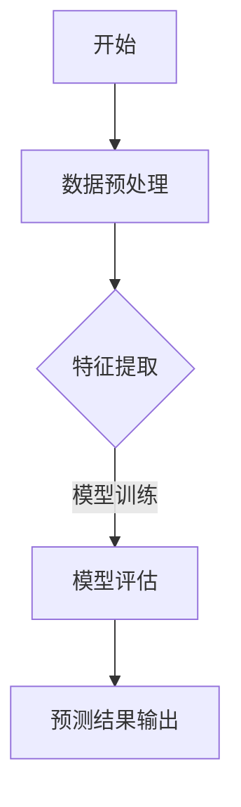
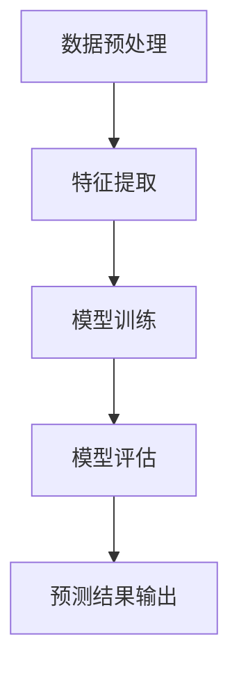

                 

## 文章标题

### 关键词

1. 知识图谱
2. 金融监管
3. 沙盒测试
4. 测试结果预测
5. 数据分析

### 摘要

本文将探讨如何构建一个基于知识图谱的金融监管沙盒测试结果预测平台。首先，我们将介绍知识图谱的概念及其在金融监管中的应用。随后，我们将分析金融监管沙盒的测试流程和测试结果预测的需求。接着，我们将详细讲解知识图谱的构建方法、表示方法和推理方法，以及知识图谱质量评估的方法和策略。最后，我们将讨论监管沙盒测试中的数据收集、风险管理以及预测算法的设计。通过本文的探讨，读者将了解如何利用知识图谱技术提升金融监管沙盒测试结果预测的准确性和效率。

## 第一部分: 介绍与背景

### 1.1 问题的提出

在当今的金融市场中，随着金融创新的不断推进和金融科技的迅速发展，传统的金融监管方式已经无法满足市场对监管效率和透明度的需求。金融监管面临的挑战主要包括：

1. **复杂性和多样性**：金融市场涉及多个金融机构、多个产品类型以及复杂的市场关系，传统的监管手段难以应对这种复杂性和多样性。
2. **风险识别和评估**：金融市场的风险具有高度复杂性和隐蔽性，传统的监管方式在风险识别和评估方面存在一定的局限性。
3. **信息不对称**：金融机构和监管机构之间存在信息不对称问题，这导致监管决策的及时性和准确性受到一定程度的影响。
4. **监管成本**：传统的监管方式往往需要大量的人力和物力投入，监管成本较高。

为了应对这些挑战，金融监管机构开始探索引入沙盒测试（Regulatory Sandbox）这一新兴的监管方式。沙盒测试旨在为创新金融产品或服务提供一种安全、受控的实验环境，通过在真实市场中进行测试，评估其潜在风险和合规性。

### 1.1.1 金融监管的挑战

金融监管的挑战主要体现在以下几个方面：

1. **监管政策滞后**：金融市场的变化速度远超过监管政策的制定和实施速度，导致监管政策滞后于市场发展。
2. **合规成本高**：金融机构需要投入大量资源来满足监管要求，这增加了合规成本。
3. **监管效率低**：传统的监管方式往往依赖于人工审查和审批，效率较低，难以满足实时监管的需求。
4. **风险评估困难**：金融产品的复杂性和多样性使得风险评估变得更加困难，传统方法难以有效识别潜在风险。

### 1.1.2 监管沙盒的应用

监管沙盒是一种创新的监管方式，旨在为金融创新提供受控的实验环境。其主要特点包括：

1. **实验性**：监管沙盒为金融创新提供了一个实验平台，允许在真实市场环境中进行测试，以评估其合规性和风险。
2. **灵活性**：监管沙盒具有较大的灵活性，可以根据市场变化和产品特点进行动态调整。
3. **监管宽松**：在监管沙盒内，金融机构可以享受一定的监管宽松政策，以降低合规风险。
4. **数据收集**：通过监管沙盒，监管机构可以收集大量数据，用于风险评估和政策制定。

### 1.1.3 测试结果预测的重要性

测试结果预测在金融监管沙盒中具有重要意义，主要体现在以下几个方面：

1. **风险识别**：通过测试结果预测，可以提前识别潜在的风险，为监管决策提供数据支持。
2. **合规性评估**：测试结果预测可以帮助评估金融产品或服务的合规性，确保其在市场上运行符合监管要求。
3. **优化监管策略**：基于测试结果预测，监管机构可以优化监管策略，提高监管效率和效果。
4. **降低成本**：通过预测结果，金融机构可以提前了解可能的风险和合规问题，降低合规成本。

## 1.2 知识图谱在金融监管中的应用

### 1.2.1 知识图谱的概念

知识图谱（Knowledge Graph）是一种用于表示实体及其关系的语义网络。它通过将实体、属性和关系进行结构化表示，提供了一种高效、可扩展的方法来组织和查询知识。

### 1.2.2 知识图谱的优势

知识图谱在金融监管中的应用具有以下几个优势：

1. **数据整合**：知识图谱可以将不同来源的数据进行整合，提供统一的视图，帮助监管机构更好地理解金融市场的全貌。
2. **关联发现**：知识图谱通过实体及其关系的表示，可以发现潜在的关系和关联，有助于风险识别和合规性评估。
3. **智能查询**：知识图谱支持基于语义的智能查询，可以快速检索相关实体和关系，提高监管效率。
4. **实时更新**：知识图谱可以实时更新和维护，确保监管数据的最新性和准确性。

### 1.2.3 知识图谱在金融领域的应用

知识图谱在金融领域的应用主要包括以下几个方面：

1. **风险管理和监控**：通过知识图谱，可以实时监控金融市场中的风险事件和风险传染，提高风险识别和预警能力。
2. **合规性评估**：知识图谱可以帮助监管机构快速评估金融产品或服务的合规性，确保其符合监管要求。
3. **金融知识图谱**：构建金融知识图谱，可以为金融机构提供智能化的金融知识查询和推荐服务，提高业务决策的准确性和效率。
4. **监管决策支持**：知识图谱可以为监管机构提供数据驱动的监管决策支持，优化监管策略和政策制定。

## 1.3 金融监管沙盒测试结果预测的需求分析

### 1.3.1 监管沙盒的基本架构

监管沙盒的基本架构通常包括以下几个关键组成部分：

1. **测试申请**：金融机构或创新企业向监管机构提交测试申请，包括测试方案、风险评估报告等。
2. **测试环境**：监管机构为申请者提供一个受控的测试环境，包括技术平台、数据源和测试工具等。
3. **测试执行**：申请者在测试环境中运行测试方案，收集测试数据，并提交测试报告。
4. **测试评估**：监管机构对测试结果进行评估，包括合规性评估、风险评估等。
5. **反馈与改进**：根据评估结果，监管机构和申请者进行反馈和改进，以确保测试的准确性和有效性。

### 1.3.2 测试结果预测的目标

测试结果预测的目标主要包括以下几个方面：

1. **合规性预测**：预测金融产品或服务在测试环境中是否满足监管要求，提高合规性评估的准确性。
2. **风险评估**：预测金融产品或服务可能带来的风险，为监管决策提供数据支持。
3. **优化测试策略**：根据预测结果，优化测试策略和测试方案，提高测试效率和效果。
4. **预测准确性**：提高预测结果的准确性，降低预测误差，确保预测的有效性。

### 1.3.3 预测模型的挑战

在金融监管沙盒测试结果预测中，预测模型的挑战主要包括：

1. **数据质量**：测试数据的质量直接影响预测模型的准确性，数据清洗和数据预处理是关键环节。
2. **模型选择**：选择适合的预测模型是预测成功的关键，需要综合考虑模型的性能、复杂度和可解释性。
3. **特征工程**：特征工程是预测模型的重要环节，需要提取和选择与预测目标相关的特征，以提高预测准确性。
4. **模型评估**：需要设计合理的评估指标和方法，对预测模型进行准确评估，以确定其性能和可靠性。
5. **实时性**：预测模型需要具备实时性，能够快速响应测试环境中的变化，提供及时的预测结果。

## 1.4 本书结构概述

### 1.4.1 各章节内容概览

本书分为三个主要部分，具体内容如下：

1. **第一部分：介绍与背景**：介绍金融监管沙盒测试结果预测的背景和需求，包括金融监管的挑战、监管沙盒的应用以及知识图谱在金融监管中的应用。

2. **第二部分：知识图谱基础**：介绍知识图谱的基本概念、构建方法、表示方法、推理方法和质量评估方法，以及实体关系图（ER）和Mermaid流程图的表示。

3. **第三部分：金融监管沙盒测试**：详细探讨金融监管沙盒的基本架构、测试流程、数据收集、风险管理以及测试结果预测的算法设计。

### 1.4.2 阅读建议

为了更好地理解本书的内容，建议读者按照以下顺序阅读：

1. 首先阅读第一部分，了解金融监管沙盒测试结果预测的背景和需求。
2. 接着阅读第二部分，掌握知识图谱的基本概念和方法，为后续内容打下基础。
3. 最后阅读第三部分，详细探讨金融监管沙盒测试的各个关键环节，理解测试结果预测的算法设计和实现。

通过本书的阅读，读者将能够全面了解基于知识图谱的金融监管沙盒测试结果预测平台的建设方法和关键技术，为实际应用提供参考和指导。

## 第二部分: 知识图谱基础

### 2.1 知识图谱的构建

知识图谱的构建是构建基于知识图谱的金融监管沙盒测试结果预测平台的基础。知识图谱的构建过程通常包括数据源的选择与处理、实体识别与关系抽取以及知识库的构建。

#### 2.1.1 数据源的选择与处理

数据源是知识图谱构建的起点。选择合适的数据源对于知识图谱的质量和实用性至关重要。数据源可以包括结构化数据（如数据库、表格数据）和非结构化数据（如图像、文本、音频等）。在数据源的选择上，需要考虑以下因素：

1. **数据质量**：数据源的准确性、完整性、一致性和可靠性是构建高质量知识图谱的前提。
2. **数据多样性**：数据源的多样性有助于扩展知识图谱的覆盖范围，提高其全面性和准确性。
3. **数据更新频率**：实时性强的数据源有助于构建动态更新的知识图谱，保持数据的最新性。

数据源选择后，需要对数据进行预处理，包括数据清洗、数据去重、数据格式转换等步骤。数据清洗是预处理的关键环节，其主要目的是去除数据中的噪声、错误和不一致，提高数据的质量。

#### 2.1.2 实体识别与关系抽取

实体识别（Entity Recognition）和关系抽取（Relation Extraction）是知识图谱构建的核心步骤。实体识别旨在从文本数据中识别出具有特定属性的实体，如人名、地名、组织机构等。关系抽取则是在已识别的实体之间建立关系，如“张三任职于阿里巴巴”、“北京是中国的首都”等。

实体识别和关系抽取通常采用自然语言处理（NLP）技术，如命名实体识别（NER）、依存句法分析、实体消歧等。以下是一些常用的方法和工具：

1. **基于规则的方法**：通过定义一组规则，自动识别实体和关系。这种方法简单但受限于规则库的覆盖范围。
2. **基于统计的方法**：使用机器学习算法，从大规模语料库中学习实体和关系的模式。这种方法具有较高的准确性和泛化能力。
3. **基于深度学习的方法**：利用深度神经网络，如卷积神经网络（CNN）和循环神经网络（RNN），进行实体识别和关系抽取。这种方法在处理复杂文本任务时表现出色。

#### 2.1.3 知识库的构建

知识库是知识图谱的核心组成部分，用于存储和管理实体及其关系。知识库的构建过程包括以下步骤：

1. **实体定义**：根据业务需求和数据源的特点，定义实体及其属性。实体可以是人、地点、组织、事件等。
2. **关系定义**：定义实体之间的关系，如“属于”、“发生”、“参与”等。关系的定义需要符合语义逻辑和业务场景。
3. **数据填充**：将已识别的实体和关系填充到知识库中。数据填充可以通过手动录入或自动抽取实现。
4. **知识融合**：将来自不同数据源的知识进行融合，消除数据冗余和冲突，提高知识库的一致性和完整性。

在知识库构建过程中，需要关注以下问题：

1. **数据一致性**：确保知识库中的数据一致，避免重复和冲突。
2. **数据质量**：保证知识库中的数据准确、完整和可靠。
3. **可扩展性**：知识库需要具备良好的扩展性，以适应业务发展和数据变化。

### 2.2 知识图谱表示方法

知识图谱的表示方法主要包括图论基础、RDF模型和命名实体识别。

#### 2.2.1 图论基础

图论（Graph Theory）是知识图谱表示的基础。知识图谱本质上是图结构，由节点（实体）和边（关系）组成。图论提供了丰富的理论工具和方法，用于分析、处理和优化知识图谱。

1. **节点与边**：节点表示实体，边表示实体之间的关系。节点的属性（如名称、类型、标签等）和边的属性（如权重、类型等）可以丰富知识图谱的语义信息。
2. **图的类型**：知识图谱可以是无向图或单向图，取决于实体之间的关系类型。有向图可以表示方向性关系，如“员工隶属于公司”，而无向图则适用于对称关系，如“朋友关系”。
3. **图的算法**：图论中的算法（如最短路径、连通性分析、社区发现等）可以用于知识图谱的查询和分析，提高数据处理和分析的效率。

#### 2.2.2 RDF模型

RDF（Resource Description Framework）模型是知识图谱的一种标准表示方法，基于图结构表示资源和资源之间的关系。

1. **RDF图**：RDF模型使用三元组（主体、谓词、客体）表示实体及其关系。每个三元组构成一个RDF图，可以灵活地表示复杂的关系结构。
2. **属性与类型**：RDF模型支持属性和类型的定义，可以扩展实体和关系的描述信息。例如，可以定义“人”的属性如姓名、年龄、性别等，以及“公司”的类型如组织、地址、电话等。
3. **查询语言**：RDF模型支持SPARQL查询语言，用于执行复杂的图查询和数据分析。SPARQL查询可以基于RDF图中的三元组进行数据检索和关联分析。

#### 2.2.3 命名实体识别

命名实体识别（Named Entity Recognition，NER）是自然语言处理（NLP）的一个重要任务，旨在从文本数据中识别出具有特定意义的实体，如人名、地名、组织名等。

1. **NER任务**：NER任务的目标是从给定文本中识别出所有命名实体，并标注其实体类型（如人名、地名、组织名等）。
2. **NER方法**：NER方法主要包括基于规则、基于统计和基于深度学习的方法。基于规则的方法通过定义一组规则，自动识别实体和实体类型；基于统计的方法利用机器学习算法，从大规模语料库中学习实体和实体类型的模式；基于深度学习的方法利用深度神经网络，如卷积神经网络（CNN）和循环神经网络（RNN），进行实体识别和实体类型标注。
3. **NER应用**：命名实体识别在知识图谱构建中具有重要意义，可以帮助识别文本中的关键实体，为知识图谱的实体识别和关系抽取提供数据支持。

### 2.3 知识图谱推理

知识图谱推理（Knowledge Graph Reasoning）是一种基于知识图谱进行推理和推理分析的方法，旨在发现实体间的隐含关系和语义信息。

#### 2.3.1 推理算法概述

知识图谱推理算法可以分为基于规则推理和基于数据推理两种类型。

1. **基于规则推理**：基于规则推理通过定义一组推理规则，从已知的事实中推导出新的结论。这种方法简单直观，但受限于规则库的覆盖范围和复杂性。
2. **基于数据推理**：基于数据推理利用图结构和数据关联，通过算法自动发现实体间的隐含关系。这种方法具有较强的灵活性和泛化能力，但计算复杂度较高。

常见的知识图谱推理算法包括：

1. **路径枚举算法**：通过遍历知识图谱中的路径，发现实体间的关联关系。例如，基于路径的相似度计算和关联规则挖掘等。
2. **逻辑推理算法**：基于逻辑推理（如谓词逻辑、模糊逻辑等），通过推理规则和逻辑公式进行推理。例如，基于命题逻辑的推理、模糊逻辑推理等。
3. **图神经网络算法**：利用图神经网络（如图卷积网络（GCN）、图注意力网络（GAT）等），通过学习实体和关系的特征，进行推理和预测。

#### 2.3.2 数据流处理与推理

在知识图谱构建和推理过程中，数据流处理（Data Stream Processing）是一种重要的技术手段，旨在实时处理和更新知识图谱。

1. **实时数据流处理**：实时数据流处理技术（如Apache Flink、Apache Storm等）可以高效地处理和更新知识图谱中的数据流，确保知识图谱的实时性和动态性。
2. **增量推理**：增量推理（Incremental Reasoning）是一种针对数据流处理中的知识图谱推理技术，通过处理增量数据，更新知识图谱和推理结果，提高推理的效率和准确性。

#### 2.3.3 知识图谱推理案例分析

以下是一个知识图谱推理案例：

**案例背景**：假设存在一个知识图谱，包含实体“张三”（人）、“阿里巴巴”（公司）和“北京”（城市），以及关系“任职于”、“位于”和“所在城市”。

**推理目标**：从已知事实中推导出“张三位于北京”这一结论。

**推理过程**：

1. **路径枚举**：根据知识图谱中的路径，枚举所有可能的路径。例如，从“张三”出发，经过“任职于”关系，到达“阿里巴巴”，再经过“位于”关系，到达“北京”。
2. **条件匹配**：对枚举的路径进行条件匹配，筛选出满足条件的路径。例如，只有当“张三任职于阿里巴巴”且“阿里巴巴位于北京”时，路径才被选中。
3. **推理结果**：根据条件匹配的结果，得出推理结论“张三位于北京”。

### 2.4 知识图谱质量评估

知识图谱质量评估（Knowledge Graph Quality Assessment）是确保知识图谱质量和可靠性的重要环节。知识图谱质量评估主要关注以下几个方面：

#### 2.4.1 评估指标

1. **覆盖率**：知识图谱中实体和关系的覆盖率，表示知识图谱覆盖现实世界的程度。覆盖率越高，知识图谱的全面性越好。
2. **准确性**：知识图谱中实体和关系的准确性，表示知识图谱中数据的真实性和可靠性。准确性越高，知识图谱的质量越好。
3. **一致性**：知识图谱中实体和关系的一致性，表示知识图谱内部数据的一致性和完整性。一致性越高，知识图谱的可信度越高。
4. **完整性**：知识图谱中数据的完整性，表示知识图谱中缺失数据的程度。完整性越高，知识图谱的实用性越好。
5. **实时性**：知识图谱数据的实时性，表示知识图谱数据更新的及时性和频率。实时性越高，知识图谱的应用价值越高。

#### 2.4.2 评估方法

1. **基于规则的评估**：通过定义一组规则，自动检查知识图谱中的实体和关系是否符合预期。这种方法简单直观，但受限于规则库的覆盖范围。
2. **基于数据的评估**：通过分析知识图谱中的实体和关系数据，评估其准确性和一致性。这种方法具有较强的灵活性和泛化能力，但计算复杂度较高。
3. **基于机器学习的评估**：利用机器学习算法，从大规模数据中学习评估指标和评估方法，自动评估知识图谱的质量。这种方法具有较高的自动化程度和准确性。

#### 2.4.3 质量优化策略

1. **数据清洗和预处理**：通过数据清洗和预处理，去除知识图谱中的噪声和错误数据，提高数据的准确性和一致性。
2. **数据整合和融合**：通过数据整合和融合，消除知识图谱中的数据冗余和冲突，提高数据的一致性和完整性。
3. **实时数据更新**：通过实时数据更新，确保知识图谱的数据实时性和准确性，提高知识图谱的应用价值。
4. **质量反馈和改进**：通过质量反馈和改进，不断优化知识图谱的质量和可靠性，提高知识图谱的实用性。

### 2.5 实体关系图（ER）与Mermaid流程图

实体关系图（Entity Relationship Diagram，ER图）和Mermaid流程图是知识图谱表示和可视化的重要工具。

#### 2.5.1 ER图的定义与作用

ER图是一种用于描述实体及其关系的图形化工具，常用于数据库设计和数据建模。ER图主要包括以下三个要素：

1. **实体**：实体表示知识图谱中的对象，如人、地点、组织等。实体具有属性，用于描述其特征。例如，“人”实体可以具有姓名、年龄、性别等属性。
2. **关系**：关系表示实体之间的联系，如“属于”、“位于”等。关系具有属性，用于描述关系的性质。例如，“任职于”关系可以具有职位、起始时间等属性。
3. **键**：键用于唯一标识实体和关系。实体键（如主键、外键）用于确保实体之间的联系是唯一和准确的。

ER图通过图形化的方式展示实体、关系和键，提供了一种直观、易懂的数据模型表示方法。

#### 2.5.2 Mermaid ER图示例

以下是一个Mermaid ER图示例：

```mermaid
erDiagram
    A[客户] ||--|{ B[订单] : 下单 } 
    B ||--|{ C[产品] : 销售 } 
```

在这个示例中，ER图展示了客户、订单和产品三个实体及其关系。客户下单创建订单，订单销售产品。

#### 2.5.3 Mermaid流程图

Mermaid流程图是一种用于描述流程、步骤和关系的图形化工具。以下是一个Mermaid流程图示例：



在这个示例中，流程图展示了数据预处理、特征提取、模型训练、模型评估和预测结果输出等步骤。

## 第三部分: 金融监管沙盒测试

### 3.1 金融监管沙盒概述

金融监管沙盒（Regulatory Sandbox）是一种创新的监管方式，旨在为金融创新提供受控的实验环境。通过监管沙盒，金融监管机构可以在真实市场环境中测试新的金融产品或服务，评估其潜在风险和合规性，同时降低市场试错成本。以下是金融监管沙盒的基本概念、目的和优势。

#### 3.1.1 沙盒测试的概念

沙盒测试是指在一个受控的环境中，对创新金融产品或服务进行测试和验证，以评估其合规性、风险和实际效果。在这个过程中，监管机构为申请者提供一定的宽松监管环境，允许其在有限范围内进行实验，同时确保不会对市场稳定性和消费者权益造成不利影响。

#### 3.1.2 沙盒测试的目的

沙盒测试的主要目的是：

1. **促进金融创新**：为金融创新提供安全、受控的实验环境，降低创新者面临的风险和成本，鼓励更多创新产品和服务涌现。
2. **评估风险和合规性**：通过沙盒测试，监管机构可以实时监控和创新产品的运行情况，评估其潜在风险和合规性，确保其在正式推出前符合相关法规要求。
3. **优化监管政策**：沙盒测试有助于监管机构了解金融市场的实际需求和问题，为制定更加科学、合理的监管政策和措施提供数据支持。

#### 3.1.3 沙盒测试的优势

沙盒测试具有以下优势：

1. **灵活性和适应性**：沙盒测试允许监管机构根据市场变化和产品特点，动态调整测试方案和监管政策，提高监管的灵活性和适应性。
2. **风险隔离**：通过在受控环境中进行测试，沙盒测试可以有效隔离风险，降低创新产品或服务对市场稳定性和消费者权益的潜在影响。
3. **降低成本**：沙盒测试可以降低创新者面临的合规成本和风险，减少市场试错的次数和费用，提高创新效率和成功率。
4. **数据收集**：沙盒测试为监管机构提供了宝贵的数据资源，有助于更深入地了解金融市场的运行规律和潜在问题，为监管决策提供数据支持。

### 3.2 监管沙盒测试流程

监管沙盒测试流程包括测试准备阶段、测试执行阶段和测试结果分析阶段。以下是各个阶段的详细描述：

#### 3.2.1 测试准备阶段

测试准备阶段是沙盒测试的起点，主要包括以下工作：

1. **申请提交**：金融机构或创新企业向监管机构提交沙盒测试申请，包括测试方案、风险评估报告、合规性证明等材料。
2. **申请审核**：监管机构对申请材料进行审核，评估项目的合规性和可行性。如果申请被批准，监管机构将向申请者提供测试环境和相关支持。
3. **测试方案制定**：申请者根据监管机构的要求，制定详细的沙盒测试方案，包括测试目标、测试方法、测试数据来源等。
4. **环境搭建**：监管机构或第三方服务商为申请者搭建测试环境，包括技术平台、数据源、测试工具等。

#### 3.2.2 测试执行阶段

测试执行阶段是沙盒测试的核心，主要包括以下工作：

1. **测试运行**：申请者按照测试方案，在测试环境中运行金融产品或服务，进行实际操作和测试。
2. **数据收集**：测试过程中，申请者需要收集大量数据，包括交易数据、用户行为数据、风险指标数据等，用于后续分析和评估。
3. **风险管理**：监管机构和申请者需要对测试过程中发现的风险进行实时监控和管理，确保测试环境的安全性和合规性。

#### 3.2.3 测试结果分析阶段

测试结果分析阶段是沙盒测试的收尾，主要包括以下工作：

1. **结果评估**：监管机构根据测试数据，对金融产品或服务的合规性、风险、用户体验等进行综合评估，形成评估报告。
2. **反馈与改进**：根据评估结果，监管机构和申请者进行反馈和改进，优化测试方案和金融产品，确保其在正式推出前达到最佳状态。
3. **测试总结**：监管机构对沙盒测试过程进行总结和回顾，为后续测试提供经验和教训。

### 3.3 监管沙盒测试中的数据收集

数据收集是监管沙盒测试中的关键环节，其质量直接影响测试结果的准确性和可靠性。以下是监管沙盒测试中数据收集的详细描述：

#### 3.3.1 数据源

监管沙盒测试中的数据源主要包括以下几类：

1. **内部数据**：金融机构或创新企业自身的业务数据，如交易记录、用户行为数据、风险指标数据等。
2. **外部数据**：来自第三方数据源的数据，如公共数据、行业数据、市场数据等。
3. **监管数据**：监管机构提供的监管数据，如监管政策、法规、行业标准等。

#### 3.3.2 数据处理

数据处理是数据收集的重要环节，主要包括以下工作：

1. **数据清洗**：去除数据中的噪声、错误和不一致，确保数据的质量和准确性。
2. **数据整合**：将来自不同数据源的数据进行整合，消除数据冗余和冲突，形成统一的数据视图。
3. **数据转换**：将数据转换为适合分析的形式，如数据格式转换、数据编码等。

#### 3.3.3 数据整合

数据整合是将来自不同数据源的数据进行整合，形成统一的数据视图，以便后续分析和评估。数据整合的方法主要包括：

1. **数据映射**：将不同数据源的数据字段进行映射，确保数据的一致性和可比性。
2. **数据融合**：将相同字段的数据进行合并，消除数据冗余。
3. **数据链接**：通过键（如ID、名称等）将不同数据源的数据进行链接，形成完整的实体关系图。

#### 3.3.4 数据质量管理

数据质量管理是确保数据质量的重要手段，主要包括以下工作：

1. **数据完整性检查**：检查数据是否完整，是否存在缺失值。
2. **数据准确性检查**：检查数据是否准确，与实际业务情况是否一致。
3. **数据一致性检查**：检查数据在不同数据源之间是否一致。
4. **数据实时性检查**：检查数据的实时性，确保数据的最新性。

#### 3.3.5 数据存储与管理

数据存储与管理是确保数据安全、可靠、可用的关键。数据存储与管理的方法主要包括：

1. **数据存储**：将数据存储在数据库、数据仓库或数据湖中，确保数据的持久化和安全。
2. **数据备份**：定期对数据进行备份，防止数据丢失和损坏。
3. **数据安全**：对数据进行加密、访问控制等安全措施，防止数据泄露和滥用。
4. **数据备份与恢复**：在数据发生丢失或损坏时，能够快速恢复数据，确保业务的连续性和稳定性。

### 3.4 监管沙盒测试中的风险管理

风险管理是监管沙盒测试中不可或缺的一部分，其目标是识别、评估和控制潜在风险，确保测试过程的顺利进行和测试结果的可信度。以下是监管沙盒测试中的风险管理方法的详细描述：

#### 3.4.1 风险识别

风险识别是风险管理的第一步，旨在发现可能影响监管沙盒测试的各种风险。风险识别的方法主要包括：

1. **专家评估**：邀请行业专家和监管人员对测试项目进行风险评估，识别潜在风险。
2. **历史数据**：分析历史测试项目的风险数据，总结常见的风险类型和特征。
3. **情景分析**：通过情景模拟，识别测试过程中可能出现的风险场景。

#### 3.4.2 风险评估

风险评估是对识别出的风险进行评估和排序，确定其严重性和发生概率，为后续风险控制提供依据。风险评估的方法主要包括：

1. **定量评估**：使用数学模型和统计方法，对风险的概率和影响进行量化评估。
2. **定性评估**：邀请专家对风险进行定性评估，根据风险的严重性和发生概率进行排序。
3. **矩阵评估**：使用风险矩阵，综合考虑风险的严重性和发生概率，确定风险优先级。

#### 3.4.3 风险控制

风险控制是针对评估出的高风险，采取相应的措施进行控制和减轻。风险控制的方法主要包括：

1. **预防措施**：在测试前采取预防措施，降低风险发生的概率。例如，制定详细的测试方案、加强安全防护等。
2. **应急措施**：在风险发生时，采取应急措施，减轻风险的影响。例如，设置风险预警系统、制定应急预案等。
3. **持续监控**：对测试过程中的风险进行持续监控，及时发现和处理新出现的问题。

### 3.5 监管沙盒测试结果预测的算法设计

监管沙盒测试结果预测是提高金融监管效率和准确性的关键环节。通过设计合适的预测算法，可以提前预测测试结果，为监管决策提供数据支持。以下是监管沙盒测试结果预测算法的设计方法和步骤：

#### 3.5.1 预测模型选择

选择合适的预测模型是预测成功的关键。根据监管沙盒测试的特点，常见的预测模型包括：

1. **基于统计学的模型**：如线性回归、逻辑回归等。这些模型简单易用，适用于线性关系较强的数据。
2. **基于机器学习的模型**：如决策树、随机森林、支持向量机等。这些模型具有较强的泛化能力和适应性，适用于非线性关系的数据。
3. **基于深度学习的模型**：如卷积神经网络（CNN）、循环神经网络（RNN）、图神经网络（GNN）等。这些模型适用于处理大规模、高维度的数据，可以捕捉复杂的非线性关系。

#### 3.5.2 预测算法的原理

预测算法的原理主要涉及以下方面：

1. **数据预处理**：对原始数据进行清洗、归一化、特征提取等处理，提高数据的质量和适用性。
2. **特征选择**：根据业务需求和数据特点，选择与预测目标相关的特征，剔除无关或冗余的特征，降低模型的复杂度和计算成本。
3. **模型训练**：使用训练数据集对预测模型进行训练，通过优化目标函数，调整模型参数，使其对训练数据具有较好的拟合能力。
4. **模型评估**：使用验证数据集对训练好的模型进行评估，通过评估指标（如准确率、召回率、F1值等），确定模型的性能和可靠性。
5. **预测输出**：将测试数据输入训练好的模型，生成预测结果，对测试结果进行预测和评估。

#### 3.5.3 算法流程图

以下是监管沙盒测试结果预测算法的流程图：



在这个流程图中，数据预处理、特征提取、模型训练、模型评估和预测结果输出是预测算法的主要步骤。

#### 3.5.4 数学模型与公式

以下是监管沙盒测试结果预测的数学模型和公式：

$$
\text{预测结果} = f(\text{输入特征})
$$

其中，$f$ 表示预测模型，$\text{输入特征}$ 表示输入的特征向量。

#### 3.5.5 Python代码实现示例

以下是使用Python实现监管沙盒测试结果预测的代码示例：

```python
import numpy as np
from sklearn.linear_model import LogisticRegression

# 数据预处理
# ...

# 特征提取
# ...

# 模型训练
model = LogisticRegression()
model.fit(X_train, y_train)

# 模型评估
accuracy = model.score(X_test, y_test)
print("模型准确率：", accuracy)

# 预测结果输出
predictions = model.predict(X_test)
print("预测结果：", predictions)
```

在这个示例中，我们使用逻辑回归模型（LogisticRegression）进行预测，首先对数据集进行预处理和特征提取，然后使用训练数据集训练模型，最后使用测试数据集进行模型评估和预测输出。

### 3.5.6 预测结果分析

预测结果分析是监管沙盒测试结果预测的重要环节，其目的是评估预测模型的性能和可靠性，为监管决策提供数据支持。以下是预测结果分析的步骤和方法：

1. **准确率分析**：计算预测结果的准确率，评估模型对测试数据的拟合程度。准确率越高，表示模型性能越好。
2. **召回率分析**：计算预测结果的召回率，评估模型对正例样本的识别能力。召回率越高，表示模型对正例样本的识别越准确。
3. **F1值分析**：计算预测结果的F1值，综合考虑准确率和召回率，评估模型的整体性能。F1值越高，表示模型性能越好。
4. **误差分析**：分析预测结果与实际结果之间的误差，评估模型的预测精度。误差越小，表示模型预测越准确。
5. **异常检测**：分析预测结果中的异常值，识别可能的错误预测和异常情况，为后续改进提供依据。

### 3.5.7 优化策略

为了提高监管沙盒测试结果预测的准确性和可靠性，可以采取以下优化策略：

1. **特征优化**：根据业务需求和数据特点，选择和调整与预测目标相关的特征，剔除无关或冗余的特征，提高模型的拟合能力和预测性能。
2. **模型优化**：选择和调整合适的预测模型，结合数据特点和业务需求，优化模型参数，提高模型的整体性能。
3. **数据优化**：提高数据质量，包括数据清洗、数据整合和数据预处理，降低数据噪声和异常值的影响，提高模型的预测准确性。
4. **集成优化**：结合多个预测模型，采用集成学习方法，提高预测结果的稳定性和可靠性，降低模型过拟合的风险。

通过以上优化策略，可以进一步提高监管沙盒测试结果预测的准确性和可靠性，为金融监管提供数据支持。

## 结束语

本文从介绍与背景、知识图谱基础和金融监管沙盒测试三个方面，详细探讨了构建基于知识图谱的金融监管沙盒测试结果预测平台的方法和关键技术。首先，我们介绍了金融监管沙盒的概念、应用以及测试结果预测的重要性。接着，我们分析了知识图谱的基本概念、构建方法、表示方法和推理方法，以及知识图谱质量评估的方法和策略。最后，我们详细讨论了金融监管沙盒测试的基本架构、测试流程、数据收集、风险管理以及测试结果预测的算法设计。

通过本文的探讨，读者可以全面了解基于知识图谱的金融监管沙盒测试结果预测平台的建设方法和关键技术，为实际应用提供参考和指导。然而，金融监管沙盒测试结果预测是一个复杂的过程，涉及多个学科和技术领域的交叉融合。在实际应用中，还需要不断优化和改进，以应对不断变化的市场环境和监管需求。

在未来，我们期望能够结合更多的实际案例和数据，深入探讨知识图谱在金融监管沙盒测试中的应用，探索更高效、更准确的预测模型，为金融监管提供更加智能化的支持。同时，我们也呼吁更多的研究人员和实践者参与到这一领域中来，共同推动金融监管沙盒测试和知识图谱技术的发展。

作者：AI天才研究院/AI Genius Institute & 禅与计算机程序设计艺术 /Zen And The Art of Computer Programming

作者简介：AI天才研究院（AI Genius Institute）是一家专注于人工智能技术研究与应用的机构，致力于推动人工智能技术在金融、医疗、教育等领域的创新与发展。同时，作者还是《禅与计算机程序设计艺术》一书的作者，该书以深刻的哲学思考和独特的编程技巧，为读者提供了关于程序设计的智慧启示。在此，作者愿与广大读者共同探讨和分享知识图谱在金融监管沙盒测试中的应用与实践经验。

