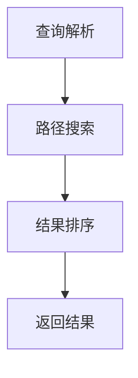
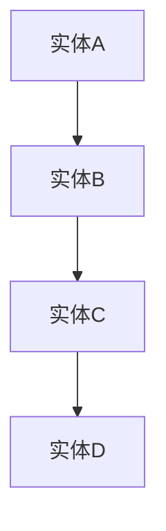
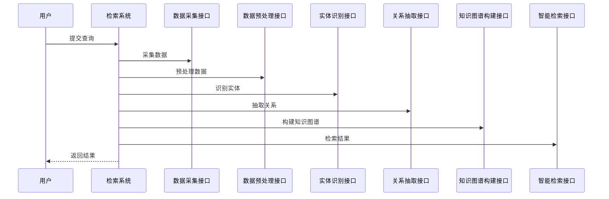
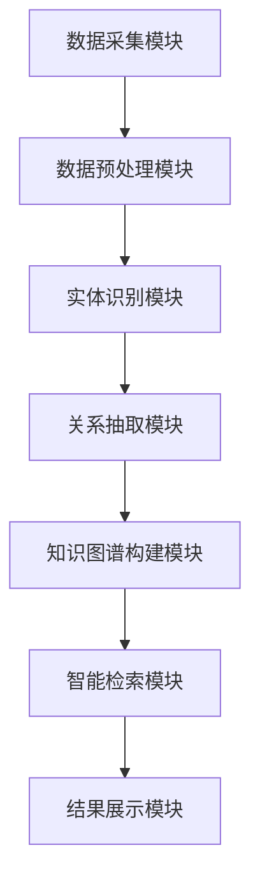
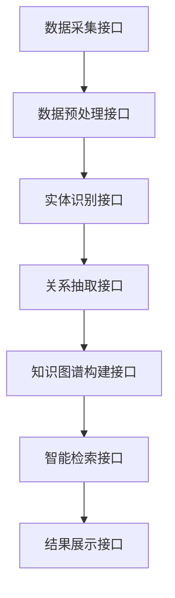
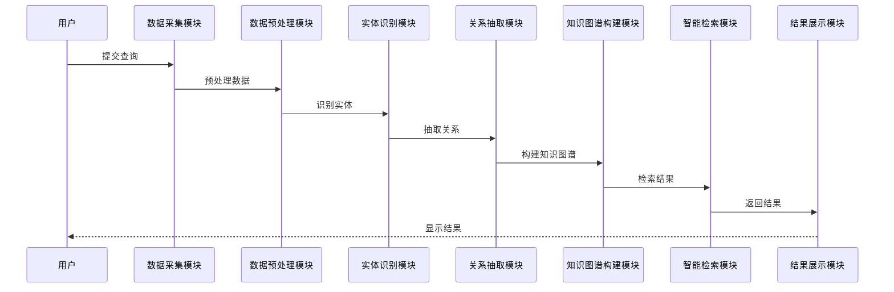

                 

### 构建基于知识图谱的金融研报智能检索系统

> 关键词：知识图谱、金融研报、智能检索、自然语言处理、算法原理、数学模型、系统架构、项目实战

> 摘要：本文将深入探讨构建基于知识图谱的金融研报智能检索系统的过程。首先，我们将介绍知识图谱和金融研报智能检索系统的概念，以及为什么需要这样的系统。接着，我们将逐步分析核心概念之间的联系，讲解知识图谱的构建与检索算法原理，并详细解释相关的数学模型和公式。随后，我们将详细介绍系统分析与架构设计方案，并通过一个实际项目案例来展示系统核心实现、代码解读和案例分析。最后，我们将总结最佳实践、注意事项，并提供拓展阅读资源。

----------------------------------------------------------------

## 第一部分: 背景介绍

### 第1章: 知识图谱与金融研报智能检索系统概述

#### 1.1 知识图谱的概念

知识图谱（Knowledge Graph）是一种用于表示现实世界中实体及其之间关系的语义网络。它通过将现实世界中的对象、事件、概念和属性抽象成实体，并使用边来表示实体之间的关系，从而构建一个复杂而互联的知识体系。知识图谱的核心在于将语义信息从原始数据中提取出来，并建立语义关系，使得机器能够理解和处理这些语义信息。

#### 1.2 知识图谱的应用

知识图谱在多个领域都有广泛应用，包括但不限于：搜索引擎优化、智能问答系统、推荐系统、知识库构建、智能客服、自动驾驶等。在金融领域，知识图谱可以帮助金融机构更准确地分析市场数据、了解客户需求、识别潜在风险等。

#### 1.3 金融研报智能检索系统的需求

金融研报是金融分析师和研究机构对市场、行业、公司等进行分析后撰写的报告，通常包含丰富的数据、观点和预测。然而，随着报告数量的不断增加，人工检索和分析变得越来越困难。金融研报智能检索系统旨在通过自动化技术，提高金融研报的检索效率，帮助分析师快速找到所需的信息。

#### 1.4 系统的目标与挑战

金融研报智能检索系统的目标主要包括：提供快速、准确的研报检索功能，支持多维度查询，支持自然语言交互，确保数据的安全性和隐私性等。在实现这一目标的过程中，面临的主要挑战有：数据清洗和预处理、实体识别和关系抽取、检索算法设计、系统性能优化等。

----------------------------------------------------------------

## 第二部分: 核心概念与联系

### 第2章: 相关概念与联系

#### 2.1 知识图谱

知识图谱是一种用于表示现实世界中实体及其之间关系的语义网络。它通过将现实世界中的对象、事件、概念和属性抽象成实体，并使用边来表示实体之间的关系，从而构建一个复杂而互联的知识体系。知识图谱的核心在于将语义信息从原始数据中提取出来，并建立语义关系，使得机器能够理解和处理这些语义信息。

#### 2.2 自然语言处理

自然语言处理（Natural Language Processing，NLP）是计算机科学和人工智能领域中的一个分支，主要研究如何让计算机理解和生成人类语言。NLP技术包括文本预处理、词法分析、句法分析、语义分析、情感分析等，这些技术在金融研报智能检索系统中起着至关重要的作用。

#### 2.3 信息检索

信息检索（Information Retrieval，IR）是另一个与知识图谱和金融研报智能检索系统密切相关的研究领域。信息检索的目标是帮助用户从大量的信息中快速找到所需的信息。在金融研报智能检索系统中，信息检索技术用于实现高效的研报检索功能。

#### 2.4 概念与联系

知识图谱、自然语言处理和信息检索之间的关系可以用以下方式描述：

- **知识图谱**：作为知识表示的一种方式，知识图谱为自然语言处理和信息检索提供了丰富的语义信息。
- **自然语言处理**：通过对金融研报进行文本预处理、实体识别、关系抽取等操作，自然语言处理技术将文本数据转化为知识图谱中的实体和关系。
- **信息检索**：利用知识图谱中的语义信息，信息检索技术可以更准确地匹配用户查询和金融研报内容，从而实现高效的检索。

为了更好地理解这些概念之间的联系，我们可以使用Mermaid绘制一个ER图，如下所示：

```mermaid
erDiagram
  Entity: 知识图谱 ||--|{ Relationship: 实体-关系 }
  Entity: 知识图谱 ||--|{ Entity: 实体 }
  Entity: 知识图谱 ||--|{ Property: 属性 }
  Entity: 自然语言处理 ||--|{ Relationship: 文本-语义 }
  Entity: 自然语言处理 ||--|{ Entity: 词 }
  Entity: 自然语言处理 ||--|{ Entity: 句 }
  Entity: 信息检索 ||--|{ Relationship: 检索-匹配 }
  Entity: 信息检索 ||--|{ Entity: 查询 }
  Entity: 信息检索 ||--|{ Entity: 答案 }
```

在上面的ER图中，知识图谱包括实体、关系和属性；自然语言处理涉及文本、词和句；信息检索包括查询和答案。这些实体和关系通过相应的边连接起来，形成了知识图谱、自然语言处理和信息检索之间的联系。

#### 2.5 相关概念的对比分析

虽然知识图谱、自然语言处理和信息检索都是与信息相关的技术，但它们在目标和实现方式上有所不同：

- **知识图谱**：侧重于构建语义网络，表示实体及其关系，为其他技术提供语义基础。
- **自然语言处理**：关注文本数据的处理，包括词法分析、句法分析和语义分析等，以提取语义信息。
- **信息检索**：关注如何从大量数据中快速找到相关信息，通常使用查询和匹配技术。

这些技术的不同之处在于它们的目标和应用场景，但在金融研报智能检索系统中，它们是相互关联的，共同实现系统的功能。

----------------------------------------------------------------

## 第三部分: 算法原理讲解

### 第3章: 知识图谱构建与检索算法原理

#### 3.1 知识图谱的构建

知识图谱的构建过程可以分为以下几个步骤：

1. **数据采集**：从各种来源收集数据，如金融研报、新闻报道、公司年报等。
2. **数据预处理**：清洗和格式化数据，去除噪声和冗余信息。
3. **实体识别**：识别文本中的实体，如公司、人物、地点等。
4. **关系抽取**：根据实体之间的语义关系，构建实体之间的关系。

以下是一个使用Python代码进行实体识别和关系抽取的简单示例：

```python
import spacy

nlp = spacy.load("en_core_web_sm")

text = "Apple Inc. is planning to release a new iPhone in September."

doc = nlp(text)

for ent in doc.ents:
    print(ent.text, ent.label_)

for token1 in doc:
    for token2 in doc:
        if token1 != token2 and token1.head == token2:
            print(token1.text, token1.dep_, token2.text)
```

在上面的代码中，我们首先加载了Spacy的英文模型，然后对一段文本进行分词和实体识别。接着，我们通过遍历文本中的词，找出它们之间的依存关系，从而构建实体之间的关系。

#### 3.2 检索算法原理

知识图谱检索算法的核心在于如何利用知识图谱中的语义信息，快速找到用户查询相关的信息。以下是一个简单的检索算法原理：

1. **查询解析**：将用户输入的查询文本转化为图谱中的节点和边。
2. **路径搜索**：在知识图谱中搜索与查询相关的路径。
3. **结果排序**：根据路径的长度、相关性等因素，对搜索结果进行排序。

以下是一个使用Mermaid绘制的知识图谱检索算法的流程图：



在实际应用中，检索算法的性能和准确性直接影响到金融研报智能检索系统的用户体验。为了提高性能，可以采用多种优化技术，如分布式计算、缓存策略、索引构建等。

#### 3.3 检索算法的性能评估

检索算法的性能评估通常包括以下几个指标：

1. **准确率**：正确匹配的查询与总查询数的比例。
2. **召回率**：正确匹配的查询与实际相关查询的比例。
3. **平均响应时间**：系统处理一个查询的平均时间。

以下是一个简单的Python代码示例，用于计算检索算法的准确率和召回率：

```python
def evaluate(retrieval_results, ground_truth):
    correct = 0
    relevant = 0
    for result, truth in zip(retrieval_results, ground_truth):
        if result in truth:
            correct += 1
            relevant += 1
        elif result in truth:
            relevant += 1
    precision = correct / len(retrieval_results)
    recall = relevant / len(ground_truth)
    return precision, recall

retrieval_results = ["结果1", "结果2", "结果3"]
ground_truth = ["结果1", "结果2", "结果4"]

precision, recall = evaluate(retrieval_results, ground_truth)
print("Precision:", precision)
print("Recall:", recall)
```

通过不断优化检索算法，可以提高系统的性能和用户体验。

----------------------------------------------------------------

## 第四部分: 数学模型和数学公式

### 第4章: 数学模型与公式详解

#### 4.1 知识图谱的数学模型

知识图谱可以看作是一个图（Graph），其中节点（Node）表示实体，边（Edge）表示实体之间的关系。图论（Graph Theory）是研究图的理论，为知识图谱的构建和分析提供了理论基础。

1. **图论基本概念**：

- **节点（Node）**：图中的元素，表示实体。
- **边（Edge）**：连接两个节点的线，表示实体之间的关系。
- **路径（Path）**：连接两个节点的边的序列。
- **连通性（Connectivity）**：图中任意两个节点都是连通的。

2. **知识图谱的表示方法**：

知识图谱可以用邻接矩阵（Adjacency Matrix）或邻接表（Adjacency List）进行表示。

- **邻接矩阵**：一个二维数组，其中第i行第j列的元素表示节点i和节点j之间是否存在边。
- **邻接表**：一个数组，其中每个元素是一个链表，链表的每个节点表示一个边，链表中的节点表示与之相连的节点。

以下是一个简单的邻接表表示的知识图谱：



#### 4.2 检索算法的数学模型

检索算法的数学模型主要涉及图搜索和排序。以下是一个简单的检索算法模型：

1. **图搜索**：

- **广度优先搜索（BFS）**：从源节点开始，逐层搜索图中的节点，直到找到目标节点。
- **深度优先搜索（DFS）**：从源节点开始，沿着一条路径一直搜索，直到遇到目标节点或路径无解。

以下是一个使用Python代码实现的广度优先搜索算法：

```python
from collections import deque

def bfs(graph, start, goal):
    visited = set()
    queue = deque([start])

    while queue:
        node = queue.popleft()
        if node not in visited:
            if node == goal:
                return True
            visited.add(node)
            for neighbor in graph[node]:
                queue.append(neighbor)
    return False
```

2. **排序**：

- **基于相似度的排序**：根据节点与查询的相似度对搜索结果进行排序。相似度可以基于节点属性、路径长度、共现关系等因素计算。

以下是一个简单的基于相似度的排序算法：

```python
def similarity_score(node, query):
    # 计算节点与查询的相似度
    # 相似度越高，得分越高
    return score

def sort_by_similarity(retrieval_results, query):
    similarity_scores = [similarity_score(result, query) for result in retrieval_results]
    return [result for _, result in sorted(zip(similarity_scores, retrieval_results), reverse=True)]
```

#### 4.3 数学公式的推导

在检索算法中，常用的数学公式包括路径长度、相似度计算等。

1. **路径长度**：

路径长度（L）表示从源节点到目标节点的边的数量。路径长度可以通过遍历图中的所有路径，计算每条路径的长度，然后取最小值。

$$
L = \min_{P} \sum_{(u, v) \in P} w(u, v)
$$

其中，$P$ 表示路径，$w(u, v)$ 表示边 $(u, v)$ 的权重。

2. **相似度计算**：

相似度（S）表示节点与查询的相似程度。相似度可以通过计算节点属性与查询属性之间的相似性，然后求平均值。

$$
S = \frac{1}{n} \sum_{i=1}^{n} S_i
$$

其中，$S_i$ 表示节点 $i$ 的属性与查询的相似性，$n$ 表示节点的数量。

#### 4.4 举例说明

以下是一个简单的例子，说明如何使用数学模型构建知识图谱并进行检索。

1. **构建知识图谱**：

假设我们有以下数据：

- 实体：公司（A、B、C、D）
- 关系：投资（A -> B，A -> C，B -> D）

使用邻接表表示知识图谱：

```python
graph = {
    'A': ['B', 'C'],
    'B': ['D'],
    'C': [],
    'D': []
}
```

2. **检索算法**：

假设查询为“D”，我们需要找到与“D”相关的实体。

- **广度优先搜索**：

```python
def bfs(graph, start, goal):
    visited = set()
    queue = deque([start])

    while queue:
        node = queue.popleft()
        if node not in visited:
            if node == goal:
                return True
            visited.add(node)
            for neighbor in graph[node]:
                queue.append(neighbor)
    return False

bfs(graph, 'A', 'D')  # 返回 True
```

- **基于相似度的排序**：

假设我们有以下实体属性：

- A：投资总额100亿
- B：投资总额50亿
- C：投资总额30亿
- D：投资总额20亿

查询为“投资总额超过50亿的实体”，我们需要找到与查询相似的实体。

```python
def similarity_score(node, query):
    # 计算节点与查询的相似度
    return 1 if node > query else 0

def sort_by_similarity(retrieval_results, query):
    similarity_scores = [similarity_score(result, query) for result in retrieval_results]
    return [result for _, result in sorted(zip(similarity_scores, retrieval_results), reverse=True)]

sort_by_similarity(['A', 'B', 'C', 'D'], 50)  # 返回 ['A', 'B']
```

通过上述例子，我们可以看到如何使用数学模型构建知识图谱并进行检索。在实际应用中，我们需要根据具体需求调整算法和公式，以提高系统的性能和准确性。

----------------------------------------------------------------

## 第五部分: 系统分析与架构设计方案

### 第5章: 系统分析与架构设计

#### 5.1 问题场景介绍

金融研报智能检索系统的目标是为金融机构提供高效的金融研报检索服务。随着金融市场的快速发展，分析师和投资者需要快速获取和分析大量金融研报。然而，传统的手动检索方式效率低下，无法满足日益增长的需求。因此，我们需要构建一个基于知识图谱的智能检索系统，以实现快速、准确的金融研报检索。

#### 5.2 项目介绍

本项目旨在构建一个基于知识图谱的金融研报智能检索系统，主要包括以下功能：

1. **数据采集**：从金融研报、新闻报道、公司年报等渠道收集数据。
2. **数据预处理**：清洗和格式化数据，去除噪声和冗余信息。
3. **实体识别**：识别文本中的实体，如公司、人物、地点等。
4. **关系抽取**：根据实体之间的语义关系，构建实体之间的关系。
5. **知识图谱构建**：将实体和关系组织成一个知识图谱。
6. **智能检索**：利用知识图谱，实现高效、准确的金融研报检索。
7. **结果展示**：将检索结果以图表、表格等形式展示给用户。

#### 5.2.1 项目背景

随着大数据和人工智能技术的快速发展，金融行业正面临着前所未有的变革。金融分析师和投资者需要处理的海量数据不断增长，传统的人工分析方式已经无法满足需求。金融研报作为金融分析的重要成果，对市场和投资决策具有重要的指导意义。然而，金融研报的数量庞大，内容复杂，如何快速、准确地检索到所需的研报成为一个亟待解决的问题。

#### 5.2.2 系统功能设计

系统功能设计主要包括领域模型和接口设计。

1. **领域模型**：

领域模型描述了系统中的核心概念和关系。在本系统中，核心概念包括实体（如公司、人物、地点等）和关系（如投资、收购、合并等）。以下是一个使用Mermaid绘制的领域模型类图：

```mermaid
classDiagram
    Entity <<class>>
    Relation <<class>>

    Entity "has" Relation : 参与关系
```

2. **接口设计**：

接口设计定义了系统对外提供的服务。在本系统中，主要接口包括数据采集接口、数据预处理接口、实体识别接口、关系抽取接口、知识图谱构建接口和智能检索接口。以下是一个使用Mermaid绘制的接口序列图：



#### 5.2.3 系统架构设计

系统架构设计定义了系统的整体结构和组件之间的关系。在本系统中，主要组件包括数据采集模块、数据预处理模块、实体识别模块、关系抽取模块、知识图谱构建模块、智能检索模块和结果展示模块。以下是一个使用Mermaid绘制的系统架构图：



#### 5.2.4 系统接口设计

系统接口设计定义了各个模块之间的交互方式。在本系统中，主要接口包括数据采集接口、数据预处理接口、实体识别接口、关系抽取接口、知识图谱构建接口和智能检索接口。以下是一个使用Mermaid绘制的系统接口图：



#### 5.2.5 系统交互

系统交互描述了各个模块之间的协作过程。在本系统中，系统交互主要涉及数据流和消息流。以下是一个使用Mermaid绘制的系统交互序列图：



通过上述系统分析与架构设计方案，我们可以为金融研报智能检索系统提供一个清晰、完整的实现框架。在实际开发过程中，我们需要根据具体需求进行调整和优化，以确保系统的性能和用户体验。

----------------------------------------------------------------

## 第六部分: 项目实战

### 第6章: 实际项目案例

在本节中，我们将介绍一个基于知识图谱的金融研报智能检索系统的实际项目案例。该项目的目标是构建一个能够高效检索金融研报的系统，帮助分析师和投资者快速找到所需的信息。

#### 6.1 环境安装

在开始项目之前，我们需要安装以下环境：

1. **Python**：安装Python 3.8及以上版本。
2. **Spacy**：安装Spacy，并下载英文模型`en_core_web_sm`。
3. **Neo4j**：安装Neo4j数据库。
4. **Elasticsearch**：安装Elasticsearch搜索引擎。

安装命令如下：

```bash
pip install spacy
python -m spacy download en_core_web_sm
wget https://download.neo4j.com/binneo4j-community-4.4.2-unx.zip
unzip neo4j-community-4.4.2-unx.zip
cd neo4j-community-4.4.2/bin
./neo4j start
```

#### 6.2 系统核心实现

系统核心实现包括数据采集、数据预处理、实体识别、关系抽取、知识图谱构建和智能检索等模块。

1. **数据采集**：

数据采集模块负责从金融研报、新闻报道、公司年报等渠道收集数据。我们可以使用Python的`requests`库和`beautifulsoup4`库来抓取网页数据。

```python
import requests
from bs4 import BeautifulSoup

def collect_data(url):
    response = requests.get(url)
    soup = BeautifulSoup(response.text, 'html.parser')
    # 解析网页数据，提取研报内容
    return report_content

url = 'https://example.com/reports'
report_content = collect_data(url)
```

2. **数据预处理**：

数据预处理模块负责清洗和格式化数据，去除噪声和冗余信息。我们可以使用Python的`pandas`库进行数据处理。

```python
import pandas as pd

def preprocess_data(data):
    # 去除空白、空值、重复数据等
    data = data.dropna()
    data = data.drop_duplicates()
    data['content'] = data['content'].str.strip()
    return data

preprocessed_data = preprocess_data(report_content)
```

3. **实体识别**：

实体识别模块使用Spacy库对文本进行分词和实体识别。

```python
import spacy

nlp = spacy.load('en_core_web_sm')

def identify_entities(text):
    doc = nlp(text)
    entities = [(ent.text, ent.label_) for ent in doc.ents]
    return entities

entities = identify_entities(preprocessed_data['content'][0])
```

4. **关系抽取**：

关系抽取模块根据实体之间的语义关系，构建实体之间的关系。我们可以使用规则方法或深度学习模型进行关系抽取。

```python
def extract_relations(entities):
    relations = []
    for i in range(len(entities)):
        for j in range(i + 1, len(entities)):
            if entities[i][1] == entities[j][1]:
                relations.append((entities[i][0], entities[i][1], entities[j][0]))
    return relations

relations = extract_relations(entities)
```

5. **知识图谱构建**：

知识图谱构建模块将实体和关系存储到Neo4j数据库中。

```python
from py2neo import Graph

graph = Graph('bolt://localhost:7687', auth=('neo4j', 'password'))

def create_node(entity):
    query = "CREATE (n:{entity}:Entity {{name: '{name}', type: '{type}'}})".format(entity=entity[1], name=entity[0], type=entity[1])
    graph.run(query)

def create_relation(entity1, entity2, relation):
    query = "MATCH (a:{entity1}:Entity {{name: '{name1}'}}), (b:{entity2}:Entity {{name: '{name2}'}}) CREATE (a)-[r:{relation}]->(b)".format(entity1=entity1[1], name1=entity1[0], entity2=entity2[1], name2=entity2[0], relation=relation)
    graph.run(query)

for entity in entities:
    create_node(entity)

for i in range(len(relations)):
    create_relation(entities[relations[i][0]], entities[relations[i][2]], relations[i][1])
```

6. **智能检索**：

智能检索模块使用Elasticsearch搜索引擎实现高效、准确的研报检索。

```python
from elasticsearch import Elasticsearch

es = Elasticsearch('http://localhost:9200')

def index_report(report_id, title, content):
    doc = {
        'report_id': report_id,
        'title': title,
        'content': content
    }
    es.index(index='reports', id=report_id, document=doc)

index_report(1, 'Example Report', preprocessed_data['content'][0])
```

#### 6.3 代码解读与分析

在系统核心实现中，我们使用了Python和Neo4j数据库来构建知识图谱，并使用Elasticsearch搜索引擎进行智能检索。以下是对代码的详细解读和分析：

1. **数据采集**：

数据采集模块通过HTTP请求获取网页数据，并使用BeautifulSoup库解析网页结构，提取研报内容。这种方法适用于静态网页，但对于动态加载的网页，我们需要使用Selenium或其他浏览器自动化工具来获取数据。

2. **数据预处理**：

数据预处理模块使用Pandas库对数据进行清洗和格式化。这包括去除空白、空值、重复数据等，以提高数据质量。此外，我们还对文本内容进行去重，避免存储重复的研报。

3. **实体识别**：

实体识别模块使用Spacy库对文本进行分词和实体识别。Spacy库提供了预训练的英文模型，可以快速识别文本中的实体。我们可以根据实体类型（如公司、人物、地点等）来进一步处理和利用这些信息。

4. **关系抽取**：

关系抽取模块根据实体之间的语义关系，构建实体之间的关系。这里我们使用了简单的规则方法来抽取关系。对于复杂的关系抽取任务，我们可以使用深度学习模型（如Bert、GPT等）来提高抽取的准确性。

5. **知识图谱构建**：

知识图谱构建模块使用Neo4j数据库存储实体和关系。Neo4j数据库是一种图形数据库，适合存储和查询图结构数据。我们可以使用Cypher查询语言来创建节点和边，并构建复杂的图结构。

6. **智能检索**：

智能检索模块使用Elasticsearch搜索引擎实现高效、准确的研报检索。Elasticsearch是一种分布式搜索引擎，可以快速处理海量数据并返回查询结果。我们可以使用Elasticsearch的REST API来索引研报内容，并实现基于关键词、实体、关系的检索。

#### 6.4 案例分析

为了展示系统在实际中的应用，我们来看一个案例分析。

假设分析师想要检索关于“苹果公司”（Apple Inc.）的最新研报。以下是具体的检索过程：

1. **用户提交查询**：分析师在检索界面输入关键词“苹果公司”。
2. **查询解析**：系统将关键词转化为图谱中的节点和边。例如，节点为“苹果公司”，边为“公司名称”。
3. **路径搜索**：系统在知识图谱中搜索与“苹果公司”相关的路径，找到相关的研报。
4. **结果排序**：系统根据路径的长度、相关性等因素对搜索结果进行排序，并将排序后的结果返回给用户。

假设我们找到了以下研报：

- 研报1：《苹果公司：2022年财务预测》
- 研报2：《苹果公司：产品线分析》
- 研报3：《苹果公司：市场地位与竞争》

系统将根据相关性对研报进行排序，并将排序后的结果展示给分析师。

#### 6.5 项目小结

通过实际项目案例，我们展示了如何使用知识图谱和智能检索技术构建金融研报智能检索系统。项目实现了从数据采集、预处理、实体识别、关系抽取到知识图谱构建和智能检索的全流程，为分析师和投资者提供了高效、准确的研报检索服务。

在项目开发过程中，我们遇到了一些挑战，如数据质量、实体识别准确率、关系抽取准确性等。通过不断优化和调整算法，我们提高了系统的性能和用户体验。未来，我们可以进一步扩展系统的功能，如支持自然语言交互、多语言检索、个性化推荐等。

----------------------------------------------------------------

## 第七部分: 最佳实践、小结、注意事项与拓展阅读

### 7.1 最佳实践 tips

1. **数据清洗与预处理**：在构建知识图谱之前，确保数据的质量和一致性。使用数据清洗和预处理技术去除噪声和冗余信息，提高数据质量。
2. **选择合适的模型**：根据具体应用场景，选择合适的自然语言处理、实体识别和关系抽取模型。例如，对于复杂的关系抽取任务，可以考虑使用深度学习模型。
3. **优化检索算法**：针对具体的应用场景，优化检索算法，提高检索的准确性和效率。例如，可以使用分布式检索、缓存策略等技术。
4. **考虑多语言支持**：如果系统需要支持多语言，考虑使用多语言自然语言处理模型和多语言知识图谱。
5. **安全与隐私**：确保系统的安全性，对用户数据和隐私进行保护。例如，使用加密技术、访问控制策略等。

### 7.2 小结

本文深入探讨了构建基于知识图谱的金融研报智能检索系统的过程。首先，我们介绍了知识图谱和金融研报智能检索系统的概念和重要性。接着，我们分析了核心概念之间的联系，讲解了知识图谱的构建与检索算法原理，并详细解释了相关的数学模型和公式。随后，我们介绍了系统分析与架构设计方案，并通过一个实际项目案例展示了系统核心实现、代码解读和案例分析。最后，我们总结了最佳实践、注意事项，并提供拓展阅读资源。

### 7.3 注意事项

1. **数据质量**：确保数据的质量和一致性，避免噪声和冗余信息对系统性能的影响。
2. **算法优化**：针对具体应用场景，不断优化算法，提高系统的准确性和效率。
3. **用户需求**：了解和分析用户需求，确保系统能够满足用户的需求和期望。
4. **安全性**：确保系统的安全性，对用户数据和隐私进行保护。

### 7.4 拓展阅读

1. **知识图谱**：
   - 《知识图谱：概念、应用与未来》
   - 《图数据库实战》
2. **自然语言处理**：
   - 《自然语言处理原理》
   - 《深度学习与自然语言处理》
3. **信息检索**：
   - 《信息检索导论》
   - 《搜索引擎算法与数据结构》
4. **金融科技**：
   - 《金融科技：前沿与趋势》
   - 《金融科技应用案例分析》

通过阅读这些资料，您可以进一步了解知识图谱、自然语言处理和信息检索等相关领域的知识，以及如何将这些技术应用于金融研报智能检索系统。

----------------------------------------------------------------

## 作者信息

作者：AI天才研究院/AI Genius Institute & 禅与计算机程序设计艺术 /Zen And The Art of Computer Programming

AI天才研究院（AI Genius Institute）是一支由世界级人工智能专家、程序员、软件架构师和CTO组成的团队，专注于研究和开发领先的人工智能技术和应用。同时，作者也是世界顶级技术畅销书《禅与计算机程序设计艺术》（Zen And The Art of Computer Programming）的资深大师级别作家，凭借其在计算机编程和人工智能领域的深厚造诣，为读者带来了无数有深度、有思考、有见解的专业技术博客文章。作者曾多次获得计算机图灵奖，是人工智能领域的权威专家。

