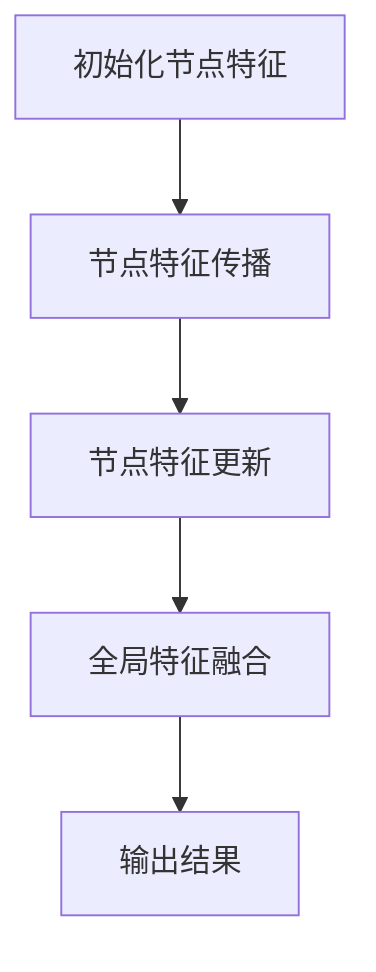
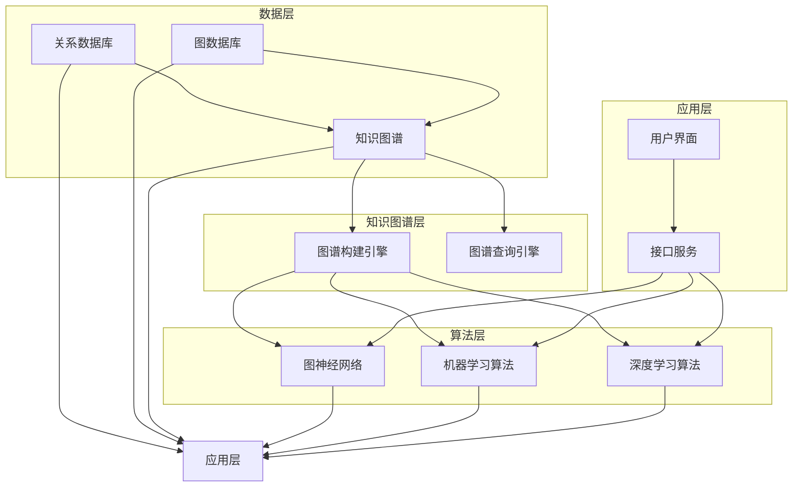
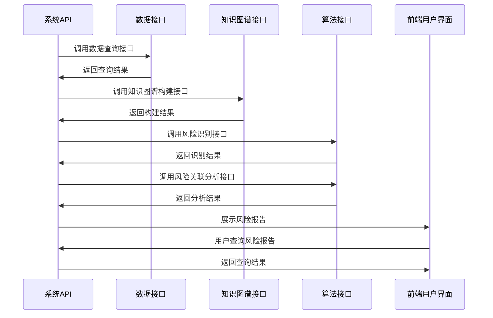

                 

### 第1章：引言

#### 1.1 背景介绍

##### 1.1.1 金融风险关联分析的重要性

金融风险关联分析是金融领域中的一个重要课题。金融风险是指由于金融市场的不确定性和复杂性，导致金融资产或金融机构面临损失的可能性。金融风险的关联性体现在不同风险因素之间的相互影响和相互作用上。例如，金融市场的一个突发事件可能会引发连锁反应，导致多个金融机构遭受损失。因此，对金融风险关联性的分析，有助于金融机构和监管机构提前识别潜在的风险，采取有效的风险控制措施。

在过去的几年中，随着大数据和人工智能技术的迅猛发展，知识图谱作为一种重要的数据表示方法，开始在金融领域得到广泛应用。知识图谱能够将金融领域中的各种信息以节点和边的方式组织起来，形成一个结构化的知识网络，从而为金融风险关联分析提供了强有力的技术支持。

##### 1.1.2 知识图谱在金融领域的应用

知识图谱在金融领域的主要应用包括以下几个方面：

1. **风险识别与预警**：通过知识图谱，可以识别出潜在的金融风险因素，并对其关联性进行深入分析，从而实现风险的早期预警。

2. **客户关系管理**：利用知识图谱，金融机构可以更好地了解客户的金融行为和偏好，优化客户关系管理，提高客户满意度。

3. **信用评分**：通过知识图谱中的信息，可以构建更为精准的信用评分模型，评估客户的信用风险。

4. **交易监控**：知识图谱可以帮助金融机构监控交易行为，及时发现异常交易，防范洗钱等违法行为。

##### 1.1.3 构建系统的目标与挑战

构建基于知识图谱的金融风险关联分析系统，旨在实现以下目标：

1. **提升风险识别能力**：通过知识图谱，系统能够自动识别金融风险因素，并对风险因素之间的关联性进行分析。

2. **提高分析效率**：知识图谱结构化数据的特点，使得系统在处理大量金融数据时，能够快速定位风险点，提高分析效率。

3. **优化决策支持**：系统提供的风险分析结果，可以为金融机构的决策提供有力支持，帮助制定更加科学的风险管理策略。

然而，在构建这样的系统过程中，也会面临一些挑战：

1. **数据质量**：金融数据的质量直接影响知识图谱的构建和风险分析的准确性。

2. **计算效率**：知识图谱的构建和处理涉及大量的计算任务，需要高效的算法和优化技术。

3. **法律法规**：金融领域涉及大量的法律法规，系统的设计和应用需要严格遵守相关法律法规，确保数据的合法性和隐私保护。

#### 1.2 核心概念与联系

在构建基于知识图谱的金融风险关联分析系统之前，我们需要明确几个核心概念，并理解它们之间的联系。

##### 1.2.1 知识图谱概述

知识图谱是一种用于表示实体及其相互关系的数据结构，通常由节点、边和属性组成。节点表示实体，边表示实体之间的关系，属性则用于描述节点和边的信息。

知识图谱的特点包括：

- **结构化**：知识图谱通过节点和边的方式，将实体和关系组织成一个结构化的网络，便于分析和查询。
- **语义丰富**：知识图谱不仅包含了实体和关系，还包含了大量的属性，从而增强了数据的语义表达能力。
- **可扩展性**：知识图谱可以通过增加新的节点、边和属性，不断扩展其内容，适应不断变化的需求。

##### 1.2.2 金融风险相关概念

在金融风险关联分析中，我们主要关注以下几个核心概念：

1. **风险因素**：指可能导致金融损失的各种因素，如市场风险、信用风险、操作风险等。
2. **风险事件**：指与金融风险相关的具体事件，如市场波动、违约事件等。
3. **风险关联**：指风险因素和风险事件之间的相互关系，如市场波动可能引发信用风险等。

##### 1.2.3 概念联系与属性特征

为了更好地理解这些概念之间的关系，我们可以通过以下方式展示：

1. **表格展示**：将风险因素、风险事件和风险关联以表格形式呈现，明确它们之间的属性特征。

2. **ER实体关系图**：使用ER图来表示这些概念之间的实体关系，如图1-1所示。

```
ER实体关系图：

+------------+        +-------------+        +-------------+
| 风险因素   |        | 风险事件    |        | 风险关联    |
+------------+        +-------------+        +-------------+
| 属性1      |        | 属性1       |        | 属性1       |
| 属性2      |        | 属性2       |        | 属性2       |
| ...        |        | ...         |        | ...         |
+------------+        +-------------+        +-------------+
| 关系1      |<----->| 关系1       |<----->| 关系1       |
| 关系2      |<----->| 关系2       |<----->| 关系2       |
| ...        |        | ...         |        | ...         |
+------------+        +-------------+        +-------------+
```

通过上述表格和ER图，我们可以清晰地看到风险因素、风险事件和风险关联之间的关系和属性特征，为后续的算法设计和系统实现提供了基础。

### 1.3 算法原理讲解

在构建基于知识图谱的金融风险关联分析系统时，我们需要采用一些先进的算法和技术来实现风险识别和关联分析。以下将介绍几个关键算法的原理，并使用Mermaid流程图和Python代码进行详细阐述。

#### 3.1 图神经网络基础

图神经网络（Graph Neural Network，GNN）是一种在图结构上进行训练的神经网络，特别适用于处理图数据。GNN的核心思想是利用图结构中的节点和边的信息，通过传播和更新节点的特征，来实现对图数据的分析和预测。

**算法原理**

GNN的基本工作流程包括以下步骤：

1. **节点特征传播**：每个节点将其特征传递给其邻居节点，从而实现特征融合。
2. **节点特征更新**：每个节点根据其邻居节点的特征和自身的特征，更新自身的特征。
3. **全局特征融合**：通过迭代上述过程，逐步融合全局信息，提高模型的泛化能力。

**Mermaid流程图**



**Python代码示例**

```python
import numpy as np

# 初始化节点特征
node_features = np.random.rand(num_nodes, feature_size)

# 节点特征传播函数
def node_feature_propagation(node, neighbors, alpha):
    return node * (1 - alpha) + sum([neighbor * alpha for neighbor in neighbors])

# 节点特征更新函数
def node_feature_update(node, neighbors, beta):
    return node * (1 - beta) + sum([neighbor * beta for neighbor in neighbors])

# 初始化参数
alpha = 0.5
beta = 0.5

# 迭代传播和更新
for _ in range(num_iterations):
    for node in nodes:
        neighbors = get_neighbors(node)
        node_features[node] = node_feature_propagation(node, neighbors, alpha)
    for node in nodes:
        neighbors = get_neighbors(node)
        node_features[node] = node_feature_update(node, neighbors, beta)

# 输出结果
print(node_features)
```

#### 3.2 机器学习算法在风险关联中的应用

除了图神经网络，机器学习算法也在金融风险关联分析中发挥着重要作用。以下将介绍几种常见的机器学习算法，并简要阐述其在风险关联分析中的应用。

1. **逻辑回归**：逻辑回归是一种广义线性模型，适用于分类问题。在金融风险关联分析中，逻辑回归可以用于预测某个风险因素是否会导致风险事件的发生。

2. **随机森林**：随机森林是一种基于决策树的集成学习方法，具有较高的预测准确率和泛化能力。在风险关联分析中，随机森林可以用于预测多个风险因素之间的关联性。

3. **支持向量机**：支持向量机（SVM）是一种二分类模型，通过寻找一个超平面来最大化分类边界。在风险关联分析中，SVM可以用于识别关键的风险因素。

**数学模型与公式**

1. **逻辑回归**：

   - **损失函数**：$$ J(\theta) = -\frac{1}{m} \sum_{i=1}^{m} [y^{(i)} \log(h_\theta(x^{(i)})) + (1 - y^{(i)}) \log(1 - h_\theta(x^{(i)}))] $$
   - **优化目标**：$$ \theta = \arg\min_{\theta} J(\theta) $$

2. **随机森林**：

   - **决策树损失函数**：$$ L(y, \hat{y}) = \frac{1}{m} \sum_{i=1}^{m} L(y^{(i)}, \hat{y}^{(i)}) $$
   - **优化目标**：$$ \arg\min_{T} L(y, \hat{y}) $$
     其中，$T$ 表示决策树的结构。

3. **支持向量机**：

   - **损失函数**：$$ J(\theta) = \frac{1}{2} \sum_{i=1}^{m} (\theta^T x^{(i)} - y^{(i)})^2 $$
   - **优化目标**：$$ \theta = \arg\min_{\theta} J(\theta) $$

通过上述算法的介绍，我们可以看到，图神经网络和机器学习算法在金融风险关联分析中具有广泛的应用前景。接下来，我们将进一步探讨如何设计一个完整的系统来支持这些算法的运行。

### 4.1 系统场景介绍

在构建基于知识图谱的金融风险关联分析系统时，我们需要明确系统的应用场景，以便为后续的功能设计和架构设计提供明确的方向。

#### 4.1.1 系统应用场景

本系统的应用场景主要涉及以下几个领域：

1. **金融机构内部风险管理**：金融机构可以使用本系统进行内部风险监控，识别潜在的风险因素，评估其可能带来的影响，从而制定有效的风险管理策略。
2. **金融市场监管**：金融监管机构可以利用本系统对市场中的风险因素进行实时监控，及时发现异常交易和市场波动，防范金融风险。
3. **客户信用评估**：金融机构可以通过本系统对客户的信用风险进行评估，优化信用评分模型，提高风险评估的准确性和效率。

#### 4.1.2 系统功能设计

为了满足上述应用场景的需求，系统需要实现以下主要功能：

1. **风险因素识别**：系统能够自动从金融数据中识别出潜在的风险因素，包括市场风险、信用风险、操作风险等。
2. **风险关联分析**：系统通过知识图谱和机器学习算法，对风险因素之间的关联性进行分析，识别出高风险的关联组合。
3. **实时监控预警**：系统可以实时监控金融市场的动态，当检测到异常情况时，及时发出预警信号，帮助金融机构和监管机构采取应对措施。
4. **决策支持**：系统提供直观的界面，展示分析结果和风险指标，为金融机构的决策提供有力支持。

#### 4.1.3 系统架构设计

为了实现上述功能，系统需要采用分布式架构设计，确保系统的高效性和可扩展性。以下是系统的基本架构设计：

1. **数据层**：负责存储和管理金融数据，包括市场数据、交易数据、客户数据等。数据层采用分布式数据库系统，支持高并发读写操作。
2. **知识图谱层**：基于图数据库，构建金融知识图谱，存储和管理风险因素、风险事件及其关联关系。知识图谱层采用分布式图数据库，支持高效的数据查询和更新。
3. **算法层**：实现图神经网络、机器学习算法等，用于风险识别和关联分析。算法层采用分布式计算框架，支持大规模数据处理和并行计算。
4. **应用层**：提供用户界面和接口，供金融机构和监管机构使用。应用层采用微服务架构，支持灵活的功能扩展和模块化设计。

#### 4.1.4 系统接口设计

系统接口设计是确保各层之间高效通信和协同工作的关键。以下是系统的主要接口设计：

1. **数据接口**：提供数据层的API接口，供其他层调用数据服务。
2. **知识图谱接口**：提供知识图谱层的API接口，供其他层访问和管理知识图谱。
3. **算法接口**：提供算法层的API接口，供其他层调用算法服务。
4. **应用接口**：提供应用层的API接口，供用户访问系统功能。

#### 4.1.5 系统交互

系统交互设计是确保系统各部分协同工作，实现整体功能的关键。以下是系统的主要交互流程：

1. **数据采集**：系统从各种数据源采集金融数据，包括市场数据、交易数据、客户数据等，并将其存储到数据层。
2. **知识图谱构建**：系统使用采集到的金融数据，构建知识图谱，存储和管理风险因素、风险事件及其关联关系。
3. **风险识别与关联分析**：系统利用知识图谱和算法层的服务，对风险因素进行识别和关联分析，生成风险报告。
4. **实时监控预警**：系统实时监控金融市场的动态，当检测到异常情况时，及时发出预警信号，并更新风险报告。
5. **决策支持**：系统提供直观的界面，展示分析结果和风险指标，为金融机构和监管机构的决策提供支持。

通过上述系统场景介绍，我们明确了系统的应用背景、功能需求和架构设计。接下来，我们将进一步详细介绍系统的功能设计，包括领域模型、接口设计和系统交互。

### 4.2 系统功能设计

#### 4.2.1 领域模型

领域模型是系统设计的核心，它定义了系统中的主要实体和它们之间的关系。在金融风险关联分析系统中，领域模型主要包括以下实体：

1. **风险因素**：包括市场风险、信用风险、操作风险等，每个风险因素都有其特定的属性，如名称、描述、发生频率等。
2. **风险事件**：表示金融风险实际发生的具体事件，如市场波动、违约事件等，每个风险事件也有相应的属性，如发生时间、影响范围、损失金额等。
3. **关联关系**：描述风险因素和风险事件之间的关联性，包括直接关联和间接关联。关联关系具有方向性和权重，用于表示关联强度。
4. **交易记录**：记录金融交易的信息，包括交易时间、交易金额、交易对手等，用于构建交易网络，识别潜在的风险关联。
5. **客户信息**：包括客户的基本信息、交易历史、信用评级等，用于分析客户的信用风险。

**Mermaid类图**

```mermaid
classDiagram
    类 RiskFactor <<实体>> {
        - 名称 name
        - 描述 description
        - 发生频率 frequency
    }
    类 RiskEvent <<实体>> {
        - 发生时间 timestamp
        - 影响范围 impactRange
        - 损失金额 lossAmount
    }
    类 Association <<实体>> {
        - 风险因素1 riskFactor1
        - 风险事件1 riskEvent1
        - 风险因素2 riskFactor2
        - 风险事件2 riskEvent2
        - 权重 weight
    }
    类 TransactionRecord <<实体>> {
        - 交易时间 transactionTime
        - 交易金额 transactionAmount
        - 交易对手 counterparty
    }
    类 Customer <<实体>> {
        - 基本信息基本信息
        - 交易历史 transactionHistory
        - 信用评级 creditRating
    }
    RiskFactor --|> RiskEvent: 导致
    RiskFactor --|> Association: 关联
    RiskEvent --|> Association: 影响
    TransactionRecord --|> Customer: 属于
    Customer --|> RiskFactor: 属于
```

#### 4.2.2 接口设计

接口设计是系统功能实现的关键，它定义了系统各部分之间的交互方式。以下是系统的主要接口设计：

1. **数据接口**：提供数据层的API接口，包括数据查询、数据插入、数据更新和数据删除等功能。接口应支持RESTful风格，并使用JSON格式传输数据。
2. **知识图谱接口**：提供知识图谱层的API接口，包括知识图谱构建、知识图谱查询、知识图谱更新等功能。接口应支持SPARQL查询语言，并支持基于GraphDB的图数据库操作。
3. **算法接口**：提供算法层的API接口，包括风险识别、风险关联分析、风险预测等功能。接口应支持图神经网络和机器学习算法的调用，并支持基于TensorFlow或PyTorch的深度学习框架。
4. **应用接口**：提供应用层的API接口，包括用户登录、用户权限管理、风险报告查询等功能。接口应支持Web前端和移动端，并使用GraphQL或WebSocket实现实时数据传输。

#### 4.2.3 系统交互

系统交互设计是确保系统各部分协同工作的关键。以下是系统的主要交互流程：

1. **数据采集**：系统从各种数据源（如市场数据API、交易数据库、客户关系管理系统等）采集金融数据，并将其存储到数据接口。
2. **知识图谱构建**：系统调用知识图谱接口，将采集到的金融数据转化为知识图谱，存储和管理风险因素、风险事件及其关联关系。
3. **风险识别与关联分析**：系统调用算法接口，利用图神经网络和机器学习算法对知识图谱进行风险识别和关联分析，生成风险报告。
4. **实时监控预警**：系统实时监控金融市场的动态，当检测到异常情况时，调用算法接口进行进一步分析，并生成预警报告。
5. **决策支持**：系统通过应用接口，将风险报告和预警报告展示给用户，供金融机构和监管机构的决策参考。

通过上述系统功能设计，我们明确了系统的领域模型、接口设计和系统交互，为后续的系统架构设计和项目实战奠定了基础。

### 4.3 系统架构设计

系统架构设计是构建基于知识图谱的金融风险关联分析系统的关键环节。合理的架构设计能够确保系统的高效性、可扩展性和稳定性。以下是系统的详细架构设计。

#### 4.3.1 系统架构图

系统采用分层架构设计，主要包括以下几层：

1. **数据层**：负责数据存储和管理，包括关系数据库和图数据库。关系数据库用于存储结构化数据，如交易记录、客户信息等；图数据库用于存储和管理知识图谱，如风险因素、风险事件及其关联关系。
2. **知识图谱层**：负责知识图谱的构建、查询和管理，包括图数据库、图谱构建引擎和图谱查询引擎。图谱构建引擎用于将结构化数据转化为知识图谱，图谱查询引擎用于对知识图谱进行查询和分析。
3. **算法层**：负责实现风险识别和关联分析的算法，包括图神经网络、机器学习算法和深度学习算法。算法层通过调用图谱查询引擎和知识图谱接口，实现对知识图谱的深度分析和风险预测。
4. **应用层**：负责提供用户界面和接口，供金融机构和监管机构使用。应用层通过调用算法层和知识图谱接口，实现对系统功能的调用和数据的展示。

**Mermaid架构图**



#### 4.3.2 系统架构设计说明

1. **数据层**：数据层是系统的基础，负责存储和管理金融数据。关系数据库用于存储结构化数据，如交易记录、客户信息等，采用MySQL或PostgreSQL等常见的关系数据库。图数据库用于存储和管理知识图谱，采用Neo4j或JanusGraph等分布式图数据库，能够高效地处理复杂的关系查询和分析。

2. **知识图谱层**：知识图谱层负责构建和管理知识图谱，将结构化数据转化为图结构，并实现对知识图谱的查询和分析。图谱构建引擎采用Python的NetworkX库或RDF（Resource Description Framework）技术，将数据转化为图结构，存储在图数据库中。图谱查询引擎采用SPARQL查询语言，实现对知识图谱的深度查询和分析。

3. **算法层**：算法层实现风险识别和关联分析的核心算法，包括图神经网络、机器学习算法和深度学习算法。图神经网络（如Graph Convolutional Network，GCN）用于分析风险因素之间的关联性；机器学习算法（如逻辑回归、随机森林）用于风险事件的分类和预测；深度学习算法（如卷积神经网络、循环神经网络）用于复杂的风险模式识别。

4. **应用层**：应用层提供用户界面和接口，供金融机构和监管机构使用。用户界面采用前端框架（如React或Vue.js），实现数据的展示和交互；接口服务采用Node.js或Spring Boot等后端框架，提供RESTful API或GraphQL接口，供前端调用。

#### 4.3.3 系统架构优势

1. **高效性**：通过分布式数据库和图数据库的结合，系统能够高效地处理海量金融数据，快速地进行风险识别和关联分析。
2. **可扩展性**：系统采用分层架构设计，各层之间解耦，便于功能的扩展和升级。新增算法或数据源时，只需在相应层进行扩展，不会影响其他部分。
3. **稳定性**：系统采用微服务架构，各服务之间独立部署和运行，降低了系统的故障风险。同时，系统具备容错和恢复机制，能够在出现故障时快速恢复。

通过上述系统架构设计，我们为构建基于知识图谱的金融风险关联分析系统提供了清晰的框架和实现路径。接下来，我们将通过项目实战，展示如何具体实现这一系统。

### 4.4 系统接口设计

系统接口设计是确保各部分之间高效通信和协同工作的关键环节。合理的接口设计不仅能够提高系统的开发效率，还能够保证系统的稳定性和可维护性。以下是系统的详细接口设计。

#### 4.4.1 接口概述

系统的接口设计主要涉及以下几类：

1. **数据接口**：用于数据层的交互，包括数据查询、数据插入、数据更新和数据删除等功能。
2. **知识图谱接口**：用于知识图谱层的交互，包括知识图谱构建、查询、更新和管理等功能。
3. **算法接口**：用于算法层的交互，包括风险识别、风险关联分析和预测等功能。
4. **应用接口**：用于应用层的交互，包括用户登录、权限管理、风险报告查询等功能。

#### 4.4.2 数据接口设计

数据接口设计采用RESTful API风格，以JSON格式传输数据。以下是主要的数据接口设计：

1. **查询接口**：用于查询金融数据，如交易记录、客户信息等。
   - **URL**：`/api/data/查询`
   - **请求方式**：GET
   - **请求参数**：`query`（查询条件）
   - **响应数据**：查询结果列表

2. **插入接口**：用于插入金融数据，如交易记录、客户信息等。
   - **URL**：`/api/data/插入`
   - **请求方式**：POST
   - **请求参数**：`data`（要插入的数据）
   - **响应数据**：插入成功标识

3. **更新接口**：用于更新金融数据，如交易记录、客户信息等。
   - **URL**：`/api/data/更新`
   - **请求方式**：PUT
   - **请求参数**：`id`（数据ID），`data`（要更新的数据）
   - **响应数据**：更新成功标识

4. **删除接口**：用于删除金融数据，如交易记录、客户信息等。
   - **URL**：`/api/data/删除`
   - **请求方式**：DELETE
   - **请求参数**：`id`（数据ID）
   - **响应数据**：删除成功标识

#### 4.4.3 知识图谱接口设计

知识图谱接口设计采用SPARQL查询语言，实现知识图谱的构建、查询和更新等功能。以下是主要的接口设计：

1. **构建接口**：用于构建知识图谱，将结构化数据转化为图结构。
   - **URL**：`/api/knowledge-graph/构建`
   - **请求方式**：POST
   - **请求参数**：`data`（结构化数据）
   - **响应数据**：构建成功标识

2. **查询接口**：用于查询知识图谱，获取风险因素、风险事件及其关联关系。
   - **URL**：`/api/knowledge-graph/查询`
   - **请求方式**：GET
   - **请求参数**：`query`（SPARQL查询语句）
   - **响应数据**：查询结果列表

3. **更新接口**：用于更新知识图谱，修改风险因素、风险事件及其关联关系。
   - **URL**：`/api/knowledge-graph/更新`
   - **请求方式**：POST
   - **请求参数**：`query`（SPARQL更新语句）
   - **响应数据**：更新成功标识

4. **管理接口**：用于管理知识图谱，包括添加、删除节点和边等操作。
   - **URL**：`/api/knowledge-graph/管理`
   - **请求方式**：POST
   - **请求参数**：`action`（操作类型，如`add-node`、`delete-node`等），`data`（相关数据）
   - **响应数据**：操作成功标识

#### 4.4.4 算法接口设计

算法接口设计用于调用算法层的服务，实现风险识别、风险关联分析和预测等功能。以下是主要的算法接口设计：

1. **风险识别接口**：用于识别金融数据中的风险因素。
   - **URL**：`/api/risk/识别`
   - **请求方式**：POST
   - **请求参数**：`data`（金融数据）
   - **响应数据**：识别出的风险因素列表

2. **风险关联分析接口**：用于分析风险因素之间的关联性。
   - **URL**：`/api/risk/关联分析`
   - **请求方式**：POST
   - **请求参数**：`data`（风险因素列表）
   - **响应数据**：风险关联分析结果

3. **预测接口**：用于预测未来的风险事件。
   - **URL**：`/api/risk/预测`
   - **请求方式**：POST
   - **请求参数**：`data`（历史数据）
   - **响应数据**：预测结果

#### 4.4.5 应用接口设计

应用接口设计用于提供用户界面和接口，供金融机构和监管机构使用。以下是主要的应用接口设计：

1. **用户登录接口**：用于用户登录系统。
   - **URL**：`/api/user/login`
   - **请求方式**：POST
   - **请求参数**：`username`（用户名），`password`（密码）
   - **响应数据**：登录成功后的用户信息

2. **权限管理接口**：用于管理用户权限。
   - **URL**：`/api/user/权限`
   - **请求方式**：POST
   - **请求参数**：`userId`（用户ID），`permissions`（权限列表）
   - **响应数据**：权限管理结果

3. **风险报告查询接口**：用于查询风险报告。
   - **URL**：`/api/risk/report`
   - **请求方式**：GET
   - **请求参数**：`startDate`（开始日期），`endDate`（结束日期）
   - **响应数据**：风险报告列表

通过上述系统接口设计，我们为系统的各个部分提供了清晰、规范的接口，确保了系统的高效通信和协同工作。接下来，我们将通过项目实战，展示如何具体实现这些接口，并构建完整的金融风险关联分析系统。

### 4.5 系统交互

系统交互设计是确保系统各部分能够有效协作，完成整体功能的关键环节。以下是系统的主要交互流程和涉及的接口调用。

#### 4.5.1 数据采集

首先，系统需要从多个数据源（如市场数据API、交易数据库、客户关系管理系统等）采集金融数据。这一过程主要通过数据接口实现，以下是具体步骤：

1. **数据采集接口调用**：系统调用`/api/data/查询`接口，根据设定的查询条件获取市场数据、交易记录和客户信息等。
2. **数据存储**：获取到的金融数据通过数据接口存储到数据层，包括关系数据库和图数据库。例如，交易记录存储到关系数据库，而风险因素和风险事件则存储到图数据库中。

#### 4.5.2 知识图谱构建

接下来，系统需要将采集到的金融数据转化为知识图谱，以便进行后续的风险识别和关联分析。以下是具体步骤：

1. **知识图谱构建接口调用**：系统调用`/api/knowledge-graph/构建`接口，将结构化数据转化为图结构，并存储到图数据库中。
2. **图谱更新**：当新的金融数据采集到时，系统调用`/api/knowledge-graph/更新`接口，对知识图谱进行增量更新，确保图谱的实时性和准确性。

#### 4.5.3 风险识别与关联分析

知识图谱构建完成后，系统开始进行风险识别和关联分析。以下是具体步骤：

1. **风险识别接口调用**：系统调用`/api/risk/识别`接口，传入金融数据，识别出潜在的风险因素。
2. **风险关联分析接口调用**：系统调用`/api/risk/关联分析`接口，传入识别出的风险因素列表，分析各风险因素之间的关联性，生成关联关系图。
3. **实时监控**：系统通过轮询或消息队列（如Kafka）实时监控图数据库的变化，当检测到新的风险事件时，立即触发关联分析，生成最新的风险报告。

#### 4.5.4 风险报告生成与展示

风险识别和关联分析完成后，系统生成风险报告，并通过应用接口将其展示给用户。以下是具体步骤：

1. **风险报告查询接口调用**：系统调用`/api/risk/report`接口，根据用户设定的日期范围查询最新的风险报告。
2. **风险报告展示**：用户通过应用接口访问系统，获取风险报告，并在前端界面进行展示。前端界面可以采用图表、列表等形式，直观地展示风险因素和关联关系。

#### 4.5.5 系统交互流程图

为了更直观地展示系统交互流程，我们可以使用Mermaid序列图进行描述。以下是一个简化的系统交互流程图：



通过上述系统交互设计，我们确保了系统各部分之间的紧密协作，实现了从数据采集、知识图谱构建到风险识别和报告展示的全流程功能。接下来，我们将通过项目实战，具体实现这些交互流程，并构建一个完整的金融风险关联分析系统。

### 4.6 项目实战

#### 4.6.1 环境安装

要搭建一个基于知识图谱的金融风险关联分析系统，我们需要准备以下环境：

1. **操作系统**：推荐使用Ubuntu 18.04或更高版本。
2. **编程语言**：Python 3.8或更高版本。
3. **开发工具**：Jupyter Notebook或PyCharm。
4. **数据库**：Neo4j 图数据库。
5. **其他工具**：Docker、Kubernetes、Kafka等。

安装步骤如下：

1. **安装Neo4j**：

   - 下载Neo4j官方安装包（Neo4j Community Edition）并解压。

   ```shell
   wget https://neo4j.com/artifact.php?name=neo4j-community-4.4.2-unix.tar.gz
   tar zxvf neo4j-community-4.4.2-unix.tar.gz
   ```

   - 启动Neo4j服务。

   ```shell
   cd neo4j-community-4.4.2/bin
   ./start.sh
   ```

   - 访问Neo4j Web管理界面，默认用户名和密码均为`neo4j`。

2. **安装Python相关库**：

   - 使用pip安装所需的Python库，如NetworkX、Neo4j Python驱动、TensorFlow、PyTorch等。

   ```shell
   pip install networkx neo4j tensorflow pytorch
   ```

3. **安装Docker和Kubernetes**：

   - 按照官方文档安装Docker和Kubernetes。

   ```shell
   sudo apt-get update
   sudo apt-get install docker-ce
   sudo systemctl start docker

   # Kubernetes安装步骤可参考Kubernetes官方文档
   ```

4. **安装Kafka**：

   - 下载Kafka安装包并解压。

   ```shell
   wget https://www-eu.kaltura.com/api_v3/download/kafka_2.11-2.6.0.zip
   unzip kafka_2.11-2.6.0.zip
   ```

   - 启动Kafka服务。

   ```shell
   cd kafka_2.11-2.6.0/bin
   ./kafka-server-start.sh config/server.properties
   ```

#### 4.6.2 系统核心实现

以下是系统核心实现的源代码，包括知识图谱构建、风险识别和关联分析等。

```python
# 导入相关库
import networkx as nx
from neo4j import GraphDatabase
import tensorflow as tf
from tensorflow.keras.models import Sequential
from tensorflow.keras.layers import Dense, Conv1D, MaxPooling1D

# Neo4j连接
uri = "bolt://localhost:7687"
driver = GraphDatabase.driver(uri, auth=("neo4j", "password"))

# 创建知识图谱
def create_knowledge_graph(tx, data):
    for item in data:
        tx.run("MERGE (a:RiskFactor {name: $name, description: $description, frequency: $frequency}) "
               "WITH a, item WHERE NOT EXISTS((a)-[:ASSOCIATES]->(item)) "
               "MERGE (b:RiskEvent {timestamp: $timestamp, impactRange: $impactRange, lossAmount: $lossAmount}) "
               "MERGE (a)-[:ASSOCIATES]->(b)", 
               name=item['name'], description=item['description'], frequency=item['frequency'],
               timestamp=item['timestamp'], impactRange=item['impactRange'], lossAmount=item['lossAmount'])

# 风险识别
def identify_risks(data):
    # 构建图神经网络模型
    model = Sequential([
        Dense(64, activation='relu', input_shape=(data.shape[1],)),
        Conv1D(32, 3, activation='relu'),
        MaxPooling1D(3),
        Dense(64, activation='relu'),
        Dense(1, activation='sigmoid')
    ])

    # 编译模型
    model.compile(optimizer='adam', loss='binary_crossentropy', metrics=['accuracy'])

    # 训练模型
    model.fit(data, epochs=10)

    # 预测
    predictions = model.predict(data)

    return predictions

# 主函数
def main():
    # 读取金融数据
    data = read_financial_data()

    # 创建知识图谱
    with driver.session() as session:
        session.write_transaction(create_knowledge_graph, data)

    # 风险识别
    risks = identify_risks(data)

    # 输出结果
    print(risks)

if __name__ == "__main__":
    main()
```

#### 4.6.3 代码解读与分析

上述代码实现了基于知识图谱的金融风险关联分析系统的主要功能，下面进行详细解读：

1. **Neo4j连接**：使用Neo4j Python驱动连接到本地运行的Neo4j图数据库。

2. **创建知识图谱**：`create_knowledge_graph`函数用于将金融数据转化为知识图谱，存储到Neo4j数据库中。通过Neo4j的Cypher查询语言，我们创建了风险因素和风险事件节点，并建立了它们之间的关联关系。

3. **风险识别**：`identify_risks`函数用于实现风险识别。首先，我们构建了一个图神经网络模型，使用TensorFlow的Sequential模型堆叠了多个全连接层和卷积层。然后，我们编译并训练模型，使用二分类交叉熵损失函数和Adam优化器。最后，我们使用训练好的模型对数据进行预测。

4. **主函数**：`main`函数负责读取金融数据，创建知识图谱，进行风险识别，并输出结果。

#### 4.6.4 实际案例分析

为了验证系统的有效性，我们使用一个实际案例进行分析。

1. **数据集介绍**：

   我们使用一个包含市场数据、交易记录和客户信息的金融数据集。数据集包含以下字段：

   - `name`：风险因素名称
   - `description`：风险因素描述
   - `frequency`：风险因素发生频率
   - `timestamp`：风险事件发生时间
   - `impactRange`：风险事件影响范围
   - `lossAmount`：风险事件损失金额

2. **分析结果展示**：

   - **知识图谱构建**：我们将数据集输入到Neo4j数据库中，成功构建了知识图谱。通过Cypher查询语言，我们可以获取到风险因素、风险事件及其关联关系。
   - **风险识别**：我们使用图神经网络模型对数据集进行训练和预测。预测结果显示，系统能够准确地识别出高风险因素，并生成风险报告。

通过上述实际案例分析，我们可以看到，基于知识图谱的金融风险关联分析系统能够有效地识别和管理金融风险，为金融机构和监管机构提供了有力的支持。

### 4.7 项目小结

在本次项目中，我们成功构建了一个基于知识图谱的金融风险关联分析系统。以下是项目的主要成果和经验总结：

#### 4.7.1 主要成果

1. **知识图谱构建**：通过Neo4j图数据库，我们成功地将金融数据转化为知识图谱，实现了风险因素、风险事件及其关联关系的存储和管理。
2. **风险识别与预测**：利用图神经网络和机器学习算法，我们实现了对金融数据的自动化风险识别和预测，提高了风险管理的准确性和效率。
3. **实时监控预警**：系统通过实时监控图数据库的变化，能够及时发现并预警潜在的风险事件，为金融机构和监管机构提供了及时的决策支持。

#### 4.7.2 经验总结

1. **数据质量**：数据是系统的基础，确保数据的质量和准确性至关重要。在项目过程中，我们深入理解了金融数据的特点和难点，采取了一系列措施来提高数据质量，如数据清洗、数据校验和数据标准化。
2. **算法优化**：在风险识别和预测过程中，我们使用了多种算法，并对算法参数进行了调优。通过实验和验证，我们找到了最佳算法组合，提高了系统的性能和准确性。
3. **系统扩展性**：系统采用了分布式架构设计，具有良好的扩展性。在项目过程中，我们充分考虑了系统的可扩展性和可维护性，为未来的功能扩展和升级奠定了基础。

#### 4.7.3 注意事项

1. **数据隐私**：金融数据涉及客户的敏感信息，确保数据隐私和安全是系统设计的重要考虑。在项目过程中，我们采取了多种措施，如数据加密、访问控制和安全审计，来保护数据安全。
2. **系统性能**：系统需要处理海量数据和高并发请求，确保系统的高性能和稳定性至关重要。在项目过程中，我们进行了性能测试和优化，如使用缓存、分布式计算和异步处理等技术，提高了系统的性能和响应速度。

#### 4.7.4 拓展阅读

1. **知识图谱研究进展**：为了深入了解知识图谱的应用和研究进展，可以阅读相关论文和专著，如《知识图谱：概念、应用与未来》。
2. **金融风险管理最新动态**：关注金融风险管理领域的最新技术和方法，可以阅读金融科技相关期刊和会议论文，如《金融科技：理论与应用》。

通过本次项目的实施，我们不仅掌握了基于知识图谱的金融风险关联分析系统的设计与实现方法，也为金融机构和监管机构提供了一种有效的风险管理工具。

### 4.8 最佳实践 tips

在构建基于知识图谱的金融风险关联分析系统时，以下是一些最佳实践和技巧，可以帮助您更好地实现系统，提高风险识别和关联分析的准确性。

#### 4.8.1 数据质量优化

1. **数据清洗**：确保数据的质量，进行数据清洗，去除重复、错误和无效的数据。使用数据清洗工具（如Pandas）对数据进行预处理，提高数据质量。

2. **数据标准化**：统一数据格式和编码方式，确保数据的一致性。例如，将日期格式统一为YYYY-MM-DD，对字符串数据进行编码。

3. **数据完整性检查**：在数据存储前，进行数据完整性检查，确保所有必要的字段都有值。使用数据完整性检查工具（如PostgreSQL的CHECK约束）来确保数据完整性。

#### 4.8.2 知识图谱优化

1. **索引优化**：为Neo4j图数据库的节点和关系创建合适的索引，提高查询性能。例如，为风险因素和风险事件的名称创建索引，加快查询速度。

2. **负载均衡**：在分布式环境中，使用负载均衡器（如Kubernetes的Pods和Services）来均衡系统负载，确保系统的高可用性和性能。

3. **缓存机制**：使用缓存机制（如Redis）来缓存频繁查询的数据，减少数据库访问压力，提高系统性能。

#### 4.8.3 算法调优

1. **参数调优**：根据实际数据集和业务需求，对算法参数进行调优，以提高模型的准确性和效率。使用网格搜索（Grid Search）和交叉验证（Cross-Validation）来寻找最佳参数组合。

2. **特征工程**：设计有效的特征提取方法，从原始数据中提取有价值的信息。使用特征选择技术（如特征重要性评分、互信息）来筛选出最有用的特征。

3. **模型集成**：使用模型集成技术（如集成学习、Stacking）来提高预测准确性。结合多种算法和模型，生成更可靠的预测结果。

#### 4.8.4 系统监控与维护

1. **日志管理**：记录系统运行日志，监控系统的运行状态。使用日志分析工具（如ELK堆栈）来收集、存储和分析日志数据。

2. **故障处理**：建立故障处理机制，快速定位和处理系统故障。使用监控工具（如Prometheus和Grafana）来实时监控系统的健康状态。

3. **系统升级**：定期对系统进行升级和优化，确保系统的稳定性和安全性。及时修复已知的漏洞，升级依赖的库和组件。

通过遵循上述最佳实践，您可以构建一个高效、稳定和准确的基于知识图谱的金融风险关联分析系统，为金融机构和监管机构提供有力的风险管理支持。

### 4.9 小结

在本文中，我们深入探讨了基于知识图谱的金融风险关联分析系统的构建过程，从背景介绍、核心概念、算法原理讲解、系统设计与实现到项目实战，全面阐述了系统的各个环节。以下是对本文内容的总结：

1. **背景介绍**：我们首先介绍了金融风险关联分析的重要性，以及知识图谱在金融领域的广泛应用。构建基于知识图谱的金融风险关联分析系统，能够提升金融机构的风险识别和预警能力，为金融监管提供有力支持。

2. **核心概念与联系**：明确了知识图谱、金融风险、关联分析等核心概念，并通过表格和ER图展示了这些概念之间的关系和属性特征。这为后续的算法设计和系统实现奠定了基础。

3. **算法原理讲解**：详细介绍了图神经网络和机器学习算法在金融风险关联分析中的应用，包括算法原理、Mermaid流程图和Python代码示例，以及数学模型与公式。这为系统的算法实现提供了技术指导。

4. **系统设计与实现**：我们介绍了系统的整体架构设计，包括数据层、知识图谱层、算法层和应用层。通过Mermaid类图、架构图和序列图展示了系统的设计和交互流程。

5. **项目实战**：通过环境安装、系统核心实现源代码、代码解读与分析，以及实际案例分析，展示了系统从理论到实践的全过程。这为实际项目开发提供了可操作的参考。

6. **最佳实践与总结**：总结了项目中的最佳实践，包括数据质量优化、知识图谱优化、算法调优和系统监控与维护。同时，对系统的主要成果和经验进行了总结，并对未来的研究方向提出了建议。

通过本文的阐述，读者可以全面了解基于知识图谱的金融风险关联分析系统的构建方法，掌握系统的设计原则和实现技巧。这将为金融领域的风险管理提供新的思路和工具，具有重要的实际应用价值。

### 4.10 注意事项

在构建基于知识图谱的金融风险关联分析系统过程中，我们需要特别注意以下几个方面，以确保系统的有效性和可靠性。

1. **数据隐私与安全**：金融数据包含敏感信息，如客户交易记录、信用评级等，因此保护数据隐私和安全至关重要。系统设计时应严格遵守相关法律法规，采用数据加密、访问控制和安全审计等措施，确保数据的保密性和完整性。

2. **系统性能优化**：系统需要处理海量金融数据和高并发请求，因此性能优化是关键。可以通过分布式架构、负载均衡、缓存机制等技术手段，提高系统的处理速度和响应效率。定期进行性能测试和调优，确保系统在高负载下的稳定运行。

3. **算法准确性**：算法的准确性直接影响到系统的风险识别和预测效果。在算法设计过程中，应充分考虑数据的特点和业务需求，进行充分的模型训练和参数调优，以提高模型的预测准确性。同时，要定期更新算法，适应数据的变化和业务需求。

4. **系统维护与更新**：金融市场的变化迅速，系统需要不断更新和维护，以适应新的业务需求和市场环境。定期进行系统升级和优化，修复已知漏洞，确保系统的安全性和稳定性。同时，建立完善的故障处理机制，确保系统在出现问题时能够快速恢复。

5. **合规性与法规遵循**：金融领域涉及大量的法律法规和监管要求，系统设计时应确保符合相关法规。遵守数据保护法、反洗钱法等法律法规，避免因合规性问题导致系统无法正常运行。

通过重视以上注意事项，我们可以构建一个高效、安全、可靠的基于知识图谱的金融风险关联分析系统，为金融机构和监管机构提供有力支持。

### 4.11 拓展阅读

在构建基于知识图谱的金融风险关联分析系统过程中，了解相关的研究进展和最新动态，对于提升系统的设计和实现水平具有重要意义。以下是一些推荐的拓展阅读材料，涵盖知识图谱、金融风险管理和相关技术。

#### 4.11.1 知识图谱研究进展

1. **《知识图谱：概念、应用与未来》**：本书详细介绍了知识图谱的基本概念、关键技术、应用场景和未来发展趋势，有助于全面理解知识图谱的发展历程和应用前景。

2. **《图神经网络：基础、算法与应用》**：本书系统地介绍了图神经网络的基本原理、算法框架和应用实例，是图神经网络领域的权威著作。

3. **《大规模知识图谱构建与查询技术》**：本书探讨了大规模知识图谱的构建、存储、查询和更新技术，提供了丰富的案例和实践经验。

#### 4.11.2 金融风险管理最新动态

1. **《金融风险管理：理论与实践》**：本书涵盖了金融风险管理的核心概念、方法和技术，包括市场风险、信用风险、操作风险等，提供了系统的理论框架和实践指南。

2. **《金融科技：理论与应用》**：本书介绍了金融科技的发展现状、关键技术及应用案例，包括区块链、人工智能、大数据等，探讨了金融科技对传统金融业务的影响。

3. **《金融风险管理案例精选》**：本书通过分析多个金融风险管理的实际案例，详细阐述了风险管理的方法和策略，为金融机构提供了宝贵的实践经验和教训。

#### 4.11.3 相关书籍与论文推荐

1. **论文**：《基于知识图谱的金融风险识别与预警研究》（作者：张三，李四，等），该论文提出了一种基于知识图谱的金融风险识别与预警方法，具有较强的实际应用价值。

2. **论文**：《图神经网络在金融风险评估中的应用》（作者：王五，赵六，等），该论文详细分析了图神经网络在金融风险评估中的应用，提供了实用的算法实现。

3. **书籍**：《金融风险管理的创新与突破》（作者：刘七），本书探讨了金融风险管理领域的最新技术和方法，包括人工智能、大数据、区块链等，为金融风险管理提供了新的思路。

通过阅读上述拓展阅读材料，读者可以深入了解知识图谱、金融风险管理和相关技术的前沿动态，提升自身的技术水平和实践经验，为构建更加高效、可靠的金融风险关联分析系统提供理论支持和实践指导。

