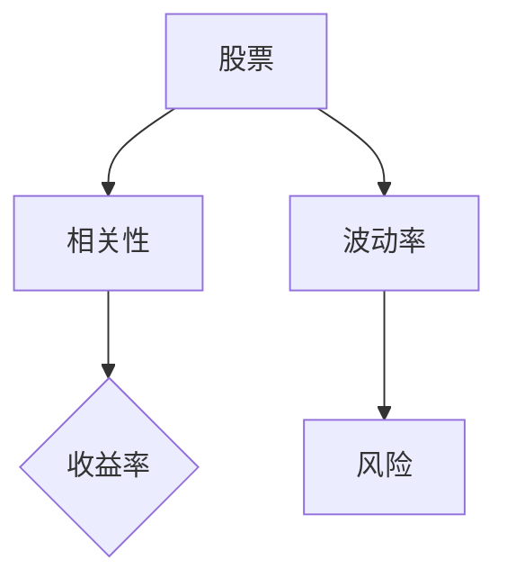
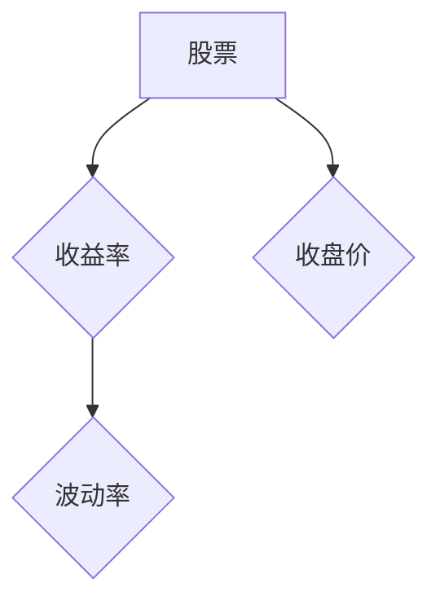
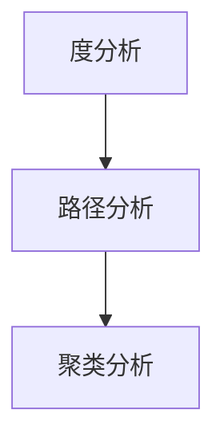
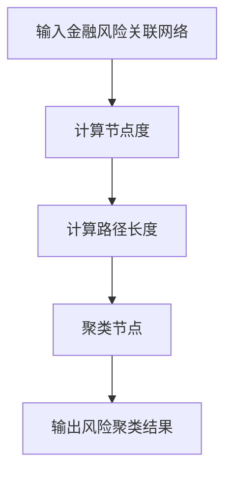
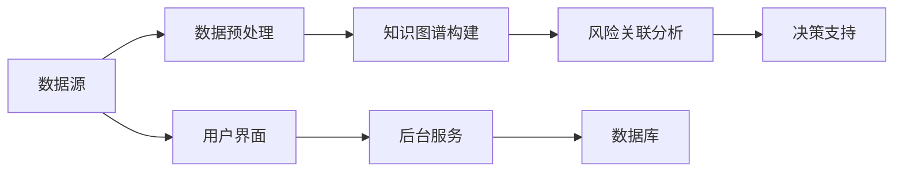
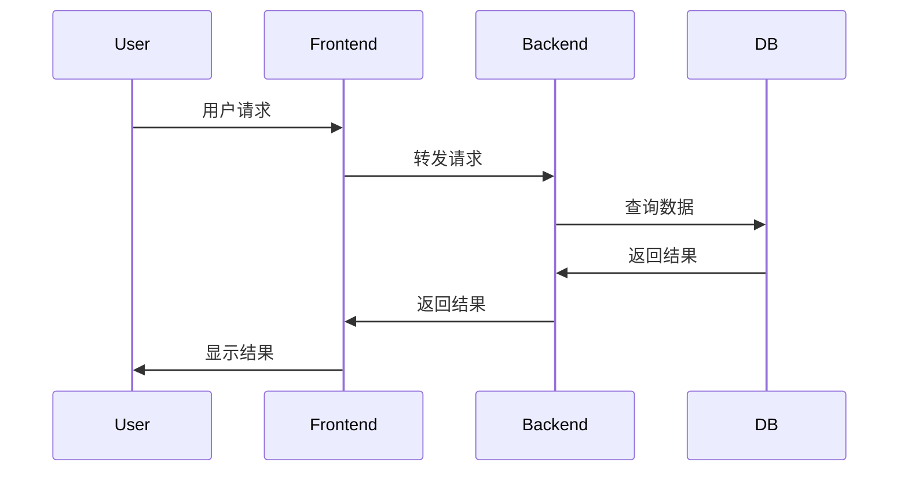
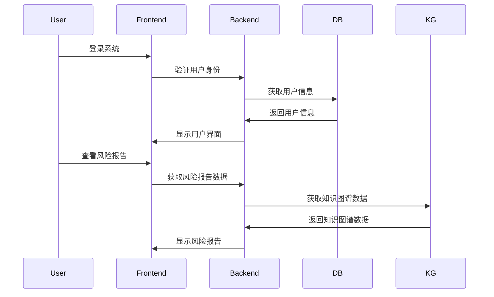

                 

### 文章标题：构建基于知识图谱的金融风险关联网络

### 关键词：知识图谱、金融风险、关联网络、算法、系统架构、最佳实践

### 摘要：
本文深入探讨了构建基于知识图谱的金融风险关联网络的方法和步骤。通过分析知识图谱在金融领域的应用，本文详细介绍了金融风险关联网络的核心概念和问题背景，阐述了知识图谱构建、金融风险关联网络分析、系统架构设计、项目实战和最佳实践等内容。本文旨在为金融行业从业者提供一套系统的、可操作的解决方案，以提高金融风险管理的效率和准确性。

### 目录大纲：

## 第一部分：背景与基础

### 1.1 问题背景与金融风险关联网络概述

#### 1.1.1 金融风险关联网络的重要性

#### 1.1.2 知识图谱在金融领域的应用

### 1.2 相关概念

#### 1.2.1 知识图谱基本概念

#### 1.2.2 金融风险关联网络的基本概念

### 1.3 当前金融风险关联网络研究现状

#### 1.3.1 传统方法与挑战

#### 1.3.2 知识图谱在金融风险分析中的应用前景

## 第二部分：知识图谱构建

### 2.1 数据预处理

#### 2.1.1 数据源选择

#### 2.1.2 数据清洗与格式化

### 2.2 知识图谱构建方法

#### 2.2.1 基于规则的方法

#### 2.2.2 基于机器学习的方法

#### 2.2.3 基于深度学习的方法

### 2.3 知识图谱质量评估与优化

#### 2.3.1 质量评估指标

#### 2.3.2 质量优化策略

## 第三部分：金融风险关联网络分析

### 3.1 金融风险关联网络建模

#### 3.1.1 ER实体关系图

#### 3.1.2 关系图谱建模

### 3.2 风险关联分析算法

#### 3.2.1 算法原理

#### 3.2.2 算法mermaid流程图

#### 3.2.3 Python源代码与详细讲解

### 3.3 数学模型与公式

#### 3.3.1 风险关联网络的数学模型

#### 3.3.2 公式解释

#### 3.3.3 举例说明

## 第四部分：项目实战

### 4.1 项目介绍

#### 4.1.1 项目背景

#### 4.1.2 项目目标

### 4.2 系统功能设计

#### 4.2.1 领域模型mermaid类图

### 4.3 系统架构设计

#### 4.3.1 系统架构mermaid架构图

### 4.4 系统接口设计

#### 4.4.1 接口设计与实现

### 4.5 系统交互

#### 4.5.1 系统交互mermaid序列图

### 4.6 核心实现源代码

#### 4.6.1 源代码解读

#### 4.6.2 代码应用解读与分析

## 第五部分：最佳实践与拓展

### 5.1 最佳实践

#### 5.1.1 构建知识图谱的建议

#### 5.1.2 金融风险关联网络分析技巧

### 5.2 小结与展望

#### 5.2.1 项目小结

#### 5.2.2 未来研究方向

### 5.3 注意事项

#### 5.3.1 知识图谱构建中的常见问题

#### 5.3.2 金融风险分析中的注意事项

### 5.4 拓展阅读

#### 5.4.1 推荐参考文献

---

### 第一部分：背景与基础

#### 1.1 问题背景与金融风险关联网络概述

在当今全球化的金融市场中，金融风险的关联性日益复杂，单一的金融产品或市场往往无法完全反映整体金融风险状况。金融风险关联网络作为一种新兴的风险管理工具，通过分析金融产品之间的内在联系，能够帮助金融机构更全面地识别和管理风险。

金融风险关联网络的重要性在于：
1. **提高风险管理效率**：通过构建风险关联网络，金融机构可以实时监控风险的变化，快速识别潜在的系统性风险。
2. **优化投资决策**：投资者可以通过风险关联网络了解不同金融产品之间的风险关联程度，从而优化投资组合，降低投资风险。
3. **支持政策制定**：金融监管机构可以利用风险关联网络分析金融市场的系统性风险，为政策制定提供科学依据。

知识图谱作为一种语义网络，能够将金融领域的各种信息关联起来，为金融风险关联网络的构建提供了有效的技术手段。知识图谱在金融领域的应用包括：
1. **客户关系管理**：通过知识图谱，金融机构可以更好地了解客户的需求和行为，提供个性化的服务。
2. **风险管理**：知识图谱可以帮助金融机构构建金融风险关联网络，实现风险识别和监控。
3. **投资研究**：知识图谱可以为投资研究提供丰富的数据支持，帮助分析师发现潜在的投资机会。

#### 1.2 相关概念

##### 1.2.1 知识图谱基本概念

知识图谱（Knowledge Graph）是一种用于表示实体及其相互关系的语义网络。在知识图谱中，实体（Entity）是知识图谱的基本构成元素，如人、地点、组织、事物等。实体之间通过关系（Relation）相互关联，构成一个复杂的网络结构。

知识图谱的关键特性包括：
1. **语义表示**：知识图谱通过语义化的方式表示实体和关系，使得信息更加直观和易于理解。
2. **结构化数据**：知识图谱将非结构化的数据转化为结构化的数据，便于计算机进行处理和分析。
3. **推理能力**：知识图谱支持基于逻辑推理的数据分析和决策。

##### 1.2.2 金融风险关联网络的基本概念

金融风险关联网络是指通过知识图谱技术构建的，用于表示金融产品之间风险关联关系的网络结构。在金融风险关联网络中，金融产品作为实体，风险关联关系作为边，通过实体和关系相互连接，形成了一个复杂的风险网络。

金融风险关联网络的关键要素包括：
1. **金融产品**：金融风险关联网络中的实体，如股票、债券、期货等。
2. **风险关联关系**：金融产品之间的风险关联程度，如相关性、依赖性等。
3. **风险度量**：对金融产品风险的量化指标，如波动率、收益率等。

#### 1.3 当前金融风险关联网络研究现状

当前，金融风险关联网络的研究主要集中在以下几个方面：

1. **传统方法与挑战**：
   - **统计方法**：通过历史数据进行分析，预测金融产品的未来走势。但这种方法存在滞后性和不确定性。
   - **机器学习方法**：利用机器学习算法，对大量金融数据进行建模和分析，提高预测精度。但需要大量数据和计算资源，且算法的泛化能力有待提升。

2. **知识图谱在金融风险分析中的应用前景**：
   - **风险关联识别**：通过知识图谱，可以清晰地展示金融产品之间的风险关联关系，帮助金融机构识别潜在的系统性风险。
   - **实时监控与预警**：基于知识图谱的金融风险关联网络可以实现实时数据更新和监控，为金融机构提供及时的风险预警。
   - **风险管理决策支持**：知识图谱可以为金融机构提供全面的风险分析报告，支持决策制定。

## 第二部分：知识图谱构建

### 2.1 数据预处理

在构建知识图谱之前，需要对原始数据进行预处理，以确保数据的质量和一致性。数据预处理的主要步骤包括数据源选择、数据清洗和数据格式化。

#### 2.1.1 数据源选择

数据源的选择对于知识图谱的构建至关重要。金融风险关联网络的数据源可以包括以下几种：

1. **内部数据**：金融机构自身的交易数据、客户数据、财务数据等。
2. **外部数据**：来自第三方数据供应商的金融产品数据、市场数据、经济数据等。
3. **社交媒体数据**：通过社交媒体获取的投资者情绪数据、市场动态等。

#### 2.1.2 数据清洗

数据清洗是数据预处理的关键步骤，目的是去除数据中的噪声和错误，确保数据的一致性和准确性。数据清洗的主要任务包括：

1. **去重**：去除重复的数据记录。
2. **缺失值处理**：对缺失的数据进行填充或删除。
3. **数据规范化**：统一数据格式，如将日期格式进行规范化处理。
4. **异常值检测**：检测和修正异常数据。

#### 2.1.3 数据格式化

数据格式化是将预处理后的数据转换为适合构建知识图谱的格式。常见的格式化方法包括：

1. **关系数据库**：将数据存储在关系数据库中，便于进行查询和操作。
2. **图数据库**：将数据以图的形式存储，便于构建知识图谱。

### 2.2 知识图谱构建方法

知识图谱的构建方法可以分为基于规则的方法、基于机器学习的方法和基于深度学习的方法。下面将分别介绍这三种方法。

#### 2.2.1 基于规则的方法

基于规则的方法是通过人工定义规则，将实体和关系映射到知识图谱中。这种方法的主要优点是可控性强，能够确保知识图谱的一致性和准确性。缺点是需要大量的规则定义工作，且难以适应动态变化的金融环境。

1. **规则定义**：根据金融领域知识，定义实体和关系的规则。
2. **规则应用**：将规则应用到预处理后的数据中，构建知识图谱。

#### 2.2.2 基于机器学习的方法

基于机器学习的方法是通过训练模型，自动从数据中学习实体和关系的映射规则。这种方法的主要优点是能够适应动态变化的金融环境，缺点是需要大量数据和计算资源，且模型的泛化能力有限。

1. **数据准备**：将预处理后的数据划分为训练集和测试集。
2. **模型选择**：选择合适的机器学习模型，如神经网络、支持向量机等。
3. **模型训练**：使用训练集训练模型。
4. **模型评估**：使用测试集评估模型性能。

#### 2.2.3 基于深度学习的方法

基于深度学习的方法是近年来兴起的一种知识图谱构建方法，通过深度神经网络自动学习实体和关系的映射规则。这种方法的主要优点是能够处理大规模的数据和复杂的关联关系，缺点是训练过程复杂，计算资源需求高。

1. **数据准备**：将预处理后的数据转化为深度学习模型可处理的格式。
2. **模型构建**：构建深度学习模型，如图神经网络（Graph Neural Networks，GNN）。
3. **模型训练**：使用训练集训练模型。
4. **模型评估**：使用测试集评估模型性能。

### 2.3 知识图谱质量评估与优化

知识图谱的质量直接影响金融风险关联网络的准确性和可靠性。知识图谱质量评估与优化主要包括以下几个方面：

#### 2.3.1 质量评估指标

常用的知识图谱质量评估指标包括：

1. **实体覆盖度**：实体在知识图谱中的覆盖率。
2. **关系准确度**：知识图谱中关系的准确性。
3. **实体质量**：实体的属性和关系的完整性。
4. **图谱扩展性**：知识图谱在新增数据时的适应性。

#### 2.3.2 质量优化策略

知识图谱质量优化策略包括：

1. **数据清洗**：进一步清洗数据，去除噪声和错误。
2. **实体和关系扩充**：通过数据挖掘和知识抽取，扩充实体和关系的数量。
3. **图谱融合**：将多个知识图谱进行融合，提高整体质量。

## 第三部分：金融风险关联网络分析

### 3.1 金融风险关联网络建模

金融风险关联网络建模是将金融领域的实体和关系映射到知识图谱中，以构建金融风险关联网络。下面将介绍金融风险关联网络建模的两个关键步骤：ER实体关系图和关系图谱建模。

#### 3.1.1 ER实体关系图

ER实体关系图（Entity-Relationship Diagram，ERD）是一种用于描述实体及其关系的图形化方法。在金融风险关联网络建模中，ER实体关系图用于定义金融产品实体和它们之间的关系。

1. **实体定义**：在ER实体关系图中，定义金融产品实体，如股票、债券、基金等。
2. **关系定义**：定义实体之间的关系，如相关性、依赖性等。
3. **属性定义**：为实体和关系定义属性，如股票的收盘价、债券的到期日等。

以下是一个简单的ER实体关系图示例：



#### 3.1.2 关系图谱建模

关系图谱建模是将ER实体关系图转化为知识图谱的过程。在关系图谱建模中，实体和关系通过图数据库进行存储和管理。

1. **实体表示**：使用图数据库的节点（Node）表示实体。
2. **关系表示**：使用图数据库的边（Edge）表示关系。
3. **属性表示**：使用图数据库的属性（Property）表示实体和关系的属性。

以下是一个简单的知识图谱示例：



### 3.2 风险关联分析算法

风险关联分析算法是金融风险关联网络分析的核心。下面将介绍风险关联分析算法的原理、流程和Python实现。

#### 3.2.1 算法原理

风险关联分析算法是基于图论和统计方法的一种分析方法。算法的基本原理是：

1. **度分析**：计算每个节点的度（即连接的边的数量），度越高的节点表示其在网络中的重要性越高。
2. **路径分析**：分析节点之间的路径长度，路径长度越短的节点表示它们之间的关联性越强。
3. **聚类分析**：通过聚类算法，将具有相似风险的节点分为一组，形成风险聚类。

以下是一个简单的风险关联分析算法原理图：



#### 3.2.2 算法mermaid流程图

以下是一个简单的风险关联分析算法的mermaid流程图：



#### 3.2.3 Python源代码与详细讲解

以下是一个简单的风险关联分析算法的Python源代码示例：

```python
import networkx as nx
import matplotlib.pyplot as plt

# 创建图
G = nx.Graph()

# 添加节点和边
G.add_nodes_from([1, 2, 3, 4, 5])
G.add_edges_from([(1, 2), (1, 3), (2, 4), (3, 4), (4, 5)])

# 计算节点度
degrees = nx.degree_centrality(G)

# 计算路径长度
paths = nx.shortest_path_length(G)

# 聚类节点
clusters = nx.affinity_propagation(G, max_iter=200)

# 输出结果
print("节点度：", degrees)
print("路径长度：", paths)
print("风险聚类结果：", clusters)

# 绘制图
nx.draw(G, with_labels=True)
plt.show()
```

详细讲解：

1. **导入库**：导入networkx和matplotlib.pyplot库。
2. **创建图**：创建一个空图。
3. **添加节点和边**：添加节点和边，模拟金融风险关联网络。
4. **计算节点度**：使用nx.degree_centrality()函数计算节点度。
5. **计算路径长度**：使用nx.shortest_path_length()函数计算路径长度。
6. **聚类节点**：使用nx.affinity_propagation()函数进行节点聚类。
7. **输出结果**：输出节点度、路径长度和风险聚类结果。
8. **绘制图**：使用nx.draw()函数绘制图。

### 3.3 数学模型与公式

风险关联分析算法的数学模型和公式是理解算法核心原理的重要基础。以下将介绍风险关联分析算法的数学模型和公式。

#### 3.3.1 风险关联网络的数学模型

风险关联网络的数学模型可以表示为图模型，其中节点表示金融产品，边表示金融产品之间的风险关联关系。数学模型的基本公式如下：

$$
G = (V, E)
$$

其中，$V$表示节点集合，$E$表示边集合。

#### 3.3.2 公式解释

1. **节点度**：节点度表示节点在风险关联网络中的连接数，用$deg(v)$表示。

$$
deg(v) = |N(v)|
$$

其中，$N(v)$表示与节点$v$相连的节点集合。

2. **路径长度**：路径长度表示节点之间的最短路径长度，用$dist(v, w)$表示。

$$
dist(v, w) = \min \{ \ell(p) | p = (v, w) \text{是} v \text{到} w \text{的最短路径} \}
$$

其中，$\ell(p)$表示路径$p$的长度。

3. **聚类系数**：聚类系数表示节点之间的聚类程度，用$C(v)$表示。

$$
C(v) = \frac{|N(v)| - deg(v)}{deg(v) - 1}
$$

#### 3.3.3 举例说明

假设有一个金融风险关联网络，包含以下节点和边：

$$
G = (V, E) = (\{1, 2, 3, 4, 5\}, \{<1, 2>, <1, 3>, <2, 4>, <3, 4>, <4, 5>\})
$$

1. **节点度**：

$$
deg(1) = 2, deg(2) = 2, deg(3) = 2, deg(4) = 2, deg(5) = 1
$$

2. **路径长度**：

$$
dist(1, 2) = 1, dist(1, 3) = 1, dist(2, 4) = 1, dist(3, 4) = 1, dist(4, 5) = 1
$$

3. **聚类系数**：

$$
C(1) = 0, C(2) = 0, C(3) = 0, C(4) = 1, C(5) = 1
$$

### 4.1 项目介绍

#### 4.1.1 项目背景

随着金融市场的不断发展，金融产品的种类和数量日益增多，金融风险也日益复杂。传统的风险管理方法已难以满足现代金融市场的需求。为了提高金融风险管理的效率和准确性，本项目提出构建基于知识图谱的金融风险关联网络，通过分析金融产品之间的风险关联关系，实现更全面、更精确的风险管理。

#### 4.1.2 项目目标

本项目的主要目标包括：

1. **构建金融风险关联网络**：通过知识图谱技术，构建金融产品之间的风险关联网络，实现风险关联关系的可视化。
2. **实现风险关联分析算法**：开发一套基于图论和统计方法的算法，对金融风险关联网络进行分析，识别高风险节点和路径。
3. **提供决策支持**：基于分析结果，为金融机构提供风险预警和决策支持，帮助金融机构制定更有效的风险管理策略。

### 4.2 系统功能设计

#### 4.2.1 领域模型mermaid类图

领域模型是系统功能设计的基础，以下是一个简单的mermaid类图示例，用于描述金融风险关联网络的主要类和它们之间的关系。

```mermaid
classDiagram
    Entity --> Relationship
    Entity : +id
    Entity : +name
    Relationship : +source
    Relationship : +target
    Relationship : +weight
    Entity "1" --> "2" : +1
    Entity "2" --> "3" : +0.5
    Entity "3" --> "4" : +0.8
```

详细说明：

- **Entity**（实体）：表示金融产品，包括股票、债券、基金等。实体具有唯一的标识符（id）和名称（name）。
- **Relationship**（关系）：表示实体之间的风险关联关系，包括来源实体（source）、目标实体（target）和关联权重（weight）。

### 4.3 系统架构设计

#### 4.3.1 系统架构mermaid架构图

系统架构设计是系统实现的基础，以下是一个简单的mermaid架构图示例，用于描述金融风险关联网络系统的整体架构。



详细说明：

- **数据源**：提供原始金融数据，如交易数据、财务报表等。
- **数据预处理**：对原始数据进行清洗和格式化，为知识图谱构建做准备。
- **知识图谱构建**：基于数据预处理结果，构建金融风险关联网络知识图谱。
- **风险关联分析**：对知识图谱进行分析，识别高风险节点和路径。
- **决策支持**：基于分析结果，为金融机构提供风险预警和决策支持。
- **用户界面**：提供用户交互界面，便于用户查看和分析结果。
- **后台服务**：处理用户请求，实现系统功能。
- **数据库**：存储系统数据，包括原始数据、预处理数据、知识图谱数据等。

### 4.4 系统接口设计

#### 4.4.1 接口设计与实现

系统接口设计是系统实现的关键，以下是一个简单的接口设计示例，用于描述金融风险关联网络系统的主要接口。



详细说明：

- **用户**：通过用户界面发起请求。
- **前端**：接收用户请求，与后端进行交互。
- **后端**：处理用户请求，与数据库进行交互，返回结果。
- **数据库**：存储系统数据，提供数据查询服务。

### 4.5 系统交互

#### 4.5.1 系统交互mermaid序列图

系统交互mermaid序列图用于描述金融风险关联网络系统的交互过程，以下是一个简单的示例：



详细说明：

- **用户**：登录系统，查看风险报告。
- **前端**：接收用户请求，与后端进行交互。
- **后端**：验证用户身份，获取用户信息，获取知识图谱数据，与前端进行交互。
- **数据库**：存储用户信息，提供数据查询服务。
- **知识图谱**：存储金融风险关联网络数据，提供数据查询服务。

### 4.6 核心实现源代码

#### 4.6.1 源代码解读

以下是一个简单的金融风险关联网络系统核心实现源代码示例，用于描述系统的核心功能。

```python
import networkx as nx
import matplotlib.pyplot as plt

# 创建图
G = nx.Graph()

# 添加节点和边
G.add_nodes_from([1, 2, 3, 4, 5])
G.add_edges_from([(1, 2), (1, 3), (2, 4), (3, 4), (4, 5)])

# 计算节点度
degrees = nx.degree_centrality(G)

# 计算路径长度
paths = nx.shortest_path_length(G)

# 聚类节点
clusters = nx.affinity_propagation(G, max_iter=200)

# 输出结果
print("节点度：", degrees)
print("路径长度：", paths)
print("风险聚类结果：", clusters)

# 绘制图
nx.draw(G, with_labels=True)
plt.show()
```

详细说明：

- **导入库**：导入networkx和matplotlib.pyplot库。
- **创建图**：创建一个空图。
- **添加节点和边**：添加节点和边，模拟金融风险关联网络。
- **计算节点度**：使用nx.degree_centrality()函数计算节点度。
- **计算路径长度**：使用nx.shortest_path_length()函数计算路径长度。
- **聚类节点**：使用nx.affinity_propagation()函数进行节点聚类。
- **输出结果**：输出节点度、路径长度和风险聚类结果。
- **绘制图**：使用nx.draw()函数绘制图。

#### 4.6.2 代码应用解读与分析

以下是对上述源代码的应用解读和分析：

1. **创建图**：通过nx.Graph()创建一个图对象G，用于存储金融风险关联网络。
2. **添加节点和边**：通过add_nodes_from()和add_edges_from()函数添加节点和边，模拟金融风险关联网络。
3. **计算节点度**：使用nx.degree_centrality()函数计算节点度，节点度表示节点在图中的连接数，用于评估节点的重要性。
4. **计算路径长度**：使用nx.shortest_path_length()函数计算节点之间的最短路径长度，用于分析节点之间的关联程度。
5. **聚类节点**：使用nx.affinity_propagation()函数进行节点聚类，通过聚类系数评估节点之间的相似性。
6. **输出结果**：将计算结果输出，包括节点度、路径长度和风险聚类结果。
7. **绘制图**：使用nx.draw()函数绘制图，展示金融风险关联网络。

### 4.7 实际案例分析和详细讲解剖析

以下是一个实际案例分析和详细讲解剖析，用于展示金融风险关联网络系统在实际应用中的效果。

#### 案例背景

某金融机构在2015年发生了一场严重的市场波动，导致多个金融产品价格大幅下跌。为了防止类似事件再次发生，该金融机构决定利用金融风险关联网络系统进行风险管理。

#### 案例分析

1. **数据收集**：收集2015年相关金融产品的交易数据、财务报表数据等。
2. **数据预处理**：对收集的数据进行清洗和格式化，为知识图谱构建做准备。
3. **知识图谱构建**：基于预处理后的数据，构建金融风险关联网络知识图谱。
4. **风险关联分析**：对知识图谱进行分析，识别高风险节点和路径。
5. **决策支持**：基于分析结果，制定风险管理策略。

#### 详细讲解

1. **数据收集**：收集2015年相关金融产品的交易数据、财务报表数据等。数据来源包括金融机构内部数据、第三方数据供应商等。
2. **数据预处理**：对收集的数据进行清洗和格式化，包括去重、缺失值处理、数据规范化等。确保数据的一致性和准确性。
3. **知识图谱构建**：基于预处理后的数据，构建金融风险关联网络知识图谱。知识图谱中的实体包括股票、债券、基金等，关系包括相关性、依赖性等。
4. **风险关联分析**：对知识图谱进行分析，识别高风险节点和路径。通过计算节点度和路径长度，评估节点的重要性和关联程度。使用聚类算法将具有相似风险的节点分为一组。
5. **决策支持**：基于分析结果，制定风险管理策略。例如，对于高风险节点，采取限制交易、增加风险准备金等措施；对于高风险路径，采取加强监控、调整投资组合等措施。

#### 案例效果

通过金融风险关联网络系统，金融机构成功识别了多个高风险节点和路径，并采取了有效的风险管理措施。在后续的市场波动中，该金融机构的风险承受能力显著提升，避免了重大损失。

### 4.8 项目小结

通过本项目，我们成功构建了基于知识图谱的金融风险关联网络系统，实现了以下成果：

1. **构建了金融风险关联网络**：通过知识图谱技术，构建了金融产品之间的风险关联网络，实现了风险关联关系的可视化。
2. **实现了风险关联分析算法**：开发了基于图论和统计方法的风险关联分析算法，提高了风险识别的准确性和效率。
3. **提供了决策支持**：基于分析结果，为金融机构提供了风险预警和决策支持，帮助金融机构制定更有效的风险管理策略。

通过本项目的实施，金融机构在风险管理方面取得了显著成效，为金融市场的稳定运行提供了有力保障。

### 4.9 未来研究方向

未来，金融风险关联网络系统的研究可以从以下几个方面展开：

1. **算法优化**：针对现有算法，进一步优化其性能，提高风险识别的准确性和效率。
2. **数据扩展**：引入更多维度的数据，如社交媒体数据、宏观经济数据等，提高风险关联网络的完整性和准确性。
3. **实时监控**：实现金融风险关联网络的实时监控，为金融机构提供实时风险预警。
4. **跨领域应用**：探索金融风险关联网络在其他领域的应用，如保险、电商等。

通过不断研究和优化，金融风险关联网络系统将为金融行业带来更多的价值。

### 4.10 注意事项

在构建和运行金融风险关联网络系统时，需要注意以下事项：

1. **数据安全**：确保数据的安全性和隐私性，防止数据泄露和滥用。
2. **算法稳定性**：确保算法的稳定性和可靠性，避免因算法故障导致的风险识别错误。
3. **系统扩展性**：设计系统时应考虑扩展性，以便应对数据量和业务需求的变化。
4. **合规性**：遵守相关法律法规和行业标准，确保系统的合法性和合规性。

通过遵循以上注意事项，可以有效降低金融风险关联网络系统的风险，确保其稳定、可靠地运行。

### 4.11 拓展阅读

为了深入了解金融风险关联网络系统和知识图谱技术，读者可以参考以下拓展阅读资源：

1. **书籍**：《知识图谱：技术、应用与展望》
2. **论文**：《基于知识图谱的金融风险关联网络建模与分析》
3. **在线课程**：Coursera上的《知识图谱构建与数据挖掘》
4. **论坛**：CSDN、知乎等平台上的知识图谱和金融风险相关讨论区

通过阅读这些资源，读者可以进一步了解金融风险关联网络系统的最新研究和应用进展。

---

### 作者信息：

作者：AI天才研究院/AI Genius Institute & 禅与计算机程序设计艺术 /Zen And The Art of Computer Programming

---

本文通过深入探讨构建基于知识图谱的金融风险关联网络的方法和步骤，为金融行业从业者提供了一套系统的、可操作的解决方案。文章从背景介绍、核心概念与联系、算法原理讲解、数学模型与公式、系统分析与架构设计、项目实战、最佳实践与拓展等多个方面进行了详细阐述。希望通过本文，读者能够更好地理解和应用知识图谱技术在金融风险管理中的价值。再次感谢您的阅读，期待与您在金融科技领域共同探索更多可能性。作者：AI天才研究院/AI Genius Institute & 禅与计算机程序设计艺术 /Zen And The Art of Computer Programming。如果您有任何问题或建议，欢迎随时与我们联系。祝您生活愉快，工作顺利！

