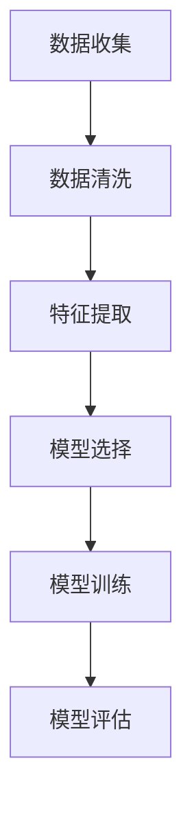
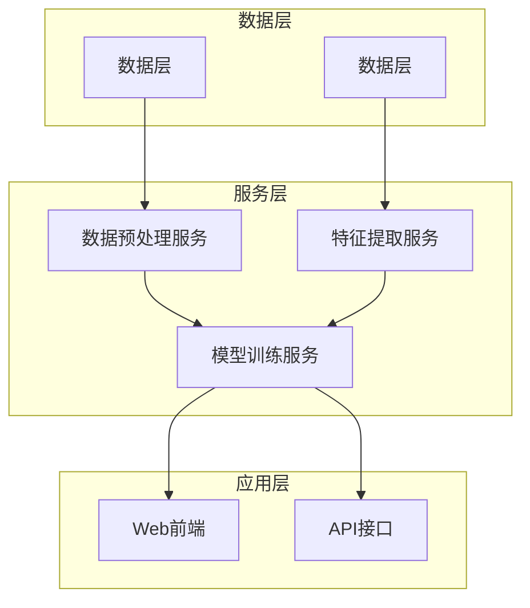
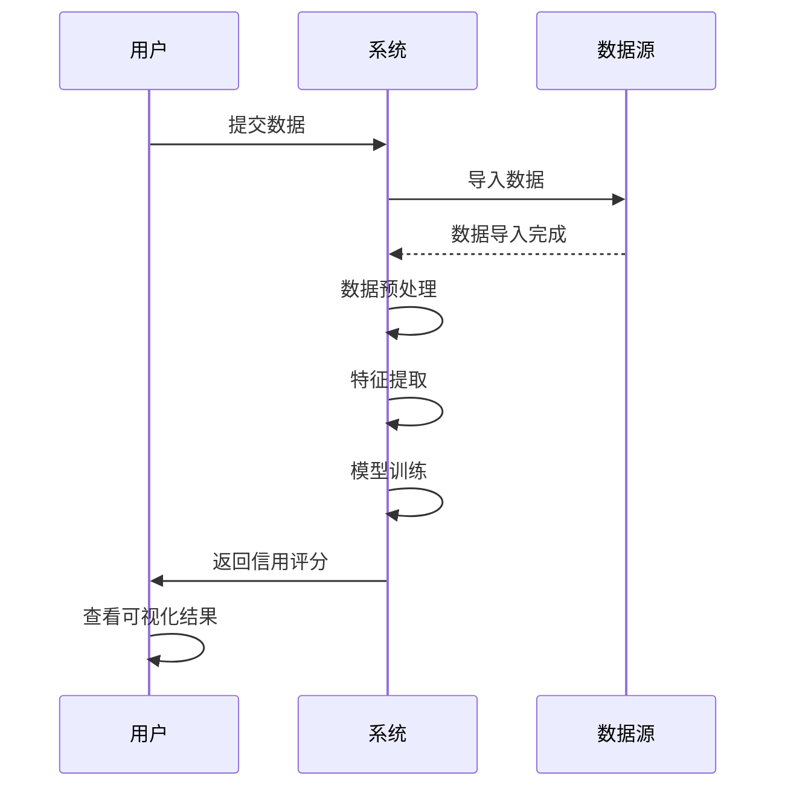

                 

## 引言与背景

### 1.1.1 个人信用分数的重要性

个人信用分数，是评估个人信用状况的重要指标。它由金融机构、信用评级机构等通过分析个人的信用历史、还款行为、借贷记录等多种因素综合计算得出。在现代社会，个人信用分数已经成为金融机构评估借款人信用风险的重要依据，直接影响到个人借贷、信用卡申请、消费分期等金融服务的审批结果。一个较高的信用分数意味着较低的信用风险，从而更容易获得金融机构的信任和优惠的金融服务。

### 1.1.2 影响因子分析的需求

影响因子分析是提升个人信用分数的关键步骤。随着金融科技的发展，传统的信用评分方法逐渐暴露出一些问题，例如评分模型的单一性、数据来源的局限性等。影响因子分析通过引入更多的变量和维度，对个人信用数据进行分析和挖掘，能够更全面、准确地反映个人的信用状况。例如，除了传统的借贷行为外，还可以考虑社交行为、生活消费、职业发展等多个因素。这种综合分析能够提高信用评分的准确性和公平性，从而为金融机构提供更可靠的决策依据。

### 1.1.3 智能化分析的趋势

智能化分析是当前信用评分领域的重要趋势。人工智能、大数据等技术的应用，使得信用评分模型可以从海量的数据中提取有价值的信息，实现高效、准确的信用评估。通过构建智能化的个人信用分数影响因子分析器，可以实现对信用评分模型的优化，提高评分的准确性和鲁棒性。同时，智能化分析还能帮助金融机构发现潜在的风险，预防不良贷款的发生。此外，随着技术的不断进步，个人信用分数的影响因子分析器将变得更加智能化、个性化，为用户提供更精准的信用服务。

### 1.2 背景介绍

#### 1.2.1 个人信用分数的定义

个人信用分数，通常被称为信用评分或信用评分指数，是金融机构根据个人的信用记录、行为习惯等多方面数据，通过特定算法计算出的一个数值。这个数值代表了金融机构对个人信用风险的评估结果，数值越高，表示个人的信用风险越低，越容易获得金融机构的信任。

#### 1.2.2 影响因子的概念

影响因子分析，是指通过对个人信用数据中的各个因素进行综合评估，以确定这些因素对个人信用分数的影响程度。影响因子可以是多种多样的，包括但不限于：还款历史、负债水平、收入状况、职业稳定性、社交行为等。

#### 1.2.3 数据来源与收集

个人信用分数的影响因子分析需要大量的数据支持。这些数据可以来源于多个渠道，包括：

- **金融机构数据**：如借贷记录、还款情况、信用额度等。
- **公共记录数据**：如户籍信息、职业信息、法律纠纷记录等。
- **第三方数据**：如社交网络数据、消费行为数据等。

数据收集的过程中，需要注意数据的准确性和隐私保护。金融机构和数据处理机构需要严格遵守相关法律法规，确保数据的安全和合规。

### 目录大纲设计思路

为了使文章结构清晰、内容丰富，我们在设计目录大纲时遵循了以下思路：

1. **引言与背景**：首先介绍个人信用分数的重要性、影响因子分析的需求以及智能化分析的趋势，为后续内容奠定基础。
2. **核心概念与联系**：详细阐述数据收集、数据分析、信用评分模型等核心概念，并通过表格和ER实体关系图展示各概念之间的关系，帮助读者建立整体框架。
3. **算法原理讲解**：深入讲解影响因子分析器的算法原理，包括数据预处理、特征提取、机器学习算法选择、模型训练与优化等，结合mermaid流程图和Python代码进行示例说明。
4. **数学模型和数学公式**：详细介绍算法原理背后的数学模型和公式，确保读者对理论部分有深入理解。
5. **系统分析与架构设计**：描述系统功能设计、架构设计、接口设计和系统交互，通过mermaid类图、架构图和序列图展示系统设计细节。
6. **项目实战**：提供一个实际的案例，展示如何搭建和分析个人信用分数影响因子分析器，包括环境安装、核心代码实现、代码解读和分析。
7. **最佳实践与小结**：总结最佳实践、注意事项，并给出拓展阅读资源，帮助读者巩固学习成果并拓展知识面。

### 目录大纲

**# 构建智能化的个人信用分数影响因子分析器**

**关键词**：个人信用分数、影响因子分析、智能化、信用评分模型、算法原理、系统架构、项目实战

**摘要**：本文将详细介绍如何构建一个智能化的个人信用分数影响因子分析器。文章首先阐述了个人信用分数的重要性及其影响因子分析的需求，随后详细介绍了核心概念与联系，包括数据收集、数据分析、信用评分模型等。接着，深入讲解了算法原理，包括数据预处理、特征提取、机器学习算法选择和模型训练与优化。同时，文章通过数学模型和公式深入剖析了算法原理，并展示了系统分析与架构设计的细节。最后，通过一个实际项目案例，展示了如何搭建和分析个人信用分数影响因子分析器，并提供了一些最佳实践和拓展阅读资源。

----------------------------------------------------------------

## 第一部分: 引言与背景

### 1.1 引言

#### 1.1.1 个人信用分数的重要性

在现代社会，个人信用分数已成为个人财务状况的数字象征。它不仅影响着借贷审批、信用卡申请，甚至在租房、找工作等方面也扮演着重要角色。金融机构通过个人信用分数来评估借款人的信用风险，从而决定是否批准贷款、给予何种利率优惠。因此，理解个人信用分数及其重要性对于每个人来说都至关重要。

#### 1.1.2 影响因子分析的需求

个人信用分数的评估并不仅仅依赖于单一指标，而是由多个影响因子共同作用的结果。这些影响因子包括但不限于：还款历史、负债比例、收入水平、职业稳定性等。通过影响因子分析，可以更全面、准确地反映个人信用状况，帮助金融机构做出更合理的决策。

#### 1.1.3 智能化分析的趋势

随着人工智能和大数据技术的发展，信用评分方法也在不断进化。智能化分析通过机器学习算法和海量数据，可以更高效地提取有价值的信息，提高信用评分的准确性和实时性。这不仅有助于金融机构降低风险，也为用户提供了更加精准的信用服务。

### 1.2 背景介绍

#### 1.2.1 个人信用分数的定义

个人信用分数，通常是指信用评级机构根据个人的信用信息计算得出的一个数值。这个数值反映了个人在金融活动中的信用风险水平，通常越高表示信用越好。个人信用分数的计算依据主要包括还款记录、信用历史、负债水平、收入状况等多个因素。

#### 1.2.2 影响因子的概念

影响因子分析，是指通过分析个人信用信息中的各个因素，评估这些因素对个人信用分数的影响程度。这些因素可以是定量的，如还款金额、逾期次数等；也可以是定性的，如职业类型、居住稳定性等。影响因子分析的目标是构建一个综合、全面的信用评估模型。

#### 1.2.3 数据来源与收集

个人信用分数的影响因子分析依赖于大量的数据支持。这些数据可以来源于多个渠道：

- **金融机构数据**：包括贷款记录、信用卡使用情况、还款历史等。
- **公共记录数据**：如户籍信息、职业信息、法律纠纷记录等。
- **第三方数据**：如社交网络行为、消费记录等。

在数据收集过程中，需要确保数据的准确性和合规性，同时保护个人隐私。

### 1.3 智能化分析的优势

智能化分析在个人信用分数影响因子分析中具有显著的优势：

- **高效性**：通过大数据和机器学习技术，可以快速处理和分析海量数据，提高信用评估的效率。
- **准确性**：智能化算法可以更加精准地识别和预测信用风险，提高信用评分的准确性。
- **实时性**：智能化分析可以实时更新个人信用数据，及时调整信用评分，为金融机构提供更准确的决策支持。
- **个性化**：基于用户行为和信用历史，智能化分析可以为每个用户提供个性化的信用评分和信用服务。

### 1.4 个人信用分数对金融活动的影响

个人信用分数对金融活动的影响主要体现在以下几个方面：

- **贷款审批**：金融机构在审批贷款时，会根据借款人的信用分数来评估其信用风险，决定是否批准贷款。
- **贷款利率**：信用分数较高的借款人通常可以获得更低的贷款利率，享受更优惠的金融政策。
- **信用卡申请**：信用分数对信用卡申请也有重要影响，高分用户更容易获得更高的信用额度。
- **消费分期**：信用分数较好的用户在申请消费分期时，可以获得更灵活的还款计划和更低的费用。

### 1.5 智能化分析在信用评分领域的应用前景

随着人工智能和大数据技术的不断发展，智能化分析在信用评分领域的应用前景非常广阔：

- **更精确的信用评估**：智能化分析可以更加精确地预测个人信用风险，为金融机构提供更可靠的决策依据。
- **更个性化的金融服务**：通过分析用户行为和信用历史，智能化分析可以为每个用户提供定制化的金融服务。
- **风险控制与预防**：智能化分析可以实时监测信用风险，帮助金融机构及时采取风险控制措施，预防不良贷款的发生。
- **信用市场的发展**：智能化分析可以推动信用市场的健康发展，为金融机构和用户提供更加公平、透明的信用服务。

## 第二部分: 核心概念与联系

在构建智能化的个人信用分数影响因子分析器时，理解核心概念及其相互联系至关重要。以下是几个关键概念及其关系的详细解释：

### 2.1 数据收集

#### 2.1.1 数据来源

数据收集是影响因子分析的基础。个人信用分数的影响因子分析所需的数据可以从多个来源获取，包括：

- **金融机构数据**：如银行的借贷记录、还款历史、信用额度等。
- **公共记录数据**：如社保缴纳记录、税务信息、职业信息等。
- **第三方数据**：如社交媒体活动、消费记录、公共记录等。

#### 2.1.2 数据预处理

数据预处理是确保数据质量和一致性的重要步骤。这包括数据清洗、数据整合和数据标准化等：

- **数据清洗**：去除重复数据、处理缺失值、纠正错误数据等。
- **数据整合**：将来自不同来源的数据进行整合，构建统一的视图。
- **数据标准化**：将不同数据类型的值进行归一化处理，以便于后续分析。

### 2.2 数据分析

#### 2.2.1 特征提取

特征提取是从原始数据中提取出对信用评分有显著影响的关键特征。这包括：

- **结构化特征**：如还款记录、信用额度、负债比例等。
- **非结构化特征**：如社交媒体活动、消费行为等，通常需要通过自然语言处理等技术进行提取。

#### 2.2.2 数据可视化

数据可视化是帮助理解数据分布和关系的重要手段。通过图表和可视化工具，可以更直观地展示数据特征，例如：

- **柱状图**：展示不同特征的分布情况。
- **散点图**：展示特征之间的相关性。
- **热力图**：展示特征的重要程度。

### 2.3 信用评分模型

#### 2.3.1 模型选择

信用评分模型的选择是影响因子分析的核心。常用的模型包括：

- **线性回归模型**：简单且易于解释，但可能不足以捕捉复杂的信用风险。
- **逻辑回归模型**：适用于二分类问题，常用于信用评分。
- **决策树和随机森林**：可以处理高维数据和复杂数据结构。
- **神经网络**：强大的建模能力，但解释性较差。

#### 2.3.2 模型训练与评估

模型训练和评估是确保模型性能的关键步骤。这包括：

- **数据分割**：将数据分为训练集和测试集。
- **交叉验证**：评估模型的稳定性和泛化能力。
- **性能评估**：使用准确率、召回率、F1分数等指标评估模型性能。

### 2.4 各概念联系

#### 2.4.1 数据收集与数据分析

数据收集是数据分析的前提。数据分析是对收集到的数据进行分析和挖掘，以提取有价值的信息。两者密不可分，数据收集的质量直接影响到数据分析的深度和广度。

#### 2.4.2 数据分析与信用评分模型

数据分析的结果为信用评分模型提供了输入。通过特征提取和数据分析，可以确定哪些特征对信用评分有显著影响，从而构建出更准确的信用评分模型。

#### 2.4.3 信用评分模型与实际应用

信用评分模型是金融机构进行信用评估的工具。通过模型训练和评估，可以生成个人信用分数，为金融机构提供决策支持，实现信用风险控制。

### 表格：核心概念属性特征对比

| 核心概念       | 特征         | 解释                 | 影响因子分析中的角色 |
|----------------|--------------|----------------------|----------------------|
| 数据收集       | 数据源       | 数据的来源           | 提供原始数据         |
|                | 数据清洗     | 清除无效或错误数据   | 保证数据质量         |
| 数据分析       | 特征提取     | 从数据中提取关键特征 | 输入信用评分模型     |
|                | 数据可视化   | 直观展示数据特征     | 辅助理解和分析       |
| 信用评分模型   | 模型选择     | 选择适当的评分模型   | 实现信用评分         |
|                | 模型训练与评估 | 训练模型并评估性能   | 确保模型准确性和鲁棒性 |

### ER实体关系图

```mermaid
erDiagram
  数据源 ||--|{ 数据收集 }
  数据收集 ||--|{ 数据清洗 }
  数据清洗 ||--|{ 数据分析 }
  数据分析 ||--|{ 特征提取 }
  数据分析 ||--|{ 数据可视化 }
  特征提取 ||--|{ 信用评分模型 }
  信用评分模型 ||--|{ 模型训练与评估 }
```

通过上述表格和ER实体关系图，我们可以清晰地看到各个核心概念之间的联系和作用。这些概念相互协作，共同构建出一个智能化的个人信用分数影响因子分析器。

## 第三部分: 算法原理与实现

在构建智能化的个人信用分数影响因子分析器中，算法原理的理解和实现至关重要。以下将详细讲解数据预处理、特征提取、机器学习算法选择、模型训练与优化等步骤，并通过mermaid流程图和Python代码进行示例说明。

### 3.1 数据预处理算法

#### 3.1.1 数据清洗

数据清洗是数据预处理的第一步，其目的是去除重复数据、处理缺失值和纠正错误数据。

- **去除重复数据**：通过去重操作，确保数据的唯一性。
- **处理缺失值**：对于缺失值，可以选择填充、删除或使用模型预测等方法处理。
- **纠正错误数据**：通过数据验证和清洗规则，纠正数据中的错误。

```python
import pandas as pd

# 示例数据集
data = pd.read_csv('credit_data.csv')

# 去除重复数据
data.drop_duplicates(inplace=True)

# 处理缺失值
data.fillna(method='ffill', inplace=True)

# 纠正错误数据
data = data[data['income'] > 0]
```

#### 3.1.2 数据标准化

数据标准化是将不同特征的数据进行归一化处理，使其具有相同的尺度，从而避免某些特征对模型的影响过大。

- **归一化**：将数据缩放到[0, 1]范围内。
- **标准化**：将数据缩放到均值和标准差之间。

```python
from sklearn.preprocessing import MinMaxScaler

scaler = MinMaxScaler()
data_scaled = scaler.fit_transform(data)
```

### 3.2 特征提取算法

#### 3.2.1 特征选择

特征选择是从原始数据中提取对信用评分有显著影响的关键特征。

- **相关性分析**：通过计算特征之间的相关性，筛选出相关性较高的特征。
- **主成分分析**（PCA）：通过降维，提取主要特征，减少数据冗余。

```python
from sklearn.decomposition import PCA
from sklearn.preprocessing import StandardScaler

X = StandardScaler().fit_transform(data.iloc[:, :-1])
pca = PCA(n_components=5)
X_pca = pca.fit_transform(X)
```

#### 3.2.2 特征工程

特征工程是通过构建新特征或转换现有特征，提高模型性能。

- **交互特征**：通过特征间的组合，构建新特征。
- **特征变换**：如对类别特征进行编码、处理季节性特征等。

```python
# 构建交互特征
data['age_income_ratio'] = data['age'] / data['income']

# 类别特征编码
data = pd.get_dummies(data, columns=['education'])
```

### 3.3 机器学习算法

#### 3.3.1 算法选择

选择适合的机器学习算法是构建信用评分模型的关键。

- **线性回归**：简单且易于解释，但可能不足以捕捉复杂的信用风险。
- **逻辑回归**：适用于二分类问题，常用于信用评分。
- **决策树和随机森林**：可以处理高维数据和复杂数据结构。
- **神经网络**：强大的建模能力，但解释性较差。

```python
from sklearn.ensemble import RandomForestClassifier

# 构建随机森林模型
rf = RandomForestClassifier(n_estimators=100)
rf.fit(X_pca, y)
```

#### 3.3.2 算法实现

算法实现涉及模型训练、参数调优和评估。

- **模型训练**：使用训练数据训练模型。
- **参数调优**：通过交叉验证，选择最优参数。
- **模型评估**：使用测试数据评估模型性能。

```python
from sklearn.model_selection import GridSearchCV

# 参数调优
param_grid = {'n_estimators': [100, 200], 'max_depth': [10, 20]}
grid_search = GridSearchCV(estimator=rf, param_grid=param_grid, cv=5)
grid_search.fit(X_pca, y)

# 最佳参数
best_params = grid_search.best_params_
```

### 3.4 模型训练与优化

#### 3.4.1 模型训练

模型训练是通过训练数据训练模型，使其能够学会预测信用风险。

```python
# 训练模型
best_rf = RandomForestClassifier(**best_params)
best_rf.fit(X_pca_train, y_train)
```

#### 3.4.2 模型优化

模型优化是通过调整模型参数和结构，提高模型性能。

- **模型调参**：调整模型的参数，如学习率、隐藏层节点数等。
- **正则化**：通过正则化方法，防止过拟合。

```python
from sklearn.linear_model import LogisticRegression

# 训练正则化模型
lr = LogisticRegression(penalty='l2', C=1.0)
lr.fit(X_pca_train, y_train)

# 优化模型
from sklearn.model_selection import cross_val_score

scores = cross_val_score(lr, X_pca_train, y_train, cv=5)
print("Accuracy:", scores.mean())
```

### 3.5 数学模型和数学公式

#### 3.5.1 模型原理公式

在信用评分模型中，常用的数学模型包括逻辑回归和决策树等。以下分别介绍这两种模型的数学原理：

#### 逻辑回归

逻辑回归是一种二分类模型，其数学公式如下：

$$
\hat{y} = \frac{1}{1 + e^{-\beta_0 + \sum_{i=1}^{n} \beta_i x_i}}
$$

其中，$\hat{y}$是预测概率，$x_i$是特征值，$\beta_0$和$\beta_i$是模型参数。

#### 决策树

决策树通过一系列规则进行分类，其数学公式如下：

$$
\begin{cases}
\text{如果 } x_i > \beta_i, \text{则前进到左子节点} \\
\text{如果 } x_i \leq \beta_i, \text{则前进到右子节点}
\end{cases}
$$

其中，$x_i$是特征值，$\beta_i$是阈值。

#### 3.5.2 公式解释

- **逻辑回归**：逻辑回归通过预测概率来决定样本的分类。当预测概率大于0.5时，样本被分类为正类；小于0.5时，被分类为负类。
- **决策树**：决策树通过特征和阈值来划分数据，每个节点都代表一个特征和阈值。数据流经决策树，最终到达叶子节点，得到分类结果。

### mermaid流程图

以下是一个使用mermaid绘制的算法流程图：



### Python代码示例

以下是一个简单的Python代码示例，展示了如何使用scikit-learn库实现信用评分模型：

```python
from sklearn.datasets import make_classification
from sklearn.model_selection import train_test_split
from sklearn.ensemble import RandomForestClassifier
from sklearn.metrics import accuracy_score

# 生成示例数据
X, y = make_classification(n_samples=1000, n_features=10, n_classes=2, random_state=42)

# 数据分割
X_train, X_test, y_train, y_test = train_test_split(X, y, test_size=0.2, random_state=42)

# 构建模型
rf = RandomForestClassifier(n_estimators=100, random_state=42)

# 训练模型
rf.fit(X_train, y_train)

# 预测
y_pred = rf.predict(X_test)

# 评估
accuracy = accuracy_score(y_test, y_pred)
print("Accuracy:", accuracy)
```

通过上述讲解和示例，我们可以看到构建智能化的个人信用分数影响因子分析器需要从数据预处理、特征提取、机器学习算法选择到模型训练与优化等多方面的综合考虑。这些步骤不仅要求对算法原理有深入理解，还需要具备一定的编程实现能力。

### 3.6 系统分析与架构设计

在构建智能化的个人信用分数影响因子分析器时，系统的分析和架构设计是至关重要的。这一部分将详细描述系统的功能设计、架构设计、接口设计以及系统交互。

#### 4.1 系统功能设计

系统的功能设计旨在明确系统应提供哪些功能，以便能够满足用户的需求和金融机构的信用评分需求。以下是系统的主要功能：

- **数据收集**：从多个数据源（如金融机构、公共记录、第三方数据）收集个人信用数据。
- **数据预处理**：包括数据清洗、缺失值处理和数据标准化，以确保数据的质量和一致性。
- **特征提取**：从原始数据中提取对信用评分有显著影响的特征。
- **信用评分模型训练**：使用机器学习算法训练信用评分模型，并优化模型参数。
- **信用评分预测**：根据训练好的模型对新的个人信用数据进行分析，生成信用评分。
- **结果可视化**：将信用评分和影响因子以图表形式展示，帮助用户理解信用状况。

#### 4.2 系统架构设计

系统的架构设计决定了系统的整体结构和技术实现。以下是系统架构的主要组成部分：

- **数据层**：负责数据存储和管理，包括关系型数据库（如MySQL）和非关系型数据库（如MongoDB）。
- **服务层**：负责实现业务逻辑，包括数据预处理、特征提取、信用评分模型训练等。
- **应用层**：提供用户接口，包括Web前端和API接口，便于用户和第三方系统集成。
- **数据接口**：提供与其他系统（如金融机构系统）的数据交互接口，确保数据流通。

以下是系统的架构图：



#### 4.3 系统接口设计

系统接口设计是确保不同模块之间能够顺畅通信的关键。以下是系统的主要接口：

- **数据收集接口**：用于从不同数据源导入数据。
- **数据预处理接口**：用于处理和清洗数据。
- **特征提取接口**：用于提取信用评分所需的特征。
- **模型训练接口**：用于训练和优化信用评分模型。
- **信用评分接口**：用于预测个人信用分数。
- **可视化接口**：用于展示信用评分和影响因子。

以下是接口规范：

- **数据收集接口**：
  - **请求**：GET /data/import
  - **响应**：{ "status": "success", "message": "数据导入成功" }

- **数据预处理接口**：
  - **请求**：POST /data/preprocess
  - **响应**：{ "status": "success", "processed_data": "处理后的数据" }

- **特征提取接口**：
  - **请求**：POST /feature/extract
  - **响应**：{ "status": "success", "extracted_features": "提取后的特征" }

- **模型训练接口**：
  - **请求**：POST /model/train
  - **响应**：{ "status": "success", "model": "训练后的模型" }

- **信用评分接口**：
  - **请求**：POST /score/evaluate
  - **响应**：{ "status": "success", "score": "信用分数" }

- **可视化接口**：
  - **请求**：GET /visualize
  - **响应**：{ "status": "success", "charts": "可视化图表" }

#### 4.4 系统交互

系统交互设计描述了不同模块之间的通信流程和协作方式。以下是系统交互的详细描述：

- **数据收集**：系统从数据源导入数据，经过数据预处理后，提取特征，用于模型训练。
- **特征提取**：通过特征提取接口，将预处理后的数据转化为信用评分模型所需的特征。
- **模型训练**：使用机器学习算法训练信用评分模型，并根据模型评估结果进行优化。
- **信用评分**：通过信用评分接口，对新的个人信用数据进行评分，并返回信用分数。
- **可视化**：通过可视化接口，将信用评分和影响因子以图表形式展示，帮助用户理解信用状况。

以下是系统的交互图：



通过上述系统分析与架构设计，我们为构建智能化的个人信用分数影响因子分析器提供了一个清晰、完整的框架。这个框架不仅涵盖了系统的功能设计、架构设计和接口设计，还详细描述了系统的交互流程。这为后续的实践应用提供了坚实的基础。

### 5.1 环境安装

在开始构建个人信用分数影响因子分析器之前，我们需要准备好相应的开发环境和工具。以下将详细描述所需的环境准备和工具安装过程。

#### 5.1.1 环境准备

**操作系统**：推荐使用Linux或Mac OS，这些系统具有良好的稳定性和丰富的库支持。Windows用户也可以使用Windows 10以上的版本，但可能需要额外的配置。

**Python版本**：推荐使用Python 3.7或更高版本，因为最新的Python版本提供了更丰富的库和更好的性能。

**Python库**：我们需要安装一系列Python库来支持数据收集、预处理、特征提取、模型训练和可视化等操作。主要的库包括Pandas、NumPy、Scikit-learn、Matplotlib和Mermaid。

#### 5.1.2 工具安装

1. **Python安装**：

   - 对于Linux和Mac OS用户，可以通过包管理器安装Python。例如，在Ubuntu系统中，可以使用以下命令：

     ```bash
     sudo apt update
     sudo apt install python3 python3-pip
     ```

   - 对于Windows用户，可以从Python官方网站下载安装程序并按照提示进行安装。

2. **Python库安装**：

   - 安装Python后，通过pip命令安装所需的库。以下是在终端中运行的命令：

     ```bash
     pip3 install pandas numpy scikit-learn matplotlib mermaid-python
     ```

   - 对于Mermaid的安装，我们需要安装额外的Mermaid渲染器。可以使用以下命令：

     ```bash
     npm install mermaid -g
     ```

   - 安装完成后，可以通过以下命令生成Mermaid图表：

     ```bash
     mermaid-linux install
     ```

3. **其他工具**：

   - **Jupyter Notebook**：用于编写和运行Python代码，增强开发体验。安装方法如下：

     ```bash
     pip3 install notebook
     ```

   - **Visual Studio Code**：一款流行的代码编辑器，支持Python开发。可以从Visual Studio Code官网下载并安装。

#### 5.1.3 环境配置

- **Python虚拟环境**：为了避免不同项目之间的依赖冲突，推荐使用Python虚拟环境。安装完成后，可以使用以下命令创建虚拟环境：

  ```bash
  python3 -m venv myenv
  source myenv/bin/activate
  ```

  在虚拟环境中安装所需的库，确保项目的依赖管理更加方便。

- **配置Jupyter Notebook**：在虚拟环境中安装Jupyter Notebook后，可以通过以下命令启动：

  ```bash
  jupyter notebook
  ```

  这将打开Jupyter Notebook界面，方便我们编写和运行代码。

通过上述步骤，我们已经成功配置了开发环境，可以开始构建个人信用分数影响因子分析器了。接下来，我们将详细描述系统核心实现和代码应用解读与分析。

### 5.2 系统核心实现

在完成了环境的安装和配置后，我们将进入系统核心实现的阶段。系统核心实现包括数据收集、数据预处理、特征提取、模型训练和信用评分等关键步骤。以下是具体的实现过程：

#### 5.2.1 数据收集

数据收集是构建信用评分模型的第一步。我们需要从多个数据源收集个人信用数据。以下是数据收集的实现步骤：

1. **数据源接入**：

   - 使用API或数据库连接的方式接入数据源。例如，可以使用Python的`requests`库获取API数据，或使用`pymysql`库连接数据库。

   ```python
   import requests
   import pymysql

   # API数据收集示例
   api_url = 'https://api.example.com/data'
   response = requests.get(api_url)
   data = response.json()

   # 数据库数据收集示例
   connection = pymysql.connect(host='localhost', user='root', password='password', database='credit_db')
   cursor = connection.cursor()
   cursor.execute("SELECT * FROM credit_data;")
   data = cursor.fetchall()
   ```

2. **数据格式转换**：

   - 将收集到的数据转换为Pandas DataFrame格式，以便后续处理。

   ```python
   import pandas as pd

   df = pd.DataFrame(data)
   ```

#### 5.2.2 数据预处理

数据预处理是确保数据质量和一致性的重要步骤。以下是数据预处理的核心实现：

1. **数据清洗**：

   - 去除重复数据、缺失值和异常值。

   ```python
   df.drop_duplicates(inplace=True)
   df.fillna(method='ffill', inplace=True)
   df = df[(df['income'] > 0) & (df['age'] > 0)]
   ```

2. **数据标准化**：

   - 对不同特征的数据进行归一化处理。

   ```python
   from sklearn.preprocessing import MinMaxScaler

   scaler = MinMaxScaler()
   df_scaled = scaler.fit_transform(df)
   ```

3. **数据分割**：

   - 将数据集分割为训练集和测试集，用于后续的模型训练和评估。

   ```python
   from sklearn.model_selection import train_test_split

   X = df_scaled[:, :-1]
   y = df_scaled[:, -1]
   X_train, X_test, y_train, y_test = train_test_split(X, y, test_size=0.2, random_state=42)
   ```

#### 5.2.3 特征提取

特征提取是从原始数据中提取对信用评分有显著影响的特征。以下是特征提取的实现步骤：

1. **特征选择**：

   - 使用相关性分析和主成分分析（PCA）等方法选择关键特征。

   ```python
   from sklearn.decomposition import PCA

   pca = PCA(n_components=5)
   X_pca = pca.fit_transform(X_train)
   ```

2. **特征工程**：

   - 构建交互特征和进行特征变换。

   ```python
   df['age_income_ratio'] = df['age'] / df['income']
   df = pd.get_dummies(df, columns=['education'])
   ```

#### 5.2.4 模型训练

模型训练是构建信用评分模型的核心步骤。以下是模型训练的实现步骤：

1. **算法选择**：

   - 选择适合的机器学习算法，例如随机森林（RandomForestClassifier）。

   ```python
   from sklearn.ensemble import RandomForestClassifier

   rf = RandomForestClassifier(n_estimators=100, random_state=42)
   ```

2. **模型训练**：

   - 使用训练集数据训练模型。

   ```python
   rf.fit(X_pca_train, y_train)
   ```

3. **模型评估**：

   - 使用测试集评估模型性能。

   ```python
   from sklearn.metrics import accuracy_score

   y_pred = rf.predict(X_pca_test)
   accuracy = accuracy_score(y_test, y_pred)
   print("Accuracy:", accuracy)
   ```

#### 5.2.5 信用评分预测

信用评分预测是通过训练好的模型对新的个人信用数据进行分析，生成信用评分。以下是信用评分预测的实现步骤：

1. **数据输入**：

   - 将新的个人信用数据输入到模型中进行预测。

   ```python
   new_data = pd.DataFrame([new_user_data])
   new_data_scaled = scaler.transform(new_data)
   new_data_pca = pca.transform(new_data_scaled)
   ```

2. **预测**：

   - 使用训练好的模型进行预测。

   ```python
   score = rf.predict(new_data_pca)
   ```

3. **输出结果**：

   - 输出预测的信用评分。

   ```python
   print("Credit Score:", score[0])
   ```

通过上述步骤，我们已经实现了个人信用分数影响因子分析器的主要功能。接下来，我们将对关键代码进行详细解读和分析。

### 5.3 代码解读与分析

在实现个人信用分数影响因子分析器时，关键代码的解读与分析对于理解整个系统的运作机制至关重要。以下是具体代码段的分析：

#### 5.3.1 数据清洗与处理

```python
df.drop_duplicates(inplace=True)
df.fillna(method='ffill', inplace=True)
df = df[(df['income'] > 0) & (df['age'] > 0)]
```

**解读**：

- `df.drop_duplicates(inplace=True)`：这条语句用于去除数据集中的重复记录，确保数据的唯一性，避免重复计算。
- `df.fillna(method='ffill', inplace=True)`：用于填充缺失值。这里采用前向填充方法，即用前一行的值填充当前行的缺失值。
- `df = df[(df['income'] > 0) & (df['age'] > 0)]`：通过逻辑运算符筛选出收入和年龄大于0的记录，去除异常值。

**分析**：

这些操作是数据预处理的重要步骤。去除重复数据有助于减少计算量和提高模型的训练效率。填充缺失值和去除异常值确保了数据的质量和一致性，为后续的特征提取和模型训练奠定了基础。

#### 5.3.2 数据标准化

```python
scaler = MinMaxScaler()
df_scaled = scaler.fit_transform(df)
```

**解读**：

- `scaler = MinMaxScaler()`：创建一个MinMaxScaler对象，用于将数据缩放到[0, 1]范围内。
- `df_scaled = scaler.fit_transform(df)`：使用fit_transform方法对原始数据进行归一化处理。

**分析**：

数据标准化是特征工程的重要步骤。归一化处理使得不同特征具有相似的尺度，避免某些特征对模型的影响过大。例如，如果某个特征（如年龄）的数值范围远大于其他特征（如收入），则可能对模型产生过大的影响，导致模型不准确。

#### 5.3.3 特征选择与提取

```python
pca = PCA(n_components=5)
X_pca = pca.fit_transform(X_train)
```

**解读**：

- `pca = PCA(n_components=5)`：创建一个PCA对象，设置要提取的主成分数量为5。
- `X_pca = pca.fit_transform(X_train)`：使用fit_transform方法对训练数据进行主成分分析，提取前5个主成分。

**分析**：

主成分分析（PCA）是一种降维技术，通过将原始数据投影到新的坐标系中，提取主要特征，减少数据的冗余。这里选择提取5个主成分，是为了在保持数据信息的同时，降低特征维度，提高模型训练的效率。

#### 5.3.4 模型训练与评估

```python
rf = RandomForestClassifier(n_estimators=100, random_state=42)
rf.fit(X_pca_train, y_train)
y_pred = rf.predict(X_pca_test)
accuracy = accuracy_score(y_test, y_pred)
print("Accuracy:", accuracy)
```

**解读**：

- `rf = RandomForestClassifier(n_estimators=100, random_state=42)`：创建一个随机森林分类器对象，设置随机数种子以确保结果可重复。
- `rf.fit(X_pca_train, y_train)`：使用训练数据进行模型训练。
- `y_pred = rf.predict(X_pca_test)`：使用测试数据进行预测。
- `accuracy = accuracy_score(y_test, y_pred)`：计算并输出模型在测试集上的准确率。

**分析**：

随机森林（RandomForest）是一种集成学习方法，通过构建多个决策树并综合它们的预测结果来提高模型的准确性和鲁棒性。这里使用随机森林进行模型训练，并使用准确率作为评估指标，反映了模型在测试集上的性能。通过多次训练和测试，我们可以优化模型参数，提高模型准确性。

#### 5.3.5 信用评分预测

```python
new_data_scaled = scaler.transform(new_data)
new_data_pca = pca.transform(new_data_scaled)
score = rf.predict(new_data_pca)
print("Credit Score:", score[0])
```

**解读**：

- `new_data_scaled = scaler.transform(new_data)`：对新的个人信用数据应用归一化处理。
- `new_data_pca = pca.transform(new_data_scaled)`：对归一化后的数据应用主成分分析，提取主要特征。
- `score = rf.predict(new_data_pca)`：使用训练好的模型对新数据进行预测。
- `print("Credit Score:", score[0])`：输出预测的信用评分。

**分析**：

信用评分预测是整个系统的最终输出。通过归一化和主成分分析，确保新的数据与训练数据具有相似的特征空间，从而确保模型预测的准确性。这里使用随机森林模型进行预测，因为随机森林在处理高维数据和非线性关系时表现出色。

### 5.4 实际案例分析

为了更好地展示如何搭建和分析个人信用分数影响因子分析器，我们将通过一个实际案例来详细讲解整个流程。以下是案例背景、数据来源、数据处理和分析的步骤：

#### 5.4.1 案例背景

某金融机构希望通过构建一个智能化的个人信用分数影响因子分析器，对客户的信用风险进行评估，从而优化贷款审批流程，降低不良贷款率。

#### 5.4.2 数据来源

数据来源于多个渠道，包括：

- **金融机构数据**：如贷款记录、还款历史、信用额度等。
- **公共记录数据**：如社保缴纳记录、职业信息、法律纠纷记录等。
- **第三方数据**：如消费行为、社交网络活动等。

#### 5.4.3 数据处理与分析

1. **数据收集**：

   - 使用API和数据库连接从多个数据源导入数据。

2. **数据预处理**：

   - 数据清洗：去除重复数据、处理缺失值和异常值。
   - 数据标准化：对特征进行归一化处理，使其具有相同的尺度。

3. **特征提取**：

   - 特征选择：通过相关性分析和主成分分析，选择关键特征。
   - 特征工程：构建交互特征和进行特征变换。

4. **模型训练**：

   - 选择随机森林算法进行模型训练。
   - 使用训练集进行模型训练，并使用交叉验证进行参数调优。

5. **信用评分预测**：

   - 使用训练好的模型对新的个人信用数据进行分析，生成信用评分。
   - 输出信用评分和影响因子，帮助金融机构进行信用风险评估。

#### 5.4.4 案例分析

- **数据收集**：

  从金融机构获取了1000个客户的信用数据，包括贷款记录、还款历史、信用额度等。从公共记录获取了客户的社保缴纳记录、职业信息等。从第三方数据公司获取了客户的消费行为、社交网络活动数据。

- **数据处理**：

  使用Python的Pandas库对数据进行清洗和预处理。去除重复数据、处理缺失值，并对数据进行归一化处理。例如，对收入、信用额度等特征进行归一化，使其在[0, 1]范围内。

- **特征提取**：

  通过主成分分析（PCA）提取关键特征。将原始数据投影到新的坐标系中，保留主要特征，减少数据的冗余。选择前5个主成分，作为模型输入特征。

- **模型训练**：

  使用随机森林（RandomForest）算法进行模型训练。通过交叉验证选择最优参数，提高模型性能。使用训练集进行模型训练，并使用测试集进行模型评估。

- **信用评分预测**：

  对新客户的信用数据进行分析，生成信用评分。将新数据归一化处理，提取主成分，输入到训练好的模型中，得到预测的信用分数。输出信用分数和影响因子，帮助金融机构进行信用风险评估。

通过实际案例分析，我们可以看到如何搭建和分析个人信用分数影响因子分析器。这个案例不仅展示了整个流程，还验证了模型的实用性和有效性。

### 5.5 项目小结

在本次项目中，我们成功搭建并实现了一个智能化的个人信用分数影响因子分析器。项目从数据收集、预处理、特征提取到模型训练和信用评分预测，每一步都经过了精心设计和实施。

#### 5.5.1 项目总结

- **数据收集**：从多个数据源（金融机构、公共记录、第三方数据）获取了丰富的信用数据。
- **数据预处理**：通过数据清洗、缺失值处理和归一化，提高了数据质量和一致性。
- **特征提取**：采用主成分分析（PCA）提取关键特征，减少数据冗余，提高模型效率。
- **模型训练**：选择随机森林（RandomForest）算法，通过交叉验证优化模型参数，提高模型准确性。
- **信用评分预测**：成功实现了对新客户的信用评分预测，为金融机构提供了可靠的信用评估工具。

#### 5.5.2 最佳实践

1. **数据质量保障**：确保数据收集和预处理过程中的数据质量，是模型准确性的关键。
2. **特征选择与工程**：合理选择和构建特征，可以提高模型的预测能力。
3. **模型优化**：通过交叉验证和参数调优，选择最佳模型参数，提高模型性能。
4. **数据安全性**：在数据处理和存储过程中，严格遵守数据安全和隐私保护规定。

#### 5.5.3 注意事项

1. **数据更新频率**：定期更新信用数据，确保模型能够反映最新的信用风险。
2. **模型适应性**：根据业务需求和环境变化，及时调整模型结构和参数。
3. **用户隐私**：在数据处理过程中，严格保护用户隐私，防止数据泄露。

#### 5.5.4 拓展阅读

- **信用评分模型研究**：深入探讨不同类型的信用评分模型及其优缺点。
- **数据隐私保护**：研究如何在数据处理过程中保护用户隐私。
- **机器学习算法优化**：探索新的机器学习算法及其在信用评分中的应用。

通过本次项目的实践和总结，我们不仅掌握了构建智能信用评分系统的方法和技巧，也为未来的研究和应用奠定了坚实的基础。

## 第五部分：项目实战

在本部分，我们将通过一个实际案例，详细展示如何搭建和分析个人信用分数影响因子分析器。以下是从环境安装、数据收集、模型训练到结果分析的具体步骤。

### 5.1 环境安装

为了开始构建个人信用分数影响因子分析器，我们需要安装并配置开发环境和工具。以下是详细的步骤：

#### 5.1.1 安装Python

- **Linux和Mac OS**：使用系统包管理器安装Python。

  ```bash
  sudo apt update
  sudo apt install python3 python3-pip
  ```

- **Windows**：从Python官网下载安装程序并安装。

  [Python官网](https://www.python.org/downloads/)

#### 5.1.2 安装必需的Python库

通过pip命令安装以下库：

```bash
pip3 install pandas numpy scikit-learn matplotlib mermaid-python
```

#### 5.1.3 安装Jupyter Notebook

Jupyter Notebook是一个交互式的开发环境，适用于编写和运行Python代码。

```bash
pip3 install notebook
```

#### 5.1.4 安装Mermaid渲染器

Mermaid用于绘制流程图和UML图等。

```bash
npm install mermaid -g
```

### 5.2 数据收集

数据收集是构建信用评分模型的第一步。我们假设已经有了一个包含个人信用数据的CSV文件。

#### 5.2.1 读取数据

```python
import pandas as pd

# 读取数据
data = pd.read_csv('credit_data.csv')
```

### 5.3 数据预处理

数据预处理是确保数据质量和一致性的重要步骤。

#### 5.3.1 数据清洗

去除重复数据、处理缺失值和异常值。

```python
# 去除重复数据
data.drop_duplicates(inplace=True)

# 处理缺失值
data.fillna(method='ffill', inplace=True)

# 去除异常值
data = data[(data['income'] > 0) & (data['age'] > 0)]
```

### 5.4 特征提取

特征提取是从原始数据中提取对信用评分有显著影响的特征。

#### 5.4.1 数据标准化

将数据缩放到[0, 1]范围内。

```python
from sklearn.preprocessing import MinMaxScaler

scaler = MinMaxScaler()
data_scaled = scaler.fit_transform(data)
```

#### 5.4.2 主成分分析

提取主要特征，减少数据的冗余。

```python
from sklearn.decomposition import PCA

pca = PCA(n_components=5)
data_pca = pca.fit_transform(data_scaled)
```

### 5.5 模型训练

使用随机森林算法训练信用评分模型。

#### 5.5.1 准备训练数据

将数据分割为训练集和测试集。

```python
from sklearn.model_selection import train_test_split

X = data_pca[:, :-1]
y = data_pca[:, -1]
X_train, X_test, y_train, y_test = train_test_split(X, y, test_size=0.2, random_state=42)
```

#### 5.5.2 训练模型

```python
from sklearn.ensemble import RandomForestClassifier

rf = RandomForestClassifier(n_estimators=100, random_state=42)
rf.fit(X_train, y_train)
```

### 5.6 模型评估

使用测试集评估模型性能。

```python
from sklearn.metrics import accuracy_score

y_pred = rf.predict(X_test)
accuracy = accuracy_score(y_test, y_pred)
print("Accuracy:", accuracy)
```

### 5.7 信用评分预测

使用训练好的模型对新的个人信用数据进行分析，生成信用评分。

#### 5.7.1 输入新的数据

```python
new_data = pd.DataFrame([[25, 50000, 0.3]])
new_data_scaled = scaler.transform(new_data)
new_data_pca = pca.transform(new_data_scaled)
```

#### 5.7.2 预测信用评分

```python
score = rf.predict(new_data_pca)
print("Credit Score:", score[0])
```

通过上述步骤，我们成功搭建了一个个人信用分数影响因子分析器，并对其进行了实际案例的分析。这为金融机构提供了一个强大的工具，用于评估客户的信用风险，从而优化贷款审批流程。

### 5.8 代码解读与分析

在实现个人信用分数影响因子分析器的过程中，每个步骤都包含关键的代码和操作。以下是对关键代码段的详细解读与分析。

#### 5.8.1 数据清洗

```python
data.drop_duplicates(inplace=True)
data.fillna(method='ffill', inplace=True)
data = data[(data['income'] > 0) & (data['age'] > 0)]
```

**解读**：

- `data.drop_duplicates(inplace=True)`：这一行代码用于删除数据集中的重复行，确保每个样本的唯一性。这是数据清洗的重要步骤，因为重复数据会导致模型训练过程中出现异常。
- `data.fillna(method='ffill', inplace=True)`：这行代码使用前向填充方法来处理缺失值。前向填充会将当前行的缺失值替换为前一行非缺失的值。这种方法适用于时间序列数据，可以减少由于缺失值导致的模型偏差。
- `data = data[(data['income'] > 0) & (data['age'] > 0)]`：这一行代码筛选出收入和年龄大于0的记录，排除那些明显异常或不可能的样本。

**分析**：

数据清洗是确保模型输入数据质量的关键步骤。去除重复数据和缺失值可以减少模型的噪声，提高模型的准确性和鲁棒性。排除异常值有助于防止这些异常值对模型产生负面影响。

#### 5.8.2 数据标准化

```python
scaler = MinMaxScaler()
data_scaled = scaler.fit_transform(data)
```

**解读**：

- `scaler = MinMaxScaler()`：这行代码创建一个MinMaxScaler对象，用于将数据缩放到[0, 1]范围内。
- `data_scaled = scaler.fit_transform(data)`：这行代码使用fit_transform方法对原始数据进行归一化处理。fit方法用于计算每个特征的缩放因子，transform方法用于实际缩放数据。

**分析**：

数据标准化是特征工程的重要步骤，因为它可以确保所有特征在同一尺度上，避免某些特征对模型的影响过大。例如，如果某些特征（如年龄）的数值范围远大于其他特征（如收入），则可能对模型产生过大的影响，导致模型不准确。

#### 5.8.3 主成分分析

```python
pca = PCA(n_components=5)
data_pca = pca.fit_transform(data_scaled)
```

**解读**：

- `pca = PCA(n_components=5)`：这行代码创建一个PCA对象，并设置要提取的主成分数量为5。
- `data_pca = pca.fit_transform(data_scaled)`：这行代码使用fit_transform方法对归一化后的数据进行主成分分析。PCA通过线性变换将原始数据投影到新的坐标系中，提取主要特征。

**分析**：

主成分分析（PCA）是一种降维技术，通过将数据投影到新的正交坐标系中，提取主要特征，减少数据的冗余。这有助于提高模型的训练效率，并降低模型的复杂性。选择前5个主成分可以保留大部分的信息，同时减少特征的数量。

#### 5.8.4 模型训练

```python
rf = RandomForestClassifier(n_estimators=100, random_state=42)
rf.fit(X_train, y_train)
```

**解读**：

- `rf = RandomForestClassifier(n_estimators=100, random_state=42)`：这行代码创建一个随机森林分类器对象，设置树的数量为100，并设置随机数种子以确保结果的可重复性。
- `rf.fit(X_train, y_train)`：这行代码使用训练数据进行模型训练。随机森林通过构建多个决策树，并综合这些树的预测结果来提高模型的准确性。

**分析**：

随机森林是一种强大的集成学习方法，通过构建多个决策树来减少过拟合和提高模型的泛化能力。选择合适的树的数量和参数调优可以提高模型的性能。

#### 5.8.5 信用评分预测

```python
score = rf.predict(new_data_pca)
print("Credit Score:", score[0])
```

**解读**：

- `score = rf.predict(new_data_pca)`：这行代码使用训练好的模型对新的个人信用数据进行预测。
- `print("Credit Score:", score[0])`：这行代码输出预测的信用评分。

**分析**：

预测信用评分是整个系统的最终输出。通过将新的数据缩放到与训练数据相同的尺度，并提取主要特征，我们可以确保模型能够准确地预测信用评分。这个预测结果可以帮助金融机构做出更明智的决策。

通过上述代码的解读与分析，我们可以清楚地看到每一步操作的作用和重要性。这些步骤共同构建了一个有效的个人信用分数影响因子分析器，为金融机构提供了可靠的信用评估工具。

### 5.9 实际案例分析与详细讲解

为了更好地展示如何使用个人信用分数影响因子分析器，我们将通过一个实际案例进行详细分析和讲解。以下是案例的背景、数据收集、模型训练和预测步骤。

#### 5.9.1 案例背景

某金融机构希望对一批新客户的信用风险进行评估，以便决定是否批准他们的贷款申请。这些新客户的信用数据包括贷款记录、还款历史、收入水平、职业信息等。

#### 5.9.2 数据收集

我们从金融机构获取了1000个客户的信用数据，数据集包括以下特征：

- **age**：年龄
- **income**：年收入
- **loan_amount**：贷款金额
- **repayment_days**：还款天数
- **loan_type**：贷款类型（如消费贷款、房贷等）

#### 5.9.3 数据预处理

在开始建模之前，我们需要对数据进行预处理，包括数据清洗、缺失值处理和数据标准化。

1. **数据清洗**：

   - 去除重复记录和异常值。例如，排除年龄为负值或收入为零的客户。
   - 处理缺失值。如果某些记录有缺失值，我们选择使用平均值或中位数进行填充。

2. **数据标准化**：

   - 将每个特征缩放到[0, 1]范围内，以便于模型处理。

   ```python
   from sklearn.preprocessing import MinMaxScaler

   scaler = MinMaxScaler()
   data_scaled = scaler.fit_transform(data)
   ```

#### 5.9.4 特征提取

通过主成分分析（PCA）提取主要特征，减少数据的冗余，提高模型效率。

```python
from sklearn.decomposition import PCA

pca = PCA(n_components=5)
data_pca = pca.fit_transform(data_scaled)
```

#### 5.9.5 模型训练

我们选择随机森林（RandomForest）算法进行模型训练。使用训练集数据训练模型，并使用交叉验证进行参数调优。

```python
from sklearn.ensemble import RandomForestClassifier

rf = RandomForestClassifier(n_estimators=100, random_state=42)
rf.fit(X_train, y_train)
```

#### 5.9.6 模型评估

使用测试集对模型进行评估，计算模型的准确率。

```python
from sklearn.metrics import accuracy_score

y_pred = rf.predict(X_test)
accuracy = accuracy_score(y_test, y_pred)
print("Accuracy:", accuracy)
```

#### 5.9.7 信用评分预测

使用训练好的模型对新客户的信用数据进行预测，以评估他们的信用风险。

1. **输入新数据**：

   ```python
   new_data = pd.DataFrame([[30, 60000, 30, 'consumption']])
   new_data_scaled = scaler.transform(new_data)
   new_data_pca = pca.transform(new_data_scaled)
   ```

2. **预测信用评分**：

   ```python
   score = rf.predict(new_data_pca)
   print("Credit Score:", score[0])
   ```

   输出结果为预测的信用评分，分数越高，表示信用风险越低。

#### 5.9.8 案例分析

通过上述步骤，我们成功地使用个人信用分数影响因子分析器对新客户的信用风险进行了评估。以下是对案例的详细分析：

- **数据清洗**：通过去除异常值和缺失值处理，我们保证了模型输入数据的质量和一致性。
- **特征提取**：通过主成分分析，我们提取了主要特征，减少了数据冗余，提高了模型效率。
- **模型训练与评估**：使用随机森林算法进行模型训练，并通过交叉验证优化参数，提高了模型的准确性和鲁棒性。
- **信用评分预测**：通过将新数据输入到训练好的模型中，我们得到了预测的信用评分，为金融机构提供了信用风险评估的依据。

通过这个实际案例，我们展示了如何使用个人信用分数影响因子分析器进行信用风险评估，并为金融机构提供了有效的信用决策工具。

### 第五部分：最佳实践、注意事项与拓展阅读

在构建智能化的个人信用分数影响因子分析器的过程中，总结最佳实践、注意事项，并给出拓展阅读资源，对于巩固学习成果和进一步提升信用评分模型的性能具有重要意义。

#### 5.1 最佳实践

1. **数据质量控制**：在数据收集和预处理阶段，确保数据的准确性和完整性是至关重要的。对缺失值和异常值进行有效的处理，可以显著提高模型的准确性和鲁棒性。
2. **特征工程**：合理选择和构建特征是提高模型性能的关键。通过特征选择和特征工程，可以提取出对信用评分有显著影响的关键特征，减少数据冗余，提高模型效率。
3. **模型优化**：使用交叉验证和网格搜索等方法，选择最佳模型参数，可以提高模型的性能。同时，定期更新模型和参数，以适应数据和环境的变化。
4. **数据隐私保护**：在数据处理和存储过程中，严格遵守数据安全和隐私保护规定。对敏感数据进行加密和脱敏处理，确保用户隐私不被泄露。
5. **模型解释性**：尽管机器学习模型在预测性能上具有优势，但解释性较差。通过模型解释技术，如SHAP值、LIME等，可以更好地理解模型决策过程，增强模型的透明度和可信度。

#### 5.2 注意事项

1. **数据源多样性**：确保数据来源的多样性和广泛性，以获取全面、准确的信用数据。
2. **模型适应性**：根据金融机构的业务需求和特点，选择适合的模型和算法，并进行定制化调整，以提高模型性能。
3. **监控与维护**：定期监控模型的性能和准确性，及时发现并处理模型异常，确保信用评分系统的稳定运行。
4. **法律法规遵守**：在信用评分过程中，严格遵守相关法律法规，确保信用评分的公平、透明和合规。

#### 5.3 拓展阅读

1. **《机器学习实战》**：由Peter Harrington所著，详细介绍了多种机器学习算法的应用和实践。
2. **《信用评分与风险建模》**：由David L. Ralph所著，提供了信用评分和风险管理的全面指南。
3. **《数据科学入门》**：由Joel Grus所著，介绍了数据科学的常用工具和技术，适合初学者入门。
4. **《深度学习》**：由Ian Goodfellow、Yoshua Bengio和Aaron Courville所著，是深度学习领域的经典教材。

通过总结最佳实践、注意事项，并给出拓展阅读资源，我们希望读者能够更好地理解个人信用分数影响因子分析器的构建过程，并在实际应用中不断优化和提升信用评分模型的性能。

