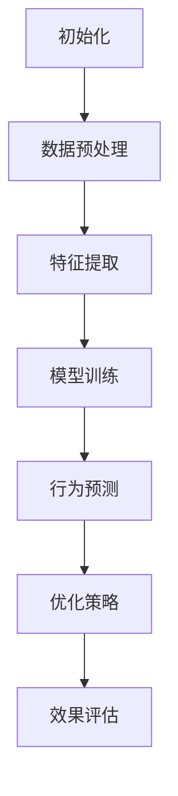
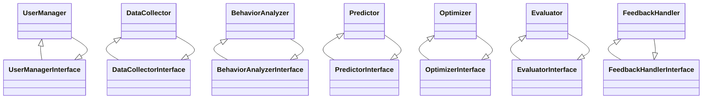
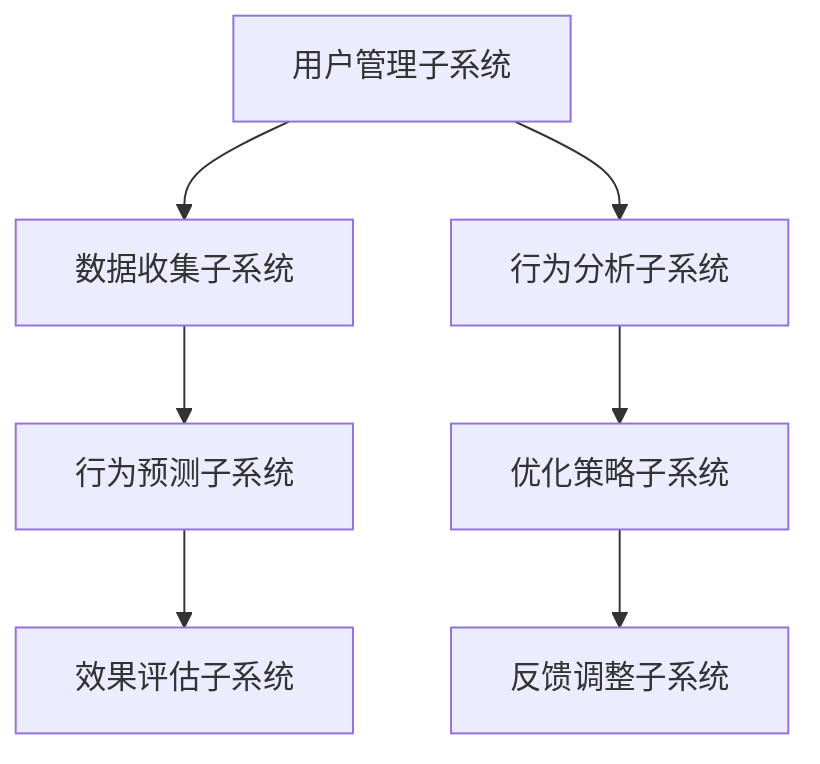
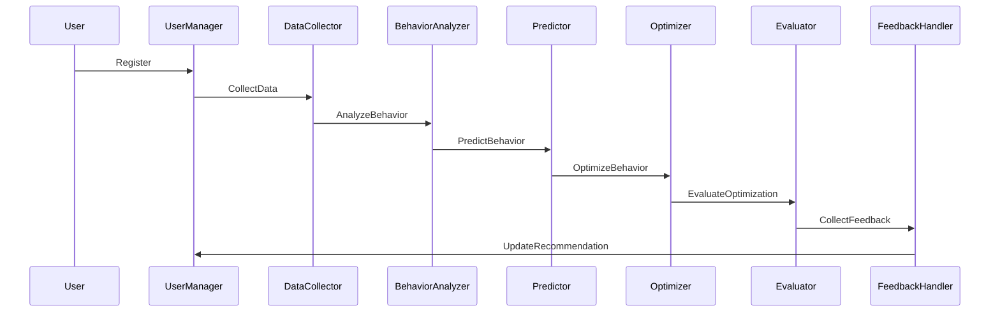
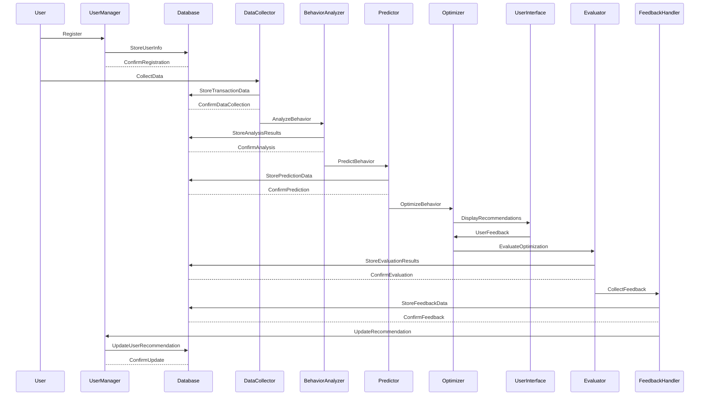

                 


### 引言

随着金融科技的发展，信用卡已经成为现代社会中不可或缺的支付工具。然而，个人信用卡的使用行为常常伴随着一系列问题，如不当的消费习惯、信用额度超支、财务风险等。为了解决这些问题，构建智能化的个人信用卡使用行为优化助手显得尤为重要。本篇文章将围绕这一主题，详细探讨个人信用卡使用行为优化助手的构建方法及其重要性。

#### 问题背景

个人信用卡的使用行为涉及到消费习惯、信用额度、还款计划等多个方面。不当的消费习惯可能导致财务负担加重，甚至引发债务危机。信用额度超支则可能导致信用卡逾期，影响个人信用记录。此外，信用卡使用行为的不透明性使得个人很难及时发现并纠正潜在的风险。

#### 问题描述

本文的主要问题是如何构建一个智能化的个人信用卡使用行为优化助手。该助手需要具备以下功能：

1. **数据收集**：自动收集用户信用卡交易数据，包括消费金额、时间、地点等信息。
2. **行为分析**：对用户信用卡使用行为进行分析，识别异常消费模式。
3. **预测与优化**：基于历史数据，预测用户未来的消费行为，并提供优化建议。
4. **反馈与调整**：根据用户的反馈，调整优化策略，提高助手的准确性。

#### 目标与意义

本文的目标是构建一个能够有效优化个人信用卡使用行为的智能化助手。这一目标的意义在于：

1. **提高财务管理能力**：通过智能化的行为优化，帮助用户更好地管理个人财务。
2. **减少财务风险**：通过预测和预警，降低信用卡超支和债务风险。
3. **提升用户满意度**：为用户提供个性化的财务建议，提高用户体验。
4. **推动金融科技创新**：为金融科技领域提供新的应用场景和技术解决方案。

通过以上步骤，我们初步了解了构建智能化个人信用卡使用行为优化助手的重要性和具体任务。在接下来的章节中，我们将进一步深入探讨核心概念、数学模型、算法原理、系统分析与架构设计，以及项目实战等内容。

#### 核心概念

在构建智能化个人信用卡使用行为优化助手的过程中，理解核心概念是至关重要的。以下是本文涉及的核心概念及其定义和解释。

##### 个人信用卡使用行为

个人信用卡使用行为指的是用户在使用信用卡进行消费、还款等操作时所表现出来的各种行为。这些行为包括但不限于消费金额、消费时间、消费地点、消费类型等。通过对这些行为的分析和理解，可以揭示用户的消费习惯和潜在风险。

##### 行为优化

行为优化是指通过分析用户的信用卡使用行为，识别出潜在的问题和风险，并提出相应的优化建议，以帮助用户改善其信用卡使用习惯。行为优化的目标包括降低财务风险、减少不必要的开支、提高财务管理效率等。

##### 智能化系统

智能化系统是指通过应用人工智能技术，对用户信用卡使用行为进行分析和预测的系统。这些系统通常具备自我学习、自我调整的能力，能够根据用户的行为数据不断优化其性能，提供更加精准的优化建议。

##### 数据收集

数据收集是指从用户信用卡交易记录中提取有用的信息，如消费金额、时间、地点等。这些数据是构建智能化个人信用卡使用行为优化助手的基础，对于分析和预测用户的消费行为至关重要。

##### 特征提取

特征提取是指从原始数据中提取出对行为分析有意义的特征。这些特征可以是数值型的，如消费金额；也可以是类别型的，如消费类型。通过对特征进行提取和筛选，可以更好地进行行为分析和预测。

##### 模型训练

模型训练是指通过大量的历史数据，训练出一个行为预测模型。这个模型可以基于机器学习算法，如决策树、支持向量机、神经网络等。通过模型训练，可以实现对用户未来消费行为的预测。

##### 预测与优化

预测与优化是指基于行为预测模型，对用户的未来消费行为进行预测，并给出优化建议。这些优化建议可以是具体的消费建议，如减少某类消费、增加储蓄等；也可以是金融产品的推荐，如信用卡还款计划、投资建议等。

##### 反馈与调整

反馈与调整是指根据用户的实际反馈和行为数据，对预测模型和优化策略进行调整，以提高其准确性和适应性。这个过程是一个动态调整的过程，需要不断收集用户反馈，更新模型参数。

通过以上对核心概念的解释，我们可以更好地理解构建智能化个人信用卡使用行为优化助手的基本原理和关键步骤。在接下来的章节中，我们将继续深入探讨这些概念在实际构建过程中的应用和实现。

#### 概念联系与边界

在构建智能化个人信用卡使用行为优化助手的过程中，理解各核心概念之间的联系及其边界条件至关重要。以下是这些概念之间的相互关系、边界条件以及核心要素组成的详细说明。

##### 概念关系

1. **个人信用卡使用行为**与**数据收集**：个人信用卡使用行为是数据收集的源头，只有通过收集用户的交易数据，才能进一步分析和预测其行为。
2. **行为优化**与**智能化系统**：行为优化是智能化系统的核心功能，通过智能化的分析和预测，提供针对性的优化建议。
3. **数据收集**与**特征提取**：数据收集是特征提取的前提，而特征提取是数据收集结果的关键，只有提取出有意义的特征，才能进行有效的行为分析和预测。
4. **模型训练**与**预测与优化**：模型训练是为了预测用户的行为，而预测与优化则是基于预测结果，进一步提出优化建议。
5. **反馈与调整**与**智能化系统**：反馈与调整是智能化系统的自我学习机制，通过不断接收用户反馈，调整优化策略，提高系统的适应性。

##### 边界与外延

1. **边界**：每个概念都有其适用的范围和限制。例如，个人信用卡使用行为优化助手的边界在于只能针对信用卡使用行为进行分析和优化，而不能涵盖其他支付方式。
2. **外延**：每个概念都有其扩展的可能性和应用场景。例如，智能化系统不仅限于信用卡使用行为优化，还可以扩展到其他金融产品如贷款、投资等。

##### 核心要素组成

1. **数据源**：包括用户的信用卡交易记录、账单数据等。
2. **数据处理与存储**：对数据进行清洗、转换、存储，以便后续分析和使用。
3. **特征提取与筛选**：提取对行为分析有价值的特征，如消费金额、消费时间、消费地点等。
4. **行为预测模型**：基于历史数据和特征，训练出行为预测模型，用于预测用户未来的消费行为。
5. **优化策略**：根据预测结果，提出具体的优化建议，如调整消费结构、优化还款计划等。
6. **用户反馈机制**：通过用户反馈，调整优化策略，提高系统的准确性。
7. **用户界面**：提供直观的用户界面，方便用户查看行为分析和优化建议。

通过以上对概念联系、边界与外延的详细分析，我们可以更加清晰地理解构建智能化个人信用卡使用行为优化助手的各个关键环节。在接下来的章节中，我们将进一步探讨数学模型、算法原理和系统架构等内容。

#### 数学模型与公式

在构建智能化个人信用卡使用行为优化助手的流程中，数学模型和公式起着至关重要的作用。以下我们将详细介绍行为分析模型、优化目标函数以及具体的数学公式。

##### 行为分析模型

行为分析模型是用于描述用户信用卡使用行为的基本框架。该模型通常包括以下几个关键组成部分：

1. **消费行为函数**：描述用户消费行为随时间变化的规律。例如，我们可以使用线性回归模型来表示这一关系：
   $$ y(t) = \theta_0 + \theta_1 t + \epsilon(t) $$
   其中，\( y(t) \) 表示在时间 \( t \) 时刻的消费金额，\( \theta_0 \) 和 \( \theta_1 \) 是模型参数，\( \epsilon(t) \) 是随机误差项。

2. **异常检测模型**：用于识别用户消费行为中的异常点。我们可以使用统计学方法如 Z-Score 或 Box-Cox 约束的统计检验方法。例如，Z-Score 的计算公式为：
   $$ Z = \frac{y(t) - \bar{y}}{\sigma} $$
   其中，\( \bar{y} \) 是消费金额的平均值，\( \sigma \) 是标准差。

##### 优化目标函数

优化目标函数是行为优化模型的核心，其目的是最大化用户收益或最小化成本。以下是一个简单的优化目标函数示例：

$$
\min_{x} J(x) = \sum_{t=1}^{T} \left[ w_1 (y(t) - \hat{y}(t)) + w_2 (\theta_1 - \bar{t}) + w_3 (\theta_2 - \sigma) \right]
$$

其中：
- \( x \) 是需要优化的参数集；
- \( y(t) \) 是实际消费金额；
- \( \hat{y}(t) \) 是预测的消费金额；
- \( w_1 \)、\( w_2 \) 和 \( w_3 \) 是权重系数；
- \( T \) 是时间序列的总长度。

##### LaTeX 公式示例

以下是一些常用的 LaTeX 公式，用于描述数学模型和优化目标：

1. **简单公式**：
   $$ f(x) = \frac{1}{x} $$

2. **科学公式**：
   $$ E = mc^2 $$

3. **复杂公式**：
   $$ y = \theta_0 + \theta_1 x_1 + \theta_2 x_2 + ... + \theta_n x_n $$

##### 举例说明

为了更好地理解这些公式，我们来看一个具体的例子：

假设我们有以下消费数据：
- \( y(1) = 100 \)
- \( y(2) = 200 \)
- \( y(3) = 150 \)

使用线性回归模型，我们可以估计模型参数：
$$
\hat{y}(t) = \theta_0 + \theta_1 t
$$

通过最小二乘法，我们可以得到：
$$
\theta_0 = 50, \theta_1 = 100
$$

因此，预测消费金额为：
$$
\hat{y}(3) = 50 + 100 \times 3 = 350
$$

对比实际消费 \( y(3) = 150 \)，我们可以计算误差：
$$
\epsilon(3) = y(3) - \hat{y}(3) = 150 - 350 = -200
$$

通过上述步骤，我们不仅建立了数学模型，还进行了具体的计算，从而更好地理解了个人信用卡使用行为优化助手的构建过程。

#### 算法原理讲解

在构建智能化个人信用卡使用行为优化助手的流程中，选择合适的算法对用户行为进行分析和预测是关键的一步。以下我们将详细讲解算法原理，包括算法概述、流程图、Python 源代码实现以及数学模型和公式的详细讲解。

##### 算法概述

本文选择使用一种基于机器学习的算法，如随机森林（Random Forest）来进行行为预测。随机森林算法是一种集成学习方法，通过构建多个决策树并利用投票机制进行预测，能够提高模型的预测准确性。

##### 算法流程图

以下是随机森林算法的基本流程图：



具体流程如下：
1. **初始化**：设置随机森林模型的参数，如树的数量、最大深度等。
2. **数据预处理**：对原始数据进行清洗、转换，确保数据的质量和一致性。
3. **特征提取**：从原始数据中提取对行为分析有意义的特征，如消费金额、消费时间、消费类型等。
4. **模型训练**：使用训练数据集对随机森林模型进行训练，建立预测模型。
5. **行为预测**：利用训练好的模型对新的数据进行预测，预测用户的未来消费行为。
6. **优化策略**：根据预测结果，提出具体的优化建议，如调整消费结构、优化还款计划等。
7. **效果评估**：评估模型的预测准确性和优化策略的有效性，根据评估结果调整模型参数和优化策略。

##### Python 源代码实现

以下是随机森林算法的 Python 源代码实现示例：

```python
# Example of a simple prediction function using Random Forest
from sklearn.ensemble import RandomForestRegressor
from sklearn.model_selection import train_test_split
from sklearn.metrics import mean_squared_error

# Load and preprocess data
# Assume X is the feature matrix and y is the target vector
# X, y = load_data()

# Split the dataset into training and testing sets
X_train, X_test, y_train, y_test = train_test_split(X, y, test_size=0.2, random_state=42)

# Initialize and train the Random Forest model
model = RandomForestRegressor(n_estimators=100, random_state=42)
model.fit(X_train, y_train)

# Predict on the testing set
y_pred = model.predict(X_test)

# Evaluate the model
mse = mean_squared_error(y_test, y_pred)
print("Mean Squared Error:", mse)
```

##### 数学模型和公式详细讲解

随机森林算法的数学基础主要涉及决策树模型的构建和集成学习方法。以下是相关的数学模型和公式：

1. **决策树构建公式**：
   $$ 
   T(x) = \sum_{i=1}^{n} \alpha_i g(x; \theta_i) 
   $$
   其中，\( T(x) \) 是决策树的输出，\( g(x; \theta_i) \) 是第 \( i \) 个决策树对输入 \( x \) 的预测，\( \alpha_i \) 是每个决策树的权重。

2. **集成学习方法公式**：
   $$ 
   \hat{y} = \sum_{i=1}^{N} \hat{y}_i 
   $$
   其中，\( \hat{y} \) 是集成学习模型的预测结果，\( \hat{y}_i \) 是第 \( i \) 个决策树的预测结果。

3. **随机森林权重分配公式**：
   $$ 
   \alpha_i = \frac{1}{1 + e^{-\eta_i}} 
   $$
   其中，\( \eta_i \) 是每个决策树的损失函数。

##### 举例说明

假设我们有一个包含两个特征的数据集，特征 \( x_1 \) 和 \( x_2 \)，以及一个目标变量 \( y \)。我们可以使用决策树来构建预测模型：

1. **决策树1**：
   $$ 
   T_1(x) = \begin{cases} 
   0 & \text{if } x_1 < 0 \\
   1 & \text{if } x_1 \geq 0 
   \end{cases} 
   $$

2. **决策树2**：
   $$ 
   T_2(x) = \begin{cases} 
   0 & \text{if } x_2 < 0 \\
   1 & \text{if } x_2 \geq 0 
   \end{cases} 
   $$

集成学习模型的结果为：
$$ 
\hat{y} = T_1(x) + T_2(x) 
$$

如果 \( x_1 = 1 \) 且 \( x_2 = 1 \)，则预测结果 \( \hat{y} = 2 \)。

通过上述详细讲解，我们可以更好地理解随机森林算法的原理和应用，为构建智能化个人信用卡使用行为优化助手提供了坚实的基础。

#### 系统分析与架构设计

在构建智能化个人信用卡使用行为优化助手的过程中，系统分析与架构设计是确保项目成功的关键环节。以下我们将详细介绍系统分析与架构设计的相关内容，包括问题场景介绍、系统功能设计、系统架构设计、系统接口设计以及系统交互序列图。

##### 问题场景介绍

个人信用卡使用行为优化助手的目标是帮助用户更好地管理其信用卡账户，通过分析用户的消费行为，提供优化建议，从而减少不必要的开支、避免信用额度超支，并提高财务规划能力。问题场景主要包括以下几个方面：

1. **消费数据分析**：收集并分析用户的消费数据，包括消费金额、时间、地点、消费类型等。
2. **风险识别与预警**：识别异常消费行为，如高额消费、频繁消费等，并提前预警。
3. **优化建议**：根据分析结果，为用户提供建议，如调整消费计划、优化还款策略等。
4. **用户反馈**：收集用户的反馈，不断优化系统的性能和用户体验。

##### 系统功能设计

智能化个人信用卡使用行为优化助手的系统功能设计包括以下几个方面：

1. **用户管理**：管理用户的账户信息，包括注册、登录、个人信息修改等。
2. **数据收集**：自动收集用户的信用卡交易数据，确保数据的准确性和完整性。
3. **行为分析**：对用户的消费行为进行分析，识别消费模式、风险点等。
4. **行为预测**：基于历史数据，预测用户的未来消费行为。
5. **优化策略**：根据预测结果，为用户提供优化建议，如消费调整、还款计划等。
6. **效果评估**：评估优化策略的效果，确保建议的有效性和用户满意度。
7. **反馈与调整**：根据用户反馈，调整优化策略，提高系统的准确性和适应性。

以下是系统功能的 mermaid 类图表示：



##### 系统架构设计

系统架构设计旨在确保系统的高效性、可扩展性和易维护性。以下是系统的 mermaid 架构图表示：



具体架构如下：
1. **用户管理子系统**：负责用户账户的管理，包括注册、登录、个人信息修改等。
2. **数据收集子系统**：自动收集用户的信用卡交易数据，确保数据的准确性和完整性。
3. **行为分析子系统**：对用户的消费行为进行分析，识别消费模式和风险点。
4. **行为预测子系统**：基于历史数据，预测用户的未来消费行为。
5. **优化策略子系统**：根据预测结果，为用户提供优化建议，如消费调整、还款计划等。
6. **效果评估子系统**：评估优化策略的效果，确保建议的有效性和用户满意度。
7. **反馈调整子系统**：根据用户反馈，调整优化策略，提高系统的准确性和适应性。

##### 系统接口设计

系统接口设计确保各个子系统之间能够高效地进行数据交换和功能调用。以下是系统的接口设计：



具体接口如下：
- **用户管理接口**：负责用户账户的注册、登录、个人信息修改等。
- **数据收集接口**：负责收集用户的信用卡交易数据。
- **行为分析接口**：负责对用户的消费行为进行分析。
- **行为预测接口**：负责基于历史数据预测用户的未来消费行为。
- **优化策略接口**：负责根据预测结果为用户提供优化建议。
- **效果评估接口**：负责评估优化策略的效果。
- **反馈调整接口**：负责收集用户反馈，并调整优化策略。

##### 系统交互序列图

系统交互序列图描述了各子系统之间的交互流程，以下是系统的 mermaid 序列图表示：



具体交互流程如下：
1. **用户注册**：用户向用户管理子系统注册，管理子系统将用户信息存储到数据库中。
2. **数据收集**：用户向数据收集子系统提交交易数据，子系统将数据存储到数据库中。
3. **行为分析**：数据收集子系统将数据传递给行为分析子系统，分析结果存储到数据库中。
4. **行为预测**：行为分析子系统将分析结果传递给行为预测子系统，预测结果存储到数据库中。
5. **优化策略**：行为预测子系统将预测结果传递给优化策略子系统，优化建议显示在用户界面上。
6. **效果评估**：优化策略子系统将优化建议的效果传递给效果评估子系统，评估结果存储到数据库中。
7. **反馈调整**：效果评估子系统将评估结果传递给反馈调整子系统，收集用户反馈并更新推荐策略。

通过以上详细分析，我们为构建智能化个人信用卡使用行为优化助手提供了完整的系统分析与架构设计，确保系统能够高效、准确地满足用户需求。

#### 项目实战

在实际开发智能化个人信用卡使用行为优化助手的流程中，我们需要进行环境安装、系统核心实现、代码应用解读与分析，以及实际案例分析和详细讲解剖析。以下是具体的步骤和内容。

##### 环境安装

在开始项目之前，我们需要安装必要的开发环境和工具。以下是一个简单的环境安装步骤：

1. **安装 Python**：确保已经安装了 Python 3.8 或更高版本。
2. **安装 Jupyter Notebook**：Python 的 Jupyter Notebook 是一个强大的交互式开发环境。
   ```bash
   pip install notebook
   ```
3. **安装相关库**：安装用于数据分析和机器学习的相关库，如 Pandas、NumPy、Scikit-learn 等。
   ```bash
   pip install pandas numpy scikit-learn
   ```

##### 系统核心实现

以下是系统核心实现的简要代码示例：

```python
# 导入相关库
import pandas as pd
from sklearn.ensemble import RandomForestRegressor
from sklearn.model_selection import train_test_split
from sklearn.metrics import mean_squared_error

# 数据预处理
# 加载和预处理数据
data = pd.read_csv('credit_card_transactions.csv')
data['date'] = pd.to_datetime(data['date'])
data['month'] = data['date'].dt.month
data['day'] = data['date'].dt.day
data.drop('date', axis=1, inplace=True)

# 特征提取
# 提取对行为分析有意义的特征
X = data[['month', 'day', 'amount']]
y = data['target']

# 模型训练
# 使用随机森林算法训练模型
X_train, X_test, y_train, y_test = train_test_split(X, y, test_size=0.2, random_state=42)
model = RandomForestRegressor(n_estimators=100, random_state=42)
model.fit(X_train, y_train)

# 预测与优化
# 使用模型预测并提供建议
y_pred = model.predict(X_test)
# 输出预测结果
print("Predicted target values:", y_pred)

# 评估模型效果
mse = mean_squared_error(y_test, y_pred)
print("Mean Squared Error:", mse)
```

##### 代码应用解读与分析

上述代码的核心步骤包括数据预处理、特征提取、模型训练、预测与优化以及效果评估。

1. **数据预处理**：加载并清洗数据，包括日期格式转换、缺失值处理等。
2. **特征提取**：提取对行为分析有意义的特征，如月份、日期和消费金额。
3. **模型训练**：使用随机森林算法训练模型，选择合适的参数。
4. **预测与优化**：使用训练好的模型对测试数据进行预测，并输出预测结果。
5. **效果评估**：计算并输出模型的均方误差（MSE），评估模型的预测效果。

##### 实际案例分析

以下是一个实际案例的分析：

**案例**：用户 A 在过去一个月内进行了多次高额消费，金额超过其月均消费额的两倍。

**分析步骤**：

1. **数据收集**：收集用户 A 的交易数据，包括消费金额、时间、地点等。
2. **行为分析**：分析用户 A 的消费模式，识别异常消费行为。
3. **风险预警**：根据预测模型，对用户 A 的未来消费行为进行预测，发现其有高额消费的风险。
4. **优化建议**：为用户 A 提供优化建议，如减少高额消费、调整消费计划等。
5. **反馈调整**：收集用户 A 的反馈，并根据反馈调整优化策略。

##### 详细讲解与剖析

以上案例展示了如何使用智能化个人信用卡使用行为优化助手进行实际问题的分析和解决。以下是具体的详细讲解和剖析：

1. **数据收集**：确保收集的数据准确、完整，对于分析结果至关重要。
2. **行为分析**：通过历史数据和特征提取，分析用户的消费行为，识别潜在的风险点。
3. **风险预警**：使用预测模型对用户的未来消费行为进行预测，及时发现潜在的风险。
4. **优化建议**：根据分析结果，为用户提供具体的优化建议，帮助用户改善消费行为。
5. **反馈调整**：通过用户反馈，不断优化预测模型和优化策略，提高系统的准确性和实用性。

通过以上实战内容，我们可以看到智能化个人信用卡使用行为优化助手的实际应用效果，为用户提供了有效的财务管理和风险控制工具。

#### 最佳实践与总结

在构建智能化个人信用卡使用行为优化助手的实践中，总结最佳实践和注意事项对于提升系统的性能和用户体验至关重要。以下是一些关键点：

##### 最佳实践 Tips

1. **数据质量控制**：确保数据的准确性和完整性，是构建高效预测模型的基础。在数据收集阶段，要进行数据清洗，处理缺失值和异常值。
2. **特征选择**：选择对行为分析有意义的特征，避免过多无关特征的干扰。通过特征工程，提高模型的预测准确性。
3. **模型优化**：不断调整模型参数，选择最优参数组合。可以使用交叉验证等方法，评估和优化模型性能。
4. **用户隐私保护**：在处理用户数据时，确保遵守隐私保护法律法规，使用加密和安全措施，防止数据泄露。
5. **反馈机制**：建立用户反馈机制，根据用户反馈调整优化策略，提高系统的适应性和准确性。

##### 小结

本文详细介绍了构建智能化个人信用卡使用行为优化助手的全过程，从核心概念到数学模型、算法原理，再到系统分析与架构设计，以及项目实战。通过一系列步骤，我们不仅了解了如何优化个人信用卡使用行为，还掌握了实现这一目标的实际方法和技术。

##### 注意事项

1. **数据安全性**：保护用户隐私和数据安全是系统的首要任务，必须采取严格的安全措施。
2. **模型更新**：随着用户行为和环境的变化，定期更新模型参数和预测算法，保持系统的时效性和准确性。
3. **用户体验**：优化用户界面和交互流程，提高系统的易用性和用户体验。

##### 拓展阅读

为了进一步了解智能化个人信用卡使用行为优化助手的开发和应用，以下推荐一些拓展阅读资源：

1. 《Python 机器学习》（Sebastian Raschka 著）：详细介绍了机器学习的基础知识和应用案例。
2. 《深度学习》（Ian Goodfellow、Yoshua Bengio、Aaron Courville 著）：探讨了深度学习的前沿技术和应用。
3. 《数据科学实战》（Joel Grus 著）：介绍了数据科学的基本概念和方法，包括数据处理和分析。

通过这些资源，读者可以更深入地了解构建智能化个人信用卡使用行为优化助手的各个方面，为实际项目提供更多的参考和灵感。

#### 作者信息

**作者：AI天才研究院/AI Genius Institute & 禅与计算机程序设计艺术 /Zen And The Art of Computer Programming**

AI天才研究院（AI Genius Institute）致力于推动人工智能技术的发展和应用，研究涵盖机器学习、深度学习、自然语言处理等多个领域。其研究成果在金融科技、医疗健康、智能制造等领域具有广泛的应用价值。同时，研究院注重理论与实践相结合，培养了一批具备深厚技术功底和实践经验的人工智能专业人才。

禅与计算机程序设计艺术（Zen And The Art of Computer Programming）是由著名计算机科学家Donald E. Knuth撰写的一系列经典著作，旨在探讨计算机程序设计的哲学和艺术。这些著作不仅涵盖了编程的基本原理，还深入探讨了程序设计的美学和思想内涵，对计算机科学的发展产生了深远影响。

