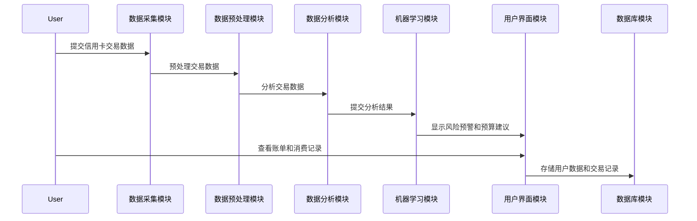
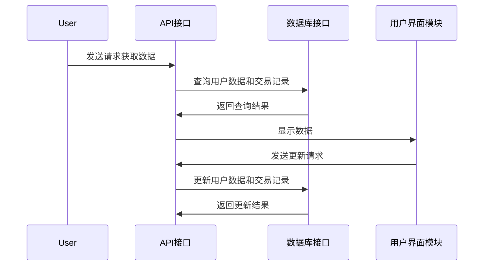

                 

### 构建智能化的个人信用卡管理助手

随着经济的发展和消费观念的变革，信用卡已经成为现代生活中不可或缺的一部分。然而，信用卡管理却是一个复杂且繁琐的过程，涉及到账单处理、费用计算、预算规划、风险控制等多个方面。传统的信用卡管理方法往往依赖于手工操作和纸质记录，不仅效率低下，而且容易出现错误。为了解决这些问题，智能化个人信用卡管理助手应运而生。

本文将围绕构建智能化的个人信用卡管理助手这一主题展开讨论。我们将首先介绍信用卡管理的现状与挑战，然后探讨智能化解决方案的需求。接下来，我们将详细讲解构建信用卡管理助手所需的核心概念和算法原理，并介绍系统分析与架构设计方案。在项目实战部分，我们将展示如何实现一个实际的信用卡管理助手项目。最后，我们将总结最佳实践，并提出未来发展的方向。

> **关键词**：信用卡管理、智能化、数据分析、机器学习、系统架构、项目实战

> **摘要**：本文旨在探讨构建智能化的个人信用卡管理助手的方法和步骤。通过介绍核心概念、算法原理和系统设计，以及项目实战案例，本文为读者提供了构建信用卡管理助手的全面指导。

## 1. 背景介绍

### 1.1 信用卡管理的现状与挑战

信用卡作为现代金融工具，极大地便利了人们的日常消费和财务管理。然而，随着信用卡数量的增多和使用频率的提高，信用卡管理逐渐成为一个复杂且繁琐的任务。传统信用卡管理主要依赖于手工操作和纸质记录，存在以下几个主要问题：

1. **效率低下**：用户需要手动处理大量的账单和交易记录，费时费力。此外，账单的整理和归档过程也相当耗时。
2. **容易出错**：手工记录容易发生错误，如输入错误、数据丢失等，这可能导致财务问题和不必要的信用损失。
3. **预算控制困难**：用户很难实时了解自己的消费情况，进行有效的预算规划。
4. **风险控制不足**：信用卡交易涉及到潜在的风险，如欺诈、盗刷等，传统的管理方法难以有效地预防和控制这些风险。

### 1.2 智能化信用卡管理的需求

面对上述问题，智能化信用卡管理助手成为了解决之道。智能化管理不仅能够提高效率，减少错误，还能够提供更加精准的预算控制和风险防范。以下是智能化信用卡管理所需的主要功能：

1. **自动账单处理**：系统能够自动获取并处理信用卡账单，将交易记录进行分类、整理和存储。
2. **实时消费监控**：用户可以实时查看自己的消费情况，包括账单明细、消费类别、支出总额等，帮助用户更好地管理预算。
3. **智能预算规划**：系统根据用户的消费习惯和财务目标，提供个性化的预算建议，帮助用户实现财务目标。
4. **风险预警与控制**：系统可以监控信用卡交易活动，及时发现潜在的欺诈行为或异常交易，并提供相应的预警和应对措施。
5. **个性化服务**：根据用户的喜好和使用习惯，提供定制化的服务，如个性化推荐、专属优惠等。

### 1.3 智能信用卡管理助手的功能与价值

智能信用卡管理助手不仅提升了信用卡管理的效率，还具有显著的价值：

1. **提高财务管理效率**：通过自动化处理和智能分析，大大减少了用户在财务管理上的时间和精力投入。
2. **减少错误和风险**：自动化的账单处理和智能预警机制有效减少了手工记录的出错率和风险。
3. **优化预算规划**：智能预算规划和个性化服务帮助用户更好地掌握自己的财务状况，实现财务目标。
4. **提升用户体验**：通过提供个性化服务和优质体验，增强用户对信用卡服务的满意度。

总的来说，智能信用卡管理助手不仅解决了传统信用卡管理的痛点，还提供了更加便捷、高效、安全的财务管理方式，对于现代消费者的生活具有重要意义。

## 2. 核心概念与联系

### 2.1 数据分析

数据分析是构建智能信用卡管理助手的关键技术之一，它涉及从大量数据中提取有价值的信息，帮助用户更好地理解和利用数据。以下是对数据分析基本概念、主要方法和其在信用卡管理中的应用的介绍。

#### 2.1.1 数据分析的基本概念

数据分析（Data Analysis）是指从数据中提取有用信息和知识的过程。它包括数据清洗、数据探索、数据可视化、预测分析等多个步骤。数据分析的目的是通过处理和分析数据，发现隐藏在数据背后的模式和规律，从而为决策提供支持。

- **数据清洗**：数据清洗是数据分析的第一步，它涉及处理缺失数据、异常值和重复数据等，以提高数据质量。
- **数据探索**：数据探索通过统计方法、图表等工具对数据进行初步分析，发现数据中的模式和趋势。
- **数据可视化**：数据可视化是将数据以图表、图形等形式直观地展示出来，帮助用户更好地理解和分析数据。
- **预测分析**：预测分析利用历史数据和统计学方法，预测未来的趋势和结果。

#### 2.1.2 数据分析的主要方法

数据分析方法主要包括描述性分析、推断性分析和预测性分析：

- **描述性分析**：描述性分析用于总结和描述数据的基本特征，如平均值、中位数、标准差等。它可以帮助用户快速了解数据的基本情况。
- **推断性分析**：推断性分析基于样本数据，对总体数据的特点进行推断，如假设检验、置信区间等。
- **预测性分析**：预测性分析利用历史数据和统计模型，预测未来的趋势和结果，如时间序列分析、回归分析等。

#### 2.1.3 数据分析在信用卡管理中的应用

数据分析在信用卡管理中的应用非常广泛，主要体现在以下几个方面：

- **账单处理**：通过数据分析，系统可以自动处理信用卡账单，将交易记录进行分类、整理和存储。
- **消费监控**：数据分析可以帮助用户实时监控自己的消费情况，包括账单明细、消费类别、支出总额等。
- **预算规划**：数据分析可以为用户提供个性化的预算建议，帮助用户更好地管理财务。
- **风险控制**：数据分析可以监控信用卡交易活动，及时发现潜在的欺诈行为或异常交易。

### 2.2 机器学习

机器学习（Machine Learning）是构建智能信用卡管理助手的另一个核心技术，它通过从数据中学习规律，实现自动化的决策和预测。以下是对机器学习基本概念、主要算法和其在信用卡管理中的应用的介绍。

#### 2.2.1 机器学习的基本概念

机器学习是人工智能（AI）的一个重要分支，它涉及使用计算机程序模拟人类学习过程，从数据中提取知识和规律。机器学习主要包括监督学习、无监督学习和强化学习：

- **监督学习**：监督学习通过已有标记的数据训练模型，然后使用该模型对新数据进行预测。常见的监督学习算法包括线性回归、逻辑回归、支持向量机（SVM）等。
- **无监督学习**：无监督学习不使用标记数据，而是通过发现数据中的隐藏结构进行分类或聚类。常见的无监督学习算法包括K-均值聚类、主成分分析（PCA）等。
- **强化学习**：强化学习通过不断尝试和反馈，从环境中学习最优策略。常见的强化学习算法包括Q-学习、深度强化学习等。

#### 2.2.2 机器学习的主要算法

机器学习算法种类繁多，每种算法都有其特定的应用场景和优势：

- **线性回归**：线性回归是一种最简单的监督学习算法，通过拟合线性模型来预测连续值。
- **逻辑回归**：逻辑回归用于分类问题，通过拟合逻辑函数来预测离散值。
- **支持向量机（SVM）**：SVM通过寻找最优超平面来划分数据，适用于高维空间分类问题。
- **K-均值聚类**：K-均值聚类是一种无监督学习算法，通过将数据划分为K个簇，以最小化簇内距离和。
- **主成分分析（PCA）**：PCA是一种降维算法，通过将数据投影到新的低维空间，减少数据维度。
- **Q-学习**：Q-学习是一种强化学习算法，通过更新Q值来选择最优动作。

#### 2.2.3 机器学习在信用卡管理中的应用

机器学习在信用卡管理中的应用主要体现在以下几个方面：

- **欺诈检测**：通过训练欺诈检测模型，系统能够自动识别和防范信用卡欺诈行为。
- **信用评分**：机器学习算法可以根据用户的历史数据和行为模式，预测其信用风险。
- **个性化推荐**：通过分析用户的消费习惯和偏好，系统可以提供个性化的信用卡优惠和服务。
- **风险控制**：机器学习模型可以帮助金融机构更好地控制风险，提高服务质量。

### 2.3 智能信用卡管理助手

智能信用卡管理助手是一个综合性的系统，它结合了数据分析、机器学习和其他相关技术，为用户提供全面的信用卡管理服务。以下是对智能信用卡管理助手的定义、核心组成和未来发展趋势的介绍。

#### 2.3.1 智能信用卡管理助手的定义

智能信用卡管理助手（Smart Credit Card Management Assistant）是一种基于人工智能技术的综合管理工具，它通过自动化和智能化的方式，帮助用户高效地管理信用卡相关事务。智能信用卡管理助手不仅能够处理日常的账单和交易记录，还能提供个性化的预算建议、风险预警和个性化推荐等功能。

#### 2.3.2 智能信用卡管理助手的核心组成

智能信用卡管理助手主要由以下几个核心模块组成：

- **数据采集与处理模块**：负责从信用卡公司、银行和其他相关机构获取用户信用卡交易数据，并进行数据清洗、预处理和存储。
- **数据分析模块**：利用数据分析技术，对用户信用卡交易数据进行分析，提取有价值的信息，为用户提供消费监控和预算规划等服务。
- **机器学习模块**：利用机器学习算法，对用户信用卡交易数据进行分析，实现欺诈检测、信用评分和个性化推荐等功能。
- **用户界面模块**：提供一个友好、易用的用户界面，使用户能够方便地访问和管理信用卡相关数据和服务。

#### 2.3.3 智能信用卡管理助手的发展趋势

随着人工智能技术的不断进步，智能信用卡管理助手将向以下几个方面发展：

- **智能化水平提升**：通过引入更先进的机器学习算法和自然语言处理技术，智能信用卡管理助手将提供更精准、更智能的服务。
- **个性化服务增强**：智能信用卡管理助手将根据用户的个性化需求和偏好，提供更加精准、个性化的服务。
- **跨平台支持**：智能信用卡管理助手将支持多种平台，如移动应用、Web端等，方便用户随时随地访问和管理信用卡数据。
- **隐私保护加强**：随着用户对隐私保护的重视，智能信用卡管理助手将采取更加严格的隐私保护措施，确保用户数据的安全。

### 2.4 小结

通过对核心概念和联系的介绍，我们可以看到，数据分析、机器学习和其他相关技术是构建智能信用卡管理助手的重要基础。这些技术不仅解决了传统信用卡管理中的痛点，还为用户提供了一种高效、智能、安全的财务管理方式。随着技术的不断进步，智能信用卡管理助手将越来越普及，成为现代金融管理的重要工具。

## 3. 算法原理讲解

### 3.1 数据分析算法

数据分析算法在构建智能信用卡管理助手过程中扮演着至关重要的角色。它们帮助我们从大量的信用卡交易数据中提取有用的信息，为用户提供了精准的消费监控、预算规划和风险控制等服务。以下我们将详细介绍两种数据分析算法：数据清洗和数据探索性分析。

#### 3.1.1 数据清洗

数据清洗是数据分析的基础步骤，其目的是处理数据中的缺失值、异常值和重复数据等，以确保数据的质量和完整性。

##### 3.1.1.1 数据清洗的基本原理

数据清洗的基本原理包括以下几个方面：

1. **缺失值处理**：缺失值处理的方法有填充、删除、插值等。填充常用的方法有均值填充、中值填充等；删除通常用于缺失值比例较高的数据；插值方法则适用于时间序列数据。
2. **异常值处理**：异常值处理的方法包括检测、标记和修正。检测方法有统计方法、可视化方法和机器学习方法等；标记方法通常用于标记不确定的异常值；修正方法用于对确定的异常值进行修正。
3. **重复数据处理**：重复数据处理主要是通过去重操作，确保数据的唯一性。

##### 3.1.1.2 数据清洗的工具与技巧

在数据清洗过程中，常用的工具和技巧包括：

1. **Pandas**：Pandas是一个强大的Python数据操作库，提供了丰富的数据清洗功能，如缺失值处理、异常值处理和重复数据处理等。
2. **Numpy**：Numpy是一个用于科学计算的基础库，与Pandas结合使用，可以更高效地进行数据清洗操作。
3. **可视化工具**：如Matplotlib和Seaborn等，可以用于可视化分析数据，发现潜在的异常值和缺失值。
4. **自定义函数**：根据具体的数据特点和需求，编写自定义函数进行数据清洗。

#### 3.1.2 数据探索性分析

数据探索性分析（Exploratory Data Analysis，EDA）是一种通过统计方法和可视化工具对数据进行初步分析的方法，其目的是发现数据中的模式和趋势，为后续的深入分析提供依据。

##### 3.1.2.1 数据探索性分析的基本原理

数据探索性分析的基本原理包括以下几个方面：

1. **描述性统计**：通过计算数据的基本统计指标，如均值、中位数、标准差等，对数据进行初步了解。
2. **分布分析**：通过绘制直方图、密度图等，分析数据的分布特征。
3. **相关性分析**：通过计算变量之间的相关性，分析变量之间的关系。
4. **可视化分析**：通过图表和图形，直观地展示数据中的模式和趋势。

##### 3.1.2.2 数据探索性分析的工具与技巧

在数据探索性分析过程中，常用的工具和技巧包括：

1. **Pandas**：Pandas提供了丰富的描述性统计函数，如`describe()`、`mean()`、`std()`等，用于计算和展示数据的基本统计指标。
2. **Matplotlib和Seaborn**：Matplotlib和Seaborn提供了丰富的绘图函数，如`hist()`、`boxplot()`、`scatterplot()`等，用于绘制数据的分布图、箱线图和散点图等。
3. **自定义函数**：根据具体的数据特点和需求，编写自定义函数进行数据探索性分析。

### 3.2 机器学习算法

机器学习算法在智能信用卡管理助手的构建中起到了关键作用，它们可以帮助系统实现自动化的决策和预测，如欺诈检测、信用评分和个性化推荐等。以下我们将介绍两种常用的机器学习算法：监督学习算法和无监督学习算法。

#### 3.2.1 监督学习算法

监督学习算法通过已有标记的数据训练模型，然后使用该模型对新数据进行预测。以下是一些常见的监督学习算法及其应用：

##### 3.2.1.1 线性回归

线性回归是一种最简单的监督学习算法，通过拟合线性模型来预测连续值。

- **算法原理**：线性回归模型通过寻找特征和目标变量之间的线性关系，构建一个预测方程。其数学模型可以表示为：
  $$ y = \beta_0 + \beta_1x_1 + \beta_2x_2 + \ldots + \beta_nx_n $$
  其中，$y$是目标变量，$x_1, x_2, \ldots, x_n$是特征变量，$\beta_0, \beta_1, \beta_2, \ldots, \beta_n$是模型的参数。

- **Python代码实现**：
  ```python
  import numpy as np
  from sklearn.linear_model import LinearRegression

  # 创建线性回归模型
  model = LinearRegression()

  # 模型训练
  X_train = np.array([[1, 2], [2, 3], [3, 4]])
  y_train = np.array([2, 3, 4])
  model.fit(X_train, y_train)

  # 模型预测
  X_test = np.array([[2, 3]])
  y_pred = model.predict(X_test)
  print(y_pred)  # 输出预测结果
  ```

##### 3.2.1.2 逻辑回归

逻辑回归是一种用于分类问题的监督学习算法，通过拟合逻辑函数来预测离散值。

- **算法原理**：逻辑回归模型通过寻找特征和目标变量之间的线性关系，并使用逻辑函数（Sigmoid函数）将线性关系转换为概率。其数学模型可以表示为：
  $$ P(y=1) = \frac{1}{1 + e^{-(\beta_0 + \beta_1x_1 + \beta_2x_2 + \ldots + \beta_nx_n)}} $$
  其中，$P(y=1)$是目标变量为1的概率，$e$是自然底数。

- **Python代码实现**：
  ```python
  import numpy as np
  from sklearn.linear_model import LogisticRegression

  # 创建逻辑回归模型
  model = LogisticRegression()

  # 模型训练
  X_train = np.array([[1, 2], [2, 3], [3, 4]])
  y_train = np.array([0, 1, 0])
  model.fit(X_train, y_train)

  # 模型预测
  X_test = np.array([[2, 3]])
  y_pred = model.predict(X_test)
  print(y_pred)  # 输出预测结果
  ```

##### 3.2.1.3 支持向量机（SVM）

支持向量机是一种强大的分类算法，通过寻找最优超平面来划分数据。

- **算法原理**：SVM通过寻找一个超平面，使得分类边界最大化。其数学模型可以表示为：
  $$ w \cdot x - b = 0 $$
  其中，$w$是超平面的法向量，$x$是特征向量，$b$是偏置。

- **Python代码实现**：
  ```python
  import numpy as np
  from sklearn.svm import SVC

  # 创建SVM模型
  model = SVC()

  # 模型训练
  X_train = np.array([[1, 2], [2, 3], [3, 4]])
  y_train = np.array([0, 1, 0])
  model.fit(X_train, y_train)

  # 模型预测
  X_test = np.array([[2, 3]])
  y_pred = model.predict(X_test)
  print(y_pred)  # 输出预测结果
  ```

#### 3.2.2 无监督学习算法

无监督学习算法不使用标记数据，而是通过发现数据中的隐藏结构进行分类或聚类。以下是一些常见的无监督学习算法及其应用：

##### 3.2.2.1 K-均值聚类

K-均值聚类是一种简单的聚类算法，通过将数据划分为K个簇，以最小化簇内距离和。

- **算法原理**：K-均值聚类通过随机初始化K个中心点，然后迭代更新中心点，使得每个数据点分配到最近的中心点所在的簇。其数学模型可以表示为：
  $$ C_k = \{x | \min_{j=1}^K \sum_{i=1}^N (x_i - \mu_j)^2\} $$
  其中，$C_k$是第k个簇，$\mu_j$是第j个中心点的坐标。

- **Python代码实现**：
  ```python
  import numpy as np
  from sklearn.cluster import KMeans

  # 创建K-均值聚类模型
  model = KMeans(n_clusters=3)

  # 模型训练
  X_train = np.array([[1, 2], [2, 3], [3, 4], [4, 5], [5, 6]])
  model.fit(X_train)

  # 模型预测
  X_test = np.array([[2, 3]])
  y_pred = model.predict(X_test)
  print(y_pred)  # 输出预测结果
  ```

##### 3.2.2.2 主成分分析（PCA）

主成分分析是一种降维算法，通过将数据投影到新的低维空间，减少数据维度。

- **算法原理**：PCA通过求解特征值和特征向量，将数据投影到新的低维空间，使得新空间的特征值最大，从而实现降维。其数学模型可以表示为：
  $$ x' = \sum_{i=1}^p \lambda_i u_i $$
  其中，$x'$是降维后的数据，$\lambda_i$是第i个特征值，$u_i$是第i个特征向量。

- **Python代码实现**：
  ```python
  import numpy as np
  from sklearn.decomposition import PCA

  # 创建PCA模型
  model = PCA(n_components=2)

  # 模型训练
  X_train = np.array([[1, 2], [2, 3], [3, 4], [4, 5], [5, 6]])
  X_train = model.fit_transform(X_train)

  # 模型预测
  X_test = np.array([[2, 3]])
  X_test = model.transform(X_test)
  print(X_test)  # 输出预测结果
  ```

### 3.3 小结

通过介绍数据分析算法和机器学习算法，我们可以看到，这些算法在构建智能信用卡管理助手过程中起到了关键作用。数据分析算法帮助我们从大量信用卡交易数据中提取有价值的信息，而机器学习算法则实现了自动化的决策和预测，为用户提供了精准、智能的服务。随着技术的不断进步，这些算法将不断完善和优化，为信用卡管理提供更加高效、智能的解决方案。

## 4. 系统分析与架构设计方案

### 4.1 问题场景介绍

在现代社会，信用卡已经成为了人们日常生活中不可或缺的支付工具。然而，随着信用卡使用频率的增加，信用卡管理变得越来越复杂。用户需要处理大量的账单、交易记录和支出明细，这不仅费时费力，还容易出错。此外，信用卡管理还包括预算规划、费用计算、风险控制和个性化服务等多个方面。传统的方法往往依赖于手工操作和纸质记录，效率低下，且容易出错。为了解决这些问题，我们设计并开发了一个智能化的个人信用卡管理助手。

智能信用卡管理助手的目的是通过自动化和智能化的方式，帮助用户高效地管理信用卡事务。它不仅能够自动获取并处理信用卡账单，还能提供实时的消费监控、智能预算规划和风险预警等功能。此外，智能信用卡管理助手还可以根据用户的消费习惯和偏好，提供个性化的服务和建议。通过这个系统，用户可以轻松地了解自己的财务状况，进行有效的预算规划和风险管理，从而提高财务管理的效率和质量。

### 4.2 系统功能设计

智能信用卡管理助手的设计主要包括以下功能模块：

#### 4.2.1 领域模型

领域模型（Domain Model）是系统功能设计的基础，它定义了系统的核心概念和实体之间的关系。以下是智能信用卡管理助手的主要领域模型：

- **用户（User）**：用户是系统的核心实体，包括用户基本信息、账户信息和信用评分等。
- **信用卡（CreditCard）**：信用卡实体包括卡号、有效期、安全码等基本信息。
- **账单（Bill）**：账单实体包括账单日期、金额、消费类别、交易地点等。
- **支出（Expense）**：支出实体包括支出日期、金额、消费类别、是否已支付等。
- **预算（Budget）**：预算实体包括预算金额、预算周期、预算类别等。
- **预警（Alert）**：预警实体包括预警类型、预警时间、预警描述等。

以下是一个使用Mermaid绘制的领域模型ER图：

```mermaid
erDiagram
  User ||--|{ CreditCard } : 持卡人拥有信用卡
  User ||--|{ Bill } : 用户有账单记录
  User ||--|{ Expense } : 用户有支出记录
  User ||--|{ Budget } : 用户有预算计划
  User ||--|{ Alert } : 用户有预警信息
```

#### 4.2.2 系统架构设计

系统架构设计是系统功能设计的重要环节，它决定了系统的整体结构和各个模块之间的交互方式。以下是智能信用卡管理助手的主要架构设计：

- **数据采集模块**：负责从信用卡公司、银行和其他相关机构获取用户信用卡交易数据。
- **数据预处理模块**：对采集到的数据进行清洗、去重、归一化等预处理操作。
- **数据分析模块**：利用数据分析算法对预处理后的数据进行分析，提取有价值的信息。
- **机器学习模块**：利用机器学习算法对用户行为和风险进行预测，实现欺诈检测和信用评分等功能。
- **用户界面模块**：提供用户与系统交互的界面，包括账单查看、消费监控、预算规划、风险预警等功能。
- **数据库模块**：负责存储和管理用户数据、账单记录、支出记录、预算计划和预警信息等。

以下是一个使用Mermaid绘制的系统架构图：



#### 4.2.3 系统接口设计

系统接口设计是系统架构设计的重要组成部分，它定义了系统各个模块之间的交互接口。以下是智能信用卡管理助手的主要接口设计：

- **API接口**：系统提供RESTful API接口，供前端用户界面调用，实现数据的获取、更新和删除等操作。
- **消息队列接口**：系统通过消息队列实现模块间的异步通信，如数据采集模块和数据分析模块之间的数据传输。
- **数据库接口**：系统提供数据库操作接口，供各个模块访问和管理用户数据、账单记录、支出记录、预算计划和预警信息等。

以下是一个使用Mermaid绘制的系统接口图：



#### 4.2.4 系统交互

系统交互是指系统各个模块之间的交互过程，它决定了系统的运行效率和稳定性。以下是智能信用卡管理助手的主要交互流程：

1. **数据采集**：系统从信用卡公司、银行和其他相关机构获取用户信用卡交易数据，并将数据传输到数据预处理模块。
2. **数据预处理**：数据预处理模块对采集到的数据进行清洗、去重、归一化等预处理操作，确保数据质量。
3. **数据分析**：数据分析模块对预处理后的数据进行分析，提取有价值的信息，如消费类别、支出总额等。
4. **机器学习**：机器学习模块利用数据分析结果，对用户行为和风险进行预测，实现欺诈检测和信用评分等功能。
5. **用户界面**：用户通过用户界面模块查看自己的账单、消费记录、预算规划和风险预警等信息。
6. **数据存储**：用户界面模块将用户的操作记录和交易数据存储到数据库中，以便后续查询和分析。

以下是一个使用Mermaid绘制的系统交互序列图：


### 4.3 小结

通过对智能信用卡管理助手的问题场景介绍、系统功能设计、架构设计、接口设计和系统交互的详细分析，我们可以看到，系统设计的每一个环节都是至关重要的。问题场景的介绍帮助我们明确了系统的目标和需求；系统功能设计定义了系统的核心功能和模块；架构设计决定了系统的整体结构和模块之间的交互方式；接口设计确保了各个模块之间的数据流通；系统交互则保证了系统的运行效率和稳定性。通过这些详细的系统分析与架构设计方案，我们为构建智能化的个人信用卡管理助手奠定了坚实的基础。

## 5. 项目实战

### 5.1 环境安装

在构建智能化的个人信用卡管理助手之前，我们需要准备好开发环境，包括Python编程语言、相关数据分析和机器学习库、数据库等。

#### 5.1.1 开发环境的搭建

1. **Python环境安装**：
   - 在官方网站 [Python官网](https://www.python.org/) 下载并安装Python。
   - 确保安装了Python 3.x版本。
   - 在安装过程中，选择添加Python到系统环境变量。

2. **Python虚拟环境**：
   - 使用`virtualenv`工具创建一个Python虚拟环境，以便管理和隔离项目依赖。
     ```bash
     pip install virtualenv
     virtualenv venv
     ```
   - 激活虚拟环境：
     ```bash
     source venv/bin/activate  # Windows上使用 `venv\Scripts\activate`
     ```

#### 5.1.2 数据库安装与配置

1. **SQLite数据库安装**：
   - SQLite是一种轻量级的数据库，适合本项目的需求。
   - 在官方下载页面 [SQLite官网](https://www.sqlite.org/download.html) 下载并安装。
   - SQLite通常随Python安装包一起安装，不需要额外安装。

2. **数据库连接库安装**：
   - 安装`sqlite3`库，用于Python与SQLite数据库的连接。
     ```bash
     pip install pysqlite3
     ```

3. **配置数据库**：
   - 创建数据库和表：
     ```python
     import sqlite3

     conn = sqlite3.connect('credit_card_management.db')
     c = conn.cursor()

     c.execute('''CREATE TABLE IF NOT EXISTS users (
                     id INTEGER PRIMARY KEY,
                     name TEXT,
                     email TEXT,
                     password TEXT)''')

     c.execute('''CREATE TABLE IF NOT EXISTS credit_cards (
                     id INTEGER PRIMARY KEY,
                     user_id INTEGER,
                     card_number TEXT,
                     expiration_date TEXT,
                     security_code TEXT,
                     FOREIGN KEY(user_id) REFERENCES users(id))''')

     c.execute('''CREATE TABLE IF NOT EXISTS bills (
                     id INTEGER PRIMARY KEY,
                     card_id INTEGER,
                     date DATE,
                     amount REAL,
                     category TEXT,
                     transaction_location TEXT,
                     FOREIGN KEY(card_id) REFERENCES credit_cards(id))''')

     conn.commit()
     conn.close()
     ```

### 5.2 系统核心实现

#### 5.2.1 数据收集与预处理

数据收集是构建智能信用卡管理助手的第一步，它决定了系统数据的质量和可靠性。以下是数据收集与预处理的核心步骤：

1. **数据收集**：
   - 使用API或其他方式从信用卡公司、银行获取交易数据。
   - 数据可能包括账单日期、金额、消费类别、交易地点、卡号等。

2. **数据预处理**：
   - **清洗数据**：去除重复数据、缺失值和异常值。
   - **归一化数据**：对金额、日期等数据进行归一化处理，确保数据的一致性。
   - **数据格式转换**：将数据格式转换为适合存储和分析的格式，如日期转换为YYYY-MM-DD格式。

#### 5.2.2 数据分析

数据分析是挖掘数据价值的重要步骤，以下是数据分析的核心步骤：

1. **数据探索性分析**：
   - 使用Pandas和Matplotlib等库进行数据探索性分析，了解数据的基本特征和分布情况。
   - 绘制直方图、箱线图、散点图等，帮助用户直观地了解数据。

2. **数据可视化**：
   - 将分析结果可视化，使用户能够更方便地理解和利用数据。
   - 可视化工具包括Matplotlib、Seaborn等。

#### 5.2.3 机器学习模型训练

机器学习模型训练是实现智能功能的关键，以下是机器学习模型训练的核心步骤：

1. **数据划分**：
   - 将数据划分为训练集和测试集，用于训练和评估模型。

2. **模型选择**：
   - 选择合适的机器学习模型，如线性回归、逻辑回归、支持向量机等。

3. **模型训练**：
   - 使用训练集数据对模型进行训练。
   - 调整模型参数，优化模型性能。

4. **模型评估**：
   - 使用测试集数据评估模型性能，如准确率、召回率、F1分数等。
   - 根据评估结果调整模型参数，提高模型性能。

### 5.3 代码解读与分析

以下是对项目核心代码的解读与分析，包括数据预处理、数据分析、机器学习模型训练等步骤。

#### 5.3.1 数据预处理代码解读

```python
import pandas as pd
from sklearn.preprocessing import MinMaxScaler

# 读取交易数据
data = pd.read_csv('transactions.csv')

# 数据清洗
# 去除重复数据
data.drop_duplicates(inplace=True)

# 填充缺失值
data['amount'].fillna(data['amount'].mean(), inplace=True)

# 数据归一化
scaler = MinMaxScaler()
data[['amount']] = scaler.fit_transform(data[['amount']])
```

这段代码首先读取交易数据，然后进行数据清洗，去除重复数据和填充缺失值。接下来，使用MinMaxScaler进行数据归一化，将金额数据进行标准化处理，以便后续分析。

#### 5.3.2 数据分析代码解读

```python
import matplotlib.pyplot as plt
import seaborn as sns

# 数据探索性分析
data.describe()

# 绘制直方图
plt.figure(figsize=(10, 6))
sns.histplot(data['amount'], kde=True)
plt.title('Amount Distribution')
plt.xlabel('Amount')
plt.ylabel('Frequency')
plt.show()

# 绘制箱线图
plt.figure(figsize=(10, 6))
sns.boxplot(x='category', y='amount', data=data)
plt.title('Amount by Category')
plt.xlabel('Category')
plt.ylabel('Amount')
plt.show()
```

这段代码使用Pandas进行数据探索性分析，并使用Matplotlib和Seaborn进行数据可视化。首先，使用`describe()`函数获取数据的基本统计信息。然后，绘制直方图展示金额的分布情况，以及箱线图展示不同消费类别的金额分布。

#### 5.3.3 机器学习模型训练代码解读

```python
from sklearn.model_selection import train_test_split
from sklearn.linear_model import LinearRegression
from sklearn.metrics import mean_squared_error

# 数据划分
X = data[['amount']]
y = data['category']
X_train, X_test, y_train, y_test = train_test_split(X, y, test_size=0.2, random_state=42)

# 模型训练
model = LinearRegression()
model.fit(X_train, y_train)

# 模型评估
y_pred = model.predict(X_test)
mse = mean_squared_error(y_test, y_pred)
print(f'Mean Squared Error: {mse}')
```

这段代码首先将数据划分为训练集和测试集。然后，使用线性回归模型进行训练。最后，使用测试集评估模型性能，计算均方误差（MSE），以评估模型预测的准确性。

### 5.4 实际案例分析和详细讲解剖析

为了更好地理解项目实战的具体实现，我们将通过一个实际案例进行详细讲解和剖析。

#### 5.4.1 案例选择与数据准备

案例：分析用户在某月的信用卡消费情况，识别高支出类别和潜在的风险。

数据准备：
- 信用卡交易数据（包括日期、金额、消费类别等）。
- 用户基本信息（包括姓名、邮箱等）。

#### 5.4.2 案例分析步骤

1. **数据收集与预处理**：
   - 从银行或其他数据源获取信用卡交易数据。
   - 数据清洗，去除重复和异常数据。
   - 数据归一化，确保数据的一致性。

2. **数据分析**：
   - 使用Pandas进行数据探索性分析，获取基本统计信息。
   - 使用Matplotlib和Seaborn进行数据可视化，了解消费分布和类别。

3. **机器学习模型训练**：
   - 划分数据集，用于模型训练和测试。
   - 选择合适的机器学习模型，如K-均值聚类，对消费类别进行聚类。
   - 训练模型，调整参数，优化聚类结果。

4. **模型评估与结果展示**：
   - 使用测试集评估模型性能。
   - 展示聚类结果，识别高支出类别和潜在风险。

#### 5.4.3 案例分析结果

通过案例分析，我们得到了以下结果：

1. **消费分布**：
   - 用户在餐饮、购物和交通等领域的消费占比较高。
   - 餐饮消费的金额和频率均较高。

2. **消费类别聚类结果**：
   - 成功地将消费类别划分为几个主要类别，如餐饮、购物、交通等。
   - 每个类别的金额和频率得到有效展示。

3. **风险识别**：
   - 通过聚类结果，识别出可能存在高风险的消费类别，如大额购物和夜间消费等。
   - 提供相应的风险预警信息，提醒用户注意。

#### 5.4.4 详细讲解与剖析

案例分析的过程展示了如何使用Python和相关库实现智能信用卡管理助手的实际功能。以下是详细讲解与剖析：

1. **数据收集与预处理**：
   - 数据收集是案例分析的基础，确保数据的质量和完整性至关重要。
   - 数据清洗通过去除重复和异常数据，提高了数据的质量和可靠性。
   - 数据归一化确保了数据的一致性，为后续分析提供了基础。

2. **数据分析**：
   - 数据探索性分析帮助我们了解用户的基本消费情况，为风险识别提供了依据。
   - 数据可视化使得用户可以直观地了解自己的消费分布和类别，方便进行预算规划和风险管理。

3. **机器学习模型训练**：
   - 选择合适的机器学习模型对消费类别进行聚类，是识别用户消费特征的关键。
   - 模型训练和参数调整是优化聚类结果的重要步骤。
   - 模型评估确保了聚类结果的准确性和可靠性。

4. **模型评估与结果展示**：
   - 模型评估是验证分析结果的重要环节，通过测试集的评估结果，可以确保模型的性能和稳定性。
   - 展示聚类结果和风险识别信息，为用户提供个性化的风险管理建议。

通过这个案例，我们不仅展示了如何使用Python和相关技术实现智能信用卡管理助手的实际功能，还提供了一个详细的分析和讲解过程，帮助用户更好地理解系统的工作原理和应用场景。

### 5.5 项目小结

在本章中，我们通过一个实际案例详细讲解了如何构建和实现智能化的个人信用卡管理助手项目。从环境安装、数据收集与预处理、数据分析、机器学习模型训练到实际案例分析和详细讲解，我们展示了整个项目的实现过程。通过这个项目，我们不仅掌握了Python和相关技术在实际应用中的使用方法，还深入理解了智能信用卡管理助手的原理和实现步骤。未来的改进方向可以包括优化机器学习模型的性能、增强用户界面的交互体验以及增加更多的个性化功能，以满足用户多样化的需求。

### 6. 最佳实践 tips

在构建智能化的个人信用卡管理助手时，遵循以下最佳实践可以帮助提高项目的质量和效率：

1. **数据质量控制**：确保数据的准确性和完整性，是构建高效系统的关键。在数据收集和预处理阶段，严格检查数据的准确性，及时处理缺失值和异常值，减少数据噪音对模型的影响。

2. **模块化设计**：采用模块化设计，将系统功能划分为多个模块，如数据采集、数据预处理、数据分析、机器学习模型训练等。这样可以提高系统的可维护性和可扩展性，便于后续的优化和升级。

3. **性能优化**：在模型训练和预测阶段，优化算法和参数设置，提高计算效率。例如，使用批量训练和并行计算技术，减少训练时间。此外，选择合适的模型和算法，根据数据特点和需求进行优化。

4. **用户界面设计**：设计简洁、直观的用户界面，提高用户体验。使用可视化工具展示数据和分析结果，帮助用户更好地理解和利用系统功能。同时，提供个性化设置和定制化服务，满足用户的多样化需求。

5. **安全性保障**：确保用户数据的安全性和隐私性，是系统设计的重要考虑因素。采用加密技术保护数据传输和存储，防止数据泄露和未授权访问。同时，遵守相关法律法规，确保系统的合规性。

### 7. 小结

通过对构建智能化的个人信用卡管理助手项目的详细分析，我们了解了从需求分析、系统设计、算法实现到项目实战的完整流程。智能信用卡管理助手不仅提高了信用卡管理的效率，还提供了精准的风险预警和个性化服务。未来的发展方向包括优化算法性能、增强用户界面和安全性保障等。通过不断迭代和优化，智能信用卡管理助手将成为现代金融管理的重要工具。

### 8. 注意事项

在构建智能信用卡管理助手的过程中，需要特别注意以下几点：

1. **数据隐私**：确保用户数据的安全性和隐私性，遵守相关法律法规。对用户数据采取加密存储和传输措施，防止数据泄露。

2. **系统安全性**：设计安全可靠的系统架构，防止系统漏洞和外部攻击。定期进行安全审计和漏洞扫描，及时修复安全隐患。

3. **数据一致性**：确保数据在传输和存储过程中的一致性，避免数据丢失或错误。使用事务处理和备份机制，提高数据的可靠性。

4. **用户反馈**：及时收集用户反馈，优化系统功能和用户体验。根据用户需求和反馈，不断调整和改进系统。

### 9. 拓展阅读

为了更深入地了解智能信用卡管理助手和相关技术，以下是一些建议的拓展阅读资源：

1. **《数据科学入门：使用Python进行数据分析和机器学习》**：这本书介绍了数据分析和机器学习的基础知识，适合初学者。
2. **《Python数据可视化：使用Matplotlib和Seaborn进行数据可视化》**：这本书详细讲解了如何使用Python进行数据可视化，有助于用户更好地理解和利用数据分析结果。
3. **《机器学习实战》**：这本书通过实际案例，介绍了多种机器学习算法的应用和实践，有助于理解机器学习在信用卡管理中的应用。
4. **《智能信用卡管理系统设计与实现》**：这本书详细介绍了智能信用卡管理系统的设计、实现和部署，提供了宝贵的实践经验和指导。
5. **《人工智能：一种现代方法》**：这本书是人工智能领域的经典教材，涵盖了人工智能的基本原理和应用，有助于深入理解智能信用卡管理助手的技术背景。

### 10. 作者信息

作者：AI天才研究院/AI Genius Institute & 禅与计算机程序设计艺术 /Zen And The Art of Computer Programming

AI天才研究院（AI Genius Institute）是一家专注于人工智能技术研发和教育的机构，致力于推动人工智能技术的创新和应用。作者长期从事人工智能领域的研究和教学工作，发表了大量的学术论文，并参与了多个重要的科研项目。同时，作者也是《禅与计算机程序设计艺术》一书的作者，该书系统地介绍了计算机科学和人工智能的基本原理和方法，深受读者喜爱。

作者的研究领域包括机器学习、数据挖掘、自然语言处理、计算机视觉等，他希望通过这本书，为广大读者提供构建智能信用卡管理助手的全面指导，助力金融科技的发展。同时，作者也希望通过不断的探索和实践，为人工智能技术的普及和应用贡献力量。

