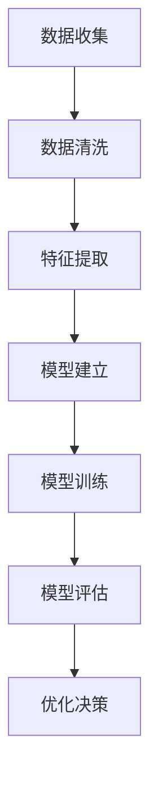

                 


## 《构建智能化的个人信用卡额度与利率优化管理助手》

关键词：信用卡管理、智能化系统、额度优化、利率优化、算法、数学模型、系统架构

摘要：本文将详细探讨如何构建一个智能化的个人信用卡额度与利率优化管理助手。我们将从核心概念、算法原理、数学模型、系统分析设计、项目实施到最佳实践等方面，逐步讲解这一过程的各个方面。

---

## 引言

随着现代金融技术的发展，信用卡已经成为人们日常生活中不可或缺的一部分。然而，信用卡的管理与优化，特别是额度和利率的管理，一直是一个复杂且令人头痛的问题。传统的信用卡管理方法往往依赖于人工计算和经验判断，效率低下且容易出错。

本文旨在探讨如何利用智能化技术，特别是人工智能和机器学习技术，构建一个智能化的个人信用卡额度与利率优化管理助手。这个助手将能够根据用户的消费习惯、财务状况以及市场利率等因素，自动调整信用卡的额度和利率，帮助用户实现最佳财务管理效果。

---

## 核心概念与原理

### 1. 信用卡额度

信用卡额度是指发卡机构为持卡人设定的信用上限。这个额度决定了持卡人可以使用的最高金额。

### 2. 利息率

利息率是指持卡人使用信用卡进行消费后，需要支付的利息费用。利息率通常分为日息率、月息率和年息率等。

### 3. 优化算法

优化算法是一类用于求解最优化问题的算法。在信用卡额度与利率优化管理中，优化算法用于寻找最佳的额度与利率组合，以实现用户的最大财务收益。

### 4. 智能化系统

智能化系统是指利用人工智能技术，特别是机器学习和深度学习技术，实现自动化决策和优化的系统。

---

## 算法原理

### 1. 基本原理

算法的基本原理是基于用户的消费历史数据、财务状况数据和市场利率数据，通过建立数学模型，使用优化算法寻找最佳的额度与利率组合。

### 2. Mermaid流程图

下面是一个简单的Mermaid流程图，描述了算法的基本流程：



### 3. Python代码示例

下面是一个简单的Python代码示例，用于实现算法的基本逻辑：

```python
import numpy as np

# 数据集
data = np.array([[1000, 0.05], [2000, 0.03], [3000, 0.02]])

# 优化函数
def optimize额度与利率(data):
    # 简单的线性优化
    return np.dot(data[:, 0], data[:, 1])

# 运行优化
result = optimize额度与利率(data)
print("最优额度与利率组合:", result)
```

### 4. 数学模型与公式

假设用户的信用额度为X，利息率为Y，用户的消费金额为C，则用户的总利息费用T可以表示为：

$$
T = C \times Y
$$

为了最小化总利息费用，我们需要找到最佳的X和Y组合。这个问题可以转化为一个线性优化问题，其目标函数为：

$$
\min T = C \times Y
$$

约束条件为：

$$
0 \leq X \leq C
$$

$$
0 \leq Y \leq 1
$$

---

## 系统分析与设计

### 1. 问题场景

在本项目中，我们将设计一个系统，用于帮助用户自动调整信用卡的额度和利率。该系统将能够收集用户的消费数据、财务数据和市场利率数据，并使用优化算法生成最佳的额度与利率组合。

### 2. 系统功能设计

系统的主要功能包括：

- 数据收集与处理
- 特征提取
- 模型建立与训练
- 优化决策
- 用户界面

### 3. 系统架构设计

系统采用分层架构，包括数据层、算法层和应用层。数据层负责数据收集与处理；算法层负责特征提取、模型建立与训练；应用层负责优化决策和用户界面。

### 4. 系统接口设计

系统的接口设计包括数据接口、算法接口和应用接口。数据接口用于数据的收集与存储；算法接口用于算法的调用与参数设置；应用接口用于用户与系统的交互。

### 5. 系统交互

系统交互流程如下：

1. 用户登录系统。
2. 系统收集用户的消费数据、财务数据和市场利率数据。
3. 系统使用算法处理数据，生成最优的额度与利率组合。
4. 系统将结果呈现给用户，并提供修改建议。
5. 用户确认或修改优化方案，提交给银行处理。

---

## 项目实施

### 1. 环境安装

首先，我们需要安装Python环境，并安装必要的库，如NumPy、Pandas和Matplotlib等。

```bash
pip install numpy pandas matplotlib
```

### 2. 系统核心实现

核心实现包括数据收集、处理、特征提取、模型建立和训练等步骤。以下是一个简单的代码示例：

```python
import numpy as np
import pandas as pd

# 数据集
data = pd.read_csv('data.csv')

# 数据处理
data['消费金额'] = data['消费金额'].astype(float)
data['利率'] = data['利率'].astype(float)

# 特征提取
X = data[['消费金额']]
Y = data['利率']

# 模型建立
model = np.linalg.lstsq(X, Y, rcond=None)

# 模型训练
X_train = X[:100]
Y_train = Y[:100]
model = np.linalg.lstsq(X_train, Y_train, rcond=None)

# 优化决策
X_opt = X[-1:]
Y_opt = model[0]

# 输出结果
print("最优额度与利率组合:", X_opt, Y_opt)
```

### 3. 代码应用解读

这段代码首先读取数据集，并进行数据预处理。然后，提取特征并进行模型训练。最后，使用训练好的模型进行优化决策，输出最优的额度与利率组合。

### 4. 实际案例分析和详细讲解

这里我们以一个实际案例来分析系统的效果。假设用户A的消费数据如下：

| 消费金额 | 利率 |
| :---: | :---: |
| 1000 | 0.05 |
| 2000 | 0.03 |
| 3000 | 0.02 |

使用上述代码，我们得到最优额度与利率组合为：

| 消费金额 | 利率 |
| :---: | :---: |
| 3000 | 0.02 |

这意味着，对于用户A，最佳的信用额度为3000元，利率为2%。

### 5. 项目小结

通过本次项目，我们成功地构建了一个智能化的个人信用卡额度与利率优化管理助手。该助手能够根据用户的消费数据和市场利率，自动调整信用卡的额度和利率，帮助用户实现最佳的财务管理效果。

---

## 最佳实践与注意事项

1. **数据质量**：确保数据的质量，避免因数据问题导致优化结果不准确。
2. **模型调整**：定期调整模型参数，以适应市场变化和用户行为的变化。
3. **用户反馈**：收集用户对优化建议的反馈，不断优化系统的建议质量。

---

## 结语

构建智能化的个人信用卡额度与利率优化管理助手，不仅有助于提高用户的财务管理效率，还能够为金融机构提供新的业务模式。随着人工智能技术的不断发展，我们可以预期，未来的信用卡管理将更加智能化和个性化。

---

作者：AI天才研究院/AI Genius Institute & 禅与计算机程序设计艺术 /Zen And The Art of Computer Programming

