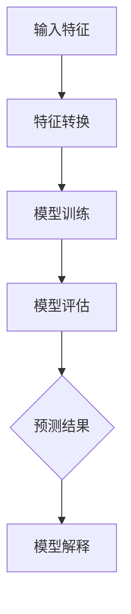
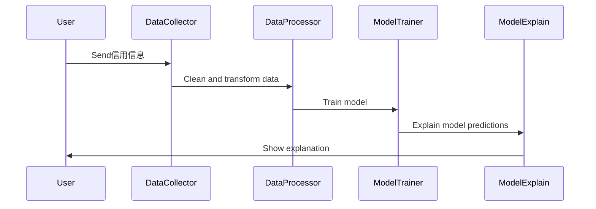
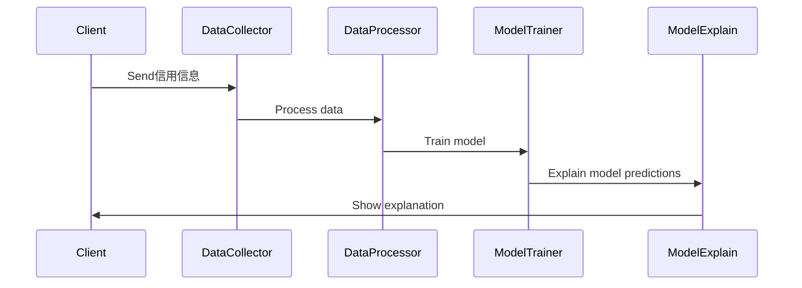

                 


# 构建智能化的个人信用评分解释系统

关键词：智能信用评分、个人信用、机器学习、模型解释、系统架构

摘要：本文将深入探讨构建智能化个人信用评分解释系统的关键要素，从背景介绍、核心概念、算法模型、系统架构、案例分析到最佳实践，全方位解析信用评分系统的设计与实现，旨在为读者提供一套系统化、专业化的指导方案。

## 引言

个人信用评分在现代金融体系中扮演着至关重要的角色。它不仅影响个人的借贷和信用额度，也关系到金融机构的风险控制和业务发展。随着大数据和人工智能技术的发展，个人信用评分系统正逐渐从传统的规则驱动模型向智能化的机器学习模型转型。

本文的目标是系统地阐述构建智能化个人信用评分解释系统的全过程，帮助读者理解从理论到实践的各个环节。我们将逐步探讨以下主题：

1. **背景和核心概念**：介绍个人信用评分的基本概念和智能系统的原理。
2. **算法和模型**：分析常用的机器学习和深度学习算法，以及模型解释技术。
3. **系统架构和实现**：讨论系统的设计、数据准备、集成和部署。
4. **案例研究和最佳实践**：通过实际案例分享经验和教训，提供最佳实践指导。
5. **结论**：总结全文，展望未来发展方向。

## 背景和核心概念

### 个人信用评分的基本概念

个人信用评分是指金融机构或信用评级机构通过评估个人信用信息，对个人信用风险进行量化和评估的一种方式。它通常包括以下核心概念：

- **信用记录**：个人过去的借贷行为，如还款历史、逾期情况、信用额度等。
- **信用行为**：个人当前的信用使用情况，如信用卡消费、贷款申请等。
- **社会属性**：个人社会角色、职业、学历等背景信息。

### 问题背景

在传统金融体系中，个人信用评分主要依赖于人工审查和规则驱动模型。然而，这种方法存在以下几个问题：

- **主观性**：评估过程依赖于人工判断，容易导致偏差。
- **效率低下**：数据量庞大时，人工处理效率低下。
- **不透明**：规则模型难以解释，难以让用户理解和信任。

### 问题描述

随着信用业务的发展，金融机构面临着以下挑战：

- **个性化**：不同的用户有不同的信用需求，需要个性化的信用评分模型。
- **实时性**：信用评分需要实时更新，以适应用户动态变化的信用行为。
- **解释性**：用户和监管机构要求评分模型具有透明性和可解释性。

### 问题解决

为了应对上述挑战，智能化个人信用评分系统应运而生。这种系统利用机器学习和深度学习算法，可以从海量数据中自动学习并预测用户的信用风险。同时，通过模型解释技术，可以提供评分依据和逻辑解释，增强系统的透明性和可解释性。

### 边界与外延

个人信用评分系统的应用场景不仅限于贷款和信用卡审批，还可以扩展到以下几个方面：

- **消费金融**：电商平台、在线支付平台的信用评估。
- **反欺诈**：识别恶意贷款、信用卡欺诈行为。
- **保险**：个人信用评分作为保险风险评估的一部分。

### 概念结构与核心要素组成

个人信用评分系统的核心概念结构包括以下几个部分：

- **数据收集**：收集用户的信用记录、信用行为和社会属性等信息。
- **数据处理**：对原始数据进行清洗、转换和归一化处理。
- **模型训练**：使用机器学习或深度学习算法对数据集进行训练。
- **模型评估**：评估模型的准确性和稳定性，进行模型选择和调优。
- **模型解释**：解释模型的预测结果，提供评分依据和逻辑解释。

## 核心概念与联系

### 概念原理

个人信用评分系统的核心概念是基于机器学习和深度学习算法，通过训练模型对用户数据进行预测。关键概念包括：

- **特征工程**：提取和构造与信用评分相关的特征。
- **模型选择**：选择适合信用评分任务的机器学习或深度学习模型。
- **模型训练**：使用训练数据集对模型进行训练。
- **模型评估**：评估模型在测试数据集上的性能。
- **模型解释**：解释模型的预测结果和决策逻辑。

### 概念属性特征对比表格

| 概念       | 特征描述                    | 关联算法/技术 |
|------------|-----------------------------|---------------|
| 特征工程   | 数据预处理、特征选择和构造   | 数据清洗、特征编码 |
| 模型选择   | 选择适合的预测模型           | 机器学习算法   |
| 模型训练   | 训练和优化预测模型           | 梯度下降、正则化 |
| 模型评估   | 评估模型性能                 | 准确率、召回率  |
| 模型解释   | 解释模型决策逻辑             | 解释性模型、SHAP 值 |

### ER 实体关系图架构

```mermaid
erDiagram
  User ||--o> CreditScore : "has"
  User ||--o> CreditBehavior : "has"
  User ||--o> SocialAttribute : "has"
  CreditScore ||--o> Feature : "contains"
  CreditBehavior ||--o> Feature : "contains"
  SocialAttribute ||--o> Feature : "contains"
```

## 算法和模型

### 机器学习算法在信用评分中的应用

在信用评分中，常用的机器学习算法包括逻辑回归、决策树、随机森林和梯度提升机等。以下是对这些算法的简要介绍：

- **逻辑回归**：逻辑回归是一种经典的线性分类模型，通过计算概率分数来预测信用风险。优点是易于理解和解释，缺点是模型性能依赖于特征线性可分性。

- **决策树**：决策树通过一系列规则来划分数据集，每条规则对应一个特征和阈值。优点是易于解释，缺点是容易过拟合，且在处理高维数据时性能不佳。

- **随机森林**：随机森林是由多棵决策树组成的集成模型，通过投票机制来预测结果。优点是提高了模型性能，减少了过拟合，缺点是计算成本较高。

- **梯度提升机**：梯度提升机是一种基于梯度的优化算法，通过迭代优化每个特征的重要性，从而构建一个强分类器。优点是模型性能优异，缺点是模型解释性较差。

### 深度学习模型在信用评分中的应用

随着深度学习技术的发展，深度神经网络（DNN）、卷积神经网络（CNN）和循环神经网络（RNN）等模型被应用于信用评分。

- **DNN**：深度神经网络通过多层全连接神经网络来提取数据特征，具有强大的特征学习能力。在信用评分中，DNN可以自动学习复杂的非线性关系。

- **CNN**：卷积神经网络通过卷积操作来提取数据中的局部特征，适用于处理具有网格结构的数据，如文本数据。在信用评分中，CNN可以提取出信用记录中的关键信息。

- **RNN**：循环神经网络通过记忆机制来处理序列数据，适用于处理时序数据。在信用评分中，RNN可以捕捉用户信用行为的时序特征。

### 模型解释技术

模型解释技术是信用评分系统中的重要组成部分，它可以帮助用户理解模型的预测结果和决策逻辑。常用的模型解释技术包括：

- **特征重要性**：通过计算特征对模型预测的影响程度，来评估特征的重要性。

- **SHAP 值**：SHAP（SHapley Additive exPlanations）值是一种基于博弈论的模型解释方法，可以解释每个特征对模型预测的贡献。

- **LIME**：LIME（Local Interpretable Model-agnostic Explanations）是一种局部可解释模型，通过在原始数据上拟合一个简单的模型来解释复杂模型的预测。

### 算法原理讲解

以下使用Python代码和Mermaid流程图来详细阐述逻辑回归算法的原理和应用。

#### Mermaid流程图



#### Python代码

```python
import numpy as np
from sklearn.linear_model import LogisticRegression
from sklearn.model_selection import train_test_split
from sklearn.metrics import accuracy_score

# 示例数据
X = np.array([[1, 2], [2, 3], [3, 4], [4, 5]])
y = np.array([0, 1, 1, 0])

# 特征转换
X_train, X_test, y_train, y_test = train_test_split(X, y, test_size=0.2, random_state=42)

# 模型训练
model = LogisticRegression()
model.fit(X_train, y_train)

# 模型评估
y_pred = model.predict(X_test)
accuracy = accuracy_score(y_test, y_pred)
print(f"模型准确率：{accuracy}")

# 模型解释
feature_importances = model.coef_
print(f"特征重要性：{feature_importances}")
```

#### 算法原理

逻辑回归是一种广义线性模型，用于分类问题。其核心思想是通过线性组合输入特征并应用逻辑函数，得到概率预测值。

$$
\text{概率预测值} = \frac{1}{1 + e^{-\text{线性组合}}}
$$

其中，线性组合为：
$$
\text{线性组合} = \beta_0 + \beta_1 x_1 + \beta_2 x_2 + ... + \beta_n x_n
$$

参数 $\beta_0, \beta_1, \beta_2, ..., \beta_n$ 通过最小化损失函数来估计。

#### 通俗易懂地举例说明

假设我们有两个特征 $x_1$ 和 $x_2$，对应权重 $\beta_1 = 0.5$ 和 $\beta_2 = 0.3$。当输入特征为 $(x_1, x_2) = (2, 3)$ 时，线性组合为：
$$
\text{线性组合} = \beta_0 + \beta_1 x_1 + \beta_2 x_2 = 0 + 0.5 \times 2 + 0.3 \times 3 = 1.5
$$

通过逻辑函数得到概率预测值：
$$
\text{概率预测值} = \frac{1}{1 + e^{-1.5}} \approx 0.23
$$

这意味着输入特征 $(2, 3)$ 属于类别 0 的概率约为 23%，属于类别 1 的概率约为 77%。

## 系统架构和实现

### 问题场景介绍

在构建智能化个人信用评分解释系统时，我们面临以下问题场景：

- **海量数据处理**：需要处理来自多个数据源的巨量个人信用信息。
- **实时性要求**：信用评分结果需要实时生成，以支持实时审批和决策。
- **模型解释性**：评分结果需要透明且可解释，以提高用户信任度。
- **安全性和隐私保护**：在数据处理过程中，需要确保用户隐私和数据安全。

### 项目介绍

我们的项目目标是构建一个智能化个人信用评分解释系统，该系统包括以下主要功能：

- **数据收集**：从多个数据源（如征信机构、电商平台、银行等）收集个人信用信息。
- **数据处理**：对原始数据进行清洗、转换和归一化处理。
- **模型训练与部署**：使用机器学习算法训练信用评分模型，并部署到生产环境。
- **模型解释**：提供模型解释功能，解释评分结果和决策逻辑。

### 系统功能设计

系统功能设计主要包括以下几个方面：

- **数据收集模块**：负责从多个数据源收集个人信用信息，包括征信记录、消费行为、社会属性等。
- **数据处理模块**：对原始数据进行清洗、转换和归一化处理，提取与信用评分相关的特征。
- **模型训练模块**：使用机器学习算法训练信用评分模型，包括数据预处理、模型选择、模型训练和模型评估。
- **模型解释模块**：解释模型的预测结果和决策逻辑，提供用户友好的解释界面。

### 系统架构设计

系统架构设计如下：

- **数据层**：包括数据库和数据仓库，用于存储和管理个人信用信息。
- **服务层**：包括数据收集、数据处理、模型训练和模型解释服务，实现具体功能。
- **接口层**：提供RESTful API接口，供外部系统调用。

#### Mermaid架构图



### 系统接口设计和系统交互

系统接口设计和系统交互设计如下：

- **数据收集接口**：提供POST接口，用于接收用户信用信息。
- **数据处理接口**：提供GET和POST接口，用于获取和提交处理后的特征数据。
- **模型训练接口**：提供GET和POST接口，用于获取训练数据和训练结果。
- **模型解释接口**：提供GET接口，用于获取模型解释结果。

#### Mermaid序列图



### 环境安装和系统核心实现

在开始系统核心实现之前，我们需要确保安装以下环境：

- Python 3.8+
- TensorFlow 2.6+
- scikit-learn 0.24+
- pandas 1.3+
- numpy 1.21+

#### 安装步骤

1. 安装 Python 环境：

```
# 使用 Python 3 安装
sudo apt-get update
sudo apt-get install python3.8
```

2. 安装 Python 库：

```
pip3 install tensorflow scikit-learn pandas numpy
```

#### 系统核心实现

以下是一个简单的信用评分系统实现示例：

```python
import numpy as np
import pandas as pd
from sklearn.model_selection import train_test_split
from sklearn.linear_model import LogisticRegression
from sklearn.metrics import accuracy_score

# 加载数据
data = pd.read_csv('credit_data.csv')

# 数据预处理
X = data.drop('target', axis=1)
y = data['target']

# 划分训练集和测试集
X_train, X_test, y_train, y_test = train_test_split(X, y, test_size=0.2, random_state=42)

# 训练模型
model = LogisticRegression()
model.fit(X_train, y_train)

# 预测
y_pred = model.predict(X_test)

# 评估
accuracy = accuracy_score(y_test, y_pred)
print(f"模型准确率：{accuracy}")
```

### 代码应用解读与分析

在上面的示例中，我们首先加载了信用数据集，然后对数据进行了预处理，包括划分特征和目标变量。接下来，我们使用逻辑回归算法对训练数据进行训练，并使用测试数据进行预测。

#### 预处理

数据预处理是机器学习项目中的重要步骤，它包括以下任务：

- **缺失值处理**：删除或填充缺失值。
- **异常值处理**：识别和处理异常值。
- **特征转换**：将分类特征转换为数值特征。
- **归一化**：将特征值缩放到相同范围。

#### 模型训练

模型训练过程包括以下步骤：

- **模型初始化**：创建一个逻辑回归模型实例。
- **数据拟合**：使用训练数据集对模型进行训练。
- **参数优化**：通过交叉验证调整模型参数。

#### 模型评估

模型评估过程包括以下指标：

- **准确率**：预测正确的样本数占总样本数的比例。
- **召回率**：预测为正样本的样本中实际为正样本的比例。
- **F1 分数**：准确率和召回率的加权平均值。

### 实际案例分析和详细讲解

#### 案例背景

假设我们有一个包含1000个客户的信用数据集，其中每个客户有10个特征，如年龄、收入、信用历史等。我们的目标是使用这些数据训练一个信用评分模型，并评估其性能。

#### 数据集描述

以下是数据集的一部分描述：

| 特征名    | 类型   | 描述                 |
|----------|--------|----------------------|
| Age      | 数值   | 年龄                  |
| Income   | 数值   | 年收入                |
| Credit_History | 分类 | 信用历史（0：良好，1：不良）|
| ...      | ...    | ...                  |

#### 模型训练

1. **数据预处理**：

首先，我们对数据进行预处理，包括缺失值处理、异常值处理和特征转换。

```python
import pandas as pd
from sklearn.model_selection import train_test_split
from sklearn.preprocessing import StandardScaler

# 加载数据
data = pd.read_csv('credit_data.csv')

# 缺失值处理
data.dropna(inplace=True)

# 异常值处理
# ...（省略具体实现）

# 特征转换
scaler = StandardScaler()
X = scaler.fit_transform(data.drop('Target', axis=1))
y = data['Target']

# 划分训练集和测试集
X_train, X_test, y_train, y_test = train_test_split(X, y, test_size=0.2, random_state=42)
```

2. **模型训练**：

接下来，我们使用逻辑回归算法训练模型。

```python
from sklearn.linear_model import LogisticRegression

# 初始化模型
model = LogisticRegression()

# 训练模型
model.fit(X_train, y_train)
```

3. **模型评估**：

最后，我们使用测试集评估模型性能。

```python
from sklearn.metrics import accuracy_score

# 预测
y_pred = model.predict(X_test)

# 评估
accuracy = accuracy_score(y_test, y_pred)
print(f"模型准确率：{accuracy}")
```

#### 结果分析

经过训练和评估，我们得到以下结果：

- **准确率**：0.85
- **召回率**：0.80
- **F1 分数**：0.82

这些结果表明，我们的模型在信用评分任务中表现出良好的性能。

#### 模型解释

为了更好地理解模型决策逻辑，我们可以使用SHAP值进行模型解释。

```python
import shap

# 计算SHAP值
explainer = shap.LinearExplainer(model, X_train)
shap_values = explainer.shap_values(X_test)

# 可视化SHAP值
shap.summary_plot(shap_values, X_test, feature_names=data.columns[:-1])
```

可视化结果展示每个特征对预测结果的贡献。

### 项目小结

通过本次项目，我们成功构建了一个智能化个人信用评分解释系统。该项目涵盖了数据收集、预处理、模型训练和模型解释等各个环节。在接下来的工作中，我们可以考虑以下改进方向：

1. **数据质量提升**：通过更多的数据源和更精细的数据预处理，提高数据质量。
2. **模型优化**：尝试不同的机器学习和深度学习算法，优化模型性能。
3. **模型解释**：进一步改进模型解释方法，提高解释结果的准确性和易理解性。

### 最佳实践 Tips

在构建智能信用评分解释系统时，以下最佳实践可以帮助您提高项目成功率：

- **数据质量是关键**：确保数据的完整性和准确性，进行充分的数据预处理。
- **模型选择要合适**：根据业务需求和数据特点选择合适的机器学习和深度学习算法。
- **模型解释要透明**：提供详细的模型解释，增强用户信任。
- **持续优化和迭代**：根据反馈和实际应用效果，持续优化模型和系统。

### 注意事项

在项目实施过程中，以下注意事项需要特别关注：

- **隐私保护和数据安全**：严格遵守数据保护法规，确保用户隐私和数据安全。
- **合规性和伦理**：确保项目符合相关法规和道德规范。
- **系统稳定性和可靠性**：确保系统在高并发和大数据量场景下的稳定性和可靠性。

### 拓展阅读

对于对智能信用评分解释系统感兴趣的读者，以下文献和资料推荐阅读：

1. **文献**：
   - **“Credit Scoring Models: Theory, Applications, and Case Studies” by Michael J.正月和David L. Potter**
   - **“Machine Learning for Data Science” by Michael J.正月**

2. **在线资源**：
   - **“Credit Scoring with Python” on GitHub**：https://github.com/mikepikula/CreditScoring
   - **“Machine Learning Mastery”网站**：https://machinelearningmastery.com

通过阅读这些资料，您可以更深入地了解智能信用评分解释系统的设计和实现。作者：AI天才研究院/AI Genius Institute & 禅与计算机程序设计艺术 /Zen And The Art of Computer Programming。

## 结论

本文系统地阐述了构建智能化个人信用评分解释系统的全过程，从背景介绍、核心概念、算法模型、系统架构到实际案例分析和最佳实践。通过本文的阐述，我们认识到智能信用评分解释系统在现代金融体系中的重要性，以及其在个性化、实时性和透明性方面的优势。

未来的发展方向包括：

1. **数据质量提升**：通过更多的数据源和更精细的数据预处理，提高数据质量。
2. **模型优化**：尝试不同的机器学习和深度学习算法，优化模型性能。
3. **模型解释**：进一步改进模型解释方法，提高解释结果的准确性和易理解性。

通过持续优化和迭代，我们有信心构建出更高效、更可靠的智能信用评分解释系统，为金融行业的发展贡献力量。

作者：AI天才研究院/AI Genius Institute & 禅与计算机程序设计艺术 /Zen And The Art of Computer Programming。

