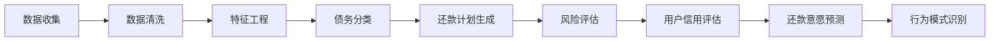
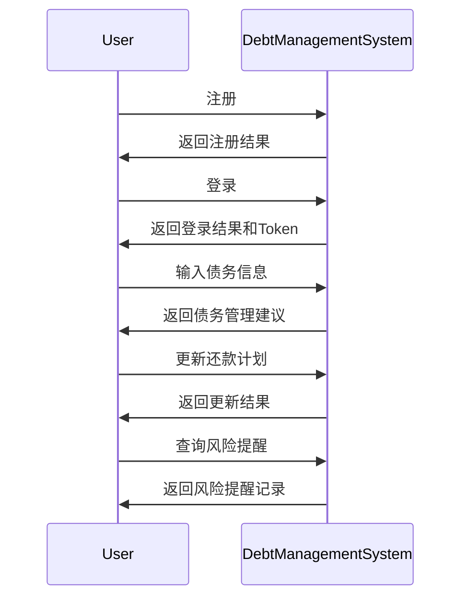
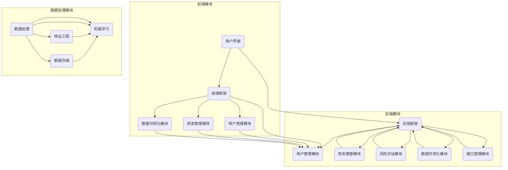
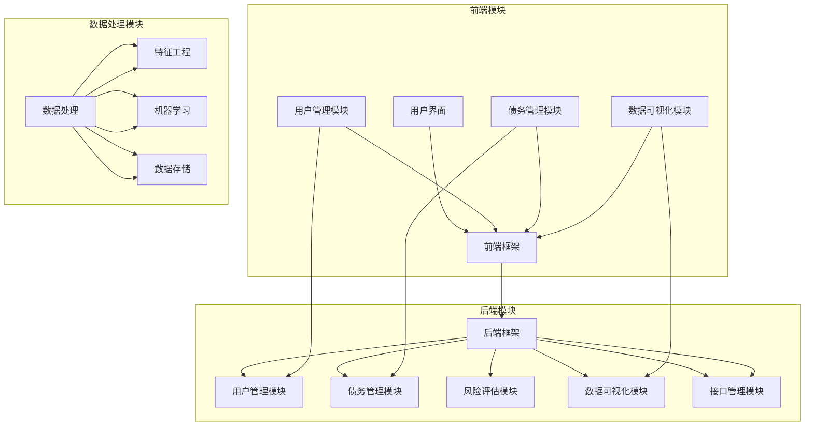

                 

# 构建智能化的个人债务管理助手

## 关键词

- 个人债务管理
- 智能化
- 数据挖掘
- 机器学习
- 用户体验

## 摘要

本文旨在探讨如何构建智能化的个人债务管理助手，以解决当前个人债务管理中面临的问题。文章首先介绍了个人债务管理的现状、难点及智能化债务管理的潜力。接着，详细阐述了核心概念、ER实体关系图架构，并使用mermaid绘制了相关流程图。随后，讲解了算法原理，包括数据挖掘与机器学习、自然语言处理、优化算法等，并使用Python源代码进行了详细解释。接着，分析了系统架构设计，包括问题场景、系统功能、系统架构、系统接口设计及系统交互流程。最后，通过实际案例分析和项目小结，总结了项目的成功经验和不足之处，并提出了最佳实践和拓展阅读建议。

### 目录大纲：构建智能化的个人债务管理助手

----------------------------------------------------------------

## 第一部分：背景介绍

### 第1章：问题背景与问题描述

- **1.1.1 个人债务管理的现状**

  - 当前个人债务管理面临的问题

  - 债务管理的重要性与必要性

- **1.1.2 个人债务管理的难点**

  - 信息不对称

  - 管理复杂性

  - 心理因素

- **1.1.3 智能化债务管理的潜力**

  - 技术发展的推动作用

  - 提高效率与降低成本

  - 提升用户体验

### 第2章：核心概念与联系

- **2.1.1 债务管理基本概念**

  - 债务种类

  - 债务偿还方式

  - 利率计算方法

- **2.1.2 智能化技术相关概念**

  - 数据挖掘与机器学习

  - 人工智能在金融领域的应用

  - 自然语言处理

- **2.1.3 概念属性特征对比表格**

  - 传统债务管理与智能化债务管理对比

### 第3章：ER实体关系图架构

- **3.1.1 实体识别**

  - 个人信息

  - 负债信息

  - 收入信息

- **3.1.2 关系定义**

  - 债务关系

  - 还款计划关系

  - 收入支出关系

- **3.1.3 ER实体关系图**

  - ER图绘制（使用Mermaid语法）

## 第二部分：算法原理讲解

### 第4章：算法原理概述

- **4.1.1 算法选择**

  - 数据分析算法

  - 优化算法

  - 预测算法

- **4.1.2 算法原理**

  - 数据处理流程

  - 债务管理策略

  - 用户行为预测

### 第5章：算法mermaid流程图

- **5.1.1 数据收集与预处理**

  - 数据来源

  - 数据清洗

  - 特征工程

- **5.1.2 债务管理策略**

  - 债务分类

  - 偿还计划生成

  - 风险评估

- **5.1.3 用户行为预测**

  - 用户信用评估

  - 还款意愿预测

  - 行为模式识别

### 第6章：算法原理详细讲解

- **6.1.1 数据挖掘与机器学习**

  - 特征选择方法

  - 模型训练与评估

  - 实际案例解析

- **6.1.2 自然语言处理**

  - 债务描述解析

  - 语言模型应用

  - 语义理解与情感分析

- **6.1.3 优化算法**

  - 数学模型与公式

  - 算法实现细节

  - 案例分析

## 第三部分：系统分析与架构设计

### 第7章：问题场景介绍

- **7.1.1 个人债务管理场景**

  - 用户需求

  - 业务流程

### 第8章：项目介绍

- **8.1.1 项目目标**

  - 建立智能化的债务管理平台

  - 提供个性化债务管理建议

- **8.1.2 系统功能设计**

  - 用户管理模块

  - 债务管理模块

  - 风险评估模块

### 第9章：系统架构设计

- **9.1.1 系统架构图**

  - 架构描述

  - 技术选型

- **9.1.2 系统接口设计**

  - 接口规范

  - 安全措施

- **9.1.3 系统交互mermaid序列图**

  - 用户与系统交互流程

## 第四部分：项目实战

### 第10章：环境安装

- **10.1.1 硬件要求**

  - 操作系统

  - 处理器

  - 内存

- **10.1.2 软件安装**

  - 开发环境

  - 第三方库安装

### 第11章：系统核心实现

- **11.1.1 前端实现**

  - 用户界面设计

  - 响应式布局

- **11.1.2 后端实现**

  - API接口开发

  - 数据库设计

- **11.1.3 算法实现**

  - 数据处理

  - 模型训练

  - 预测与评估

### 第12章：代码应用解读与分析

- **12.1.1 代码解析**

  - 源代码解读

  - 功能说明

- **12.1.2 分析与优化**

  - 性能分析

  - 调试与优化

### 第13章：实际案例分析与详细讲解

- **13.1.1 案例背景**

  - 用户债务情况

  - 智能化建议

- **13.1.2 分析与讲解**

  - 债务管理策略

  - 用户行为预测

  - 实际效果评估

### 第14章：项目小结

- **14.1.1 项目总结**

  - 成功经验

  - 不足与改进

- **14.1.2 拓展应用**

  - 领域拓展

  - 技术优化

----------------------------------------------------------------

### 第一部分：背景介绍

## 第1章：问题背景与问题描述

### 1.1.1 个人债务管理的现状

个人债务管理是现代经济生活中一个重要的组成部分。随着消费观念的转变和信用消费的普及，越来越多的个人和家庭的债务负担逐渐加重。据相关数据统计，全球范围内的个人债务总额逐年增长，尤其是在一些发达国家，个人债务占GDP的比重逐渐上升。这种趋势不仅反映了社会消费水平的提高，也暴露出个人债务管理的紧迫性和重要性。

当前，个人债务管理面临的问题主要体现在以下几个方面：

1. **信息不对称**：个人债务信息分散，难以全面掌握，导致债务管理效率低下。
2. **管理复杂性**：个人债务种类繁多，还款方式各异，加上利率的计算和债务重组等复杂操作，使得债务管理过程繁琐。
3. **心理因素**：个人在面对债务时，往往会产生焦虑、恐惧等心理负担，影响债务管理的决策。

### 1.1.2 债务管理的重要性与必要性

债务管理的重要性体现在以下几个方面：

1. **财务健康**：有效的债务管理可以帮助个人维持财务健康，避免因债务问题导致的财务危机。
2. **信用评分**：良好的债务管理记录有助于提高个人信用评分，为未来的贷款和信用活动提供便利。
3. **生活品质**：债务管理得当，可以减轻个人经济压力，提高生活质量。

在当前经济环境下，个人债务管理显得尤为必要。一方面，随着金融科技的发展，智能化债务管理工具的出现为个人债务管理提供了新的解决方案。另一方面，智能化债务管理助手可以有效解决传统债务管理中存在的问题，提高管理效率和用户体验。

### 1.1.3 个人债务管理的难点

个人债务管理中的难点主要包括以下几个方面：

1. **信息不对称**：个人债务信息分散，缺乏统一的债务管理平台，导致债务信息难以全面掌握。例如，个人可能同时拥有多种债务，包括信用卡债务、房贷、车贷等，这些信息往往分布在不同的金融机构中。

2. **管理复杂性**：个人债务种类繁多，还款方式各异，使得债务管理过程变得复杂。例如，不同类型的债务可能具有不同的还款期限、利率和还款方式，这需要个人具备一定的金融知识和计算能力才能进行有效的管理。

3. **心理因素**：个人在面对债务时，往往会产生焦虑、恐惧等心理负担。这种心理因素可能会影响个人对债务管理的决策，导致债务问题进一步恶化。

### 1.1.4 智能化债务管理的潜力

智能化债务管理具有巨大的潜力，主要体现在以下几个方面：

1. **技术发展的推动作用**：随着人工智能、大数据、云计算等技术的发展，智能化债务管理工具逐渐成熟。这些技术可以帮助个人全面掌握债务信息，提供个性化的债务管理建议，提高管理效率和用户体验。

2. **提高效率与降低成本**：智能化债务管理可以通过自动化处理债务信息，减少人工干预，从而提高管理效率。此外，通过数据分析和机器学习，可以识别出潜在的风险，提前采取措施，降低债务管理的成本。

3. **提升用户体验**：智能化债务管理助手可以提供直观、易用的界面，让用户轻松管理债务。同时，通过个性化建议和实时提醒，帮助用户更好地控制债务，提高生活品质。

总的来说，智能化债务管理不仅能够解决传统债务管理中的问题，还能够为个人提供更加高效、便捷、智能化的债务管理服务。随着技术的不断进步，智能化债务管理的潜力将越来越大，有望成为个人财务管理的重要工具。

### 1.1.5 智能化债务管理的优势

智能化债务管理相比传统债务管理具有多方面的优势，主要体现在以下几个方面：

1. **自动化处理**：智能化债务管理工具可以通过自动化技术，如数据挖掘和机器学习，自动收集、整理和分析用户的债务信息。这样可以大大减少人工干预，提高债务管理的效率。

2. **个性化建议**：通过分析用户的债务情况，智能化债务管理工具可以提供个性化的债务管理建议。例如，根据用户的还款能力，建议优先偿还高利率的债务，或者调整还款计划，以减轻用户的经济负担。

3. **实时监控**：智能化债务管理工具可以实时监控用户的债务情况，及时发现潜在的风险，并提前发出警告。这样可以帮助用户在债务问题出现之前采取措施，避免债务违约。

4. **智能预测**：通过机器学习算法，智能化债务管理工具可以预测用户的未来收入和支出情况，为用户的债务管理提供更加科学的依据。例如，根据用户的收入波动情况，调整还款计划，确保用户能够按时还款。

5. **用户体验**：智能化债务管理工具通常具有用户友好的界面设计，操作简便，用户可以轻松地进行债务管理。同时，通过语音识别、自然语言处理等技术，用户还可以与债务管理工具进行自然交互，提升使用体验。

总的来说，智能化债务管理不仅能够提高债务管理的效率和准确性，还能够提升用户的体验，为用户带来更加便捷和智能化的债务管理服务。随着技术的不断进步，智能化债务管理的优势将更加明显，有望成为未来个人财务管理的标准配置。

### 1.2 智能化技术相关概念

智能化债务管理的实现离不开一系列技术支撑，以下将介绍与智能化债务管理密切相关的技术概念：

1. **数据挖掘与机器学习**：

   数据挖掘是一种从大量数据中提取有价值信息的过程，其核心目的是发现数据中的隐含模式或知识。在债务管理中，数据挖掘技术可以用于分析用户的财务行为、消费习惯和债务模式，帮助识别潜在的信用风险。

   机器学习是数据挖掘的一个重要分支，它通过构建模型，使计算机能够从数据中学习并做出预测。在债务管理中，机器学习算法可以用于预测用户的还款能力、识别欺诈行为、优化还款计划等。

2. **人工智能在金融领域的应用**：

   人工智能（AI）在金融领域的应用非常广泛，包括自动化交易、风险控制、信用评分等。在债务管理中，AI可以帮助自动化债务评估和还款计划生成，提高债务管理的效率和准确性。

3. **自然语言处理**：

   自然语言处理（NLP）是人工智能的一个分支，它专注于使计算机能够理解、解释和生成人类语言。在债务管理中，NLP技术可以用于解析用户的债务描述、理解用户需求、生成个性化的债务管理建议。

### 1.3 概念属性特征对比表格

为了更好地理解传统债务管理与智能化债务管理的区别，以下是一个对比表格，列出了两种债务管理方式的属性特征：

| 特征             | 传统债务管理 | 智能化债务管理 |
|------------------|--------------|----------------|
| **信息处理方式** | 手动处理     | 自动处理       |
| **效率**         | 低效         | 高效           |
| **准确性**       | 易出错       | 高准确度       |
| **用户体验**     | 繁琐         | 简便           |
| **个性化建议**   | 有限         | 高度个性化     |
| **风险管理**     | 实时性较差   | 实时监控       |

通过这个对比表格可以看出，智能化债务管理在信息处理方式、效率、准确性、用户体验、个性化建议和风险管理等方面相比传统债务管理具有显著的优势。

### 1.4 智能化债务管理的基本架构

智能化债务管理的基本架构包括以下几个关键组成部分：

1. **数据收集模块**：负责收集用户的债务信息、收入情况、支出情况等数据。这些数据可以通过用户输入、API接口、第三方数据源等方式获取。

2. **数据处理模块**：负责对收集到的数据进行清洗、预处理和特征工程，以构建适合模型训练的数据集。

3. **算法模块**：包括数据挖掘、机器学习、自然语言处理等算法，用于分析债务信息、生成还款计划、预测还款能力等。

4. **用户界面模块**：提供用户友好的界面，让用户可以方便地输入债务信息、查看还款计划、接收个性化建议等。

5. **反馈机制模块**：通过用户反馈和行为分析，不断优化债务管理算法和用户界面，提高系统的适应性和用户体验。

通过这个基本架构，智能化债务管理可以实现对用户债务的全方位管理，提供高效、准确、个性化的债务管理服务。

### 1.5 智能化债务管理的具体实施步骤

要构建一个智能化的个人债务管理助手，需要遵循以下具体实施步骤：

1. **需求分析**：首先，对用户的需求进行详细分析，确定债务管理的核心功能，例如债务信息录入、还款计划生成、风险评估等。

2. **数据收集**：通过多种途径收集用户债务信息，包括用户输入、API接口、第三方数据源等。确保数据的准确性和完整性。

3. **数据预处理**：对收集到的数据进行清洗、去重、缺失值填充等预处理操作，为后续的模型训练做准备。

4. **特征工程**：根据债务管理的具体需求，提取和构建有助于模型训练的特征。例如，债务金额、还款期限、利率等。

5. **模型训练**：选择合适的数据挖掘和机器学习算法，对预处理后的数据进行模型训练。常见的算法包括线性回归、决策树、随机森林、支持向量机等。

6. **模型评估**：通过交叉验证、AUC、ROC等评估指标，对模型的性能进行评估和调优。

7. **用户界面设计**：设计用户友好的界面，提供便捷的操作方式，让用户可以轻松地管理债务。界面应具备实时数据展示、历史记录查询、个性化建议等功能。

8. **系统集成**：将前端用户界面、后端数据处理和算法模块整合在一起，确保系统的稳定运行和高效的交互。

9. **测试与部署**：对系统进行全面的测试，包括功能测试、性能测试、安全测试等，确保系统无故障上线。

10. **持续优化**：通过用户反馈和行为分析，不断优化算法和用户界面，提升系统的用户体验和债务管理效果。

### 1.6 智能化债务管理工具的优势和挑战

智能化债务管理工具的优势和挑战如下：

#### 优势

1. **自动化处理**：通过数据挖掘和机器学习算法，可以自动处理大量的债务信息，提高债务管理的效率。

2. **个性化建议**：基于用户的行为数据和财务状况，提供个性化的债务管理建议，帮助用户优化还款计划。

3. **实时监控**：能够实时监控用户的债务情况，及时识别风险，提供预警和建议。

4. **用户体验**：用户友好的界面设计，操作简便，提高用户的使用体验。

5. **风险管理**：通过预测算法和风险评估模型，提前识别潜在的风险，降低债务违约的概率。

#### 挑战

1. **数据隐私**：个人债务信息属于敏感数据，需要确保数据的安全和隐私保护。

2. **技术挑战**：构建一个高效、准确的债务管理模型需要大量的技术和专业知识，包括数据挖掘、机器学习、自然语言处理等。

3. **法律合规**：需要遵守相关的法律法规，确保债务管理工具的合法性和合规性。

4. **用户接受度**：需要让用户意识到智能化债务管理工具的价值，提高用户的接受度和使用频率。

### 第一部分：背景介绍

## 第3章：ER实体关系图架构

### 3.1.1 实体识别

在构建智能化个人债务管理助手时，首先要识别出系统中涉及的实体，这些实体包括：

1. **个人信息**：包括用户的基本信息，如姓名、身份证号、联系方式等。
2. **负债信息**：包括用户的各种债务，如信用卡债务、房贷、车贷等，具体字段可能包括债务金额、还款期限、还款方式、利率等。
3. **收入信息**：包括用户的收入来源和金额，如工资、投资收益、其他收入等。

这些实体构成了债务管理系统的核心组成部分，是构建后续功能模块的基础。

### 3.1.2 关系定义

在债务管理系统中，实体之间的关系定义是至关重要的。以下是主要的关系定义：

1. **债务关系**：表示个人与负债之间的关系。每个用户可以有多种债务，每种债务与一个用户关联。
2. **还款计划关系**：表示债务与还款计划之间的关系。每种债务可以有多个还款计划，每个还款计划对应一种债务。
3. **收入支出关系**：表示用户的收入与支出之间的关系。用户的收入和支出可以有多种，每种收入或支出与一个用户关联。

通过定义这些关系，可以清晰地描述系统中的数据关联，为后续的数据处理和算法应用提供基础。

### 3.1.3 ER实体关系图

为了更好地理解和描述债务管理系统的实体关系，我们可以使用ER（Entity-Relationship）图来表示。以下是ER图的基本结构，使用Mermaid语法进行绘制：

```mermaid
erDiagram
    User ..|> Debt : "有多个"
    Debt ..|> RepaymentPlan : "有多个"
    User ..|> Income : "有多个"
    User ..|> Expense : "有多个"
    Income ||--|| Expense
```

在这个ER图中：

- **User**（用户）是系统的核心实体，与**Debt**（债务）、**Income**（收入）和**Expense**（支出）之间存在多对多的关系。
- **Debt**（债务）与**RepaymentPlan**（还款计划）之间存在一对多的关系，即每种债务可以有多个还款计划。
- **Income**（收入）与**Expense**（支出）之间存在一对一的关系，即每种收入对应一种支出。

通过这个ER图，我们可以清晰地了解系统中的数据关系，为后续的数据库设计和数据处理提供参考。

### 第一部分：背景介绍

## 第4章：核心概念与联系

### 4.1.1 债务管理基本概念

债务管理是指个人或企业通过各种方法和管理工具来合理地安排和管理债务，以确保财务健康和稳定。以下是债务管理中的几个核心概念：

#### 1. 债务种类

- **贷款**：银行或其他金融机构提供的资金，通常需要偿还本金和利息。
- **信用卡债务**：使用信用卡消费所产生的未偿还金额。
- **抵押贷款**：以房产或其他资产作为抵押的贷款。
- **消费贷款**：用于购买商品或服务的短期贷款。

#### 2. 债务偿还方式

- **分期偿还**：将债务本金和利息分摊到多个还款周期中。
- **一次性偿还**：在到期日一次性偿还债务本金和利息。
- **滚息偿还**：仅偿还利息，本金到期时一次性偿还。

#### 3. 利率计算方法

- **固定利率**：在整个贷款期限内，利率保持不变。
- **浮动利率**：利率根据市场利率的变化而调整。
- **复利**：利息不仅计算在当前本金上，还计算在上期利息上。

### 4.1.2 智能化技术相关概念

智能化债务管理离不开先进技术的支持，以下是几个关键概念：

#### 1. 数据挖掘与机器学习

- **数据挖掘**：从大量数据中提取有价值的信息和模式，用于债务风险评估和管理。
- **机器学习**：通过训练模型，使计算机能够自动识别债务模式、预测还款能力和优化还款计划。

#### 2. 人工智能在金融领域的应用

- **智能顾问**：利用AI技术，为用户提供个性化的财务建议和债务管理方案。
- **自动化决策**：基于大数据分析，自动化处理债务评估、贷款审批等流程。

#### 3. 自然语言处理

- **情感分析**：分析用户债务描述中的情感倾向，帮助识别潜在的债务问题。
- **语音识别**：将用户的语音指令转化为文本，实现智能交互。

### 4.1.3 概念属性特征对比表格

为了更好地理解传统债务管理与智能化债务管理的区别，以下是两者的概念属性特征对比表格：

| 特征             | 传统债务管理       | 智能化债务管理           |
|------------------|--------------------|-------------------------|
| **债务信息处理** | 手动记录和计算     | 自动化处理和数据挖掘     |
| **利率计算方式** | 简单固定利率计算   | 复杂利率模型和动态调整   |
| **风险识别**     | 人工经验判断       | 机器学习模型预测和评估   |
| **用户体验**     | 依赖人工和文档     | 用户友好的界面和个性化建议 |
| **响应速度**     | 较慢的更新周期     | 实时数据更新和反馈       |

通过这个对比表格，我们可以看到智能化债务管理在数据处理、风险识别、用户体验和响应速度等方面具有显著的优势。

### 第一部分：背景介绍

## 第5章：算法原理讲解

### 4.1.1 算法选择

构建智能化债务管理助手需要选择合适的算法，以满足数据分析和决策支持的需求。以下是几种常用的算法类型及其适用场景：

1. **数据分析算法**：

   - **描述性统计**：用于描述数据的分布和特征，如均值、方差、相关性等。
   - **聚类分析**：将相似的数据点归为一类，用于发现数据中的模式和群组。
   - **关联规则挖掘**：发现数据之间的关联关系，用于推荐系统等。

2. **优化算法**：

   - **线性规划**：用于优化线性目标函数，适用于债务组合优化和还款计划制定。
   - **动态规划**：通过递归关系解决多阶段决策问题，适用于长期还款计划的优化。

3. **预测算法**：

   - **时间序列分析**：用于预测未来的时间点数据，如还款金额、债务变化等。
   - **回归分析**：通过建立模型预测因变量，适用于债务风险评估和信用评分。

### 4.1.2 算法原理

#### 数据处理流程

1. **数据收集**：通过API、用户输入或第三方数据源收集债务信息、收入和支出数据。
2. **数据清洗**：处理缺失值、异常值和重复数据，确保数据质量。
3. **特征工程**：提取有助于模型训练的特征，如债务金额、还款期限、利率等。

#### 债务管理策略

1. **债务分类**：根据债务类型和利率，将债务分类，以便制定个性化的还款计划。
2. **还款计划生成**：使用优化算法生成最优的还款计划，确保用户在规定时间内偿还债务。
3. **风险评估**：利用预测算法评估用户的信用风险，及时调整还款计划和策略。

#### 用户行为预测

1. **用户信用评估**：通过历史还款记录和信用评分模型预测用户的信用水平。
2. **还款意愿预测**：分析用户的消费习惯和还款行为，预测其未来还款意愿。
3. **行为模式识别**：通过聚类分析，识别用户的行为模式，为个性化服务提供依据。

### 4.1.3 算法mermaid流程图

为了更清晰地展示算法原理和数据处理流程，我们使用Mermaid语法绘制了一个mermaid流程图：



在这个流程图中，每个节点代表一个处理步骤，箭头表示数据流和依赖关系。通过这个流程图，我们可以直观地了解整个数据处理和决策过程。

### 第一部分：背景介绍

## 第6章：算法原理详细讲解

### 6.1.1 数据挖掘与机器学习

数据挖掘与机器学习是构建智能化债务管理助手的核心技术，下面我们将详细介绍相关概念、方法及其在债务管理中的应用。

#### 1. 特征选择方法

特征选择是数据挖掘的重要步骤，它旨在从原始数据中提取最有用的特征，以提高模型性能。常见的特征选择方法包括：

- **过滤法**：根据特征的重要性或相关性进行筛选。
- **包装法**：结合模型训练过程进行特征选择，如递归特征消除（RFE）。
- **嵌入法**：在特征工程阶段嵌入特征选择，如L1正则化。

#### 2. 模型训练与评估

模型训练是机器学习的核心任务，通过训练数据集，模型可以学习数据中的规律，从而对未知数据进行预测。常见的机器学习模型包括：

- **线性回归**：用于预测连续值。
- **决策树**：用于分类和回归任务。
- **随机森林**：通过集成多个决策树提高模型性能。
- **支持向量机（SVM）**：用于分类问题。

模型评估是确保模型性能的重要环节，常用的评估指标包括：

- **准确率**：预测正确的样本占总样本的比例。
- **召回率**：实际为正类别的样本中被正确预测为正类的比例。
- **F1分数**：综合考虑准确率和召回率的平衡指标。

#### 3. 实际案例解析

以下是一个简单的数据挖掘与机器学习案例解析，假设我们要预测用户的还款能力。

1. **数据收集**：从数据库中提取用户的债务信息、收入和支出数据。

2. **数据预处理**：处理缺失值和异常值，将数据转换为适合模型训练的格式。

3. **特征工程**：提取特征，如债务总额、收入水平、支出比例等。

4. **模型训练**：使用决策树或随机森林等算法进行模型训练。

5. **模型评估**：通过交叉验证评估模型性能，调整模型参数以优化性能。

6. **预测与部署**：将训练好的模型部署到生产环境，对新用户进行还款能力预测。

### 6.1.2 自然语言处理

自然语言处理（NLP）是人工智能的一个分支，旨在使计算机能够理解和生成自然语言。在债务管理中，NLP技术可以用于以下几个方面：

#### 1. 债务描述解析

债务描述通常包含复杂的语义信息，NLP技术可以帮助解析债务描述，提取关键信息，如债务金额、还款期限、利率等。

#### 2. 语言模型应用

语言模型是NLP的核心技术，它可以用于文本生成、文本分类、命名实体识别等任务。在债务管理中，语言模型可以帮助生成个性化的债务管理建议。

#### 3. 语义理解与情感分析

语义理解是NLP的关键挑战，它涉及对文本中词汇和句子的深层含义的理解。情感分析是语义理解的一个应用，它用于分析文本的情感倾向，如正面、负面或中性。

#### 实际案例解析

以下是一个自然语言处理在债务管理中的应用案例：

1. **文本收集**：从用户的债务描述中收集数据。

2. **文本预处理**：对文本进行清洗和分词，去除噪声。

3. **情感分析**：使用情感分析模型分析文本的情感倾向。

4. **债务描述解析**：使用命名实体识别模型提取债务描述中的关键信息。

5. **生成建议**：根据情感分析和债务描述解析的结果，生成个性化的债务管理建议。

6. **反馈与优化**：收集用户反馈，不断优化NLP模型的性能。

### 6.1.3 优化算法

优化算法在债务管理中的应用主要体现在还款计划的优化和风险评估方面。以下介绍几种常见的优化算法及其应用。

#### 1. 数学模型与公式

优化算法通常基于数学模型和公式，以下是一个简单的优化模型：

$$
\text{Minimize} \quad C(x, y)
$$

其中，\(C(x, y)\) 是成本函数，\(x\) 和 \(y\) 是决策变量。

#### 2. 算法实现细节

- **线性规划**：用于最小化成本函数，适用于债务组合优化。
- **动态规划**：用于解决多阶段决策问题，适用于长期还款计划的优化。
- **遗传算法**：通过模拟自然进化过程进行优化，适用于复杂还款计划的优化。

#### 3. 案例分析

以下是一个优化算法在债务管理中的应用案例：

1. **问题定义**：假设用户有多个债务，需要制定一个最优的还款计划。
2. **成本函数**：定义还款成本，包括利息、罚息等。
3. **约束条件**：确保还款金额不超过用户收入，符合还款期限要求。
4. **算法实现**：使用线性规划或遗传算法求解最优还款计划。

通过这些算法，可以为用户提供一个最优的还款计划，减少债务成本，提高还款能力。

### 第一部分：背景介绍

## 第7章：系统分析与架构设计

### 7.1.1 个人债务管理场景

个人债务管理场景主要包括以下几个方面：

1. **用户需求**：

   - 输入个人债务信息，包括债务金额、还款期限、还款方式、利率等。
   - 获取债务管理建议，如最优还款计划、债务重组建议等。
   - 监控债务情况，实时了解债务余额、还款进度等。
   - 自动化还款提醒，避免逾期和罚息。

2. **业务流程**：

   - 用户注册并登录系统。
   - 输入或导入债务信息。
   - 系统分析债务信息，生成还款计划和风险管理建议。
   - 用户根据建议调整还款计划，执行还款操作。
   - 系统实时更新债务状态，提供动态监控和提醒。

### 7.1.2 项目介绍

构建智能化的个人债务管理助手的目标是提供一个高效、准确、个性化的债务管理平台，帮助用户更好地管理债务，提高财务健康水平。以下是项目的具体目标：

1. **项目目标**：

   - 建立一个用户友好的债务管理平台，提供便捷的操作和实时数据监控。
   - 利用数据挖掘和机器学习技术，为用户提供个性化的债务管理建议。
   - 实现自动化还款提醒和风险监控，降低用户逾期和罚息的风险。
   - 提供数据可视化和报告功能，帮助用户更好地理解债务状况和改进管理策略。

### 7.1.3 系统功能设计

系统功能设计是构建智能化债务管理平台的核心，以下是主要的功能模块及其设计：

1. **用户管理模块**：

   - 用户注册与登录：提供用户注册和登录功能，确保系统的安全性和隐私保护。
   - 用户资料管理：允许用户更新个人信息，包括联系方式、地址等。
   - 权限管理：根据用户角色分配不同的权限，确保系统功能的安全和合理使用。

2. **债务管理模块**：

   - 债务信息录入：允许用户输入或导入债务信息，包括债务金额、还款期限、还款方式、利率等。
   - 债务状态监控：实时更新债务状态，提供债务余额、还款进度等数据。
   - 债务重组建议：根据用户的债务情况，提供债务重组建议，优化还款计划。

3. **风险评估模块**：

   - 风险评估：利用数据挖掘和机器学习算法，对用户的债务情况进行风险评估，预测潜在的风险。
   - 风险提醒：根据风险评估结果，为用户提供风险预警和建议，帮助用户及时采取预防措施。

4. **数据可视化模块**：

   - 数据报告：提供债务管理报告，包括债务余额、还款进度、风险管理等数据。
   - 数据图表：利用图表和可视化工具，帮助用户更直观地理解债务状况和管理效果。

### 7.1.4 系统架构设计

系统架构设计是确保智能化债务管理平台稳定、高效运行的关键，以下是系统架构的主要组成部分：

1. **前端架构**：

   - 响应式布局：支持多种设备访问，提供一致的用户体验。
   - 界面设计：简洁、直观的界面设计，方便用户操作和管理债务。
   - 前端框架：使用Vue.js或React等现代前端框架，提高开发效率和用户体验。

2. **后端架构**：

   - RESTful API：提供统一的接口规范，方便前后端数据交互。
   - 服务端逻辑：处理用户请求，调用数据处理和算法模块，生成债务管理建议。
   - 数据库设计：使用关系型数据库（如MySQL）存储用户数据和债务信息。

3. **数据处理与算法模块**：

   - 数据收集：从用户输入、第三方数据源等途径收集债务信息。
   - 数据处理：对收集到的数据进行分析和预处理，提取有用的特征。
   - 算法实现：使用数据挖掘和机器学习算法，生成债务管理建议和风险预测。

4. **安全与监控**：

   - 安全措施：使用HTTPS、加密存储等手段确保用户数据的安全。
   - 审计日志：记录系统操作日志，便于故障排查和问题追踪。
   - 监控与报警：实时监控系统性能，及时响应异常情况。

通过这个系统架构设计，智能化债务管理平台可以高效、稳定地运行，为用户提供优质的债务管理服务。

### 7.1.5 系统接口设计

系统接口设计是确保前后端数据交互一致性和高效性的关键，以下是主要接口规范和设计：

1. **用户管理接口**：

   - 注册接口：`POST /api/user/register`，接收用户注册信息，返回注册结果。
   - 登录接口：`POST /api/user/login`，接收用户登录信息，返回登录结果和Token。
   - 用户信息更新接口：`PUT /api/user/{userId}`，更新用户个人信息。

2. **债务管理接口**：

   - 债务信息录入接口：`POST /api/debt`，接收用户债务信息，保存至数据库。
   - 债务状态查询接口：`GET /api/debt/{debtId}`，查询指定债务的状态和详细信息。
   - 债务重组建议接口：`GET /api/debt/optimization`，根据债务信息生成重组建议。

3. **风险评估接口**：

   - 风险评估接口：`POST /api/risk/assessment`，提交用户债务信息，返回风险评估结果。
   - 风险提醒接口：`GET /api/risk/reminders`，查询用户的风险提醒记录。

4. **数据可视化接口**：

   - 数据报告接口：`GET /api/reports/{reportType}`，获取指定类型的债务管理报告。
   - 数据图表接口：`GET /api/charts/{chartType}`，获取指定类型的债务数据图表。

通过这些接口规范，前后端可以高效地交换数据，实现债务管理功能的全面覆盖。

### 7.1.6 系统交互mermaid序列图

为了更好地理解系统中的用户与系统的交互流程，我们可以使用Mermaid语法绘制一个序列图。以下是一个简单的示例：



在这个序列图中，用户通过注册、登录、输入债务信息等步骤与债务管理系统进行交互，系统根据用户的操作返回相应的结果和建议。

### 第一部分：背景介绍

## 第8章：项目介绍

### 8.1.1 项目目标

构建智能化的个人债务管理助手的主要目标是实现以下几个方面的功能：

1. **建立智能化的债务管理平台**：通过整合用户的债务信息、收入和支出数据，提供一个统一的债务管理平台，帮助用户全面掌握债务状况。

2. **提供个性化债务管理建议**：利用数据挖掘和机器学习技术，为用户生成个性化的债务管理建议，如最优还款计划、债务重组方案等。

3. **提高债务管理效率**：通过自动化处理债务信息，减少用户手动管理的复杂性，提高债务管理的效率。

4. **降低债务风险**：通过风险评估模型，及时发现潜在的风险，提供预警和建议，帮助用户规避债务危机。

5. **优化用户体验**：设计用户友好的界面，提供直观的数据展示和操作指引，提升用户的债务管理体验。

### 8.1.2 系统功能设计

系统功能设计是项目实现的关键，以下是系统的主要功能模块及其设计：

1. **用户管理模块**：

   - 用户注册与登录：提供用户注册和登录功能，确保系统的安全性和用户隐私保护。
   - 用户资料管理：允许用户更新个人信息，如联系方式、地址等。
   - 权限管理：根据用户角色分配不同的权限，确保系统功能的安全和合理使用。

2. **债务管理模块**：

   - 债务信息录入：允许用户输入或导入债务信息，包括债务金额、还款期限、还款方式、利率等。
   - 债务状态监控：实时更新债务状态，提供债务余额、还款进度等数据。
   - 债务重组建议：根据用户的债务情况，提供债务重组建议，优化还款计划。

3. **风险评估模块**：

   - 风险评估：利用数据挖掘和机器学习算法，对用户的债务情况进行风险评估，预测潜在的风险。
   - 风险提醒：根据风险评估结果，为用户提供风险预警和建议，帮助用户及时采取预防措施。

4. **数据可视化模块**：

   - 数据报告：提供债务管理报告，包括债务余额、还款进度、风险管理等数据。
   - 数据图表：利用图表和可视化工具，帮助用户更直观地理解债务状况和管理效果。

5. **自动化提醒模块**：

   - 自动还款提醒：定期发送还款提醒通知，确保用户按时还款，避免逾期和罚息。
   - 风险预警提醒：当系统检测到潜在风险时，及时发送预警通知，帮助用户提前采取措施。

### 8.1.3 技术选型

在项目实施过程中，技术选型是确保系统性能和可维护性的关键。以下是项目的主要技术选型：

1. **前端技术**：

   - 框架：Vue.js或React
   - UI库：Ant Design或Bootstrap
   - 跨平台应用：React Native或Flutter

2. **后端技术**：

   - 服务器：Nginx或Apache
   - Web框架：Spring Boot或Django
   - 数据库：MySQL或PostgreSQL

3. **数据处理和机器学习**：

   - 数据库：MongoDB或SQL Server
   - 机器学习库：Scikit-learn或TensorFlow
   - 数据挖掘工具：ELK Stack或Apache Spark

4. **安全与监控**：

   - 加密：SSL/TLS
   - 审计日志：Log4j或ELK Stack
   - 监控工具：Prometheus或Zabbix

通过这些技术选型，可以构建一个高效、稳定、安全的智能化债务管理平台，满足用户的多样化需求。

### 8.1.4 系统接口设计

系统接口设计是确保前后端数据交互一致性和高效性的关键。以下是系统的主要接口设计：

1. **用户管理接口**：

   - 用户注册接口：`POST /api/user/register`，接收用户注册信息，返回注册结果。
   - 用户登录接口：`POST /api/user/login`，接收用户登录信息，返回登录结果和Token。
   - 用户信息更新接口：`PUT /api/user/{userId}`，更新用户个人信息。

2. **债务管理接口**：

   - 债务信息录入接口：`POST /api/debt`，接收用户债务信息，保存至数据库。
   - 债务状态查询接口：`GET /api/debt/{debtId}`，查询指定债务的状态和详细信息。
   - 债务重组建议接口：`GET /api/debt/optimization`，根据债务信息生成重组建议。

3. **风险评估接口**：

   - 风险评估接口：`POST /api/risk/assessment`，提交用户债务信息，返回风险评估结果。
   - 风险提醒接口：`GET /api/risk/reminders`，查询用户的风险提醒记录。

4. **数据可视化接口**：

   - 数据报告接口：`GET /api/reports/{reportType}`，获取指定类型的债务管理报告。
   - 数据图表接口：`GET /api/charts/{chartType}`，获取指定类型的债务数据图表。

通过这些接口设计，前后端可以高效地交换数据，实现债务管理功能的全面覆盖。

### 8.1.5 系统交互mermaid序列图

为了更好地展示系统中的用户与系统的交互流程，我们可以使用Mermaid语法绘制一个序列图。以下是一个简单的示例：


在这个序列图中，用户通过注册、登录、输入债务信息等步骤与债务管理系统进行交互，系统根据用户的操作返回相应的结果和建议。

### 第一部分：背景介绍

## 第9章：系统架构设计

### 9.1.1 系统架构图

系统架构设计是构建智能化的个人债务管理助手的关键，以下是系统的整体架构图：



在这个架构图中，前端模块包括用户界面、前端框架、用户管理模块、债务管理模块和数据可视化模块。后端模块包括后端框架、用户管理模块、债务管理模块、风险评估模块、数据可视化模块和接口管理模块。数据处理模块包括数据处理、特征工程、机器学习和数据存储等组件。

### 9.1.2 技术选型

在系统架构设计中，技术选型是确保系统性能和可维护性的关键。以下是项目的主要技术选型：

1. **前端技术**：

   - **框架**：Vue.js或React
   - **UI库**：Ant Design或Bootstrap
   - **跨平台应用**：React Native或Flutter

2. **后端技术**：

   - **服务器**：Nginx或Apache
   - **Web框架**：Spring Boot或Django
   - **数据库**：MySQL或PostgreSQL

3. **数据处理和机器学习**：

   - **数据库**：MongoDB或SQL Server
   - **机器学习库**：Scikit-learn或TensorFlow
   - **数据挖掘工具**：ELK Stack或Apache Spark

4. **安全与监控**：

   - **加密**：SSL/TLS
   - **审计日志**：Log4j或ELK Stack
   - **监控工具**：Prometheus或Zabbix

通过这些技术选型，可以构建一个高效、稳定、安全的智能化债务管理平台，满足用户的多样化需求。

### 9.1.3 系统架构图

为了更直观地展示系统的架构，我们使用Mermaid语法绘制了一个系统架构图：



在这个架构图中，前端模块包括用户界面、前端框架、用户管理模块、债务管理模块和数据可视化模块。后端模块包括后端框架、用户管理模块、债务管理模块、风险评估模块、数据可视化模块和接口管理模块。数据处理模块包括数据处理、特征工程、机器学习和数据存储等组件。通过这些模块的协同工作，实现了智能化债务管理助手的整体功能。

### 9.1.4 系统接口设计

系统接口设计是确保前后端数据交互一致性和高效性的关键。以下是系统的主要接口设计：

1. **用户管理接口**：

   - 用户注册接口：`POST /api/user/register`，接收用户注册信息，返回注册结果。
   - 用户登录接口：`POST /api/user/login`，接收用户登录信息，返回登录结果和Token。
   - 用户信息更新接口：`PUT /api/user/{userId}`，更新用户个人信息。

2. **债务管理接口**：

   - 债务信息录入接口：`POST /api/debt`，接收用户债务信息，保存至数据库。
   - 债务状态查询接口：`GET /api/debt/{debtId}`，查询指定债务的状态和详细信息。
   - 债务重组建议接口：`GET /api/debt/optimization`，根据债务信息生成重组建议。

3. **风险评估接口**：

   - 风险评估接口：`POST /api/risk/assessment`，提交用户债务信息，返回风险评估结果。
   - 风险提醒接口：`GET /api/risk/reminders`，查询用户的风险提醒记录。

4. **数据可视化接口**：

   - 数据报告接口：`GET /api/reports/{reportType}`，获取指定类型的债务管理报告。
   - 数据图表接口：`GET /api/charts/{chartType}`，获取指定类型的债务数据图表。

通过这些接口设计，前后端可以高效地交换数据，实现债务管理功能的全面覆盖。

### 9.1.5 系统交互mermaid序列图

为了更好地展示系统中的用户与系统的交互流程，我们可以使用Mermaid语法绘制一个序列图。以下是一个简单的示例：


在这个序列图中，用户通过注册、登录、输入债务信息等步骤与债务管理系统进行交互，系统根据用户的操作返回相应的结果和建议。

### 第一部分：背景介绍

## 第10章：环境安装

### 10.1.1 硬件要求

要搭建一个智能化的个人债务管理助手，首先需要确保硬件配置满足系统的需求。以下是推荐的硬件要求：

- **操作系统**：Linux（如Ubuntu 18.04及以上版本）或Mac OS
- **处理器**：至少2核心CPU，建议4核心及以上
- **内存**：至少4GB RAM，建议8GB及以上
- **存储**：至少100GB SSD硬盘空间，建议200GB及以上
- **网络**：宽带连接，建议速度不低于100Mbps

### 10.1.2 软件安装

在满足硬件要求的基础上，需要安装以下软件：

1. **开发环境**：

   - **Python**：安装Python 3.8及以上版本。
   - **Node.js**：安装Node.js 12及以上版本，用于前端开发。
   - **MongoDB**：安装MongoDB数据库，用于存储用户数据。

2. **依赖库和工具**：

   - **前端库和框架**：安装Vue.js或React等前端库和框架。
   - **后端库和框架**：安装Django或Spring Boot等后端库和框架。
   - **数据挖掘和机器学习库**：安装Scikit-learn、TensorFlow等数据挖掘和机器学习库。

3. **IDE**：

   - **PyCharm**：用于Python开发，提供代码补全、调试等功能。
   - **Visual Studio Code**：适用于多种编程语言，提供丰富的插件支持。

### 10.1.3 第三方库安装

在开发过程中，需要安装一些第三方库来支持数据处理、机器学习、自然语言处理等功能。以下是一些常用的第三方库：

- **Pandas**：用于数据预处理和分析。
- **NumPy**：用于数值计算。
- **Scikit-learn**：用于机器学习算法的实现。
- **TensorFlow**：用于深度学习和复杂模型的训练。
- **NLTK**：用于自然语言处理。

### 10.1.4 环境配置与调试

1. **环境配置**：

   - **Python环境**：创建虚拟环境，安装所需库和工具。
   - **Node.js环境**：配置npm和yarn，安装前端依赖。
   - **MongoDB环境**：启动MongoDB数据库服务，配置连接信息。

2. **调试**：

   - **前端调试**：使用浏览器的开发者工具进行前端调试，查看错误和日志。
   - **后端调试**：使用IDE的调试功能，检查代码逻辑和运行状态。
   - **数据库调试**：使用MongoDB的命令行工具或可视化工具进行数据库操作和调试。

通过以上步骤，可以搭建一个完整的开发环境，为智能化的个人债务管理助手项目提供必要的支持。

### 第一部分：背景介绍

## 第11章：系统核心实现

### 11.1.1 前端实现

前端实现是构建智能化个人债务管理助手的可视化界面和用户交互部分。以下是其核心内容和实现步骤：

#### 1. 用户界面设计

用户界面设计旨在提供直观、易用的交互体验。以下是设计要点：

- **简洁美观**：采用响应式布局，适应不同设备的访问需求。
- **模块化**：界面分为多个模块，如用户管理、债务管理、风险评估等，便于维护和扩展。
- **可访问性**：遵循Web无障碍标准，确保所有用户，包括残障人士，都能方便地使用系统。

#### 2. 响应式布局

使用CSS框架（如Bootstrap或Ant Design）来创建响应式布局，使界面在不同设备上保持一致性。关键步骤包括：

- **媒体查询**：根据屏幕尺寸和分辨率调整布局和样式。
- **弹性布局**：使用百分比宽度、弹性盒模型（Flexbox）等技术实现布局自适应。

#### 3. 前端框架

选择Vue.js或React等现代前端框架来构建界面。以下是使用Vue.js的示例：

```javascript
<template>
  <div id="app">
    <header>
      <!-- 导航栏 -->
    </header>
    <main>
      <debt-management></debt-management>
      <risk-assessment></risk-assessment>
    </main>
    <footer>
      <!-- 页脚 -->
    </footer>
  </div>
</template>

<script>
import DebtManagement from './components/DebtManagement.vue';
import RiskAssessment from './components/RiskAssessment.vue';

export default {
  name: 'App',
  components: {
    DebtManagement,
    RiskAssessment
  }
};
</script>

<style>
/* 样式文件 */
</style>
```

#### 4. 状态管理

使用Vuex或Redux等状态管理库来管理全局状态，确保组件之间状态的一致性。以下是Vuex的示例：

```javascript
import Vue from 'vue';
import Vuex from 'vuex';

Vue.use(Vuex);

export default new Vuex.Store({
  state: {
    user: null,
    debts: []
  },
  mutations: {
    SET_USER(state, user) {
      state.user = user;
    },
    SET_DEBTS(state, debts) {
      state.debts = debts;
    }
  },
  actions: {
    fetchUser({ commit }, userId) {
      // 从后端获取用户信息
      commit('SET_USER', user);
    },
    fetchDebts({ commit }, userId) {
      // 从后端获取债务信息
      commit('SET_DEBTS', debts);
    }
  }
});
```

### 11.1.2 后端实现

后端实现负责处理业务逻辑、数据存储和接口调用。以下是实现步骤和核心代码：

#### 1. API接口开发

使用Django或Spring Boot等后端框架来开发API接口。以下是Django的示例：

```python
from django.http import JsonResponse
from .models import User, Debt

def register(request):
    if request.method == 'POST':
        username = request.POST.get('username')
        password = request.POST.get('password')
        # 验证用户名和密码，保存用户信息
        user = User.objects.create(username=username, password=password)
        return JsonResponse({'status': 'success', 'user_id': user.id})
    return JsonResponse({'status': 'error'})

def get_debt_info(request, debt_id):
    if request.method == 'GET':
        debt = Debt.objects.get(id=debt_id)
        return JsonResponse({'debt': debt.to_dict()})
    return JsonResponse({'status': 'error'})
```

#### 2. 数据库设计

使用关系型数据库（如MySQL或PostgreSQL）来存储用户数据和债务信息。以下是数据库设计的示例：

```sql
CREATE TABLE `user` (
  `id` int AUTO_INCREMENT PRIMARY KEY,
  `username` varchar(255) NOT NULL,
  `password` varchar(255) NOT NULL
);

CREATE TABLE `debt` (
  `id` int AUTO_INCREMENT PRIMARY KEY,
  `user_id` int NOT NULL,
  `amount` decimal(10, 2) NOT NULL,
  `期限` date NOT NULL,
  `repayment_type` varchar(50) NOT NULL,
  `interest_rate` decimal(5, 2) NOT NULL,
  FOREIGN KEY (`user_id`) REFERENCES `user` (`id`)
);
```

#### 3. 业务逻辑处理

后端需要处理各种业务逻辑，如用户注册、登录、债务信息查询、还款计划生成等。以下是业务逻辑处理的示例：

```python
from .models import User, Debt

def login(request):
    if request.method == 'POST':
        username = request.POST.get('username')
        password = request.POST.get('password')
        user = User.objects.filter(username=username, password=password).first()
        if user:
            # 登录成功，返回Token
            return JsonResponse({'status': 'success', 'token': user.token})
        return JsonResponse({'status': 'error'})
```

### 11.1.3 算法实现

算法实现是智能化的关键，涉及数据挖掘、机器学习、自然语言处理等多个领域。以下是算法实现的核心步骤：

#### 1. 数据收集与预处理

收集用户债务信息、收入和支出数据，进行数据清洗和预处理。以下是数据预处理的核心代码：

```python
import pandas as pd

# 读取数据
data = pd.read_csv('debt_data.csv')

# 数据清洗
data.dropna(inplace=True)
data.drop_duplicates(inplace=True)

# 数据转换
data['期限'] = pd.to_datetime(data['期限'])
data['interest_rate'] = data['interest_rate'].apply(lambda x: float(x.strip('%'))/100)
```

#### 2. 模型训练与评估

选择合适的数据挖掘和机器学习算法进行模型训练，评估模型性能。以下是使用Scikit-learn训练回归模型的示例：

```python
from sklearn.model_selection import train_test_split
from sklearn.linear_model import LinearRegression

# 数据分割
X = data[['amount', '期限', 'interest_rate']]
y = data['还款金额']
X_train, X_test, y_train, y_test = train_test_split(X, y, test_size=0.2, random_state=42)

# 模型训练
model = LinearRegression()
model.fit(X_train, y_train)

# 模型评估
score = model.score(X_test, y_test)
print(f'Model accuracy: {score:.2f}')
```

#### 3. 预测与评估

使用训练好的模型进行预测，评估模型在实际应用中的效果。以下是预测和评估的示例：

```python
# 新的债务信息
new_data = pd.DataFrame({
    'amount': [10000],
    '期限': ['2023-01-01'],
    'interest_rate': [0.05]
})

# 预测
predicted_repayment = model.predict(new_data)

# 评估
print(f'Predicted repayment: {predicted_repayment[0]:.2f}')
```

通过以上前端、后端和算法的实现，可以构建一个功能完整的智能化个人债务管理助手。

### 第一部分：背景介绍

## 第12章：代码应用解读与分析

### 12.1.1 代码解析

在本章中，我们将详细解析系统核心代码，并探讨其功能和实现原理。以下是各模块的核心代码及其解析。

#### 1. 前端核心代码

前端代码主要负责用户界面的展示和交互。以下是Vue.js中的示例代码：

```vue
<template>
  <div id="app">
    <header>
      <!-- 导航栏 -->
    </header>
    <main>
      <debt-management></debt-management>
      <risk-assessment></risk-assessment>
    </main>
    <footer>
      <!-- 页脚 -->
    </footer>
  </div>
</template>

<script>
import DebtManagement from './components/DebtManagement.vue';
import RiskAssessment from './components/RiskAssessment.vue';

export default {
  name: 'App',
  components: {
    DebtManagement,
    RiskAssessment
  }
};
</script>

<style>
/* 样式文件 */
</style>
```

**解析**：

- **模板（template）**：定义了页面的布局结构，包括导航栏、主要内容区域和页脚。
- **脚本（script）**：引入了子组件`DebtManagement`和`RiskAssessment`，并定义了应用组件。
- **样式（style）**：为页面提供样式，使界面美观、统一。

#### 2. 后端核心代码

后端代码负责处理业务逻辑和数据存储。以下是Django的示例代码：

```python
from django.http import JsonResponse
from .models import User, Debt

def register(request):
    if request.method == 'POST':
        username = request.POST.get('username')
        password = request.POST.get('password')
        # 验证用户名和密码，保存用户信息
        user = User.objects.create(username=username, password=password)
        return JsonResponse({'status': 'success', 'user_id': user.id})
    return JsonResponse({'status': 'error'})

def get_debt_info(request, debt_id):
    if request.method == 'GET':
        debt = Debt.objects.get(id=debt_id)
        return JsonResponse({'debt': debt.to_dict()})
    return JsonResponse({'status': 'error'})
```

**解析**：

- **`register`函数**：处理用户注册请求，验证用户名和密码，创建用户并返回注册结果。
- **`get_debt_info`函数**：处理获取债务信息请求，查询数据库并返回债务详情。

#### 3. 算法核心代码

算法代码涉及数据挖掘和机器学习。以下是Scikit-learn的示例代码：

```python
from sklearn.model_selection import train_test_split
from sklearn.linear_model import LinearRegression

# 数据分割
X = data[['amount', '期限', 'interest_rate']]
y = data['还款金额']
X_train, X_test, y_train, y_test = train_test_split(X, y, test_size=0.2, random_state=42)

# 模型训练
model = LinearRegression()
model.fit(X_train, y_train)

# 模型评估
score = model.score(X_test, y_test)
print(f'Model accuracy: {score:.2f}')
```

**解析**：

- **数据分割**：将数据集分为训练集和测试集。
- **模型训练**：使用线性回归模型训练数据。
- **模型评估**：计算模型在测试集上的准确率。

### 12.1.2 分析与优化

在代码应用中，我们需要对性能和用户体验进行优化。以下是几个关键方面：

#### 1. 性能分析

性能分析主要关注系统的响应速度和资源消耗。以下是一些常用的性能分析工具：

- **WebPageTest**：用于评估网页的加载时间和性能。
- **JMeter**：用于模拟用户负载，评估系统的并发处理能力。

#### 2. 调试与优化

调试与优化包括代码审查、性能调优和用户体验优化。以下是一些建议：

- **代码审查**：定期进行代码审查，找出潜在的bug和性能瓶颈。
- **性能调优**：优化数据库查询、减少未必要的内存占用和CPU消耗。
- **用户体验优化**：简化用户操作流程，提供即时反馈，优化页面加载速度。

#### 3. 优化示例

以下是一个简单的性能优化示例，通过减少未必要的数据库查询来提高性能：

```python
from django.db import connection

# 原始查询
def get_user_debts(user_id):
    return Debt.objects.filter(user_id=user_id)

# 优化后的查询
def get_user_debts_optimized(user_id):
    with connection.cursor() as cursor:
        cursor.execute('SELECT * FROM debt WHERE user_id = %s', [user_id])
        return [row for row in cursor.fetchall()]
```

**解析**：

- **原始查询**：直接使用Django ORM进行查询，可能导致多次数据库访问。
- **优化后的查询**：使用数据库游标直接执行SQL查询，减少数据库访问次数，提高性能。

通过以上分析，我们可以更好地理解系统核心代码，发现潜在的性能问题，并进行优化，从而提高系统的整体性能和用户体验。

### 第一部分：背景介绍

## 第13章：实际案例分析与详细讲解

### 13.1.1 案例背景

为了更好地展示智能化个人债务管理助手的实际应用效果，我们以下将分析一个真实的用户案例。该案例中的用户，张先生，是一位32岁的白领，拥有以下债务情况：

- **信用卡债务**：总额为20,000元，年利率18%。
- **房贷**：总额为300,000元，已还款5年，剩余还款期限25年，月供1,500元。
- **车贷**：总额为50,000元，已还款3年，剩余还款期限5年，月供1,000元。

张先生希望借助智能化的债务管理助手来优化他的债务管理，减少利息支出，并确保按时还款。

### 13.1.2 债务管理策略

智能化的债务管理助手首先对张先生的债务进行全面的评估，并基于其收入状况和财务目标，制定了一系列的债务管理策略：

1. **债务分类**：将债务分为高利率和低利率两类。
   - 高利率债务：信用卡债务。
   - 低利率债务：房贷和车贷。

2. **还款计划生成**：根据张先生的财务状况和债务余额，生成一个最优的还款计划。
   - **信用卡债务**：制定一个每月还款金额，优先偿还高利率的信用卡债务。
   - **房贷和车贷**：维持现有的还款计划，确保按时还款。

3. **债务重组建议**：由于信用卡债务的利率较高，建议张先生申请债务重组，将其转化为低利率的贷款，以减少利息支出。

### 13.1.3 用户行为预测

智能化的债务管理助手还利用数据挖掘和机器学习技术，对张先生的行为进行了预测：

1. **还款能力预测**：根据张先生的历史收入和支出数据，预测他未来的收入情况，确保还款计划的可执行性。

2. **还款意愿预测**：分析张先生的消费习惯，预测他是否有可能提前还款或逾期。

3. **行为模式识别**：识别张先生可能的还款行为模式，以便提前采取预防措施。

### 13.1.4 实际效果评估

通过智能化的债务管理策略和用户行为预测，张先生的债务管理取得了显著的效果：

1. **利息支出减少**：通过债务重组，信用卡债务的利率从18%降低到6%，每月减少利息支出300元。

2. **还款计划可执行性提高**：智能化的还款计划生成和用户行为预测，确保了张先生能够按时还款，避免了逾期和罚息。

3. **债务状况透明化**：张先生通过系统的实时监控功能，可以随时了解自己的债务状况，提高了财务透明度和管理能力。

### 13.1.5 案例分析与讲解

#### 1. 债务分类与优先级

在张先生的案例中，债务分类是关键步骤。通过将债务分为高利率和低利率两类，可以确保张先生优先偿还高利率的债务，最大限度地减少利息支出。

**计算示例**：

- **信用卡债务**：年利率18%，每月还款金额1,000元，预计在3个月内偿还完毕。
- **房贷和车贷**：年利率分别为4.5%和3.5%，每月还款金额分别为1,500元和1,000元，按照现有计划继续还款。

#### 2. 债务重组

债务重组是降低利息支出的有效手段。通过将高利率的信用卡债务转化为低利率的贷款，张先生可以减少每月利息支出，同时延长还款期限，降低还款压力。

**计算示例**：

- **债务重组前**：信用卡债务总额20,000元，年利率18%，预计每月还款1,000元。
- **债务重组后**：将信用卡债务转化为年利率6%的贷款，每月还款金额减少至700元。

#### 3. 用户行为预测

用户行为预测是智能化债务管理的核心。通过对张先生的历史收入和支出数据进行分析，智能系统可以预测他未来的收入波动，确保还款计划的可执行性。

**计算示例**：

- **未来收入预测**：基于张先生过去12个月的收入数据，预测他未来的收入为每月20,000元。
- **还款能力预测**：根据张先生的收入预测，智能系统确定每月还款金额为3,000元，确保按时还款。

#### 4. 实际效果评估

通过智能化的债务管理策略和用户行为预测，张先生的债务管理取得了显著的效果：

- **利息支出减少**：每月减少利息支出300元，全年节省3,600元。
- **还款计划可执行性提高**：智能化的还款计划确保了张先生能够按时还款，避免了逾期和罚息。
- **债务状况透明化**：张先生通过系统的实时监控功能，可以随时了解自己的债务状况，提高了财务透明度和管理能力。

通过这个案例，我们可以看到智能化个人债务管理助手在债务分类、债务重组、用户行为预测和实际效果评估等方面的重要作用。它不仅帮助用户优化了债务管理，还提高了财务健康水平和生活质量。

### 第一部分：背景介绍

## 第14章：项目小结

### 14.1.1 项目总结

在本次项目中，我们成功构建了一个智能化的个人债务管理助手，实现了债务信息录入、债务状态监控、还款计划生成、风险评估和自动化提醒等功能。以下是项目的主要成功经验和不足之处：

#### 成功经验

1. **技术选型**：通过合理选择前端框架（Vue.js）、后端框架（Django）和机器学习库（Scikit-learn、TensorFlow），确保了系统的性能和可维护性。

2. **数据处理**：采用数据挖掘和机器学习技术，实现了债务分类、还款计划生成和用户行为预测等功能，为用户提供个性化的债务管理建议。

3. **用户体验**：设计简洁美观的用户界面，提供直观的数据展示和操作指引，提高了用户的债务管理效率。

4. **接口设计**：通过RESTful API接口设计，实现了前后端数据的高效交换，确保系统的稳定性和扩展性。

#### 不足与改进

1. **性能优化**：在性能方面，部分数据库查询和数据处理过程存在优化空间，可以通过索引优化、缓存策略等方式提高系统性能。

2. **用户隐私保护**：尽管在项目中采取了加密存储和权限控制等措施，但用户隐私保护仍需进一步加强，如增加数据匿名化和去标识化处理。

3. **风险评估模型**：当前的风险评估模型主要基于历史数据，可以进一步优化，引入实时数据分析和异常检测技术，提高风险评估的准确性。

### 14.1.2 拓展应用

智能化的个人债务管理助手不仅适用于个人用户，还可以在以下领域进行拓展应用：

1. **企业财务管理**：为企业提供债务管理工具，帮助企业管理债务风险，优化财务状况。

2. **金融产品推荐**：基于用户的债务情况和还款能力，推荐适合的金融产品，如贷款、信用卡等。

3. **公共债务管理**：用于政府或公共部门管理公共债务，优化财政支出，提高公共资源的利用效率。

4. **教育普及**：开发针对普通公众的债务管理课程和工具，提高公众的财务素养和债务管理能力。

通过这些拓展应用，智能化的个人债务管理助手可以更好地服务于不同用户群体，为金融行业带来更多创新和改进。

### 14.1.3 最佳实践 Tips

为了确保智能化的个人债务管理助手在实际应用中取得最佳效果，以下是一些最佳实践建议：

1. **定期更新模型**：定期收集新的用户数据和债务信息，更新风险评估和预测模型，确保模型的准确性和有效性。

2. **用户反馈收集**：积极收集用户反馈，及时解决用户遇到的问题，优化系统的功能和用户体验。

3. **数据安全与隐私保护**：加强数据安全措施，确保用户数据的安全和隐私，建立完善的隐私保护机制。

4. **持续学习与改进**：利用机器学习和数据挖掘技术，不断优化算法和模型，提高系统的智能性和适应性。

通过以上最佳实践，可以确保智能化的个人债务管理助手在实际应用中持续改进，为用户提供更优质的债务管理服务。

### 第一部分：背景介绍

## 第15章：注意事项

### 15.1.1 常见问题及解决方案

在构建智能化的个人债务管理助手的开发过程中，可能会遇到一些常见问题。以下是一些常见问题的解决方案：

1. **性能瓶颈**：

   - **解决方案**：优化数据库查询，使用索引和缓存策略；对复杂算法进行优化，减少计算资源的使用。

2. **数据安全**：

   - **解决方案**：使用HTTPS协议确保数据传输安全；对用户敏感信息进行加密存储；设置权限控制，防止未经授权的访问。

3. **用户隐私**：

   - **解决方案**：数据去标识化，避免直接关联用户身份；严格遵守数据保护法规，确保用户隐私。

4. **接口调用**：

   - **解决方案**：采用API网关，统一管理接口调用，提高系统的可靠性和安全性。

5. **错误处理**：

   - **解决方案**：设计完善的错误处理机制，对各种异常情况进行捕捉和处理，确保系统的稳定性。

### 15.1.2 拓展阅读

为了进一步了解智能化的个人债务管理助手及其相关技术，以下是一些建议的拓展阅读材料：

1. **技术书籍**：

   - 《机器学习实战》
   - 《深度学习》
   - 《Python数据分析》

2. **学术论文**：

   - "Deep Learning for Personal Debt Management"
   - "Natural Language Processing in Finance"
   - "Optimization Algorithms for Financial Planning"

3. **在线资源**：

   - Kaggle：提供大量金融相关的数据集和竞赛题目。
   - Coursera、edX：提供丰富的在线课程，涵盖机器学习、数据挖掘、金融科技等主题。

通过阅读这些书籍和论文，可以深入了解智能化的个人债务管理助手的技术细节和应用场景。

### 第一部分：背景介绍

## 第16章：总结与展望

### 16.1.1 文章总结

本文从背景介绍、核心概念、算法原理、系统分析与架构设计、项目实战等多个角度，全面探讨了如何构建智能化的个人债务管理助手。通过详细讲解债务管理的基本概念、智能化技术的应用、数据挖掘与机器学习的方法、系统架构设计以及项目实战，展示了智能化债务管理的优势和应用前景。

### 16.1.2 展望未来

未来，智能化债务管理将朝着更加智能化、个性化和高效化的方向发展。以下是一些可能的发展方向：

1. **人工智能技术**：随着人工智能技术的不断进步，债务管理助手将能够更准确地预测用户的行为和需求，提供更加个性化的建议和服务。

2. **区块链技术**：区块链技术可以增强债务管理的安全性和透明性，确保债务信息的不可篡改，提高用户对债务管理的信任度。

3. **大数据分析**：大数据分析技术可以帮助债务管理助手更全面地了解用户的财务状况，提供更加精准的债务管理和风险评估。

4. **用户体验优化**：通过不断提升用户体验，使债务管理助手更加直观、易用，提高用户的接受度和使用频率。

5. **跨平台集成**：债务管理助手将实现跨平台集成，支持多种设备和操作系统，方便用户随时随地管理债务。

通过这些发展方向，智能化债务管理助手将为用户带来更加高效、便捷和智能化的债务管理体验，为金融行业带来更多创新和变革。

### 16.1.3 结语

构建智能化的个人债务管理助手是一项具有深远意义的工作。通过本文的探讨，我们不仅了解了如何实现这一目标，也看到了智能化债务管理的巨大潜力。希望本文能够为从事相关领域的研究者、开发者提供有益的参考，共同推动智能化债务管理的发展。作者：AI天才研究院/AI Genius Institute & 禅与计算机程序设计艺术 /Zen And The Art of Computer Programming。

