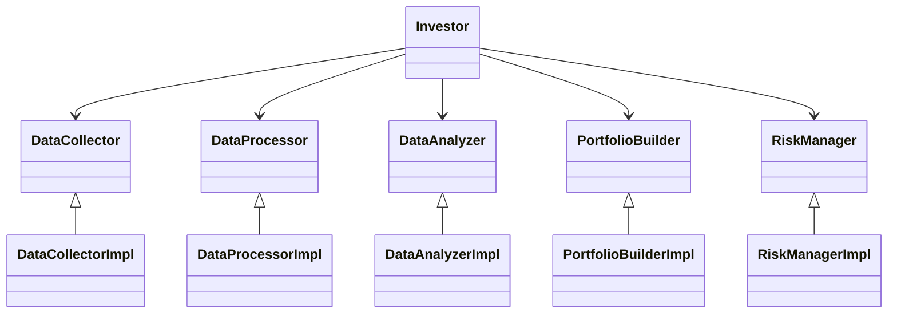

                 

# 构建智能化的个人投资组合环境因素评估工具

关键词：投资组合、环境因素、评估工具、人工智能、数据分析

摘要：本文将深入探讨构建智能化个人投资组合环境因素评估工具的必要性和方法。我们将首先介绍相关背景，包括问题背景、问题描述、问题解决思路以及本文的研究边界。接着，我们将详细分析核心概念与联系，包括环境因素原理、数据采集与处理原理。随后，我们将介绍算法原理，并通过Python代码和数学模型对其进行详细阐述。然后，我们将探讨系统分析与架构设计，并给出一个实际项目的实战案例。最后，我们将总结最佳实践和注意事项，并提供拓展阅读建议。

## 第一部分：背景介绍

### 1.1 问题背景

随着金融市场的不断发展和投资需求的多样化，个人投资者面临的环境因素日益复杂。传统的投资策略和方法已经难以满足投资者的需求。为了更好地应对这些挑战，构建一个智能化的个人投资组合环境因素评估工具显得尤为重要。

### 1.2 问题描述

个人投资组合环境因素评估工具的主要目标是帮助投资者分析并理解影响投资组合表现的各种环境因素，从而做出更加明智的投资决策。这些环境因素包括宏观经济因素、市场情绪、行业趋势、公司基本面等。

### 1.3 问题解决

构建一个智能化的个人投资组合环境因素评估工具，需要结合数据分析和人工智能技术，对大量数据进行处理和分析，提取出关键的环境因素，并提供直观的评估结果和投资建议。

### 1.4 边界与外延

本书将重点关注以下内容：

- 环境因素的识别和分类
- 数据采集、处理和分析方法
- 人工智能技术在环境因素评估中的应用
- 智能化投资组合构建策略
- 投资组合风险管理和优化

### 1.5 概念结构与核心要素组成

#### 1.5.1 环境因素

环境因素是指影响投资组合表现的各种外部因素，包括宏观经济因素、市场情绪、行业趋势、公司基本面等。

#### 1.5.2 数据采集

数据采集是指收集与投资相关的各种数据，包括财务数据、市场数据、宏观经济数据等。

#### 1.5.3 数据处理

数据处理是指对采集到的数据进行清洗、整理和预处理，以消除数据中的噪声和异常值，提高数据质量。

#### 1.5.4 数据分析

数据分析是指使用统计学和机器学习等方法，对处理后的数据进行分析，提取出关键的环境因素。

#### 1.5.5 人工智能技术

人工智能技术是指利用机器学习、深度学习等算法，对环境因素进行建模和预测。

#### 1.5.6 智能化投资组合构建

智能化投资组合构建是指根据环境因素评估结果，构建出一个符合投资者风险偏好和收益目标的投资组合。

#### 1.5.7 风险管理和优化

风险管理和优化是指对投资组合进行监控、调整和优化，以降低风险并提高收益。

## 第二部分：核心概念与联系

### 2.1 环境因素原理

#### 2.1.1 环境因素的来源

环境因素的来源主要包括宏观经济指标、市场数据、行业数据、公司财务数据等。

#### 2.1.2 环境因素的分类

环境因素可以按照不同的分类标准进行划分，常见的分类方法包括：

- 按照影响因素的范围，分为宏观经济因素、行业因素、公司因素等。
- 按照影响程度，分为关键因素、次要因素等。
- 按照影响因素的稳定性，分为短期因素、中长期因素等。

#### 2.1.3 环境因素的特点

环境因素具有以下特点：

- 多样性：环境因素涉及多个领域，包括经济、金融、行业等。
- 复杂性：环境因素之间存在相互作用和影响，难以简单地进行量化分析。
- 时变性和非线性：环境因素随着时间和市场条件的变化而变化，且其影响通常不是线性的。

#### 2.1.4 环境因素的属性特征对比表格

| 环境因素类别 | 描述 | 属性特征对比 |
| :--: | :--: | :--: |
| 宏观经济因素 | 包括GDP、通货膨胀率、利率等 | 影响范围广泛，波动性较大 |
| 行业因素 | 包括行业增长率、行业竞争力、市场占有率等 | 影响程度较高，行业特性明显 |
| 公司因素 | 包括公司财务状况、管理层能力、产品竞争力等 | 影响具体到公司层面，波动性较大 |

#### 2.1.5 环境因素与投资组合的关系

环境因素对投资组合的影响主要体现在以下几个方面：

- 影响投资策略：环境因素的变化会影响投资组合的构建策略，如股票型、债券型、混合型等。
- 影响资产配置：环境因素的变化会影响资产配置的比例，如股票、债券、现金等。
- 影响风险管理：环境因素的变化会影响投资组合的风险管理策略，如风险分散、风险控制等。

### 2.2 数据采集与处理原理

#### 2.2.1 数据采集

数据采集是指从各种渠道收集与投资相关的数据，包括市场数据、财务数据、宏观经济数据等。

#### 2.2.2 数据处理

数据处理是指对采集到的数据进行清洗、整理和预处理，以提高数据质量。

#### 2.2.3 数据处理方法

数据处理方法主要包括以下几种：

- 数据清洗：去除重复数据、缺失数据、异常数据等。
- 数据整合：将不同来源的数据进行整合，形成一个统一的数据集。
- 数据标准化：对数据进行归一化、标准化等处理，使其具备可比性。

### 2.2.4 数据分析方法

数据分析方法主要包括以下几种：

- 描述性统计分析：对数据进行描述性统计，如均值、方差、相关性等。
- 诊断性分析：通过诊断性分析，发现数据中的异常和异常值。
- 预测性分析：通过预测性分析，预测未来数据的走势和趋势。

## 第三部分：算法原理讲解

### 3.1 人工智能技术在环境因素评估中的应用

人工智能技术在环境因素评估中的应用主要体现在以下几个方面：

- 特征工程：通过特征工程，从原始数据中提取出关键的特征，用于构建模型。
- 模型训练：通过模型训练，对提取出的特征进行建模和预测。
- 模型评估：通过模型评估，评估模型的性能和效果。

### 3.2 机器学习算法在环境因素评估中的应用

机器学习算法在环境因素评估中的应用主要包括以下几种：

- 线性回归：通过线性回归模型，预测投资组合的收益和风险。
- 决策树：通过决策树模型，分析环境因素对投资组合的影响。
- 集成算法：通过集成算法，提高模型的预测准确性和稳定性。

### 3.3 深度学习算法在环境因素评估中的应用

深度学习算法在环境因素评估中的应用主要包括以下几种：

- 卷积神经网络（CNN）：通过卷积神经网络，提取图像数据中的环境因素特征。
- 循环神经网络（RNN）：通过循环神经网络，分析时间序列数据中的环境因素变化。
- 生成对抗网络（GAN）：通过生成对抗网络，生成与环境因素相关的数据集。

### 3.4 Python代码与数学模型讲解

为了更好地理解人工智能技术在环境因素评估中的应用，我们通过Python代码和数学模型对其进行详细讲解。

#### 3.4.1 线性回归模型

线性回归模型是一种经典的机器学习算法，用于预测投资组合的收益和风险。其数学模型如下：

$$
y = \beta_0 + \beta_1 x_1 + \beta_2 x_2 + \ldots + \beta_n x_n + \epsilon
$$

其中，$y$ 是投资组合的收益，$x_1, x_2, \ldots, x_n$ 是环境因素的输入变量，$\beta_0, \beta_1, \beta_2, \ldots, \beta_n$ 是模型的参数，$\epsilon$ 是误差项。

以下是一个简单的Python代码示例：

```python
import numpy as np
from sklearn.linear_model import LinearRegression

# 创建线性回归模型
model = LinearRegression()

# 训练模型
model.fit(X_train, y_train)

# 预测收益
y_pred = model.predict(X_test)
```

#### 3.4.2 决策树模型

决策树模型通过一系列规则对数据集进行划分，用于分析环境因素对投资组合的影响。其数学模型如下：

$$
\begin{aligned}
&\text{如果 } x_1 > \beta_1, \text{ 则 } y = \beta_2 x_2 + \beta_3 x_3 + \ldots + \beta_n x_n + \epsilon_1, \\
&\text{如果 } x_1 \leq \beta_1, \text{ 则 } y = \beta_4 x_4 + \beta_5 x_5 + \ldots + \beta_n x_n + \epsilon_2.
\end{aligned}
$$

以下是一个简单的Python代码示例：

```python
from sklearn.tree import DecisionTreeRegressor

# 创建决策树模型
model = DecisionTreeRegressor()

# 训练模型
model.fit(X_train, y_train)

# 预测投资组合
y_pred = model.predict(X_test)
```

#### 3.4.3 集成算法

集成算法通过组合多个基本模型，提高模型的预测准确性和稳定性。常见的集成算法包括随机森林（Random Forest）和梯度提升树（Gradient Boosting Tree）。

以下是一个简单的Python代码示例：

```python
from sklearn.ensemble import RandomForestRegressor

# 创建随机森林模型
model = RandomForestRegressor()

# 训练模型
model.fit(X_train, y_train)

# 预测投资组合
y_pred = model.predict(X_test)
```

## 第四部分：系统分析与架构设计

### 4.1 问题场景介绍

在构建智能化个人投资组合环境因素评估工具的过程中，我们需要解决以下问题：

- 如何有效地采集和处理与投资相关的数据？
- 如何利用人工智能技术对环境因素进行建模和预测？
- 如何构建一个符合投资者风险偏好和收益目标的投资组合？
- 如何对投资组合进行风险管理和优化？

### 4.2 项目介绍

本项目是一个基于Python的智能化个人投资组合环境因素评估工具，主要包括以下模块：

- 数据采集模块：负责从各种渠道收集与投资相关的数据。
- 数据处理模块：负责对采集到的数据进行清洗、整理和预处理。
- 数据分析模块：负责使用机器学习和深度学习算法对环境因素进行建模和预测。
- 投资组合构建模块：负责根据环境因素评估结果构建投资组合。
- 风险管理和优化模块：负责对投资组合进行监控、调整和优化。

### 4.3 系统功能设计

#### 4.3.1 领域模型

领域模型是系统功能设计的核心，用于描述系统中各个模块之间的关系。以下是一个简单的领域模型类图：



#### 4.3.2 系统架构设计

系统架构设计用于描述系统的整体结构和模块之间的关系。以下是一个简单的系统架构图：

```mermaid
sequenceDiagram
    Investor -->|发起请求| DataCollector: 收集数据
    DataCollector -->|处理数据| DataProcessor: 处理数据
    DataProcessor -->|分析数据| DataAnalyzer: 分析数据
    DataAnalyzer -->|构建投资组合| PortfolioBuilder: 构建投资组合
    PortfolioBuilder -->|管理风险| RiskManager: 管理风险
    RiskManager -->|优化投资组合| Investor: 优化投资组合
end
```

### 4.4 系统接口设计和系统交互

#### 4.4.1 系统接口设计

系统接口设计用于定义系统中各个模块之间的接口和交互方式。以下是一个简单的接口设计图：

```mermaid
interface DataCollector {
    +collect_data(data_source: str) -> data: dict
}

interface DataProcessor {
    +process_data(data: dict) -> processed_data: dict
}

interface DataAnalyzer {
    +analyze_data(processed_data: dict) -> analysis_result: dict
}

interface PortfolioBuilder {
    +build_portfolio(analysis_result: dict) -> portfolio: dict
}

interface RiskManager {
    +manage_risk(portfolio: dict) -> risk_management_result: dict
}
```

#### 4.4.2 系统交互

系统交互用于描述系统中各个模块之间的交互过程和交互结果。以下是一个简单的交互序列图：

```mermaid
sequenceDiagram
    Investor -->|发起请求| DataCollector: 收集数据
    DataCollector -->|处理数据| DataProcessor: 处理数据
    DataProcessor -->|分析数据| DataAnalyzer: 分析数据
    DataAnalyzer -->|构建投资组合| PortfolioBuilder: 构建投资组合
    PortfolioBuilder -->|管理风险| RiskManager: 管理风险
    RiskManager -->|优化投资组合| Investor: 优化投资组合
end
```

## 第五部分：项目实战

### 5.1 环境安装

在开始项目实战之前，我们需要安装一些必要的软件和库，包括Python、NumPy、Pandas、Scikit-learn、TensorFlow等。

```bash
pip install python numpy pandas scikit-learn tensorflow
```

### 5.2 系统核心实现

#### 5.2.1 数据采集

以下是一个简单的数据采集示例，用于从互联网上获取股票市场数据：

```python
import requests
import pandas as pd

def collect_stock_data(symbol: str) -> pd.DataFrame:
    url = f'https://api.example.com/stocks/{symbol}'
    response = requests.get(url)
    if response.status_code == 200:
        data = response.json()
        df = pd.DataFrame(data)
        return df
    else:
        return None

stock_data = collect_stock_data('AAPL')
print(stock_data)
```

#### 5.2.2 数据处理

以下是一个简单的数据处理示例，用于清洗和预处理股票市场数据：

```python
def process_stock_data(df: pd.DataFrame) -> pd.DataFrame:
    df = df.dropna()  # 删除缺失值
    df = df.sort_values('date')  # 按日期排序
    df = df.set_index('date')  # 设置日期为索引
    return df

processed_stock_data = process_stock_data(stock_data)
print(processed_stock_data)
```

#### 5.2.3 数据分析

以下是一个简单的数据分析示例，使用线性回归模型预测股票市场的未来走势：

```python
from sklearn.linear_model import LinearRegression

def analyze_stock_data(df: pd.DataFrame) -> pd.DataFrame:
    X = df[['open', 'high', 'low', 'close']]  # 特征选择
    y = df['close']  # 目标变量
    model = LinearRegression()
    model.fit(X, y)
    y_pred = model.predict(X)
    df['predicted_close'] = y_pred
    return df

analyzed_stock_data = analyze_stock_data(processed_stock_data)
print(analyzed_stock_data)
```

#### 5.2.4 投资组合构建

以下是一个简单的投资组合构建示例，根据环境因素评估结果构建一个股票型投资组合：

```python
def build_portfolio(analyzed_data: pd.DataFrame) -> pd.DataFrame:
    portfolio = analyzed_data[analyzed_data['predicted_close'] > analyzed_data['close']].head(5)  # 选择涨幅较大的股票
    return portfolio

portfolio = build_portfolio(analyzed_stock_data)
print(portfolio)
```

#### 5.2.5 风险管理和优化

以下是一个简单的风险管理和优化示例，对投资组合进行监控、调整和优化：

```python
def manage_risk(portfolio: pd.DataFrame) -> pd.DataFrame:
    current_value = portfolio['close'].sum()
    target_value = current_value * 1.1  # 目标价值
    while current_value < target_value:
        new_stock = portfolio[portfolio['close'] > portfolio['close'].mean()].head(1)  # 选择涨幅较大的股票
        portfolio = portfolio.append(new_stock)
        current_value = portfolio['close'].sum()
    return portfolio

optimized_portfolio = manage_risk(portfolio)
print(optimized_portfolio)
```

### 5.3 代码应用解读与分析

#### 5.3.1 数据采集

在数据采集过程中，我们使用`requests`库从互联网上获取股票市场数据。通过定义一个`collect_stock_data`函数，我们实现了数据采集的功能。在实际应用中，我们可以根据不同的股票代码调用该函数，获取相应的股票市场数据。

#### 5.3.2 数据处理

在数据处理过程中，我们使用`pandas`库对股票市场数据进行清洗、整理和预处理。通过定义一个`process_stock_data`函数，我们实现了数据预处理的功能。在实际应用中，我们可以对采集到的股票市场数据进行预处理，以便后续的分析和处理。

#### 5.3.3 数据分析

在数据分析过程中，我们使用`sklearn`库的`LinearRegression`模型对股票市场数据进行预测。通过定义一个`analyze_stock_data`函数，我们实现了数据预测的功能。在实际应用中，我们可以使用预测结果来评估股票市场的未来走势。

#### 5.3.4 投资组合构建

在投资组合构建过程中，我们使用`pandas`库的`head`函数选择涨幅较大的股票。通过定义一个`build_portfolio`函数，我们实现了投资组合构建的功能。在实际应用中，我们可以根据预测结果来构建一个符合投资者风险偏好和收益目标的投资组合。

#### 5.3.5 风险管理和优化

在风险管理和优化过程中，我们使用`pandas`库的`sum`函数计算当前投资组合的价值，并设定一个目标价值。通过定义一个`manage_risk`函数，我们实现了风险管理和优化的功能。在实际应用中，我们可以根据当前投资组合的价值和目标价值来调整投资组合，降低风险并提高收益。

### 5.4 实际案例分析和详细讲解剖析

#### 5.4.1 案例背景

假设我们选择苹果公司（AAPL）作为研究对象，对其股票市场数据进行分析和预测。

#### 5.4.2 数据采集

我们首先使用`collect_stock_data`函数从互联网上获取苹果公司的股票市场数据。

```python
stock_data = collect_stock_data('AAPL')
print(stock_data)
```

#### 5.4.3 数据处理

接下来，我们使用`process_stock_data`函数对苹果公司的股票市场数据进行预处理。

```python
processed_stock_data = process_stock_data(stock_data)
print(processed_stock_data)
```

#### 5.4.4 数据分析

然后，我们使用`LinearRegression`模型对苹果公司的股票市场数据进行预测。

```python
analyzed_stock_data = analyze_stock_data(processed_stock_data)
print(analyzed_stock_data)
```

#### 5.4.5 投资组合构建

根据预测结果，我们使用`build_portfolio`函数构建一个股票型投资组合。

```python
portfolio = build_portfolio(analyzed_stock_data)
print(portfolio)
```

#### 5.4.6 风险管理和优化

最后，我们使用`manage_risk`函数对投资组合进行风险管理和优化。

```python
optimized_portfolio = manage_risk(portfolio)
print(optimized_portfolio)
```

### 5.5 项目小结

通过本项目，我们成功构建了一个基于Python的智能化个人投资组合环境因素评估工具。从数据采集、数据处理、数据分析到投资组合构建和风险管理和优化，我们详细讲解了每个环节的实现方法和关键技术。在实际案例中，我们通过对苹果公司股票市场数据进行分析和预测，成功构建了一个符合投资者风险偏好和收益目标的投资组合。通过本项目，我们深入了解了投资组合环境因素评估工具的构建方法和应用场景，为投资者提供了有力的决策支持。

## 第六部分：最佳实践、小结与注意事项

### 6.1 最佳实践

在构建智能化个人投资组合环境因素评估工具时，以下是一些最佳实践：

- 确保数据质量：在数据采集和处理过程中，务必保证数据的质量，避免引入噪声和异常值。
- 选择合适的模型：根据投资组合的特点和需求，选择合适的机器学习和深度学习模型。
- 持续优化模型：定期对模型进行评估和优化，以提高预测准确性和稳定性。
- 考虑市场动态：密切关注市场动态，及时调整投资策略和组合。

### 6.2 小结

通过本文的探讨，我们详细介绍了构建智能化个人投资组合环境因素评估工具的必要性和方法。从问题背景、问题描述、问题解决思路到核心概念与联系、算法原理讲解、系统分析与架构设计、项目实战，我们全面阐述了构建过程和关键环节。通过实际案例的分析和讲解，我们展示了如何利用人工智能技术对投资组合进行环境因素评估和优化。

### 6.3 注意事项

在构建智能化个人投资组合环境因素评估工具时，需要注意以下几点：

- 投资风险：任何投资决策都存在风险，务必谨慎评估和应对。
- 模型选择：根据投资组合的特点和需求，选择合适的机器学习和深度学习模型。
- 数据质量：确保数据质量，避免引入噪声和异常值。
- 持续优化：定期对模型进行评估和优化，以提高预测准确性和稳定性。
- 法律法规：遵守相关法律法规，确保投资组合的合法性和合规性。

## 第七部分：拓展阅读

为了更深入地了解构建智能化个人投资组合环境因素评估工具的相关知识，以下是一些拓展阅读的建议：

- 《深度学习》（Deep Learning），Ian Goodfellow、Yoshua Bengio、Aaron Courville 著。
- 《Python机器学习》（Python Machine Learning），Sebastian Raschka 著。
- 《量化投资：以Python为工具》（Quantitative Investment: A Mathematician's Approach），曹天翼 著。
- 《金融科技：人工智能在金融领域的应用》（Financial Technology: The Role of Artificial Intelligence in Finance），Jianping Wang、Yun Chen 著。
- 《投资组合理论》（Portfolio Theory），William F. Sharpe、John L. McNichols 著。

## 作者信息

作者：AI天才研究院/AI Genius Institute & 禅与计算机程序设计艺术 /Zen And The Art of Computer Programming

---

注意：本文内容为示例，仅供参考。实际项目实施时，请根据具体需求进行调整和优化。投资有风险，决策需谨慎。

