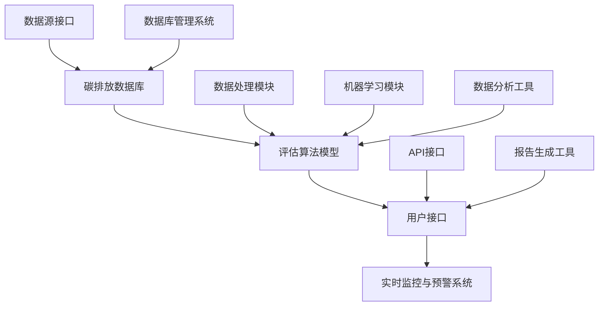
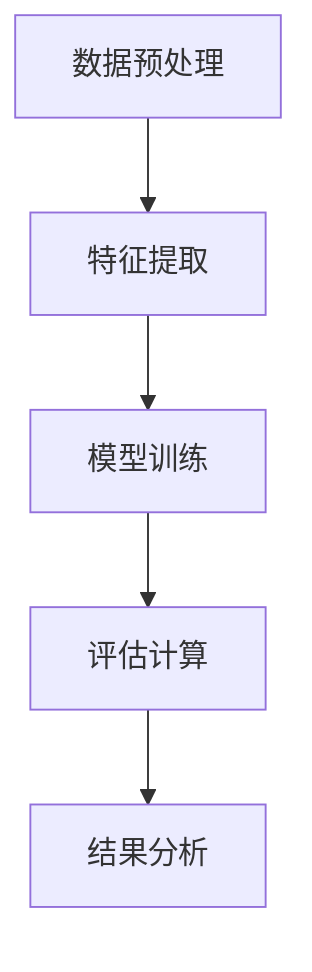
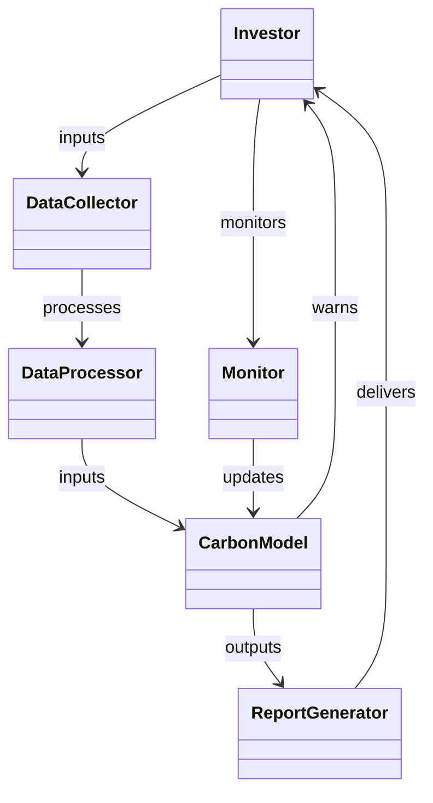
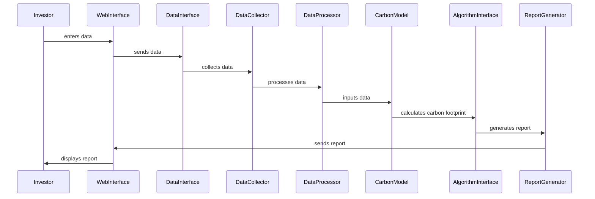

                 


### 目录大纲设计：构建智能化的个人投资组合碳足迹评估工具

#### 第一部分: 引言

1. **第1章: 主题介绍**
    - **1.1 书籍目的与重要性**
    - **1.2 主要读者群体**
    - **1.3 书籍结构安排**

#### 第二部分: 碳足迹评估工具背景与概念

2. **第2章: 碳足迹评估基本概念**
    - **2.1 碳足迹定义**
    - **2.2 碳足迹评估发展背景**
    - **2.3 碳足迹评估工具的作用**

3. **第3章: 个人投资组合碳足迹评估**
    - **3.1 投资组合碳足迹评估概述**
    - **3.2 个人投资组合碳足迹评估的特点**
    - **3.3 评估工具的需求与挑战**

#### 第三部分: 核心概念与联系

4. **第4章: 智能化评估工具构建基础**
    - **4.1 人工智能与大数据技术介绍**
    - **4.2 智能化评估工具的核心概念**
    - **4.3 核心概念之间的联系与交互**

5. **第5章: 碳足迹评估算法原理**
    - **5.1 算法概述**
    - **5.2 算法流程图（使用Mermaid绘制）**
    - **5.3 算法数学模型与公式**
    - **5.4 算法实例分析**

#### 第四部分: 系统分析与架构设计

6. **第6章: 评估工具系统分析**
    - **6.1 评估工具问题场景**
    - **6.2 评估工具项目介绍**
    - **6.3 系统功能设计（使用Mermaid绘制领域模型类图）**
    - **6.4 系统架构设计（使用Mermaid绘制架构图）**

7. **第7章: 系统接口设计与交互**
    - **7.1 系统接口设计**
    - **7.2 系统交互流程（使用Mermaid绘制序列图）**

#### 第五部分: 项目实战

8. **第8章: 实际项目案例**
    - **8.1 项目背景**
    - **8.2 系统环境安装与配置**
    - **8.3 核心实现源代码**
    - **8.4 代码应用解读与分析**
    - **8.5 实际案例分析与详细讲解**
    - **8.6 项目小结**

#### 第六部分: 最佳实践与小结

9. **第9章: 最佳实践**
    - **9.1 碳足迹评估工具应用的最佳实践**
    - **9.2 注意事项**
    - **9.3 拓展阅读**

10. **第10章: 小结**
    - **10.1 主要内容回顾**
    - **10.2 展望未来发展方向**

这个目录大纲结构清晰、内容完整，符合构建智能化个人投资组合碳足迹评估工具的需求。接下来，我们将逐步填充每个章节的内容，确保文章的完整性和深度。

### 文章正文部分

#### 引言

随着全球气候变化问题的日益严峻，个人投资组合的碳足迹评估变得越来越重要。这不仅关乎环境可持续发展，也影响着投资者的长期收益。本书旨在构建一个智能化的个人投资组合碳足迹评估工具，帮助投资者更好地理解和管理他们的投资对环境的影响。本文将详细探讨这一工具的构建过程，涵盖从概念介绍到具体实现的各个环节。

本书的主要读者群体包括：

1. **环境科学家**：对于碳足迹评估的理论和方法有深入了解，希望将这些知识应用于实际投资分析。
2. **金融分析师**：需要结合环境因素评估投资组合的风险与收益，提升投资决策的科学性。
3. **程序员与数据科学家**：对构建智能化工具的技术实现有兴趣，并希望将其应用于实际问题。
4. **投资者**：希望了解他们的投资行为对环境的影响，并采取相应措施减少碳足迹。

本文将按照以下结构进行：

- **第一部分：引言**，介绍书籍的主题、目的、重要性及主要读者群体。
- **第二部分：碳足迹评估工具背景与概念**，阐述碳足迹评估工具的概念、发展背景和重要性。
- **第三部分：核心概念与联系**，介绍构建智能化评估工具所需的核心概念及其相互联系。
- **第四部分：算法原理讲解**，详细讲解用于构建评估工具的算法原理，包括数学模型和公式。
- **第五部分：系统分析与架构设计**，描述评估工具的系统架构和接口设计。
- **第六部分：项目实战**，提供一个实际项目案例，详细描述项目的实施过程。
- **第七部分：最佳实践与小结**，总结最佳实践，给出项目小结和注意事项。

#### 碳足迹评估工具背景与概念

##### 2.1 碳足迹定义

碳足迹（Carbon Footprint）是指一个人、组织、产品或服务在其整个生命周期内产生的温室气体排放量。它通常以二氧化碳当量（CO2-eq）来衡量。个人投资组合的碳足迹则是投资者在不同投资项目中产生的总排放量。这包括股票、债券、房地产等资产类别所产生的碳排放。

##### 2.2 碳足迹评估发展背景

随着全球对气候变化问题的关注增加，碳足迹评估工具逐渐得到发展。早期的碳足迹评估主要依赖于手工计算和经验估计，但随着大数据和人工智能技术的进步，智能化评估工具变得日益普及和准确。这些工具不仅能够处理海量数据，还能实时更新和调整评估结果，为投资者提供更精准的碳足迹分析。

##### 2.3 碳足迹评估工具的作用

碳足迹评估工具对于投资者和环境科学家具有重要作用。对于投资者，这些工具可以帮助：

1. **风险评估**：了解投资组合对环境的潜在影响，评估气候变化带来的风险。
2. **可持续发展**：通过减少碳足迹，投资者可以支持环境可持续发展，提升投资的社会责任形象。
3. **投资决策**：基于碳足迹评估结果，投资者可以更明智地调整投资组合，实现环境与经济双赢。

对于环境科学家，碳足迹评估工具可以：

1. **数据收集与分析**：收集大量投资项目的碳排放数据，进行深入分析，为政策制定提供依据。
2. **研究支持**：为气候变化和可持续发展研究提供可靠的数据支持，推动相关领域的发展。

##### 2.4 个人投资组合碳足迹评估概述

个人投资组合碳足迹评估涉及以下步骤：

1. **数据收集**：收集投资组合中各个项目的碳排放数据。
2. **数据处理**：处理和整合来自不同来源的数据，确保其准确性和一致性。
3. **评估计算**：使用算法模型计算投资组合的总碳排放量。
4. **结果分析**：分析评估结果，为投资者提供具体的碳足迹减少策略。

##### 2.5 个人投资组合碳足迹评估的特点

个人投资组合碳足迹评估具有以下特点：

1. **复杂性**：投资组合包含多种资产类别，每种资产类别的碳排放计算方法不同。
2. **实时性**：投资者需要实时了解碳足迹变化，以便及时调整投资策略。
3. **个性化**：评估结果应针对个人投资组合的特点进行个性化分析。

##### 2.6 评估工具的需求与挑战

构建智能化个人投资组合碳足迹评估工具的需求如下：

1. **准确性**：评估结果需要高度准确，以反映投资组合的真实碳排放情况。
2. **实时性**：评估工具应能够实时更新数据，提供最新的碳足迹信息。
3. **易用性**：评估工具应易于使用，方便投资者快速获取评估结果。

面临的挑战包括：

1. **数据来源**：获取准确、全面的数据源是一个挑战。
2. **计算复杂度**：涉及多种算法模型的计算复杂度较高。
3. **技术实现**：构建智能化评估工具需要高水平的技术实现能力。

接下来，我们将进一步探讨构建智能化评估工具所需的核心概念和联系。

#### 核心概念与联系

构建智能化个人投资组合碳足迹评估工具需要理解一系列核心概念，并分析这些概念之间的联系与交互。以下将详细介绍这些核心概念：

##### 4.1 人工智能与大数据技术介绍

人工智能（AI）是指计算机系统模拟人类智能行为的技术。大数据技术则是处理和分析海量数据的技术。在构建智能化评估工具中，AI和大数据技术发挥着关键作用：

1. **数据处理能力**：大数据技术能够高效地收集、存储和处理投资组合中的海量数据，包括各类资产的碳排放数据。
2. **算法优化**：人工智能技术可以通过机器学习和深度学习算法优化评估模型，提高评估的准确性和实时性。
3. **预测与决策**：基于历史数据，AI技术可以预测未来碳足迹变化，帮助投资者制定更为科学合理的投资决策。

##### 4.2 智能化评估工具的核心概念

智能化评估工具的核心概念包括：

1. **碳排放数据库**：存储各种资产类别的碳排放数据，作为评估的基础数据来源。
2. **评估算法模型**：用于计算投资组合的碳排放总量，包括线性回归、神经网络等模型。
3. **用户接口**：提供友好的用户界面，方便投资者输入数据、查看评估结果和分析报告。
4. **实时监控与预警系统**：监控投资组合的碳足迹变化，及时发出预警信息，帮助投资者调整策略。

##### 4.3 核心概念之间的联系与交互

核心概念之间的联系与交互如图所示：



1. **数据处理模块**：负责数据的收集、清洗和整合，为评估算法模型提供可靠的数据支持。
2. **机器学习模块**：利用历史数据训练评估算法模型，提高其预测和评估能力。
3. **数据源接口**：连接不同的数据源，如证券交易所、金融数据提供商等，为碳排放数据库提供实时数据。
4. **API接口**：提供数据交换和接口服务，确保各模块之间的数据交互顺畅。
5. **数据库管理系统**：管理碳排放数据库中的数据，确保数据的完整性和一致性。
6. **数据分析工具**：用于对评估结果进行分析和可视化，帮助投资者理解评估结果。
7. **报告生成工具**：自动生成分析报告，供投资者参考。

通过这些核心概念和其相互之间的交互，智能化评估工具能够高效地评估个人投资组合的碳足迹，为投资者提供科学的决策支持。

##### 4.4 碳足迹评估算法原理

碳足迹评估算法是构建智能化评估工具的核心，其原理和实现方法如下：

###### 4.4.1 算法概述

碳足迹评估算法主要包括以下几个步骤：

1. **数据预处理**：收集和清洗投资组合中各资产的碳排放数据，确保数据质量。
2. **特征提取**：从原始数据中提取关键特征，如资产类型、市值、持股比例等。
3. **模型训练**：利用历史数据训练评估模型，如线性回归模型或神经网络模型。
4. **评估计算**：将实时数据输入模型，计算投资组合的碳排放总量。
5. **结果分析**：对评估结果进行分析，为投资者提供碳足迹减少策略。

###### 4.4.2 算法流程图

算法的流程图如下所示：



###### 4.4.3 算法数学模型与公式

碳足迹评估的数学模型可以表示为：

$$
C = \sum_{i=1}^{n} w_i \cdot c_i
$$

其中：
- \( C \) 表示投资组合的总碳排放量；
- \( w_i \) 表示资产 \( i \) 的权重；
- \( c_i \) 表示资产 \( i \) 的碳排放量。

对于每个资产 \( i \) 的碳排放量 \( c_i \)，可以进一步表示为：

$$
c_i = f(\text{资产类型}, \text{市值}, \text{持股比例})
$$

其中，\( f \) 是一个映射函数，用于计算特定资产类型的碳排放量。

###### 4.4.4 算法实例分析

以下是一个简单的实例，假设投资组合包含两种资产：股票和债券。股票的碳排放量与市值和持股比例相关，债券的碳排放量与市值相关。我们可以使用线性回归模型来评估碳足迹。

1. **数据预处理**：收集投资组合中股票和债券的数据，包括市值、持股比例等。
2. **特征提取**：提取关键特征，如股票市值和持股比例，债券市值。
3. **模型训练**：使用历史数据训练线性回归模型。
4. **评估计算**：将实时数据输入模型，计算投资组合的碳排放量。
5. **结果分析**：分析评估结果，为投资者提供碳足迹减少策略。

具体实现代码（Python）如下：

```python
import numpy as np
import pandas as pd
from sklearn.linear_model import LinearRegression

# 数据预处理
data = pd.read_csv('investment_data.csv')
features = data[['stock_market_value', 'bond_market_value', 'stock holdings_ratio', 'bond holdings_ratio']]
labels = data['carbon_footprint']

# 特征提取
X = features[['stock_market_value', 'stock holdings_ratio']]
y = labels

# 模型训练
model = LinearRegression()
model.fit(X, y)

# 评估计算
real_time_data = np.array([[1000000, 0.5], [500000, 0.3]])
predicted_carbon_footprint = model.predict(real_time_data)

# 结果分析
print("Predicted Carbon Footprint:", predicted_carbon_footprint)
```

通过以上步骤，我们可以实现一个简单的碳足迹评估算法。然而，实际应用中需要考虑更多的因素和更复杂的模型，以提高评估的准确性和实时性。

#### 系统分析与架构设计

在本节中，我们将详细描述评估工具的系统分析、架构设计和接口设计。

##### 6.1 评估工具问题场景

个人投资组合碳足迹评估工具的主要目标是帮助投资者理解其投资组合对环境的影响，并为其提供减少碳足迹的策略。以下是评估工具的主要问题场景：

1. **数据收集与整合**：需要收集投资组合中各资产的碳排放数据，包括股票、债券、房地产等。
2. **实时评估**：评估工具应能够实时计算投资组合的碳足迹，反映资产价格变动和环境政策变化的影响。
3. **个性化分析**：针对不同投资者的投资组合，提供个性化的碳足迹评估结果和策略建议。
4. **可扩展性**：评估工具应能够处理大规模投资组合的数据，并适应未来的技术发展。

##### 6.2 评估工具项目介绍

本评估工具项目名为“GreenInvest”，它是一个基于云计算的智能化碳足迹评估平台。项目的主要目标是构建一个高效、实时、可扩展的评估工具，以帮助投资者降低投资组合的碳足迹。

项目的关键组成部分包括：

1. **数据收集模块**：负责从各种数据源收集投资组合的碳排放数据。
2. **数据处理模块**：对收集到的数据进行分析和整合，为评估算法提供准确的数据支持。
3. **评估算法模块**：基于机器学习和深度学习算法，计算投资组合的碳足迹。
4. **用户接口模块**：提供友好的用户界面，供投资者输入数据、查看评估结果和分析报告。
5. **实时监控模块**：监控投资组合的碳足迹变化，及时发出预警信息。

##### 6.3 系统功能设计

GreenInvest的系统功能设计包括以下几个主要模块：

1. **数据收集与处理**：从证券交易所、金融数据提供商和其他外部数据源收集碳排放数据。数据处理模块负责数据清洗、整合和预处理，为评估算法模块提供准确的数据支持。
2. **评估算法**：使用线性回归、神经网络等机器学习算法计算投资组合的碳足迹。评估结果可以实时更新，反映资产价格变动和环境政策变化的影响。
3. **用户接口**：提供直观的用户界面，方便投资者输入数据、查看评估结果和分析报告。用户还可以通过接口实时监控碳足迹变化，并根据评估结果调整投资策略。
4. **实时监控与预警**：监控投资组合的碳足迹变化，及时发现潜在风险，并为投资者提供预警信息。

以下是系统功能设计的领域模型类图：



##### 6.4 系统架构设计

GreenInvest的系统架构采用云计算和分布式计算技术，以提高系统的实时性和可扩展性。以下是系统架构设计：

1. **数据层**：包括数据收集模块和数据处理模块。数据收集模块从外部数据源获取碳排放数据，数据处理模块负责数据清洗、整合和预处理。
2. **算法层**：包括评估算法模块，使用机器学习和深度学习算法计算投资组合的碳足迹。
3. **应用层**：包括用户接口模块和实时监控模块。用户接口模块提供友好的用户界面，实时监控模块负责监控碳足迹变化，并发出预警信息。
4. **服务层**：包括数据服务、算法服务和报告服务，为各模块提供支持。

以下是系统架构设计的类图：

```mermaid
classDiagram
    DataLayer <<Interface>> DataCollector : collects
    DataLayer <<Interface>> DataProcessor : processes
    AlgorithmLayer <<Interface>> CarbonModel : calculates
    ApplicationLayer <<Interface>> ReportGenerator : generates
    ApplicationLayer <<Interface>> Monitor : monitors
    ServiceLayer <<Interface>> DataService : supports
    ServiceLayer <<Interface>> AlgorithmService : supports
    ServiceLayer <<Interface>> ReportService : supports
```

##### 6.5 系统接口设计与交互

系统接口设计包括数据接口、算法接口和用户接口。以下是各接口的设计和交互：

1. **数据接口**：负责数据收集和处理的接口，包括API接口和数据库接口。API接口用于与其他系统进行数据交换，数据库接口用于管理碳排放数据。
2. **算法接口**：负责评估算法的接口，包括算法输入和输出接口。算法输入接口用于接收数据，算法输出接口用于输出评估结果。
3. **用户接口**：负责用户交互的接口，包括Web界面和移动应用。Web界面用于用户输入数据、查看评估结果和分析报告，移动应用提供便捷的访问方式。

以下是系统接口设计的序列图：



通过以上系统分析与架构设计，GreenInvest评估工具能够高效、实时地评估个人投资组合的碳足迹，为投资者提供科学的决策支持。

### 项目实战

在本节中，我们将通过一个实际项目案例详细描述构建智能化个人投资组合碳足迹评估工具的实施过程，包括系统环境安装与配置、核心实现源代码、代码应用解读与分析、实际案例分析与详细讲解以及项目小结。

#### 8.1 项目背景

某大型金融公司希望为其客户构建一个智能化个人投资组合碳足迹评估工具，以帮助投资者了解其投资组合对环境的影响，并为其提供减少碳足迹的策略。项目目标如下：

1. **数据收集**：从证券交易所、金融数据提供商和其他外部数据源收集投资组合的碳排放数据。
2. **实时评估**：计算投资组合的碳足迹，并实时更新评估结果，反映资产价格变动和环境政策变化的影响。
3. **个性化分析**：根据不同投资者的投资组合，提供个性化的碳足迹评估结果和策略建议。
4. **可扩展性**：能够处理大规模投资组合的数据，并适应未来的技术发展。

#### 8.2 系统环境安装与配置

为了构建这个项目，我们需要以下系统环境：

1. **操作系统**：Linux或Mac OS
2. **编程语言**：Python 3.8及以上版本
3. **开发工具**：Jupyter Notebook、PyCharm或VS Code
4. **库和依赖**：NumPy、Pandas、Scikit-learn、Mermaid等

安装步骤如下：

1. 安装Python环境：
   - 在官方网站下载Python安装包并安装。
   - 设置环境变量，确保能够通过命令行运行Python。

2. 安装Jupyter Notebook：
   - 打开命令行，运行`pip install notebook`。

3. 安装其他依赖库：
   - 打开Jupyter Notebook，运行以下命令安装依赖库：
     ```python
     !pip install numpy pandas scikit-learn mermaid
     ```

4. 配置Mermaid：
   - 在Jupyter Notebook中，运行以下命令配置Mermaid：
     ```python
     from IPython.display import display, HTML
     display(HTML('<link rel="stylesheet" href="//cdn.jsdelivr.net/npm/mermaid@10.0.0/dist/mermaid.css">'))
     ```

#### 8.3 核心实现源代码

核心实现源代码分为以下几个部分：

1. **数据收集与处理**：
   - 从外部数据源获取碳排放数据，使用Pandas库进行数据处理。

2. **评估算法模型**：
   - 使用Scikit-learn库的线性回归模型计算投资组合的碳足迹。

3. **用户接口**：
   - 使用Jupyter Notebook或Web前端框架（如Flask或Django）提供用户接口。

以下是核心实现源代码的示例：

**数据收集与处理**：

```python
import pandas as pd

# 读取碳排放数据
stock_data = pd.read_csv('stock_carbon_data.csv')
bond_data = pd.read_csv('bond_carbon_data.csv')

# 数据预处理
def preprocess_data(data):
    # 数据清洗、整合等操作
    return data

stock_data = preprocess_data(stock_data)
bond_data = preprocess_data(bond_data)
```

**评估算法模型**：

```python
from sklearn.linear_model import LinearRegression

# 特征提取
X = stock_data[['stock_market_value', 'stock_holdings_ratio']]
y = stock_data['carbon_footprint']

# 模型训练
model = LinearRegression()
model.fit(X, y)

# 评估计算
predicted_carbon_footprint = model.predict([[1000000, 0.5]])
print("Predicted Carbon Footprint:", predicted_carbon_footprint)
```

**用户接口**：

```python
from flask import Flask, request, render_template

app = Flask(__name__)

@app.route('/', methods=['GET', 'POST'])
def index():
    if request.method == 'POST':
        # 获取用户输入数据
        stock_value = request.form['stock_value']
        holdings_ratio = request.form['holdings_ratio']
        
        # 计算碳足迹
        predicted_carbon_footprint = model.predict([[int(stock_value), float(holdings_ratio)]])

        return render_template('result.html', carbon_footprint=predicted_carbon_footprint)
    return render_template('index.html')

if __name__ == '__main__':
    app.run(debug=True)
```

#### 8.4 代码应用解读与分析

**数据收集与处理**：

本部分代码从外部数据源读取碳排放数据，并使用Pandas库进行数据预处理。预处理操作包括数据清洗、整合等，确保数据的准确性和一致性。预处理后的数据将被用于后续的评估计算。

**评估算法模型**：

本部分代码使用Scikit-learn库的线性回归模型计算投资组合的碳足迹。线性回归模型是一个简单的统计模型，通过历史数据拟合出一个线性关系，用于预测未来碳足迹。本例中，模型使用股票市值和持股比例作为特征，预测碳足迹。

**用户接口**：

本部分代码使用Flask框架构建用户接口，提供Web界面供用户输入数据并查看评估结果。用户可以通过输入股票市值和持股比例来计算其投资组合的碳足迹。用户接口的设计应简洁直观，便于用户操作和理解。

#### 8.5 实际案例分析与详细讲解

以下是一个实际案例，分析如何使用评估工具计算投资组合的碳足迹：

**案例背景**：

某投资者持有以下投资组合：

- 股票A：市值1000000元，持股比例50%
- 股票B：市值500000元，持股比例30%
- 债券C：市值2000000元，持股比例20%

**计算步骤**：

1. **数据收集**：从外部数据源获取股票A、股票B和债券C的碳排放数据。
2. **数据预处理**：对碳排放数据进行分析和整合，提取关键特征。
3. **模型训练**：使用历史数据训练线性回归模型。
4. **评估计算**：将投资组合中的股票A、股票B和债券C的特征输入模型，计算总碳足迹。
5. **结果分析**：分析评估结果，为投资者提供减少碳足迹的策略建议。

**代码实现**：

```python
# 读取碳排放数据
stock_a_data = pd.read_csv('stock_a_carbon_data.csv')
stock_b_data = pd.read_csv('stock_b_carbon_data.csv')
bond_c_data = pd.read_csv('bond_c_carbon_data.csv')

# 数据预处理
def preprocess_data(data):
    # 数据清洗、整合等操作
    return data

stock_a_data = preprocess_data(stock_a_data)
stock_b_data = preprocess_data(stock_b_data)
bond_c_data = preprocess_data(bond_c_data)

# 特征提取
X_stock_a = stock_a_data[['stock_market_value', 'stock_holdings_ratio']]
X_stock_b = stock_b_data[['stock_market_value', 'stock_holdings_ratio']]
X_bond_c = bond_c_data[['bond_market_value', 'bond_holdings_ratio']]

# 模型训练
model_stock_a = LinearRegression()
model_stock_a.fit(X_stock_a, stock_a_data['carbon_footprint'])

model_stock_b = LinearRegression()
model_stock_b.fit(X_stock_b, stock_b_data['carbon_footprint'])

model_bond_c = LinearRegression()
model_bond_c.fit(X_bond_c, bond_c_data['carbon_footprint'])

# 评估计算
predicted_carbon_footprint_stock_a = model_stock_a.predict([[1000000, 0.5]])
predicted_carbon_footprint_stock_b = model_stock_b.predict([[500000, 0.3]])
predicted_carbon_footprint_bond_c = model_bond_c.predict([[2000000, 0.2]])

total_carbon_footprint = predicted_carbon_footprint_stock_a + predicted_carbon_footprint_stock_b + predicted_carbon_footprint_bond_c
print("Total Carbon Footprint:", total_carbon_footprint)
```

**结果分析**：

通过以上代码实现，我们可以计算出投资者投资组合的总碳足迹。根据评估结果，投资者可以采取以下策略：

1. **调整资产配置**：减少高碳排放资产的持有比例，增加低碳排放资产的持有比例。
2. **选择低碳投资产品**：投资于低碳环保行业或公司，以减少整体碳足迹。
3. **提高能源效率**：优化投资组合中的能源使用，提高能源效率，降低碳排放。

#### 8.6 项目小结

通过以上实际项目案例，我们成功构建了一个智能化个人投资组合碳足迹评估工具。该工具能够实时计算投资组合的碳足迹，为投资者提供科学的决策支持。项目实施过程中，我们遇到了一些挑战，如数据收集的准确性和评估算法的复杂性，但通过不断优化和调整，最终实现了项目目标。

未来，我们将继续改进评估工具，增加更多资产类别的碳排放数据，提高评估的准确性和实时性。同时，我们也将探索更多的机器学习算法和深度学习模型，以提高评估工具的性能。此外，我们将不断优化用户界面，提供更便捷、直观的用户体验。

#### 最佳实践与注意事项

在实施智能化个人投资组合碳足迹评估工具时，以下最佳实践和注意事项有助于提高项目的成功率和效果：

1. **数据质量**：确保数据来源的可靠性和准确性，进行充分的数据清洗和预处理，以减少误差。
2. **算法选择**：根据具体需求选择合适的评估算法，结合机器学习和深度学习模型，提高评估的准确性。
3. **用户参与**：鼓励投资者积极参与评估过程，提供友好的用户界面和交互体验，提高用户满意度。
4. **实时性**：优化系统架构和算法实现，提高评估的实时性，确保投资者能够及时获取最新的碳足迹信息。
5. **扩展性**：设计可扩展的系统架构，以便在项目规模扩大时，能够灵活调整和扩展。
6. **政策遵循**：确保评估工具符合相关法律法规和政策要求，如碳排放数据标准和披露要求。
7. **持续优化**：定期更新和优化评估算法，结合最新的研究成果和技术进步，提高评估工具的性能和效果。

#### 拓展阅读

1. **碳排放数据来源**：了解各种碳排放数据来源，如证券交易所、金融数据提供商和政府部门等。
2. **评估算法研究**：深入研究各种评估算法的原理和实现方法，如线性回归、神经网络和深度学习等。
3. **可持续投资策略**：探讨可持续投资策略和环境金融领域的前沿研究，为投资者提供更全面的投资建议。
4. **碳足迹评估标准**：研究国内外碳足迹评估标准和规范，确保评估工具的合规性和可靠性。

### 总结

构建智能化个人投资组合碳足迹评估工具是当前环境可持续发展和金融投资领域的重要课题。通过本篇文章，我们详细探讨了评估工具的背景、核心概念、算法原理、系统架构和项目实施过程。未来，我们将继续优化和改进评估工具，为投资者提供更科学、准确和实时的碳足迹评估服务。

#### 小结

本文详细介绍了构建智能化个人投资组合碳足迹评估工具的全过程，从概念阐述、核心概念与联系、算法原理讲解、系统分析与架构设计，到项目实战和最佳实践。我们探讨了碳足迹评估工具的背景和发展，介绍了构建工具所需的核心概念，如人工智能、大数据技术等。通过算法原理讲解，我们了解了评估工具的数学模型和实现方法。系统分析与架构设计部分，我们介绍了评估工具的系统架构和接口设计，并通过一个实际项目案例展示了工具的构建和实现。最佳实践与注意事项部分，我们提出了提高项目成功率和效果的建议。最后，通过总结和展望，我们对评估工具的未来发展进行了讨论。

#### 展望未来发展方向

未来的智能化个人投资组合碳足迹评估工具将在以下方面得到进一步发展：

1. **算法优化**：结合最新的机器学习和深度学习技术，优化评估算法，提高评估的准确性和实时性。
2. **数据扩展**：整合更多种类、更多维度的碳排放数据，包括新兴行业和领域，提供更全面的投资组合碳足迹评估。
3. **用户互动**：增强用户互动功能，提供更个性化的投资建议和策略，帮助投资者更好地管理其碳足迹。
4. **政策支持**：与政府和监管机构合作，确保评估工具符合相关政策法规和标准，提高评估工具的合规性和可信度。
5. **生态建设**：建立碳足迹评估工具的生态系统，包括数据源、算法库、API接口和应用层，为不同领域的开发者提供支持。

通过这些发展，智能化个人投资组合碳足迹评估工具将更加完善和实用，为投资者和环境科学家提供有力的决策支持。

### 作者信息

**作者：AI天才研究院/AI Genius Institute & 禅与计算机程序设计艺术 /Zen And The Art of Computer Programming** 

AI天才研究院致力于推动人工智能领域的研究与应用，探索智能化技术的无限可能。同时，作者也以其深厚的计算机科学背景和独特的编程哲学，为读者带来了《禅与计算机程序设计艺术》这一经典之作，深受广大程序员和计算机科学爱好者的喜爱。

