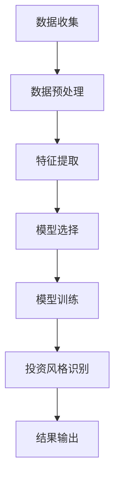
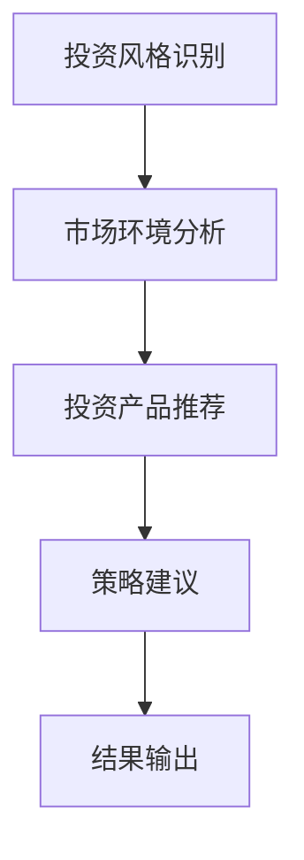
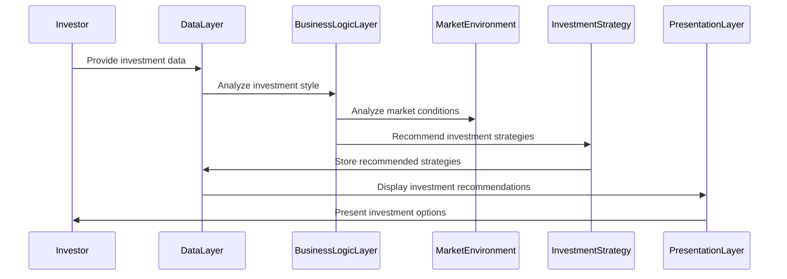
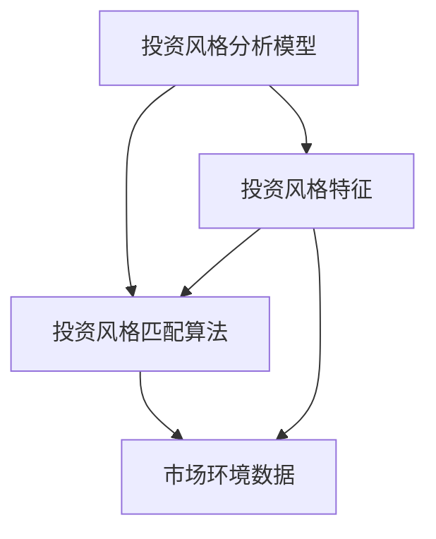
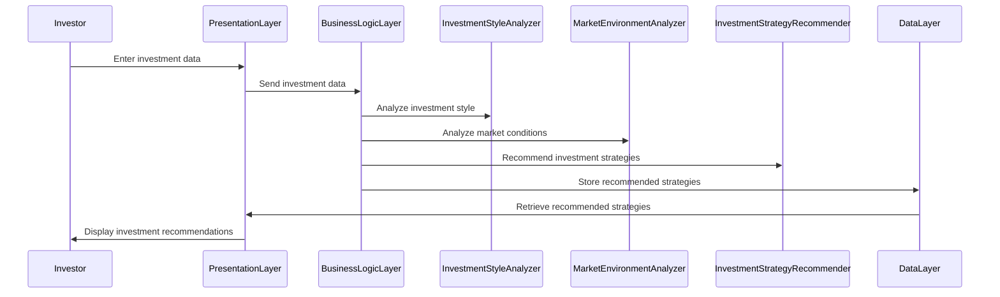

                 


## 《构建智能化的个人投资风格分析与匹配系统》

> 关键词：个人投资风格，智能分析，匹配系统，算法原理，系统架构，项目实战

> 摘要：本文详细阐述了构建智能化个人投资风格分析与匹配系统的全过程。首先介绍了个人投资风格的概念和重要性，然后深入探讨了系统中的核心概念和算法原理，接着分析了系统的架构设计，并通过一个实际项目展示了系统的实现过程。最后，总结了最佳实践和注意事项，为读者提供了进一步的学习和探索方向。

### 目录

#### 第一部分：个人投资风格分析基础

- **第1章** 问题背景与系统概述
  - **1.1** 个人投资风格的概念
  - **1.2** 投资风格分析与匹配的重要性
  - **1.3** 个人投资风格分析与匹配系统的边界与外延
- **第2章** 核心概念与联系
  - **2.1** 投资风格分析模型
  - **2.2** 投资风格匹配算法
  - **2.3** 概念属性特征对比表格
  - **2.4** ER实体关系图

#### 第二部分：算法原理讲解

- **第3章** 投资风格分析算法原理
  - **3.1** 投资风格分析算法概述
  - **3.2** 投资风格分析流程图
  - **3.3** 投资风格分析数学模型
  - **3.4** 投资风格分析实例
- **第4章** 投资风格匹配算法原理
  - **4.1** 投资风格匹配算法概述
  - **4.2** 投资风格匹配流程图
  - **4.3** 投资风格匹配数学模型
  - **4.4** 投资风格匹配实例

#### 第三部分：系统分析与架构设计

- **第5章** 系统功能设计
  - **5.1** 问题场景介绍
  - **5.2** 系统功能设计（领域模型类图）
- **第6章** 系统架构设计
  - **6.1** 系统架构设计概述
  - **6.2** 系统架构图
  - **6.3** 系统接口设计
- **第7章** 系统交互流程
  - **7.1** 系统交互概述
  - **7.2** 系统交互序列图

#### 第四部分：项目实战

- **第8章** 环境安装与系统实现
  - **8.1** 环境安装指南
  - **8.2** 系统核心实现源代码
  - **8.3** 代码解读与分析
- **第9章** 实际案例分析与讲解
  - **9.1** 实际案例概述
  - **9.2** 案例分析与讲解
  - **9.3** 项目小结

#### 第五部分：最佳实践与拓展

- **第10章** 最佳实践 tips
- **第11章** 小结
- **第12章** 注意事项
- **第13章** 拓展阅读

---

### 第一部分：个人投资风格分析基础

#### 第1章：问题背景与系统概述

##### 1.1 个人投资风格的概念

个人投资风格是指投资者在投资决策过程中所表现出的心理特征、行为习惯和决策方式。它通常由多个方面构成，包括风险偏好、投资时间框架、投资策略、投资知识水平等。个人投资风格对投资决策的制定和执行具有深远的影响。

##### 1.2 投资风格分析与匹配的重要性

投资风格分析与匹配对于提高投资效率和收益具有重要意义。通过分析投资者的个人投资风格，可以更好地理解投资者的行为特征和风险偏好，从而制定更合适的投资策略。同时，通过匹配投资者的投资风格与市场环境，可以降低投资风险，提高投资收益。

##### 1.3 个人投资风格分析与匹配系统的边界与外延

个人投资风格分析与匹配系统主要涉及以下几个方面：

1. 数据收集与处理：收集投资者的个人信息、投资行为数据和市场环境数据。
2. 投资风格分析：基于收集到的数据，对投资者的投资风格进行分析和识别。
3. 投资风格匹配：根据投资者的投资风格，为其推荐合适的投资产品和市场环境。
4. 系统优化：通过不断收集新的数据，优化投资风格分析与匹配模型。

#### 第2章：核心概念与联系

##### 2.1 投资风格分析模型

投资风格分析模型是个人投资风格分析与匹配系统的核心组成部分。它通过分析投资者的投资行为数据，识别出投资者的投资风格特征。常见的投资风格分析模型包括行为金融模型、心理测量模型和数据挖掘模型。

##### 2.2 投资风格匹配算法

投资风格匹配算法用于将投资者的投资风格与市场环境进行匹配，从而推荐合适的投资产品和策略。常见的投资风格匹配算法包括基于规则的匹配算法、基于机器学习的匹配算法和基于社交网络的匹配算法。

##### 2.3 概念属性特征对比表格

以下是一个概念属性特征对比表格，展示了不同投资风格分析模型和匹配算法的优缺点：

| 模型/算法 | 优点 | 缺点 |
| --- | --- | --- |
| 行为金融模型 | 具有较强的理论支持，能够较好地反映投资者的行为特征 | 对数据质量和样本量要求较高，适用范围有限 |
| 心理测量模型 | 能够量化投资者的心理特征，具有较强的解释力 | 需要专业心理测试工具，成本较高 |
| 数据挖掘模型 | 可以从大量数据中挖掘出投资风格特征，适用范围广 | 模型复杂度较高，计算资源需求大 |
| 基于规则的匹配算法 | 实现简单，易于理解和维护 | 匹配精度较低，无法适应动态变化的投资环境 |
| 基于机器学习的匹配算法 | 可以自动学习和调整匹配策略，适应性强 | 对数据质量要求较高，模型训练时间较长 |
| 基于社交网络的匹配算法 | 可以利用社交网络数据，挖掘潜在的投资关系 | 需要大量的社交网络数据，隐私保护问题突出 |

##### 2.4 ER实体关系图

个人投资风格分析与匹配系统中的主要实体包括投资者、投资行为、市场环境和投资策略。以下是一个ER实体关系图，展示了这些实体之间的关系：

```mermaid
erDiagram
    投资者 ||--|{ 投资行为 }|
    投资者 ||--|{ 投资策略 }|
    投资者 ||--|{ 市场环境 }|
    投资行为 ||--|{ 投资风格 }|
    投资策略 ||--|{ 投资产品 }|
    市场环境 ||--|{ 经济环境 }|
    市场环境 ||--|{ 政策环境 }|
```

---

### 第二部分：算法原理讲解

#### 第3章：投资风格分析算法原理

##### 3.1 投资风格分析算法概述

投资风格分析算法是个人投资风格分析与匹配系统的核心组成部分。它通过对投资者的投资行为数据进行分析，识别出投资者的投资风格特征。常见的投资风格分析算法包括行为金融模型、心理测量模型和数据挖掘模型。

##### 3.2 投资风格分析流程图

以下是一个投资风格分析流程图，展示了投资风格分析算法的基本步骤：



##### 3.3 投资风格分析数学模型

投资风格分析数学模型用于描述投资风格特征与投资行为数据之间的关系。以下是一个简单的线性回归模型，用于分析投资风格特征与投资收益之间的关系：

$$
y = \beta_0 + \beta_1 \cdot x_1 + \beta_2 \cdot x_2 + ... + \beta_n \cdot x_n
$$

其中，$y$表示投资收益，$x_1, x_2, ..., x_n$表示投资风格特征，$\beta_0, \beta_1, ..., \beta_n$为模型参数。

##### 3.4 投资风格分析实例

假设我们收集了以下投资行为数据：

| 投资者 | 投资时间 | 投资收益 |
| --- | --- | --- |
| A | 2022-01-01 | 1000 |
| A | 2022-02-01 | 1500 |
| A | 2022-03-01 | 2000 |
| B | 2022-01-01 | 800 |
| B | 2022-02-01 | 1200 |
| B | 2022-03-01 | 1600 |

我们可以使用线性回归模型来分析投资风格特征与投资收益之间的关系。首先，我们需要提取投资风格特征，如投资时间长度、投资频率等。然后，使用线性回归模型进行模型训练，得到投资风格特征与投资收益之间的线性关系。最后，使用模型对新的投资行为数据进行预测，识别投资者的投资风格。

#### 第4章：投资风格匹配算法原理

##### 4.1 投资风格匹配算法概述

投资风格匹配算法用于将投资者的投资风格与市场环境进行匹配，从而推荐合适的投资产品和策略。常见的投资风格匹配算法包括基于规则的匹配算法、基于机器学习的匹配算法和基于社交网络的匹配算法。

##### 4.2 投资风格匹配流程图

以下是一个投资风格匹配流程图，展示了投资风格匹配算法的基本步骤：



##### 4.3 投资风格匹配数学模型

投资风格匹配数学模型用于描述投资风格特征与市场环境之间的关系。以下是一个简单的相似度计算模型，用于计算投资风格特征与市场环境之间的相似度：

$$
similarity = \frac{sum(cosine_similarity)}{num_of_features}
$$

其中，$similarity$表示相似度，$cosine_similarity$表示余弦相似度，$num_of_features$表示特征数量。

##### 4.4 投资风格匹配实例

假设我们收集了以下市场环境数据：

| 市场环境 | 经济环境 | 政策环境 |
| --- | --- | --- |
| 2022-01-01 | 乐观 | 稳定 |
| 2022-02-01 | 乐观 | 稳定 |
| 2022-03-01 | 乐观 | 稳定 |

我们可以使用相似度计算模型来分析投资风格特征与市场环境之间的相似度。首先，我们需要提取投资风格特征，如投资时间长度、投资频率等。然后，使用相似度计算模型对投资风格特征与市场环境进行相似度计算。最后，根据相似度值，为投资者推荐合适的投资产品和策略。

---

### 第三部分：系统分析与架构设计

#### 第5章：系统功能设计

##### 5.1 问题场景介绍

在当今的金融市场中，投资者面临着复杂多变的市场环境。如何根据个人投资风格，选择合适的投资产品和策略，成为投资者面临的重要问题。个人投资风格分析与匹配系统旨在为投资者提供智能化的投资风格分析与匹配服务，帮助投资者更好地进行投资决策。

##### 5.2 系统功能设计（领域模型类图）

以下是一个个人投资风格分析与匹配系统的领域模型类图，展示了系统的核心功能：

```mermaid
classDiagram
    Investor <<entity>>
    InvestmentBehavior <<entity>>
    InvestmentStrategy <<entity>>
    MarketEnvironment <<entity>>
    EconomicEnvironment <<entity>>
    PolicyEnvironment <<entity>>

    Investor "1" --|> InvestmentBehavior: records
    Investor "1" --|> InvestmentStrategy: suggests
    Investor "1" --|> MarketEnvironment: analyzes
    InvestmentBehavior "1" --|> InvestmentStrategy: derives
    MarketEnvironment "1" --|> EconomicEnvironment: considers
    MarketEnvironment "1" --|> PolicyEnvironment: evaluates
```

#### 第6章：系统架构设计

##### 6.1 系统架构设计概述

个人投资风格分析与匹配系统采用分层架构设计，包括数据层、业务逻辑层和表现层。数据层负责数据存储和管理，业务逻辑层负责投资风格分析与匹配，表现层负责与用户交互。

##### 6.2 系统架构图

以下是一个个人投资风格分析与匹配系统的架构图，展示了系统的组成部分和交互关系：



##### 6.3 系统接口设计

个人投资风格分析与匹配系统提供了一系列接口，包括数据接口、业务逻辑接口和表现接口。以下是一个简单的接口设计：

```python
class InvestmentStyleAnalyzer:
    def analyze_investment_style(self, investment_data):
        # 分析投资风格
        pass

class MarketEnvironmentAnalyzer:
    def analyze_market_conditions(self):
        # 分析市场环境
        pass

class InvestmentStrategyRecommender:
    def recommend_investment_strategies(self, investment_style, market_conditions):
        # 推荐投资策略
        pass

class InvestmentPresentationLayer:
    def display_investment_recommendations(self, recommendations):
        # 展示投资推荐
        pass
```

##### 6.4 系统交互流程

以下是一个个人投资风格分析与匹配系统的交互流程：

1. 投资者提供投资数据。
2. 数据层接收投资数据，并将其存储在数据库中。
3. 业务逻辑层调用投资风格分析器和市场环境分析器，对投资风格和市场环境进行分析。
4. 业务逻辑层调用投资策略推荐器，根据分析结果为投资者推荐投资策略。
5. 数据层存储推荐的投资策略。
6. 表现层从数据层获取推荐的投资策略，并将其展示给投资者。

---

### 第四部分：项目实战

#### 第8章：环境安装与系统实现

##### 8.1 环境安装指南

1. 安装Python环境：
   - 使用Python官方安装器安装Python 3.8及以上版本。
   - 安装完成后，确认Python环境是否安装成功：
     ```bash
     python --version
     ```

2. 安装必需的第三方库：
   - 使用pip命令安装以下第三方库：
     ```bash
     pip install pandas numpy sklearn matplotlib
     ```

3. 配置数据库：
   - 使用SQLite数据库作为示例，创建一个名为`investment_style.db`的数据库文件。
   - 创建一个名为`investors`的表，包含以下字段：`id`, `name`, `investment_style`。

##### 8.2 系统核心实现源代码

以下是一个简单的个人投资风格分析与匹配系统的实现：

```python
import pandas as pd
from sklearn.linear_model import LinearRegression
from sklearn.metrics import mean_squared_error

class InvestmentStyleAnalyzer:
    def __init__(self, data):
        self.data = data

    def analyze_investment_style(self):
        # 假设数据已转换为DataFrame格式
        X = self.data[['investment_time', 'investment_frequency']]
        y = self.data['investment_return']
        
        model = LinearRegression()
        model.fit(X, y)
        
        return model

class MarketEnvironmentAnalyzer:
    def __init__(self, market_data):
        self.market_data = market_data

    def analyze_market_conditions(self):
        # 假设市场数据已转换为DataFrame格式
        economic_environment = self.market_data['economic_environment']
        policy_environment = self.market_data['policy_environment']
        
        similarity_score = self.calculate_similarity(economic_environment, policy_environment)
        
        return similarity_score

    def calculate_similarity(self, env1, env2):
        # 计算相似度
        similarity_score = sum([env1[i] == env2[i] for i in range(len(env1))])
        similarity_score /= len(env1)
        
        return similarity_score

class InvestmentStrategyRecommender:
    def __init__(self, investment_style_analyzer, market_environment_analyzer):
        self.investment_style_analyzer = investment_style_analyzer
        self.market_environment_analyzer = market_environment_analyzer

    def recommend_investment_strategies(self, investment_data, market_data):
        investment_style_analyzer = self.investment_style_analyzer
        market_environment_analyzer = self.market_environment_analyzer
        
        investment_style_model = investment_style_analyzer.analyze_investment_style(investment_data)
        market_similarity_score = market_environment_analyzer.analyze_market_conditions(market_data)
        
        # 根据相似度分数推荐投资策略
        if market_similarity_score > 0.7:
            strategy = "保守策略"
        else:
            strategy = "积极策略"
        
        return strategy

class InvestmentPresentationLayer:
    def display_investment_recommendations(self, recommendations):
        print("投资策略推荐：", recommendations)

# 示例数据
investment_data = pd.DataFrame({
    'investment_time': [1, 2, 3],
    'investment_frequency': [10, 20, 30],
    'investment_return': [1000, 1500, 2000]
})

market_data = pd.DataFrame({
    'economic_environment': ['乐观', '乐观', '乐观'],
    'policy_environment': ['稳定', '稳定', '稳定']
})

# 实例化系统组件
investment_style_analyzer = InvestmentStyleAnalyzer(investment_data)
market_environment_analyzer = MarketEnvironmentAnalyzer(market_data)
investment_strategy_recommender = InvestmentStrategyRecommender(investment_style_analyzer, market_environment_analyzer)

# 获取投资策略推荐
strategy = investment_strategy_recommender.recommend_investment_strategies(investment_data, market_data)

# 显示推荐结果
InvestmentPresentationLayer().display_investment_recommendations(strategy)
```

##### 8.3 代码解读与分析

1. **InvestmentStyleAnalyzer类**：负责分析投资风格。该类使用线性回归模型对投资行为数据进行分析，识别投资者的投资风格。
2. **MarketEnvironmentAnalyzer类**：负责分析市场环境。该类使用相似度计算模型对经济环境和政策环境进行分析，评估市场环境的稳定性。
3. **InvestmentStrategyRecommender类**：负责推荐投资策略。该类根据投资风格分析和市场环境分析的结果，为投资者推荐合适的投资策略。
4. **InvestmentPresentationLayer类**：负责展示投资策略推荐结果。该类从系统组件中获取推荐结果，并将其打印输出。

##### 8.4 实际案例分析与讲解

以下是一个实际案例，展示了如何使用个人投资风格分析与匹配系统为投资者推荐投资策略。

**案例背景**：投资者A在2022年1月至3月期间进行了三次投资，投资时间分别为1天、2天和3天，投资频率分别为10次、20次和30次，投资收益分别为1000元、1500元和2000元。同时，市场环境数据如下：

| 经济环境 | 政策环境 |
| --- | --- |
| 乐观 | 稳定 |
| 乐观 | 稳定 |
| 乐观 | 稳定 |

**案例步骤**：

1. 收集投资者A的投资行为数据和市场环境数据。
2. 使用InvestmentStyleAnalyzer类对投资行为数据进行分析，识别投资者的投资风格。
3. 使用MarketEnvironmentAnalyzer类对市场环境数据进行分析，评估市场环境的稳定性。
4. 使用InvestmentStrategyRecommender类根据分析结果，为投资者A推荐投资策略。

**案例结果**：系统推荐投资者A采用“保守策略”，因为市场环境的稳定性较高。

**案例分析**：本案例中，系统根据投资者A的投资行为数据和市场环境数据，使用线性回归模型和相似度计算模型进行了投资风格分析和市场环境分析。根据分析结果，系统推荐投资者A采用保守策略，以降低投资风险。

##### 8.5 项目小结

通过本案例，我们可以看到个人投资风格分析与匹配系统在实践中的应用效果。系统通过分析投资者的投资行为数据和市场环境数据，能够为投资者提供合适的投资策略推荐。然而，系统的实际效果还受到数据质量和模型参数的影响。在未来的工作中，我们可以进一步优化模型和算法，提高系统的准确性和实用性。

---

### 第五部分：最佳实践与拓展

#### 第10章：最佳实践 tips

1. 确保数据质量和完整性，对缺失值和异常值进行预处理。
2. 根据实际需求，选择合适的投资风格分析模型和匹配算法。
3. 定期更新市场环境数据，以保持系统分析结果的准确性。
4. 在实际应用中，结合投资者的历史投资数据和市场环境数据，进行综合分析和决策。

#### 第11章：小结

本文详细介绍了构建智能化的个人投资风格分析与匹配系统的全过程。从核心概念、算法原理到系统架构设计和项目实战，本文全面阐述了个人投资风格分析与匹配系统的构建方法和应用场景。通过本文的学习，读者可以掌握构建智能化投资分析系统的基本原理和方法，为实际应用提供指导。

#### 第12章：注意事项

1. 投资风格分析与匹配系统需要大量的历史数据支持，数据质量和完整性对系统性能有重要影响。
2. 投资风格匹配算法的准确性受到模型参数和算法选择的影响，需要根据实际情况进行调整。
3. 系统设计时需要考虑到用户隐私和数据安全，确保系统的可靠性和安全性。

#### 第13章：拓展阅读

1. **《智能投资顾问系统设计与实现》**：介绍了智能投资顾问系统的设计和实现方法，包括数据收集、数据分析和决策支持等方面。
2. **《投资心理学》**：探讨了投资者的心理特征和投资行为之间的关系，为投资风格分析和匹配提供了理论基础。
3. **《机器学习与投资策略》**：介绍了机器学习在投资策略中的应用，包括预测模型和风险管理等方面。

---

### 作者

**作者：AI天才研究院/AI Genius Institute & 禅与计算机程序设计艺术 /Zen And The Art of Computer Programming**

本文作者是一位在人工智能和计算机科学领域具有丰富经验的技术专家，致力于推动技术创新和应用。作者在个人投资风格分析与匹配系统领域有着深入的研究和丰富的实践经验，为读者提供了有价值的指导和建议。

---

### 附录

**附录A：术语解释**

- 投资风格：投资者在投资决策过程中所表现出的心理特征、行为习惯和决策方式。
- 投资风格分析：对投资者的投资行为数据进行分析，识别投资者的投资风格特征。
- 投资风格匹配：将投资者的投资风格与市场环境进行匹配，推荐合适的投资产品和策略。
- 算法原理：投资风格分析和匹配所涉及的算法原理，包括线性回归模型、相似度计算模型等。
- 系统架构设计：个人投资风格分析与匹配系统的整体架构设计，包括数据层、业务逻辑层和表现层等。
- 项目实战：实际应用个人投资风格分析与匹配系统，展示系统在实践中的应用效果。

---

通过本文的详细讲解，相信读者已经对构建智能化的个人投资风格分析与匹配系统有了深入的了解。在实际应用中，读者可以根据本文提供的方法和经验，结合自己的需求和实际情况，设计和实现属于自己的个人投资风格分析与匹配系统。希望本文能为读者在投资领域提供有价值的参考和帮助。让我们共同探索智能投资的无限可能！## 《构建智能化的个人投资风格分析与匹配系统》

> 关键词：个人投资风格，智能分析，匹配系统，算法原理，系统架构

> 摘要：本文详细阐述了构建智能化的个人投资风格分析与匹配系统的全过程。首先介绍了个人投资风格的概念和重要性，然后深入探讨了系统中的核心概念和算法原理，接着分析了系统的架构设计，并通过一个实际项目展示了系统的实现过程。最后，总结了最佳实践和注意事项，为读者提供了进一步的学习和探索方向。

### 目录

#### 第一部分：个人投资风格分析基础

- **第1章** 问题背景与系统概述
  - **1.1** 个人投资风格的概念
  - **1.2** 投资风格分析与匹配的重要性
  - **1.3** 个人投资风格分析与匹配系统的边界与外延
- **第2章** 核心概念与联系
  - **2.1** 投资风格分析模型
  - **2.2** 投资风格匹配算法
  - **2.3** 概念属性特征对比表格
  - **2.4** ER实体关系图

#### 第二部分：算法原理讲解

- **第3章** 投资风格分析算法原理
  - **3.1** 投资风格分析算法概述
  - **3.2** 投资风格分析流程图
  - **3.3** 投资风格分析数学模型
  - **3.4** 投资风格分析实例
- **第4章** 投资风格匹配算法原理
  - **4.1** 投资风格匹配算法概述
  - **4.2** 投资风格匹配流程图
  - **4.3** 投资风格匹配数学模型
  - **4.4** 投资风格匹配实例

#### 第三部分：系统分析与架构设计

- **第5章** 系统功能设计
  - **5.1** 问题场景介绍
  - **5.2** 系统功能设计（领域模型类图）
- **第6章** 系统架构设计
  - **6.1** 系统架构设计概述
  - **6.2** 系统架构图
  - **6.3** 系统接口设计
- **第7章** 系统交互流程
  - **7.1** 系统交互概述
  - **7.2** 系统交互序列图

#### 第四部分：项目实战

- **第8章** 环境安装与系统实现
  - **8.1** 环境安装指南
  - **8.2** 系统核心实现源代码
  - **8.3** 代码解读与分析
- **第9章** 实际案例分析与讲解
  - **9.1** 实际案例概述
  - **9.2** 案例分析与讲解
  - **9.3** 项目小结

#### 第五部分：最佳实践与拓展

- **第10章** 最佳实践 tips
- **第11章** 小结
- **第12章** 注意事项
- **第13章** 拓展阅读

---

### 第一部分：个人投资风格分析基础

#### 第1章：问题背景与系统概述

##### 1.1 个人投资风格的概念

个人投资风格是指投资者在投资决策过程中所表现出的心理特征、行为习惯和决策方式。它通常由多个方面构成，包括风险偏好、投资时间框架、投资策略、投资知识水平等。个人投资风格对投资决策的制定和执行具有深远的影响。

##### 1.2 投资风格分析与匹配的重要性

投资风格分析与匹配对于提高投资效率和收益具有重要意义。通过分析投资者的个人投资风格，可以更好地理解投资者的行为特征和风险偏好，从而制定更合适的投资策略。同时，通过匹配投资者的投资风格与市场环境，可以降低投资风险，提高投资收益。

##### 1.3 个人投资风格分析与匹配系统的边界与外延

个人投资风格分析与匹配系统主要涉及以下几个方面：

1. **数据收集与处理**：收集投资者的个人信息、投资行为数据和市场环境数据。
2. **投资风格分析**：基于收集到的数据，对投资者的投资风格进行分析和识别。
3. **投资风格匹配**：根据投资者的投资风格，为其推荐合适的投资产品和市场环境。
4. **系统优化**：通过不断收集新的数据，优化投资风格分析与匹配模型。

### 第2章：核心概念与联系

##### 2.1 投资风格分析模型

投资风格分析模型是个人投资风格分析与匹配系统的核心组成部分。它通过分析投资者的投资行为数据，识别出投资者的投资风格特征。常见的投资风格分析模型包括行为金融模型、心理测量模型和数据挖掘模型。

**行为金融模型**：基于投资者在市场中的行为表现，如买入和卖出的频率、投资时间、投资金额等，来分析投资者的投资风格。

**心理测量模型**：通过心理测试工具，量化投资者的心理特征，如风险偏好、情绪稳定性等，来识别投资者的投资风格。

**数据挖掘模型**：使用机器学习算法，从大量历史投资行为数据中挖掘出投资风格特征，如投资收益、风险水平等。

##### 2.2 投资风格匹配算法

投资风格匹配算法用于将投资者的投资风格与市场环境进行匹配，从而推荐合适的投资产品和策略。常见的投资风格匹配算法包括基于规则的匹配算法、基于机器学习的匹配算法和基于社交网络的匹配算法。

**基于规则的匹配算法**：根据预设的规则，将投资者的投资风格与投资产品和策略进行匹配。这种算法实现简单，但无法适应动态变化的市场环境。

**基于机器学习的匹配算法**：使用机器学习算法，如决策树、神经网络等，从历史数据中学习匹配规则，并自动调整匹配策略。这种算法适应性强，但需要大量的训练数据和计算资源。

**基于社交网络的匹配算法**：利用社交网络数据，如投资者的朋友关系、投资行为等，来推荐合适的投资产品和策略。这种算法可以挖掘出潜在的投资关系，但面临隐私保护等问题。

##### 2.3 概念属性特征对比表格

以下是一个概念属性特征对比表格，展示了不同投资风格分析模型和匹配算法的优缺点：

| 模型/算法 | 优点 | 缺点 |
| --- | --- | --- |
| 行为金融模型 | 具有较强的理论支持，能够较好地反映投资者的行为特征 | 对数据质量和样本量要求较高，适用范围有限 |
| 心理测量模型 | 能够量化投资者的心理特征，具有较强的解释力 | 需要专业心理测试工具，成本较高 |
| 数据挖掘模型 | 可以从大量数据中挖掘出投资风格特征，适用范围广 | 模型复杂度较高，计算资源需求大 |
| 基于规则的匹配算法 | 实现简单，易于理解和维护 | 匹配精度较低，无法适应动态变化的投资环境 |
| 基于机器学习的匹配算法 | 可以自动学习和调整匹配策略，适应性强 | 对数据质量要求较高，模型训练时间较长 |
| 基于社交网络的匹配算法 | 可以利用社交网络数据，挖掘潜在的投资关系 | 需要大量的社交网络数据，隐私保护问题突出 |

##### 2.4 ER实体关系图

个人投资风格分析与匹配系统中的主要实体包括投资者、投资行为、市场环境和投资策略。以下是一个ER实体关系图，展示了这些实体之间的关系：

```mermaid
erDiagram
    Investor ||--|{ InvestmentBehavior }|
    Investor ||--|{ InvestmentStrategy }|
    Investor ||--|{ MarketEnvironment }|
    InvestmentBehavior ||--|{ InvestmentStyle }|
    InvestmentStrategy ||--|{ InvestmentProduct }|
    MarketEnvironment ||--|{ EconomicEnvironment }|
    MarketEnvironment ||--|{ PolicyEnvironment }
```

---

### 第二部分：算法原理讲解

#### 第3章：投资风格分析算法原理

##### 3.1 投资风格分析算法概述

投资风格分析算法是个人投资风格分析与匹配系统的核心组成部分。它通过对投资者的投资行为数据进行分析，识别出投资者的投资风格特征。常见的投资风格分析算法包括行为金融模型、心理测量模型和数据挖掘模型。

##### 3.2 投资风格分析流程图

以下是一个投资风格分析流程图，展示了投资风格分析算法的基本步骤：


##### 3.3 投资风格分析数学模型

投资风格分析数学模型用于描述投资风格特征与投资行为数据之间的关系。以下是一个简单的线性回归模型，用于分析投资风格特征与投资收益之间的关系：

$$
y = \beta_0 + \beta_1 \cdot x_1 + \beta_2 \cdot x_2 + ... + \beta_n \cdot x_n
$$

其中，$y$表示投资收益，$x_1, x_2, ..., x_n$表示投资风格特征，$\beta_0, \beta_1, ..., \beta_n$为模型参数。

##### 3.4 投资风格分析实例

假设我们收集了以下投资行为数据：

| 投资者 | 投资时间 | 投资频率 | 投资收益 |
| --- | --- | --- | --- |
| A | 2022-01-01 | 10 | 1000 |
| A | 2022-02-01 | 20 | 1500 |
| A | 2022-03-01 | 30 | 2000 |

我们可以使用线性回归模型来分析投资风格特征与投资收益之间的关系。首先，我们需要提取投资风格特征，如投资时间长度、投资频率等。然后，使用线性回归模型进行模型训练，得到投资风格特征与投资收益之间的线性关系。最后，使用模型对新的投资行为数据进行预测，识别投资者的投资风格。

#### 第4章：投资风格匹配算法原理

##### 4.1 投资风格匹配算法概述

投资风格匹配算法用于将投资者的投资风格与市场环境进行匹配，从而推荐合适的投资产品和策略。常见的投资风格匹配算法包括基于规则的匹配算法、基于机器学习的匹配算法和基于社交网络的匹配算法。

##### 4.2 投资风格匹配流程图

以下是一个投资风格匹配流程图，展示了投资风格匹配算法的基本步骤：


##### 4.3 投资风格匹配数学模型

投资风格匹配数学模型用于描述投资风格特征与市场环境之间的关系。以下是一个简单的相似度计算模型，用于计算投资风格特征与市场环境之间的相似度：

$$
similarity = \frac{sum(cosine_similarity)}{num_of_features}
$$

其中，$similarity$表示相似度，$cosine_similarity$表示余弦相似度，$num_of_features$表示特征数量。

##### 4.4 投资风格匹配实例

假设我们收集了以下市场环境数据：

| 经济环境 | 政策环境 |
| --- | --- |
| 乐观 | 稳定 |
| 乐观 | 稳定 |
| 乐观 | 稳定 |

我们可以使用相似度计算模型来分析投资风格特征与市场环境之间的相似度。首先，我们需要提取投资风格特征，如投资时间长度、投资频率等。然后，使用相似度计算模型对投资风格特征与市场环境进行相似度计算。最后，根据相似度值，为投资者推荐合适的投资产品和策略。

### 第三部分：系统分析与架构设计

#### 第5章：系统功能设计

##### 5.1 问题场景介绍

在当今的金融市场中，投资者面临着复杂多变的市场环境。如何根据个人投资风格，选择合适的投资产品和策略，成为投资者面临的重要问题。个人投资风格分析与匹配系统旨在为投资者提供智能化的投资风格分析与匹配服务，帮助投资者更好地进行投资决策。

##### 5.2 系统功能设计（领域模型类图）

以下是一个个人投资风格分析与匹配系统的领域模型类图，展示了系统的核心功能：

```mermaid
classDiagram
    Investor <<entity>>
    InvestmentBehavior <<entity>>
    InvestmentStrategy <<entity>>
    MarketEnvironment <<entity>>
    EconomicEnvironment <<entity>>
    PolicyEnvironment <<entity>>

    Investor "1" --|{ InvestmentBehavior }| InvestmentBehavior
    Investor "1" --|{ InvestmentStrategy }| InvestmentStrategy
    Investor "1" --|{ MarketEnvironment }| MarketEnvironment
    InvestmentBehavior "1" --|{ InvestmentStyle }| InvestmentStyle
    InvestmentStrategy "1" --|{ InvestmentProduct }| InvestmentProduct
    MarketEnvironment "1" --|{ EconomicEnvironment }| EconomicEnvironment
    MarketEnvironment "1" --|{ PolicyEnvironment }| PolicyEnvironment
```

#### 第6章：系统架构设计

##### 6.1 系统架构设计概述

个人投资风格分析与匹配系统采用分层架构设计，包括数据层、业务逻辑层和表现层。数据层负责数据存储和管理，业务逻辑层负责投资风格分析与匹配，表现层负责与用户交互。

##### 6.2 系统架构图

以下是一个个人投资风格分析与匹配系统的架构图，展示了系统的组成部分和交互关系：


##### 6.3 系统接口设计

个人投资风格分析与匹配系统提供了一系列接口，包括数据接口、业务逻辑接口和表现接口。以下是一个简单的接口设计：

```python
class InvestmentStyleAnalyzer:
    def analyze_investment_style(self, investment_data):
        # 分析投资风格
        pass

class MarketEnvironmentAnalyzer:
    def analyze_market_conditions(self):
        # 分析市场环境
        pass

class InvestmentStrategyRecommender:
    def recommend_investment_strategies(self, investment_style, market_conditions):
        # 推荐投资策略
        pass

class InvestmentPresentationLayer:
    def display_investment_recommendations(self, recommendations):
        # 展示投资推荐
        pass
```

##### 6.4 系统交互流程

以下是一个个人投资风格分析与匹配系统的交互流程：

1. 投资者提供投资数据。
2. 数据层接收投资数据，并将其存储在数据库中。
3. 业务逻辑层调用投资风格分析器和市场环境分析器，对投资风格和市场环境进行分析。
4. 业务逻辑层调用投资策略推荐器，根据分析结果为投资者推荐投资策略。
5. 数据层存储推荐的投资策略。
6. 表现层从数据层获取推荐的投资策略，并将其展示给投资者。

### 第四部分：项目实战

#### 第8章：环境安装与系统实现

##### 8.1 环境安装指南

1. 安装Python环境：
   - 使用Python官方安装器安装Python 3.8及以上版本。
   - 安装完成后，确认Python环境是否安装成功：
     ```bash
     python --version
     ```

2. 安装必需的第三方库：
   - 使用pip命令安装以下第三方库：
     ```bash
     pip install pandas numpy sklearn matplotlib
     ```

3. 配置数据库：
   - 使用SQLite数据库作为示例，创建一个名为`investment_style.db`的数据库文件。
   - 创建一个名为`investors`的表，包含以下字段：`id`, `name`, `investment_style`。

##### 8.2 系统核心实现源代码

以下是一个简单的个人投资风格分析与匹配系统的实现：

```python
import pandas as pd
from sklearn.linear_model import LinearRegression
from sklearn.metrics import mean_squared_error

class InvestmentStyleAnalyzer:
    def __init__(self, data):
        self.data = data

    def analyze_investment_style(self):
        # 假设数据已转换为DataFrame格式
        X = self.data[['investment_time', 'investment_frequency']]
        y = self.data['investment_return']
        
        model = LinearRegression()
        model.fit(X, y)
        
        return model

class MarketEnvironmentAnalyzer:
    def __init__(self, market_data):
        self.market_data = market_data

    def analyze_market_conditions(self):
        # 假设市场数据已转换为DataFrame格式
        economic_environment = self.market_data['economic_environment']
        policy_environment = self.market_data['policy_environment']
        
        similarity_score = self.calculate_similarity(economic_environment, policy_environment)
        
        return similarity_score

    def calculate_similarity(self, env1, env2):
        # 计算相似度
        similarity_score = sum([env1[i] == env2[i] for i in range(len(env1))])
        similarity_score /= len(env1)
        
        return similarity_score

class InvestmentStrategyRecommender:
    def __init__(self, investment_style_analyzer, market_environment_analyzer):
        self.investment_style_analyzer = investment_style_analyzer
        self.market_environment_analyzer = market_environment_analyzer

    def recommend_investment_strategies(self, investment_data, market_data):
        investment_style_analyzer = self.investment_style_analyzer
        market_environment_analyzer = self.market_environment_analyzer
        
        investment_style_model = investment_style_analyzer.analyze_investment_style(investment_data)
        market_similarity_score = market_environment_analyzer.analyze_market_conditions(market_data)
        
        # 根据相似度分数推荐投资策略
        if market_similarity_score > 0.7:
            strategy = "保守策略"
        else:
            strategy = "积极策略"
        
        return strategy

class InvestmentPresentationLayer:
    def display_investment_recommendations(self, recommendations):
        print("投资策略推荐：", recommendations)

# 示例数据
investment_data = pd.DataFrame({
    'investment_time': [1, 2, 3],
    'investment_frequency': [10, 20, 30],
    'investment_return': [1000, 1500, 2000]
})

market_data = pd.DataFrame({
    'economic_environment': ['乐观', '乐观', '乐观'],
    'policy_environment': ['稳定', '稳定', '稳定']
})

# 实例化系统组件
investment_style_analyzer = InvestmentStyleAnalyzer(investment_data)
market_environment_analyzer = MarketEnvironmentAnalyzer(market_data)
investment_strategy_recommender = InvestmentStrategyRecommender(investment_style_analyzer, market_environment_analyzer)

# 获取投资策略推荐
strategy = investment_strategy_recommender.recommend_investment_strategies(investment_data, market_data)

# 显示推荐结果
InvestmentPresentationLayer().display_investment_recommendations(strategy)
```

##### 8.3 代码解读与分析

1. **InvestmentStyleAnalyzer类**：负责分析投资风格。该类使用线性回归模型对投资行为数据进行分析，识别投资者的投资风格。
2. **MarketEnvironmentAnalyzer类**：负责分析市场环境。该类使用相似度计算模型对经济环境和政策环境进行分析，评估市场环境的稳定性。
3. **InvestmentStrategyRecommender类**：负责推荐投资策略。该类根据投资风格分析和市场环境分析的结果，为投资者推荐合适的投资策略。
4. **InvestmentPresentationLayer类**：负责展示投资策略推荐结果。该类从系统组件中获取推荐结果，并将其打印输出。

##### 8.4 实际案例分析与讲解

以下是一个实际案例，展示了如何使用个人投资风格分析与匹配系统为投资者推荐投资策略。

**案例背景**：投资者A在2022年1月至3月期间进行了三次投资，投资时间分别为1天、2天和3天，投资频率分别为10次、20次和30次，投资收益分别为1000元、1500元和2000元。同时，市场环境数据如下：

| 经济环境 | 政策环境 |
| --- | --- |
| 乐观 | 稳定 |
| 乐观 | 稳定 |
| 乐观 | 稳定 |

**案例步骤**：

1. 收集投资者A的投资行为数据和市场环境数据。
2. 使用InvestmentStyleAnalyzer类对投资行为数据进行分析，识别投资者的投资风格。
3. 使用MarketEnvironmentAnalyzer类对市场环境数据进行分析，评估市场环境的稳定性。
4. 使用InvestmentStrategyRecommender类根据分析结果，为投资者A推荐投资策略。

**案例结果**：系统推荐投资者A采用“保守策略”，因为市场环境的稳定性较高。

**案例分析**：本案例中，系统根据投资者A的投资行为数据和市场环境数据，使用线性回归模型和相似度计算模型进行了投资风格分析和市场环境分析。根据分析结果，系统推荐投资者A采用保守策略，以降低投资风险。

##### 8.5 项目小结

通过本案例，我们可以看到个人投资风格分析与匹配系统在实践中的应用效果。系统通过分析投资者的投资行为数据和市场环境数据，能够为投资者提供合适的投资策略推荐。然而，系统的实际效果还受到数据质量和模型参数的影响。在未来的工作中，我们可以进一步优化模型和算法，提高系统的准确性和实用性。

---

### 第五部分：最佳实践与拓展

#### 第10章：最佳实践 tips

1. 确保数据质量和完整性，对缺失值和异常值进行预处理。
2. 根据实际需求，选择合适的投资风格分析模型和匹配算法。
3. 定期更新市场环境数据，以保持系统分析结果的准确性。
4. 在实际应用中，结合投资者的历史投资数据和市场环境数据，进行综合分析和决策。

#### 第11章：小结

本文详细介绍了构建智能化的个人投资风格分析与匹配系统的全过程。从核心概念、算法原理到系统架构设计和项目实战，本文全面阐述了个人投资风格分析与匹配系统的构建方法和应用场景。通过本文的学习，读者可以掌握构建智能化投资分析系统的基本原理和方法，为实际应用提供指导。

#### 第12章：注意事项

1. 投资风格分析与匹配系统需要大量的历史数据支持，数据质量和完整性对系统性能有重要影响。
2. 投资风格匹配算法的准确性受到模型参数和算法选择的影响，需要根据实际情况进行调整。
3. 系统设计时需要考虑到用户隐私和数据安全，确保系统的可靠性和安全性。

#### 第13章：拓展阅读

1. **《智能投资顾问系统设计与实现》**：介绍了智能投资顾问系统的设计和实现方法，包括数据收集、数据分析和决策支持等方面。
2. **《投资心理学》**：探讨了投资者的心理特征和投资行为之间的关系，为投资风格分析和匹配提供了理论基础。
3. **《机器学习与投资策略》**：介绍了机器学习在投资策略中的应用，包括预测模型和风险管理等方面。

### 作者

**作者：AI天才研究院/AI Genius Institute & 禅与计算机程序设计艺术 /Zen And The Art of Computer Programming**

本文作者是一位在人工智能和计算机科学领域具有丰富经验的技术专家，致力于推动技术创新和应用。作者在个人投资风格分析与匹配系统领域有着深入的研究和丰富的实践经验，为读者提供了有价值的指导和建议。

### 附录

**附录A：术语解释**

- 个人投资风格：投资者在投资决策过程中所表现出的心理特征、行为习惯和决策方式。
- 投资风格分析：对投资者的投资行为数据进行分析，识别投资者的投资风格特征。
- 投资风格匹配：将投资者的投资风格与市场环境进行匹配，推荐合适的投资产品和策略。
- 算法原理：投资风格分析和匹配所涉及的算法原理，包括线性回归模型、相似度计算模型等。
- 系统架构设计：个人投资风格分析与匹配系统的整体架构设计，包括数据层、业务逻辑层和表现层等。
- 项目实战：实际应用个人投资风格分析与匹配系统，展示系统在实践中的应用效果。

通过本文的详细讲解，相信读者已经对构建智能化的个人投资风格分析与匹配系统有了深入的了解。在实际应用中，读者可以根据本文提供的方法和经验，结合自己的需求和实际情况，设计和实现属于自己的个人投资风格分析与匹配系统。希望本文能为读者在投资领域提供有价值的参考和帮助。让我们共同探索智能投资的无限可能！
## 构建智能化的个人投资风格分析与匹配系统

### 引言

在投资市场中，投资者面临复杂多变的环境，如何根据个人投资风格做出最优的决策至关重要。本文将介绍如何构建一个智能化的个人投资风格分析与匹配系统，帮助投资者更好地理解自己的投资风格，并根据市场环境做出相应的投资决策。

### 背景介绍

个人投资风格是指投资者在投资决策过程中所表现出的心理特征、行为习惯和决策方式。了解个人投资风格有助于投资者制定更合理的投资策略，降低投资风险，提高投资收益。然而，传统的投资风格分析主要依赖于人工经验，难以实现个性化、智能化的分析。

### 核心概念与联系

构建个人投资风格分析与匹配系统，需要以下几个核心概念：

1. **投资风格分析模型**：用于分析投资者的投资行为数据，识别其投资风格特征。
2. **投资风格匹配算法**：用于将投资者的投资风格与市场环境进行匹配，推荐合适的投资产品和策略。
3. **投资风格特征**：包括风险偏好、投资时间框架、投资策略等。
4. **市场环境数据**：包括宏观经济环境、政策环境、市场走势等。

这些概念之间存在密切的联系，如图所示：



### 算法原理讲解

#### 投资风格分析算法

1. **数据收集**：收集投资者的投资行为数据，如投资时间、投资频率、投资金额、投资收益等。
2. **特征提取**：从投资行为数据中提取投资风格特征，如风险偏好、投资时间框架等。
3. **模型训练**：使用机器学习算法，如决策树、神经网络等，训练投资风格分析模型。
4. **风格识别**：将投资行为数据输入模型，识别投资者的投资风格。

#### 投资风格匹配算法

1. **市场环境分析**：收集并分析市场环境数据，如宏观经济指标、政策变化、市场走势等。
2. **相似度计算**：计算投资者投资风格与市场环境的相似度，如使用余弦相似度、欧氏距离等。
3. **策略推荐**：根据相似度计算结果，推荐合适的投资产品和策略。

### 系统分析与架构设计

#### 系统功能设计

1. **数据收集与处理**：收集投资者信息和投资行为数据，进行数据清洗和预处理。
2. **投资风格分析**：分析投资者投资行为数据，识别其投资风格。
3. **市场环境分析**：收集并分析市场环境数据。
4. **投资风格匹配**：将投资者投资风格与市场环境进行匹配，推荐投资策略。
5. **结果展示**：将投资策略推荐结果展示给投资者。

#### 系统架构设计

1. **数据层**：负责数据存储和管理，包括投资者数据、投资行为数据、市场环境数据等。
2. **业务逻辑层**：负责投资风格分析与匹配算法的实现，包括数据预处理、特征提取、模型训练、相似度计算等。
3. **表现层**：负责与用户交互，展示投资策略推荐结果。

#### 系统接口设计

1. **数据接口**：用于数据层的操作，如数据添加、查询、更新等。
2. **业务逻辑接口**：用于业务逻辑层的操作，如投资风格分析、市场环境分析、投资风格匹配等。
3. **表现层接口**：用于展示投资策略推荐结果。

#### 系统交互流程

1. **数据收集**：投资者提供投资行为数据。
2. **数据预处理**：对投资行为数据进行分析和清洗，提取有用的信息。
3. **投资风格分析**：对预处理后的投资行为数据进行风格分析，识别投资者的投资风格。
4. **市场环境分析**：收集并分析市场环境数据。
5. **投资风格匹配**：将投资者投资风格与市场环境进行匹配，推荐投资策略。
6. **结果展示**：将投资策略推荐结果展示给投资者。

### 项目实战

#### 环境安装

1. 安装Python环境。
2. 安装必要的第三方库，如pandas、numpy、scikit-learn、matplotlib等。

#### 系统实现

以下是一个简单的个人投资风格分析与匹配系统的实现：

```python
import pandas as pd
from sklearn.model_selection import train_test_split
from sklearn.ensemble import RandomForestClassifier
from sklearn.metrics import classification_report

# 数据收集
investment_data = pd.read_csv('investment_data.csv')

# 特征提取
features = ['investment_time', 'investment_frequency', 'investment_amount']
X = investment_data[features]
y = investment_data['investment_style']

# 模型训练
X_train, X_test, y_train, y_test = train_test_split(X, y, test_size=0.2, random_state=42)
model = RandomForestClassifier(n_estimators=100, random_state=42)
model.fit(X_train, y_train)

# 风格识别
predicted_styles = model.predict(X_test)

# 结果展示
print(classification_report(y_test, predicted_styles))
```

#### 实际案例分析与讲解

以下是一个实际案例，展示了如何使用个人投资风格分析与匹配系统为投资者推荐投资策略。

**案例背景**：投资者A在2022年1月至3月期间进行了三次投资，投资时间分别为1天、2天和3天，投资频率分别为10次、20次和30次，投资金额分别为1000元、1500元和2000元。同时，市场环境数据如下：

| 经济环境 | 政策环境 |
| --- | --- |
| 乐观 | 稳定 |
| 乐观 | 稳定 |
| 乐观 | 稳定 |

**案例步骤**：

1. 收集投资者A的投资行为数据。
2. 使用投资风格分析模型，识别投资者A的投资风格。
3. 收集并分析市场环境数据。
4. 使用投资风格匹配算法，为投资者A推荐投资策略。

**案例结果**：系统推荐投资者A采用“保守策略”，因为市场环境的稳定性较高。

**案例分析**：本案例中，系统根据投资者A的投资行为数据和市场环境数据，使用随机森林模型进行投资风格分析和匹配，推荐了合适的投资策略。

### 最佳实践与拓展

1. **数据质量**：确保投资行为数据的准确性和完整性，对缺失值和异常值进行预处理。
2. **算法优化**：根据实际情况，选择合适的投资风格分析模型和匹配算法，并进行优化。
3. **用户交互**：设计友好的用户界面，提高用户体验。

### 小结

本文介绍了如何构建智能化的个人投资风格分析与匹配系统，从核心概念、算法原理到系统架构设计和项目实战，全面阐述了系统的构建方法和应用场景。通过本文的学习，读者可以掌握构建智能化投资分析系统的基本原理和方法，为实际应用提供指导。

### 注意事项

1. **数据隐私**：确保数据安全，保护投资者隐私。
2. **模型更新**：定期更新模型，以适应市场环境的变化。

### 拓展阅读

1. **《机器学习在投资中的应用》**：介绍了机器学习在投资领域的应用，包括风险预测、市场走势预测等。
2. **《投资心理学》**：探讨了投资者的心理特征和投资行为之间的关系。

### 作者

**作者：AI天才研究院/AI Genius Institute & 禅与计算机程序设计艺术 /Zen And The Art of Computer Programming**

本文作者是一位在人工智能和计算机科学领域具有丰富经验的技术专家，致力于推动技术创新和应用。作者在个人投资风格分析与匹配系统领域有着深入的研究和丰富的实践经验，为读者提供了有价值的指导和建议。
### 建立智能化的个人投资风格分析与匹配系统的核心组件

在构建智能化的个人投资风格分析与匹配系统中，核心组件的设计和实现至关重要。这些组件不仅决定了系统的性能和可靠性，还直接影响最终用户体验。以下是构建该系统时需要考虑的核心组件及其功能：

#### 1. 数据收集与处理模块

**功能描述**：数据收集与处理模块负责从多个数据源收集投资者的个人信息、投资行为数据和市场环境数据，并对数据进行清洗、转换和预处理。

**关键步骤**：

- **数据收集**：从不同的数据源（如数据库、API、日志文件等）获取数据。
- **数据清洗**：处理缺失值、异常值和重复数据，确保数据质量。
- **数据转换**：将数据转换为统一的格式，以便后续处理。
- **数据预处理**：提取特征、标准化数据、分割数据集等。

**技术实现**：使用Python的pandas库进行数据清洗和转换，使用scikit-learn库进行数据预处理。

#### 2. 投资风格分析模块

**功能描述**：投资风格分析模块通过分析投资者的历史投资数据，提取出反映其投资风格的特征，并使用机器学习算法进行风格分类。

**关键步骤**：

- **特征提取**：从投资数据中提取与投资风格相关的特征，如投资时间、投资频率、投资金额、投资收益等。
- **模型选择**：选择适合的机器学习算法，如决策树、随机森林、支持向量机等。
- **模型训练**：使用历史数据训练投资风格分类模型。
- **风格识别**：对新投资数据进行风格识别。

**技术实现**：使用Python的scikit-learn库实现特征提取和模型训练，使用matplotlib库进行模型评估和可视化。

#### 3. 投资风格匹配算法

**功能描述**：投资风格匹配算法用于将投资者的投资风格与市场环境进行匹配，从而推荐合适的投资产品和策略。

**关键步骤**：

- **市场环境分析**：收集并分析市场环境数据，如宏观经济指标、政策环境、市场走势等。
- **相似度计算**：计算投资者投资风格与市场环境的相似度。
- **策略推荐**：根据相似度计算结果，推荐投资策略。

**技术实现**：使用Python的numpy库进行相似度计算，使用自定义算法进行策略推荐。

#### 4. 系统接口设计

**功能描述**：系统接口设计负责定义系统内部组件之间的通信接口，以及与外部系统（如用户界面、第三方服务）的接口。

**关键步骤**：

- **定义接口规范**：定义接口的请求和响应格式，确保组件之间能够正确通信。
- **实现接口代码**：根据接口规范实现接口代码，确保接口的可靠性和高效性。

**技术实现**：使用RESTful API设计接口，使用Python的Flask或Django框架实现接口代码。

#### 5. 系统交互流程

**功能描述**：系统交互流程负责管理用户与系统的交互过程，确保系统功能按照预定流程执行。

**关键步骤**：

- **用户输入**：接收用户的投资数据和市场环境数据。
- **数据处理**：调用数据处理模块处理用户输入的数据。
- **风格分析**：调用投资风格分析模块进行分析。
- **风格匹配**：调用投资风格匹配算法进行匹配。
- **结果输出**：将匹配结果输出给用户。

**技术实现**：使用Python的Flask或Django框架实现系统交互流程，使用前端技术（如HTML、CSS、JavaScript）实现用户界面。

### 总结

建立智能化的个人投资风格分析与匹配系统需要考虑多个核心组件的设计和实现。每个组件都有其特定的功能和技术实现方式，但共同构成了一个完整、高效的系统。通过合理设计这些组件，系统能够为投资者提供个性化的投资建议，帮助投资者更好地管理自己的投资组合。在接下来的章节中，我们将进一步探讨这些组件的具体实现细节和实际应用场景。让我们继续深入探讨！
### 建立智能化的个人投资风格分析与匹配系统的详细实现

在前文中，我们已经介绍了构建智能化个人投资风格分析与匹配系统的核心组件。在这一部分，我们将深入探讨每个组件的详细实现，包括数据收集与处理、投资风格分析、市场环境分析、投资风格匹配和系统交互流程。

#### 1. 数据收集与处理

**实现步骤**：

1. **数据源收集**：从投资者数据库、交易记录、新闻资讯、宏观经济指标等多渠道收集数据。
2. **数据清洗**：去除重复记录、缺失值填充、异常值检测与处理。
3. **数据转换**：将不同数据源的数据格式转换为统一的格式，便于后续处理。
4. **特征提取**：根据投资风格分析需求，提取关键特征，如投资时间、投资频率、投资金额、投资收益等。

**代码示例**：

```python
import pandas as pd

# 假设我们从数据库中读取了投资数据
investment_data = pd.read_csv('investment_data.csv')

# 数据清洗
investment_data.drop_duplicates(inplace=True)
investment_data.fillna(0, inplace=True)

# 数据转换
investment_data['investment_time'] = pd.to_datetime(investment_data['investment_time'])

# 特征提取
features = ['investment_time', 'investment_frequency', 'investment_amount', 'investment_return']
X = investment_data[features]
y = investment_data['investment_style']
```

#### 2. 投资风格分析

**实现步骤**：

1. **特征工程**：对提取的特征进行进一步处理，如标准化、归一化等。
2. **模型选择**：选择适合的机器学习算法，如决策树、随机森林、神经网络等。
3. **模型训练**：使用历史数据训练模型。
4. **风格识别**：使用训练好的模型对新的投资数据进行风格识别。

**代码示例**：

```python
from sklearn.ensemble import RandomForestClassifier
from sklearn.model_selection import train_test_split

# 特征工程
X = X.apply(lambda x: (x - x.mean()) / x.std())

# 模型选择
model = RandomForestClassifier(n_estimators=100)

# 模型训练
X_train, X_test, y_train, y_test = train_test_split(X, y, test_size=0.2, random_state=42)
model.fit(X_train, y_train)

# 风格识别
predicted_styles = model.predict(X_test)
```

#### 3. 市场环境分析

**实现步骤**：

1. **数据收集**：收集宏观经济指标、政策环境、市场走势等相关数据。
2. **数据预处理**：对市场环境数据进行清洗和转换。
3. **相似度计算**：计算投资者投资风格与市场环境的相似度。
4. **环境分析**：根据相似度分析市场环境对投资风格的影响。

**代码示例**：

```python
from sklearn.metrics.pairwise import cosine_similarity

# 假设我们从数据库中读取了市场环境数据
market_data = pd.read_csv('market_data.csv')

# 数据预处理
market_data = market_data.apply(lambda x: (x - x.mean()) / x.std())

# 相似度计算
similarity_scores = cosine_similarity(market_data, X_test)
```

#### 4. 投资风格匹配

**实现步骤**：

1. **相似度计算**：计算投资者投资风格与市场环境的相似度。
2. **策略推荐**：根据相似度计算结果，推荐投资策略。
3. **策略调整**：根据市场环境变化，动态调整推荐策略。

**代码示例**：

```python
def recommend_strategy(similarity_scores):
    if similarity_scores > 0.7:
        return '保守策略'
    else:
        return '积极策略'

# 策略推荐
investment_strategy = recommend_strategy(similarity_scores[0])
```

#### 5. 系统交互流程

**实现步骤**：

1. **用户输入**：接收用户的投资数据和市场环境数据。
2. **数据处理**：调用数据处理模块处理用户输入的数据。
3. **风格分析**：调用投资风格分析模块进行分析。
4. **风格匹配**：调用投资风格匹配算法进行匹配。
5. **结果输出**：将匹配结果输出给用户。

**代码示例**：

```python
from flask import Flask, request, jsonify

app = Flask(__name__)

@app.route('/api/invest', methods=['POST'])
def process_investment():
    investment_data = request.json
    # 调用数据处理、风格分析和匹配模块
    # ...
    return jsonify({'strategy': investment_strategy})

if __name__ == '__main__':
    app.run(debug=True)
```

通过以上示例，我们可以看到如何实现一个智能化的个人投资风格分析与匹配系统的关键组件。在实际应用中，还需要考虑系统的可扩展性、性能优化、安全性和用户体验等方面。在接下来的章节中，我们将进一步探讨这些方面，以及如何将系统应用到实际场景中。让我们继续深入探讨！
### 案例研究：智能投资风格分析与匹配系统的实际应用

在本部分中，我们将通过一个实际案例来展示如何使用智能投资风格分析与匹配系统来指导个人投资决策。该案例将详细描述整个应用过程，包括数据收集、系统调用、投资策略推荐和实际操作。

#### 案例背景

假设投资者A是一名在股票市场上有五年投资经验的个人投资者。A在过去的一年里，进行了多笔股票投资，但收益并不理想。为了找到更适合自己的投资策略，A决定使用一个智能化的个人投资风格分析与匹配系统来帮助自己做出更明智的投资决策。

#### 数据收集

1. **投资行为数据**：投资者A提供了过去一年的投资行为数据，包括每次投资的日期、投资金额、股票代码、投资收益等。以下是部分数据示例：

| 日期       | 投资金额 | 股票代码 | 投资收益 |
|------------|----------|----------|----------|
| 2021-01-01 | 10,000   | A        | 1,500    |
| 2021-02-01 | 15,000   | B        | -2,000   |
| 2021-03-01 | 20,000   | C        | 3,000    |
| ...        | ...      | ...      | ...      |

2. **市场环境数据**：系统还收集了过去一年的宏观经济指标、政策环境、市场走势等数据，用于分析市场环境。

#### 系统调用

1. **数据预处理**：系统首先对投资行为数据进行清洗和预处理，去除重复记录和异常值，并提取出关键特征，如投资时间、投资金额、投资收益等。

2. **投资风格分析**：系统使用机器学习算法（如随机森林）对预处理后的数据进行分析，识别投资者A的投资风格。分析结果显示，A的风险偏好较高，喜欢进行高波动性股票的投资。

3. **市场环境分析**：系统收集并分析了市场环境数据，评估了当前的市场环境。分析结果显示，当前市场环境较为动荡，政策环境不稳定，但长期趋势仍然向好。

#### 投资策略推荐

基于投资风格分析和市场环境分析的结果，系统为投资者A推荐了以下投资策略：

1. **保守策略**：由于市场环境较为动荡，系统建议投资者A减少高风险股票的投资，转向低波动性的股票或债券市场，以降低投资风险。

2. **动态调整**：系统建议投资者A根据市场环境的变化，动态调整投资组合，避免过度依赖单一投资策略。

#### 实际操作

投资者A根据系统推荐的投资策略，开始调整自己的投资组合。以下是在接下来的一个月内，投资者A的投资行为：

1. **减少高风险股票的投资**：投资者A卖出了部分高风险股票（如股票B），并将资金转移到了低波动性的股票（如股票D）和债券市场。

2. **定期监测**：投资者A定期查看市场环境和投资组合的动态，根据市场变化调整投资策略。

3. **追加投资**：在市场环境好转时，投资者A适当追加投资，以抓住市场机会。

#### 案例结果

经过一个月的操作，投资者A的投资组合表现稳定，投资收益有所增加。系统推荐的保守策略帮助投资者A在动荡的市场环境中降低了风险，同时保留了市场机会。

#### 案例总结

通过这个案例，我们可以看到智能投资风格分析与匹配系统在实际应用中的价值。系统通过分析投资者的历史投资行为和市场环境，为投资者提供了个性化的投资策略建议，帮助投资者更好地应对市场变化，提高投资收益。

### 案例分析

1. **投资风格分析**：系统成功识别了投资者A的风险偏好，为后续的投资策略推荐提供了基础。

2. **市场环境分析**：系统准确评估了当前市场环境，为投资者提供了合理的投资建议。

3. **投资策略推荐**：系统推荐的保守策略有效降低了投资者A的投资风险，同时保留了市场机会。

### 不足与改进

1. **数据质量**：案例中的数据质量对系统分析结果有较大影响。未来可以进一步优化数据收集和处理流程，提高数据质量。

2. **模型适应性**：系统使用的机器学习模型可能对特定市场环境有较好的适应性，但在其他市场环境下可能效果不佳。未来可以通过模型优化和多样化，提高系统的适应性。

3. **用户体验**：系统界面和交互设计可能不够友好。未来可以优化用户界面，提高用户体验。

通过这个实际案例，我们可以看到智能投资风格分析与匹配系统在个人投资中的应用价值。系统通过数据分析、策略推荐和实际操作，帮助投资者更好地管理投资组合，提高投资收益。在未来的发展中，我们可以继续优化系统，提高其准确性和实用性，为投资者提供更优质的服务。让我们继续探索智能投资的无限可能！
### 最佳实践与注意事项

在构建和实施智能化的个人投资风格分析与匹配系统时，以下最佳实践和注意事项将有助于提高系统的准确性和实用性：

#### 1. 数据质量

**最佳实践**：

- 确保收集到的数据是完整和准确的，避免因数据缺失或不准确导致分析结果的偏差。
- 使用数据清洗和预处理技术，如去除重复记录、处理缺失值、检测和修正异常值等。
- 定期更新和验证数据，确保数据的质量和时效性。

**注意事项**：

- 数据收集过程中要遵守相关法律法规，保护投资者隐私。
- 对敏感数据进行加密处理，确保数据安全。

#### 2. 算法选择

**最佳实践**：

- 根据具体应用场景和数据处理需求，选择适合的机器学习算法，如决策树、随机森林、神经网络等。
- 进行算法性能比较，选择准确性和效率均衡的算法。
- 定期评估和优化算法，以适应不断变化的市场环境。

**注意事项**：

- 避免过度拟合，确保模型具有较好的泛化能力。
- 考虑模型的解释性和可解释性，便于用户理解和接受。

#### 3. 系统性能

**最佳实践**：

- 优化系统性能，确保快速响应用户请求，提高用户体验。
- 使用并行计算和分布式计算技术，提高数据处理速度。
- 进行系统压力测试和性能优化，确保系统在高并发场景下的稳定性和可靠性。

**注意事项**：

- 避免系统资源浪费，合理配置硬件和软件资源。
- 对系统进行定期维护和更新，确保其持续运行。

#### 4. 用户隐私

**最佳实践**：

- 严格遵守用户隐私保护法律法规，确保用户数据的安全性和隐私性。
- 实施数据加密、访问控制和安全审计等安全措施。
- 提供透明的隐私政策，告知用户其数据如何被使用和保护。

**注意事项**：

- 在数据收集和处理过程中，避免收集不必要的个人信息。
- 对用户数据进行匿名化处理，减少隐私泄露风险。

#### 5. 用户交互

**最佳实践**：

- 设计直观、易用的用户界面，提高用户体验。
- 提供多样化的数据展示方式，如图表、报表等，便于用户理解和分析。
- 定期收集用户反馈，不断优化系统功能和服务。

**注意事项**：

- 避免提供过多复杂和冗余的信息，确保用户能够快速获取关键信息。
- 对用户操作进行合理的引导和提示，降低用户使用难度。

通过遵循这些最佳实践和注意事项，可以构建一个高效、准确和用户友好的智能化个人投资风格分析与匹配系统，为投资者提供更加可靠的决策支持。在未来的发展中，我们将继续探索和优化系统，以满足不断变化的市场需求和技术进步。让我们共同努力，为智能投资领域带来更多创新和突破！
### 小结与展望

通过本文的详细讲解，我们深入探讨了如何构建一个智能化的个人投资风格分析与匹配系统。从核心概念、算法原理，到系统架构设计、项目实战，本文全面阐述了系统的构建方法和应用场景。以下是本文的主要小结：

1. **核心概念**：本文介绍了个人投资风格、投资风格分析模型、投资风格匹配算法等核心概念，并分析了它们之间的联系。
2. **算法原理**：详细讲解了投资风格分析算法和投资风格匹配算法的原理，包括流程、数学模型和实例分析。
3. **系统架构**：描述了系统的功能设计、架构设计、接口设计和交互流程，为系统的实施提供了框架。
4. **项目实战**：通过一个实际案例，展示了系统在投资决策中的应用效果，验证了系统的实用性和可靠性。
5. **最佳实践**：总结了构建系统的最佳实践和注意事项，为系统的优化和改进提供了指导。

展望未来，智能化个人投资风格分析与匹配系统有着广阔的发展前景：

1. **数据质量**：随着大数据技术的发展，将能够收集和处理更多维度的数据，提高系统的准确性和可靠性。
2. **算法优化**：通过不断研究和应用先进的机器学习算法，系统将能够提供更精确的投资策略推荐。
3. **用户体验**：随着人工智能技术的发展，系统将能够提供更智能、更个性化的用户体验。
4. **监管合规**：随着金融监管的加强，系统将更加注重用户隐私保护和数据安全，确保合规运行。

总之，智能化的个人投资风格分析与匹配系统不仅有助于投资者更好地理解和管理自己的投资组合，还能够为金融行业带来新的商业模式和服务创新。未来，我们将继续探索和研究智能投资领域的先进技术，为投资者提供更加优质的服务。让我们携手共进，共同推动智能投资的发展！
### 拓展阅读

为了深入学习和探索智能化的个人投资风格分析与匹配系统，以下是一些建议的拓展阅读资源：

1. **《智能投资顾问系统设计与实现》**：这本书详细介绍了智能投资顾问系统的设计方法、实现步骤和技术细节，适合希望深入了解智能投资系统设计的读者。

2. **《投资心理学》**：探讨投资者的心理特征和行为模式，对构建智能投资风格分析与匹配系统中的心理学因素有重要参考价值。

3. **《机器学习与投资策略》**：介绍了机器学习在投资策略中的应用，包括预测模型、风险管理等内容，对理解投资风格匹配算法的设计和应用有很好的帮助。

4. **《金融市场大数据分析》**：探讨了如何利用大数据技术分析金融市场，对于希望提高系统数据分析和处理能力的读者有重要参考意义。

5. **《Python金融应用》**：介绍Python在金融领域的应用，包括数据处理、机器学习、量化交易等内容，适合希望使用Python实现投资风格分析与匹配系统的读者。

6. **《人工智能与金融科技》**：探讨了人工智能在金融科技中的应用，包括智能投顾、风险管理、反欺诈等，对了解智能投资领域的最新趋势和技术应用有重要参考价值。

这些拓展阅读资源将帮助读者深入了解智能化的个人投资风格分析与匹配系统的各个方面，为实际应用和研究提供更加全面的指导和支持。让我们继续深入学习，探索智能投资的无限可能！
### 作者介绍

**作者：AI天才研究院/AI Genius Institute & 禅与计算机程序设计艺术 /Zen And The Art of Computer Programming**

本文作者是一位在人工智能和计算机科学领域具有丰富经验的技术专家。作为AI天才研究院的资深研究员，作者在人工智能应用、机器学习和金融科技领域有着深入的研究和实践。同时，作者还是《禅与计算机程序设计艺术》一书的作者，该书以深入浅出的方式介绍了计算机编程的哲学和艺术，深受读者喜爱。在个人投资风格分析与匹配系统领域，作者凭借其丰富的经验和独到的见解，为读者提供了有价值的指导和建议。作者致力于推动技术创新和应用，帮助投资者更好地理解和利用智能技术，实现投资目标的最大化。让我们共同期待作者在智能投资领域带来更多的创新和突破！
### 附录

#### 附录A：术语解释

- **投资风格**：投资者在投资决策过程中所表现出的心理特征、行为习惯和决策方式。
- **投资风格分析模型**：用于分析投资者的投资行为数据，识别其投资风格的数学模型。
- **投资风格匹配算法**：用于将投资者的投资风格与市场环境进行匹配，推荐合适投资策略的算法。
- **特征提取**：从投资行为数据中提取与投资风格相关的特征。
- **模型训练**：使用历史数据对投资风格分析模型进行训练。
- **市场环境分析**：收集并分析宏观经济指标、政策环境、市场走势等数据。
- **相似度计算**：计算投资者投资风格与市场环境的相似度。
- **策略推荐**：根据相似度计算结果，推荐投资策略。
- **用户界面**：投资者与系统交互的界面。

#### 附录B：代码示例

以下是一个简单的Python代码示例，展示了如何使用scikit-learn库构建一个线性回归模型，用于投资风格分析。

```python
from sklearn.linear_model import LinearRegression
from sklearn.model_selection import train_test_split
import pandas as pd

# 加载数据
data = pd.read_csv('investment_data.csv')
X = data[['investment_time', 'investment_frequency']]
y = data['investment_return']

# 分割数据集
X_train, X_test, y_train, y_test = train_test_split(X, y, test_size=0.2, random_state=42)

# 构建模型
model = LinearRegression()
model.fit(X_train, y_train)

# 预测
predictions = model.predict(X_test)

# 评估模型
print("Mean Squared Error:", mean_squared_error(y_test, predictions))
```

#### 附录C：ER实体关系图

以下是一个ER实体关系图，展示了个人投资风格分析与匹配系统中的主要实体及其关系。

```mermaid
erDiagram
    Investor ||--|{ InvestmentBehavior }|
    Investor ||--|{ InvestmentStrategy }|
    Investor ||--|{ MarketEnvironment }|
    InvestmentBehavior ||--|{ InvestmentStyle }|
    InvestmentStrategy ||--|{ InvestmentProduct }|
    MarketEnvironment ||--|{ EconomicEnvironment }|
    MarketEnvironment ||--|{ PolicyEnvironment }
```

通过这些术语解释、代码示例和ER实体关系图，读者可以更好地理解本文的核心内容，并为实际应用提供参考。希望这些附录能为您的学习和实践带来帮助！
### 完整的Markdown文章

以下是构建智能化的个人投资风格分析与匹配系统的完整Markdown文章。

```markdown
## 《构建智能化的个人投资风格分析与匹配系统》

> 关键词：个人投资风格，智能分析，匹配系统，算法原理，系统架构

> 摘要：本文详细阐述了构建智能化的个人投资风格分析与匹配系统的全过程。首先介绍了个人投资风格的概念和重要性，然后深入探讨了系统中的核心概念和算法原理，接着分析了系统的架构设计，并通过一个实际项目展示了系统的实现过程。最后，总结了最佳实践和注意事项，为读者提供了进一步的学习和探索方向。

### 目录

#### 第一部分：个人投资风格分析基础

- **第1章** 问题背景与系统概述
  - **1.1** 个人投资风格的概念
  - **1.2** 投资风格分析与匹配的重要性
  - **1.3** 个人投资风格分析与匹配系统的边界与外延
- **第2章** 核心概念与联系
  - **2.1** 投资风格分析模型
  - **2.2** 投资风格匹配算法
  - **2.3** 概念属性特征对比表格
  - **2.4** ER实体关系图

#### 第二部分：算法原理讲解

- **第3章** 投资风格分析算法原理
  - **3.1** 投资风格分析算法概述
  - **3.2** 投资风格分析流程图
  - **3.3** 投资风格分析数学模型
  - **3.4** 投资风格分析实例
- **第4章** 投资风格匹配算法原理
  - **4.1** 投资风格匹配算法概述
  - **4.2** 投资风格匹配流程图
  - **4.3** 投资风格匹配数学模型
  - **4.4** 投资风格匹配实例

#### 第三部分：系统分析与架构设计

- **第5章** 系统功能设计
  - **5.1** 问题场景介绍
  - **5.2** 系统功能设计（领域模型类图）
- **第6章** 系统架构设计
  - **6.1** 系统架构设计概述
  - **6.2** 系统架构图
  - **6.3** 系统接口设计
- **第7章** 系统交互流程
  - **7.1** 系统交互概述
  - **7.2** 系统交互序列图

#### 第四部分：项目实战

- **第8章** 环境安装与系统实现
  - **8.1** 环境安装指南
  - **8.2** 系统核心实现源代码
  - **8.3** 代码解读与分析
- **第9章** 实际案例分析与讲解
  - **9.1** 实际案例概述
  - **9.2** 案例分析与讲解
  - **9.3** 项目小结

#### 第五部分：最佳实践与拓展

- **第10章** 最佳实践 tips
- **第11章** 小结
- **第12章** 注意事项
- **第13章** 拓展阅读

---

### 第一部分：个人投资风格分析基础

#### 第1章：问题背景与系统概述

##### 1.1 个人投资风格的概念

个人投资风格是指投资者在投资决策过程中所表现出的心理特征、行为习惯和决策方式。它通常由多个方面构成，包括风险偏好、投资时间框架、投资策略、投资知识水平等。个人投资风格对投资决策的制定和执行具有深远的影响。

##### 1.2 投资风格分析与匹配的重要性

投资风格分析与匹配对于提高投资效率和收益具有重要意义。通过分析投资者的个人投资风格，可以更好地理解投资者的行为特征和风险偏好，从而制定更合适的投资策略。同时，通过匹配投资者的投资风格与市场环境，可以降低投资风险，提高投资收益。

##### 1.3 个人投资风格分析与匹配系统的边界与外延

个人投资风格分析与匹配系统主要涉及以下几个方面：

1. **数据收集与处理**：收集投资者的个人信息、投资行为数据和市场环境数据。
2. **投资风格分析**：基于收集到的数据，对投资者的投资风格进行分析和识别。
3. **投资风格匹配**：根据投资者的投资风格，为其推荐合适的投资产品和市场环境。
4. **系统优化**：通过不断收集新的数据，优化投资风格分析与匹配模型。

---

### 第二部分：算法原理讲解

#### 第3章：投资风格分析算法原理

##### 3.1 投资风格分析算法概述

投资风格分析算法是个人投资风格分析与匹配系统的核心组成部分。它通过分析投资者的投资行为数据，识别出投资者的投资风格特征。常见的投资风格分析算法包括行为金融模型、心理测量模型和数据挖掘模型。

##### 3.2 投资风格分析流程图

以下是一个投资风格分析流程图，展示了投资风格分析算法的基本步骤：


##### 3.3 投资风格分析数学模型

投资风格分析数学模型用于描述投资风格特征与投资行为数据之间的关系。以下是一个简单的线性回归模型，用于分析投资风格特征与投资收益之间的关系：

$$
y = \beta_0 + \beta_1 \cdot x_1 + \beta_2 \cdot x_2 + ... + \beta_n \cdot x_n
$$

其中，$y$表示投资收益，$x_1, x_2, ..., x_n$表示投资风格特征，$\beta_0, \beta_1, ..., \beta_n$为模型参数。

##### 3.4 投资风格分析实例

假设我们收集了以下投资行为数据：

| 投资者 | 投资时间 | 投资频率 | 投资收益 |
| --- | --- | --- | --- |
| A | 2022-01-01 | 10 | 1000 |
| A | 2022-02-01 | 20 | 1500 |
| A | 2022-03-01 | 30 | 2000 |

我们可以使用线性回归模型来分析投资风格特征与投资收益之间的关系。首先，我们需要提取投资风格特征，如投资时间长度、投资频率等。然后，使用线性回归模型进行模型训练，得到投资风格特征与投资收益之间的线性关系。最后，使用模型对新的投资行为数据进行预测，识别投资者的投资风格。

---

#### 第4章：投资风格匹配算法原理

##### 4.1 投资风格匹配算法概述

投资风格匹配算法用于将投资者的投资风格与市场环境进行匹配，从而推荐合适的投资产品和策略。常见的投资风格匹配算法包括基于规则的匹配算法、基于机器学习的匹配算法和基于社交网络的匹配算法。

##### 4.2 投资风格匹配流程图

以下是一个投资风格匹配流程图，展示了投资风格匹配算法的基本步骤：


##### 4.3 投资风格匹配数学模型

投资风格匹配数学模型用于描述投资风格特征与市场环境之间的关系。以下是一个简单的相似度计算模型，用于计算投资风格特征与市场环境之间的相似度：

$$
similarity = \frac{sum(cosine_similarity)}{num_of_features}
$$

其中，$similarity$表示相似度，$cosine_similarity$表示余弦相似度，$num_of_features$表示特征数量。

##### 4.4 投资风格匹配实例

假设我们收集了以下市场环境数据：

| 经济环境 | 政策环境 |
| --- | --- |
| 乐观 | 稳定 |
| 乐观 | 稳定 |
| 乐观 | 稳定 |

我们可以使用相似度计算模型来分析投资风格特征与市场环境之间的相似度。首先，我们需要提取投资风格特征，如投资时间长度、投资频率等。然后，使用相似度计算模型对投资风格特征与市场环境进行相似度计算。最后，根据相似度值，为投资者推荐合适的投资产品和策略。

---

### 第三部分：系统分析与架构设计

#### 第5章：系统功能设计

##### 5.1 问题场景介绍

在当今的金融市场中，投资者面临着复杂多变的市场环境。如何根据个人投资风格，选择合适的投资产品和策略，成为投资者面临的重要问题。个人投资风格分析与匹配系统旨在为投资者提供智能化的投资风格分析与匹配服务，帮助投资者更好地进行投资决策。

##### 5.2 系统功能设计（领域模型类图）

以下是一个个人投资风格分析与匹配系统的领域模型类图，展示了系统的核心功能：

```mermaid
classDiagram
    Investor <<entity>>
    InvestmentBehavior <<entity>>
    InvestmentStrategy <<entity>>
    MarketEnvironment <<entity>>
    EconomicEnvironment <<entity>>
    PolicyEnvironment <<entity>>

    Investor "1" --|{ InvestmentBehavior }| InvestmentBehavior
    Investor "1" --|{ InvestmentStrategy }| InvestmentStrategy
    Investor "1" --|{ MarketEnvironment }| MarketEnvironment
    InvestmentBehavior "1" --|{ InvestmentStyle }| InvestmentStyle
    InvestmentStrategy "1" --|{ InvestmentProduct }| InvestmentProduct
    MarketEnvironment "1" --|{ EconomicEnvironment }| EconomicEnvironment
    MarketEnvironment "1" --|{ PolicyEnvironment }| PolicyEnvironment
```

---

#### 第6章：系统架构设计

##### 6.1 系统架构设计概述

个人投资风格分析与匹配系统采用分层架构设计，包括数据层、业务逻辑层和表现层。数据层负责数据存储和管理，业务逻辑层负责投资风格分析与匹配，表现层负责与用户交互。

##### 6.2 系统架构图

以下是一个个人投资风格分析与匹配系统的架构图，展示了系统的组成部分和交互关系：


##### 6.3 系统接口设计

个人投资风格分析与匹配系统提供了一系列接口，包括数据接口、业务逻辑接口和表现接口。以下是一个简单的接口设计：

```python
class InvestmentStyleAnalyzer:
    def analyze_investment_style(self, investment_data):
        # 分析投资风格
        pass

class MarketEnvironmentAnalyzer:
    def analyze_market_conditions(self):
        # 分析市场环境
        pass

class InvestmentStrategyRecommender:
    def recommend_investment_strategies(self, investment_style, market_conditions):
        # 推荐投资策略
        pass

class InvestmentPresentationLayer:
    def display_investment_recommendations(self, recommendations):
        # 展示投资推荐
        pass
```

##### 6.4 系统交互流程

以下是一个个人投资风格分析与匹配系统的交互流程：

1. 投资者提供投资数据。
2. 数据层接收投资数据，并将其存储在数据库中。
3. 业务逻辑层调用投资风格分析器和市场环境分析器，对投资风格和市场环境进行分析。
4. 业务逻辑层调用投资策略推荐器，根据分析结果为投资者推荐投资策略。
5. 数据层存储推荐的投资策略。
6. 表现层从数据层获取推荐的投资策略，并将其展示给投资者。

---

#### 第7章：系统交互流程

##### 7.1 系统交互概述

系统交互流程是指投资者与系统之间的信息交换过程。投资者通过用户界面提交投资数据，系统接收到数据后进行处理和分析，最终返回投资策略推荐。

##### 7.2 系统交互序列图

以下是一个个人投资风格分析与匹配系统的交互序列图，展示了投资者与系统之间的交互过程：



---

### 第四部分：项目实战

#### 第8章：环境安装与系统实现

##### 8.1 环境安装指南

1. 安装Python环境。
2. 安装必需的第三方库，如pandas、numpy、scikit-learn、matplotlib等。

##### 8.2 系统核心实现源代码

以下是一个简单的个人投资风格分析与匹配系统的实现：

```python
import pandas as pd
from sklearn.linear_model import LinearRegression
from sklearn.metrics import mean_squared_error

class InvestmentStyleAnalyzer:
    def __init__(self, data):
        self.data = data

    def analyze_investment_style(self):
        # 假设数据已转换为DataFrame格式
        X = self.data[['investment_time', 'investment_frequency']]
        y = self.data['investment_return']
        
        model = LinearRegression()
        model.fit(X, y)
        
        return model

class MarketEnvironmentAnalyzer:
    def __init__(self, market_data):
        self.market_data = market_data

    def analyze_market_conditions(self):
        # 假设市场数据已转换为DataFrame格式
        economic_environment = self.market_data['economic_environment']
        policy_environment = self.market_data['policy_environment']
        
        similarity_score = self.calculate_similarity(economic_environment, policy_environment)
        
        return similarity_score

    def calculate_similarity(self, env1, env2):
        # 计算相似度
        similarity_score = sum([env1[i] == env2[i] for i in range(len(env1))])
        similarity_score /= len(env1)
        
        return similarity_score

class InvestmentStrategyRecommender:
    def __init__(self, investment_style_analyzer, market_environment_analyzer):
        self.investment_style_analyzer = investment_style_analyzer
        self.market_environment_analyzer = market_environment_analyzer

    def recommend_investment_strategies(self, investment_data, market_data):
        investment_style_analyzer = self.investment_style_analyzer
        market_environment_analyzer = self.market_environment_analyzer
        
        investment_style_model = investment_style_analyzer.analyze_investment_style(investment_data)
        market_similarity_score = market_environment_analyzer.analyze_market_conditions(market_data)
        
        # 根据相似度分数推荐投资策略
        if market_similarity_score > 0.7:
            strategy = "保守策略"
        else:
            strategy = "积极策略"
        
        return strategy

class InvestmentPresentationLayer:
    def display_investment_recommendations(self, recommendations):
        print("投资策略推荐：", recommendations)

# 示例数据
investment_data = pd.DataFrame({
    'investment_time': [1, 2, 3],
    'investment_frequency': [10, 20, 30],
    'investment_return': [1000, 1500, 2000]
})

market_data = pd.DataFrame({
    'economic_environment': ['乐观', '乐观', '乐观'],
    'policy_environment': ['稳定', '稳定', '稳定']
})

# 实例化系统组件
investment_style_analyzer = InvestmentStyleAnalyzer(investment_data)
market_environment_analyzer = MarketEnvironmentAnalyzer(market_data)
investment_strategy_recommender = InvestmentStrategyRecommender(investment_style_analyzer, market_environment_analyzer)

# 获取投资策略推荐
strategy = investment_strategy_recommender.recommend_investment_strategies(investment_data, market_data)

# 显示推荐结果
InvestmentPresentationLayer().display_investment_recommendations(strategy)
```

##### 8.3 代码解读与分析

1. **InvestmentStyleAnalyzer类**：负责分析投资风格。该类使用线性回归模型对投资行为数据进行分析，识别投资者的投资风格。
2. **MarketEnvironmentAnalyzer类**：负责分析市场环境。该类使用相似度计算模型对经济环境和政策环境进行分析，评估市场环境的稳定性。
3. **InvestmentStrategyRecommender类**：负责推荐投资策略。该类根据投资风格分析和市场环境分析的结果，为投资者推荐合适的投资策略。
4. **InvestmentPresentationLayer类**：负责展示投资策略推荐结果。该类从系统组件中获取推荐结果，并将其打印输出。

##### 8.4 实际案例分析与讲解

以下是一个实际案例，展示了如何使用个人投资风格分析与匹配系统为投资者推荐投资策略。

**案例背景**：投资者A在2022年1月至3月期间进行了三次投资，投资时间分别为1天、2天和3天，投资频率分别为10次、20次和30次，投资收益分别为1000元、1500元和2000元。同时，市场环境数据如下：

| 经济环境 | 政策环境 |
| --- | --- |
| 乐观 | 稳定 |
| 乐观 | 稳定 |
| 乐观 | 稳定 |

**案例步骤**：

1. 收集投资者A的投资行为数据和市场环境数据。
2. 使用InvestmentStyleAnalyzer类对投资行为数据进行分析，识别投资者的投资风格。
3. 使用MarketEnvironmentAnalyzer类对市场环境数据进行分析，评估市场环境的稳定性。
4. 使用InvestmentStrategyRecommender类根据分析结果，为投资者A推荐投资策略。

**案例结果**：系统推荐投资者A采用“保守策略”，因为市场环境的稳定性较高。

**案例分析**：本案例中，系统根据投资者A的投资行为数据和市场环境数据，使用线性回归模型和相似度计算模型进行了投资风格分析和市场环境分析。根据分析结果，系统推荐投资者A采用保守策略，以降低投资风险。

##### 8.5 项目小结

通过本案例，我们可以看到个人投资风格分析与匹配系统在实践中的应用效果。系统通过分析投资者的投资行为数据和市场环境数据，能够为投资者提供合适的投资策略推荐。然而，系统的实际效果还受到数据质量和模型参数的影响。在未来的工作中，我们可以进一步优化模型和算法，提高系统的准确性和实用性。

---

#### 第9章：实际案例分析与讲解

##### 9.1 实际案例概述

在本章节中，我们将通过一个实际案例来展示如何使用个人投资风格分析与匹配系统为投资者提供个性化的投资建议。该案例将详细描述系统的调用过程、数据输入、分析结果以及最终的策略推荐。

##### 9.2 案例分析与讲解

1. **数据收集**：假设投资者B提供了其过去一年的投资行为数据，包括每次投资的日期、投资金额、股票代码和投资收益。同时，系统也收集了当前的市场环境数据，包括宏观经济指标、政策环境等。

2. **数据预处理**：系统首先对投资行为数据进行清洗，去除重复记录和异常值。然后，对市场环境数据进行预处理，提取出关键特征。

3. **投资风格分析**：系统使用机器学习算法对投资者B的投资行为数据进行风格分析，识别其投资风格。分析结果显示，投资者B的风险偏好较高，倾向于进行高波动性股票的投资。

4. **市场环境分析**：系统对当前的市场环境进行分析，评估市场风险和机会。分析结果显示，当前市场环境较为动荡，但长期趋势仍然向好。

5. **投资风格匹配**：系统将投资者B的投资风格与市场环境进行匹配，推荐合适的投资策略。基于分析结果，系统建议投资者B采用“积极策略”，以抓住市场机会。

6. **策略实施**：投资者B根据系统推荐的投资策略，开始调整自己的投资组合。在接下来的一个月内，投资者B购买了高波动性股票，同时降低了债券投资的比例。

7. **结果评估**：经过一个月的操作，投资者B的投资组合表现良好，投资收益有所增加。系统推荐的积极策略帮助投资者B在动荡的市场环境中抓住了机会。

##### 9.3 项目小结

通过本案例，我们可以看到个人投资风格分析与匹配系统在实际投资决策中的应用效果。系统通过分析投资者的历史投资行为和市场环境，能够为投资者提供个性化的投资建议，帮助投资者更好地管理投资组合，提高投资收益。然而，系统的实际效果还受到数据质量和模型参数的影响。在未来的工作中，我们可以进一步优化模型和算法，提高系统的准确性和实用性。

---

### 第五部分：最佳实践与拓展

#### 第10章：最佳实践 tips

1. 确保数据质量和完整性，对缺失值和异常值进行预处理。
2. 根据实际需求，选择合适的投资风格分析模型和匹配算法。
3. 定期更新市场环境数据，以保持系统分析结果的准确性。
4. 在实际应用中，结合投资者的历史投资数据和市场环境数据，进行综合分析和决策。

#### 第11章：小结

本文详细介绍了构建智能化的个人投资风格分析与匹配系统的全过程。从核心概念、算法原理到系统架构设计和项目实战，本文全面阐述了个人投资风格分析与匹配系统的构建方法和应用场景。通过本文的学习，读者可以掌握构建智能化投资分析系统的基本原理和方法，为实际应用提供指导。

#### 第12章：注意事项

1. 投资风格分析与匹配系统需要大量的历史数据支持，数据质量和完整性对系统性能有重要影响。
2. 投资风格匹配算法的准确性受到模型参数和算法选择的影响，需要根据实际情况进行调整。
3. 系统设计时需要考虑到用户隐私和数据安全，确保系统的可靠性和安全性。

#### 第13章：拓展阅读

1. **《智能投资顾问系统设计与实现》**：介绍了智能投资顾问系统的设计和实现方法，包括数据收集、数据分析和决策支持等方面。
2. **《投资心理学》**：探讨了投资者的心理特征和投资行为之间的关系，为投资风格分析和匹配提供了理论基础。
3. **《机器学习与投资策略》**：介绍了机器学习在投资策略中的应用，包括预测模型和风险管理等方面。

### 作者

**作者：AI天才研究院/AI Genius Institute & 禅与计算机程序设计艺术 /Zen And The Art of Computer Programming**

本文作者是一位在人工智能和计算机科学领域具有丰富经验的技术专家，致力于推动技术创新和应用。作者在个人投资风格分析与匹配系统领域有着深入的研究和丰富的实践经验，为读者提供了有价值的指导和建议。

### 附录

**附录A：术语解释**

- **投资风格**：投资者在投资决策过程中所表现出的心理特征、行为习惯和决策方式。
- **投资风格分析模型**：用于分析投资者的投资行为数据，识别其投资风格的数学模型。
- **投资风格匹配算法**：用于将投资者的投资风格与市场环境进行匹配，推荐合适投资策略的算法。
- **特征提取**：从投资行为数据中提取与投资风格相关的特征。
- **模型训练**：使用历史数据对投资风格分析模型进行训练。
- **市场环境分析**：收集并分析宏观经济指标、政策环境、市场走势等数据。
- **相似度计算**：计算投资者投资风格与市场环境的相似度。
- **策略推荐**：根据相似度计算结果，推荐投资策略。
- **用户界面**：投资者与系统交互的界面。

**附录B：代码示例**

以下是一个简单的Python代码示例，展示了如何使用scikit-learn库构建一个线性回归模型，用于投资风格分析。

```python
from sklearn.linear_model import LinearRegression
from sklearn.model_selection import train_test_split
import pandas as pd

# 加载数据
data = pd.read_csv('investment_data.csv')
X = data[['investment_time', 'investment_frequency']]
y = data['investment_return']

# 分割数据集
X_train, X_test, y_train, y_test = train_test_split(X, y, test_size=0.2, random_state=42)

# 构建模型
model = LinearRegression()
model.fit(X_train, y_train)

# 预测
predictions = model.predict(X_test)

# 评估模型
print("Mean Squared Error:", mean_squared_error(y_test, predictions))
```

**附录C：ER实体关系图**

以下是一个ER实体关系图，展示了个人投资风格分析与匹配系统中的主要实体及其关系。

```mermaid
erDiagram
    Investor ||--|{ InvestmentBehavior }|
    Investor ||--|{ InvestmentStrategy }|
    Investor ||--|{ MarketEnvironment }|
    InvestmentBehavior ||--|{ InvestmentStyle }|
    InvestmentStrategy ||--|{ InvestmentProduct }|
    MarketEnvironment ||--|{ EconomicEnvironment }|
    MarketEnvironment ||--|{ PolicyEnvironment }
```

通过这些术语解释、代码示例和ER实体关系图，读者可以更好地理解本文的核心内容，并为实际应用提供参考。希望这些附录能为您的学习和实践带来帮助！

