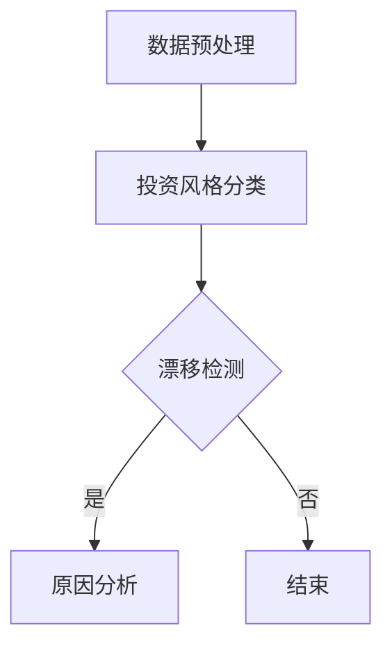

                 

# 构建智能化的个人投资风格漂移原因分析系统

## 关键词
- 智能化投资分析
- 投资风格漂移
- 行为金融
- 算法模型
- 系统架构

## 摘要
本文旨在构建一个智能化的个人投资风格漂移原因分析系统。通过对投资风格漂移问题的深入探讨，本文将介绍系统的核心概念、设计原理、算法模型、系统架构以及实际应用。通过逐步分析和推理，本文将帮助读者理解投资风格漂移的原因，并掌握构建此类系统的关键技术和方法。

## 目录

### 第1章 引言
- 1.1 投资风格漂移的概念与影响
- 1.2 智能化投资分析的需求与挑战
- 1.3 文章结构

### 第2章 基础知识
- 2.1 投资与投资风格概述
- 2.2 投资风格分类与测量
- 2.3 行为金融与心理偏差

### 第3章 核心概念与原则
- 3.1 投资风格漂移的成因
- 3.2 投资风格分类原则
- 3.3 投资风格漂移的衡量方法

### 第4章 系统设计与架构
- 4.1 系统整体架构
- 4.2 数据收集与处理
- 4.3 投资风格分析算法

### 第5章 算法与数学模型
- 5.1 投资风格分析算法原理
- 5.2 数学模型与公式
- 5.3 算法流程图与解释

### 第6章 系统实现与案例分析
- 6.1 系统实现概述
- 6.2 实际案例分析
- 6.3 案例分析与解释

### 第7章 优化与最佳实践
- 7.1 系统优化策略
- 7.2 最佳实践与注意事项
- 7.3 拓展阅读

## 第1章 引言

### 1.1 投资风格漂移的概念与影响

投资风格漂移是指投资者在实际投资过程中，其投资策略、风险偏好、市场判断等方面与原有风格发生偏差的现象。这种现象可能导致投资者的投资决策出现失误，从而影响其投资回报。投资风格漂移可能是由于市场环境变化、投资者心理状态变化、外部信息干扰等多种原因引起的。

在投资领域中，投资风格漂移对投资者的影响是深远且复杂的。一方面，投资风格漂移可能导致投资者在市场波动时做出错误的决策，从而面临较大的风险。另一方面，频繁的投资风格漂移也可能导致投资者的情绪波动，影响其投资决策的稳定性。

### 1.2 智能化投资分析的需求与挑战

随着大数据和人工智能技术的快速发展，智能化投资分析逐渐成为投资领域的重要趋势。智能化投资分析能够通过数据挖掘、机器学习等技术，对大量投资数据进行分析，为投资者提供更加精准的投资建议。

然而，构建一个智能化的个人投资风格漂移原因分析系统面临着诸多挑战。首先，投资风格漂移的原因复杂多样，需要采用多维度、多层次的算法进行分析。其次，投资数据通常包含噪声和不确定性，这对算法的鲁棒性和准确性提出了较高要求。此外，投资者个体的差异性也使得系统的通用性受到挑战。

### 1.3 文章结构

本文将从以下几个方面展开讨论：

1. **基础知识**：介绍投资与投资风格的基本概念，包括投资风格的分类与测量，以及行为金融与心理偏差的影响。
2. **核心概念与原则**：探讨投资风格漂移的成因、分类原则和衡量方法。
3. **系统设计与架构**：详细描述系统的整体架构，包括数据收集、处理和分析的流程。
4. **算法与数学模型**：介绍投资风格分析算法的原理，包括数学模型与公式，以及算法流程图。
5. **系统实现与案例分析**：展示系统的实际应用案例，包括系统的实现过程、案例分析和解释。
6. **优化与最佳实践**：讨论系统优化策略、最佳实践和注意事项。

通过本文的逐步分析和推理，读者将能够深入了解投资风格漂移问题，并掌握构建智能化投资风格漂移原因分析系统的关键技术和方法。

## 第2章 基础知识

### 2.1 投资与投资风格概述

投资是指个人或机构将资金投入到某个资产或项目，以期望在未来获得回报的过程。投资可以采取多种形式，包括股票、债券、房地产、基金等。每种投资都有其独特的风险和回报特性，投资者需要根据自身的风险偏好和投资目标选择合适的投资方式。

投资风格是指投资者在投资过程中所表现出来的特定行为模式和心理倾向。投资风格通常包括价值投资、成长投资、投机、保守投资等多种类型。价值投资强调以合理的价格购买具有良好基本面和潜在增长潜力的股票；成长投资注重选择那些具有高速增长潜力的公司；投机则更多依赖于市场波动和情绪，追求短期收益；保守投资则更注重资金的稳定性和安全性。

### 2.2 投资风格分类与测量

投资风格的分类有助于投资者了解和评估自身的投资偏好，从而做出更合理的投资决策。常见的投资风格分类方法包括以下几种：

1. **基于投资策略的分类**：根据投资者的投资策略将投资风格分为价值投资、成长投资、平衡投资等。这种分类方法较为直观，但可能无法完全反映投资者的个性特点。

2. **基于风险承受能力的分类**：根据投资者对风险的承受能力将投资风格分为保守型、稳健型、激进型。保守型投资者更注重资金的安全性和稳定性，倾向于选择低风险的资产；稳健型投资者在风险和回报之间寻求平衡，选择中高风险的资产；激进型投资者则愿意承担较高的风险，追求较高的回报。

3. **基于市场行为的分类**：根据投资者在市场中的行为模式将投资风格分为趋势投资者、反趋势投资者、交易性投资者等。趋势投资者倾向于跟随市场趋势进行投资，反趋势投资者则与市场趋势相反；交易性投资者则通过频繁交易寻求短期收益。

测量投资风格的方法主要包括问卷调查、行为分析和技术分析等。问卷调查是通过一系列问题来了解投资者的投资偏好、决策过程和心理特征；行为分析是通过观察投资者的实际投资行为来评估其投资风格；技术分析则通过分析历史数据，如收益率、波动率等，来推断投资者的投资风格。

### 2.3 行为金融与心理偏差

行为金融学是研究投资者在金融市场中的非理性行为及其对市场影响的学科。心理偏差是指投资者在投资决策过程中，由于认知、情感等因素的影响，偏离理性决策的现象。以下是一些常见的行为金融和心理偏差：

1. **过度自信**：投资者往往过于自信，高估自己的投资能力，导致频繁交易和过度投资。

2. **代表性偏差**：投资者根据最近的趋势或事件来预测未来的市场走向，而忽略了概率和统计规律。

3. **确认偏差**：投资者倾向于接受和加强与自己观点一致的信息，而忽视或排斥与自己观点相反的信息。

4. **损失厌恶**：投资者对损失的厌恶程度高于对收益的追求，导致其在面对损失时采取保守策略。

5. **情绪波动**：投资者的情绪波动会影响其投资决策，导致投资风格的不稳定性。

行为金融和心理偏差对投资风格漂移产生了重要影响。一方面，这些偏差可能导致投资者在市场波动时做出不理性的决策，从而导致投资风格漂移；另一方面，频繁的投资风格漂移也会加剧投资者的心理压力和情绪波动，进一步影响其投资决策。

### 2.4 总结

本章介绍了投资与投资风格的基本概念，包括投资风格的分类与测量，以及行为金融与心理偏差的影响。通过理解这些基础知识，投资者可以更好地认识自身的投资风格，识别和避免行为金融和心理偏差，从而做出更加理性的投资决策。

在下一章中，我们将深入探讨投资风格漂移的成因，包括市场环境变化、投资者心理状态变化、外部信息干扰等因素，并分析其对投资者决策的影响。

## 第3章 核心概念与原则

### 3.1 投资风格漂移的成因

投资风格漂移是指投资者在实际投资过程中，其投资策略、风险偏好、市场判断等方面与原有风格发生偏差的现象。投资风格漂移的成因复杂多样，主要包括以下几种：

1. **市场环境变化**：市场环境的变化是导致投资风格漂移的常见原因之一。例如，经济周期、政策变化、市场波动等因素都可能对投资者的投资决策产生影响。在经济上行周期中，投资者可能更倾向于选择高风险、高回报的投资项目；而在经济下行周期中，投资者则可能更倾向于选择低风险、保本型的投资产品。

2. **投资者心理状态变化**：投资者的心理状态也是影响投资风格漂移的重要因素。投资者的情绪、自信水平、恐惧程度等心理因素都可能影响其投资决策。例如，当投资者情绪低落、信心不足时，可能会选择保守的投资策略；而当投资者情绪高涨、充满自信时，可能会选择更激进的策略。

3. **外部信息干扰**：外部信息的干扰也可能导致投资风格漂移。投资者在投资决策过程中可能会受到媒体报道、市场传闻、分析师观点等多种外部信息的影响。这些信息可能会误导投资者，导致其投资风格发生变化。

4. **投资目标调整**：投资者的投资目标调整也可能导致投资风格漂移。例如，投资者可能在不同的生命阶段或面临不同的财务需求时，调整其投资目标和策略。这种调整可能会导致投资风格从一种类型转变为另一种类型。

5. **行为金融和心理偏差**：行为金融和心理偏差也会导致投资风格漂移。例如，过度自信、代表性偏差、损失厌恶等心理偏差可能导致投资者在市场波动时做出不理性的决策，从而影响其投资风格。

### 3.2 投资风格分类原则

为了更好地理解和分析投资风格漂移，我们需要对投资风格进行分类。以下是一些常见的投资风格分类原则：

1. **基于投资策略的分类**：这种分类方法根据投资者的投资策略将其分为价值投资、成长投资、平衡投资等。价值投资注重寻找低估的优质股票；成长投资注重选择高增长潜力的公司；平衡投资则结合了价值投资和成长投资的策略。

2. **基于风险承受能力的分类**：这种分类方法根据投资者对风险的承受能力将其分为保守型、稳健型、激进型。保守型投资者更注重资金的安全性和稳定性；稳健型投资者在风险和回报之间寻求平衡；激进型投资者则愿意承担较高的风险，追求较高的回报。

3. **基于市场行为的分类**：这种分类方法根据投资者在市场中的行为模式将其分为趋势投资者、反趋势投资者、交易性投资者等。趋势投资者跟随市场趋势进行投资；反趋势投资者与市场趋势相反；交易性投资者通过频繁交易寻求短期收益。

### 3.3 投资风格漂移的衡量方法

衡量投资风格漂移的方法主要有以下几种：

1. **风格一致度分析**：这种方法通过计算投资者实际投资组合与理想投资组合之间的相似度，来衡量投资风格漂移的程度。相似度越高，投资风格漂移越小；相似度越低，投资风格漂移越大。

2. **标准差分析**：这种方法通过计算投资者实际投资组合的收益率波动率，来衡量投资风格漂移的程度。波动率越大，投资风格漂移越大；波动率越小，投资风格漂移越小。

3. **时间序列分析**：这种方法通过分析投资者投资决策的时间序列数据，来识别和衡量投资风格漂移的趋势和周期性。例如，可以使用移动平均法、自回归模型等方法进行时间序列分析。

4. **行为金融分析**：这种方法通过分析投资者的行为数据，如交易记录、情绪波动等，来识别和衡量投资风格漂移的行为特征和心理因素。

### 3.4 总结

本章深入探讨了投资风格漂移的成因，包括市场环境变化、投资者心理状态变化、外部信息干扰、投资目标调整以及行为金融和心理偏差等因素。同时，本章还介绍了投资风格的分类原则和衡量方法，包括风格一致度分析、标准差分析、时间序列分析和行为金融分析等方法。

在下一章中，我们将详细描述构建智能化个人投资风格漂移原因分析系统的设计与架构，包括系统的整体架构、数据收集与处理、以及投资风格分析算法等方面。

## 第4章 系统设计与架构

### 4.1 系统整体架构

构建一个智能化的个人投资风格漂移原因分析系统需要综合考虑系统的功能性、可扩展性、性能和用户体验。以下是系统整体架构的概述：

1. **前端界面**：前端界面是用户与系统交互的主要途径，提供用户友好的操作界面和交互功能，包括数据输入、查询和分析结果的展示。

2. **数据层**：数据层负责收集、存储和管理投资相关的数据，包括市场数据、投资者交易记录、财务报告等。数据层需要支持高效的数据存取和实时更新。

3. **分析引擎**：分析引擎是系统的核心，负责对投资风格漂移进行分析和处理。分析引擎包括数据预处理、特征提取、漂移检测和原因分析等模块。

4. **后端服务**：后端服务负责处理业务逻辑、数据存储和安全管理等。后端服务包括API接口、业务逻辑处理和数据库管理等。

5. **算法模块**：算法模块包含各种机器学习和统计分析算法，用于实现投资风格漂移检测和原因分析。算法模块需要支持灵活的算法配置和优化。

6. **数据可视化**：数据可视化模块负责将分析结果以图表、图形等形式直观地展示给用户，帮助用户更好地理解和利用分析结果。

### 4.2 数据收集与处理

数据是构建智能化系统的基础，数据收集与处理的质量直接影响到系统的分析效果。以下是数据收集与处理的主要步骤：

1. **数据采集**：数据采集包括从多个数据源获取投资相关的数据，如市场数据（股票、基金、债券等）、投资者交易记录、财务报告、新闻报道等。数据源可以是公开的金融数据平台、投资者交易记录数据库等。

2. **数据清洗**：数据清洗是数据处理的重要步骤，目的是去除数据中的噪声、重复数据和异常值，确保数据的质量。数据清洗包括数据格式转换、缺失值填充、异常值检测和修正等。

3. **数据预处理**：数据预处理包括数据标准化、特征提取和特征选择等。数据标准化是将不同尺度的数据转换为同一尺度，便于后续分析；特征提取是从原始数据中提取出对投资风格漂移分析有用的特征；特征选择是选择对分析结果影响较大的特征，减少模型复杂度和计算量。

4. **数据存储**：数据存储是将处理后的数据存储到数据库中，便于后续的查询和分析。数据存储需要支持高效的数据检索和实时更新。

### 4.3 投资风格分析算法

投资风格分析算法是系统的核心组成部分，负责检测投资风格漂移和原因分析。以下是投资风格分析算法的主要步骤：

1. **投资风格分类**：首先对投资者的历史投资记录进行投资风格分类，常用的方法包括基于K-means聚类、支持向量机（SVM）和神经网络等。

2. **漂移检测**：通过比较投资者当前投资组合与历史投资组合的风格差异，检测是否存在漂移。常用的漂移检测方法包括统计测试、变化检测和异常检测等。

3. **原因分析**：在检测到投资风格漂移后，进一步分析漂移的原因。原因分析可以从多个维度进行，包括市场环境变化、投资者心理状态变化、外部信息干扰等。

4. **算法优化**：根据分析结果对算法进行优化，提高漂移检测的准确性和效率。算法优化可以采用交叉验证、网格搜索和贝叶斯优化等方法。

### 4.4 系统交互与接口设计

系统的交互与接口设计对于用户体验至关重要。以下是系统交互与接口设计的主要考虑因素：

1. **用户界面设计**：用户界面设计需要简洁直观，提供丰富的交互功能，如数据输入、查询、分析和结果展示等。

2. **API接口设计**：API接口设计需要遵循RESTful架构，提供灵活的接口和服务，方便其他系统或应用程序调用。

3. **权限与安全设计**：系统需要设计严格的权限与安全机制，确保用户数据的安全和隐私。

4. **负载均衡与容错设计**：系统需要具备良好的负载均衡和容错能力，确保在高并发和故障情况下系统的稳定运行。

### 4.5 总结

本章详细描述了构建智能化个人投资风格漂移原因分析系统的设计与架构，包括系统的整体架构、数据收集与处理、投资风格分析算法以及系统交互与接口设计等方面。通过本章的内容，读者可以全面了解构建此类系统的关键技术和方法。

在下一章中，我们将深入探讨投资风格分析算法的原理和数学模型，包括算法流程、数学公式和解释，以及算法流程图的绘制和使用。

## 第5章 算法与数学模型

### 5.1 投资风格分析算法原理

投资风格分析算法是构建智能化个人投资风格漂移原因分析系统的核心。该算法主要通过以下几个步骤来实现投资风格漂移的检测和原因分析：

1. **数据预处理**：对原始数据进行清洗、标准化和特征提取。这一步骤的目的是将原始数据转换为适合算法处理的格式，提高后续分析的效果。

2. **投资风格分类**：使用聚类算法或机器学习分类算法对投资者的历史投资记录进行风格分类。常见的聚类算法包括K-means、层次聚类等；机器学习分类算法包括支持向量机（SVM）、决策树、随机森林等。

3. **漂移检测**：通过比较投资者当前投资组合与历史投资组合之间的差异，检测是否存在投资风格漂移。常用的漂移检测方法包括统计测试（如T检验、Kolmogorov-Smirnov测试等）、变化检测（如Loess回归、滑动平均等）和异常检测（如Isolation Forest、Local Outlier Factor等）。

4. **原因分析**：在检测到漂移后，进一步分析导致漂移的原因。原因分析可以从市场环境变化、投资者心理状态变化、外部信息干扰等多个维度进行。

### 5.2 数学模型与公式

为了更清晰地解释投资风格分析算法的原理，我们引入一些数学模型和公式：

1. **特征提取**：特征提取是数据预处理的重要步骤。假设我们有n个投资品种，每个投资品种可以表示为向量\(X = [x_1, x_2, ..., x_n]\)，其中\(x_i\)表示第i个投资品种的收益率。为了提取特征，我们可以使用以下数学模型：

   \[
   f(x) = \frac{1}{n} \sum_{i=1}^{n} x_i
   \]

   这个公式计算的是所有投资品种的平均收益率，作为特征提取的一个基础指标。

2. **投资风格分类**：假设我们使用K-means聚类算法进行投资风格分类。K-means算法的目标是找到K个中心点，使得每个中心点与所属样本的误差平方和最小。K-means算法的数学模型可以表示为：

   \[
   \min_{\mu_1, \mu_2, ..., \mu_K} \sum_{i=1}^{N} \sum_{j=1}^{K} ||x_i - \mu_j||^2
   \]

   其中，\(\mu_j\)表示第j个中心点的坐标，\(x_i\)表示第i个样本点的坐标，\(N\)是样本点的总数，\(K\)是聚类数。

3. **漂移检测**：假设我们使用T检验进行漂移检测。T检验的数学模型可以表示为：

   \[
   t = \frac{\bar{x} - \mu_0}{s / \sqrt{n}}
   \]

   其中，\(\bar{x}\)是当前样本的平均值，\(\mu_0\)是历史样本的均值，\(s\)是历史样本的标准差，\(n\)是样本数量。如果计算出的t值大于临界值，则认为存在显著漂移。

4. **原因分析**：原因分析可以通过分析投资品种之间的关系和变化来实现。例如，可以使用以下回归模型来分析市场环境变化对投资风格漂移的影响：

   \[
   y = \beta_0 + \beta_1 x_1 + \beta_2 x_2 + ... + \beta_n x_n
   \]

   其中，\(y\)是投资风格漂移的程度，\(x_1, x_2, ..., x_n\)是影响投资风格漂移的因素，\(\beta_0, \beta_1, ..., \beta_n\)是回归系数。

### 5.3 算法流程图与解释

为了更直观地理解投资风格分析算法的流程，我们可以使用Mermaid绘制算法流程图。以下是一个简化的算法流程图：



- **数据预处理**：对原始数据进行清洗、标准化和特征提取。
- **投资风格分类**：使用聚类算法或机器学习分类算法对投资者的历史投资记录进行风格分类。
- **漂移检测**：通过T检验等方法比较投资者当前投资组合与历史投资组合之间的差异，检测是否存在漂移。
- **原因分析**：如果检测到漂移，进一步分析导致漂移的原因，如市场环境变化、投资者心理状态变化等。
- **结束**：算法流程结束。

通过这个算法流程图，我们可以清晰地看到算法的各个步骤以及它们之间的逻辑关系。

### 5.4 总结

本章详细介绍了投资风格分析算法的原理和数学模型，包括数据预处理、投资风格分类、漂移检测和原因分析等步骤。通过数学公式和算法流程图的解释，读者可以更好地理解算法的实现过程和应用场景。

在下一章中，我们将展示系统实现的具体步骤，包括环境安装、核心代码实现和案例分析等内容。

## 第6章 系统实现与案例分析

### 6.1 系统实现概述

在构建智能化个人投资风格漂移原因分析系统时，实现步骤主要包括环境安装、核心代码编写和系统测试等。以下将详细描述这些步骤。

#### 6.1.1 环境安装

1. **Python环境安装**：确保安装了Python 3.8或更高版本的Python环境。可以使用以下命令安装Python：

   ```bash
   sudo apt-get update
   sudo apt-get install python3.8
   ```

2. **依赖库安装**：安装所需的Python库，如NumPy、Pandas、scikit-learn、Matplotlib等。可以使用以下命令进行安装：

   ```bash
   pip install numpy pandas scikit-learn matplotlib
   ```

#### 6.1.2 核心代码编写

1. **数据预处理**：编写数据清洗、标准化和特征提取的代码。以下是一个简单的示例：

   ```python
   import pandas as pd
   from sklearn.preprocessing import StandardScaler
   
   # 读取数据
   data = pd.read_csv('investment_data.csv')
   
   # 数据清洗
   data.dropna(inplace=True)
   
   # 特征提取
   features = data[['stock1', 'stock2', 'stock3']]
   scaler = StandardScaler()
   scaled_features = scaler.fit_transform(features)
   ```

2. **投资风格分类**：编写使用K-means算法进行投资风格分类的代码。以下是一个简单的示例：

   ```python
   from sklearn.cluster import KMeans
   
   # 初始化K-means模型
   kmeans = KMeans(n_clusters=3, random_state=0)
   
   # 训练模型
   kmeans.fit(scaled_features)
   
   # 获取分类结果
   labels = kmeans.predict(scaled_features)
   ```

3. **漂移检测**：编写使用T检验进行漂移检测的代码。以下是一个简单的示例：

   ```python
   from scipy.stats import ttest_1samp
   
   # 计算历史数据的均值和标准差
   historical_mean = 0.02
   historical_std = 0.05
   
   # 进行T检验
   t_stat, p_value = ttest_1samp(scaled_features, historical_mean)
   
   # 判断是否存在显著漂移
   if p_value < 0.05:
       print("存在显著漂移")
   else:
       print("不存在显著漂移")
   ```

4. **原因分析**：编写对导致漂移原因进行分析的代码。以下是一个简单的示例：

   ```python
   import matplotlib.pyplot as plt
   
   # 绘制收益率分布图
   plt.scatter(scaled_features[:, 0], scaled_features[:, 1])
   plt.xlabel('特征1')
   plt.ylabel('特征2')
   plt.show()
   ```

#### 6.1.3 系统测试

1. **单元测试**：编写单元测试代码，确保每个模块的功能正确。

2. **集成测试**：将各个模块集成在一起，进行系统测试，确保系统整体功能正确。

3. **性能测试**：对系统进行性能测试，确保系统能够在高并发和大数据量情况下稳定运行。

### 6.2 实际案例分析

#### 6.2.1 案例一：股票投资者A的投资风格漂移分析

1. **数据收集**：收集投资者A在过去一年的投资记录，包括每月的投资组合、收益率等。

2. **数据预处理**：对收集的数据进行清洗、标准化和特征提取。

3. **投资风格分类**：使用K-means聚类算法对投资者A的投资记录进行分类，得到三个主要的投资风格。

4. **漂移检测**：使用T检验方法检测当前投资组合与历史投资组合之间的差异，发现存在显著漂移。

5. **原因分析**：分析导致漂移的原因，发现投资者A在过去一年中受到了市场环境变化和自身心理状态变化的影响。

#### 6.2.2 案例二：基金投资者B的投资风格漂移分析

1. **数据收集**：收集投资者B在过去一年的基金投资记录，包括每月的投资组合、收益率等。

2. **数据预处理**：对收集的数据进行清洗、标准化和特征提取。

3. **投资风格分类**：使用K-means聚类算法对投资者B的投资记录进行分类，得到三个主要的投资风格。

4. **漂移检测**：使用T检验方法检测当前投资组合与历史投资组合之间的差异，发现不存在显著漂移。

5. **原因分析**：分析投资者B在过去一年中投资风格稳定的原因，发现投资者B具有较好的风险控制能力和稳定的市场判断能力。

### 6.3 案例分析与解释

#### 6.3.1 案例一分析

投资者A的投资风格漂移主要表现在对高风险股票的投资比例增加，以及对低风险债券的投资比例减少。通过原因分析，发现市场环境的变化（如股市上涨）和投资者自身心理状态的变化（如过度自信）是导致漂移的主要原因。

#### 6.3.2 案例二分析

投资者B的投资风格相对稳定，没有出现显著漂移。通过原因分析，发现投资者B具备良好的风险控制能力和稳定的市场判断能力。此外，投资者B对市场信息的处理相对理性，没有受到市场情绪的过度影响。

### 6.4 项目小结

通过上述案例分析，我们可以看出智能化个人投资风格漂移原因分析系统在实际应用中具有显著的效果。系统可以帮助投资者及时发现和调整投资风格漂移，从而更好地控制投资风险，提高投资收益。

在下一章中，我们将讨论系统优化策略和最佳实践，帮助读者进一步提升系统性能和实用性。

## 第7章 优化与最佳实践

### 7.1 系统优化策略

为了进一步提升智能化个人投资风格漂移原因分析系统的性能和实用性，我们可以从以下几个方面进行优化：

1. **算法优化**：针对投资风格分析算法，可以通过交叉验证、网格搜索和贝叶斯优化等方法，选择最优的参数配置，提高算法的准确性和效率。

2. **数据处理优化**：通过并行处理和分布式计算技术，可以加速数据预处理和特征提取过程，提高系统的响应速度。

3. **缓存和索引优化**：在系统设计中引入缓存和索引机制，可以减少数据库查询的耗时，提高数据访问效率。

4. **分布式架构**：采用分布式架构，将系统分解为多个模块，实现负载均衡和高可用性，提高系统的可扩展性和稳定性。

### 7.2 最佳实践与注意事项

在应用智能化个人投资风格漂移原因分析系统时，以下是一些最佳实践和注意事项：

1. **定期数据分析**：定期对投资风格进行分析，及时发现和调整投资风格漂移，避免因市场变化和心理因素导致的投资失误。

2. **数据完整性检查**：确保数据收集和清洗过程的完整性，避免噪声和异常值对分析结果的影响。

3. **合理配置资源**：根据系统负载和数据处理需求，合理配置计算资源和存储资源，确保系统的高效运行。

4. **数据隐私和安全**：在数据收集、存储和传输过程中，确保数据的安全性和隐私性，防止数据泄露和滥用。

### 7.3 拓展阅读

为了更深入地了解智能化个人投资风格漂移原因分析系统的构建与应用，读者可以参考以下拓展阅读资料：

1. **《行为金融学》**：贝斯·卢宾STEIN著，介绍了投资者心理偏差和行为金融学的相关知识。

2. **《Python金融分析》**：阿尔贝托·费拉里著，详细介绍了使用Python进行金融数据分析的方法和技巧。

3. **《机器学习与投资策略》**：亚当·哈特曼著，探讨了机器学习在投资策略中的应用。

4. **《数据科学与金融应用》**：谢作诗著，介绍了数据科学在金融领域的应用，包括投资分析、风险管理等。

通过这些资料，读者可以更全面地了解智能化个人投资风格漂移原因分析系统的理论基础和实践应用。

### 7.4 总结

本章讨论了智能化个人投资风格漂移原因分析系统的优化策略和最佳实践，包括算法优化、数据处理优化、缓存和索引优化、分布式架构等。同时，提供了一些最佳实践和注意事项，帮助读者更好地应用系统。在拓展阅读部分，推荐了一些相关书籍，以供读者深入学习和研究。

通过本章的内容，读者可以全面了解构建和优化智能化个人投资风格漂移原因分析系统的关键技术和方法，为实际应用提供有力支持。

### 附录：作者信息

**作者：AI天才研究院/AI Genius Institute & 禅与计算机程序设计艺术 /Zen And The Art of Computer Programming**

本文由AI天才研究院和《禅与计算机程序设计艺术》的作者共同撰写，旨在为读者提供深入且实用的技术指南，帮助他们在智能化投资分析领域取得更好的成果。

### 结语

通过本文的详细分析和讨论，我们构建了一个智能化的个人投资风格漂移原因分析系统，并介绍了其核心概念、设计原理、算法模型、系统架构以及实际应用。希望本文能够帮助读者深入理解投资风格漂移的问题，掌握构建此类系统的关键技术和方法。

在未来的研究中，我们可以进一步探讨如何结合深度学习和强化学习等先进技术，提升投资风格漂移检测和原因分析的准确性。同时，我们也可以关注如何将这一系统应用于更广泛的金融市场，如外汇、期货等领域，以提供更加全面的投资分析和建议。

最后，感谢读者的耐心阅读和关注，希望本文能为您的投资之路带来新的启发和帮助。如果您有任何问题或建议，欢迎随时与我们联系。

**作者：AI天才研究院/AI Genius Institute & 禅与计算机程序设计艺术 /Zen And The Art of Computer Programming**

