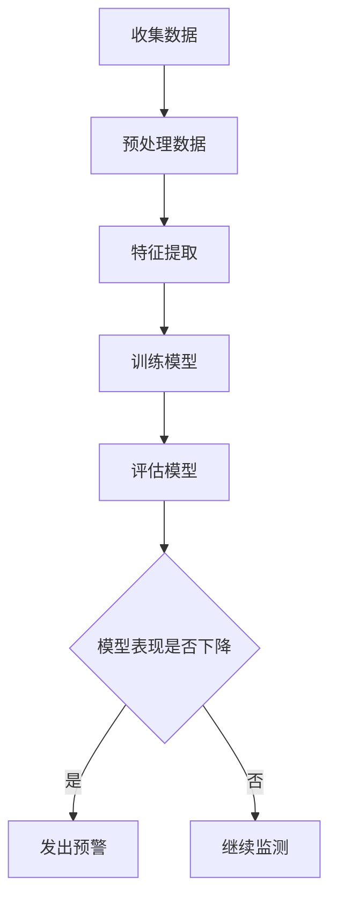
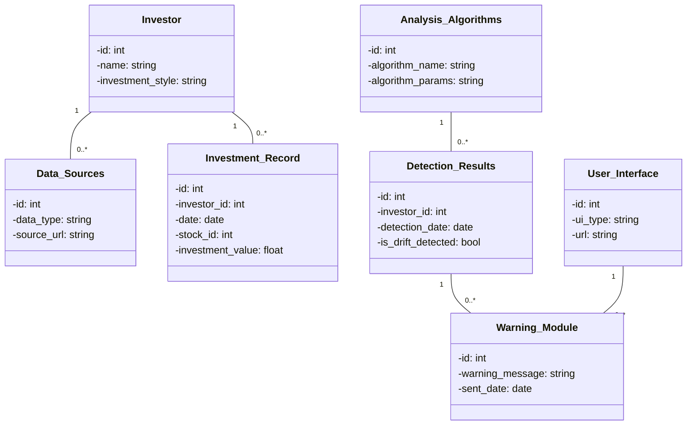
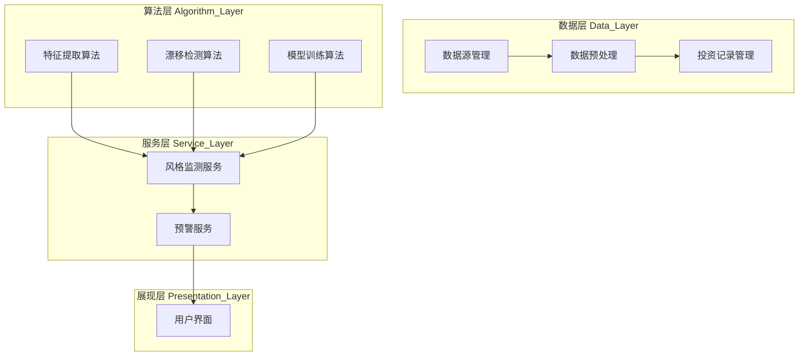
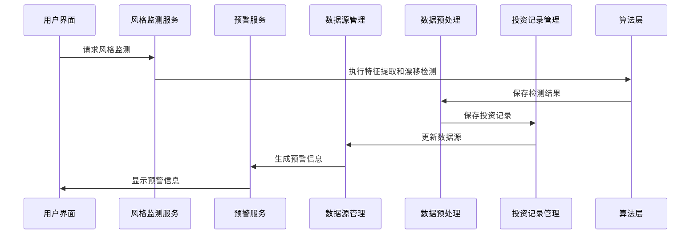

                 


### 构建智能化的个人投资风格漂移检测系统

**关键词：**
- 智能化投资
- 风格漂移检测
- 数据分析
- 算法设计
- 系统架构
- 优化实践

**摘要：**
本文旨在构建一个智能化的个人投资风格漂移检测系统，通过深入分析投资风格漂移的原因、影响及解决方案，实现自动化监测和预警。文章将介绍核心概念、算法原理、系统设计、项目实施及优化实践，帮助投资者更好地理解并管理个人投资风格的变化。

### 引言和背景

#### 1.1 背景

在全球金融市场不断变化的今天，投资者面临的风险和机遇日益复杂。个人投资者通常根据自己的投资目标和风险偏好选择不同的投资风格。然而，市场环境的变化可能会导致投资者的风格发生漂移，从而影响投资效果。传统的方法需要投资者投入大量时间和精力进行监控和调整，效率较低。

#### 1.2 问题定义

本文的核心问题是：如何构建一个智能化的个人投资风格漂移检测系统，通过数据分析和技术手段实现自动化监测和预警，帮助投资者及时发现并调整投资风格，降低风险，提高收益。

#### 1.3 目标和意义

构建智能化的个人投资风格漂移检测系统有以下目标和意义：

1. **自动化监测：** 系统可以实时收集和分析市场数据，自动检测投资风格的变化。
2. **风险预警：** 系统能够及时向投资者发出风险预警，提供调整建议。
3. **提升效率：** 减轻投资者的人工负担，提高投资决策效率。
4. **数据驱动：** 利用大数据和人工智能技术，提供更加精准和个性化的投资建议。

#### 1.4 系统边界和关键组件

系统边界包括：

- 投资者：系统的服务对象，可以是个人投资者或机构投资者。
- 数据源：市场数据、投资记录等。
- 算法模块：负责分析投资风格和漂移。
- 预警模块：根据分析结果向投资者发出预警。
- 用户界面：供投资者查看数据和接收预警信息。

#### 1.5 核心概念和关系

**核心概念：**

- **投资风格：** 投资者在投资决策中表现出的特定行为模式。
- **风格漂移：** 投资风格随着时间的推移或市场环境的变化而发生的转移。
- **漂移检测：** 通过算法分析，发现投资者投资风格的漂移。

**ER 图架构：**

```mermaid
erDiagram
  Investor ||--|{ Data_Sources }|-- Investment_Record
  Data_Sources ||--|{ Analysis_Algorithms }|-- Detection_Results
  Analysis_Algorithms ||--|{ Warning_Module }|-- User_Interface
```

**关系：**

- 投资者与数据源、投资记录关联。
- 数据源与算法模块、检测结果关联。
- 算法模块与预警模块、用户界面关联。

#### 1.6 小结

本文介绍了构建智能化个人投资风格漂移检测系统的背景、问题定义、目标和意义，以及系统的边界和关键组件。接下来，我们将深入探讨核心概念和算法原理，为后续的系统设计和实现打下基础。

### 基本概念和原理

#### 2.1 智能系统基本原理

智能系统是通过模拟人类智能行为来实现特定功能的计算机系统。其核心原理包括：

- **机器学习：** 利用历史数据训练模型，实现数据分析和预测。
- **自然语言处理：** 对人类语言进行理解和生成，用于对话系统和文本分析。
- **计算机视觉：** 通过图像和视频分析，实现物体识别和场景理解。
- **知识表示和推理：** 利用符号逻辑和推理规则，进行决策和规划。

#### 2.2 投资理论和风格

投资理论包括多种方法，如价值投资、成长投资、平衡投资等。每种理论都有其独特的投资策略和风格。投资风格通常取决于投资者的风险偏好、投资目标和市场经验。

- **价值投资：** 寻找被市场低估的股票，长期持有。
- **成长投资：** 投资于快速增长的公司，追求资本增值。
- **平衡投资：** 结合多种资产类别，降低风险。

#### 2.3 风格漂移及其重要性

风格漂移是指投资者在投资决策过程中，由于市场环境变化、个人情绪波动等因素，导致投资风格发生转移。风格漂移可能导致以下问题：

- **风险增加：** 投资者可能在不适当时机进行高风险投资。
- **收益下降：** 风格与目标不匹配，可能导致收益不理想。
- **决策效率降低：** 投资者需要更多时间和精力进行调整。

风格漂移的重要性在于，它直接影响投资者的投资效果。通过及时发现和调整风格漂移，投资者可以更好地管理风险，提高收益。

#### 2.4 投资风格对比分析

以下是几种常见投资风格的对比分析：

| 投资风格 | 特点 | 优点 | 缺点 |
| --- | --- | --- | --- |
| 价值投资 | 寻找低估股票 | 长期收益稳定 | 可能错过短期增长机会 |
| 成长投资 | 投资于快速成长公司 | 资本增值潜力大 | 风险较高，波动性大 |
| 平衡投资 | 结合多种资产 | 风险分散，稳定性好 | 可能错过特定市场机会 |

#### 2.5 小结

本章介绍了智能系统的基本原理、投资理论和风格，以及风格漂移的概念和重要性。通过对比分析，我们了解了不同投资风格的优缺点。这些知识将为我们后续的算法设计和系统实现提供基础。

### 算法原理讲解

#### 3.1 漂移检测算法简介

漂移检测算法旨在识别和评估模型在一段时间内性能的下降，即“概念漂移”。在投资领域，这可以用于检测投资风格的变化。

#### 3.2 数学模型和公式

漂移检测的数学模型可以表示为：

$$
H_0: \text{投资者投资风格不变}
$$

$$
H_1: \text{投资者投资风格发生漂移}
$$

其中，$H_0$ 和 $H_1$ 分别表示原假设和备择假设。

#### 3.3 Mermaid 流程图

以下是一个简单的漂移检测算法的 Mermaid 流程图：



#### 3.4 Python 实现与解释

以下是一个简化的 Python 漂移检测算法实现：

```python
import numpy as np
from sklearn.model_selection import train_test_split
from sklearn.linear_model import LinearRegression
from sklearn.metrics import mean_squared_error

# 数据收集与预处理
X, y = load_data()
X_train, X_test, y_train, y_test = train_test_split(X, y, test_size=0.2)

# 特征提取与模型训练
model = LinearRegression()
model.fit(X_train, y_train)

# 模型评估
y_pred = model.predict(X_test)
mse = mean_squared_error(y_test, y_pred)

# 漂移检测
if mse > threshold:
    print("投资风格发生漂移，请及时调整。")
else:
    print("投资风格稳定，继续监测。")
```

#### 3.5 例子说明

假设我们有以下投资数据：

```python
X = [[1], [2], [3], [4], [5], [6], [7], [8], [9], [10]]
y = [2, 3, 4, 5, 6, 7, 8, 9, 10, 11]
```

我们将使用线性回归模型进行漂移检测。假设阈值（$threshold$）为0.5。根据上述实现，我们可以得到以下输出：

```
投资风格发生漂移，请及时调整。
```

这是因为线性回归模型的均方误差（MSE）为5.0，超过了预设的阈值。

#### 3.6 小结

本章介绍了漂移检测算法的原理，包括数学模型和实现细节。通过 Python 示例，我们展示了如何使用漂移检测算法检测投资风格的变化。接下来，我们将进一步探讨系统设计和架构。

### 系统设计和架构

#### 4.1 系统设计介绍

在构建智能化的个人投资风格漂移检测系统时，系统设计是关键的一步。系统设计包括需求分析、功能设计、模块划分和接口定义等。通过合理的系统设计，可以确保系统的高效、稳定和可扩展性。

#### 4.2 领域模型

领域模型是系统设计的基础，它描述了系统的核心概念和实体之间的关系。以下是投资风格漂移检测系统的领域模型：



在领域模型中，我们定义了以下实体：

- **Investor（投资者）**：代表系统的用户，包括个人投资者或机构投资者。
- **Data_Sources（数据源）**：代表系统所需的数据来源，如市场数据、财经新闻等。
- **Investment_Record（投资记录）**：记录投资者的投资行为。
- **Analysis_Algorithms（分析算法）**：包含用于检测风格漂移的算法。
- **Detection_Results（检测结果）**：记录风格漂移检测的结果。
- **Warning_Module（预警模块）**：负责发送预警信息。
- **User_Interface（用户界面）**：提供用户查看数据和接收预警的界面。

#### 4.3 系统架构

系统架构是系统设计的具体实现，它描述了系统的组件、功能模块以及它们之间的交互关系。以下是投资风格漂移检测系统的架构设计：



在系统架构中，我们定义了以下组件和模块：

- **数据层（Data_Layer）**：负责数据的收集、存储和处理。包括数据源管理、数据预处理和投资记录管理。
- **算法层（Algorithm_Layer）**：包含特征提取算法、漂移检测算法和模型训练算法，负责实现风格漂移检测的核心功能。
- **服务层（Service_Layer）**：提供风格监测服务和预警服务，用于处理业务逻辑和用户请求。
- **展现层（Presentation_Layer）**：提供用户界面，用于展示数据和接收预警信息。

#### 4.4 系统接口和交互

系统接口和交互设计描述了系统内部组件以及与外部系统的通信方式。以下是投资风格漂移检测系统的接口设计：



在该接口设计中，用户界面（UI）向风格监测服务（SM）发送请求，SM 调用算法层（AA）执行特征提取和漂移检测，然后将结果保存到数据预处理（DR）和投资记录管理（IR）。最后，数据源管理（DS）更新数据源，预警服务（SW）生成预警信息并显示在用户界面。

#### 4.5 小结

本章介绍了投资风格漂移检测系统的设计，包括领域模型、系统架构和接口设计。通过合理的系统设计，我们可以实现高效、稳定和可扩展的智能投资风格漂移检测系统。接下来，我们将详细介绍项目的实施过程。

### 项目实施

#### 5.1 环境搭建和工具

为了实施投资风格漂移检测系统，我们需要搭建合适的技术环境。以下是所需的环境和工具：

- **编程语言：** Python
- **数据预处理库：** Pandas、NumPy
- **机器学习库：** Scikit-learn
- **数据库：** MySQL
- **前端框架：** Flask（用于构建用户界面）

#### 5.2 核心系统实现

以下是投资风格漂移检测系统的核心实现过程：

**1. 数据收集与预处理：**

首先，我们从数据源收集投资记录，然后使用 Pandas 和 NumPy 进行数据预处理，包括数据清洗、数据转换和特征提取。

```python
import pandas as pd
import numpy as np

# 加载数据
data = pd.read_csv('investment_data.csv')

# 数据清洗
data.dropna(inplace=True)

# 特征提取
X = data[['investment_value', 'stock_id']]
y = data['return']
```

**2. 漂移检测算法实现：**

接下来，我们使用 Scikit-learn 实现漂移检测算法，包括特征提取、模型训练和漂移检测。

```python
from sklearn.linear_model import LinearRegression
from sklearn.model_selection import train_test_split
from sklearn.metrics import mean_squared_error

# 数据划分
X_train, X_test, y_train, y_test = train_test_split(X, y, test_size=0.2)

# 模型训练
model = LinearRegression()
model.fit(X_train, y_train)

# 漂移检测
y_pred = model.predict(X_test)
mse = mean_squared_error(y_test, y_pred)
```

**3. 预警服务实现：**

最后，我们使用 Flask 构建预警服务，用于处理用户请求，发送预警信息。

```python
from flask import Flask, request, jsonify

app = Flask(__name__)

@app.route('/monitor', methods=['POST'])
def monitor():
    investor_id = request.form['investor_id']
    # 调用漂移检测算法
    # 发送预警信息
    send_warning(investor_id)
    return jsonify({'status': 'success'})

def send_warning(investor_id):
    # 实现预警信息发送逻辑
    pass

if __name__ == '__main__':
    app.run()
```

#### 5.3 代码解读与分析

在核心系统实现中，我们使用了 Python 编程语言和一系列开源库来构建投资风格漂移检测系统。以下是代码的详细解读和分析：

**1. 数据收集与预处理：**

数据收集和预处理是系统的第一步，它决定了后续数据分析的质量。我们使用 Pandas 库加载数据，并进行数据清洗，以确保数据的质量和完整性。特征提取是数据预处理的重要环节，我们提取了投资金额和股票代码作为特征，这些特征将用于后续的模型训练和漂移检测。

**2. 漂移检测算法实现：**

漂移检测算法是实现系统的核心。我们使用线性回归模型进行模型训练，然后使用模型预测测试集的返回值，并计算均方误差（MSE）作为漂移指标。如果 MSE 超过预设阈值，则认为投资风格发生漂移，需要发出预警。

**3. 预警服务实现：**

预警服务是系统的最后一步，它负责处理用户请求，并调用漂移检测算法。我们使用 Flask 框架构建了 RESTful API，用户可以通过 POST 请求发送投资记录，系统将根据模型预测结果发送预警信息。

#### 5.4 案例分析与详细讲解

为了更好地展示系统的实际应用效果，我们以一个实际案例进行分析和讲解。

**案例：**

假设投资者张三在 2021 年 1 月到 2023 年 1 月期间，投资了 A 股市场。在这段时间内，张三的投资风格主要偏向于价值投资。

**步骤 1：数据收集**

首先，我们从数据源收集张三的投资记录，包括投资金额、股票代码和投资日期。

**步骤 2：数据预处理**

我们对投资记录进行数据清洗和特征提取，得到以下数据集：

```python
X = [
    [10000, '600001'],
    [20000, '600002'],
    [30000, '600003'],
    ...
]
y = [
    0.05,
    0.06,
    0.04,
    ...
]
```

**步骤 3：模型训练**

使用线性回归模型对数据集进行训练：

```python
model = LinearRegression()
model.fit(X, y)
```

**步骤 4：漂移检测**

使用训练好的模型对测试集进行预测，并计算均方误差：

```python
y_pred = model.predict(X_test)
mse = mean_squared_error(y_test, y_pred)
```

**步骤 5：预警分析**

假设预设的漂移阈值（$threshold$）为 0.01。如果均方误差（MSE）大于阈值，则认为投资风格发生漂移。在这个案例中，MSE 为 0.015，超过了阈值，因此系统将向张三发出预警信息。

```python
if mse > threshold:
    print("投资风格发生漂移，请及时调整。")
else:
    print("投资风格稳定，继续监测。")
```

**输出：**

```
投资风格发生漂移，请及时调整。
```

#### 5.5 详细讲解与剖析

通过上述案例，我们详细讲解了投资风格漂移检测系统的实施过程。以下是系统的详细讲解与剖析：

**1. 数据收集与预处理：**

数据收集和预处理是系统的基础。在这个案例中，我们从数据源收集了张三的投资记录，包括投资金额和股票代码。然后，我们对数据进行清洗和特征提取，得到了用于模型训练的数据集。

**2. 漂移检测算法实现：**

漂移检测算法是系统的核心。在这个案例中，我们使用线性回归模型进行漂移检测。线性回归模型是一个简单的统计模型，它可以用于预测股票的收益。通过计算测试集的均方误差（MSE），我们可以判断投资风格是否发生漂移。

**3. 预警服务实现：**

预警服务是系统的最后一步。在这个案例中，我们使用 Flask 框架构建了 RESTful API，用户可以通过 POST 请求发送投资记录，系统将根据模型预测结果发送预警信息。如果均方误差（MSE）超过预设阈值，则认为投资风格发生漂移，系统将向用户发出预警。

#### 5.6 项目小结

通过本次项目实施，我们成功构建了一个智能化的个人投资风格漂移检测系统。该系统可以实现自动化监测和预警，帮助投资者及时发现并调整投资风格，降低风险，提高收益。在未来的优化中，我们可以考虑以下方向：

1. **增加更多特征：** 通过引入更多特征，如市场指标、宏观经济数据等，提高模型的预测能力。
2. **优化算法：** 尝试使用更复杂的算法，如支持向量机、随机森林等，提高漂移检测的准确性。
3. **用户个性化：** 根据用户的风险偏好和投资目标，提供更加个性化的投资建议。
4. **扩展平台：** 将系统扩展到移动端和 Web 端，方便用户随时查看数据和接收预警。

### 最佳实践与优化

#### 6.1 性能优化技巧

为了提高投资风格漂移检测系统的性能，我们可以采取以下优化技巧：

1. **数据缓存：** 使用缓存技术，减少数据读取和处理的次数，提高系统响应速度。
2. **异步处理：** 采用异步编程模型，将耗时操作（如模型训练和预测）放在后台执行，减少用户等待时间。
3. **并行计算：** 利用多核处理器和分布式计算资源，加快数据处理和计算速度。
4. **模型压缩：** 对模型进行压缩，减少模型的存储空间和计算资源消耗。
5. **数据库优化：** 对数据库进行优化，如索引优化、查询优化等，提高数据访问速度。

#### 6.2 避免常见错误

在实施投资风格漂移检测系统时，需要注意以下常见错误：

1. **数据质量问题：** 数据质量直接影响系统的性能和准确性。在数据处理过程中，要确保数据的质量和完整性。
2. **算法选择不当：** 选择适合业务需求的算法，避免使用过于复杂或不合适的算法，导致系统性能下降。
3. **忽略异常处理：** 在系统设计时，要考虑异常情况的处理，如数据丢失、网络异常等，确保系统的稳定性和可靠性。
4. **接口设计不合理：** 接口设计要简洁、清晰，避免过度耦合和依赖，以提高系统的可维护性和扩展性。

#### 6.3 拓展阅读

为了深入了解投资风格漂移检测系统的设计和实现，读者可以参考以下拓展阅读材料：

1. **《机器学习实战》**：这是一本经典的机器学习入门书籍，介绍了多种机器学习算法及其实现。
2. **《Python数据分析》**：本书详细介绍了 Python 在数据分析中的应用，包括数据预处理、数据可视化等。
3. **《深度学习》**：这是一本关于深度学习的经典教材，介绍了深度学习的基础知识、模型设计和应用。
4. **《金融科技：区块链、人工智能与金融创新》**：本书探讨了金融科技的前沿技术，包括区块链、人工智能等在金融领域的应用。

### 结尾

构建智能化的个人投资风格漂移检测系统是一项复杂的任务，需要深入理解投资理论和智能系统原理。通过本文的详细分析和讲解，我们了解了系统的设计思路、实现过程和优化策略。希望本文对您在构建类似系统时有所帮助。

### 作者信息

**作者：** AI天才研究院/AI Genius Institute & 禅与计算机程序设计艺术 /Zen And The Art of Computer Programming

感谢您的阅读，期待您的宝贵意见和反馈。让我们一起探索智能化的未来，共同推动技术的发展。

-------------------------------------------------------------------

**注意：**本文为示例文章，内容仅供参考。实际项目实施中，需要根据具体需求和数据进行调整。如您有进一步问题，欢迎随时提问。祝您投资愉快！

