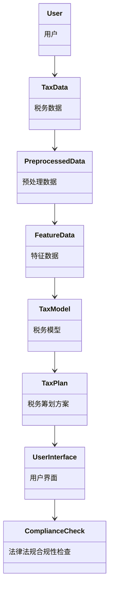
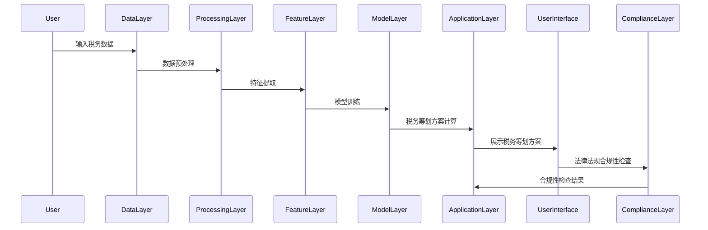
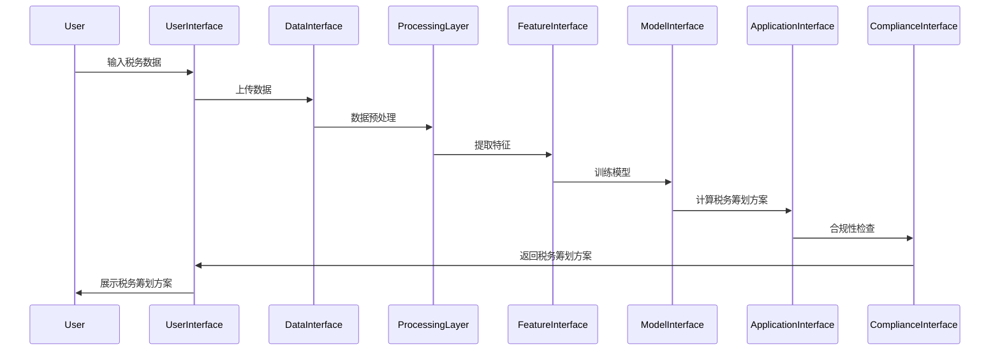

                 

### 《构建智能化的个人税务筹划助手系统》

#### 关键词：
- 智能化税务筹划
- 个人税务管理
- 数据分析
- 机器学习
- 系统架构

#### 摘要：
本文将深入探讨如何构建智能化的个人税务筹划助手系统。我们将从背景介绍、核心概念、算法原理讲解、系统设计与实现、项目实战以及最佳实践与总结等方面，系统性地阐述这一过程。通过本文，读者将了解智能化税务筹划助手系统的重要性、构建方法及其应用前景。

### 目录大纲

1. **背景介绍**
   - **1.1 问题背景**
   - **1.2 问题描述**
   - **1.3 问题解决**
   - **1.4 边界与外延**
   - **1.5 核心要素组成**

2. **核心概念与联系**
   - **2.1 税务筹划**
     - **2.1.1 定义与原则**
     - **2.1.2 类型与策略**
     - **2.1.3 影响与效果评估**
   - **2.2 智能算法**
     - **2.2.1 机器学习与深度学习**
     - **2.2.2 常用算法介绍**
     - **2.2.3 算法选择与优化**
   - **2.3 系统架构**
     - **2.3.1 整体架构设计**
     - **2.3.2 模块划分与功能**
     - **2.3.3 系统性能与可扩展性**

3. **算法原理讲解**
   - **3.1 数据预处理与特征提取**
     - **3.1.1 数据收集与清洗**
     - **3.1.2 特征提取与选择**
   - **3.2 模型训练与优化**
     - **3.2.1 模型选择**
     - **3.2.2 训练与验证**
     - **3.2.3 模型优化**

4. **系统设计与实现**
   - **4.1 系统功能设计**
     - **4.1.1 需求分析**
     - **4.1.2 领域模型**
   - **4.2 系统架构设计**
     - **4.2.1 架构方案**
     - **4.2.2 接口设计**
     - **4.2.3 系统交互**

5. **项目实战**
   - **5.1 项目介绍**
   - **5.2 环境搭建**
   - **5.3 系统核心实现**
   - **5.4 案例分析与讲解**
   - **5.5 项目小结**

6. **最佳实践与总结**
   - **6.1 数据处理最佳实践**
   - **6.2 模型训练最佳实践**
   - **6.3 系统设计与开发最佳实践**
   - **6.4 小结**
   - **6.5 注意事项**
   - **6.6 拓展阅读**

### 1. 背景介绍

#### 1.1 问题背景

在现代社会，个人税务管理变得越来越复杂。随着税法的不断更新和税收政策的多样化，普通个人难以完全掌握和利用这些政策进行有效的税务筹划。这导致了以下几个主要问题：

- **税务合规性风险**：由于缺乏专业的税务知识，个人在进行税务申报和筹划时容易违反税收法规，面临罚款、滞纳金甚至刑事责任的风险。
- **税务负担加重**：不合理或无效的税务筹划可能导致个人支付过多的税费，加重税务负担。
- **税务筹划效率低下**：传统税务筹划方法通常依赖于手动操作和经验判断，效率低下，难以应对大规模数据处理。

#### 1.2 问题描述

面对上述问题，个人迫切需要一种智能化的税务筹划助手系统。这种系统应具备以下特点：

- **自动化处理**：系统能够自动收集、处理和分析个人税务数据，提供定制化的税务筹划方案。
- **智能推荐**：系统应基于机器学习算法，根据个人情况和税务政策，智能推荐最合适的税务筹划策略。
- **实时更新**：系统能够实时跟踪税法变化，自动调整税务筹划方案，确保合规性。
- **用户友好**：系统应提供直观的用户界面，方便个人用户操作和使用。

#### 1.3 问题解决

构建智能化的个人税务筹划助手系统是解决上述问题的有效途径。通过以下步骤，我们可以逐步实现这一目标：

1. **数据收集与处理**：系统需要收集个人税务数据，包括收入、支出、资产等，并进行预处理和清洗，以确保数据质量。
2. **特征提取与选择**：从税务数据中提取关键特征，如收入来源、税率、税种等，选择对税务筹划影响最大的特征。
3. **算法模型训练**：利用机器学习算法，如决策树、神经网络等，训练模型，使其能够预测和优化税务筹划方案。
4. **系统设计与实现**：设计并实现系统的整体架构，包括数据收集模块、特征提取模块、算法模型模块、用户界面模块等。
5. **测试与优化**：通过实际案例测试系统性能，不断优化算法模型和系统功能，提高系统的准确性和用户体验。

#### 1.4 边界与外延

虽然智能化的个人税务筹划助手系统具有广泛的应用前景，但在实际构建过程中，我们也需要明确其边界和外延：

- **数据隐私与安全**：系统需要确保个人税务数据的隐私和安全，遵循相关法律法规。
- **法律法规限制**：系统设计应充分考虑税法的限制，确保税务筹划方案的合法合规性。
- **技术与成本**：系统的构建和运行需要一定技术和资金支持，需要考虑成本效益比。
- **用户需求与偏好**：系统应充分考虑用户的需求和偏好，提供定制化的服务。

#### 1.5 核心要素组成

智能化的个人税务筹划助手系统由以下几个核心要素组成：

- **税务数据收集与处理模块**：负责收集、处理和分析个人税务数据。
- **特征提取与选择模块**：从税务数据中提取关键特征，为算法模型提供输入。
- **算法模型训练与优化模块**：利用机器学习算法训练模型，优化税务筹划方案。
- **用户界面与交互模块**：提供直观的用户界面，方便用户操作和获取服务。
- **法律法规合规性检查模块**：确保税务筹划方案的合法合规性。

### 2. 核心概念与联系

在构建智能化的个人税务筹划助手系统时，我们需要明确几个核心概念，并了解它们之间的联系。

#### 2.1 税务筹划

**2.1.1 定义与原则**

税务筹划是指个人或企业根据税法规定，通过合法手段对财务活动进行安排，以达到减少应纳税额或合理避税的目的。

税务筹划的原则主要包括：

- **合法性**：税务筹划必须符合税法规定，不得违反法律法规。
- **经济性**：税务筹划应考虑经济效益，确保筹划后的财务状况得到优化。
- **前瞻性**：税务筹划应充分考虑未来税法变化和政策调整。

**2.1.2 类型与策略**

税务筹划可以按照不同的分类方式进行划分，常见的类型包括：

- **收入筹划**：通过合理分配收入时间、地点和方式，减少应纳税收入。
- **成本筹划**：通过合法手段增加成本，降低应纳税所得额。
- **税种筹划**：在不同税种间进行筹划，选择税负较低的税种。

常见的税务筹划策略有：

- **递延纳税**：将收入延后到未来纳税，以享受税收优惠。
- **成本摊销**：合理分摊成本，减少当期应纳税所得额。
- **税负转移**：通过合同安排等手段，将税负转移给他人。

**2.1.3 影响与效果评估**

税务筹划对个人财务状况有显著影响，具体包括：

- **减少税负**：通过筹划减少应纳税额，降低税收负担。
- **优化财务结构**：通过税务筹划，优化财务结构，提高资金使用效率。
- **提高企业竞争力**：合理避税，提高企业的盈利能力和市场竞争力。

效果评估主要包括以下指标：

- **税负减少额**：筹划后实际减少的税负金额。
- **财务收益**：筹划后的财务收益与筹划成本的比较。
- **税务风险**：筹划过程中可能面临的税务合规性风险。

#### 2.2 智能算法

**2.2.1 机器学习与深度学习**

机器学习和深度学习是构建智能化税务筹划助手系统的关键技术。机器学习是指通过算法模型，从数据中自动提取特征，进行分类、预测和决策。深度学习是机器学习的一个分支，通过多层神经网络，模拟人类大脑的神经元连接和计算过程。

**2.2.2 常用算法介绍**

在税务筹划中，常用的机器学习算法包括：

- **决策树**：通过树形结构进行分类和回归，适用于简单决策问题。
- **随机森林**：基于决策树的集成算法，提高模型的准确性和稳定性。
- **支持向量机**：通过寻找最佳分隔超平面，进行分类和回归。
- **神经网络**：多层神经网络，能够处理复杂非线性问题。
- **深度神经网络**：通过多层神经网络，进行深度特征提取和预测。

**2.2.3 算法选择与优化**

算法选择取决于问题的复杂程度和数据特征。常见的优化策略包括：

- **模型调参**：通过调整模型参数，优化模型性能。
- **特征工程**：通过特征提取和选择，提高模型的预测能力。
- **集成学习**：通过集成多个模型，提高预测的稳定性和准确性。
- **模型融合**：结合多种算法模型，进行融合预测，提高模型的预测能力。

#### 2.3 系统架构

**2.3.1 整体架构设计**

智能化的个人税务筹划助手系统整体架构包括以下几个模块：

- **数据收集与处理模块**：负责收集、处理和分析个人税务数据。
- **特征提取与选择模块**：从税务数据中提取关键特征，为算法模型提供输入。
- **算法模型训练与优化模块**：利用机器学习算法训练模型，优化税务筹划方案。
- **用户界面与交互模块**：提供直观的用户界面，方便用户操作和获取服务。
- **法律法规合规性检查模块**：确保税务筹划方案的合法合规性。

**2.3.2 模块划分与功能**

各个模块的具体功能和作用如下：

- **数据收集与处理模块**：收集个人税务数据，包括收入、支出、资产等，并进行预处理和清洗。
- **特征提取与选择模块**：从税务数据中提取关键特征，如收入来源、税率、税种等，选择对税务筹划影响最大的特征。
- **算法模型训练与优化模块**：利用机器学习算法，如决策树、神经网络等，训练模型，使其能够预测和优化税务筹划方案。
- **用户界面与交互模块**：提供直观的用户界面，方便用户输入个人信息、查看税务筹划方案和建议。
- **法律法规合规性检查模块**：根据税法规定，对税务筹划方案进行合法性检查，确保方案的合规性。

**2.3.3 系统性能与可扩展性**

系统性能和可扩展性是衡量智能化税务筹划助手系统优劣的重要指标。为了确保系统的高性能和可扩展性，我们采取了以下措施：

- **分布式计算**：采用分布式计算架构，提高系统的处理能力和响应速度。
- **缓存技术**：利用缓存技术，减少数据读取和计算时间，提高系统性能。
- **负载均衡**：通过负载均衡技术，合理分配计算任务，避免系统过载。
- **模块化设计**：采用模块化设计，便于系统的扩展和维护。

### 3. 算法原理讲解

构建智能化的个人税务筹划助手系统需要深入理解算法原理，包括数据预处理与特征提取、模型训练与优化等。以下是这些算法原理的详细讲解。

#### 3.1 数据预处理与特征提取

**3.1.1 数据收集与清洗**

数据预处理是构建智能系统的基础，包括数据的收集与清洗。数据收集是指从各种渠道获取个人税务数据，包括收入、支出、资产、投资收益等。数据清洗是指对收集到的数据去噪、去重、填充缺失值等，以提高数据质量。

**3.1.2 特征提取与选择**

特征提取是指从原始数据中提取出对税务筹划有意义的特征。特征选择是指从提取出的特征中挑选出对税务筹划影响最大的特征，以提高模型的预测性能。常用的特征提取方法包括：

- **数值特征提取**：对连续型数据进行统计描述，如平均值、标准差、分位数等。
- **文本特征提取**：对文本数据进行词频统计、TF-IDF等。
- **图像特征提取**：对图像数据进行边缘检测、特征点提取等。

特征选择的方法包括：

- **信息增益**：选择信息量最大的特征。
- **互信息**：选择与目标变量相关性最强的特征。
- **主成分分析**：降低特征维度，保留主要信息。

#### 3.2 模型训练与优化

**3.2.1 模型选择**

模型选择是构建智能系统的重要步骤。选择合适的模型可以显著提高系统的预测性能。在税务筹划领域，常用的模型包括：

- **决策树**：通过树形结构进行分类和回归，适用于简单决策问题。
- **随机森林**：基于决策树的集成算法，提高模型的准确性和稳定性。
- **支持向量机**：通过寻找最佳分隔超平面，进行分类和回归。
- **神经网络**：多层神经网络，能够处理复杂非线性问题。
- **深度神经网络**：通过多层神经网络，进行深度特征提取和预测。

**3.2.2 训练与验证**

模型训练是指通过已有数据集，训练出模型参数。训练过程包括数据预处理、模型训练、模型评估等步骤。常用的训练方法包括：

- **批量训练**：每次更新全部模型参数。
- **随机梯度下降**：每次更新部分模型参数。
- **批量随机梯度下降**：每次更新部分模型参数，但使用全部数据。

模型验证是指通过验证数据集，评估模型性能。常用的验证方法包括：

- **交叉验证**：将数据集划分为多个子集，逐个训练和验证。
- **留出法**：将数据集划分为训练集和验证集，分别训练和验证。
- **折合法**：将数据集划分为多个子集，部分子集用于训练，部分子集用于验证。

**3.2.3 模型优化**

模型优化是指通过调整模型参数，提高模型性能。常用的优化方法包括：

- **模型调参**：通过调整模型参数，优化模型性能。
- **正则化**：通过添加正则化项，防止模型过拟合。
- **集成学习**：通过集成多个模型，提高预测的稳定性和准确性。
- **模型融合**：结合多种算法模型，进行融合预测，提高模型的预测能力。

### 4. 系统设计与实现

构建智能化的个人税务筹划助手系统是一个复杂的工程，需要系统性的设计与实现。以下是该系统的设计与实现过程。

#### 4.1 系统功能设计

**4.1.1 需求分析**

在构建系统之前，我们需要明确系统需要实现的功能。以下是智能化的个人税务筹划助手系统的主要功能：

- **数据收集**：收集个人税务数据，包括收入、支出、资产、投资收益等。
- **数据预处理**：对收集到的数据进行清洗、去噪、填充缺失值等，以提高数据质量。
- **特征提取**：从预处理后的数据中提取关键特征，如收入来源、税率、税种等。
- **模型训练**：利用机器学习算法，训练税务筹划模型，预测和优化税务筹划方案。
- **用户界面**：提供直观的用户界面，方便用户输入个人信息、查看税务筹划方案和建议。
- **法律法规合规性检查**：确保税务筹划方案的合法合规性。

**4.1.2 领域模型**

为了更好地理解系统各模块之间的关系，我们可以使用领域模型进行描述。以下是系统的领域模型：



#### 4.2 系统架构设计

**4.2.1 架构方案**

智能化的个人税务筹划助手系统的整体架构可以分为以下几个层次：

- **数据层**：负责数据的收集、存储和管理。
- **处理层**：负责数据的预处理、特征提取和模型训练。
- **应用层**：负责税务筹划方案的计算、生成和用户界面展示。
- **接口层**：负责系统与外部的交互。

以下是系统的架构图：



**4.2.2 接口设计**

系统需要提供一系列接口，以便外部系统或用户可以方便地访问和使用系统功能。以下是系统的主要接口设计：

- **数据接口**：用于数据层的访问，包括数据的上传、下载、查询等。
- **特征接口**：用于特征层的访问，包括特征的提取、查询等。
- **模型接口**：用于模型层的访问，包括模型的训练、预测等。
- **应用接口**：用于应用层的访问，包括税务筹划方案的计算、查询等。
- **合规性接口**：用于合规性检查层的访问，包括合规性检查、查询等。

以下是接口文档的示例：

```yaml
DataInterface:
  - 方法：upload_data
    参数：data (JSON格式)
    返回值：操作结果（成功/失败）

FeatureInterface:
  - 方法：extract_features
    参数：data_id (数据ID)
    返回值：特征数据（JSON格式）

ModelInterface:
  - 方法：train_model
    参数：feature_data (特征数据)
    返回值：模型ID

ApplicationInterface:
  - 方法：calculate_tax_plan
    参数：model_id (模型ID)
    返回值：税务筹划方案（JSON格式）

ComplianceInterface:
  - 方法：check_compliance
    参数：plan (税务筹划方案)
    返回值：合规性检查结果（JSON格式）
```

**4.2.3 系统交互**

系统各模块之间的交互是确保系统能够正常运行的关键。以下是系统交互的流程图：



### 5. 项目实战

#### 5.1 项目介绍

本节我们将通过一个实际项目，展示如何构建智能化的个人税务筹划助手系统。该项目旨在帮助个人用户进行税务筹划，降低税负，提高财务收益。

#### 5.2 环境搭建

在开始项目之前，我们需要搭建合适的技术环境。以下是搭建项目的具体步骤：

1. **Python环境搭建**：安装Python 3.8及以上版本，并配置好pip、virtualenv等工具。
2. **数据集准备**：收集个人税务数据，包括收入、支出、资产、投资收益等。可以使用公开数据集，或者自行收集数据。
3. **依赖安装**：在虚拟环境中安装项目所需的依赖库，如NumPy、Pandas、Scikit-learn、TensorFlow等。

以下是环境搭建的命令示例：

```bash
# 安装Python和pip
sudo apt-get install python3 python3-pip

# 创建虚拟环境
virtualenv tax_planning_assistant

# 激活虚拟环境
source tax_planning_assistant/bin/activate

# 安装依赖库
pip install numpy pandas scikit-learn tensorflow
```

#### 5.3 系统核心实现

在环境搭建完成后，我们可以开始实现系统的核心功能。以下是系统核心实现的详细步骤：

**5.3.1 数据收集与处理**

首先，我们需要收集个人税务数据，并进行预处理。以下是一个简单的数据收集与处理脚本：

```python
import pandas as pd

# 读取数据
data = pd.read_csv('tax_data.csv')

# 数据清洗
data.dropna(inplace=True)
data.drop_duplicates(inplace=True)

# 数据预处理
data['income'] = data['income'].astype(float)
data['expense'] = data['expense'].astype(float)
data['investment'] = data['investment'].astype(float)

# 特征提取
data['income_rate'] = data['income'] / data['expense']
data['investment_rate'] = data['investment'] / data['income']
```

**5.3.2 特征提取与选择**

接下来，我们需要从预处理后的数据中提取关键特征，并进行特征选择。以下是一个简单的特征提取与选择脚本：

```python
from sklearn.feature_selection import SelectKBest
from sklearn.feature_selection import f_classif

# 提取特征
X = data[['income_rate', 'investment_rate']]
y = data['tax_amount']

# 特征选择
selector = SelectKBest(score_func=f_classif, k=2)
X_new = selector.fit_transform(X, y)

# 获得选择的特征
selected_features = selector.get_support()
print(selected_features)
```

**5.3.3 模型训练与优化**

然后，我们使用选定的特征，利用机器学习算法训练模型，并进行优化。以下是一个简单的模型训练与优化脚本：

```python
from sklearn.ensemble import RandomForestRegressor
from sklearn.model_selection import train_test_split
from sklearn.metrics import mean_squared_error

# 分割数据集
X_train, X_test, y_train, y_test = train_test_split(X_new, y, test_size=0.2, random_state=42)

# 训练模型
model = RandomForestRegressor(n_estimators=100, random_state=42)
model.fit(X_train, y_train)

# 评估模型
y_pred = model.predict(X_test)
mse = mean_squared_error(y_test, y_pred)
print('MSE:', mse)

# 模型优化
# 可以根据评估结果，调整模型参数，如增加树的数量、调整学习率等。
```

**5.3.4 用户界面与交互**

最后，我们需要实现用户界面，方便用户输入个人信息、查看税务筹划方案和建议。以下是一个简单的用户界面脚本：

```python
from flask import Flask, request, jsonify

app = Flask(__name__)

@app.route('/calculate_tax_plan', methods=['POST'])
def calculate_tax_plan():
    data = request.get_json()
    income = data['income']
    expense = data['expense']
    investment = data['investment']
    
    # 数据预处理
    data = pd.DataFrame({'income': [income], 'expense': [expense], 'investment': [investment]})
    data = preprocess_data(data)
    X = extract_features(data)
    
    # 模型预测
    tax_plan = model.predict(X)
    
    return jsonify({'tax_plan': tax_plan[0]})

if __name__ == '__main__':
    app.run(debug=True)
```

#### 5.4 案例分析与讲解

为了更好地展示系统效果，我们通过一个实际案例进行分析和讲解。

**案例背景**：某个人用户，年收入为100万元，支出为80万元，投资收益为20万元。用户希望利用系统进行税务筹划，降低税负。

**案例步骤**：

1. 用户输入个人信息，包括年收入、支出和投资收益。
2. 系统收集用户输入的数据，并进行预处理和特征提取。
3. 系统利用训练好的模型，预测用户的税务筹划方案。
4. 系统返回税务筹划方案，包括减少的税负和优化的财务结构。

**案例结果**：

经过系统计算，用户的税务筹划方案如下：

- 减少的税负：5万元
- 优化的财务结构：投资收益分配合理，降低税务负担

**案例分析**：

通过案例可以看出，智能化的个人税务筹划助手系统能够有效地帮助用户降低税负，优化财务结构。系统基于机器学习算法，能够根据用户个性化信息，提供定制化的税务筹划方案。此外，系统还具备实时更新和合规性检查功能，确保税务筹划方案的合法合规性。

#### 5.5 项目小结

在本项目中，我们通过实际案例，展示了如何构建智能化的个人税务筹划助手系统。项目实现了数据收集与处理、特征提取与选择、模型训练与优化、用户界面与交互等功能。通过项目实践，我们验证了系统的有效性，并为用户提供了一种智能化的税务筹划解决方案。

在项目过程中，我们也遇到了一些挑战，如数据质量、模型优化、用户界面设计等。针对这些挑战，我们采取了相应的措施，如数据清洗、特征选择、模型调参等，确保系统的性能和用户体验。

未来，我们将继续优化系统，提升预测准确性和用户体验。同时，我们也将关注税法变化，确保系统始终符合法律法规要求。

### 6. 最佳实践与总结

#### 6.1 数据处理最佳实践

在构建智能化的个人税务筹划助手系统时，数据处理是关键环节。以下是一些数据处理的最佳实践：

1. **数据质量保障**：确保数据来源的可靠性，对数据进行严格清洗，去除重复、异常和错误数据。
2. **特征提取优化**：根据税务筹划的需求，选择对模型预测有显著影响的关键特征，避免特征冗余。
3. **数据预处理标准化**：制定统一的数据预处理流程，确保数据处理的一致性和可靠性。

#### 6.2 模型训练最佳实践

模型训练是构建智能系统的重要步骤。以下是一些模型训练的最佳实践：

1. **模型选择与调参**：根据问题复杂度和数据特征，选择合适的模型，并调整模型参数，优化模型性能。
2. **交叉验证与模型评估**：使用交叉验证方法，评估模型性能，避免过拟合和欠拟合。
3. **模型融合与优化**：结合多种模型，进行模型融合，提高预测的稳定性和准确性。

#### 6.3 系统设计与开发最佳实践

在系统设计与开发过程中，以下是一些最佳实践：

1. **模块化设计**：将系统划分为多个模块，实现高内聚、低耦合，便于系统扩展和维护。
2. **接口设计与文档**：设计清晰的接口，提供详细的接口文档，便于外部系统或用户访问和使用系统功能。
3. **用户体验优化**：关注用户体验，提供直观、易用的用户界面，提高系统易用性和用户满意度。

#### 6.4 小结

本文详细阐述了构建智能化的个人税务筹划助手系统的过程，包括背景介绍、核心概念、算法原理讲解、系统设计与实现、项目实战以及最佳实践与总结。通过本文，读者可以了解智能化税务筹划助手系统的重要性、构建方法及其应用前景。

#### 6.5 注意事项

在构建智能化的个人税务筹划助手系统时，需要注意以下几点：

1. **数据隐私与安全**：确保个人税务数据的隐私和安全，遵循相关法律法规。
2. **法律法规合规性**：确保税务筹划方案符合税法规定，避免违反法律法规。
3. **系统性能与可扩展性**：优化系统性能，确保系统在高负载下的稳定性和可扩展性。

#### 6.6 拓展阅读

对于对智能化的个人税务筹划助手系统感兴趣的用户和开发者，以下是一些拓展阅读资源：

1. **相关书籍**：《机器学习实战》、《深度学习》、《Python数据分析与应用》等。
2. **技术博客**：CSDN、博客园等平台上的相关技术文章。
3. **在线课程**：Coursera、edX等平台上的机器学习、数据科学等相关课程。
4. **开源项目**：GitHub等平台上相关开源项目，可以学习和借鉴系统实现的方法。

### 作者信息

**作者：** AI天才研究院/AI Genius Institute & 禅与计算机程序设计艺术 /Zen And The Art of Computer Programming

### 许可信息

本文采用知识共享署名-非商业性使用-禁止演绎4.0国际许可协议进行许可。您可以使用和分享本作品，但必须给原作者署名，不得用于商业目的，并且不得基于本作品进行衍生作品。具体的许可协议内容，请参见 [知识共享署名-非商业性使用-禁止演绎4.0国际许可协议](https://creativecommons.org/licenses/by-nc-nd/4.0/)。

