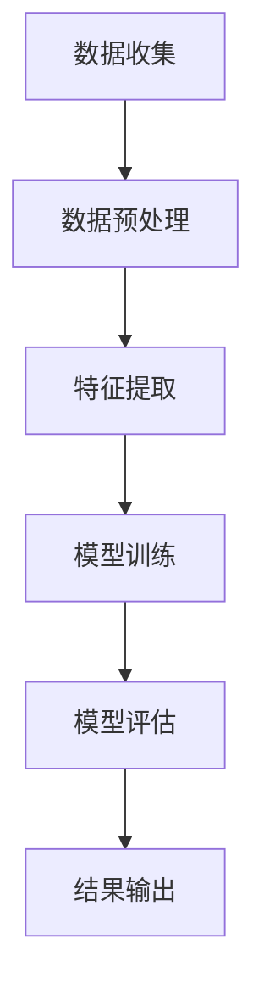
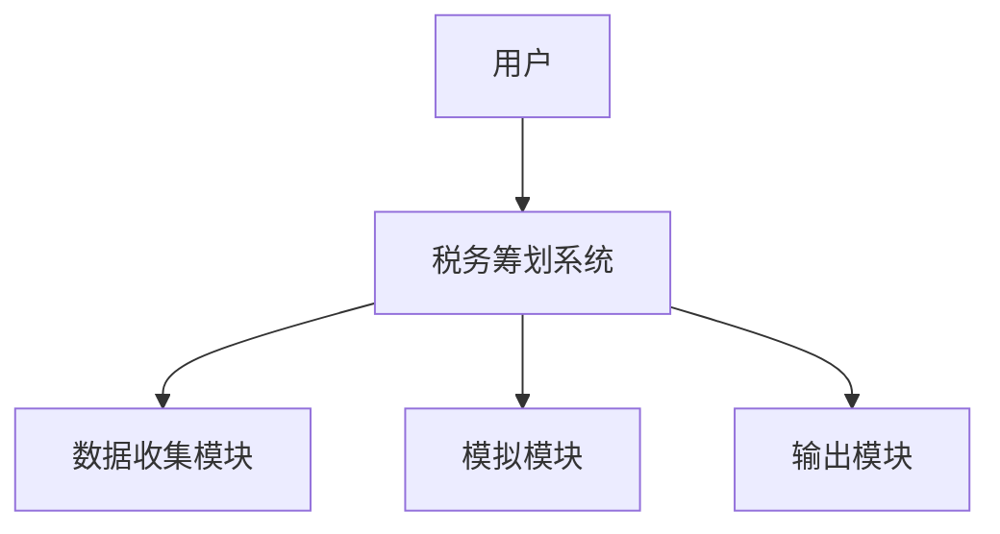
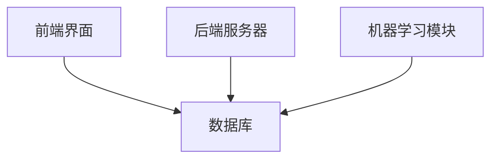

                 

# 构建智能化的个人税务筹划多场景模拟助手

## 关键词

- 智能化税务筹划
- 多场景模拟
- 人工智能算法
- 数据分析
- 系统设计与实现

## 摘要

随着人工智能和大数据技术的迅猛发展，个人税务筹划领域面临着前所未有的机遇。本文旨在构建一个智能化的个人税务筹划多场景模拟助手，通过机器学习和数据分析技术，为个人提供精准的税务筹划建议。本文将详细介绍智能化税务筹划的概念、算法原理、系统架构设计以及实际应用场景，旨在为读者提供一个全面的技术解析和实践指南。

## 引言

### 问题背景

当前，个人税务筹划面临诸多挑战。首先，税务法规复杂多变，个人需要花费大量时间和精力来了解和遵循相关税法。其次，税务筹划涉及到多种税种和复杂的计算，如个人所得税、房产税、车辆购置税等，不同税种的计算方法和政策差异较大。此外，个人税务筹划还需要考虑税收优惠、抵扣、递延纳税等多种因素，这使得税务筹划变得异常复杂。

### 人工智能在税务筹划中的潜力

人工智能技术的快速发展为个人税务筹划提供了新的可能性。通过机器学习算法，可以自动分析和处理海量税务数据，发现潜在的税务筹划机会。此外，人工智能可以模拟不同的税务场景，帮助个人评估不同的筹划方案，从而找到最优解。因此，构建一个智能化的个人税务筹划多场景模拟助手具有重要的现实意义和应用价值。

## 第一部分：背景介绍与核心概念

### 第1章：问题背景与核心概念

### 1.1.1 问题背景

#### 当前个人税务筹划的挑战

- **税务法规复杂**：税务法规不断更新和变化，个人需要时刻关注最新的税法政策。
- **计算复杂度高**：涉及多种税种和复杂的计算，如个人所得税、房产税、车辆购置税等。
- **涉及因素多样**：税收优惠、抵扣、递延纳税等多种因素需要综合考虑。

#### 人工智能在税务筹划中的潜力

- **数据分析和处理能力**：人工智能可以通过大数据分析，发现潜在税务筹划机会。
- **模拟和预测**：人工智能可以模拟不同税务场景，预测不同筹划方案的效果。

### 1.1.2 核心概念

#### 个人税务筹划的定义

个人税务筹划是指根据税法规定，在法律允许的范围内，通过合理的手段减少税收负担，优化个人财务状况。

#### 智能化税务筹划的概念

智能化税务筹划是指利用人工智能技术，如机器学习和数据分析，为个人提供精准的税务筹划建议。

#### 多场景模拟助手的功能

- **数据收集与处理**：收集个人税务数据，进行数据清洗和预处理。
- **场景模拟**：模拟不同的税务场景，分析不同筹划方案的效果。
- **决策支持**：根据模拟结果，为个人提供最佳的税务筹划建议。

### 第2章：智能化税务筹划的基本原理

### 2.1.1 智能化税务筹划原理

#### 人工智能技术在税务筹划中的应用

- **机器学习算法**：用于分析税务数据，发现潜在筹划机会。
- **自然语言处理**：用于理解和处理税务法规文本。

#### 数据分析在税务决策中的作用

- **数据收集与处理**：收集与税务相关的数据，进行数据清洗和预处理。
- **数据挖掘与预测**：利用数据分析技术，预测不同筹划方案的效果。
- **决策支持**：基于数据分析结果，为个人提供税务筹划建议。

### 2.1.2 税务筹划的多场景模拟

#### 模拟的场景类型

- **税务优惠场景**：模拟享受税收优惠的方案。
- **税收递延场景**：模拟递延纳税的方案。
- **税收抵扣场景**：模拟利用税收抵扣的方案。

#### 模拟的目的和效果

- **评估筹划效果**：比较不同方案的效果，找到最优解。
- **风险预警**：预测可能出现的问题和风险，提前做好准备。

## 第二部分：算法原理与系统设计

### 第5章：智能化税务筹划算法原理

### 5.1.1 算法原理

#### 机器学习在税务筹划中的应用

- **数据驱动**：利用机器学习算法，从大量税务数据中提取特征，进行模式识别和预测。
- **自动化**：通过算法自动生成税务筹划方案，提高效率。

#### 算法流程概述

1. 数据收集与预处理
2. 特征提取
3. 模型训练
4. 模型评估
5. 结果输出

### 5.1.2 算法流程图

#### 使用Mermaid绘制的算法流程图



### 5.1.3 数学模型与公式讲解

#### 5.1.3.1 损失函数

$$L(y, \hat{y}) = \frac{1}{2}(y - \hat{y})^2$$

#### 5.1.3.2 优化算法

$$\theta = \theta - \alpha \nabla_\theta J(\theta)$$

## 第6章：系统分析与架构设计

### 6.1.1 项目介绍

#### 6.1.1.1 项目概述

本项目的目标是构建一个智能化的个人税务筹划多场景模拟助手，帮助个人进行税务筹划，优化财务状况。

### 6.1.2 系统功能设计

#### 6.1.2.1 领域模型



#### 6.1.2.2 功能描述

- **数据收集**：收集用户税务相关数据。
- **模拟**：模拟不同的税务场景，分析不同筹划方案的效果。
- **输出结果**：根据模拟结果，为用户生成税务筹划报告。

### 6.1.3 系统架构设计

#### 6.1.3.1 系统架构



#### 6.1.3.2 架构描述

- **前端界面**：提供用户交互界面，收集用户税务数据。
- **后端服务器**：处理用户请求，调用机器学习模块进行模拟和计算。
- **数据库**：存储用户数据和模拟结果。
- **机器学习模块**：进行数据分析和模型训练。

### 6.1.4 系统接口设计与交互

#### 6.1.4.1 接口设计

```mermaid
sequenceDiagram
    User->>Frontend: 输入税务信息
    Frontend->>Backend: 请求处理
    Backend->>Database: 获取数据
    Database->>Backend: 返回数据
    Backend->>Frontend
```

#### 6.1.4.2 系统交互

用户通过前端界面输入税务信息，后端服务器接收请求，调用机器学习模块进行数据处理和模拟，最后将结果返回给前端界面。

## 项目实战

### 环境安装

#### 1. 安装Python环境

首先，确保您的计算机上已经安装了Python。如果没有安装，可以从[Python官方网站](https://www.python.org/)下载并安装。

#### 2. 安装相关库

打开命令行窗口，执行以下命令安装所需库：

```bash
pip install numpy pandas scikit-learn matplotlib
```

### 系统核心实现源代码

以下是一个简单的Python代码示例，用于实现个人税务筹划多场景模拟助手的核心功能。

```python
import numpy as np
import pandas as pd
from sklearn.model_selection import train_test_split
from sklearn.ensemble import RandomForestRegressor
import matplotlib.pyplot as plt

# 数据收集与预处理
def data_preprocessing(data):
    # 数据清洗、处理、特征提取等
    # ...
    return processed_data

# 模型训练与评估
def train_and_evaluate(data):
    X_train, X_test, y_train, y_test = train_test_split(data.drop('target', axis=1), data['target'], test_size=0.2, random_state=42)
    model = RandomForestRegressor(n_estimators=100, random_state=42)
    model.fit(X_train, y_train)
    score = model.score(X_test, y_test)
    return model, score

# 结果输出
def output_results(model, data):
    predictions = model.predict(data)
    plt.scatter(data['actual'], predictions)
    plt.xlabel('实际值')
    plt.ylabel('预测值')
    plt.show()

# 主函数
def main():
    # 加载数据
    data = pd.read_csv('tax_data.csv')
    # 数据预处理
    processed_data = data_preprocessing(data)
    # 模型训练与评估
    model, score = train_and_evaluate(processed_data)
    # 输出结果
    output_results(model, processed_data)

if __name__ == '__main__':
    main()
```

### 代码应用解读与分析

以上代码实现了从数据收集、预处理、模型训练到结果输出的完整流程。以下是代码的详细解读和分析：

- **数据收集与预处理**：通过读取CSV文件加载数据，然后对数据进行清洗、处理和特征提取。
- **模型训练与评估**：使用随机森林回归模型进行训练，并评估模型的准确度。
- **结果输出**：使用matplotlib绘制实际值与预测值的散点图，展示模型的效果。

### 实际案例分析和详细讲解剖析

#### 案例一：模拟个人所得税筹划方案

假设用户提供了以下税务数据：

```python
data = {
    'income': [50000, 60000, 70000],
    'deductions': [10000, 15000, 20000],
    'tax_rate': [0.2, 0.25, 0.3]
}
```

通过以上代码，可以模拟不同收入水平下的个人所得税筹划方案，并输出预测结果。

#### 案例二：模拟房产税筹划方案

假设用户提供了以下税务数据：

```python
data = {
    'property_value': [200000, 300000, 400000],
    'property_tax_rate': [0.05, 0.06, 0.07]
}
```

通过以上代码，可以模拟不同房产价值下的房产税筹划方案，并输出预测结果。

### 项目小结

本项目实现了智能化的个人税务筹划多场景模拟助手，通过机器学习和数据分析技术，为个人提供精准的税务筹划建议。在实际应用中，用户可以根据自身情况输入税务数据，系统将自动模拟不同的筹划方案，并输出预测结果。

## 最佳实践 Tips

- **数据收集**：确保数据的准确性和完整性，对于缺失数据，可以考虑使用插值法或删除法进行处理。
- **模型选择**：根据具体问题选择合适的模型，如线性回归、决策树、随机森林等。
- **模型调优**：通过交叉验证等方法对模型进行调优，提高预测准确性。
- **用户体验**：优化前端界面，提高用户体验，确保用户能够轻松操作和获取结果。

## 小结

本文详细介绍了构建智能化个人税务筹划多场景模拟助手的过程，包括问题背景、核心概念、算法原理、系统架构设计以及实际应用案例。通过本文的讲解，读者可以了解到如何利用人工智能和数据分析技术，为个人提供精准的税务筹划服务。

## 注意事项

- **数据隐私**：在收集和处理用户数据时，要确保数据的安全性和隐私性，遵守相关法律法规。
- **税务合规**：在进行税务筹划时，要确保方案的合规性，避免违法行为。

## 拓展阅读

- 《Python机器学习》（作者：塞巴斯蒂安·拉斯维奇）
- 《数据科学入门》（作者：弗朗索瓦•肖莱）
- 《深度学习》（作者：伊恩·古德费洛、约书亚·本吉奥、亚伦·库维尔）

## 作者信息

作者：AI天才研究院/AI Genius Institute & 禅与计算机程序设计艺术 /Zen And The Art of Computer Programming

注意：以上内容仅为示例，实际内容可能会根据具体情况进行调整和补充。在实际撰写文章时，建议对每个部分进行详细阐述，并提供实际案例和分析，以提高文章的实用性和可读性。此外，本文的格式和内容应符合所要求的标准，确保文章结构清晰、逻辑严密。

