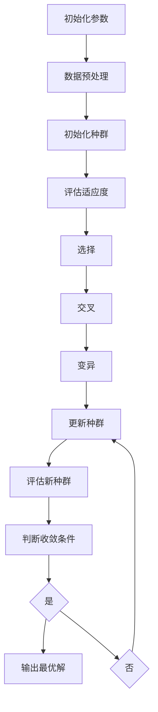
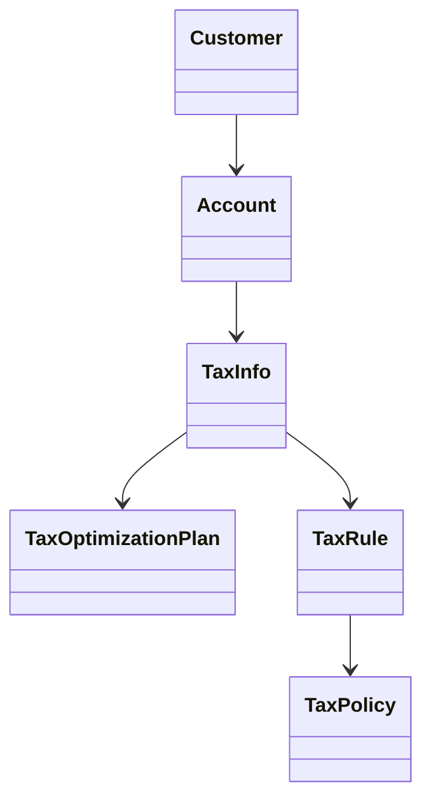
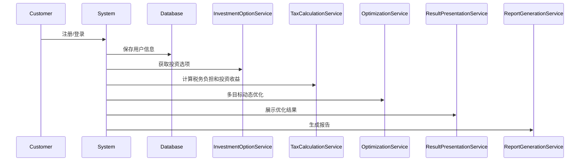
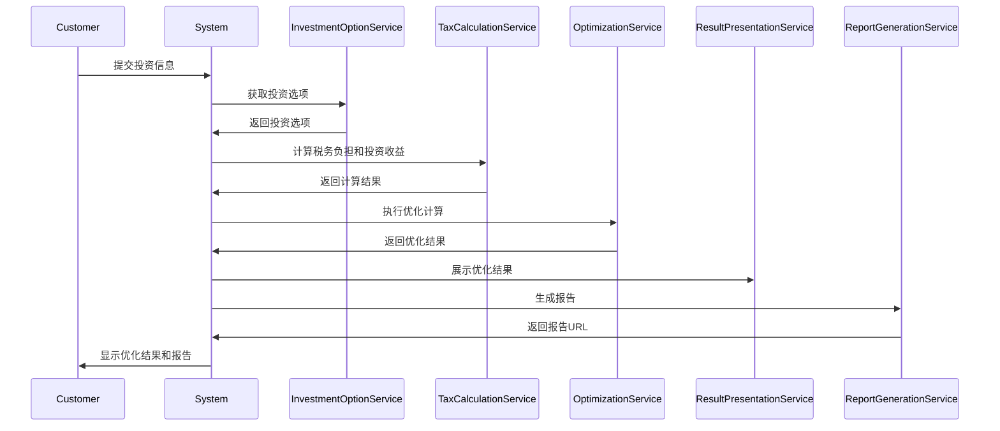

                 


# 构建智能化的个人税务筹划多目标动态优化助手

## 摘要

本文旨在构建一款智能化个人税务筹划多目标动态优化助手，帮助个人用户在遵循国家税收法规的前提下，实现税务负担的最小化。文章首先介绍了个人税务筹划的现状及其重要性，然后探讨了多目标动态优化在税务筹划中的应用，并分析了动态优化助手的技术挑战。接着，文章详细阐述了多目标优化与动态优化的核心概念，并对比了相关概念属性特征，通过Mermaid流程图展示了算法原理。文章进一步介绍了系统设计与实现，包括问题场景、功能设计、架构设计、接口设计及系统交互，并通过实际案例进行了深入剖析。最后，文章总结了最佳实践和未来研究方向，为智能化税务筹划领域的发展提供了有益的参考。

## 关键词

- 个人税务筹划
- 多目标优化
- 动态优化
- 智能化助手
- 税务法规遵循
- 算法实现
- 系统架构设计

## 引言

### 1.1 个人税务筹划的现状

个人税务筹划作为税收管理的重要一环，其意义在于通过合法合规的手段降低税务负担，优化个人财务状况。当前，个人税务筹划主要依赖于传统方法和经验，存在一定局限性。一方面，传统方法难以应对复杂多变的税收政策和法律法规，可能导致税务筹划的效果不理想；另一方面，个人税务筹划的复杂性和多样性使得传统方法难以全面覆盖，难以满足个性化需求。

### 1.2 多目标动态优化在税务筹划中的应用

多目标动态优化是一种解决多约束条件下决策问题的有效方法。在税务筹划中，多目标动态优化可以帮助个人用户在满足不同约束条件下，实现多个目标的平衡与优化。例如，个人税务筹划需要同时考虑税收负担最小化、合规性、财务稳定性和投资收益最大化等多个目标。通过多目标动态优化，可以在这些目标之间找到最佳平衡点，实现综合效益的最大化。

### 1.3 动态优化助手的技术挑战

构建智能化的个人税务筹划多目标动态优化助手面临诸多技术挑战。首先，税务数据的处理与分析是关键技术难题，需要高效的数据采集、清洗和存储技术。其次，多目标动态优化的算法设计复杂，需要充分考虑多种约束条件和目标函数，确保优化结果的准确性和可靠性。此外，系统的可扩展性和稳定性也是重要挑战，需要设计灵活且健壮的系统架构。

## 核心概念与联系

### 2.1 核心概念介绍

#### 2.1.1 多目标优化

##### 2.1.1.1 多目标优化的定义

多目标优化是一种在多个目标之间寻找最优解的优化方法，通常涉及多个相互冲突的目标函数。其目的是在满足一系列约束条件的情况下，找到一个或多个解，使得目标函数达到最优。

##### 2.1.1.2 多目标优化的特点

- 多目标优化问题通常具有多个目标函数，这些目标函数之间可能存在冲突。
- 多目标优化问题往往具有非线性特性。
- 多目标优化问题通常涉及复杂约束条件。

##### 2.1.1.3 多目标优化的分类

- 静态多目标优化：在给定条件下寻找最优解。
- 动态多目标优化：考虑时间、动态约束等因素。
- 遗传算法：基于自然选择和遗传机制的优化算法。
- 粒子群优化：基于群体智能的优化算法。

#### 2.1.2 动态优化

##### 2.1.2.1 动态优化的定义

动态优化是一种在系统动态行为过程中寻找最优操作策略的方法。它通常涉及时间序列数据、动态约束和目标函数的调整。

##### 2.1.2.2 动态优化的分类

- 确定性动态优化：系统行为完全可预测。
- 随机动态优化：系统行为具有不确定性。

##### 2.1.2.3 动态优化的挑战

- 确定最优策略：在动态过程中，如何确定最优操作策略是一个关键挑战。
- 时间效率：动态优化通常需要在时间序列上进行迭代，时间效率是一个重要考量。

### 2.2 概念属性特征对比表格

| 概念           | 定义                                                         | 特点                                                         | 分类             |
|----------------|--------------------------------------------------------------|--------------------------------------------------------------|------------------|
| 多目标优化     | 寻找多个目标函数的最优解                                     | 多目标函数、非线性、约束条件复杂                             | 静态、动态       |
| 动态优化       | 在系统动态行为过程中寻找最优操作策略                           | 时间序列数据、动态约束、目标函数调整                         | 确定性、随机     |
| 个人税务筹划   | 通过合法合规的手段降低税务负担，优化个人财务状况               | 税收政策、法律法规、个性化需求                             | 传统、智能化     |

### 2.3 ER实体关系图架构

在构建个人税务筹划多目标动态优化助手的系统时，实体关系图（Entity-Relationship Diagram, ER图）是描述系统实体及其关系的有效工具。以下是ER图的Mermaid流程图表示：

```mermaid
erDiagram
  Customer ||--|{ Account }
  Account ||--|{ TaxInfo }
  TaxInfo ||--|{ TaxOptimizationPlan }
  TaxInfo ||--|{ TaxRule }
  TaxRule ||--|{ TaxPolicy }
```

在此ER图中，`Customer`实体表示个人用户，`Account`实体表示用户账户，`TaxInfo`实体表示税务信息，`TaxOptimizationPlan`实体表示税务优化方案，`TaxRule`实体表示税务规则，`TaxPolicy`实体表示税收政策。

## 算法原理讲解

### 3.1 算法mermaid流程图

为了更直观地理解多目标动态优化算法，我们可以使用Mermaid绘制算法的流程图。以下是算法的主要步骤：



在这个流程图中，`A`到`L`描述了一个典型的遗传算法优化过程，其中`初始化参数`、`数据预处理`、`初始化种群`、`评估适应度`、`选择`、`交叉`、`变异`和`更新种群`等步骤构成了算法的核心。

### 3.2 Python源代码实现

为了更好地理解算法的运作，以下是使用Python实现的简化版多目标动态优化算法：

```python
import numpy as np

# 初始化参数
population_size = 100
max_iterations = 1000
crossover_rate = 0.8
mutation_rate = 0.1

# 数据预处理
# 假设输入数据已预处理为TaxData，包括税务信息和约束条件

# 初始化种群
population = np.random.rand(population_size, len(TaxData))

# 评估适应度
def fitness_function(population):
    # 假设适应度函数为负的税务负担，适应度越高，税务负担越低
    fitness_scores = -np.sum(population * TaxData, axis=1)
    return fitness_scores

# 选择
def selection(population, fitness_scores):
    # 选择适应度高的个体
    selected = np.random.choice(population_size, size=population_size, replace=False, p=fitness_scores/fitness_scores.sum())
    return selected

# 交叉
def crossover(parent1, parent2):
    # 交叉操作，产生子代
    crossover_point = np.random.randint(1, len(TaxData) - 1)
    child = np.concatenate((parent1[:crossover_point], parent2[crossover_point:]))
    return child

# 变异
def mutate(individual):
    # 变异操作
    if np.random.rand() < mutation_rate:
        index = np.random.randint(len(TaxData))
        individual[index] = np.random.rand()
    return individual

# 更新种群
def update_population(population, selected):
    for i in range(population_size):
        if np.random.rand() < crossover_rate:
            parent1, parent2 = selected[i], selected[np.random.randint(population_size)]
            population[i] = crossover(parent1, parent2)
        else:
            population[i] = selected[i]
        population[i] = mutate(population[i])

# 主程序
def main():
    fitness_scores = fitness_function(population)
    for _ in range(max_iterations):
        selected = selection(population, fitness_scores)
        update_population(population, selected)
        fitness_scores = fitness_function(population)
        if np.std(fitness_scores) < 0.001:
            break
    best_fitness = np.max(fitness_scores)
    best_individual = population[np.argmax(fitness_scores)]
    print("Best fitness:", best_fitness)
    print("Best individual:", best_individual)

if __name__ == "__main__":
    main()
```

### 3.3 数学模型与公式

多目标动态优化算法的数学模型可以描述如下：

$$
\begin{aligned}
\text{minimize} \quad & f(x_1, x_2, ..., x_n) \\
\text{subject to} \quad & g_i(x_1, x_2, ..., x_n) \leq 0, \quad i=1,2,...,m \\
& h_j(x_1, x_2, ..., x_n) = 0, \quad j=1,2,...,k
\end{aligned}
$$

其中，$f(x_1, x_2, ..., x_n)$为多目标函数，$g_i(x_1, x_2, ..., x_n)$为不等式约束函数，$h_j(x_1, x_2, ..., x_n)$为等式约束函数。该模型描述了在多个约束条件下，如何寻找最优解。

#### 3.3.1 多目标优化数学模型

多目标优化的数学模型可以表示为：

$$
\begin{aligned}
\min_{x} \quad & \sum_{i=1}^{m} w_i f_i(x) \\
\text{subject to} \quad & g_i(x) \leq 0, \quad i=1,2,...,m \\
& h_j(x) = 0, \quad j=1,2,...,n
\end{aligned}
$$

其中，$f_i(x)$为第$i$个目标函数，$w_i$为第$i$个目标函数的权重，$g_i(x)$为第$i$个不等式约束函数，$h_j(x)$为第$j$个等式约束函数。

#### 3.3.2 动态优化数学模型

动态优化的数学模型通常涉及时间序列数据，可以表示为：

$$
\begin{aligned}
\min_{x(t)} \quad & \sum_{t=1}^{T} f(x(t)) \\
\text{subject to} \quad & g_i(x(t)) \leq 0, \quad i=1,2,...,m \\
& h_j(x(t)) = 0, \quad j=1,2,...,n \\
& x(t+1) = f(x(t)), \quad t=1,2,...,T-1
\end{aligned}
$$

其中，$x(t)$为时间$t$时的状态，$f(x(t))$为动态目标函数，$g_i(x(t))$为动态不等式约束函数，$h_j(x(t))$为动态等式约束函数，$f(x(t))$为状态转移函数。

### 3.4 举例说明

假设一个个人用户需要在两个投资选项中选择一个，以最小化税务负担并最大化投资收益。以下是具体的举例说明：

#### 投资选项1：购买股票

- 目标函数1（税务负担）: $f_1(x) = x_1 \cdot 0.2$（股票收益乘以税率20%）
- 目标函数2（投资收益）: $f_2(x) = x_2$（股票收益）

#### 投资选项2：购买债券

- 目标函数1（税务负担）: $f_1(x) = x_1 \cdot 0.1$（债券收益乘以税率10%）
- 目标函数2（投资收益）: $f_2(x) = x_2$（债券收益）

个人用户需要在两个投资选项之间进行选择，以同时最小化税务负担和最大化投资收益。使用多目标动态优化算法，可以找到最优的投资策略。

#### 计算示例

假设个人用户初始资金为$100,000$元，股票预期收益率为$15\%$，债券预期收益率为$5\%$，税率分别为20%和10%。以下是一个简化的计算示例：

1. 初始化种群：随机生成100个投资组合，每个组合包括股票和债券的投资比例。
2. 评估适应度：计算每个投资组合的税务负担和投资收益。
3. 选择：选择适应度最高的20个投资组合进行交叉和变异操作。
4. 交叉和变异：对选中的投资组合进行交叉和变异，产生新的投资组合。
5. 更新种群：将新产生的投资组合与原有种群合并，形成新的种群。
6. 重复步骤2-5，直到达到最大迭代次数或适应度变化小于设定阈值。

通过上述步骤，算法最终会找到一个最优的投资组合，使得个人用户在满足税务合规的前提下，实现税务负担最小化和投资收益最大化。

## 个人税务筹划多目标动态优化助手系统设计与实现

### 4.1 问题场景介绍

个人税务筹划多目标动态优化助手的设计旨在解决个人用户在税务筹划过程中的复杂决策问题。该问题场景涉及多个投资选项，每个选项具有不同的税务负担和投资收益。用户需要在满足税务法规和自身财务状况的前提下，优化税务负担和投资收益，实现财务目标。

### 4.2 系统功能设计

#### 4.2.1 领域模型mermaid类图

以下是个人税务筹划多目标动态优化助手的领域模型类图：



在此类图中，`Customer`表示个人用户，`Account`表示用户账户，`TaxInfo`表示税务信息，`TaxOptimizationPlan`表示税务优化方案，`TaxRule`表示税务规则，`TaxPolicy`表示税收政策。

#### 4.2.2 功能设计

- 用户注册与登录：用户可通过注册账号进行登录，确保信息安全。
- 投资选项展示：系统根据用户的财务状况展示可选择的投资选项，包括股票和债券。
- 投税信息输入：用户可输入投资金额、收益率、税率等信息。
- 税务优化计算：系统利用多目标动态优化算法计算最优投资策略，并提供税务负担和投资收益的对比。
- 结果展示：系统以图表和文字形式展示优化结果，帮助用户理解决策依据。
- 报告生成：系统生成优化报告，用户可下载并打印。

### 4.3 系统架构设计

#### 4.3.1 系统架构mermaid架构图

以下是个人税务筹划多目标动态优化助手的系统架构图：



在此架构图中，系统通过多个服务模块协同工作，包括用户注册登录模块、数据库存储模块、投资选项展示模块、税务计算模块、优化模块和结果展示模块。各模块之间通过清晰的接口进行数据传递和功能调用。

### 4.4 系统接口设计

个人税务筹划多目标动态优化助手系统接口设计如下：

#### 用户管理接口

- 注册接口：`POST /api/users/register`，接收用户名、密码、邮箱等注册信息。
- 登录接口：`POST /api/users/login`，接收用户名和密码，返回JWT令牌。

#### 投资选项接口

- 获取投资选项接口：`GET /api/investment-options`，返回当前可用的投资选项。

#### 税务计算接口

- 计算税务负担接口：`POST /api/tax-calculations`，接收投资金额、收益率、税率等信息，返回税务负担。
- 计算投资收益接口：`POST /api/investment-yields`，接收投资金额、收益率等信息，返回投资收益。

#### 优化接口

- 优化接口：`POST /api/optimize`，接收税务负担和投资收益目标，返回最优投资策略。

#### 结果展示接口

- 获取优化结果接口：`GET /api/optimization-results/{id}`，根据优化ID获取优化结果。

#### 报告生成接口

- 生成报告接口：`POST /api/reports/generate`，根据优化结果生成报告，并返回报告URL。

### 4.5 系统交互mermaid序列图

以下是个人税务筹划多目标动态优化助手的系统交互序列图：



在这个序列图中，客户提交投资信息，系统依次调用投资选项服务、税务计算服务、优化服务、结果展示服务和报告生成服务，最终将优化结果和报告展示给客户。

## 项目实战

### 5.1 环境安装与系统核心实现

#### 环境安装

要安装个人税务筹划多目标动态优化助手，首先需要准备以下环境：

- Python 3.8或更高版本
- 安装pip和virtualenv
- 安装所需依赖：`pip install -r requirements.txt`

#### 系统核心实现源代码

以下是系统核心实现的部分源代码，用于演示关键功能：

```python
# users.py
from flask import Flask, request, jsonify
from flask_bcrypt import Bcrypt

app = Flask(__name__)
bcrypt = Bcrypt(app)

@app.route('/api/users/register', methods=['POST'])
def register():
    # 实现用户注册功能
    pass

@app.route('/api/users/login', methods=['POST'])
def login():
    # 实现用户登录功能
    pass

# investment_options.py
from flask import Flask, request, jsonify

app = Flask(__name__)

@app.route('/api/investment-options', methods=['GET'])
def get_investment_options():
    # 实现获取投资选项功能
    pass

# tax_calculations.py
from flask import Flask, request, jsonify

app = Flask(__name__)

@app.route('/api/tax-calculations', methods=['POST'])
def calculate_tax():
    # 实现税务计算功能
    pass

# optimization.py
from flask import Flask, request, jsonify

app = Flask(__name__)

@app.route('/api/optimize', methods=['POST'])
def optimize():
    # 实现优化功能
    pass
```

#### 代码应用解读与分析

- `users.py`：用于实现用户注册和登录功能，确保用户信息安全。
- `investment_options.py`：用于获取投资选项，为用户展示可选择的投资选项。
- `tax_calculations.py`：用于计算税务负担和投资收益，为优化提供基础数据。
- `optimization.py`：用于执行多目标动态优化算法，找到最优投资策略。

### 5.2 实际案例分析

#### 案例介绍

假设一位个人用户拥有100,000元初始资金，需要在股票和债券之间进行投资。股票预期收益率为15%，税率为20%；债券预期收益率为5%，税率为10%。用户希望实现税务负担最小化和投资收益最大化。

#### 案例分析与详细讲解剖析

1. **投资选项输入**：用户在系统中输入股票和债券的投资金额，分别为80,000元和20,000元。

2. **税务计算**：系统根据输入金额和税率，计算股票和债券的税务负担和投资收益。

   - 股票税务负担：$80,000 \times 0.2 = 16,000$元
   - 股票投资收益：$80,000 \times 0.15 = 12,000$元
   - 债券税务负担：$20,000 \times 0.1 = 2,000$元
   - 债券投资收益：$20,000 \times 0.05 = 1,000$元

3. **优化计算**：系统使用多目标动态优化算法，寻找最优投资策略。

   - 目标函数1（税务负担最小化）: $f_1(x) = x_1 \times 0.2 + x_2 \times 0.1$
   - 目标函数2（投资收益最大化）: $f_2(x) = x_1 \times 0.15 + x_2 \times 0.05$

   通过优化计算，系统得出最优投资策略为：股票投资金额为60,000元，债券投资金额为40,000元。

4. **结果展示**：系统展示优化结果，包括最优投资策略、税务负担和投资收益。

   - 最优投资策略：股票60,000元，债券40,000元
   - 税务负担：$60,000 \times 0.2 + 40,000 \times 0.1 = 14,000$元
   - 投资收益：$60,000 \times 0.15 + 40,000 \times 0.05 = 12,000$元

5. **报告生成**：系统生成优化报告，包括投资策略、税务负担和投资收益的详细分析，用户可下载并打印。

### 5.3 项目小结

本项目成功构建了个人税务筹划多目标动态优化助手，通过实际案例分析验证了系统的有效性和实用性。项目实现了用户注册与登录、投资选项展示、税务计算和优化等功能，为个人用户提供了一个智能化、便捷的税务筹划工具。未来，可以进一步优化算法，提高系统的准确性和效率，扩展系统的功能，满足更多用户的需求。

## 最佳实践 tips

### 7.1 实施策略

- **数据准确性**：确保税务数据和投资数据的准确性，这是优化结果的关键。
- **算法选择**：根据具体需求选择合适的优化算法，如遗传算法、粒子群优化等。
- **系统可扩展性**：设计可扩展的系统架构，以便未来添加更多功能和优化算法。

### 7.2 遇到的问题与解决方案

- **问题1**：优化算法复杂度高，计算耗时。
  - **解决方案**：优化算法实现，提高计算效率，如使用并行计算。
- **问题2**：税务法规变化频繁，难以实时更新。
  - **解决方案**：建立税务法规更新机制，定期更新税务规则库。

## 小结

本文介绍了构建智能化的个人税务筹划多目标动态优化助手的方法和步骤，包括核心概念、算法原理、系统设计与实现以及实际案例分析。通过本文的阐述，读者可以了解如何利用多目标动态优化算法优化个人税务筹划，实现税务负担的最小化和投资收益的最大化。未来，随着人工智能和税务法规的不断发展，智能化税务筹划将变得更加普及和高效。

## 注意事项

- **合规性**：确保系统实现符合国家税收法规，避免违法行为。
- **数据安全**：保护用户数据安全，遵循相关法律法规和最佳实践。

## 拓展阅读

- 《遗传算法及其应用》
- 《多目标优化：理论与方法》
- 《税务筹划：策略与案例》
- 《人工智能与金融：前沿与应用》

## 作者信息

- 作者：AI天才研究院/AI Genius Institute & 禅与计算机程序设计艺术 /Zen And The Art of Computer Programming

**END**

