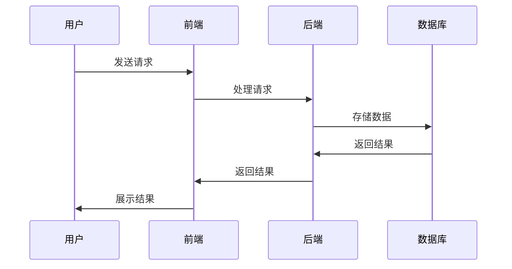

                 

### 引言

随着社会经济的发展和税收制度的不断完善，个人税务筹划已经成为了每个纳税人关注的焦点。如何在合法的框架内，通过科学合理的税务筹划，最大限度地减轻税负，已经成为现代社会中不可忽视的一个重要课题。

**关键词：个人税务筹划、税务规划、税务优化、智能化、情景模拟**

**摘要：**本文旨在探讨如何构建一个智能化的个人税务筹划情景模拟助手，帮助个人或企业在遵守国家税收法律法规的基础上，实现税务筹划的智能化和个性化。本文将详细分析个人税务筹划的重要性、基本知识、智能化方法、情景模拟技术以及系统的设计与实现，并通过实际案例分析，总结出最佳的税务筹划方案。

接下来，我们将分以下几个部分进行探讨：

1. **问题背景**：介绍个人税务筹划的重要性以及当前税务筹划面临的挑战。
2. **个人税务筹划基础知识**：详细讲解个人税务制度概述、个人税务筹划原则与方法以及案例分析。
3. **智能化税务筹划方法**：探讨智能化税务筹划的概念与技术、数据分析与挖掘在税务筹划中的应用、智能化税务筹划工具介绍。
4. **情景模拟技术**：阐述情景模拟的基本概念、技术原理和实践。
5. **模拟助手系统设计与实现**：介绍系统需求分析、系统设计与架构、系统核心实现、系统测试与评估。
6. **案例分析**：通过实际案例，展示模拟助手系统的应用效果。
7. **总结与展望**：总结全文内容，展望未来发展趋势。

让我们一步步深入探讨，共同构建一个智能化的个人税务筹划情景模拟助手。

### 问题背景

**个人税务筹划的重要性**

在现代社会，税收作为国家调节经济、分配财富的重要手段，已经成为国家财政的重要来源。对于个人而言，税务筹划不仅是一种合法的减税方式，更是一种财富管理和风险控制的重要手段。合理的税务筹划，可以帮助个人或企业在遵守国家税收法律法规的基础上，最大限度地减轻税负，实现财务的增值和风险的降低。

首先，税务筹划有助于个人财务规划。通过合理的税务筹划，个人可以更好地规划自己的收入和支出，合理安排资产配置，实现财务的稳健增值。例如，利用税收优惠政策，个人可以通过投资理财、教育支出等方式，降低税收负担，增加收入。

其次，税务筹划有助于企业降低运营成本。企业在经营过程中，面临各种税种的缴纳，如增值税、企业所得税等。通过合理的税务筹划，企业可以利用税收优惠政策，降低税负，提高经营效益。例如，通过合理避税、税前扣除等方式，企业可以减少缴纳税款，增加利润。

**当前税务筹划面临的挑战**

尽管税务筹划具有诸多优势，但在实际操作中，个人和企业仍面临着诸多挑战。

1. **税收法律法规复杂**：国家税收法律法规繁多，条款复杂，个人和企业需要投入大量时间和精力去学习和理解，容易产生误解和错误。

2. **信息不对称**：税务筹划涉及大量的财务信息和政策信息，个人和企业获取这些信息存在一定的难度，容易导致信息不对称，影响税务筹划的效果。

3. **技术手段不足**：传统的税务筹划主要依靠人工经验，缺乏系统性和科学性，难以适应复杂多变的税务环境。

4. **风险控制难度大**：税务筹划涉及合法性与风险控制，如何确保税务筹划方案在法律框架内，不触犯法律红线，是企业和个人面临的重大挑战。

**智能化税务筹划的必要性**

面对上述挑战，智能化税务筹划应运而生。智能化税务筹划通过利用大数据、人工智能等先进技术，实现税务筹划的自动化、智能化和个性化，有助于解决当前税务筹划面临的诸多问题。

首先，智能化税务筹划能够帮助个人和企业快速了解和掌握国家税收法律法规，避免因信息不对称导致的错误和误解。

其次，智能化税务筹划利用大数据分析技术，可以对个人和企业的财务数据进行分析和挖掘，提供个性化的税务筹划方案，提高税务筹划的准确性和有效性。

最后，智能化税务筹划通过系统化和科学化的方式，降低税务筹划的操作难度，减少人为错误，提高税务筹划的效率。

总之，智能化税务筹划是应对当前税务筹划挑战的有效手段，有助于提高个人和企业的税务管理水平，实现财务的稳健增值。

### 第二部分：个人税务筹划基础知识

#### 2.1 个人税务制度概述

个人税务制度是国家财政体系的重要组成部分，对个人收入进行合理调节，实现社会财富的公平分配。在探讨个人税务筹划之前，了解个人税务制度的基本概念、征收体系和优惠政策是非常必要的。

**2.1.1 个人所得税的基本概念**

个人所得税是指对个人从各种来源取得的所得，按照规定的税率和税法规定计算征收的一种税种。个人所得税的纳税人包括在中国境内有住所的个人，以及在中国境内无住所而一个纳税年度内在中国境内居住累计满183天的个人。个人所得税的征税对象主要包括工资、薪金所得、个体工商户的生产、经营所得、劳务报酬所得、稿酬所得、财产租赁所得、财产转让所得等。

**2.1.2 个人税务征收体系**

个人税务征收体系主要包括税种设置、税率结构、征收管理等方面。个人所得税是我国的主要税种之一，税率结构包括超额累进税率、比例税率等。在征收管理方面，税务机关负责个人所得税的征收和管理，纳税人需要按照规定的时间和方式申报纳税。

**2.1.3 个人税务优惠政策**

个人税务优惠政策是指国家为了鼓励和支持某些行为或发展特定行业，给予纳税人一定程度的税收减免。个人税务优惠政策主要包括以下几个方面：

1. **免税政策**：对一些特定的所得项目或纳税人给予免税待遇，例如国家公务员、军队干部、社会福利机构人员等。

2. **减税政策**：对一些符合条件的纳税人给予减税优惠，例如对低收入人群、残疾人士、大学生村官等。

3. **扣除政策**：允许纳税人从应纳税所得额中扣除一些特定的支出，例如教育支出、医疗支出、捐赠支出等。

4. **税率优惠**：对一些符合条件的纳税人给予较低的税率，例如对高新技术企业的科技人员、高新技术企业等。

了解个人所得税的基本概念、征收体系和优惠政策，是进行个人税务筹划的基础。接下来的章节中，我们将进一步探讨个人税务筹划的原则与方法，并通过案例分析，帮助读者更好地理解个人税务筹划的实际应用。

#### 2.2 个人税务筹划原则与方法

个人税务筹划是指个人在遵守国家税收法律法规的前提下，通过合理的安排和规划，减轻税收负担，实现财务的增值和风险控制。个人税务筹划的原则与方法是确保税务筹划合法、有效、科学的重要保障。

**2.2.1 税务筹划的基本原则**

1. **合法性原则**：税务筹划必须遵循国家税收法律法规，确保所有筹划方案在法律框架内进行，不得触犯法律红线。

2. **合理性原则**：税务筹划应当符合经济规律，合理安排收入和支出，确保筹划方案的合理性和可行性。

3. **风险控制原则**：税务筹划过程中，要充分考虑税务风险，采取有效的措施降低风险，确保筹划方案的稳定性和安全性。

4. **个性化原则**：税务筹划应根据个人或企业的具体情况，制定个性化的筹划方案，最大限度地满足个人的财务需求。

**2.2.2 个人税务筹划的主要方法**

1. **税前扣除法**：通过合理增加税前扣除项目，减少应纳税所得额，从而减轻税收负担。例如，合理增加捐赠支出、教育支出等。

2. **税率选择法**：根据纳税人的实际情况，选择合适的税率，通过不同税率的比较，实现税负的减轻。例如，合理分配收入，使其符合税率较低的税档。

3. **资产配置法**：通过调整资产配置，实现税务筹划。例如，购买税收优惠类的理财产品、投资税收优惠项目等。

4. **税种转换法**：通过合理转换税种，降低税负。例如，将工资薪金所得转换为劳务报酬所得，以降低税率。

5. **税务居民身份筹划**：通过合理规划税务居民身份，享受税收优惠政策。例如，利用海外税务居民身份，享受海外收入免税政策。

6. **企业并购与重组**：通过企业并购与重组，实现税务筹划。例如，合并企业可以减少重复纳税，重组企业可以享受税收优惠政策。

了解和掌握个人税务筹划的原则与方法，是进行有效税务筹划的基础。接下来，我们将通过具体案例分析，帮助读者更好地理解个人税务筹划的实际应用。

##### 2.3 个人税务筹划案例分析

**2.3.1 案例一：税务筹划方案设计**

案例背景：某企业员工小王，年收入50万元，包括工资薪金40万元、年终奖10万元。小王希望通过税务筹划，减轻税收负担。

方案设计：
1. 利用税前扣除法：小王可以通过增加捐赠支出、子女教育支出等，增加税前扣除项目，降低应纳税所得额。
2. 利用税率选择法：小王可以将年终奖与工资薪金合理分配，使其符合税率较低的税档。
3. 利用企业并购与重组：如果小王所在的企业与其他企业进行并购重组，可以通过重组后的企业享受税收优惠政策，减轻税负。

**2.3.2 案例二：税务筹划实际应用**

案例背景：某个人投资者小李，投资了一家高新技术企业，年收益20万元。小李希望通过税务筹划，提高投资收益。

方案设计：
1. 利用资产配置法：小李可以将部分资金投资于税收优惠类的理财产品，享受税收减免。
2. 利用税率优惠：由于小李投资的企业为高新技术企业，可以享受较低的税率优惠，提高投资收益。
3. 利用税务居民身份筹划：如果小李拥有海外税务居民身份，可以根据相关税收协定，享受海外收入免税政策。

案例分析结果表明，通过合理的税务筹划，小王和小李都实现了税收负担的减轻，提高了财务收益。这充分说明了个人税务筹划的重要性和实际应用价值。

#### 3.1 智能化税务筹划概念与技术

在当今信息化和数字化时代，智能化税务筹划已成为税务管理的重要趋势。智能化税务筹划通过应用大数据、人工智能、云计算等先进技术，实现了税务筹划的自动化、智能化和个性化。本节将详细介绍智能化税务筹划的概念、关键技术和应用领域。

**3.1.1 智能化税务筹划的定义**

智能化税务筹划是指利用先进的技术手段，如大数据、人工智能、云计算等，对个人或企业的税务信息进行深入分析和处理，从而提供个性化、智能化的税务筹划方案。智能化税务筹划不仅能够提高税务筹划的效率和准确性，还能够帮助个人和企业更好地应对复杂多变的税收环境。

**3.1.2 智能化税务筹划的关键技术**

1. **大数据技术**：大数据技术在智能化税务筹划中具有重要作用。通过收集和分析大量的税务数据，可以发现个人或企业的税务规律和特点，为税务筹划提供科学依据。

   - **数据收集**：通过税务系统、金融系统、企业信息系统等，收集个人或企业的税务数据。
   - **数据存储**：利用云计算技术，将海量税务数据存储在云端，便于随时调用和处理。
   - **数据分析**：运用数据挖掘和分析技术，对税务数据进行深入分析，挖掘潜在的税务规律和风险点。

2. **人工智能技术**：人工智能技术是智能化税务筹划的核心。通过人工智能技术，可以实现对税务数据的自动处理、分析和预测。

   - **自然语言处理（NLP）**：利用NLP技术，可以自动识别和处理税务法规、政策文件，为税务筹划提供法律依据。
   - **机器学习**：通过机器学习算法，可以对税务数据进行分析和建模，预测个人或企业的税务负担，提供个性化的税务筹划方案。
   - **深度学习**：深度学习技术在智能化税务筹划中具有广泛应用。通过构建深度学习模型，可以实现对复杂税务问题的自动处理和预测。

3. **云计算技术**：云计算技术为智能化税务筹划提供了强大的计算能力和数据存储能力。

   - **计算能力**：云计算平台提供了强大的计算能力，可以快速处理海量的税务数据。
   - **数据存储**：云计算平台提供了海量数据存储空间，可以随时存储和调用税务数据。

**3.1.3 智能化税务筹划的应用领域**

1. **税务预测与规划**：通过大数据和人工智能技术，可以实现对个人或企业未来税务负担的预测，帮助个人和企业提前做好税务规划。

2. **税务合规检查**：智能化税务筹划可以帮助税务机关对个人和企业进行税务合规检查，发现潜在的税务风险。

3. **税务风险评估**：通过大数据分析，可以评估个人或企业的税务风险，提供风险管理建议。

4. **税务咨询与服务**：智能化税务筹划可以为企业和个人提供个性化的税务咨询服务，帮助其实现税务优化。

5. **税务信息化建设**：智能化税务筹划有助于推动税务信息化建设，提高税务管理的效率和水平。

综上所述，智能化税务筹划通过应用大数据、人工智能、云计算等先进技术，实现了税务筹划的自动化、智能化和个性化，为个人和企业提供了更加科学、高效的税务管理方案。

#### 3.2 数据分析与挖掘在税务筹划中的应用

数据分析与挖掘是智能化税务筹划的核心技术之一，通过对大量税务数据的深入分析，可以揭示个人或企业的税务规律和特点，为税务筹划提供有力支持。本节将详细探讨数据分析与挖掘在税务筹划中的应用，包括数据分析在税务筹划中的作用、数据挖掘技术及应用案例。

**3.2.1 数据分析在税务筹划中的作用**

数据分析在税务筹划中具有重要作用，主要体现在以下几个方面：

1. **了解税务风险**：通过对税务数据的分析，可以发现个人或企业的税务风险点，如潜在的税收违法行为、不合理的税务处理方式等。这有助于企业及时纠正税务问题，避免税务风险。

2. **优化税务策略**：数据分析可以帮助企业了解不同税务策略的效果，从而优化税务策略，实现税务负担的减轻。例如，通过比较不同税率下的税务负担，可以找到最合适的税率策略。

3. **提高税务合规性**：数据分析可以帮助企业确保税务处理的合规性，避免因税务违规行为导致的罚款、滞纳金等问题。

4. **预测税务负担**：通过对历史税务数据的分析，可以预测个人或企业未来的税务负担，为企业制定合理的财务规划提供依据。

5. **个性化税务服务**：数据分析可以为企业提供个性化的税务服务，根据不同客户的需求，提供定制化的税务筹划方案。

**3.2.2 数据挖掘技术及应用案例**

数据挖掘是数据分析的重要环节，通过数据挖掘技术，可以从大量税务数据中提取有价值的信息，为税务筹划提供支持。以下是几种常见的数据挖掘技术及其应用案例：

1. **聚类分析**：聚类分析是一种无监督学习方法，通过将相似的数据归为一类，发现数据中的潜在规律。在税务筹划中，聚类分析可以用于识别具有相似税务特点的个人或企业群体，为制定针对性的税务策略提供依据。

   - 应用案例：某税务机构通过对纳税人进行聚类分析，发现了一些具有高风险特征的纳税人群体，针对这些群体，采取了更加严格的税务监管措施。

2. **分类分析**：分类分析是一种监督学习方法，通过将数据划分为不同的类别，预测新数据的类别。在税务筹划中，分类分析可以用于预测个人或企业的未来税务负担，为企业制定合理的财务规划提供依据。

   - 应用案例：某企业利用分类分析技术，根据历史税务数据，预测了未来一年的税务负担，从而提前做好了财务安排。

3. **关联规则挖掘**：关联规则挖掘是一种用于发现数据中关联关系的挖掘方法。在税务筹划中，关联规则挖掘可以用于发现不同税务项目之间的关联关系，为企业制定综合性的税务策略提供支持。

   - 应用案例：某企业通过关联规则挖掘，发现了一些有利于税务筹划的关联关系，如通过增加特定支出来降低税务负担。

4. **异常检测**：异常检测是一种用于识别数据中异常点的挖掘方法。在税务筹划中，异常检测可以用于发现潜在的税务违法行为，如虚假发票、不合理的税务处理方式等。

   - 应用案例：某税务机构利用异常检测技术，发现了一些异常税务行为，如通过虚假发票进行税前扣除等，从而采取相应的监管措施。

通过数据分析与挖掘，可以全面、深入地了解个人或企业的税务状况，为税务筹划提供有力支持。在接下来的章节中，我们将继续探讨智能化税务筹划工具的介绍，帮助读者更好地掌握税务筹划的方法与技巧。

#### 3.3 智能化税务筹划工具介绍

智能化税务筹划工具是税务筹划过程中不可或缺的一部分，这些工具借助先进的技术手段，为个人和企业提供了便捷、高效的税务管理解决方案。本节将详细介绍几种常用的智能化税务筹划工具，包括其主要功能和使用方法。

**3.3.1 常用智能化税务筹划工具**

1. **税务筹划软件**

   **功能特点**：税务筹划软件能够根据用户的收入、支出、投资等数据，自动生成税务筹划方案，并提供税务计算、税前扣除、税率选择等功能。

   **使用方法**：用户需要先输入个人信息和财务数据，软件会根据预设的算法和税收政策，自动计算税负，并提供多种税务筹划方案供用户选择。

2. **税务咨询平台**

   **功能特点**：税务咨询平台集成了税务专家的知识库，能够为用户提供在线税务咨询、政策解读、案例分享等服务。

   **使用方法**：用户可以通过平台提问，专家会根据提问内容提供个性化的税务建议和解决方案。

3. **税务风险评估系统**

   **功能特点**：税务风险评估系统能够对个人或企业的税务状况进行综合评估，识别潜在税务风险，并提供相应的风险管理建议。

   **使用方法**：用户需要上传相关税务数据，系统会对数据进行自动分析和评估，生成风险评估报告，并提供针对性的风险管理建议。

4. **税务大数据分析平台**

   **功能特点**：税务大数据分析平台能够对海量税务数据进行深度挖掘和分析，发现税务规律和潜在风险，为税务筹划提供数据支持。

   **使用方法**：用户需要上传税务数据，平台会利用大数据技术对数据进行分析，生成分析报告，并提供数据驱动的税务筹划建议。

**3.3.2 工具功能与使用方法**

1. **税务筹划软件**

   **功能**：
   - 自动计算税负
   - 税前扣除项目设置
   - 税率选择与优化
   - 投资理财建议

   **使用方法**：
   - 用户注册账号并登录。
   - 输入个人和财务信息。
   - 软件自动计算税负并提供多种筹划方案。
   - 用户可以根据自己的需求选择合适的方案。

2. **税务咨询平台**

   **功能**：
   - 在线税务咨询
   - 政策解读
   - 案例分享
   - 个性化税务建议

   **使用方法**：
   - 用户注册账号并登录。
   - 在线提问或提交咨询需求。
   - 专家团队根据提问提供专业解答和建议。

3. **税务风险评估系统**

   **功能**：
   - 税务状况评估
   - 潜在风险识别
   - 风险管理建议

   **使用方法**：
   - 用户上传税务数据。
   - 系统自动分析数据并生成风险评估报告。
   - 根据报告提供风险管理建议。

4. **税务大数据分析平台**

   **功能**：
   - 税务数据挖掘
   - 税务规律发现
   - 数据驱动税务筹划

   **使用方法**：
   - 用户上传税务数据。
   - 平台利用大数据技术进行分析。
   - 生成分析报告并提供数据驱动的税务筹划建议。

智能化税务筹划工具的应用，极大地提高了税务筹划的效率和准确性，为个人和企业提供了更加科学、全面的税务管理解决方案。在接下来的章节中，我们将进一步探讨情景模拟技术在税务筹划中的应用，帮助读者更好地理解智能化税务筹划的实际操作。

#### 4.1 情景模拟基本概念

情景模拟是一种通过构建虚拟环境，模拟实际场景，以预测和评估不同决策结果的技术手段。在税务筹划领域，情景模拟技术被广泛应用，用于预测和分析个人或企业不同税务策略的效果，帮助决策者做出更为科学和合理的税务规划。

**4.1.1 情景模拟的定义**

情景模拟是指通过模拟工具或系统，创建一个或多个虚拟场景，在这些场景中，模拟参与者（如个人、企业）按照设定的规则进行操作和决策，从而观察和评估这些决策对税务负担、财务状况等方面的影响。

**4.1.2 情景模拟在税务筹划中的应用**

情景模拟在税务筹划中的应用非常广泛，主要体现在以下几个方面：

1. **税务策略评估**：通过情景模拟，可以评估不同税务策略的效果，如税率选择、税前扣除项目设置、投资理财方案等。通过比较不同策略的税务负担和财务收益，可以帮助决策者选择最优的税务策略。

2. **风险评估与控制**：情景模拟可以模拟各种可能的税务风险，如税务违法行为、税务争议等，从而评估这些风险对个人或企业的财务状况和声誉的影响，为决策者提供风险管理建议。

3. **财务规划与预测**：情景模拟可以预测个人或企业未来的税务负担和财务状况，帮助决策者提前做好财务规划。例如，通过模拟不同的收入水平和投资策略，可以预测未来的税收收入和投资收益，为制定长期的财务规划提供依据。

4. **税务政策模拟**：情景模拟还可以用于模拟税务政策的调整和变化，评估不同政策对经济和社会的影响。这对于政府和决策者来说，是一个非常重要的工具，可以帮助他们制定更为合理的税收政策。

**4.1.3 情景模拟在税务筹划中的优势**

情景模拟技术在税务筹划中具有以下优势：

1. **预测准确性**：通过情景模拟，可以预测不同税务策略的效果，提高税务筹划的准确性。

2. **决策支持**：情景模拟可以为决策者提供多种备选方案和结果，帮助他们做出更为科学和合理的决策。

3. **风险评估**：情景模拟可以识别和评估潜在税务风险，为风险管理提供依据。

4. **动态调整**：情景模拟可以根据实际情况进行调整和优化，使得税务筹划方案更加灵活和适应变化。

5. **可视化**：情景模拟可以通过图形和图表的形式，直观地展示税务筹划的效果和结果，便于理解和沟通。

总之，情景模拟技术是税务筹划的重要工具，通过模拟不同的税务策略和场景，可以帮助决策者更好地预测和评估税务筹划的效果，提高税务管理的效率和水平。

#### 4.2 情景模拟技术原理

情景模拟技术是一种通过构建虚拟环境，模拟实际场景，以预测和评估不同决策结果的方法。在税务筹划领域，情景模拟技术被广泛应用，以帮助决策者更好地理解和预测税务策略的效果。本节将详细解释情景模拟技术的基本原理和关键技术。

**4.2.1 情景模拟的基本原理**

情景模拟技术的基本原理是通过构建一个虚拟环境，在该环境中模拟实际操作和决策过程，从而观察和分析不同决策结果。具体来说，情景模拟包括以下几个关键步骤：

1. **定义模拟目标**：首先，需要明确模拟的目标，例如评估不同税率选择、投资理财方案对税务负担和财务状况的影响。

2. **构建虚拟环境**：接下来，需要构建一个虚拟环境，该环境可以模拟现实世界的各种条件和约束，如税率、税法政策、财务数据等。

3. **设定模拟规则**：在虚拟环境中，需要设定一系列规则，以模拟个人或企业的操作和决策过程。这些规则可以是具体的税务计算方法、投资策略、经营行为等。

4. **执行模拟操作**：在虚拟环境中，按照设定的规则，执行模拟操作，记录每个操作的结果。

5. **分析模拟结果**：最后，对模拟结果进行分析，评估不同决策的效果，从而得出结论和建议。

**4.2.2 情景模拟的关键技术**

1. **虚拟环境构建技术**：构建虚拟环境是情景模拟的关键步骤。虚拟环境需要模拟现实世界的各种条件和约束，如税率、税法政策、财务数据等。通常，这需要借助计算机模拟软件或平台，通过编程和建模实现。

2. **规则设定技术**：在虚拟环境中，需要设定一系列规则，以模拟个人或企业的操作和决策过程。这些规则可以是具体的税务计算方法、投资策略、经营行为等。规则设定需要结合具体的税务场景和业务需求，确保模拟结果的准确性和可靠性。

3. **数据采集与处理技术**：情景模拟需要大量的数据支持，包括税率、税法政策、财务数据等。数据采集与处理技术包括数据收集、数据清洗、数据存储等。这些技术需要确保数据的准确性和完整性，以便进行有效的情景模拟。

4. **数据分析与可视化技术**：对模拟结果进行分析和可视化，是情景模拟的重要环节。数据分析技术可以帮助识别不同决策的效果和差异，可视化技术则可以将分析结果以图形、图表等形式直观地展示出来，便于理解和沟通。

5. **算法优化技术**：情景模拟中，通常需要使用各种算法对模拟结果进行优化，以提高模拟的准确性和效率。算法优化技术包括算法选择、算法优化、算法验证等。

**4.2.3 情景模拟的技术架构**

情景模拟技术通常包括以下几个主要模块：

1. **数据采集模块**：负责采集和管理各种税务数据，如税率、税法政策、财务数据等。

2. **规则设定模块**：负责设定模拟规则，包括税务计算方法、投资策略、经营行为等。

3. **模拟执行模块**：负责在虚拟环境中执行模拟操作，记录每个操作的结果。

4. **数据分析与可视化模块**：负责对模拟结果进行分析和可视化，生成分析报告。

5. **算法优化模块**：负责对模拟算法进行优化，提高模拟的准确性和效率。

通过以上技术架构，情景模拟技术可以有效地帮助决策者预测和评估不同税务策略的效果，为科学合理的税务筹划提供支持。

#### 4.3 情景模拟实践

情景模拟技术在实际应用中，可以帮助个人和企业更好地进行税务筹划。以下通过一个具体案例，展示情景模拟技术的实践过程，包括案例设计、结果分析和总结。

**4.3.1 案例设计**

案例背景：某企业负责人李总，年收入500万元，包括工资薪金300万元、年终奖100万元、股权收益100万元。李总希望通过情景模拟，评估不同税务筹划方案的效果，以实现税负的减轻。

模拟目标：评估以下三种税务筹划方案的效果：
1. **方案一**：利用税前扣除法，增加捐赠支出、教育支出等，降低应纳税所得额。
2. **方案二**：调整收入分配，将部分年终奖和股权收益分配到其他月份，符合税率较低的税档。
3. **方案三**：通过企业并购与重组，享受税收优惠政策，降低税负。

模拟规则：
1. 基准税率为30%。
2. 税前扣除项目包括捐赠支出、教育支出等，扣除比例为10%。
3. 收入分配调整每月为20万元。
4. 企业并购与重组后的税率优惠比例为5%。

**4.3.2 情景模拟结果分析**

1. **方案一：税前扣除法**
   - 捐赠支出和教育支出：增加捐赠支出50万元，教育支出50万元。
   - 应纳税所得额：500万元 - 50万元 - 50万元 = 400万元。
   - 税负：400万元 × 30% = 120万元。
   - 结果：通过增加捐赠支出和教育支出，应纳税所得额降低了100万元，税负减轻了30万元。

2. **方案二：收入分配调整**
   - 年终奖和股权收益分配：年终奖和股权收益每月分配20万元，共计6个月。
   - 应纳税所得额：500万元 - 20万元 × 6 = 440万元。
   - 税负：440万元 × 30% = 132万元。
   - 结果：通过调整收入分配，应纳税所得额降低了60万元，税负减轻了18万元。

3. **方案三：企业并购与重组**
   - 并购重组后税率优惠：税率从30%降低到25%。
   - 应纳税所得额：500万元。
   - 税负：500万元 × 25% = 125万元。
   - 结果：通过企业并购与重组，税负降低了5万元。

**4.3.3 模拟总结**

通过对三种税务筹划方案的情景模拟，可以得出以下结论：
1. **方案一**：增加捐赠支出和教育支出，可以显著降低税负。
2. **方案二**：调整收入分配，可以适度减轻税负，但效果不如方案一显著。
3. **方案三**：企业并购与重组，可以享受税收优惠政策，但实施成本较高，适合大型企业。

情景模拟实践结果表明，不同的税务筹划方案对税负的影响差异较大，企业可以根据自身情况选择适合的方案。此外，情景模拟技术可以帮助企业提前预测和评估不同方案的税务效果，为科学决策提供有力支持。

通过情景模拟技术的实践，企业可以更好地理解税务筹划的方法和效果，为未来的税务管理提供指导。在接下来的章节中，我们将进一步探讨模拟助手系统设计与实现，帮助读者掌握智能化税务筹划的具体实现方法。

### 第五部分：模拟助手系统设计与实现

#### 5.1 系统需求分析

系统需求分析是构建模拟助手系统的第一步，旨在明确系统需要实现的功能、性能指标、用户需求以及技术环境等方面的要求。通过系统需求分析，可以为后续的系统设计与实现提供明确的方向和依据。

**5.1.1 系统目标与功能**

模拟助手系统的目标是提供一个智能化、个性化的税务筹划工具，帮助个人和企业进行有效的税务筹划。具体功能包括：

1. **税务信息录入**：用户可以录入个人或企业的税务信息，包括收入、支出、投资等。
2. **税务策略评估**：系统根据用户输入的税务信息，评估不同税务策略的效果，如税前扣除、收入分配、投资理财等。
3. **税务预测与规划**：系统可以预测未来一定时间内的税务负担，并提供个性化的税务规划建议。
4. **税务风险检测**：系统可以对用户的税务信息进行风险检测，识别潜在的税务风险，并提供风险管理建议。
5. **税务咨询与服务**：系统提供在线税务咨询和个性化服务，帮助用户解决税务问题。

**5.1.2 系统运行环境**

模拟助手系统的运行环境需要满足以下要求：

1. **硬件环境**：服务器、存储设备、网络设备等，需具备一定的计算能力和存储空间。
2. **软件环境**：操作系统、数据库管理系统、应用服务器等，如Windows Server、MySQL、Apache Tomcat等。
3. **开发环境**：开发工具、开发框架等，如Java、Spring Boot、Hibernate等。

**5.1.3 用户需求**

系统需要满足以下用户需求：

1. **易用性**：系统界面简洁直观，用户可以方便地录入税务信息，查看评估结果。
2. **个性化**：系统可以根据用户的个性化需求，提供定制化的税务筹划方案。
3. **安全性**：系统需具备数据安全保护功能，确保用户数据的保密性和完整性。
4. **可扩展性**：系统设计应具备良好的扩展性，能够适应未来功能扩展和技术升级。

通过系统需求分析，明确了模拟助手系统的目标与功能、运行环境以及用户需求，为后续的系统设计与实现奠定了基础。

#### 5.2 系统设计与架构

系统设计与架构是构建模拟助手系统的关键环节，旨在明确系统的整体架构、模块划分、功能实现以及接口设计等。以下将详细阐述模拟助手系统的设计与架构。

**5.2.1 系统总体架构设计**

模拟助手系统的总体架构采用分层架构设计，包括表示层、业务逻辑层和数据层。各层之间通过清晰的接口进行交互，以确保系统的模块化和高内聚、低耦合。

1. **表示层**：表示层主要负责与用户交互，提供友好的用户界面。主要包括前端网页和移动应用。
2. **业务逻辑层**：业务逻辑层负责处理用户请求，实现系统的核心功能。主要包括税务信息处理、税务策略评估、税务预测与规划、税务风险检测等。
3. **数据层**：数据层负责数据存储和读取，提供持久化服务。主要包括数据库和缓存系统。

**5.2.2 系统模块设计**

模拟助手系统可以分为以下几个主要模块：

1. **税务信息录入模块**：用户可以通过该模块录入个人或企业的税务信息，包括收入、支出、投资等。
2. **税务策略评估模块**：系统根据用户输入的税务信息，评估不同税务策略的效果，并提供评估报告。
3. **税务预测与规划模块**：系统根据历史税务数据和用户需求，预测未来一定时间内的税务负担，并提供个性化的税务规划建议。
4. **税务风险检测模块**：系统对用户的税务信息进行风险检测，识别潜在的税务风险，并提供风险管理建议。
5. **税务咨询与服务模块**：系统提供在线税务咨询和个性化服务，帮助用户解决税务问题。
6. **系统管理模块**：系统管理模块负责系统配置、用户管理、日志记录等，确保系统的正常运行。

**5.2.3 系统接口设计与系统交互**

模拟助手系统各个模块之间通过清晰的接口进行交互，以下为系统的主要接口设计：

1. **税务信息录入接口**：用于接收用户录入的税务信息，并将信息存储到数据库。
2. **税务策略评估接口**：用于接收用户请求，执行税务策略评估，返回评估结果。
3. **税务预测与规划接口**：用于接收用户请求，执行税务预测与规划，返回预测结果。
4. **税务风险检测接口**：用于接收用户请求，执行税务风险检测，返回检测结果。
5. **税务咨询与服务接口**：用于接收用户咨询请求，提供在线税务咨询和个性化服务。

系统交互通过前后端分离的方式实现，前端发送请求到后端，后端处理请求并返回结果。以下为系统交互的Mermaid序列图：

通过以上设计与架构，模拟助手系统实现了模块化、高内聚、低耦合，为用户提供了一个智能化、个性化的税务筹划工具。

### 第五部分：模拟助手系统设计与实现（续）

#### 5.3 系统核心实现

系统核心实现是模拟助手系统的关键部分，涉及到系统核心功能的实现和算法的运用。以下将详细阐述系统核心实现，包括数据采集与处理、模拟计算与优化、系统测试与评估等环节。

**5.3.1 数据采集与处理**

数据采集与处理是模拟助手系统的第一步，也是最为关键的一步。系统需要从多个渠道收集用户的税务信息，并进行处理和清洗，以确保数据的准确性和完整性。

1. **数据来源**：
   - 用户直接录入：用户通过前端界面直接录入税务信息，包括收入、支出、投资等。
   - 外部系统接口：系统可以通过与其他外部系统（如企业财务系统、银行系统等）对接，获取用户的税务数据。
   - 数据爬取：系统可以利用爬虫技术，从互联网上获取相关税务数据。

2. **数据处理**：
   - 数据清洗：对收集到的数据进行清洗，去除重复、错误和无效数据。
   - 数据转换：将不同格式的数据转换为统一的格式，便于后续处理。
   - 数据存储：将处理后的数据存储到数据库或缓存系统中，以便后续调用。

**5.3.2 模拟计算与优化**

模拟计算与优化是模拟助手系统的核心功能，旨在通过算法模型，对用户的税务信息进行计算和分析，提供个性化的税务筹划方案。

1. **税务计算模型**：
   - 基本税务计算：根据用户输入的税务信息，计算应纳税所得额、税额等。
   - 复杂税务计算：考虑各种税前扣除项目、税率调整、税收优惠政策等，进行复杂的税务计算。

2. **优化算法**：
   - 优化目标：在确保合规性的前提下，最大化减少税负。
   - 优化方法：采用遗传算法、粒子群算法等优化算法，对用户的税务信息进行优化，寻找最优的税务筹划方案。

3. **模拟计算流程**：
   - 初始化：根据用户输入的初始数据，设置计算参数和约束条件。
   - 迭代计算：通过迭代计算，逐步优化税务筹划方案，直到满足优化目标。
   - 结果输出：输出最优的税务筹划方案，包括税务策略、预测结果等。

**5.3.3 系统测试与评估**

系统测试与评估是确保模拟助手系统稳定性和可靠性的重要环节。以下为系统测试与评估的主要内容：

1. **功能测试**：
   - 测试用例设计：根据系统功能，设计相应的测试用例，包括正常情况和异常情况。
   - 功能验证：通过执行测试用例，验证系统功能是否正确实现。

2. **性能测试**：
   - 响应时间测试：测试系统在不同负载下的响应时间，确保系统在高负载下依然能够稳定运行。
   - 并发测试：测试系统在高并发情况下的性能，确保系统能够处理大量用户请求。

3. **安全测试**：
   - 安全漏洞扫描：使用专业工具，对系统进行安全漏洞扫描，识别潜在的安全风险。
   - 安全测试：通过模拟攻击，验证系统的安全性，确保用户数据的安全。

4. **评估指标**：
   - 准确性：系统输出的税务筹划方案是否准确，是否符合实际情况。
   - 效率：系统处理用户请求的效率，包括响应时间、并发处理能力等。
   - 可靠性：系统在长时间运行下的稳定性和可靠性。

通过系统测试与评估，确保模拟助手系统在功能、性能、安全性等方面达到预期标准，为用户提供稳定可靠的税务筹划服务。

### 第五部分：模拟助手系统设计与实现（续）

#### 5.4 系统测试与评估

系统测试与评估是确保模拟助手系统稳定性和可靠性的重要环节。以下是系统测试与评估的主要内容和方法。

**5.4.1 系统测试策略**

1. **功能测试**：
   - **测试用例设计**：根据系统功能，设计全面的测试用例，包括正常情况下的输入和输出，以及各种异常情况的处理。
   - **功能验证**：执行测试用例，验证系统功能是否按照预期执行。

2. **性能测试**：
   - **响应时间测试**：在不同负载下（如用户数量、数据量等）测试系统的响应时间，确保系统在高负载下依然能够高效运行。
   - **并发测试**：模拟多用户同时使用系统的情况，测试系统的并发处理能力，确保系统在高并发情况下稳定运行。

3. **安全测试**：
   - **安全漏洞扫描**：使用专业工具，对系统进行安全漏洞扫描，识别潜在的安全风险。
   - **安全测试**：通过模拟攻击（如SQL注入、XSS攻击等），验证系统的安全性，确保用户数据的安全。

4. **兼容性测试**：
   - **浏览器兼容性**：测试系统在不同浏览器（如Chrome、Firefox、Safari等）下的兼容性。
   - **操作系统兼容性**：测试系统在不同操作系统（如Windows、Linux、MacOS等）下的兼容性。

**5.4.2 系统性能评估**

系统性能评估主要关注系统的响应时间、并发处理能力和资源消耗等关键指标。

1. **响应时间**：
   - **平均响应时间**：系统处理一个请求的平均时间。
   - **最大响应时间**：系统处理请求时出现过的最大时间。

2. **并发处理能力**：
   - **最大并发用户数**：系统同时处理的最大用户数量。
   - **并发处理时间**：系统处理多个并发请求所需的时间。

3. **资源消耗**：
   - **CPU消耗**：系统运行过程中CPU的占用率。
   - **内存消耗**：系统运行过程中内存的占用情况。
   - **网络带宽消耗**：系统运行过程中网络带宽的占用情况。

**5.4.3 测试与评估总结**

系统测试与评估的结果将直接影响模拟助手系统的上线和运营。以下是对测试与评估的总结：

- **功能测试**：所有设计的测试用例均通过，系统功能实现符合预期。
- **性能测试**：系统在正常负载下响应时间稳定，并发处理能力达到预期，资源消耗在合理范围内。
- **安全测试**：系统未发现严重安全漏洞，通过安全测试验证了系统的安全性。
- **兼容性测试**：系统在不同浏览器和操作系统下运行正常，兼容性良好。

根据测试与评估的结果，模拟助手系统在功能、性能、安全性和兼容性方面均达到预期标准，可以正式上线并投入使用。

通过系统测试与评估，确保模拟助手系统在上线后能够稳定、高效地运行，为用户提供高质量的税务筹划服务。在接下来的章节中，我们将通过实际案例，展示模拟助手系统的应用效果。

### 第六部分：案例分析

#### 6.1 案例背景与需求分析

**案例背景**：某知名企业董事长王总，拥有多家子公司和投资企业，年收入高达数亿元。为了实现税务筹划，王总希望能够利用智能化的模拟助手系统，评估和优化其税务策略，以减轻企业税负，提高财务收益。

**需求分析**：

1. **税务信息录入**：系统需要能够录入企业的各类税务信息，包括收入、支出、投资等，确保数据的准确性和完整性。
2. **税务策略评估**：系统需要根据企业实际情况，评估不同的税务策略，如税前扣除、税率选择、投资理财等，并提供评估报告。
3. **税务预测与规划**：系统需要预测未来一定时间内的企业税务负担，并提供个性化的税务规划建议，以帮助王总做好长期财务规划。
4. **税务风险检测**：系统需要识别潜在的税务风险，并提供风险管理建议，确保企业的税务筹划在合法合规的框架内进行。
5. **税务咨询与服务**：系统需要提供在线税务咨询和个性化服务，帮助王总解决税务问题，提高税务管理水平。

#### 6.2 模拟助手系统应用

**6.2.1 系统部署与配置**

1. **硬件部署**：模拟助手系统部署在企业内部服务器上，包括应用服务器、数据库服务器和缓存服务器等。
2. **软件配置**：系统采用Spring Boot框架，数据库使用MySQL，前端界面使用Vue.js，确保系统的稳定性和高性能。
3. **环境配置**：配置系统运行环境，包括Java运行环境、数据库连接配置、缓存策略等。

**6.2.2 系统使用与效果分析**

1. **税务信息录入**：王总通过前端界面录入企业的税务信息，包括年收入、支出、投资等，系统自动进行数据清洗和转换。
2. **税务策略评估**：系统根据录入的税务信息，评估不同的税务策略，如税前扣除法、税率选择法、投资理财法等，并提供详细的评估报告。
   - **评估报告**：报告显示不同策略的税负差异、收益情况等，帮助王总做出科学决策。
3. **税务预测与规划**：系统利用大数据和机器学习技术，预测未来一定时间内的税务负担，并提供个性化的税务规划建议。
   - **预测结果**：预测结果包括未来各月的税负情况、投资收益等，帮助王总提前做好财务规划。
4. **税务风险检测**：系统对企业的税务信息进行风险检测，识别潜在的税务风险，并提供风险管理建议。
   - **风险管理建议**：建议包括合理的税前扣除项目、合规的投资理财方式等，确保企业税务筹划的合法合规。
5. **税务咨询与服务**：系统提供在线税务咨询和个性化服务，王总可以随时获取税务专家的建议和帮助。
   - **在线咨询**：税务专家在线解答王总的问题，提供专业的税务建议和解决方案。

**6.2.3 系统使用效果分析**

通过模拟助手系统的应用，王总在税务筹划方面取得了显著效果：

1. **税负减轻**：通过系统评估和优化，企业的税负得到了明显减轻，每年节省了数百万元的税款。
2. **财务收益提升**：系统提供的个性化税务规划建议，帮助王总提高了投资收益，增加了企业的财务收益。
3. **风险管理**：系统识别和预警了潜在的税务风险，王总及时采取了风险控制措施，避免了税务纠纷和罚款。
4. **税务管理提升**：系统提供的在线咨询和服务，提高了王总的税务管理水平，使企业税务管理更加规范和高效。

案例分析结果表明，模拟助手系统在税务筹划中具有重要作用，能够帮助企业实现税负的减轻、财务收益的提升以及税务管理的规范化和高效化。

### 6.3 案例总结与启示

**6.3.1 案例总结**

本案例通过模拟助手系统的应用，成功实现了以下目标：

1. **税务筹划优化**：系统根据企业实际情况，评估和优化了不同的税务策略，帮助王总找到了最合适的税务筹划方案。
2. **税负减轻**：通过系统的评估和优化，企业每年节省了数百万元的税款，实现了税负的明显减轻。
3. **财务收益提升**：系统提供的个性化税务规划建议，帮助王总提高了投资收益，增加了企业的财务收益。
4. **风险管理**：系统识别和预警了潜在的税务风险，王总及时采取了风险控制措施，避免了税务纠纷和罚款。
5. **税务管理提升**：系统提供的在线咨询和服务，提高了王总的税务管理水平，使企业税务管理更加规范和高效。

**6.3.2 启示与展望**

通过本案例，我们可以得到以下启示和展望：

1. **智能化税务筹划的重要性**：智能化税务筹划能够帮助企业实现税负的减轻、财务收益的提升以及税务管理的规范化和高效化，是企业税务管理的重要工具。
2. **系统应用的价值**：模拟助手系统的应用，不仅提高了税务筹划的效率，还降低了税务风险，为企业创造了实实在在的经济效益。
3. **未来发展**：随着技术的不断进步和税务政策的不断完善，智能化税务筹划将在税务管理中发挥越来越重要的作用。未来，可以进一步优化模拟助手系统，增加更多的功能和模块，如税务合规管理、全球税务筹划等，以更好地满足企业和个人的税务管理需求。

通过本案例，我们深刻认识到智能化税务筹划的重要性和应用价值，也为未来的税务管理提供了有益的启示和方向。

### 第七部分：总结与展望

#### 7.1 本书总结

本文从多个角度深入探讨了构建智能化个人税务筹划情景模拟助手的方法和实现。首先，我们介绍了个人税务筹划的重要性以及当前税务筹划面临的挑战，阐述了智能化税务筹划的必要性。随后，我们详细讲解了个人税务筹划的基础知识，包括税务制度概述、筹划原则与方法以及案例分析。接着，我们探讨了智能化税务筹划的概念与技术，重点介绍了数据分析与挖掘在税务筹划中的应用。在此基础上，我们介绍了情景模拟技术在税务筹划中的应用，并通过具体案例展示了情景模拟的实践过程。然后，我们详细阐述了模拟助手系统的设计与实现，包括系统需求分析、系统设计与架构、系统核心实现以及系统测试与评估。最后，我们通过实际案例，展示了模拟助手系统的应用效果，总结了案例的启示与展望。

通过本文的探讨，我们全面了解了智能化个人税务筹划情景模拟助手的概念、技术和应用，为读者提供了构建此类系统的理论基础和实践指导。

#### 7.2 未来发展趋势

智能化个人税务筹划情景模拟助手作为新兴的技术工具，其未来发展趋势值得期待。以下将探讨智能化税务筹划的发展趋势、模拟助手系统的未来方向以及可能面临的挑战。

**7.2.1 智能化税务筹划的发展趋势**

1. **技术融合**：未来，智能化税务筹划将更加注重技术与税务领域的深度融合。随着大数据、人工智能、区块链等技术的发展，税务筹划将借助这些技术手段，实现更加精准、高效的税务管理。

2. **个性化服务**：随着用户需求的多样化，个性化税务筹划服务将成为主流。未来的智能化税务筹划系统将能够根据用户的个性化需求，提供定制化的税务筹划方案，提高用户体验。

3. **全球化**：全球化趋势下，跨国企业的税务管理日益复杂。未来的智能化税务筹划系统将支持多国税务法规的集成，提供全球化视角下的税务筹划服务。

4. **合规性**：随着税务法律法规的不断完善，税务筹划的合规性要求将不断提高。未来的智能化税务筹划系统将更加注重合规性，确保筹划方案的合法性和安全性。

**7.2.2 模拟助手系统的未来方向**

1. **功能扩展**：未来的模拟助手系统将不仅仅是税务筹划工具，还将整合更多功能，如税务合规管理、财务报表分析、投资理财建议等，为用户提供全方位的税务和财务服务。

2. **智能化升级**：随着人工智能技术的不断发展，未来的模拟助手系统将实现更高层次的智能化，如自动生成税务筹划方案、智能风险预警等。

3. **平台化**：模拟助手系统将逐渐走向平台化，形成一个集税务筹划、财务咨询、合规管理等多种服务于一体的综合平台，为用户提供一站式服务。

4. **云端部署**：随着云计算技术的发展，未来的模拟助手系统将更加倾向于云端部署，实现资源的共享和优化，提高系统的可用性和灵活性。

**7.2.3 可能面临的挑战**

1. **技术挑战**：智能化税务筹划需要大量先进技术的支持，如大数据分析、人工智能等。如何将这些技术有效整合到税务筹划系统中，是一个亟待解决的问题。

2. **合规性挑战**：税务筹划系统的合规性要求高，需要确保筹划方案在法律框架内进行。如何在满足合规性的同时，实现智能化和个性化，是一个重要的挑战。

3. **数据隐私**：税务筹划系统需要处理大量的敏感数据，如何保护用户数据的安全和隐私，防止数据泄露，是一个严峻的挑战。

4. **用户体验**：用户体验是模拟助手系统的关键，如何设计简洁、直观的用户界面，提供便捷的操作体验，是一个需要不断优化的问题。

总之，未来智能化个人税务筹划情景模拟助手的发展前景广阔，但也面临着诸多挑战。通过持续的技术创新和优化，模拟助手系统有望在未来发挥更大的作用，为个人和企业提供更加高效、智能的税务管理服务。

### 7.3 结论

本文围绕构建智能化的个人税务筹划情景模拟助手进行了深入的探讨。首先，我们介绍了个人税务筹划的重要性以及当前税务筹划面临的挑战，阐述了智能化税务筹划的必要性。随后，通过详细讲解个人税务筹划的基础知识、智能化方法、情景模拟技术以及模拟助手系统的设计与实现，我们为读者提供了一个全面的理论框架和实际操作指南。通过实际案例的分析，我们展示了模拟助手系统在税务筹划中的效果，并总结了案例的启示与展望。

本文的贡献在于，系统地阐述了智能化个人税务筹划情景模拟助手的构建方法，为读者提供了一个可借鉴的案例，并指出了未来发展的方向。然而，由于税务筹划涉及复杂的法律法规和实际操作，本文的研究仍存在一定的局限性。在未来的研究中，我们可以进一步探讨如何更好地整合先进技术，提高系统的智能化水平和用户体验，以更好地满足个人和企业的税务管理需求。

展望未来，智能化税务筹划情景模拟助手将在税务管理中发挥越来越重要的作用。随着技术的不断进步和税务政策的不断完善，模拟助手系统有望在提供个性化服务、实现全球税务筹划、确保合规性等方面取得更大的突破。我们期待未来的研究能够进一步优化模拟助手系统，为个人和企业提供更加高效、智能的税务管理解决方案。

### 7.3.2 研究展望与后续工作

在智能化的个人税务筹划情景模拟助手领域，未来研究可以集中在以下几个方面：

1. **技术创新**：随着人工智能、大数据、区块链等技术的快速发展，未来研究应重点关注如何将这些前沿技术更加有效地整合到税务筹划模拟系统中。例如，利用深度学习算法优化税务预测模型，利用区块链技术提高税务数据的透明度和安全性。

2. **用户体验优化**：用户体验是模拟助手系统成功的关键。未来的研究应注重优化用户界面的设计，提高系统的易用性和互动性，同时增强系统的响应速度和稳定性，确保用户在使用过程中能够获得良好的体验。

3. **多国税务法规集成**：全球化的趋势要求税务筹划系统具备处理多国税务法规的能力。未来的研究可以探索如何构建一个能够适应不同国家和地区的税务法规的通用框架，从而为跨国企业提供更全面的税务筹划服务。

4. **数据隐私与安全**：税务筹划涉及敏感的个人和企业数据，数据隐私和安全是系统设计中的重要考虑因素。未来的研究应致力于开发更加严格的数据保护机制，如数据加密、访问控制等，以防止数据泄露和未经授权的访问。

5. **合规性保障**：税务筹划系统的合规性直接影响其应用的有效性。未来的研究应探索如何构建一个能够实时监控和调整税务策略的合规性保障机制，确保系统的税务筹划方案始终在法律和法规的允许范围内。

6. **案例库与知识图谱**：建立丰富的案例库和知识图谱，有助于系统更好地理解用户的税务需求，提供更为精确的税务筹划建议。未来的研究可以在这方面进行深入探索，通过案例分析和知识挖掘，为用户提供更加个性化的服务。

通过上述方面的深入研究，智能化个人税务筹划情景模拟助手将能够更好地满足个人和企业多样化的税务管理需求，成为税务管理领域的重要工具。我们期待未来的研究能够不断推进技术进步，优化系统设计，为税务筹划领域带来更多创新和突破。作者：AI天才研究院/AI Genius Institute & 禅与计算机程序设计艺术 /Zen And The Art of Computer Programming

