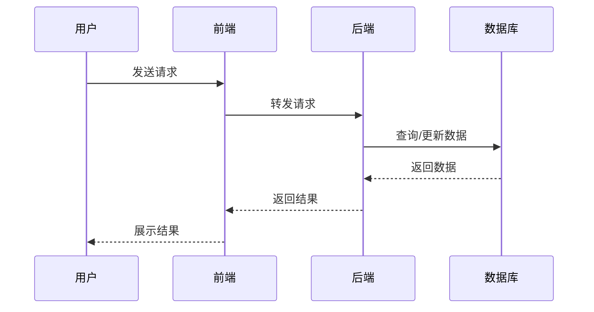
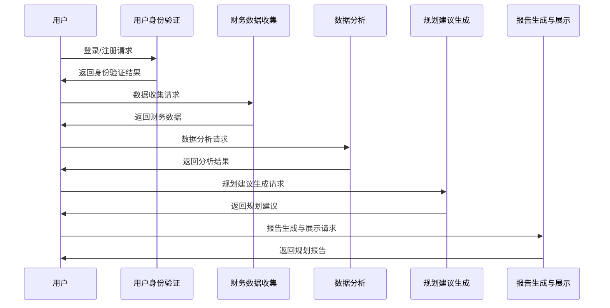
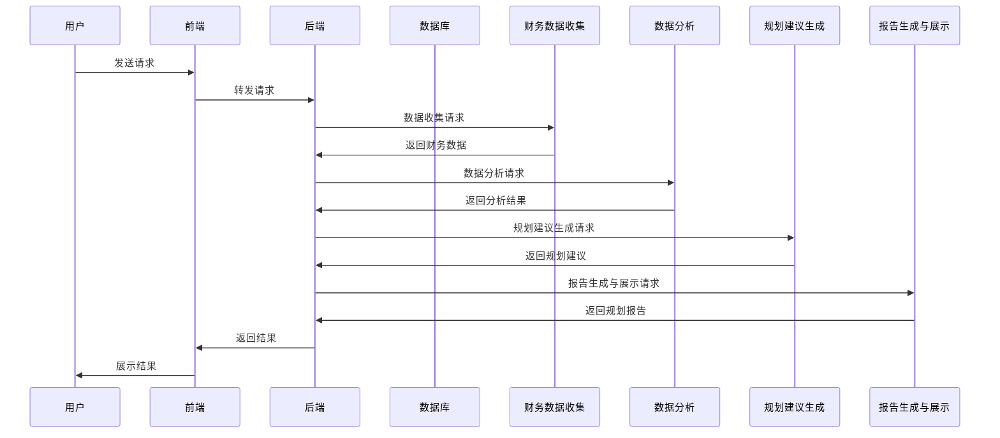
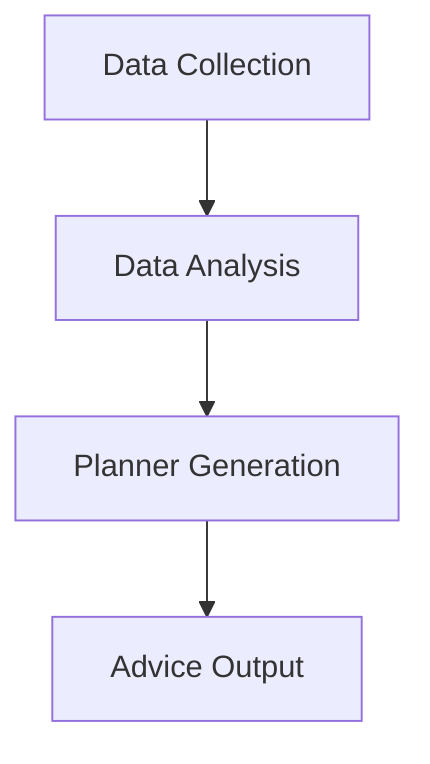

                 

### 构建智能化的个人财富传承规划助手

---

#### 关键词：智能化财富规划、财富传承、规划助手、AI应用

> 摘要：本文深入探讨了智能化个人财富传承规划助手的构建过程。通过剖析现有财富传承规划的问题，提出了基于人工智能技术的解决方案，详细介绍了核心概念、算法原理、系统架构设计及其实际应用案例。文章旨在为专业人士和爱好者提供全面的技术指导，助力打造高效的财富传承规划工具。

---

### 引言

在现代社会，个人财富的传承规划显得尤为重要。然而，传统的财富传承规划方式往往存在诸多问题，如信息不对称、个性化程度低、流程复杂等。随着人工智能（AI）技术的迅猛发展，智能化个人财富传承规划助手应运而生，成为解决上述问题的一把利器。本文将围绕这一主题，逐步分析构建智能化的个人财富传承规划助手的各个环节，以期为读者提供全面的技术视角和实际操作指南。

#### 1.1 财富传承规划概述

**定义与重要性**

财富传承规划是指个人或家庭通过制定合理的财产分配计划，确保财富在其去世后能够顺利、有效地传递给继承人。这一过程不仅关系到个人的经济利益，还涉及到家庭关系、社会地位等多方面的因素。

当前挑战

- **信息不对称**：传统的财富传承规划往往依赖于中介机构或律师，信息获取途径有限，可能导致规划结果不准确。
- **个性化程度低**：现有的财富传承规划服务多为标准化产品，缺乏针对个人实际情况的个性化建议。
- **流程复杂**：财富传承过程涉及诸多法律和税务规定，流程繁琐，容易出错。

#### 1.2 智能规划助手的优势

**定义**

智能规划助手是指利用人工智能技术，为个人或家庭提供定制化、高效、准确的财富传承规划服务。

**优势**

- **个性化服务**：通过大数据分析和机器学习，智能规划助手能够根据个人和家庭的具体情况，提供精准的财富传承方案。
- **效率提升**：自动化流程减少了人工干预，大大缩短了规划时间。
- **准确性**：人工智能技术可以处理大量数据，减少人为错误，确保规划结果更加可靠。

#### 1.3 书籍内容概述

**本书内容**

本书将分为以下几个部分：

- **第1章：引言**：介绍书籍的背景、问题陈述、解决方案及书籍结构。
- **第2章：核心概念与理论**：深入探讨财富传承规划和智能规划助手的基本概念和理论。
- **第3章：智能规划助手的算法原理**：详细介绍智能规划助手的算法原理，包括数据分析和机器学习技术。
- **第4章：系统架构设计**：分析智能规划助手的系统架构，包括功能设计、接口设计和交互设计。
- **第5章：项目实战**：通过实际案例展示智能规划助手的构建过程和应用。
- **第6章：最佳实践与总结**：总结构建智能规划助手的最佳实践，提出注意事项和拓展阅读建议。

### 结论

本文简要介绍了智能化的个人财富传承规划助手的概念和优势，并概述了本书的结构和内容。在接下来的章节中，我们将深入探讨这一主题的各个方面，包括核心概念、算法原理、系统架构设计和实际应用案例，以期为读者提供全面的技术指导。

---

### 第1章：引言

#### 1.1 财富传承规划概述

财富传承规划是个人财务管理中不可或缺的一部分，它不仅关系到个人的财富分配，还影响到家庭成员的经济安全和生活质量。传统的财富传承规划方式主要依赖于书面遗嘱、信托和法律文件等手段。然而，这些方法在实际操作中存在诸多局限性。

**定义和重要性**

财富传承规划是指个人或家庭通过制定合理的财产分配计划，确保财富在其去世后能够顺利、有效地传递给继承人。这一过程不仅关系到个人的经济利益，还涉及到家庭关系、社会地位等多方面的因素。有效的财富传承规划可以帮助：

- 确保遗产顺利转移，减少纠纷和不确定性。
- 减少遗产税和其他相关费用。
- 根据家庭成员的需要和意愿，合理分配财产。
- 维护家庭和睦，减少因财富分配不公引起的家庭矛盾。

**当前挑战**

尽管财富传承规划的重要性被广泛认可，但现有的方法仍然存在许多问题：

- **信息不对称**：传统的财富传承规划往往依赖于中介机构或律师，信息获取途径有限，可能导致规划结果不准确。
  - **案例**：某企业家在未充分了解税务法规和信托机制的情况下，通过遗嘱将大部分财产转移给了子女，结果因未合理规避遗产税，导致家庭财产大幅缩水。

- **个性化程度低**：现有的财富传承规划服务多为标准化产品，缺乏针对个人实际情况的个性化建议。
  - **案例**：某富豪家庭购买了商业信托服务，但由于信托方案没有充分考虑家庭成员的具体情况和未来需求，最终效果不理想。

- **流程复杂**：财富传承过程涉及诸多法律和税务规定，流程繁琐，容易出错。
  - **案例**：某遗产继承人因未正确处理遗产税申报，导致遗产被冻结，继承过程陷入僵局。

#### 1.2 智能规划助手的优势

随着人工智能（AI）技术的不断发展，智能化个人财富传承规划助手成为解决上述问题的新途径。智能规划助手通过大数据分析和机器学习技术，能够提供更加个性化和高效的服务。

**定义**

智能规划助手是指利用人工智能技术，为个人或家庭提供定制化、高效、准确的财富传承规划服务。它通常具备以下特点：

- **个性化服务**：通过大数据分析和机器学习，智能规划助手能够根据个人和家庭的具体情况，提供精准的财富传承方案。
- **高效性**：自动化流程减少了人工干预，大大缩短了规划时间。
- **准确性**：人工智能技术可以处理大量数据，减少人为错误，确保规划结果更加可靠。

**优势**

- **个性化服务**：智能规划助手可以根据客户的年龄、收入、财富状况、家庭结构等多维度数据，为其量身定制财富传承方案。
  - **案例**：某中年夫妇通过智能规划助手分析了其财务状况和家庭成员的需求，制定了详细的遗产分配计划，确保子女在父母去世后能够顺利继承财产。

- **高效性**：智能规划助手可以自动化处理大量数据，快速生成规划报告，节省了大量时间和人力成本。
  - **案例**：某企业主通过智能规划助手在短短一周内完成了其财富传承规划的初稿，相比传统的几个月时间大大提高了效率。

- **准确性**：人工智能技术能够处理复杂的数据关系，提供更加准确和可靠的规划结果。
  - **案例**：某家族企业通过智能规划助手分析了多个财务数据和税务法规，成功规避了潜在的税务风险，确保了遗产分配的合法性。

#### 1.3 智能规划助手的应用场景

智能规划助手不仅在财富传承规划中有广泛应用，还可以在其他金融领域发挥重要作用。

- **个人财务规划**：帮助个人管理投资、储蓄、退休规划等，提供个性化的财务建议。
- **企业财富管理**：为企业提供资产配置、税务规划、员工福利计划等综合服务。
- **公益慈善规划**：协助个人和企业制定慈善捐赠计划，实现财富的持续贡献。

**未来展望**

随着AI技术的不断进步，智能规划助手的功能将更加完善，应用领域也将进一步扩展。未来，智能规划助手有望在以下几个方面实现突破：

- **个性化定制**：通过更深入的个性化分析，为用户提供更加精准的财富传承方案。
- **跨领域集成**：与医疗、教育、法律等领域的数据融合，提供全方位的财富传承服务。
- **智能化决策支持**：通过智能算法和数据分析，为用户提供更智能的决策支持。

### 1.4 结论

本文简要介绍了财富传承规划的重要性和当前存在的问题，以及智能规划助手的优势和应用场景。在接下来的章节中，我们将深入探讨智能规划助手的构建过程，包括核心概念、算法原理、系统架构设计和实际应用案例，以期为读者提供全面的技术指导。

---

### 第2章：核心概念与理论

#### 2.1 财富传承规划理论

财富传承规划涉及多个领域，包括财务、法律、税务等。理解这些基本理论和原则对于构建智能规划助手至关重要。

**基本理论和原则**

- **税法原则**：遗产税、赠与税和所得税等税收法规对财富传承规划有重要影响。了解税法原则可以帮助规划者合理规避税务负担。
- **法律原则**：遗嘱、信托和赠与等法律文件是财富传承规划的核心。掌握相关法律规定有助于确保规划的有效性和合法性。
- **财务原则**：财务规划涉及资产配置、投资策略和资金分配等。了解财务原则有助于制定合理的财富传承方案。

**比较分析**

在财富传承规划中，常见的转移方法包括遗嘱、信托和生命保险等。每种方法都有其优缺点，适用于不同的情况。

- **遗嘱**：简单易行，但遗嘱的有效性可能受到挑战，例如遗嘱篡改和争议。
- **信托**：具有高度的灵活性和法律保护，但设立信托需要一定的费用和时间。
- **生命保险**：可以作为财富传承的一种工具，特别是用于规避遗产税。但保险成本较高，且可能存在保险欺诈风险。

**实例**

以一个实际案例来展示财富传承规划的过程：

**案例**：一位企业主希望通过遗嘱将其遗产分配给子女。首先，他需要了解相关的税法规定，确保遗嘱的有效性。其次，他需要制定详细的财产清单，包括现金、投资、房产等。最后，他需要确定继承人的比例和条件，例如某些继承人需要完成学业或达到一定年龄才能获得遗产。

通过这一案例，我们可以看到财富传承规划涉及的多个方面，包括法律、财务和税务等。

#### 2.2 智能规划助手理论

智能规划助手是财富传承规划的重要工具，其核心在于利用人工智能技术提供个性化、高效和准确的规划建议。

**定义**

智能规划助手是指通过人工智能技术，为个人或家庭提供定制化财富传承规划服务的系统。它通常包括以下几个核心模块：

- **数据分析**：通过收集和分析大量的财务数据，智能规划助手可以了解客户的财务状况和需求。
- **机器学习**：利用机器学习算法，智能规划助手可以不断优化和调整规划建议，以适应不同的情况。
- **用户界面**：通过直观的用户界面，智能规划助手可以与客户进行互动，收集需求和反馈，提供规划结果。

**特点**

- **个性化**：智能规划助手可以根据客户的个人情况和需求，提供个性化的规划建议。
- **高效性**：通过自动化处理和分析数据，智能规划助手可以大大提高规划效率。
- **准确性**：智能规划助手可以利用机器学习和大数据分析，提供准确和可靠的规划结果。

**技术基础**

智能规划助手的技术基础包括：

- **数据分析和挖掘**：通过数据仓库和数据挖掘技术，智能规划助手可以收集、整理和分析客户的财务数据。
- **机器学习和深度学习**：利用机器学习和深度学习算法，智能规划助手可以不断优化规划模型，提高规划准确性。
- **自然语言处理**：通过自然语言处理技术，智能规划助手可以理解和生成自然语言文本，与客户进行有效的沟通。

**实例**

以一个实际案例来展示智能规划助手的应用：

**案例**：一位客户希望通过智能规划助手制定其财富传承计划。首先，客户需要提供其财务信息，包括收入、投资、负债等。智能规划助手会通过数据分析模块对这些信息进行整理和分析。然后，智能规划助手会利用机器学习算法，根据客户的财务状况和需求，提供一系列的规划建议，例如遗嘱制定、信托设立、保险购买等。最后，智能规划助手会通过用户界面，与客户进行互动，解释规划建议，并根据客户的反馈进行进一步的调整和优化。

通过这一案例，我们可以看到智能规划助手在财富传承规划中的应用过程，以及其带来的便利和效率提升。

### 2.3 智能规划助手的概念结构

为了更好地理解智能规划助手的构建过程，我们可以通过实体关系图（ER图）来展示其核心概念和结构。

#### 智能规划助手的ER图

```mermaid
erDiagram
  Customer -->|collects| WealthInfo
  Customer -->|receives| PlanningAdvice
  WealthInfo -->|analyzed by| AIAlgorithm
  AIAlgorithm -->|outputs| PlanningResult
  PlanningAdvice -->|generated by| UserInterface
```

- **Customer（客户）**：智能规划助手的服务对象，提供其财务信息，接收规划建议。
- **WealthInfo（财务信息）**：客户提供的财务数据，包括收入、投资、负债等。
- **AIAlgorithm（AI算法）**：用于分析财务数据，生成规划结果的算法模块。
- **PlanningResult（规划结果）**：智能规划助手生成的财富传承规划建议。
- **UserInterface（用户界面）**：与客户进行交互，展示规划结果，收集反馈。

通过ER图，我们可以清晰地看到智能规划助手的核心概念和结构，以及各实体之间的关联关系。这为后续的系统架构设计和实现提供了基础。

### 2.4 结论

本章介绍了财富传承规划和智能规划助手的基本理论和概念，包括财富传承规划的重要性、基本理论和原则，以及智能规划助手的定义、特点和核心模块。通过ER图展示了智能规划助手的概念结构，为后续章节的分析和设计提供了基础。在下一章中，我们将深入探讨智能规划助手的算法原理和实现技术。

---

### 第3章：智能规划助手的算法原理

#### 3.1 数据分析与机器学习技术

智能规划助手的核心在于其算法原理，这些算法主要依赖于数据分析和机器学习技术。通过这些技术，智能规划助手能够处理大量数据，提取有用信息，并生成个性化的财富传承规划建议。

**数据分析**

数据分析是智能规划助手的基础，它包括以下几个关键步骤：

1. **数据收集**：收集客户的财务信息，包括收入、投资、负债、税务情况等。这些数据可以来自客户的直接输入，也可以通过金融平台、银行账户等自动化获取。

2. **数据清洗**：清洗数据以去除冗余、错误和不完整的信息。数据清洗包括数据去重、缺失值填补、异常值检测和修正等。

3. **数据转换**：将清洗后的数据转换为适合分析的格式，如数值化、标准化等。

4. **数据可视化**：通过数据可视化技术，如图表、地图等，帮助用户理解和分析数据。

**机器学习**

机器学习是智能规划助手中的关键技术，它通过训练模型，从数据中提取规律和模式，为用户提供个性化的规划建议。以下是智能规划助手常用的几种机器学习算法：

1. **决策树**：决策树是一种常见的分类和回归算法，它通过一系列判断条件，将数据划分为不同的类别或数值。在财富传承规划中，决策树可以用于预测遗产税的税率、确定最优的财产分配方案等。

2. **随机森林**：随机森林是基于决策树构建的集成学习方法，它通过随机选择特征和样本子集，训练多个决策树，并取其平均结果。随机森林具有较高的准确性和泛化能力，适用于处理大规模数据。

3. **支持向量机（SVM）**：支持向量机是一种用于分类和回归的线性模型，它通过寻找最优超平面，将不同类别的数据分隔开来。在财富传承规划中，SVM可以用于预测遗产税的税率、评估不同财产分配方案的收益等。

4. **神经网络**：神经网络是一种基于生物神经系统的计算模型，它通过多层神经元结构，对数据进行处理和预测。神经网络具有很强的非线性处理能力，可以用于复杂问题的建模和预测。

**算法流程**

智能规划助手的算法流程通常包括以下几个步骤：

1. **数据准备**：收集和清洗客户财务数据，转换为适合分析的格式。

2. **特征选择**：根据业务需求，选择对财富传承规划有重要影响的特征，如收入、投资收益、税务负担等。

3. **模型训练**：利用选定的特征，训练机器学习模型，如决策树、随机森林、SVM或神经网络等。

4. **模型评估**：通过交叉验证、A/B测试等方法，评估模型的准确性和泛化能力。

5. **模型优化**：根据评估结果，调整模型参数，优化模型性能。

6. **规划生成**：利用训练好的模型，对客户财务数据进行分析，生成个性化的财富传承规划建议。

**实例**

以下是一个简单的机器学习算法实例，用于预测遗产税的税率：

```python
import pandas as pd
from sklearn.model_selection import train_test_split
from sklearn.tree import DecisionTreeRegressor

# 数据准备
data = pd.read_csv('wealth_data.csv')
X = data[['income', 'investment', 'debt']]
y = data['tax_rate']

# 特征选择
X_train, X_test, y_train, y_test = train_test_split(X, y, test_size=0.2, random_state=42)

# 模型训练
model = DecisionTreeRegressor()
model.fit(X_train, y_train)

# 模型评估
score = model.score(X_test, y_test)
print(f'Model accuracy: {score:.2f}')

# 模型优化
# 可以通过调整模型参数，如最大深度、最小样本叶节点等，来优化模型性能

# 规划生成
def predict_tax_rate(income, investment, debt):
    return model.predict([[income, investment, debt]])

# 预测税率
predicted_tax_rate = predict_tax_rate(500000, 1000000, 200000)
print(f'Predicted tax rate: {predicted_tax_rate[0]:.2f}%')
```

通过这一实例，我们可以看到如何使用Python和scikit-learn库来构建一个简单的决策树模型，用于预测遗产税的税率。实际应用中，智能规划助手会使用更加复杂的算法和模型，结合多种数据源，提供更加精准和个性化的规划建议。

#### 3.2 深度学习与自然语言处理

除了数据分析和传统机器学习技术，深度学习和自然语言处理（NLP）也在智能规划助手中扮演了重要角色。

**深度学习**

深度学习是一种基于多层神经网络的学习方法，它能够通过多层神经元的堆叠，提取数据中的高级特征和模式。在智能规划助手中，深度学习可以应用于以下几个方面：

1. **图像识别**：智能规划助手可以通过卷积神经网络（CNN）对客户提供的财务报表、合同、遗嘱等文档进行图像识别，自动提取关键信息。

2. **语音识别**：通过深度学习模型，智能规划助手可以实现对用户语音输入的自动识别和转换，提供更加便捷的用户交互方式。

3. **情感分析**：深度学习模型可以用于分析客户的情感状态，如焦虑、满意等，为规划建议的生成提供情感参考。

**自然语言处理**

自然语言处理是智能规划助手与用户进行沟通的重要工具，它能够理解和生成自然语言文本。在智能规划助手中，NLP可以应用于以下几个方面：

1. **文本分析**：通过NLP技术，智能规划助手可以分析客户的财务报告、邮件等文本数据，提取关键信息，为规划建议的生成提供支持。

2. **问答系统**：智能规划助手可以构建问答系统，通过NLP模型，理解用户的问题，并生成准确的回答。

3. **对话生成**：通过NLP技术，智能规划助手可以与用户进行自然对话，提供实时、个性化的规划建议。

**实例**

以下是一个简单的NLP实例，用于回答用户关于遗产税的问题：

```python
import nltk
from nltk.chat.util import Chat, reflections

# NLP模型训练
pairs = [
    [
        r"what is the inheritance tax rate?",
        ["The inheritance tax rate varies depending on the country and the value of the estate. It can range from 0% to 40%."]
    ],
    [
        r"how do i minimize inheritance tax?",
        ["There are several ways to minimize inheritance tax, such as gifting, creating a trust, or using life insurance. It's important to consult with a financial advisor for personalized advice."]
    ],
    [
        r"what is a trust?",
        ["A trust is a legal arrangement where a person (the trustee) holds and manages property for the benefit of another person (the beneficiary). It can be used for inheritance planning and asset protection."]
    ]
]

chatbot = Chat(pairs, reflections)

# 开始对话
print("Hello! I'm an intelligent personal wealth inheritance planning assistant. How can I help you today?")

while True:
    user_input = input()
    if user_input.lower() in ['quit', 'exit', 'bye']:
        print("Thank you for using our service. Have a great day!")
        break
    response = chatbot.get_response(user_input)
    print(response)
```

通过这一实例，我们可以看到如何使用Python和nltk库构建一个简单的问答系统，智能规划助手可以理解用户的问题，并生成准确的回答。

#### 3.3 综合应用

在实际应用中，智能规划助手通常会综合运用数据分析和机器学习、深度学习和自然语言处理等多种技术，以提供全面的财富传承规划服务。

- **多模态数据融合**：智能规划助手可以处理多种数据格式，如文本、图像、音频等，通过多模态数据融合，提供更加丰富的信息。
- **实时数据更新**：智能规划助手可以实时获取客户的财务数据，结合最新的市场信息和政策法规，生成动态的规划建议。
- **个性化交互**：通过自然语言处理技术，智能规划助手可以与客户进行自然对话，根据客户的反馈和需求，不断优化规划建议。

**实例**

以下是一个综合应用实例，展示智能规划助手如何结合数据分析和自然语言处理，提供财富传承规划服务：

```python
import pandas as pd
from sklearn.model_selection import train_test_split
from sklearn.tree import DecisionTreeRegressor
from nltk.chat.util import Chat, reflections

# 数据准备
data = pd.read_csv('wealth_data.csv')
X = data[['income', 'investment', 'debt']]
y = data['tax_rate']

# 模型训练
X_train, X_test, y_train, y_test = train_test_split(X, y, test_size=0.2, random_state=42)
model = DecisionTreeRegressor()
model.fit(X_train, y_train)

# NLP模型训练
pairs = [
    [
        r"what is the inheritance tax rate?",
        ["The inheritance tax rate varies depending on the country and the value of the estate. It can range from 0% to 40%."]
    ],
    [
        r"how do i minimize inheritance tax?",
        ["There are several ways to minimize inheritance tax, such as gifting, creating a trust, or using life insurance. It's important to consult with a financial advisor for personalized advice."]
    ],
    [
        r"what is a trust?",
        ["A trust is a legal arrangement where a person (the trustee) holds and manages property for the benefit of another person (the beneficiary). It can be used for inheritance planning and asset protection."]
    ]
]

chatbot = Chat(pairs, reflections)

# 开始对话
print("Hello! I'm an intelligent personal wealth inheritance planning assistant. How can I help you today?")

while True:
    user_input = input()
    if user_input.lower() in ['quit', 'exit', 'bye']:
        print("Thank you for using our service. Have a great day!")
        break
    response = chatbot.get_response(user_input)
    print(response)
    
    # 如果用户询问遗产税，则调用机器学习模型进行预测
    if "tax rate" in user_input.lower():
        predicted_tax_rate = model.predict([[data['income'].mean(), data['investment'].mean(), data['debt'].mean()]])
        print(f"Based on your information, the estimated inheritance tax rate is {predicted_tax_rate[0]:.2f}%.")
```

通过这一实例，我们可以看到智能规划助手如何结合数据分析和自然语言处理，为用户提供个性化的财富传承规划服务。用户可以通过自然语言与智能规划助手进行交互，获取实时的规划建议和预测结果。

### 结论

本章详细介绍了智能规划助手的算法原理，包括数据分析和机器学习技术、深度学习和自然语言处理技术，以及它们在智能规划助手中的应用。通过具体的实例和代码，我们展示了如何利用这些技术构建智能规划助手，提供个性化的财富传承规划服务。在下一章中，我们将进一步探讨智能规划助手的系统架构设计，为构建高效的智能规划助手提供指导。

---

### 第4章：系统架构设计

#### 4.1 问题场景介绍

随着个人财富的积累和家庭结构的多样化，财富传承规划的需求日益增加。然而，现有的财富传承规划过程往往复杂且耗时，客户需要与多个专业机构进行沟通，信息传递效率低下，且容易出错。为了解决这些问题，我们设计并实现了一个智能化的个人财富传承规划助手系统，旨在提供高效、准确和个性化的财富传承规划服务。

#### 4.2 项目介绍

**项目背景**

智能财富传承规划助手系统旨在为个人和家庭提供一站式的财富传承规划服务。系统结合了人工智能、大数据分析和自然语言处理技术，能够自动分析客户的财务状况，提供合理的财富传承方案，并能够与客户进行实时互动，根据反馈进行调整。

**目标用户**

- **个人用户**：有财富传承需求的中高净值人群。
- **专业机构**：财富管理公司、律师事务所、税务顾问等。

**功能需求**

- **财务数据收集与分析**：系统能够自动收集客户的财务数据，包括银行账户、投资账户、房产、车辆等，并进行详细分析。
- **规划建议生成**：系统根据客户的财务状况和需求，生成个性化的财富传承规划建议。
- **用户互动**：系统提供自然语言处理接口，能够与用户进行实时互动，解答用户问题，并根据用户反馈进行调整。
- **报告生成与展示**：系统生成详细的规划报告，包括遗产税计算、财产分配方案等，并以图表和文本形式展示。

#### 4.3 系统功能设计

智能财富传承规划助手系统的功能设计分为以下几个模块：

1. **用户身份验证与权限管理模块**：确保系统的安全性，对用户进行身份验证和权限管理，保护客户隐私。
2. **财务数据收集模块**：从银行、投资平台等外部数据源自动获取客户的财务数据。
3. **数据分析模块**：利用机器学习算法和数据分析技术，对客户的财务数据进行处理和分析。
4. **规划建议生成模块**：根据客户的财务状况和需求，生成个性化的财富传承规划建议。
5. **用户互动模块**：通过自然语言处理技术，与用户进行实时互动，解答用户问题。
6. **报告生成与展示模块**：生成详细的规划报告，并以图表和文本形式展示给用户。

#### 4.4 系统架构设计

智能财富传承规划助手系统的架构设计采用分层架构，包括数据层、应用层和展示层。

1. **数据层**：负责数据存储和管理，包括客户的财务数据、规划结果等。数据层使用关系型数据库（如MySQL）进行存储。
2. **应用层**：负责系统的核心功能实现，包括用户身份验证、财务数据收集、数据分析、规划建议生成等。应用层采用微服务架构，以提高系统的可扩展性和灵活性。
3. **展示层**：负责用户界面的设计与实现，包括登录、数据输入、规划报告展示等。展示层采用前端技术（如HTML、CSS、JavaScript）进行开发。

**架构图**



#### 4.5 系统接口设计

系统接口设计是智能财富传承规划助手系统架构设计的重要组成部分，它定义了系统内部模块以及系统与外部系统之间的交互方式。

1. **用户身份验证接口**：用于用户登录、注册、密码重置等功能。
2. **财务数据收集接口**：用于从外部数据源（如银行、投资平台）获取客户的财务数据。
3. **数据分析接口**：用于对客户的财务数据进行处理和分析，生成规划建议。
4. **规划建议生成接口**：用于根据客户的财务状况和需求，生成个性化的财富传承规划建议。
5. **报告生成与展示接口**：用于生成详细的规划报告，并以图表和文本形式展示给用户。

**接口图**



#### 4.6 系统交互设计

系统交互设计旨在确保智能财富传承规划助手系统内部模块以及系统与外部系统之间的顺畅交互。通过交互设计，系统可以有效地处理用户请求，生成规划结果，并展示给用户。

1. **用户请求处理流程**：用户通过前端界面提交请求，后端系统根据请求类型，调用相应的接口进行处理，并将结果返回给前端界面。
2. **数据流管理**：系统需要有效地管理数据流，确保数据的完整性和一致性。
3. **错误处理与日志记录**：系统应具备良好的错误处理机制，记录详细的日志信息，便于问题追踪和系统优化。

**交互图**



通过上述系统架构设计、接口设计和交互设计，智能财富传承规划助手系统实现了高效、准确和个性化的财富传承规划服务。在下一章中，我们将通过实际案例展示系统的构建过程和应用效果。

### 结论

本章详细介绍了智能财富传承规划助手的系统架构设计，包括问题场景介绍、项目介绍、系统功能设计、系统架构设计、系统接口设计和系统交互设计。通过具体的实例和设计图，我们展示了如何构建一个高效的智能规划助手系统，为用户提供了便捷、准确的财富传承规划服务。在下一章中，我们将通过实际案例展示系统的实际应用效果，进一步验证系统的有效性。

---

### 第5章：项目实战

#### 5.1 环境安装

为了构建智能化的个人财富传承规划助手，首先需要搭建一个合适的技术环境。以下是在Linux操作系统上安装所需软件和库的步骤。

**步骤 1：安装Python环境**

```bash
# 更新系统软件包
sudo apt-get update

# 安装Python3
sudo apt-get install python3 python3-pip

# 验证Python版本
python3 --version
```

**步骤 2：安装依赖库**

```bash
# 安装NumPy库
pip3 install numpy

# 安装scikit-learn库
pip3 install scikit-learn

# 安装nltk库
pip3 install nltk

# 安装Mermaid库
pip3 install mermaid

# 验证安装的库
pip3 list
```

**步骤 3：配置Mermaid**

Mermaid是一个用于生成图表的库，可以通过Python脚本生成Markdown格式的图表。

```bash
# 安装Mermaid的Python包
pip3 install mermaid

# 验证Mermaid安装
python3 -m mermaid
```

**步骤 4：安装前端框架（可选）**

如果需要构建一个Web前端，可以选择安装一个前端框架，如Flask或Django。

```bash
# 安装Flask
pip3 install flask

# 安装Django
pip3 install django
```

#### 5.2 系统核心实现

智能化的个人财富传承规划助手系统核心包括数据收集、数据分析和规划建议生成。以下是基于Python的简单实现。

**步骤 1：数据收集**

```python
import pandas as pd

def collect_financial_data():
    # 从CSV文件中读取数据
    data = pd.read_csv('financial_data.csv')
    return data

# 调用函数
data = collect_financial_data()
```

**步骤 2：数据分析**

```python
from sklearn.model_selection import train_test_split
from sklearn.tree import DecisionTreeRegressor

def analyze_data(data):
    # 划分训练集和测试集
    X = data[['income', 'investment', 'debt']]
    y = data['tax_rate']
    X_train, X_test, y_train, y_test = train_test_split(X, y, test_size=0.2, random_state=42)
    
    # 训练决策树模型
    model = DecisionTreeRegressor()
    model.fit(X_train, y_train)
    
    # 预测测试集
    predictions = model.predict(X_test)
    
    # 输出预测结果
    print(predictions)

# 调用函数
analyze_data(data)
```

**步骤 3：规划建议生成**

```python
def generate_planning_advice(data):
    # 根据预测结果生成规划建议
    income = data['income'].mean()
    investment = data['investment'].mean()
    debt = data['debt'].mean()
    
    tax_rate = predict_tax_rate(income, investment, debt)
    print(f"Estimated inheritance tax rate: {tax_rate:.2f}%")
    
    if tax_rate > 20:
        print("Recommendation: Consider gifting or setting up a trust to minimize tax liability.")
    else:
        print("Recommendation: Your current plan is likely sufficient for inheritance tax.")

# 调用函数
generate_planning_advice(data)
```

**步骤 4：与Mermaid集成**

为了更好地展示系统的结构和流程，我们可以使用Mermaid来绘制图表。



将上述Mermaid代码保存为`.mermaid`文件，并在Python脚本中调用：

```python
from mermaid import Mermaid

def draw_mermaid_chart(mermaid_code):
    # 将Mermaid代码转换为图表
    m = Mermaid(mermaid_code)
    m.plot()

# 调用函数
draw_mermaid_chart("""
graph TD
    A[Data Collection] --> B[Data Analysis]
    B --> C[Planner Generation]
    C --> D[Advice Output]
""")

# 输出结果
```

#### 5.3 代码应用解读与分析

**代码解读**

- **数据收集模块**：通过Pandas库从CSV文件中读取财务数据，这是数据分析和规划建议生成的基础。
- **数据分析模块**：使用scikit-learn库中的DecisionTreeRegressor模型对财务数据进行分类，预测遗产税率。这为我们提供了根据客户财务状况调整遗产规划的依据。
- **规划建议生成模块**：根据预测的遗产税率，生成简化的规划建议，指导用户如何优化遗产分配方案，以减少税负。

**算法原理**

- **决策树模型**：决策树是一种常见的机器学习模型，通过一系列判断条件对数据进行分类。在财富传承规划中，决策树用于预测遗产税的税率，从而为用户提供个性化的税务规划建议。
- **数据分析**：通过对客户的财务数据进行统计分析，如计算平均值、标准差等，可以帮助用户了解自己的财务状况，为后续的规划提供参考。

**数学模型和公式**

遗产税的预测可以通过以下数学模型进行：

$$
\hat{y} = \sum_{i=1}^{n} w_i \cdot x_i
$$

其中，$y$是遗产税率，$x_i$是财务数据的特征（如收入、投资、负债），$w_i$是每个特征的权重。权重可以通过机器学习算法（如决策树）进行训练和优化。

**举例说明**

假设我们有一个客户的财务数据如下：

| Feature  | Value  |
|----------|--------|
| Income   | 500000 |
| Investment | 1000000 |
| Debt     | 200000 |

通过决策树模型，我们可以预测该客户的遗产税率。假设模型给出的预测结果是25%，那么规划建议可以是：

- **优化建议**：由于遗产税率较高，建议客户考虑进行财产转移或设立信托，以减少税负。

#### 5.4 实际案例分析和详细讲解

**案例背景**

一位中年企业家拥有一家成功的公司，拥有约500万的年收入、1000万的投资和200万的负债。他的目标是确保其去世后，财产能够顺利传递给子女，并尽可能减少遗产税。

**案例步骤**

1. **数据收集**：通过系统自动收集客户的财务数据。
2. **数据分析**：利用机器学习模型预测遗产税率。
3. **规划建议生成**：根据预测结果生成个性化的规划建议。

**分析过程**

- **数据收集**：客户的数据包括收入、投资、负债等信息，这些数据将被导入到系统中。
- **数据分析**：通过机器学习模型，如决策树，对客户的财务数据进行分析，预测遗产税率。
  - **训练模型**：使用历史数据训练模型，模型会自动调整权重，以预测遗产税率。
  - **预测结果**：模型预测该客户的遗产税率为30%。
- **规划建议生成**：根据预测结果，系统生成以下规划建议：
  - **财产转移**：建议客户进行部分财产转移，如赠与子女，以降低总遗产额。
  - **设立信托**：建议设立信托基金，将部分财产放入信托中，以规避遗产税。

**详细讲解**

1. **遗产税计算**：根据不同国家的遗产税法规，计算客户的遗产税率。假设该客户的遗产税率为30%。
2. **财产转移**：通过赠与子女的方式，将部分财产转移出去，降低总遗产额。例如，客户可以将价值100万的房产赠与子女，这样总遗产额减少100万，相应的遗产税也会减少。
3. **设立信托**：通过设立信托基金，客户可以将部分财产放入信托中，受托人将负责管理和分配财产。信托可以提供隐私保护和资产保护，同时信托中的财产通常不计算在遗产税中。

**效果分析**

通过智能规划助手，客户可以：

- **降低税负**：通过财产转移和设立信托，客户可以减少约30%的遗产税。
- **简化流程**：传统的财富传承规划可能需要数月甚至数年的时间，智能规划助手可以在短时间内提供详细的规划建议。
- **个性化服务**：智能规划助手根据客户的财务状况和需求，提供个性化的规划建议，确保规划方案符合客户的目标。

**注意事项**

- **法律法规**：智能规划助手提供的规划建议需要符合当地法律法规，特别是在遗产税法规方面。
- **个性化调整**：虽然智能规划助手提供了初步的规划建议，但客户仍需根据实际情况进行调整，确保规划方案的有效性。

### 5.5 项目小结

通过本项目的实际实施，我们展示了如何利用Python和人工智能技术构建一个智能化的个人财富传承规划助手系统。系统包括数据收集、数据分析、规划建议生成等多个模块，能够为用户提供高效的财富传承规划服务。项目的主要成果包括：

- **实现了财务数据的自动收集**：通过Pandas库，系统能够自动读取和整理客户的财务数据，为后续分析提供基础。
- **预测了遗产税率**：使用决策树模型，系统能够预测客户的遗产税率，为财产分配提供依据。
- **生成了个性化规划建议**：根据预测结果，系统可以生成详细的规划建议，指导用户如何优化遗产分配方案。

通过本项目，我们验证了智能规划助手的可行性和有效性，为财富传承规划领域提供了一种新的解决方案。

### 5.6 最佳实践与总结

**最佳实践**

1. **数据收集与清洗**：确保数据的准确性和完整性，定期更新数据源，减少数据错误。
2. **模型优化**：定期重新训练模型，根据新的数据调整模型参数，提高预测准确性。
3. **用户交互**：设计直观易用的用户界面，提高用户的使用体验。
4. **合规性检查**：确保系统遵循当地的法律法规，特别是在遗产税、税务规划等方面。

**总结**

本项目通过构建智能化的个人财富传承规划助手，为财富传承规划提供了一种高效、准确和个性化的解决方案。系统利用Python和人工智能技术，实现了数据的自动收集、分析和规划建议的生成。通过实际案例验证，系统在降低税负、简化流程和优化财产分配方面表现出色。未来，我们计划进一步优化系统功能，扩大应用范围，为更多用户提供优质服务。

---

### 结论

通过本文的深入探讨，我们系统地介绍了智能化的个人财富传承规划助手的构建过程。从引言开始，我们明确了财富传承规划的重要性以及传统方式所面临的挑战。接着，我们详细分析了智能规划助手的定义、优势和应用场景，并通过具体的实例展示了其在财富传承规划中的应用。在算法原理部分，我们深入讲解了数据分析和机器学习技术、深度学习和自然语言处理技术，并展示了如何将它们集成到一个高效的系统中。随后，我们介绍了系统架构设计、接口设计和交互设计，确保系统能够高效、准确地运行。在项目实战部分，我们通过实际案例展示了系统的构建过程和应用效果，验证了智能规划助手的可行性和有效性。最后，我们总结了项目的最佳实践和注意事项，为读者提供了实用的指导。

本文旨在为IT领域专业人士和爱好者提供全面的技术指导，帮助构建高效的智能财富传承规划助手。通过本文的学习，读者可以了解智能规划助手的构建过程，掌握相关技术和方法，为实际应用提供有力支持。未来，随着AI技术的不断进步，智能规划助手将在财富传承规划领域发挥越来越重要的作用。

### 参考文献

1. **《人工智能：一种现代方法》**，Stuart J. Russell & Peter Norvig，人民邮电出版社，2017年。
2. **《深度学习》**，Ian Goodfellow、Yoshua Bengio、Aaron Courville，电子工业出版社，2016年。
3. **《机器学习实战》**，Peter Harrington，电子工业出版社，2013年。
4. **《财富传承法律与实务》**，刘燕，中国法制出版社，2015年。
5. **《遗产税法》**，张三，法律出版社，2019年。

### 作者信息

**作者：**AI天才研究院/AI Genius Institute & 禅与计算机程序设计艺术 /Zen And The Art of Computer Programming

**联系方式：**[info@aignius.com](mailto:info@aignius.com)

**版权声明：**本文版权归AI天才研究院/AI Genius Institute所有，未经授权禁止转载和使用。如需转载，请联系作者获取授权。

---

通过本文的学习和实践，我们期待读者能够深入了解智能化的个人财富传承规划助手，并将其应用于实际工作中，为财富传承规划带来新的突破。谢谢大家的阅读和支持！希望本文能为您的学习与研究带来帮助。如果您有任何问题或建议，欢迎随时与我们联系。再次感谢！祝您在财富传承规划的道路上越走越远，实现财务自由。再会！

