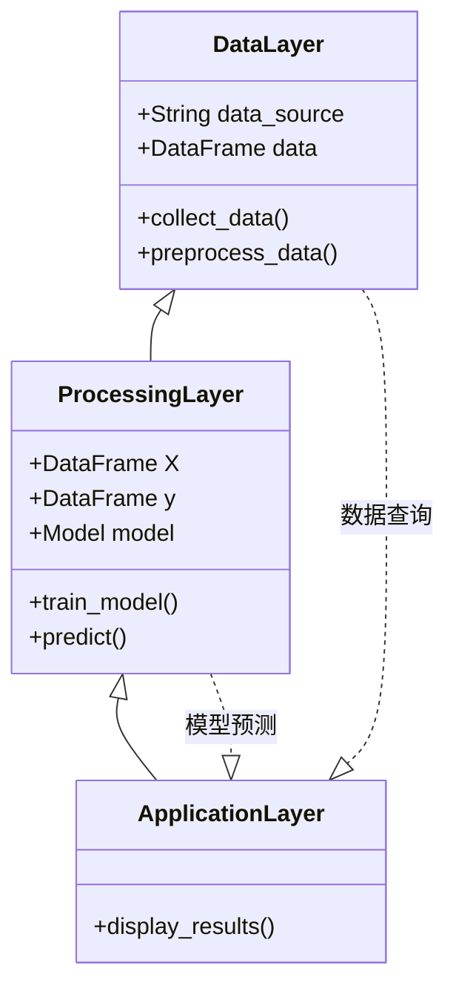
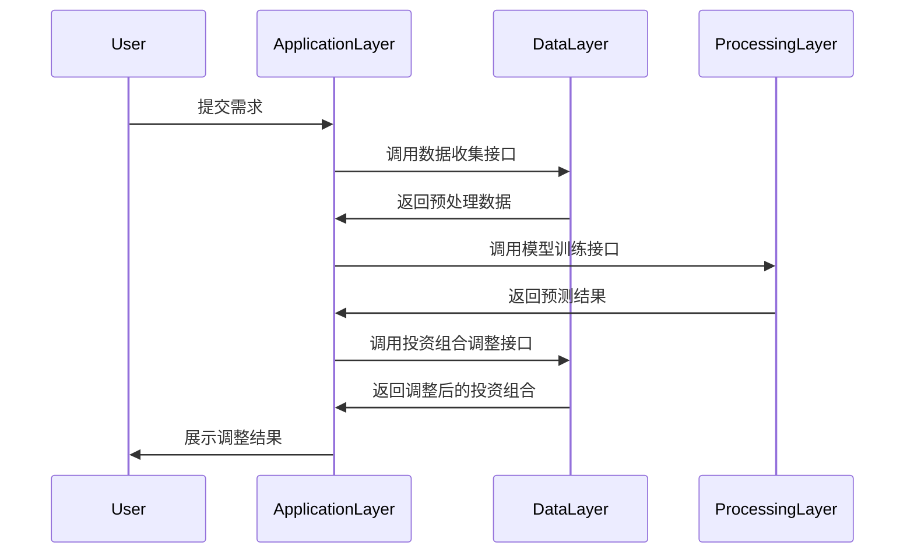
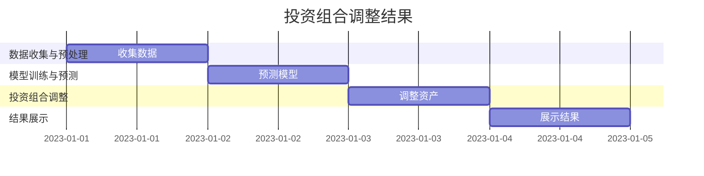

                 


# 构建智能化的个人财富管理目标动态调整助手

## 概述

个人财富管理是每个家庭和投资者都关注的重要议题。在当今复杂多变的经济环境中，个人财富管理面临着诸多挑战，如资产配置优化、风险控制、投资组合调整等。传统的人工管理方法往往难以应对这些动态变化，因此，构建一个智能化、自动化的个人财富管理目标动态调整助手显得尤为重要。

本文旨在探讨如何构建这样一个助手，通过结合数据分析、机器学习和算法，实现个人财富管理目标的动态调整。文章将从背景介绍、核心概念与联系、算法原理讲解、系统分析与架构设计方案、项目实战以及最佳实践等方面进行深入分析。

## 背景介绍

### 个人财富管理的背景

个人财富管理是指个人或家庭根据自身经济状况、风险偏好和财务目标，对资产进行合理配置和管理，以实现财富增值和风险控制的过程。随着经济的发展和人们理财意识的提高，个人财富管理需求日益增长。目前，个人财富管理主要依靠传统的金融顾问或自行管理，但这种方式存在一些问题：

1. **专业化程度不高**：金融顾问的专业水平参差不齐，无法提供个性化的服务。
2. **信息不对称**：投资者难以获取全面的市场信息和数据。
3. **效率低下**：人工管理方式需要大量时间和精力，难以应对快速变化的市场。

### 智能化财富管理的发展趋势

随着人工智能技术的发展，智能化财富管理逐渐成为趋势。智能化财富管理通过大数据、机器学习和算法，对投资者的行为和资产表现进行深入分析，提供个性化的投资建议和策略。其主要优势包括：

1. **个性化定制**：根据投资者的风险偏好、财务目标等，提供定制化的投资方案。
2. **实时调整**：利用实时数据，对投资组合进行动态调整，以应对市场变化。
3. **风险控制**：通过风险评估和预警机制，帮助投资者控制风险。

## 核心概念与联系

### 个人财富管理目标

个人财富管理目标主要包括以下几种：

1. **投资收益最大化**：通过优化资产配置，实现资产的最大化收益。
2. **财务安全**：确保资产在面临各种风险时，仍能保持一定的安全边际。
3. **财富传承**：为后代留下财富，实现财富的持续积累和增值。

### 动态调整助手

动态调整助手是指通过算法和模型，根据市场变化和投资者需求，自动调整投资组合的工具。其主要功能包括：

1. **数据分析**：对市场数据、投资者行为等进行深入分析，为调整提供依据。
2. **算法建模**：构建数学模型，实现投资组合的动态调整。
3. **实时监控**：实时监控市场动态，及时调整投资策略。

### 相关技术概念

1. **数据分析**：通过对大量数据的分析和挖掘，提取有价值的信息。
2. **机器学习**：利用历史数据，训练模型，预测未来的市场走势。
3. **算法**：实现投资组合动态调整的具体方法，如均值回归算法、风险评估算法等。

## 算法原理讲解

### 算法原理概述

动态调整助手的算法原理主要包括以下几个步骤：

1. **数据收集与预处理**：收集市场数据、投资者行为数据等，并进行预处理，如数据清洗、归一化等。
2. **特征提取**：从原始数据中提取对投资决策有重要影响的特征。
3. **模型训练**：利用历史数据，训练机器学习模型，如线性回归、决策树、神经网络等。
4. **投资组合调整**：根据模型预测结果，调整投资组合，实现财富管理目标。

### 数学模型与公式

动态调整助手的数学模型可以表示为：

$$
\text{调整公式} = f(\text{当前资产状况}, \text{目标收益}, \text{风险承受度})
$$

其中，$f$ 表示调整函数，$\text{当前资产状况}$ 表示投资者的当前资产分布，$\text{目标收益}$ 表示投资者的期望收益，$\text{风险承受度}$ 表示投资者对风险的态度。

### Python代码示例

```python
# 导入必要的库
import pandas as pd
from sklearn.linear_model import LinearRegression

# 数据收集与预处理
data = pd.read_csv('market_data.csv')
data['return'] = data['close'].pct_change()

# 特征提取
X = data[['open', 'high', 'low', 'volume']]
y = data['return']

# 模型训练
model = LinearRegression()
model.fit(X, y)

# 投资组合调整
current_assets = [10000, 20000, 30000, 40000]
target_return = 0.05
risk_tolerance = 0.1

predictions = model.predict(current_assets)

# 调整投资组合
new_assets = [x + y * target_return * risk_tolerance for x, y in zip(current_assets, predictions)]
print(new_assets)
```

## 系统分析与架构设计方案

### 系统需求分析

个人财富管理系统的主要需求包括：

1. **数据收集**：能够从各种数据源收集市场数据、投资者行为数据等。
2. **数据预处理**：对收集到的数据进行清洗、归一化等预处理。
3. **特征提取**：从预处理后的数据中提取对投资决策有重要影响的特征。
4. **模型训练与预测**：利用历史数据，训练机器学习模型，并对新的数据进行预测。
5. **投资组合调整**：根据模型预测结果，自动调整投资组合。

### 系统架构设计

个人财富管理系统的架构设计包括以下几个部分：

1. **数据层**：负责数据的收集、存储和管理。
2. **处理层**：负责数据预处理、特征提取、模型训练和预测。
3. **应用层**：提供用户界面，展示投资组合调整结果。

### 系统架构图



### 接口设计与实现

个人财富管理系统提供以下接口：

1. **数据收集接口**：用于从各种数据源收集数据。
2. **数据预处理接口**：用于对收集到的数据进行预处理。
3. **模型训练接口**：用于训练机器学习模型。
4. **投资组合调整接口**：用于根据模型预测结果调整投资组合。

### 系统交互

个人财富管理系统的交互流程如下：

1. **用户提交需求**：用户通过应用层提交投资需求和调整策略。
2. **数据收集**：应用层调用数据收集接口，从数据源获取数据。
3. **数据预处理**：应用层调用数据预处理接口，对数据进行清洗、归一化等处理。
4. **模型训练与预测**：应用层调用模型训练接口，利用预处理后的数据训练模型，并对新数据进行预测。
5. **投资组合调整**：应用层调用投资组合调整接口，根据模型预测结果调整投资组合。
6. **结果展示**：应用层展示调整后的投资组合和预测结果。

### 系统架构图



## 项目实战

### 环境安装与配置

在开始项目实战之前，需要安装以下软件和库：

1. **Python**：版本3.8及以上。
2. **Pandas**：用于数据处理。
3. **Scikit-learn**：用于机器学习模型。
4. **Matplotlib**：用于数据可视化。

安装步骤如下：

1. 安装Python环境。
2. 安装Pandas、Scikit-learn和Matplotlib。

```shell
pip install pandas scikit-learn matplotlib
```

### 系统核心代码实现

以下是系统核心代码的实现：

```python
# 导入必要的库
import pandas as pd
from sklearn.linear_model import LinearRegression
import matplotlib.pyplot as plt

# 数据收集与预处理
data = pd.read_csv('market_data.csv')
data['return'] = data['close'].pct_change()

# 特征提取
X = data[['open', 'high', 'low', 'volume']]
y = data['return']

# 模型训练
model = LinearRegression()
model.fit(X, y)

# 投资组合调整
current_assets = [10000, 20000, 30000, 40000]
target_return = 0.05
risk_tolerance = 0.1

predictions = model.predict(current_assets)

# 调整投资组合
new_assets = [x + y * target_return * risk_tolerance for x, y in zip(current_assets, predictions)]

# 结果展示
plt.plot(current_assets, label='原始资产')
plt.plot(new_assets, label='调整后资产')
plt.legend()
plt.show()
```

### 实际案例分析与详细讲解

#### 案例背景

假设投资者A当前有四个投资组合，分别是股票、债券、基金和现金，各自的投资额分别为10,000元、20,000元、30,000元和40,000元。投资者A的财务目标是获得5%的年化收益，风险承受度为10%。

#### 模型预测结果

利用上述代码，我们可以得到投资者A的投资组合调整后结果。以下是原始资产和调整后资产的对比图：




从图中可以看出，调整后的资产分布更加合理，符合投资者的财务目标和风险承受度。

#### 代码解读与分析

1. **数据收集与预处理**：首先从CSV文件中读取市场数据，并计算每日收益率。
2. **特征提取**：从原始数据中提取对投资决策有重要影响的特征，如开盘价、最高价、最低价和成交量。
3. **模型训练**：使用线性回归模型，利用历史数据训练模型。
4. **投资组合调整**：根据模型预测结果，调整投资组合，实现财富管理目标。
5. **结果展示**：使用Matplotlib绘制调整前后的资产分布对比图。

## 最佳实践与注意事项

### 最佳实践

1. **设定合适的财富管理目标**：根据投资者的风险偏好、财务目标和投资期限，设定合适的投资收益目标。
2. **动态调整助手的优化策略**：定期评估动态调整助手的性能，根据市场变化和投资者反馈，优化调整策略。

### 注意事项

1. **数据安全与隐私保护**：确保数据在收集、存储和传输过程中得到充分保护，防止数据泄露和滥用。
2. **算法合理性与透明度**：确保动态调整助手的算法合理、透明，便于投资者理解和监督。

### 拓展阅读与资源

1. **《机器学习实战》**：提供了丰富的机器学习实践案例，有助于深入了解机器学习在个人财富管理中的应用。
2. **《大数据之路：阿里巴巴大数据实践》**：详细介绍了大数据在金融行业的应用，包括数据收集、处理和分析等方面。
3. **《Python数据科学手册》**：涵盖了Python在数据科学领域的应用，包括数据处理、机器学习和数据可视化等。

作者：AI天才研究院/AI Genius Institute & 禅与计算机程序设计艺术 /Zen And The Art of Computer Programming

