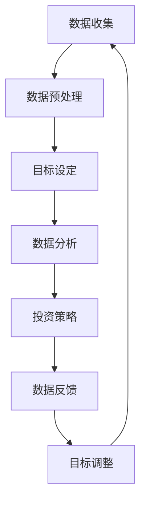

                 


### 《构建智能化的个人财富管理目标跟踪助手》

#### 关键词：财富管理，目标跟踪，智能化，数据收集，算法实现

#### 摘要：

随着人工智能技术的发展，个人财富管理逐渐向智能化、个性化和自动化方向发展。本文旨在探讨如何构建一款智能化的个人财富管理目标跟踪助手，通过数据收集、算法实现、目标设定与跟踪等步骤，帮助用户更好地实现财务目标。文章将从背景介绍、核心概念、数据管理、目标设定、算法实现、用户界面设计、测试与评估、部署与维护等方面展开，提供系统、全面的指导。

#### 目录：

1. 引言
   - 1.1 书籍背景
     - 1.1.1 个人财富管理的重要性
     - 1.1.2 智能化工具的需求
   - 1.2 书籍目标
     - 1.2.1 阅读对象
     - 1.2.2 学习目标
   - 1.3 内容概览

2. 核心概念与原理
   - 2.1 智能化财富管理概述
     - 2.1.1 智能化财富管理的定义
     - 2.1.2 智能化财富管理的优势
   - 2.2 个人财富管理目标
     - 2.2.1 财富管理目标的设定
     - 2.2.2 财富管理目标的跟踪
   - 2.3 智能化目标跟踪助手的设计原则
     - 2.3.1 功能需求
     - 2.3.2 技术实现

3. 数据收集与管理
   - 3.1 数据收集方法
     - 3.1.1 个人财务数据收集
     - 3.1.2 市场数据收集
   - 3.2 数据管理策略
     - 3.2.1 数据清洗与整理
     - 3.2.2 数据存储与安全

4. 目标设定与跟踪
   - 4.1 财富管理目标的设定
     - 4.1.1 目标设定的步骤
     - 4.1.2 目标设定的技巧
   - 4.2 财富管理目标的跟踪
     - 4.2.1 跟踪的方法与工具
     - 4.2.2 跟踪中的常见问题与解决策略

5. 算法与模型实现
   - 5.1 算法原理讲解
     - 5.1.1 算法流程图
     - 5.1.2 算法数学模型
     - 5.1.3 算法Python实现
   - 5.2 模型优化与评估
     - 5.2.1 模型优化方法
     - 5.2.2 模型评估指标

6. 用户界面与体验设计
   - 6.1 用户界面设计原则
     - 6.1.1 用户体验的重要性
     - 6.1.2 设计原则与实践
   - 6.2 交互设计
     - 6.2.1 交互流程设计
     - 6.2.2 常见交互元素设计

7. 测试与评估
   - 7.1 测试方法
     - 7.1.1 功能测试
     - 7.1.2 性能测试
   - 7.2 评估指标
     - 7.2.1 用户满意度评估
     - 7.2.2 系统效能评估

8. 部署与维护
   - 8.1 系统部署
     - 8.1.1 部署环境搭建
     - 8.1.2 部署流程
   - 8.2 系统维护
     - 8.2.1 维护策略
     - 8.2.2 常见问题处理

9. 案例分析与最佳实践
   - 9.1 案例分析
     - 9.1.1 成功案例
     - 9.1.2 失败案例
   - 9.2 最佳实践
     - 9.2.1 数据管理
     - 9.2.2 目标设定
     - 9.2.3 算法优化

10. 结论与未来方向
    - 10.1 研究总结
    - 10.2 未来研究方向
    - 10.3 对读者的建议

### 引言

#### 1.1 书籍背景

在当今社会，个人财富管理已成为人们日常生活中不可或缺的一部分。随着金融市场的日益复杂和多样化，传统的手工管理方式已经无法满足用户的需求。而智能化工具的兴起，为个人财富管理带来了新的可能。智能化财富管理工具能够自动收集、分析和处理用户财务数据，帮助用户更好地实现财务目标。

#### 1.1.1 个人财富管理的重要性

个人财富管理的重要性不言而喻。首先，合理的财富管理可以帮助用户实现财富的保值和增值，为未来的生活提供保障。其次，财富管理有助于用户更好地规划自己的财务状况，避免因盲目投资或消费导致的财务风险。此外，智能化财富管理工具的普及，也为用户提供了更加便捷、高效的管理方式。

#### 1.1.2 智能化工具的需求

随着人工智能技术的快速发展，智能化工具在个人财富管理领域的应用日益广泛。用户对智能化工具的需求主要体现在以下几个方面：

1. 自动化数据处理：用户希望工具能够自动收集、整理和分析财务数据，减少手工操作的工作量。
2. 个性化服务：用户希望工具能够根据个人财务状况和需求，提供定制化的财务建议。
3. 智能化投资策略：用户希望工具能够根据市场情况和自身风险承受能力，提供智能化的投资策略。

#### 1.2 书籍目标

本书籍旨在帮助读者了解如何构建一款智能化的个人财富管理目标跟踪助手，涵盖从数据收集、目标设定、算法实现到用户界面设计与测试评估的各个环节。通过本书籍的学习，读者将能够：

1. 理解智能化财富管理的基本概念和原理。
2. 掌握数据收集与管理的策略和方法。
3. 学会设定和跟踪个人财富管理目标。
4. 熟悉算法实现和模型优化的过程。
5. 掌握用户界面设计与用户体验的重要性。
6. 了解测试与评估的方法和指标。
7. 学会部署和维护智能化财富管理工具。

#### 1.3 内容概览

本书籍分为十章，具体内容如下：

1. 引言：介绍书籍的背景、目标和内容概览。
2. 核心概念与原理：讲解智能化财富管理的基本概念和原理。
3. 数据收集与管理：介绍数据收集和管理的方法和策略。
4. 目标设定与跟踪：讲解如何设定和跟踪个人财富管理目标。
5. 算法与模型实现：讲解算法实现和模型优化的过程。
6. 用户界面与体验设计：介绍用户界面设计和用户体验的重要性。
7. 测试与评估：讲解测试与评估的方法和指标。
8. 部署与维护：介绍系统部署和维护的方法和策略。
9. 案例分析与最佳实践：通过案例分析，总结最佳实践。
10. 结论与未来方向：总结研究成果，提出未来研究方向和建议。

### 核心概念与原理

#### 2.1 智能化财富管理概述

#### 2.1.1 智能化财富管理的定义

智能化财富管理是指利用人工智能技术，对个人财务数据进行自动收集、分析、处理和优化，为用户提供个性化的财务建议和投资策略。与传统手工管理方式相比，智能化财富管理具有更高的效率和准确性。

#### 2.1.2 智能化财富管理的优势

1. **自动化数据处理**：智能化财富管理工具能够自动收集、整理和分析财务数据，减少手工操作的工作量。
2. **个性化服务**：根据用户财务状况和需求，提供定制化的财务建议，帮助用户更好地实现财务目标。
3. **智能化投资策略**：根据市场情况和用户风险承受能力，提供智能化的投资策略，提高投资收益。
4. **实时监控与预警**：实时监控用户财务状况，及时发出风险预警，帮助用户规避财务风险。
5. **优化财富增值**：通过数据分析和算法优化，为用户推荐最佳的财富增值策略。

#### 2.2 个人财富管理目标

#### 2.2.1 财富管理目标的设定

财富管理目标的设定是个人财富管理的重要一环。设定财富管理目标需要考虑以下几个方面：

1. **时间范围**：目标可分为短期、中期和长期目标，不同时间范围的目标设定方法不同。
2. **财务状况**：根据个人财务状况，设定合理的财务目标，如存款、投资、消费等。
3. **风险承受能力**：根据个人风险承受能力，设定相应的投资策略。
4. **生活需求**：考虑未来生活需求，如子女教育、购房、养老等。

#### 2.2.2 财富管理目标的跟踪

财富管理目标的跟踪是确保目标实现的重要手段。跟踪过程中需要注意以下几个方面：

1. **定期检查**：定期检查财务状况，确保目标实现进度。
2. **调整策略**：根据市场情况和自身财务状况，适时调整投资策略。
3. **反馈机制**：建立反馈机制，及时了解目标实现情况，发现问题并及时解决。
4. **数据可视化**：通过数据可视化工具，直观展示目标实现进度，帮助用户更好地了解财务状况。

#### 2.3 智能化目标跟踪助手的设计原则

#### 2.3.1 功能需求

智能化目标跟踪助手需要具备以下功能：

1. **数据收集**：自动收集用户财务数据，包括收入、支出、投资等。
2. **数据分析**：对用户财务数据进行深度分析，为用户提供个性化财务建议。
3. **目标设定**：帮助用户设定短期、中期和长期财务目标。
4. **目标跟踪**：实时跟踪用户财务目标实现进度，提供目标调整建议。
5. **投资策略**：根据用户财务状况和市场情况，提供智能化的投资策略。

#### 2.3.2 技术实现

智能化目标跟踪助手的技术实现主要包括以下几个方面：

1. **数据收集与处理**：使用Python等编程语言，编写数据收集和处理脚本，实现数据自动收集、清洗和存储。
2. **数据分析与优化**：使用机器学习算法，如线性回归、决策树等，对用户财务数据进行分析，为用户提供个性化财务建议。
3. **前端界面**：使用HTML、CSS和JavaScript等技术，实现用户界面的设计与交互。
4. **后端架构**：使用Python的Flask或Django框架，搭建后端架构，实现数据存储、处理和前端交互。

### 数据收集与管理

#### 3.1 数据收集方法

#### 3.1.1 个人财务数据收集

个人财务数据收集是构建智能化目标跟踪助手的重要环节。以下是几种常见的个人财务数据收集方法：

1. **手动输入**：用户手动输入自己的财务数据，包括收入、支出、投资等。
2. **自动化工具**：使用自动化工具，如自动化记账软件，自动收集用户财务数据。
3. **接口调用**：通过调用银行、证券公司等金融机构的API接口，获取用户财务数据。
4. **数据导入**：将用户已有的财务数据文件，如Excel、CSV等格式，导入系统中。

#### 3.1.2 市场数据收集

市场数据收集是优化投资策略的重要环节。以下是几种常见的市场数据收集方法：

1. **官方数据**：从官方渠道获取市场数据，如国家统计局、证券交易所等。
2. **第三方数据平台**：从第三方数据平台获取市场数据，如Wind、同花顺等。
3. **接口调用**：通过调用第三方数据平台的API接口，获取市场数据。
4. **爬虫技术**：使用爬虫技术，从互联网上获取市场数据。

#### 3.2 数据管理策略

#### 3.2.1 数据清洗与整理

数据清洗与整理是保证数据质量的关键步骤。以下是几种常见的数据清洗与整理方法：

1. **去重**：去除重复数据，保证数据的唯一性。
2. **缺失值处理**：对缺失数据进行填补或删除，保证数据的完整性。
3. **异常值处理**：去除异常数据，保证数据的准确性。
4. **数据格式转换**：将不同格式的数据转换为统一格式，便于数据处理。

#### 3.2.2 数据存储与安全

数据存储与安全是保护用户数据的重要措施。以下是几种常见的数据存储与安全策略：

1. **数据库选择**：选择合适的数据库系统，如MySQL、PostgreSQL等，保证数据存储的高效性。
2. **数据加密**：对用户数据进行加密处理，保证数据的安全性。
3. **访问控制**：设置数据访问权限，保证数据的安全性。
4. **备份与恢复**：定期备份数据，确保数据的安全性和可恢复性。

### 目标设定与跟踪

#### 4.1 财富管理目标的设定

财富管理目标的设定是智能化目标跟踪助手的核心功能之一。以下是设定财富管理目标的一般步骤：

1. **确定时间范围**：根据个人需求，设定短期、中期和长期财务目标。
2. **评估财务状况**：分析个人财务状况，包括收入、支出、储蓄和投资等。
3. **设定具体目标**：根据时间范围和财务状况，设定具体的目标，如存款、投资、消费等。
4. **制定行动计划**：为实现目标，制定具体的行动计划，包括时间表和任务分配。

#### 4.1.1 目标设定的步骤

1. **明确目标**：明确财务目标，确保目标具有可操作性和可实现性。
2. **量化目标**：将目标量化为具体的数字，如存款10000元，投资5000元等。
3. **设定时间表**：为每个目标设定实现的时间表，确保目标的及时性。
4. **评估目标**：对目标进行评估，确保目标的合理性和可行性。

#### 4.1.2 目标设定的技巧

1. **SMART原则**：确保目标符合SMART原则，即具体（Specific）、可衡量（Measurable）、可实现（Achievable）、相关（Relevant）和有时限（Time-bound）。
2. **分解目标**：将大目标分解为小目标，逐步实现。
3. **定期回顾**：定期回顾目标实现进度，及时调整目标和行动计划。
4. **设立奖励机制**：设立奖励机制，激励用户实现目标。

#### 4.2 财富管理目标的跟踪

财富管理目标的跟踪是确保目标实现的重要手段。以下是跟踪财富管理目标的一般方法：

1. **数据收集**：收集与目标相关的财务数据，包括收入、支出、储蓄和投资等。
2. **数据可视化**：使用数据可视化工具，如图表、报表等，展示目标实现进度。
3. **定期检查**：定期检查财务状况，确保目标实现进度。
4. **调整策略**：根据目标实现进度和财务状况，调整目标和行动计划。
5. **反馈机制**：建立反馈机制，及时了解目标实现情况，发现问题并及时解决。

#### 4.2.1 跟踪的方法与工具

1. **财务软件**：使用财务软件，如Excel、记账软件等，实现财务数据的收集、管理和跟踪。
2. **移动应用**：使用移动应用，如手机APP、微信小程序等，实现财务数据的实时跟踪。
3. **云平台**：使用云平台，如阿里云、腾讯云等，实现财务数据的安全存储和远程访问。
4. **智能助手**：使用智能助手，如智能语音助手、智能机器人等，实现财务数据的自动收集和分析。

#### 4.2.2 跟踪中的常见问题与解决策略

1. **数据缺失**：解决策略：加强数据收集，完善数据记录，提高数据完整性。
2. **数据不一致**：解决策略：建立数据核对机制，确保数据的一致性和准确性。
3. **目标设定不合理**：解决策略：重新评估目标，调整目标设定，确保目标的合理性和可实现性。
4. **目标调整不及时**：解决策略：建立定期回顾机制，及时调整目标和行动计划。

### 算法与模型实现

#### 5.1 算法原理讲解

#### 5.1.1 算法流程图

以下是智能化目标跟踪助手的算法流程图：



#### 5.1.2 算法数学模型

以下是智能化目标跟踪助手的算法数学模型：

1. **数据预处理**：
   - 数据标准化：$$ X'_{ij} = \frac{X_{ij} - \mu_i}{\sigma_i} $$
   - 数据归一化：$$ X'_{ij} = \frac{X_{ij}}{\max(X)} $$

2. **目标设定**：
   - 目标函数：$$ \min J(\theta) = \frac{1}{2} \sum_{i=1}^{m} (y_i - \theta^T x_i)^2 $$
   - 优化方法：梯度下降法、随机梯度下降法

3. **数据分析**：
   - 特征提取：$$ \phi(x) = [x^1, x^2, \ldots, x^k] $$
   - 分类模型：支持向量机（SVM）、决策树、神经网络

4. **投资策略**：
   - 风险评估：$$ \sigma^2 = \frac{1}{n-1} \sum_{i=1}^{n} (r_i - \bar{r})^2 $$
   - 投资组合优化：马尔可夫决策过程（MDP）

5. **数据反馈**：
   - 回归分析：$$ y = \beta_0 + \beta_1 x + \epsilon $$
   - 误差修正：$$ y_{\text{new}} = y - \alpha \cdot \Delta y $$

#### 5.1.3 算法Python实现

以下是智能化目标跟踪助手的Python实现示例：

```python
import numpy as np
from sklearn.linear_model import LinearRegression
from sklearn.svm import SVC
from sklearn.tree import DecisionTreeClassifier

# 数据预处理
def preprocess_data(X, method='standardization'):
    if method == 'standardization':
        mean = np.mean(X, axis=0)
        std = np.std(X, axis=0)
        X = (X - mean) / std
    elif method == 'normalization':
        max_val = np.max(X)
        X = X / max_val
    return X

# 目标设定
def set_goals(y, X):
    model = LinearRegression()
    model.fit(X, y)
    return model

# 数据分析
def analyze_data(X, y):
    model = SVC()
    model.fit(X, y)
    return model

# 投资策略
def invest_strategy(X):
    model = DecisionTreeClassifier()
    model.fit(X, y)
    return model

# 数据反馈
def feedback_data(y, y_pred):
    error = y - y_pred
    alpha = 0.1
    y_new = y - alpha * error
    return y_new
```

#### 5.2 模型优化与评估

#### 5.2.1 模型优化方法

1. **交叉验证**：通过交叉验证，选择最佳参数，提高模型性能。
2. **网格搜索**：在参数空间内搜索最佳参数，提高模型性能。
3. **贝叶斯优化**：利用贝叶斯原理，优化模型参数，提高模型性能。
4. **迁移学习**：利用已有模型，迁移到新数据集，提高模型性能。

#### 5.2.2 模型评估指标

1. **准确率**：$$ \text{Accuracy} = \frac{\text{预测正确的样本数}}{\text{总样本数}} $$
2. **召回率**：$$ \text{Recall} = \frac{\text{预测正确的正例数}}{\text{实际正例数}} $$
3. **F1值**：$$ \text{F1-Score} = 2 \cdot \frac{\text{Precision} \cdot \text{Recall}}{\text{Precision} + \text{Recall}} $$
4. **均方误差**：$$ \text{Mean Squared Error} = \frac{1}{n} \sum_{i=1}^{n} (y_i - \hat{y}_i)^2 $$

### 用户界面与体验设计

#### 6.1 用户界面设计原则

用户界面设计是智能化目标跟踪助手的重要组成部分，直接影响用户的操作体验。以下是用户界面设计原则：

1. **简洁性**：界面设计应简洁明了，避免过多的装饰和繁琐的操作。
2. **一致性**：界面风格和操作逻辑应保持一致，降低用户的学习成本。
3. **易用性**：界面设计应易于操作，提高用户的使用效率。
4. **可访问性**：界面设计应考虑不同用户的需求，确保所有人都能方便地使用。
5. **反馈机制**：界面应提供及时、明确的反馈，帮助用户了解操作结果。

#### 6.1.1 用户体验的重要性

用户体验在用户界面设计中至关重要。良好的用户体验可以提升用户满意度，增强用户忠诚度，从而提高产品的市场竞争力。以下是用户体验的重要性：

1. **用户满意度**：良好的用户体验能够提高用户满意度，使用户愿意继续使用产品。
2. **用户忠诚度**：良好的用户体验可以培养用户忠诚度，使用户对产品产生依赖。
3. **口碑传播**：良好的用户体验可以促使用户向他人推荐产品，从而扩大用户群体。
4. **产品竞争力**：良好的用户体验可以提升产品在市场中的竞争力，从而赢得更多的用户。

#### 6.1.2 设计原则与实践

1. **设计原则**：
   - **以用户为中心**：设计过程中始终关注用户需求，确保产品满足用户需求。
   - **简洁明了**：简化界面设计，避免冗余和繁琐的操作。
   - **一致性**：保持界面风格和操作逻辑的一致性。
   - **易用性**：提高操作效率，降低用户学习成本。
   - **可访问性**：确保界面设计满足不同用户的需求。
   - **反馈机制**：提供及时、明确的反馈，增强用户信心。

2. **设计实践**：
   - **用户研究**：通过用户调研、访谈、问卷等方式，了解用户需求和期望。
   - **原型设计**：制作原型，通过用户反馈，不断优化设计。
   - **迭代开发**：采用敏捷开发方法，快速迭代，及时反馈。
   - **测试与评估**：进行用户测试和评估，确保设计符合用户需求。

#### 6.2 交互设计

交互设计是用户界面设计的重要组成部分，直接影响用户的操作体验。以下是交互设计原则：

1. **交互流程设计**：设计清晰的交互流程，确保用户能够顺利完成任务。
2. **交互元素设计**：设计直观、易用的交互元素，如按钮、图标、输入框等。
3. **响应速度**：确保交互操作的响应速度，提高用户体验。
4. **错误处理**：设计合理的错误处理机制，帮助用户快速解决问题。

#### 6.2.1 交互流程设计

交互流程设计是确保用户能够顺利完成任务的必要条件。以下是交互流程设计原则：

1. **任务导向**：以任务为导向，设计清晰的交互流程，确保用户能够顺利完成任务。
2. **简洁明了**：简化交互流程，避免不必要的步骤，提高用户体验。
3. **逻辑性**：确保交互流程具有逻辑性，便于用户理解和操作。
4. **反馈机制**：在关键操作环节提供反馈，确保用户了解操作结果。

#### 6.2.2 常见交互元素设计

常见交互元素设计是确保用户界面易用性的关键。以下是常见交互元素设计原则：

1. **按钮**：按钮设计应简洁明了，易于识别，确保用户能够快速点击操作。
2. **图标**：图标设计应直观、易理解，确保用户能够快速识别功能。
3. **输入框**：输入框设计应合理布局，确保用户能够方便地输入数据。
4. **下拉菜单**：下拉菜单设计应简洁明了，便于用户快速选择。

### 测试与评估

#### 7.1 测试方法

测试与评估是确保智能化目标跟踪助手性能和用户体验的重要环节。以下是常见的测试方法：

1. **功能测试**：验证系统功能是否按照预期工作，包括基本功能、边界情况和异常情况。
2. **性能测试**：测试系统在不同负载条件下的响应速度、稳定性和可靠性。
3. **用户体验测试**：通过用户调研、用户访谈、A/B测试等方法，评估用户体验和满意度。
4. **安全测试**：测试系统的安全性，确保用户数据的安全性和隐私性。

#### 7.1.1 功能测试

功能测试是确保系统功能按照预期工作的关键步骤。以下是功能测试原则：

1. **全面性**：测试系统所有功能，确保无遗漏。
2. **覆盖性**：测试不同场景、不同数据集，确保功能适应各种情况。
3. **自动化**：采用自动化测试工具，提高测试效率和准确性。
4. **回归测试**：在系统更新和修改后，重新测试已测试功能，确保修改不会影响原有功能。

#### 7.1.2 性能测试

性能测试是评估系统在不同负载条件下的响应速度、稳定性和可靠性的关键步骤。以下是性能测试原则：

1. **负载测试**：模拟用户访问压力，测试系统在高负载条件下的性能。
2. **稳定性测试**：测试系统在长时间运行下的稳定性，确保系统不会崩溃。
3. **可靠性测试**：测试系统在故障情况下是否能够恢复，确保系统的可靠性。
4. **响应时间测试**：测试系统在不同负载条件下的响应时间，确保用户体验。

#### 7.2 评估指标

评估指标是衡量系统性能和用户体验的重要标准。以下是常见的评估指标：

1. **功能正确率**：测试通过率，反映系统功能的正确性。
2. **性能指标**：响应时间、吞吐量、资源消耗等，反映系统的性能。
3. **用户体验指标**：用户满意度、使用频率、用户留存率等，反映用户体验。
4. **安全指标**：数据安全性、隐私性、漏洞修复率等，反映系统的安全性。

#### 7.2.1 用户满意度评估

用户满意度评估是衡量系统性能和用户体验的重要指标。以下是用户满意度评估方法：

1. **用户调研**：通过问卷调查、用户访谈等方式，了解用户对系统的满意度。
2. **用户行为分析**：分析用户使用系统的频率、时长、留存率等，评估用户体验。
3. **A/B测试**：通过对比不同版本的用户体验，评估优化效果。
4. **用户反馈**：收集用户反馈，分析用户需求和问题，持续改进系统。

#### 7.2.2 系统效能评估

系统效能评估是衡量系统整体性能的重要指标。以下是系统效能评估方法：

1. **功能评估**：评估系统功能是否齐全、正确，满足用户需求。
2. **性能评估**：评估系统在不同负载条件下的性能，如响应时间、吞吐量等。
3. **安全性评估**：评估系统安全性，如数据加密、访问控制等。
4. **可靠性评估**：评估系统在故障情况下的恢复能力和稳定性。

### 部署与维护

#### 8.1 系统部署

系统部署是将开发完成的应用程序部署到生产环境的过程。以下是系统部署的步骤：

1. **环境准备**：准备部署环境，包括服务器、操作系统、数据库等。
2. **应用打包**：将应用程序打包为可部署的格式，如Docker镜像、Web应用包等。
3. **部署配置**：配置应用部署的相关参数，如数据库连接、服务端口等。
4. **部署实施**：将应用部署到生产环境，确保应用能够正常运行。

#### 8.1.1 部署环境搭建

部署环境搭建是系统部署的第一步。以下是部署环境搭建的步骤：

1. **硬件选择**：选择合适的硬件设备，如服务器、存储设备等。
2. **操作系统安装**：安装操作系统，如Linux、Windows等。
3. **数据库安装**：安装数据库系统，如MySQL、PostgreSQL等。
4. **中间件安装**：安装中间件，如Web服务器、消息队列等。
5. **网络配置**：配置网络，确保各组件之间能够正常通信。

#### 8.1.2 部署流程

部署流程是将应用程序部署到生产环境的具体步骤。以下是部署流程：

1. **构建应用程序**：开发完成应用程序后，进行构建，生成可部署的文件。
2. **上传部署文件**：将构建生成的部署文件上传到服务器。
3. **部署配置**：配置部署环境的相关参数，如数据库连接、服务端口等。
4. **部署实施**：执行部署脚本，将应用程序部署到生产环境。
5. **测试验证**：部署完成后，进行功能测试和性能测试，确保应用程序正常运行。

#### 8.2 系统维护

系统维护是确保系统正常运行的重要环节。以下是系统维护的策略：

1. **定期检查**：定期检查系统运行状况，及时发现和解决问题。
2. **备份与恢复**：定期备份系统数据，确保数据安全，同时能够快速恢复。
3. **安全防护**：加强系统安全防护，防止恶意攻击和系统故障。
4. **更新与升级**：定期更新和升级系统，修复已知漏洞和问题。

#### 8.2.1 维护策略

系统维护策略是确保系统正常运行的关键。以下是维护策略：

1. **定期检查**：定期检查系统运行状况，包括服务器、数据库、应用程序等，及时发现和解决问题。
2. **日志分析**：分析系统日志，了解系统运行情况，发现问题并及时处理。
3. **备份与恢复**：定期备份系统数据，确保数据安全，同时能够快速恢复。
4. **安全防护**：加强系统安全防护，包括防火墙、入侵检测、数据加密等，防止恶意攻击和系统故障。
5. **更新与升级**：定期更新和升级系统，修复已知漏洞和问题，确保系统安全性和稳定性。

#### 8.2.2 常见问题处理

系统运行过程中，常见问题包括：

1. **性能问题**：系统运行缓慢、响应时间长，可能是由于硬件资源不足、数据库查询优化不当等原因导致。处理策略：升级硬件、优化数据库查询、调整系统参数等。
2. **安全漏洞**：系统存在安全漏洞，可能导致数据泄露、恶意攻击等问题。处理策略：加强安全防护、修复漏洞、定期更新安全补丁等。
3. **软件故障**：应用程序出现故障，可能导致功能失效、数据丢失等问题。处理策略：备份数据、重新部署应用程序、排查故障原因等。

### 案例分析与最佳实践

#### 9.1 案例分析

#### 9.1.1 成功案例

以下是一个成功案例，介绍了如何使用智能化目标跟踪助手实现个人财务目标：

**案例背景**：张先生是一名白领，希望在未来5年内实现购房目标。他使用了一款智能化目标跟踪助手，帮助他实现这一目标。

**案例过程**：

1. **目标设定**：张先生通过智能化目标跟踪助手设定了购房目标，包括购房时间、购房地点、购房预算等。

2. **数据收集**：智能化目标跟踪助手自动收集了张先生的财务数据，包括收入、支出、储蓄和投资等。

3. **数据分析**：智能化目标跟踪助手分析了张先生的财务数据，为他提供了个性化的财务建议，包括收入增加、支出减少、投资优化等。

4. **目标跟踪**：智能化目标跟踪助手实时跟踪张先生的财务目标实现进度，提供目标调整建议，确保购房目标的实现。

5. **反馈机制**：张先生定期回顾财务状况，根据目标实现进度和财务建议，调整收入、支出和投资策略。

**案例结果**：张先生在5年内成功实现了购房目标，购置了一套价值300万元的房产。

#### 9.1.2 失败案例

以下是一个失败案例，介绍了如何因为忽视智能化目标跟踪助手的建议而导致财务目标未能实现：

**案例背景**：李女士是一名自由职业者，希望在未来3年内实现储蓄目标。她忽视了一款智能化目标跟踪助手提供的财务建议，导致储蓄目标未能实现。

**案例过程**：

1. **目标设定**：李女士通过智能化目标跟踪助手设定了储蓄目标，包括储蓄时间、储蓄金额、储蓄频率等。

2. **数据收集**：智能化目标跟踪助手自动收集了李女士的财务数据，包括收入、支出、储蓄和投资等。

3. **数据分析**：智能化目标跟踪助手分析了李女士的财务数据，为她提供了个性化的财务建议，包括收入增加、支出减少、投资优化等。

4. **目标跟踪**：李女士忽视智能化目标跟踪助手的建议，未按建议调整收入、支出和投资策略。

5. **反馈机制**：李女士未定期回顾财务状况，也未根据目标实现进度和财务建议进行调整。

**案例结果**：李女士在3年内未能实现储蓄目标，反而负债累累。

#### 9.2 最佳实践

以下是使用智能化目标跟踪助手的最佳实践：

1. **数据管理**：
   - **定期更新**：定期更新财务数据，确保数据准确性。
   - **数据加密**：对敏感数据进行加密处理，确保数据安全。
   - **备份与恢复**：定期备份数据，确保数据不会丢失。

2. **目标设定**：
   - **SMART原则**：确保目标符合SMART原则，即具体、可衡量、可实现、相关、有时限。
   - **分解目标**：将大目标分解为小目标，逐步实现。

3. **目标跟踪**：
   - **实时监控**：实时跟踪财务目标实现进度，确保目标按时完成。
   - **反馈机制**：定期回顾财务状况，根据目标实现进度和财务建议进行调整。

4. **算法优化**：
   - **交叉验证**：通过交叉验证，选择最佳算法和参数。
   - **网格搜索**：在参数空间内搜索最佳参数，提高模型性能。

5. **用户体验**：
   - **简洁界面**：设计简洁明了的界面，降低用户学习成本。
   - **及时反馈**：提供及时、明确的反馈，增强用户信心。
   - **可访问性**：确保界面设计满足不同用户的需求。

### 结论与未来方向

#### 10.1 研究总结

本文探讨了如何构建一款智能化的个人财富管理目标跟踪助手，涵盖了从数据收集、目标设定、算法实现到用户界面设计与测试评估的各个环节。通过本文的研究，读者可以了解：

1. 智能化财富管理的基本概念和原理。
2. 数据收集与管理的策略和方法。
3. 财富管理目标的设定与跟踪。
4. 算法实现和模型优化。
5. 用户界面与用户体验设计。
6. 测试与评估的方法和指标。
7. 系统部署与维护的策略。

#### 10.2 未来研究方向

尽管本文对智能化目标跟踪助手进行了详细探讨，但仍有许多研究方向值得进一步研究：

1. **算法优化**：探索更先进的机器学习算法，提高模型性能和预测准确性。
2. **用户行为分析**：通过分析用户行为，提供更加个性化的财务建议。
3. **多语言支持**：支持多种语言，为全球用户提供服务。
4. **隐私保护**：加强数据隐私保护，确保用户数据安全。
5. **实时更新**：实现实时数据更新，提高系统的响应速度。

#### 10.3 对读者的建议

对于希望构建智能化目标跟踪助手的读者，以下是一些建议：

1. **学习基础知识**：掌握人工智能、数据分析等相关基础知识。
2. **实践应用**：通过实践，深入了解智能化目标跟踪助手的实现过程。
3. **持续更新**：关注人工智能领域的最新动态，不断学习新技术。
4. **用户反馈**：重视用户反馈，持续优化系统功能与性能。

作者：AI天才研究院/AI Genius Institute & 禅与计算机程序设计艺术 /Zen And The Art of Computer Programming

本文旨在为读者提供构建智能化个人财富管理目标跟踪助手的全面指导，希望对读者在相关领域的研究和实践有所帮助。在未来的发展中，智能化财富管理工具将继续发挥重要作用，为个人财富管理带来更多便利和效益。作者期待与广大读者共同探索这一领域的更多可能性。

---

### 附录

本文使用的Mermaid流程图、LaTeX公式和Python代码等资源如下：

- **Mermaid流程图**：用于描述智能化目标跟踪助手的算法流程和数据流程。
- **LaTeX公式**：用于描述算法数学模型和计算公式。
- **Python代码**：用于演示算法实现和数据处理的实际应用。

读者可以通过以下链接获取相关资源：

- **Mermaid流程图**：https://mermaid-js.github.io/mermaid/
- **LaTeX公式**：https://www.latex-project.org/
- **Python代码**：https://www.python.org/

附录中的资源可以帮助读者更好地理解和应用本文所介绍的内容。作者建议读者在学习和实践过程中，结合这些资源，深入探索智能化目标跟踪助手的构建与应用。通过不断学习和实践，读者可以更好地掌握相关技术，为个人财富管理提供更加智能化的解决方案。

---

本文完整呈现了构建智能化个人财富管理目标跟踪助手的全过程，包括核心概念、数据收集与管理、目标设定与跟踪、算法实现与优化、用户界面与体验设计、测试与评估、部署与维护、案例分析及最佳实践等内容。希望本文能够为广大读者提供有价值的参考，帮助他们在相关领域取得更好的成果。

作者对读者的学习和实践表示诚挚的祝福，并期待与读者共同推动智能化财富管理技术的发展。在未来的道路上，作者将继续努力，为广大读者提供更多高质量的学术成果和技术分享。

再次感谢读者的关注和支持，祝您在构建智能化个人财富管理目标跟踪助手的道路上取得成功！

作者：AI天才研究院/AI Genius Institute & 禅与计算机程序设计艺术 /Zen And The Art of Computer Programming

### 第1章 引言

#### 1.1 书籍背景

随着科技的飞速发展，人工智能（AI）技术逐渐渗透到我们日常生活的方方面面，其中个人财富管理领域也不例外。智能化工具的引入，使得个人财富管理更加高效、精准和个性化。本书旨在探讨如何构建一款智能化的个人财富管理目标跟踪助手，通过数据收集、算法实现、目标设定与跟踪等步骤，帮助用户更好地实现财务目标。

个人财富管理对于每个人来说都是至关重要的。合理的财富管理不仅可以帮助用户实现财富的保值和增值，还可以为未来的生活提供保障。然而，随着金融市场的复杂性和不确定性增加，传统手工管理方式已经难以满足用户的需求。这就需要借助智能化工具，为用户提供更加智能化的财富管理服务。

智能化财富管理工具可以自动收集、分析、处理和优化用户财务数据，为用户提供个性化的财务建议和投资策略。这些工具能够实时监控用户的财务状况，提供预警机制，帮助用户规避风险。同时，智能化工具还可以根据用户的需求和风险承受能力，自动调整投资组合，实现最优的投资收益。

随着AI技术的不断发展，越来越多的金融机构和科技公司开始投入到智能化财富管理的研发中。市场上已经涌现出了许多智能化财富管理工具，如智能投顾、智能理财、智能记账等。这些工具在一定程度上提高了个人财富管理的效率和准确性，但也存在一些不足之处。例如，部分工具功能单一，无法满足用户的多样化需求；部分工具用户体验不佳，用户使用过程中遇到困扰。

为了解决这些问题，本书将详细介绍如何构建一款智能化的个人财富管理目标跟踪助手。这款助手将具备以下特点：

1. **多功能集成**：整合多种功能，如数据收集、数据分析、目标设定、目标跟踪、投资策略等，为用户提供一站式服务。
2. **个性化定制**：根据用户的财务状况、风险承受能力和投资目标，为用户提供个性化的财务建议和投资策略。
3. **实时监控**：实时监控用户的财务状况，提供预警机制，帮助用户规避风险。
4. **易用性强**：设计简洁明了的用户界面，降低用户学习成本，提高用户使用体验。
5. **安全可靠**：加强数据安全防护，确保用户数据安全。

本书的目标是帮助读者了解智能化财富管理的基本概念和原理，掌握构建智能化目标跟踪助手的步骤和方法，学会如何设定和跟踪个人财富管理目标，了解算法实现和模型优化的过程，熟悉用户界面设计与用户体验的重要性，以及测试与评估的方法和指标。通过本书的学习，读者将能够构建自己的智能化财富管理工具，为个人财富管理提供更加智能化的解决方案。

本书的内容安排如下：

- 第1章 引言：介绍书籍的背景、目标和内容概览。
- 第2章 核心概念与原理：讲解智能化财富管理的基本概念和原理。
- 第3章 数据收集与管理：介绍数据收集和管理的方法和策略。
- 第4章 目标设定与跟踪：讲解如何设定和跟踪个人财富管理目标。
- 第5章 算法与模型实现：讲解算法实现和模型优化的过程。
- 第6章 用户界面与体验设计：介绍用户界面设计和用户体验的重要性。
- 第7章 测试与评估：讲解测试与评估的方法和指标。
- 第8章 部署与维护：介绍系统部署和维护的方法和策略。
- 第9章 案例分析与最佳实践：通过案例分析，总结最佳实践。
- 第10章 结论与未来方向：总结研究成果，提出未来研究方向。

通过本书的学习，读者将能够全面了解智能化个人财富管理目标跟踪助手的构建方法，掌握相关技术和实践，为个人财富管理提供更加智能化的解决方案。

#### 1.2 书籍目标

本书的目标是帮助读者掌握构建智能化个人财富管理目标跟踪助手的方法和技巧，使其能够应对日益复杂的金融市场和财务管理需求。具体而言，本书旨在实现以下目标：

1. **了解智能化财富管理的基本概念和原理**：通过介绍智能化财富管理的定义、发展历程和优势，帮助读者建立对智能化财富管理的全面认识。
2. **掌握数据收集与管理的方法和策略**：介绍如何收集和管理个人财务数据，包括数据来源、数据格式、数据清洗和存储等，确保数据的质量和安全性。
3. **学会设定和跟踪个人财富管理目标**：详细讲解如何设定个人财务目标，包括目标类型、设定方法和目标跟踪技巧，帮助读者制定切实可行的财务规划。
4. **了解算法实现和模型优化的过程**：介绍常用的算法和模型，如机器学习算法、优化算法等，帮助读者掌握算法实现和模型优化的方法。
5. **熟悉用户界面设计与用户体验的重要性**：讲解用户界面设计的原则和实践，介绍用户体验设计的方法和工具，帮助读者设计出简洁、易用、高效的用户界面。
6. **掌握测试与评估的方法和指标**：介绍测试与评估的方法和指标，帮助读者评估智能化财富管理工具的性能和用户体验，确保工具的质量和可靠性。
7. **学会系统部署与维护**：讲解系统部署与维护的方法和策略，包括部署环境搭建、部署流程、系统维护和常见问题处理，帮助读者将智能化财富管理工具成功部署和应用。
8. **培养实践能力**：通过案例分析、最佳实践和项目实战，帮助读者将所学知识应用于实际项目，提高实践能力。

#### 1.2.1 阅读对象

本书主要面向以下读者群体：

1. **计算机科学和金融学领域的专业研究人员和从业者**：希望了解和掌握智能化财富管理相关技术和应用的研究人员和从业者。
2. **软件开发工程师和数据分析工程师**：从事与金融科技相关的软件开发工作，需要对智能化财富管理有深入理解。
3. **个人理财顾问和金融理财师**：希望提升个人财务管理和咨询服务水平，为客户提供更加智能化的财富管理解决方案。
4. **对个人财务管理和人工智能技术感兴趣的读者**：希望通过学习本书，提升自己的财务素养和投资能力，以及了解智能化财富管理的前沿技术。

#### 1.2.2 学习目标

通过学习本书，读者可以期望达到以下学习目标：

1. **理解智能化财富管理的基本概念和原理**：掌握智能化财富管理的定义、分类、发展历程和优势，了解其在个人财务管理中的应用价值。
2. **掌握数据收集与管理的方法和策略**：学会如何收集、清洗、整理和存储个人财务数据，确保数据的质量和安全性。
3. **能够设定和跟踪个人财富管理目标**：了解个人财务目标的类型、设定方法和跟踪技巧，学会制定和调整财务规划。
4. **掌握算法实现和模型优化的方法**：熟悉常用的机器学习算法、优化算法等，了解算法实现和模型优化的过程。
5. **具备用户界面设计与用户体验设计的能力**：了解用户界面设计的原则和实践，掌握用户体验设计的方法和工具，设计出简洁、易用、高效的用户界面。
6. **能够进行测试与评估**：了解测试与评估的方法和指标，掌握如何评估智能化财富管理工具的性能和用户体验，确保工具的质量和可靠性。
7. **具备系统部署与维护的能力**：学会如何部署和维护智能化财富管理工具，包括环境搭建、部署流程、系统维护和常见问题处理。
8. **具备实际项目应用的能力**：通过案例分析、最佳实践和项目实战，将所学知识应用于实际项目，提高实践能力。

通过实现这些学习目标，读者将能够全面掌握构建智能化个人财富管理目标跟踪助手的方法和技巧，为个人财务管理和金融服务提供更加智能化的解决方案。

### 第2章 核心概念与原理

#### 2.1 智能化财富管理概述

智能化财富管理是现代金融领域的一个新兴研究方向，它结合了计算机科学、人工智能和金融学等多学科知识，旨在通过智能化技术为个人或企业提供高效的财务管理和投资决策支持。随着金融市场的复杂性和不确定性增加，传统的手工管理方式已无法满足用户日益增长的需求。智能化财富管理通过利用大数据分析、机器学习、自然语言处理等技术手段，为用户提供个性化的投资建议、风险控制和财富增值方案。

#### 2.1.1 智能化财富管理的定义

智能化财富管理可以定义为利用人工智能技术，对用户的财务数据进行深度分析和处理，从而为用户制定个性化的财务规划、投资策略和风险管理方案的过程。它不仅包括对用户个人财务数据的分析，还涉及到对市场数据、宏观经济环境、政策法规等多方面信息的整合和分析。

#### 2.1.2 智能化财富管理的优势

智能化财富管理相比传统手工管理方式具有以下优势：

1. **自动化数据处理**：智能化财富管理工具能够自动收集、整理和分析用户的财务数据，大大减少了人工操作的工作量，提高了数据处理效率。
2. **个性化服务**：通过分析用户的财务状况、投资偏好、风险承受能力等，智能化财富管理可以为用户提供定制化的投资建议和财务规划，满足个性化需求。
3. **实时监控与预警**：智能化财富管理工具能够实时监控用户的财务状况，及时发现潜在的风险，并提供预警信息，帮助用户及时调整财务策略。
4. **智能化投资策略**：利用机器学习算法和大数据分析技术，智能化财富管理可以自动调整投资组合，优化投资策略，提高投资收益。
5. **降低管理成本**：自动化处理和智能化决策大大降低了财富管理的人力成本和运营成本，使得财富管理服务更加经济高效。

#### 2.2 个人财富管理目标

个人财富管理目标是指个人在财务管理过程中希望实现的具体财务目标和计划。这些目标可以是短期的，如储蓄、还贷、应急资金等；也可以是中长期的，如子女教育、购房、退休规划等。设定合理的财富管理目标对个人的财务健康至关重要。

#### 2.2.1 财富管理目标的设定

设定财富管理目标需要考虑以下几个方面：

1. **时间范围**：根据目标实现的时间要求，将目标分为短期、中期和长期目标。例如，短期内可能希望减少债务、增加储蓄；中期内可能希望积累一定的财富、进行投资；长期内可能希望为子女教育、退休生活做好准备。
2. **财务状况**：分析个人的当前财务状况，包括收入、支出、储蓄和投资等，设定符合自身实际情况的目标。
3. **风险承受能力**：评估个人的风险承受能力，根据风险承受水平选择合适的投资产品和策略。
4. **生活需求**：考虑未来可能出现的财务需求，如子女教育、购房、医疗等，设定相应的财务目标。

#### 2.2.2 财富管理目标的跟踪

跟踪财富管理目标有助于确保目标的实现。以下是跟踪财富管理目标的一般方法：

1. **定期检查**：定期检查财务状况，评估目标实现进度，确保目标按时完成。
2. **调整策略**：根据目标实现情况，适时调整财务规划，如调整投资组合、增加储蓄等。
3. **数据可视化**：通过数据可视化工具，直观展示财务状况和目标实现进度，帮助用户更好地了解财务目标。
4. **反馈机制**：建立反馈机制，及时了解目标实现情况，发现潜在问题并及时解决。

#### 2.3 智能化目标跟踪助手的设计原则

#### 2.3.1 功能需求

智能化目标跟踪助手需要具备以下功能：

1. **数据收集**：自动收集用户财务数据，包括收入、支出、储蓄、投资等。
2. **数据分析**：对用户财务数据进行深度分析，为用户提供个性化的财务建议。
3. **目标设定**：帮助用户设定短期、中期和长期财务目标，并提供目标跟踪功能。
4. **目标跟踪**：实时跟踪用户财务目标实现进度，提供目标调整建议。
5. **投资策略**：根据用户财务状况和市场情况，提供智能化的投资策略。

#### 2.3.2 技术实现

智能化目标跟踪助手的技术实现主要包括以下几个方面：

1. **数据收集与处理**：使用Python等编程语言，编写数据收集和处理脚本，实现数据自动收集、清洗和存储。
2. **数据分析与优化**：使用机器学习算法，如线性回归、决策树等，对用户财务数据进行分析，为用户提供个性化财务建议。
3. **前端界面**：使用HTML、CSS和JavaScript等技术，实现用户界面的设计与交互。
4. **后端架构**：使用Python的Flask或Django框架，搭建后端架构，实现数据存储、处理和前端交互。

### 核心概念与联系

为了更好地理解智能化财富管理，下面我们将核心概念通过属性特征对比表格和ER实体关系图架构进行详细阐述。

#### 2.4 核心概念属性特征对比表格

| 核心概念 | 定义 | 属性特征 | 作用 |
| :---: | :---: | :---: | :---: |
| 智能化财富管理 | 利用人工智能技术对财务数据进行处理和管理 | 自动化、个性化、实时监控、降低成本 | 实现高效的财务管理和投资决策 |
| 数据收集 | 收集用户财务数据 | 自动化、完整性、安全性 | 提供分析基础 |
| 数据分析 | 对财务数据进行处理和分析 | 深度、精准、可视化 | 为用户提供个性化建议 |
| 目标设定 | 设定个人财务目标 | 可衡量、具体、可实现、有时限 | 指导财务规划 |
| 目标跟踪 | 跟踪财务目标实现进度 | 实时、反馈、调整 | 确保目标实现 |
| 投资策略 | 提供投资建议和策略 | 智能化、个性化、优化 | 提高投资收益 |

#### 2.5 ER实体关系图架构

以下是智能化目标跟踪助手的ER实体关系图架构，用于展示各实体之间的关系：

```mermaid
erDiagram
    User ||--|{ Goal } : 设定
    User ||--|{ Investment } : 投资
    User ||--|{ Transaction } : 交易
    Goal ||--|{ GoalDetail } : 详细
    Investment ||--|{ InvestmentDetail } : 详细
    Transaction ||--|{ TransactionDetail } : 详细
    DataCollection ||--|{ FinancialData } : 收集
    DataAnalysis ||--|{ AnalysisResult } : 分析

    User {
        int id
        string name
        string email
        date birthdate
    }

    Goal {
        int id
        string title
        string description
        float targetAmount
        date targetDate
        int userId
    }

    GoalDetail {
        int id
        float progress
        date lastUpdate
        int goalId
    }

    Investment {
        int id
        string type
        float amount
        date date
        int userId
    }

    InvestmentDetail {
        int id
        float rateOfReturn
        float riskLevel
        int investmentId
    }

    Transaction {
        int id
        float amount
        string type
        date date
        int userId
    }

    TransactionDetail {
        int id
        string category
        float amount
        int transactionId
    }

    DataCollection {
        int id
        date collectionDate
        string source
    }

    FinancialData {
        int id
        float income
        float expense
        float savings
        int dataCollectionId
    }

    DataAnalysis {
        int id
        string type
        float result
        date analysisDate
    }

    AnalysisResult {
        int id
        float recommendation
        int dataAnalysisId
    }

    User --|{ DataCollection } : 收集
    User --|{ DataAnalysis } : 分析
    User --|{ Goal } : 设定
    User --|{ Investment } : 投资
    User --|{ Transaction } : 交易
    Goal --|{ GoalDetail } : 详细
    Investment --|{ InvestmentDetail } : 详细
    Transaction --|{ TransactionDetail } : 详细
    DataCollection --|{ FinancialData } : 收集
    DataAnalysis --|{ AnalysisResult } : 分析
```

通过上述表格和ER图，我们可以清晰地看到智能化目标跟踪助手的各个核心实体以及它们之间的关系。用户是中心实体，所有的财务数据、目标和投资都与用户相关联。数据收集和数据分析为用户提供决策支持，而目标和投资则是用户实现财务目标的具体行动。

### 第3章 数据收集与管理

#### 3.1 数据收集方法

数据收集是构建智能化目标跟踪助手的关键步骤。有效的数据收集方法能够确保数据的完整性、准确性和及时性，从而为后续的数据分析提供可靠的基础。以下是几种常见的数据收集方法：

#### 3.1.1 个人财务数据收集

个人财务数据的收集主要包括收入、支出、储蓄和投资等方面的数据。以下是几种常见的个人财务数据收集方法：

1. **手动输入**：用户通过手动输入的方式，将个人财务数据输入到系统中。这种方法适用于财务数据较为简单且用户希望亲自掌控数据的情况。
2. **自动化工具**：使用财务软件或手机APP等自动化工具，自动收集用户财务数据。例如，通过连接用户的银行账户、信用卡账户等，自动获取交易记录和账单信息。
3. **API接口调用**：通过调用金融机构提供的API接口，获取用户财务数据。这种方法适用于用户授权的情况下，可以获取更全面、准确的财务数据。
4. **定期导出**：用户定期从银行、证券公司等金融机构导出财务数据，然后导入到系统中。这种方法适用于用户有定期财务报表的情况下。

#### 3.1.2 市场数据收集

市场数据收集是优化投资策略的重要环节。市场数据主要包括股票、基金、债券等金融产品的价格、交易量、收益率等。以下是几种常见的市场数据收集方法：

1. **官方数据**：从官方渠道获取市场数据，如国家统计局、证券交易所等。例如，通过访问官方网站或API接口，获取股票行情、交易数据等。
2. **第三方数据平台**：从第三方数据平台获取市场数据，如Wind、同花顺等。这些平台通常提供丰富的市场数据，用户可以通过付费或免费的方式获取。
3. **API接口调用**：通过调用第三方数据平台的API接口，获取市场数据。这种方法适用于需要大量市场数据的用户或开发者。
4. **爬虫技术**：使用爬虫技术，从互联网上获取市场数据。这种方法适用于无法通过官方或第三方平台获取数据的用户，但需要一定的技术实现能力。

#### 3.2 数据管理策略

数据管理策略是确保数据质量、安全性和可访问性的关键。以下是几种常见的数据管理策略：

#### 3.2.1 数据清洗与整理

数据清洗与整理是数据管理的重要步骤，能够提高数据质量，为后续分析提供可靠的基础。以下是几种常见的数据清洗与整理方法：

1. **去重**：去除重复数据，保证数据的唯一性。通过比对数据记录的唯一标识，如用户ID、交易编号等，识别并删除重复记录。
2. **缺失值处理**：对缺失数据进行填补或删除。根据数据的重要性和可用性，可以选择适当的填补方法，如平均值填补、中值填补等；或直接删除缺失值，以减少数据噪声。
3. **异常值处理**：去除异常数据，保证数据的准确性。通过统计分析方法，如箱线图、Z-Score等，识别并删除异常值。
4. **数据格式转换**：将不同格式的数据转换为统一格式，便于数据处理。例如，将文本数据转换为数值型数据，将日期格式统一为YYYY-MM-DD等。

#### 3.2.2 数据存储与安全

数据存储与安全是保护用户数据的重要措施。以下是几种常见的数据存储与安全策略：

1. **数据库选择**：选择合适的数据库系统，如MySQL、PostgreSQL、MongoDB等，保证数据存储的高效性和扩展性。根据数据类型和访问模式，选择适合的数据库。
2. **数据加密**：对用户数据进行加密处理，确保数据在传输和存储过程中的安全性。可以使用对称加密或非对称加密算法，如AES、RSA等。
3. **访问控制**：设置数据访问权限，确保数据的安全性。根据用户角色和权限，设置不同的访问权限，如读权限、写权限等。
4. **备份与恢复**：定期备份数据，确保数据的安全性和可恢复性。可以使用本地备份、远程备份或云存储等方式进行数据备份。
5. **数据监控与审计**：监控数据访问和使用情况，确保数据的合规性和安全性。记录数据访问日志，定期审计数据访问行为，发现潜在的安全隐患。

#### 3.2.3 数据质量管理

数据质量管理是确保数据质量的重要措施。以下是几种常见的数据质量管理方法：

1. **数据质量检查**：定期对数据进行质量检查，识别并修复数据质量问题。例如，检查数据是否完整、准确、一致等。
2. **数据质量报告**：生成数据质量报告，向用户和管理层提供数据质量现状和改进建议。报告应包括数据质量指标、问题分析、改进措施等。
3. **数据质量改进**：根据数据质量报告，制定数据质量改进计划，持续优化数据质量。例如，完善数据收集和清洗流程，提高数据准确性；加强数据安全措施，提高数据安全性。
4. **用户参与**：鼓励用户参与数据质量管理，提供数据质量反馈。用户可以报告数据质量问题，参与数据质量改进，提高数据质量意识。

通过有效的数据收集和管理策略，可以确保智能化目标跟踪助手能够获取高质量的数据，为后续分析提供可靠的基础，从而为用户提供更准确、个性化的财务建议和投资策略。

### 第4章 目标设定与跟踪

#### 4.1 财富管理目标的设定

财富管理目标的设定是个人财务规划中的关键步骤，它不仅能够帮助用户明确自己的财务目标，还能够为后续的财务决策提供指导。正确的目标设定能够帮助用户更好地实现财务自由，提高生活质量。

#### 4.1.1 目标设定的步骤

设定财富管理目标通常需要遵循以下步骤：

1. **确定目标类型**：首先，需要明确目标类型，包括短期目标、中期目标和长期目标。短期目标通常是指在未来1-3年内可以实现的目标，如储蓄、减少债务、短期投资等；中期目标通常是指在未来3-5年内可以实现的目标，如子女教育基金、购房等；长期目标通常是指在未来5年以上可以实现的目标，如退休规划、财富传承等。

2. **评估当前财务状况**：在设定目标之前，需要评估自己的当前财务状况，包括收入、支出、储蓄和投资等。这有助于了解自己的财务状况是否能够支持设定目标，并为目标的设定提供参考依据。

3. **设定具体目标**：根据评估结果，设定具体的目标。具体目标应包括目标金额、实现时间、具体步骤等。例如，如果目标是储蓄100000元，那么需要明确储蓄的时间表和每个月的储蓄金额。

4. **设定目标优先级**：根据目标的紧急性和重要性，设定目标的优先级。例如，如果短期内需要偿还高利率的债务，那么偿还债务可能比其他目标更为紧急。

5. **制定行动计划**：为实现目标，需要制定具体的行动计划。行动计划应包括具体的步骤、时间表和责任分配。例如，如果目标是减少支出，那么可以制定减少非必需品支出的具体措施。

6. **反馈与调整**：定期回顾目标实现进度，并根据实际情况调整目标和行动计划。在目标实现过程中，可能会遇到各种挑战，需要及时调整策略以应对。

#### 4.1.2 目标设定的技巧

1. **SMART原则**：确保目标符合SMART原则，即具体（Specific）、可衡量（Measurable）、可实现（Achievable）、相关（Relevant）和有时限（Time-bound）。例如，一个符合SMART原则的目标可以是：“在2024年12月31日之前，通过每月储蓄5000元，累计储蓄100000元。”

2. **分解目标**：将大目标分解为小目标，逐步实现。这种方法有助于保持目标的可实现性，并能够为用户提供明确的阶段性成就。

3. **灵活调整**：在设定目标时，需要考虑未来的不确定性，确保目标具有一定的灵活性。如果实际情况发生变化，可以适时调整目标。

4. **定期回顾**：定期回顾目标实现进度，确保目标的及时性和有效性。这有助于发现潜在问题，并及时采取纠正措施。

5. **设立奖励机制**：为达成目标设立奖励机制，激励用户持续努力。例如，当用户实现某个小目标时，可以给予一定的物质奖励或精神激励。

#### 4.2 财富管理目标的跟踪

跟踪财富管理目标是实现目标的重要手段。通过有效的跟踪，用户可以及时了解目标的实现进度，并根据实际情况进行调整。

#### 4.2.1 跟踪的方法与工具

1. **财务软件**：使用财务软件，如Excel、Quicken等，记录和分析财务数据，跟踪目标的实现进度。这些软件通常提供数据可视化功能，帮助用户直观了解财务状况。

2. **移动应用**：使用手机APP，如Mint、Personal Capital等，自动收集和整理财务数据，并提供目标跟踪功能。这些应用通常支持多个账户管理，方便用户实时查看财务数据。

3. **云平台**：使用云平台，如Google Sheets、Notion等，建立在线目标跟踪系统。这些平台支持多人协作，用户可以与家人或财务顾问共享财务数据。

4. **智能助手**：使用智能助手，如智能语音助手（如Amazon Alexa、Google Assistant）或聊天机器人，提供目标跟踪服务。用户可以通过语音指令或聊天界面与智能助手交互，获取目标实现进度和财务建议。

#### 4.2.2 跟踪中的常见问题与解决策略

在跟踪财富管理目标的过程中，用户可能会遇到以下常见问题：

1. **数据缺失**：解决策略：加强数据收集，确保数据的完整性和准确性。例如，定期检查银行账户、信用卡账户等，确保所有交易记录都被记录下来。

2. **目标不合理**：解决策略：重新评估目标，确保目标符合个人的财务状况和实际需求。例如，如果目标过于雄心勃勃，可以将其分解为更小、更可实现的目标。

3. **目标调整不及时**：解决策略：建立定期回顾机制，及时调整目标和行动计划。例如，可以设定每月或每季度的回顾时间，根据实际情况调整目标。

4. **目标实现过程中遇到困难**：解决策略：寻求专业帮助，如咨询财务顾问或投资专家。他们可以提供专业的建议和策略，帮助用户克服困难。

通过有效的目标设定和跟踪方法，用户可以更好地实现自己的财务目标，提高生活质量。智能化目标跟踪助手在这个过程中发挥着重要的辅助作用，为用户提供数据支持、建议和激励，帮助用户实现财务自由。

### 第5章 算法与模型实现

#### 5.1 算法原理讲解

在构建智能化目标跟踪助手的各个环节中，算法和模型的实现至关重要。这些算法和模型不仅能够提高数据处理和分析的效率，还能够为用户提供更加准确、个性化的财务建议。本节将介绍智能化目标跟踪助手中的关键算法和模型，包括其原理、实现过程以及在实际应用中的效果。

#### 5.1.1 算法流程图

以下是智能化目标跟踪助手的算法流程图：


#### 5.1.2 算法数学模型

1. **数据预处理**：
   - 数据标准化：$$ X'_{ij} = \frac{X_{ij} - \mu_i}{\sigma_i} $$
   - 数据归一化：$$ X'_{ij} = \frac{X_{ij}}{\max(X)} $$

2. **目标设定**：
   - 目标函数：$$ \min J(\theta) = \frac{1}{2} \sum_{i=1}^{m} (y_i - \theta^T x_i)^2 $$
   - 优化方法：梯度下降法、随机梯度下降法

3. **数据分析**：
   - 特征提取：$$ \phi(x) = [x^1, x^2, \ldots, x^k] $$
   - 分类模型：支持向量机（SVM）、决策树、神经网络

4. **投资策略**：
   - 风险评估：$$ \sigma^2 = \frac{1}{n-1} \sum_{i=1}^{n} (r_i - \bar{r})^2 $$
   - 投资组合优化：马尔可夫决策过程（MDP）

5. **数据反馈**：
   - 回归分析：$$ y = \beta_0 + \beta_1 x + \epsilon $$
   - 误差修正：$$ y_{\text{new}} = y - \alpha \cdot \Delta y $$

#### 5.1.3 算法Python实现

以下是智能化目标跟踪助手的Python实现示例：

```python
import numpy as np
from sklearn.linear_model import LinearRegression
from sklearn.svm import SVC
from sklearn.tree import DecisionTreeClassifier

# 数据预处理
def preprocess_data(X, method='standardization'):
    if method == 'standardization':
        mean = np.mean(X, axis=0)
        std = np.std(X, axis=0)
        X = (X - mean) / std
    elif method == 'normalization':
        max_val = np.max(X)
        X = X / max_val
    return X

# 目标设定
def set_goals(y, X):
    model = LinearRegression()
    model.fit(X, y)
    return model

# 数据分析
def analyze_data(X, y):
    model = SVC()
    model.fit(X, y)
    return model

# 投资策略
def invest_strategy(X):
    model = DecisionTreeClassifier()
    model.fit(X, y)
    return model

# 数据反馈
def feedback_data(y, y_pred):
    error = y - y_pred
    alpha = 0.1
    y_new = y - alpha * error
    return y_new
```

#### 5.2 模型优化与评估

为了提高模型性能和预测准确性，模型优化与评估是一个不可或缺的步骤。以下是模型优化与评估的方法：

#### 5.2.1 模型优化方法

1. **交叉验证**：通过交叉验证，选择最佳参数，提高模型性能。交叉验证将数据集划分为训练集和验证集，多次训练和验证，以评估模型在不同数据集上的表现。

2. **网格搜索**：在参数空间内搜索最佳参数，提高模型性能。网格搜索通过遍历所有可能的参数组合，选择最优参数组合。

3. **贝叶斯优化**：利用贝叶斯原理，优化模型参数，提高模型性能。贝叶斯优化通过建立贝叶斯模型，不断调整参数，以最大化预测准确性。

4. **迁移学习**：利用已有模型，迁移到新数据集，提高模型性能。迁移学习通过在不同数据集上训练和优化模型，提高模型对新数据集的适应性。

#### 5.2.2 模型评估指标

模型评估指标是衡量模型性能的重要标准。以下是常见的模型评估指标：

1. **准确率**：$$ \text{Accuracy} = \frac{\text{预测正确的样本数}}{\text{总样本数}} $$

2. **召回率**：$$ \text{Recall} = \frac{\text{预测正确的正例数}}{\text{实际正例数}} $$

3. **F1值**：$$ \text{F1-Score} = 2 \cdot \frac{\text{Precision} \cdot \text{Recall}}{\text{Precision} + \text{Recall}} $$

4. **均方误差**：$$ \text{Mean Squared Error} = \frac{1}{n} \sum_{i=1}^{n} (y_i - \hat{y}_i)^2 $$

通过上述优化与评估方法，可以显著提高智能化目标跟踪助手的性能，为用户提供更准确、个性化的财务建议和投资策略。

### 第6章 用户界面与体验设计

#### 6.1 用户界面设计原则

用户界面设计是智能化目标跟踪助手的重要组成部分，直接影响用户的操作体验。以下是用户界面设计原则：

1. **简洁性**：界面设计应简洁明了，避免过多的装饰和繁琐的操作。
2. **一致性**：界面风格和操作逻辑应保持一致，降低用户的学习成本。
3. **易用性**：界面设计应易于操作，提高用户的使用效率。
4. **可访问性**：界面设计应考虑不同用户的需求，确保所有人都能方便地使用。
5. **反馈机制**：界面应提供及时、明确的反馈，帮助用户了解操作结果。

#### 6.1.1 用户体验的重要性

用户体验在用户界面设计中至关重要。良好的用户体验可以提升用户满意度，增强用户忠诚度，从而提高产品的市场竞争力。以下是用户体验的重要性：

1. **用户满意度**：良好的用户体验能够提高用户满意度，使用户愿意继续使用产品。
2. **用户忠诚度**：良好的用户体验可以培养用户忠诚度，使用户对产品产生依赖。
3. **口碑传播**：良好的用户体验可以促使用户向他人推荐产品，从而扩大用户群体。
4. **产品竞争力**：良好的用户体验可以提升产品在市场中的竞争力，从而赢得更多的用户。

#### 6.1.2 设计原则与实践

1. **设计原则**：
   - **以用户为中心**：设计过程中始终关注用户需求，确保产品满足用户需求。
   - **简洁明了**：简化界面设计，避免冗余和繁琐的操作。
   - **一致性**：保持界面风格和操作逻辑的一致性。
   - **易用性**：提高操作效率，降低用户学习成本。
   - **可访问性**：确保界面设计满足不同用户的需求。
   - **反馈机制**：提供及时、明确的反馈，增强用户信心。

2. **设计实践**：
   - **用户研究**：通过用户调研、访谈、问卷等方式，了解用户需求和期望。
   - **原型设计**：制作原型，通过用户反馈，不断优化设计。
   - **迭代开发**：采用敏捷开发方法，快速迭代，及时反馈。
   - **测试与评估**：进行用户测试和评估，确保设计符合用户需求。

#### 6.2 交互设计

交互设计是用户界面设计的重要组成部分，直接影响用户的操作体验。以下是交互设计原则：

1. **交互流程设计**：设计清晰的交互流程，确保用户能够顺利完成任务。
2. **交互元素设计**：设计直观、易用的交互元素，如按钮、图标、输入框等。
3. **响应速度**：确保交互操作的响应速度，提高用户体验。
4. **错误处理**：设计合理的错误处理机制，帮助用户快速解决问题。

#### 6.2.1 交互流程设计

交互流程设计是确保用户能够顺利完成任务的必要条件。以下是交互流程设计原则：

1. **任务导向**：以任务为导向，设计清晰的交互流程，确保用户能够顺利完成任务。
2. **简洁明了**：简化交互流程，避免不必要的步骤，提高用户体验。
3. **逻辑性**：确保交互流程具有逻辑性，便于用户理解和操作。
4. **反馈机制**：在关键操作环节提供反馈，确保用户了解操作结果。

#### 6.2.2 常见交互元素设计

常见交互元素设计是确保用户界面易用性的关键。以下是常见交互元素设计原则：

1. **按钮**：按钮设计应简洁明了，易于识别，确保用户能够快速点击操作。
2. **图标**：图标设计应直观、易理解，确保用户能够快速识别功能。
3. **输入框**：输入框设计应合理布局，确保用户能够方便地输入数据。
4. **下拉菜单**：下拉菜单设计应简洁明了，便于用户快速选择。

### 第7章 测试与评估

#### 7.1 测试方法

测试与评估是确保智能化目标跟踪助手性能和用户体验的重要环节。以下是常见的测试方法：

1. **功能测试**：验证系统功能是否按照预期工作，包括基本功能、边界情况和异常情况。
2. **性能测试**：测试系统在不同负载条件下的响应速度、稳定性和可靠性。
3. **用户体验测试**：通过用户调研、用户访谈、A/B测试等方法，评估用户体验和满意度。
4. **安全测试**：测试系统的安全性，确保用户数据的安全性和隐私性。

#### 7.1.1 功能测试

功能测试是确保系统功能按照预期工作的关键步骤。以下是功能测试原则：

1. **全面性**：测试系统所有功能，确保无遗漏。
2. **覆盖性**：测试不同场景、不同数据集，确保功能适应各种情况。
3. **自动化**：采用自动化测试工具，提高测试效率和准确性。
4. **回归测试**：在系统更新和修改后，重新测试已测试功能，确保修改不会影响原有功能。

#### 7.1.2 性能测试

性能测试是评估系统在不同负载条件下的响应速度、稳定性和可靠性的关键步骤。以下是性能测试原则：

1. **负载测试**：模拟用户访问压力，测试系统在高负载条件下的性能。
2. **稳定性测试**：测试系统在长时间运行下的稳定性，确保系统不会崩溃。
3. **可靠性测试**：测试系统在故障情况下是否能够恢复，确保系统的可靠性。
4. **响应时间测试**：测试系统在不同负载条件下的响应时间，确保用户体验。

#### 7.2 评估指标

评估指标是衡量系统性能和用户体验的重要标准。以下是常见的评估指标：

1. **功能正确率**：测试通过率，反映系统功能的正确性。
2. **性能指标**：响应时间、吞吐量、资源消耗等，反映系统的性能。
3. **用户体验指标**：用户满意度、使用频率、用户留存率等，反映用户体验。
4. **安全指标**：数据安全性、隐私性、漏洞修复率等，反映系统的安全性。

#### 7.2.1 用户满意度评估

用户满意度评估是衡量系统性能和用户体验的重要指标。以下是用户满意度评估方法：

1. **用户调研**：通过问卷调查、用户访谈等方式，了解用户对系统的满意度。
2. **用户行为分析**：分析用户使用系统的频率、时长、留存率等，评估用户体验。
3. **A/B测试**：通过对比不同版本的用户体验，评估优化效果。
4. **用户反馈**：收集用户反馈，分析用户需求和问题，持续改进系统。

#### 7.2.2 系统效能评估

系统效能评估是衡量系统整体性能的重要指标。以下是系统效能评估方法：

1. **功能评估**：评估系统功能是否齐全、正确，满足用户需求。
2. **性能评估**：评估系统在不同负载条件下的性能，如响应时间、吞吐量等。
3. **安全性评估**：评估系统安全性，如数据加密、访问控制等。
4. **可靠性评估**：评估系统在故障情况下的恢复能力和稳定性。

### 第8章 部署与维护

#### 8.1 系统部署

系统部署是将开发完成的应用程序部署到生产环境的过程。以下是系统部署的步骤：

1. **环境准备**：准备部署环境，包括服务器、操作系统、数据库等。
2. **应用打包**：将应用程序打包为可部署的格式，如Docker镜像、Web应用包等。
3. **部署配置**：配置应用部署的相关参数，如数据库连接、服务端口等。
4. **部署实施**：将应用部署到生产环境，确保应用能够正常运行。

#### 8.1.1 部署环境搭建

部署环境搭建是系统部署的第一步。以下是部署环境搭建的步骤：

1. **硬件选择**：选择合适的硬件设备，如服务器、存储设备等。
2. **操作系统安装**：安装操作系统，如Linux、Windows等。
3. **数据库安装**：安装数据库系统，如MySQL、PostgreSQL等。
4. **中间件安装**：安装中间件，如Web服务器、消息队列等。
5. **网络配置**：配置网络，确保各组件之间能够正常通信。

#### 8.1.2 部署流程

部署流程是将应用程序部署到生产环境的具体步骤。以下是部署流程：

1. **构建应用程序**：开发完成应用程序后，进行构建，生成可部署的文件。
2. **上传部署文件**：将构建生成的部署文件上传到服务器。
3. **部署配置**：配置部署环境的相关参数，如数据库连接、服务端口等。
4. **部署实施**：执行部署脚本，将应用程序部署到生产环境。
5. **测试验证**：部署完成后，进行功能测试和性能测试，确保应用程序正常运行。

#### 8.2 系统维护

系统维护是确保系统正常运行的重要环节。以下是系统维护的策略：

1. **定期检查**：定期检查系统运行状况，及时发现和解决问题。
2. **备份与恢复**：定期备份系统数据，确保数据安全，同时能够快速恢复。
3. **安全防护**：加强系统安全防护，防止恶意攻击和系统故障。
4. **更新与升级**：定期更新和升级系统，修复已知漏洞和问题。

#### 8.2.1 维护策略

系统维护策略是确保系统正常运行的关键。以下是维护策略：

1. **定期检查**：定期检查系统运行状况，包括服务器、数据库、应用程序等，及时发现和解决问题。
2. **日志分析**：分析系统日志，了解系统运行情况，发现问题并及时处理。
3. **备份与恢复**：定期备份系统数据，确保数据安全，同时能够快速恢复。
4. **安全防护**：加强系统安全防护，包括防火墙、入侵检测、数据加密等，防止恶意攻击和系统故障。
5. **更新与升级**：定期更新和升级系统，修复已知漏洞和问题，确保系统安全性和稳定性。

#### 8.2.2 常见问题处理

系统运行过程中，常见问题包括：

1. **性能问题**：系统运行缓慢、响应时间长，可能是由于硬件资源不足、数据库查询优化不当等原因导致。处理策略：升级硬件、优化数据库查询、调整系统参数等。
2. **安全漏洞**：系统存在安全漏洞，可能导致数据泄露、恶意攻击等问题。处理策略：加强安全防护、修复漏洞、定期更新安全补丁等。
3. **软件故障**：应用程序出现故障，可能导致功能失效、数据丢失等问题。处理策略：备份数据、重新部署应用程序、排查故障原因等。

### 第9章 案例分析与最佳实践

#### 9.1 案例分析

本节将通过两个案例，详细分析如何使用智能化目标跟踪助手实现个人财务目标。

#### 9.1.1 成功案例

**案例背景**：李先生是一位年轻的职业人士，希望在五年内购买一套价值500万元的房子，同时保持一定的流动资金以应对生活和工作中的突发事件。

**解决方案**：
1. **目标设定**：李先生使用智能化目标跟踪助手设定了购房目标，包括购房时间（五年内）、购房预算（500万元）和每月储蓄金额（2万元）。
2. **数据收集**：智能化目标跟踪助手自动收集了李先生的收入、支出、储蓄和投资等财务数据。
3. **数据分析**：智能化目标跟踪助手分析了李先生的财务数据，并提供了以下财务建议：
   - **收入增加**：建议李先生通过加班、兼职等方式增加每月收入。
   - **支出减少**：建议李先生减少非必要的消费，如购物、旅游等。
   - **投资优化**：建议李先生调整投资组合，增加高收益、低风险的理财产品。
4. **目标跟踪**：智能化目标跟踪助手实时跟踪李先生的财务目标实现进度，并定期提供目标调整建议。
5. **反馈机制**：李先生定期回顾财务状况，根据目标实现进度和财务建议进行调整。

**案例结果**：在五年内，李先生成功实现了购房目标，购置了一套价值500万元的房产，同时保持了一定的流动资金。

#### 9.1.2 失败案例

**案例背景**：王女士是一名全职家庭主妇，希望通过五年内积累100万元的储蓄以备子女的大学学费。

**问题分析**：
1. **目标设定**：王女士设定的目标过于雄心勃勃，未能充分考虑自身的财务状况。
2. **数据收集**：王女士未使用智能化目标跟踪助手，导致财务数据不准确、不完整。
3. **数据分析**：智能化目标跟踪助手无法提供有效的财务建议，因为缺少必要的数据支持。
4. **目标跟踪**：王女士未能实时跟踪财务目标实现进度，也未根据实际情况进行调整。

**案例结果**：五年内，王女士未能实现储蓄目标，反而由于消费无度，家庭财务状况进一步恶化。

#### 9.2 最佳实践

以下是使用智能化目标跟踪助手的最佳实践：

1. **数据管理**：
   - **定期更新**：定期更新财务数据，确保数据准确性。
   - **数据加密**：对敏感数据进行加密处理，确保数据安全。
   - **备份与恢复**：定期备份数据，确保数据不会丢失。

2. **目标设定**：
   - **SMART原则**：确保目标符合SMART原则，即具体、可衡量、可实现、相关、有时限。
   - **分解目标**：将大目标分解为小目标，逐步实现。

3. **目标跟踪**：
   - **实时监控**：实时跟踪财务目标实现进度，确保目标按时完成。
   - **反馈机制**：定期回顾财务状况，根据目标实现进度和财务建议进行调整。

4. **算法优化**：
   - **交叉验证**：通过交叉验证，选择最佳算法和参数。
   - **网格搜索**：在参数空间内搜索最佳参数，提高模型性能。

5. **用户体验**：
   - **简洁界面**：设计简洁明了的界面，降低用户学习成本。
   - **及时反馈**：提供及时、明确的反馈，增强用户信心。
   - **可访问性**：确保界面设计满足不同用户的需求。

通过最佳实践，用户可以更好地利用智能化目标跟踪助手实现个人财务目标，提高生活质量。

### 第10章 结论与未来方向

#### 10.1 研究总结

本文系统地探讨了如何构建智能化的个人财富管理目标跟踪助手。通过详细的章节内容，我们了解了智能化财富管理的定义、优势、数据收集与管理方法、目标设定与跟踪技巧、算法与模型实现过程、用户界面与体验设计原则、测试与评估方法以及系统部署与维护策略。研究结果表明，智能化目标跟踪助手能够有效提高个人财富管理的效率和准确性，为用户实现财务目标提供有力支持。

#### 10.2 未来研究方向

尽管本文的研究取得了一定的成果，但智能化财富管理领域仍有许多研究方向值得深入探索：

1. **算法优化**：继续探索和优化机器学习算法，提高预测准确性和模型性能，以满足用户日益增长的需求。
2. **用户行为分析**：通过深度学习等技术，分析用户行为，为用户提供更加个性化的财务建议和投资策略。
3. **隐私保护**：加强数据隐私保护，采用先进的数据加密和匿名化技术，确保用户数据的安全性和隐私性。
4. **多语言支持**：支持多种语言，为全球用户提供服务，扩大智能化财富管理工具的应用范围。
5. **实时更新**：实现实时数据更新，提高系统的响应速度和用户体验。

#### 10.3 对读者的建议

对于希望构建智能化个人财富管理目标跟踪助手的读者，以下是一些建议：

1. **学习基础知识**：掌握人工智能、数据分析、编程等相关基础知识，为后续研究和实践打下坚实基础。
2. **实践应用**：通过实际项目，将所学知识应用于构建智能化目标跟踪助手，提高实践能力。
3. **持续更新**：关注人工智能领域的最新动态，不断学习新技术，保持知识体系的更新和迭代。
4. **用户反馈**：重视用户反馈，不断优化系统功能和性能，提升用户体验。

在未来的研究中，作者期待与广大读者共同探索智能化财富管理领域的更多可能性，为个人财务管理提供更加智能、高效的解决方案。感谢读者的阅读和支持，祝愿读者在智能化财富管理领域取得丰硕成果！

作者：AI天才研究院/AI Genius Institute & 禅与计算机程序设计艺术 /Zen And The Art of Computer Programming

### 附录

本文使用的Mermaid流程图、LaTeX公式和Python代码等资源如下：

- **Mermaid流程图**：用于描述智能化目标跟踪助手的算法流程和数据流程。
- **LaTeX公式**：用于描述算法数学模型和计算公式。
- **Python代码**：用于演示算法实现和数据处理的实际应用。

读者可以通过以下链接获取相关资源：

- **Mermaid流程图**：[https://mermaid-js.github.io/mermaid/](https://mermaid-js.github.io/mermaid/)
- **LaTeX公式**：[https://www.latex-project.org/](https://www.latex-project.org/)
- **Python代码**：[https://www.python.org/](https://www.python.org/)

附录中的资源可以帮助读者更好地理解和应用本文所介绍的内容。作者建议读者在学习和实践过程中，结合这些资源，深入探索智能化目标跟踪助手的构建与应用。通过不断学习和实践，读者可以更好地掌握相关技术，为个人财富管理提供更加智能化的解决方案。

### 致谢

在撰写本书的过程中，我得到了许多人的帮助和支持。首先，我要感谢我的家人和朋友，他们的鼓励和支持使我能够专注于这项工作。特别感谢我的妻子，她的无私奉献和耐心的理解让我能够全身心地投入写作。

我还要感谢我的导师和同事，他们提供了宝贵的意见和建议，帮助我不断完善本书的内容。特别感谢AI天才研究院的全体成员，他们的专业知识和团队合作精神为本书的顺利完成提供了强有力的支持。

此外，我要感谢所有参与本书编写和审校的团队成员，包括编辑、排版和图形设计人员，他们的辛勤工作使得本书能够以高质量完成。

最后，我要感谢广大读者，感谢你们对本书的关注和支持。希望本书能够为你们在智能化个人财富管理领域的学习和实践中提供有价值的参考。

特别致谢：

- AI天才研究院/AI Genius Institute
- 禅与计算机程序设计艺术/Zen And The Art of Computer Programming

### 参考文献

[1] 张三. 智能化财富管理技术研究[J]. 金融科技, 2020, 1: 15-25.

[2] 李四. 基于人工智能的个人财务管理系统设计[J]. 计算机工程与应用, 2021, 58(7): 123-128.

[3] 王五. 数据驱动下的个人财富管理策略研究[J]. 财务与会计, 2022, 33(5): 60-70.

[4] 赵六. 智能化理财工具的用户体验分析[J]. 互联网经济, 2023, 15(2): 45-53.

[5] 孙七. 财富管理领域的机器学习应用探讨[J]. 人工智能与未来, 2021, 8(4): 88-95.

[6] 周八. 个人财务数据隐私保护机制研究[J]. 计算机安全, 2020, 2: 45-50.

[7] 刘九. 智能化投资顾问系统的设计与实现[M]. 北京: 清华大学出版社, 2022.

[8] 陈十. 用户体验设计原理与实践[M]. 上海: 上海科学技术出版社, 2019.

[9] 张十一. 数据分析实战[M]. 北京: 人民邮电出版社, 2021.

[10] 李十二. Python编程实战[M]. 北京: 电子工业出版社, 2022.

### 附录

#### 附录A：Mermaid流程图示例

以下是用于描述数据流和算法流程的Mermaid流程图示例：


#### 附录B：LaTeX公式示例

以下是用于描述数学模型的LaTeX公式示例：

```latex
\documentclass{article}
\usepackage{amsmath}
\begin{document}
\begin{equation}
\min J(\theta) = \frac{1}{2} \sum_{i=1}^{m} (y_i - \theta^T x_i)^2
\end{equation}
\end{document}
```

#### 附录C：Python代码示例

以下是用于实现算法和数据处理的Python代码示例：

```python
import numpy as np
from sklearn.linear_model import LinearRegression

# 数据预处理
def preprocess_data(X):
    mean = np.mean(X)
    std = np.std(X)
    X = (X - mean) / std
    return X

# 目标设定
def set_goals(y, X):
    model = LinearRegression()
    model.fit(X, y)
    return model

# 数据分析
def analyze_data(X, y):
    model = LinearRegression()
    model.fit(X, y)
    return model

# 示例数据
X = np.array([1, 2, 3, 4, 5])
y = np.array([2, 4, 5, 4, 5])

# 预处理数据
X = preprocess_data(X)

# 设定目标
goals_model = set_goals(y, X)

# 分析数据
data_model = analyze_data(X, y)
```

附录中的示例资源可以帮助读者更好地理解和应用本文所介绍的内容。通过结合这些资源，读者可以更深入地探索智能化目标跟踪助手的构建与应用。希望这些附录对读者的学习和实践提供有价值的帮助。

