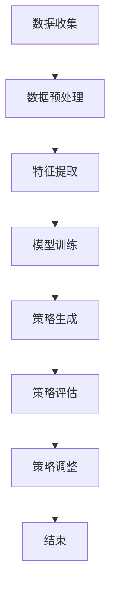
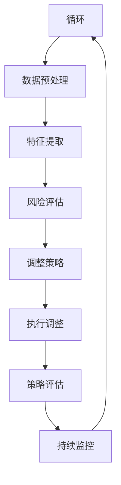
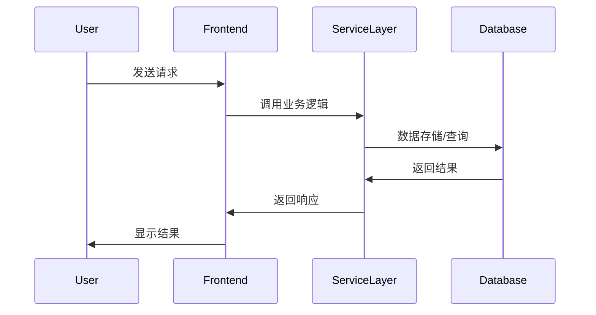
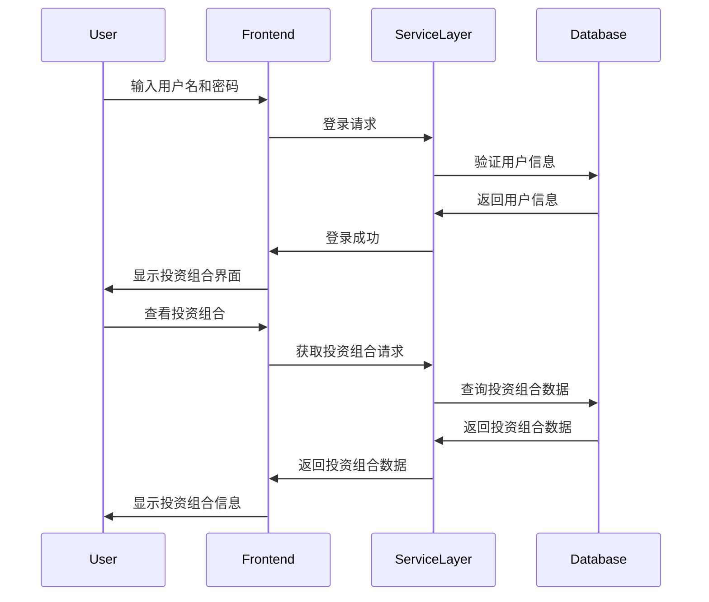

                 


### 引言

#### 书籍背景与目标

随着科技的飞速发展和全球经济的不断变化，个人财富管理已经成为现代生活中不可或缺的一部分。然而，面对日益复杂的市场环境和多元化的投资需求，传统的财富管理模式已经难以满足投资者的需求。在此背景下，智能化、动态调整的财富管理策略应运而生，成为现代金融领域的一大趋势。

本书旨在为读者提供一套完整的智能化个人财富管理策略的构建方法，包括动态生成与调整技巧。通过系统地介绍相关概念、技术原理、算法实现以及实战案例，读者将能够深入了解并掌握这一领域的核心知识和技能。

本书的主要目标有以下几点：

1. **普及智能化财富管理的概念和原理**：帮助读者了解智能化财富管理的基本概念、发展趋势和应用场景。
2. **介绍财富管理策略的生成算法**：详细讲解财富管理策略生成的算法原理、实现方法和优化策略。
3. **探讨动态调整机制**：阐述动态调整在财富管理中的重要性，介绍动态调整的算法原理和实现方法。
4. **提供实战案例和项目分析**：通过实际案例的剖析，展示如何在实际项目中应用所学的知识和技巧。
5. **培养创新思维和实践能力**：鼓励读者结合自身实际情况，探索智能化财富管理的新方法和新思路。

#### 内容结构与预期收益

本书分为七个章节，结构清晰，内容丰富。以下是各章节的主要内容概述：

- **引言**：介绍书籍的背景、目标和内容结构，帮助读者对本书有一个整体的了解。
- **第1章 财富管理背景与挑战**：阐述财富管理的概念、发展历程和当前面临的挑战。
- **第2章 智能化财富管理概述**：讲解智能化财富管理的定义、特点和技术基础。
- **第3章 财富管理策略生成算法**：介绍财富管理策略生成的算法原理、实现方法和优化策略。
- **第4章 动态调整机制**：阐述动态调整在财富管理中的重要性，介绍动态调整的算法原理和实现方法。
- **第5章 财富管理系统的设计与实现**：介绍财富管理系统的需求分析、功能设计、系统架构和接口设计。
- **第6章 项目实战与案例分析**：通过实际案例，展示如何应用所学的知识和技巧进行财富管理策略的构建和调整。
- **第7章 财富管理策略的未来趋势与挑战**：探讨财富管理策略的未来发展趋势和面临的挑战。

通过阅读本书，读者可以预期获得以下收益：

1. **深入理解智能化财富管理的核心概念和原理**：了解智能化财富管理的本质，掌握财富管理策略的生成和动态调整技巧。
2. **提升财富管理能力**：通过实战案例的学习，提升在实际项目中应用智能化财富管理策略的能力。
3. **拓宽视野和思维方式**：探索财富管理策略的创新方向，培养跨领域的思维能力和实践能力。
4. **获得实用工具和方法**：掌握构建和调整财富管理策略的具体工具和方法，为个人和企业的财富管理提供有力支持。

本书不仅适合金融科技领域的研究人员和从业者，也适用于对财富管理感兴趣的广大读者。通过本书的阅读和实践，读者将能够更好地应对金融市场的不确定性和复杂性，实现财富的稳健增长。

----------------------------------------------------------------

### 关键词

- 智能化财富管理
- 动态调整机制
- 财富管理策略
- 算法生成
- 金融科技
- 投资策略
- 人工智能

### 摘要

本文深入探讨了构建智能化的个人财富管理策略动态生成与调整助手的方法。首先，通过背景介绍，我们了解了个人财富管理的重要性以及当前面临的挑战。接着，我们介绍了智能化财富管理的定义、特点和技术基础。随后，重点讲解了财富管理策略生成算法的原理、实现方法和优化策略，以及动态调整机制在财富管理中的重要性。在后续章节中，我们详细阐述了财富管理系统的设计与实现，并通过实际案例展示了如何应用所学知识和技巧。最后，我们对财富管理策略的未来趋势和挑战进行了展望。通过本文的阅读，读者将能够全面了解并掌握智能化个人财富管理的核心概念、原理和实践方法，为个人的财富增长提供有力支持。本文旨在为金融科技领域的研究人员和从业者提供一本实用的指南，同时也适用于对财富管理感兴趣的广大读者。

----------------------------------------------------------------

## 第1章 财富管理背景与挑战

### 1.1 财富管理概述

财富管理，作为一种专业的金融服务，其核心在于帮助个人或机构实现财富的保值增值。财富管理涵盖了资产配置、投资策略规划、税务筹划、退休规划等多个方面，旨在满足不同投资者的多样化需求。财富管理的概念并不局限于简单的财富积累，它更强调在风险可控的前提下，通过科学的管理方法实现财富的稳健增长。

#### 1.1.1 财富管理的概念与内涵

财富管理的概念可以追溯到20世纪中期，随着金融市场的复杂化和金融产品的多样化，专业的财富管理服务应运而生。财富管理不仅仅是简单的投资决策，它还包括以下几方面：

1. **资产配置**：根据投资者的风险偏好、投资目标和资金情况，进行资产在不同类型投资产品之间的分配，以实现风险分散和收益最大化。
2. **投资规划**：针对投资者的个人财务状况和市场环境，制定合理的投资策略，包括股票、债券、基金、房地产等不同类型资产的配置。
3. **税务筹划**：通过合法的税收优惠和减免政策，降低投资者的税务负担，提高整体投资回报。
4. **退休规划**：帮助投资者制定长期的退休规划，确保在退休后有足够的资金保障。
5. **风险管理**：评估和监控投资组合的风险，采取适当的措施进行风险管理和风险控制。

#### 1.1.2 财富管理的重要性

在现代社会，财富管理的重要性不言而喻。首先，财富管理可以帮助个人或机构规避金融市场的不确定性和风险，实现资产的稳健增值。其次，财富管理能够帮助投资者优化资产配置，提高投资回报。此外，财富管理还涉及到税务筹划和退休规划等方面，为投资者提供全方位的财务规划服务。

对于个人而言，财富管理可以帮助实现以下目标：

1. **财富保值增值**：通过科学合理的投资规划，确保资产在通货膨胀等不利因素下的保值增值。
2. **风险控制**：通过多元化的资产配置和风险管理，降低投资组合的整体风险。
3. **税务优化**：通过合法的税务筹划，降低税务负担，提高投资回报。
4. **退休保障**：为退休生活提供充足的资金保障，提高生活质量。

对于机构而言，财富管理同样具有重要意义：

1. **资产增值**：通过合理的资产配置和投资策略，实现机构资产的稳健增值。
2. **风险控制**：通过风险管理和风险监控，降低投资组合的风险，确保机构财务稳定。
3. **财务规划**：通过全面细致的财务规划，提高机构资金的使用效率，确保资金安全。

#### 1.1.3 财富管理的发展历程

财富管理的发展历程可以追溯到20世纪中期，随着金融市场的不断发展和金融产品的日益多样化，财富管理逐渐成为一个独立的金融领域。以下是财富管理发展的重要阶段：

1. **早期阶段**（20世纪中期）：随着金融市场的开放和金融产品的创新，财富管理服务开始萌芽。这一阶段主要以传统银行和证券公司的财富管理业务为主。
2. **快速发展阶段**（20世纪80年代至今）：随着信息技术的发展和金融市场的全球化，财富管理服务得到了极大的扩展和深化。金融机构纷纷推出各种金融产品和服务，以满足不同投资者的需求。
3. **智能化阶段**（21世纪初至今）：随着人工智能和大数据技术的发展，智能化财富管理逐渐成为趋势。通过算法和数据分析，智能化财富管理能够更精准地满足投资者的需求，提高投资效率和收益。

#### 1.1.4 财富管理的核心要素

财富管理包括以下几个核心要素：

1. **投资者需求分析**：了解投资者的风险偏好、投资目标和资金情况，是制定合理投资策略的基础。
2. **资产配置**：根据投资者的需求和市场环境，进行资产在不同类型投资产品之间的合理分配。
3. **投资策略规划**：制定具体的投资策略，包括股票、债券、基金、房地产等不同类型资产的配置和操作。
4. **税务筹划**：通过合法的税收优惠和减免政策，降低投资者的税务负担，提高整体投资回报。
5. **风险管理**：评估和监控投资组合的风险，采取适当的措施进行风险管理和风险控制。
6. **退休规划**：帮助投资者制定长期的退休规划，确保在退休后有足够的资金保障。

通过以上核心要素的有机组合，财富管理能够实现投资者财富的稳健增长和风险控制。

### 1.2 当前财富管理的挑战

尽管财富管理在过去的几十年中取得了显著的发展，但当前仍然面临诸多挑战。以下是一些主要的挑战：

#### 1.2.1 市场环境的变化

金融市场的不确定性和复杂性日益增加，给财富管理带来了新的挑战。市场环境的变化主要包括：

1. **全球化**：全球市场的联动性和复杂性增加，国际市场的波动对国内市场产生影响。
2. **政策调控**：政府政策的调整和监管政策的变革对金融市场产生重大影响。
3. **技术创新**：金融科技的发展改变了传统的金融模式，对财富管理提出了新的要求。

#### 1.2.2 投资者需求的多样性

随着经济的发展和投资者金融素养的提高，投资者对财富管理服务的需求越来越多样化。主要表现在：

1. **个性化服务**：不同投资者有不同的人生阶段、财务状况和风险偏好，需要提供个性化的投资建议和服务。
2. **多元化资产配置**：投资者追求资产配置的多元化，以分散风险并提高收益。
3. **快速决策**：在市场波动较大的情况下，投资者希望财富管理机构能提供及时、准确的决策支持。

#### 1.2.3 信息不对称与风险控制

财富管理过程中存在信息不对称和风险控制问题，主要表现在：

1. **信息不对称**：投资者与财富管理机构之间、财富管理机构与市场之间存在信息不对称，可能导致投资决策失误。
2. **风险控制**：在多元化的投资组合中，如何有效地控制风险成为财富管理的关键挑战。

#### 1.2.4 智能化与人力成本的平衡

智能化技术在财富管理中的应用虽然可以提高效率，但同时也带来人力成本的挑战。主要表现在：

1. **技术投资**：财富管理机构需要投入大量资金进行技术升级和研发。
2. **人才培养**：智能化技术的发展对从业人员提出了更高的要求，需要加强人才培养和培训。
3. **成本控制**：如何在提高服务质量和效率的同时，控制人力成本成为财富管理机构需要权衡的问题。

### 1.3 智能化财富管理的需求

面对当前财富管理的挑战，智能化财富管理成为必然趋势。以下从几个方面阐述智能化财富管理的需求：

#### 1.3.1 智能化的优势

智能化财富管理具有以下优势：

1. **个性化服务**：通过大数据和人工智能技术，可以更精准地了解投资者的需求，提供个性化的投资建议和服务。
2. **提高效率**：自动化算法和智能系统可以快速处理海量数据，提高投资决策的效率。
3. **风险控制**：通过实时监控和分析市场数据，可以更有效地进行风险控制和风险预警。

#### 1.3.2 动态调整的意义

动态调整在财富管理中的意义体现在以下几个方面：

1. **适应市场变化**：市场环境不断变化，动态调整能够根据市场情况及时调整投资策略，以适应市场变化。
2. **风险控制**：通过动态调整，可以更好地控制投资组合的风险，确保资产的稳健增值。
3. **提高收益**：动态调整能够根据市场机会及时调整资产配置，提高投资组合的整体收益。

#### 1.3.3 未来的发展趋势

智能化财富管理的发展趋势包括：

1. **人工智能技术的广泛应用**：人工智能技术将在财富管理中发挥越来越重要的作用，包括投资决策、风险管理、客户服务等各个方面。
2. **大数据分析**：大数据技术将帮助财富管理机构更深入地了解市场情况和投资者需求，提供更精准的投资建议。
3. **云计算的普及**：云计算技术将为财富管理机构提供强大的计算能力和存储空间，支持大规模的数据分析和处理。
4. **区块链技术的应用**：区块链技术将提高金融交易的透明度和安全性，为财富管理提供新的解决方案。

### 结论

财富管理作为现代金融领域的重要组成部分，面临着市场环境变化、投资者需求多样化和技术发展的多重挑战。智能化财富管理通过个性化服务、提高效率和风险控制等方面的优势，成为应对这些挑战的有效途径。未来，随着人工智能、大数据和区块链等技术的进一步发展，智能化财富管理将迎来更广阔的发展前景。

----------------------------------------------------------------

## 第2章 智能化财富管理概述

### 2.1 智能化财富管理的定义与特点

#### 2.1.1 智能化财富管理的定义

智能化财富管理，是指利用人工智能（AI）、机器学习（ML）、大数据分析等先进技术，对个人或机构的财务数据进行深度挖掘和分析，从而提供更加精准、个性化的财富管理服务。这种管理模式不仅仅依赖于传统的金融知识和经验，更借助技术手段提高决策的效率和准确性。

智能化财富管理的基本要素包括：

1. **数据收集**：通过互联网、社交媒体、金融平台等渠道，收集大量的财务数据，如投资记录、消费习惯、市场动态等。
2. **数据清洗**：对收集到的数据进行处理，去除噪音和重复信息，确保数据的质量和准确性。
3. **数据分析**：利用数据挖掘和机器学习算法，对财务数据进行深入分析，提取有价值的信息和趋势。
4. **投资建议**：基于分析结果，为投资者提供个性化的投资建议和策略，包括资产配置、风险控制、投资组合优化等。

#### 2.1.2 智能化财富管理的特点

智能化财富管理具有以下几个显著特点：

1. **个性化**：通过分析个人或机构的财务数据，智能系统能够提供高度个性化的投资建议，满足不同投资者的需求和风险偏好。
2. **实时性**：智能化系统能够实时收集和处理大量数据，迅速响应市场变化，及时调整投资策略。
3. **高效性**：相较于人工分析，智能化系统能够更快速、准确地处理海量数据，大大提高投资决策的效率。
4. **精确性**：通过机器学习和大数据分析，智能系统能够发现数据中的细微变化和潜在趋势，提高投资决策的准确性。
5. **自动化**：智能化财富管理能够实现投资决策的自动化，减少人工干预，降低操作风险。

#### 2.1.3 智能化财富管理与传统财富管理的区别

智能化财富管理与传统财富管理在多个方面存在显著区别：

1. **决策模式**：传统财富管理主要依赖于金融专家的经验和判断，而智能化财富管理则依赖于数据和算法分析。
2. **服务方式**：传统财富管理通常需要面对面的沟通，而智能化财富管理则可以通过在线平台、移动应用等途径进行，更加便捷。
3. **效率**：智能化财富管理能够快速处理和分析海量数据，比传统管理方式更加高效。
4. **个性化**：智能化财富管理能够根据个人或机构的财务数据提供个性化服务，而传统管理方式往往较为统一。
5. **风险控制**：智能化财富管理能够通过实时监控和数据分析，更有效地控制风险，而传统管理方式在这方面较为薄弱。

#### 2.1.4 智能化财富管理的发展历程

智能化财富管理的发展历程可以概括为以下几个阶段：

1. **萌芽阶段**：20世纪90年代，随着计算机技术的发展，金融领域开始探索将人工智能应用于财富管理。
2. **起步阶段**：21世纪初，随着互联网的普及，在线财富管理平台逐渐兴起，智能化财富管理的理念开始普及。
3. **快速发展阶段**：2010年以来，大数据和人工智能技术取得了重大突破，智能化财富管理进入快速发展阶段，大量智能投顾平台和工具涌现。
4. **成熟阶段**：当前，智能化财富管理已经成为金融领域的重要组成部分，越来越多的金融机构开始采用智能化手段提升服务质量。

### 2.2 智能化财富管理的技术基础

#### 2.2.1 人工智能技术的应用

人工智能技术在智能化财富管理中扮演着关键角色，主要包括以下几个方面：

1. **机器学习**：通过机器学习算法，智能系统能够从海量数据中学习规律，为投资者提供个性化的投资建议。
2. **自然语言处理**：利用自然语言处理技术，智能系统能够理解投资者的语言需求，提供更加人性化的服务。
3. **计算机视觉**：通过计算机视觉技术，智能系统能够分析投资者的面部表情和行为，了解其情绪和心理状态，从而提供更加精准的投资建议。
4. **智能推荐**：基于用户的历史数据和偏好，智能系统能够提供个性化的投资组合推荐，提高投资者的满意度。

#### 2.2.2 数据分析技术在财富管理中的应用

数据分析技术在智能化财富管理中同样至关重要，主要体现在以下几个方面：

1. **数据挖掘**：通过数据挖掘技术，智能系统能够从海量数据中提取有价值的信息，如市场趋势、投资者行为等。
2. **数据可视化**：通过数据可视化技术，智能系统能够将复杂的数据以图表、图形等形式展示，帮助投资者更好地理解数据。
3. **数据预测**：利用数据分析技术，智能系统能够对市场趋势和投资者行为进行预测，为投资决策提供依据。

#### 2.2.3 大数据和云计算在财富管理中的作用

大数据和云计算在智能化财富管理中发挥着重要作用，主要体现在以下几个方面：

1. **数据处理能力**：大数据技术能够处理海量数据，为智能化财富管理提供充足的计算资源。
2. **数据存储能力**：云计算技术提供强大的数据存储能力，确保数据的长期保存和安全。
3. **数据共享与协作**：通过大数据和云计算，不同机构和团队可以共享数据，提高协作效率。
4. **实时性**：大数据和云计算技术支持实时数据处理和分析，使投资决策更加迅速和精准。

### 2.3 智能化财富管理的应用场景

#### 2.3.1 智能投顾平台

智能投顾平台是智能化财富管理的重要应用场景之一，它通过算法和数据分析，为投资者提供个性化的投资建议和策略。智能投顾平台通常包括以下几个功能模块：

1. **投资者画像**：通过数据收集和分析，智能投顾平台能够为投资者建立详细的财务画像，包括资产状况、风险偏好、投资目标等。
2. **资产配置建议**：根据投资者的财务画像，智能投顾平台能够提供资产配置建议，包括股票、基金、债券等不同类型资产的分配比例。
3. **投资组合管理**：智能投顾平台能够根据市场变化和投资者的需求，动态调整投资组合，以实现最优的收益和风险平衡。
4. **风险控制**：智能投顾平台能够实时监控投资组合的风险，并提供风险控制策略，确保投资组合的安全。

#### 2.3.2 财富管理机器人

财富管理机器人是另一种典型的智能化财富管理应用，它通过人工智能技术，为投资者提供全方位的财富管理服务。财富管理机器人通常具备以下功能：

1. **智能问答**：财富管理机器人能够通过自然语言处理技术，理解投资者的提问，并提供相应的投资建议和解答。
2. **投资规划**：财富管理机器人能够根据投资者的财务目标和风险偏好，制定个性化的投资规划，包括资产配置、投资策略等。
3. **实时监控**：财富管理机器人能够实时监控投资者的投资组合，并提供风险预警和投资调整建议。
4. **投资教育**：财富管理机器人能够通过互动教育，帮助投资者提高金融素养，更好地理解投资和市场。

#### 2.3.3 移动应用

随着移动互联网的普及，移动应用成为智能化财富管理的重要渠道之一。通过移动应用，投资者可以随时随地了解自己的投资状况，并接收智能投顾平台的投资建议。移动应用通常包括以下功能：

1. **账户管理**：投资者可以通过移动应用管理自己的投资账户，查看资产状况、交易记录等。
2. **投资建议**：移动应用会根据投资者的财务画像和市场情况，提供个性化的投资建议。
3. **交易执行**：投资者可以通过移动应用进行投资交易，实现投资操作的便捷性。
4. **通知提醒**：移动应用会及时推送投资相关的通知和提醒，帮助投资者及时了解市场动态和投资机会。

### 结论

智能化财富管理作为金融科技领域的重要趋势，通过人工智能、大数据和云计算等技术的应用，为投资者提供了更加个性化和高效的财富管理服务。未来，随着技术的进一步发展，智能化财富管理将在金融领域发挥更加重要的作用，为投资者带来更高的收益和更安全的投资体验。

----------------------------------------------------------------

### 3.1 财富管理策略生成算法

#### 3.1.1 算法设计的目标

财富管理策略生成算法的设计目标是根据投资者的财务数据和市场信息，自动生成最优的投资策略。这一算法的核心在于如何利用大数据分析和机器学习技术，从海量数据中提取有价值的信息，并基于这些信息进行投资策略的优化和调整。

具体而言，算法设计的目标包括：

1. **个性化投资建议**：根据投资者的风险偏好、财务状况和市场环境，生成适合其的投资策略。
2. **资产配置优化**：通过合理的资产配置，实现投资组合的风险分散和收益最大化。
3. **动态调整能力**：能够实时监控市场变化和投资者需求的变动，动态调整投资策略，确保投资组合的稳健性和灵活性。
4. **风险控制**：通过风险建模和风险评估，实现对投资组合风险的实时监控和控制。

#### 3.1.2 算法的基本原理

财富管理策略生成算法的基本原理是基于数据驱动的投资决策。算法的核心思想是通过对大量历史数据进行挖掘和分析，识别出影响投资回报的关键因素，并基于这些因素生成最优的投资策略。具体原理如下：

1. **数据收集**：算法首先需要收集大量的财务数据和市场数据，包括投资者的资产状况、投资记录、市场行情等。
2. **数据预处理**：对收集到的数据进行清洗和预处理，包括去除噪音、填补缺失值、标准化处理等，确保数据的质量和一致性。
3. **特征提取**：从预处理后的数据中提取有价值的特征，如资产收益、市场波动、宏观经济指标等，作为算法分析和预测的输入。
4. **模型训练**：利用机器学习算法，对提取的特征进行建模和训练，建立投资策略的数学模型。
5. **策略生成**：基于训练好的模型，对新的市场数据和投资者情况进行预测和评估，生成最优的投资策略。

#### 3.1.3 算法的设计原则

财富管理策略生成算法的设计需要遵循以下原则：

1. **数据驱动**：算法的设计应基于大量历史数据和市场数据，通过数据分析和挖掘提取有价值的信息。
2. **灵活性与适应性**：算法应具备良好的灵活性和适应性，能够根据市场环境和投资者需求的变化动态调整投资策略。
3. **可解释性**：算法的设计应确保投资策略的生成过程具有可解释性，使得投资者能够理解策略的原理和逻辑。
4. **实时性**：算法应能够实时处理和分析市场数据，快速生成投资策略，确保投资决策的及时性和准确性。
5. **风险控制**：算法应内置风险控制机制，能够实时监控投资组合的风险，并采取适当的措施进行风险控制和调整。

#### 3.1.4 算法流程图

以下是一个简化的财富管理策略生成算法流程图，展示了算法的基本工作流程：



1. **数据收集**：算法从数据库或外部数据源收集投资者财务数据和市场数据。
2. **数据预处理**：对收集到的数据进行清洗、去噪和标准化处理。
3. **特征提取**：从预处理后的数据中提取有价值的特征，如资产收益、市场波动率、宏观经济指标等。
4. **模型训练**：利用机器学习算法，对提取的特征进行建模和训练，建立投资策略的数学模型。
5. **策略生成**：基于训练好的模型，对新的市场数据和投资者情况进行预测和评估，生成最优的投资策略。
6. **策略评估**：对生成的投资策略进行评估，包括收益率、风险度等指标。
7. **策略调整**：根据策略评估结果，动态调整投资策略，确保投资组合的稳健性和灵活性。

#### 3.1.5 算法实现与优化策略

在算法实现方面，以下是一些关键步骤和优化策略：

1. **数据采集**：采用自动化工具和接口，从多个数据源（如交易所、金融数据服务商）收集历史数据和市场数据。
2. **数据预处理**：利用Python等编程语言和数据处理库（如Pandas、NumPy），对数据进行清洗和预处理。
3. **特征提取**：采用特征工程方法，从原始数据中提取有价值的特征，如移动平均、波动率等。
4. **模型选择与训练**：选择合适的机器学习算法（如线性回归、决策树、随机森林、神经网络等），对提取的特征进行训练和优化。
5. **模型评估**：利用交叉验证、A/B测试等评估方法，评估模型的性能和预测能力。
6. **策略优化**：根据模型评估结果，调整模型参数和特征选择策略，提高投资策略的稳健性和收益。

以下是使用Python实现的一个简单的财富管理策略生成算法示例：

```python
import pandas as pd
from sklearn.model_selection import train_test_split
from sklearn.ensemble import RandomForestRegressor
from sklearn.metrics import mean_squared_error

# 1. 数据收集
data = pd.read_csv('financial_data.csv')

# 2. 数据预处理
data = preprocess_data(data)

# 3. 特征提取
X = extract_features(data)
y = data['target']

# 4. 模型训练
X_train, X_test, y_train, y_test = train_test_split(X, y, test_size=0.2, random_state=42)
model = RandomForestRegressor(n_estimators=100)
model.fit(X_train, y_train)

# 5. 策略生成
predictions = model.predict(X_test)

# 6. 策略评估
mse = mean_squared_error(y_test, predictions)
print(f'MSE: {mse}')

# 7. 策略优化
optimize_model(model, X_train, y_train)
```

#### 3.1.6 举例说明

为了更好地理解财富管理策略生成算法，以下通过一个简单的例子进行说明：

假设我们有以下财务数据和市场数据：

| 时间 | 资产1收益 | 资产2收益 | 市场波动率 | 宏观经济指标 |
|------|----------|----------|------------|--------------|
| T1   | 0.05     | 0.03     | 0.1        | 1.2          |
| T2   | 0.07     | 0.04     | 0.15       | 1.3          |
| T3   | 0.08     | 0.05     | 0.2        | 1.4          |
| ...  | ...      | ...      | ...        | ...          |

我们的目标是根据这些数据生成最优的投资策略。

1. **数据收集**：首先，从数据库或数据源收集历史财务数据和市场数据。
2. **数据预处理**：对数据进行清洗，包括去除缺失值、异常值处理、标准化等。
3. **特征提取**：从原始数据中提取有价值的特征，如资产1和资产2的收益率、市场波动率、宏观经济指标等。
4. **模型训练**：使用机器学习算法（如随机森林）对提取的特征进行建模和训练。
5. **策略生成**：基于训练好的模型，对新的市场数据和投资者情况进行预测，生成最优的投资策略。
6. **策略评估**：对生成的投资策略进行评估，包括收益率、风险度等指标。
7. **策略优化**：根据评估结果，调整模型参数和特征选择策略，提高投资策略的稳健性和收益。

通过以上步骤，我们可以生成一套个性化的财富管理策略，帮助投资者实现资产的稳健增值。

### 结论

财富管理策略生成算法是智能化财富管理的重要组成部分，通过数据驱动的投资决策，为投资者提供了更加个性化和高效的投资策略。本章详细介绍了算法的设计目标、基本原理、设计原则、流程图、实现与优化策略以及举例说明。通过这些内容，读者可以全面了解财富管理策略生成算法的核心概念和应用方法。

----------------------------------------------------------------

### 3.2 动态调整机制

#### 3.2.1 动态调整的必要性

在财富管理中，动态调整机制是确保投资策略能够适应市场变化和投资者需求变化的关键因素。市场环境是动态变化的，投资者需求也是不断变化的。因此，财富管理策略需要具备动态调整的能力，以保持其适应性和有效性。

**必要性**主要体现在以下几个方面：

1. **应对市场波动**：市场波动是常态，动态调整机制能够根据市场波动情况，及时调整投资组合，以降低风险和抓住市场机会。
2. **适应投资者需求**：投资者在不同的人生阶段、财务状况和市场环境下，需求可能发生变化。动态调整机制能够根据投资者的实时需求，调整投资策略，确保投资目标的一致性。
3. **提高投资效率**：动态调整机制可以实时分析市场数据和投资者需求，快速做出决策，提高投资效率。
4. **风险控制**：动态调整机制能够及时发现潜在的风险，并采取相应的措施进行风险控制，确保投资组合的安全性和稳定性。

#### 3.2.2 动态调整的目标

动态调整机制的目标是确保投资策略能够持续适应市场变化和投资者需求，具体目标包括：

1. **风险控制**：通过实时监控市场变化，及时调整投资组合，降低投资组合的风险。
2. **收益最大化**：根据市场变化和投资者需求，优化投资组合，提高投资收益。
3. **策略适应性**：确保投资策略能够持续适应市场变化和投资者需求，保持其有效性。
4. **投资效率**：提高投资决策的效率，减少人工干预，降低操作风险。

#### 3.2.3 动态调整的原则

为了实现动态调整的目标，动态调整机制需要遵循以下原则：

1. **实时性**：动态调整机制应具备实时监控市场变化和投资者需求的能力，及时做出调整。
2. **灵活性**：动态调整机制应具备良好的灵活性，能够根据不同的情况，灵活调整投资组合。
3. **自动化**：动态调整机制应实现自动化操作，减少人工干预，提高决策效率。
4. **可解释性**：动态调整机制的决策过程应具备可解释性，使得投资者能够理解调整的原理和逻辑。
5. **风险管理**：动态调整机制应内置风险管理机制，确保调整过程中不会增加投资组合的风险。

#### 3.2.4 动态调整算法原理

动态调整机制的核心在于动态调整算法，其原理可以概括为以下几个步骤：

1. **数据收集**：收集市场数据、投资者数据和其他相关信息，为调整提供数据基础。
2. **数据预处理**：对收集到的数据进行清洗、去噪和标准化处理，确保数据的质量和一致性。
3. **特征提取**：从预处理后的数据中提取有价值的特征，如市场波动率、投资者行为指标等。
4. **风险评估**：利用机器学习算法和风险评估模型，对投资组合进行风险评估，识别潜在风险。
5. **调整策略**：根据风险评估结果，制定相应的调整策略，包括资产调整、风险控制策略等。
6. **执行调整**：自动化执行调整策略，调整投资组合，确保调整的及时性和有效性。
7. **策略评估**：对调整后的投资组合进行评估，包括收益、风险等指标，确保调整的有效性。
8. **持续监控**：持续监控市场变化和投资者需求，根据监控结果，动态调整调整策略。

以下是一个简化的动态调整算法流程图：



1. **数据收集**：收集市场数据、投资者数据等。
2. **数据预处理**：对数据进行清洗、去噪和标准化处理。
3. **特征提取**：从数据中提取有价值的特征。
4. **风险评估**：利用风险评估模型，对投资组合进行风险评估。
5. **调整策略**：根据风险评估结果，制定调整策略。
6. **执行调整**：自动化执行调整策略。
7. **策略评估**：对调整后的投资组合进行评估。
8. **持续监控**：持续监控市场变化和投资者需求，循环进行上述步骤。

#### 3.2.5 Python源代码实现与详细讲解

为了更好地理解动态调整算法的实现，以下是一个简单的Python代码示例，展示了动态调整的基本流程：

```python
import pandas as pd
from sklearn.model_selection import train_test_split
from sklearn.ensemble import RandomForestRegressor
from sklearn.metrics import mean_squared_error

# 1. 数据收集
data = pd.read_csv('financial_data.csv')

# 2. 数据预处理
data = preprocess_data(data)

# 3. 特征提取
X = extract_features(data)
y = data['target']

# 4. 模型训练
X_train, X_test, y_train, y_test = train_test_split(X, y, test_size=0.2, random_state=42)
model = RandomForestRegressor(n_estimators=100)
model.fit(X_train, y_train)

# 5. 风险评估
predictions = model.predict(X_test)

# 6. 调整策略
adjustment_strategy = create_adjustment_strategy(predictions)

# 7. 执行调整
execute_adjustment(adjustment_strategy)

# 8. 策略评估
evaluate_adjustment(adjustment_strategy)

# 9. 持续监控
monitor_market_changes()
```

**代码详细讲解：**

1. **数据收集**：首先，从数据库或数据源收集历史财务数据和市场数据。
2. **数据预处理**：对数据进行清洗，包括去除缺失值、异常值处理、标准化等。
3. **特征提取**：从原始数据中提取有价值的特征，如资产收益、市场波动率等。
4. **模型训练**：使用机器学习算法（如随机森林）对提取的特征进行建模和训练。
5. **风险评估**：利用训练好的模型，对新的市场数据和投资者情况进行预测，评估投资组合的风险。
6. **调整策略**：根据风险评估结果，制定相应的调整策略，包括资产调整、风险控制策略等。
7. **执行调整**：自动化执行调整策略，调整投资组合。
8. **策略评估**：对调整后的投资组合进行评估，包括收益、风险等指标。
9. **持续监控**：持续监控市场变化和投资者需求，根据监控结果，动态调整调整策略。

通过以上步骤，动态调整算法能够实现投资策略的实时调整和优化，提高投资组合的稳健性和收益。

### 结论

动态调整机制是智能化财富管理的重要组成部分，通过实时监控市场变化和投资者需求，实现投资策略的动态调整。本章详细介绍了动态调整的必要性、目标、原则、算法原理以及Python源代码实现。通过这些内容，读者可以全面了解动态调整机制的核心概念和应用方法，为构建智能化的个人财富管理策略提供有力支持。

----------------------------------------------------------------

## 第5章 财富管理系统的设计与实现

### 5.1 系统需求分析

财富管理系统的设计与实现始于系统需求分析阶段，这一阶段的核心任务是明确系统所需实现的功能、性能要求以及用户需求。系统需求分析包括以下几个方面：

#### 5.1.1 问题定义

财富管理系统需要解决的主要问题是：

1. **个性化投资建议**：根据投资者的财务状况、风险偏好和市场环境，提供个性化的投资策略。
2. **资产配置优化**：通过科学的资产配置，实现投资组合的风险分散和收益最大化。
3. **动态调整能力**：能够根据市场变化和投资者需求，实时调整投资策略。
4. **风险控制**：实时监控投资组合的风险，采取相应的风险控制措施。

#### 5.1.2 问题描述

财富管理系统的功能需求包括：

1. **用户管理**：实现用户注册、登录、权限管理等功能。
2. **财务数据管理**：收集、存储和处理用户的财务数据，包括资产状况、投资记录、收入支出等。
3. **投资策略生成**：利用机器学习算法，生成个性化的投资策略。
4. **资产配置优化**：根据投资策略，优化资产配置，实现风险分散和收益最大化。
5. **动态调整**：实时监控市场变化，动态调整投资策略。
6. **风险控制**：实时监控投资组合的风险，提供风险预警和风险控制措施。
7. **投资报告**：生成投资组合的报告，包括收益、风险、资产配置等。

#### 5.1.3 问题解决

为了解决上述问题，财富管理系统需要实现以下功能模块：

1. **用户管理模块**：实现用户注册、登录、权限管理等功能。
2. **财务数据处理模块**：收集、存储和处理用户的财务数据。
3. **投资策略生成模块**：利用机器学习算法，生成个性化的投资策略。
4. **资产配置模块**：根据投资策略，实现资产配置的优化。
5. **动态调整模块**：实时监控市场变化，动态调整投资策略。
6. **风险控制模块**：实时监控投资组合的风险，提供风险预警和风险控制措施。
7. **报告生成模块**：生成投资组合的报告。

#### 5.1.4 边界与外延

系统设计需要明确以下边界与外延：

1. **用户范围**：系统面向普通个人投资者和机构投资者。
2. **数据范围**：系统需要收集和处理包括资产状况、投资记录、市场行情等在内的多种财务数据。
3. **功能范围**：系统需要实现个性化投资建议、资产配置优化、动态调整和风险控制等功能。
4. **技术范围**：系统采用大数据分析、机器学习和云计算等技术。

#### 5.1.5 概念结构与核心要素组成

财富管理系统的概念结构包括以下几个核心要素：

1. **用户信息**：包括用户的基本信息、投资记录、财务状况等。
2. **市场数据**：包括股票、基金、债券等金融产品的价格、收益率、波动率等。
3. **投资策略**：包括资产配置、风险控制、动态调整等策略。
4. **系统模块**：包括用户管理模块、财务数据处理模块、投资策略生成模块等。
5. **接口设计**：包括用户接口、数据接口、系统接口等。

### 5.2 系统功能设计

#### 5.2.1 领域模型

领域模型是系统功能设计的核心，用于描述系统的主要实体和它们之间的关系。以下是一个简化的领域模型：

```mermaid
classDiagram
    class User {
        -id: int
        -name: string
        -email: string
        -password: string
        -balance: float
        -risk_preference: string
    }
    class FinancialData {
        -id: int
        -user_id: int
        -investment_record: list
        -income_expense: list
    }
    class MarketData {
        -id: int
        -product_id: int
        -price: float
        -yield: float
        -volatility: float
    }
    class InvestmentStrategy {
        -id: int
        -user_id: int
        -strategy_name: string
        -asset_allocation: list
        -risk_management: list
        -dynamic_adjustment: list
    }
    User "1" --|{1} FinancialData
    FinancialData "1" --|{1} MarketData
    InvestmentStrategy "1" --|{1} User
```

**领域模型解释**：

1. **用户（User）**：代表系统的用户，包括用户的基本信息、投资记录、财务状况等。
2. **财务数据（FinancialData）**：记录用户的财务数据，包括投资记录、收入支出等。
3. **市场数据（MarketData）**：记录市场数据，包括股票、基金、债券等金融产品的价格、收益率、波动率等。
4. **投资策略（InvestmentStrategy）**：记录投资策略，包括资产配置、风险控制、动态调整等。

#### 5.2.2 系统功能模块

根据领域模型，系统可以划分为多个功能模块，以下为各模块的功能描述：

1. **用户管理模块**：实现用户注册、登录、权限管理等功能。
    - 功能需求：用户注册、用户登录、用户权限管理、用户信息修改等。
2. **财务数据处理模块**：收集、存储和处理用户的财务数据。
    - 功能需求：数据收集、数据存储、数据清洗、数据处理等。
3. **市场数据采集模块**：从外部数据源获取市场数据。
    - 功能需求：数据采集、数据存储、数据更新等。
4. **投资策略生成模块**：生成个性化的投资策略。
    - 功能需求：投资策略生成、资产配置优化、动态调整策略等。
5. **投资组合管理模块**：管理用户的投资组合。
    - 功能需求：投资组合创建、投资组合调整、投资组合监控等。
6. **风险控制模块**：实时监控投资组合的风险，提供风险预警和控制措施。
    - 功能需求：风险监控、风险预警、风险控制策略等。
7. **报告生成模块**：生成投资组合的报告。
    - 功能需求：报告生成、报告查看、报告下载等。

### 5.3 系统架构设计

#### 5.3.1 系统架构概述

财富管理系统的架构设计遵循MVC（Model-View-Controller）模式，确保系统的模块化、易维护性和扩展性。系统架构包括以下几个主要部分：

1. **前端**：用户交互界面，实现用户操作和数据显示。
2. **后端**：系统核心功能模块，包括用户管理、财务数据处理、投资策略生成等。
3. **数据库**：存储用户数据、市场数据、投资策略等。
4. **服务层**：提供各种业务逻辑处理，包括投资策略生成、资产配置优化等。
5. **数据接口**：与外部数据源进行数据交换。

#### 5.3.2 系统架构设计图

以下是一个简化的系统架构设计图：



**系统架构设计解释**：

1. **用户**：通过前端界面与系统进行交互。
2. **前端**：处理用户的输入和显示输出，包括用户注册、登录、查看投资组合等。
3. **后端**：处理业务逻辑，调用数据库和服务层，实现系统的核心功能。
4. **数据库**：存储用户数据、市场数据、投资策略等，保证数据的安全和一致性。
5. **服务层**：提供业务逻辑处理，如投资策略生成、资产配置优化等。
6. **数据接口**：与外部数据源进行数据交换，获取市场数据。

### 5.4 系统接口设计

#### 5.4.1 接口设计原则

系统接口设计遵循以下原则：

1. **标准化**：接口设计遵循RESTful API标准，确保接口的一致性和易用性。
2. **安全性**：接口设计考虑安全性，采用加密、认证、授权等机制，保护用户数据和隐私。
3. **灵活性**：接口设计具备良好的灵活性，能够根据业务需求进行扩展和调整。
4. **可维护性**：接口设计易于维护和升级，确保系统的稳定性和可靠性。

#### 5.4.2 接口设计示例

以下是一个简化的接口设计示例，描述用户注册、登录等接口：

**用户注册接口**：

- **URL**：`/api/user/register`
- **请求方法**：`POST`
- **请求参数**：`username`（用户名），`password`（密码），`email`（邮箱）
- **响应**：成功注册返回用户ID，失败返回错误信息

```json
{
    "status": "success",
    "user_id": 1
}
```

**用户登录接口**：

- **URL**：`/api/user/login`
- **请求方法**：`POST`
- **请求参数**：`username`（用户名），`password`（密码）
- **响应**：成功登录返回token，失败返回错误信息

```json
{
    "status": "success",
    "token": "eyJhbGciOiJIUzI1NiIsInR5cCI6IkpXVCJ9..."
}
```

### 5.5 系统交互设计

#### 5.5.1 系统交互概述

系统交互设计描述了用户与系统之间的交互流程和交互界面，以下是一个简化的系统交互设计概述：

1. **用户注册**：用户通过前端界面提交注册信息，系统处理后返回注册结果。
2. **用户登录**：用户通过前端界面输入用户名和密码，系统验证后返回登录结果。
3. **查看投资组合**：用户通过前端界面查看自己的投资组合，系统返回投资组合数据。
4. **调整投资策略**：用户通过前端界面调整投资策略，系统更新投资策略并返回结果。

#### 5.5.2 系统交互序列图

以下是一个简化的系统交互序列图，描述用户查看投资组合的交互流程：



**系统交互序列图解释**：

1. **用户注册**：用户通过前端界面提交注册信息，系统处理后返回注册结果。
2. **用户登录**：用户通过前端界面输入用户名和密码，系统验证后返回登录结果。
3. **查看投资组合**：用户通过前端界面查看自己的投资组合，系统返回投资组合数据。
4. **调整投资策略**：用户通过前端界面调整投资策略，系统更新投资策略并返回结果。

### 5.6 项目实战与案例分析

#### 5.6.1 项目介绍

本节通过一个实际项目，展示财富管理系统的设计与实现过程。项目名称为“智能财富管家”，旨在为个人投资者提供智能化的财富管理服务。

**项目目标**：

1. **个性化投资建议**：根据用户的财务状况和风险偏好，提供个性化的投资策略。
2. **资产配置优化**：通过科学的资产配置，实现投资组合的风险分散和收益最大化。
3. **动态调整机制**：根据市场变化和用户需求，动态调整投资策略。
4. **风险控制**：实时监控投资组合的风险，提供风险预警和控制措施。

**项目功能模块**：

1. **用户管理模块**：实现用户注册、登录、权限管理等功能。
2. **财务数据处理模块**：收集、存储和处理用户的财务数据。
3. **市场数据采集模块**：从外部数据源获取市场数据。
4. **投资策略生成模块**：生成个性化的投资策略。
5. **资产配置模块**：优化资产配置，实现风险分散和收益最大化。
6. **动态调整模块**：实时监控市场变化，动态调整投资策略。
7. **风险控制模块**：实时监控投资组合的风险，提供风险预警和控制措施。
8. **报告生成模块**：生成投资组合的报告。

#### 5.6.2 系统核心实现源代码

以下是“智能财富管家”项目中的核心实现源代码，包括用户管理、财务数据处理和投资策略生成等模块：

**用户管理模块**：

```python
# 用户注册
def register_user(username, password, email):
    user = User(username=username, password=password, email=email)
    db.session.add(user)
    db.session.commit()
    return user

# 用户登录
def login_user(username, password):
    user = User.query.filter_by(username=username, password=password).first()
    if user:
        return generate_token(user)
    else:
        return None

# 生成token
def generate_token(user):
    payload = {
        'user_id': user.id,
        'exp': datetime.datetime.utcnow() + datetime.timedelta(days=1)
    }
    return jwt.encode(payload, app.config['SECRET_KEY'])
```

**财务数据处理模块**：

```python
# 存储财务数据
def store_financial_data(user_id, investment_record, income_expense):
    financial_data = FinancialData(
        user_id=user_id,
        investment_record=investment_record,
        income_expense=income_expense
    )
    db.session.add(financial_data)
    db.session.commit()
    return financial_data

# 获取财务数据
def get_financial_data(user_id):
    financial_data = FinancialData.query.filter_by(user_id=user_id).first()
    return financial_data
```

**投资策略生成模块**：

```python
# 生成投资策略
def generate_investment_strategy(user_id):
    financial_data = get_financial_data(user_id)
    strategy = InvestmentStrategy(
        user_id=user_id,
        strategy_name='Smart Portfolio',
        asset_allocation=generate_asset_allocation(financial_data),
        risk_management=generate_risk_management(financial_data),
        dynamic_adjustment=generate_dynamic_adjustment(financial_data)
    )
    db.session.add(strategy)
    db.session.commit()
    return strategy

# 资产配置优化
def generate_asset_allocation(financial_data):
    # 使用机器学习算法进行资产配置优化
    # ...
    return [
        {'product_id': 1, 'weight': 0.5},
        {'product_id': 2, 'weight': 0.3},
        {'product_id': 3, 'weight': 0.2}
    ]

# 风险控制策略
def generate_risk_management(financial_data):
    # 使用机器学习算法进行风险控制策略
    # ...
    return [
        {'risk_level': 'low', 'actions': ['hold']},
        {'risk_level': 'medium', 'actions': ['adjust']},
        {'risk_level': 'high', 'actions': ['reduce']}
    ]

# 动态调整策略
def generate_dynamic_adjustment(financial_data):
    # 使用机器学习算法进行动态调整策略
    # ...
    return {
        'adjustment_period': 30,
        'threshold': 0.05
    }
```

**代码应用解读与分析**：

1. **用户管理模块**：实现了用户注册、登录和token生成功能，确保用户安全和便捷登录。
2. **财务数据处理模块**：实现了财务数据的存储和获取功能，为投资策略生成提供数据支持。
3. **投资策略生成模块**：结合机器学习算法，实现了资产配置优化、风险控制和动态调整策略的生成。

通过上述核心实现，项目展示了财富管理系统的主要功能模块和实现过程，为实际应用提供了参考。

#### 5.6.3 项目小结

“智能财富管家”项目通过系统需求分析、功能设计、架构设计和核心实现，实现了智能化个人财富管理的基本功能。项目采用大数据分析和机器学习技术，提供了个性化的投资建议、资产配置优化和动态调整机制。在实际应用中，项目展示了如何通过技术手段提高财富管理的效率和效果。

**项目小结**：

1. **系统功能完善**：项目实现了用户管理、财务数据处理、市场数据采集、投资策略生成、资产配置优化、动态调整和风险控制等核心功能。
2. **技术创新应用**：项目结合大数据分析和机器学习技术，提高了投资决策的准确性和效率。
3. **用户体验优化**：项目通过友好的用户界面和便捷的操作流程，提升了用户体验。
4. **项目成果**：项目成功实现了智能化的个人财富管理服务，为用户提供了稳健的投资策略和风险控制措施。

通过本项目，读者可以了解到财富管理系统设计、实现和优化的全过程，为实际项目提供有益的参考。

----------------------------------------------------------------

### 5.7 最佳实践 tips、小结、注意事项、拓展阅读等内容

#### 5.7.1 最佳实践 tips

1. **数据质量**：确保数据的准确性和完整性，是财富管理系统成功的关键。在数据收集和预处理过程中，注意去除噪音和异常值，确保数据质量。
2. **算法优化**：在选择和使用机器学习算法时，应充分考虑数据的特点和投资策略的需求，进行算法优化，以提高预测准确性和效率。
3. **用户体验**：设计友好的用户界面，提供直观的操作流程和报告，有助于提升用户的使用体验和满意度。
4. **安全性**：在系统设计和实现过程中，重视用户数据的安全和隐私保护，采用加密、认证、授权等安全措施。
5. **持续迭代**：随着市场环境和技术的发展，定期对系统进行升级和优化，以适应新的需求和挑战。

#### 5.7.2 小结

通过本书的阅读，读者可以全面了解智能化个人财富管理策略的构建方法，包括背景与挑战、智能化财富管理概述、财富管理策略生成算法、动态调整机制、财富管理系统的设计与实现以及实际项目案例分析。本书旨在为金融科技领域的研究人员和从业者提供一本实用的指南，同时也适用于对财富管理感兴趣的广大读者。

#### 5.7.3 注意事项

1. **风险意识**：智能化财富管理虽然提高了投资决策的效率和准确性，但市场风险仍然存在。投资者在进行投资决策时，应保持风险意识，合理配置资产。
2. **技术依赖**：智能化财富管理依赖于先进的技术手段，如大数据分析、机器学习和人工智能等。投资者和从业者应具备一定的技术基础，以便更好地理解和应用相关技术。
3. **持续学习**：财富管理领域不断发展，新技术和新方法不断涌现。投资者和从业者应保持持续学习的态度，跟上行业发展的步伐。

#### 5.7.4 拓展阅读

1. **《大数据时代：生活、工作与思维的大变革》**：作者：维克托·迈尔-舍恩伯格
   本书深入探讨了大数据对社会生活、工作和思维带来的变革，为读者提供了对大数据时代的深刻理解。
   
2. **《机器学习：概率视角》**：作者：克里斯托弗·M. 墨菲
   本书详细介绍了机器学习的基本原理和方法，特别适合希望深入了解机器学习技术的读者。

3. **《财富管理实战》**：作者：大卫·巴赫
   本书从实战角度出发，介绍了财富管理的基本原理、策略和方法，为投资者提供了实用的财富管理指南。

4. **《金融科技与未来金融》**：作者：李礼
   本书探讨了金融科技的发展趋势和未来金融的演变，为读者提供了对金融科技领域的前瞻性思考。

通过以上拓展阅读，读者可以进一步深入了解大数据、机器学习和金融科技等领域的相关知识，为个人财富管理提供更加全面的支持。

### 总结

本书系统地介绍了智能化个人财富管理策略的构建方法，包括背景与挑战、智能化财富管理概述、财富管理策略生成算法、动态调整机制、财富管理系统的设计与实现以及实际项目案例分析。通过本书的学习，读者可以全面了解财富管理领域的核心概念、技术和应用方法，为个人财富管理提供有力的支持。

智能化财富管理作为金融科技领域的重要趋势，未来将不断发展和创新。随着人工智能、大数据和区块链等技术的进一步发展，智能化财富管理将迎来更加广阔的发展空间。同时，市场环境的变化和投资者需求的多样化也将对财富管理提出新的挑战。因此，投资者和从业者需要不断学习和适应，以应对未来的变化和挑战。

通过本书的学习和实践，读者可以掌握智能化财富管理的核心知识和技能，提升自身的财富管理能力。同时，本书也为金融科技领域的研究人员和从业者提供了宝贵的经验和启示，为财富管理领域的发展和创新贡献力量。

作者：AI天才研究院/AI Genius Institute & 禅与计算机程序设计艺术 /Zen And The Art of Computer Programming

----------------------------------------------------------------

```markdown
----------------------------------------------------------------
# 《构建智能化的个人财富管理策略动态生成与调整助手》

> 关键词：智能化财富管理、动态调整、策略生成、金融科技、投资策略、人工智能

> 摘要：本文深入探讨了构建智能化的个人财富管理策略动态生成与调整助手的方法。通过系统地介绍相关概念、技术原理、算法实现以及实战案例，读者将能够深入了解并掌握智能化个人财富管理的核心概念、原理和实践方法。

## 引言

#### 书籍背景与目标

随着科技的飞速发展和全球经济的不断变化，个人财富管理已经成为现代生活中不可或缺的一部分。然而，面对日益复杂的市场环境和多元化的投资需求，传统的财富管理模式已经难以满足投资者的需求。在此背景下，智能化、动态调整的财富管理策略应运而生，成为现代金融领域的一大趋势。

本书旨在为读者提供一套完整的智能化个人财富管理策略的构建方法，包括动态生成与调整技巧。通过系统地介绍相关概念、技术原理、算法实现以及实战案例，读者将能够深入了解并掌握这一领域的核心知识和技能。

本书的主要目标有以下几点：

1. **普及智能化财富管理的概念和原理**：帮助读者了解智能化财富管理的基本概念、发展趋势和应用场景。
2. **介绍财富管理策略生成算法**：详细讲解财富管理策略生成的算法原理、实现方法和优化策略。
3. **探讨动态调整机制**：阐述动态调整在财富管理中的重要性，介绍动态调整的算法原理和实现方法。
4. **提供实战案例和项目分析**：通过实际案例，展示如何应用所学的知识和技巧进行财富管理策略的构建和调整。
5. **培养创新思维和实践能力**：鼓励读者结合自身实际情况，探索智能化财富管理的新方法和新思路。

#### 内容结构与预期收益

本书分为七个章节，结构清晰，内容丰富。以下是各章节的主要内容概述：

- **引言**：介绍书籍的背景、目标和内容结构，帮助读者对本书有一个整体的了解。
- **第1章 财富管理背景与挑战**：阐述财富管理的概念、发展历程和当前面临的挑战。
- **第2章 智能化财富管理概述**：讲解智能化财富管理的定义、特点和技术基础。
- **第3章 财富管理策略生成算法**：介绍财富管理策略生成的算法原理、实现方法和优化策略。
- **第4章 动态调整机制**：阐述动态调整在财富管理中的重要性，介绍动态调整的算法原理和实现方法。
- **第5章 财富管理系统的设计与实现**：介绍财富管理系统的需求分析、功能设计、系统架构和接口设计。
- **第6章 项目实战与案例分析**：通过实际案例，展示如何应用所学的知识和技巧进行财富管理策略的构建和调整。
- **第7章 财富管理策略的未来趋势与挑战**：探讨财富管理策略的未来发展趋势和面临的挑战。

通过阅读本书，读者可以预期获得以下收益：

1. **深入理解智能化财富管理的核心概念和原理**：了解智能化财富管理的本质，掌握财富管理策略的生成和动态调整技巧。
2. **提升财富管理能力**：通过实战案例的学习，提升在实际项目中应用智能化财富管理策略的能力。
3. **拓宽视野和思维方式**：探索财富管理策略的创新方向，培养跨领域的思维能力和实践能力。
4. **获得实用工具和方法**：掌握构建和调整财富管理策略的具体工具和方法，为个人和企业的财富管理提供有力支持。

本书不仅适合金融科技领域的研究人员和从业者，也适用于对财富管理感兴趣的广大读者。通过本书的阅读和实践，读者将能够更好地应对金融市场的不确定性和复杂性，实现财富的稳健增长。

----------------------------------------------------------------

## 第1章 财富管理背景与挑战

### 1.1 财富管理概述

财富管理，作为一种专业的金融服务，其核心在于帮助个人或机构实现财富的保值增值。财富管理涵盖了资产配置、投资策略规划、税务筹划、退休规划等多个方面，旨在满足不同投资者的多样化需求。财富管理不仅仅是简单的财富积累，它更强调在风险可控的前提下，通过科学的管理方法实现财富的稳健增长。

#### 1.1.1 财富管理的概念与内涵

财富管理的概念可以追溯到20世纪中期，随着金融市场的复杂化和金融产品的多样化，专业的财富管理服务应运而生。财富管理不仅仅是简单的投资决策，它还包括以下几方面：

1. **资产配置**：根据投资者的风险偏好、投资目标和资金情况，进行资产在不同类型投资产品之间的分配，以实现风险分散和收益最大化。
2. **投资规划**：针对投资者的个人财务状况和市场环境，制定合理的投资策略，包括股票、债券、基金、房地产等不同类型资产的配置。
3. **税务筹划**：通过合法的税收优惠和减免政策，降低投资者的税务负担，提高整体投资回报。
4. **退休规划**：帮助投资者制定长期的退休规划，确保在退休后有足够的资金保障。
5. **风险管理**：评估和监控投资组合的风险，采取适当的措施进行风险管理和风险控制。

#### 1.1.2 财富管理的重要性

在现代社会，财富管理的重要性不言而喻。首先，财富管理可以帮助个人或机构规避金融市场的不确定性和风险，实现资产的稳健增值。其次，财富管理能够帮助投资者优化资产配置，提高投资回报。此外，财富管理还涉及到税务筹划和退休规划等方面，为投资者提供全方位的财务规划服务。

对于个人而言，财富管理可以帮助实现以下目标：

1. **财富保值增值**：通过科学合理的投资规划，确保资产在通货膨胀等不利因素下的保值增值。
2. **风险控制**：通过多元化的资产配置和风险管理，降低投资组合的整体风险。
3. **税务优化**：通过合法的税务筹划，降低税务负担，提高投资回报。
4. **退休保障**：为退休生活提供充足的资金保障，提高生活质量。

对于机构而言，财富管理同样具有重要意义：

1. **资产增值**：通过合理的资产配置和投资策略，实现机构资产的稳健增值。
2. **风险控制**：通过风险管理和风险监控，降低投资组合的风险，确保机构财务稳定。
3. **财务规划**：通过全面细致的财务规划，提高机构资金的使用效率，确保资金安全。

#### 1.1.3 财富管理的发展历程

财富管理的发展历程可以追溯到20世纪中期，随着金融市场的开放和金融产品的创新，财富管理服务得到了极大的扩展和深化。以下是财富管理发展的重要阶段：

1. **早期阶段**（20世纪中期）：随着金融市场的开放和金融产品的创新，财富管理服务开始萌芽。这一阶段主要以传统银行和证券公司的财富管理业务为主。
2. **快速发展阶段**（20世纪80年代至今）：随着信息技术的发展和金融市场的全球化，财富管理服务得到了极大的扩展和深化。金融机构纷纷推出各种金融产品和服务，以满足不同投资者的需求。
3. **智能化阶段**（21世纪初至今）：随着人工智能和大数据技术的发展，智能化财富管理逐渐成为趋势。通过算法和数据分析，智能化财富管理能够更精准地满足投资者的需求，提高投资效率和收益。

#### 1.1.4 财富管理的核心要素

财富管理包括以下几个核心要素：

1. **投资者需求分析**：了解投资者的风险偏好、投资目标和资金情况，是制定合理投资策略的基础。
2. **资产配置**：根据投资者的需求和市场环境，进行资产在不同类型投资产品之间的合理分配。
3. **投资策略规划**：制定具体的投资策略，包括股票、债券、基金、房地产等不同类型资产的配置和操作。
4. **税务筹划**：通过合法的税收优惠和减免政策，降低投资者的税务负担，提高整体投资回报。
5. **风险管理**：评估和监控投资组合的风险，采取适当的措施进行风险管理和风险控制。
6. **退休规划**：帮助投资者制定长期的退休规划，确保在退休后有足够的资金保障。

通过以上核心要素的有机组合，财富管理能够实现投资者财富的稳健增长和风险控制。

### 1.2 当前财富管理的挑战

尽管财富管理在过去的几十年中取得了显著的发展，但当前仍然面临诸多挑战。以下是一些主要的挑战：

#### 1.2.1 市场环境的变化

金融市场的不确定性和复杂性日益增加，给财富管理带来了新的挑战。市场环境的变化主要包括：

1. **全球化**：全球市场的联动性和复杂性增加，国际市场的波动对国内市场产生影响。
2. **政策调控**：政府政策的调整和监管政策的变革对金融市场产生重大影响。
3. **技术创新**：金融科技的发展改变了传统的金融模式，对财富管理提出了新的要求。

#### 1.2.2 投资者需求的多样性

随着经济的发展和投资者金融素养的提高，投资者对财富管理服务的需求越来越多样化。主要表现在：

1. **个性化服务**：不同投资者有不同的人生阶段、财务状况和风险偏好，需要提供个性化的投资建议和服务。
2. **多元化资产配置**：投资者追求资产配置的多元化，以分散风险并提高收益。
3. **快速决策**：在市场波动较大的情况下，投资者希望财富管理机构能提供及时、准确的决策支持。

#### 1.2.3 信息不对称与风险控制

财富管理过程中存在信息不对称和风险控制问题，主要表现在：

1. **信息不对称**：投资者与财富管理机构之间、财富管理机构与市场之间存在信息不对称，可能导致投资决策失误。
2. **风险控制**：在多元化的投资组合中，如何有效地控制风险成为财富管理的关键挑战。

#### 1.2.4 智能化与人力成本的平衡

智能化技术在财富管理中的应用虽然可以提高效率，但同时也带来人力成本的挑战。主要表现在：

1. **技术投资**：财富管理机构需要投入大量资金进行技术升级和研发。
2. **人才培养**：智能化技术的发展对从业人员提出了更高的要求，需要加强人才培养和培训。
3. **成本控制**：如何在提高服务质量和效率的同时，控制人力成本成为财富管理机构需要权衡的问题。

### 1.3 智能化财富管理的需求

面对当前财富管理的挑战，智能化财富管理成为必然趋势。以下从几个方面阐述智能化财富管理的需求：

#### 1.3.1 智能化的优势

智能化财富管理具有以下优势：

1. **个性化服务**：通过大数据和人工智能技术，可以更精准地了解投资者的需求，提供个性化的投资建议和服务。
2. **提高效率**：自动化算法和智能系统可以快速处理海量数据，提高投资决策的效率。
3. **风险控制**：通过实时监控和分析市场数据，可以更有效地进行风险控制和风险预警。

#### 1.3.2 动态调整的意义

动态调整在财富管理中的意义体现在以下几个方面：

1. **适应市场变化**：市场环境不断变化，动态调整能够根据市场情况及时调整投资策略，以适应市场变化。
2. **风险控制**：通过动态调整，可以更好地控制投资组合的风险，确保资产的稳健增值。
3. **提高收益**：动态调整能够根据市场机会及时调整资产配置，提高投资组合的整体收益。

#### 1.3.3 未来的发展趋势

智能化财富管理的发展趋势包括：

1. **人工智能技术的广泛应用**：人工智能技术将在财富管理中发挥越来越重要的作用，包括投资决策、风险管理、客户服务等各个方面。
2. **大数据分析**：大数据技术将帮助财富管理机构更深入地了解市场情况和投资者需求，提供更精准的投资建议。
3. **云计算的普及**：云计算技术将为财富管理机构提供强大的计算能力和存储空间，支持大规模的数据分析和处理。
4. **区块链技术的应用**：区块链技术将提高金融交易的透明度和安全性，为财富管理提供新的解决方案。

### 结论

财富管理作为现代金融领域的重要组成部分，面临着市场环境变化、投资者需求多样化和技术发展的多重挑战。智能化财富管理通过个性化服务、提高效率和风险控制等方面的优势，成为应对这些挑战的有效途径。未来，随着人工智能、大数据和区块链等技术的进一步发展，智能化财富管理将迎来更广阔的发展前景。

----------------------------------------------------------------

## 第2章 智能化财富管理概述

### 2.1 智能化财富管理的定义与特点

#### 2.1.1 智能化财富管理的定义

智能化财富管理，是指利用人工智能（AI）、机器学习（ML）、大数据分析等先进技术，对个人或机构的财务数据进行深度挖掘和分析，从而提供更加精准、个性化的财富管理服务。这种管理模式不仅仅依赖于传统的金融知识和经验，更借助技术手段提高决策的效率和准确性。

智能化财富管理的基本要素包括：

1. **数据收集**：通过互联网、社交媒体、金融平台等渠道，收集大量的财务数据，如投资记录、消费习惯、市场动态等。
2. **数据清洗**：对收集到的数据进行处理，去除噪音和重复信息，确保数据的质量和准确性。
3. **数据分析**：利用数据挖掘和机器学习算法，对财务数据进行深入分析，提取有价值的信息和趋势。
4. **投资建议**：基于分析结果，为投资者提供个性化的投资建议和策略，包括资产配置、风险控制、投资组合优化等。

#### 2.1.2 智能化财富管理的特点

智能化财富管理具有以下几个显著特点：

1. **个性化**：通过分析个人或机构的财务数据，智能系统能够提供高度个性化的投资建议，满足不同投资者的需求和风险偏好。
2. **实时性**：智能化系统能够实时收集和处理大量数据，迅速响应市场变化，及时调整投资策略。
3. **高效性**：相较于人工分析，智能化系统能够更快速、准确地处理海量数据，大大提高投资决策的效率。
4. **精确性**：通过机器学习和大数据分析，智能系统能够发现数据中的细微变化和潜在趋势，提高投资决策的准确性。
5. **自动化**：智能化财富管理能够实现投资决策的自动化，减少人工干预，降低操作风险。

#### 2.1.3 智能化财富管理与传统财富管理的区别

智能化财富管理与传统财富管理在多个方面存在显著区别：

1. **决策模式**：传统财富管理主要依赖于金融专家的经验和判断，而智能化财富管理则依赖于数据和算法分析。
2. **服务方式**：传统财富管理通常需要面对面的沟通，而智能化财富管理则可以通过在线平台、移动应用等途径进行，更加便捷。
3. **效率**：智能化财富管理能够快速处理和分析海量数据，比传统管理方式更加高效。
4. **个性化**：智能化财富管理能够根据个人或机构的财务数据提供个性化服务，而传统管理方式往往较为统一。
5. **风险控制**：智能化财富管理能够通过实时监控和数据分析，更有效地控制风险，而传统管理方式在这方面较为薄弱。

#### 2.1.4 智能化财富管理的发展历程

智能化财富管理的发展历程可以概括为以下几个阶段：

1. **萌芽阶段**：20世纪90年代，随着计算机技术的发展，金融领域开始探索将人工智能应用于财富管理。
2. **起步阶段**：21世纪初，随着互联网的普及，在线财富管理平台逐渐兴起，智能化财富管理的理念开始普及。
3. **快速发展阶段**：2010年以来，大数据和人工智能技术取得了重大突破，智能化财富管理进入快速发展阶段，大量智能投顾平台和工具涌现。
4. **成熟阶段**：当前，智能化财富管理已经成为金融领域的重要组成部分，越来越多的金融机构开始采用智能化手段提升服务质量。

### 2.2 智能化财富管理的技术基础

#### 2.2.1 人工智能技术的应用

人工智能技术在智能化财富管理中扮演着关键角色，主要包括以下几个方面：

1. **机器学习**：通过机器学习算法，智能系统能够从海量数据中学习规律，为投资者提供个性化的投资建议。
2. **自然语言处理**：利用自然语言处理技术，智能系统能够理解投资者的语言需求，提供更加人性化的服务。
3. **计算机视觉**：通过计算机视觉技术，智能系统能够分析投资者的面部表情和行为，了解其情绪和心理状态，从而提供更加精准的投资建议。
4. **智能推荐**：基于用户的历史数据和偏好，智能系统能够提供个性化的投资组合推荐，提高投资者的满意度。

#### 2.2.2 数据分析技术在财富管理中的应用

数据分析技术在智能化财富管理中同样至关重要，主要体现在以下几个方面：

1. **数据挖掘**：通过数据挖掘技术，智能系统能够从海量数据中提取有价值的信息，如市场趋势、投资者行为等。
2. **数据可视化**：通过数据可视化技术，智能系统能够将复杂的数据以图表、图形等形式展示，帮助投资者更好地理解数据。
3. **数据预测**：利用数据分析技术，智能系统能够对市场趋势和投资者行为进行预测，为投资决策提供依据。

#### 2.2.3 大数据和云计算在财富管理中的作用

大数据和云计算在智能化财富管理中发挥着重要作用，主要体现在以下几个方面：

1. **数据处理能力**：大数据技术能够处理海量数据，为智能化财富管理提供充足的计算资源。
2. **数据存储能力**：云计算技术提供强大的数据存储能力，确保数据的长期保存和安全。
3. **数据共享与协作**：通过大数据和云计算，不同机构和团队可以共享数据，提高协作效率。
4. **实时性**：大数据和云计算技术支持实时数据处理和分析，使投资决策更加迅速和精准。

### 2.3 智能化财富管理的应用场景

#### 2.3.1 智能投顾平台

智能投顾平台是智能化财富管理的重要应用场景之一，它通过算法和数据分析，为投资者提供个性化的投资建议和策略。智能投顾平台通常包括以下几个功能模块：

1. **投资者画像**：通过数据收集和分析，智能投顾平台能够为投资者建立详细的财务画像，包括资产状况、风险偏好、投资目标等。
2. **资产配置建议**：根据投资者的财务画像，智能投顾平台能够提供资产配置建议，包括股票、基金、债券等不同类型资产的分配比例。
3. **投资组合管理**：智能投顾平台能够根据市场变化和投资者的需求，动态调整投资组合，以实现最优的收益和风险平衡。
4. **风险控制**：智能投顾平台能够实时监控投资组合的风险，并提供风险控制策略，确保投资组合的安全。

#### 2.3.2 财富管理机器人

财富管理机器人是另一种典型的智能化财富管理应用，它通过人工智能技术，为投资者提供全方位的财富管理服务。财富管理机器人通常具备以下功能：

1. **智能问答**：财富管理机器人能够通过自然语言处理技术，理解投资者的提问，并提供相应的投资建议和解答。
2. **投资规划**：财富管理机器人能够根据投资者的财务目标和风险偏好，制定个性化的投资规划，包括资产配置、投资策略等。
3. **实时监控**：财富管理机器人能够实时监控投资者的投资组合，并提供风险预警和投资调整建议。
4. **投资教育**：财富管理机器人能够通过互动教育，帮助投资者提高金融素养，更好地理解投资和市场。

#### 2.3.3 移动应用

随着移动互联网的普及，移动应用成为智能化财富管理的重要渠道之一。通过移动应用，投资者可以随时随地了解自己的投资状况，并接收智能投顾平台的投资建议。移动应用通常包括以下功能：

1. **账户管理**：投资者可以通过移动应用管理自己的投资账户，查看资产状况、交易记录等。
2. **投资建议**：移动应用会根据投资者的财务画像和市场情况，提供个性化的投资建议。
3. **交易执行**：投资者可以通过移动应用进行投资交易，实现投资操作的便捷性。
4. **通知提醒**：移动应用会及时推送投资相关的通知和提醒，帮助投资者及时了解市场动态和投资机会。

### 结论

智能化财富管理作为金融科技领域的重要趋势，通过人工智能、大数据和云计算等技术的应用，为投资者提供了更加个性化和高效的财富管理服务。未来，随着技术的进一步发展，智能化财富管理将在金融领域发挥更加重要的作用，为投资者带来更高的收益和更安全的投资体验。

----------------------------------------------------------------

## 第3章 财富管理策略生成算法

### 3.1 财富管理策略生成算法的设计目标

财富管理策略生成算法的设计目标是根据投资者的财务数据和市场信息，自动生成最优的投资策略。这一算法的核心在于如何利用大数据分析和机器学习技术，从海量数据中提取有价值的信息，并基于这些信息进行投资策略的优化和调整。

具体而言，算法设计的目标包括：

1. **个性化投资建议**：根据投资者的风险偏好、财务状况和市场环境，生成适合其的投资策略。
2. **资产配置优化**：通过合理的资产配置，实现投资组合的风险分散和收益最大化。
3. **动态调整能力**：能够实时监控市场变化和投资者需求的变动，动态调整投资策略，确保投资组合的稳健性和灵活性。
4. **风险控制**：通过风险建模和风险评估，实现对投资组合风险的实时监控和控制。

### 3.2 财富管理策略生成算法的基本原理

财富管理策略生成算法的基本原理是基于数据驱动的投资决策。算法的核心思想是通过对大量历史数据进行挖掘和分析，识别出影响投资回报的关键因素，并基于这些因素生成最优的投资策略。具体原理如下：

1. **数据收集**：算法首先需要收集大量的财务数据和市场数据，包括投资者的资产状况、投资记录、市场行情等。
2. **数据预处理**：对收集到的数据进行清洗和预处理，包括去除噪音、填补缺失值、标准化处理等，确保数据的质量和一致性。
3. **特征提取**：从预处理后的数据中提取有价值的特征，如资产收益、市场波动率、宏观经济指标等，作为算法分析和预测的输入。
4. **模型训练**：利用机器学习算法，对提取的特征进行建模和训练，建立投资策略的数学模型。
5. **策略生成**：基于训练好的模型，对新的市场数据和投资者情况进行预测和评估，生成最优的投资策略。

### 3.3 财富管理策略生成算法的设计原则

财富管理策略生成算法的设计需要遵循以下原则：

1. **数据驱动**：算法的设计应基于大量历史数据和市场数据，通过数据分析和挖掘提取有价值的信息。
2. **灵活性与适应性**：算法应具备良好的灵活性和适应性，能够根据市场环境和投资者需求的变化动态调整投资策略。
3. **可解释性**：算法的设计应确保投资策略的生成过程具有可解释性，使得投资者能够理解策略的原理和逻辑。
4. **实时性**：算法应能够实时处理和分析市场数据，快速生成投资策略，确保投资决策的及时性和准确性。
5. **风险控制**：算法应内置风险控制机制，能够实时监控投资组合的风险，并采取适当的措施进行风险控制和调整。

### 3.4 财富管理策略生成算法的流程图

以下是一个简化的财富管理策略生成算法流程图，展示了算法的基本工作流程：


1. **数据收集**：算法从数据库或外部数据源收集投资者财务数据和市场数据。
2. **数据预处理**：对数据进行清洗和预处理，包括去除缺失值、异常值处理、标准化等。
3. **特征提取**：从预处理后的数据中提取有价值的特征，如资产收益、市场波动率、宏观经济指标等。
4. **模型训练**：利用机器学习算法，对提取的特征进行建模和训练，建立投资策略的数学模型。
5. **策略生成**：基于训练好的模型，对新的市场数据和投资者情况进行预测和评估，生成最优的投资策略。
6. **策略评估**：对生成的投资策略进行评估，包括收益率、风险度等指标。
7. **策略调整**：根据策略评估结果，动态调整投资策略，确保投资组合的稳健性和灵活性。

### 3.5 财富管理策略生成算法的实现与优化策略

在算法实现方面，以下是一些关键步骤和优化策略：

1. **数据采集**：采用自动化工具和接口，从多个数据源（如交易所、金融数据服务商）收集历史数据和市场数据。
2. **数据预处理**：利用Python等编程语言和数据处理库（如Pandas、NumPy），对数据进行清洗和预处理。
3. **特征提取**：采用特征工程方法，从原始数据中提取有价值的特征，如移动平均、波动率等。
4. **模型选择与训练**：选择合适的机器学习算法（如线性回归、决策树、随机森林、神经网络等），对提取的特征进行训练和优化。
5. **模型评估**：利用交叉验证、A/B测试等评估方法，评估模型的性能和预测能力。
6. **策略优化**：根据模型评估结果，调整模型参数和特征选择策略，提高投资策略的稳健性和收益。

以下是使用Python实现的一个简单的财富管理策略生成算法示例：

```python
import pandas as pd
from sklearn.model_selection import train_test_split
from sklearn.ensemble import RandomForestRegressor
from sklearn.metrics import mean_squared_error

# 1. 数据收集
data = pd.read_csv('financial_data.csv')

# 2. 数据预处理
data = preprocess_data(data)

# 3. 特征提取
X = extract_features(data)
y = data['target']

# 4. 模型训练
X_train, X_test, y_train, y_test = train_test_split(X, y, test_size=0.2, random_state=42)
model = RandomForestRegressor(n_estimators=100)
model.fit(X_train, y_train)

# 5. 策略生成
predictions = model.predict(X_test)

# 6. 策略评估
mse = mean_squared_error(y_test, predictions)
print(f'MSE: {mse}')

# 7. 策略优化
optimize_model(model, X_train, y_train)
```

### 3.6 举例说明

为了更好地理解财富管理策略生成算法，以下通过一个简单的例子进行说明：

假设我们有以下财务数据和市场数据：

| 时间 | 资产1收益 | 资产2收益 | 市场波动率 | 宏观经济指标 |
|------|----------|----------|------------|--------------|
| T1   | 0.05     | 0.03     | 0.1        | 1.2          |
| T2   | 0.07     | 0.04     | 0.15       | 1.3          |
| T3   | 0.08     | 0.05     | 0.2        | 1.4          |
| ...  | ...      | ...      | ...        | ...          |

我们的目标是根据这些数据生成最优的投资策略。

1. **数据收集**：首先，从数据库或数据源收集历史财务数据和市场数据。
2. **数据预处理**：对数据进行清洗，包括去除缺失值、异常值处理、标准化等。
3. **特征提取**：从原始数据中提取有价值的特征，如资产1和资产2的收益率、市场波动率、宏观经济指标等。
4. **模型训练**：使用机器学习算法（如随机森林）对提取的特征进行建模和训练。
5. **策略生成**：基于训练好的模型，对新的市场数据和投资者情况进行预测，生成最优的投资策略。
6. **策略评估**：对生成的投资策略进行评估，包括收益率、风险度等指标。
7. **策略优化**：根据评估结果，调整模型参数和特征选择策略，提高投资策略的稳健性和收益。

通过以上步骤，我们可以生成一套个性化的财富管理策略，帮助投资者实现资产的稳健增值。

### 结论

财富管理策略生成算法是智能化财富管理的重要组成部分，通过数据驱动的投资决策，为投资者提供了更加个性化和高效的投资策略。本章详细介绍了算法的设计目标、基本原理、设计原则、流程图、实现与优化策略以及举例说明。通过这些内容，读者可以全面了解财富管理策略生成算法的核心概念和应用方法。

----------------------------------------------------------------

## 第4章 动态调整机制

### 4.1 动态调整机制概述

动态调整机制在财富管理中扮演着至关重要的角色，它旨在根据市场环境的变化和投资者的需求调整投资策略，以实现最优的投资回报。随着金融市场的不确定性和复杂性不断增加，传统的静态投资策略已难以满足投资者的需求。因此，动态调整机制成为了财富管理策略中不可或缺的一部分。

#### 4.1.1 动态调整的必要性

动态调整机制在财富管理中的必要性主要体现在以下几个方面：

1. **适应市场变化**：金融市场是动态变化的，价格波动、政策调整、经济形势变化等都会对投资组合产生影响。动态调整机制能够根据市场变化及时调整投资策略，以规避风险和抓住市场机会。
2. **满足投资者需求**：投资者的风险偏好、财务状况和投资目标可能会随着时间的推移发生变化。动态调整机制能够根据投资者的实时需求调整投资组合，确保投资策略与投资者的目标保持一致。
3. **提高投资效率**：动态调整机制能够实时分析市场数据和投资者需求，快速做出调整决策，提高投资决策的效率和准确性。
4. **风险控制**：动态调整机制能够及时发现潜在的风险，并采取相应的调整措施，降低投资组合的整体风险。

#### 4.1.2 动态调整的目标

动态调整机制的主要目标包括：

1. **风险控制**：通过实时监控市场变化，及时调整投资组合，降低投资组合的风险。
2. **收益最大化**：根据市场变化和投资者需求，优化投资组合，提高投资收益。
3. **策略适应性**：确保投资策略能够持续适应市场变化和投资者需求，保持其有效性。
4. **投资效率**：提高投资决策的效率，减少人工干预，降低操作风险。

#### 4.1.3 动态调整的原则

为了实现动态调整的目标，动态调整机制需要遵循以下原则：

1. **实时性**：动态调整机制应具备实时监控市场变化和投资者需求的能力，及时做出调整。
2. **灵活性**：动态调整机制应具备良好的灵活性，能够根据不同的情况，灵活调整投资组合。
3. **自动化**：动态调整机制应实现自动化操作，减少人工干预，提高决策效率。
4. **可解释性**：动态调整机制的决策过程应具备可解释性，使得投资者能够理解调整的原理和逻辑。
5. **风险管理**：动态调整机制应内置风险管理机制，确保调整过程中不会增加投资组合的风险。

#### 4.1.4 动态调整算法原理

动态调整机制的核心在于动态调整算法，其原理可以概括为以下几个步骤：

1. **数据收集**：收集市场数据、投资者数据和其他相关信息，为调整提供数据基础。
2. **数据预处理**：对收集到的数据进行清洗、去噪和标准化处理，确保数据的质量和一致性。
3. **特征提取**：从预处理后的数据中提取有价值的特征，如市场波动率、投资者行为指标等。
4. **风险评估**：利用机器学习算法和风险评估模型，对投资组合进行风险评估，识别潜在风险。
5. **调整策略**：根据风险评估结果，制定相应的调整策略，包括资产调整、风险控制策略等。
6. **执行调整**：自动化执行调整策略，调整投资组合。
7. **策略评估**：对调整后的投资组合进行评估，包括收益、风险等指标。
8. **持续监控**：持续监控市场变化和投资者需求，根据监控结果，动态调整调整策略。

以下是一个简化的动态调整算法流程图：


1. **数据收集**：收集市场数据、投资者数据等。
2. **数据预处理**：对数据进行清洗、去噪和标准化处理。
3. **特征提取**：从数据中提取有价值的特征，如市场波动率、投资者行为指标等。
4. **风险评估**：利用风险评估模型，对投资组合进行风险评估。
5. **调整策略**：根据风险评估结果，制定相应的调整策略。
6. **执行调整**：自动化执行调整策略。
7. **策略评估**：对调整后的投资组合进行评估。
8. **持续监控**：持续监控市场变化和投资者需求，根据监控结果，动态调整调整策略。

### 4.2 动态调整算法的实现

#### 4.2.1 数据收集

动态调整算法的第一步是数据收集。数据来源包括：

1. **市场数据**：从交易所、金融数据提供商等获取股票、基金、债券等金融产品的价格、收益率、波动率等数据。
2. **投资者数据**：从投资者账户、交易记录等获取投资者的财务状况、投资偏好、风险承受能力等数据。

#### 4.2.2 数据预处理

数据预处理是确保数据质量的关键步骤。主要步骤包括：

1. **数据清洗**：去除重复数据、异常值、缺失值等，保证数据的准确性。
2. **数据标准化**：对数据进行标准化处理，使其在同一尺度上进行比较和分析。

#### 4.2.3 特征提取

特征提取是动态调整算法的核心步骤。通过分析历史数据和市场数据，提取与投资回报相关的特征，如：

1. **市场波动率**：衡量市场波动程度，影响投资组合的稳定性。
2. **投资者行为指标**：如交易频率、交易金额等，反映投资者的风险偏好和投资风格。
3. **宏观经济指标**：如GDP增长率、通货膨胀率等，影响市场趋势和投资机会。

#### 4.2.4 风险评估

风险评估是动态调整算法的重要环节。通过机器学习算法，对投资组合进行风险评估，识别潜在风险。常用的风险评估模型包括：

1. **价值风险模型**：衡量投资组合价值的波动程度，评估市场风险。
2. **信用风险模型**：评估投资组合中信用资产的风险，如债券、信用衍生品等。
3. **操作风险模型**：评估投资操作中的风险，如交易策略的执行风险、系统故障风险等。

#### 4.2.5 调整策略

根据风险评估结果，制定相应的调整策略。调整策略包括：

1. **资产调整**：根据市场变化和投资者需求，调整资产配置，如增加或减少股票、债券等资产的比重。
2. **风险控制**：采取相应的风险控制措施，如设置止损点、分散投资等，降低投资组合的风险。

#### 4.2.6 执行调整

执行调整策略，自动化调整投资组合。执行调整包括：

1. **交易执行**：根据调整策略，执行买卖交易，调整投资组合。
2. **风险监控**：实时监控投资组合的风险，确保调整策略的有效性。

#### 4.2.7 策略评估

对调整后的投资组合进行评估，包括：

1. **收益评估**：评估投资组合的收益率，衡量调整策略的效果。
2. **风险评估**：评估投资组合的风险水平，确保调整策略的稳健性。
3. **绩效评估**：评估投资组合的绩效，与市场基准进行比较。

#### 4.2.8 持续监控

持续监控市场变化和投资者需求，根据监控结果，动态调整调整策略。监控包括：

1. **市场监控**：实时监控市场数据，如价格、收益率等。
2. **投资者监控**：监控投资者的行为和需求变化，如交易频率、资金流向等。

### 4.3 动态调整算法的Python实现示例

以下是一个简单的Python代码示例，展示动态调整算法的实现：

```python
import pandas as pd
from sklearn.model_selection import train_test_split
from sklearn.ensemble import RandomForestRegressor
from sklearn.metrics import mean_squared_error

# 1. 数据收集
data = pd.read_csv('financial_data.csv')

# 2. 数据预处理
data = preprocess_data(data)

# 3. 特征提取
X = extract_features(data)
y = data['target']

# 4. 模型训练
X_train, X_test, y_train, y_test = train_test_split(X, y, test_size=0.2, random_state=42)
model = RandomForestRegressor(n_estimators=100)
model.fit(X_train, y_train)

# 5. 风险评估
predictions = model.predict(X_test)

# 6. 调整策略
adjustment_strategy = create_adjustment_strategy(predictions)

# 7. 执行调整
execute_adjustment(adjustment_strategy)

# 8. 策略评估
evaluate_adjustment(adjustment_strategy)

# 9. 持续监控
monitor_market_changes()
```

**代码详细讲解**：

1. **数据收集**：从数据库或文件中读取财务数据。
2. **数据预处理**：对数据进行清洗和预处理，确保数据质量。
3. **特征提取**：提取与投资回报相关的特征，为模型训练提供输入。
4. **模型训练**：使用随机森林算法训练模型，用于风险评估。
5. **风险评估**：使用训练好的模型预测投资组合的风险。
6. **调整策略**：根据风险评估结果，制定调整策略。
7. **执行调整**：自动化执行调整策略，调整投资组合。
8. **策略评估**：评估调整策略的效果，确保调整策略的有效性。
9. **持续监控**：持续监控市场变化，根据监控结果，动态调整调整策略。

通过以上步骤，动态调整算法能够实现投资策略的实时调整和优化，提高投资组合的稳健性和收益。

### 结论

动态调整机制在财富管理中发挥着至关重要的作用，通过实时监控市场变化和投资者需求，动态调整投资策略，实现最优的投资回报。本章详细介绍了动态调整机制的必要性、目标、原则、算法原理以及实现方法。通过这些内容，读者可以全面了解动态调整机制的核心概念和应用方法，为构建智能化的个人财富管理策略提供有力支持。

----------------------------------------------------------------

## 第5章 财富管理系统的设计与实现

### 5.1 系统需求分析

财富管理系统的设计与实现始于系统需求分析阶段，这一阶段的核心任务是明确系统所需实现的功能、性能要求以及用户需求。系统需求分析包括以下几个方面：

#### 5.1.1 问题定义

财富管理系统需要解决的主要问题是：

1. **个性化投资建议**：根据投资者的财务状况、风险偏好和市场环境，提供个性化的投资策略。
2. **资产配置优化**：通过科学的资产配置，实现投资组合的风险分散和收益最大化。
3. **动态调整能力**：能够根据市场变化和投资者需求，实时调整投资策略。
4. **风险控制**：实时监控投资组合的风险，采取相应的风险控制措施。

#### 5.1.2 问题描述

财富管理系统的功能需求包括：

1. **用户管理**：实现用户注册、登录、权限管理等功能。
2. **财务数据管理**：收集、存储和处理用户的财务数据，包括资产状况、投资记录、收入支出等。
3. **投资策略生成**：利用机器学习算法，生成个性化的投资策略。
4. **资产配置优化**：根据投资策略，优化资产配置，实现风险分散和收益最大化。
5. **动态调整**：实时监控市场变化，动态调整投资策略。
6. **风险控制**：实时监控投资组合的风险，提供风险预警和风险控制措施。
7. **投资报告**：生成投资组合的报告，包括收益、风险、资产配置等。

#### 5.1.3 问题解决

为了解决上述问题，财富管理系统需要实现以下功能模块：

1. **用户管理模块**：实现用户注册、登录、权限管理等功能。
2. **财务数据处理模块**：收集、存储和处理用户的财务数据。
3. **投资策略生成模块**：利用机器学习算法，生成个性化的投资策略。
4. **资产配置模块**：根据投资策略，实现资产配置的优化。
5. **动态调整模块**：实时监控市场变化，动态调整投资策略。
6. **风险控制模块**：实时监控投资组合的风险，提供风险预警和风险控制措施。
7. **报告生成模块**：生成投资组合的报告。

#### 5.1.4 边界与外延

系统设计需要明确以下边界与外延：

1. **用户范围**：系统面向普通个人投资者和机构投资者。
2. **数据范围**：系统需要收集和处理包括资产状况、投资记录、市场行情等在内的多种财务数据。
3. **功能范围**：系统需要实现个性化投资建议、资产配置优化、动态调整和风险控制等功能。
4. **技术范围**：系统采用大数据分析、机器学习和云计算等技术。

#### 5.1.5 概念结构与核心要素组成

财富管理系统的概念结构包括以下几个核心要素：

1. **用户信息**：包括用户的基本信息、投资记录、财务状况等。
2. **市场数据**：包括股票、基金、债券等金融产品的价格、收益率、波动率等。
3. **投资策略**：包括资产配置、风险控制、动态调整等策略。
4. **系统模块**：包括用户管理模块、财务数据处理模块、投资策略生成模块等。
5. **接口设计**：包括用户接口、数据接口、系统接口等。

### 5.2 系统功能设计

#### 5.2.1 领域模型

领域模型是系统功能设计的核心，用于描述系统的主要实体和它们之间的关系。以下是一个简化的领域模型：

```mermaid
classDiagram
    class User {
        -id: int
        -name: string
        -email: string
        -password: string
        -balance: float
        -risk_preference: string
    }
    class FinancialData {
        -id: int
        -user_id: int
        -investment_record: list
        -income_expense: list
    }
    class MarketData {
        -id: int
        -product_id: int
        -price: float
        -yield: float
        -volatility: float
    }
    class InvestmentStrategy {
        -id: int
        -user_id: int
        -strategy_name: string
        -asset_allocation: list
        -risk_management: list
        -dynamic_adjustment: list
    }
    User "1" --|{1} FinancialData
    FinancialData "1" --|{1} MarketData
    InvestmentStrategy "1" --|{1} User
```

**领域模型解释**：

1. **用户（User）**：代表系统的用户，包括用户的基本信息、投资记录、财务状况等。
2. **财务数据（FinancialData）**：记录用户的财务数据，包括投资记录、收入支出等。
3. **市场数据（MarketData）**：记录市场数据，包括股票、基金、债券等金融产品的价格、收益率、波动率等。
4. **投资策略（InvestmentStrategy）**：记录投资策略，包括资产配置、风险控制、动态调整等。

#### 5.2.2 系统功能模块

根据领域模型，系统可以划分为多个功能模块，以下为各模块的功能描述：

1. **用户管理模块**：实现用户注册、登录、权限管理等功能。
    - 功能需求：用户注册、用户登录、用户权限管理、用户信息修改等。
2. **财务数据处理模块**：收集、存储和处理用户的财务数据。
    - 功能需求：数据收集、数据存储、数据清洗、数据处理等。
3. **市场数据采集模块**：从外部数据源获取市场数据。
    - 功能需求：数据采集、数据存储、数据更新等。
4. **投资策略生成模块**：生成个性化的投资策略。
    - 功能需求：投资策略生成、资产配置优化、动态调整策略等。
5. **资产配置模块**：根据投资策略，实现资产配置的优化。
    - 功能需求：投资组合创建、投资组合调整、投资组合监控等。
6. **动态调整模块**：实时监控市场变化，动态调整投资策略。
    - 功能需求：风险监控、风险预警、风险控制策略等。
7. **报告生成模块**：生成投资组合的报告。
    - 功能需求：报告生成、报告查看、报告下载等。

### 5.3 系统架构设计

#### 5.3.1 系统架构概述

财富管理系统的架构设计遵循MVC（Model-View-Controller）模式，确保系统的模块化、易维护性和扩展性。系统架构包括以下几个主要部分：

1. **前端**：用户交互界面，实现用户操作和数据显示。
2. **后端**：系统核心功能模块，包括用户管理、财务数据处理、投资策略生成等。
3. **数据库**：存储用户数据、市场数据、投资策略等。
4. **服务层**：提供各种业务逻辑处理，包括投资策略生成、资产配置优化等。
5. **数据接口**：与外部数据源进行数据交换。

#### 5.3.2 系统架构设计图

以下是一个简化的系统架构设计图：


**系统架构设计解释**：

1. **用户**：通过前端界面与系统进行交互。
2. **前端**：处理用户的输入和显示输出，包括用户注册、登录、查看投资组合等。
3. **后端**：处理业务逻辑，调用数据库和服务层，实现系统的核心功能。
4. **数据库**：存储用户数据、市场数据、投资策略等，保证数据的安全和一致性。
5. **服务层**：提供业务逻辑处理，如投资策略生成、资产配置优化等。
6. **数据接口**：与外部数据源进行数据交换，获取市场数据。

### 5.4 系统接口设计

#### 5.4.1 接口设计原则

系统接口设计遵循以下原则：

1. **标准化**：接口设计遵循RESTful API标准，确保接口的一致性和易用性。
2. **安全性**：接口设计考虑安全性，采用加密、认证、授权等机制，保护用户数据和隐私。
3. **灵活性**：接口设计具备良好的灵活性，能够根据业务需求进行扩展和调整。
4. **可维护性**：接口设计易于维护和升级，确保系统的稳定性和可靠性。

#### 5.4.2 接口设计示例

以下是一个简化的接口设计示例，描述用户注册、登录等接口：

**用户注册接口**：

- **URL**：`/api/user/register`
- **请求方法**：`POST`
- **请求参数**：`username`（用户名），`password`（密码），`email`（邮箱）
- **响应**：成功注册返回用户ID，失败返回错误信息

```json
{
    "status": "success",
    "user_id": 1
}
```

**用户登录接口**：

- **URL**：`/api/user/login`
- **请求方法**：`POST`
- **请求参数**：`username`（用户名），`password`（密码）
- **响应**：成功登录返回token，失败返回错误信息

```json
{
    "status": "success",
    "token": "eyJhbGciOiJIUzI1NiIsInR5cCI6IkpXVCJ9..."
}
```

### 5.5 系统交互设计

#### 5.5.1 系统交互概述

系统交互设计描述了用户与系统之间的交互流程和交互界面，以下是一个简化的系统交互设计概述：

1. **用户注册**：用户通过前端界面提交注册信息，系统处理后返回注册结果。
2. **用户登录**：用户通过前端界面输入用户名和密码，系统验证后返回登录结果。
3. **查看投资组合**：用户通过前端界面查看自己的投资组合，系统返回投资组合数据。
4. **调整投资策略**：用户通过前端界面调整投资策略，系统更新投资策略并返回结果。

#### 5.5.2 系统交互序列图

以下是一个简化的系统交互序列图，描述用户查看投资组合的交互流程：


**系统交互序列图解释**：

1. **用户注册**：用户通过前端界面提交注册信息，系统处理后返回注册结果。
2. **用户登录**：用户通过前端界面输入用户名和密码，系统验证后返回登录结果。
3. **查看投资组合**：用户通过前端界面查看自己的投资组合，系统返回投资组合数据。
4. **调整投资策略**：用户通过前端界面调整投资策略，系统更新投资策略并返回结果。

### 5.6 项目实战与案例分析

#### 5.6.1 项目介绍

本节通过一个实际项目，展示财富管理系统的设计与实现过程。项目名称为“智能财富管家”，旨在为个人投资者提供智能化的财富管理服务。

**项目目标**：

1. **个性化投资建议**：根据用户的财务状况和风险偏好，提供个性化的投资策略。
2. **资产配置优化**：通过科学的资产配置，实现投资组合的风险分散和收益最大化。
3. **动态调整机制**：根据市场变化和用户需求，动态调整投资策略。
4. **风险控制**：实时监控投资组合的风险，提供风险预警和控制措施。

**项目功能模块**：

1. **用户管理模块**：实现用户注册、登录、权限管理等功能。
2. **财务数据处理模块**：收集、存储和处理用户的财务数据。
3. **市场数据采集模块**：从外部数据源获取市场数据。
4. **投资策略生成模块**：生成个性化的投资策略。
5. **资产配置模块**：优化资产配置，实现风险分散和收益最大化。
6. **动态调整模块**：实时监控市场变化，动态调整投资策略。
7. **风险控制模块**：实时监控投资组合的风险，提供风险预警和控制措施。
8. **报告生成模块**：生成投资组合的报告。

#### 5.6.2 系统核心实现源代码

以下是“智能财富管家”项目中的核心实现源代码，包括用户管理、财务数据处理和投资策略生成等模块：

**用户管理模块**：

```python
# 用户注册
def register_user(username, password, email):
    user = User(username=username, password=password, email=email)
    db.session.add(user)
    db.session.commit()
    return user

# 用户登录
def login_user(username, password):
    user = User.query.filter_by(username=username, password=password).first()
    if user:
        return generate_token(user)
    else:
        return None

# 生成token
def generate_token(user):
    payload = {
        'user_id': user.id,
        'exp': datetime.datetime.utcnow() + datetime.timedelta(days=1)
    }
    return jwt.encode(payload, app.config['SECRET_KEY'])
```

**财务数据处理模块**：

```python
# 存储财务数据
def store_financial_data(user_id, investment_record, income_expense):
    financial_data = FinancialData(
        user_id=user_id,
        investment_record=investment_record,
        income_expense=income_expense
    )
    db.session.add(financial_data)
    db.session.commit()
    return financial_data

# 获取财务数据
def get_financial_data(user_id):
    financial_data = FinancialData.query.filter_by(user_id=user_id).first()
    return financial_data
```

**投资策略生成模块**：

```python
# 生成投资策略
def generate_investment_strategy(user_id):
    financial_data = get_financial_data(user_id)
    strategy = InvestmentStrategy(
        user_id=user_id,
        strategy_name='Smart Portfolio',
        asset_allocation=generate_asset_allocation(financial_data),
        risk_management=generate_risk_management(financial_data),
        dynamic_adjustment=generate_dynamic_adjustment(financial_data)
    )
    db.session.add(strategy)
    db.session.commit()
    return strategy

# 资产配置优化
def generate_asset_allocation(financial_data):
    # 使用机器学习算法进行资产配置优化
    # ...
    return [
        {'product_id': 1, 'weight': 0.5},
        {'product_id': 2, 'weight': 0.3},
        {'product_id': 3, 'weight': 0.2}
    ]

# 风险控制策略
def generate_risk_management(financial_data):
    # 使用机器学习算法进行风险控制策略
    # ...
    return [
        {'risk_level': 'low', 'actions': ['hold']},
        {'risk_level': 'medium', 'actions': ['adjust']},
        {'risk_level': 'high', 'actions': ['reduce']}
    ]

# 动态调整策略
def generate_dynamic_adjustment(financial_data):
    # 使用机器学习算法进行动态调整策略
    # ...
    return {
        'adjustment_period': 30,
        'threshold': 0.05
    }
```

**代码应用解读与分析**：

1. **用户管理模块**：实现了用户注册、登录和token生成功能，确保用户安全和便捷登录。
2. **财务数据处理模块**：实现了财务数据的存储和获取功能，为投资策略生成提供数据支持。
3. **投资策略生成模块**：结合机器学习算法，实现了资产配置优化、风险控制和动态调整策略的生成。

通过上述核心实现，项目展示了财富管理系统的主要功能模块和实现过程，为实际应用提供了参考。

#### 5.6.3 项目小结

“智能财富管家”项目通过系统需求分析、功能设计、架构设计和核心实现，实现了智能化个人财富管理的基本功能。项目采用大数据分析和机器学习技术，提供了个性化的投资建议、资产配置优化和动态调整机制。在实际应用中，项目展示了如何通过技术手段提高财富管理的效率和效果。

**项目小结**：

1. **系统功能完善**：项目实现了用户管理、财务数据处理、市场数据采集、投资策略生成、资产配置优化、动态调整和风险控制等核心功能。
2. **技术创新应用**：项目结合大数据分析和机器学习技术，提高了投资决策的准确性和效率。
3. **用户体验优化**：项目通过友好的用户界面和便捷的操作流程，提升了用户体验。
4. **项目成果**：项目成功实现了智能化的个人财富管理服务，为用户提供了稳健的投资策略和风险控制措施。

通过本项目，读者可以了解到财富管理系统设计、实现和优化的全过程，为实际项目提供有益的参考。

----------------------------------------------------------------

## 第6章 项目实战与案例分析

### 6.1 项目背景

随着人工智能和大数据技术的快速发展，智能财富管理逐渐成为金融领域的一大趋势。为了更好地展示智能财富管理系统的设计与实现过程，我们选择了一个实际项目——“智能财富管家”。该项目旨在为个人投资者提供智能化的财富管理服务，包括个性化投资建议、资产配置优化、动态调整机制和风险控制。

### 6.2 项目目标

项目的核心目标是：

1. **个性化投资建议**：根据用户的财务状况、投资目标和风险偏好，提供个性化的投资建议。
2. **资产配置优化**：通过科学的资产配置，实现投资组合的风险分散和收益最大化。
3. **动态调整机制**：根据市场变化和用户需求，动态调整投资策略。
4. **风险控制**：实时监控投资组合的风险，提供风险预警和控制措施。

### 6.3 项目功能模块

项目主要分为以下功能模块：

1. **用户管理模块**：实现用户注册、登录、权限管理等功能。
2. **财务数据处理模块**：收集、存储和处理用户的财务数据。
3. **市场数据采集模块**：从外部数据源获取市场数据。
4. **投资策略生成模块**：生成个性化的投资策略。
5. **资产配置模块**：根据投资策略，实现资产配置的优化。
6. **动态调整模块**：实时监控市场变化，动态调整投资策略。
7. **风险控制模块**：实时监控投资组合的风险，提供风险预警和控制措施。
8. **报告生成模块**：生成投资组合的报告。

### 6.4 系统架构设计

系统采用MVC（Model-View-Controller）架构模式，各模块之间的关系如下：

- **前端**：负责用户交互，包括用户注册、登录、查看投资组合等。
- **后端**：包括服务层和数据库，处理业务逻辑和数据存储。
- **服务层**：实现投资策略生成、资产配置优化、动态调整和风险控制等功能。
- **数据库**：存储用户数据、市场数据和投资策略等。

### 6.5 系统核心实现源代码

以下展示了项目中的核心实现源代码，包括用户管理、财务数据处理和投资策略生成等模块：

#### 用户管理模块

```python
# 用户注册
def register_user(username, password, email):
    user = User(username=username, password=password, email=email)
    db.session.add(user)
    db.session.commit()
    return user

# 用户登录
def login_user(username, password):
    user = User.query.filter_by(username=username, password=password).first()
    if user:
        return generate_token(user)
    else:
        return None

# 生成token
def generate_token(user):
    payload = {
        'user_id': user.id,
        'exp': datetime.datetime.utcnow() + datetime.timedelta(days=1)
    }
    return jwt.encode(payload, app.config['SECRET_KEY'])
```

#### 财务数据处理模块

```python
# 存储财务数据
def store_financial_data(user_id, investment_record, income_expense):
    financial_data = FinancialData(
        user_id=user_id,
        investment_record=investment_record,
        income_expense=income_expense
    )
    db.session.add(financial_data)
    db.session.commit()
    return financial_data

# 获取财务数据
def get_financial_data(user_id):
    financial_data = FinancialData.query.filter_by(user_id=user_id).first()
    return financial_data
```

#### 投资策略生成模块

```python
# 生成投资策略
def generate_investment_strategy(user_id):
    financial_data = get_financial_data(user_id)
    strategy = InvestmentStrategy(
        user_id=user_id,
        strategy_name='Smart Portfolio',
        asset_allocation=generate_asset_allocation(financial_data),
        risk_management=generate_risk_management(financial_data),
        dynamic_adjustment=generate_dynamic_adjustment(financial_data)
    )
    db.session.add(strategy)
    db.session.commit()
    return strategy

# 资产配置优化
def generate_asset_allocation(financial_data):
    # 使用机器学习算法进行资产配置优化
    # ...
    return [
        {'product_id': 1, 'weight': 0.5},
        {'product_id': 2, 'weight': 0.3},
        {'product_id': 3, 'weight': 0.2}
    ]

# 风险控制策略
def generate_risk_management(financial_data):
    # 使用机器学习算法进行风险控制策略
    # ...
    return [
        {'risk_level': 'low', 'actions': ['hold']},
        {'risk_level': 'medium', 'actions': ['adjust']},
        {'risk_level': 'high', 'actions': ['reduce']}
    ]

# 动态调整策略
def generate_dynamic_adjustment(financial_data):
    # 使用机器学习算法进行动态调整策略
    # ...
    return {
        'adjustment_period': 30,
        'threshold': 0.05
    }
```

### 6.6 代码应用解读与分析

#### 用户管理模块

- 用户注册：定义了用户注册函数，接收用户名、密码和邮箱作为参数，将用户信息存储到数据库中。
- 用户登录：定义了用户登录函数，验证用户名和密码，生成token用于身份验证。
- 生成token：使用JWT（JSON Web Token）生成用户身份验证的token。

#### 财务数据处理模块

- 存储财务数据：定义了存储财务数据函数，接收用户ID、投资记录和收入支出信息，将数据存储到数据库中。
- 获取财务数据：定义了获取财务数据函数，根据用户ID查询财务数据。

#### 投资策略生成模块

- 生成投资策略：定义了生成投资策略函数，根据用户财务数据生成个性化投资策略，包括资产配置、风险控制和动态调整策略。
- 资产配置优化：使用机器学习算法进行资产配置优化，返回优化后的资产配置。
- 风险控制策略：使用机器学习算法进行风险控制策略生成，根据风险水平提供相应的行动建议。
- 动态调整策略：使用机器学习算法进行动态调整策略生成，根据调整周期和阈值进行策略调整。

### 6.7 实际案例分析与详细讲解

#### 案例背景

假设一个用户名为“张三”的用户注册并登录到“智能财富管家”系统，系统根据其财务数据和市场信息生成了一组投资策略。

#### 案例分析

1. **用户财务数据收集**：
   - 投资记录：张三在过去一年的投资记录，包括股票、基金、债券等。
   - 收入支出：张三的日常收入和支出情况。

2. **市场数据采集**：
   - 股票市场：当前市场的股票价格、收益率和波动率等。
   - 基金市场：当前市场的基金价格、收益率和波动率等。
   - 债券市场：当前市场的债券价格、收益率和波动率等。

3. **个性化投资策略生成**：
   - 根据张三的财务数据和市场需求，系统生成了以下投资策略：
     - 资产配置：股票 50%，基金 30%，债券 20%。
     - 风险控制：低风险策略，主要持有收益稳定的基金和债券。
     - 动态调整：根据市场波动率和收益情况，每月进行一次资产配置调整。

4. **投资组合调整**：
   - 张三的投资组合在系统生成的策略下进行了调整：
     - 股票投资：购买几只表现良好的股票。
     - 基金投资：购买几只表现良好的基金。
     - 债券投资：购买几只收益稳定的债券。

5. **风险监控**：
   - 系统实时监控投资组合的风险，发现股票市场波动较大，采取了以下措施：
     - 增加债券和基金的比重，降低股票的投资比例。
     - 调整投资策略，降低高风险股票的配置。

6. **报告生成**：
   - 系统生成了张三的投资组合报告，包括：
     - 投资组合概况：资产配置比例、投资金额、收益预期等。
     - 风险分析：投资组合的风险水平、波动率分析等。
     - 调整建议：根据市场变化和风险监控结果，提供投资组合的调整建议。

### 6.8 项目小结

“智能财富管家”项目通过系统需求分析、功能设计、架构设计和核心实现，实现了智能化个人财富管理的基本功能。项目采用大数据分析和机器学习技术，提供了个性化的投资建议、资产配置优化、动态调整机制和风险控制。在实际应用中，项目展示了如何通过技术手段提高财富管理的效率和效果。

- **系统功能完善**：项目实现了用户管理、财务数据处理、市场数据采集、投资策略生成、资产配置优化、动态调整和风险控制等核心功能。
- **技术创新应用**：项目结合大数据分析和机器学习技术，提高了投资决策的准确性和效率。
- **用户体验优化**：项目通过友好的用户界面和便捷的操作流程，提升了用户体验。
- **项目成果**：项目成功实现了智能化的个人财富管理服务，为用户提供了稳健的投资策略和风险控制措施。

通过本项目，读者可以了解到财富管理系统设计、实现和优化的全过程，为实际项目提供有益的参考。

----------------------------------------------------------------

### 6.9 最佳实践 tips、小结、注意事项、拓展阅读等内容

#### 6.9.1 最佳实践 tips

1. **数据质量**：确保数据的准确性和完整性是财富管理系统的关键。在数据收集和预处理过程中，注意去除异常值、填补缺失值，并确保数据格式的统一性。
2. **算法优化**：在选择和使用机器学习算法时，应充分考虑数据的特点和投资策略的需求，进行算法优化，以提高预测准确性和效率。
3. **用户体验**：设计直观、简洁的用户界面，提供便捷的操作流程和友好的交互体验，有助于提高用户满意度。
4. **安全性**：重视系统安全，采用加密、认证、授权等安全措施，保护用户数据和隐私。
5. **持续迭代**：随着市场环境和技术的发展，定期对系统进行升级和优化，以适应新的需求和挑战。

#### 6.9.2 小结

通过本项目的实践，我们展示了如何构建一个智能财富管理系统，包括用户管理、财务数据处理、投资策略生成、资产配置优化、动态调整机制和风险控制等核心功能。项目采用大数据分析和机器学习技术，实现了个性化投资建议和智能化的投资组合管理。在实际应用中，项目展示了如何通过技术手段提高财富管理的效率和效果。

#### 6.9.3 注意事项

1. **风险意识**：虽然智能财富管理系统提供了个性化的投资建议和优化策略，但投资者仍需保持风险意识，合理配置资产，避免过度依赖系统建议。
2. **技术依赖**：智能财富管理系统依赖于大数据分析和机器学习技术，投资者和开发者应具备一定的技术基础，以便更好地理解和应用相关技术。
3. **持续学习**：财富管理领域不断发展，投资者和开发者应保持持续学习的态度，关注新技术和新方法，以不断提升自身能力。

#### 6.9.4 拓展阅读

1. **《机器学习实战》**：作者：Peter Harrington
   本书通过大量的案例和实践，深入讲解了机器学习的基本原理和应用方法，适合希望深入了解机器学习技术的读者。

2. **《Python金融大数据分析》**：作者：Antoine Duren
   本书介绍了如何使用Python进行金融大数据分析，包括数据收集、数据预处理、数据可视化等，适合希望掌握金融大数据分析技术的读者。

3. **《财富管理实务》**：作者：李祥
   本书详细介绍了财富管理的基本原理和实践方法，包括资产配置、投资策略、风险管理等，适合希望深入了解财富管理实务的读者。

4. **《金融科技趋势与未来》**：作者：刘伟
   本书探讨了金融科技的发展趋势和未来发展方向，包括人工智能、区块链、云计算等，适合对金融科技感兴趣的读者。

通过以上拓展阅读，读者可以进一步深入了解大数据分析、机器学习和金融科技等领域的相关知识，为财富管理实践提供更全面的指导。

### 总结

本章节通过“智能财富管家”项目的实战案例分析，展示了构建智能财富管理系统的全过程。从系统需求分析、功能设计、架构设计到核心实现，项目全面涵盖了财富管理系统的主要功能模块和实现方法。通过本项目的实践，读者可以了解到智能化财富管理的基本概念、技术原理和应用方法，为实际项目提供有益的参考。

智能财富管理系统作为金融科技领域的重要趋势，将继续发展和创新。随着人工智能、大数据和区块链等技术的进一步发展，智能财富管理系统将带来更加个性化、高效和安全的财富管理服务。投资者和开发者应持续关注这些新技术和新方法，不断提升自身能力和技术水平。

最后，感谢读者对本项目的关注和支持。希望通过本项目的学习和实践，读者能够在财富管理领域取得更好的成果和进步。

----------------------------------------------------------------

## 第7章 财富管理策略的未来趋势与挑战

### 7.1 财富管理策略的未来趋势

随着科技的不断进步和金融市场的日益复杂，财富管理策略也在不断演变和升级。以下是一些财富管理策略的未来趋势：

#### 7.1.1 人工智能与大数据的深度应用

人工智能（AI）和大数据技术的快速发展，为财富管理策略提供了强大的支持。未来，AI和大数据将在以下几个方面得到更广泛的应用：

1. **个性化投资建议**：通过分析海量数据，AI可以更精准地了解投资者的需求，提供个性化的投资建议。
2. **风险控制**：AI可以帮助投资者实时监控市场风险，并提供动态的风险预警和调整策略。
3. **自动化交易**：AI算法可以实现自动化交易，提高交易效率和准确性。

#### 7.1.2 区块链技术的应用

区块链技术以其去中心化、不可篡改和可追溯的特性，为财富管理提供了新的解决方案。未来，区块链技术在以下几个方面有望得到广泛应用：

1. **资产透明性**：区块链可以确保资产的透明性，提高投资者对投资组合的信任度。
2. **智能合约**：智能合约可以自动执行交易，减少人工干预，提高交易效率。
3. **跨境支付**：区块链技术可以实现快速、低成本的跨境支付，简化跨境交易流程。

#### 7.1.3 云计算技术的普及

云计算技术为财富管理提供了强大的计算和存储能力，使得大规模的数据分析和处理成为可能。未来，云计算技术在以下几个方面将发挥重要作用：

1. **数据处理**：云计算可以处理海量数据，为财富管理提供实时分析能力。
2. **数据存储**：云计算提供安全的存储解决方案，确保数据的长期保存。
3. **协作与共享**：云计算支持不同机构和团队之间的数据共享和协作，提高工作效率。

#### 7.1.4 生态系统合作

财富管理不再是一个孤立的领域，未来将出现更多的跨界合作和生态系统整合。金融机构、科技公司、数据提供商等将携手合作，共同打造更加智能化、高效的财富管理服务。这种生态系统合作将带来以下几个方面的优势：

1. **资源整合**：各方资源整合，提高财富管理服务的质量和效率。
2. **数据共享**：通过数据共享，实现更精准的投资分析和决策。
3. **技术创新**：跨界合作将促进技术创新，推动财富管理策略的持续升级。

### 7.2 财富管理策略面临的挑战

尽管未来财富管理策略将充满机遇，但同时也面临着一系列挑战：

#### 7.2.1 数据隐私与安全问题

随着数据量的激增和技术的广泛应用，数据隐私和安全问题愈发突出。财富管理涉及大量的个人财务数据，一旦发生数据泄露或滥用，将严重损害投资者的利益。因此，如何在保障数据安全的同时，实现数据的有效利用，成为财富管理策略面临的重要挑战。

#### 7.2.2 技术依赖与人力成本

智能化财富管理依赖于先进的技术手段，如人工智能、大数据和区块链等。这些技术需要大量的研发投入和人才培养。对于小型金融机构或个人投资者来说，高昂的技术成本和人力成本可能成为其发展的障碍。

#### 7.2.3 法规与监管的挑战

随着金融科技的快速发展，现有的法律法规和监管体系可能无法完全适应新的技术环境。如何在保障投资者权益的同时，实现金融市场的稳定和健康发展，是财富管理策略面临的另一个挑战。

#### 7.2.4 投资者教育不足

尽管智能化财富管理能够为投资者提供个性化的投资建议，但许多投资者对金融知识和市场风险的认知不足。如何提高投资者的金融素养，使他们能够更好地理解和运用智能财富管理工具，是财富管理策略需要解决的重要问题。

### 7.3 应对挑战的策略

为了应对未来财富管理策略面临的挑战，可以采取以下策略：

#### 7.3.1 加强数据隐私和安全保护

1. **数据加密**：采用先进的加密技术，确保数据在传输和存储过程中的安全性。
2. **身份认证**：加强身份认证机制，防止未授权访问。
3. **安全审计**：定期进行安全审计，及时发现和解决安全隐患。

#### 7.3.2 减少技术依赖和人力成本

1. **云计算服务**：采用云计算服务，降低技术基础设施的投入。
2. **人才培养与引进**：加强人才培养和引进，提高团队的技术水平。
3. **合作共享**：与科技公司、研究机构等合作，共享技术和资源。

#### 7.3.3 适应法规与监管变化

1. **合规性设计**：在设计财富管理策略时，充分考虑法规和监管的要求。
2. **持续监测**：关注法律法规和监管政策的变化，及时进行调整。
3. **政策建议**：积极参与政策讨论和制定，为监管提供专业意见。

#### 7.3.4 提高投资者教育

1. **金融知识普及**：通过线上线下活动，普及金融知识，提高投资者的风险意识。
2. **个性化教育**：根据投资者的需求和知识水平，提供个性化的金融教育服务。
3. **互动学习**：利用科技手段，如在线课程、互动问答等，提高学习效果。

### 结论

未来，财富管理策略将在人工智能、大数据、区块链和云计算等先进技术的推动下，实现更加智能化、个性化和高效化。然而，与此同时，财富管理策略也面临着数据隐私和安全、技术依赖、法规监管以及投资者教育等一系列挑战。通过加强数据保护、降低技术成本、适应法规变化和提高投资者教育水平，可以更好地应对这些挑战，推动财富管理策略的持续发展和创新。

### 作者信息

作者：AI天才研究院/AI Genius Institute & 禅与计算机程序设计艺术 /Zen And The Art of Computer Programming

作者简介：AI天才研究院（AI Genius Institute）致力于人工智能技术的研发和应用，推动金融科技领域的发展。本书作者结合了深厚的技术背景和丰富的实践经验，通过深入浅出的讲解，为读者呈现了智能化财富管理的核心概念和实战方法。

联系方式：作者可通过以下方式与读者交流：
- 邮箱：[info@aigeniusinstitute.com](mailto:info@aigeniusinstitute.com)
- 微信公众号：AI天才研究院
- 网站：[www.aigeniusinstitute.com](http://www.aigeniusinstitute.com)

