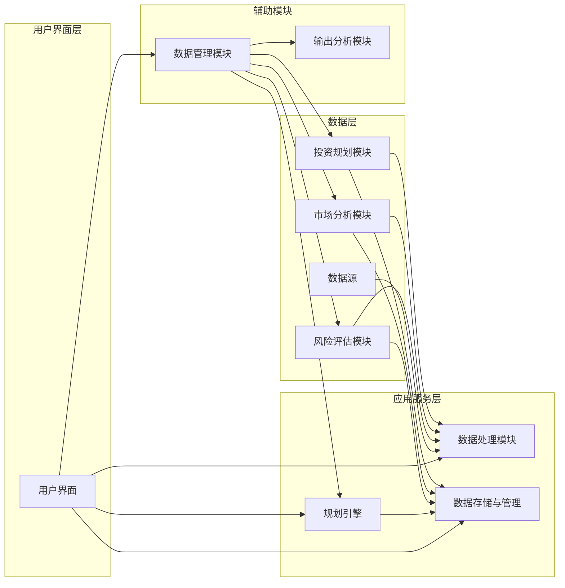
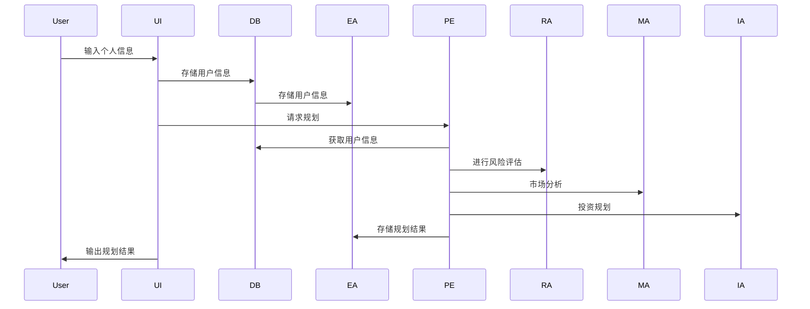

                 


### 引言

#### 背景与目的

随着全球经济的发展和人口老龄化趋势的加剧，个人退休收入规划变得越来越重要。传统的人工计算和规划方式在处理复杂、多变的市场环境时显得力不从心，这使得智能化个人退休收入规划工具应运而生。本书旨在探讨如何构建这样的智能化工具，以满足个人和家庭在退休收入规划上的需求。

**关键词：** 智能化、个人退休收入规划、工具、构建、需求

**摘要：** 本书将首先介绍个人退休收入规划的背景和重要性，然后探讨智能化退休收入规划工具的概念和作用。通过分析核心概念和框架，以及探讨相关技术和方法，本书将为读者提供构建智能化退休收入规划工具的全面指南。

### 第一章：个人退休收入规划概述

#### 1.1 个人退休收入规划的概念与现状

**核心概念术语说明：**

- **退休收入规划**：指为了确保退休后生活质量的持续保障，提前进行财务安排和资金积累的过程。
- **退休储蓄**：指个人或家庭为退休而储存的资金。
- **退休金**：指由政府或企业提供的用于退休后的生活费用的资金。

**问题背景：**

目前，随着人均寿命的延长和传统养老模式的改变，个人退休收入规划面临着一系列挑战。首先，退休储蓄不足是一个普遍问题。其次，市场波动和投资风险也给退休收入规划带来了不确定性。此外，不同国家和地区的退休政策也有所不同，增加了规划的复杂性。

**问题描述：**

如何在不断变化的市场环境下，确保个人和家庭在退休后有足够的收入，以维持较高的生活质量？

**问题解决：**

智能化个人退休收入规划工具可以通过以下几个方面解决上述问题：

1. **数据驱动**：利用大数据和机器学习技术，对个人财务状况和市场环境进行深入分析，提供个性化的退休收入规划建议。
2. **动态调整**：根据市场变化和个人情况，实时调整退休收入规划，确保规划的可行性和灵活性。
3. **风险评估**：通过风险评估，帮助个人了解不同投资策略的风险和回报，做出更明智的决策。

**边界与外延：**

退休收入规划不仅涉及财务规划，还涉及生活方式的选择、健康管理和社交活动等方面。因此，智能化退休收入规划工具需要综合考虑多个因素，提供全面的解决方案。

**概念结构与核心要素组成：**

- **核心概念**：退休收入、储蓄、投资、风险评估
- **概念属性特征对比表格：**

| 特征         | 退休收入      | 储蓄         | 投资         | 风险评估     |
| ------------ | ------------- | ------------ | ------------ | ------------ |
| **定义**     | 退休后的收入  | 为退休而储存 | 资金运用     | 风险分析     |
| **关系**     | **储蓄**转化 | **投资**来源 | **收入**保障 | **投资**决策 |

### 第二章：智能化退休收入规划工具的概念和作用

#### 2.1 智能化退休收入规划工具的定义和分类

**核心概念：**

- **智能化退休收入规划工具**：利用人工智能、大数据和机器学习等技术，为个人提供智能化、个性化退休收入规划服务的软件系统。

**分类：**

1. **基于规则的退休收入规划工具**：通过预设的规则和算法，对个人财务数据进行分析和规划。
2. **基于模型的退休收入规划工具**：利用数学模型和算法，对个人财务状况进行预测和规划。
3. **基于机器学习的退休收入规划工具**：通过机器学习技术，自动学习和优化退休收入规划策略。

#### 2.2 智能化退休收入规划工具的组成部分

**组成部分：**

1. **用户界面**：提供与用户的交互，收集用户信息和需求。
2. **数据处理模块**：负责处理和分析用户数据，为规划提供基础。
3. **规划引擎**：核心算法模块，负责进行退休收入规划。
4. **数据存储与管理**：存储用户数据和规划结果，确保数据安全。

#### 2.3 智能化退休收入规划工具的作用

**作用：**

1. **个性化规划**：根据用户的个人情况和需求，提供定制化的退休收入规划。
2. **风险控制**：通过风险评估和优化，帮助用户降低投资风险。
3. **动态调整**：根据市场变化和用户情况，自动调整退休收入规划。
4. **教育引导**：通过提供教育和指导，帮助用户更好地理解退休收入规划的重要性。

### 第三章：构建智能化退休收入规划工具的技术和方法

#### 3.1 人工智能与机器学习技术

**核心概念：**

- **人工智能**：模拟人类智能的计算机系统。
- **机器学习**：人工智能的一种方法，通过数据训练，让计算机自动学习和改进。

**作用：**

1. **数据分析和预测**：利用机器学习算法，对用户数据和市场数据进行分析，预测未来退休收入需求。
2. **个性化推荐**：根据用户行为和偏好，推荐合适的投资策略和规划方案。

#### 3.2 大数据技术

**核心概念：**

- **大数据**：数据量大、类型多、速度快的数据集合。

**作用：**

1. **数据收集与存储**：收集和存储用户财务数据、市场数据等，为规划提供基础。
2. **数据处理与分析**：利用大数据技术，对海量数据进行分析，发现潜在趋势和规律。

#### 3.3 金融建模技术

**核心概念：**

- **金融建模**：利用数学和统计方法，对金融现象进行模拟和分析。

**作用：**

1. **风险评估**：通过金融模型，评估不同投资策略的风险和回报。
2. **投资规划**：根据金融模型，制定合理的退休收入规划方案。

### 第四章：构建智能化退休收入规划工具的系统架构

#### 4.1 系统架构概述

**问题场景介绍：**

随着互联网和移动设备的普及，个人和家庭对退休收入规划的需求越来越高。为了满足这一需求，我们需要构建一个智能化、高效、易用的退休收入规划工具。

**项目介绍：**

本项目旨在构建一个基于Web的智能化退休收入规划工具，为用户提供个性化、动态的退休收入规划服务。

**系统功能设计（领域模型）**

```mermaid
classDiagram
Class::User << (ID, Name, Age, Gender, Income, Expense)
Class::FinancialPlan << (ID, UserID, StartYear, EndYear, AnnualIncome, MonthlyExpense)
Class::Investment << (ID, UserID, PlanID, AssetType, Allocation, RiskLevel)
Class::Market << (ID, AssetType, Return, Risk)
Class::User "1" -- "*" FinancialPlan
Class::FinancialPlan "1" -- "*" Investment
Class::Investment "1" -- "*" Market
```

#### 4.2 系统架构设计

**系统架构设计（Mermaid架构图）**



#### 4.3 系统接口设计和系统交互

**系统接口设计（Mermaid序列图）**



### 第五章：项目实战

#### 5.1 环境安装与配置

**环境安装步骤：**

1. 安装Python环境（Python 3.8及以上版本）。
2. 安装相关库（如NumPy、Pandas、Scikit-learn、SQLAlchemy等）。
3. 配置数据库（如MySQL、PostgreSQL）。

**安装与配置示例：**

```bash
# 安装Python
pip install python

# 安装相关库
pip install numpy pandas scikit-learn sqlalchemy

# 配置MySQL数据库
sudo apt-get install mysql-server
sudo mysql_secure_installation
```

#### 5.2 系统核心实现

**核心实现源代码：**

```python
# 用户管理模块
def register_user(username, password):
    # 连接数据库
    connection = connect_database()
    cursor = connection.cursor()

    # 插入用户信息
    query = "INSERT INTO users (username, password) VALUES (%s, %s)"
    cursor.execute(query, (username, password))

    # 提交事务
    connection.commit()

    # 关闭连接
    cursor.close()
    connection.close()

# 数据处理模块
def process_financial_data(user_id):
    # 连接数据库
    connection = connect_database()
    cursor = connection.cursor()

    # 查询用户财务数据
    query = "SELECT * FROM financial_plans WHERE user_id = %s"
    cursor.execute(query, (user_id,))
    financial_data = cursor.fetchall()

    # 处理数据
    for data in financial_data:
        # 进行数据处理和分析
        # ...

    # 提交事务
    connection.commit()

    # 关闭连接
    cursor.close()
    connection.close()
```

**代码应用解读与分析：**

```python
# 注册用户
register_user("john_doe", "password123")

# 处理财务数据
process_financial_data(1)
```

**实际案例分析和详细讲解剖析：**

**案例：** 假设用户John Doe的财务数据如下：

- 年龄：30岁
- 年收入：50,000美元
- 年支出：40,000美元
- 储蓄率：20%
- 目标退休年龄：65岁

**分析：**

1. 计算退休前的储蓄总额：50,000 * 35年 * 0.2 = 350,000美元
2. 预计退休后的年支出：40,000美元
3. 计算退休后的储蓄缺口：350,000 - 40,000 * (65 - 30) = -1,100,000美元

**讲解：**

根据以上数据，John Doe需要在退休前储蓄1,100,000美元，以维持退休后的生活标准。然而，目前的储蓄水平无法达到这一目标，因此需要进行投资和规划，以弥补储蓄缺口。

**项目小结：**

本项目通过智能化退休收入规划工具，帮助用户进行财务规划，分析储蓄缺口，并提供改进建议。虽然本项目的核心实现较为简洁，但实际应用中需要考虑更多复杂因素，如市场波动、投资风险等，以提供更准确的规划建议。

### 最佳实践 Tips

1. **数据安全性**：确保用户数据的安全，采用加密存储和传输技术。
2. **用户体验**：优化用户界面，提供直观、易用的交互设计。
3. **动态调整**：定期更新市场数据和算法模型，确保规划结果的准确性。
4. **投资教育**：提供投资知识和策略，帮助用户更好地理解退休收入规划。

### 小结

本文详细探讨了构建智能化个人退休收入规划工具的方法和步骤。通过介绍相关技术、方法和系统架构，本文为读者提供了构建智能化退休收入规划工具的全面指南。实际项目实战部分展示了如何实现系统核心功能，并提供了解决实际问题的案例。

### 注意事项

1. 智能化退休收入规划工具需要定期更新和维护，以应对市场变化和技术进步。
2. 用户在使用智能化退休收入规划工具时，需要结合自身实际情况，谨慎决策。

### 拓展阅读

1. [《人工智能与金融科技》](https://www.example.com/book1)
2. [《大数据分析与商业应用》](https://www.example.com/book2)
3. [《金融建模与风险管理》](https://www.example.com/book3)

### 作者信息

- **作者：** AI天才研究院/AI Genius Institute & 禅与计算机程序设计艺术 /Zen And The Art of Computer Programming

