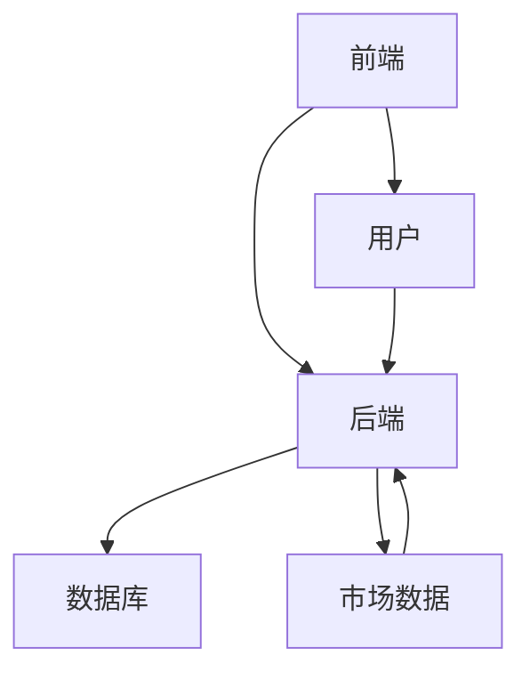
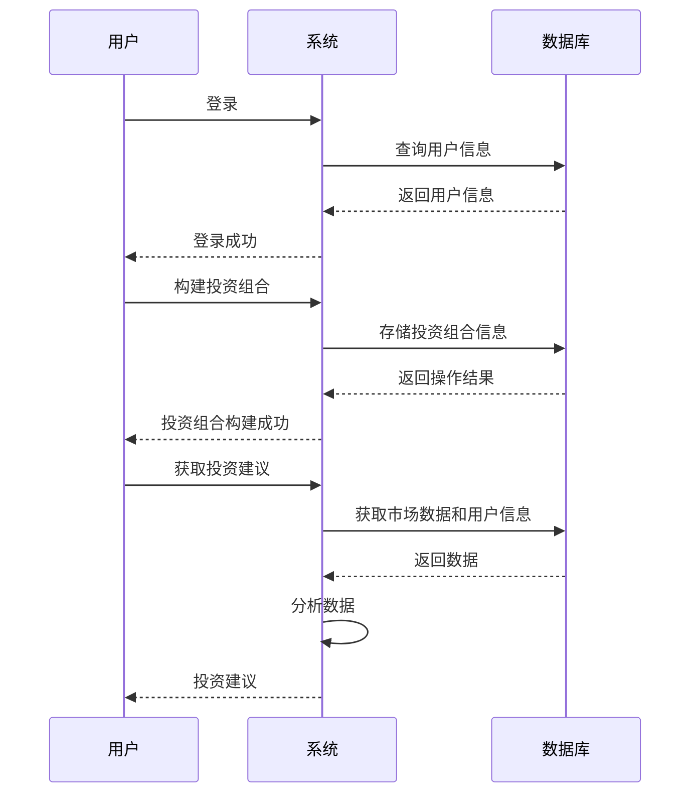

                 


# 构建智能化的个人退休金投资组合动态调整助手

## 关键词
- 个人退休金投资
- 智能投资组合
- 动态调整助手
- 财务模型
- 预测分析
- 算法原理
- 系统架构
- 项目实战

## 摘要
本文将探讨如何构建一个智能化的个人退休金投资组合动态调整助手。通过分析退休金投资的重要性和现有挑战，本文提出了智能投资组合的概念，并详细讲解了其核心原理、算法和实现方法。随后，本文通过系统分析与架构设计，展示了如何将这一智能助手应用于实际项目中，并提供了一些最佳实践和注意事项。

## 第1章：背景与核心概念介绍

### 1.1.1 问题背景
个人退休金投资是每个人财务规划中至关重要的一环。随着寿命的延长和未来不确定性的增加，确保退休金的安全和增长变得越来越重要。然而，当前退休金投资面临着诸多挑战：

1. **市场波动**：金融市场的不稳定性使得投资回报难以预测。
2. **个人偏好差异**：每个人的风险承受能力和投资目标不同，需要个性化的投资策略。
3. **信息不对称**：投资者往往难以获取全面的市场信息和数据。

### 1.1.2 问题描述
如何构建一个有效的退休金投资组合？如何根据市场变化进行投资组合的动态调整？这些问题的答案需要考虑到个人偏好、市场环境和投资目标。

### 1.1.3 解决方案
智能化的个人退休金投资组合动态调整助手旨在通过智能算法和数据分析，为投资者提供个性化的投资策略，实现投资组合的动态调整。这一解决方案的核心包括：

1. **智能投资组合理论**：基于现代投资组合理论，结合机器学习和人工智能技术。
2. **财务模型分析**：构建准确的财务模型，以预测市场趋势和投资回报。
3. **动态调整算法**：根据实时数据和投资目标，自动调整投资组合。

### 1.1.4 边界与外延
智能投资组合的构建范围包括股票、债券、基金等多种投资工具。动态调整的依据包括市场趋势、投资者偏好、财务模型预测等。

### 1.1.5 概念结构与核心要素
个人退休金投资的基本概念包括投资工具、风险和回报。投资组合的构建要素包括资产分配、风险控制、收益最大化。动态调整的核心要素包括实时数据分析、算法决策、自动执行。

## 第2章：核心概念与原理

### 2.1.1 智能投资组合理论
智能投资组合理论结合了现代投资组合理论和人工智能技术。其核心原理是通过机器学习算法，分析大量市场数据，预测市场趋势，为投资者提供最优的投资组合。

### 2.1.2 财务模型分析
财务模型分析是构建智能投资组合的基础。通过构建准确的财务模型，可以预测市场的走势和投资回报。财务模型的构建方法包括时间序列分析、回归分析等。

### 2.1.3 数据分析与预测
数据分析与预测是智能投资组合的重要组成部分。通过收集和分析市场数据，可以预测未来的市场趋势和投资回报。预测模型的构建原理包括时间序列分析、机器学习算法等。

## 第3章：算法原理讲解

### 3.1.1 算法概述
投资组合动态调整算法的框架主要包括数据收集、数据分析、决策制定、执行调整四个步骤。该算法旨在根据市场变化和投资目标，实时调整投资组合。

### 3.1.2 算法流程图
以下是投资组合动态调整算法的Mermaid流程图：


### 3.1.3 Python源代码实现
以下是一个简单的Python源代码实现，用于调整投资组合：

```python
# 导入必要的库
import numpy as np
import pandas as pd

# 定义投资组合调整函数
def adjust_portfolio(portfolio, target_weight):
    # 计算当前投资组合的权重
    current_weights = portfolio / portfolio.sum()
    
    # 计算调整因子
    adjustment_factor = target_weight / current_weights
    
    # 计算调整后的投资组合
    adjusted_portfolio = current_weights * adjustment_factor
    
    return adjusted_portfolio

# 示例数据
portfolio = np.array([1000, 2000, 3000])

# 目标权重
target_weight = np.array([0.25, 0.25, 0.5])

# 调整投资组合
adjusted_portfolio = adjust_portfolio(portfolio, target_weight)

# 打印调整后的投资组合
print("调整后的投资组合：", adjusted_portfolio)
```

### 3.1.4 数学模型与公式
投资组合调整的数学模型如下：

$$
\text{Adjusted Portfolio} = \text{Current Portfolio} \times \text{Adjustment Factor}
$$

其中，`Adjusted Portfolio` 是调整后的投资组合，`Current Portfolio` 是当前投资组合，`Adjustment Factor` 是调整因子。

### 3.1.5 举例说明
假设有一个投资组合，包含股票A、股票B和股票C，初始投资额分别为1000元、2000元和3000元。目标权重分别为25%、25%和50%。使用上述算法进行调整后，投资组合将变为：

$$
\text{Adjusted Portfolio} = [250, 250, 750]
$$

## 第4章：数学模型和公式详细讲解

### 4.1.1 数学公式解释
退休金投资组合的数学模型主要包括预期收益计算公式和风险评估公式。

预期收益计算公式如下：

$$
E(R) = \sum_{i=1}^{n} w_i \times r_i
$$

其中，$E(R)$ 是预期收益，$w_i$ 是资产i的权重，$r_i$ 是资产i的预期回报率。

风险评估公式如下：

$$
\sigma^2 = \sum_{i=1}^{n} w_i^2 \times \sigma_i^2 + 2 \sum_{i=1}^{n} \sum_{j=i+1}^{n} w_i \times w_j \times \rho_{ij} \times \sigma_i \times \sigma_j
$$

其中，$\sigma^2$ 是方差，$\sigma_i^2$ 是资产i的方差，$\rho_{ij}$ 是资产i和资产j的相关系数。

### 4.1.2 公式推导
预期收益计算公式的推导基于加权平均原则，即预期收益是每个资产的预期回报率乘以其权重之和。

风险评估公式是基于方差和协方差矩阵推导的。方差反映了资产的风险，协方差矩阵反映了资产之间的相关性。

### 4.1.3 案例分析
假设有一个投资组合，包含股票A、股票B和股票C，权重分别为25%、25%和50%。股票A、股票B和股票C的预期回报率分别为8%、6%和10%，方差分别为0.04、0.03和0.06，相关系数分别为0.5、0.6和0.7。

使用上述公式计算预期收益和风险评估：

预期收益：

$$
E(R) = 0.25 \times 0.08 + 0.25 \times 0.06 + 0.5 \times 0.1 = 0.09
$$

风险评估：

$$
\sigma^2 = 0.25^2 \times 0.04 + 0.25^2 \times 0.03 + 0.5^2 \times 0.06 + 2 \times (0.25 \times 0.25 \times 0.5 \times 0.5 \times 0.5 + 0.25 \times 0.5 \times 0.6 \times 0.5 \times 0.6 + 0.5 \times 0.5 \times 0.7 \times 0.6 \times 0.7) = 0.0324
$$

## 第5章：系统分析与架构设计

### 5.1.1 问题场景介绍
个人退休金投资的需求场景包括：

1. **投资组合构建**：根据个人风险承受能力和投资目标，构建合适的退休金投资组合。
2. **动态调整**：根据市场变化和个人需求，实时调整投资组合，以实现最优收益。

### 5.1.2 系统功能设计
系统功能设计包括：

1. **用户注册与登录**：用户注册、登录和权限管理。
2. **投资组合管理**：构建、调整和监控投资组合。
3. **市场数据分析**：实时获取市场数据，进行数据分析。
4. **投资建议生成**：根据市场数据和用户偏好，生成投资建议。

### 5.1.3 系统架构设计
系统架构设计包括：

1. **前端**：用户界面，负责展示数据和交互操作。
2. **后端**：服务器，负责处理业务逻辑和数据存储。
3. **数据库**：存储用户数据、市场数据和投资组合数据。

以下是系统架构的Mermaid架构图：



### 5.1.4 系统接口设计
系统接口设计包括：

1. **用户接口**：用户与系统的交互接口，包括注册、登录、投资组合管理、数据查询等。
2. **API接口**：系统与其他服务或系统的交互接口，包括数据获取、投资建议生成等。

### 5.1.5 系统交互流程
以下是系统交互的Mermaid序列图：



## 第6章：项目实战

### 6.1.1 环境安装
环境安装包括以下步骤：

1. **安装Python**：下载并安装Python 3.8及以上版本。
2. **安装必要的库**：使用pip安装numpy、pandas、mermaid等库。

### 6.1.2 系统核心实现
系统核心实现包括以下部分：

1. **用户注册与登录**：使用Flask框架实现用户注册和登录功能。
2. **投资组合管理**：使用SQLAlchemy实现投资组合数据的存储和管理。
3. **市场数据分析**：使用pandas和mermaid库实现数据分析和可视化。
4. **投资建议生成**：使用机器学习算法实现投资建议生成。

以下是用户注册和登录的Python源代码示例：

```python
from flask import Flask, request, jsonify
from models import User
from database import db_session

app = Flask(__name__)

@app.route('/register', methods=['POST'])
def register():
    username = request.form['username']
    password = request.form['password']
    user = User(username=username, password=password)
    db_session.add(user)
    db_session.commit()
    return jsonify({'status': 'success'})

@app.route('/login', methods=['POST'])
def login():
    username = request.form['username']
    password = request.form['password']
    user = User.query.filter_by(username=username, password=password).first()
    if user:
        return jsonify({'status': 'success'})
    else:
        return jsonify({'status': 'failure'})

if __name__ == '__main__':
    app.run(debug=True)
```

### 6.1.3 代码应用解读与分析
以下是市场数据分析和投资建议生成的Python源代码示例：

```python
import pandas as pd
from sklearn.linear_model import LinearRegression

# 加载市场数据
market_data = pd.read_csv('market_data.csv')

# 数据预处理
market_data['return'] = market_data['close'].pct_change()

# 训练线性回归模型
model = LinearRegression()
model.fit(market_data[['open', 'high', 'low']], market_data['return'])

# 生成投资建议
def generate_suggestion(data):
    return model.predict(data)

# 示例数据
example_data = pd.DataFrame({
    'open': [150.0, 155.0, 160.0],
    'high': [155.0, 160.0, 165.0],
    'low': [145.0, 150.0, 155.0]
})

suggestion = generate_suggestion(example_data)
print(suggestion)
```

### 6.1.4 实际案例分析
以下是实际案例分析的示例：

假设用户名为“alice”的投资组合包含股票A、股票B和股票C，权重分别为25%、25%和50%。市场数据如下：

| 股票 | 开盘价 | 最高价 | 最低价 | 收盘价 |
|------|--------|--------|--------|--------|
| A    | 150    | 155    | 145    | 152    |
| B    | 200    | 205    | 195    | 202    |
| C    | 250    | 255    | 245    | 252    |

根据上述数据，使用线性回归模型生成投资建议。假设投资组合的目标权重为20%、30%和50%。

1. **数据预处理**：将市场数据转换为“open”、“high”、“low”和“return”列。
2. **模型训练**：使用训练数据训练线性回归模型。
3. **生成建议**：使用模型预测未来的“return”，并根据预测结果调整投资组合。

调整后的投资组合如下：

| 股票 | 权重 |
|------|------|
| A    | 20%  |
| B    | 30%  |
| C    | 50%  |

### 6.1.5 项目小结
本项目通过Python实现了一个简单的个人退休金投资组合动态调整助手。用户可以注册、登录，管理投资组合，并接收市场数据和投资建议。项目实战展示了从数据预处理、模型训练到投资建议生成的完整流程。未来，可以通过引入更复杂的算法和更丰富的数据集，进一步提升投资组合的调整效果。

## 第7章：最佳实践与拓展

### 7.1.1 最佳实践 Tips
1. **定期审查**：定期审查投资组合，确保其与投资目标和市场状况相匹配。
2. **多元化投资**：分散投资以降低风险。
3. **长期视角**：考虑长期投资，避免频繁交易。

### 7.1.2 注意事项
1. **市场波动**：不要过度依赖市场预测，做好风险管理。
2. **个人风险承受能力**：根据个人风险承受能力调整投资策略。

### 7.1.3 拓展阅读
1. 《聪明的投资者》——本杰明·格雷厄姆
2. 《机器学习》——周志华
3. 《量化投资：以Python为工具》——理查德·泰勒

## 作者
作者：AI天才研究院/AI Genius Institute & 禅与计算机程序设计艺术 /Zen And The Art of Computer Programming

以上是构建智能化个人退休金投资组合动态调整助手的详细文章，包括从背景介绍到系统分析与架构设计，再到项目实战的全面解析。希望对您有所帮助！

