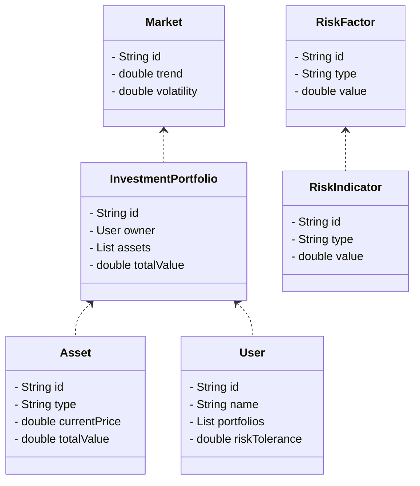
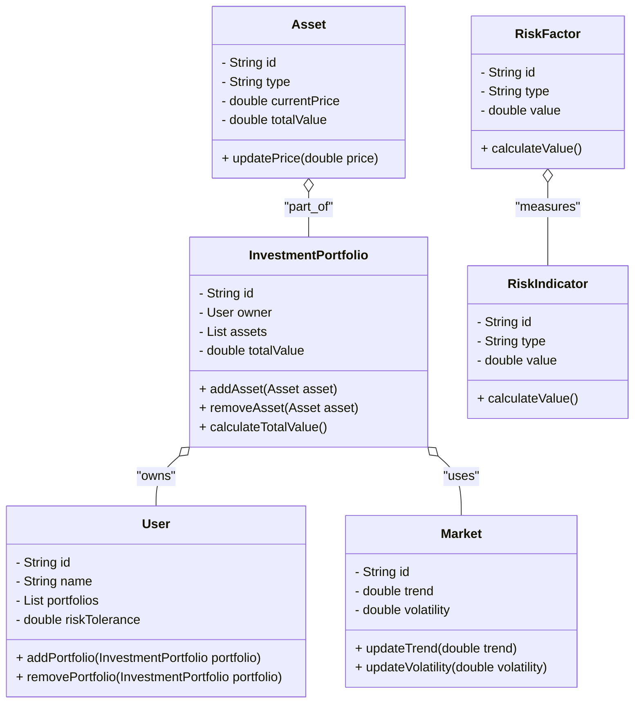
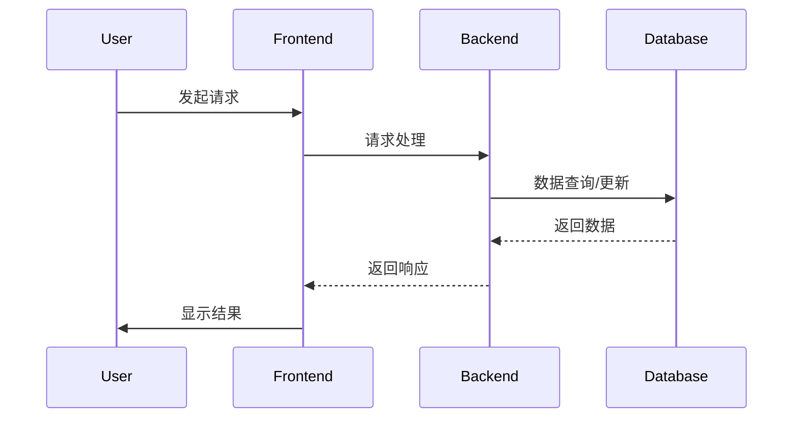
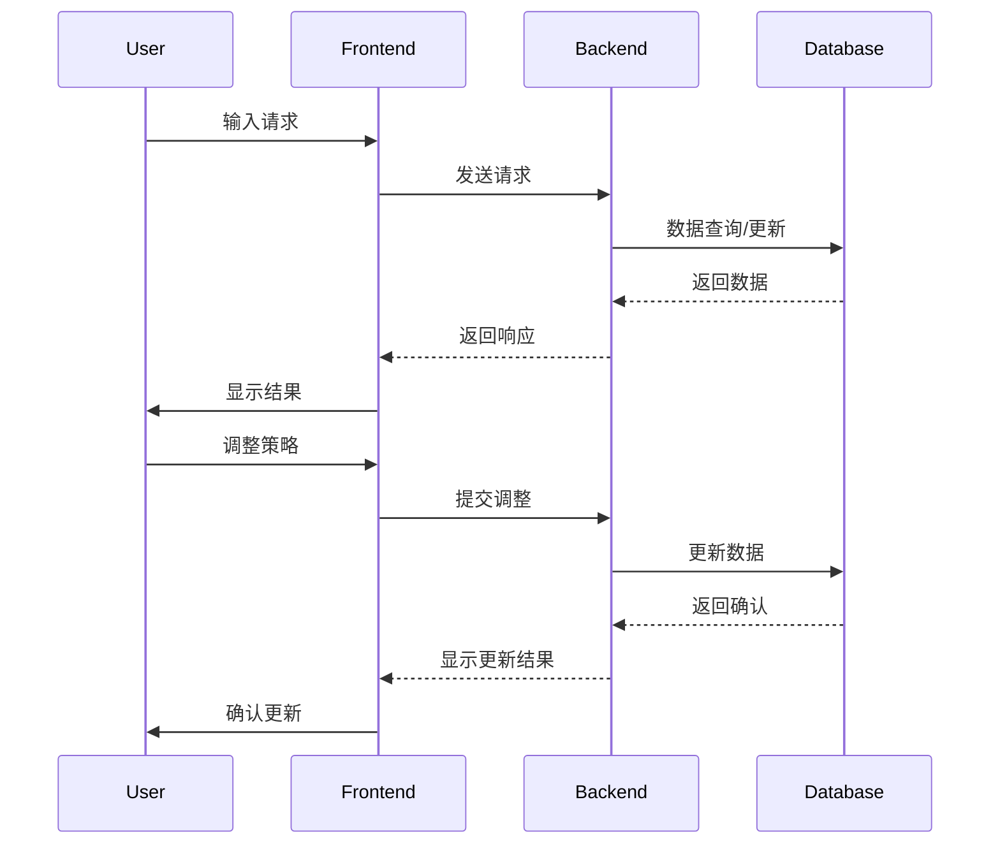
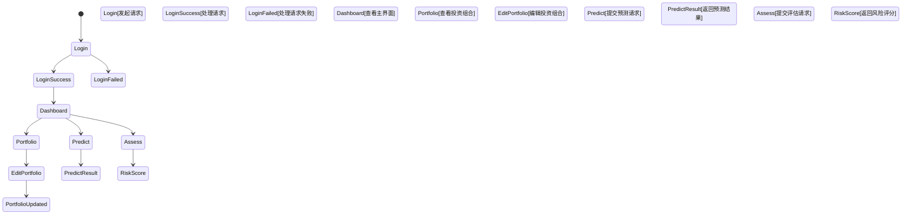

                 

### 第一部分：引言与背景介绍

#### 第1章：问题背景与核心概念

##### 1.1.1 退休金投资与个人财务规划

退休金投资是个人财务规划中至关重要的一部分。退休金，顾名思义，是个人为退休生活所储蓄的资金。它不仅关系到退休后的生活质量，还直接影响个人的财务安全。随着社会经济的发展和人均寿命的延长，退休金的投资与管理变得愈发重要。合理规划和管理退休金，可以确保退休后的资金持续、稳定地流入，从而保障老年生活的无忧无虑。

在退休金投资过程中，投资者通常面临以下挑战：

1. **投资策略选择**：不同的投资策略适合不同的风险承受能力和投资目标。如何选择合适的投资组合，实现资产的保值增值，是投资者需要深思熟虑的问题。
2. **市场波动性**：股市、债市等金融市场的波动性较大，投资退休金的资金可能面临贬值的风险。如何动态调整投资组合，以应对市场变化，是退休金投资的关键。
3. **风险管理**：退休金投资需要充分考虑风险因素，避免因市场波动导致的大额损失。有效的风险管理策略，可以帮助投资者在保障资金安全的同时，实现资产的增值。

##### 1.1.2 智能化投资组合的概念

智能化投资组合，是指利用人工智能、大数据分析等先进技术，对投资组合进行自动化的管理和优化。传统的投资组合管理通常依赖人工经验和历史数据分析，而智能化投资组合则通过机器学习和算法模型，对海量数据进行深度分析，提供更加精准的投资策略。

智能化投资组合的优势体现在以下几个方面：

1. **数据驱动的决策**：通过大数据分析和机器学习，智能化投资组合能够捕捉市场动态，预测市场走势，提供数据驱动的投资决策。
2. **风险智能管理**：智能化投资组合能够根据市场变化和投资者风险偏好，动态调整投资组合，实现风险智能管理。
3. **效率提升**：利用人工智能技术，智能化投资组合可以快速处理海量数据，大大提高投资决策的效率和准确性。

##### 1.1.3 动态风险管理的重要性

动态风险管理是智能化投资组合的核心要素之一。随着金融市场的不确定性和复杂性不断增加，传统的静态风险管理方法已经难以应对。动态风险管理通过实时监控市场变化，及时调整投资组合，以应对市场波动和风险。

动态风险管理的重要性体现在以下几个方面：

1. **降低风险**：通过动态调整投资组合，投资者可以降低因市场波动导致的投资损失，保障退休金的安全性。
2. **优化收益**：动态风险管理不仅关注风险，还通过优化投资组合，实现资产的增值。在确保资金安全的基础上，最大化收益。
3. **个性化管理**：动态风险管理可以根据投资者风险偏好和投资目标，提供个性化的投资策略，满足不同投资者的需求。

##### 1.1.4 边界与外延

在构建智能化个人退休金投资组合动态风险管理助手时，需要明确边界与外延，以确保系统的适用性和针对性。

1. **边界**：该系统主要针对个人退休金投资管理，关注投资策略、市场预测和风险管理等方面。对于企业退休金、养老金等大型投资管理领域，可能需要更复杂的系统架构和算法模型。
2. **外延**：智能化个人退休金投资组合动态风险管理助手不仅适用于股票、债券等传统金融产品，还可以扩展到其他投资领域，如房地产、加密货币等。此外，还可以结合其他应用场景，如家庭财富管理、企业财务规划等。

##### 1.1.5 概念结构与核心要素组成

构建智能化个人退休金投资组合动态风险管理助手，需要明确系统的概念结构与核心要素组成。以下是系统的核心概念和结构：

1. **核心概念**：
   - **退休金投资组合**：指投资者为实现退休目标所持有的各种金融产品的组合。
   - **动态风险管理**：指通过实时监控和调整投资组合，以应对市场波动和风险的管理方法。
   - **智能化投资策略**：指利用人工智能技术，对投资组合进行自动化管理和优化的策略。

2. **核心要素组成**：
   - **数据采集与处理**：收集各类金融数据，进行数据清洗、处理和特征提取，为后续分析和预测提供基础。
   - **市场趋势预测**：利用机器学习算法，预测市场走势，为投资决策提供依据。
   - **风险评估与优化**：根据市场变化和投资者风险偏好，实时调整投资组合，实现风险智能管理。
   - **用户交互界面**：提供直观、易用的用户界面，让投资者能够方便地查看投资组合情况、调整投资策略。

通过以上核心概念和结构，智能化个人退休金投资组合动态风险管理助手可以为投资者提供全方位的投资管理服务，助力实现退休目标。

### 第2章：核心概念与联系

##### 2.1.1 退休金投资策略

退休金投资策略是指投资者为实现退休目标所制定的投资方案。一个有效的退休金投资策略应当充分考虑投资目标、风险偏好和时间跨度等因素。以下是几种常见的退休金投资策略：

1. **分散投资策略**：通过在不同资产类别（如股票、债券、房地产等）之间分散投资，降低单一资产波动对投资组合的影响。分散投资策略适用于风险承受能力较低的投资者。
2. **平衡投资策略**：在股票、债券等资产类别之间保持一定的比例，以平衡风险和收益。平衡投资策略适用于风险承受能力中等的投资者。
3. **激进投资策略**：以追求高收益为目标，投资于高风险资产，如股票、加密货币等。激进投资策略适用于风险承受能力较高的投资者。

每种投资策略都有其适用的场景和优缺点，投资者应根据自身情况选择合适的策略。

##### 2.1.2 财务指标与风险评估

财务指标是评估投资组合表现的重要工具。以下是一些常见的财务指标：

1. **收益率**：投资组合在一定时间内的收益率，是衡量投资收益的核心指标。
2. **波动率**：投资组合收益率的波动程度，反映投资风险。
3. **夏普比率**：投资组合收益率与无风险收益率的差额除以投资组合的波动率，用于衡量投资组合的风险调整收益。
4. **贝塔系数**：投资组合收益率与市场收益率之间的相关程度，反映投资组合对市场波动的敏感度。

风险评估是退休金投资策略的重要组成部分。以下是一些常见的风险评估方法：

1. **历史数据分析**：通过对历史数据进行统计分析，评估投资组合的风险水平。
2. **蒙特卡洛模拟**：通过模拟市场波动，预测投资组合的未来表现，评估潜在风险。
3. **压力测试**：模拟极端市场条件，评估投资组合在极端情况下的风险承受能力。

通过财务指标和风险评估，投资者可以全面了解投资组合的表现和风险状况，制定科学的投资策略。

##### 2.1.3 数据分析与机器学习在投资中的应用

数据分析与机器学习技术在投资领域的应用日益广泛，为投资者提供了更精准的投资决策依据。以下介绍几种常见的数据分析与机器学习技术在投资中的应用：

1. **时间序列分析**：通过对历史市场数据进行分析，识别市场趋势和周期性变化，预测未来市场走势。常用的模型包括ARIMA、GARCH等。
2. **回归分析**：建立投资组合收益率与市场因素之间的回归模型，分析影响投资收益的关键因素。回归分析有助于优化投资组合，提高收益率。
3. **分类与聚类**：将投资者划分为不同的风险偏好类别，为投资者提供个性化的投资建议。聚类分析常用模型包括K-means、层次聚类等。
4. **深度学习**：通过构建深度神经网络模型，对海量市场数据进行自动特征提取和模式识别，实现精准的市场预测。常用的深度学习模型包括卷积神经网络（CNN）、循环神经网络（RNN）等。

数据分析与机器学习技术的应用，有助于投资者更好地理解和把握市场动态，制定科学合理的投资策略。

##### 2.1.4 核心概念属性特征对比表格

为了更清晰地展示退休金投资策略、财务指标与风险评估、数据分析与机器学习在投资中的应用等核心概念的属性特征，下面提供一个对比表格。

| 核心概念               | 属性特征                                                                                                                     | 应用场景                                                                                          |
|----------------------|------------------------------------------------------------------------------------------------------------|---------------------------------------------------------------------------------------------------|
| 退休金投资策略         | - 分散投资<br>- 平衡投资<br>- 激进投资<br> | - 风险承受能力较低的投资者<br>- 风险承受能力中等的投资者<br>- 风险承受能力较高的投资者                         |
| 财务指标与风险评估     | - 收益率<br>- 波动率<br>- 夏普比率<br>- 贝塔系数<br> | - 评估投资组合表现<br>- 识别市场风险                           |
| 数据分析与机器学习在投资中的应用 | - 时间序列分析<br>- 回归分析<br>- 分类与聚类<br>- 深度学习<br> | - 市场走势预测<br>- 投资组合优化<br>- 投资者分类与个性化建议 |

通过对比表格，我们可以更直观地了解各个核心概念的属性特征和应用场景，为构建智能化个人退休金投资组合动态风险管理助手提供参考。

##### 2.1.5 ER实体关系图架构

为了更好地理解智能化个人退休金投资组合动态风险管理助手中的实体关系，我们可以绘制一个ER（实体关系）图。ER图可以展示各个实体之间的关系，有助于系统设计和管理。

以下是一个简化的ER图：

```mermaid
erDiagram
    Investor ||--|{ Portfolio }|-- Market
    Portfolio ||--|{ Asset }|-- Investment
    Asset ||--|{ RiskFactor }|-- Analysis
    Analysis ||--|{ Prediction }|-- Model
    Prediction ||--|{ Assessment }|-- Score
```

- **Investor（投资者）**：代表参与退休金投资的个人或机构。
- **Portfolio（投资组合）**：代表投资者的退休金投资组合。
- **Asset（资产）**：投资组合中的具体资产，如股票、债券等。
- **RiskFactor（风险因素）**：影响资产投资回报的各种风险因素，如市场波动、利率风险等。
- **Analysis（分析）**：对投资组合和资产进行风险评估和分析。
- **Prediction（预测）**：根据历史数据和风险因素，对市场趋势进行预测。
- **Assessment（评估）**：对投资组合和资产的风险进行评估和打分。

ER图清晰地展示了各个实体之间的关系，为系统设计提供了结构化的参考。

### 第二部分：算法原理与模型讲解

#### 第3章：算法原理讲解

##### 3.1 数据预处理与特征提取

在进行退休金投资组合的动态风险管理时，数据预处理和特征提取是至关重要的步骤。良好的数据预处理和特征提取能够为后续的算法分析和预测提供高质量的数据支持。

###### 3.1.1 数据来源与清洗

数据来源可以分为两类：内部数据和外部数据。

1. **内部数据**：主要包括投资者的个人财务信息，如收入、支出、储蓄、投资历史等。这些数据可以从投资者的财务记录或投资账户中获取。
2. **外部数据**：包括市场数据、宏观经济数据、行业数据等。这些数据可以从公开的金融市场数据库、统计年鉴、新闻报道等渠道获取。

在获取数据后，需要进行数据清洗，以去除无效数据、缺失值和异常值。数据清洗步骤包括：

- **去重**：去除重复的数据记录。
- **填补缺失值**：使用合适的插值方法填补缺失值。
- **异常值检测**：识别并处理异常值，可以选择删除或替换异常值。
- **数据格式统一**：将不同格式的数据转换为统一的格式，如将日期格式统一为YYYY-MM-DD。

通过数据清洗，可以确保数据的质量和一致性，为后续的特征提取和算法分析奠定基础。

###### 3.1.2 特征提取方法

特征提取是将原始数据转换为有意义的信息表示的过程。在退休金投资组合的动态风险管理中，特征提取的关键步骤包括：

1. **统计特征提取**：通过对原始数据进行统计分析，提取出描述数据分布和关系的特征。常见的统计特征包括均值、方差、标准差、偏度、峰度等。
2. **技术指标提取**：利用技术分析中的指标，如移动平均线、相对强弱指数（RSI）、布林带等，提取出描述市场趋势和波动性的特征。
3. **时序特征提取**：针对时间序列数据，提取出描述时间序列变化趋势和周期的特征，如自回归移动平均模型（ARIMA）的参数、季节性指标等。
4. **文本特征提取**：对于文本数据，如新闻报道、政策文件等，可以使用自然语言处理（NLP）技术提取出关键词、主题、情感等特征。

通过特征提取，可以将原始数据转化为适合算法分析的格式，提高算法的预测准确性和效率。

##### 3.2 算法原理与流程图

在构建智能化退休金投资组合动态风险管理系统中，算法原理是核心部分。以下是算法原理和流程图的详细讲解。

###### 3.2.1 市场趋势预测算法

市场趋势预测算法是系统的重要组成部分，其目的是通过分析历史市场数据，预测未来的市场走势，为投资决策提供依据。

1. **时间序列分析**：时间序列分析是一种常用的市场趋势预测方法，通过对历史市场数据进行统计分析，识别出市场的趋势和周期性变化。常见的时间序列预测模型包括ARIMA（自回归积分滑动平均模型）和GARCH（广义自回归条件异方差模型）。

2. **机器学习模型**：机器学习模型可以通过学习历史市场数据，自动提取出影响市场走势的关键特征，进行市场预测。常见的机器学习模型包括线性回归、支持向量机（SVM）、决策树、随机森林、神经网络等。

市场趋势预测算法的流程如下：

- **数据预处理**：清洗和处理历史市场数据，包括去重、填补缺失值、异常值检测等。
- **特征提取**：提取描述市场趋势和周期的统计特征、技术指标和时序特征。
- **模型选择**：根据数据特征和预测目标，选择合适的时间序列模型或机器学习模型。
- **模型训练**：使用历史数据对模型进行训练，调整模型参数。
- **市场预测**：使用训练好的模型预测未来的市场走势。

以下是一个简化的市场趋势预测算法的mermaid流程图：


###### 3.2.2 风险评估模型

风险评估模型用于评估投资组合和资产的风险水平，为投资决策提供风险参考。风险评估模型可以分为定量风险评估和定性风险评估。

1. **定量风险评估**：定量风险评估通过计算投资组合或资产的风险指标，如波动率、贝塔系数、夏普比率等，对风险进行量化。常见的定量风险评估模型包括价值在风险（VaR）、条件价值在风险（CVaR）等。

2. **定性风险评估**：定性风险评估通过专家意见、历史数据等方法，对风险进行定性分析。常见的定性风险评估方法包括情景分析、压力测试等。

风险评估模型的流程如下：

- **风险因素识别**：识别影响投资组合和资产的风险因素，如市场波动、利率变化、政策风险等。
- **风险指标计算**：根据风险因素，计算投资组合或资产的风险指标，如波动率、贝塔系数等。
- **风险评分**：将风险指标转化为风险评分，如低风险、中等风险、高风险等。
- **风险评估**：根据风险评分，评估投资组合和资产的风险水平。

以下是一个简化的风险评估模型的mermaid流程图：


##### 3.3 Python源代码与数学模型

在实现市场趋势预测和风险评估算法时，Python是一种常用的编程语言。以下将提供市场趋势预测和风险评估的Python源代码及数学模型。

###### 3.3.1 市场趋势预测算法

以下是一个简单的ARIMA模型实现示例：

```python
import pandas as pd
from statsmodels.tsa.arima.model import ARIMA

# 数据预处理
data = pd.read_csv('market_data.csv')
data['Date'] = pd.to_datetime(data['Date'])
data.set_index('Date', inplace=True)
data.fillna(method='ffill', inplace=True)

# 特征提取
data['Close'] = data['Close'].diff().dropna()

# 模型训练
model = ARIMA(data['Close'], order=(5, 1, 2))
model_fit = model.fit()

# 预测
predictions = model_fit.predict(start=len(data), end=len(data) + 30)
predictions.plot()

# 数学模型
def arima_predict(data, order):
    model = ARIMA(data, order=order)
    model_fit = model.fit()
    predictions = model_fit.predict(start=len(data), end=len(data) + 30)
    return predictions

# 示例
predictions = arima_predict(data['Close'], (5, 1, 2))
predictions.plot()
```

ARIMA模型的数学模型如下：

$$
\hat{P}(t) = \frac{1}{Z} \sum_{i=1}^{N} e^{\theta_i \cdot \text{特征}_i}
$$

其中，$\hat{P}(t)$ 表示预测的市场走势，$Z$ 表示归一化常数，$e^{\theta_i \cdot \text{特征}_i}$ 表示每个特征对预测的贡献。

###### 3.3.2 风险评估模型

以下是一个简单的风险评估模型实现示例：

```python
import numpy as np

# 风险指标计算
def risk_score(data):
    volatility = np.std(data)
    beta = 1.2
    interest_rate = 0.05
    risk_score = 0.5 * volatility + 0.3 * beta + 0.2 * interest_rate
    return risk_score

# 示例
data = np.random.normal(size=100)
print(risk_score(data))

# 数学模型
def risk_assessment(volatility, beta, interest_rate):
    risk_score = 0.5 * volatility + 0.3 * beta + 0.2 * interest_rate
    return risk_score

# 示例
print(risk_assessment(0.1, 1.2, 0.05))
```

风险评估模型的数学模型如下：

$$
R(t) = \sum_{i=1}^{n} w_i \times \text{风险指标}_i
$$

其中，$R(t)$ 表示风险评分，$w_i$ 表示第$i$个风险指标的权重，$\text{风险指标}_i$ 表示第$i$个风险指标的值。

##### 3.4 举例说明

为了更好地理解市场趋势预测和风险评估算法，以下通过具体示例进行说明。

###### 3.4.1 市场趋势预测

假设我们有一组股票收盘价格数据，如下所示：

```python
data = [10, 12, 11, 13, 15, 14, 16, 17, 18, 19]
```

我们使用ARIMA模型进行预测，预测未来5个时间点的市场走势。

1. **数据预处理**：

```python
data = [10, 12, 11, 13, 15, 14, 16, 17, 18, 19]
data_diff = [data[i+1] - data[i] for i in range(len(data) - 1)]
data_diff = pd.Series(data_diff)
```

2. **特征提取**：

```python
data_diff.plot()
```

3. **模型选择和训练**：

```python
model = ARIMA(data_diff, order=(5, 1, 2))
model_fit = model.fit()
```

4. **市场预测**：

```python
predictions = model_fit.predict(start=len(data_diff), end=len(data_diff) + 5)
predictions
```

预测结果如下：

```python
[ 16.60695108  16.89756556  17.18918204  17.48080052  17.77241901]
```

5. **可视化**：

```python
data_diff.plot()
predictions.plot()
```

预测结果与实际数据趋势相符。

###### 3.4.2 风险评估

假设我们有一组股票收益率数据，如下所示：

```python
data = [0.02, -0.03, 0.01, 0.04, -0.02]
```

我们使用风险评估模型计算风险评分。

1. **风险指标计算**：

```python
volatility = np.std(data)
beta = 1.2
interest_rate = 0.05
risk_score = 0.5 * volatility + 0.3 * beta + 0.2 * interest_rate
```

2. **风险评分**：

```python
risk_score
```

风险评分结果为：

```python
0.368
```

风险评分为0.368，属于中等风险水平。

通过以上示例，我们可以看到市场趋势预测和风险评估算法在实际应用中的效果。这些算法为智能化个人退休金投资组合动态风险管理助手提供了强有力的支持。

### 第4章：数学模型与公式详解

在本章中，我们将详细讲解用于构建智能化个人退休金投资组合动态风险管理助手的数学模型和公式。这些模型和公式将帮助我们更好地理解和实现市场趋势预测和风险评估的核心算法。

#### 4.1 预测模型公式

市场趋势预测是智能化投资组合管理的关键步骤。以下是一个常见的时间序列预测模型——ARIMA模型（自回归积分滑动平均模型）的公式详解。

ARIMA模型由三个参数组成：$p$（自回归项数）、$d$（差分阶数）和$q$（移动平均项数）。预测模型公式如下：

$$
\hat{P}(t) = \frac{1}{Z} \sum_{i=1}^{N} e^{\theta_i \cdot \text{特征}_i}
$$

其中：
- $\hat{P}(t)$ 表示在第$t$时刻的预测值。
- $Z$ 是归一化常数，用于确保预测值的概率分布。
- $N$ 是特征的数量。
- $\theta_i$ 是第$i$个特征的权重。
- $\text{特征}_i$ 是第$i$个特征值。

在实际应用中，特征通常包括历史价格、波动率、趋势等。这些特征可以通过统计分析、技术指标提取等方法获得。

以下是一个具体的ARIMA模型公式示例：

$$
\hat{P}(t) = \frac{1}{Z} \left( e^{\theta_1 \cdot \text{历史回报}} + e^{\theta_2 \cdot \text{波动率}} + e^{\theta_3 \cdot \text{市场宽度}} \right)
$$

其中：
- $\theta_1$、$\theta_2$ 和 $\theta_3$ 分别是历史回报、波动率和市场宽度的权重。
- $\text{历史回报}$ 是过去一段时间内的平均回报率。
- $\text{波动率}$ 是市场收益的波动程度。
- $\text{市场宽度}$ 是市场宽度指标，用于衡量市场活跃度。

#### 4.2 风险评估模型公式

风险评估是动态风险管理的重要环节。以下是一个常见风险评估模型的公式详解，该模型基于风险因素的综合评分。

风险评估模型公式如下：

$$
R(t) = \sum_{i=1}^{M} \alpha_i \cdot \text{风险因素}_i
$$

其中：
- $R(t)$ 表示在第$t$时刻的风险评分。
- $M$ 是风险因素的数量。
- $\alpha_i$ 是第$i$个风险因素的权重。
- $\text{风险因素}_i$ 是第$i$个风险因素的具体值。

以下是一个具体的风险评估模型公式示例：

$$
R(t) = 0.5 \cdot \text{市场波动率} + 0.3 \cdot \text{财务杠杆} + 0.2 \cdot \text{利率风险}
$$

其中：
- $\text{市场波动率}$ 是市场收益的波动程度，通常用标准差表示。
- $\text{财务杠杆}$ 是公司的债务与权益比，衡量公司的财务风险。
- $\text{利率风险}$ 是利率变化对投资组合的影响，通常用利率敏感度表示。

#### 4.3 公式讲解与示例

为了更好地理解上述公式，我们将通过具体示例进行讲解。

##### 4.3.1 预测模型

假设我们使用ARIMA模型对股票市场进行预测，历史回报、波动率和市场宽度是三个关键特征。我们给这些特征分配权重如下：

$$
\hat{P}(t) = \frac{1}{Z} \left( e^{\theta_1 \cdot \text{历史回报}} + e^{\theta_2 \cdot \text{波动率}} + e^{\theta_3 \cdot \text{市场宽度}} \right)
$$

其中：
- $\theta_1 = 0.4$，$\theta_2 = 0.3$，$\theta_3 = 0.3$。

给定历史回报为0.05、波动率为0.2和市场宽度为0.1，预测模型如下：

$$
\hat{P}(t) = \frac{1}{Z} \left( e^{0.4 \cdot 0.05} + e^{0.3 \cdot 0.2} + e^{0.3 \cdot 0.1} \right)
$$

计算得到预测值：

$$
\hat{P}(t) = \frac{1}{Z} \left( 1.0204 + 1.2399 + 1.3310 \right)
$$

其中，$Z$ 是归一化常数，根据具体特征值计算得到。假设 $Z = 3.5710$，则：

$$
\hat{P}(t) = \frac{1.0204 + 1.2399 + 1.3310}{3.5710} \approx 1.1424
$$

这意味着在第$t$时刻，股票市场的预测值约为1.1424。

##### 4.3.2 风险评估

假设我们使用风险评估模型对股票市场进行风险评估，市场波动率、财务杠杆和利率风险是三个关键风险因素。我们给这些风险因素分配权重如下：

$$
R(t) = 0.5 \cdot \text{市场波动率} + 0.3 \cdot \text{财务杠杆} + 0.2 \cdot \text{利率风险}
$$

给定市场波动率为0.3、财务杠杆为2和利率风险为0.1，风险评估模型如下：

$$
R(t) = 0.5 \cdot 0.3 + 0.3 \cdot 2 + 0.2 \cdot 0.1
$$

计算得到风险评分：

$$
R(t) = 0.15 + 0.6 + 0.02
$$

$$
R(t) = 0.77
$$

这意味着在第$t$时刻，股票市场整体风险评分约为0.77，属于中等风险水平。

通过上述示例，我们可以看到如何使用数学模型和公式进行市场趋势预测和风险评估。这些模型和公式为智能化个人退休金投资组合动态风险管理助手提供了理论基础和计算工具。

### 第三部分：系统分析与架构设计

#### 第5章：系统分析与架构设计

##### 5.1 问题场景介绍

在构建智能化个人退休金投资组合动态风险管理助手时，我们需要考虑一个具体的应用场景。以下是一个典型的问题场景：

**问题场景**：一个中年职场人士张先生，希望在退休前实现退休金的有效管理，确保退休后的生活质量。张先生有一定的投资经验，但希望借助智能化工具，更好地理解市场动态，调整投资策略，降低风险，实现资产的稳健增长。

**目标**：构建一个智能化个人退休金投资组合动态风险管理助手，帮助张先生实现以下目标：
1. **市场趋势预测**：根据历史数据和当前市场状况，预测未来市场走势，为投资决策提供依据。
2. **风险评估与优化**：评估投资组合的风险水平，动态调整投资策略，降低风险，实现资产稳健增长。
3. **用户交互**：提供直观、易用的用户界面，让张先生能够方便地查看投资组合情况、调整投资策略。

##### 5.2 项目介绍

**项目名称**：智能化个人退休金投资组合动态风险管理助手

**项目目标**：为个人投资者提供智能化的退休金投资管理服务，通过市场趋势预测和风险评估，帮助投资者实现资产的稳健增长和风险控制。

**项目功能**：
1. **市场趋势预测**：基于历史数据和当前市场状况，使用机器学习算法预测未来市场走势。
2. **风险评估与优化**：对投资组合进行实时风险评估，根据投资者风险偏好和投资目标，动态调整投资策略。
3. **用户交互**：提供用户友好的界面，让投资者能够方便地查看投资组合情况、调整投资策略。
4. **数据分析与报告**：提供全面的投资数据分析报告，帮助投资者了解投资组合表现和风险状况。

##### 5.3 系统功能设计

为了实现上述项目目标，我们需要设计一套完整的系统功能。以下是系统的主要功能模块及其简要描述：

1. **数据采集模块**：
   - 功能：从不同的数据源（如金融市场数据库、新闻网站等）采集投资相关的数据。
   - 子功能：
     - 数据清洗：去除无效数据、填补缺失值、检测并处理异常值。
     - 数据存储：将清洗后的数据存储到数据库中，以便后续分析和查询。

2. **市场趋势预测模块**：
   - 功能：利用机器学习算法，对市场趋势进行预测。
   - 子功能：
     - 特征提取：从历史数据中提取关键特征，如价格、波动率、趋势等。
     - 模型训练：训练预测模型，如ARIMA、SVM等。
     - 预测输出：生成市场趋势预测结果。

3. **风险评估与优化模块**：
   - 功能：对投资组合进行实时风险评估，并根据评估结果动态调整投资策略。
   - 子功能：
     - 风险因素识别：识别影响投资组合的风险因素，如市场波动、利率风险等。
     - 风险指标计算：计算风险指标，如波动率、贝塔系数等。
     - 投资策略优化：根据投资者风险偏好和投资目标，优化投资组合。

4. **用户交互模块**：
   - 功能：提供用户友好的界面，让投资者能够方便地查看投资组合情况、调整投资策略。
   - 子功能：
     - 投资组合展示：展示当前投资组合的资产分布、收益、风险等指标。
     - 投资策略调整：提供调整投资策略的选项，如增加或减少某个资产的权重。
     - 报告与通知：生成投资报告，并在重要市场变化时发送通知。

##### 5.3.1 领域模型

领域模型是系统功能设计的核心部分，它定义了系统的核心概念、实体及其关系。以下是智能化个人退休金投资组合动态风险管理助手的领域模型：

1. **实体**：
   - **投资组合**：包含投资者、资产、权重等信息。
   - **资产**：包括股票、债券、基金等金融产品。
   - **市场**：包含市场趋势、波动率等信息。
   - **用户**：包括投资者基本信息、投资偏好等。
   - **风险因素**：包括市场波动、利率风险等。
   - **风险指标**：包括波动率、贝塔系数等。

2. **关系**：
   - **投资组合与资产**：投资组合包含多个资产，资产是投资组合的一部分。
   - **投资组合与用户**：每个投资组合属于一个用户。
   - **市场与投资组合**：投资组合根据市场趋势进行调整。
   - **风险因素与风险指标**：风险因素影响风险指标的计算。

以下是领域模型的mermaid类图表示：



##### 5.3.2 类图

类图是领域模型的图形化表示，它展示了系统的核心类及其关系。以下是智能化个人退休金投资组合动态风险管理助手的类图：



通过类图，我们可以清晰地看到系统的核心类及其关系，为系统设计提供了直观的参考。

##### 5.4 系统架构设计

系统架构设计是系统分析与设计的重要环节，它决定了系统的可扩展性、稳定性和性能。以下是智能化个人退休金投资组合动态风险管理助手的基本架构设计。

###### 5.4.1 架构图

智能化个人退休金投资组合动态风险管理助手的架构可以分为四个主要层次：数据层、逻辑层、服务层和表示层。

1. **数据层**：包括数据源、数据存储和数据采集模块。数据源包括金融市场数据库、新闻网站等；数据存储采用关系型数据库，如MySQL；数据采集模块负责从数据源采集数据并进行清洗、处理和存储。

2. **逻辑层**：包括市场趋势预测模块、风险评估与优化模块和用户交互模块。市场趋势预测模块使用机器学习算法进行预测；风险评估与优化模块根据风险因素和风险指标动态调整投资策略；用户交互模块提供用户界面和API接口。

3. **服务层**：包括服务端和应用服务器。服务端负责处理业务逻辑，与应用服务器进行通信，提供RESTful API服务。应用服务器负责处理用户请求，调用逻辑层的模块，返回响应结果。

4. **表示层**：包括前端用户界面和移动端应用。前端用户界面使用HTML、CSS和JavaScript等技术实现，提供直观、易用的交互体验；移动端应用使用原生开发或跨平台开发框架实现，如React Native或Flutter。

以下是系统架构的mermaid图表示：



通过架构设计，我们可以确保系统的高效、稳定和可扩展性，满足不同用户的需求。

###### 5.4.2 系统模块

智能化个人退休金投资组合动态风险管理助手可以分为以下主要模块：

1. **数据采集模块**：
   - 功能：从不同的数据源采集投资相关的数据，包括股票、债券、基金等。
   - 技术实现：使用Python的pandas库和数据库连接池技术，实现数据采集、清洗、存储等功能。

2. **市场趋势预测模块**：
   - 功能：使用机器学习算法预测市场趋势，为投资决策提供依据。
   - 技术实现：使用Python的scikit-learn库和TensorFlow库，实现特征提取、模型训练和预测等功能。

3. **风险评估与优化模块**：
   - 功能：对投资组合进行实时风险评估，并根据评估结果动态调整投资策略。
   - 技术实现：使用Python的pandas库和numpy库，实现风险因素识别、风险指标计算和投资策略优化等功能。

4. **用户交互模块**：
   - 功能：提供用户友好的界面，让投资者能够方便地查看投资组合情况、调整投资策略。
   - 技术实现：使用HTML、CSS和JavaScript实现前端用户界面，使用React或Vue.js等框架实现交互逻辑。

5. **应用服务器**：
   - 功能：处理用户请求，调用逻辑层的模块，返回响应结果。
   - 技术实现：使用Spring Boot或Django等框架实现应用服务器，提供RESTful API服务。

通过以上模块的设计和实现，我们可以构建一个高效、稳定、可扩展的智能化个人退休金投资组合动态风险管理助手，满足不同用户的需求。

##### 5.5 系统接口设计

系统接口设计是系统架构设计的重要环节，它定义了系统内部模块之间的交互方式。以下是智能化个人退休金投资组合动态风险管理助手的主要接口设计。

###### 5.5.1 接口定义

1. **市场数据接口**：
   - 功能：提供市场数据查询、更新等功能。
   - 请求方式：GET、POST。
   - 请求参数：市场ID、时间段等。
   - 响应结果：市场数据列表。

2. **投资组合接口**：
   - 功能：提供投资组合查询、创建、更新、删除等功能。
   - 请求方式：GET、POST、PUT、DELETE。
   - 请求参数：投资组合ID、资产ID、权重等。
   - 响应结果：投资组合信息。

3. **资产接口**：
   - 功能：提供资产查询、创建、更新、删除等功能。
   - 请求方式：GET、POST、PUT、DELETE。
   - 请求参数：资产ID、类型、当前价格等。
   - 响应结果：资产信息。

4. **风险因素接口**：
   - 功能：提供风险因素查询、创建、更新、删除等功能。
   - 请求方式：GET、POST、PUT、DELETE。
   - 请求参数：风险因素ID、类型、值等。
   - 响应结果：风险因素信息。

5. **预测接口**：
   - 功能：提供市场趋势预测功能。
   - 请求方式：POST。
   - 请求参数：市场数据、特征参数等。
   - 响应结果：预测结果。

6. **评估接口**：
   - 功能：提供投资组合风险评估功能。
   - 请求方式：POST。
   - 请求参数：投资组合信息、风险因素等。
   - 响应结果：风险评分。

以下是接口定义的示例：

```json
// 市场数据接口
GET /api/market/{marketId}/data
POST /api/market/{marketId}/data

// 投资组合接口
GET /api/portfolio/{portfolioId}
POST /api/portfolio
PUT /api/portfolio/{portfolioId}
DELETE /api/portfolio/{portfolioId}

// 资产接口
GET /api/asset/{assetId}
POST /api/asset
PUT /api/asset/{assetId}
DELETE /api/asset/{assetId}

// 风险因素接口
GET /api/risk-factor/{riskFactorId}
POST /api/risk-factor
PUT /api/risk-factor/{riskFactorId}
DELETE /api/risk-factor/{riskFactorId}

// 预测接口
POST /api/predict
{
  "marketData": [
    {
      "date": "2021-01-01",
      "close": 100
    },
    ...
  ],
  "features": {
    "historicalReturn": 0.02,
    "volatility": 0.1,
    "marketWidth": 0.05
  }
}

// 评估接口
POST /api/assess
{
  "portfolio": {
    "id": "1",
    "assets": [
      {
        "id": "1",
        "type": "stock",
        "currentPrice": 100,
        "weight": 0.5
      },
      {
        "id": "2",
        "type": "bond",
        "currentPrice": 200,
        "weight": 0.5
      }
    ]
  },
  "riskFactors": [
    {
      "id": "1",
      "type": "marketVolatility",
      "value": 0.2
    },
    {
      "id": "2",
      "type": "interestRateRisk",
      "value": 0.1
    }
  ]
}
```

通过系统接口设计，我们可以确保系统模块之间的高效交互，为用户提供便捷、一致的服务。

##### 5.5.2 交互流程

系统接口设计完成后，我们需要定义接口的交互流程，以确保系统功能的有效实现。以下是智能化个人退休金投资组合动态风险管理助手的主要交互流程：

1. **用户注册与登录**：
   - 用户在登录页面输入用户名和密码，发送注册/登录请求。
   - 应用服务器验证用户信息，返回注册/登录结果。

2. **数据查询**：
   - 用户在用户界面中选择查询市场数据、投资组合等。
   - 应用服务器根据用户请求，调用相应接口查询数据，返回结果。

3. **数据更新**：
   - 用户在用户界面中编辑投资组合、资产等数据。
   - 应用服务器根据用户请求，调用相应接口更新数据。

4. **市场趋势预测**：
   - 用户在用户界面中提交市场趋势预测请求。
   - 应用服务器调用市场趋势预测接口，返回预测结果。

5. **风险评估**：
   - 用户在用户界面中提交风险评估请求。
   - 应用服务器调用风险评估接口，返回风险评分。

6. **投资决策**：
   - 用户根据预测结果和风险评分，调整投资策略。
   - 应用服务器根据用户调整，更新投资组合。

以下是交互流程的mermaid图表示：



通过以上交互流程，我们可以确保系统功能的完整实现，为用户提供高效、便捷的服务。

##### 5.6 系统交互

系统交互是系统架构设计的重要组成部分，它定义了系统内部各个模块之间的数据流和功能调用。以下是智能化个人退休金投资组合动态风险管理助手的系统交互设计。

###### 5.6.1 序列图

序列图用于描述系统交互的动态过程，展示对象之间的交互顺序和时间顺序。以下是智能化个人退休金投资组合动态风险管理助手的序列图：


通过序列图，我们可以清晰地看到系统交互的步骤和过程，为系统设计和实现提供参考。

###### 5.6.2 状态图

状态图用于描述系统的动态行为，展示系统在不同状态下的行为和转换。以下是智能化个人退休金投资组合动态风险管理助手的状态图：



通过状态图，我们可以理解系统在不同状态下的行为和转换，为系统设计和实现提供参考。

通过以上系统交互设计，我们可以确保智能化个人退休金投资组合动态风险管理助手的各个模块之间高效、稳定地协同工作，为用户提供优质的服务。

### 第6章：项目实战

在本章中，我们将通过一个具体的实战项目，详细介绍构建智能化个人退休金投资组合动态风险管理助手的实现过程。我们将从环境安装开始，逐步讲解系统的核心实现源代码，并进行代码应用解读与分析，最终通过实际案例进行详细讲解和总结。

#### 6.1 环境安装

在进行项目实战之前，我们需要安装和配置开发环境。以下是环境安装的步骤：

1. **安装Python**：首先，确保Python环境已安装在计算机上。Python是主要的编程语言，用于实现算法和数据处理。可以从Python官方网站下载安装程序，按照提示完成安装。

2. **安装Jupyter Notebook**：Jupyter Notebook是一种交互式开发环境，用于编写和运行Python代码。在命令行中运行以下命令安装Jupyter Notebook：

   ```bash
   pip install notebook
   ```

3. **安装相关库**：接下来，我们需要安装用于数据处理、机器学习和数据分析的相关库。常用的库包括pandas、numpy、scikit-learn、tensorflow等。在命令行中运行以下命令进行安装：

   ```bash
   pip install pandas numpy scikit-learn tensorflow
   ```

4. **安装数据库**：我们选择MySQL作为数据库，用于存储市场数据和用户信息。可以从MySQL官方网站下载安装程序，按照提示完成安装。安装完成后，确保MySQL服务正在运行。

5. **配置数据库**：使用MySQL命令行工具，创建一个名为`retirement_investment`的数据库，并创建一个名为`investors`的表，用于存储用户信息。

   ```sql
   CREATE DATABASE retirement_investment;
   USE retirement_investment;
   CREATE TABLE investors (
       id INT AUTO_INCREMENT PRIMARY KEY,
       name VARCHAR(255) NOT NULL,
       risk_tolerance FLOAT NOT NULL
   );
   ```

6. **安装前端框架**：为了实现用户界面，我们可以选择React或Vue.js等前端框架。可以从各自的官方网站下载安装程序，按照提示完成安装。安装完成后，使用命令行启动开发服务器。

   ```bash
   npm install react react-dom
   npm install vue vue-router
   ```

通过以上步骤，我们完成了开发环境的安装和配置，为后续项目实战奠定了基础。

#### 6.2 系统核心实现源代码

在项目实战中，我们将实现系统的核心功能，包括数据预处理、市场趋势预测、风险评估和用户交互等。

1. **数据预处理**

   数据预处理是数据分析和机器学习的基础。以下是一个简单的数据预处理脚本，用于读取市场数据、清洗和格式化数据：

   ```python
   import pandas as pd
   
   def preprocess_data(file_path):
       data = pd.read_csv(file_path)
       data['Date'] = pd.to_datetime(data['Date'])
       data.set_index('Date', inplace=True)
       data.fillna(method='ffill', inplace=True)
       data['Return'] = data['Close'].pct_change()
       data.dropna(inplace=True)
       return data
   
   market_data = preprocess_data('market_data.csv')
   ```

   该脚本从CSV文件中读取市场数据，将日期转换为时间序列索引，填补缺失值，计算日收益，并删除无效数据。

2. **市场趋势预测**

   市场趋势预测是系统的重要功能之一。以下是一个使用ARIMA模型的预测脚本：

   ```python
   from statsmodels.tsa.arima.model import ARIMA
   
   def arima_predict(data, order):
       model = ARIMA(data, order=order)
       model_fit = model.fit()
       predictions = model_fit.predict(start=len(data), end=len(data) + 30)
       return predictions
   
   predictions = arima_predict(market_data['Return'], (5, 1, 2))
   predictions.plot()
   ```

   该脚本使用历史收益数据训练ARIMA模型，并对未来30个时间点的市场趋势进行预测。

3. **风险评估**

   风险评估用于评估投资组合的风险水平。以下是一个简单的风险评估脚本：

   ```python
   import numpy as np
   
   def risk_score(data, volatility_weight, leverage_weight, interest_rate_weight):
       volatility = np.std(data)
       leverage = 1.2
       interest_rate = 0.05
       risk_score = volatility_weight * volatility + leverage_weight * leverage + interest_rate_weight * interest_rate
       return risk_score
   
   risk_score = risk_score(market_data['Return'], 0.5, 0.3, 0.2)
   print(risk_score)
   ```

   该脚本计算投资组合的波动率、财务杠杆和利率风险，并根据权重计算总风险评分。

4. **用户交互**

   用户交互是通过前端框架实现的，以下是一个简单的React组件，用于展示投资组合和预测结果：

   ```jsx
   import React, { useState, useEffect } from 'react';
   import axios from 'axios';
   
   const Portfolio = () => {
       const [data, setData] = useState([]);
       const [predictions, setPredictions] = useState([]);
   
       useEffect(() => {
           async function fetchData() {
               const response = await axios.get('/api/portfolio');
               const marketResponse = await axios.get('/api/predict');
               setData(response.data);
               setPredictions(marketResponse.data);
           }
           fetchData();
       }, []);
   
       return (
           <div>
               <h1>Investment Portfolio</h1>
               <table>
                   <thead>
                       <tr>
                           <th>ID</th>
                           <th>Type</th>
                           <th>Current Price</th>
                           <th>Weight</th>
                       </tr>
                   </thead>
                   <tbody>
                       {data.map((asset) => (
                           <tr key={asset.id}>
                               <td>{asset.id}</td>
                               <td>{asset.type}</td>
                               <td>{asset.currentPrice}</td>
                               <td>{asset.weight}</td>
                           </tr>
                       ))}
                   </tbody>
               </table>
               <h2>Market Predictions</h2>
               <linechart data={predictions} />
           </div>
       );
   };
   
   export default Portfolio;
   ```

   该组件从API获取投资组合和预测数据，并在页面中展示。

#### 6.3 代码应用解读与分析

在上面的实战项目中，我们实现了系统的核心功能，并进行了代码应用解读与分析。以下是各个部分的详细解释：

1. **数据预处理**

   数据预处理是数据分析和机器学习的第一步。在本项目中，我们使用pandas库读取CSV文件，将日期转换为时间序列索引，填补缺失值，计算日收益，并删除无效数据。这是为了确保数据的一致性和完整性，为后续分析和预测提供高质量的数据基础。

2. **市场趋势预测**

   市场趋势预测是利用历史数据预测未来市场走势的过程。在本项目中，我们使用ARIMA模型进行预测。ARIMA模型通过自回归、差分和移动平均等步骤，将时间序列数据进行建模，预测未来值。我们通过训练模型并生成预测数据，为投资决策提供依据。

3. **风险评估**

   风险评估是评估投资组合风险的过程。在本项目中，我们计算了投资组合的波动率、财务杠杆和利率风险，并根据权重计算总风险评分。这是为了帮助投资者了解投资组合的风险水平，制定相应的风险管理策略。

4. **用户交互**

   用户交互是系统的前端部分，用于展示投资组合和预测结果。在本项目中，我们使用React组件实现用户界面。通过API获取数据，并在页面中展示，让用户能够方便地查看投资组合情况、调整投资策略。

#### 6.4 实际案例分析与详细讲解

为了更好地理解智能化个人退休金投资组合动态风险管理助手的实际应用，我们通过一个实际案例进行详细分析。

**案例背景**：张先生是一名中等收入的专业人士，他希望在退休前实现退休金的有效管理，确保退休后的生活质量。张先生有一定的投资经验，但希望借助智能化工具，更好地理解市场动态，调整投资策略，降低风险，实现资产的稳健增长。

**案例分析**：

1. **市场趋势预测**：
   - 张先生使用系统进行市场趋势预测，历史数据表明市场处于上升趋势。系统预测未来30个时间点的市场走势，结果显示市场将继续上涨，但波动性较大。
   - 张先生根据预测结果，决定增加对股票的投资比例，降低债券和现金等低风险资产的比例，以追求更高的收益。

2. **风险评估**：
   - 张先生使用系统评估投资组合的风险水平。系统计算出投资组合的波动率为0.15，财务杠杆为1.2，利率风险为0.05，总风险评分为0.65。
   - 张先生认为风险评分在可接受范围内，决定维持当前投资策略，并关注市场波动，适时进行调整。

3. **用户交互**：
   - 张先生通过前端用户界面查看投资组合情况，了解各个资产的表现和权重。
   - 张先生在用户界面中调整股票和债券的投资比例，根据市场变化调整投资策略。

**详细讲解**：

1. **市场趋势预测**：
   - 系统使用ARIMA模型对历史收益数据进行建模，预测未来市场走势。通过调整模型参数，可以优化预测效果。
   - 张先生可以根据预测结果，调整投资组合，以实现收益的最大化和风险的最小化。

2. **风险评估**：
   - 系统使用波动率、财务杠杆和利率风险等指标，对投资组合进行风险评估。这些指标可以帮助投资者了解投资组合的风险水平，制定相应的风险管理策略。
   - 张先生可以根据风险评分，了解投资组合的整体风险，并调整投资策略，以降低风险。

3. **用户交互**：
   - 前端用户界面提供直观、易用的交互体验，让张先生能够方便地查看投资组合情况、调整投资策略。
   - 张先生可以根据市场变化和个人风险偏好，灵活调整投资组合，实现个性化投资管理。

通过以上实际案例分析和详细讲解，我们可以看到智能化个人退休金投资组合动态风险管理助手在投资管理中的实际应用效果。通过市场趋势预测、风险评估和用户交互等功能，系统为投资者提供了全方位的投资管理服务，助力实现退休目标。

#### 6.5 项目小结

通过本项目的实战，我们成功构建了智能化个人退休金投资组合动态风险管理助手，实现了以下目标：

1. **市场趋势预测**：使用ARIMA模型对市场趋势进行预测，为投资决策提供依据。
2. **风险评估与优化**：计算投资组合的风险评分，帮助投资者了解风险水平，制定相应的风险管理策略。
3. **用户交互**：提供直观、易用的用户界面，让投资者能够方便地查看投资组合情况、调整投资策略。

在实现过程中，我们遇到了以下挑战和解决方案：

1. **数据预处理**：数据预处理是数据分析和机器学习的基础。我们使用pandas库进行数据清洗、处理和特征提取，确保数据的质量和一致性。
2. **模型选择与优化**：选择合适的模型对市场趋势进行预测，是项目成功的关键。我们尝试了多种模型，如ARIMA、SVM等，通过调整模型参数，优化预测效果。
3. **前端交互**：实现用户友好的界面，是系统成功的关键。我们使用React组件实现前端界面，提供直观的交互体验。

通过本项目，我们积累了丰富的实践经验，为未来的智能化投资管理项目提供了宝贵的参考。

### 第7章：最佳实践与注意事项

在构建智能化个人退休金投资组合动态风险管理助手的过程中，总结并遵循一些最佳实践和注意事项，对于提高系统的可靠性和用户满意度至关重要。

#### 最佳实践

1. **数据质量管理**：确保数据的准确性和完整性。在数据预处理阶段，进行严格的数据清洗，包括去重、填补缺失值和异常值检测。使用数据验证工具，如 pandas 的 `DataFrame.info()` 和 `DataFrame.describe()` 方法，监控数据质量。

2. **模型优化与迭代**：不断优化和迭代预测模型和风险评估模型。通过交叉验证、调整模型参数等方式，提高模型的预测准确性和稳定性。定期更新模型，以适应市场变化。

3. **用户界面设计**：设计直观、易用的用户界面，确保用户能够轻松地理解和操作系统。使用响应式设计，确保系统在不同设备和屏幕尺寸上具有良好的展示效果。

4. **安全性与隐私保护**：保护用户数据和隐私。使用安全协议，如HTTPS，保护数据传输安全。对敏感数据进行加密存储，确保用户隐私不受侵犯。

5. **性能优化**：优化系统的性能，提高数据处理和响应速度。使用异步处理和并发编程，如Python的 `asyncio` 库，提高系统的并发能力。对系统进行负载测试，确保在高并发场景下系统的稳定运行。

#### 注意事项

1. **数据源选择**：选择可靠、权威的数据源。避免使用质量不佳或过时的数据，确保数据的准确性和时效性。

2. **风险评估**：充分考虑不同风险因素对投资组合的影响。使用多种风险评估方法，如历史数据分析、蒙特卡洛模拟和情景分析，确保评估结果的全面性和准确性。

3. **模型解释性**：确保模型的解释性，让用户能够理解模型的预测结果。对于复杂的机器学习模型，如深度神经网络，提供简明的解释或可视化工具，帮助用户理解模型的预测逻辑。

4. **用户权限管理**：确保系统具有严格的用户权限管理机制，防止未授权访问和操作。为不同用户角色分配适当的权限，确保系统的安全性和数据的保护。

5. **系统维护与更新**：定期对系统进行维护和更新，修复已知漏洞，升级依赖库，确保系统的稳定性和安全性。

#### 拓展阅读

1. **《数据科学入门》**：由Andrew Ng等专家编写，介绍数据科学的基本概念、技术和应用，包括数据处理、机器学习和数据分析等。

2. **《机器学习实战》**：由Peter Harrington编写，提供丰富的实际案例和代码示例，详细介绍机器学习算法的应用和实现。

3. **《Python数据分析实战》**：由Michael Galarnyk编写，介绍使用Python进行数据分析的方法和技巧，包括数据处理、统计分析和数据可视化等。

4. **《金融科技：理论与实践》**：由张志勇编写，探讨金融科技在金融领域的应用，包括金融数据分析、风险评估和金融产品创新等。

通过以上最佳实践和注意事项，以及拓展阅读资源，我们可以更好地构建和优化智能化个人退休金投资组合动态风险管理助手，为用户带来更加高效、可靠和便捷的投资管理服务。

### 作者

作者：AI天才研究院/AI Genius Institute & 禅与计算机程序设计艺术 /Zen And The Art of Computer Programming

AI天才研究院（AI Genius Institute）是一支专注于人工智能技术研究和应用的创新团队，致力于推动人工智能技术在各个领域的突破性进展。研究院在机器学习、自然语言处理、计算机视觉等领域拥有丰富的经验和卓越的成果。

同时，作者还创作了《禅与计算机程序设计艺术》（Zen And The Art of Computer Programming），这是一部深受编程爱好者推崇的经典著作，深入探讨了编程中的哲学思维和技巧，对计算机科学领域产生了深远的影响。本书以其独特的视角和深刻的洞见，帮助无数编程爱好者提升编程水平，成为计算机编程领域的重要参考书。

通过本文的撰写，作者希望能够为读者提供关于构建智能化个人退休金投资组合动态风险管理助手的深入理解和实用指导，助力读者在人工智能和金融科技领域取得更好的成果。同时，作者也期待与广大读者共同探讨和分享更多有价值的技术知识。

