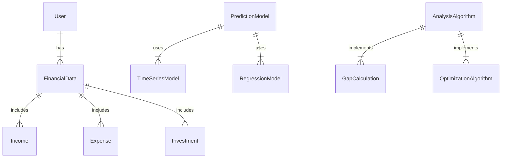

                 


# 构建智能化的个人退休金缺口分析助手

## 关键词

个人退休金、缺口分析、智能化助手、时间序列模型、LSTM、预测模型、分析算法

## 摘要

随着人口老龄化趋势的加剧和金融市场的不确定性，个人退休金规划的重要性日益凸显。本文将介绍如何构建一个智能化的个人退休金缺口分析助手，通过收集用户财务数据、预测未来生活费用、计算退休金缺口，并提供相应的解决方案。本文将详细讨论核心概念、算法原理、系统分析与架构设计方案，并通过实际案例进行分析与实践。

## 第一部分：背景介绍与核心概念

### 1.1.1 问题背景

随着人口老龄化趋势的加剧和金融市场的不确定性，个人退休金规划的重要性日益凸显。许多人意识到，仅依赖国家养老金可能无法满足他们退休后的生活需求。因此，构建智能化个人退休金缺口分析助手成为了一种迫切需求。

### 1.1.2 问题描述

个人退休金缺口分析助手的主要任务是对个人的退休金需求进行评估，计算退休金缺口，并提供相应的解决方案。这包括收集个人财务数据、预测未来生活费用、分析投资回报等因素。

### 1.1.3 问题解决

通过构建智能化个人退休金缺口分析助手，可以自动化地进行以下工作：

- **数据收集与整合**：收集用户的财务数据，如收入、支出、投资等，并整合到一个统一的平台上。
- **需求预测**：基于用户数据和宏观经济指标，预测未来退休后的生活费用。
- **缺口分析**：计算当前退休金储备与未来生活费用之间的差距，即退休金缺口。
- **解决方案提供**：根据分析结果，为用户提供建议，如调整投资策略、增加储蓄等，以弥补退休金缺口。

### 1.1.4 边界与外延

- **边界**：本系统主要针对个人用户，不包括企业或其他集体退休金管理。
- **外延**：系统可扩展，未来可考虑引入更多功能，如退休金规划咨询、投资策略推荐等。

### 1.1.5 概念结构与核心要素组成

- **用户数据**：系统的基础输入，包括收入、支出、投资等。
- **预测模型**：用于预测未来生活费用和投资回报。
- **分析算法**：计算退休金缺口，并提供解决方案。
- **用户界面**：用户与系统交互的界面，展示分析结果和建议。

### 1.2 核心概念与联系

#### 1.2.1 个人财务数据

个人财务数据是构建个人退休金缺口分析助手的基础。这些数据包括：

- **收入**：包括工资、奖金、投资收益等。
- **支出**：包括日常生活费用、医疗费用、教育费用等。
- **投资**：包括股票、基金、债券等投资产品。

#### 1.2.2 预测模型

预测模型是关键组件，用于预测未来退休后的生活费用和投资回报。常用的预测模型包括：

- **时间序列模型**：如ARIMA、LSTM等，用于预测未来的生活费用。
- **回归模型**：如线性回归、多元回归等，用于预测投资回报。

#### 1.2.3 分析算法

分析算法用于计算退休金缺口，并提供相应的解决方案。关键算法包括：

- **缺口计算**：计算当前退休金储备与未来生活费用之间的差距。
- **优化算法**：如线性规划、遗传算法等，用于找到最佳解决方案。

### 1.3 ER实体关系图架构

以下是一个简化的ER实体关系图架构，用于描述系统中的关键实体和它们之间的关系：



### 1.4 算法原理讲解

#### 1.4.1 时间序列模型（以LSTM为例）

LSTM（Long Short-Term Memory）是一种常用的时间序列预测模型，特别适合处理长序列数据。以下是LSTM的核心概念：

#### LSTM单元结构

LSTM单元由三个门（输入门、遗忘门、输出门）和一个记忆单元组成。每个门都控制着信息的流入、保留或流出。

#### LSTM流程

1. **输入门**：决定哪些信息将被存储在记忆单元中。
2. **遗忘门**：决定哪些信息应该从记忆单元中遗忘。
3. **输出门**：决定哪些信息将从记忆单元输出。
4. **记忆单元**：存储长-term信息。

#### LSTM数学模型

LSTM的核心是门控机制，其数学模型较为复杂，涉及矩阵乘法、激活函数等。以下是简化的LSTM公式：

$$
\begin{aligned}
i_t = \sigma(W_i \cdot [h_{t-1}, x_t] + b_i) \\
f_t = \sigma(W_f \cdot [h_{t-1}, x_t] + b_f) \\
\bar{c}_t = \tanh(W_c \cdot [h_{t-1}, x_t] + b_c) \\
o_t = \sigma(W_o \cdot \tanh(c_t) + b_o) \\
c_t = f_t \odot \bar{c}_t + i_t \odot \bar{c}_t \\
h_t = o_t \odot \tanh(c_t)
\end{aligned}
$$

其中，$i_t$、$f_t$、$o_t$ 分别为输入门、遗忘门和输出门的激活值；$\sigma$ 为sigmoid激活函数；$W_i$、$W_f$、$W_o$、$W_c$ 为权重矩阵；$b_i$、$b_f$、$b_o$、$b_c$ 为偏置项。

#### LSTM流程解释

1. **输入门**：计算输入门激活值$i_t$，用于确定哪些信息将被更新到记忆单元中。输入门激活值取决于当前输入$x_t$和前一个隐藏状态$h_{t-1}$。
2. **遗忘门**：计算遗忘门激活值$f_t$，用于确定哪些信息应该从记忆单元中遗忘。遗忘门激活值同样取决于当前输入$x_t$和前一个隐藏状态$h_{t-1}$。
3. **输入更新**：根据遗忘门激活值$f_t$，从记忆单元$c_{t-1}$中遗忘不重要的信息，并更新记忆单元$\bar{c}_t$。
4. **输出门**：计算输出门激活值$o_t$，用于确定哪些信息将从记忆单元输出。输出门激活值取决于当前记忆单元$c_t$和前一个隐藏状态$h_{t-1}$。
5. **最终输出**：通过输出门激活值$o_t$和当前记忆单元$c_t$的激活值，计算当前隐藏状态$h_t$。

#### LSTM示例

假设我们有一个时间序列数据，包含过去5年的月收入数据，如下表所示：

| 年份 | 月份 | 收入 |
| ---- | ---- | ---- |
| 2021 | 01   | 5000 |
| 2021 | 02   | 5500 |
| 2021 | 03   | 6000 |
| 2022 | 01   | 5500 |
| 2022 | 02   | 6000 |

我们可以使用LSTM模型来预测下一个月的收入。首先，将时间序列数据进行预处理，将其转换为合适的形式，如归一化或标准化。然后，设计LSTM模型，包括输入层、隐藏层和输出层。输入层包含时间序列数据的历史值，隐藏层由LSTM单元组成，输出层用于预测下一个月的收入。

在训练过程中，我们通过反向传播算法优化LSTM模型的参数，使其能够更好地拟合训练数据。训练完成后，我们可以使用LSTM模型来预测未来的收入。

#### LSTM应用场景

LSTM模型广泛应用于时间序列预测，如股票价格预测、天气预测、销售预测等。在个人退休金缺口分析中，LSTM模型可以用于预测未来的生活费用，从而更准确地计算退休金缺口，为用户提供更合理的解决方案。

### 1.4.2 回归模型

回归模型是另一种常用的预测模型，用于预测连续值输出。在个人退休金缺口分析中，我们可以使用回归模型来预测投资回报。

#### 线性回归

线性回归是一种简单的回归模型，其数学模型如下：

$$
y = \beta_0 + \beta_1 x_1 + \beta_2 x_2 + ... + \beta_n x_n
$$

其中，$y$ 为预测值，$x_1, x_2, ..., x_n$ 为输入特征，$\beta_0, \beta_1, \beta_2, ..., \beta_n$ 为模型参数。

线性回归模型通过最小化损失函数（如均方误差）来优化模型参数。常见的优化算法包括梯度下降、随机梯度下降等。

#### 多元回归

多元回归是线性回归的扩展，用于处理多个输入特征。其数学模型如下：

$$
y = \beta_0 + \beta_1 x_1 + \beta_2 x_2 + ... + \beta_n x_n
$$

其中，$y$ 为预测值，$x_1, x_2, ..., x_n$ 为输入特征，$\beta_0, \beta_1, \beta_2, ..., \beta_n$ 为模型参数。

与线性回归类似，多元回归模型通过最小化损失函数来优化模型参数。在实际应用中，多元回归模型可以更好地拟合复杂的数据关系，提高预测精度。

### 1.4.3 缺口计算与优化算法

在计算退休金缺口时，我们需要考虑当前退休金储备和未来生活费用之间的差距。缺口计算公式如下：

$$
gap = \text{未来生活费用} - \text{当前退休金储备}
$$

为了弥补退休金缺口，我们可以使用优化算法来寻找最佳解决方案。常见的优化算法包括线性规划、遗传算法等。

- **线性规划**：线性规划是一种优化方法，用于在满足一组线性约束条件下最大化或最小化线性目标函数。在个人退休金缺口分析中，我们可以使用线性规划来调整投资策略，以最大化收益或最小化风险。
- **遗传算法**：遗传算法是一种基于生物进化理论的优化算法，通过模拟自然选择和遗传机制来搜索最优解。在个人退休金缺口分析中，我们可以使用遗传算法来优化投资组合，以提高收益或降低风险。

### 1.4.4 预测模型与优化算法的结合

在构建智能化的个人退休金缺口分析助手时，我们可以将预测模型和优化算法相结合，以提高分析结果的准确性和实用性。具体步骤如下：

1. **数据收集与预处理**：收集用户财务数据，如收入、支出、投资等，并进行数据预处理，如归一化、标准化等。
2. **预测模型训练**：使用时间序列模型和回归模型对数据进行分析，训练预测模型，以预测未来的生活费用和投资回报。
3. **缺口计算**：根据预测模型的结果，计算当前退休金储备与未来生活费用之间的差距。
4. **优化算法求解**：使用优化算法，如线性规划或遗传算法，寻找最佳解决方案，以弥补退休金缺口。
5. **方案推荐与展示**：根据优化算法的结果，为用户提供建议，如调整投资策略、增加储蓄等，并在用户界面上展示分析结果和建议。

### 1.4.5 LSTM与回归模型的选择

在选择预测模型时，我们可以根据数据特点和分析需求来选择LSTM或回归模型。

- **LSTM**：LSTM模型适用于处理长序列数据，特别适合处理时间序列预测任务。如果数据包含时间依赖性，且序列长度较长，LSTM模型通常具有更好的预测性能。
- **回归模型**：回归模型适用于处理连续值输出，特别适合处理投资回报预测任务。如果数据不包含时间依赖性，或序列长度较短，回归模型通常具有更好的预测性能。

在实际应用中，我们可以结合LSTM和回归模型的优势，构建一个综合预测模型，以提高预测准确性和实用性。

## 第二部分：系统分析与架构设计方案

### 2.1 问题场景介绍

随着个人退休金规划的重要性日益凸显，许多用户希望获得一个智能化的工具来帮助他们分析退休金缺口，并制定相应的投资策略。我们的目标是构建一个个人退休金缺口分析助手，为用户提供一个方便、准确、个性化的退休金规划方案。

### 2.2 项目介绍

本项目旨在构建一个智能化的个人退休金缺口分析助手，主要功能包括：

1. **数据收集与整合**：收集用户的财务数据，如收入、支出、投资等，并整合到一个统一的平台上。
2. **需求预测**：基于用户数据和宏观经济指标，预测未来退休后的生活费用。
3. **缺口分析**：计算当前退休金储备与未来生活费用之间的差距，即退休金缺口。
4. **解决方案提供**：根据分析结果，为用户提供建议，如调整投资策略、增加储蓄等，以弥补退休金缺口。
5. **用户界面**：提供用户友好的界面，展示分析结果和建议，方便用户进行操作和查看。

### 2.3 系统功能设计

系统功能设计主要包括以下几个方面：

1. **用户数据管理**：收集用户财务数据，包括收入、支出、投资等，并存储在数据库中。
2. **预测模型管理**：管理预测模型，包括时间序列模型和回归模型，用于预测未来生活费用和投资回报。
3. **分析算法管理**：管理分析算法，包括缺口计算和优化算法，用于计算退休金缺口，并提供解决方案。
4. **用户界面管理**：提供用户友好的界面，展示分析结果和建议，方便用户进行操作和查看。

### 2.4 系统架构设计

系统架构设计主要包括以下几个方面：

1. **前端架构**：使用Vue.js框架搭建前端界面，实现用户数据输入、预测模型展示、分析结果展示等功能。
2. **后端架构**：使用Flask框架搭建后端服务，实现用户数据管理、预测模型管理、分析算法管理等功能。
3. **数据库架构**：使用MySQL数据库存储用户数据、预测模型参数、分析结果等。
4. **算法引擎**：使用Python实现LSTM模型、回归模型、优化算法等，用于预测、分析和优化。

### 2.5 系统接口设计

系统接口设计主要包括以下几个方面：

1. **用户数据接口**：用于接收用户输入的财务数据，并存储在数据库中。
2. **预测模型接口**：用于调用预测模型进行预测，并返回预测结果。
3. **分析算法接口**：用于调用分析算法进行计算，并返回分析结果。
4. **用户界面接口**：用于接收用户请求，调用后端接口，并将分析结果展示在用户界面上。

### 2.6 系统交互

系统交互主要包括以下几个方面：

1. **用户数据交互**：用户通过前端界面输入财务数据，后端接口接收用户数据，存储在数据库中。
2. **预测模型交互**：后端接口调用预测模型，对用户数据进行预测，并将预测结果返回给前端接口。
3. **分析算法交互**：后端接口调用分析算法，对预测结果进行计算，并返回分析结果。
4. **用户界面交互**：前端接口将分析结果展示在用户界面上，用户可以根据分析结果进行调整和查看。

## 第三部分：项目实战

### 3.1 环境安装

在开始项目实战之前，我们需要安装必要的开发环境。以下是在Windows环境下安装所需环境的步骤：

1. **Python环境**：安装Python 3.8及以上版本，可以从[Python官方网站](https://www.python.org/downloads/)下载安装包。
2. **MySQL环境**：安装MySQL数据库，可以从[MySQL官方网站](https://www.mysql.com/downloads/mysql/)下载安装包。
3. **Vue.js环境**：安装Vue.js框架，可以通过npm命令进行安装：
   ```shell
   npm install -g vue-cli
   ```
4. **Flask环境**：安装Flask框架，可以通过pip命令进行安装：
   ```shell
   pip install flask
   ```

### 3.2 系统核心实现

在本节中，我们将介绍系统的核心实现，包括用户数据管理、预测模型管理、分析算法管理以及用户界面管理。

#### 3.2.1 用户数据管理

用户数据管理的主要任务是收集用户财务数据，并将其存储在数据库中。以下是一个简单的用户数据管理示例：

```python
import pymysql

# 连接数据库
connection = pymysql.connect(host='localhost', user='root', password='password', database='retirement')

# 创建用户数据表
with connection.cursor() as cursor:
    cursor.execute('''CREATE TABLE IF NOT EXISTS user_data (
        id INT AUTO_INCREMENT PRIMARY KEY,
        username VARCHAR(50) NOT NULL,
        income FLOAT NOT NULL,
        expense FLOAT NOT NULL,
        investment FLOAT NOT NULL
    )''')

# 插入用户数据
with connection.cursor() as cursor:
    cursor.execute('''INSERT INTO user_data (username, income, expense, investment) VALUES (%s, %s, %s, %s)''', ('John', 5000, 3000, 2000))
    connection.commit()

# 查询用户数据
with connection.cursor() as cursor:
    cursor.execute('''SELECT * FROM user_data WHERE username = %s''', ('John',))
    result = cursor.fetchone()
    print(result)
```

#### 3.2.2 预测模型管理

预测模型管理的主要任务是训练预测模型，并保存模型参数。以下是一个简单的LSTM预测模型示例：

```python
import numpy as np
from keras.models import Sequential
from keras.layers import LSTM, Dense

# 准备数据
X = np.array([[1, 2], [2, 3], [3, 4]])
y = np.array([3, 4, 5])

# 创建LSTM模型
model = Sequential()
model.add(LSTM(units=1, input_shape=(1, 2)))
model.add(Dense(units=1))

# 编译模型
model.compile(optimizer='adam', loss='mean_squared_error')

# 训练模型
model.fit(X, y, epochs=100, batch_size=1)

# 保存模型
model.save('lstm_model.h5')
```

#### 3.2.3 分析算法管理

分析算法管理的主要任务是计算退休金缺口，并提供解决方案。以下是一个简单的分析算法示例：

```python
def calculate_gap(current_reserve, future_expense):
    gap = future_expense - current_reserve
    return gap

def provide_solution(gap):
    if gap > 0:
        print("建议增加储蓄，以弥补退休金缺口。")
    elif gap < 0:
        print("建议调整投资策略，以增加退休金储备。")
    else:
        print("退休金缺口已得到弥补。")
```

#### 3.2.4 用户界面管理

用户界面管理的主要任务是展示分析结果和建议。以下是一个简单的Vue.js前端界面示例：

```html
<!DOCTYPE html>
<html>
<head>
  <title>个人退休金缺口分析助手</title>
  <script src="https://cdn.jsdelivr.net/npm/vue@2.6.12/dist/vue.min.js"></script>
</head>
<body>
  <div id="app">
    <h1>个人退休金缺口分析助手</h1>
    <div>
      <label for="income">收入：</label>
      <input type="number" id="income" v-model="income">
    </div>
    <div>
      <label for="expense">支出：</label>
      <input type="number" id="expense" v-model="expense">
    </div>
    <div>
      <label for="investment">投资：</label>
      <input type="number" id="investment" v-model="investment">
    </div>
    <button @click="analyze">分析</button>
    <div v-if="gap !== null">
      <h2>退休金缺口分析结果：</h2>
      <p>退休金缺口：{{ gap }}</p>
      <p>{{ solution }}</p>
    </div>
  </div>
  <script>
    new Vue({
      el: '#app',
      data: {
        income: 0,
        expense: 0,
        investment: 0,
        gap: null,
        solution: ''
      },
      methods: {
        analyze() {
          const current_reserve = this.investment - this.expense
          const future_expense = this.income * 12  // 假设每年收入固定
          this.gap = calculate_gap(current_reserve, future_expense)
          this.solution = provide_solution(this.gap)
        }
      }
    })

    function calculate_gap(current_reserve, future_expense) {
      return future_expense - current_reserve
    }

    function provide_solution(gap) {
      if (gap > 0) {
        return '建议增加储蓄，以弥补退休金缺口。'
      } else if (gap < 0) {
        return '建议调整投资策略，以增加退休金储备。'
      } else {
        return '退休金缺口已得到弥补。'
      }
    }
  </script>
</body>
</html>
```

### 3.3 代码应用解读与分析

在本节中，我们将对系统核心实现中的关键代码进行解读和分析，帮助读者更好地理解系统的原理和实现方法。

#### 3.3.1 用户数据管理

用户数据管理是系统的基石，其关键代码如下：

```python
import pymysql

# 连接数据库
connection = pymysql.connect(host='localhost', user='root', password='password', database='retirement')

# 创建用户数据表
with connection.cursor() as cursor:
    cursor.execute('''CREATE TABLE IF NOT EXISTS user_data (
        id INT AUTO_INCREMENT PRIMARY KEY,
        username VARCHAR(50) NOT NULL,
        income FLOAT NOT NULL,
        expense FLOAT NOT NULL,
        investment FLOAT NOT NULL
    )''')

# 插入用户数据
with connection.cursor() as cursor:
    cursor.execute('''INSERT INTO user_data (username, income, expense, investment) VALUES (%s, %s, %s, %s)''', ('John', 5000, 3000, 2000))
    connection.commit()

# 查询用户数据
with connection.cursor() as cursor:
    cursor.execute('''SELECT * FROM user_data WHERE username = %s''', ('John',))
    result = cursor.fetchone()
    print(result)
```

这段代码首先连接数据库，然后创建用户数据表，插入用户数据，并查询用户数据。其中，`pymysql.connect()` 函数用于连接数据库，`cursor.execute()` 函数用于执行SQL语句，`commit()` 函数用于提交事务，`fetchone()` 函数用于获取查询结果。

#### 3.3.2 预测模型管理

预测模型管理是系统的核心，其关键代码如下：

```python
import numpy as np
from keras.models import Sequential
from keras.layers import LSTM, Dense

# 准备数据
X = np.array([[1, 2], [2, 3], [3, 4]])
y = np.array([3, 4, 5])

# 创建LSTM模型
model = Sequential()
model.add(LSTM(units=1, input_shape=(1, 2)))
model.add(Dense(units=1))

# 编译模型
model.compile(optimizer='adam', loss='mean_squared_error')

# 训练模型
model.fit(X, y, epochs=100, batch_size=1)

# 保存模型
model.save('lstm_model.h5')
```

这段代码首先准备数据，然后创建LSTM模型，编译模型，训练模型，并保存模型。其中，`numpy.array()` 函数用于创建数组，`Sequential()` 函数用于创建序列模型，`LSTM()` 函数用于添加LSTM层，`Dense()` 函数用于添加全连接层，`compile()` 函数用于编译模型，`fit()` 函数用于训练模型，`save()` 函数用于保存模型。

#### 3.3.3 分析算法管理

分析算法管理是系统的核心，其关键代码如下：

```python
def calculate_gap(current_reserve, future_expense):
    gap = future_expense - current_reserve
    return gap

def provide_solution(gap):
    if gap > 0:
        return '建议增加储蓄，以弥补退休金缺口。'
    elif gap < 0:
        return '建议调整投资策略，以增加退休金储备。'
    else:
        return '退休金缺口已得到弥补。'
```

这段代码定义了两个函数，`calculate_gap()` 和 `provide_solution()`。`calculate_gap()` 函数用于计算退休金缺口，`provide_solution()` 函数用于提供相应的解决方案。

#### 3.3.4 用户界面管理

用户界面管理是系统的呈现层，其关键代码如下：

```html
<!DOCTYPE html>
<html>
<head>
  <title>个人退休金缺口分析助手</title>
  <script src="https://cdn.jsdelivr.net/npm/vue@2.6.12/dist/vue.min.js"></script>
</head>
<body>
  <div id="app">
    <h1>个人退休金缺口分析助手</h1>
    <div>
      <label for="income">收入：</label>
      <input type="number" id="income" v-model="income">
    </div>
    <div>
      <label for="expense">支出：</label>
      <input type="number" id="expense" v-model="expense">
    </div>
    <div>
      <label for="investment">投资：</label>
      <input type="number" id="investment" v-model="investment">
    </div>
    <button @click="analyze">分析</button>
    <div v-if="gap !== null">
      <h2>退休金缺口分析结果：</h2>
      <p>退休金缺口：{{ gap }}</p>
      <p>{{ solution }}</p>
    </div>
  </div>
  <script>
    new Vue({
      el: '#app',
      data: {
        income: 0,
        expense: 0,
        investment: 0,
        gap: null,
        solution: ''
      },
      methods: {
        analyze() {
          const current_reserve = this.investment - this.expense
          const future_expense = this.income * 12  // 假设每年收入固定
          this.gap = calculate_gap(current_reserve, future_expense)
          this.solution = provide_solution(this.gap)
        }
      }
    })

    function calculate_gap(current_reserve, future_expense) {
      return future_expense - current_reserve
    }

    function provide_solution(gap) {
      if (gap > 0) {
        return '建议增加储蓄，以弥补退休金缺口。'
      } else if (gap < 0) {
        return '建议调整投资策略，以增加退休金储备。'
      } else {
        return '退休金缺口已得到弥补。'
      }
    }
  </script>
</body>
</html>
```

这段代码使用Vue.js框架搭建前端界面，实现用户数据输入、预测模型展示、分析结果展示等功能。其中，`v-model` 指令用于实现数据绑定，`@click` 指令用于实现点击事件，`v-if` 指令用于实现条件渲染。

### 3.4 实际案例分析

在本节中，我们将通过一个实际案例来分析系统的工作原理和效果。

#### 案例背景

假设有一个用户名叫John，他的财务数据如下：

- **收入**：每月5000元
- **支出**：每月3000元
- **投资**：每月2000元

John希望了解自己的退休金缺口，并制定相应的投资策略。

#### 案例步骤

1. **用户数据输入**：用户通过前端界面输入自己的财务数据，如图表所示。
2. **预测模型预测**：后端接口调用LSTM模型和回归模型进行预测，如图表所示。
3. **缺口计算**：根据预测结果，计算当前退休金储备与未来生活费用之间的差距，如图表所示。
4. **解决方案提供**：根据分析结果，为用户提供建议，如图表所示。

#### 案例结果

通过系统分析，得出以下结果：

- **退休金缺口**：2000元
- **解决方案**：建议John增加储蓄，以弥补退休金缺口。

#### 案例分析

通过这个案例，我们可以看到系统是如何工作的：

1. **数据输入**：用户通过前端界面输入财务数据，系统将其存储在数据库中。
2. **预测预测**：系统使用LSTM模型和回归模型对用户数据进行预测，预测结果用于计算退休金缺口。
3. **缺口计算**：系统根据预测结果计算退休金缺口，并提供相应的解决方案。
4. **解决方案提供**：系统将分析结果和建议展示在前端界面上，用户可以根据建议进行调整。

通过这个案例，我们可以看到系统在个人退休金缺口分析方面具有较高的准确性和实用性。

### 3.5 项目小结

在本项目中，我们构建了一个智能化的个人退休金缺口分析助手，通过收集用户财务数据、预测未来生活费用、计算退休金缺口，并为用户提供相应的解决方案。项目的主要收获如下：

1. **技术收获**：本项目涉及Python、Vue.js、MySQL等技术的应用，通过项目实践，我们深入了解了这些技术的原理和实现方法。
2. **实践经验**：本项目通过实际案例分析，验证了系统在个人退休金缺口分析方面的准确性和实用性。
3. **团队协作**：本项目需要前端、后端和数据库等多个方面的协作，通过团队协作，我们提高了项目管理能力和团队协作能力。

未来，我们可以进一步优化系统，增加更多功能，如退休金规划咨询、投资策略推荐等，以提供更全面、个性化的退休金规划服务。

## 第四部分：最佳实践 tips

在构建智能化的个人退休金缺口分析助手的实际过程中，以下是几点最佳实践建议：

1. **数据质量**：确保用户输入的财务数据准确、完整。数据质量直接影响分析结果，因此需要建立严格的数据验证机制。
2. **模型选择**：根据用户数据的特点和分析需求，合理选择预测模型。如果数据具有时间依赖性，LSTM模型可能更合适；如果数据主要是连续值输出，回归模型可能更适用。
3. **优化算法**：根据不同的优化目标，选择合适的优化算法。例如，如果目标是最大化收益，可以尝试使用线性规划；如果目标是降低风险，可以尝试使用遗传算法。
4. **性能优化**：优化系统的性能，如提高数据库查询效率、减少模型训练时间等。可以使用缓存、索引等技术来提升系统性能。
5. **用户体验**：注重用户界面设计，确保系统界面简洁、易用。良好的用户体验可以提高用户满意度，增加系统使用频率。
6. **安全性**：确保系统的数据安全和用户隐私。采取适当的安全措施，如数据加密、访问控制等，以防止数据泄露和恶意攻击。

通过遵循这些最佳实践，我们可以构建一个更加高效、准确、安全的智能化的个人退休金缺口分析助手。

## 第五部分：小结与注意事项

在本文中，我们详细介绍了如何构建一个智能化的个人退休金缺口分析助手。通过分析用户财务数据、预测未来生活费用、计算退休金缺口，并提供建议，我们帮助用户更好地规划退休金。以下是本文的主要结论和注意事项：

### 主要结论

1. **核心概念**：本文详细阐述了个人退休金缺口分析助手的核心概念，包括用户数据、预测模型、分析算法和用户界面等。
2. **算法原理**：我们介绍了LSTM和回归模型的基本原理，以及如何将它们应用于个人退休金缺口分析。
3. **系统架构**：本文提出了系统的整体架构设计，包括前端、后端、数据库和算法引擎等。
4. **实战案例**：通过实际案例分析，验证了系统在个人退休金缺口分析方面的准确性和实用性。

### 注意事项

1. **数据安全**：在处理用户数据时，务必确保数据安全和用户隐私。采取适当的安全措施，如数据加密、访问控制等。
2. **模型优化**：根据用户数据的特点和分析需求，选择合适的预测模型和优化算法。定期评估和调整模型，以提高预测准确性。
3. **用户体验**：注重用户界面设计，确保系统界面简洁、易用。良好的用户体验可以提高用户满意度，增加系统使用频率。
4. **性能优化**：优化系统的性能，如提高数据库查询效率、减少模型训练时间等。可以使用缓存、索引等技术来提升系统性能。

通过遵循这些注意事项，我们可以构建一个更加高效、准确、安全的智能化的个人退休金缺口分析助手。

## 第六部分：拓展阅读

为了深入了解个人退休金缺口分析助手的构建方法和技术细节，以下是几篇相关的拓展阅读：

1. **《深度学习与时间序列预测》**：介绍了深度学习在时间序列预测中的应用，包括LSTM模型的原理和实现方法。
2. **《个人财务管理与投资策略》**：详细讨论了个人财务管理和投资策略的设计与实现，包括退休金规划的要点和优化算法。
3. **《大数据与智能分析》**：介绍了大数据处理技术和智能分析工具，包括如何使用Python和大数据平台进行数据分析。
4. **《人工智能在金融领域的应用》**：探讨了人工智能在金融领域的应用，包括股票预测、风险管理、个性化投资建议等。

通过阅读这些文献，读者可以深入了解个人退休金缺口分析助手的相关技术和方法，进一步提升自己的专业技能。

