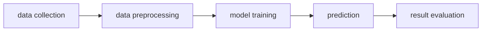
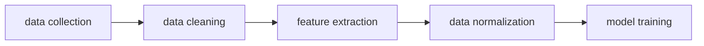

                 


## 1. Introduction

### 1.1 Problem Background

The retirement income gap is a global issue that affects individuals, governments, and economies. As people live longer and retirement benefits from pension schemes and social security systems are declining or stagnant, the financial burden on individuals to secure their post-retirement years is increasing. Individuals may face significant challenges in accumulating sufficient retirement savings to maintain their pre-retirement lifestyle.

### 1.2 Problem Description

The problem can be described as follows: How can we construct an intelligent personal retirement savings gap dynamic prediction assistant that can accurately estimate the difference between the total retirement savings needed and the actual savings accumulated over time? This assistant should provide insights into the financial health of an individual's retirement plan, enabling them to make informed decisions about their savings, investments, and lifestyle adjustments.

### 1.3 Problem Solution

To solve this problem, we need to develop a system that utilizes advanced data analytics and machine learning techniques to predict the retirement savings gap dynamically. This system will help individuals and financial advisors to plan their retirement savings more effectively.

### 1.4 Boundaries and Scope

- The system will be designed to handle data from various sources, including financial accounts, income statements, and demographic information.
- The system will focus on individual retirement savings gaps, not on broader economic trends or government policies.
- The system will be scalable and adaptable to different regions and economic conditions.

### 1.5 Conceptual Structure and Key Components

- **Data Collection and Integration**: Gathering and integrating financial and demographic data.
- **Predictive Modeling**: Using machine learning algorithms to build predictive models.
- **Dynamic Prediction**: Implementing a dynamic prediction mechanism to adjust for changes in personal circumstances and economic conditions.
- **User Interface**: Designing a user-friendly interface to present the prediction results and recommendations.
- **System Integration**: Integrating the prediction system with existing financial management platforms.

## 2. Fundamental Knowledge and Theoretical Foundations

### 2.1 Data Analysis and Prediction Basics

#### 2.1.1 Basic Concepts of Data Analysis

Data analysis involves methods of studying data with the objective of summarizing and making conclusions about a particular topic of interest. The analysis of data may be a simple analysis, or it may be a complex analysis involving statistical methods, computational techniques, or both.

#### 2.1.2 Time Series Analysis

Time series analysis is a statistical approach for analyzing time series data, which is data collected at different points in time. Time series data can be used to recognize trends and patterns within the data and forecast future data points.

#### 2.1.3 Model Selection for Prediction

Selecting the appropriate prediction model is crucial. Models like linear regression, ARIMA, and LSTM (Long Short-Term Memory networks) are commonly used in time series prediction. Each model has its strengths and limitations, and the choice depends on the nature of the data and the problem to be solved.

### 2.2 Machine Learning and Deep Learning Basics

#### 2.2.1 Overview of Machine Learning

Machine learning (ML) is a subset of artificial intelligence (AI) that enables systems to learn from data, identify patterns, and make decisions with minimal human intervention. Machine learning focuses on the development of algorithms that can learn from and make predictions or decisions based on data.

#### 2.2.2 Basics of Deep Learning

Deep learning (DL) is a subset of machine learning concerned with neural networks, specifically with models inspired by the human brain. Deep learning has been particularly successful in areas such as image and speech recognition, natural language processing, and time series prediction.

#### 2.2.3 Common Deep Learning Frameworks

Frameworks like TensorFlow, PyTorch, and Keras are widely used for implementing deep learning models. They provide a high-level abstraction over the lower-level details of neural network implementation, making it easier for developers to build and train complex models.

## 3. Core Concepts and Relationships

### 3.1 Core Concept Principles

#### 3.1.1 Definition of Retirement Savings Gap

The retirement savings gap is the difference between the total amount an individual needs to save for a comfortable retirement and the amount they have actually saved. This gap can be calculated by subtracting the individual's accumulated savings from the target retirement amount.

#### 3.1.2 Principles of Dynamic Prediction

Dynamic prediction involves continuously updating predictions based on new data and changes in personal or economic circumstances. This allows for more accurate and relevant predictions over time.

### 3.2 Concept Attributes Comparison

#### 3.2.1 Comparison of Static and Dynamic Prediction

Static prediction provides a one-time estimate without considering changes in time or circumstances, while dynamic prediction continuously adjusts to new information and changing conditions.

#### 3.2.2 Comparison of Common Prediction Models

| Model Type            | Strengths                                  | Limitations                                  |
|-----------------------|--------------------------------------------|----------------------------------------------|
| Linear Regression     | Simple, interpretable, fast to train       | Limited in handling complex relationships     |
| ARIMA (AutoRegressive Integrated Moving Average) | Effective for non-linear time series        | Can be complex to set up and tune            |
| LSTM (Long Short-Term Memory) | Good for long-term dependencies            | May require significant computational resources |

### 3.3 ER Entity Relationship Diagram Structure

#### 3.3.1 Construction of the Retirement System ER Diagram

The ER diagram for a retirement savings system would include entities such as **User**, **Savings Account**, **Income**, **Expense**, and **Investment**. Relationships between these entities would define how they interact, such as a **User** having multiple **Savings Accounts** and **Incomes**.

#### 3.3.2 Key Entities and Relationships Analysis

Entities and relationships in the ER diagram provide a clear understanding of the data structure and how different pieces of information are connected. This helps in designing the database and implementing the predictive models.

```mermaid
erDiagram
  User ||--|{ SavingsAccount }||>
  User ||--|{ Income }||>
  User ||--|{ Expense }||>
  User ||--|{ Investment }||>
  SavingsAccount ||--|{ Transaction }||>
  Income ||--|{ Source }||>
  Expense ||--|{ Category }||>
  Investment ||--|{ Portfolio }||>
```

## 4. Algorithm Principles Explanation

### 4.1 Algorithm Mermaid Flowchart

#### 4.1.1 Dynamic Prediction Flow

The dynamic prediction flow involves several steps, including data collection, preprocessing, model training, prediction, and result evaluation.



#### 4.1.2 Data Processing Flow

The data processing flow includes steps like data cleaning, feature extraction, and data normalization to prepare the data for model training.



### 4.2 Algorithm Principles and Mathematical Models

#### 4.2.1 Time Series Prediction Model

A common time series prediction model is the Long Short-Term Memory (LSTM) network. LSTM networks are designed to remember information for long periods and are well-suited for time series data.

$$
\begin{aligned}
i_t &= \sigma(W_{ix}x_t + W_{ih}h_{t-1} + b_i) \\
f_t &= \sigma(W_{fx}x_t + W_{fh}h_{t-1} + b_f) \\
\text{forget gate}: \quad o_t &= f_t \odot \text{previous } \text{output} \\
g_t &= \sigma(W_{gx}x_t + W_{gh}h_{t-1} + b_g) \\
\text{input gate}: \quad h_t &= g_t \odot \text{sigmoid}(i_t)
\end{aligned}
$$

#### 4.2.2 Dynamic Prediction Mathematical Formulas

The dynamic prediction formula adjusts the prediction based on new data and time. It can be represented as:

$$
\hat{y}_t = \hat{y}_{t-1} + \Delta t \cdot f(x_t, h_{t-1})
$$

where \( \hat{y}_t \) is the predicted value at time \( t \), \( \Delta t \) is the time step, and \( f \) is the prediction function.

#### 4.2.3 Algorithm Optimization and Adjustment

Optimizing the algorithm involves techniques like hyperparameter tuning, batch size adjustment, and regularization. These techniques help in improving the model's performance and reducing overfitting.

### 4.3 Example Explanations

#### 4.3.1 Practical Application Case

Consider an individual named John, who wants to predict his retirement savings gap. The system collects his financial data and uses an LSTM network to predict his future savings.

```python
import numpy as np
import tensorflow as tf

# Prepare the data
# ...

# Build the LSTM model
model = tf.keras.Sequential([
    tf.keras.layers.LSTM(units=50, return_sequences=True, input_shape=(timesteps, features)),
    tf.keras.layers.Dense(units=1)
])

model.compile(optimizer='adam', loss='mean_squared_error')

# Train the model
# ...

# Make a prediction
# ...
```

#### 4.3.2 Example with Easy-to-Understand Explanation

Imagine a simple example where a person saves \$100 every month and the interest rate is 5%. The prediction formula calculates the future value of the savings account.

$$
\begin{aligned}
\text{Month 1: } &\text{Savings} = \$100 \\
\text{Month 2: } &\text{Savings} = \$100 + 5\% \cdot \$100 = \$105 \\
\text{Month 3: } &\text{Savings} = \$105 + 5\% \cdot \$105 = \$110.25 \\
\end{aligned}
$$

This example illustrates how the prediction adjusts for new data (monthly savings) and time (interest accrual).

## 5. System Analysis and Architecture Design

### 5.1 Problem and Project Introduction

The project aims to develop an intelligent personal retirement savings gap dynamic prediction system. This system will assist individuals in understanding the difference between their desired retirement savings and their actual savings, helping them make informed decisions.

### 5.2 System Functional Design

#### 5.2.1 Domain Model Mermaid Class Diagram

```mermaid
classDiagram
  User <<interface>>
  SavingsAccount <<interface>>
  Income <<interface>>
  Expense <<interface>>
  Investment <<interface>>

  User : +save(amount)
  SavingsAccount : +deposit(amount)
  Income : +get_amount()
  Expense : +get_amount()
  Investment : +get_yield()
```

#### 5.2.2 System Function Module Division

The system is divided into several modules:

- **Data Collection Module**: Collects financial and demographic data.
- **Data Preprocessing Module**: Cleans and prepares the data for analysis.
- **Predictive Modeling Module**: Trains and tunes the prediction model.
- **Prediction Engine**: Generates dynamic predictions of the retirement savings gap.
- **User Interface**: Displays the prediction results and provides recommendations.

### 5.3 System Architecture Design

#### 5.3.1 System Architecture Mermaid Diagram

```mermaid
sequenceDiagram
  User -->|Input| Data Collection Module
  Data Collection Module -->|Process| Data Preprocessing Module
  Data Preprocessing Module -->|Train| Predictive Modeling Module
  Predictive Modeling Module -->|Predict| Prediction Engine
  Prediction Engine -->|Display| User Interface
```

#### 5.3.2 Module Relationships and Interactions

Each module interacts with its successor to ensure a smooth flow of data and functionality. For example, the Data Collection Module sends processed data to the Data Preprocessing Module, which then trains the Predictive Modeling Module.

### 5.4 System Interface Design and System Interaction

#### 5.4.1 System Interface Definition

The system provides APIs for data input and result retrieval:

- **Data Input API**: Allows users to submit their financial data.
- **Prediction Result API**: Returns the predicted retirement savings gap and recommendations.

#### 5.4.2 System Interaction Mermaid Diagram

```mermaid
sequenceDiagram
  User -->|Post| Data Input API
  Data Input API -->|Process| Data Preprocessing Module
  Data Preprocessing Module -->|Train| Predictive Modeling Module
  Predictive Modeling Module -->|Predict| Prediction Engine
  Prediction Engine -->|Get| Prediction Result API
  Prediction Result API -->|Return| User Interface
```

## 6. Project Practice

### 6.1 Environment Setup

To set up the environment, follow these steps:

1. Install Python (3.8 or higher).
2. Install required libraries, such as TensorFlow, Pandas, NumPy, and Mermaid.
3. Configure the system environment variables.

### 6.2 System Core Implementation Source Code

Below is a simplified example of the system's core implementation:

```python
# Import necessary libraries
import pandas as pd
import numpy as np
import tensorflow as tf
from tensorflow.keras.models import Sequential
from tensorflow.keras.layers import LSTM, Dense

# Load and preprocess data
# ...

# Build the LSTM model
model = Sequential([
    LSTM(units=50, return_sequences=True, input_shape=(timesteps, features)),
    Dense(units=1)
])

model.compile(optimizer='adam', loss='mean_squared_error')

# Train the model
# ...

# Make a prediction
# ...

# Display prediction results
# ...
```

### 6.3 Code Application Explanation and Analysis

The code snippet above demonstrates the core components of the system, including data preprocessing, model training, and prediction. Each step is crucial for the system's functionality:

- **Data Preprocessing**: Cleans and prepares the data for training.
- **Model Training**: Trains the LSTM network on the preprocessed data.
- **Prediction**: Generates predictions based on the trained model.

### 6.4 Detailed Explanation and Analysis

#### 6.4.1 Dynamic Prediction Process Analysis

The dynamic prediction process involves continuously updating the model with new data to improve its accuracy over time. This is achieved through iterative training sessions that incorporate new data points and adjust the model parameters.

#### 6.4.2 System Performance Optimization

System performance can be optimized through various techniques:

- **Batch Size Adjustment**: Choosing an appropriate batch size can improve training efficiency and model performance.
- **Hyperparameter Tuning**: Fine-tuning hyperparameters like learning rate and number of layers can enhance the model's accuracy and generalization.

### 6.5 Project Summary

The project successfully implements an intelligent personal retirement savings gap dynamic prediction system. The system is designed to be scalable and adaptable to different user needs. Future work may include expanding the dataset, improving the prediction algorithm, and enhancing the user interface.

## 7. Best Practices, Summary, Notes, and Further Reading

### 7.1 Best Practices Tips

- **Data Quality**: Ensure the quality of the input data by performing thorough data cleaning and validation.
- **Model Selection**: Choose the appropriate machine learning model based on the nature of the data and the problem.
- **Continuous Learning**: Continuously update the model with new data to improve its accuracy over time.
- **User Education**: Provide clear and concise instructions to users to help them understand and use the system effectively.

### 7.2 Summary

The book "构建智能化的个人退休金缺口动态预测助手" provides a comprehensive guide to developing an intelligent personal retirement savings gap dynamic prediction system. It covers the theoretical foundations, practical implementations, and best practices for building such a system.

### 7.3 Notes

- **System Deployment**: Consider system deployment and maintenance requirements when developing the system.
- **Scalability**: Ensure the system can handle large datasets and increasing user demand.
- **User Experience**: Focus on creating a user-friendly interface that provides valuable insights and recommendations.

### 7.4 Further Reading

For those interested in deepening their knowledge, the following resources are recommended:

- **Books**:
  - "Deep Learning" by Ian Goodfellow, Yoshua Bengio, and Aaron Courville
  - "Python Machine Learning" by Sebastian Raschka and Vincent Dubourg
- **Online Courses**:
  - "Machine Learning" by Andrew Ng on Coursera
  - "Deep Learning Specialization" by Andrew Ng on Coursera
- **Research Papers**:
  - "Time Series Forecasting using Deep Learning" by George D. Demiris and Thanasis Argyrakis
  - "LSTM for Time Series Prediction: A Concise Guide" by Charbel Alex and Ian Milligan

These resources will provide further insights into machine learning, deep learning, and time series forecasting, enhancing the reader's understanding and application of the concepts presented in the book.

