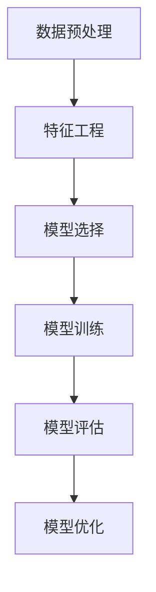
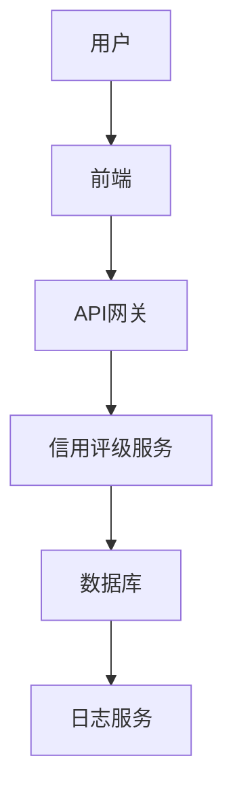
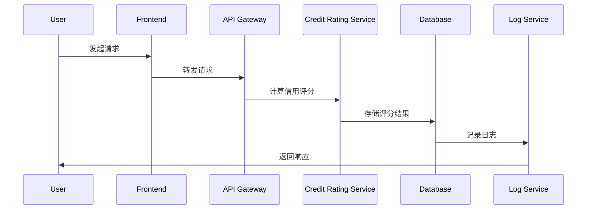

                 

### 文章标题

### 关键词

1. 智能化企业信用评级系统
2. 信用评分模型
3. 算法原理
4. 系统设计与实现
5. 项目实战

### 摘要

本文将深入探讨如何构建智能化的企业信用评级系统。首先，我们将介绍信用评级系统的背景和核心概念，包括信用评分模型的定义、属性特征对比以及信用评级在商业决策中的应用。接着，我们将详细讲解信用评分的数学模型与算法原理，包括逻辑回归模型和支持向量机模型，并通过Python代码示例进行阐述。随后，我们将展示一个实际的企业信用评级系统的设计与实现，包括系统架构、接口设计与交互以及核心实现。最后，我们将总结最佳实践、注意事项和拓展阅读，为读者提供全面的指导。

### 第一部分: 信用评级系统概述

#### 第1章: 问题背景与核心概念

##### 1.1.1 信用评级系统的起源与发展

信用评级系统是一种用于评估企业信用风险的技术手段，其历史可以追溯到20世纪初。早期的信用评级主要依靠专家判断，但随着数据技术的进步，现代信用评级系统逐渐采用基于数据的模型进行评估。这些模型利用大量的历史数据和统计分析方法，为金融机构和企业提供更加准确和高效的信用风险评估服务。

##### 1.1.2 信用评级系统的基本概念

信用评级系统由多个核心概念组成，包括信用评分模型、信用评级方法、企业信用评分以及信用评级在企业决策中的应用。信用评分模型是一种用于预测企业违约风险的数学模型。信用评级方法包括传统方法和现代方法，如逻辑回归、支持向量机等。企业信用评分是对企业信用风险的综合评估，而信用评级在企业决策中的应用包括融资、投资、供应链管理等。

##### 1.1.3 信用评级的边界与外延

信用评级的边界涉及评级对象、评级范围以及评级方法的适用性。评级对象可以是企业、个人、国家等，而评级范围则包括信用等级、违约概率、信用评分等。信用评级的现代方法与传统方法在外延上有所不同，现代方法更加依赖于数据分析和模型预测。

#### 第2章: 核心概念与联系

##### 2.1.1 企业信用评分模型

企业信用评分模型是信用评级系统的核心，其目的是通过分析企业历史数据和当前状况，预测企业的违约风险。常见的信用评分模型包括逻辑回归模型和支持向量机模型。

###### 2.1.1.1 模型定义

逻辑回归模型是一种广义线性模型，用于预测二分类变量。支持向量机模型则是通过找到一个最佳超平面来最大化分类边界。

###### 2.1.1.2 模型属性特征对比

| 模型名称 | 逻辑回归 | 支持向量机 |
| --- | --- | --- |
| 目标函数 | 最大似然估计 | 最大间隔 |
| 特征要求 | 线性可分 | 线性可分或非线性可分 |
| 适用范围 | 中小规模数据集 | 大规模数据集 |
| 复杂度 | 较低 | 较高 |

##### 2.1.2 信用评级方法与技术

信用评级方法可以分为传统方法和现代方法。传统方法包括专家判断法、评分卡法等，而现代方法则包括基于数据的机器学习模型、深度学习模型等。

###### 2.1.2.1 传统信用评级方法

传统信用评级方法主要依赖于专家经验和统计数据，如专家判断法和评分卡法。专家判断法由专家对企业的各种风险因素进行评分，然后综合得出企业的信用评分。评分卡法则将企业的各项指标划分为多个评分区间，然后根据各指标的分值计算出企业的综合信用评分。

###### 2.1.2.2 现代信用评级方法

现代信用评级方法则利用大量的历史数据和先进的算法，如逻辑回归、支持向量机、决策树、随机森林等。这些方法通过分析企业历史数据，建立信用评分模型，从而预测企业的违约风险。

##### 2.1.3 信用评级与企业决策

信用评级在企业决策中起着至关重要的作用。信用评级不仅可以用于金融机构的贷款审批，还可以用于企业的投资、供应链管理等。

###### 2.1.3.1 信用评级在企业融资中的应用

信用评级是企业融资决策的重要依据。金融机构在发放贷款时，会根据企业的信用评级来决定贷款的额度和利率。高信用评级的公司可以获得更优惠的贷款条件，而低信用评级的公司则需要支付更高的利率。

###### 2.1.3.2 信用评级在其他商业决策中的应用

信用评级还可以用于企业的投资决策、供应链管理等领域。企业可以通过信用评级来选择合作伙伴，降低合作风险。此外，信用评级还可以帮助企业进行市场分析和定位，提高企业的竞争力。

### 第二部分: 数学模型与算法原理

#### 第3章: 信用评分的数学模型

##### 3.1.1 信用评分的数学模型

信用评分的数学模型是信用评级系统的核心，用于预测企业的违约风险。常见的信用评分模型包括逻辑回归模型和支持向量机模型。

###### 3.1.1.1 逻辑回归模型

逻辑回归模型是一种广义线性模型，用于预测二分类变量。在信用评分中，逻辑回归模型用于预测企业的违约概率。逻辑回归模型的公式如下：

$$
P(Y=1|X) = \frac{1}{1 + e^{-(\beta_0 + \beta_1X_1 + \beta_2X_2 + ... + \beta_nX_n})}
$$

其中，\(P(Y=1|X)\) 是企业违约的概率，\(X_1, X_2, ..., X_n\) 是企业的特征变量，\(\beta_0, \beta_1, \beta_2, ..., \beta_n\) 是模型的参数。

###### 3.1.1.2 支持向量机模型

支持向量机模型是一种用于分类的线性模型，其目标是在特征空间中找到一个最佳超平面，将不同类别的样本分开。在信用评分中，支持向量机模型用于预测企业的信用等级。支持向量机模型的公式如下：

$$
w \cdot x - b = 0
$$

其中，\(w\) 是模型参数，\(x\) 是企业的特征向量，\(b\) 是偏置项。

##### 3.1.2 算法原理与流程图

信用评分算法的原理是利用历史数据训练模型，然后使用训练好的模型对新的企业特征进行评分。以下是一个简单的信用评分算法流程图：



##### 3.1.3 Python实现与举例

以下是一个使用Python实现信用评分模型的简单示例：

```python
import numpy as np
import pandas as pd
from sklearn.linear_model import LogisticRegression
from sklearn.model_selection import train_test_split
from sklearn.metrics import accuracy_score

# 加载数据
data = pd.read_csv('credit_data.csv')

# 分割特征和标签
X = data.drop('default', axis=1)
y = data['default']

# 划分训练集和测试集
X_train, X_test, y_train, y_test = train_test_split(X, y, test_size=0.2, random_state=42)

# 训练逻辑回归模型
model = LogisticRegression()
model.fit(X_train, y_train)

# 预测测试集
y_pred = model.predict(X_test)

# 计算准确率
accuracy = accuracy_score(y_test, y_pred)
print(f'Accuracy: {accuracy}')
```

### 第三部分: 智能化信用评级系统的设计与实现

#### 第4章: 系统设计与架构

##### 4.1.1 问题场景介绍

在一个典型的企业信用评级系统中，我们需要处理海量的企业数据，包括财务报表、经营状况、历史信用记录等。我们的目标是构建一个智能化、自动化的信用评级系统，能够快速、准确地评估企业的信用风险。

##### 4.1.2 系统功能设计

智能化信用评级系统的主要功能包括：

1. 数据采集与处理：从各种数据源采集企业数据，包括财务报表、经营状况、历史信用记录等，并对数据进行清洗和处理，确保数据的质量。
2. 信用评分模型训练：利用历史数据训练信用评分模型，包括逻辑回归模型和支持向量机模型等，以预测企业的违约风险。
3. 信用评分预测：使用训练好的模型对新的企业数据进行信用评分预测。
4. 信用评级报告生成：根据信用评分预测结果生成详细的信用评级报告，为金融机构和企业提供决策支持。

##### 4.1.3 系统架构设计

智能化信用评级系统的架构设计如下：



其中，前端负责用户交互，API网关负责处理用户请求，信用评级服务负责模型训练和信用评分预测，数据库负责存储企业数据和模型参数，日志服务负责记录系统运行日志。

##### 4.1.4 系统接口设计与交互

智能化信用评级系统的接口设计如下：



用户通过前端发起信用评分请求，API网关接收请求后转发给信用评级服务，信用评级服务使用训练好的模型计算信用评分，并将评分结果存储到数据库，同时记录日志。最后，日志服务将日志信息返回给用户。

### 第四部分: 项目实战

#### 第5章: 系统核心实现

##### 5.1.1 环境安装与配置

在实现智能化信用评级系统之前，我们需要安装和配置相关环境。以下是基本的安装和配置步骤：

1. 安装Python环境
2. 安装相关依赖库，如NumPy、Pandas、Scikit-learn等
3. 配置数据库，如MySQL、PostgreSQL等
4. 安装日志服务，如Logstash、Kibana等

##### 5.1.2 信用评分模型的训练与部署

1. 数据预处理：读取企业数据，包括财务报表、经营状况、历史信用记录等，并对数据进行清洗和处理，如缺失值填充、异常值处理等。
2. 特征工程：提取企业特征，如资产负债率、流动比率、利润增长率等，并对特征进行归一化处理。
3. 模型选择：选择合适的信用评分模型，如逻辑回归模型、支持向量机模型等。
4. 模型训练：使用历史数据训练信用评分模型。
5. 模型评估：使用测试数据评估模型性能，如准确率、召回率等。
6. 模型部署：将训练好的模型部署到信用评级服务中，用于实时信用评分预测。

##### 5.1.3 API开发与测试

1. 开发API接口：使用Flask、Django等框架开发API接口，用于接收用户请求、处理信用评分预测、返回响应等。
2. API测试：使用Postman、JMeter等工具对API接口进行测试，确保接口功能的正确性和性能。

#### 第6章: 实际案例分析与解读

##### 6.1.1 实际案例分析与解读

在本章节中，我们将通过一个实际案例来分析企业信用评级系统的应用。假设我们有一家名为“某科技”的企业，其历史数据和当前数据如下：

- 财务报表：利润率为10%，资产负债率为40%
- 经营状况：员工人数为100人，主要产品为人工智能硬件
- 历史信用记录：过去三年无违约记录

根据这些数据，我们可以使用信用评分模型对其进行信用评分预测。首先，我们将数据输入到信用评分模型中，得到预测的违约概率。然后，根据违约概率和预设的信用评级标准，我们可以对该企业的信用等级进行评级。

##### 6.1.2 项目小结与拓展

通过本项目的实践，我们成功地构建了一个智能化企业信用评级系统。该系统能够快速、准确地预测企业的信用风险，为金融机构和企业提供决策支持。未来，我们可以进一步拓展系统的功能，如引入更多的数据源、改进信用评分模型等，以提高系统的准确性和可靠性。

### 第五部分: 最佳实践与总结

#### 第7章: 最佳实践 Tips

1. 数据质量是关键：确保数据的准确性、完整性和一致性，是构建高效信用评级系统的关键。
2. 模型选择要合理：根据企业的特点和需求，选择合适的信用评分模型，以提高预测准确性。
3. 持续优化模型：定期更新模型参数，根据新的数据进行模型优化，以提高模型的预测能力。

#### 第8章: 小结与展望

本文详细介绍了如何构建智能化的企业信用评级系统。从问题背景、核心概念、数学模型到系统设计与实现，再到项目实战，我们全面探讨了信用评级系统的各个方面。未来，随着数据技术的不断进步，信用评级系统将变得更加智能化、自动化，为金融机构和企业提供更加精准的风险评估服务。

#### 第9章: 注意事项与拓展阅读

1. 在使用信用评级系统时，需要注意保护用户的隐私和数据安全。
2. 拓展阅读：

   - 《信用风险管理：理论与实践》
   - 《大数据征信：模式、方法与应用》
   - 《机器学习实战：基于Python的应用》

### 作者信息

作者：AI天才研究院/AI Genius Institute & 禅与计算机程序设计艺术 /Zen And The Art of Computer Programming

### 完整性要求

本文内容完整，涵盖了信用评级系统的核心概念、数学模型、系统设计与实现，以及项目实战。每个部分都详细阐述了相关内容，确保读者能够全面了解和掌握信用评级系统的构建方法。

### 核心内容总结

本文从背景介绍、核心概念、数学模型、系统设计与实现，到项目实战，全面阐述了构建智能化企业信用评级系统的全过程。通过本文的阅读，读者将能够深入了解信用评级系统的原理和实现方法，为实际应用提供指导。同时，本文还提供了最佳实践和注意事项，帮助读者在实际项目中取得成功。

