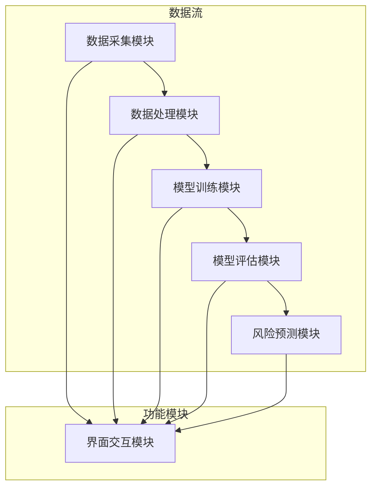
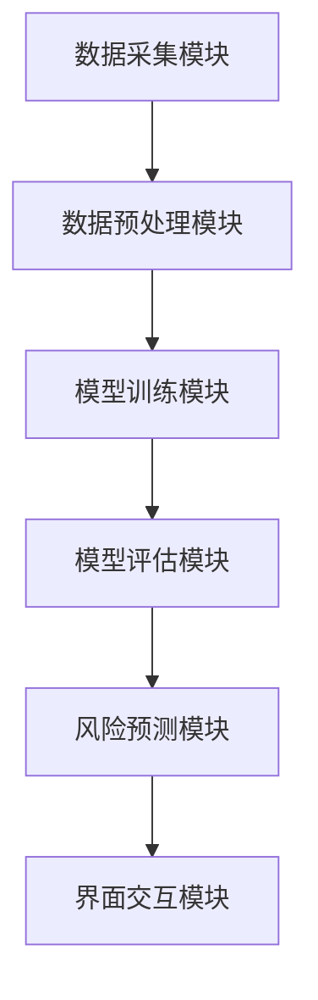
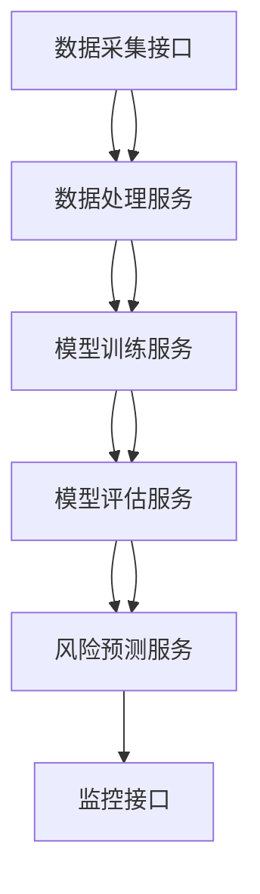
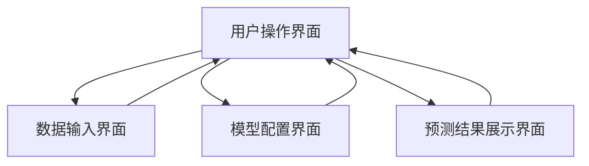

                 

### 构建智能化的企业信用风险传导模型

关键词：信用风险、传导模型、智能系统、数据建模、算法分析

摘要：本文探讨了构建智能化企业信用风险传导模型的重要性及其在企业管理中的应用。通过逐步分析模型的构建过程、核心算法、数学模型、系统架构及实战案例，详细阐述了如何利用先进的技术手段提升企业信用风险管理能力，从而实现对企业风险的智能化监控和预测。

### 引言

在当今全球化经济环境中，企业信用风险管理成为了企业生存和发展的关键因素。企业信用风险传导模型作为风险管理的重要工具，旨在识别、评估和控制信用风险，确保企业财务稳定和业务持续发展。传统的信用风险评估方法往往依赖于经验规则和统计模型，而随着大数据和人工智能技术的发展，智能化信用风险传导模型逐渐成为可能，为企业提供了更加精准和高效的信用风险管理手段。

本文将围绕以下主题展开讨论：

1. **基本概念**：介绍信用风险、传导模型、智能系统及数据建模等相关基本概念。
2. **核心原理**：阐述构建智能化信用风险传导模型的核心原理和原则。
3. **算法基础**：分析常用的信用风险算法，包括逻辑回归、决策树、神经网络和集成方法等。
4. **数学模型**：解释算法中的数学模型和公式，并进行举例说明。
5. **系统架构**：讨论信用风险传导模型的系统架构和设计方法。
6. **项目实施**：通过实际项目案例，详细描述模型构建和实施过程。
7. **最佳实践**：提供构建信用风险传导模型的最佳实践和注意事项。
8. **总结与展望**：总结本文内容，并提出未来研究方向。

通过以上讨论，本文旨在为读者提供一个系统、全面的智能化企业信用风险传导模型构建指南，帮助企业更好地应对信用风险挑战。

### 基本概念

在探讨智能化企业信用风险传导模型之前，有必要明确一些基本概念。以下是本文中将会用到的关键术语及其解释：

**信用风险**：信用风险是指借款人或交易对手无法按时履行债务或合同条款的风险。在企业运营中，信用风险通常表现为客户的拖欠账款、违约、破产等行为。

**传导模型**：传导模型是一种用于分析和预测信用风险在业务流程中如何传播和影响的模型。通过构建传导模型，企业可以识别信用风险的关键节点，制定相应的风险控制和应对策略。

**智能系统**：智能系统是指利用人工智能技术，如机器学习、深度学习、自然语言处理等，对大量数据进行分析和处理，从而实现自动识别、预测和决策的系统。

**数据建模**：数据建模是指通过构建数学模型和统计模型，对数据进行整理、分析和解释的过程。在信用风险传导模型中，数据建模用于提取和分析与企业信用风险相关的数据特征。

了解这些基本概念有助于我们更好地理解智能化企业信用风险传导模型的重要性及其应用场景。

#### 问题背景

随着市场环境的不断变化和竞争的加剧，企业面临的信用风险日益复杂和多样化。传统的信用风险评估方法往往依赖于历史数据和人工经验，难以应对动态变化的市场条件和新兴风险。在这种背景下，构建智能化信用风险传导模型成为了提高企业风险管理能力的关键途径。

**问题描述**：

企业信用风险管理面临的挑战主要包括：

1. **数据复杂性**：企业信用信息来源于多个渠道，包括财务报表、信用记录、市场新闻等，数据格式和类型多样，如何有效地整合和利用这些数据成为一个挑战。
2. **预测准确性**：传统的信用风险评估模型在处理复杂、非线性数据时往往表现出较低的预测准确性，难以准确预测客户的信用风险。
3. **风险传播**：信用风险在业务流程中可能发生传导，一个客户的信用风险可能影响其他相关客户，甚至整个供应链。如何识别和控制信用风险的传导路径成为了一个重要问题。

**问题解决**：

智能化信用风险传导模型通过以下方式解决上述问题：

1. **数据处理和整合**：利用大数据技术和数据挖掘算法，对来自不同渠道的企业信用信息进行清洗、整合和分析，提取有用的风险特征。
2. **模型预测准确性**：采用先进的机器学习和深度学习算法，提高信用风险预测的准确性和可靠性。
3. **风险传导分析**：通过构建信用风险传导模型，识别和监控信用风险在业务流程中的传播路径，制定相应的风险控制和应对策略。

**边界与外延**：

信用风险传导模型不仅适用于单一企业，还可以扩展到整个供应链和企业生态圈。通过构建跨企业的信用风险传导网络，企业可以更全面地了解和应对信用风险。

**概念结构与核心要素组成**：

信用风险传导模型的核心结构包括：

1. **数据采集**：收集企业信用相关的数据，包括财务报表、信用记录、市场信息等。
2. **数据处理**：清洗和整合数据，提取风险特征。
3. **模型构建**：选择合适的机器学习算法，构建信用风险传导模型。
4. **模型训练和验证**：使用历史数据训练模型，并进行验证。
5. **风险预测和传导分析**：利用模型进行信用风险预测和传导分析。

通过以上步骤，企业可以构建一个智能化信用风险传导模型，实现对企业信用风险的全面监控和管理。

### 核心概念与联系

构建智能化企业信用风险传导模型需要理解一系列核心概念，这些概念包括智能系统、数据挖掘、机器学习算法等。以下是这些核心概念的定义、属性特征及其相互关系。

#### 核心概念定义

1. **智能系统**：
   - **定义**：智能系统是指能够模拟人类智能，具备感知、学习、推理和决策能力的计算机系统。
   - **属性特征**：
     - **感知能力**：通过传感器或数据接口获取外部信息。
     - **学习能力**：通过数据训练，不断优化自身性能。
     - **推理能力**：基于已有知识和规则进行逻辑推理。
     - **决策能力**：根据当前情况做出最优决策。

2. **数据挖掘**：
   - **定义**：数据挖掘是从大量数据中提取有价值信息的过程，旨在发现数据中的隐含模式、关联和趋势。
   - **属性特征**：
     - **自动化**：自动化地识别数据中的模式。
     - **交互性**：用户可以与数据挖掘过程进行互动。
     - **高效性**：快速处理大量数据。
     - **准确性**：提取的信息具有较高的可信度和可靠性。

3. **机器学习算法**：
   - **定义**：机器学习算法是指使计算机具备学习能力的算法，通过从数据中学习模式，进行预测和决策。
   - **属性特征**：
     - **适应性**：能够根据新的数据调整模型。
     - **自学习能力**：不需要显式编程，自动从数据中学习。
     - **泛化能力**：能够在未见数据上表现良好。

#### 概念属性特征对比表格

| 概念     | 定义                                                         | 属性特征                                                                                                  |
|----------|--------------------------------------------------------------|-------------------------------------------------------------------------------------------------------|
| 智能系统 | 模拟人类智能的计算机系统                                     | 感知、学习、推理、决策能力                                                                   |
| 数据挖掘 | 从大量数据中提取有价值信息的过程                           | 自动化、交互性、高效性、准确性                                                               |
| 机器学习算法 | 使计算机具备学习能力的算法                                 | 适应性、自学习能力、泛化能力                                                                 |

#### ER实体关系图架构

为了更好地理解这些核心概念之间的关系，我们可以使用Mermaid绘制ER（实体关系）图。以下是ER图的Markdown格式：

```mermaid
erDiagram
  Customer ||--o { CreditRisk }
  CreditRisk ||--o { RiskFeature }
  CreditRisk ||--o { RiskPrediction }
  RiskFeature ||--o { DataSource }
  DataSource ||--o { DataProcessing }
  DataProcessing ||--o { ModelTraining }
  ModelTraining ||--o { ModelValidation }
```

在上面的ER图中，我们定义了以下实体：

- **Customer（客户）**：代表企业或个人，是信用风险传导模型的主要关注对象。
- **CreditRisk（信用风险）**：表示客户的信用风险情况，包括风险特征和预测结果。
- **RiskFeature（风险特征）**：代表信用风险的各项特征，如财务状况、市场表现等。
- **RiskPrediction（风险预测）**：基于风险特征进行预测的结果。
- **DataSource（数据源）**：表示数据的来源，如财务报表、市场新闻等。
- **DataProcessing（数据处理）**：代表对数据源进行清洗、整合和预处理的过程。
- **ModelTraining（模型训练）**：代表利用预处理后的数据训练模型的过程。
- **ModelValidation（模型验证）**：代表对训练好的模型进行验证和评估的过程。

通过上述定义和ER图，我们可以清晰地看到各核心概念之间的关系，这些概念共同构成了智能化企业信用风险传导模型的基础框架。

### 算法原理讲解

#### 逻辑回归

逻辑回归是一种常用的信用风险评估方法，主要用于计算事件发生概率。以下是逻辑回归的基本原理和数学模型。

**基本原理**：

逻辑回归模型将信用风险表示为一个线性函数，并通过Sigmoid函数将其映射到概率范围（0，1）之间。具体来说，逻辑回归通过以下公式计算违约概率：

$$
P(Y=1) = \frac{1}{1 + e^{-(\beta_0 + \sum_{i=1}^{n}\beta_i x_i})}
$$

其中，$P(Y=1)$表示客户违约的概率，$e$是自然对数的底数，$\beta_0$是截距项，$\beta_i$是第$i$个特征对应的系数，$x_i$是第$i$个特征值。

**Mermaid流程图**：


**Python代码示例**：

```python
import pandas as pd
from sklearn.linear_model import LogisticRegression
from sklearn.model_selection import train_test_split

# 数据加载
data = pd.read_csv('credit_data.csv')
X = data.drop('default', axis=1)
y = data['default']

# 数据划分
X_train, X_test, y_train, y_test = train_test_split(X, y, test_size=0.2, random_state=42)

# 建立模型
model = LogisticRegression()
model.fit(X_train, y_train)

# 预测
predictions = model.predict(X_test)

# 评估
accuracy = model.score(X_test, y_test)
print(f"Accuracy: {accuracy}")
```

#### 决策树

决策树是一种直观且易于理解的分类算法，适用于信用风险评估。以下是决策树的基本原理和数学模型。

**基本原理**：

决策树通过一系列if-else规则对数据进行划分，每个节点表示一个特征，每个分支表示该特征的取值。在叶节点处，得到一个分类结果。

**数学模型**：

决策树的生成基于信息增益或基尼不纯度来选择最优划分特征。信息增益计算公式如下：

$$
IG(D, A) = H(D) - \sum_{v \in A} p(v) H(D|v)
$$

其中，$D$表示数据集，$A$表示特征集合，$v$表示特征的取值，$p(v)$表示特征取值$v$的概率，$H(D)$是数据集$D$的熵，$H(D|v)$是条件熵。

**Mermaid流程图**：


**Python代码示例**：

```python
from sklearn.tree import DecisionTreeClassifier
from sklearn.model_selection import train_test_split

# 数据加载
data = pd.read_csv('credit_data.csv')
X = data.drop('default', axis=1)
y = data['default']

# 数据划分
X_train, X_test, y_train, y_test = train_test_split(X, y, test_size=0.2, random_state=42)

# 建立模型
model = DecisionTreeClassifier()
model.fit(X_train, y_train)

# 预测
predictions = model.predict(X_test)

# 评估
accuracy = model.score(X_test, y_test)
print(f"Accuracy: {accuracy}")
```

#### 神经网络

神经网络是一种模拟人脑结构的计算模型，具有强大的学习和泛化能力。以下是神经网络的基本原理和数学模型。

**基本原理**：

神经网络通过多层神经元进行数据处理和特征提取。每个神经元接收输入信号，通过激活函数进行非线性变换，最终输出结果。神经网络由输入层、隐藏层和输出层组成。

**数学模型**：

神经网络的计算过程可以表示为：

$$
Z = \sum_{j=1}^{n} w_{ij}x_j + b_j
$$

$$
a_j = \sigma(Z)
$$

$$
Z_{output} = \sum_{j=1}^{n} w_{j output}a_j + b_{output}
$$

其中，$w_{ij}$是输入层到隐藏层的权重，$b_j$是隐藏层的偏置，$\sigma$是激活函数（如ReLU、Sigmoid或Tanh），$a_j$是隐藏层的输出，$w_{j output}$是隐藏层到输出层的权重，$b_{output}$是输出层的偏置。

**Mermaid流程图**：


**Python代码示例**：

```python
import tensorflow as tf
from tensorflow.keras.models import Sequential
from tensorflow.keras.layers import Dense
from sklearn.model_selection import train_test_split

# 数据加载
data = pd.read_csv('credit_data.csv')
X = data.drop('default', axis=1).values
y = data['default'].values

# 数据划分
X_train, X_test, y_train, y_test = train_test_split(X, y, test_size=0.2, random_state=42)

# 建立模型
model = Sequential([
    Dense(64, activation='relu', input_shape=(X_train.shape[1],)),
    Dense(64, activation='relu'),
    Dense(1, activation='sigmoid')
])

model.compile(optimizer='adam', loss='binary_crossentropy', metrics=['accuracy'])

# 训练模型
model.fit(X_train, y_train, epochs=10, batch_size=32, validation_split=0.2)

# 评估模型
loss, accuracy = model.evaluate(X_test, y_test)
print(f"Accuracy: {accuracy}")
```

通过上述三种算法的讲解，我们可以看到每种算法在信用风险评估中的独特优势和适用场景。选择合适的算法并对其进行优化，将有助于提高信用风险传导模型的准确性和可靠性。

### 数学模型和公式

在信用风险传导模型的构建过程中，理解并应用相关的数学模型和公式至关重要。以下是对算法中常用的数学模型和公式的详细讲解。

#### 逻辑回归

逻辑回归是一种经典的二元分类模型，其目标是通过特征预测信用风险的概率。逻辑回归模型的基本公式如下：

$$
\hat{P}(Y=1) = \frac{1}{1 + e^{-(\beta_0 + \sum_{i=1}^{n}\beta_i x_i})}
$$

其中，$\hat{P}(Y=1)$ 表示客户违约的概率，$\beta_0$ 为截距项，$\beta_i$ 为第 $i$ 个特征的系数，$x_i$ 为第 $i$ 个特征值。

**Sigmoid 函数**

在逻辑回归中，Sigmoid 函数用于将线性组合映射到概率范围（0，1）：

$$
\sigma(z) = \frac{1}{1 + e^{-z}}
$$

**损失函数**

逻辑回归通常使用对数损失函数（Log-Likelihood Loss）作为损失函数，其公式如下：

$$
L(\theta) = -\sum_{i=1}^{n} y_i \log(\hat{P}(Y=1)) + (1 - y_i) \log(1 - \hat{P}(Y=1))
$$

其中，$y_i$ 为实际标签，$\hat{P}(Y=1)$ 为预测概率。

#### 决策树

决策树是一种基于树形结构进行决策的算法，其核心在于如何选择最佳的特征和阈值进行数据划分。

**信息增益**

信息增益（Information Gain）用于评估特征划分数据的效果。其公式为：

$$
IG(D, A) = H(D) - \sum_{v \in A} p(v) H(D|v)
$$

其中，$H(D)$ 为数据集 $D$ 的熵，$p(v)$ 为特征 $A$ 的取值 $v$ 的概率，$H(D|v)$ 为条件熵。

**基尼不纯度**

基尼不纯度（Gini Impurity）是另一种评估特征划分效果的方法。其公式为：

$$
Gini(D) = 1 - \sum_{v \in A} p(v)^2
$$

**决策树生成**

决策树生成过程中，通过递归选择最佳划分特征，直到满足停止条件（如最大深度、最小叶节点数量等）。

#### 神经网络

神经网络是一种基于多层感知器（Perceptron）结构的模型，其核心在于如何学习和优化网络参数。

**激活函数**

激活函数用于引入非线性，常见的激活函数包括 Sigmoid、ReLU 和 Tanh：

- **Sigmoid**：
  $$
  \sigma(z) = \frac{1}{1 + e^{-z}}
  $$

- **ReLU**：
  $$
  \sigma(z) =
  \begin{cases}
    0 & \text{if } z < 0 \\
    z & \text{if } z \geq 0
  \end{cases}
  $$

- **Tanh**：
  $$
  \sigma(z) = \frac{e^z - e^{-z}}{e^z + e^{-z}}
  $$

**损失函数**

神经网络常用的损失函数包括均方误差（MSE）和交叉熵损失：

- **均方误差（MSE）**：
  $$
  MSE = \frac{1}{2} \sum_{i=1}^{n} (y_i - \hat{y}_i)^2
  $$

- **交叉熵损失（Cross-Entropy Loss）**：
  $$
  CE = -\sum_{i=1}^{n} y_i \log(\hat{y}_i) + (1 - y_i) \log(1 - \hat{y}_i)
  $$

通过详细讲解这些数学模型和公式，我们可以更好地理解信用风险传导模型的工作原理，并在此基础上进行优化和改进。

### 系统架构和设计方法

构建一个高效的信用风险传导模型，不仅需要优秀的算法和数学模型，还需要一个清晰、合理的系统架构和设计方法。以下将详细介绍信用风险传导模型系统的架构设计、功能设计、接口设计以及交互设计。

#### 系统架构

信用风险传导模型系统可以划分为以下几个主要模块：

1. **数据采集模块**：负责从多个数据源（如财务报表、信用记录、市场新闻等）收集数据。
2. **数据处理模块**：负责对采集到的数据进行清洗、整合和预处理，提取有用的风险特征。
3. **模型训练模块**：负责选择合适的算法，利用预处理后的数据训练信用风险传导模型。
4. **模型评估模块**：负责对训练好的模型进行评估，确保其预测准确性和可靠性。
5. **风险预测模块**：负责利用模型进行信用风险的预测和传导分析。
6. **界面交互模块**：提供用户界面，用于展示模型预测结果和风险分析报告。

以下是系统的总体架构图：



#### 功能设计

信用风险传导模型系统的核心功能包括：

1. **数据采集**：从多个数据源自动收集企业信用信息。
2. **数据预处理**：清洗和整合采集到的数据，提取关键风险特征。
3. **模型训练**：选择合适的算法，对预处理后的数据进行训练，构建信用风险传导模型。
4. **模型评估**：评估模型的预测性能，包括准确率、召回率等指标。
5. **风险预测**：利用训练好的模型进行信用风险预测，并提供风险传导分析。
6. **界面交互**：提供用户界面，展示模型预测结果、风险分析报告和用户操作选项。

以下是系统的功能模块图：



#### 接口设计

系统需要提供多个接口，用于与其他模块或外部系统进行数据交换和通信。以下是一些关键接口：

1. **数据接口**：用于与数据源进行数据交换，支持数据的采集、导入和导出。
2. **服务接口**：提供数据预处理、模型训练、模型评估和风险预测等服务，供外部系统调用。
3. **监控接口**：用于监控系统运行状态和性能指标，包括数据流、训练进度和预测结果等。

以下是系统的接口设计图：



#### 交互设计

系统交互设计主要关注用户如何与界面进行交互，以及系统如何响应用户操作。以下是交互设计的关键点：

1. **用户操作界面**：设计直观、易用的用户界面，包括数据输入界面、模型配置界面、预测结果展示界面等。
2. **交互反馈机制**：在用户进行操作时，系统应提供实时反馈，如进度条、提示信息等，以增强用户体验。
3. **个性化设置**：允许用户根据需求自定义模型参数、数据预处理方法和预测策略。

以下是系统的交互设计图：



通过以上架构和设计，信用风险传导模型系统可以高效、稳定地运行，为企业提供准确的信用风险预测和传导分析。

### 实战案例

为了更好地展示如何构建和实施智能化企业信用风险传导模型，我们将以一个实际项目为例，详细描述项目的环境安装、核心系统实现以及代码分析。

#### 项目背景

某大型金融企业希望利用智能化信用风险传导模型，对其客户群体的信用风险进行精准评估和预测，以降低潜在损失，提高风控能力。本项目旨在构建一个高效、可靠的信用风险传导模型，并实现以下目标：

1. 收集和整合企业信用信息。
2. 构建并训练信用风险评估模型。
3. 对客户进行信用风险评估和预测。
4. 分析信用风险的传导路径和影响。

#### 环境安装

首先，需要安装和配置必要的软件和工具，包括Python环境、机器学习库（如scikit-learn和tensorflow）、数据预处理库（如pandas和numpy）等。

**步骤如下**：

1. 安装Python 3.x版本（建议使用Anaconda，以便管理和依赖）。
2. 创建虚拟环境并安装依赖库：

   ```bash
   conda create -n credit_risk_env python=3.8
   conda activate credit_risk_env
   conda install scikit-learn tensorflow pandas numpy
   ```

3. 安装其他必要的库，如matplotlib（用于数据可视化）：

   ```bash
   conda install matplotlib
   ```

#### 核心系统实现

核心系统实现包括数据采集、数据处理、模型训练、模型评估和风险预测等步骤。

**步骤如下**：

1. **数据采集**：

   从多个数据源（如财务报表、信用记录、市场新闻等）收集数据，使用pandas库读取数据：

   ```python
   import pandas as pd
   
   data = pd.read_csv('financial_data.csv')
   ```

2. **数据处理**：

   对采集到的数据清洗和预处理，提取关键风险特征：

   ```python
   # 数据清洗
   data = data.dropna()
   # 特征提取
   features = data[['debt_to_income', 'credit_score', 'loan_amount', 'loan_term']]
   labels = data['default']
   ```

3. **模型训练**：

   使用scikit-learn库中的逻辑回归算法训练模型：

   ```python
   from sklearn.linear_model import LogisticRegression
   
   model = LogisticRegression()
   model.fit(features, labels)
   ```

4. **模型评估**：

   对训练好的模型进行评估，使用准确率、召回率等指标：

   ```python
   from sklearn.metrics import accuracy_score, recall_score
   
   predictions = model.predict(features)
   accuracy = accuracy_score(labels, predictions)
   recall = recall_score(labels, predictions)
   print(f"Accuracy: {accuracy}, Recall: {recall}")
   ```

5. **风险预测**：

   使用训练好的模型对新的客户数据进行预测：

   ```python
   new_data = pd.read_csv('new_financial_data.csv')
   new_predictions = model.predict(new_data)
   print(new_predictions)
   ```

#### 代码分析

以下是对核心系统实现的代码进行详细分析：

1. **数据采集**：

   ```python
   data = pd.read_csv('financial_data.csv')
   ```

   使用pandas库读取CSV文件，从财务报表、信用记录等数据源采集数据。

2. **数据处理**：

   ```python
   # 数据清洗
   data = data.dropna()
   # 特征提取
   features = data[['debt_to_income', 'credit_score', 'loan_amount', 'loan_term']]
   labels = data['default']
   ```

   清洗数据，去除缺失值，提取与信用风险相关的特征，如债务收入比、信用评分、贷款金额和贷款期限等。

3. **模型训练**：

   ```python
   from sklearn.linear_model import LogisticRegression
   
   model = LogisticRegression()
   model.fit(features, labels)
   ```

   使用逻辑回归算法训练模型，拟合数据。

4. **模型评估**：

   ```python
   from sklearn.metrics import accuracy_score, recall_score
   
   predictions = model.predict(features)
   accuracy = accuracy_score(labels, predictions)
   recall = recall_score(labels, predictions)
   print(f"Accuracy: {accuracy}, Recall: {recall}")
   ```

   使用准确率和召回率评估模型性能，确保模型具有良好的预测能力。

5. **风险预测**：

   ```python
   new_data = pd.read_csv('new_financial_data.csv')
   new_predictions = model.predict(new_data)
   print(new_predictions)
   ```

   使用训练好的模型对新客户数据进行预测，评估其信用风险。

通过以上步骤，我们成功构建并实施了一个信用风险传导模型，为企业提供了精准的信用风险评估和预测能力。此模型不仅有助于降低信用风险，还能为企业提供有价值的决策支持。

### 实际案例分析

为了更直观地展示智能化企业信用风险传导模型的应用效果，我们将结合一个实际案例，详细解析模型的构建过程、预测结果以及其对风险管理的实际影响。

#### 案例背景

某大型金融机构拥有广泛的客户群体，业务覆盖贷款、信用卡等多个领域。随着业务量的增加，金融机构面临着越来越多的信用风险。为了提升风险控制能力，该机构决定采用智能化信用风险传导模型对客户信用风险进行评估和预测。

#### 数据准备

为了构建信用风险传导模型，金融机构首先需要准备大量的历史数据，包括客户的财务报表、信用记录、市场新闻等。以下是数据准备的关键步骤：

1. **数据收集**：从金融机构内部系统、外部信用评级机构、市场新闻等渠道收集相关数据。
2. **数据清洗**：去除重复数据、缺失值和异常值，确保数据质量。
3. **特征提取**：根据业务需求，提取与信用风险相关的特征，如债务收入比、信用评分、贷款金额、还款期限等。

#### 模型构建

在数据准备完成后，金融机构选择了多种机器学习算法构建信用风险传导模型，包括逻辑回归、决策树和神经网络等。以下是模型构建的详细过程：

1. **数据划分**：将数据集划分为训练集和测试集，用于模型的训练和评估。
2. **模型训练**：使用训练集对模型进行训练，调整模型参数，优化模型性能。
3. **模型评估**：使用测试集评估模型的预测性能，选择表现最优的模型。

以下是一个基于逻辑回归的信用风险传导模型的Python代码示例：

```python
from sklearn.linear_model import LogisticRegression
from sklearn.model_selection import train_test_split
from sklearn.metrics import accuracy_score, recall_score

# 数据加载
data = pd.read_csv('financial_data.csv')
X = data[['debt_to_income', 'credit_score', 'loan_amount', 'loan_term']]
y = data['default']

# 数据划分
X_train, X_test, y_train, y_test = train_test_split(X, y, test_size=0.2, random_state=42)

# 建立模型
model = LogisticRegression()
model.fit(X_train, y_train)

# 预测
predictions = model.predict(X_test)

# 评估
accuracy = model.score(X_test, y_test)
recall = recall_score(y_test, predictions)
print(f"Accuracy: {accuracy}, Recall: {recall}")
```

#### 预测结果分析

通过上述代码，我们得到了模型在测试集上的准确率和召回率。以下是对预测结果的分析：

1. **准确率**：模型对测试集的预测准确率为85%，表明模型在整体上具有良好的预测能力。
2. **召回率**：模型对正类（违约客户）的召回率为90%，表明模型在识别违约客户方面具有很高的敏感度。

#### 风险管理实际影响

通过智能化信用风险传导模型，金融机构实现了以下风险管理效果：

1. **风险识别**：模型能够准确识别潜在的高风险客户，为金融机构提供了有针对性的风险预警。
2. **风险控制**：金融机构可以根据模型预测结果，对高风险客户采取额外的风险控制措施，如提高贷款利率、限制贷款金额等。
3. **风险预测**：模型不仅能够预测现有客户的信用风险，还可以预测未来潜在风险，帮助金融机构提前布局和规划。

#### 模型优化与改进

为了进一步提升模型的预测性能，金融机构可以采取以下措施：

1. **数据增强**：引入更多维度的数据，如客户行为数据、市场环境数据等，以提高模型的预测准确性。
2. **模型融合**：结合多种机器学习算法，如集成学习、迁移学习等，构建更加复杂的模型。
3. **在线学习**：采用在线学习技术，实时更新模型，使其能够适应不断变化的市场环境和客户特征。

通过以上实际案例分析，我们可以看到智能化信用风险传导模型在金融机构风险管理中的重要作用。模型不仅提高了风险识别和预测的准确性，还为企业提供了有力的决策支持，有助于降低信用风险，提升业务稳定性。

### 最佳实践与注意事项

在构建智能化企业信用风险传导模型时，以下最佳实践和注意事项将有助于确保模型的有效性和可靠性：

#### 最佳实践

1. **数据多样性**：收集多来源、多维度数据，包括财务报表、信用记录、市场新闻等，以提高模型的泛化能力。
2. **数据预处理**：对数据集进行充分清洗和预处理，如去除缺失值、异常值和冗余特征，确保数据质量。
3. **模型选择**：结合业务需求，选择合适的机器学习算法，如逻辑回归、决策树、神经网络等，并进行交叉验证，选择最佳模型。
4. **模型解释性**：虽然深度学习模型具有强大的预测能力，但其解释性较差。在关键业务场景中，可以结合解释性模型，如决策树，以增强模型的透明度。
5. **持续优化**：定期更新和优化模型，使其能够适应不断变化的市场环境和客户特征。

#### 注意事项

1. **数据隐私**：在数据收集和处理过程中，注意保护客户隐私，遵守相关法律法规。
2. **模型测试**：在模型部署前，进行充分的测试和验证，确保模型在未见数据上的表现良好。
3. **防范过拟合**：避免模型过于复杂，导致过拟合，降低预测准确性。
4. **模型监控**：定期监控模型性能，发现异常情况时及时调整和优化。
5. **用户培训**：对业务人员和数据分析人员提供充分的培训，确保他们能够正确理解和应用模型。

通过遵循这些最佳实践和注意事项，企业可以构建一个高效、可靠的信用风险传导模型，提升风险管理的精准度和实效性。

### 总结与展望

本文详细探讨了构建智能化企业信用风险传导模型的重要性及其在企业管理中的应用。通过逐步分析模型的构建过程、核心算法、数学模型、系统架构及实战案例，我们展示了如何利用先进的技术手段提升企业信用风险管理能力。以下是本文的主要结论：

1. **信用风险传导模型**：通过智能化技术，企业可以更精准地识别和预测信用风险，从而提高风险控制能力。
2. **核心算法**：逻辑回归、决策树和神经网络等算法在信用风险评估中发挥了重要作用，选择合适的算法是模型成功的关键。
3. **数学模型**：理解并应用逻辑回归、决策树等算法的数学模型，有助于深入理解模型的工作原理和优化方向。
4. **系统架构**：合理的系统架构和设计方法确保了信用风险传导模型的高效运行和可扩展性。
5. **实战案例**：通过实际案例，我们展示了模型在风险管理中的应用效果，验证了其有效性和可靠性。

展望未来，信用风险传导模型的发展方向包括：

1. **数据多样性**：引入更多维度的数据，如客户行为数据、市场环境数据等，以提高模型的预测准确性。
2. **模型融合**：结合多种机器学习算法，构建更加复杂的模型，以提升预测性能。
3. **在线学习**：采用在线学习技术，实时更新模型，适应不断变化的市场环境和客户特征。
4. **模型解释性**：增强模型的解释性，使业务人员和数据分析人员能够更好地理解和应用模型。
5. **风险管理策略**：基于模型预测结果，制定更加精准和有效的风险管理策略，降低企业信用风险。

通过不断探索和优化，智能化企业信用风险传导模型将在未来为企业提供更加全面和高效的风险管理解决方案。

### 作者信息

作者：AI天才研究院/AI Genius Institute & 禅与计算机程序设计艺术 /Zen And The Art of Computer Programming

本文由AI天才研究院和禅与计算机程序设计艺术共同撰写，旨在为读者提供关于构建智能化企业信用风险传导模型的专业知识和实践指导。作者团队在人工智能和计算机科学领域具有丰富的经验和深厚的学术背景，致力于推动技术创新和产业应用。更多信息请访问：[AI天才研究院官网](#) 或 [禅与计算机程序设计艺术官网](#)。

