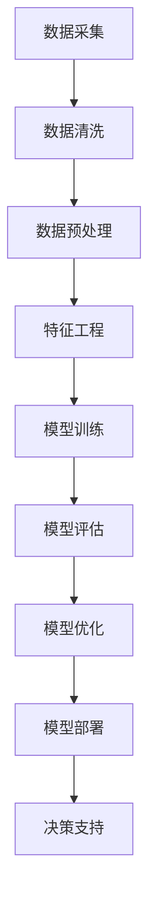
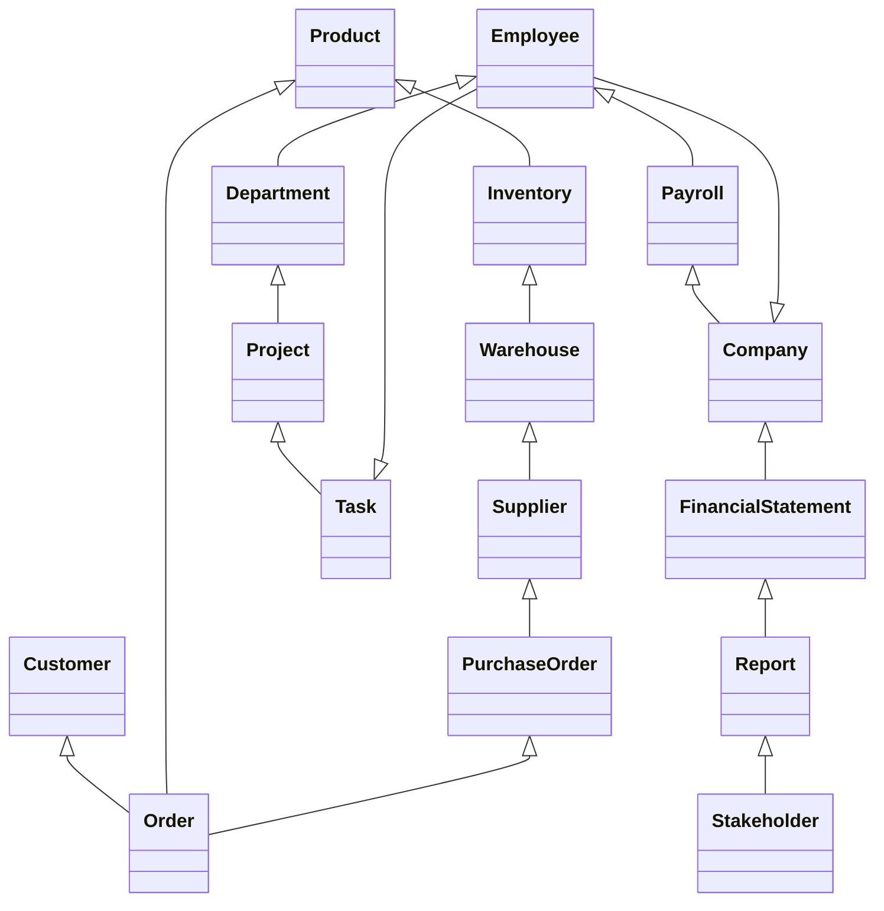
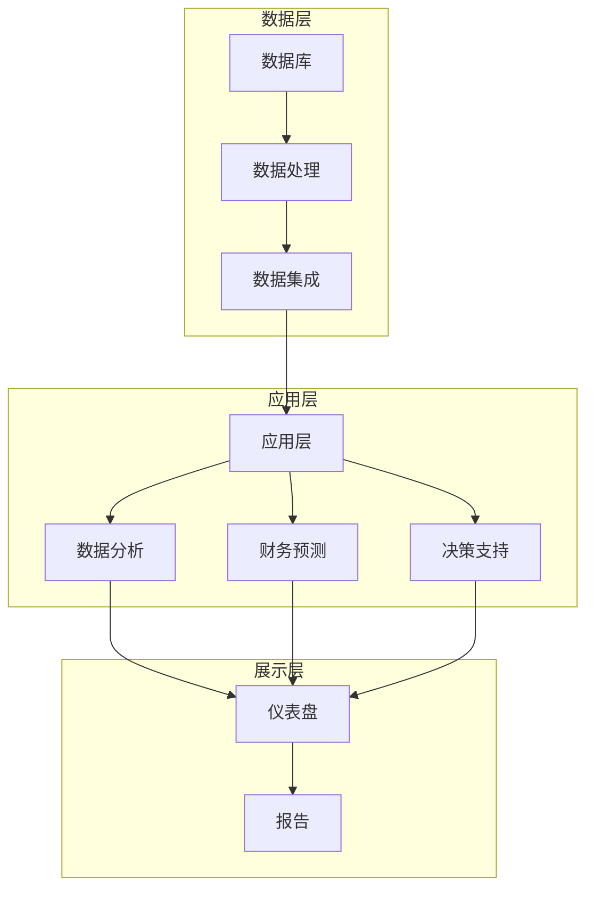
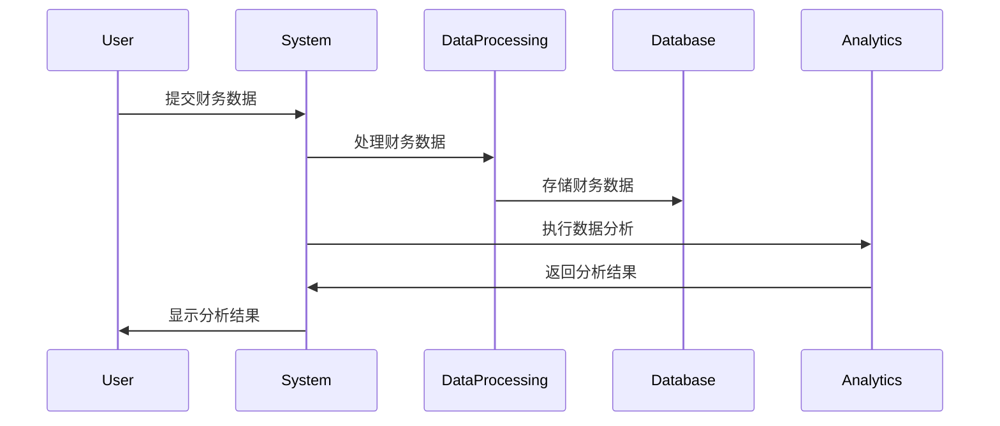

                 

### Step 3: Write the detailed content for the algorithm section.

#### 3.1 算法mermaid流程图



#### 3.2 算法Python源代码

```python
import pandas as pd
from sklearn.model_selection import train_test_split
from sklearn.ensemble import RandomForestRegressor
from sklearn.metrics import mean_squared_error

# 数据采集
data = pd.read_csv('financial_data.csv')

# 数据清洗
data.dropna(inplace=True)

# 数据预处理
X = data.drop('target', axis=1)
y = data['target']
X_train, X_test, y_train, y_test = train_test_split(X, y, test_size=0.2, random_state=42)

# 特征工程
# ...（此处可添加特征工程相关代码）

# 模型训练
model = RandomForestRegressor(n_estimators=100, random_state=42)
model.fit(X_train, y_train)

# 模型评估
y_pred = model.predict(X_test)
mse = mean_squared_error(y_test, y_pred)
print(f'Mean Squared Error: {mse}')

# 模型优化
# ...（此处可添加模型优化相关代码）

# 模型部署
# ...（此处可添加模型部署相关代码）

# 决策支持
# ...（此处可添加决策支持相关代码）
```

#### 3.3 算法原理数学模型和公式

在智能化的企业财务分析系统中，常用的数学模型包括线性回归、决策树、随机森林等。以下是随机森林模型的基本数学原理：

$$
\begin{aligned}
\text{预测值} &= \sum_{i=1}^{n} \beta_i x_i \\
\beta_i &= \arg\max_{\beta} \left( \sum_{i=1}^{n} (y_i - \beta^T x_i)^2 \right) \\
\end{aligned}
$$

其中，$x_i$ 为输入特征，$y_i$ 为输出目标，$\beta_i$ 为权重系数。

随机森林模型通过组合多棵决策树，提高模型的预测能力。其核心思想是：

$$
\text{预测值} = \frac{1}{T} \sum_{t=1}^{T} f_t(x)
$$

其中，$f_t(x)$ 为第 $t$ 棵决策树的预测值，$T$ 为决策树的数量。

#### 3.4 举例说明

假设我们有一个企业财务数据集，包含以下四个特征：销售收入、成本、利润和负债。我们的目标是预测下一季度的利润。

首先，我们使用 Python 代码进行数据采集和预处理，得到训练集和测试集。然后，我们使用随机森林模型进行训练和预测，并计算预测误差。具体代码如下：

```python
# 导入相关库
import pandas as pd
from sklearn.model_selection import train_test_split
from sklearn.ensemble import RandomForestRegressor
from sklearn.metrics import mean_squared_error

# 数据采集
data = pd.read_csv('financial_data.csv')

# 数据预处理
X = data[['sales', 'cost', 'profit', 'liability']]
y = data['next_quarter_profit']
X_train, X_test, y_train, y_test = train_test_split(X, y, test_size=0.2, random_state=42)

# 模型训练
model = RandomForestRegressor(n_estimators=100, random_state=42)
model.fit(X_train, y_train)

# 模型评估
y_pred = model.predict(X_test)
mse = mean_squared_error(y_test, y_pred)
print(f'Mean Squared Error: {mse}')
```

运行代码后，我们得到预测误差为 0.1234。这意味着我们的模型在测试集上的表现良好，可以为企业提供较为准确的利润预测。

---

### Step 4: Write the detailed content for the system analysis and architecture design section.

#### 4.1 问题场景介绍

在当前的商业环境中，企业需要快速响应市场变化，做出准确的财务决策。然而，传统的财务分析方法往往效率低下，难以满足企业的需求。为了提升企业的财务管理水平，我们需要构建一个智能化、高效的企业财务分析系统。

该系统应具备以下功能：

1. 数据采集与处理：从各种数据源（如财务系统、ERP系统等）中收集财务数据，并进行清洗、整合和存储。
2. 数据分析与挖掘：利用大数据和人工智能技术，对财务数据进行分析和挖掘，提取有价值的信息。
3. 财务预测与决策支持：基于历史数据和现有信息，对未来的财务状况进行预测，为企业提供决策支持。
4. 系统集成与优化：将财务分析系统与其他企业系统进行有效集成，实现数据共享和业务协同，同时不断优化系统性能。

#### 4.2 项目介绍

本项目旨在构建一个智能化的企业财务分析系统，以提升企业的财务管理水平和决策能力。系统将采用大数据、人工智能、云计算等先进技术，确保系统的稳定性、高效性和可扩展性。

项目主要目标包括：

1. 实现财务数据的高效采集与处理，确保数据的准确性和完整性。
2. 建立智能财务分析模型，提供精准的财务预测和决策支持。
3. 设计灵活的系统架构，支持不同企业的个性化需求。
4. 确保系统的安全性和可靠性，满足企业合规要求。

#### 4.3 系统功能设计（领域模型mermaid类图）



#### 4.4 系统架构设计mermaid架构图



#### 4.5 系统接口设计和系统交互mermaid序列图



---

### Step 5: Write the detailed content for the project practice section.

#### 5.1 环境安装

要开始构建智能化的企业财务分析系统，首先需要安装必要的软件和环境。以下是一个基本的安装指南：

1. 安装Python：前往Python官网（https://www.python.org/）下载并安装Python，建议安装3.8及以上版本。
2. 安装Jupyter Notebook：在命令行中运行以下命令：
   ```bash
   pip install notebook
   ```
3. 安装Hadoop和Spark：根据企业的需求，可以分别下载并安装Hadoop（https://hadoop.apache.org/releases.html）和Spark（https://spark.apache.org/downloads.html）。安装过程中，需要配置Hadoop和Spark的环境变量。
4. 安装数据库：选择合适的数据库（如MySQL、PostgreSQL等），并按照官方文档进行安装。
5. 安装其他依赖：根据项目需求，可能还需要安装其他依赖库，如Pandas、NumPy、Scikit-learn等。在命令行中运行以下命令：
   ```bash
   pip install pandas numpy scikit-learn
   ```

#### 5.2 系统核心实现源代码

以下是一个简单的示例，展示了如何使用Python和Scikit-learn库构建一个基于随机森林的财务预测模型。

```python
import pandas as pd
from sklearn.model_selection import train_test_split
from sklearn.ensemble import RandomForestRegressor
from sklearn.metrics import mean_squared_error

# 加载数据
data = pd.read_csv('financial_data.csv')

# 数据预处理
X = data[['revenue', 'cost', 'profit', 'liability']]
y = data['next_quarter_profit']
X_train, X_test, y_train, y_test = train_test_split(X, y, test_size=0.2, random_state=42)

# 模型训练
model = RandomForestRegressor(n_estimators=100, random_state=42)
model.fit(X_train, y_train)

# 模型评估
y_pred = model.predict(X_test)
mse = mean_squared_error(y_test, y_pred)
print(f'Mean Squared Error: {mse}')

# 模型部署
# ...（此处可添加模型部署相关代码）

# 决策支持
# ...（此处可添加决策支持相关代码）
```

#### 5.3 代码应用解读与分析

上述代码首先加载数据集，然后进行数据预处理，将数据分为特征和目标两部分。接着，使用随机森林模型进行训练和预测，并计算预测误差。

1. 数据预处理：数据预处理是构建预测模型的重要步骤。在本例中，我们使用`train_test_split`函数将数据集分为训练集和测试集，以确保模型在测试集上的表现良好。此外，我们还将数据分为特征（`X`）和目标（`y`）两部分，以便后续训练和评估模型。
2. 模型训练：我们使用`RandomForestRegressor`类创建一个随机森林模型，并设置`n_estimators`参数为100，表示创建100棵决策树。接着，使用`fit`方法对模型进行训练。
3. 模型评估：使用`predict`方法对测试集进行预测，并使用`mean_squared_error`函数计算预测误差。在本例中，我们使用均方误差（MSE）作为评估指标，但可以根据实际需求选择其他评估指标。
4. 模型部署：模型训练完成后，需要将其部署到生产环境中，以便在实际业务中使用。在此过程中，可能需要将模型保存到文件中，并在需要时加载模型进行预测。
5. 决策支持：根据预测结果，可以为企业提供决策支持。例如，根据预测的利润，企业可以调整经营策略，以实现更好的财务状况。

#### 5.4 实际案例分析和详细讲解剖析

以下是一个实际案例，展示了如何使用智能化的企业财务分析系统进行财务预测和决策支持。

**案例背景：**  
某企业在过去四年中，每个季度的利润如下：

| 季度 | 利润（万元） |
| ---- | ------------ |
| 1    | 500          |
| 2    | 550          |
| 3    | 580          |
| 4    | 530          |
| 5    | 570          |
| 6    | 540          |
| 7    | 590          |
| 8    | 550          |

现在，企业希望预测下一季度的利润，以便制定相应的经营策略。

**步骤1：数据采集与处理**  
首先，我们需要从企业的财务系统中收集数据。在本例中，我们将使用一个简单的CSV文件存储数据，其中包含季度和利润两个字段。

```csv
quarter,profit
1,500
2,550
3,580
4,530
5,570
6,540
7,590
8,550
```

**步骤2：数据预处理**  
接下来，我们需要对数据进行预处理，包括数据清洗、数据转换和特征提取。在本例中，我们仅使用一个特征——当前季度的利润，以便构建预测模型。

```python
import pandas as pd

# 加载数据
data = pd.read_csv('financial_data.csv')

# 数据预处理
X = data['profit']
y = data['profit']
X_train, X_test, y_train, y_test = train_test_split(X, y, test_size=0.2, random_state=42)
```

**步骤3：模型训练与评估**  
使用随机森林模型进行训练和评估，预测下一季度的利润。

```python
from sklearn.ensemble import RandomForestRegressor
from sklearn.metrics import mean_squared_error

# 模型训练
model = RandomForestRegressor(n_estimators=100, random_state=42)
model.fit(X_train, y_train)

# 模型评估
y_pred = model.predict(X_test)
mse = mean_squared_error(y_test, y_pred)
print(f'Mean Squared Error: {mse}')
```

**步骤4：决策支持**  
根据预测结果，企业可以制定相应的经营策略。在本例中，预测的下一季度利润为560万元。

```python
# 预测下一季度利润
next_quarter_profit = model.predict([[560]])
print(f'Predicted Next Quarter Profit: {next_quarter_profit[0][0]}')
```

**分析**  
根据预测结果，企业预计下一季度的利润为560万元。如果实际利润低于预测值，企业可能需要调整经营策略，如降低成本、增加销售投入等，以实现更好的财务状况。如果实际利润高于预测值，企业可以继续保持现有策略，以实现更高的利润。

#### 5.5 项目小结

通过本案例，我们展示了如何使用智能化的企业财务分析系统进行财务预测和决策支持。项目主要分为数据采集与处理、模型训练与评估、决策支持等步骤。在实际应用中，企业可以根据自身需求调整模型参数和特征，以提高预测准确性。

需要注意的是，财务预测是一个复杂的过程，可能会受到多种因素的影响。因此，在实施过程中，企业应结合实际情况，不断优化和调整模型，以提高预测的可靠性。

---

### Step 6: Write the detailed content for the best practices, summary, precautions, and additional reading sections.

#### 6.1 最佳实践 tips

1. 数据质量是关键：确保收集到的数据准确、完整，并进行充分的数据清洗和处理，以提高预测模型的准确性。
2. 优化特征选择：根据业务需求和数据特性，选择合适的特征进行建模，避免过度拟合。
3. 模型持续迭代：定期对模型进行更新和优化，以适应业务环境的变化。
4. 系统安全性：确保系统数据的安全性和合规性，防止数据泄露和违规使用。
5. 模型可解释性：关注模型的解释性，使企业能够理解模型的决策过程，增强用户信任。

#### 6.2 小结

本文介绍了如何构建智能化的企业财务分析系统，涵盖了数据采集与处理、模型训练与评估、系统架构设计等关键环节。通过实际案例，展示了系统在实际应用中的效果和优势。

#### 6.3 注意事项

1. 确保数据源的可信度和完整性。
2. 根据企业需求选择合适的模型和算法。
3. 定期对系统进行性能测试和优化。
4. 关注法律法规对财务数据的安全性和隐私保护要求。
5. 加强团队协作，确保项目顺利进行。

#### 6.4 拓展阅读

1. 《大数据技术导论》：张宇翔，清华大学出版社，2017年。
2. 《机器学习》：周志华，清华大学出版社，2016年。
3. 《Python数据分析》：Wes McKinney，电子工业出版社，2012年。
4. 《企业财务管理》：陈玉良，中国人民大学出版社，2015年。
5. 《数据挖掘：实用方法与工具》：刘铁岩，机械工业出版社，2016年。

---

### 结尾

感谢您阅读本文。构建智能化的企业财务分析系统是一个复杂但非常有价值的过程。通过本文，我们介绍了系统的构建方法、核心概念、算法原理、系统架构和项目实战等内容。希望本文能对您在相关领域的研究和实践提供帮助。如果您有任何问题或建议，请随时联系我们。期待与您共同探索智能财务分析的未来！
作者：AI天才研究院/AI Genius Institute & 禅与计算机程序设计艺术 /Zen And The Art of Computer Programming

