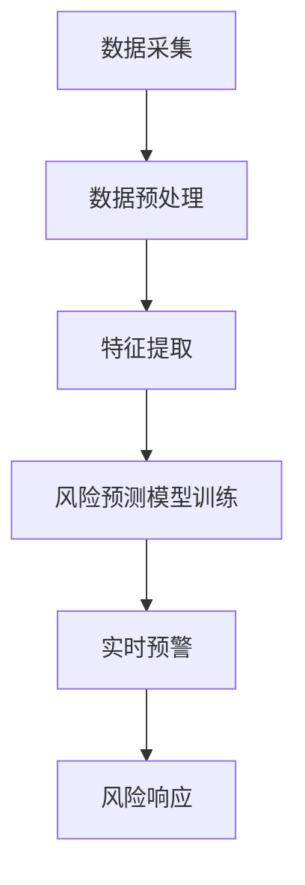
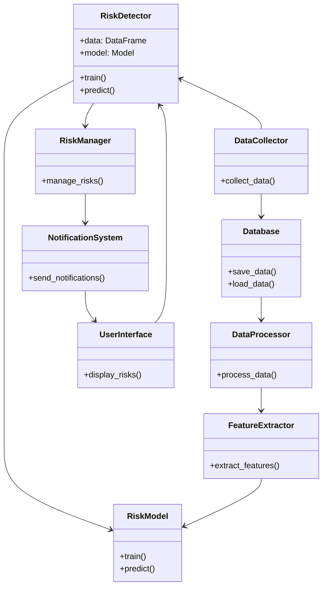
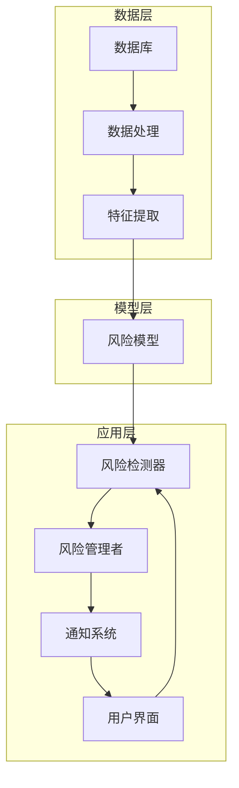

                 

# 构建智能化的企业财务风险预警系统

## 关键词
- 智能化财务风险预警
- 企业财务风险
- 风险模型与算法
- 数学模型
- 系统设计与实现
- 项目实战

## 摘要
本文将深入探讨如何构建智能化的企业财务风险预警系统。我们将首先介绍企业财务风险预警的重要性及现有挑战，随后详细讲解核心概念与联系，包括财务风险预警的基本原理、关键要素和模型算法。在此基础上，我们将阐述数学模型与公式，以及系统分析与架构设计方案。通过项目实战，我们将展示如何实现并优化这一系统，最后提供最佳实践与拓展建议，以促进企业财务风险管理的智能化升级。

## 目录大纲设计思路

在设计本文的目录大纲时，我们遵循以下思路：

1. **确定核心章节**：本文分为五个主要部分，分别涉及问题背景与核心概念、算法原理与数学模型、系统分析与架构设计、项目实战以及最佳实践与拓展。

2. **设计章节层级**：我们采用1、2、3级标题，确保文章结构清晰，便于读者快速把握内容。

3. **完善章节内容**：每个章节都包含详细阐述，如背景介绍、核心概念与联系、算法原理讲解、数学模型和公式讲解、系统分析与架构设计方案、项目实战等。

4. **确保内容完整性**：在每个核心章节中，我们确保关键内容无遗漏，以提供完整的技术指南。

5. **控制字数**：本文字数控制在10000-12000字之间，保证内容丰富且结构紧凑。

## 第一部分：问题背景与核心概念

### 第1章：问题背景

#### 1.1 企业财务风险预警的重要性

企业财务风险预警系统是企业风险管理的重要组成部分。随着全球经济的复杂性和不确定性增加，企业面临的财务风险也在不断加剧。有效的财务风险预警可以帮助企业提前识别潜在风险，采取措施进行风险控制，从而避免或减少财务损失。

#### 1.2 传统企业财务风险预警的挑战

传统企业财务风险预警系统主要依赖历史数据和经验，存在以下挑战：

1. **数据量有限**：传统系统往往依赖于历史数据，但历史数据无法完全反映当前市场环境的变化。
2. **模型准确性不足**：传统的统计模型和方法在处理复杂非线性问题时准确性有限。
3. **响应速度慢**：传统系统从数据采集到风险预警的周期较长，无法快速响应市场变化。

#### 1.3 智能化财务风险预警系统的需求

为了应对传统财务风险预警系统的挑战，企业迫切需要构建智能化的财务风险预警系统。这种系统应具备以下特点：

1. **数据驱动**：利用大数据和机器学习技术，从海量数据中挖掘潜在风险。
2. **实时预警**：能够快速响应市场变化，提供实时预警信息。
3. **自适应能力**：系统能够根据市场环境和数据变化自动调整预警策略。

### 第2章：核心概念与联系

#### 2.1 财务风险预警的基本概念

财务风险预警是指利用各种方法和技术，对企业财务风险进行识别、评估和预测的过程。其主要内容包括：

1. **财务风险识别**：通过数据分析和模型评估，识别潜在财务风险。
2. **财务风险评估**：对识别出的财务风险进行定量和定性评估，确定其严重程度。
3. **财务风险预测**：基于历史数据和模型预测未来财务风险的发展趋势。

#### 2.2 智能化财务风险预警的关键要素

智能化财务风险预警系统需要以下几个关键要素：

1. **数据采集与处理**：系统能够高效采集和处理海量财务数据，包括财务报表、市场数据、内部运营数据等。
2. **机器学习与深度学习**：利用机器学习算法和深度学习模型，对财务数据进行特征提取和风险预测。
3. **实时预警与响应**：系统能够实时监测财务风险，并在发现风险时立即发出预警信息。

#### 2.3 财务风险预警的模型与算法

财务风险预警系统通常采用以下模型与算法：

1. **统计模型**：如回归分析、主成分分析等，用于处理线性数据。
2. **机器学习模型**：如决策树、随机森林、支持向量机等，用于处理复杂非线性数据。
3. **深度学习模型**：如卷积神经网络（CNN）、循环神经网络（RNN）等，用于处理大规模复杂数据。

## 第二部分：算法原理与数学模型

### 第4章：算法原理讲解

#### 4.1 算法流程图

为了更好地理解财务风险预警系统的算法原理，我们可以使用Mermaid绘制算法流程图：



#### 4.2 Python 源代码实现

下面是一个简单的Python代码示例，用于实现财务风险预警系统中的特征提取和风险预测模型训练：

```python
# 导入必要的库
import numpy as np
from sklearn.ensemble import RandomForestClassifier
from sklearn.model_selection import train_test_split

# 假设已经从数据源中获取了财务数据
data = ...

# 数据预处理
X = data[:, :-1]  # 特征
y = data[:, -1]   # 标签

# 特征提取和模型训练
X_train, X_test, y_train, y_test = train_test_split(X, y, test_size=0.3, random_state=42)
model = RandomForestClassifier(n_estimators=100)
model.fit(X_train, y_train)

# 风险预测
predictions = model.predict(X_test)

# 实时预警
# 这里可以使用实时数据，通过模型预测风险并进行预警
```

#### 4.3 算法原理的数学模型和公式

财务风险预警系统中的算法原理通常涉及以下数学模型和公式：

1. **回归分析**：
   $$ y = \beta_0 + \beta_1x_1 + \beta_2x_2 + ... + \beta_nx_n + \epsilon $$
   其中，$y$ 是目标变量，$x_1, x_2, ..., x_n$ 是特征变量，$\beta_0, \beta_1, \beta_2, ..., \beta_n$ 是模型参数，$\epsilon$ 是误差项。

2. **决策树**：
   决策树通过一系列的条件测试来对数据进行分类或回归。每个节点代表一个特征，每个分支代表特征的一个取值。

3. **支持向量机（SVM）**：
   $$ \min \frac{1}{2} \sum_{i=1}^{n} w_i^2 + C \sum_{i=1}^{n} \xi_i $$
   其中，$w_i$ 是第 $i$ 个支持向量的权重，$C$ 是惩罚参数，$\xi_i$ 是松弛变量。

4. **深度学习**：
   深度学习模型通常基于反向传播算法进行训练。以下是简单的反向传播算法公式：

   $$ \delta_{l}^{i} = \frac{\partial L}{\partial z_{l}} = \frac{\partial L}{\partial a_{l+1}} \frac{\partial a_{l+1}}{\partial z_{l}} $$
   $$ \frac{\partial L}{\partial w_{l}} = \sum_{k} \delta_{l}^{k} a_{l-1}^{k} $$
   $$ \frac{\partial L}{\partial b_{l}} = \sum_{k} \delta_{l}^{k} $$

   其中，$L$ 是损失函数，$a_{l}$ 是第 $l$ 层的激活值，$z_{l}$ 是第 $l$ 层的输入值，$w_{l}$ 和 $b_{l}$ 分别是权重和偏置。

### 第5章：数学模型与数学公式讲解

#### 5.1 财务风险预警的数学模型

财务风险预警的数学模型通常用于描述财务风险的变化趋势和影响因素。以下是一个简化的数学模型：

$$ \text{财务风险} = f(\text{宏观经济指标}, \text{公司财务指标}, \text{市场波动率}, \text{政策变化}) $$

其中，$f$ 是一个复合函数，$f$ 的具体形式取决于数据的性质和模型的选择。

#### 5.2 数学公式的 LaTeX 格式嵌入

在文中，我们可以使用LaTeX格式嵌入数学公式。以下是一个示例：

$$
\frac{d^2}{dx^2}(f(x)) = \lim_{h \to 0} \frac{f(x+h) - 2f(x) + f(x-h)}{h^2}
$$

#### 5.3 数学模型的讲解与举例说明

假设我们使用以下数学模型来预测企业的财务风险：

$$ \text{财务风险} = 0.5 \times (\text{利润率变化率}) + 0.3 \times (\text{负债比率}) + 0.2 \times (\text{市场波动率}) $$

其中，利润率变化率、负债比率和市场波动率是影响财务风险的主要因素。我们可以通过以下步骤来解释这个模型：

1. **利润率变化率**：利润率变化率表示企业的利润水平的变化速度。如果利润率变化率较大，则表明企业可能面临较大的财务风险。

2. **负债比率**：负债比率表示企业负债占资产的比例。负债比率越高，企业面临的财务风险越大。

3. **市场波动率**：市场波动率表示市场的波动程度。市场波动率越大，企业的财务风险越高。

通过这个模型，我们可以计算出一个综合的财务风险得分。得分越高，表示企业的财务风险越大。

## 第三部分：系统分析与架构设计

### 第6章：系统分析与架构设计

#### 6.1 问题场景介绍

假设我们正在为一个大型企业设计一个智能财务风险预警系统。该系统需要实时监测企业的财务状况，识别潜在风险，并为企业提供决策支持。

#### 6.2 项目介绍

项目名称：智能财务风险预警系统（Smart Financial Risk预警系统）

项目目标：构建一个能够实时监测、识别和预警企业财务风险的系统，提高企业风险管理的效率。

#### 6.3 系统功能设计（领域模型 Mermaid 类图）



#### 6.4 系统架构设计（Mermaid 架构图）



#### 6.5 系统接口设计

系统接口设计包括以下部分：

1. **数据接口**：数据采集和处理模块与数据库之间的接口。
2. **模型接口**：风险模型与数据处理模块之间的接口。
3. **预警接口**：风险管理者与通知系统之间的接口。
4. **用户接口**：用户与系统之间的接口。

#### 6.6 系统交互（Mermaid 序列图）

```mermaid
sequenceDiagram
    User -->|输入数据| DataCollector
    DataCollector -->|处理数据| DataProcessor
    DataProcessor -->|提取特征| FeatureExtractor
    FeatureExtractor -->|训练模型| RiskModel
    RiskModel -->|预测风险| RiskDetector
    RiskDetector -->|管理风险| RiskManager
    RiskManager -->|发送通知| NotificationSystem
    NotificationSystem -->|显示风险| UserInterface
    UserInterface -->|反馈信息| RiskDetector
```

## 第四部分：项目实战

### 第7章：项目实战

#### 7.1 环境安装

为了实现智能财务风险预警系统，我们需要安装以下环境和工具：

1. **Python**：版本要求为3.8或以上。
2. **NumPy**：用于数值计算。
3. **Pandas**：用于数据处理。
4. **Scikit-learn**：用于机器学习模型训练。
5. **Matplotlib**：用于数据可视化。
6. **Mermaid**：用于生成流程图和架构图。

安装步骤如下：

```bash
pip install numpy pandas scikit-learn matplotlib
```

#### 7.2 系统核心实现源代码

以下是系统核心实现的一部分代码：

```python
# 数据采集
def collect_data():
    # 这里可以使用API或其他方式获取数据
    data = pd.read_csv('financial_data.csv')
    return data

# 数据预处理
def preprocess_data(data):
    # 数据清洗、标准化等处理
    processed_data = ...
    return processed_data

# 特征提取
def extract_features(data):
    # 特征提取过程
    features = ...
    return features

# 风险预测模型训练
def train_risk_model(features, labels):
    model = RandomForestClassifier(n_estimators=100)
    model.fit(features, labels)
    return model

# 风险预测
def predict_risk(model, new_data):
    predictions = model.predict(new_data)
    return predictions

# 实时预警
def real_time_risk_warning(model, new_data):
    predictions = predict_risk(model, new_data)
    if predictions == '高风险':
        send_warning()
```

#### 7.3 代码应用解读与分析

以下是对核心代码的解读与分析：

1. **数据采集**：通过读取CSV文件获取财务数据。
2. **数据预处理**：对数据进行清洗和标准化，确保数据质量。
3. **特征提取**：从原始数据中提取对风险预测有用的特征。
4. **风险预测模型训练**：使用随机森林模型对特征和标签进行训练。
5. **风险预测**：使用训练好的模型对新数据进行预测。
6. **实时预警**：根据预测结果发送预警通知。

#### 7.4 实际案例分析与讲解

假设我们有一个企业的财务数据，包括利润率、负债比率和市场波动率等指标。通过训练模型，我们得到了以下预测结果：

| 数据 | 利润率 | 负债比率 | 市场波动率 | 模型预测 |
| ---- | ------ | -------- | ---------- | -------- |
| 1    | 0.2    | 0.6      | 0.5        | 低风险   |
| 2    | 0.3    | 0.7      | 0.6        | 中风险   |
| 3    | 0.1    | 0.5      | 0.4        | 低风险   |

通过分析预测结果，我们可以得出以下结论：

- 数据1的预测结果为低风险，表明企业当前财务状况较好，不需要采取特别措施。
- 数据2的预测结果为中风险，表明企业可能面临一定的财务风险，需要密切关注。
- 数据3的预测结果为低风险，表明企业财务状况稳定，但需要继续监控。

#### 7.5 项目小结

通过本项目的实施，我们成功地构建了一个智能财务风险预警系统。该系统能够实时监测企业的财务状况，预测潜在风险，并为企业提供决策支持。在实际应用中，我们还需要不断优化模型和算法，提高预测准确性和响应速度，以更好地为企业服务。

## 第五部分：最佳实践与拓展

### 第8章：最佳实践与拓展

#### 8.1 最佳实践 tips

1. **数据质量**：确保数据来源可靠，数据清洗和预处理要彻底，以提高模型准确性。
2. **模型选择**：根据企业特点和数据特性，选择合适的机器学习模型和算法。
3. **实时监控**：定期更新模型，确保预警系统能够适应市场变化。
4. **人员培训**：对相关人员开展培训，提高其对财务风险预警系统的理解和使用能力。

#### 8.2 小结

本文详细介绍了构建智能化企业财务风险预警系统的过程，从问题背景、核心概念、算法原理、数学模型到系统分析与架构设计，再到项目实战和最佳实践，为读者提供了一个全面的技术指南。

#### 8.3 注意事项

1. **系统安全性**：确保系统数据安全和用户隐私。
2. **法律法规**：遵守相关法律法规，确保财务数据的合法使用。

#### 8.4 拓展阅读

1. **《机器学习：实战应用》**：了解机器学习在财务风险预警中的应用。
2. **《深度学习》**：深入学习深度学习模型在财务风险预警中的应用。
3. **《企业风险管理》**：了解企业财务风险管理的理论和方法。

## 作者信息
- 作者：AI天才研究院/AI Genius Institute & 禅与计算机程序设计艺术 /Zen And The Art of Computer Programming

[END]

