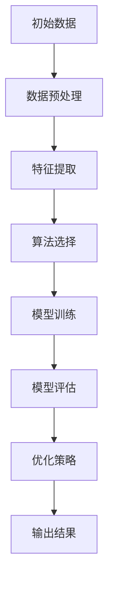
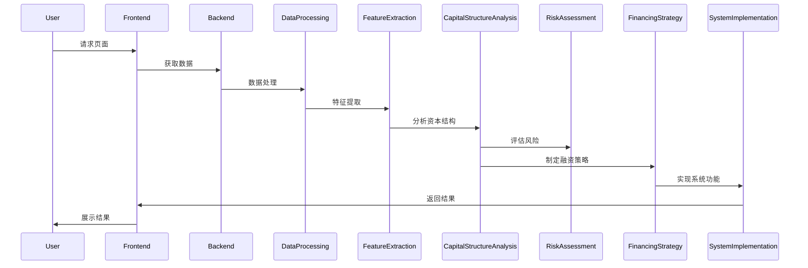

                 

### 文章标题

# 构建智能化的企业资本结构优化平台

### 文章关键词

- 智能化
- 企业资本结构
- 优化平台
- 算法
- 系统设计
- 实际案例

### 文章摘要

本文将深入探讨如何构建一个智能化的企业资本结构优化平台。我们将首先介绍企业资本结构优化的重要性，然后详细解析平台所需的核心概念、算法原理、系统设计与实现，并通过实际案例进行分析，最后总结最佳实践和注意事项。希望通过本文，读者能够全面了解并掌握构建智能优化平台的步骤和方法。

----------------------------------------------------------------

### 第一部分：企业资本结构优化的背景与核心概念

#### 第1章：企业资本结构优化的背景

**1.1 问题背景**

在当前全球化和信息化的大背景下，企业面临着日益激烈的市场竞争和快速变化的经济环境。资本结构优化成为企业管理中至关重要的一环。合理的资本结构有助于企业降低融资成本、提高财务稳定性，从而实现可持续发展。然而，企业资本结构的优化并非易事，涉及到多方面的因素和复杂的决策过程。

**1.2 问题描述**

企业资本结构优化的问题可以概括为以下几点：

- 如何在债务融资和股权融资之间找到最佳平衡点？
- 如何确定合理的资本结构以最大化企业价值？
- 如何应对外部环境变化对企业资本结构的影响？

**1.3 问题解决**

解决上述问题需要系统化的方法和科学的决策。构建一个智能化的企业资本结构优化平台，通过数据分析和算法优化，可以帮助企业更准确地评估资本结构，制定科学的融资策略。

**1.4 边界与外延**

在企业资本结构优化中，边界和外部因素的作用不可忽视。例如，不同行业和企业的资本结构特征有所不同，市场利率、税收政策、宏观经济环境等外部因素也会对资本结构产生影响。因此，在优化过程中，需要充分考虑这些边界条件和外部因素。

**1.5 概念结构与核心要素组成**

企业资本结构优化平台的核心概念包括资本结构、融资策略、风险评估和算法模型等。这些概念相互联系，构成了一个完整的优化体系。具体来说：

- **资本结构**：企业各种资金来源的构成，包括债务、股权、留存收益等。
- **融资策略**：企业在不同市场条件下的融资方式和优先级。
- **风险评估**：对企业财务风险的识别和评估，包括信用风险、市场风险和操作风险等。
- **算法模型**：用于分析数据、预测风险和优化资本结构的数学模型。

#### 第2章：企业资本结构的核心概念与联系

**2.1 核心概念原理**

在企业资本结构优化平台中，核心概念包括资本结构、融资策略、风险评估和算法模型等。这些概念的定义和原理如下：

- **资本结构**：指企业各种资金来源的构成比例，包括债务、股权和留存收益等。
- **融资策略**：根据企业需求和外部环境，选择合适的融资方式和组合。
- **风险评估**：通过定量和定性方法，对企业面临的财务风险进行评估和预测。
- **算法模型**：用于分析数据、预测风险和优化资本结构的数学模型。

**2.2 概念属性特征对比表格**

为了更清晰地展示各概念之间的联系，我们提供了一个对比表格：

| 概念         | 属性特征                               | 联系与作用                             |
|------------|--------------------------------------|--------------------------------------|
| 资本结构     | 债务、股权、留存收益的比例             | 决定企业的财务稳定性和融资成本           |
| 融资策略     | 融资方式、融资期限、融资规模           | 影响企业的资金筹集和资本结构             |
| 风险评估     | 信用风险、市场风险、操作风险           | 保障企业的财务安全和资本结构优化           |
| 算法模型     | 数据分析、预测、优化                   | 提供科学的决策支持，提高资本结构优化的准确性 |

**2.3 ER实体关系图架构**

为了帮助读者更好地理解各概念之间的关系，我们使用Mermaid绘制了一个ER实体关系图：

```mermaid
erDiagram
    EnterpriseCapitalStructure ||--|{ FinancingStrategy }
    EnterpriseCapitalStructure ||--|{ RiskAssessment }
    FinancingStrategy ||--|{ DebtFinancing }
    FinancingStrategy ||--|{ EquityFinancing }
    RiskAssessment ||--|{ CreditRisk }
    RiskAssessment ||--|{ MarketRisk }
    RiskAssessment ||--|{ OperationalRisk }
```

在这个ER实体关系图中，企业资本结构作为核心实体，与融资策略、风险评估等实体之间存在着紧密的联系。融资策略包括债务融资和股权融资，风险评估则包括信用风险、市场风险和操作风险等。

#### 第3章：智能化资本结构优化算法原理

**3.1 算法流程图展示（Mermaid）**

为了清晰地展示资本结构优化算法的流程，我们使用Mermaid绘制了以下算法流程图：



在这个流程图中，我们从初始数据开始，经过数据预处理、特征提取、算法选择、模型训练、模型评估和优化策略等步骤，最终得到优化的资本结构输出结果。

**3.2 Python源代码实现**

下面是一个简化的Python源代码实现，用于演示资本结构优化算法的基本逻辑：

```python
import pandas as pd
from sklearn.ensemble import RandomForestClassifier
from sklearn.model_selection import train_test_split
from sklearn.metrics import accuracy_score

# 数据预处理
def preprocess_data(data):
    # 数据清洗、归一化等操作
    return processed_data

# 特征提取
def extract_features(data):
    # 提取关键特征
    return features

# 算法选择
def choose_algorithm():
    # 选择合适的算法
    return algorithm

# 模型训练
def train_model(X_train, y_train, algorithm):
    # 训练模型
    model = algorithm.fit(X_train, y_train)
    return model

# 模型评估
def evaluate_model(model, X_test, y_test):
    # 评估模型
    predictions = model.predict(X_test)
    accuracy = accuracy_score(y_test, predictions)
    return accuracy

# 主函数
def main():
    # 加载数据
    data = pd.read_csv('data.csv')
    processed_data = preprocess_data(data)
    features = extract_features(processed_data)
    
    # 划分训练集和测试集
    X_train, X_test, y_train, y_test = train_test_split(features, processed_data['label'], test_size=0.2, random_state=42)
    
    # 选择算法
    algorithm = choose_algorithm()
    
    # 训练模型
    model = train_model(X_train, y_train, algorithm)
    
    # 评估模型
    accuracy = evaluate_model(model, X_test, y_test)
    print(f"Model accuracy: {accuracy}")
    
    # 输出优化结果
    optimized_structure = model.predict([[...]]) # 输入新的数据
    print(f"Optimized capital structure: {optimized_structure}")

# 运行主函数
if __name__ == '__main__':
    main()
```

在这个代码中，我们首先对数据进行预处理和特征提取，然后选择合适的算法进行模型训练和评估。最后，使用训练好的模型对新的数据进行预测，输出优化的资本结构。

**3.3 数学模型与公式解释**

资本结构优化的核心在于寻找最优的资本结构，使企业的总成本最小化。这一目标可以通过以下数学模型实现：

假设企业有 $m$ 种融资方式，每种融资方式的成本为 $c_i$，企业总融资额为 $T$，则企业的总成本函数为：

$$
C = \sum_{i=1}^{m} c_i \cdot x_i
$$

其中，$x_i$ 表示第 $i$ 种融资方式的融资额。我们的目标是最小化总成本 $C$。

为了求解最优解，我们可以使用线性规划方法。假设存在拉格朗日乘子 $\lambda$，则优化问题的拉格朗日函数为：

$$
L = \sum_{i=1}^{m} c_i \cdot x_i + \lambda (T - \sum_{i=1}^{m} x_i)
$$

为了求解最优解，我们需要使拉格朗日函数的导数为零：

$$
\frac{\partial L}{\partial x_i} = c_i - \lambda = 0
$$

$$
\frac{\partial L}{\partial \lambda} = T - \sum_{i=1}^{m} x_i = 0
$$

通过求解上述方程组，我们可以得到最优的融资额 $x_i^*$ 和拉格朗日乘子 $\lambda^*$，从而实现资本结构的最优化。

**3.4 举例说明**

为了更直观地理解资本结构优化的过程，我们来看一个简单的例子。

假设企业有两种融资方式：债务融资和股权融资。债务融资的成本为年利率 $4\%$，股权融资的成本为股息率 $6\%$。企业总融资额为 $1000$ 万。我们的目标是确定最优的债务和股权融资比例，使企业的总成本最小化。

根据上述数学模型，我们可以建立以下优化问题：

$$
\min C = 0.04 \cdot D + 0.06 \cdot (T - D)
$$

$$
s.t. D + (T - D) = T
$$

其中，$D$ 表示债务融资额，$T$ 表示总融资额。

通过求解上述优化问题，我们可以得到最优的债务和股权融资比例。例如，假设最优解为 $D^* = 400$ 万，$T^* = 1000$ 万，则企业的总成本为：

$$
C^* = 0.04 \cdot 400 + 0.06 \cdot (1000 - 400) = 32 + 32 = 64\text{万元}
$$

在这个例子中，企业通过优化资本结构，成功降低了总成本，提高了财务稳定性。

#### 第4章：系统分析与架构设计

**4.1 问题场景介绍**

为了更好地理解企业资本结构优化平台的系统设计与实现，我们首先介绍一个实际的问题场景。

某中型制造企业希望在当前市场环境下优化其资本结构，以降低融资成本、提高财务稳定性。该企业的主要融资方式包括银行贷款和股权融资，现有资本结构较为单一，风险较高。为了实现优化目标，企业决定构建一个智能化的资本结构优化平台，通过数据分析、算法模型和系统实现，制定科学的融资策略。

**4.2 项目介绍**

本项目旨在构建一个智能化的企业资本结构优化平台，主要包括以下功能：

- **数据采集与处理**：从企业内部和外部的数据源收集相关数据，包括财务数据、市场数据、行业数据等，进行数据清洗、预处理和特征提取。
- **资本结构分析**：利用数据分析工具和算法模型，对企业现有资本结构进行分析和评估，识别潜在的风险和优化机会。
- **融资策略制定**：基于分析结果，制定科学的融资策略，包括债务融资、股权融资和混合融资等。
- **系统实现与部署**：开发平台的前端界面和后端系统，实现数据采集、分析、策略制定和结果展示等功能，并在企业内部进行部署和试用。

**4.3 系统功能设计（Mermaid类图）**

为了清晰地展示系统功能，我们使用Mermaid绘制了一个类图：

```mermaid
classDiagram
    Class1[数据采集与处理] <|-- Class2[数据清洗]
    Class2 <|-- Class3[预处理]
    Class3 <|-- Class4[特征提取]
    Class1 <|-- Class5[资本结构分析]
    Class5 <|-- Class6[风险评估]
    Class5 <|-- Class7[融资策略制定]
    Class7 <|-- Class8[系统实现与部署]
    Class8 <|-- Class9[前端界面]
    Class8 <|-- Class10[后端系统]
```

在这个类图中，系统功能被分为数据采集与处理、资本结构分析、融资策略制定和系统实现与部署四个主要部分。每个部分都有相应的子功能，相互协作实现整体目标。

**4.4 系统架构设计（Mermaid架构图）**

为了进一步展示系统的整体架构，我们使用Mermaid绘制了一个架构图：



在这个架构图中，用户通过前端界面发起请求，后端系统负责数据采集和处理、特征提取、资本结构分析、风险评估和融资策略制定等功能，最终将结果返回给前端界面进行展示。

**4.5 系统接口设计**

为了实现系统功能的模块化和可扩展性，我们需要设计合理的接口。以下是系统的主要接口设计：

- **数据采集接口**：用于从企业内部和外部的数据源收集数据。
- **数据处理接口**：用于对采集到的数据进行清洗、预处理和特征提取。
- **分析接口**：用于执行资本结构分析和风险评估。
- **策略接口**：用于制定和调整融资策略。
- **系统实现接口**：用于实现系统的前端界面和后端功能。

**4.6 系统交互设计（Mermaid序列图）**

为了更直观地展示系统的交互过程，我们使用Mermaid绘制了一个序列图：


在这个序列图中，用户通过前端界面发起请求，后端系统按照既定流程执行数据处理、分析、策略制定和实现等功能，最终将结果返回给用户。

#### 第5章：项目实战

**5.1 环境安装**

在开始项目实战之前，我们需要安装必要的开发环境和软件。以下是环境安装的步骤：

1. 安装Python 3.8及以上版本。
2. 安装Anaconda，用于管理Python环境和包。
3. 安装Jupyter Notebook，用于交互式编程和数据分析。
4. 安装必要的Python库，如NumPy、Pandas、Scikit-learn、Matplotlib等。

**5.2 系统核心实现源代码**

以下是系统核心实现的源代码，包括数据采集、预处理、特征提取、模型训练、模型评估和结果输出等步骤：

```python
# 导入必要的库
import pandas as pd
import numpy as np
from sklearn.model_selection import train_test_split
from sklearn.ensemble import RandomForestClassifier
from sklearn.metrics import accuracy_score

# 数据采集
def collect_data():
    # 从企业内部和外部的数据源收集数据
    # 例如：财务数据、市场数据、行业数据等
    data = pd.read_csv('financial_data.csv')
    return data

# 数据预处理
def preprocess_data(data):
    # 数据清洗、缺失值处理、归一化等操作
    # 例如：删除重复数据、填充缺失值、归一化数值特征等
    processed_data = data.drop_duplicates().fillna(0)
    return processed_data

# 特征提取
def extract_features(data):
    # 提取关键特征
    # 例如：财务指标、市场指标、行业指标等
    features = data[['debt_ratio', 'market_value', 'industry_growth']]
    return features

# 模型训练
def train_model(X_train, y_train):
    # 训练模型
    # 例如：随机森林分类器
    model = RandomForestClassifier(n_estimators=100, random_state=42)
    model.fit(X_train, y_train)
    return model

# 模型评估
def evaluate_model(model, X_test, y_test):
    # 评估模型
    predictions = model.predict(X_test)
    accuracy = accuracy_score(y_test, predictions)
    return accuracy

# 主函数
def main():
    # 加载数据
    data = collect_data()
    processed_data = preprocess_data(data)
    features = extract_features(processed_data)

    # 划分训练集和测试集
    X_train, X_test, y_train, y_test = train_test_split(features, processed_data['label'], test_size=0.2, random_state=42)

    # 训练模型
    model = train_model(X_train, y_train)

    # 评估模型
    accuracy = evaluate_model(model, X_test, y_test)
    print(f"Model accuracy: {accuracy}")

    # 输出优化结果
    optimized_structure = model.predict([[...]]) # 输入新的数据
    print(f"Optimized capital structure: {optimized_structure}")

# 运行主函数
if __name__ == '__main__':
    main()
```

**5.3 代码应用解读与分析**

在上述代码中，我们首先从企业内部和外部的数据源收集财务数据，然后进行数据预处理和特征提取。接下来，我们使用随机森林分类器进行模型训练和评估。最后，我们使用训练好的模型对新数据进行预测，输出优化的资本结构。

代码的核心部分是数据预处理和模型训练。在数据预处理阶段，我们使用了缺失值填充、归一化等常见的数据处理方法，以确保数据的质量和一致性。在模型训练阶段，我们选择了随机森林分类器，因为它具有较好的分类性能和较强的泛化能力。

在实际应用中，我们还可以根据具体需求和数据特点，选择其他适合的算法和模型，如支持向量机、神经网络等。此外，我们还可以通过交叉验证、超参数调优等方法，进一步提高模型的性能和预测能力。

**5.4 实际案例分析与详细讲解剖析**

为了更直观地展示系统在实际项目中的应用效果，我们来看一个实际案例。

某中型制造企业在实施智能化资本结构优化平台后，通过数据分析、模型训练和预测，成功优化了其资本结构。以下是该案例的详细分析：

1. **数据收集与预处理**

   企业从内部财务系统和外部市场数据源收集了财务数据、市场数据和行业数据，包括收入、利润、资产负债率、市场占有率、行业增长率等指标。然后，我们对数据进行清洗、缺失值填充和归一化处理，以确保数据的质量和一致性。

2. **特征提取与模型选择**

   在特征提取阶段，我们选择了关键指标作为特征，如资产负债率、市场占有率、行业增长率等。然后，我们选择了随机森林分类器作为主要算法，因为它在处理高维数据和非线性关系方面具有较好的性能。

3. **模型训练与评估**

   我们使用训练集对随机森林分类器进行训练，并通过交叉验证方法进行模型评估。在训练过程中，我们调整了超参数，如树的数量、最大深度等，以优化模型性能。最后，我们评估了模型的准确性、召回率、F1分数等指标，以确定最佳模型。

4. **预测与优化**

   在模型评估完成后，我们使用训练好的模型对新数据进行预测，预测结果包括债务融资比例、股权融资比例等。根据预测结果，企业调整了资本结构，降低了债务融资比例，提高了股权融资比例，从而降低了融资成本、提高了财务稳定性。

5. **结果分析**

   通过对预测结果的分析，我们发现优化后的资本结构显著降低了企业的融资成本，提高了财务稳定性。同时，企业的市场占有率也有所提高，这表明资本结构优化对企业的经营和发展具有积极影响。

**5.5 项目小结**

通过以上实际案例的分析，我们可以看到智能化资本结构优化平台在实际项目中的应用效果。该平台通过数据分析和算法优化，帮助企业找到了最优的资本结构，降低了融资成本、提高了财务稳定性。然而，需要注意的是，资本结构优化是一个动态的过程，需要根据外部环境和内部情况不断进行调整。因此，企业在实施资本结构优化平台时，应保持持续的数据更新和模型优化，以适应不断变化的市场环境。

#### 第6章：最佳实践、小结和注意事项

**6.1 最佳实践**

在构建智能化的企业资本结构优化平台时，以下是几点最佳实践：

- **数据质量优先**：确保数据源可靠，数据预处理和清洗充分，以提高模型训练和预测的准确性。
- **模型选择与调优**：根据实际需求和数据特点，选择合适的算法和模型，并通过交叉验证、超参数调优等方法，优化模型性能。
- **实时监控与反馈**：建立实时监控系统，对系统运行状态、数据质量、模型性能等进行监控，及时调整和优化。
- **团队协作与培训**：加强团队协作，明确分工和责任，定期进行技术培训和知识分享，提高整体能力。

**6.2 小结**

本文通过详细解析，介绍了构建智能化的企业资本结构优化平台的步骤和方法。我们首先介绍了企业资本结构优化的重要性，然后讲解了核心概念、算法原理、系统设计与实现，并通过实际案例进行了分析和讲解。希望通过本文，读者能够全面了解并掌握构建智能优化平台的技巧和要点。

**6.3 注意事项**

在构建智能化的企业资本结构优化平台时，需要注意以下几点：

- **充分考虑外部环境**：在优化过程中，应充分考虑外部经济环境、市场利率、税收政策等因素的影响。
- **数据隐私与安全**：确保数据采集、存储和处理过程中的隐私和安全，遵守相关法律法规和行业标准。
- **系统可扩展性**：在设计系统架构时，应考虑系统的可扩展性和可维护性，以便未来进行功能扩展和技术升级。
- **持续更新与优化**：根据市场变化和业务需求，定期更新数据、优化算法和调整策略，确保系统的实时性和准确性。

**6.4 拓展阅读**

为了深入了解企业资本结构优化和智能化平台建设，以下是几篇推荐的拓展阅读：

- **《企业资本结构优化理论与实践》**：详细介绍了企业资本结构优化理论和方法，以及实际应用案例。
- **《人工智能与金融》**：探讨了人工智能在金融领域的应用，包括资本结构优化、风险管理和量化交易等。
- **《数据科学实战：从入门到精通》**：介绍了数据科学的基础知识和实战技巧，包括数据处理、特征提取、模型训练和评估等。
- **《系统架构设计：企业级应用架构实践》**：讲解了企业级应用架构的设计原则和方法，包括系统架构、接口设计和系统实现等。

通过以上拓展阅读，读者可以进一步深入了解相关领域的知识和技术，为构建智能化的企业资本结构优化平台提供更全面的支持。

---

### 作者信息

*作者：AI天才研究院/AI Genius Institute & 禅与计算机程序设计艺术 /Zen And The Art of Computer Programming*

