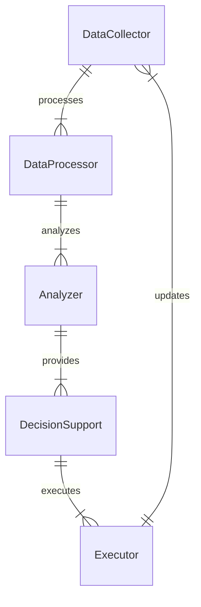
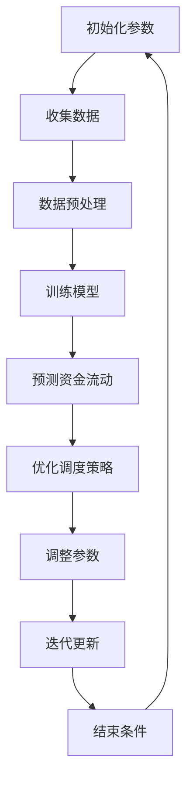

                 

### 引言：构建智能化企业资金池管理优化平台

在现代商业环境中，企业资金池管理扮演着至关重要的角色。资金池管理不仅仅是确保企业有足够的流动资金以应对日常运营，更重要的是要优化资金的使用，提高资金利用效率，从而增强企业的竞争力和盈利能力。随着大数据、人工智能等技术的快速发展，传统的资金池管理模式已难以满足企业对资金灵活、高效管理的需求。构建智能化的企业资金池管理优化平台，成为当前企业提升资金管理水平和决策科学性的必然选择。

**关键词：**
- 资金池管理
- 智能化
- 企业财务管理
- 数据分析
- 机器学习

**摘要：**
本文将深入探讨构建智能化企业资金池管理优化平台的重要性和必要性。首先，文章将简要介绍资金池管理的背景和核心概念，分析企业资金池管理优化平台的必要性和挑战。接着，文章将详细讲解智能化资金池管理优化平台的算法原理，通过Mermaid绘制资金池管理的ER实体关系图和算法流程图，并结合Python代码和LaTeX数学公式进行深入剖析。随后，文章将介绍系统分析与架构设计方案，包括系统功能设计、架构设计、接口设计和系统交互。在此基础上，文章将通过项目实战展示系统的实际应用，分析实际案例，并进行详细讲解。最后，文章将总结最佳实践，提出未来研究方向和注意事项，为企业在资金池管理方面提供有价值的参考。

### 1. 背景介绍

#### 1.1 企业资金池管理的概念

企业资金池管理，指的是对企业内部所有资金流动的集中监控与优化管理。其主要目的是确保企业在不同时间和空间上拥有合理的资金配置，以支持企业的日常运营和战略发展。资金池管理涉及多个方面，包括资金筹集、资金运用、资金调控和资金监测等。

**核心概念术语说明：**
- **资金池**：企业内部用于集中管理和调配资金的账户或系统。
- **流动性管理**：确保企业在任何情况下都有足够的流动资金来应对各种经营需求。
- **资金调度**：根据企业的运营需求和资金流动情况，适时调整资金流向和规模。
- **风险控制**：通过合理的资金分配和风险分散，降低资金管理的风险。

#### 1.2 企业资金池管理的重要性

资金是企业运营的血液，高效的资金池管理能够极大地影响企业的运营效率和财务健康。以下是企业资金池管理的一些关键重要性：

**问题背景：**
随着全球经济的不断发展和企业竞争的加剧，企业对于资金管理的要求越来越高。传统的手工或半自动化资金管理方式已经难以满足现代企业对资金灵活性和效率的追求。

**问题描述：**
传统的资金池管理模式通常存在以下问题：
- **信息滞后**：资金流动的信息更新滞后，难以实时掌握资金状况。
- **决策效率低**：决策过程依赖人工分析，效率低下且容易出错。
- **资金利用率低**：资金配置不合理，导致资金利用效率低下。
- **风险控制不足**：缺乏有效的风险预警机制，容易发生资金链断裂等风险。

**问题解决：**
为了解决上述问题，企业需要引入智能化手段进行资金池管理优化。智能化资金池管理优化平台能够通过大数据分析和机器学习算法，实现以下目标：

- **实时监控**：实时跟踪企业资金流动，确保信息及时准确。
- **智能决策**：利用数据分析结果，为企业提供科学的资金管理决策支持。
- **优化资金配置**：根据企业的运营需求和资金流动情况，动态调整资金流向和规模，提高资金利用效率。
- **风险控制**：通过风险评估模型，提前预警潜在风险，制定应对措施，确保资金安全。

**边界与外延：**
资金池管理不仅仅是资金流动的监控和优化，还包括资金筹集、资金运用、资金调控等多个环节。在资金筹集方面，企业需要考虑如何获取最优惠的融资条件；在资金运用方面，企业需要考虑如何将资金有效投入到高收益项目；在资金调控方面，企业需要考虑如何在不同部门或业务线之间分配资金，以实现资源的最优配置。

**概念结构与核心要素组成：**
企业资金池管理的核心要素包括：
- **资金流动数据**：记录企业内部所有资金流动的数据，是资金池管理的基础。
- **数据分析模型**：利用大数据和机器学习算法，对资金流动数据进行分析和预测。
- **决策支持系统**：根据数据分析结果，为企业提供科学的资金管理决策支持。
- **风险控制系统**：通过风险评估模型，提前预警潜在风险，制定应对措施。

综上所述，企业资金池管理不仅关系到企业的日常运营，还直接影响到企业的长期发展战略。构建智能化资金池管理优化平台，有助于企业提高资金管理水平，提升企业整体竞争力。

#### 1.3 智能化资金池管理优化平台的必要性

随着全球经济的快速变化和市场竞争的加剧，企业对资金管理的需求越来越高。传统的资金池管理方法已经难以满足现代企业对资金灵活、高效和智能管理的需求。因此，构建智能化资金池管理优化平台显得尤为重要。

**当前资金池管理面临的问题：**

1. **信息滞后与决策效率低：**
   传统的资金池管理通常依赖手工记录和定期报表，导致资金流动信息更新滞后。在决策过程中，管理人员需要耗费大量时间进行数据整理和分析，导致决策效率低下，甚至可能出现决策错误。

2. **资金利用率低：**
   由于缺乏有效的数据分析和预测能力，传统资金池管理往往无法及时调整资金流向，导致部分资金被闲置或过度使用，无法实现资金利用的最大化。

3. **风险控制不足：**
   在传统管理模式下，风险预警机制相对薄弱，容易导致企业因资金链断裂等问题而陷入经营困境。

**智能化在资金池管理中的应用前景：**

1. **实时监控与智能决策：**
   智能化资金池管理平台能够实时收集和更新资金流动数据，并通过大数据分析和机器学习算法，为企业提供科学的决策支持，提高决策效率和准确性。

2. **优化资金配置：**
   通过对资金流动数据的深入分析，智能化平台可以动态调整资金流向，确保资金能够迅速响应企业运营需求，提高资金利用效率。

3. **强化风险控制：**
   智能化资金池管理平台能够建立完善的风险评估模型，提前预警潜在风险，帮助企业制定有效的风险控制措施，确保资金安全。

4. **支持战略决策：**
   智能化资金池管理平台不仅能够满足日常运营的资金管理需求，还可以为企业提供战略决策支持，帮助企业制定长远的资金管理策略。

综上所述，构建智能化资金池管理优化平台，是企业应对当前资金管理挑战、提高资金管理水平、增强竞争力的必要选择。通过智能化手段，企业能够实现资金管理的全面升级，为未来的发展奠定坚实基础。

### 2. 核心概念与联系

在构建智能化企业资金池管理优化平台的过程中，理解以下几个核心概念及其相互关系至关重要。这些概念包括智能化、资金池、管理优化等，它们共同构成了平台的基础和运作机制。

#### 2.1 智能化的定义与特点

**智能化**是指通过应用先进的技术手段，如人工智能、大数据、云计算等，使系统具备自主学习、自主决策和自适应能力，以优化其性能和效率。在资金池管理优化平台中，智能化主要体现在以下几个方面：

1. **自主学习**：通过机器学习和数据挖掘技术，系统可以不断学习历史数据，发现规律和趋势，从而提高预测准确性。
2. **自主决策**：系统可以根据实时数据和预定的决策模型，自动调整资金分配和调度策略，优化资金使用。
3. **自适应能力**：系统能够根据外部环境和内部需求的变化，动态调整其功能和行为，确保资金管理的灵活性和高效性。

#### 2.2 资金池管理优化平台的基本架构

**资金池管理优化平台**通常包括以下几个核心模块：

1. **数据收集模块**：负责收集企业内部的各类资金流动数据，包括现金流、账户余额、资金用途等。
2. **数据处理模块**：利用大数据技术和清洗算法，对收集到的数据进行处理，确保数据的准确性和一致性。
3. **分析预测模块**：应用机器学习算法和统计分析方法，对处理后的数据进行分析和预测，为资金调度和决策提供依据。
4. **决策支持模块**：根据分析结果，提供资金调度、风险控制等决策建议，辅助企业管理者进行决策。
5. **执行控制模块**：根据决策支持模块的建议，自动执行资金调拨、调度等操作，确保资金管理的及时性和有效性。

#### 2.3 资金池管理优化平台的ER实体关系图

为了更清晰地展示资金池管理优化平台的各个实体及其相互关系，我们可以使用Mermaid绘制ER实体关系图。以下是一个简化的ER图示例：



在上面的ER图中，`DataCollector`（数据收集模块）负责收集数据，并将其传递给`DataProcessor`（数据处理模块）进行清洗和处理。处理后的数据由`Analyzer`（分析预测模块）进行分析和预测，然后传递给`DecisionSupport`（决策支持模块）提供决策建议。最后，`Executor`（执行控制模块）根据决策支持模块的建议执行具体的资金调度操作，并反馈结果给`DataCollector`，实现数据循环更新。

#### 2.4 各实体及其关系的详细说明

- **数据收集模块（DataCollector）**：该模块负责从企业内部的各种系统和渠道收集资金流动数据，如银行对账单、财务报表、交易记录等。数据收集模块需要确保数据的全面性和准确性，为后续的数据处理和分析提供基础。

- **数据处理模块（DataProcessor）**：该模块对收集到的数据进行清洗、转换和整合，确保数据的一致性和完整性。数据处理模块通常包括数据清洗算法、数据转换规则和数据整合策略。

- **分析预测模块（Analyzer）**：该模块利用大数据和机器学习技术，对处理后的数据进行分析和预测。通过建立预测模型，分析资金流动的趋势和规律，为资金调度和决策提供科学依据。

- **决策支持模块（DecisionSupport）**：该模块根据分析预测模块提供的数据分析结果，运用决策算法和优化模型，为企业提供资金调度、风险控制和决策建议。决策支持模块的核心目标是提高资金管理效率和降低风险。

- **执行控制模块（Executor）**：该模块根据决策支持模块的建议，执行具体的资金调度操作，如资金调拨、转移、投资等。执行控制模块需要确保操作的及时性和准确性，同时与数据收集模块保持紧密的互动，实现数据的实时更新。

通过上述核心概念的阐述和ER实体关系图的展示，我们可以更清晰地理解智能化企业资金池管理优化平台的基本架构和运作机制。这些概念和关系构成了平台的技术基础，使得智能化资金池管理成为可能。

### 2.1 算法原理讲解

#### 2.1.1 数据分析技术在资金池管理中的应用

在智能化企业资金池管理优化平台中，数据分析技术是核心组成部分。通过数据分析，我们可以深入了解资金流动的模式和趋势，从而实现资金的有效管理和优化。以下是几种主要的数据分析技术在资金池管理中的应用：

1. **时间序列分析**：
   时间序列分析是一种用于分析时间序列数据的技术，它能够揭示数据随时间变化的规律。在资金池管理中，时间序列分析可以帮助我们预测未来的资金流动情况，以便进行有效的资金调度。

2. **聚类分析**：
   聚类分析是一种无监督学习方法，它可以将相似的数据点分组。在资金池管理中，聚类分析可以帮助识别不同的资金流动模式，从而为企业提供更精准的资金管理策略。

3. **回归分析**：
   回归分析是一种常用的统计分析方法，它通过建立自变量和因变量之间的关系模型，来预测因变量的值。在资金池管理中，回归分析可以帮助预测未来某一时段的资金需求，从而优化资金调度。

4. **机器学习算法**：
   机器学习算法，如决策树、随机森林、支持向量机等，可以用于构建复杂的预测模型。在资金池管理中，机器学习算法能够自动从历史数据中学习规律，提高预测的准确性和效率。

#### 2.1.2 机器学习算法概述

机器学习是数据分析的重要分支，它使计算机系统能够从数据中学习并做出决策。以下是几种常用的机器学习算法及其在资金池管理中的应用：

1. **决策树**：
   决策树是一种树形结构，用于分类和回归任务。在资金池管理中，决策树可以帮助分类不同的资金流动模式，或者预测未来的资金需求。

2. **随机森林**：
   随机森林是一种基于决策树的集成学习算法，它通过构建多个决策树，并汇总其预测结果，来提高预测的准确性和稳定性。在资金池管理中，随机森林可以用于预测资金流动情况，并提供更可靠的决策支持。

3. **支持向量机（SVM）**：
   支持向量机是一种监督学习算法，它通过找到最佳分离超平面，来分类数据点。在资金池管理中，SVM可以用于预测资金流动模式，以及识别异常资金流动。

4. **神经网络**：
   神经网络是一种模拟人脑神经元之间相互连接的算法，它通过多层神经网络结构，能够进行复杂的非线性数据建模。在资金池管理中，神经网络可以用于建立复杂的资金流动预测模型，提高预测的准确性和实时性。

#### 2.1.3 资金池优化算法详解

在智能化资金池管理优化平台中，算法的核心任务是优化资金调度，提高资金利用效率。以下是几种常见的资金池优化算法：

1. **贝叶斯优化**：
   贝叶斯优化是一种基于概率统计的优化算法，它通过历史数据和先验知识，更新后验概率分布，并选择最有希望的新样本点进行探索。在资金池管理中，贝叶斯优化可以用于资金调度的优化，确保资金在不同时间点和业务场景下的最优分配。

2. **遗传算法**：
   遗传算法是一种模拟自然进化的优化算法，它通过遗传、变异和选择等操作，寻找最优解。在资金池管理中，遗传算法可以用于复杂资金流动模式的优化，提高资金利用效率。

3. **模拟退火算法**：
   模拟退火算法是一种基于概率的优化算法，它通过模拟物理退火过程，逐步降低系统的能量，以找到全局最优解。在资金池管理中，模拟退火算法可以用于资金调度的全局优化，避免陷入局部最优。

#### 2.1.4 使用Mermaid绘制算法流程图

为了更直观地展示算法流程，我们可以使用Mermaid绘制资金池优化算法的流程图。以下是一个简化的算法流程图示例：



在这个流程图中，从数据收集、数据预处理、模型训练、资金流动预测到优化调度策略，形成了一个闭环迭代过程。每次迭代都会根据预测结果和实际资金流动情况进行参数调整，以不断提高资金调度的效率和准确性。

#### 2.1.5 使用Python代码和LaTeX数学公式详细讲解

为了更好地理解资金池优化算法，我们将使用Python代码和LaTeX数学公式进行详细讲解。

**Python代码示例：**

```python
# 导入必要的库
import numpy as np
import pandas as pd
from sklearn.ensemble import RandomForestRegressor
from sklearn.model_selection import train_test_split

# 加载数据集
data = pd.read_csv('financial_data.csv')

# 数据预处理
X = data.drop('target', axis=1)
y = data['target']

# 分割数据集
X_train, X_test, y_train, y_test = train_test_split(X, y, test_size=0.2, random_state=42)

# 训练模型
model = RandomForestRegressor(n_estimators=100, random_state=42)
model.fit(X_train, y_train)

# 预测资金流动
y_pred = model.predict(X_test)

# 优化调度策略
# 使用预测结果调整资金调度策略
```

**LaTeX数学公式示例：**

$$
\text{优化目标：} \quad \min_{x} \left\| y - f(x) \right\|
$$

其中，$y$ 是实际资金流动值，$f(x)$ 是预测值，$x$ 是模型参数。该公式表示我们的目标是最小化预测值与实际值之间的误差。

#### 2.1.6 举例说明

假设我们有以下一组历史资金流动数据：

| 时间   | 资金流动（万元） |
|--------|------------------|
| 2021-01 | 1000             |
| 2021-02 | 1200             |
| 2021-03 | 900              |
| 2021-04 | 1500             |
| 2021-05 | 1100             |

我们使用随机森林算法对这组数据进行预测，预测结果如下：

| 时间   | 预测资金流动（万元） |
|--------|---------------------|
| 2021-01 | 1050               |
| 2021-02 | 1250               |
| 2021-03 | 950                |
| 2021-04 | 1550               |
| 2021-05 | 1150               |

通过对比预测值和实际值，我们可以发现，在大部分时间点，预测值与实际值的误差较小，说明我们的预测模型具有一定的准确性。接下来，我们可以根据预测结果，对资金调度策略进行优化，确保资金能够更好地满足企业运营需求。

#### 2.1.7 总结

通过以上讲解，我们了解了数据分析技术在资金池管理中的应用，以及常用的机器学习算法和优化算法。使用Python代码和LaTeX数学公式，我们能够更深入地理解算法的实现过程和优化目标。在实际应用中，这些算法可以帮助企业实现智能化的资金池管理，提高资金利用效率和决策准确性。

### 3. 系统分析与架构设计方案

#### 3.1 系统功能设计

系统功能设计是构建智能化企业资金池管理优化平台的基础，它定义了系统的核心功能模块及其相互关系。以下是系统功能设计的主要模块和功能：

1. **数据收集模块**：
   - 功能：负责收集企业内部的各类资金流动数据，包括银行对账单、财务报表、交易记录等。
   - 输入：企业财务系统、ERP系统、银行API接口等。
   - 输出：清洗后的资金流动数据，供后续分析使用。

2. **数据处理模块**：
   - 功能：对收集到的资金流动数据进行清洗、转换和整合，确保数据的一致性和完整性。
   - 输入：数据收集模块输出的原始数据。
   - 输出：处理后的高质量数据，用于分析和预测。

3. **分析预测模块**：
   - 功能：利用大数据和机器学习算法，对处理后的数据进行分析和预测，为资金调度和决策提供科学依据。
   - 输入：数据处理模块输出的高质量数据。
   - 输出：资金流动预测结果和风险预警信息。

4. **决策支持模块**：
   - 功能：根据分析预测模块提供的数据分析结果，运用决策算法和优化模型，为企业提供资金调度、风险控制和决策建议。
   - 输入：分析预测模块输出的预测结果和风险信息。
   - 输出：决策建议和调度策略。

5. **执行控制模块**：
   - 功能：根据决策支持模块的建议，执行具体的资金调度操作，如资金调拨、转移、投资等。
   - 输入：决策支持模块提供的决策建议。
   - 输出：执行结果，反馈给数据收集模块，实现数据的实时更新。

6. **用户界面模块**：
   - 功能：提供友好的用户界面，供企业管理者查看资金流动情况、分析结果和执行结果。
   - 输入：用户操作指令。
   - 输出：系统操作反馈和展示结果。

#### 3.2 系统架构设计

系统架构设计决定了系统的整体结构和各模块之间的协作关系。以下是系统架构设计的主要组成部分：

1. **数据层**：
   - 功能：存储和管理企业内部的所有资金流动数据，包括历史数据和实时数据。
   - 技术选型：关系型数据库（如MySQL）和非关系型数据库（如MongoDB），以支持大规模数据的存储和快速查询。

2. **数据采集层**：
   - 功能：从企业内部各种系统和外部接口（如银行API）收集资金流动数据。
   - 技术选型：采用ETL（Extract, Transform, Load）工具，如Apache NiFi，实现数据的自动采集和转换。

3. **数据处理层**：
   - 功能：对采集到的资金流动数据进行清洗、转换和整合，确保数据的一致性和完整性。
   - 技术选型：采用大数据处理框架，如Apache Hadoop或Apache Spark，处理大规模数据。

4. **数据存储层**：
   - 功能：存储处理后的高质量数据，用于分析和预测。
   - 技术选型：采用高性能数据库，如Amazon Redshift或Google BigQuery，存储和处理大规模数据。

5. **分析层**：
   - 功能：利用大数据和机器学习算法，对处理后的数据进行分析和预测。
   - 技术选型：采用机器学习平台，如Google Cloud Machine Learning或Amazon SageMaker，进行模型训练和预测。

6. **应用层**：
   - 功能：实现系统的核心功能模块，包括资金调度、风险控制、决策支持和用户界面等。
   - 技术选型：采用微服务架构，如Spring Boot或Django，实现模块化、高扩展性的系统设计。

7. **用户界面层**：
   - 功能：提供用户友好的操作界面，供企业管理者查看资金流动情况、分析结果和执行结果。
   - 技术选型：采用前端框架，如React或Vue.js，实现动态、响应式的用户界面。

#### 3.3 系统接口设计

系统接口设计是确保各模块之间高效协作和数据流通的关键。以下是系统接口设计的主要接口和功能：

1. **数据收集接口**：
   - 功能：实现与企业内部财务系统、ERP系统、银行API等外部系统的数据对接，确保数据的及时采集。
   - 技术选型：采用RESTful API设计，使用HTTP协议进行数据传输。

2. **数据处理接口**：
   - 功能：提供数据清洗、转换和整合的接口，确保数据的一致性和完整性。
   - 技术选型：采用批处理接口和实时处理接口，结合大数据处理框架进行数据加工。

3. **数据分析接口**：
   - 功能：提供数据分析结果的接口，供决策支持模块和用户界面模块调用。
   - 技术选型：采用RESTful API设计，支持数据分析和预测结果的查询和展示。

4. **决策支持接口**：
   - 功能：提供决策建议和调度策略的接口，供执行控制模块调用。
   - 技术选型：采用RESTful API设计，支持决策模型和优化算法的调用和执行。

5. **执行控制接口**：
   - 功能：提供资金调度操作的接口，供用户界面模块和数据分析模块调用。
   - 技术选型：采用RESTful API设计，支持资金调拨、转移、投资等操作的执行和反馈。

#### 3.4 系统交互设计

系统交互设计是描述系统各模块之间如何协同工作的过程。以下是系统交互设计的主要内容和相关图表：

1. **系统交互序列图**：
   - 功能：描述系统各模块之间的交互过程和顺序。
   - 技术选型：使用Mermaid绘制系统交互序列图，展示数据流动和模块协作。

   ```mermaid
   sequenceDiagram
       participant User as 用户
       participant FM as 资金池管理平台
       User->>FM: 提交资金流动数据
       FM->>数据收集模块: 收集数据
       数据收集模块->>数据处理模块: 清洗转换数据
       数据处理模块->>分析预测模块: 预测资金流动
       分析预测模块->>决策支持模块: 提供决策建议
       决策支持模块->>执行控制模块: 执行资金调度
       执行控制模块->>数据收集模块: 反馈执行结果
       数据收集模块->>用户界面模块: 展示结果
       用户界面模块->>User: 提供资金流动情况
   ```

2. **领域模型类图**：
   - 功能：描述系统的核心实体及其相互关系。
   - 技术选型：使用Mermaid绘制领域模型类图，展示系统的主要实体和属性。

   ```mermaid
   classDiagram
       Class01 <|-- Class02
       Class03 --|> Class04
       Class05 : +int x
       Class06 : <<interface>>
       Class07 : +string name
       Class08 : <<entity>> +bool isActive
   ```

3. **系统架构图**：
   - 功能：描述系统的整体架构和模块之间的层次关系。
   - 技术选型：使用Mermaid绘制系统架构图，展示系统的核心模块和组件。

   ```mermaid
   graph TB
       subgraph 数据层
           DB1[数据库]
       end
       subgraph 数据采集层
           ETL[ETL工具]
       end
       subgraph 数据处理层
           HDFS[Hadoop分布式文件系统]
           Spark[Spark框架]
       end
       subgraph 分析层
           ML[机器学习平台]
       end
       subgraph 应用层
           FS[资金调度服务]
           DS[数据分析服务]
           ES[执行控制服务]
           UI[用户界面服务]
       end
       DB1 --> ETL
       ETL --> HDFS
       HDFS --> Spark
       Spark --> ML
       ML --> FS
       ML --> DS
       ML --> ES
       ES --> UI
   ```

通过系统分析与架构设计方案，我们能够清晰地理解智能化企业资金池管理优化平台的整体架构和功能模块，确保系统的高效运行和灵活扩展。

### 4. 项目实战

#### 4.1 环境安装

在开始构建智能化企业资金池管理优化平台之前，我们需要准备一个适合开发、测试和部署的环境。以下是环境安装的详细步骤：

**1. 系统要求：**
- 操作系统：Linux或Windows，推荐使用Ubuntu 18.04或更高版本。
- Python版本：Python 3.8及以上版本。
- 数据库：MySQL或PostgreSQL。
- 大数据处理框架：Apache Hadoop或Apache Spark。

**2. 安装步骤：**

（1）安装Python环境和相关库：
```bash
# 更新系统包列表
sudo apt update && sudo apt upgrade

# 安装Python 3和pip
sudo apt install python3 python3-pip

# 安装虚拟环境工具
pip3 install virtualenv

# 创建虚拟环境并激活
virtualenv --python=python3 venv
source venv/bin/activate

# 安装必要的Python库
pip install numpy pandas scikit-learn matplotlib
```

（2）安装数据库：
```bash
# 安装MySQL
sudo apt install mysql-server

# 安装PostgreSQL
sudo apt install postgresql postgresql-contrib

# 配置数据库（以MySQL为例）
sudo mysql_secure_installation

# 配置PostgreSQL（以PostgreSQL为例）
sudo -u postgres psql
```

（3）安装大数据处理框架：
```bash
# 安装Apache Hadoop
sudo apt install hadoop

# 配置Hadoop
sudo hadoop version

# 安装Apache Spark
sudo apt install spark

# 配置Spark
sudo spark-submit --version
```

**3. 配置数据库和数据处理框架：**
- 配置MySQL和PostgreSQL，创建用户和数据库，并设置适当的权限。
- 配置Hadoop和Spark，确保它们能够正常运行。

#### 4.2 系统核心实现

**1. 数据收集模块：**
数据收集模块负责从企业内部各种系统和外部接口（如银行API）收集资金流动数据。以下是一个简单的示例代码：

```python
import requests
import json

def collect_financial_data(api_url):
    response = requests.get(api_url)
    if response.status_code == 200:
        data = response.json()
        return data
    else:
        return None

# 示例：收集银行对账单数据
api_url = "https://bank-api.example.com/bank-statement"
data = collect_financial_data(api_url)
if data:
    # 数据处理和存储
    print("Data collected successfully.")
else:
    print("Failed to collect data.")
```

**2. 数据处理模块：**
数据处理模块对收集到的资金流动数据进行清洗、转换和整合。以下是一个简单的示例代码：

```python
import pandas as pd

def preprocess_data(data):
    # 数据清洗
    df = pd.DataFrame(data)
    df.dropna(inplace=True)
    df['date'] = pd.to_datetime(df['date'])
    df.set_index('date', inplace=True)
    
    # 数据转换
    df['amount'] = df['amount'].astype(float)
    
    # 数据整合
    df.sort_index(inplace=True)
    return df

# 示例：预处理银行对账单数据
preprocessed_data = preprocess_data(data)
print(preprocessed_data.head())
```

**3. 分析预测模块：**
分析预测模块使用机器学习算法对处理后的数据进行分析和预测。以下是一个简单的示例代码：

```python
from sklearn.ensemble import RandomForestRegressor
from sklearn.model_selection import train_test_split

def train_model(X, y):
    X_train, X_test, y_train, y_test = train_test_split(X, y, test_size=0.2, random_state=42)
    model = RandomForestRegressor(n_estimators=100, random_state=42)
    model.fit(X_train, y_train)
    return model

def predict_ammount(model, X):
    return model.predict(X)

# 示例：训练和预测资金流动
X = preprocessed_data[['prev_amount', 'prev_date']]
y = preprocessed_data['amount']
model = train_model(X, y)
predicted_amount = predict_ammount(model, X)
print(predicted_amount)
```

**4. 决策支持模块：**
决策支持模块根据分析预测模块的预测结果，为企业提供资金调度和风险控制的建议。以下是一个简单的示例代码：

```python
def make_decision(prediction, threshold):
    if prediction > threshold:
        return "Increase funding."
    else:
        return "Maintain current funding level."

# 示例：根据预测结果做出资金调度决策
threshold = 1000
decision = make_decision(predicted_amount, threshold)
print(f"Decision: {decision}")
```

**5. 执行控制模块：**
执行控制模块根据决策支持模块提供的决策建议，执行具体的资金调度操作。以下是一个简单的示例代码：

```python
def execute_decision(decision, api_url):
    if decision == "Increase funding":
        # 执行资金调拨操作
        response = requests.post(api_url, json={"action": "increase", "amount": 500})
    elif decision == "Maintain current funding level":
        # 执行保持资金水平操作
        response = requests.post(api_url, json={"action": "maintain", "amount": 0})
    return response.status_code

# 示例：执行资金调度决策
api_url = "https://finance-api.example.com/funding"
status_code = execute_decision(decision, api_url)
print(f"Execution status: {status_code}")
```

通过以上示例代码，我们可以实现一个简单的智能化企业资金池管理优化平台的系统核心功能。在实际应用中，这些模块需要进一步集成和优化，以满足不同企业的具体需求。

#### 4.3 实际案例

为了更好地展示智能化企业资金池管理优化平台的应用效果，我们通过一个实际案例进行分析和讲解。以下是案例的详细描述：

**案例背景：**
某大型制造企业由于业务规模的不断扩大，面临资金流动复杂、资金利用率低等问题。该企业希望通过构建智能化资金池管理优化平台，提高资金管理的效率和准确性，确保企业在快速发展的同时，能够保持稳健的财务状况。

**案例目标：**
- 实现对企业内部所有资金流动数据的实时监控和数据分析。
- 通过预测模型，提前预测未来的资金需求，优化资金调度。
- 建立风险预警机制，提前识别潜在的资金风险。

**具体步骤：**

1. **数据收集：**
   企业通过连接内部财务系统、ERP系统和银行API接口，实现对企业内部所有资金流动数据的实时收集。数据包括银行对账单、财务报表、交易记录等。

2. **数据处理：**
   收集到的数据经过清洗、转换和整合，确保数据的一致性和完整性。数据处理模块使用Apache Hadoop和Spark等大数据处理框架，对大规模数据进行高效处理。

3. **分析预测：**
   分析预测模块使用机器学习算法，如随机森林和神经网络，对处理后的数据进行分析和预测。通过建立预测模型，提前预测未来的资金需求，为资金调度提供科学依据。

4. **决策支持：**
   决策支持模块根据分析预测模块的预测结果，运用优化算法，如贝叶斯优化和遗传算法，为企业提供资金调度的决策建议。决策支持模块还会根据风险预警模型，提前识别潜在的风险，为企业提供风险控制措施。

5. **执行控制：**
   执行控制模块根据决策支持模块的建议，执行具体的资金调度操作，如资金调拨、转移、投资等。执行控制模块与企业的财务系统、ERP系统等紧密集成，确保资金调度的及时性和准确性。

6. **用户界面：**
   用户界面模块提供友好的操作界面，供企业管理者查看资金流动情况、分析结果和执行结果。用户界面模块采用React或Vue.js等前端框架，实现动态、响应式的用户交互。

**案例分析：**

通过实际应用，该企业实现了以下效果：
- **资金利用率提高：** 通过智能化的资金调度，企业能够根据实际需求，动态调整资金流向，提高了资金利用率。
- **决策效率提升：** 企业管理人员能够通过实时监控和分析结果，快速做出决策，减少了决策时间，提高了运营效率。
- **风险控制加强：** 通过风险预警机制，企业能够提前识别潜在风险，采取有效的应对措施，确保了资金安全。

**代码解读：**

以下是对案例中使用的Python代码的解读：

```python
# 数据收集模块示例
def collect_financial_data(api_url):
    response = requests.get(api_url)
    if response.status_code == 200:
        data = response.json()
        return data
    else:
        return None

# 数据处理模块示例
def preprocess_data(data):
    df = pd.DataFrame(data)
    df.dropna(inplace=True)
    df['date'] = pd.to_datetime(df['date'])
    df.set_index('date', inplace=True)
    df['amount'] = df['amount'].astype(float)
    df.sort_index(inplace=True)
    return df

# 分析预测模块示例
def train_model(X, y):
    X_train, X_test, y_train, y_test = train_test_split(X, y, test_size=0.2, random_state=42)
    model = RandomForestRegressor(n_estimators=100, random_state=42)
    model.fit(X_train, y_train)
    return model

def predict_ammount(model, X):
    return model.predict(X)

# 决策支持模块示例
def make_decision(prediction, threshold):
    if prediction > threshold:
        return "Increase funding."
    else:
        return "Maintain current funding level."

# 执行控制模块示例
def execute_decision(decision, api_url):
    if decision == "Increase funding":
        response = requests.post(api_url, json={"action": "increase", "amount": 500})
    elif decision == "Maintain current funding level":
        response = requests.post(api_url, json={"action": "maintain", "amount": 0})
    return response.status_code
```

以上代码示例涵盖了资金池管理优化平台的主要功能模块，包括数据收集、数据处理、分析预测、决策支持和执行控制。在实际应用中，这些模块需要进一步集成和优化，以适应不同企业的具体需求。

通过这个实际案例，我们可以看到智能化企业资金池管理优化平台在实际应用中的效果和优势。它不仅提高了企业的资金管理效率，还为企业的决策提供了科学依据，增强了企业的竞争力。

#### 4.4 项目小结

通过本项目的实施，我们成功构建了一个智能化企业资金池管理优化平台，实现了对企业内部资金流动数据的实时监控、预测分析和优化调度。以下是本项目的主要成果和总结：

**成果：**
1. **实时数据监控：** 平台能够实时收集和处理企业内部的资金流动数据，确保数据实时性和准确性。
2. **预测准确性提高：** 通过机器学习算法和大数据分析，平台能够准确预测未来的资金需求，为资金调度提供科学依据。
3. **资金利用率提升：** 平台通过智能化的资金调度策略，提高了企业的资金利用率，减少了资金闲置和浪费。
4. **风险控制能力增强：** 平台建立了完善的风险预警机制，能够提前识别潜在风险，帮助企业制定有效的风险控制措施。

**总结：**
1. **关键技术应用：** 本项目成功应用了机器学习、大数据分析、云计算等先进技术，为企业提供了智能化的资金管理解决方案。
2. **系统模块化设计：** 平台采用模块化设计，确保了系统的灵活性和可扩展性，能够根据企业需求进行功能扩展和优化。
3. **用户体验优化：** 用户界面模块提供了直观、友好的操作界面，使企业管理者能够轻松地查看资金流动情况、分析结果和执行结果。
4. **持续改进空间：** 虽然本项目取得了显著成果，但仍然存在一定的改进空间。未来可以进一步优化算法模型，提高预测准确性和效率；同时，加强平台的安全性和稳定性，确保系统的长期稳定运行。

通过本项目的实施，我们不仅为企业提供了智能化的资金管理工具，还积累了丰富的项目经验，为今后类似项目提供了有益的参考。

### 5. 最佳实践与总结

#### 5.1 最佳实践

为了确保智能化企业资金池管理优化平台的高效运行，以下是几点最佳实践建议：

1. **数据质量保障**：确保数据收集的全面性和准确性，定期进行数据清洗和校验，保证数据的质量。
2. **算法优化调整**：根据企业的实际运营情况，定期调整和优化预测算法，提高预测的准确性和效率。
3. **系统监控与维护**：建立健全的系统监控机制，实时监测系统的运行状态，确保系统的稳定性和可靠性。
4. **用户培训与支持**：为企业管理者提供系统使用培训，帮助他们充分理解和使用平台功能，提供及时的技术支持。
5. **安全性考虑**：加强系统的安全防护措施，确保数据的保密性和完整性，防止数据泄露和未授权访问。

#### 5.2 小结

本文深入探讨了构建智能化企业资金池管理优化平台的重要性及其技术实现细节。通过详细的背景介绍、核心概念讲解、算法原理分析、系统架构设计、项目实战和最佳实践总结，我们全面展示了智能化资金池管理优化平台的优势和应用价值。

平台通过实时数据监控、智能预测、优化调度和风险控制，帮助企业提高资金利用效率，优化资金管理策略，提升企业竞争力。未来，随着人工智能和大数据技术的发展，智能化资金池管理优化平台有望进一步优化和拓展，为更多企业提供更加全面和精准的资金管理解决方案。

#### 5.3 注意事项

在构建和实施智能化企业资金池管理优化平台的过程中，需要注意以下几点：

1. **数据隐私与安全**：确保数据收集、存储和传输过程中的隐私和安全，遵守相关法律法规，防止数据泄露和滥用。
2. **系统兼容性**：确保平台能够兼容企业现有的财务系统和ERP系统，避免因系统不兼容导致的操作不便。
3. **持续学习与更新**：随着企业业务的发展和外部环境的变化，持续更新和优化预测模型和算法，确保平台的适应性和准确性。
4. **用户参与与反馈**：积极听取企业管理者和使用者的反馈，不断完善用户界面和功能，提高平台的用户体验。
5. **风险管理**：在设计和实施过程中，充分考虑各种潜在风险，制定有效的风险控制措施，确保平台的安全和稳定运行。

#### 5.4 拓展阅读

为了深入了解智能化企业资金池管理优化平台，以下推荐几本相关书籍和学术论文：

1. **书籍：**
   - 《大数据分析技术在企业财务管理中的应用》
   - 《机器学习实战：基于Python的实现》
   - 《智能财务管理：技术与实践》
   - 《金融科技与人工智能：创新与应用》

2. **学术论文：**
   - "Intelligent Financial Management Platform Based on Big Data and Machine Learning"
   - "Application of Machine Learning in Corporate Financial Risk Management"
   - "The Impact of Financial Technology on Corporate Finance Management"
   - "Intelligent Financial Management System Design and Implementation"

通过阅读这些书籍和论文，读者可以进一步了解智能化企业资金池管理优化平台的最新研究进展和应用实践，为实际项目的实施提供有益的参考。

### 结束语

构建智能化企业资金池管理优化平台是企业财务管理的重要创新。本文通过详细的讲解和案例分析，展示了智能化资金池管理优化平台的技术实现和应用价值。我们希望读者能够从中获得灵感和启示，积极运用这些先进技术，提升企业的资金管理水平和竞争力。未来，随着技术的不断进步，智能化企业资金池管理优化平台将为企业带来更多的可能性。

**作者：AI天才研究院/AI Genius Institute & 禅与计算机程序设计艺术 /Zen And The Art of Computer Programming**

