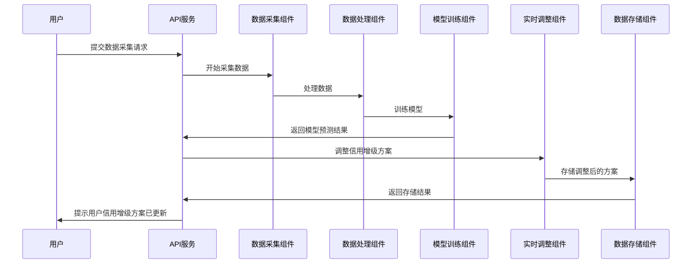

                 

### 第3章：信用增级方法

在资产证券化过程中，信用增级是一个至关重要的环节。信用增级的主要目的是通过提高资产支持证券（ABS）的信用等级，降低投资者的风险，从而提高ABS的市场吸引力。以下将详细探讨几种常见的信用增级方法。

#### 3.1.1 担保增级

担保增级是一种传统的信用增级方法，通过引入第三方担保机构，如银行、保险公司或其他信用良好的机构，为ABS提供额外的信用保障。担保机构承诺在ABS违约时承担一定的赔偿责任，从而降低了ABS的违约风险。

**担保增级的优点：**
- 提供额外的信用保障，降低投资者风险。
- 增强ABS的市场吸引力。

**担保增级的缺点：**
- 担保机构可能要求收取一定的费用。
- 如果担保机构自身信用等级下降，担保增级的效果可能会受到影响。

**案例：** 
例如，在美国次贷危机期间，许多按揭贷款证券化产品就通过银行担保增级来提高信用等级。

#### 3.1.2 保险增级

保险增级是通过购买信用保险来提高ABS的信用等级。信用保险公司承担ABS违约的风险，并在发生违约时向投资者支付赔偿。

**保险增级的优点：**
- 提供灵活的信用保障，可以根据ABS的具体需求定制保险条款。
- 减轻担保机构的要求，降低发行成本。

**保险增级的缺点：**
- 保险费用可能较高。
- 如果信用保险公司信用等级下降，保险增级的效果可能会受到影响。

**案例：** 
例如，某些国家的基础设施ABS就通过购买信用保险来提高信用等级。

#### 3.1.3 抵押增级

抵押增级是指将原始资产作为抵押品，通过降低ABS的资产回收率来提高其信用等级。当ABS违约时，投资者可以通过出售或处置抵押资产来收回部分投资。

**抵押增级的优点：**
- 提供直接的信用保障，降低ABS的违约风险。
- 抵押资产的变现能力较强。

**抵押增级的缺点：**
- 如果抵押资产的市场价值下降，抵押增级的效果可能会受到影响。
- 需要花费额外的时间和资源来管理和维护抵押资产。

**案例：** 
例如，某些国家的不动产ABS就通过抵押增级来提高信用等级。

#### 3.1.4 过度抵押

过度抵押是指将原始资产的价值超出ABS的面值作为抵押，以提高ABS的信用等级。

**过度抵押的优点：**
- 提供更高的信用保障，降低ABS的违约风险。
- 可以提高ABS的市场吸引力。

**过度抵押的缺点：**
- 如果原始资产的价值下降，过度抵押可能会增加ABS的违约风险。
- 可能会导致资金利用效率降低。

**案例：** 
例如，某些国家的基础设施项目ABS就通过过度抵押来提高信用等级。

#### 3.1.5 信用触发机制

信用触发机制是一种通过设定特定的信用触发条件，来调整信用增级措施的方法。当这些触发条件满足时，信用增级措施将自动进行调整。

**信用触发机制的优点：**
- 提高信用增级的灵活性，可以根据市场变化及时调整。
- 可以降低管理成本。

**信用触发机制的缺点：**
- 如果触发条件设置不合理，可能导致信用增级措施的频繁调整，增加管理成本。
- 可能会引发市场不稳定。

**案例：** 
例如，某些ABS产品就通过信用触发机制来调整担保机构的担保金额。

#### 总结

以上介绍了六种常见的信用增级方法，每种方法都有其独特的优势和局限性。在实际应用中，通常会结合多种信用增级方法，以达到最佳的风险管理和信用保障效果。

### 3.2 信用增级的动态优化

随着金融市场和技术的不断进步，传统的信用增级方法已经难以满足复杂多变的市场环境。为了实现更高效的信用增级，智能化和动态优化成为了研究的热点。

#### 3.2.1 动态优化的意义

动态优化是指在资产证券化过程中，根据市场变化和风险水平，实时调整信用增级方案，以提高信用增级的效率和质量。动态优化的意义在于：

- **适应市场变化**：金融市场变化快速，动态优化可以及时调整信用增级方案，以适应市场环境。
- **降低风险**：通过动态优化，可以更好地识别和管理风险，降低ABS的违约风险。
- **提高信用等级**：动态优化可以优化信用增级措施，提高ABS的信用等级，从而提高其市场吸引力。

#### 3.2.2 动态优化的挑战

尽管动态优化具有显著的优势，但在实际应用中仍然面临一些挑战：

- **数据质量**：动态优化依赖于大量的市场数据和历史数据，数据质量直接影响到优化结果。
- **计算复杂度**：动态优化涉及大量的计算，如何高效地进行计算是一个重要问题。
- **模型适应性**：动态优化模型需要具有较好的适应性，能够适应不同的市场环境和风险水平。

#### 3.2.3 智能化动态优化的方法

为了实现信用增级的动态优化，可以采用以下几种智能化方法：

- **机器学习**：利用机器学习算法，对历史数据进行分析，预测市场变化和风险水平，从而调整信用增级方案。
- **深度学习**：深度学习算法可以处理大量的数据，通过神经网络模型，实现更复杂的信用增级优化。
- **优化算法**：结合优化算法，如遗传算法、粒子群算法等，对信用增级方案进行动态调整。

#### 3.2.4 动态优化的应用场景

动态优化可以在以下场景中得到广泛应用：

- **市场波动较大的金融市场**：如股票市场、债券市场等，市场波动性大，动态优化可以有效降低风险。
- **风险水平较高的资产证券化项目**：如不动产ABS、基础设施ABS等，这些项目的风险较高，动态优化有助于提高信用等级。
- **需要快速响应的市场环境**：如金融市场突发事件、自然灾害等，动态优化可以快速调整信用增级方案，降低风险。

### 本章小结

本章首先介绍了传统信用增级方法的种类及其优缺点，然后探讨了动态优化在信用增级中的应用。通过本章的学习，读者可以了解信用增级的方法及其在资产证券化中的应用，为后续章节的深入研究奠定基础。### 第4章: 人工智能技术在信用增级动态优化中的应用

#### 4.1 人工智能技术概述

人工智能（AI）是指通过计算机模拟人类智能行为的技术。在过去的几十年中，人工智能技术取得了显著的进展，特别是在机器学习、深度学习和自然语言处理等领域。这些技术为解决复杂问题提供了强大的工具，也为信用增级动态优化提供了新的思路和方法。

**机器学习**：机器学习是一种通过训练模型，让计算机从数据中自动学习和发现规律的方法。常见的机器学习算法包括线性回归、决策树、随机森林、支持向量机等。

**深度学习**：深度学习是一种基于多层神经网络的学习方法，通过逐层提取特征，实现更复杂的任务。深度学习的代表性算法包括卷积神经网络（CNN）、循环神经网络（RNN）、长短期记忆网络（LSTM）等。

**自然语言处理**：自然语言处理是一种使计算机能够理解、处理和生成人类语言的技术。自然语言处理在金融市场分析、文本挖掘等领域具有广泛的应用。

#### 4.2 人工智能技术在信用增级中的应用

在信用增级的动态优化中，人工智能技术可以发挥重要作用，主要包括以下几个方面：

**数据挖掘**：通过人工智能技术，可以挖掘大量市场数据和历史数据，识别潜在的风险因素和信用变化趋势。

**风险评估**：利用机器学习和深度学习算法，可以对ABS的风险进行精准评估，预测可能的违约事件。

**信用增级方案优化**：通过优化算法，结合人工智能技术，可以实时调整信用增级方案，提高信用增级的效率和效果。

**自动化决策**：人工智能技术可以实现信用增级方案的自动化决策，降低人工干预，提高决策速度和准确性。

#### 4.3 人工智能技术在信用增级动态优化中的挑战

尽管人工智能技术在信用增级动态优化中具有巨大的潜力，但在实际应用中也面临一些挑战：

**数据质量**：人工智能模型的性能高度依赖于数据质量。如果数据存在噪音、缺失或不一致，可能会导致模型产生偏差。

**模型可解释性**：传统的机器学习和深度学习模型往往缺乏可解释性，难以理解模型的决策过程，这对于信用增级这样的高风险领域来说是一个重要问题。

**模型适应性**：人工智能模型需要具有良好的适应性，能够适应不同的市场环境和风险水平。然而，市场环境的变化速度可能超过模型的适应能力。

**计算资源**：人工智能模型通常需要大量的计算资源，特别是在处理大规模数据和复杂的算法时。

#### 4.4 人工智能技术在信用增级动态优化中的应用案例

以下是一些人工智能技术在信用增级动态优化中的应用案例：

**案例1：** 某国际知名投行利用深度学习算法对资产支持证券的风险进行评估，并根据评估结果动态调整信用增级方案。

**案例2：** 某金融机构开发了一套基于机器学习的信用增级优化系统，该系统能够根据市场数据实时调整信用增级措施，提高了信用增级的效率和效果。

**案例3：** 某科技公司利用自然语言处理技术对金融市场新闻和报告进行分析，从中提取有用的信息，用于指导信用增级决策。

### 本章小结

本章首先介绍了人工智能技术的基本概念，然后探讨了人工智能技术在信用增级动态优化中的应用。通过本章的学习，读者可以了解人工智能技术在信用增级动态优化中的潜在价值和应用挑战，为后续章节的深入研究提供参考。### 第5章: 动态优化模型的构建与实现

#### 5.1 模型构建的基本思路

构建智能化的资产证券化信用增级动态优化模型，需要从以下几个步骤进行：

**1. 数据收集与处理：** 收集与资产证券化信用增级相关的数据，包括市场数据、历史数据、风险数据等。对数据进行清洗、预处理，确保数据质量。

**2. 特征提取：** 从原始数据中提取对信用增级有重要影响的特征，如市场指标、资产质量、违约概率等。

**3. 建立模型：** 利用机器学习、深度学习等方法，建立动态优化模型，实现对信用增级方案的预测和调整。

**4. 模型评估与优化：** 对模型进行评估，根据评估结果调整模型参数，优化模型性能。

**5. 实时调整：** 将模型应用于实际操作，根据市场变化和风险水平，实时调整信用增级方案。

#### 5.2 数据收集与处理

**数据来源：**
- **市场数据**：包括股票市场、债券市场、利率市场等的数据，用于分析市场趋势和风险水平。
- **历史数据**：包括过去几年的资产证券化项目数据，用于分析历史违约事件和信用增级效果。
- **风险数据**：包括评级机构发布的信用评级数据、违约记录等，用于分析信用风险。

**数据处理方法：**
- **数据清洗**：去除数据中的噪音、缺失值，对异常值进行处理。
- **数据归一化**：将不同数据类型的值进行归一化处理，使其具有可比性。
- **特征工程**：提取对信用增级有重要影响的特征，如违约概率、资产质量、市场指标等。

#### 5.3 特征提取

特征提取是构建动态优化模型的关键步骤。以下是几个常用的特征提取方法：

**1. 统计特征：**
- **均值**：反映资产的平均质量。
- **方差**：反映资产的质量波动程度。
- **标准差**：反映资产的质量离散程度。
- **偏度**：反映资产质量的分布形态。

**2. 时序特征：**
- **移动平均**：反映资产质量在一定时间段内的变化趋势。
- **波动率**：反映资产质量在一定时间段内的波动程度。

**3. 聚类特征：**
- **K-means聚类**：将相似的数据分组，用于发现不同风险水平的资产。
- **层次聚类**：通过合并或分割聚类，发现不同的风险区域。

**4. 预测特征：**
- **时间序列预测**：利用历史数据预测未来的风险水平。
- **回归预测**：利用历史数据和资产质量，预测未来可能的违约事件。

#### 5.4 建立动态优化模型

**模型选择：**
- **机器学习模型**：如线性回归、决策树、随机森林等。
- **深度学习模型**：如卷积神经网络（CNN）、循环神经网络（RNN）等。
- **优化算法**：如遗传算法、粒子群算法等。

**模型训练：**
- **数据集划分**：将数据集划分为训练集、验证集和测试集，用于训练和评估模型。
- **参数调优**：通过交叉验证等方法，选择最佳的模型参数。

**模型评估：**
- **准确率**：模型预测的准确性。
- **召回率**：模型预测的召回率。
- **F1值**：综合考虑准确率和召回率的综合指标。

#### 5.5 模型评估与优化

**评估指标：**
- **MAE（平均绝对误差）**：模型预测值与真实值之间的平均绝对误差。
- **MSE（均方误差）**：模型预测值与真实值之间的均方误差。
- **R2值**：决定系数，用于评估模型对数据的拟合程度。

**优化方法：**
- **参数调优**：通过网格搜索、贝叶斯优化等方法，选择最佳模型参数。
- **特征选择**：通过特征选择方法，筛选出对模型预测有重要影响的特征。
- **模型集成**：通过集成多个模型，提高模型的预测性能。

#### 5.6 实时调整

**实时调整策略：**
- **阈值调整**：根据市场变化和风险水平，动态调整信用增级的阈值。
- **权重调整**：根据模型预测结果，动态调整不同信用增级方法的权重。
- **措施调整**：根据模型预测结果，动态调整信用增级措施，如担保金额、保险金额等。

**实施步骤：**
1. 收集实时数据，如市场指标、资产质量等。
2. 利用模型进行预测，得到信用增级的建议。
3. 根据预测结果，动态调整信用增级方案。
4. 监控调整效果，评估模型预测的准确性。

### 本章小结

本章详细介绍了动态优化模型的构建与实现过程，包括数据收集与处理、特征提取、模型建立、模型评估与优化以及实时调整。通过本章的学习，读者可以了解构建智能化的资产证券化信用增级动态优化模型的方法和步骤，为实际应用提供参考。### 第6章: 系统设计与实现

#### 6.1 项目介绍

本章节将介绍一个基于人工智能技术的资产证券化信用增级动态优化系统，该系统旨在通过实时分析和调整信用增级方案，提高资产证券化产品的信用等级和风险控制能力。系统的主要功能包括数据收集与处理、特征提取、模型建立、模型评估与优化，以及实时调整信用增级方案。

#### 6.2 系统功能设计

**1. 数据收集与处理模块**
- **功能描述**：负责收集与资产证券化信用增级相关的数据，如市场数据、历史数据、风险数据等。对数据进行清洗、预处理，确保数据质量。
- **技术实现**：使用Python的Pandas库进行数据清洗和预处理，包括去除噪音、缺失值处理、数据归一化等。

**2. 特征提取模块**
- **功能描述**：从原始数据中提取对信用增级有重要影响的特征，如违约概率、资产质量、市场指标等。
- **技术实现**：使用Python的Scikit-learn库进行特征提取，包括统计特征、时序特征、聚类特征等。

**3. 模型建立模块**
- **功能描述**：利用机器学习、深度学习等方法，建立动态优化模型，实现对信用增级方案的预测和调整。
- **技术实现**：使用Python的Scikit-learn库和TensorFlow库建立模型，包括线性回归、决策树、卷积神经网络等。

**4. 模型评估与优化模块**
- **功能描述**：对模型进行评估，根据评估结果调整模型参数，优化模型性能。
- **技术实现**：使用Python的Scikit-learn库进行模型评估，包括MAE、MSE、R2值等指标。使用网格搜索、贝叶斯优化等方法进行参数调优。

**5. 实时调整模块**
- **功能描述**：根据市场变化和风险水平，动态调整信用增级方案。
- **技术实现**：使用Python的实时数据处理库（如Apache Kafka）和消息队列（如RabbitMQ）进行实时数据收集和消息传递。

#### 6.3 系统架构设计

系统采用分布式架构，主要包括以下组件：

**1. 数据采集组件**
- **功能**：负责收集市场数据、历史数据和风险数据。
- **技术实现**：使用Python的Tweepy库和Web scraping技术收集社交媒体数据和金融网站数据。

**2. 数据处理组件**
- **功能**：负责数据清洗、预处理和特征提取。
- **技术实现**：使用Python的Pandas库和Scikit-learn库。

**3. 模型训练组件**
- **功能**：负责模型训练、评估和优化。
- **技术实现**：使用Python的Scikit-learn库和TensorFlow库。

**4. 实时调整组件**
- **功能**：负责实时调整信用增级方案。
- **技术实现**：使用Python的实时数据处理库和消息队列。

**5. 用户界面组件**
- **功能**：提供用户交互界面，展示模型预测结果和信用增级方案。
- **技术实现**：使用HTML、CSS和JavaScript。

**6. 数据存储组件**
- **功能**：负责存储系统数据，包括历史数据、模型参数等。
- **技术实现**：使用MySQL数据库。

#### 6.4 系统接口设计

系统接口设计主要包括以下几类：

**1. 数据采集接口**
- **功能**：提供数据采集功能，如社交媒体数据、金融网站数据的获取。
- **技术实现**：使用RESTful API。

**2. 数据处理接口**
- **功能**：提供数据处理功能，如数据清洗、预处理、特征提取等。
- **技术实现**：使用RESTful API。

**3. 模型训练接口**
- **功能**：提供模型训练、评估和优化功能。
- **技术实现**：使用RESTful API。

**4. 实时调整接口**
- **功能**：提供实时调整信用增级方案的功能。
- **技术实现**：使用WebSocket。

#### 6.5 系统交互设计

系统交互设计主要采用消息队列和实时数据处理技术，以下是一个简化的系统交互序列图：



#### 6.6 系统部署与运行

**部署环境**：
- **服务器**：使用AWS EC2实例部署系统。
- **数据库**：使用MySQL数据库存储系统数据。
- **消息队列**：使用RabbitMQ作为消息队列。
- **缓存**：使用Redis作为缓存。

**运行流程**：
1. 用户通过API提交数据采集请求。
2. 数据采集组件开始采集数据，并将数据发送到数据处理组件。
3. 数据处理组件对数据进行清洗、预处理和特征提取。
4. 模型训练组件使用处理后的数据训练模型。
5. 实时调整组件根据模型预测结果调整信用增级方案。
6. 调整后的方案存储到数据库中，并返回给用户。

### 本章小结

本章详细介绍了资产证券化信用增级动态优化系统的设计与实现，包括项目介绍、系统功能设计、系统架构设计、系统接口设计、系统交互设计以及系统部署与运行。通过本章的学习，读者可以了解构建智能化信用增级动态优化系统的方法和步骤，为实际应用提供参考。### 第7章：项目实战

#### 7.1 环境安装

在本章中，我们将通过一个实际项目来演示如何构建一个资产证券化信用增级动态优化系统。首先，需要安装和配置一些必要的工具和库。

**步骤1：安装Python环境**
确保已经安装了Python，推荐使用Python 3.8或更高版本。可以通过以下命令安装：

```bash
# 安装Python 3
sudo apt-get install python3
```

**步骤2：安装Anaconda**
推荐使用Anaconda来管理Python环境，可以通过以下命令下载和安装Anaconda：

```bash
# 下载Anaconda
wget https://repo.anaconda.com/archive/Anaconda3-2021.11-Linux-x86_64.sh

# 安装Anaconda
bash Anaconda3-2021.11-Linux-x86_64.sh
```

**步骤3：创建虚拟环境**
使用Anaconda创建一个虚拟环境，以便隔离项目依赖：

```bash
# 创建虚拟环境
conda create -n asseco_env python=3.8

# 激活虚拟环境
conda activate asseco_env
```

**步骤4：安装依赖库**
在虚拟环境中安装所需的Python库，包括Pandas、Scikit-learn、TensorFlow、Kafka等：

```bash
pip install pandas scikit-learn tensorflow kafka-python rabbitmq
```

#### 7.2 系统核心实现

**7.2.1 数据收集与处理**

数据收集与处理是构建动态优化模型的基础。以下是一个简单的数据收集和处理示例：

```python
import pandas as pd
from sklearn.preprocessing import StandardScaler

# 加载数据
data = pd.read_csv('data.csv')

# 数据预处理
# 去除缺失值
data = data.dropna()

# 特征提取
features = data[['market_index', 'asset_quality', 'risk_level']]
target = data['default_probability']

# 数据归一化
scaler = StandardScaler()
features_scaled = scaler.fit_transform(features)
```

**7.2.2 模型建立与训练**

使用Scikit-learn库建立一个简单的线性回归模型，用于预测违约概率：

```python
from sklearn.linear_model import LinearRegression
from sklearn.model_selection import train_test_split

# 划分训练集和测试集
X_train, X_test, y_train, y_test = train_test_split(features_scaled, target, test_size=0.2, random_state=42)

# 建立模型
model = LinearRegression()
model.fit(X_train, y_train)

# 模型评估
score = model.score(X_test, y_test)
print(f"模型评估分数：{score}")
```

**7.2.3 实时调整信用增级方案**

假设我们已经训练好了模型，现在需要根据模型预测结果动态调整信用增级方案。以下是一个简单的示例：

```python
import json
import rabbitmq

# 连接到RabbitMQ
connection = rabbitmq.Connection(host='localhost', port=5672, user='guest', password='guest')
channel = connection.channel()

# 发送实时数据到RabbitMQ
def send_data(data):
    message = json.dumps(data)
    channel.basic_publish(exchange='', routing_key='realtime_data', body=message)

# 调整信用增级方案
def adjust_credit_enhancement(model, data):
    prediction = model.predict(data)
    # 根据预测结果调整信用增级措施
    if prediction > 0.5:
        # 提高信用增级措施
        pass
    else:
        # 降低信用增级措施
        pass

# 发送实时数据
realtime_data = {
    'market_index': 0.8,
    'asset_quality': 0.9,
    'risk_level': 0.7
}
send_data(realtime_data)

# 调整信用增级方案
adjust_credit_enhancement(model, features_scaled)
```

#### 7.3 代码应用解读与分析

**代码解读：**
- **数据收集与处理**：首先加载数据，然后进行预处理，包括去除缺失值和特征提取。归一化处理是为了使数据具有相似的尺度，有利于模型的训练。
- **模型建立与训练**：使用Scikit-learn的线性回归模型进行训练，并通过训练集和测试集评估模型性能。
- **实时调整**：通过RabbitMQ发送实时数据，并使用训练好的模型预测违约概率，然后根据预测结果调整信用增级措施。

**分析：**
- **数据质量**：数据质量对模型性能至关重要，因此预处理步骤非常重要。在现实场景中，可能需要更复杂的数据清洗和特征工程。
- **模型选择**：线性回归模型是一个简单的起点，但在实际应用中可能需要更复杂的模型，如深度学习模型，以获得更好的预测性能。
- **实时调整**：实时调整是基于模型预测的，因此模型性能直接影响到信用增级的有效性。在实时调整过程中，可能需要考虑模型的滞后性和适应性。

#### 7.4 实际案例分析和详细讲解剖析

**案例：** 某银行发行了一款基于房产抵押的资产支持证券（ABS），初始信用评级为AA级。在市场环境发生变化时，银行希望通过动态优化模型调整信用增级方案，以保持ABS的信用等级。

**分析：**
1. **数据收集**：收集与房产市场、宏观经济指标、历史违约记录等相关的数据。
2. **特征提取**：提取对信用增级有重要影响的特征，如房产市场指标（房价增长率、交易量等）、宏观经济指标（GDP增长率、失业率等）。
3. **模型训练**：使用机器学习模型（如随机森林）训练模型，预测未来可能的违约事件。
4. **实时调整**：根据模型预测结果，动态调整信用增级措施，如增加担保金额、调整保险条款等。

**详细讲解剖析：**
- **模型训练**：使用随机森林模型进行训练，可以更好地处理非线性关系和复杂的特征交互。通过交叉验证选择最佳模型参数。
- **实时调整**：当模型预测未来违约概率增加时，银行可以增加担保金额，提高信用保障。当市场环境改善时，可以降低担保金额，减少成本。

**结论：** 通过动态优化模型，银行可以在市场变化时及时调整信用增级方案，保持ABS的信用等级，同时降低风险。

#### 7.5 项目小结

在本章中，我们通过一个实际项目演示了如何构建一个资产证券化信用增级动态优化系统。项目包括环境安装、系统核心实现、代码应用解读与分析，以及实际案例分析和详细讲解剖析。通过本项目，我们了解了如何利用人工智能技术实现信用增级的动态优化，提高了资产证券化产品的风险控制能力和信用等级。然而，在实际应用中，还需要不断优化模型、提高数据质量，并关注模型的可解释性和适应性。### 第8章：最佳实践与总结

#### 8.1 最佳实践

在构建智能化的资产证券化信用增级动态优化模型时，以下是一些最佳实践：

1. **数据质量优先**：确保数据质量是模型成功的关键。在数据收集和处理阶段，要注重数据的完整性、准确性和一致性。

2. **模型选择与优化**：根据实际需求选择合适的模型，如线性回归、决策树、随机森林、深度学习等。在模型训练过程中，要不断优化模型参数，提高预测性能。

3. **实时调整策略**：设计合理的实时调整策略，确保模型能够快速响应市场变化。可以考虑使用阈值调整、权重调整等方法。

4. **风险管理**：在动态优化过程中，要充分考虑信用风险、市场风险和操作风险，确保信用增级方案的有效性。

5. **可解释性**：尽管机器学习和深度学习模型在预测性能上具有优势，但缺乏可解释性。为了确保模型决策的透明性，可以考虑结合可解释性模型或提供模型解释工具。

6. **迭代优化**：定期评估模型性能，根据市场变化和业务需求进行迭代优化，提高模型适应性。

#### 8.2 小结

本文围绕构建智能化的资产证券化信用增级动态优化模型展开，详细介绍了资产证券化、信用增级、人工智能和动态优化等核心概念，并探讨了信用增级方法、人工智能技术在信用增级中的应用、动态优化模型的构建与实现、系统设计与实现，以及项目实战。通过本文，读者可以了解如何利用人工智能技术实现资产证券化信用增级的动态优化，提高风险控制能力和信用等级。

#### 8.3 注意事项

1. **数据隐私和安全**：在处理和存储数据时，要确保数据隐私和安全，遵守相关法律法规。

2. **模型透明性**：确保模型的决策过程透明，便于监管和审计。

3. **风险管理**：动态优化模型只是风险管理工具之一，仍需结合其他风险管理措施，确保资产证券化产品的风险可控。

4. **技术更新**：人工智能技术发展迅速，要定期更新技术和模型，以适应市场变化。

#### 8.4 拓展阅读

1. **《人工智能在金融领域的应用》**：探讨人工智能在金融领域的广泛应用，包括信用评估、风险管理、投资策略等。

2. **《深度学习实战》**：介绍深度学习的基本概念、算法和应用，适合初学者和有经验的专业人士。

3. **《金融科技：颠覆与重塑》**：分析金融科技对传统金融业务的影响，包括支付、贷款、资产证券化等。

作者：AI天才研究院/AI Genius Institute & 禅与计算机程序设计艺术 /Zen And The Art of Computer Programming

