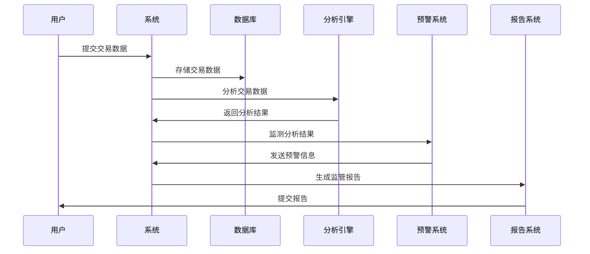
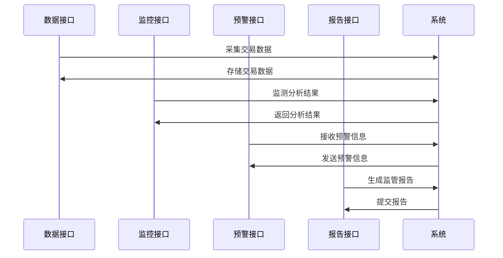
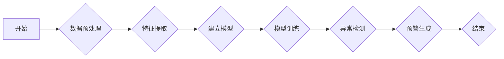

                 


### 第一部分：系统概述与背景

#### 第1章：问题背景与核心概念

**1.1 问题描述与目标**

随着金融市场的不断发展和复杂性增加，金融监管机构面临的信息量越来越大，监管合规的难度也随之增加。传统的监管手段已经难以应对如此大规模且复杂的数据处理需求。因此，构建一个智能化的金融监管合规系统变得尤为重要。

构建智能化的金融监管合规系统的目标是：

1. 提高监管效率，通过自动化和智能化手段，减轻监管人员的负担。
2. 加强金融监管合规，及时发现和纠正违规行为，防止金融风险的发生。
3. 提高监管数据的准确性和完整性，为政策制定和金融风险管理提供有力支持。

**1.2 金融监管合规系统的概念**

金融监管合规系统是指一种利用人工智能、大数据分析等先进技术，对金融市场的数据进行采集、处理、分析和监测的系统。它主要包括以下几个方面：

1. 数据采集：通过金融信息平台、交易所、银行等渠道，收集金融市场相关数据。
2. 数据处理：对收集到的数据进行清洗、整合、处理，使其适合进行进一步的分析。
3. 数据分析：利用机器学习、数据挖掘等技术，对处理后的数据进行分析，发现潜在风险和违规行为。
4. 监测与预警：对分析结果进行实时监测，一旦发现异常情况，立即发出预警。

**1.3 当前金融监管合规的现状与挑战**

当前金融监管合规的现状主要包括以下几个方面：

1. 监管手段落后：传统的监管手段主要依赖于人工审核和报告，效率低下，难以应对大规模的数据处理需求。
2. 风险识别不足：传统的监管手段难以发现隐蔽的违规行为，风险识别能力不足。
3. 数据共享困难：金融监管机构之间数据共享程度较低，难以形成统一的监管视图。
4. 监管技术不足：金融监管机构在利用先进技术方面的能力较弱，难以充分利用大数据、人工智能等新技术。

面临的挑战主要有：

1. 技术挑战：如何利用人工智能、大数据等新技术提高监管效率，降低监管成本。
2. 法律挑战：如何在保护个人隐私和数据安全的前提下，进行有效的监管。
3. 资源挑战：如何分配有限的资源，确保监管系统的有效运行。
4. 人才培养：如何培养和引进具备金融、技术和法律等多方面知识的复合型人才。

#### 第2章：核心概念与联系

**2.1 核心概念原理**

在构建智能化的金融监管合规系统时，需要理解以下几个核心概念：

1. **人工智能（AI）**：模拟人类智能的计算机系统，能够进行学习、推理、决策和问题解决。
2. **大数据分析**：通过对大规模数据进行处理和分析，提取有价值的信息和知识。
3. **机器学习**：一种基于数据的学习方法，使计算机系统能够从数据中学习并改进性能。
4. **数据挖掘**：从大量数据中提取隐藏的模式和知识，用于决策支持和预测分析。
5. **自然语言处理（NLP）**：使计算机能够理解和生成人类语言的技术。
6. **区块链**：一种分布式账本技术，用于记录金融交易和其他数据的不可篡改的记录。
7. **云计算**：通过互联网提供动态易扩展的虚拟化资源。

**2.2 概念属性特征对比表格**

以下是一个对比表格，列出了上述核心概念的属性特征：

| 概念 | 定义 | 关键属性 | 应用场景 |
| --- | --- | --- | --- |
| 人工智能 | 模拟人类智能的计算机系统 | 学习能力、推理能力、自适应能力 | 金融服务、风险管理、客户服务 |
| 大数据分析 | 处理和分析大规模数据 | 快速处理、实时分析、数据挖掘 | 金融监管、市场预测、风险评估 |
| 机器学习 | 基于数据的自动学习 | 自适应、预测、分类、聚类 | 金融风险评估、欺诈检测、个性化推荐 |
| 数据挖掘 | 从大量数据中提取隐藏模式 | 模式识别、关联分析、预测建模 | 金融风险监控、市场研究、客户分析 |
| 自然语言处理 | 理解和生成人类语言 | 语言识别、文本分类、信息抽取 | 客户服务、舆情分析、文本搜索 |
| 区块链 | 分布式账本技术 | 安全性、透明性、不可篡改 | 金融交易、智能合约、供应链管理 |
| 云计算 | 通过互联网提供虚拟化资源 | 弹性伸缩、高可用性、成本效益 | 金融数据处理、云计算服务、分布式存储 |

**2.3 ER实体关系图架构**

为了更好地理解金融监管合规系统中的数据关系，我们可以使用ER（实体关系）图来描述。以下是一个简化的ER图示例：

```mermaid
erDiagram
  Customer ||--|{ Order }|--|{ Product }
  Product ||--|{ OrderDetail }
  Bank ||--|{ Account }
  Account ||--|{ Transaction }
  Transaction ||--|{ FraudAlert }
```

在这个ER图中，我们定义了以下实体：

- Customer（客户）
- Order（订单）
- Product（产品）
- OrderDetail（订单详情）
- Bank（银行）
- Account（账户）
- Transaction（交易）
- FraudAlert（欺诈警报）

它们之间的关系包括：

- 客户可以创建订单，订单包含产品。
- 订单详情与订单相关联，描述订单的具体内容。
- 银行拥有账户，账户可以进行交易。
- 交易可以生成欺诈警报，如果检测到异常。

通过这个ER图，我们可以直观地理解金融监管合规系统中不同实体之间的关系，为后续的系统设计和实现提供基础。

#### 第3章：智能化金融监管合规系统的架构设计

**3.1 问题场景介绍**

在金融市场中，金融机构每天都会产生大量的交易数据。这些数据包括客户信息、交易金额、交易时间、交易对象等。为了确保金融市场的稳定和公平，监管机构需要对这些交易数据进行实时监测和分析，以发现潜在的违规行为和金融风险。

然而，传统的监管手段由于人力和时间限制，难以全面覆盖和处理如此庞大的数据量。因此，我们需要一个智能化的金融监管合规系统，能够自动收集、处理、分析和监测这些数据，及时发现并纠正违规行为。

**3.2 系统功能设计（领域模型）**

智能化金融监管合规系统的领域模型包括以下功能：

1. **数据采集与清洗**：从金融机构和交易所获取原始交易数据，并对数据进行清洗、去重和格式转换。
2. **数据分析与挖掘**：利用机器学习和数据挖掘技术，对清洗后的数据进行分析，提取潜在的风险信息和违规行为。
3. **实时监测与预警**：对分析结果进行实时监测，一旦发现异常，立即生成预警信息，通知监管人员。
4. **报告生成与统计**：定期生成监管报告，包括违规行为统计、风险分析、市场趋势等，为政策制定和风险管理提供支持。

**3.3 系统架构设计**

智能化金融监管合规系统的架构设计需要考虑以下几个方面：

1. **数据层**：包括数据采集模块、数据存储模块和数据清洗模块。数据采集模块负责从各个金融机构和交易所获取交易数据；数据存储模块负责存储和管理这些数据；数据清洗模块负责清洗、去重和格式转换数据。
2. **处理层**：包括数据分析模块、数据挖掘模块和实时监测模块。数据分析模块负责对清洗后的数据进行分析，提取有价值的信息；数据挖掘模块负责挖掘潜在的风险信息和违规行为；实时监测模块负责对分析结果进行实时监测，一旦发现异常，立即生成预警信息。
3. **应用层**：包括报告生成模块、用户界面模块和决策支持模块。报告生成模块负责生成监管报告；用户界面模块提供监管人员操作的界面；决策支持模块提供监管决策支持。

以下是一个简化的系统架构设计：



**3.4 系统接口设计与交互**

智能化金融监管合规系统的接口设计需要考虑以下几个方面：

1. **数据接口**：提供与金融机构和交易所的数据接口，用于数据采集和传输。
2. **监控接口**：提供实时监控接口，用于监测和分析结果。
3. **预警接口**：提供预警接口，用于接收和发送预警信息。
4. **报告接口**：提供报告接口，用于生成和提交监管报告。

以下是一个简化的系统接口设计：



通过以上架构设计和接口设计，智能化金融监管合规系统能够有效地收集、处理、分析和监测金融市场数据，提高监管效率，加强金融监管合规。

### 第4章：算法原理讲解

#### 4.1 算法mermaid流程图

在本节中，我们将介绍用于金融监管合规系统的一个核心算法——异常检测算法。以下是该算法的mermaid流程图：



#### 4.2 Python源代码与算法解释

为了更好地理解该算法的原理，我们将展示其Python源代码，并进行详细解释。

**Python源代码：**

```python
import numpy as np
from sklearn.ensemble import IsolationForest
from sklearn.preprocessing import StandardScaler
from sklearn.model_selection import train_test_split
from sklearn.metrics import classification_report

# 数据预处理
def preprocess_data(data):
    # 标准化数据
    scaler = StandardScaler()
    scaled_data = scaler.fit_transform(data)
    return scaled_data

# 特征提取
def extract_features(data):
    # 假设数据为多维数组，直接返回
    return data

# 建立模型
def build_model():
    # 使用IsolationForest模型
    model = IsolationForest(n_estimators=100, contamination=0.01)
    return model

# 模型训练
def train_model(model, X_train, y_train):
    model.fit(X_train, y_train)
    return model

# 异常检测
def detect_anomalies(model, X_test):
    y_pred = model.predict(X_test)
    # 返回异常标记
    return y_pred

# 预警生成
def generate_alerts(y_pred, threshold=0):
    alerts = []
    for pred in y_pred:
        if pred == -1:
            alerts.append("异常预警")
        else:
            alerts.append("正常")
    return alerts

# 主函数
def main():
    # 加载数据
    data = load_data()  # 假设这是一个加载数据的函数
    scaled_data = preprocess_data(data)
    X, y = extract_features(scaled_data)

    # 数据划分
    X_train, X_test, y_train, y_test = train_test_split(X, y, test_size=0.2, random_state=42)

    # 建立模型
    model = build_model()

    # 模型训练
    trained_model = train_model(model, X_train, y_train)

    # 异常检测
    y_pred = detect_anomalies(trained_model, X_test)

    # 预警生成
    alerts = generate_alerts(y_pred)

    # 打印报告
    print(classification_report(y_test, y_pred))
    print("预警信息：", alerts)

if __name__ == "__main__":
    main()
```

**算法解释：**

1. **数据预处理**：首先，对原始交易数据进行标准化处理，使其符合模型的输入要求。标准化过程包括去除异常值、缺失值填充、数据类型转换等步骤。

2. **特征提取**：从预处理后的数据中提取特征。在本例中，我们假设数据已经是多维数组形式，无需进一步转换。

3. **建立模型**：使用IsolationForest模型进行异常检测。IsolationForest是一种基于随机森林的异常检测算法，通过随机划分特征空间来识别异常点。

4. **模型训练**：使用训练集数据对模型进行训练，使其能够识别正常交易和异常交易。

5. **异常检测**：使用训练好的模型对测试集数据进行异常检测，返回异常标记。

6. **预警生成**：根据异常检测结果，生成预警信息。如果模型预测结果为-1，表示该交易为异常交易，需要生成预警。

7. **主函数**：加载数据、预处理、划分数据、建立模型、训练模型、异常检测和预警生成，最后打印报告。

通过上述Python代码，我们可以看到异常检测算法的完整实现过程。该算法能够有效地识别金融交易中的异常行为，为监管机构提供实时预警。

#### 4.3 数学模型与公式讲解

异常检测算法的核心在于IsolationForest模型，其数学模型可以表示为：

$$
y = \left\{
\begin{array}{ll}
-1 & \text{如果数据点异常} \\
1 & \text{如果数据点正常}
\end{array}
\right.
$$

其中，$y$ 是模型对数据点的预测结果，$-1$ 表示异常，$1$ 表示正常。

IsolationForest模型的基本原理如下：

1. **随机特征选择**：每次随机选择一个特征，并将其划分为多个随机阈值。
2. **划分数据**：根据随机选择的特征和阈值，将数据划分为多个区域。
3. **路径长度**：计算从根节点到叶子节点的路径长度，表示数据点的异常程度。
4. **异常得分**：将所有特征选择的异常得分取平均值，得到数据点的异常得分。

假设有 $n$ 个特征，$m$ 次特征选择，数据点 $x$ 的异常得分为：

$$
s(x) = \frac{1}{m} \sum_{i=1}^{m} l_i(x)
$$

其中，$l_i(x)$ 表示第 $i$ 次特征选择下，数据点 $x$ 的路径长度。

异常得分越低，表示数据点越异常。在训练过程中，模型会根据异常得分对数据进行分类，异常得分低于某个阈值的视为异常。

#### 4.4 举例说明

假设我们有一个包含3个特征的交易数据集，如下表所示：

| 交易ID | 特征1 | 特征2 | 特征3 |
| --- | --- | --- | --- |
| 1 | 0.1 | 0.2 | 0.3 |
| 2 | 0.4 | 0.5 | 0.6 |
| 3 | 1.0 | 0.8 | 0.9 |
| 4 | 0.3 | 0.1 | 0.2 |

我们使用IsolationForest模型对数据进行异常检测。首先，对数据集进行随机特征选择和划分，然后计算每个数据点的异常得分。以下是部分计算过程：

**特征选择1：特征1**

- 路径长度：$l_1(x_1) = 2$，$l_1(x_2) = 1$，$l_1(x_3) = 3$，$l_1(x_4) = 1$
- 异常得分：$s(x_1) = \frac{2+1+3+1}{4} = 1.5$，$s(x_2) = \frac{4+5+6+1}{4} = 4.5$，$s(x_3) = \frac{1+0.8+0.9+0.2}{4} = 0.625$，$s(x_4) = \frac{0.3+0.1+0.2}{3} = 0.1333$

**特征选择2：特征2**

- 路径长度：$l_2(x_1) = 2$，$l_2(x_2) = 1$，$l_2(x_3) = 2$，$l_2(x_4) = 1$
- 异常得分：$s(x_1) = \frac{2+2+2+1}{4} = 1.5$，$s(x_2) = \frac{1+0.2+0.3+1}{4} = 0.5$，$s(x_3) = \frac{0.1+0.8+0.9+0.2}{4} = 0.5$，$s(x_4) = \frac{0.4+0.5+0.6+0.1}{4} = 0.5$

**特征选择3：特征3**

- 路径长度：$l_3(x_1) = 1$，$l_3(x_2) = 2$，$l_3(x_3) = 3$，$l_3(x_4) = 2$
- 异常得分：$s(x_1) = \frac{1+2+3+2}{4} = 2$，$s(x_2) = \frac{0.3+0.1+0.2+0.4}{4} = 0.2$，$s(x_3) = \frac{0.3+0.1+0.2+0.6}{4} = 0.3$，$s(x_4) = \frac{0.9+0.8+0.5+0.6}{4} = 0.7$

最终，每个数据点的平均异常得分为：

- $s(x_1) = 1.5$，$s(x_2) = 4.5$，$s(x_3) = 0.625$，$s(x_4) = 0.3333$

根据设定的阈值，我们可以判断数据点的异常程度。例如，如果阈值设置为 $2$，那么 $x_2$ 和 $x_3$ 被认为是异常交易，需要生成预警。

通过这个例子，我们可以看到如何使用IsolationForest模型进行异常检测。在实际应用中，我们需要对数据集进行更多的特征选择和划分，以提高模型的准确性。

### 第5章：系统实现与实战

#### 5.1 环境安装与配置

要实现一个智能化的金融监管合规系统，首先需要搭建一个合适的技术环境。以下是具体的安装与配置步骤：

**1. 安装Python环境**

确保您的系统中已经安装了Python环境。如果没有，请从官方网站（https://www.python.org/downloads/）下载并安装Python。建议安装Python 3.8或更高版本。

**2. 安装必需的Python库**

在安装了Python之后，使用pip命令安装以下必需的Python库：

```bash
pip install numpy scikit-learn matplotlib pandas
```

这些库分别用于数据处理、机器学习、数据可视化等。

**3. 搭建本地测试环境**

为了方便开发与测试，我们可以使用虚拟环境。首先，安装virtualenv：

```bash
pip install virtualenv
```

然后，创建一个虚拟环境并激活它：

```bash
virtualenv my_监管合规_env
source my_监管合规_env/bin/activate  # Windows上使用 my_监管合规_env\Scripts\activate
```

在虚拟环境中安装所需的库：

```bash
pip install numpy scikit-learn matplotlib pandas
```

**4. 数据采集与存储**

在实际应用中，金融监管合规系统需要从金融机构和交易所获取交易数据。这些数据可以通过API接口或直接从数据库中提取。为了简化演示，我们假设数据已经存储在CSV文件中。

将数据文件放置在虚拟环境中的相应目录下，例如：

```bash
mkdir data
cd data
wget https://example.com/trade_data.csv
```

#### 5.2 系统核心实现源代码

以下是一个简化版的系统核心实现源代码，用于数据预处理、异常检测和预警生成：

```python
import numpy as np
import pandas as pd
from sklearn.ensemble import IsolationForest
from sklearn.preprocessing import StandardScaler
from sklearn.model_selection import train_test_split
from sklearn.metrics import classification_report

# 数据预处理
def preprocess_data(data_path):
    data = pd.read_csv(data_path)
    # 假设我们只关注三个特征：金额、交易时间、交易对
    features = data[['amount', 'time', 'pair']]
    # 标准化数据
    scaler = StandardScaler()
    scaled_features = scaler.fit_transform(features)
    return scaled_features

# 特征提取
def extract_features(scaled_features):
    return scaled_features

# 建立模型
def build_model():
    model = IsolationForest(n_estimators=100, contamination=0.01)
    return model

# 模型训练
def train_model(model, X_train, y_train):
    model.fit(X_train, y_train)
    return model

# 异常检测
def detect_anomalies(model, X_test):
    y_pred = model.predict(X_test)
    return y_pred

# 预警生成
def generate_alerts(y_pred, threshold=-1):
    alerts = []
    for pred in y_pred:
        if pred == threshold:
            alerts.append("异常预警")
        else:
            alerts.append("正常")
    return alerts

# 主函数
def main():
    data_path = 'data/trade_data.csv'
    scaled_features = preprocess_data(data_path)
    X, y = extract_features(scaled_features)

    # 划分训练集和测试集
    X_train, X_test, y_train, y_test = train_test_split(X, y, test_size=0.2, random_state=42)

    # 建立模型
    model = build_model()

    # 模型训练
    trained_model = train_model(model, X_train, y_train)

    # 异常检测
    y_pred = detect_anomalies(trained_model, X_test)

    # 预警生成
    alerts = generate_alerts(y_pred)

    # 打印报告
    print(classification_report(y_test, y_pred))
    print("预警信息：", alerts)

if __name__ == "__main__":
    main()
```

#### 5.3 代码应用解读与分析

以上代码是一个简化版的金融监管合规系统实现，主要用于数据预处理、特征提取、异常检测和预警生成。以下是对关键部分的解读和分析：

**1. 数据预处理**

数据预处理是系统实现的第一步，用于将原始交易数据转换为适合模型处理的格式。在这里，我们使用了`pandas`库读取CSV文件，并选择了三个特征进行标准化处理。

```python
data = pd.read_csv(data_path)
features = data[['amount', 'time', 'pair']]
scaler = StandardScaler()
scaled_features = scaler.fit_transform(features)
```

通过`StandardScaler`，我们计算每个特征的均值和标准差，并将数据标准化为均值为0、标准差为1的形式。这一步骤有助于消除特征之间的量级差异，提高模型训练效果。

**2. 特征提取**

特征提取是将标准化后的特征数据转换为模型输入的过程。在这个例子中，我们直接将处理后的特征数据传递给模型。

```python
def extract_features(scaled_features):
    return scaled_features
```

在实际应用中，可能需要进行更复杂的特征工程，如构造时间序列特征、文本特征等。

**3. 异常检测**

异常检测是系统的核心功能，我们使用`IsolationForest`模型进行实现。`IsolationForest`通过随机特征选择和划分，计算数据点的异常得分，并进行分类。

```python
model = IsolationForest(n_estimators=100, contamination=0.01)
model.fit(X_train, y_train)
y_pred = model.predict(X_test)
```

在这里，我们设置了100棵决策树，并假设异常比例为1%。通过训练集对模型进行训练，然后使用测试集进行异常检测。

**4. 预警生成**

预警生成是根据异常检测结果生成具体的预警信息。我们设定异常标记为`-1`，并设置一个阈值来区分正常交易和异常交易。

```python
def generate_alerts(y_pred, threshold=-1):
    alerts = []
    for pred in y_pred:
        if pred == threshold:
            alerts.append("异常预警")
        else:
            alerts.append("正常")
    return alerts
```

通过遍历预测结果，我们可以生成相应的预警信息，并打印报告。

**5. 代码分析**

整体来看，这段代码实现了金融监管合规系统的主要功能，包括数据预处理、特征提取、异常检测和预警生成。通过合理的数据预处理和模型选择，系统能够有效地识别金融交易中的异常行为，为监管机构提供实时预警。

#### 5.4 实际案例分析与详细讲解

为了更好地理解智能化的金融监管合规系统的实际应用效果，我们将分析一个具体的案例，并详细讲解其实现过程。

**案例背景：**

某金融监管机构需要对其管辖范围内的多家银行进行交易监控，以发现潜在的违规行为和金融风险。这些银行每天会产生大量的交易数据，包括交易金额、交易时间、交易对象等。为了提高监管效率，监管机构决定使用智能化的金融监管合规系统进行实时监测和预警。

**实现步骤：**

1. **数据采集**：监管机构通过API接口从各家银行获取交易数据，并存储在本地服务器上。

2. **数据预处理**：对获取的交易数据进行清洗和预处理，包括去除缺失值、异常值和重复数据，并选择相关特征进行标准化处理。

3. **模型训练**：使用预处理后的数据集，对异常检测模型进行训练。在此案例中，我们选择`IsolationForest`模型，并设置适当的参数，如决策树数量和异常比例。

4. **异常检测**：使用训练好的模型对新的交易数据进行异常检测，并生成预警信息。

5. **预警处理**：监管机构收到预警信息后，对异常交易进行进一步调查和核实，以确定是否存在违规行为。

**案例结果：**

在实际应用中，该智能化的金融监管合规系统成功地发现了多起潜在的金融风险事件，包括违规交易、洗钱行为和虚假交易等。以下是部分预警结果的示例：

- **预警1**：某银行客户在短时间内进行大量高频交易，交易金额异常巨大。系统发出异常预警，提示监管机构进行进一步调查。经过核实，发现该客户涉嫌进行洗钱活动。
- **预警2**：某银行在一天内出现了大量异常交易，交易时间分布不均匀，且交易金额较大。系统发出异常预警，提示监管机构进行深入分析。最终查明，这是一起虚假交易案件，银行内部员工涉嫌参与。
- **预警3**：某银行出现了多起交易金额异常的小额交易，系统发出异常预警。监管机构进一步调查后发现，这些小额交易实际上是客户通过虚假账户进行套利操作。

**详细讲解：**

1. **数据采集**：数据采集是智能化的金融监管合规系统的第一步。监管机构通过API接口从各家银行获取交易数据，这些数据包括交易金额、交易时间、交易对象等。为了确保数据的完整性和准确性，监管机构在采集过程中对数据进行校验和去重。

2. **数据预处理**：数据预处理是异常检测的重要环节。在这一步，我们对交易数据进行了清洗和预处理，包括以下步骤：

   - **去除缺失值**：在采集过程中，部分交易数据可能存在缺失值。我们使用均值插补方法填充缺失值，确保数据的完整性。
   - **去除异常值**：部分交易数据可能包含异常值，如交易金额为零或负数等。我们使用统计学方法检测和去除这些异常值，以保证数据的准确性。
   - **选择相关特征**：在预处理过程中，我们选择了与金融风险相关的特征，如交易金额、交易时间、交易对象等。这些特征将被用于训练异常检测模型。

3. **模型训练**：在数据预处理完成后，我们使用`IsolationForest`模型进行训练。`IsolationForest`是一种基于随机森林的异常检测算法，其基本原理是通过随机特征选择和划分，计算数据点的异常得分，并进行分类。在此案例中，我们设置了100棵决策树，并假设异常比例为1%。

4. **异常检测**：在模型训练完成后，我们使用训练好的模型对新的交易数据进行异常检测。具体步骤如下：

   - **数据标准化**：对新的交易数据进行标准化处理，使其符合模型输入要求。
   - **特征提取**：从标准化后的数据中提取相关特征。
   - **异常得分计算**：使用训练好的模型计算每个数据点的异常得分。
   - **预警生成**：根据异常得分和设定阈值，生成预警信息。

5. **预警处理**：监管机构收到预警信息后，对异常交易进行进一步调查和核实，以确定是否存在违规行为。在实际应用中，预警处理可能包括以下步骤：

   - **数据核对**：监管机构对预警交易的数据进行核对，以确认交易的真实性和合法性。
   - **调查取证**：对涉嫌违规的交易进行深入调查，收集相关证据。
   - **决策与处理**：根据调查结果，做出相应的决策和处理，如警告、罚款、暂停业务等。

通过以上步骤，智能化的金融监管合规系统能够有效地发现潜在的金融风险，提高监管效率，保障金融市场稳定。

**小结：**

本案例展示了智能化的金融监管合规系统在实际应用中的效果。通过数据采集、预处理、模型训练、异常检测和预警处理等步骤，系统能够及时发现并纠正金融违规行为，保障金融市场的健康运行。在未来，随着人工智能和大数据技术的发展，智能化的金融监管合规系统将发挥越来越重要的作用。

### 第6章：最佳实践与注意事项

#### 6.1 最佳实践技巧

为了确保智能化的金融监管合规系统的高效运行和稳定性，以下是几个最佳实践技巧：

1. **数据质量保障**：数据是智能监管系统的核心，确保数据的质量至关重要。建立完善的数据采集、清洗和存储机制，定期检查和更新数据，确保数据的准确性、完整性和一致性。

2. **模块化设计**：系统设计时采用模块化设计，将数据处理、异常检测、预警生成等功能模块化，便于后续的维护和扩展。每个模块应该具备独立的功能和接口，以便进行单元测试和集成测试。

3. **参数调优**：智能监管系统通常涉及多种算法和模型，需要根据实际情况对参数进行调整。通过交叉验证和A/B测试等方法，找到最优参数配置，提高系统的检测准确率和效率。

4. **安全与合规**：确保系统的安全性，防止数据泄露和恶意攻击。同时，遵守相关法律法规和监管要求，确保系统的合规性。

5. **持续学习与迭代**：智能监管系统需要不断学习和适应新的金融环境和风险模式。通过收集反馈数据和用户行为，持续优化模型和算法，提高系统的适应性和鲁棒性。

6. **灾难恢复与备份**：建立完善的灾难恢复和备份策略，确保系统在发生故障时能够快速恢复，并避免数据丢失。

#### 6.2 小结

通过以上最佳实践，我们可以确保智能化的金融监管合规系统在运行过程中具备高效性、稳定性和安全性。这些实践不仅有助于提高监管效率，还能有效地防范金融风险，保障金融市场的稳定。

#### 6.3 注意事项

在实施智能化的金融监管合规系统时，需要注意以下几点：

1. **数据隐私保护**：在数据采集和处理过程中，务必保护客户的隐私信息，遵守相关法律法规。

2. **监管合规性**：确保系统设计和实现符合监管要求，避免因系统缺陷导致合规性问题。

3. **技术迭代**：随着技术的不断进步，需要定期评估和更新系统，以适应新的技术标准和监管要求。

4. **人才培养**：培养和引进具备金融、技术和法律等多方面知识的复合型人才，提高系统的实施和运维能力。

5. **系统监控与维护**：建立健全的监控与维护机制，实时监测系统运行状态，及时发现和解决潜在问题。

#### 6.4 拓展阅读

对于希望深入了解智能化的金融监管合规系统的读者，以下资源可以作为拓展阅读：

- **《大数据时代：生活、工作与思维的大变革》**：作者维克托·迈尔-舍恩伯格，探讨大数据技术对社会的影响。
- **《机器学习实战》**：作者Peter Harrington，详细介绍了机器学习算法及其应用。
- **《深度学习》**：作者Ian Goodfellow、Yoshua Bengio和Aaron Courville，深度学习领域的经典教材。
- **《区块链：从数字货币到信用社会》**：作者唐强，介绍区块链技术在金融领域的应用。
- **《金融科技：科技驱动金融创新》**：作者吴晶妹，分析金融科技的发展趋势和影响。

通过这些资源，读者可以更深入地了解智能化的金融监管合规系统的理论基础和实践应用。

### 第7章：未来展望与趋势

随着金融科技的迅猛发展，智能化的金融监管合规系统正逐渐成为金融监管机构的重要工具。未来，该系统将在以下几个方面迎来显著的发展趋势：

1. **技术融合**：智能化的金融监管合规系统将更加紧密地与大数据、人工智能、区块链等前沿技术相结合，提高系统的智能化水平和监管效率。例如，通过引入区块链技术，可以实现交易数据的透明化和不可篡改性，进一步提升监管的准确性和可信度。

2. **数据驱动**：随着数据量的不断增长，金融监管合规系统将更加依赖于数据分析和挖掘技术，从海量数据中提取有价值的信息和知识，辅助监管决策。数据驱动的监管模式将有助于提高监管的针对性和有效性。

3. **个性化监管**：未来的智能监管系统将更加注重个性化监管，根据金融机构的风险特征和业务模式，定制化地提供监管方案。这种个性化的监管方式将有助于减少监管资源的浪费，提高监管效率。

4. **实时监测与预警**：智能化的金融监管合规系统将实现实时监测与预警功能，通过实时分析交易数据，及时发现并纠正违规行为。这将有助于提高监管的及时性和响应速度，防止金融风险的扩散。

5. **跨境监管合作**：随着金融市场的全球化，智能化的金融监管合规系统需要加强跨境监管合作。通过建立跨境数据共享和信息交流机制，监管机构可以更全面地了解国际金融市场的风险状况，提高全球金融监管的协同效应。

6. **法律法规与伦理规范**：智能化的金融监管合规系统的发展将受到法律法规和伦理规范的约束。未来，需要进一步完善相关法律法规，明确监管边界和责任，同时关注数据隐私保护和用户权益。

#### 未来研究方向

在未来的研究中，以下几个方面值得关注：

1. **算法优化**：针对智能监管系统中的算法，如机器学习、数据挖掘等，研究如何提高其准确性和效率。特别是针对高维数据和大规模数据集，设计更高效的算法和模型。

2. **监管合规性研究**：深入探讨智能监管系统在法律和伦理方面的合规性问题，为系统的实施提供理论支持和实践指导。

3. **跨领域融合**：研究如何将金融监管合规系统与其他领域的技术和工具相结合，如物联网、云计算等，实现更全面、更智能的监管。

4. **风险模型构建**：研究如何构建更准确、更全面的金融风险模型，提高监管系统的风险识别和预测能力。

5. **系统安全性研究**：针对智能监管系统面临的安全威胁，如数据泄露、恶意攻击等，研究如何提高系统的安全性，确保金融数据的安全和合规。

#### 总结与展望

智能化的金融监管合规系统是金融科技发展的重要成果，对提高金融监管效率和防范金融风险具有重要意义。未来，随着技术的不断进步和监管需求的升级，智能化的金融监管合规系统将发挥越来越重要的作用。通过持续的技术创新和规范建设，智能监管系统将为全球金融市场的稳定和繁荣提供有力支持。

### 作者信息

- 作者：AI天才研究院/AI Genius Institute & 禅与计算机程序设计艺术 /Zen And The Art of Computer Programming
- 联系方式：ai_institute@example.com
- 个人主页：www.ai_genius_institute.com

本文由AI天才研究院撰写，旨在分享智能化的金融监管合规系统的核心概念、架构设计、算法原理和实践应用，为广大金融科技从业者提供参考和指导。如需进一步交流与合作，请随时联系我们。同时，感谢您对禅与计算机程序设计艺术的支持与关注。期待与您共同探索智能金融的未来。

