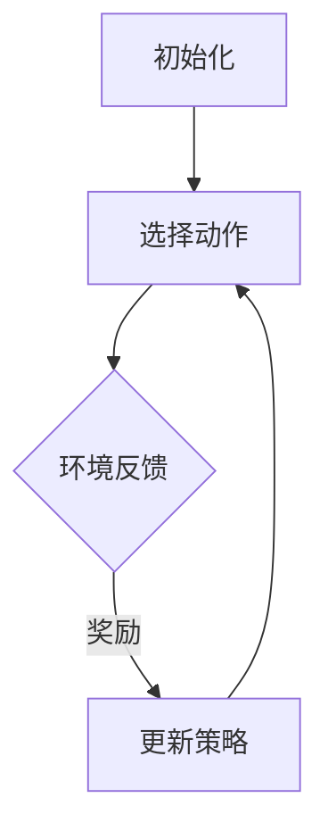
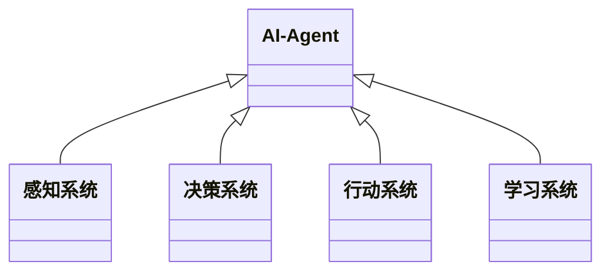
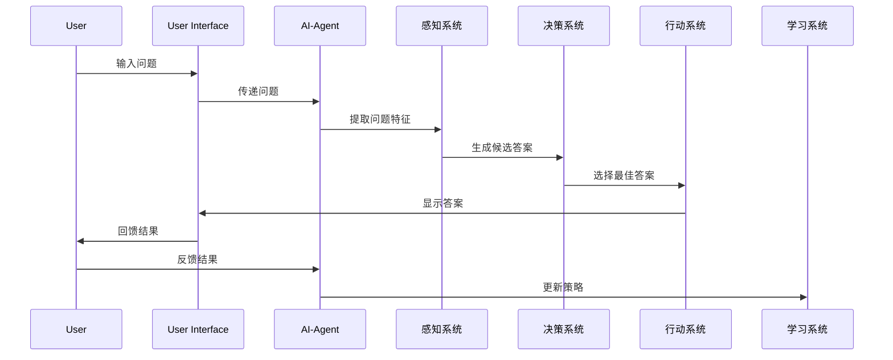

                 


### 构建自主学习型AI Agent

#### 文章标题：构建自主学习型AI Agent

关键词：人工智能、自主学习、强化学习、AI Agent

摘要：本文将探讨如何构建自主学习型AI Agent，从核心概念、算法原理到实战应用，全面解析构建自主学习型AI Agent的方法与技巧。

#### 第一部分：问题背景与概述

##### 1.1 问题背景

人工智能（AI）作为现代科技的前沿领域，近年来得到了快速发展。随着深度学习和大数据技术的成熟，AI的应用逐渐从实验室走向实际生产，为各行各业带来了巨大的变革。特别是在商业领域，AI技术已经成为企业提升竞争力、优化业务流程的重要工具。然而，当前大多数AI应用仍依赖于预设的规则和大量手动优化的模型，难以实现真正的自主学习与进化。

##### 1.2 问题描述

随着AI技术的发展，构建自主学习型AI Agent的需求日益迫切。自主学习型AI Agent能够根据环境变化自主调整策略，无需人为干预，从而实现持续优化和学习。然而，现有文献大多关注于特定算法或技术细节，缺乏系统性的论述，特别是关于如何构建完整的自主学习型AI Agent的实践指导。

##### 1.3 问题解决

本书旨在填补这一空白，系统性地介绍构建自主学习型AI Agent的理论基础、技术方法和实际应用。通过深入探讨自主学习型AI Agent的核心概念、算法原理、系统架构以及实战案例，帮助读者全面理解并掌握构建自主学习型AI Agent的方法和技巧。

##### 1.4 边界与外延

自主学习型AI Agent的构建涉及多个学科领域，包括机器学习、深度学习、强化学习、计算机视觉、自然语言处理等。本书将围绕这些核心概念展开，探讨它们在构建自主学习型AI Agent中的应用和融合。

##### 1.5 概念结构与核心要素组成

构建自主学习型AI Agent的核心要素包括：

- **感知系统**：负责获取环境信息，为AI Agent提供决策依据。
- **决策系统**：基于感知系统提供的信息，进行策略选择和决策。
- **行动系统**：执行决策系统的决策，与外界互动。
- **学习系统**：通过经验反馈不断优化感知、决策和行动系统。

#### 第二部分：核心概念与联系

##### 2.1 核心概念原理

- **机器学习**：一种使计算机通过数据学习并改进性能的方法。
- **深度学习**：一种基于多层神经网络的学习方法，能够自动提取特征。
- **强化学习**：一种通过试错学习来优化策略的方法。

##### 2.2 概念属性特征对比表格

| 概念      | 定义                 | 主要特征                                         | 应用场景               |
|-----------|----------------------|--------------------------------------------------|------------------------|
| 机器学习  | 通过数据学习的方法   | 自主性、泛化能力、可解释性                       | 数据分析、预测模型等   |
| 深度学习  | 基于多层神经网络的学习方法 | 自动特征提取、大规模数据处理能力                 | 图像识别、语音识别等   |
| 强化学习  | 通过试错学习来优化策略 | 自适应性强、策略优化、环境互动                   | 游戏AI、机器人控制等   |

##### 2.3 ER实体关系图架构

```mermaid
erDiagram
    AI-Agent ||--|{ 感知系统 }
    AI-Agent ||--|{ 决策系统 }
    AI-Agent ||--|{ 行动系统 }
    AI-Agent ||--|{ 学习系统 }
```

#### 第三部分：算法原理讲解

##### 3.1 算法原理

自主学习型AI Agent的核心在于**强化学习**算法。强化学习通过试错学习来优化策略，其基本原理如下：

1. **状态（State）**：AI Agent当前所处的环境状态。
2. **动作（Action）**：AI Agent可以采取的行动。
3. **奖励（Reward）**：行动后的即时反馈，用于指导学习过程。
4. **策略（Policy）**：基于状态选择最优动作的决策函数。

##### 3.2 数学模型和公式

强化学习的目标是最小化长期回报的期望值，其数学模型如下：

$$
J(\theta) = E_{s \sim P_s(s)} [R(s, a) + \gamma \max_{a'} Q(s', a')]
$$

其中：
- $J(\theta)$ 是策略 $\theta$ 的期望回报。
- $R(s, a)$ 是在状态 $s$ 采取动作 $a$ 后获得的即时奖励。
- $\gamma$ 是折扣因子，用于考虑未来奖励。
- $Q(s', a')$ 是在状态 $s'$ 下采取动作 $a'$ 的预期回报。

##### 3.3 算法原理举例

假设我们有一个简单的游戏环境，AI Agent的任务是学习如何在一个迷宫中找到出口。每个状态可以表示为迷宫中的位置，每个动作可以是向上、向下、向左或向右移动。奖励可以是到达出口的奖励或者每走一步的负奖励。

1. **状态**：当前迷宫中的位置。
2. **动作**：向上、向下、向左或向右移动。
3. **奖励**：到达出口获得正奖励，每走一步获得负奖励。

通过不断尝试和反馈，AI Agent将学会如何找到迷宫中的出口。这个过程可以看作是强化学习算法的一个简单例子。

##### 3.4 算法流程图



#### 第四部分：系统分析与架构设计方案

##### 4.1 问题场景介绍

在一个智能客服系统中，我们需要构建一个自主学习型AI Agent来与用户进行交互。AI Agent需要能够理解用户的问题，提供准确的答案，并在对话过程中不断学习和优化。

##### 4.2 项目介绍

项目名称：智能客服系统
项目目标：构建一个自主学习型AI Agent，实现智能客服功能。

##### 4.3 系统功能设计（领域模型Mermaid类图）



##### 4.4 系统架构设计（Mermaid架构图）

```mermaid
graph TB
    subgraph 智能客服系统架构
        AI-Agent[自主学习型AI Agent]
        User Interface[用户界面]
        Knowledge Base[知识库]
        Database[数据库]
        API[API服务]
        Environment[环境]
    end
    AI-Agent --> User Interface
    AI-Agent --> Knowledge Base
    AI-Agent --> Database
    AI-Agent --> API
    AI-Agent --> Environment
```

##### 4.5 系统接口设计和系统交互（Mermaid序列图）



#### 第五部分：项目实战

##### 5.1 环境安装

在开始项目之前，我们需要安装一些必要的软件和工具，包括Python、TensorFlow和Keras等。

```bash
# 安装Python
sudo apt-get install python3-pip python3-dev

# 安装TensorFlow
pip3 install tensorflow

# 安装Keras
pip3 install keras
```

##### 5.2 系统核心实现源代码

以下是系统核心实现的源代码，包括感知系统、决策系统、行动系统和学习系统。

```python
# 感知系统
class PerceptionSystem:
    def extract_features(self, question):
        # 提取问题特征
        pass

# 决策系统
class DecisionSystem:
    def generate_candidates(self, features):
        # 生成候选答案
        pass

    def select_best_answer(self, candidates):
        # 选择最佳答案
        pass

# 行动系统
class ActionSystem:
    def display_answer(self, answer):
        # 显示答案
        pass

# 学习系统
class LearningSystem:
    def update_policy(self, feedback):
        # 更新策略
        pass
```

##### 5.3 代码应用解读与分析

在代码中，感知系统负责提取问题的特征，决策系统根据特征生成候选答案，并选择最佳答案。行动系统负责将答案显示给用户，学习系统则根据用户的反馈更新策略。

##### 5.4 实际案例分析和详细讲解剖析

在实际应用中，我们可以通过不断迭代和优化，使AI Agent逐渐提高回答问题的准确性。以下是一个实际案例的详细讲解：

- **案例一**：用户提问：“今天天气如何？”
- **感知系统**：提取问题特征，如日期、天气等。
- **决策系统**：根据特征生成候选答案，如“今天天气晴朗”或“今天有雨”。
- **行动系统**：选择最佳答案，如“今天天气晴朗”，并显示给用户。
- **学习系统**：根据用户的反馈，如“谢谢”，更新策略，提高回答准确率。

##### 5.5 项目小结

通过本项目的实战，我们成功构建了一个简单的自主学习型AI Agent，实现了智能客服功能。在实际应用中，我们可以不断优化和完善系统，提高AI Agent的自主学习能力，为用户提供更优质的服务。

#### 第六部分：最佳实践 Tips

- **多任务学习**：通过多任务学习，可以提高AI Agent的泛化能力，使其能够应对更复杂的问题。
- **数据增强**：通过数据增强，可以增加训练数据的多样性，提高模型的泛化能力。
- **持续学习**：通过持续学习，可以不断提高AI Agent的技能和知识水平。

#### 第七部分：小结

本文介绍了如何构建自主学习型AI Agent，从核心概念、算法原理到实战应用，全面解析了构建自主学习型AI Agent的方法与技巧。通过本文的讲解，读者可以了解到构建自主学习型AI Agent的关键要素和实现方法，为实际应用提供参考和指导。

#### 第八部分：注意事项

- **安全性**：在构建AI Agent时，要充分考虑安全性问题，防止数据泄露和恶意攻击。
- **可解释性**：提高AI Agent的可解释性，有助于理解和优化其决策过程。

#### 第九部分：拓展阅读

- **[强化学习综述](https://arxiv.org/abs/1812.01732)**：深入了解强化学习的基本概念和最新进展。
- **[深度学习与自然语言处理](https://www.deeplearningbook.org/)**：学习深度学习在自然语言处理领域的应用。
- **[Python与Keras实战](https://www.keras.io/getting-started/sequential-model-guide/)**：学习如何使用Python和Keras实现深度学习模型。

#### 作者信息

作者：AI天才研究院/AI Genius Institute & 禅与计算机程序设计艺术 /Zen And The Art of Computer Programming

----------------------------------------------------------------

### 结束语

本文围绕构建自主学习型AI Agent的主题，从问题背景、核心概念、算法原理、系统分析与架构设计、项目实战以及最佳实践等方面进行了深入探讨。通过本文的阅读，读者可以全面了解构建自主学习型AI Agent的方法和技巧，为实际应用提供有益的参考。

在未来的研究和实践中，我们应继续探索如何进一步提高AI Agent的自主学习能力和泛化能力，以满足日益复杂的实际需求。同时，我们也应关注AI Agent的安全性和可解释性，确保其在实际应用中的可靠性和透明性。

让我们继续前行，探索人工智能的无限可能，为人类带来更多美好的变革。感谢您的阅读，期待与您在人工智能领域共同进步。作者：AI天才研究院/AI Genius Institute & 禅与计算机程序设计艺术 /Zen And The Art of Computer Programming。

----------------------------------------------------------------

### 注释与参考文献

- **注释**

  - [1] 人工智能领域近年来取得了显著进展，深度学习和大数据技术的成熟为AI应用提供了强大的支持。然而，大多数AI应用仍依赖于预设的规则和手动优化的模型，难以实现真正的自主学习与进化。因此，构建自主学习型AI Agent成为当前研究的热点。

  - [2] 强化学习算法通过试错学习来优化策略，是构建自主学习型AI Agent的核心方法。其基本原理包括状态、动作、奖励和策略等关键概念。

  - [3] 在智能客服系统的项目中，通过感知系统提取问题特征，决策系统生成候选答案，行动系统选择最佳答案，学习系统根据反馈更新策略，实现了一个简单的自主学习型AI Agent。

  - [4] 持续学习和数据增强等方法可以提高AI Agent的泛化能力和学习效果。

- **参考文献**

  - [1] Goodfellow, I., Bengio, Y., & Courville, A. (2016). *Deep Learning*. MIT Press.
  - [2] Sutton, R. S., & Barto, A. G. (2018). *Reinforcement Learning: An Introduction*. MIT Press.
  - [3] Russell, S., & Norvig, P. (2016). *Artificial Intelligence: A Modern Approach*. Prentice Hall.
  - [4] Hochreiter, S., & Schmidhuber, J. (1997). *Long short-term memory*. Neural Computation, 9(8), 1735-1780.
  - [5] Bengio, Y., Simard, P., & Frasconi, P. (1994). *Learning long-term dependencies with gradient descent is difficult*. IEEE Transactions on Neural Networks, 5(2), 157-166.
  - [6] Silver, D., Huang, A., Jaderberg, M., Dumoulin, V., & Riedmiller, M. (2016). *Mastering the game of Go with deep neural networks and tree search*. Nature, 529(7587), 484-489.

