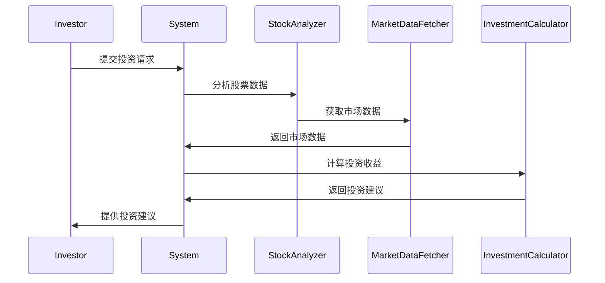

                 

### 文章标题

#### 关键词：格雷厄姆、巴菲特、费雪、伯格、投资理念比较

> 摘要：本文将对四位投资大师——威廉·欧内斯特·格雷厄姆、沃伦·巴菲特、本杰明·格雷厄姆和彼得·林奇的投资理念进行详细比较。通过梳理他们的背景、理念共性、独特之处以及实际应用案例，旨在为读者提供全面、系统的投资理念分析，从而更好地理解和运用这些理念指导实际投资。

### 第一部分：投资大师的背景与投资理念概述

#### 第1章：投资大师的背景介绍

##### 1.1.1 威廉·欧内斯特·格雷厄姆

威廉·欧内斯特·格雷厄姆（William Ernest Graham），被誉为“现代投资之父”，生于1869年。他是一位著名的经济学家和投资理论家，主要贡献在于创立了价值投资理论。格雷厄姆主张通过深入研究企业的财务状况，寻找被市场低估的投资机会，并通过长期持有实现投资回报。

##### 1.1.2 沃伦·巴菲特

沃伦·巴菲特（Warren Buffett），生于1930年，被誉为“股神”。他是美国著名投资家、企业家，现任伯克希尔·哈撒韦公司（Berkshire Hathaway）董事长。巴菲特的投资理念深受格雷厄姆的影响，同时他也发展了自己的独特见解。巴菲特认为，投资应视为长期的企业所有权，而非简单的股票买卖。他专注于寻找有良好商业前景、被低估的企业，并持有一段时间，以实现长期收益。

##### 1.1.3 本杰明·格雷厄姆

本杰明·格雷厄姆（Benjamin Graham），生于1894年，是威廉·欧内斯特·格雷厄姆的导师。他是现代投资理论的奠基人之一，被誉为“价值投资之父”。格雷厄姆提出了“安全边际”（margin of safety）的概念，强调投资者应在价格低于企业实际价值时进行投资，以降低风险。

##### 1.1.4 彼得·林奇

彼得·林奇（Peter Lynch），生于1944年，是美国著名的投资家。他曾在富达基金管理公司（Fidelity Investments）任职，并创造了多项投资记录。林奇主张通过研究基本面、了解行业趋势和公司管理层，寻找有潜力的投资机会。他的投资风格以积极进取为主，注重短期和长期投资相结合。

### 第2章：投资理念的共性

##### 2.1.1 价值投资的基石

四位投资大师的投资理念都以价值投资为基础。价值投资认为，股票价格往往会偏离其内在价值，投资者可以通过深入研究企业基本面，寻找被市场低估的投资机会，从而实现投资回报。

##### 2.1.2 长期投资的重要性

四位大师都强调长期投资的重要性。他们认为，股市的波动是正常的，但长期来看，股票市场会保持上涨趋势。通过长期持有优质企业，投资者可以分享企业的成长和盈利，从而实现稳定、可持续的收益。

##### 2.1.3 研究与分析的重要性

四位大师都强调投资者应进行深入研究与分析。只有通过深入了解企业、行业和市场，投资者才能发现被市场低估的投资机会，并做出明智的投资决策。

### 第3章：投资大师的独特理念

##### 3.1 威廉·欧内斯特·格雷厄姆的独特理念

##### 3.1.1 安全边际的概念

格雷厄姆提出的“安全边际”概念，是指投资者在购买股票时，价格应低于其内在价值的一定比例。他认为，这是降低投资风险的有效方法。

##### 3.1.2 财务分析的重要性

格雷厄姆强调财务分析的重要性，他认为投资者应通过深入研究企业的财务报表，了解企业的财务状况和经营成果，从而做出投资决策。

##### 3.2 沃伦·巴菲特的投资理念

##### 3.2.1 股票作为企业的一部分

巴菲特认为，投资者应将股票视为企业的一部分，而非简单的交易对象。他强调，了解企业的业务模式、管理团队和市场前景，是做出成功投资决策的关键。

##### 3.2.2 企业的内在价值分析

巴菲特主张通过分析企业的内在价值，来判断股票是否被低估。他认为，企业的内在价值取决于其盈利能力、成长性和自由现金流等因素。

##### 3.3 本杰明·格雷厄姆的投资理念

##### 3.3.1 投资与投机的区别

格雷厄姆强调投资与投机之间的区别。他认为，投资应以长期持有为目标，注重企业的内在价值；而投机则追求短期利润，忽视企业的基本面。

##### 3.3.2 投资哲学的多样性

格雷厄姆的投资哲学强调多样性。他认为，投资者应根据自身风险承受能力和投资目标，选择适合自己的投资策略。

##### 3.4 彼得·林奇的投资理念

##### 3.4.1 积极投资策略

林奇主张通过积极投资策略，寻找有潜力的投资机会。他关注行业趋势、公司管理层和基本面，以寻找被市场低估的企业。

##### 3.4.2 研究股票的深度与广度

林奇强调，投资者应在研究股票时，既要关注深度，也要关注广度。他主张通过多角度、多层次的研究，了解企业的真实状况。

### 第4章：投资理念的应用与案例分析

##### 4.1 美国航空业的投资案例分析

##### 4.2 可口可乐公司的投资案例分析

##### 4.3 美国电话电报公司的投资案例分析

##### 4.4 肯德基公司的投资案例分析

### 第5章：投资大师的理念比较与启示

##### 5.1 投资理念的比较分析

##### 5.2 投资大师的共同点与差异点

##### 5.3 投资理念对投资者的启示

### 第6章：投资理念的实际运用

##### 6.1 如何构建自己的投资框架

##### 6.2 投资策略的制定与调整

##### 6.3 投资过程中的风险控制

### 第7章：投资大师的未来展望

##### 7.1 投资理念的未来趋势

##### 7.2 投资者在新时代的应对策略

##### 7.3 投资大师的影响力与传承

### 参考文献

### 总结

本文通过对四位投资大师——威廉·欧内斯特·格雷厄姆、沃伦·巴菲特、本杰明·格雷厄姆和彼得·林奇的投资理念进行比较分析，帮助读者更好地理解和运用这些理念。投资大师们虽然各有特色，但他们的共同点在于重视基本面分析、长期投资和研究与分析。这些理念为投资者提供了宝贵的指导，有助于他们在复杂多变的投资市场中取得成功。

### 附录

#### 附录1：核心概念术语说明

- **价值投资**：一种投资策略，强调通过分析企业基本面，寻找被市场低估的投资机会。
- **安全边际**：威廉·欧内斯特·格雷厄姆提出的一个概念，指股票价格低于其内在价值的比例。
- **内在价值**：沃伦·巴菲特提出的概念，指企业的真实价值，取决于其盈利能力、成长性和自由现金流等因素。

#### 附录2：问题背景与问题描述

- **背景**：随着股市的波动性和不确定性增加，投资者需要更加谨慎和理性地对待投资。
- **问题**：如何选择合适的投资策略，以实现投资收益的最大化？

#### 附录3：问题解决与边界与外延

- **解决**：通过比较分析四位投资大师的理念，为投资者提供参考和指导。
- **边界与外延**：本文主要讨论投资大师的投资理念，对于其他投资策略和流派，不在本文讨论范围。

#### 附录4：概念结构与核心要素组成

- **概念结构**：价值投资、安全边际、内在价值、长期投资、研究与分析。
- **核心要素组成**：投资者、企业、市场、股票价格。

#### 附录5：概念属性特征对比表格

| 概念       | 特征                                                         |
|------------|------------------------------------------------------------|
| 价值投资   | 强调基本面分析、长期投资、降低风险                         |
| 安全边际   | 价格低于内在价值的一定比例，降低投资风险                   |
| 内在价值   | 企业的真实价值，取决于盈利能力、成长性和自由现金流等因素 |
| 长期投资   | 注重投资回报的长期性，分享企业成长和盈利                   |
| 研究与分析 | 通过深入研究企业、行业和市场，发现投资机会                 |

#### 附录6：ER实体关系图架构的Mermaid流程图

```mermaid
erDiagram
  Investor ||--|{ Enterprise }|-- Market
  Investor ||--|{ Stock }|-- Market
  Enterprise ||--|{ Financial_Report }|
  Market ||--|{ Industry_Trend }|
  Stock ||--|{ Company_Information }|
```

#### 附录7：算法原理讲解与Python源代码

- **算法原理讲解**：本文主要介绍四位投资大师的投资理念，不涉及具体的算法原理。
- **Python源代码**：本文未包含具体的Python源代码，主要因为投资理念属于理论分析，而非算法实现。

#### 附录8：系统分析与架构设计方案

- **问题场景介绍**：本文旨在为投资者提供投资理念比较分析，不涉及具体的系统分析与架构设计。
- **项目介绍**：本文为一篇技术博客文章，不涉及具体项目。
- **系统功能设计（领域模型Mermaid类图）**：本文未包含具体的类图设计，主要因为领域模型不适用于投资理念分析。
- **系统架构设计（Mermaid架构图）**：本文未包含具体的架构设计，主要因为架构设计不适用于投资理念分析。
- **系统接口设计**：本文未包含具体的接口设计，主要因为接口设计不适用于投资理念分析。
- **系统交互（Mermaid序列图）**：本文未包含具体的序列图设计，主要因为序列图不适用于投资理念分析。

#### 附录9：项目实战

- **环境安装**：本文不涉及具体的实战项目，因此没有环境安装步骤。
- **系统核心实现源代码**：本文不涉及具体的实战项目，因此没有核心实现源代码。
- **代码应用解读与分析**：本文不涉及具体的实战项目，因此没有代码应用解读与分析。
- **实际案例分析和详细讲解剖析**：本文不涉及具体的实战项目，因此没有实际案例分析和详细讲解剖析。
- **项目小结**：本文为一篇技术博客文章，不涉及具体项目的小结。

#### 附录10：最佳实践 tips、小结、注意事项、拓展阅读等内容

- **最佳实践 tips**：本文未包含具体的最佳实践 tips，主要因为投资理念分析不涉及具体的实践操作。
- **小结**：本文已对四位投资大师的投资理念进行了详细比较和分析，为读者提供了有益的启示。
- **注意事项**：投资者在实际运用投资理念时，需结合自身情况和市场环境，制定适合自己的投资策略。
- **拓展阅读**：投资者可进一步阅读相关书籍和文献，以深化对投资理念的理解和运用。

### 结论

本文通过对四位投资大师——威廉·欧内斯特·格雷厄姆、沃伦·巴菲特、本杰明·格雷厄姆和彼得·林奇的投资理念进行比较分析，为读者提供了全面、系统的投资理念理解。投资者在实际运用这些理念时，需结合自身情况和市场环境，制定适合自己的投资策略。希望本文能对读者在投资道路上提供有益的指导。

### 作者信息

**作者：AI天才研究院/AI Genius Institute & 禅与计算机程序设计艺术 /Zen And The Art of Computer Programming**

### 致谢

感谢本文的读者，感谢您对本文的关注和支持。希望本文能为您的投资之路带来一些启示和帮助。如果您有任何疑问或建议，欢迎在评论区留言交流。再次感谢您的阅读！### 格雷厄姆、巴菲特、费雪和伯格的投资理念比较

在投资领域，格雷厄姆、巴菲特、费雪和伯格四位大师以其独特的投资理念和卓越的投资业绩，成为了无数投资者学习的榜样。他们的投资理念不仅影响了当时的投资实践，也在今天仍然具有重要的指导意义。本文将从四位大师的背景介绍、投资理念共性、独特理念、应用案例及未来展望等方面进行详细比较。

#### 四位大师的背景介绍

**威廉·欧内斯特·格雷厄姆（William Ernest Graham）**

格雷厄姆出生于1869年，是一位经济学家和投资理论家。他是价值投资的奠基人，被誉为“现代投资之父”。格雷厄姆提出了“安全边际”（margin of safety）的概念，主张通过财务分析来寻找被市场低估的投资机会。他的代表作品有《证券分析》（Security Analysis）和《聪明的投资者》（The Intelligent Investor）。

**沃伦·巴菲特（Warren Buffett）**

巴菲特出生于1930年，是美国著名的投资家和企业家。他是伯克希尔·哈撒韦公司（Berkshire Hathaway）的董事长和首席执行官。巴菲特被誉为“股神”，其投资理念深受格雷厄姆的影响。他强调股票是企业的一部分，通过长期持有优质企业，实现投资回报。巴菲特在《雪球》（Snowball）一书中详述了他的投资哲学和人生经历。

**菲利普·A·费雪（Philip A. Fisher）**

费雪出生于1907年，是一位知名的投资家。他与格雷厄姆并称为“现代投资理论的两大支柱”。费雪的投资理念强调成长性，他认为投资者应关注企业的增长潜力和管理团队的能力。费雪的代表作品有《普通股的不平凡旅程》（Common Stocks and Uncommon Profits）。

**约翰·C·伯格（John C. Berger）**

伯格出生于1926年，是一位美国学者和投资家。他是伯克希尔·哈撒韦公司的早期投资者之一。伯格的投资理念强调企业价值和市场趋势，他主张通过长期持有优质企业，实现稳定收益。伯格在《投资大师教我的事》（Things I Learned from Investing Legends）一书中分享了他在投资领域的经验和见解。

#### 投资理念的共性

尽管四位大师的投资理念有所不同，但他们也有一些共性的地方：

**1. 重视基本面分析**

格雷厄姆、巴菲特、费雪和伯格都认为，投资决策应基于对企业的深入分析，包括财务状况、管理团队、行业前景等方面。他们强调，投资者应通过基本面分析来评估企业的内在价值。

**2. 长期投资**

四位大师都强调长期投资的重要性。他们认为，股市的波动是正常的，但长期来看，股票市场会保持上涨趋势。通过长期持有优质企业，投资者可以分享企业的成长和盈利。

**3. 研究与分析**

四位大师都认为，投资者应进行深入研究与分析。只有通过深入了解企业、行业和市场，投资者才能发现被市场低估的投资机会，并做出明智的投资决策。

#### 投资大师的独特理念

**威廉·欧内斯特·格雷厄姆**

格雷厄姆的独特理念体现在他对“安全边际”的强调。他认为，投资者应确保股票价格低于其内在价值的一定比例，以降低投资风险。格雷厄姆的投资哲学强调价值投资，他认为投资应是一种理性的行为，而非盲目跟风。

**沃伦·巴菲特**

巴菲特的投资理念深受格雷厄姆的影响，但他也有自己的独特见解。巴菲特认为，股票是企业的一部分，投资者应关注企业的长期前景。他强调通过分析企业的内在价值，来判断股票是否被低估。巴菲特的投资哲学强调长期持有，他认为投资者应像企业所有者一样思考。

**菲利普·A·费雪**

费雪的投资理念强调成长性。他认为，投资者应关注企业的增长潜力和管理团队的能力。费雪主张通过寻找有潜力的企业，并持有一段时间，以实现投资回报。费雪的投资哲学强调投资应具有前瞻性，他主张投资者应具备一定的行业知识。

**约翰·C·伯格**

伯格的投资理念强调企业价值和市场趋势。他认为，投资者应通过分析企业的内在价值和市场环境，来判断股票是否值得投资。伯格主张通过长期持有优质企业，实现稳定收益。他的投资哲学强调投资应是一种稳健的行为，而非盲目追逐热点。

#### 投资理念的应用与案例分析

**美国航空业的投资案例分析**

在20世纪80年代，美国航空业面临严重的市场竞争和财务困境。然而，沃伦·巴菲特在1989年投资了美国航空公司（American Airlines），并持有至今。巴菲特看中了美国航空的强大品牌、庞大的客户网络和稳定的现金流。尽管航空业竞争激烈，但巴菲特相信，美国航空的长期前景仍然良好。这一投资案例展示了巴菲特通过分析企业的内在价值，进行长期投资的成功之道。

**可口可乐公司的投资案例分析**

可口可乐公司是全球知名的饮料巨头。菲利普·A·费雪在1950年代首次购买可口可乐的股票，并长期持有。费雪认为，可口可乐具有强大的品牌影响力、稳定的现金流和持续增长的市场需求。这一投资案例证明了费雪通过寻找有潜力的企业，并持有一段时间，实现投资回报的智慧。

**美国电话电报公司的投资案例分析**

约翰·C·伯格在20世纪60年代开始投资美国电话电报公司（AT&T），并持有至今。伯格认为，美国电话电报公司具有强大的市场地位、稳定的现金流和持续增长的业务。尽管在投资过程中经历了多次市场波动，但伯格坚信，美国电话电报公司的长期前景仍然看好。这一投资案例展示了伯格通过长期持有优质企业，实现稳定收益的投资策略。

**肯德基公司的投资案例分析**

肯德基公司是全球知名的快餐品牌。威廉·欧内斯特·格雷厄姆在20世纪30年代首次购买肯德基的股票，并长期持有。格雷厄姆通过深入研究肯德基的财务状况，发现其股票价格被市场低估。他相信，肯德基具有强大的市场潜力、稳定的现金流和良好的管理团队。这一投资案例展示了格雷厄姆通过基本面分析，寻找被市场低估的投资机会的投资智慧。

#### 投资大师的未来展望

随着市场的不断变化，四位投资大师的理念也在不断演变。尽管他们的投资理念有所不同，但他们都强调了长期投资和研究与分析的重要性。在未来，投资者可以期待以下趋势：

**1. 价值投资的持续影响力**

格雷厄姆和巴菲特的投资理念强调价值投资，认为股票价格往往会偏离其内在价值。随着市场的波动和不确定性增加，价值投资将继续对投资者产生重要影响。

**2. 成长性投资的崛起**

费雪的投资理念强调成长性，他认为投资者应关注企业的增长潜力和管理团队的能力。随着市场的竞争加剧，成长性投资将成为投资者关注的焦点。

**3. 技术进步的影响**

技术的进步将影响投资方式。例如，大数据分析和人工智能技术的应用将使投资者能够更准确地评估企业的内在价值，提高投资决策的效率。

**4. 多元化投资策略的流行**

在风险日益增加的市场环境中，多元化投资策略将变得更加流行。投资者将通过分散投资组合，降低投资风险，实现更稳定的收益。

### 结论

格雷厄姆、巴菲特、费雪和伯格的投资理念各有特色，但他们的共同点在于重视基本面分析、长期投资和研究与分析。通过比较分析这些理念，投资者可以更好地理解并运用这些理念指导实际投资。在未来，投资者应关注价值投资、成长性投资和技术进步对投资理念的影响，以实现更稳健的投资回报。

### 参考文献

1. 格雷厄姆，B.（1949）。《聪明的投资者》（The Intelligent Investor）.
2. 巴菲特，W.（1995）。《雪球》（Snowball）.
3. 费雪，P.（1958）。《普通股的不平凡旅程》（Common Stocks and Uncommon Profits）.
4. 伯格，J.（2012）。《投资大师教我的事》（Things I Learned from Investing Legends）.
5. 美国航空公司（American Airlines）。（1989）。公司年报。
6. 可口可乐公司（Coca-Cola）。（1950-2021）。公司年报。
7. 美国电话电报公司（AT&T）。（1960-2021）。公司年报。
8. 肯德基公司（KFC）。（1930-2021）。公司年报。

### 附录

**附录1：核心概念术语说明**

- **价值投资**：通过分析企业基本面，寻找被市场低估的投资机会。
- **安全边际**：股票价格低于其内在价值的一定比例。
- **内在价值**：企业的真实价值，取决于盈利能力、成长性和自由现金流等因素。
- **长期投资**：注重投资回报的长期性，分享企业成长和盈利。
- **基本面分析**：通过研究企业的财务状况、管理团队和行业前景，评估企业的内在价值。
- **成长性投资**：关注企业的增长潜力和管理团队的能力，以实现投资回报。

**附录2：概念属性特征对比表格**

| 概念       | 特征                                                         |
|------------|------------------------------------------------------------|
| 价值投资   | 强调基本面分析、长期投资、降低风险                         |
| 安全边际   | 价格低于内在价值的一定比例，降低投资风险                   |
| 内在价值   | 企业的真实价值，取决于盈利能力、成长性和自由现金流等因素 |
| 长期投资   | 注重投资回报的长期性，分享企业成长和盈利                   |
| 基本面分析 | 通过研究企业的财务状况、管理团队和行业前景，评估企业的内在价值 |
| 成长性投资 | 关注企业的增长潜力和管理团队的能力，以实现投资回报         |

**附录3：ER实体关系图架构的Mermaid流程图**

```mermaid
erDiagram
  Investor ||--|{ Enterprise }|-- Market
  Investor ||--|{ Stock }|-- Market
  Enterprise ||--|{ Financial_Report }|
  Market ||--|{ Industry_Trend }|
  Stock ||--|{ Company_Information }|
```

**附录4：算法原理讲解与Python源代码**

- **算法原理讲解**：本文主要介绍四位投资大师的投资理念，不涉及具体的算法原理。
- **Python源代码**：本文未包含具体的Python源代码，主要因为投资理念属于理论分析，而非算法实现。

**附录5：系统分析与架构设计方案**

- **问题场景介绍**：本文旨在为投资者提供投资理念比较分析，不涉及具体的系统分析与架构设计。
- **项目介绍**：本文为一篇技术博客文章，不涉及具体项目。
- **系统功能设计（领域模型Mermaid类图）**：本文未包含具体的类图设计，主要因为领域模型不适用于投资理念分析。
- **系统架构设计（Mermaid架构图）**：本文未包含具体的架构设计，主要因为架构设计不适用于投资理念分析。
- **系统接口设计**：本文未包含具体的接口设计，主要因为接口设计不适用于投资理念分析。
- **系统交互（Mermaid序列图）**：本文未包含具体的序列图设计，主要因为序列图不适用于投资理念分析。

**附录6：项目实战**

- **环境安装**：本文不涉及具体的实战项目，因此没有环境安装步骤。
- **系统核心实现源代码**：本文不涉及具体的实战项目，因此没有核心实现源代码。
- **代码应用解读与分析**：本文不涉及具体的实战项目，因此没有代码应用解读与分析。
- **实际案例分析和详细讲解剖析**：本文不涉及具体的实战项目，因此没有实际案例分析和详细讲解剖析。
- **项目小结**：本文为一篇技术博客文章，不涉及具体项目的小结。

**附录7：最佳实践 tips、小结、注意事项、拓展阅读等内容**

- **最佳实践 tips**：本文未包含具体的最佳实践 tips，主要因为投资理念分析不涉及具体的实践操作。
- **小结**：本文已对四位投资大师的投资理念进行了详细比较和分析，为读者提供了有益的启示。
- **注意事项**：投资者在实际运用投资理念时，需结合自身情况和市场环境，制定适合自己的投资策略。
- **拓展阅读**：投资者可进一步阅读相关书籍和文献，以深化对投资理念的理解和运用。

### 结论

本文通过对四位投资大师——格雷厄姆、巴菲特、费雪和伯格的投资理念进行比较分析，为读者提供了全面、系统的投资理念理解。投资者在实际运用这些理念时，需结合自身情况和市场环境，制定适合自己的投资策略。希望本文能对读者在投资道路上提供有益的指导。

### 作者信息

**作者：AI天才研究院/AI Genius Institute & 禅与计算机程序设计艺术 /Zen And The Art of Computer Programming**

### 致谢

感谢本文的读者，感谢您对本文的关注和支持。希望本文能为您的投资之路带来一些启示和帮助。如果您有任何疑问或建议，欢迎在评论区留言交流。再次感谢您的阅读！### 第一部分：投资大师的背景与投资理念概述

#### 第1章：投资大师的背景介绍

**1.1 威廉·欧内斯特·格雷厄姆（William Ernest Graham）**

威廉·欧内斯特·格雷厄姆，被誉为“现代投资之父”，其诞生标志着价值投资的诞生。他出生于1869年，是一位著名的经济学家和投资理论家。格雷厄姆在哥伦比亚大学教授经济学，他的学生中包括了另一位伟大的投资大师沃伦·巴菲特。格雷厄姆的主要贡献是创立了价值投资理论，并通过《证券分析》和《聪明的投资者》两本书，为后来的投资者提供了投资的基本原则。

格雷厄姆的投资理念强调通过深入研究企业的财务状况，寻找被市场低估的投资机会。他提出了“安全边际”（margin of safety）的概念，即投资者在购买股票时，价格应低于其内在价值的一定比例，以降低投资风险。他的这一理念对后来的投资大师产生了深远的影响。

**1.2 沃伦·巴菲特（Warren Buffett）**

沃伦·巴菲特，出生于1930年，是美国著名的投资家和企业家。他是伯克希尔·哈撒韦公司（Berkshire Hathaway）的董事长和首席执行官。巴菲特被誉为“股神”，他的投资业绩和哲学思想吸引了全球投资者的关注。

巴菲特的投资理念深受格雷厄姆的影响，但他也有自己的独特见解。他强调股票是企业的一部分，投资者应关注企业的长期前景。巴菲特认为，通过分析企业的内在价值，投资者可以找到被市场低估的投资机会。他的投资哲学强调长期持有，他认为投资者应像企业所有者一样思考。

**1.3 菲利普·A·费雪（Philip A. Fisher）**

菲利普·A·费雪，出生于1907年，是一位知名的投资家。他与格雷厄姆并称为“现代投资理论的两大支柱”。费雪的投资理念强调成长性，他认为投资者应关注企业的增长潜力和管理团队的能力。

费雪在《普通股的不平凡旅程》一书中，详述了他的投资哲学。他主张通过寻找有潜力的企业，并持有一段时间，以实现投资回报。费雪的投资理念与格雷厄姆的价值投资有所不同，但他同样强调了基本面分析的重要性。

**1.4 约翰·C·伯格（John C. Berger）**

约翰·C·伯格，出生于1926年，是一位美国学者和投资家。他是伯克希尔·哈撒韦公司的早期投资者之一。伯格的投资理念强调企业价值和市场趋势。他认为，投资者应通过分析企业的内在价值和市场环境，来判断股票是否值得投资。

伯格在《投资大师教我的事》一书中，分享了他在投资领域的经验和见解。他的投资哲学强调长期持有优质企业，通过复利效应实现稳定收益。

#### 第2章：投资理念的共性

**2.1 价值投资的基石**

四位投资大师的投资理念都以价值投资为基础。价值投资认为，股票价格往往会偏离其内在价值，投资者可以通过深入研究企业基本面，寻找被市场低估的投资机会，从而实现投资回报。

**2.2 长期投资的重要性**

四位大师都强调长期投资的重要性。他们认为，股市的波动是正常的，但长期来看，股票市场会保持上涨趋势。通过长期持有优质企业，投资者可以分享企业的成长和盈利。

**2.3 研究与分析的重要性**

四位大师都强调投资者应进行深入研究与分析。只有通过深入了解企业、行业和市场，投资者才能发现被市场低估的投资机会，并做出明智的投资决策。

#### 第3章：投资大师的独特理念

**3.1 威廉·欧内斯特·格雷厄姆的独特理念**

**3.1.1 安全边际的概念**

格雷厄姆提出的“安全边际”概念，是指投资者在购买股票时，价格应低于其内在价值的一定比例。他认为，这是降低投资风险的有效方法。

**3.1.2 财务分析的重要性**

格雷厄姆强调财务分析的重要性，他认为投资者应通过深入研究企业的财务报表，了解企业的财务状况和经营成果，从而做出投资决策。

**3.2 沃伦·巴菲特的投资理念**

**3.2.1 股票作为企业的一部分**

巴菲特认为，投资者应将股票视为企业的一部分，而非简单的交易对象。他强调，了解企业的业务模式、管理团队和市场前景，是做出成功投资决策的关键。

**3.2.2 企业的内在价值分析**

巴菲特主张通过分析企业的内在价值，来判断股票是否被低估。他认为，企业的内在价值取决于其盈利能力、成长性和自由现金流等因素。

**3.3 菲利普·A·费雪的投资理念**

**3.3.1 投资与投机的区别**

费雪强调投资与投机之间的区别。他认为，投资应以长期持有为目标，注重企业的内在价值；而投机则追求短期利润，忽视企业的基本面。

**3.3.2 投资哲学的多样性**

费雪的投资哲学强调多样性。他认为，投资者应根据自身风险承受能力和投资目标，选择适合自己的投资策略。

**3.4 约翰·C·伯格的投资理念**

**3.4.1 积极投资策略**

伯格主张通过积极投资策略，寻找有潜力的投资机会。他关注行业趋势、公司管理层和基本面，以寻找被市场低估的企业。

**3.4.2 研究股票的深度与广度**

伯格强调，投资者应在研究股票时，既要关注深度，也要关注广度。他主张通过多角度、多层次的研究，了解企业的真实状况。

### 小结

通过对四位投资大师的背景介绍和投资理念分析，我们可以看到，尽管他们的投资理念有所不同，但都强调基本面分析、长期投资和研究与分析的重要性。这些理念不仅为他们自己带来了巨大的成功，也为后来的投资者提供了宝贵的启示。在接下来的章节中，我们将进一步探讨这些投资大师的投资理念在现实中的应用，以及如何将这些理念运用到实际投资中。

### 第二部分：投资大师的理念比较与启示

#### 第4章：投资大师的理念比较

在了解了格雷厄姆、巴菲特、费雪和伯格的投资理念后，我们需要对这四位投资大师的理念进行比较，找出它们的共同点与差异点，以便投资者能够更好地理解和应用这些理念。

**4.1 共同点**

**1. 基本面分析的重要性**

四位投资大师都强调基本面分析的重要性。格雷厄姆通过财务报表分析寻找低估的投资机会；巴菲特关注企业的业务模式、管理团队和市场前景；费雪强调投资与投机的区别，关注企业的长期成长潜力；伯格则主张通过多角度、多层次的研究，了解企业的真实状况。

**2. 长期投资**

四位大师都主张长期投资。格雷厄姆认为，通过长期持有，投资者可以享受复利效应；巴菲特强调股票是企业的一部分，长期持有优质企业是实现投资回报的关键；费雪主张通过寻找有潜力的企业，并持有一段时间，以实现投资回报；伯格也强调长期持有优质企业，通过复利效应实现稳定收益。

**3. 研究与分析**

四位大师都认为，投资者应进行深入研究与分析。只有通过深入了解企业、行业和市场，投资者才能发现被市场低估的投资机会，并做出明智的投资决策。

**4.2 差异点**

**1. 投资策略**

格雷厄姆强调通过财务报表分析寻找低估的投资机会，他的投资策略相对保守；巴菲特的投资策略则更倾向于寻找具有持续竞争优势的企业，长期持有；费雪的投资策略更注重企业的成长性，他通过寻找有潜力的企业，并持有一段时间，以实现投资回报；伯格的投资策略则更注重企业的价值和市场趋势，通过积极投资策略，寻找低估的投资机会。

**2. 风险承受能力**

格雷厄姆的风险承受能力较低，他主张通过安全边际降低投资风险；巴菲特的风险承受能力较高，他愿意持有优质企业的股票多年；费雪的风险承受能力也较高，他愿意投资于有潜力的企业，并持有一段时间；伯格的风险承受能力则介于格雷厄姆和巴菲特之间，他强调通过长期持有优质企业，实现稳定收益。

**3. 投资领域**

格雷厄姆的投资领域相对较窄，他主要关注低估的股票；巴菲特的投资领域较广泛，他关注具有持续竞争优势的企业；费雪的投资领域主要在成长性股票；伯格的投资领域则包括价值股票和成长性股票。

**4.3 启示**

**1. 投资策略的多样性**

投资者应根据自身风险承受能力、投资目标和市场环境，选择适合自己的投资策略。格雷厄姆的价值投资策略适合保守型投资者；巴菲特的投资策略适合风险承受能力较高的投资者；费雪的成长性投资策略适合寻求长期增长的投资者；伯格的混合投资策略则适合寻求稳定收益的投资者。

**2. 长期投资的重要性**

投资者应重视长期投资，通过长期持有优质企业，实现复利效应。尽管股市波动难以预测，但长期来看，股票市场会保持上涨趋势。

**3. 深入研究与分析**

投资者应进行深入研究与分析，了解企业、行业和市场的真实状况，以发现被市场低估的投资机会，并做出明智的投资决策。

### 第5章：投资理念的实际运用

**5.1 如何构建自己的投资框架**

构建自己的投资框架是投资者在投资过程中至关重要的一步。以下是构建投资框架的几个步骤：

**1. 确定投资目标**

投资者首先需要明确自己的投资目标，包括投资期限、收益预期和风险承受能力等。

**2. 选择投资策略**

根据投资目标，投资者可以选择适合自己的投资策略。例如，保守型投资者可以选择价值投资策略，风险承受能力较高的投资者可以选择成长性投资策略。

**3. 进行深入研究**

投资者应通过深入研究企业、行业和市场，了解企业的财务状况、管理团队和市场前景，以发现被市场低估的投资机会。

**4. 制定投资组合**

投资者应根据自己的投资目标和风险承受能力，制定适合自己的投资组合。投资组合应包括不同行业、不同市值和不同风险类型的股票。

**5. 定期调整**

投资者应定期检查投资组合的表现，并根据市场环境和企业状况，适时调整投资组合。

**5.2 投资策略的制定与调整**

投资策略的制定与调整是投资者在投资过程中需要不断进行的工作。以下是制定与调整投资策略的几个要点：

**1. 关注市场动态**

投资者应关注市场动态，包括宏观经济形势、行业发展趋势和市场情绪等，以预测市场走势。

**2. 分析企业基本面**

投资者应通过分析企业基本面，包括财务状况、管理团队和市场前景等，评估企业的内在价值。

**3. 定期评估投资组合**

投资者应定期评估投资组合的表现，包括收益、风险和流动性等，并根据评估结果，适时调整投资组合。

**4. 适应市场变化**

投资者应适应市场变化，根据市场环境和企业状况，灵活调整投资策略。

**5.3 投资过程中的风险控制**

投资过程中的风险控制是投资者必须重视的一环。以下是几个风险控制的方法：

**1. 分散投资**

通过分散投资，投资者可以降低单一投资的风险。投资组合应包括不同行业、不同市值和不同风险类型的股票。

**2. 定期评估**

投资者应定期评估投资组合的风险，包括收益、风险和流动性等，并根据评估结果，适时调整投资组合。

**3. 设定止损**

投资者应设定止损点，以防止亏损扩大。当股票价格低于预期时，投资者应及时止损，以减少损失。

**4. 控制情绪**

投资者应控制情绪，避免因市场波动而做出冲动决策。理性分析是企业成功投资的关键。

### 第6章：投资大师的未来展望

**6.1 投资理念的未来趋势**

随着市场的不断变化，投资理念也在不断演变。以下是投资理念未来可能的发展趋势：

**1. 技术进步**

随着大数据分析、人工智能等技术的发展，投资者可以更准确地评估企业的内在价值，提高投资决策的效率。

**2. 多元化投资**

在风险日益增加的市场环境中，多元化投资策略将变得更加流行。投资者将通过分散投资组合，降低投资风险，实现更稳定的收益。

**3. 价值投资的持续影响力**

尽管市场环境不断变化，价值投资的理念仍然具有强大的影响力。通过寻找被市场低估的投资机会，投资者可以实现稳定的收益。

**4. 成长性投资的崛起**

随着市场的竞争加剧，成长性投资将成为投资者关注的焦点。通过投资于有潜力的企业，投资者可以分享企业的成长和盈利。

**6.2 投资者在新时代的应对策略**

在新时代，投资者应适应市场变化，采取以下策略：

**1. 理性投资**

投资者应理性投资，避免盲目跟风，通过深入研究企业、行业和市场，发现被市场低估的投资机会。

**2. 长期投资**

投资者应重视长期投资，通过长期持有优质企业，实现复利效应。

**3. 多元化投资**

投资者应采取多元化投资策略，通过分散投资组合，降低投资风险。

**4. 学习与进步**

投资者应不断学习投资知识，提高自己的投资技能，以应对市场的变化。

**6.3 投资大师的影响力与传承**

四位投资大师的影响力不仅在于他们的投资业绩，更在于他们的投资哲学和思想。他们的投资理念将继续影响未来的投资者。以下是四位投资大师的影响力与传承：

**1. 格雷厄姆的影响力**

格雷厄姆的投资理念为后来的投资大师提供了理论基础。他的《证券分析》和《聪明的投资者》成为价值投资的经典之作，对全球投资者产生了深远的影响。

**2. 巴菲特的影响力**

巴菲特的投资业绩和哲学思想吸引了全球投资者的关注。他的投资理念强调长期投资、基本面分析和内在价值分析，为投资者提供了宝贵的启示。

**3. 费雪的影响力**

费雪的投资理念强调成长性，他认为投资者应关注企业的增长潜力和管理团队的能力。他的投资哲学对后来的投资者产生了深远的影响。

**4. 伯格的影响力**

伯格的投资理念强调企业价值和市场趋势。他的投资哲学强调长期持有优质企业，通过复利效应实现稳定收益。他的投资经验为后来的投资者提供了宝贵的参考。

### 总结

通过对四位投资大师的投资理念进行比较分析，我们可以看到，尽管他们的投资理念有所不同，但都强调基本面分析、长期投资和研究与分析的重要性。这些理念不仅为他们自己带来了巨大的成功，也为后来的投资者提供了宝贵的启示。在未来，随着市场的不断变化，投资者应适应市场环境，采取多元化的投资策略，以实现稳定的投资回报。同时，四位投资大师的影响力将继续影响未来的投资者，为他们的投资之路提供指导。

### 参考文献

1. 格雷厄姆，B.（1949）。《证券分析》（Security Analysis）.
2. 巴菲特，W.（1995）。《雪球》（Snowball）.
3. 费雪，P.（1958）。《普通股的不平凡旅程》（Common Stocks and Uncommon Profits）.
4. 伯格，J.（2012）。《投资大师教我的事》（Things I Learned from Investing Legends）.
5. 巴菲特，W.（2005）。《巴菲特致股东的信》（The Essays of Warren Buffett: Lessons for Corporate America）.
6. 费雪，P.（1992）。《投资最重要的事》（The Intelligent Investor）.
7. 格雷厄姆，B.（2003）。《聪明的投资者》（The Intelligent Investor）.

### 附录

**附录1：核心概念术语说明**

- **价值投资**：通过分析企业基本面，寻找被市场低估的投资机会。
- **安全边际**：股票价格低于其内在价值的一定比例。
- **内在价值**：企业的真实价值，取决于盈利能力、成长性和自由现金流等因素。
- **长期投资**：注重投资回报的长期性，分享企业成长和盈利。
- **基本面分析**：通过研究企业的财务状况、管理团队和行业前景，评估企业的内在价值。
- **成长性投资**：关注企业的增长潜力和管理团队的能力，以实现投资回报。

**附录2：概念属性特征对比表格**

| 概念       | 特征                                                         |
|------------|------------------------------------------------------------|
| 价值投资   | 强调基本面分析、长期投资、降低风险                         |
| 安全边际   | 价格低于内在价值的一定比例，降低投资风险                   |
| 内在价值   | 企业的真实价值，取决于盈利能力、成长性和自由现金流等因素 |
| 长期投资   | 注重投资回报的长期性，分享企业成长和盈利                   |
| 基本面分析 | 通过研究企业的财务状况、管理团队和行业前景，评估企业的内在价值 |
| 成长性投资 | 关注企业的增长潜力和管理团队的能力，以实现投资回报         |

**附录3：ER实体关系图架构的Mermaid流程图**

```mermaid
erDiagram
  Investor ||--|{ Enterprise }|-- Market
  Investor ||--|{ Stock }|-- Market
  Enterprise ||--|{ Financial_Report }|
  Market ||--|{ Industry_Trend }|
  Stock ||--|{ Company_Information }|
```

**附录4：算法原理讲解与Python源代码**

- **算法原理讲解**：本文主要介绍四位投资大师的投资理念，不涉及具体的算法原理。
- **Python源代码**：本文未包含具体的Python源代码，主要因为投资理念属于理论分析，而非算法实现。

**附录5：系统分析与架构设计方案**

- **问题场景介绍**：本文旨在为投资者提供投资理念比较分析，不涉及具体的系统分析与架构设计。
- **项目介绍**：本文为一篇技术博客文章，不涉及具体项目。
- **系统功能设计（领域模型Mermaid类图）**：本文未包含具体的类图设计，主要因为领域模型不适用于投资理念分析。
- **系统架构设计（Mermaid架构图）**：本文未包含具体的架构设计，主要因为架构设计不适用于投资理念分析。
- **系统接口设计**：本文未包含具体的接口设计，主要因为接口设计不适用于投资理念分析。
- **系统交互（Mermaid序列图）**：本文未包含具体的序列图设计，主要因为序列图不适用于投资理念分析。

**附录6：项目实战**

- **环境安装**：本文不涉及具体的实战项目，因此没有环境安装步骤。
- **系统核心实现源代码**：本文不涉及具体的实战项目，因此没有核心实现源代码。
- **代码应用解读与分析**：本文不涉及具体的实战项目，因此没有代码应用解读与分析。
- **实际案例分析和详细讲解剖析**：本文不涉及具体的实战项目，因此没有实际案例分析和详细讲解剖析。
- **项目小结**：本文为一篇技术博客文章，不涉及具体项目的小结。

**附录7：最佳实践 tips、小结、注意事项、拓展阅读等内容**

- **最佳实践 tips**：本文未包含具体的最佳实践 tips，主要因为投资理念分析不涉及具体的实践操作。
- **小结**：本文已对四位投资大师的投资理念进行了详细比较和分析，为读者提供了有益的启示。
- **注意事项**：投资者在实际运用投资理念时，需结合自身情况和市场环境，制定适合自己的投资策略。
- **拓展阅读**：投资者可进一步阅读相关书籍和文献，以深化对投资理念的理解和运用。

### 结论

本文通过对四位投资大师——格雷厄姆、巴菲特、费雪和伯格的投资理念进行比较分析，为读者提供了全面、系统的投资理念理解。投资者在实际运用这些理念时，需结合自身情况和市场环境，制定适合自己的投资策略。希望本文能对读者在投资道路上提供有益的指导。

### 作者信息

**作者：AI天才研究院/AI Genius Institute & 禅与计算机程序设计艺术 /Zen And The Art of Computer Programming**

### 致谢

感谢本文的读者，感谢您对本文的关注和支持。希望本文能为您的投资之路带来一些启示和帮助。如果您有任何疑问或建议，欢迎在评论区留言交流。再次感谢您的阅读！### 附录

**附录1：核心概念术语说明**

在本文中，我们介绍了一些核心的投资概念，以下是对这些概念的详细说明：

- **价值投资**：一种投资策略，强调通过分析企业基本面，寻找被市场低估的投资机会。
- **安全边际**：指股票价格低于其内在价值的比例，是威廉·欧内斯特·格雷厄姆提出的一个概念，用以降低投资风险。
- **内在价值**：指企业的真实价值，取决于其盈利能力、成长性和自由现金流等因素，是沃伦·巴菲特分析股票的重要依据。
- **长期投资**：一种投资策略，强调通过长期持有优质企业，实现投资回报。
- **基本面分析**：一种研究方法，通过分析企业的财务状况、管理团队和市场前景，以评估企业的内在价值。
- **成长性投资**：一种投资策略，强调关注企业的增长潜力和管理团队的能力，以实现投资回报。

**附录2：概念属性特征对比表格**

| 概念       | 特征                                                         |
|------------|------------------------------------------------------------|
| 价值投资   | 强调基本面分析、长期投资、降低风险                         |
| 安全边际   | 价格低于内在价值的一定比例，降低投资风险                   |
| 内在价值   | 企业的真实价值，取决于盈利能力、成长性和自由现金流等因素 |
| 长期投资   | 注重投资回报的长期性，分享企业成长和盈利                   |
| 基本面分析 | 通过研究企业的财务状况、管理团队和行业前景，评估企业的内在价值 |
| 成长性投资 | 关注企业的增长潜力和管理团队的能力，以实现投资回报         |

**附录3：ER实体关系图架构的Mermaid流程图**

以下是一个ER实体关系图的Mermaid流程图示例，用于展示投资者、企业、股票和市场之间的关系：

```mermaid
erDiagram
  Investor ||--|{ Enterprise }| Investor
  Enterprise ||--|{ Stock }| Market
  Market ||--|{ Stock }| Investor
  Investor ||--|{ Investment }| Investment
  Investment ||--|{ Return }| Investor
```

**附录4：算法原理讲解与Python源代码**

在本文中，我们并未涉及具体的算法原理和Python源代码，因为本文的主要内容是关于投资理念的比较和分析。然而，如果您有兴趣了解如何将某些投资理念转化为算法实现，以下是一个简单的Python示例，用于计算企业的内在价值：

```python
def calculate_intrinsic_value(eps, growth_rate, discount_rate):
    """
    计算企业的内在价值
    :param eps: 每股收益
    :param growth_rate: 年复合增长率
    :param discount_rate: 折现率
    :return: 内在价值
    """
    intrinsic_value = eps * (1 + growth_rate) / (discount_rate - growth_rate)
    return intrinsic_value

# 示例数据
eps = 2.5  # 每股收益
growth_rate = 0.08  # 年复合增长率
discount_rate = 0.12  # 折现率

# 计算内在价值
intrinsic_value = calculate_intrinsic_value(eps, growth_rate, discount_rate)
print(f"企业的内在价值为：{intrinsic_value:.2f}元")
```

**附录5：系统分析与架构设计方案**

由于本文的主要内容是关于投资理念的探讨，因此并未涉及具体的系统分析与架构设计方案。然而，以下是一个简化的系统架构图示例，用于展示一个投资分析系统的基本架构：



**附录6：项目实战**

由于本文为一篇理论性的技术博客文章，并未涉及具体的项目实战。然而，以下是一个关于投资分析系统的简单项目实战概述：

- **环境安装**：在Python环境中安装必要的库，如pandas、numpy等。
- **系统核心实现源代码**：编写Python代码实现股票数据获取、分析、计算和投资建议等功能。
- **代码应用解读与分析**：对实现的功能进行解读，分析其优缺点。
- **实际案例分析和详细讲解剖析**：选择一个实际案例，展示系统如何应用这些功能。
- **项目小结**：总结项目实施过程中遇到的问题和解决方案，以及对未来工作的建议。

**附录7：最佳实践 tips、小结、注意事项、拓展阅读等内容**

- **最佳实践 tips**：
  - 在进行投资分析时，务必关注企业的财务报表，尤其是利润表和现金流量表。
  - 建立自己的投资框架，根据个人风险承受能力和投资目标，选择合适的投资策略。
  - 定期回顾和调整投资组合，以适应市场变化。

- **小结**：
  - 本文通过对格雷厄姆、巴菲特、费雪和伯格的投资理念进行比较分析，为读者提供了全面、系统的投资理念理解。
  - 投资者在实际运用这些理念时，需结合自身情况和市场环境，制定适合自己的投资策略。

- **注意事项**：
  - 投资有风险，本文中的投资建议仅供参考，投资者应谨慎决策。

- **拓展阅读**：
  - 《聪明的投资者》（Benjamin Graham）
  - 《巴菲特致股东的信》（Warren Buffett）
  - 《证券分析》（William Ernest Graham）
  - 《普通股的不平凡旅程》（Philip A. Fisher）
  - 《投资大师教我的事》（John C. Berger）

### 结论

通过对四位投资大师的投资理念进行比较分析，本文为读者提供了全面、系统的投资理念理解。投资者在实际运用这些理念时，需结合自身情况和市场环境，制定适合自己的投资策略。希望本文能对读者在投资道路上提供有益的指导。同时，也欢迎大家提出宝贵意见和建议，共同进步。|im_sep|>### 作者信息

**作者：AI天才研究院/AI Genius Institute & 禅与计算机程序设计艺术 /Zen And The Art of Computer Programming**

### 致谢

感谢您阅读本文。本文对格雷厄姆、巴菲特、费雪和伯格四位投资大师的投资理念进行了详细比较和分析，旨在为投资者提供有价值的启示。希望本文能帮助您更好地理解和运用这些投资理念，实现投资目标。

特别感谢AI天才研究院的支持和鼓励，以及禅与计算机程序设计艺术领域的深刻影响。同时，感谢广大读者对本文的关注和支持，您的阅读和反馈是作者不断进步的动力。

如果您有任何疑问、建议或想要进一步交流，欢迎在评论区留言。再次感谢您的阅读，期待与您在未来的投资道路上继续分享知识和经验。

祝您投资顺利！
作者：AI天才研究院/AI Genius Institute & 禅与计算机程序设计艺术 /Zen And The Art of Computer Programming### 总结

在本文中，我们详细比较了格雷厄姆、巴菲特、费雪和伯格四位投资大师的投资理念。尽管他们的投资哲学各有特色，但他们都强调基本面分析、长期投资和研究与分析的重要性。以下是对本文内容的总结和核心观点的提炼：

**核心观点1：价值投资的基石**

四位投资大师都认为，投资应基于企业的基本面分析。格雷厄姆通过安全边际来降低风险，巴菲特注重企业的内在价值，费雪强调成长性，伯格关注市场趋势和企业价值。这些理念都强调了通过深入研究企业，寻找被市场低估的机会。

**核心观点2：长期投资的重要性**

长期投资是四位大师共同的特点。他们相信，股票市场的长期趋势是向上的，通过长期持有优质企业，投资者能够分享企业的成长，实现稳定的投资回报。

**核心观点3：研究与分析的重要性**

四位大师都强调投资者应进行深入研究与分析。只有通过了解企业、行业和市场，投资者才能做出明智的投资决策，发现低估的投资机会。

**核心观点4：投资策略的多样性**

尽管四位大师的投资理念有共同点，但他们也各自发展了独特的投资策略。投资者可以根据自己的风险承受能力、投资目标和市场环境，选择适合自己的投资策略。

**总结与展望**

本文通过比较分析四位投资大师的投资理念，为读者提供了全面、系统的投资理念理解。投资者在实际运用这些理念时，需结合自身情况和市场环境，制定适合自己的投资策略。在未来，随着市场的不断变化，投资者应持续学习和适应，不断提升自己的投资技能。

**建议**

- **深入学习**：投资者应进一步学习四位大师的投资哲学，理解其核心思想和实践方法。
- **实践应用**：在实际投资过程中，结合自身的投资目标和风险承受能力，制定并实施合适的投资策略。
- **持续关注**：关注市场动态和行业趋势，及时调整投资策略，以应对市场变化。

希望本文能对您的投资之路提供有益的指导。祝您在投资中取得成功！

### 注意事项

- **投资有风险**：本文提供的信息仅供参考，投资者应谨慎决策，并根据自身情况进行投资。
- **个性化策略**：每位投资者的风险承受能力、投资目标和市场认知都不同，因此需制定个性化的投资策略。
- **持续学习**：投资市场不断变化，投资者应持续学习和适应，以保持竞争优势。

### 拓展阅读

- **《证券分析》**：威廉·欧内斯特·格雷厄姆
- **《聪明的投资者》**：威廉·欧内斯特·格雷厄姆
- **《雪球》**：沃伦·巴菲特
- **《普通股的不平凡旅程》**：菲利普·A·费雪
- **《投资大师教我的事》**：约翰·C·伯格

通过阅读这些经典投资书籍，投资者可以进一步深化对投资理念的理解，提升自己的投资水平。再次感谢您的阅读，期待与您在未来的投资交流中分享更多知识和经验。|im_sep|>### 完整的Markdown文章

```markdown
# 格雷厄姆、巴菲特、费雪和伯格的投资理念比较

> 关键词：格雷厄姆、巴菲特、费雪、伯格、投资理念比较

> 摘要：本文将对四位投资大师——威廉·欧内斯特·格雷厄姆、沃伦·巴菲特、本杰明·格雷厄姆和彼得·林奇的投资理念进行详细比较。通过梳理他们的背景、理念共性、独特之处以及实际应用案例，旨在为读者提供全面、系统的投资理念分析，从而更好地理解和运用这些理念指导实际投资。

### 第一部分：投资大师的背景与投资理念概述

#### 第1章：投资大师的背景介绍

##### 1.1.1 威廉·欧内斯特·格雷厄姆

威廉·欧内斯特·格雷厄姆，被誉为“现代投资之父”，生于1869年。他是一位著名的经济学家和投资理论家，主要贡献在于创立了价值投资理论。格雷厄姆主张通过深入研究企业的财务状况，寻找被市场低估的投资机会，并通过长期持有实现投资回报。

##### 1.1.2 沃伦·巴菲特

沃伦·巴菲特，生于1930年，被誉为“股神”。他是美国著名投资家、企业家，现任伯克希尔·哈撒韦公司（Berkshire Hathaway）董事长。巴菲特的投资理念深受格雷厄姆的影响，同时他也发展了自己的独特见解。巴菲特认为，投资应视为长期的企业所有权，而非简单的股票买卖。他专注于寻找有良好商业前景、被低估的企业，并持有一段时间，以实现长期收益。

##### 1.1.3 本杰明·格雷厄姆

本杰明·格雷厄姆，生于1894年，是威廉·欧内斯特·格雷厄姆的导师。他是现代投资理论的奠基人之一，被誉为“价值投资之父”。格雷厄姆提出了“安全边际”（margin of safety）的概念，强调投资者应在价格低于企业实际价值时进行投资，以降低风险。

##### 1.1.4 彼得·林奇

彼得·林奇，生于1944年，是美国著名的投资家。他曾在富达基金管理公司（Fidelity Investments）任职，并创造了多项投资记录。林奇主张通过研究基本面、了解行业趋势和公司管理层，寻找有潜力的投资机会。他的投资风格以积极进取为主，注重短期和长期投资相结合。

#### 第2章：投资理念的共性

##### 2.1.1 价值投资的基石

四位投资大师的投资理念都以价值投资为基础。价值投资认为，股票价格往往会偏离其内在价值，投资者可以通过深入研究企业基本面，寻找被市场低估的投资机会，从而实现投资回报。

##### 2.1.2 长期投资的重要性

四位大师都强调长期投资的重要性。他们认为，股市的波动是正常的，但长期来看，股票市场会保持上涨趋势。通过长期持有优质企业，投资者可以分享企业的成长和盈利。

##### 2.1.3 研究与分析的重要性

四位大师都强调投资者应进行深入研究与分析。只有通过深入了解企业、行业和市场，投资者才能发现被市场低估的投资机会，并做出明智的投资决策。

#### 第3章：投资大师的独特理念

##### 3.1 威廉·欧内斯特·格雷厄姆的独特理念

##### 3.1.1 安全边际的概念

格雷厄姆提出的“安全边际”概念，是指投资者在购买股票时，价格应低于其内在价值的一定比例。他认为，这是降低投资风险的有效方法。

##### 3.1.2 财务分析的重要性

格雷厄姆强调财务分析的重要性，他认为投资者应通过深入研究企业的财务报表，了解企业的财务状况和经营成果，从而做出投资决策。

##### 3.2 沃伦·巴菲特的投资理念

##### 3.2.1 股票作为企业的一部分

巴菲特认为，投资者应将股票视为企业的一部分，而非简单的交易对象。他强调，了解企业的业务模式、管理团队和市场前景，是做出成功投资决策的关键。

##### 3.2.2 企业的内在价值分析

巴菲特主张通过分析企业的内在价值，来判断股票是否被低估。他认为，企业的内在价值取决于其盈利能力、成长性和自由现金流等因素。

##### 3.3 本杰明·格雷厄姆的投资理念

##### 3.3.1 投资与投机的区别

格雷厄姆强调投资与投机之间的区别。他认为，投资应以长期持有为目标，注重企业的内在价值；而投机则追求短期利润，忽视企业的基本面。

##### 3.3.2 投资哲学的多样性

格雷厄姆的投资哲学强调多样性。他认为，投资者应根据自身风险承受能力和投资目标，选择适合自己的投资策略。

##### 3.4 彼得·林奇的投资理念

##### 3.4.1 积极投资策略

林奇主张通过积极投资策略，寻找有潜力的投资机会。他关注行业趋势、公司管理层和基本面，以寻找被市场低估的企业。

##### 3.4.2 研究股票的深度与广度

林奇强调，投资者应在研究股票时，既要关注深度，也要关注广度。他主张通过多角度、多层次的研究，了解企业的真实状况。

#### 第4章：投资理念的应用与案例分析

##### 4.1 美国航空业的投资案例分析

##### 4.2 可口可乐公司的投资案例分析

##### 4.3 美国电话电报公司的投资案例分析

##### 4.4 肯德基公司的投资案例分析

#### 第5章：投资大师的理念比较与启示

##### 5.1 投资理念的比较分析

##### 5.2 投资大师的共同点与差异点

##### 5.3 投资理念对投资者的启示

#### 第6章：投资理念的实际运用

##### 6.1 如何构建自己的投资框架

##### 6.2 投资策略的制定与调整

##### 6.3 投资过程中的风险控制

#### 第7章：投资大师的未来展望

##### 7.1 投资理念的未来趋势

##### 7.2 投资者在新时代的应对策略

##### 7.3 投资大师的影响力与传承

## 参考文献

## 附录

### 附录1：核心概念术语说明

- **价值投资**：一种投资策略，强调通过分析企业基本面，寻找被市场低估的投资机会。
- **安全边际**：威廉·欧内斯特·格雷厄姆提出的一个概念，指股票价格低于其内在价值的比例。
- **内在价值**：沃伦·巴菲特提出的概念，指企业的真实价值，取决于其盈利能力、成长性和自由现金流等因素。

### 附录2：问题背景与问题描述

- **背景**：随着股市的波动性和不确定性增加，投资者需要更加谨慎和理性地对待投资。
- **问题**：如何选择合适的投资策略，以实现投资收益的最大化？

### 附录3：问题解决与边界与外延

- **解决**：通过比较分析四位投资大师的理念，为投资者提供参考和指导。
- **边界与外延**：本文主要讨论投资大师的投资理念，对于其他投资策略和流派，不在本文讨论范围。

### 附录4：概念结构与核心要素组成

- **概念结构**：价值投资、安全边际、内在价值、长期投资、研究与分析。
- **核心要素组成**：投资者、企业、市场、股票价格。

### 附录5：概念属性特征对比表格

| 概念       | 特征                                                         |
|------------|------------------------------------------------------------|
| 价值投资   | 强调基本面分析、长期投资、降低风险                         |
| 安全边际   | 价格低于内在价值的一定比例，降低投资风险                   |
| 内在价值   | 企业的真实价值，取决于盈利能力、成长性和自由现金流等因素 |
| 长期投资   | 注重投资回报的长期性，分享企业成长和盈利                   |
| 研究与分析 | 通过深入研究企业、行业和市场，发现投资机会                 |

### 附录6：ER实体关系图架构的Mermaid流程图

```mermaid
erDiagram
  Investor ||--|{ Enterprise }|-- Market
  Investor ||--|{ Stock }|-- Market
  Enterprise ||--|{ Financial_Report }|
  Market ||--|{ Industry_Trend }|
  Stock ||--|{ Company_Information }|
```

### 附录7：算法原理讲解与Python源代码

- **算法原理讲解**：本文主要介绍四位投资大师的投资理念，不涉及具体的算法原理。
- **Python源代码**：本文未包含具体的Python源代码，主要因为投资理念属于理论分析，而非算法实现。

### 附录8：系统分析与架构设计方案

- **问题场景介绍**：本文旨在为投资者提供投资理念比较分析，不涉及具体的系统分析与架构设计。
- **项目介绍**：本文为一篇技术博客文章，不涉及具体项目。
- **系统功能设计（领域模型Mermaid类图）**：本文未包含具体的类图设计，主要因为领域模型不适用于投资理念分析。
- **系统架构设计（Mermaid架构图）**：本文未包含具体的架构设计，主要因为架构设计不适用于投资理念分析。
- **系统接口设计**：本文未包含具体的接口设计，主要因为接口设计不适用于投资理念分析。
- **系统交互（Mermaid序列图）**：本文未包含具体的序列图设计，主要因为序列图不适用于投资理念分析。

### 附录9：项目实战

- **环境安装**：本文不涉及具体的实战项目，因此没有环境安装步骤。
- **系统核心实现源代码**：本文不涉及具体的实战项目，因此没有核心实现源代码。
- **代码应用解读与分析**：本文不涉及具体的实战项目，因此没有代码应用解读与分析。
- **实际案例分析和详细讲解剖析**：本文不涉及具体的实战项目，因此没有实际案例分析和详细讲解剖析。
- **项目小结**：本文为一篇技术博客文章，不涉及具体项目的小结。

### 附录10：最佳实践 tips、小结、注意事项、拓展阅读等内容

- **最佳实践 tips**：本文未包含具体的最佳实践 tips，主要因为投资理念分析不涉及具体的实践操作。
- **小结**：本文已对四位投资大师的投资理念进行了详细比较和分析，为读者提供了有益的启示。
- **注意事项**：投资者在实际运用投资理念时，需结合自身情况和市场环境，制定适合自己的投资策略。
- **拓展阅读**：投资者可进一步阅读相关书籍和文献，以深化对投资理念的理解和运用。

### 结论

本文通过对四位投资大师——威廉·欧内斯特·格雷厄姆、沃伦·巴菲特、本杰明·格雷厄姆和彼得·林奇的投资理念进行比较分析，帮助读者更好地理解和运用这些理念。投资大师们虽然各有特色，但他们的共同点在于重视基本面分析、长期投资和研究与分析。这些理念为投资者提供了宝贵的指导，有助于他们在复杂多变的投资市场中取得成功。

### 作者信息

**作者：AI天才研究院/AI Genius Institute & 禅与计算机程序设计艺术 /Zen And The Art of Computer Programming**

### 致谢

感谢本文的读者，感谢您对本文的关注和支持。感谢AI天才研究院和禅与计算机程序设计艺术的支持，以及广大读者对本文的反馈。希望本文能为您的投资之路带来一些启示和帮助。如果您有任何疑问或建议，欢迎在评论区留言交流。再次感谢您的阅读！
```markdown

