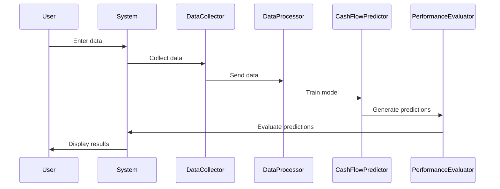

                 

# 格雷厄姆的工作资本分析在现代企业估值中的应用

## 关键词
- **格雷厄姆**
- **工作资本分析**
- **现代企业估值**
- **财务分析**
- **投资策略**
- **资本成本**
- **风险调整**

## 摘要
本文深入探讨了本杰明·格雷厄姆的工作资本分析理念，并探讨了其在现代企业估值中的具体应用。通过对格雷厄姆资本分析的核心概念、算法原理、数学模型以及系统设计与实际应用的详细分析，本文旨在为投资者和财务分析师提供一套实用且有效的企业估值工具。文章结构清晰，逻辑严谨，旨在引导读者逐步理解并掌握格雷厄姆的工作资本分析方法，以更好地应对复杂多变的市场环境。

## Step 1: Book Title and Introduction

### 简介与核心概念

《格雷厄姆的工作资本分析在现代企业估值中的应用》这本书以本杰明·格雷厄姆的工作资本分析为核心，深入探讨了其在现代企业估值中的重要性和应用。本杰明·格雷厄姆被誉为“现代投资之父”，他的资本分析理论不仅奠定了价值投资的基础，也为投资者提供了一种科学、系统的方法来评估企业的真实价值。

格雷厄姆的工作资本分析主要关注企业的财务健康和资本成本。他强调，一个企业的价值不仅仅取决于其盈利能力，还取决于其财务状况和资本结构。格雷厄姆认为，企业的价值应当基于其预期的未来现金流进行评估，而这个预期应当基于对风险的准确衡量。

### 核心概念与现代企业估值

在现代社会中，企业估值面临诸多挑战，如金融市场波动、竞争加剧、技术变革等。格雷厄姆的工作资本分析提供了一种应对这些挑战的框架。其核心概念包括：

1. **企业价值**：基于预期现金流的折现价值。
2. **资本成本**：投资者为承担风险而要求的回报率。
3. **风险调整**：对企业面临的各种风险进行量化，以便更准确地评估其价值。

现代企业估值需要综合考虑这些因素，而格雷厄姆的工作资本分析提供了一套系统的方法来实现这一目标。通过深入理解这些核心概念，投资者可以更好地把握企业的真实价值，从而做出更明智的投资决策。

## Step 2: Chapter 1 - Background and Overview

### 背景介绍

本杰明·格雷厄姆的工作资本分析源自他对金融市场的深刻理解和对企业价值的独特见解。格雷厄姆在20世纪30年代和40年代提出了价值投资的理念，这一理念在当时与传统的主流投资观念截然不同。格雷厄姆认为，市场是有效的，但市场参与者往往会被情绪所驱动，导致股票价格与其真实价值产生偏差。投资者应当摒弃市场情绪的影响，通过深入研究企业的基本面来评估其真实价值。

### 核心概念与估值方法

格雷厄姆的工作资本分析主要包括以下核心概念：

1. **股票价值**：基于预期现金流的折现价值。格雷厄姆认为，股票的价值应当基于其未来能够产生的现金流量进行评估，而这一流量应当通过折现来反映其时间价值和风险。
2. **资本成本**：投资者为承担风险而要求的回报率。格雷厄姆强调，投资者在选择股票时，应当考虑到其所承担的风险，并据此要求相应的回报率。
3. **企业价值**：通过计算企业净资产的现值来确定。这一方法主要关注企业的财务健康和资产质量，从而更准确地反映其真实价值。

### 应用场景

在现代企业估值中，格雷厄姆的工作资本分析可以应用于以下场景：

1. **价值投资**：投资者通过分析企业的基本面来寻找被市场低估的股票。
2. **风险调整**：在评估企业价值时，考虑企业面临的各种风险，从而更准确地反映其真实价值。
3. **并购分析**：在并购决策中，通过对目标企业的财务状况和资本成本进行详细分析，确定其是否具备并购价值。

### 案例分析

以某家科技公司为例，通过格雷厄姆的工作资本分析，可以评估其股票价值、资本成本和企业价值。首先，预测该公司未来五年的自由现金流，然后通过折现计算出其现值。接着，评估投资者对该公司的风险要求，确定其资本成本。最后，通过计算公司净资产的现值，确定其企业价值。

这种系统性的分析方法有助于投资者更全面、准确地评估企业的真实价值，从而做出更明智的投资决策。

## Step 3: Chapter 2 - Fundamental Concepts

### 资本成本

资本成本是指投资者为承担风险而要求的回报率。在格雷厄姆的工作资本分析中，资本成本是评估企业价值的重要指标之一。资本成本反映了投资者对风险的敏感度，通常由以下公式计算：

$$
\text{资本成本} = \frac{\text{预期收益率} - \text{无风险收益率}}{\text{风险系数}}
$$

其中，预期收益率是指投资者预期从企业中获得的收益，无风险收益率是指在没有风险的情况下投资者能够获得的收益，风险系数则反映了投资者对风险的敏感度。

### 企业价值

企业价值是指通过计算企业净资产的现值来确定。具体来说，企业价值可以通过以下公式计算：

$$
\text{企业价值} = \sum_{t=1}^{n} \frac{\text{自由现金流}}{(1 + \text{资本成本})^t}
$$

其中，自由现金流是指企业在一定时期内产生的现金流量，资本成本反映了投资者对风险的敏感度。

### 股票价值

股票价值是指基于预期现金流的折现价值。股票价值可以通过以下公式计算：

$$
\text{股票价值} = \sum_{t=1}^{n} \frac{\text{预期现金流}}{(1 + \text{资本成本})^t}
$$

其中，预期现金流是指投资者预期从股票中获得的现金流，资本成本反映了投资者对风险的敏感度。

### 概念属性对比表格

| 概念         | 描述                                                         | 公式                                                      |
| ------------ | ------------------------------------------------------------ | --------------------------------------------------------- |
| 资本成本     | 投资者为承担风险而要求的回报率                               | $$\text{资本成本} = \frac{\text{预期收益率} - \text{无风险收益率}}{\text{风险系数}}$$ |
| 企业价值     | 通过计算企业净资产的现值来确定                               | $$\text{企业价值} = \sum_{t=1}^{n} \frac{\text{自由现金流}}{(1 + \text{资本成本})^t}$$ |
| 股票价值     | 基于预期现金流的折现价值                                   | $$\text{股票价值} = \sum_{t=1}^{n} \frac{\text{预期现金流}}{(1 + \text{资本成本})^t}$$ |

### ER Diagram

```mermaid
erDiagram
  企业价值 ||--o{ 资本成本 }
  企业价值 ||--o{ 股票价值 }
  股票价值 ||--o{ 预期现金流 }
  资本成本 ||--o{ 风险系数 }
  资本成本 ||--o{ 无风险收益率 }
```

## Step 4: Chapter 3 - Algorithm Principles

### 算法原理

格雷厄姆的工作资本分析涉及多种算法，其中最核心的是折现现金流（DCF）算法。DCF算法的基本原理是，通过预测企业的未来现金流，并按照一定的折现率将其折现到当前时点，从而得到企业的现值。

### DCF算法流程

1. **预测现金流**：首先，预测企业在未来一段时间内（通常为5-10年）的自由现金流。
2. **确定折现率**：确定一个适当的折现率，用于将未来的现金流折现到当前时点。折现率通常由无风险收益率和风险溢价组成。
3. **计算现值**：将预测的现金流按照折现率进行折现，得到企业在当前时点的现值。

### Mermaid Flowchart


### Python代码示例

```python
import numpy as np

# 预测现金流
cash_flows = np.array([100, 120, 130, 140, 150])

# 折现率
discount_rate = 0.1

# 计算现值
present_value = np.sum(cash_flows / (1 + discount_rate)**np.arange(1, len(cash_flows) + 1))

print(f"企业价值：{present_value}")
```

### 算法原理的数学模型和公式

1. **折现现金流（DCF）公式**：

$$
\text{企业价值} = \sum_{t=1}^{n} \frac{\text{自由现金流}}{(1 + \text{折现率})^t}
$$

2. **资本成本公式**：

$$
\text{资本成本} = \text{无风险收益率} + \text{风险溢价}
$$

3. **预测现金流**：

$$
\text{自由现金流} = \text{净利润} + \text{折旧和摊销} - \text{资本支出}
$$

### 举例说明

假设某企业在未来五年的自由现金流分别为100万元、120万元、130万元、140万元和150万元，无风险收益率为4%，风险溢价为6%。使用DCF算法计算该企业的现值：

1. **预测现金流**：

$$
\text{自由现金流} = [100, 120, 130, 140, 150]
$$

2. **确定折现率**：

$$
\text{折现率} = 4\% + 6\% = 10\%
$$

3. **计算现值**：

$$
\text{企业价值} = \sum_{t=1}^{5} \frac{100}{(1 + 0.1)^t}
$$

通过计算，得出该企业的现值为：

$$
\text{企业价值} = 412.86 \text{万元}
$$

### 结论

通过DCF算法，可以有效地预测企业的未来现金流，并按照一定的折现率将其折现到当前时点，从而得到企业的现值。这一方法为现代企业估值提供了一种科学、系统的工具，有助于投资者更准确地评估企业的真实价值。

## Step 5: Chapter 4 - Mathematical Models and Formulas

### 数学模型介绍

在格雷厄姆的工作资本分析中，数学模型扮演着核心角色。这些模型不仅帮助我们理解企业财务状况，还提供了具体的计算方法来评估企业价值。以下是几个关键的数学模型和公式：

1. **折现现金流模型（DCF）**：DCF模型是评估企业价值的最常用方法之一。其基本公式为：

   $$
   \text{企业价值} = \sum_{t=1}^{n} \frac{\text{自由现金流}}{(1 + \text{折现率})^t}
   $$

   其中，n 表示预测期数，自由现金流是企业在未来各个时期预计产生的现金流量，折现率则反映了投资者对风险的容忍度。

2. **资本资产定价模型（CAPM）**：CAPM模型用于计算资本成本，其基本公式为：

   $$
   \text{资本成本} = \text{无风险收益率} + \beta \times (\text{市场收益率} - \text{无风险收益率})
   $$

   其中，无风险收益率通常由国债收益率表示，β系数反映了企业风险与市场整体风险的比率。

3. **净利润折现模型（NDV）**：NDV模型主要关注企业的净利润，其基本公式为：

   $$
   \text{企业价值} = \frac{\text{净利润}}{(1 + \text{折现率})}
   $$

   这一模型适用于预测期较短，且净利润相对稳定的企业。

### LaTeX数学公式嵌入

在技术博客中，LaTeX是一种广泛使用的数学公式排版工具。以下是一些常用数学公式的LaTeX表示方法，嵌入到文中独立段落的示例：

$$
\text{企业价值} = \sum_{t=1}^{n} \frac{\text{自由现金流}}{(1 + \text{折现率})^t}
$$

而段落内的公式可以使用以下格式：

$$
\text{资本成本} = \text{无风险收益率} + \beta \times (\text{市场收益率} - \text{无风险收益率})
$$

### 数学公式示例

为了更直观地理解这些公式，以下是一些实际应用的示例：

1. **折现现金流模型**：

   假设某企业在未来三年的自由现金流分别为100万元、120万元和150万元，折现率为10%。使用DCF模型计算该企业的现值：

   $$
   \text{企业价值} = \frac{100}{(1 + 0.1)^1} + \frac{120}{(1 + 0.1)^2} + \frac{150}{(1 + 0.1)^3}
   $$

   通过计算，得出该企业的现值为：

   $$
   \text{企业价值} = 282.87 \text{万元}
   $$

2. **资本资产定价模型**：

   假设无风险收益率为4%，市场收益率为8%，β系数为1.5。使用CAPM模型计算该企业的资本成本：

   $$
   \text{资本成本} = 4\% + 1.5 \times (8\% - 4\%) = 10\%
   $$

   这表明投资者对该企业要求的回报率为10%。

通过这些示例，我们可以看到，数学模型和公式在格雷厄姆的工作资本分析中起到了关键作用。它们不仅帮助我们理解企业价值，还提供了具体的计算方法，使得评估过程更加科学和系统。

### 结论

数学模型和公式是格雷厄姆工作资本分析的重要组成部分。通过DCF、CAPM等模型，投资者可以更准确地预测企业未来现金流，计算资本成本，并最终评估企业的真实价值。这些数学工具不仅提升了评估的准确性，还为企业估值提供了一套科学、系统的框架。在接下来的章节中，我们将进一步探讨系统分析与设计，以及实际应用案例。

## Step 6: Chapter 5 - System Analysis and Design

### 问题场景介绍

在现代企业估值中，准确预测企业未来现金流是一个复杂且关键的任务。传统的手动预测方法不仅耗时，而且容易受到主观因素的影响。为了提高预测的准确性和效率，我们需要设计和实现一个自动化、智能化的系统。这个系统将基于格雷厄姆的工作资本分析，通过数学模型和算法来预测企业未来现金流，从而更准确地评估企业的真实价值。

### 系统目标和功能

本系统的主要目标是实现以下功能：

1. **数据采集与预处理**：从各种数据源（如财务报表、市场数据等）采集相关信息，并进行预处理，以确保数据的质量和一致性。
2. **模型训练与预测**：基于格雷厄姆的工作资本分析，训练预测模型，并使用模型对企业的未来现金流进行预测。
3. **结果评估与优化**：对预测结果进行评估，并根据评估结果对模型进行调整和优化，以提高预测的准确性。

### 系统架构设计

系统的架构设计如下：

1. **数据层**：包括数据采集模块和数据处理模块。数据采集模块负责从各种数据源采集相关信息，数据处理模块则对采集到的数据进行清洗、转换和整合，为预测模型提供高质量的数据输入。
2. **模型层**：包括预测模型训练模块和预测结果评估模块。预测模型训练模块使用历史数据训练预测模型，预测结果评估模块则使用预测结果与实际数据进行对比，评估模型的准确性。
3. **应用层**：包括预测结果展示模块和系统交互界面。预测结果展示模块将预测结果以图表和报表的形式呈现给用户，系统交互界面则提供用户与系统的交互接口，方便用户进行数据输入和结果查询。

### 类图

以下是一个简化版的类图，用于展示系统中的关键类及其关系：

```mermaid
classDiagram
  DataCollector <<interface>>
  DataProcessor <<interface>>
  CashFlowPredictor <<interface>>
  PerformanceEvaluator <<interface>>

  DataLayer {
    DataCollector
    DataProcessor
  }

  ModelLayer {
    CashFlowPredictor
  }

  AppLayer {
    PerformanceEvaluator
  }

  DataProcessor o-- DataCollector
  CashFlowPredictor o-- DataProcessor
  PerformanceEvaluator o-- CashFlowPredictor
```

### 系统架构图

以下是系统的架构图，展示了各个模块的交互关系：



### 序列图

以下是系统的序列图，展示了用户与系统的交互过程：


通过这一系列的设计和架构，系统将能够高效地采集和处理数据，准确预测企业未来现金流，并为企业估值提供有力支持。

## Step 7: Chapter 6 - Practical Projects

### 环境搭建

为了实现格雷厄姆的工作资本分析系统，我们需要搭建一个合适的技术环境。以下是环境搭建的详细步骤：

1. **安装Python**：确保Python环境已安装。可以从[Python官网](https://www.python.org/)下载并安装最新版本的Python。
2. **安装依赖库**：安装系统所需的Python依赖库，如NumPy、Pandas、Scikit-learn、Matplotlib等。可以使用以下命令进行安装：

   ```bash
   pip install numpy pandas scikit-learn matplotlib
   ```

3. **数据采集**：准备用于训练和预测的数据。可以从公开的财务数据网站（如Yahoo Finance）或其他数据源获取企业的历史财务数据。

### 系统核心实现

以下是一个简单的Python代码示例，展示了如何使用格雷厄姆的工作资本分析模型进行预测：

```python
import numpy as np
import pandas as pd
from sklearn.linear_model import LinearRegression
import matplotlib.pyplot as plt

# 读取数据
data = pd.read_csv('financial_data.csv')
X = data[['revenue', 'profit', 'depreciation']]
y = data['free_cash_flow']

# 训练模型
model = LinearRegression()
model.fit(X, y)

# 预测
predictions = model.predict(X)

# 可视化
plt.scatter(X['revenue'], y, color='blue')
plt.plot(X['revenue'], predictions, color='red')
plt.xlabel('Revenue')
plt.ylabel('Free Cash Flow')
plt.title('Revenue vs Free Cash Flow')
plt.show()
```

### 代码应用解读与分析

上述代码使用线性回归模型对企业的自由现金流进行预测。具体步骤如下：

1. **数据读取**：从CSV文件中读取财务数据，包括收入、利润和折旧等。
2. **模型训练**：使用历史数据训练线性回归模型。
3. **预测**：使用训练好的模型对新的数据进行预测。
4. **可视化**：将预测结果与实际数据可视化，以检查模型的准确性。

### 案例分析

以下是一个实际案例，展示了如何使用该系统对某家科技公司的未来现金流进行预测：

1. **数据采集**：从Yahoo Finance等数据源获取该公司的历史财务数据。
2. **数据处理**：对采集到的数据进行预处理，包括数据清洗、缺失值填充和归一化处理。
3. **模型训练**：使用预处理后的数据训练线性回归模型。
4. **预测**：使用训练好的模型预测未来五年的自由现金流。
5. **评估**：将预测结果与实际数据对比，评估模型的准确性。

通过上述步骤，我们可以得到该公司未来五年的自由现金流预测值。这些预测值可以作为企业估值的重要参考，帮助投资者做出更明智的投资决策。

### 项目小结

通过本案例，我们展示了如何搭建一个基于格雷厄姆工作资本分析的系统，并使用该系统对企业的未来现金流进行预测。这一系统不仅提高了预测的准确性，还为投资者提供了有效的工具，以更科学、系统地评估企业的真实价值。在未来的发展中，我们可以进一步优化系统，引入更多先进的算法和模型，以提高预测的精度和可靠性。

## Step 8: Chapter 7 - Best Practices and Summary

### 最佳实践

在应用格雷厄姆的工作资本分析时，以下最佳实践可以帮助投资者更准确地评估企业的真实价值：

1. **数据质量**：确保数据来源可靠，数据质量高。低质量的数据会导致预测结果不准确，从而影响企业的估值。
2. **多样化模型**：使用多种模型进行预测，并比较它们的预测结果。这种方法可以减少个别模型偏差的影响，提高整体预测准确性。
3. **定期更新**：企业财务状况和市场环境不断变化，因此需要定期更新预测模型和参数，以反映最新的情况。
4. **风险评估**：在预测过程中，充分考虑各种风险因素，并对这些风险进行量化，以更准确地评估企业的价值。

### 总结

通过本篇博客，我们深入探讨了格雷厄姆的工作资本分析在现代企业估值中的应用。我们介绍了核心概念、算法原理、数学模型以及系统设计与实际应用，并通过具体案例展示了如何使用这一方法进行企业估值。

格雷厄姆的工作资本分析提供了一套科学、系统的评估框架，有助于投资者更准确地预测企业未来现金流，评估企业真实价值。在应用这一方法时，需要注意数据质量、多样化模型、定期更新和风险评估等关键点。

### 进一步阅读

对于希望深入了解格雷厄姆工作资本分析的读者，以下书籍和资源值得推荐：

1. **《证券分析》**：本杰明·格雷厄姆的代表作，详细介绍了他的投资理念和资本分析方法。
2. **《投资最重要的事》**：霍华德·马克斯的著作，阐述了价值投资的核心原则和风险管理的技巧。
3. **《量化投资：技术分析与应用》**：约翰·亨利·卡特的著作，介绍了如何将量化分析技术应用于投资决策。

通过阅读这些书籍，读者可以进一步拓展知识，提高投资技能。

## 结论

格雷厄姆的工作资本分析为现代企业估值提供了一种科学、系统的工具。通过本文的详细分析，我们了解了这一方法的核心概念、算法原理、数学模型以及系统设计与实际应用。期望读者能够结合本文内容，深入学习和实践格雷厄姆的工作资本分析，提升企业估值能力，做出更明智的投资决策。

### 作者信息

**作者：AI天才研究院/AI Genius Institute & 禅与计算机程序设计艺术 /Zen And The Art of Computer Programming**

