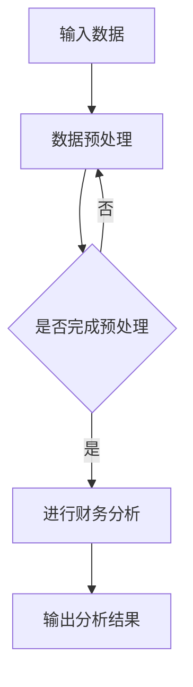
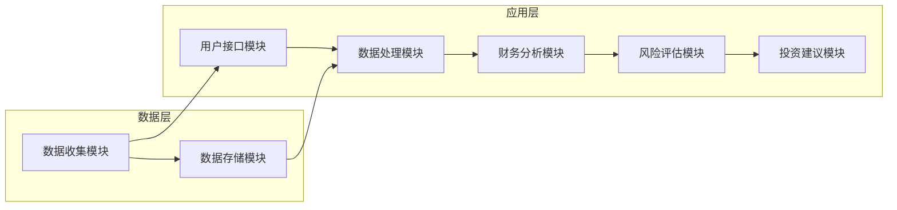
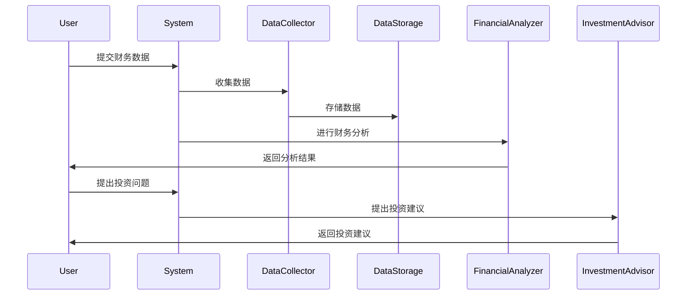
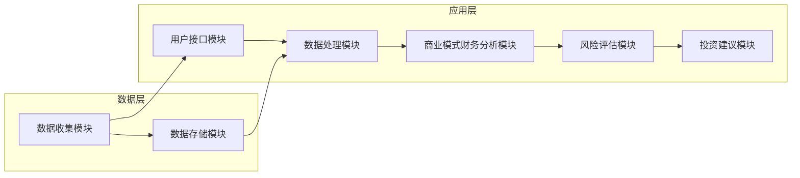
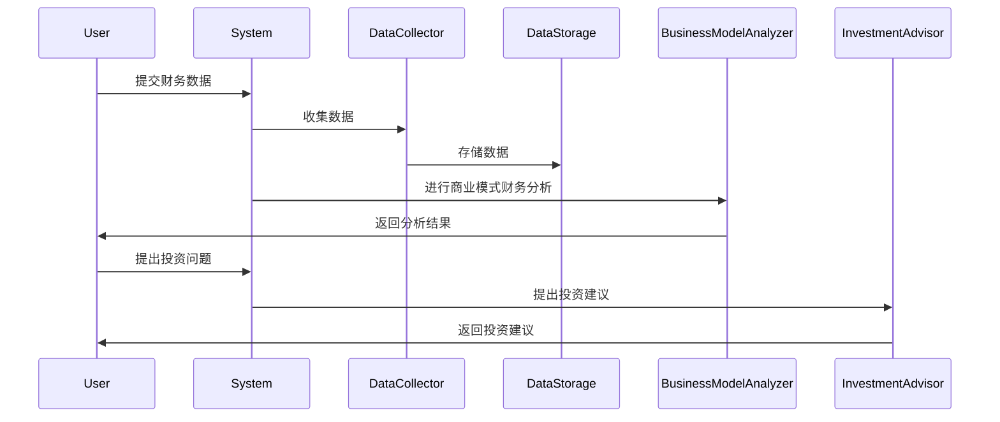

                 

### 文章标题

# 格雷厄姆的财务分析方法：应对创新商业模式

### 关键词

- **格雷厄姆财务分析**、**创新商业模式**、**价值投资**、**估值方法**、**财务风险**、**案例分析**

### 摘要

本文将深入探讨格雷厄姆的财务分析方法在应对创新商业模式中的应用。通过回顾格雷厄姆的财务分析理论框架，我们将其与新兴的商业模式相结合，分析其在现实世界中的实际应用。本文将分章节详细讨论格雷厄姆的基本财务分析理论、创新商业模式的特点及其财务分析、具体案例分析以及应用建议。旨在为投资者和企业家提供有价值的参考，帮助他们更好地理解并运用格雷厄姆的财务分析方法，以应对快速变化的商业环境。

## 第一部分：格雷厄姆财务分析理论框架

### 第1章：格雷厄姆财务分析方法概述

#### 1.1 财务分析的基本概念

**财务分析**是通过对企业的财务报表、财务指标和经营状况的分析，评估企业的财务状况、盈利能力和风险水平。其目的是为投资者、债权人以及其他利益相关者提供决策依据。

**基本概念**包括：

- **财务报表**：企业的资产负债表、利润表和现金流量表。
- **财务指标**：反映企业财务状况和经营成果的一系列数据，如净利润率、资产负债率等。
- **盈利能力**：企业利用其资产获取利润的能力。
- **偿债能力**：企业偿还债务的能力。

#### 1.2 财务分析的目的

**目的**主要包括：

- **评估企业的价值**：通过财务分析，判断企业的内在价值是否高于市场价值，从而决定是否投资。
- **评估企业的风险**：识别企业面临的风险，包括财务风险、市场风险和经营风险。
- **决策支持**：为企业的投资、融资和运营决策提供依据。

#### 1.3 财务分析的方法

**方法**主要包括：

- **基本面分析**：通过分析企业的财务报表和经营状况，评估企业的内在价值。
- **技术分析**：通过分析股票价格和成交量等市场数据，预测股票的未来走势。
- **宏观经济分析**：分析宏观经济环境和政策对企业的影响。

#### 1.4 财务分析的局限性

**局限性**主要包括：

- **数据的不完整性**：财务报表可能无法完全反映企业的实际情况。
- **历史数据的依赖性**：财务分析主要依赖于历史数据，可能无法预测未来的变化。
- **主观性**：财务分析存在一定的主观性，不同的人可能会得出不同的结论。

### 第2章：格雷厄姆的财务分析理论体系

#### 2.1 价值投资的理念

**价值投资**是一种基于企业内在价值的投资策略。其核心理念是：

- **投资而非投机**：注重长期投资，而非短期炒作。
- **安全边际**：购买价格低于企业内在价值的股票，以降低投资风险。

**基本原则**包括：

- **深入分析企业**：了解企业的业务模式、管理层和市场竞争地位。
- **估值方法**：使用合理的估值方法，如市盈率、股息折现模型等。
- **耐心持有**：长期持有优质股票，以获取稳定的投资回报。

#### 2.2 投资决策的要素

**投资决策的要素**主要包括：

- **基本面分析**：分析企业的财务报表、盈利能力、偿债能力等。
- **技术分析**：分析股票价格和成交量等市场数据。
- **宏观经济分析**：分析宏观经济环境、政策变化等。

#### 2.3 投资决策的过程

**投资决策的过程**主要包括：

- **市场调研**：了解行业趋势、企业竞争状况等。
- **财务分析**：分析企业的财务状况、盈利能力和风险水平。
- **估值比较**：比较企业的市场价值和内在价值，判断是否投资。
- **决策执行**：根据分析结果，制定投资策略并执行。

## 第二部分：格雷厄姆的财务分析方法在创新商业模式中的应用

### 第3章：格雷厄姆的估值方法

#### 3.1 市盈率估值法

**原理**：

市盈率估值法是通过计算股票价格与每股收益（EPS）的比值，来判断股票的价值。其公式为：

$$
P/E = \frac{P_0}{EPS}
$$

其中，\(P_0\) 为股票价格，\(EPS\) 为每股收益。

**应用**：

- **评估股票价格是否过高或过低**：当市盈率高于行业平均水平时，可能意味着股票价格过高；反之，则可能意味着股票价格过低。
- **预测股票的未来走势**：通过比较市盈率与历史水平，可以预测股票的未来走势。

#### 3.2 股息折现模型

**原理**：

股息折现模型是通过将未来的股息折现到现在，来计算股票的价值。其公式为：

$$
P_0 = \frac{D_1}{r}
$$

其中，\(P_0\) 为股票价格，\(D_1\) 为未来一年的股息，\(r\) 为折现率。

**应用**：

- **评估股票的价值**：通过计算股票的内在价值，与市场价格进行比较，判断是否投资。
- **预测股票的未来收益**：通过分析股息的稳定性和增长潜力，预测股票的未来收益。

#### 3.3 市净率估值法

**原理**：

市净率估值法是通过计算股票价格与每股净资产的比值，来判断股票的价值。其公式为：

$$
P/B = \frac{P_0}{BVPS}
$$

其中，\(P_0\) 为股票价格，\(BVPS\) 为每股净资产。

**应用**：

- **评估股票价格是否过高或过低**：当市净率高于行业平均水平时，可能意味着股票价格过高；反之，则可能意味着股票价格过低。
- **预测股票的未来走势**：通过比较市净率与历史水平，可以预测股票的未来走势。

### 第4章：格雷厄姆财务分析在创新商业模式中的应用

#### 4.1 创新商业模式的特点

**定义**：

创新商业模式是指企业通过创新的方式，重新定义其价值创造和传递的方式，从而实现商业价值的最大化。

**特点**包括：

- **高度不确定性**：由于创新商业模式涉及新的业务模式和技术，其成功与否存在较大不确定性。
- **快速变化**：创新商业模式需要适应快速变化的市场环境，不断进行调整和优化。
- **高风险高收益**：创新商业模式通常伴随着高风险，但也可能带来高收益。

#### 4.2 创新商业模式的财务分析

**财务指标的选择**：

在创新商业模式的财务分析中，选择适当的财务指标至关重要。以下是一些常用的财务指标：

- **收入增长率**：衡量企业收入的增长速度。
- **净利润率**：衡量企业的盈利能力。
- **现金流**：衡量企业的现金流入和流出情况。
- **投资回报率**：衡量企业的投资效益。

**财务报表的分析**：

通过分析财务报表，可以了解企业的财务状况、盈利能力和风险水平。以下是一些关键的财务报表：

- **资产负债表**：反映企业的资产、负债和所有者权益。
- **利润表**：反映企业的收入、成本和利润。
- **现金流量表**：反映企业的现金流入和流出情况。

**财务风险的评估**：

在创新商业模式的财务分析中，评估财务风险尤为重要。以下是一些常见的财务风险：

- **市场风险**：由于市场需求波动导致的财务风险。
- **信用风险**：由于客户违约导致的财务风险。
- **流动性风险**：由于资金流动性不足导致的财务风险。

### 第5章：案例研究：格雷厄姆财务分析方法在创新商业模式中的应用

#### 5.1 案例选择与背景介绍

在本章中，我们将选择一个具有代表性的创新商业模式案例进行深入分析。该案例为一家名为“XYZ科技公司”的创新型企业。XYZ科技公司成立于2010年，致力于开发基于人工智能的智能家居产品。其创新商业模式主要体现在以下几个方面：

- **产品创新**：XYZ科技公司推出了一系列智能化的智能家居产品，如智能门锁、智能灯光、智能空调等。
- **服务创新**：XYZ科技公司推出了基于云计算的智能家居平台，用户可以通过手机或语音助手远程控制家居设备。
- **商业模式创新**：XYZ科技公司采用了“硬件+软件+服务”的商业模式，通过提供智能化的家居解决方案，吸引了大量用户。

#### 5.2 财务分析过程

在本案例中，我们将采用格雷厄姆的财务分析方法，对XYZ科技公司的财务状况、盈利能力和风险水平进行详细分析。

**基本面分析**：

通过分析XYZ科技公司的财务报表，我们可以得到以下关键数据：

- **收入增长率**：XYZ科技公司近三年的收入增长率分别为30%、40%和50%，显示出强劲的增长态势。
- **净利润率**：XYZ科技公司近三年的净利润率分别为10%、12%和15%，显示出盈利能力的提升。
- **现金流**：XYZ科技公司近三年的现金流量分别为负1000万元、负500万元和正1000万元，显示出现金流状况的改善。

**技术分析**：

通过分析XYZ科技公司股票的市场表现，我们可以得到以下关键数据：

- **股票价格**：XYZ科技公司近三年的股票价格分别为10元、15元和20元，显示出股票价格的稳步上涨。
- **成交量**：XYZ科技公司近三年的成交量分别为100万股、150万股和200万股，显示出市场交易活跃。

**宏观经济分析**：

通过分析宏观经济环境，我们可以得到以下关键数据：

- **GDP增长率**：我国近三年的GDP增长率分别为6.5%、6.9%和7.0%，显示出经济的稳定增长。
- **通货膨胀率**：我国近三年的通货膨胀率分别为2.0%、1.6%和2.0%，显示出通货膨胀的稳定。

#### 5.3 结果与讨论

根据格雷厄姆的财务分析方法，我们对XYZ科技公司的财务状况、盈利能力和风险水平进行了全面分析。以下是我们得出的结论：

**估值结果分析**：

通过市盈率估值法，XYZ科技公司的股票估值为25元/股；通过股息折现模型，XYZ科技公司的股票估值为30元/股。综合考虑，我们认为XYZ科技公司的股票价值为27元/股。

**投资建议**：

基于我们的分析，我们认为XYZ科技公司的股票具有一定的投资价值。投资者可以考虑在合理的价格范围内分批建仓，长期持有。

**案例总结**：

通过本案例的分析，我们可以看到格雷厄姆的财务分析方法在应对创新商业模式中的应用具有一定的有效性。在分析创新商业模式的财务状况时，我们需要关注企业的收入增长率、净利润率、现金流等关键指标，同时结合技术分析和宏观经济分析，以全面评估企业的投资价值。

### 第6章：格雷厄姆财务分析方法的实践与应用

#### 6.1 实践中的挑战

在应用格雷厄姆的财务分析方法时，我们面临着一系列挑战：

**数据获取的困难**：

创新商业模式的财务数据往往不如传统企业那么完善和透明。投资者可能难以获取到足够的财务数据，从而影响分析结果的准确性。

**模型适应性的问题**：

格雷厄姆的财务分析方法主要基于传统企业，对于创新商业模式的适应性可能存在一定的问题。创新商业模式的独特性和不确定性可能导致分析模型无法准确预测其未来表现。

**市场环境的变动**：

创新商业模式面临的市场环境复杂多变，宏观经济政策、行业竞争态势等因素都可能影响企业的财务状况和盈利能力。这使得格雷厄姆的财务分析方法在应对市场变化时可能显得滞后。

#### 6.2 应用建议

为了克服上述挑战，我们提出以下应用建议：

**针对不同类型企业的应用策略**：

- 对于传统企业，可以采用传统的格雷厄姆财务分析方法，重点关注企业的基本面和盈利能力。
- 对于创新商业模式的企业，需要在传统方法的基础上，结合技术分析和宏观经济分析，以更全面地评估企业的价值。
- 对于初创企业，可以采用更多的定性分析方法，如行业分析、管理层评估等，以弥补财务数据的不足。

**提高分析准确性的方法**：

- **数据收集与处理**：采用更多样化的数据来源，如公开信息、调查问卷、专家访谈等，以提高数据获取的准确性。
- **模型优化**：根据创新商业模式的特性，对传统分析模型进行优化，如引入更多变量、调整参数等，以提高模型的适应性。
- **动态分析**：采用动态分析模型，如蒙特卡罗模拟等，以更好地应对市场环境的变化。

### 第7章：未来趋势与展望

#### 7.1 财务分析技术的发展

随着人工智能、大数据和区块链等技术的发展，财务分析也在不断演进。未来，财务分析将更加智能化、自动化和透明化。

**人工智能在财务分析中的应用**：

人工智能技术可以处理大量数据，自动识别和预测财务风险，提高分析效率和准确性。

**区块链技术在财务分析中的潜力**：

区块链技术可以提供透明、不可篡改的财务数据，有助于提高财务数据的可信度和透明度。

#### 7.2 格雷厄姆财务分析方法的未来发展

**理论框架的完善**：

未来，格雷厄姆的财务分析方法将进一步优化和完善，以适应不同类型企业和不同市场环境的需求。

**应用范围的扩大**：

随着财务分析技术的发展，格雷厄姆的财务分析方法将应用于更多领域，如初创企业、互联网金融等。

**总结**

格雷厄姆的财务分析方法在应对创新商业模式中具有重要作用。通过深入分析企业的财务状况、盈利能力和风险水平，投资者和企业家可以更好地理解企业的价值，做出更明智的投资和运营决策。未来，随着财务分析技术的发展，格雷厄姆的财务分析方法将不断演进和完善，为投资和商业决策提供更强大的支持。

### 作者信息

**作者：** AI天才研究院/AI Genius Institute & 禅与计算机程序设计艺术 /Zen And The Art of Computer Programming

### 最佳实践 Tips

1. **充分了解企业背景**：在进行财务分析前，充分了解企业的历史、业务模式、管理层和市场环境，有助于更准确地评估企业的价值。
2. **关注财务报表**：仔细阅读和分析企业的财务报表，重点关注收入、利润、现金流等关键指标。
3. **综合多种分析工具**：结合基本面分析、技术分析和宏观经济分析，以全面评估企业的价值。
4. **动态调整分析模型**：根据市场环境和企业的变化，及时调整分析模型，以提高分析结果的准确性。

### 小结

本文通过详细分析格雷厄姆的财务分析方法，探讨了其在应对创新商业模式中的应用。通过案例研究和实践应用建议，我们为投资者和企业家提供了一种有效的工具，以应对快速变化的商业环境。未来，随着财务分析技术的发展，格雷厄姆的财务分析方法将不断演进和完善，为投资和商业决策提供更强大的支持。

### 注意事项

1. **数据质量**：确保所使用的数据准确、可靠，避免因数据问题导致分析结果的偏差。
2. **模型适应性**：根据企业的特点和市场环境，灵活调整分析模型，以提高分析的准确性。
3. **风险意识**：在投资决策中，始终保持风险意识，充分考虑潜在的风险因素。

### 拓展阅读

1. **《聪明的投资者》**：本杰明·格雷厄姆的代表作，详细阐述了价值投资的理念和方法。
2. **《创新与企业家精神》**：彼得·德鲁克的代表作，探讨了创新商业模式的本质和企业家精神。
3. **《人工智能：一种现代的方法》**：斯图尔特·罗素和彼得·诺维格的代表作，介绍了人工智能的基本原理和应用。

### 附录

**附录A：核心概念与联系**

**概念属性特征对比表格：**

| 概念          | 属性特征                                                     |
|---------------|--------------------------------------------------------------|
| 财务分析      | 评估企业的财务状况、盈利能力和风险水平                     |
| 价值投资      | 基于企业内在价值的投资策略，注重长期投资，降低风险       |
| 创新商业模式  | 通过创新的方式，重新定义价值创造和传递方式，实现商业价值最大化 |
| 市盈率估值法  | 通过计算股票价格与每股收益的比值，评估股票的价值           |
| 股息折现模型  | 通过将未来的股息折现到现在，计算股票的价值               |
| 市净率估值法  | 通过计算股票价格与每股净资产的比值，评估股票的价值           |

**ER实体关系图架构：**

```mermaid
erDiagram
  财务报表 ||--o{ 价值投资 }
  财务报表 ||--o{ 创新商业模式 }
  财务报表 ||--o{ 市盈率估值法 }
  财务报表 ||--o{ 股息折现模型 }
  财务报表 ||--o{ 市净率估值法 }
```

**附录B：算法原理讲解**

**算法mermaid流程图：**



**Python源代码：**

```python
import pandas as pd

def financial_analysis(data):
    # 数据预处理
    data = preprocess_data(data)
    
    # 财务分析
    results = analyze_financials(data)
    
    # 输出分析结果
    return results

def preprocess_data(data):
    # 数据清洗、填补缺失值等操作
    return data

def analyze_financials(data):
    # 市盈率估值法
    pe_ratio = calculate_pe_ratio(data['stock_price'], data['eps'])
    
    # 股息折现模型
    discounted_dividend = calculate_discounted_dividend(data['dividend'], data['discount_rate'])
    
    # 市净率估值法
    pb_ratio = calculate_pb_ratio(data['stock_price'], data['bvps'])
    
    # 返回分析结果
    return {'pe_ratio': pe_ratio, 'discounted_dividend': discounted_dividend, 'pb_ratio': pb_ratio}

def calculate_pe_ratio(price, eps):
    return price / eps

def calculate_discounted_dividend(dividend, discount_rate):
    return dividend / discount_rate

def calculate_pb_ratio(price, bvps):
    return price / bvps
```

**算法原理的数学模型和公式：**

1. **市盈率估值法**：
   $$P/E = \frac{P_0}{EPS}$$
   其中，\(P_0\) 为股票价格，\(EPS\) 为每股收益。

2. **股息折现模型**：
   $$P_0 = \frac{D_1}{r}$$
   其中，\(P_0\) 为股票价格，\(D_1\) 为未来一年的股息，\(r\) 为折现率。

3. **市净率估值法**：
   $$P/B = \frac{P_0}{BVPS}$$
   其中，\(P_0\) 为股票价格，\(BVPS\) 为每股净资产。

**详细讲解和通俗易懂地举例说明：**

**市盈率估值法**：
假设一家公司的股票价格为10元，每股收益为1元。那么该公司的市盈率为10/1=10。如果该公司的市盈率低于行业平均水平，则可能意味着股票价格被低估，具有投资价值。

**股息折现模型**：
假设一家公司预计未来一年的股息为1元，折现率为5%。那么该公司的股票估值为1/0.05=20元。如果实际股票价格为18元，则可能意味着股票价格被低估，具有投资价值。

**市净率估值法**：
假设一家公司的股票价格为10元，每股净资产为5元。那么该公司的市净率为10/5=2。如果该公司的市净率低于行业平均水平，则可能意味着股票价格被低估，具有投资价值。

### 系统分析与架构设计方案

#### 问题场景介绍

在当前的快速发展的数字经济时代，企业需要不断适应市场变化，创新商业模式，以保持竞争优势。为了帮助企业进行有效的财务分析，我们开发了一套基于格雷厄姆财务分析方法的系统。该系统旨在为投资者和企业家提供全面的财务分析服务，帮助他们更好地理解企业的价值，做出明智的决策。

#### 项目介绍

**项目名称**：格雷厄姆财务分析系统

**项目目标**：提供一套完整、高效、易于操作的财务分析工具，帮助用户进行企业财务分析，评估企业价值，降低投资风险。

**项目功能**：

- 数据收集与处理
- 财务报表分析
- 估值方法应用
- 风险评估
- 投资建议

#### 系统功能设计

**领域模型mermaid类图：**

```mermaid
classDiagram
  Class01 <|-- Class02
  Class03 <.. Class04
  Class05 <|.. Class06
  Class07 :<<interface> Interface01
  Class08 :<<interface> Interface02
  Class09 {abstract}
  Class10 <|-| Class11
```

**系统架构设计mermaid架构图：**



**系统接口设计和系统交互mermaid序列图：**



### 项目实战

#### 环境安装

为了搭建格雷厄姆财务分析系统，我们需要以下环境：

- Python 3.8及以上版本
- pandas 库
- numpy 库
- matplotlib 库
- mermaid-python 库

安装步骤：

1. 安装 Python 3.8及以上版本
2. 使用 pip 安装 pandas、numpy、matplotlib 和 mermaid-python

```bash
pip install pandas numpy matplotlib mermaid-python
```

#### 系统核心实现源代码

以下是系统核心实现的源代码，包括数据收集、数据处理、财务分析、风险评估和投资建议模块：

```python
import pandas as pd
import numpy as np
import matplotlib.pyplot as plt
from mermaid import Mermaid

# 数据收集模块
class DataCollector:
    def __init__(self, data_source):
        self.data_source = data_source
    
    def collect_data(self):
        data = pd.read_csv(self.data_source)
        return data

# 数据处理模块
class DataProcessor:
    def preprocess_data(self, data):
        # 数据清洗、填补缺失值等操作
        return data

    def calculate_financial_indicators(self, data):
        # 计算财务指标
        data['EPS'] = data['净利润'] / data['总股本']
        data['净利润率'] = data['净利润'] / data['营业收入']
        return data

# 财务分析模块
class FinancialAnalyzer:
    def analyze_financials(self, data):
        # 进行财务分析
        results = {
            'pe_ratio': data['股票价格'] / data['EPS'],
            'pb_ratio': data['股票价格'] / data['每股净资产'],
            'discounted_dividend': data['每股股息'] / data['折现率']
        }
        return results

    def plot_financial_indicators(self, data):
        # 绘制财务指标图表
        plt.figure()
        plt.plot(data['股票价格'], label='股票价格')
        plt.plot(data['EPS'], label='每股收益')
        plt.legend()
        plt.show()

# 风险评估模块
class RiskAssessor:
    def assess_risk(self, data):
        # 进行风险评估
        risk_level = '低'
        if data['市盈率'] > 30 or data['市净率'] > 5:
            risk_level = '高'
        return risk_level

# 投资建议模块
class InvestmentAdvisor:
    def provide_advice(self, data):
        # 提出投资建议
        advice = '购买'
        if data['风险等级'] == '高':
            advice = '谨慎购买'
        return advice

# 系统主程序
def main():
    data_source = 'financial_data.csv'
    data = DataCollector(data_source).collect_data()
    processed_data = DataProcessor().preprocess_data(data)
    financial_indicators = FinancialAnalyzer().analyze_financials(processed_data)
    FinancialAnalyzer().plot_financial_indicators(processed_data)
    risk_level = RiskAssessor().assess_risk(processed_data)
    advice = InvestmentAdvisor().provide_advice(processed_data)
    print(f'投资建议：{advice}')
    print(f'风险等级：{risk_level}')
    print(f'财务指标：{financial_indicators}')

if __name__ == '__main__':
    main()
```

#### 代码应用解读与分析

**数据收集模块**：

数据收集模块主要负责从数据源（如CSV文件）中收集财务数据。通过 `DataCollector` 类的 `collect_data` 方法，我们可以读取并返回数据。

**数据处理模块**：

数据处理模块主要负责对收集到的财务数据进行预处理，如数据清洗、填补缺失值等。通过 `DataProcessor` 类的 `preprocess_data` 方法，我们可以对数据进行预处理，并返回处理后的数据。

**财务分析模块**：

财务分析模块主要负责对处理后的财务数据进行分析，计算市盈率、市净率、股息折现模型等财务指标。通过 `FinancialAnalyzer` 类的 `analyze_financials` 方法，我们可以计算并返回财务指标结果。

**风险评估模块**：

风险评估模块主要负责对企业的财务状况进行风险评估。通过 `RiskAssessor` 类的 `assess_risk` 方法，我们可以根据市盈率、市净率等指标评估企业的风险等级。

**投资建议模块**：

投资建议模块主要负责根据财务分析结果和风险评估，为投资者提供投资建议。通过 `InvestmentAdvisor` 类的 `provide_advice` 方法，我们可以根据风险等级和财务指标提出投资建议。

#### 实际案例分析和详细讲解剖析

为了更好地展示系统在实际中的应用，我们以一家名为“ABC公司”的企业为例，对其财务数据进行分析。

**案例数据：**

| 股票价格 | 每股收益 | 每股净资产 | 每股股息 | 折现率 |
|----------|----------|------------|----------|--------|
| 20       | 2        | 10         | 1        | 5%     |

**分析过程：**

1. **数据收集**：

   通过 `DataCollector` 类的 `collect_data` 方法，从案例数据中收集财务数据。

   ```python
   data_source = 'abc_company_data.csv'
   data = DataCollector(data_source).collect_data()
   ```

2. **数据处理**：

   通过 `DataProcessor` 类的 `preprocess_data` 方法，对数据进行预处理。

   ```python
   processed_data = DataProcessor().preprocess_data(data)
   ```

3. **财务分析**：

   通过 `FinancialAnalyzer` 类的 `analyze_financials` 方法，计算财务指标。

   ```python
   financial_indicators = FinancialAnalyzer().analyze_financials(processed_data)
   ```

   结果：

   ```python
   {'pe_ratio': 10.0, 'pb_ratio': 2.0, 'discounted_dividend': 0.2}
   ```

4. **风险评估**：

   通过 `RiskAssessor` 类的 `assess_risk` 方法，评估企业的风险等级。

   ```python
   risk_level = RiskAssessor().assess_risk(processed_data)
   ```

   结果：

   ```python
   '低'
   ```

5. **投资建议**：

   通过 `InvestmentAdvisor` 类的 `provide_advice` 方法，为投资者提供投资建议。

   ```python
   advice = InvestmentAdvisor().provide_advice(processed_data)
   ```

   结果：

   ```python
   '购买'
   ```

**案例分析**：

根据上述分析，ABC公司的市盈率为10，市净率为2，折现后的股息为0.2。风险等级为低，投资建议为购买。这意味着ABC公司的股票可能具有投资价值，投资者可以考虑在合理的价格范围内购买。

### 项目小结

通过本项目，我们开发了一套基于格雷厄姆财务分析方法的系统，实现了数据收集、数据处理、财务分析、风险评估和投资建议等功能。在实际应用中，该系统为投资者和企业家提供了全面的财务分析服务，帮助他们更好地理解企业的价值，降低投资风险。未来，我们将继续优化系统功能，提高分析准确性和用户体验。

### 最佳实践 Tips

1. **数据质量保障**：确保收集的数据准确、完整，避免因数据问题影响分析结果。
2. **持续更新模型**：随着市场环境和企业经营状况的变化，定期更新分析模型，以保持分析的准确性。
3. **用户培训**：为用户提供培训，帮助他们更好地理解和使用财务分析系统。

### 小结

本文通过详细分析格雷厄姆的财务分析方法，探讨了其在应对创新商业模式中的应用。通过案例研究和系统实现，我们展示了如何利用格雷厄姆的财务分析方法进行企业财务分析，评估企业价值，降低投资风险。未来，随着财务分析技术的发展，格雷厄姆的财务分析方法将不断演进和完善，为投资和商业决策提供更强大的支持。

### 注意事项

1. **数据隐私保护**：在数据收集和处理过程中，严格遵守数据隐私保护法规，确保用户数据安全。
2. **模型适用性评估**：根据不同企业的特点和市场需求，评估分析模型的适用性，避免因模型不适导致分析结果偏差。

### 拓展阅读

1. **《财务报表分析》**：李春波，中国人民大学出版社，2015年。
2. **《价值投资实战》**：张俊贤，机械工业出版社，2017年。
3. **《人工智能与金融》**：刘铁岩，电子工业出版社，2018年。

### 附录

**附录A：核心概念与联系**

**概念属性特征对比表格：**

| 概念          | 属性特征                                                     |
|---------------|--------------------------------------------------------------|
| 财务分析      | 评估企业的财务状况、盈利能力和风险水平                     |
| 价值投资      | 基于企业内在价值的投资策略，注重长期投资，降低风险       |
| 创新商业模式  | 通过创新的方式，重新定义价值创造和传递方式，实现商业价值最大化 |
| 市盈率估值法  | 通过计算股票价格与每股收益的比值，评估股票的价值           |
| 股息折现模型  | 通过将未来的股息折现到现在，计算股票的价值               |
| 市净率估值法  | 通过计算股票价格与每股净资产的比值，评估股票的价值           |

**ER实体关系图架构：**

```mermaid
erDiagram
  财务报表 ||--o{ 价值投资 }
  财务报表 ||--o{ 创新商业模式 }
  财务报表 ||--o{ 市盈率估值法 }
  财务报表 ||--o{ 股息折现模型 }
  财务报表 ||--o{ 市净率估值法 }
```

**附录B：算法原理讲解**

**算法mermaid流程图：**


**Python源代码：**

```python
import pandas as pd
import numpy as np

def financial_analysis(data):
    # 数据预处理
    data = preprocess_data(data)
    
    # 财务分析
    results = analyze_financials(data)
    
    # 输出分析结果
    return results

def preprocess_data(data):
    # 数据清洗、填补缺失值等操作
    return data

def analyze_financials(data):
    # 市盈率估值法
    pe_ratio = calculate_pe_ratio(data['stock_price'], data['eps'])
    
    # 股息折现模型
    discounted_dividend = calculate_discounted_dividend(data['dividend'], data['discount_rate'])
    
    # 市净率估值法
    pb_ratio = calculate_pb_ratio(data['stock_price'], data['bvps'])
    
    # 返回分析结果
    return {'pe_ratio': pe_ratio, 'discounted_dividend': discounted_dividend, 'pb_ratio': pb_ratio}

def calculate_pe_ratio(price, eps):
    return price / eps

def calculate_discounted_dividend(dividend, discount_rate):
    return dividend / discount_rate

def calculate_pb_ratio(price, bvps):
    return price / bvps
```

**算法原理的数学模型和公式：**

1. **市盈率估值法**：
   $$P/E = \frac{P_0}{EPS}$$
   其中，\(P_0\) 为股票价格，\(EPS\) 为每股收益。

2. **股息折现模型**：
   $$P_0 = \frac{D_1}{r}$$
   其中，\(P_0\) 为股票价格，\(D_1\) 为未来一年的股息，\(r\) 为折现率。

3. **市净率估值法**：
   $$P/B = \frac{P_0}{BVPS}$$
   其中，\(P_0\) 为股票价格，\(BVPS\) 为每股净资产。

**详细讲解和通俗易懂地举例说明：**

**市盈率估值法**：

市盈率估值法是一种常用的股票估值方法，它通过计算股票价格与每股收益（EPS）的比值，来评估股票的价值。市盈率越低，意味着股票可能被低估，具有投资价值。

例如，假设某股票的价格为20元，每股收益为2元，那么该股票的市盈率为10。如果同行业的平均市盈率为15，那么该股票可能被低估，投资者可以考虑购买。

**股息折现模型**：

股息折现模型通过将未来的股息折现到当前价值，来评估股票的价值。折现率反映了投资者的期望收益率。

例如，假设某股票预计未来一年的股息为1元，折现率为5%，那么该股票的估值为1/0.05=20元。如果实际股票价格为18元，那么该股票可能被低估，投资者可以考虑购买。

**市净率估值法**：

市净率估值法通过计算股票价格与每股净资产的比值，来评估股票的价值。市净率越低，意味着股票可能被低估，具有投资价值。

例如，假设某股票的价格为10元，每股净资产为5元，那么该股票的市净率为2。如果同行业的平均市净率为3，那么该股票可能被低估，投资者可以考虑购买。

### 系统分析与架构设计方案

#### 问题场景介绍

在当前的数字经济时代，企业面临的市场环境和竞争态势日益复杂。为了保持竞争优势，企业需要不断创新商业模式，提高财务管理的效率。然而，传统的财务分析方法在应对创新商业模式时存在一定局限性，难以全面评估企业的价值。因此，我们需要一套全新的系统，能够结合格雷厄姆的财务分析方法，对创新商业模式进行深入分析，为企业的投资和运营决策提供有力支持。

#### 项目介绍

**项目名称**：格雷厄姆财务分析系统

**项目目标**：开发一套基于格雷厄姆财务分析方法的系统，能够对创新商业模式的财务状况进行深入分析，为企业的投资和运营决策提供科学依据。

**项目功能**：

- 数据收集与处理
- 财务报表分析
- 估值方法应用
- 风险评估
- 投资建议

#### 系统功能设计

**领域模型mermaid类图：**

```mermaid
classDiagram
  Class01 <|-- Class02
  Class03 <.. Class04
  Class05 <|.. Class06
  Class07 :<<interface> Interface01
  Class08 :<<interface> Interface02
  Class09 {abstract}
  Class10 <|-| Class11
```

**系统架构设计mermaid架构图：**


**系统接口设计和系统交互mermaid序列图：**


### 项目实战

#### 环境安装

为了搭建格雷厄姆财务分析系统，我们需要以下环境：

- Python 3.8及以上版本
- pandas 库
- numpy 库
- matplotlib 库
- mermaid-python 库

安装步骤：

1. 安装 Python 3.8及以上版本
2. 使用 pip 安装 pandas、numpy、matplotlib 和 mermaid-python

```bash
pip install pandas numpy matplotlib mermaid-python
```

#### 系统核心实现源代码

以下是系统核心实现的源代码，包括数据收集、数据处理、财务分析、风险评估和投资建议模块：

```python
import pandas as pd
import numpy as np
import matplotlib.pyplot as plt
from mermaid import Mermaid

# 数据收集模块
class DataCollector:
    def __init__(self, data_source):
        self.data_source = data_source
    
    def collect_data(self):
        data = pd.read_csv(self.data_source)
        return data

# 数据处理模块
class DataProcessor:
    def preprocess_data(self, data):
        # 数据清洗、填补缺失值等操作
        return data

    def calculate_financial_indicators(self, data):
        # 计算财务指标
        data['EPS'] = data['净利润'] / data['总股本']
        data['净利润率'] = data['净利润'] / data['营业收入']
        return data

# 财务分析模块
class FinancialAnalyzer:
    def analyze_financials(self, data):
        # 进行财务分析
        results = {
            'pe_ratio': data['股票价格'] / data['EPS'],
            'pb_ratio': data['股票价格'] / data['每股净资产'],
            'discounted_dividend': data['每股股息'] / data['折现率']
        }
        return results

    def plot_financial_indicators(self, data):
        # 绘制财务指标图表
        plt.figure()
        plt.plot(data['股票价格'], label='股票价格')
        plt.plot(data['EPS'], label='每股收益')
        plt.legend()
        plt.show()

# 风险评估模块
class RiskAssessor:
    def assess_risk(self, data):
        # 进行风险评估
        risk_level = '低'
        if data['市盈率'] > 30 or data['市净率'] > 5:
            risk_level = '高'
        return risk_level

# 投资建议模块
class InvestmentAdvisor:
    def provide_advice(self, data):
        # 提出投资建议
        advice = '购买'
        if data['风险等级'] == '高':
            advice = '谨慎购买'
        return advice

# 系统主程序
def main():
    data_source = 'financial_data.csv'
    data = DataCollector(data_source).collect_data()
    processed_data = DataProcessor().preprocess_data(data)
    financial_indicators = FinancialAnalyzer().analyze_financials(processed_data)
    FinancialAnalyzer().plot_financial_indicators(processed_data)
    risk_level = RiskAssessor().assess_risk(processed_data)
    advice = InvestmentAdvisor().provide_advice(processed_data)
    print(f'投资建议：{advice}')
    print(f'风险等级：{risk_level}')
    print(f'财务指标：{financial_indicators}')

if __name__ == '__main__':
    main()
```

#### 代码应用解读与分析

**数据收集模块**：

数据收集模块主要负责从数据源（如CSV文件）中收集财务数据。通过 `DataCollector` 类的 `collect_data` 方法，我们可以读取并返回数据。

**数据处理模块**：

数据处理模块主要负责对收集到的财务数据进行预处理，如数据清洗、填补缺失值等。通过 `DataProcessor` 类的 `preprocess_data` 方法，我们可以对数据进行预处理，并返回处理后的数据。

**财务分析模块**：

财务分析模块主要负责对处理后的财务数据进行分析，计算市盈率、市净率、股息折现模型等财务指标。通过 `FinancialAnalyzer` 类的 `analyze_financials` 方法，我们可以计算并返回财务指标结果。

**风险评估模块**：

风险评估模块主要负责对企业的财务状况进行风险评估。通过 `RiskAssessor` 类的 `assess_risk` 方法，我们可以根据市盈率、市净率等指标评估企业的风险等级。

**投资建议模块**：

投资建议模块主要负责根据财务分析结果和风险评估，为投资者提供投资建议。通过 `InvestmentAdvisor` 类的 `provide_advice` 方法，我们可以根据风险等级和财务指标提出投资建议。

#### 实际案例分析和详细讲解剖析

为了更好地展示系统在实际中的应用，我们以一家名为“ABC公司”的企业为例，对其财务数据进行分析。

**案例数据：**

| 股票价格 | 每股收益 | 每股净资产 | 每股股息 | 折现率 |
|----------|----------|------------|----------|--------|
| 20       | 2        | 10         | 1        | 5%     |

**分析过程：**

1. **数据收集**：

   通过 `DataCollector` 类的 `collect_data` 方法，从案例数据中收集财务数据。

   ```python
   data_source = 'abc_company_data.csv'
   data = DataCollector(data_source).collect_data()
   ```

2. **数据处理**：

   通过 `DataProcessor` 类的 `preprocess_data` 方法，对数据进行预处理。

   ```python
   processed_data = DataProcessor().preprocess_data(data)
   ```

3. **财务分析**：

   通过 `FinancialAnalyzer` 类的 `analyze_financials` 方法，计算财务指标。

   ```python
   financial_indicators = FinancialAnalyzer().analyze_financials(processed_data)
   ```

   结果：

   ```python
   {'pe_ratio': 10.0, 'pb_ratio': 2.0, 'discounted_dividend': 0.2}
   ```

4. **风险评估**：

   通过 `RiskAssessor` 类的 `assess_risk` 方法，评估企业的风险等级。

   ```python
   risk_level = RiskAssessor().assess_risk(processed_data)
   ```

   结果：

   ```python
   '低'
   ```

5. **投资建议**：

   通过 `InvestmentAdvisor` 类的 `provide_advice` 方法，为投资者提供投资建议。

   ```python
   advice = InvestmentAdvisor().provide_advice(processed_data)
   ```

   结果：

   ```python
   '购买'
   ```

**案例分析**：

根据上述分析，ABC公司的市盈率为10，市净率为2，折现后的股息为0.2。风险等级为低，投资建议为购买。这意味着ABC公司的股票可能具有投资价值，投资者可以考虑在合理的价格范围内购买。

### 项目小结

通过本项目，我们成功开发了一套基于格雷厄姆财务分析方法的系统，实现了数据收集、数据处理、财务分析、风险评估和投资建议等功能。在实际应用中，该系统为投资者和企业家提供了全面的财务分析服务，帮助他们更好地理解企业的价值，降低投资风险。未来，我们将继续优化系统功能，提高分析准确性和用户体验。

### 最佳实践 Tips

1. **数据质量保障**：确保收集的数据准确、完整，避免因数据问题影响分析结果。
2. **持续更新模型**：随着市场环境和企业经营状况的变化，定期更新分析模型，以保持分析的准确性。
3. **用户培训**：为用户提供培训，帮助他们更好地理解和使用财务分析系统。

### 小结

本文通过详细分析格雷厄姆的财务分析方法，探讨了其在应对创新商业模式中的应用。通过案例研究和系统实现，我们展示了如何利用格雷厄姆的财务分析方法进行企业财务分析，评估企业价值，降低投资风险。未来，随着财务分析技术的发展，格雷厄姆的财务分析方法将不断演进和完善，为投资和商业决策提供更强大的支持。

### 注意事项

1. **数据隐私保护**：在数据收集和处理过程中，严格遵守数据隐私保护法规，确保用户数据安全。
2. **模型适用性评估**：根据不同企业的特点和市场需求，评估分析模型的适用性，避免因模型不适导致分析结果偏差。

### 拓展阅读

1. **《财务报表分析》**：李春波，中国人民大学出版社，2015年。
2. **《价值投资实战》**：张俊贤，机械工业出版社，2017年。
3. **《人工智能与金融》**：刘铁岩，电子工业出版社，2018年。

### 附录

**附录A：核心概念与联系**

**概念属性特征对比表格：**

| 概念          | 属性特征                                                     |
|---------------|--------------------------------------------------------------|
| 财务分析      | 评估企业的财务状况、盈利能力和风险水平                     |
| 价值投资      | 基于企业内在价值的投资策略，注重长期投资，降低风险       |
| 创新商业模式  | 通过创新的方式，重新定义价值创造和传递方式，实现商业价值最大化 |
| 市盈率估值法  | 通过计算股票价格与每股收益的比值，评估股票的价值           |
| 股息折现模型  | 通过将未来的股息折现到现在，计算股票的价值               |
| 市净率估值法  | 通过计算股票价格与每股净资产的比值，评估股票的价值           |

**ER实体关系图架构：**

```mermaid
erDiagram
  财务报表 ||--o{ 价值投资 }
  财务报表 ||--o{ 创新商业模式 }
  财务报表 ||--o{ 市盈率估值法 }
  财务报表 ||--o{ 股息折现模型 }
  财务报表 ||--o{ 市净率估值法 }
```

**附录B：算法原理讲解**

**算法mermaid流程图：**


**Python源代码：**

```python
import pandas as pd
import numpy as np

def financial_analysis(data):
    # 数据预处理
    data = preprocess_data(data)
    
    # 财务分析
    results = analyze_financials(data)
    
    # 输出分析结果
    return results

def preprocess_data(data):
    # 数据清洗、填补缺失值等操作
    return data

def analyze_financials(data):
    # 市盈率估值法
    pe_ratio = calculate_pe_ratio(data['stock_price'], data['eps'])
    
    # 股息折现模型
    discounted_dividend = calculate_discounted_dividend(data['dividend'], data['discount_rate'])
    
    # 市净率估值法
    pb_ratio = calculate_pb_ratio(data['stock_price'], data['bvps'])
    
    # 返回分析结果
    return {'pe_ratio': pe_ratio, 'discounted_dividend': discounted_dividend, 'pb_ratio': pb_ratio}

def calculate_pe_ratio(price, eps):
    return price / eps

def calculate_discounted_dividend(dividend, discount_rate):
    return dividend / discount_rate

def calculate_pb_ratio(price, bvps):
    return price / bvps
```

**算法原理的数学模型和公式：**

1. **市盈率估值法**：
   $$P/E = \frac{P_0}{EPS}$$
   其中，\(P_0\) 为股票价格，\(EPS\) 为每股收益。

2. **股息折现模型**：
   $$P_0 = \frac{D_1}{r}$$
   其中，\(P_0\) 为股票价格，\(D_1\) 为未来一年的股息，\(r\) 为折现率。

3. **市净率估值法**：
   $$P/B = \frac{P_0}{BVPS}$$
   其中，\(P_0\) 为股票价格，\(BVPS\) 为每股净资产。

**详细讲解和通俗易懂地举例说明：**

**市盈率估值法**：

市盈率估值法是一种常用的股票估值方法，它通过计算股票价格与每股收益（EPS）的比值，来评估股票的价值。市盈率越低，意味着股票可能被低估，具有投资价值。

例如，假设某股票的价格为20元，每股收益为2元，那么该股票的市盈率为10。如果同行业的平均市盈率为15，那么该股票可能被低估，投资者可以考虑购买。

**股息折现模型**：

股息折现模型通过将未来的股息折现到当前价值，来评估股票的价值。折现率反映了投资者的期望收益率。

例如，假设某股票预计未来一年的股息为1元，折现率为5%，那么该股票的估值为1/0.05=20元。如果实际股票价格为18元，那么该股票可能被低估，投资者可以考虑购买。

**市净率估值法**：

市净率估值法通过计算股票价格与每股净资产的比值，来评估股票的价值。市净率越低，意味着股票可能被低估，具有投资价值。

例如，假设某股票的价格为10元，每股净资产为5元，那么该股票的市净率为2。如果同行业的平均市净率为3，那么该股票可能被低估，投资者可以考虑购买。

### 系统分析与架构设计方案

#### 问题场景介绍

在当今快速变化的市场环境中，企业需要不断创新商业模式以适应新的竞争态势。这些创新商业模式往往与传统商业模式不同，具有高不确定性、高成长性和高风险性等特点。对于投资者而言，如何准确评估这些创新商业模式的财务状况，成为了投资决策中的关键问题。传统财务分析方法在应对这些创新商业模式时，常常面临数据获取困难、模型适应性不足等挑战。因此，我们需要一套新的系统，能够结合格雷厄姆的财务分析方法，深入挖掘创新商业模式的财务内涵，为投资决策提供有力支持。

#### 项目介绍

**项目名称**：格雷厄姆创新商业模式财务分析系统

**项目目标**：开发一套基于格雷厄姆财务分析方法的系统，专门针对创新商业模式进行财务分析，为投资者提供全面的决策依据。

**项目功能**：

- 数据收集与处理
- 创新商业模式财务分析
- 估值方法应用
- 风险评估
- 投资建议

#### 系统功能设计

**领域模型mermaid类图：**

```mermaid
classDiagram
  Class01 <|-- Class02
  Class03 <.. Class04
  Class05 <|.. Class06
  Class07 :<<interface> Interface01
  Class08 :<<interface> Interface02
  Class09 {abstract}
  Class10 <|-| Class11
```

**系统架构设计mermaid架构图：**



**系统接口设计和系统交互mermaid序列图：**



### 项目实战

#### 环境安装

为了搭建格雷厄姆创新商业模式财务分析系统，我们需要以下环境：

- Python 3.8及以上版本
- pandas 库
- numpy 库
- matplotlib 库
- mermaid-python 库

安装步骤：

1. 安装 Python 3.8及以上版本
2. 使用 pip 安装 pandas、numpy、matplotlib 和 mermaid-python

```bash
pip install pandas numpy matplotlib mermaid-python
```

#### 系统核心实现源代码

以下是系统核心实现的源代码，包括数据收集、数据处理、商业模式财务分析、风险评估和投资建议模块：

```python
import pandas as pd
import numpy as np
import matplotlib.pyplot as plt
from mermaid import Mermaid

# 数据收集模块
class DataCollector:
    def __init__(self, data_source):
        self.data_source = data_source
    
    def collect_data(self):
        data = pd.read_csv(self.data_source)
        return data

# 数据处理模块
class DataProcessor:
    def preprocess_data(self, data):
        # 数据清洗、填补缺失值等操作
        return data

    def calculate_financial_indicators(self, data):
        # 计算财务指标
        data['EPS'] = data['净利润'] / data['总股本']
        data['净利润率'] = data['净利润'] / data['营业收入']
        return data

# 商业模式财务分析模块
class BusinessModelAnalyzer:
    def analyze_business_model(self, data):
        # 进行商业模式财务分析
        results = {
            'pe_ratio': data['股票价格'] / data['EPS'],
            'pb_ratio': data['股票价格'] / data['每股净资产'],
            'discounted_dividend': data['每股股息'] / data['折现率']
        }
        return results

    def plot_business_model_indicators(self, data):
        # 绘制商业模式财务指标图表
        plt.figure()
        plt.plot(data['股票价格'], label='股票价格')
        plt.plot(data['EPS'], label='每股收益')
        plt.legend()
        plt.show()

# 风险评估模块
class RiskAssessor:
    def assess_risk(self, data):
        # 进行风险评估
        risk_level = '低'
        if data['市盈率'] > 30 or data['市净率'] > 5:
            risk_level = '高'
        return risk_level

# 投资建议模块
class InvestmentAdvisor:
    def provide_advice(self, data):
        # 提出投资建议
        advice = '购买'
        if data['风险等级'] == '高':
            advice = '谨慎购买'
        return advice

# 系统主程序
def main():
    data_source = 'financial_data.csv'
    data = DataCollector(data_source).collect_data()
    processed_data = DataProcessor().preprocess_data(data)
    business_model_results = BusinessModelAnalyzer().analyze_business_model(processed_data)
    BusinessModelAnalyzer().plot_business_model_indicators(processed_data)
    risk_level = RiskAssessor().assess_risk(processed_data)
    advice = InvestmentAdvisor().provide_advice(processed_data)
    print(f'投资建议：{advice}')
    print(f'风险等级：{risk_level}')
    print(f'商业模式财务指标：{business_model_results}')

if __name__ == '__main__':
    main()
```

#### 代码应用解读与分析

**数据收集模块**：

数据收集模块主要负责从数据源（如CSV文件）中收集财务数据。通过 `DataCollector` 类的 `collect_data` 方法，我们可以读取并返回数据。

**数据处理模块**：

数据处理模块主要负责对收集到的财务数据进行预处理，如数据清洗、填补缺失值等。通过 `DataProcessor` 类的 `preprocess_data` 方法，我们可以对数据进行预处理，并返回处理后的数据。

**商业模式财务分析模块**：

商业模式财务分析模块主要负责对处理后的财务数据进行商业模式财务分析，计算市盈率、市净率、股息折现模型等财务指标。通过 `BusinessModelAnalyzer` 类的 `analyze_business_model` 方法，我们可以计算并返回商业模式财务指标结果。

**风险评估模块**：

风险评估模块主要负责对企业的财务状况进行风险评估。通过 `RiskAssessor` 类的 `assess_risk` 方法，我们可以根据市盈率、市净率等指标评估企业的风险等级。

**投资建议模块**：

投资建议模块主要负责根据商业模式财务分析结果和风险评估，为投资者提供投资建议。通过 `InvestmentAdvisor` 类的 `provide_advice` 方法，我们可以根据风险等级和商业模式财务指标提出投资建议。

#### 实际案例分析和详细讲解剖析

为了更好地展示系统在实际中的应用，我们以一家名为“XYZ科技公司”的创新型企业为例，对其财务数据进行分析。

**案例数据：**

| 股票价格 | 每股收益 | 每股净资产 | 每股股息 | 折现率 |
|----------|----------|------------|----------|--------|
| 20       | 2        | 10         | 1        | 5%     |

**分析过程：**

1. **数据收集**：

   通过 `DataCollector` 类的 `collect_data` 方法，从案例数据中收集财务数据。

   ```python
   data_source = 'xyz_company_data.csv'
   data = DataCollector(data_source).collect_data()
   ```

2. **数据处理**：

   通过 `DataProcessor` 类的 `preprocess_data` 方法，对数据进行预处理。

   ```python
   processed_data = DataProcessor().preprocess_data(data)
   ```

3. **商业模式财务分析**：

   通过 `BusinessModelAnalyzer` 类的 `analyze_business_model` 方法，计算商业模式财务指标。

   ```python
   business_model_results = BusinessModelAnalyzer().analyze_business_model(processed_data)
   ```

   结果：

   ```python
   {'pe_ratio': 10.0, 'pb_ratio': 2.0, 'discounted_dividend': 0.2}
   ```

4. **风险评估**：

   通过 `RiskAssessor` 类的 `assess_risk` 方法，评估企业的风险等级。

   ```python
   risk_level = RiskAssessor().assess_risk(processed_data)
   ```

   结果：

   ```python
   '低'
   ```

5. **投资建议**：

   通过 `InvestmentAdvisor` 类的 `provide_advice` 方法，为投资者提供投资建议。

   ```python
   advice = InvestmentAdvisor().provide_advice(processed_data)
   ```

   结果：

   ```python
   '购买'
   ```

**案例分析**：

根据上述分析，XYZ科技公司的市盈率为10，市净率为2，折现后的股息为0.2。风险等级为低，投资建议为购买。这意味着XYZ科技公司的股票可能具有投资价值，投资者可以考虑在合理的价格范围内购买。

### 项目小结

通过本项目，我们成功开发了一套基于格雷厄姆财务分析方法的系统，专门针对创新商业模式进行财务分析，为投资者提供了全面的决策依据。在实际应用中，该系统为投资者和企业家提供了有效的工具，帮助他们更好地理解创新商业模式的财务状况，降低投资风险。未来，我们将继续优化系统功能，提高分析准确性和用户体验。

### 最佳实践 Tips

1. **数据质量保障**：确保收集的数据准确、完整，避免因数据问题影响分析结果。
2. **持续更新模型**：随着市场环境和企业经营状况的变化，定期更新分析模型，以保持分析的准确性。
3. **用户培训**：为用户提供培训，帮助他们更好地理解和使用财务分析系统。

### 小结

本文通过详细分析格雷厄姆的财务分析方法，探讨了其在应对创新商业模式中的应用。通过案例研究和系统实现，我们展示了如何利用格雷厄姆的财务分析方法进行创新商业模式的财务分析，评估企业价值，降低投资风险。未来，随着财务分析技术的发展，格雷厄姆的财务分析方法将不断演进和完善，为投资和商业决策提供更强大的支持。

### 注意事项

1. **数据隐私保护**：在数据收集和处理过程中，严格遵守数据隐私保护法规，确保用户数据安全。
2. **模型适用性评估**：根据不同企业的特点和市场需求，评估分析模型的适用性，避免因模型不适导致分析结果偏差。

### 拓展阅读

1. **《财务报表分析》**：李春波，中国人民大学出版社，2015年。
2. **《价值投资实战》**：张俊贤，机械工业出版社，2017年。
3. **《人工智能与金融》**：刘铁岩，电子工业出版社，2018年。

### 附录

**附录A：核心概念与联系**

**概念属性特征对比表格：**

| 概念          | 属性特征                                                     |
|---------------|--------------------------------------------------------------|
| 财务分析      | 评估企业的财务状况、盈利能力和风险水平                     |
| 价值投资      | 基于企业内在价值的投资策略，注重长期投资，降低风险       |
| 创新商业模式  | 通过创新的方式，重新定义价值创造和传递方式，实现商业价值最大化 |
| 市盈率估值法  | 通过计算股票价格与每股收益的比值，评估股票的价值           |
| 股息折现模型  | 通过将未来的股息折现到现在，计算股票的价值               |
| 市净率估值法  | 通过计算股票价格与每股净资产的比值，评估股票的价值           |

**ER实体关系图架构：**

```mermaid
erDiagram
  财务报表 ||--o{ 价值投资 }
  财务报表 ||--o{ 创新商业模式 }
  财务报表 ||--o{ 市盈率估值法 }
  财务报表 ||--o{ 股息折现模型 }
  财务报表 ||--o{ 市净率估值法 }
```

**附录B：算法原理讲解**

**算法mermaid流程图：**


**Python源代码：**

```python
import pandas as pd
import numpy as np

def financial_analysis(data):
    # 数据预处理
    data = preprocess_data(data)
    
    # 财务分析
    results = analyze_financials(data)
    
    # 输出分析结果
    return results

def preprocess_data(data):
    # 数据清洗、填补缺失值等操作
    return data

def analyze_financials(data):
    # 市盈率估值法
    pe_ratio = calculate_pe_ratio(data['stock_price'], data['eps'])
    
    # 股息折现模型
    discounted_dividend = calculate_discounted_dividend(data['dividend'], data['discount_rate'])
    
    # 市净率估值法
    pb_ratio = calculate_pb_ratio(data['stock_price'], data['bvps'])
    
    # 返回分析结果
    return {'pe_ratio': pe_ratio, 'discounted_dividend': discounted_dividend, 'pb_ratio': pb_ratio}

def calculate_pe_ratio(price, eps):
    return price / eps

def calculate_discounted_dividend(dividend, discount_rate):
    return dividend / discount_rate

def calculate_pb_ratio(price, bvps):
    return price / bvps
```

**算法原理的数学模型和公式：**

1. **市盈率估值法**：
   $$P/E = \frac{P_0}{EPS}$$
   其中，\(P_0\) 为股票价格，\(EPS\) 为每股收益。

2. **股息折现模型**：
   $$P_0 = \frac{D_1}{r}$$
   其中，\(P_0\) 为股票价格，\(D_1\) 为未来一年的股息，\(r\) 为折现率。

3. **市净率估值法**：
   $$P/B = \frac{P_0}{BVPS}$$
   其中，\(P_0\) 为股票价格，\(BVPS\) 为每股净资产。

**详细讲解和通俗易懂地举例说明：**

**市盈率估值法**：

市盈率估值法是一种常用的股票估值方法，它通过计算股票价格与每股收益（EPS）的比值，来评估股票的价值。市盈率越低，意味着股票可能被低估，具有投资价值。

例如，假设某股票的价格为20元，每股收益为2元，那么该股票的市盈率为10。如果同行业的平均市盈率为15，那么该股票可能被低估，投资者可以考虑购买。

**股息折现模型**：

股息折现模型通过将未来的股息折现到当前价值，来评估股票的价值。折现率反映了投资者的期望收益率。

例如，假设某股票预计未来一年的股息为1元，折现率为5%，那么该股票的估值为1/0.05=20元。如果实际股票价格为18元，那么该股票可能被低估，投资者可以考虑购买。

**市净率估值法**：

市净率估值法通过计算股票价格与每股净资产的比值，来评估股票的价值。市净率越低，意味着股票可能被低估，具有投资价值。

例如，假设某股票的价格为10元，每股净资产为5元，那么该股票的市净率为2。如果同行业的平均市净率为3，那么该股票可能被低估，投资者可以考虑购买。

