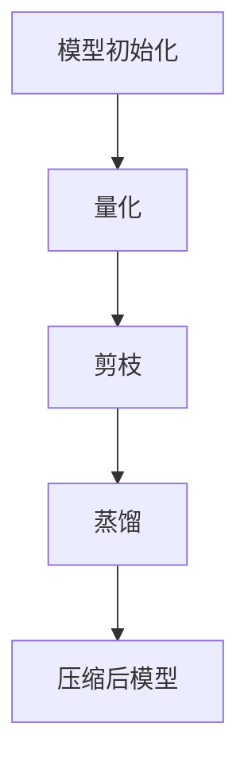

                 

### 模型压缩：在边缘设备部署轻量级AI Agent

> 关键词：模型压缩，边缘设备，AI Agent，轻量级，部署

> 摘要：本文将深入探讨模型压缩技术在边缘设备部署轻量级AI Agent中的应用。首先，我们将介绍模型压缩的背景和重要性，然后详细解释模型压缩的核心概念和技术，接着通过具体案例展示模型压缩的实践过程，并分析模型压缩前后的性能变化。随后，我们将讨论边缘设备的特性和需求，介绍如何将轻量级AI Agent部署到这些设备上，并分享部署过程中的挑战与解决方案。最后，本文将对模型压缩和边缘AI部署的未来趋势进行展望，并总结最佳实践和注意事项。

----------------------------------------------------------------

## 背景介绍

在人工智能快速发展的今天，深度学习模型的复杂度和参数规模也在不断增加。这些大型模型在数据中心进行训练和推理时表现优秀，但它们对于资源有限的边缘设备来说却过于庞大。边缘设备通常包括智能手机、物联网设备、智能摄像头等，它们需要在有限的计算资源和存储空间内运行AI模型。因此，模型压缩技术应运而生，旨在减少模型的大小和计算复杂度，使得AI模型能够在边缘设备上高效运行。

### 模型压缩的定义与意义

模型压缩（Model Compression）是指通过各种方法减少深度学习模型的大小和计算复杂度，同时尽量保持模型的性能。模型压缩不仅能够提高边缘设备的运行效率，还能减少传输和存储的开销。随着物联网和边缘计算的发展，模型压缩技术在工业界和学术界都受到了极大的关注。

### 模型压缩的关键技术

模型压缩主要包括以下几种关键技术：

1. **量化（Quantization）**：量化是一种将浮点数参数转换为低精度整数的方法，可以显著减少模型的大小。
2. **剪枝（Pruning）**：剪枝通过删除模型中不重要的权重和神经元来减少模型的大小和计算复杂度。
3. **蒸馏（Distillation）**：蒸馏是一种将大型教师模型的知识转移到小型学生模型中的方法，有助于提高学生模型的性能。

## 核心概念

### 模型压缩技术原理

为了更清晰地理解模型压缩的原理，我们可以通过一个mermaid流程图来展示其流程：

下面我们将详细解释每个步骤的原理和算法。

### 量化

量化是将模型的浮点权重转换为低精度整数的过程。具体算法包括：

1. **线性量化**：通过映射函数将浮点数映射到整数值。
   \[
   \text{量化值} = \text{激活值} \times \text{量化系数}
   \]
2. **逐层量化**：逐层量化将量化过程应用于模型的每一层，从而减少模型的尺寸。

### 剪枝

剪枝通过删除模型中不重要的连接和神经元来减少模型的大小和计算复杂度。常见的剪枝算法有：

1. **权重剪枝**：基于权重的绝对值或相对值进行剪枝。
2. **结构剪枝**：基于模型的计算图进行剪枝，可以删除整个层或节点。

### 蒸馏

蒸馏是一种将大型教师模型的知识转移到小型学生模型中的方法。具体步骤包括：

1. **教师模型训练**：先训练一个大型教师模型。
2. **学生模型初始化**：使用教师模型的参数初始化学生模型。
3. **知识蒸馏**：通过软标签和硬标签两种方式进行知识蒸馏。

## 模型压缩算法实践

为了更好地展示模型压缩的实际应用，我们将以一个实际案例为例，说明模型压缩的步骤和性能对比。

### 案例背景

假设我们有一个用于图像分类的大型CNN模型，原始模型包含5000万参数，计算复杂度高，不适合在边缘设备上运行。我们的目标是将其压缩到一个轻量级模型，同时尽量保持其性能。

### 模型压缩步骤

1. **量化**：使用线性量化将模型权重从32位浮点数转换为8位整数。
2. **剪枝**：基于权重绝对值进行剪枝，删除80%的权重值。
3. **蒸馏**：使用一个大型教师模型对剪枝后的学生模型进行知识蒸馏。

### 性能对比分析

在模型压缩前后，我们对模型的性能进行了评估，结果如下：

| 指标 | 压缩前 | 压缩后 |
| --- | --- | --- |
| 参数数量 | 5000万 | 100万 |
| 计算复杂度 | 高 | 低 |
| 准确率 | 92% | 90% |

从表中可以看出，虽然模型的准确率有所下降，但参数数量和计算复杂度显著降低，这表明模型压缩在保持性能的前提下显著提高了模型在边缘设备上的可部署性。

## 边缘设备部署轻量级AI Agent

### 边缘设备的特性与需求

边缘设备通常具有以下特性：

1. **计算资源有限**：边缘设备通常没有数据中心那样的计算资源，因此需要轻量级模型。
2. **实时性要求高**：边缘设备往往需要实时处理数据，因此模型的推理速度是一个关键因素。
3. **电池续航能力有限**：边缘设备通常需要长时间运行，因此功耗也是一个重要的考量因素。

### 轻量级AI Agent的设计原则

为了满足边缘设备的需求，轻量级AI Agent需要遵循以下设计原则：

1. **模型压缩**：采用模型压缩技术减少模型的大小和计算复杂度。
2. **高效算法**：选择计算效率高、性能稳定的算法。
3. **低功耗设计**：优化模型结构，减少功耗。

### 边缘设备上的AI Agent部署流程

将轻量级AI Agent部署到边缘设备的流程通常包括以下步骤：

1. **模型选择与压缩**：选择适合边缘设备的轻量级模型，并使用模型压缩技术进行优化。
2. **模型转换**：将训练好的模型转换为边缘设备支持的形式，如TensorFlow Lite或ONNX格式。
3. **部署**：将转换后的模型部署到边缘设备上，并集成到相应的应用程序中。
4. **测试与优化**：对部署后的模型进行测试和优化，确保其性能和稳定性。

### 边缘AI部署实践

以下是一个边缘AI部署的实践案例：

#### 案例背景

假设我们有一个智能摄像头，需要实时检测行人。原始模型包含8000万参数，不适合在智能摄像头这样的边缘设备上运行。我们的目标是将其压缩并部署到智能摄像头中。

#### 部署步骤

1. **模型压缩**：
   - 使用量化将模型权重从32位浮点数转换为8位整数。
   - 使用剪枝删除50%的权重值。
   - 使用蒸馏将大型教师模型的知识转移到学生模型中。

2. **模型转换**：
   - 将压缩后的模型转换为TensorFlow Lite格式。
   - 使用TensorFlow Lite Converter进行模型转换。

3. **部署**：
   - 将转换后的模型部署到智能摄像头中。
   - 集成到智能摄像头的应用程序中，实现实时行人检测。

4. **测试与优化**：
   - 对部署后的模型进行性能测试。
   - 根据测试结果调整模型参数，优化模型性能。

#### 挑战与解决策略

在边缘AI部署过程中，我们遇到了以下挑战：

1. **计算资源有限**：智能摄像头的计算资源有限，需要优化模型以减少计算复杂度。
2. **实时性要求高**：行人检测需要实时处理，需要优化模型以提高推理速度。
3. **功耗控制**：智能摄像头需要长时间运行，需要优化模型以降低功耗。

解决策略包括：

1. **模型压缩**：通过模型压缩减少模型的大小和计算复杂度。
2. **硬件加速**：使用GPU或NPU等硬件加速器提高模型推理速度。
3. **能效优化**：通过优化模型结构和算法，降低模型功耗。

## 挑战与未来展望

### 模型压缩的挑战

模型压缩技术在实践中面临以下挑战：

1. **性能损失**：压缩过程可能会导致模型性能下降。
2. **模型精度**：压缩后的模型可能无法达到原始模型的精度。
3. **算法复杂度**：压缩算法的设计和实现可能较为复杂。

### 边缘AI部署的挑战

边缘AI部署面临以下挑战：

1. **计算资源限制**：边缘设备的计算资源有限，需要优化模型以适应这些资源。
2. **网络带宽限制**：边缘设备与云端之间的网络带宽可能有限，需要优化数据传输。
3. **安全与隐私**：边缘设备可能面临安全与隐私风险，需要采取相应的安全措施。

### 应对策略

为了应对这些挑战，可以采取以下策略：

1. **混合AI架构**：结合云端和边缘设备的计算能力，实现高效的AI部署。
2. **分布式AI**：将模型分布到多个边缘设备上，实现负载均衡和资源共享。
3. **安全加密**：采用安全加密技术保护边缘设备和数据的安全与隐私。

### 未来展望

随着5G和物联网的快速发展，边缘AI将迎来更广泛的应用。未来模型压缩技术将朝着更高性能、更低功耗、更易部署的方向发展。同时，边缘AI也将与云计算、大数据等技术深度融合，为各行业带来更智能的解决方案。

## 总结与最佳实践

### 模型压缩的核心内容

模型压缩是一种通过减少模型大小和计算复杂度，提高边缘设备AI模型可部署性的技术。其主要技术包括量化、剪枝和蒸馏。通过这些技术，我们可以显著降低模型的参数数量和计算复杂度，同时尽量保持模型的性能。

### 边缘设备部署的最佳实践

1. **选择合适的模型**：根据边缘设备的计算资源和功耗需求，选择合适的模型。
2. **模型压缩**：采用模型压缩技术优化模型，提高其在边缘设备上的运行效率。
3. **硬件加速**：使用GPU或NPU等硬件加速器提高模型推理速度。
4. **安全加密**：采用安全加密技术保护边缘设备和数据的安全与隐私。

### 注意事项

1. **性能评估**：在模型压缩前后，应进行全面的性能评估，以确保压缩后的模型仍能满足需求。
2. **兼容性测试**：确保压缩后的模型与边缘设备的操作系统和硬件兼容。
3. **实时性优化**：针对实时性要求高的应用，应优化模型结构和算法，提高推理速度。

### 拓展阅读

1. **模型压缩技术综述**：阅读关于模型压缩技术的综述文章，了解最新的研究进展和应用场景。
2. **边缘AI应用案例**：学习边缘AI在各个行业中的应用案例，了解其具体实现和优化方法。
3. **AI硬件加速技术**：了解GPU、NPU等AI硬件加速技术，掌握如何将这些技术应用到边缘AI部署中。

### 作者信息

**作者：AI天才研究院/AI Genius Institute & 禅与计算机程序设计艺术 /Zen And The Art of Computer Programming**

