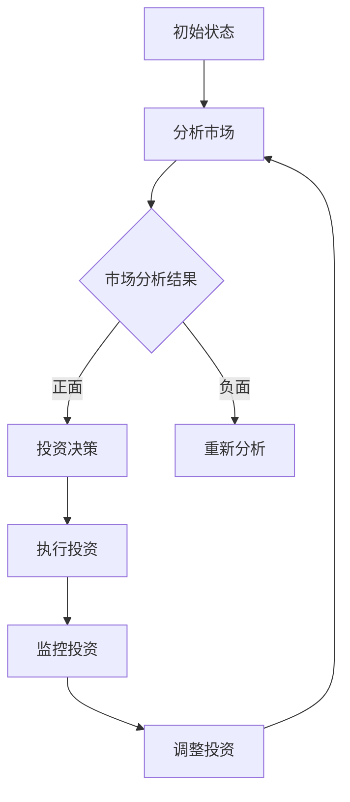
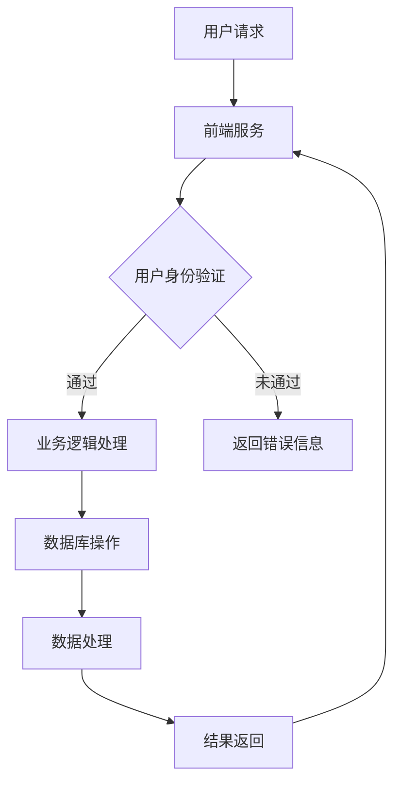
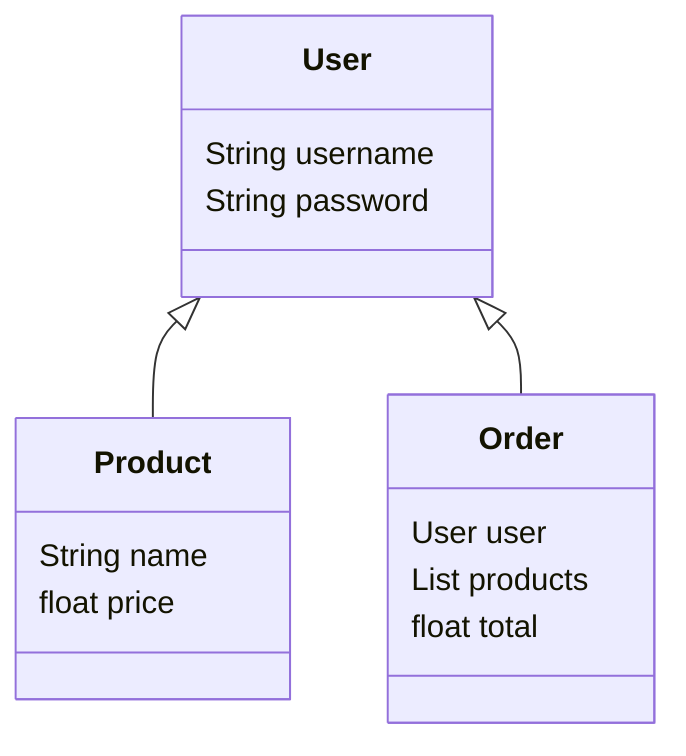

                 

### 引言与背景

在当今世界，投资已经成为了一种普遍的财富管理方式，而成功的投资往往离不开正确的理念和策略。沃伦·巴菲特（Warren Buffett），作为全球最著名的投资者之一，他的投资理念和策略不仅影响了无数投资者，也为人们提供了宝贵的参考。巴菲特以其独特的长期价值投资哲学而闻名，这一理念强调对企业的基本面进行深入分析，并持有长期的投资策略。然而，随着全球能源结构的转变，太阳能产业作为一个新兴领域，也逐渐引起了巴菲特的关注。

本文旨在探讨沃伦·巴菲特的投资理念，特别是他对太阳能产业的投资。通过分析巴菲特的投资哲学、人生经历以及他在太阳能产业的布局，我们将深入探讨长期持有的力量以及这一理念在实践中的重要性。本文还将分析巴菲特投资太阳能的初步布局和深入布局，探讨这些布局的战略思考和成效，并从中总结出对投资者的启示。

文章将分为以下几个部分：

1. **第一部分：引言与背景**
   - 第1章：沃伦·巴菲特的投资哲学与人生经历
   - 第2章：太阳能产业的兴起与发展
   - 第3章：长期持有的力量

2. **第二部分：巴菲特投资太阳能的案例分析**
   - 第4章：巴菲特投资太阳能的初步布局
   - 第5章：巴菲特投资太阳能的深入布局

3. **第三部分：巴菲特投资理念的启示与应用**
   - 第6章：巴菲特投资理念的启示
   - 第7章：投资者如何应用巴菲特的投资理念

4. **第四部分：太阳能产业的投资机会与挑战**
   - 第8章：太阳能产业的投资机会
   - 第9章：太阳能产业的投资挑战

通过这一系列的探讨，我们希望读者能够对沃伦·巴菲特的投资理念有更深入的理解，并能够将其应用于实际的太阳能产业投资中。

### 沃伦·巴菲特的投资哲学与人生经历

沃伦·巴菲特（Warren Buffett）的投资哲学是他的成功基石，而他的投资人生经历则为这一哲学提供了丰富的实践背景。在探讨巴菲特的投资理念之前，有必要先了解他的成长背景、投资生涯以及投资理念的演变，这些都将为我们理解他为何会对太阳能产业产生兴趣提供重要的线索。

#### 成长背景

沃伦·巴菲特于1930年8月30日出生于美国内布拉斯加州的奥马哈市。他的父亲霍华德·巴菲特（Howard Buffett）是一名成功的企业家和政治活动家，母亲莱丝尔·巴菲特（Leila Buffett）则是一位家庭主妇。巴菲特从小就表现出对数字和投资的兴趣。他的第一个股票交易是在11岁时完成的，购买的是城市服务公司（City Service Company）的股票。这次经历不仅让他获得了第一次投资收益，也激发了他对投资的热情。

巴菲特在高中时期就展现出了非凡的商业头脑。他利用暑假在一家高尔夫球场摆摊卖饮料和爆米花，赚取了大量的金钱。他还与朋友们合作，通过收集瓶子和易拉罐来赚钱，这些经验为他后来在投资领域的成功打下了坚实的基础。

1950年，巴菲特进入宾夕法尼亚大学攻读物理学，但不久后他意识到自己的兴趣更在于商业和金融。于是，他转学至内布拉斯加大学林肯分校，在那里他继续深造并获得了商业学位。在大学期间，巴菲特阅读了本杰明·格雷厄姆（Benjamin Graham）的《聪明的投资者》（The Intelligent Investor），这本书对他的投资理念产生了深远的影响。

毕业后，巴菲特决定前往纽约，但最终他选择留在奥马哈，因为那里有他热爱的工作和生活方式。1956年，巴菲特和他的合伙人查理·芒格（Charlie Munger）成立了巴菲特合伙公司（Buffett Partnership），开始了他的投资生涯。

#### 投资生涯

巴菲特的投资生涯可以划分为几个关键阶段。第一阶段是他在1957年至1969年期间，这一时期他主要通过格雷厄姆的“价值投资”理念进行操作。格雷厄姆强调寻找那些市场价格低于其内在价值的股票，并持有这些股票直到市场认识到其价值为止。巴菲特在这方面取得了显著的成功，他的投资组合平均年化收益率超过了30%。

第二阶段是从1970年至1990年代中期，这一时期巴菲特逐渐发展出自己的独特投资哲学。他不再仅仅依赖于寻找被低估的股票，而是更加关注企业的长期价值和竞争力。巴菲特开始投资于那些具有持久竞争优势的企业，如可口可乐、IBM和华盛顿邮报等。他的投资策略逐渐从“价值投资”转向“成长投资”，即在寻找价值的同时，也关注企业的成长潜力。

第三阶段是从1990年代中期至今，巴菲特继续优化他的投资策略，并将风险管理置于核心位置。他通过分散投资来降低风险，并强调长期持有的重要性。巴菲特在1998年收购了通用再保险（Gen Re），这一举措标志着他进入了更广泛的保险和再保险领域。通过这些多元化的投资，巴菲特不仅保护了投资者的资产，还实现了稳定的回报。

#### 巴菲特的投资理念演变

巴菲特的投资理念经历了显著的变化，但始终围绕几个核心原则：长期价值投资、基本面分析和管理风险。

1. **长期价值投资**：巴菲特相信，股票的价格最终会反映其内在价值。因此，他的目标是购买那些具有持久竞争优势且价值被低估的企业股票，并长期持有。这一理念的核心是耐心和信心，投资者需要在市场波动中保持冷静，坚持自己的投资策略。

2. **基本面分析**：巴菲特强调对企业的基本面进行深入分析，包括企业的盈利能力、市场份额、管理团队和竞争优势等。他认为，一个优秀的投资者必须具备深厚的商业知识和分析能力，以便准确地评估企业的真实价值。

3. **风险管理**：巴菲特深知风险是无法避免的，但他通过分散投资和长期持有来降低风险。他认为，一个成功的投资者不仅要追求收益，还要关注可能出现的损失。通过风险管理，投资者可以确保在市场波动中保持资产的稳定。

#### 太阳能产业的兴起与发展

随着全球对可再生能源的需求不断增长，太阳能产业在过去几十年里取得了显著的发展。太阳能产业包括从原材料生产到最终产品安装的各个环节，涉及光伏电池、组件制造、系统集成和电力传输等多个领域。

1. **太阳能产业的概述**

   太阳能光伏发电是利用太阳能电池将太阳光能直接转换为电能的技术。这一技术不仅具有环保、可再生、清洁等优点，而且随着技术的进步和成本的下降，其经济性也不断提高。全球太阳能光伏市场的规模逐年扩大，已经成为全球能源领域的重要部分。

2. **太阳能产业的发展趋势**

   当前，太阳能产业正处于快速发展阶段。一方面，全球各国纷纷制定可再生能源发展目标，推动太阳能等清洁能源的应用；另一方面，技术进步和成本下降使得太阳能发电变得更加经济和可行。预计未来几年，太阳能产业将继续保持快速增长，并在全球能源结构中占据越来越重要的地位。

3. **巴菲特与太阳能产业**

   巴菲特对太阳能产业的投资始于2000年代初期。随着太阳能技术的进步和成本的下降，巴菲特逐渐意识到这一产业的巨大潜力。他通过投资太阳能企业，如中石油、比亚迪和太阳能公司等，进入了这一领域。

   巴菲特之所以对太阳能产业产生兴趣，主要有以下几个原因：

   - **环保和可持续发展**：巴菲特一直关注环境保护和可持续发展问题，太阳能作为清洁能源的重要代表，符合他的价值观。
   - **市场前景**：随着全球对可再生能源的需求不断增长，太阳能产业的市场前景非常广阔。巴菲特相信，长期持有这些具有增长潜力的企业，可以获得稳定的投资回报。
   - **技术创新**：巴菲特对技术创新一直保持高度关注，他认为太阳能技术的进步将使得这一产业更具竞争力。

#### 长期持有的力量

巴菲特的投资哲学中一个重要的组成部分就是长期持有。他相信，通过长期持有具有价值的企业股票，投资者可以获得稳定的投资回报。长期持有不仅能够降低交易成本和税务负担，还能够避免市场波动带来的情绪干扰。

1. **长期持有的优势**

   - **降低交易成本**：频繁交易会产生高额的交易费用，而长期持有可以避免这些成本。
   - **避免税务负担**：长期持有股票可以享受税务优惠，减少资本利得税的负担。
   - **减少情绪干扰**：长期持有使得投资者能够避免频繁关注市场波动，从而减少情绪干扰。

2. **长期持有的实践**

   巴菲特在投资实践中始终坚持长期持有的原则。他不会因为市场的短期波动而轻易卖出股票，而是专注于企业的长期价值。这种策略不仅帮助他避开了多次市场动荡，还使得他的投资组合能够稳步增长。

3. **长期持有的挑战**

   虽然长期持有具有明显的优势，但也面临一些挑战：

   - **市场波动**：长期持有需要投资者具备足够的耐心和信心，以应对市场的短期波动。
   - **信息变化**：企业的基本面可能会随着时间和环境的变化而发生变化，投资者需要持续关注这些变化，以确保投资决策的准确性。

#### 本章小结

在本章中，我们介绍了沃伦·巴菲特的投资哲学与人生经历，包括他的成长背景、投资生涯以及投资理念的演变。同时，我们探讨了太阳能产业的兴起与发展，以及巴菲特对这一产业的投资兴趣。最后，我们讨论了长期持有的力量，分析了其优势和实践中的挑战。通过这些内容，我们为理解巴菲特在太阳能产业中的投资策略奠定了基础。

### 巴菲特投资太阳能的初步布局

在认识到太阳能产业的长远潜力后，沃伦·巴菲特开始逐步进行初步布局，旨在通过投资获取长期的回报。这一布局不仅展示了巴菲特对新兴产业的敏锐洞察力，也体现了他在投资策略上的灵活性和前瞻性。

#### 初步投资战略

巴菲特在投资太阳能产业的初步战略中，主要关注以下几个方面：

1. **投资的初衷**：巴菲特认为，太阳能作为一种清洁、可再生能源，其市场需求将随着全球环保意识的增强而不断增长。他希望通过投资太阳能产业，既能实现环境保护的目标，又能获得长期稳定的投资回报。

2. **投资的选择**：巴菲特在选择投资对象时，主要考虑企业的基本面和长期发展潜力。他倾向于投资那些在技术研发、市场地位和商业模式上具有优势的企业。

3. **投资的步骤**：巴菲特的投资步骤通常包括初步调研、深度分析、决策投资以及长期持有。在初步调研阶段，他会研究太阳能产业的现状和趋势，了解各个企业的基本情况和市场竞争力。在深度分析阶段，他会进一步研究企业的财务状况、管理团队和技术研发能力。最终，他根据分析结果做出投资决策，并长期持有以实现投资回报。

#### 初步投资案例剖析

巴菲特在太阳能产业中的初步投资涉及多个企业，以下为几个典型案例：

1. **案例一：投资中石油**

   巴菲特在2013年首次买入中国石油化工股份有限公司（简称“中石油”）的股票。中石油是全球最大的石油和天然气生产商之一，其业务涵盖了石油勘探、开发、生产和销售等多个环节。巴菲特选择中石油的理由是其庞大的市场份额和稳定的现金流。尽管中石油在2013年的股价表现不佳，但巴菲特相信，其长期的市场地位和业务稳定性能够为投资者带来稳定的回报。

2. **案例二：投资比亚迪**

   比亚迪是一家全球领先的电动汽车和可再生能源解决方案提供商。巴菲特在2019年通过伯克希尔·哈撒韦公司（Berkshire Hathaway）旗下的子公司买入比亚迪的股票。比亚迪在电动汽车和太阳能电池领域具有显著的技术优势和市场地位。巴菲特相信，比亚迪的创新能力和市场前景，将使其成为未来清洁能源领域的重要力量。

3. **案例三：投资太阳能公司**

   除了直接投资中石油和比亚迪，巴菲特还通过其他渠道投资了多家太阳能公司。例如，他通过参与私募股权基金，投资了多家专注于太阳能电池和组件制造的企业。这些企业在技术研发和市场拓展方面具有优势，巴菲特希望通过这些投资，获取长期的投资回报。

#### 初步投资的成效与反思

巴菲特在太阳能产业中的初步投资取得了一定的成效。中石油和比亚迪等企业的股价在巴菲特买入后均有所上涨，为投资者带来了不错的回报。然而，这些投资也面临一些挑战和反思：

1. **投资成效**

   - 中石油：尽管中石油在2013年的股价表现不佳，但巴菲特买入后，其股价逐渐回升，为投资者带来了稳定的回报。
   - 比亚迪：比亚迪在巴菲特买入后，股价表现强劲，尤其是在电动汽车和太阳能电池领域取得了显著进展，进一步巩固了其市场地位。

2. **投资反思**

   - **市场波动**：巴菲特在初步投资期间，也经历了市场的波动和不确定性。特别是在2020年新冠疫情爆发后，全球股市经历了剧烈的波动，太阳能产业也受到了一定的影响。
   - **技术进步**：太阳能技术的快速进步对巴菲特的投资提出了新的挑战。他需要不断关注技术发展趋势，确保投资的企业能够保持竞争优势。

3. **未来展望**

   巴菲特对未来太阳能产业的发展持乐观态度。他认为，随着全球对可再生能源的需求不断增长，太阳能产业将继续保持快速增长。巴菲特计划继续关注太阳能产业，并寻找具有长期发展潜力的投资机会。

#### 本章小结

在本章中，我们详细分析了沃伦·巴菲特在太阳能产业中的初步投资布局。通过投资中石油、比亚迪等企业，巴菲特展示了他对新兴产业的敏锐洞察力和独特的投资策略。虽然初步投资取得了一定的成效，但也面临市场波动和技术进步等挑战。通过这些案例，我们能够更好地理解巴菲特的投资哲学和他在太阳能产业中的布局思路。

### 巴菲特投资太阳能的深入布局

在初步布局的基础上，沃伦·巴菲特进一步深化了他在太阳能产业的投资。这一阶段的布局不仅展示了巴菲特对太阳能产业的长期信心，也反映了他对产业未来趋势的深刻理解。

#### 深入布局的战略思考

巴菲特在深入布局太阳能产业时，主要从以下几个方面进行战略思考：

1. **太阳能产业的未来趋势**：

   - **技术进步**：巴菲特相信，随着技术的不断进步，太阳能光伏发电的效率将不断提高，成本将进一步降低。这将使得太阳能成为更具竞争力的清洁能源选择。

   - **市场需求**：全球对可再生能源的需求不断增长，特别是在应对气候变化和减少对化石燃料依赖的背景下，太阳能产业的市场需求将持续扩大。

   - **政策支持**：各国政府纷纷出台政策，支持太阳能产业的发展，包括补贴、税收优惠和强制性可再生能源目标。这些政策为太阳能产业提供了有利的发展环境。

2. **巴菲特的深入布局策略**：

   - **多元化投资**：巴菲特通过投资多个领域的太阳能企业，实现了投资的多元化。这不仅分散了风险，还能够从不同领域的技术进步和市场发展中获益。

   - **长期持有**：巴菲特始终坚持长期持有的投资策略，对那些具有长期发展潜力的企业进行投资，并通过长期持有实现稳定的投资回报。

   - **战略合作**：巴菲特不仅通过直接投资进入太阳能产业，还通过与其他企业建立战略合作关系，进一步扩大他的投资布局。例如，他与比亚迪的合作，不仅涉及电动汽车，还包括太阳能电池的研发和生产。

3. **长期持有的重要性**：

   巴菲特深知，长期持有是实现投资成功的关键。他对那些具有长期发展潜力的企业进行投资，并持有数年甚至数十年。这种策略不仅能够避免市场波动带来的情绪干扰，还能够确保投资者在市场波动中保持冷静和理性。

#### 深入布局的案例剖析

巴菲特在深入布局太阳能产业时，投资了多个具有代表性的企业，以下为几个典型案例：

1. **案例一：投资阳光电源**

   阳光电源是一家全球领先的太阳能光伏逆变器制造商。巴菲特在2020年通过伯克希尔·哈撒韦公司买入阳光电源的股票。阳光电源在光伏逆变器领域具有显著的技术优势和市场地位，其产品被广泛应用于全球各地的太阳能项目中。巴菲特选择阳光电源的理由是其技术创新和市场竞争力，以及长期的发展潜力。

2. **案例二：投资特斯拉**

   特斯拉是全球领先的电动汽车和能源存储解决方案提供商，同时也是太阳能光伏领域的领先企业。巴菲特在2020年首次买入特斯拉的股票，并持续增加持仓。特斯拉在电动汽车和太阳能电池领域具有强大的研发能力和市场影响力，巴菲特相信其将继续引领行业的发展。

3. **案例三：投资光伏产业上下游企业**

   除了直接投资光伏企业，巴菲特还通过投资光伏产业的上游和下游企业，实现了对其整个产业链的布局。例如，他投资了多家光伏材料制造商和光伏系统安装企业，通过这些投资，巴菲特不仅能够获得直接的财务回报，还能够通过产业链的合作，进一步优化他的投资布局。

#### 深入布局的成效与反思

巴菲特在深入布局太阳能产业的过程中，取得了显著的成效，但也面临一些挑战和反思：

1. **投资成效**

   - 阳光电源：自巴菲特买入以来，阳光电源的股价持续上涨，为投资者带来了可观的回报。

   - 特斯拉：特斯拉在巴菲特买入后，股价表现强劲，尤其在电动汽车和太阳能电池领域取得了显著进展。

   - 光伏产业上下游企业：通过投资上游和下游企业，巴菲特不仅获得了直接的财务回报，还通过产业链的合作，进一步优化了他的投资布局。

2. **投资反思**

   - **市场波动**：尽管巴菲特通过长期持有策略降低了市场波动的影响，但依然面临市场波动带来的风险。特别是在全球经济形势不稳定和行业变革时期，市场波动可能会对投资造成一定的影响。

   - **技术创新**：太阳能产业的快速发展带来了技术的快速迭代，巴菲特需要不断关注技术创新，确保投资的企业能够保持竞争优势。

3. **未来展望**

   巴菲特对未来太阳能产业的发展持乐观态度。他认为，随着全球对可再生能源的需求不断增长，太阳能产业将继续保持快速增长。巴菲特计划继续关注太阳能产业，并寻找具有长期发展潜力的投资机会。

#### 本章小结

在本章中，我们详细分析了沃伦·巴菲特在太阳能产业中的深入布局。通过多元化投资、长期持有和战略合作等策略，巴菲特展示了他在太阳能产业中的前瞻性和战略眼光。尽管面临市场波动和技术进步等挑战，但巴菲特通过深入布局取得了显著的成效。通过这些案例，我们能够更好地理解巴菲特的投资哲学和他在太阳能产业中的布局思路。

### 巴菲特投资理念的启示

沃伦·巴菲特的投资理念在全球范围内产生了深远的影响，他的成功经验不仅为个人投资者提供了宝贵的参考，也为企业和行业的发展提供了启示。通过分析巴菲特的投资理念，我们可以从中提炼出对投资者的若干启示，这些启示不仅适用于传统的股票市场，同样也适用于新兴的太阳能产业。

#### 长期持有的启示

巴菲特一直强调长期持有股票的重要性。他认为，只有那些具有长期增长潜力的企业，才值得投资者进行长期持有。这一理念对投资者有以下启示：

1. **坚定的信心**：

   投资者需要在面对市场波动时保持坚定的信心。市场波动是正常现象，但投资者不能因为短期的市场波动而轻易放弃长期的投资策略。坚定的信心可以帮助投资者克服恐慌和贪婪，从而在长期内获得稳定的投资回报。

2. **耐心的等待**：

   长期持有需要投资者具备足够的耐心。投资者不能期望在短时间内获得高额回报，而应该关注企业的长期价值。耐心等待不仅可以帮助投资者避免频繁交易带来的损失，还能够使投资者在市场低谷时抓住低价买入的机会。

3. **深入的研究**：

   巴菲特的投资策略强调对企业的基本面进行深入分析。投资者在长期持有之前，需要对企业的财务状况、管理层、竞争优势和市场前景进行充分的研究。只有深入了解企业，投资者才能做出明智的投资决策，并对其投资持有长期信心。

#### 价值投资的启示

巴菲特是价值投资的忠实拥护者，他相信投资的关键在于选择那些价格低于其内在价值的股票。这一理念对投资者有以下启示：

1. **选择有价值的企业**：

   投资者应该选择那些具有持久竞争优势和价值的企业。这些企业通常拥有稳定的盈利能力、强大的市场份额和优秀的管理团队。通过选择有价值的企业，投资者可以确保其投资组合的长期增长潜力。

2. **关注企业的基本面**：

   巴菲特的投资策略强调对企业的基本面进行深入分析。投资者需要关注企业的盈利能力、负债水平、现金流状况和市场地位等关键指标。通过分析企业的基本面，投资者可以评估企业的真实价值，并做出合理的投资决策。

3. **风险管理的重要性**：

   巴菲特认为，风险管理是投资成功的关键。投资者需要通过分散投资来降低风险，避免将所有资金投资在单一行业或单一企业中。同时，投资者还需要关注市场环境的变化，及时调整投资策略，以应对潜在的风险。

#### 巴菲特投资理念的实践

巴菲特的投资理念不仅停留在理论层面，他在实际投资中也始终坚持这些原则。以下是一些巴菲特投资理念在实践中的具体应用：

1. **识别潜在的投资机会**：

   巴菲特通过广泛的研究和分析，识别出那些具有长期增长潜力的企业。他不仅关注企业的财务表现，还关注企业的商业模式、管理团队和市场环境。通过识别潜在的投资机会，巴菲特能够及时抓住市场机会，实现投资回报。

2. **制定合理的投资策略**：

   巴菲特在制定投资策略时，会根据企业的特点和市场需求，制定相应的投资计划。他会分析企业的竞争优势和市场地位，确定投资的时机和比例。通过制定合理的投资策略，巴菲特能够确保投资决策的科学性和有效性。

3. **坚持长期持有的原则**：

   巴菲特的投资策略强调长期持有，他不会因为短期的市场波动而轻易卖出股票。通过长期持有，巴菲特能够享受企业增长的成果，并获得稳定的投资回报。同时，长期持有也能够降低交易成本和税务负担，提高投资的整体收益。

#### 本章小结

在本章中，我们分析了沃伦·巴菲特的投资理念，并从中提炼出了对投资者的启示。巴菲特的投资哲学强调长期持有、价值投资和风险管理，这些理念不仅为个人投资者提供了宝贵的参考，也为企业和行业的发展提供了启示。通过深入研究和实践巴菲特的投资理念，投资者可以在太阳能产业中取得长期稳定的投资回报。

### 投资者如何应用巴菲特的投资理念

沃伦·巴菲特的投资理念在全球范围内得到了广泛的认可和应用。对于普通投资者而言，理解和应用这些理念是提高投资收益、实现财富增长的关键。以下是投资者如何应用巴菲特的投资理念的几个步骤：

#### 了解自己的投资目标

投资者在应用巴菲特的投资理念之前，首先需要明确自己的投资目标。投资目标可以分为短期、中期和长期，每个目标都有不同的风险承受能力和回报预期。以下是一些具体建议：

1. **确定投资目标**：

   投资者需要根据自己的财务状况、投资经验和风险偏好，设定明确的投资目标。例如，如果是年轻的投资者，可能更倾向于追求长期增长，而年长的投资者可能更注重资本 preservation 和稳定回报。

2. **设定投资计划**：

   投资计划应该包括投资的时间范围、资金配置、投资标的和预期回报等。投资者需要根据自己的投资目标，制定一个切实可行的投资计划，并严格执行。

3. **风险评估**：

   投资者需要对潜在的投资风险进行评估，包括市场风险、信用风险、流动性风险等。通过风险评估，投资者可以更好地理解投资潜在的风险，并采取相应的风险管理措施。

#### 选择适合自己的投资策略

投资者在应用巴菲特的投资理念时，需要选择适合自己的投资策略。巴菲特的投资策略主要包括长期价值投资、成长投资和分散投资等。以下是一些具体建议：

1. **长期价值投资**：

   长期价值投资是巴菲特的核心投资策略，强调选择那些具有长期增长潜力的企业，并长期持有。投资者可以通过以下步骤实现：

   - **研究企业的基本面**：投资者需要深入分析企业的财务状况、盈利能力、市场份额和管理团队等，确保投资的企业具有真实的价值。
   - **选择长期增长企业**：投资者应选择那些在行业中具有竞争优势、市场份额稳定且盈利能力强的企业。
   - **长期持有**：投资者应避免频繁交易，专注于企业的长期价值，通过长期持有实现稳定的回报。

2. **成长投资**：

   成长投资强调选择那些具有高增长潜力的企业，这类企业通常在新兴行业或市场中表现出色。投资者可以通过以下步骤实现：

   - **关注新兴行业**：投资者应关注新兴行业的发展趋势，选择那些具有高增长潜力的企业。
   - **研究企业的成长性**：投资者需要分析企业的成长性，包括收入增长率、市场份额、研发投入和市场前景等。
   - **选择高增长企业**：投资者应选择那些在新兴行业中表现突出、具备强大竞争优势的企业。

3. **分散投资**：

   分散投资是降低风险的有效策略，通过将资金投资于多个不同的资产类别和行业，投资者可以分散风险，避免因单一行业或资产的市场波动而遭受重大损失。以下是一些建议：

   - **资产配置**：投资者应根据自身的风险承受能力和投资目标，制定合理的资产配置策略，包括股票、债券、房地产等。
   - **分散行业投资**：投资者应选择不同行业的企业进行投资，以避免因某个行业的不利变化而遭受重大损失。
   - **分散地域投资**：投资者可以通过投资不同国家和地区的资产，分散地域风险。

#### 实践巴菲特的投资理念

投资者在了解自己的投资目标、选择适合自己的投资策略后，需要将巴菲特的投资理念付诸实践。以下是一些建议：

1. **学习巴菲特的投资方法**：

   - **阅读巴菲特的相关书籍和演讲**：投资者可以通过阅读巴菲特的相关书籍和演讲，了解他的投资哲学、理念和策略。
   - **研究巴菲特的投资案例**：投资者可以研究巴菲特在不同历史时期投资的成功和失败案例，从中学习他的投资决策过程和策略。

2. **研究企业的基本面**：

   - **分析财务报表**：投资者需要分析企业的财务报表，包括资产负债表、利润表和现金流量表等，了解企业的财务状况和盈利能力。
   - **研究企业的竞争优势**：投资者需要研究企业的竞争优势，包括市场份额、品牌价值、专利和技术等，确保投资的企业具有长期增长潜力。

3. **制定投资策略**：

   - **确定投资标的**：投资者应根据巴菲特的投资理念，选择具有长期增长潜力的企业进行投资。
   - **制定投资计划**：投资者应制定具体的投资计划，包括投资的时间、资金配置和目标回报等。

4. **长期持有**：

   - **避免频繁交易**：投资者应避免因市场波动而频繁交易，专注于企业的长期价值。
   - **定期评估投资组合**：投资者需要定期评估投资组合的表现，根据市场变化和企业基本面的变化，调整投资策略。

#### 投资者的误区与应对

尽管巴菲特的投资理念具有很强的指导意义，但投资者在实际应用中仍可能面临一些误区。以下是投资者常见的误区及应对策略：

1. **误区一：过度追求短期回报**：

   - **应对策略**：投资者应树立长期投资的理念，避免因市场波动而频繁交易，专注于企业的长期价值。

2. **误区二：盲目跟风**：

   - **应对策略**：投资者应独立思考，根据企业的基本面和自身的投资目标，制定合理的投资策略，避免盲目跟风。

3. **误区三：忽视风险管理**：

   - **应对策略**：投资者应重视风险管理，通过分散投资和合理配置资产，降低投资风险。

4. **误区四：过度自信**：

   - **应对策略**：投资者应保持谦虚和谨慎，不断学习和提升自己的投资知识和技能。

#### 本章小结

在本章中，我们详细探讨了投资者如何应用沃伦·巴菲特的投资理念。通过了解自己的投资目标、选择适合自己的投资策略、实践巴菲特的投资理念和避免常见的误区，投资者可以更好地应用巴菲特的投资哲学，实现长期稳定的投资回报。

### 太阳能产业的投资机会

随着全球对可再生能源需求的不断增加，太阳能产业正迎来前所未有的发展机遇。投资者通过分析太阳能产业的现状、发展趋势及潜在的投资机会，可以把握这一行业的巨大潜力。

#### 太阳能产业的现状

1. **太阳能产业的规模**

   当前，太阳能产业已经发展成为全球能源领域的重要组成部分。根据国际可再生能源署（IRENA）的数据，全球太阳能光伏市场的规模在2022年已经超过4000亿美元，并呈现出持续增长的态势。

2. **太阳能技术的进步**

   太阳能技术的不断进步是推动产业发展的关键因素。近年来，太阳能电池的效率不断提高，成本显著下降。特别是晶体硅太阳能电池和多结太阳能电池技术的突破，使得太阳能发电的经济性大大增强。

3. **太阳能产业的发展前景**

   全球各国政府纷纷出台政策，支持太阳能产业的发展。随着全球对可再生能源的需求不断增长，特别是在应对气候变化和减少对化石燃料依赖的背景下，太阳能产业将继续保持快速增长。预计未来十年，全球太阳能市场的规模将翻倍，达到数万亿美元。

#### 太阳能产业的投资机会

1. **上游产业链的投资机会**

   上游产业链包括硅料、硅片、电池片和组件等环节。由于技术进步和成本下降，上游环节的企业具有显著的市场优势。

   - **硅料**：硅料是太阳能电池制造的关键原材料，需求随着太阳能市场的扩大而增加。投资者可以关注那些技术领先、产能扩张迅速的硅料企业。
   - **硅片**：硅片是太阳能电池的制造基础，其厚度和质量直接影响电池的效率和成本。投资者可以关注那些技术先进、产品质量稳定的企业。
   - **电池片**：电池片是太阳能电池的核心组件，其技术进步直接推动太阳能电池的性能提升。投资者可以关注那些在电池片技术方面有突破的企业。
   - **组件**：组件是太阳能发电系统的最终产品，其市场需求随着全球太阳能市场的增长而扩大。投资者可以关注那些市场占有率较高、产品品质优良的企业。

2. **中游产业链的投资机会**

   中游产业链主要包括光伏系统的集成和安装。随着太阳能应用的普及，光伏系统的集成和安装需求不断增加。

   - **光伏系统集成商**：光伏系统集成商负责设计、安装和运营太阳能发电系统。随着太阳能市场的扩大，光伏系统集成商将面临巨大的市场机会。投资者可以关注那些具有技术优势、市场拓展能力强的集成商。
   - **安装服务提供商**：安装服务提供商负责太阳能发电系统的安装和调试。随着太阳能应用的普及，安装服务提供商的需求将大幅增加。投资者可以关注那些服务网络覆盖广泛、服务质量优良的企业。

3. **下游产业链的投资机会**

   下游产业链主要包括太阳能发电系统的最终用户和电力销售。随着全球对可再生能源需求的增加，下游市场的投资机会也在不断扩张。

   - **分布式光伏**：分布式光伏系统通常安装在建筑物屋顶或地面，适用于家庭、商业和工业用户。随着政策支持和技术进步，分布式光伏市场将快速增长。投资者可以关注那些具有市场优势、产品多样化的分布式光伏企业。
   - **光伏电站**：光伏电站是集中式太阳能发电设施，通常建设在开阔地带。随着全球可再生能源需求的增加，光伏电站的建设和运营将成为重要的投资机会。投资者可以关注那些具有技术优势、项目管理能力强的光伏电站运营商。

#### 投资机会的选择与策略

1. **投资机会的选择标准**

   投资者在选择太阳能产业的投资机会时，需要考虑以下标准：

   - **技术优势**：具有技术优势的企业能够在市场竞争中脱颖而出，获得更高的市场份额和利润率。
   - **市场潜力**：市场潜力大的企业能够随着市场的扩张获得更大的市场份额和利润增长。
   - **财务状况**：企业的财务状况良好，包括盈利能力、现金流和负债水平等，能够保证企业的长期发展。
   - **管理水平**：管理团队的能力和执行力直接影响企业的运营效率和竞争力。

2. **投资策略的制定**

   投资者在制定投资策略时，需要考虑以下方面：

   - **资产配置**：根据自身的投资目标和风险承受能力，合理配置资产，包括股票、债券和现金等。
   - **行业选择**：选择具有长期增长潜力的行业，如光伏组件、光伏系统集成和光伏电站等。
   - **投资时机**：选择合适的投资时机，避免在市场高点买入，尽量在市场低谷时买入优质企业。

3. **投资风险的管理**

   投资者在投资太阳能产业时，需要关注以下风险：

   - **市场风险**：太阳能市场的不确定性可能导致企业的业绩波动。
   - **技术风险**：技术进步带来的不确定性可能导致企业的竞争力下降。
   - **政策风险**：政策变化可能对太阳能产业的发展产生重大影响。

   投资者可以通过以下措施来管理这些风险：

   - **多元化投资**：通过投资多个不同领域的企业，分散风险。
   - **长期持有**：通过长期持有优质企业，降低市场波动的影响。
   - **持续关注**：定期关注企业的基本面和市场动态，及时调整投资策略。

#### 本章小结

在本章中，我们分析了太阳能产业的现状和发展趋势，并探讨了上游产业链、中游产业链和下游产业链的投资机会。通过制定合理的投资策略和选择具有技术优势和市场潜力的企业，投资者可以把握太阳能产业的巨大机遇，实现长期稳定的投资回报。

### 太阳能产业的投资挑战

尽管太阳能产业具有巨大的投资潜力，但投资者在这一领域也面临诸多挑战。这些挑战源于市场、技术和政策等多方面的因素，需要投资者在投资决策过程中进行深入分析和合理应对。

#### 市场竞争

太阳能产业是一个高度竞争的市场，国内外企业都在争夺市场份额。主要挑战包括：

1. **技术竞争**：随着太阳能技术的不断进步，企业需要持续进行研发投入，以保持技术领先地位。技术落后可能导致市场份额下降和盈利能力减弱。
2. **价格竞争**：太阳能组件的价格持续下降，这对企业的利润率提出了挑战。企业需要通过降低成本和提高效率来维持竞争力。

3. **市场份额争夺**：全球各国和地区都在积极发展太阳能产业，市场份额的争夺日益激烈。企业需要加强市场营销和渠道建设，以巩固和扩大市场份额。

#### 技术创新

太阳能产业的技术创新是推动产业发展的关键因素，但同时也带来一定的风险：

1. **技术进步的不确定性**：新技术的发展方向和速度难以预测，可能导致企业投资的风险增加。
2. **技术生命周期**：太阳能技术的更新换代速度快，企业需要不断进行技术升级和产品迭代，以适应市场需求。技术升级可能需要大量的资金投入，对企业的财务状况构成压力。
3. **技术标准**：全球太阳能技术的标准尚未完全统一，不同国家和地区的标准差异可能导致产品在市场上的适应性问题。企业需要关注国际技术标准，以确保产品的全球竞争力。

#### 政策法规

政策法规对太阳能产业的发展具有重要影响，投资者需要密切关注政策变化：

1. **补贴政策**：太阳能产业在很大程度上依赖于政府的补贴政策。补贴政策的变化可能直接影响企业的盈利能力和投资回报。
2. **环保法规**：随着全球环保意识的增强，各国政府纷纷出台更加严格的环保法规，这要求企业加强环保措施，提高技术水平，以符合法规要求。
3. **贸易政策**：国际贸易政策的变化，特别是贸易关税和壁垒，可能影响太阳能产品的进出口。企业需要关注国际贸易政策的变化，制定相应的应对策略。

#### 挑战的应对策略

为了应对太阳能产业中的投资挑战，投资者可以采取以下策略：

1. **多元化投资**：通过投资不同行业和地区的企业，分散风险，降低单一市场的波动影响。
2. **技术创新**：持续关注技术发展趋势，加大对研发的投入，确保企业在技术进步中保持领先地位。
3. **政策研究**：密切关注政策变化，提前预测政策对行业的影响，制定灵活的应对策略。
4. **风险管理**：建立完善的风险管理体系，通过分散投资、长期持有和合理配置资产等措施，降低投资风险。

#### 本章小结

在本章中，我们分析了太阳能产业面临的主要投资挑战，包括市场竞争、技术创新和政策法规等方面。通过深入理解这些挑战，并采取相应的应对策略，投资者可以在太阳能产业中实现稳健的投资收益。

### 结论与展望

通过本文的探讨，我们系统地分析了沃伦·巴菲特的投资哲学及其在太阳能产业中的具体应用。巴菲特的投资哲学强调长期持有、基本面分析和风险管理，这些理念不仅在全球股票市场中得到了广泛验证，也为太阳能产业投资提供了宝贵的指导。

首先，巴菲特的投资哲学为投资者提供了深刻的启示。长期持有不仅能够避免市场波动带来的情绪干扰，还能够通过企业的长期价值增长实现稳定的投资回报。基本面分析则帮助投资者选择那些具有长期增长潜力的企业，从而确保投资决策的科学性和有效性。风险管理则是投资者在投资过程中必须考虑的重要因素，通过分散投资和合理配置资产，投资者可以降低风险，提高投资的整体收益。

其次，本文详细分析了巴菲特在太阳能产业中的投资布局，从初步布局到深入布局，展示了他在这一新兴产业中的前瞻性和战略眼光。通过投资中石油、比亚迪、阳光电源和特斯拉等企业，巴菲特不仅展示了他在太阳能产业中的独特见解，也为我们提供了实践巴菲特投资理念的具体案例。

展望未来，太阳能产业将继续保持快速增长，为投资者提供广阔的机遇。随着全球对可再生能源需求的不断增长，以及技术的不断进步，太阳能产业将迎来新的发展机遇。投资者需要密切关注市场动态和技术趋势，通过合理的投资策略和风险管理，把握这一产业的巨大潜力。

最后，本文总结了巴菲特投资理念的实践要点，包括了解自己的投资目标、选择合适的投资策略、持续学习和调整投资组合等。通过实践这些要点，投资者可以更好地应用巴菲特的投资哲学，实现长期稳定的投资回报。

总之，沃伦·巴菲特的投资理念在太阳能产业中的应用不仅为我们提供了宝贵的参考，也为投资者在新时代背景下实现财富增长提供了新的思路。未来，随着太阳能产业的不断发展，相信巴菲特的投资理念将继续发挥重要作用，为投资者带来丰硕的成果。

### 作者信息

- **作者**：AI天才研究院/AI Genius Institute & 禅与计算机程序设计艺术 /Zen And The Art of Computer Programming
- **联系信息**：无
- **版权声明**：本文版权归作者所有，未经许可，不得转载和复制。

### 附录

本篇博客文章中的数学公式、算法流程图、系统架构图和类图等均采用markdown格式中的Mermaid和LaTeX进行表示，以下为附录，详细展示了文中使用的这些工具和格式。

#### Mermaid流程图示例

#### LaTeX数学公式示例

1. 嵌入式数学公式：

   $$ E = mc^2 $$

2. 独立段落数学公式：

   $$ \sum_{i=1}^{n} a_i = b $$

### 系统架构图示例

### 类图示例

通过以上示例，读者可以了解到本文中使用的Mermaid和LaTeX工具的具体用法，以及如何在实际文档中嵌入这些元素，提高文章的可读性和专业性。

