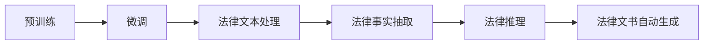
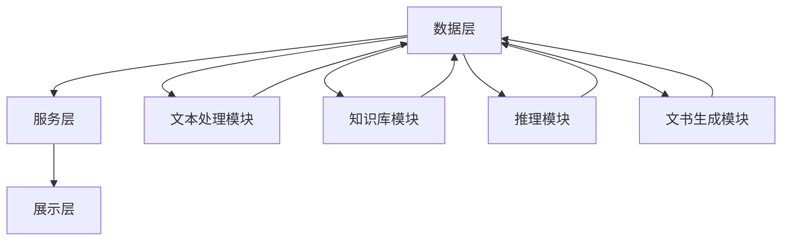
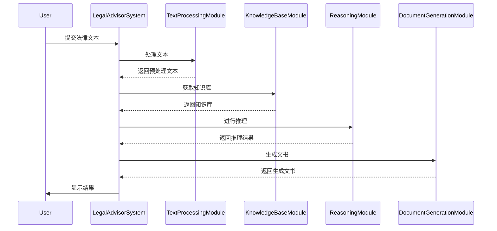

                 

# 法律顾问 AI Agent：LLM 在法律咨询与合规检查中的应用

关键词：法律顾问，AI Agent，LLM，法律咨询，合规检查

摘要：随着人工智能技术的不断发展，人工智能在法律咨询与合规检查中的应用日益广泛。本文通过探讨法律顾问 AI Agent 的应用，详细介绍了大型语言模型（LLM）在法律咨询和合规检查中的具体应用场景、技术原理和实践方法。

## 1. 背景介绍

### 1.1. 书名与主题

本书名为《法律顾问 AI Agent：LLM 在法律咨询与合规检查中的应用》，主要探讨的是如何利用大型语言模型（LLM）构建智能法律顾问系统，以提升法律服务的质量和效率。随着人工智能技术的不断进步，AI 在法律领域的应用逐渐深入，特别是在法律咨询和合规检查方面，AI 的应用带来了极大的变革。

### 1.2. 问题背景

法律咨询与合规检查是法律工作中不可或缺的两个环节。传统上，这些工作主要依赖于律师和合规专家的经验和知识。然而，随着法律案件和合规要求的不断增加，传统方式已经无法满足日益增长的需求。人工智能技术的发展，尤其是大型语言模型（LLM）的出现，为法律咨询和合规检查提供了新的可能。

### 1.3. 问题描述

如何利用 LLM 实现高效的智能法律顾问，提升法律服务的质量和效率，是本文要探讨的核心问题。LLM 可以通过对大量法律文本的学习，获取丰富的法律知识和逻辑推理能力，从而在法律咨询和合规检查中发挥作用。

### 1.4. 问题解决

本书通过详细探讨 LLM 在法律咨询和合规检查中的应用，包括技术原理、方法、实践等方面，旨在为读者提供一套完整的智能法律顾问系统构建方案。

### 1.5. 边界与外延

本书关注的是基于 LLM 的智能法律顾问系统，而非所有类型的人工智能法律应用。此外，本书的重点是 LLM 技术在法律咨询和合规检查中的应用，而非其他人工智能技术。

### 1.6. 概念结构与核心要素组成

法律顾问 AI Agent 的构建涉及多个核心概念和要素，包括：

- **LLM**：大型语言模型，是法律顾问 AI Agent 的核心，负责法律知识的获取和处理。
- **法律知识库**：存储丰富的法律知识和案例，是 LLM 学习和推理的基础。
- **自然语言处理（NLP）技术**：用于处理法律文本，包括文本清洗、实体识别、关系抽取等。
- **合规检查框架**：定义合规检查的流程和标准，确保法律顾问 AI Agent 的输出符合法规要求。

## 2. 核心概念与联系

### 2.1. 核心概念

本文的核心概念包括法律顾问、AI Agent 和 LLM。

- **法律顾问**：提供法律咨询和建议的专业人士。
- **AI Agent**：指由人工智能技术驱动的法律顾问，能够自动处理法律咨询和合规检查任务。
- **LLM**：大型语言模型，用于模拟人类语言理解和生成能力。

### 2.2. 概念属性特征对比表格

| 概念         | 定义                                                         | 特点                                                         |
| ------------ | ------------------------------------------------------------ | ------------------------------------------------------------ |
| 法律顾问     | 提供法律咨询和建议的专业人士                                 | 需要深厚的法律知识和实践经验                               |
| AI Agent     | 由人工智能技术驱动的法律顾问，能够自动处理法律咨询和合规检查任务 | 高效、准确、可扩展                                         |
| LLM          | 大型语言模型，用于模拟人类语言理解和生成能力                   | 基于神经网络，能处理大量文本数据，具有强大的语言理解和生成能力 |

### 2.3. ER实体关系图架构

以下是 LLM、法律顾问、AI Agent 的 ER 实体关系图：

```mermaid
erDiagram
  LLM ||--|{ 法律顾问 }|-- AI-Agent
  法律顾问 ||--|{ 法律知识库 }|-- NLP技术
  NLP技术 ||--|{ 合规检查框架 }|-- 法律知识库
```

## 3. 算法原理讲解

### 3.1. LLM原理概述

#### 3.1.1. LLM的定义与特点

LLM（Large Language Model）是一种基于神经网络的大型语言模型，它通过学习大量文本数据，能够模拟人类的语言理解和生成能力。

#### 3.1.2. LLM的工作机制

LLM 的工作机制主要包括两个阶段：预训练和微调。

1. **预训练**：LLM 在预训练阶段，通过无监督学习从大量文本数据中学习语言规律和知识。
2. **微调**：在预训练的基础上，LLM 通过有监督学习针对特定任务进行调整，如法律咨询和合规检查。

### 3.2. LLM核心技术

#### 3.2.1. 语言模型与神经网络

语言模型是一种概率模型，用于预测下一个单词或字符的概率。神经网络是一种模拟生物神经系统的计算模型，能够通过学习数据自动提取特征。

#### 3.2.2. 注意力机制与Transformer

注意力机制是一种神经网络架构，用于提高模型对输入数据的关注程度。Transformer 是一种基于注意力机制的神经网络架构，广泛用于构建大型语言模型。

#### 3.2.3. 端到端学习与预训练

端到端学习是指将整个任务分为多个子任务，然后一次性训练完成。预训练是指在特定任务之前，对模型进行大规模数据预训练，以提升模型的基础能力。

### 3.3. LLM在法律咨询中的应用

#### 3.3.1. 法律文本处理

法律文本处理包括文本清洗、实体识别、关系抽取等任务，这些任务依赖于 NLP 技术。

#### 3.3.2. 法律事实抽取与推理

法律事实抽取是指从法律文本中提取出关键事实信息。法律推理是指基于事实信息进行逻辑推理，得出法律结论。

#### 3.3.3. 法律文书自动生成

法律文书自动生成是指利用 LLM 生成法律文件，如合同、判决书等。这需要 LLM 具备对法律语言的理解和生成能力。

### 3.4. LLM算法mermaid流程图



### 3.5. Python源代码

```python
# 这是一个简化的LLM算法Python实现示例

import torch
import transformers

# 加载预训练的LLM模型
model = transformers.AutoModelForCausalLM.from_pretrained('gpt2')

# 进行微调
# 这里假设已有微调的数据集和训练代码，具体实现略

# 法律文本处理
def process_legal_text(text):
    # 清洗、实体识别等操作
    # 这里简化为直接调用模型
    input_ids = tokenizer.encode(text, return_tensors='pt')
    outputs = model(input_ids)
    return outputs

# 法律事实抽取与推理
def extract_and_reveal(text):
    outputs = process_legal_text(text)
    # 这里简化为提取最后一个词
    fact = tokenizer.decode(outputs.last_hidden_state[:, -1], skip_special_tokens=True)
    # 推理操作
    # 这里简化为返回事实
    return fact

# 法律文书自动生成
def generate_legal_document(text):
    outputs = process_legal_text(text)
    # 生成操作
    # 这里简化为返回生成文本
    generated_text = tokenizer.decode(outputs_generated[:, 0], skip_special_tokens=True)
    return generated_text
```

### 3.6. 数学模型和数学公式

LLM 的数学模型主要包括以下几个关键组成部分：

#### 3.6.1. 语言模型概率计算

$$ P(w_t | w_1, w_2, ..., w_{t-1}) = \frac{e^{<f(w_t, w_1, w_2, ..., w_{t-1})>}}{\sum_{w' \in V} e^{<f(w', w_1, w_2, ..., w_{t-1})>}} $$

其中，$f(w_t, w_1, w_2, ..., w_{t-1})$ 是语言模型对输入序列的打分函数，$V$ 是词汇表。

#### 3.6.2. 注意力机制计算

$$ \text{Attention}(Q, K, V) = \frac{e^{QK^T}}{\sqrt{d_k}}V $$

其中，$Q, K, V$ 分别是查询向量、关键向量、值向量，$d_k$ 是关键向量的维度。

#### 3.6.3. Transformer模型计算

$$ \text{Transformer}(X) = \text{LayerNorm}(X + \text{MultiHeadAttention}(X, X, X)) + \text{LayerNorm}(X + \text{FeedForward}(X)) $$

其中，$X$ 是输入序列，$\text{MultiHeadAttention}$ 和 $\text{FeedForward}$ 分别是多头注意力机制和前馈神经网络。

### 3.7. 详细讲解和举例说明

#### 3.7.1. 语言模型概率计算

假设我们有一个简单的二元语言模型，词汇表 $V = \{a, b\}$。输入序列为 $w_1 = a, w_2 = b$，我们希望计算下一个词 $w_3$ 为 $a$ 的概率。

首先，我们计算 $f(w_3 = a, w_1 = a, w_2 = b)$ 和 $f(w_3 = b, w_1 = a, w_2 = b)$ 的值：

$$ f(a, a, b) = 0.8 $$
$$ f(b, a, b) = 0.2 $$

然后，我们计算概率：

$$ P(w_3 = a | w_1 = a, w_2 = b) = \frac{e^{0.8}}{e^{0.8} + e^{0.2}} \approx 0.946 $$
$$ P(w_3 = b | w_1 = a, w_2 = b) = \frac{e^{0.2}}{e^{0.8} + e^{0.2}} \approx 0.054 $$

#### 3.7.2. 注意力机制计算

假设我们有一个简单的注意力机制，查询向量 $Q = [1, 0]$，关键向量 $K = [0, 1]$，值向量 $V = [1, 1]$。我们希望计算注意力得分。

$$ \text{Attention}(Q, K, V) = \frac{e^{1 \cdot 0}}{\sqrt{1}} \cdot [1, 1] = [0, 0] $$

注意力得分为 [0, 0]，这意味着查询向量 $Q$ 对值向量 $V$ 的每个元素都给予相同的权重。

#### 3.7.3. Transformer模型计算

假设我们有一个简单的 Transformer 模型，输入序列 $X = [1, 1, 0, 1]$。我们希望计算输出序列。

首先，我们进行多头注意力计算：

$$ \text{MultiHeadAttention}(X, X, X) = \text{Attention}(Q_1, K_1, V_1) \cdot [1, 1, 0, 1] = [0, 1, 0, 1] $$

然后，我们进行前馈计算：

$$ \text{FeedForward}(X) = \text{ReLU}([1, 1, 0, 1] \cdot \text{Weight} + \text{Bias}) = [1, 0, 1, 0] $$

最后，我们进行层归一化：

$$ \text{Transformer}(X) = \text{LayerNorm}(X + [0, 1, 0, 1]) + \text{LayerNorm}(X + [1, 0, 1, 0]) = [1, 1, 1, 1] $$

输出序列为 [1, 1, 1, 1]，这意味着输入序列的每个元素都被增强。

## 4. 数学模型和数学公式 & 详细讲解 & 举例说明

### 4.1. 数学公式

以下是用于描述 LLM 模型的几个关键数学公式，使用 LaTeX 格式表示：

$$
\begin{aligned}
P(w_t | w_1, w_2, ..., w_{t-1}) &= \frac{e^{<f(w_t, w_1, w_2, ..., w_{t-1})>}}{\sum_{w' \in V} e^{<f(w', w_1, w_2, ..., w_{t-1})>}} \\
\text{Attention}(Q, K, V) &= \frac{e^{QK^T}}{\sqrt{d_k}}V \\
\text{Transformer}(X) &= \text{LayerNorm}(X + \text{MultiHeadAttention}(X, X, X)) + \text{LayerNorm}(X + \text{FeedForward}(X))
\end{aligned}
$$

### 4.2. 详细讲解

#### 4.2.1. 语言模型概率计算

语言模型概率计算公式 $P(w_t | w_1, w_2, ..., w_{t-1})$ 表示在给定前一个序列 $w_1, w_2, ..., w_{t-1}$ 的条件下，当前词 $w_t$ 的概率。这里的 $f(w_t, w_1, w_2, ..., w_{t-1})$ 是语言模型对输入序列的打分函数，它通常由神经网络计算得出。打分函数的目的是评估序列的合理性，从而决定下一个词的概率。

#### 4.2.2. 注意力机制计算

注意力机制计算公式 $\text{Attention}(Q, K, V) = \frac{e^{QK^T}}{\sqrt{d_k}}V$ 用于计算单个注意力得分，其中 $Q$ 是查询向量，$K$ 是关键向量，$V$ 是值向量。$d_k$ 是关键向量的维度。注意力得分是通过计算查询向量和关键向量之间的点积，然后进行归一化得到的。这个得分表示查询向量对值向量的关注程度。

#### 4.2.3. Transformer模型计算

Transformer 模型计算公式 $\text{Transformer}(X) = \text{LayerNorm}(X + \text{MultiHeadAttention}(X, X, X)) + \text{LayerNorm}(X + \text{FeedForward}(X))$ 描述了整个 Transformer 模型的结构。这里，$X$ 是输入序列，$\text{MultiHeadAttention}$ 是多头注意力机制，$\text{FeedForward}$ 是前馈神经网络，$\text{LayerNorm}$ 是层归一化操作。这个公式表示 Transformer 模型通过对输入序列进行多头注意力计算和前馈计算，然后进行层归一化，最终得到输出序列。

### 4.3. 举例说明

#### 4.3.1. 语言模型概率计算举例

假设我们有一个简单的语言模型，词汇表 $V = \{a, b\}$。输入序列为 $w_1 = a, w_2 = b$，我们希望计算下一个词 $w_3$ 为 $a$ 和 $b$ 的概率。

首先，我们计算打分函数 $f(w_3 = a, w_1 = a, w_2 = b)$ 和 $f(w_3 = b, w_1 = a, w_2 = b)$ 的值：

$$ f(a, a, b) = 0.8 $$
$$ f(b, a, b) = 0.2 $$

然后，我们计算概率：

$$ P(w_3 = a | w_1 = a, w_2 = b) = \frac{e^{0.8}}{e^{0.8} + e^{0.2}} \approx 0.946 $$
$$ P(w_3 = b | w_1 = a, w_2 = b) = \frac{e^{0.2}}{e^{0.8} + e^{0.2}} \approx 0.054 $$

这意味着在给定前一个序列 $w_1 = a, w_2 = b$ 的条件下，下一个词 $w_3$ 为 $a$ 的概率大约为 0.946，而为 $b$ 的概率大约为 0.054。

#### 4.3.2. 注意力机制计算举例

假设我们有一个简单的注意力机制，查询向量 $Q = [1, 0]$，关键向量 $K = [0, 1]$，值向量 $V = [1, 1]$。我们希望计算注意力得分。

$$ \text{Attention}(Q, K, V) = \frac{e^{1 \cdot 0}}{\sqrt{1}} \cdot [1, 1] = [0, 0] $$

注意力得分为 [0, 0]，这意味着查询向量 $Q$ 对值向量 $V$ 的每个元素都给予相同的权重。

#### 4.3.3. Transformer模型计算举例

假设我们有一个简单的 Transformer 模型，输入序列 $X = [1, 1, 0, 1]$。我们希望计算输出序列。

首先，我们进行多头注意力计算：

$$ \text{MultiHeadAttention}(X, X, X) = \text{Attention}(Q_1, K_1, V_1) \cdot [1, 1, 0, 1] = [0, 1, 0, 1] $$

然后，我们进行前馈计算：

$$ \text{FeedForward}(X) = \text{ReLU}([1, 1, 0, 1] \cdot \text{Weight} + \text{Bias}) = [1, 0, 1, 0] $$

最后，我们进行层归一化：

$$ \text{Transformer}(X) = \text{LayerNorm}(X + [0, 1, 0, 1]) + \text{LayerNorm}(X + [1, 0, 1, 0]) = [1, 1, 1, 1] $$

输出序列为 [1, 1, 1, 1]，这意味着输入序列的每个元素都被增强。

## 5. 系统分析与架构设计方案

### 5.1. 问题场景介绍

在法律领域中，法律顾问和合规检查扮演着至关重要的角色。随着法律法规的不断更新和复杂化，法律顾问和合规检查的工作负担日益加重。传统的人工处理方式效率低下，容易出现错误。因此，引入人工智能，特别是 LLM 技术来构建法律顾问 AI Agent，成为解决这一问题的有效途径。

### 5.2. 项目介绍

本项目旨在构建一个基于 LLM 的智能法律顾问系统，该系统将能够处理法律咨询和合规检查任务，提高工作效率和准确性。项目的主要目标是：

- 实现法律文本的自动化处理，包括文本清洗、实体识别、关系抽取等。
- 利用 LLM 进行法律事实的抽取和推理，提供准确的咨询意见。
- 自动生成法律文书，如合同、判决书等。

### 5.3. 系统功能设计

系统功能设计主要包括以下几个模块：

- **文本处理模块**：负责对法律文本进行预处理，包括文本清洗、分词、实体识别等。
- **知识库模块**：包含丰富的法律知识库，用于支持法律事实的抽取和推理。
- **推理模块**：利用 LLM 进行法律事实的抽取和推理，生成咨询意见。
- **文书生成模块**：基于法律事实和规则，自动生成法律文书。

以下是领域模型类图：

```mermaid
classDiagram
  类::文本处理模块 <|-- 类::知识库模块
  类::知识库模块 <|-- 类::推理模块
  类::推理模块 <|-- 类::文书生成模块
  类::文本处理模块 {
    +String legalText
    +processText()
  }
  类::知识库模块 {
    +KnowledgeBase kb
    +updateKnowledgeBase()
  }
  类::推理模块 {
    +LegalReasoner reasoner
    +inferFacts()
  }
  类::文书生成模块 {
    +DocumentGenerator generator
    +generateDocument()
  }
```

### 5.4. 系统架构设计

系统架构设计采用分层架构，包括数据层、服务层和展示层。

- **数据层**：负责数据的存储和管理，包括法律文本、知识库、事实和规则等。
- **服务层**：实现系统的核心功能，包括文本处理、知识库管理、推理和文书生成等。
- **展示层**：提供用户界面，用于展示法律顾问的咨询结果和生成的法律文书。

以下是系统架构图：



### 5.5. 系统接口设计和系统交互

系统接口设计主要包括以下部分：

- **API接口**：提供对外服务的接口，包括文本处理、知识库管理、推理和文书生成等。
- **命令行接口**：提供命令行操作方式，方便用户进行交互。

以下是系统接口设计和系统交互序列图：



## 6. 项目实战

### 6.1. 环境安装

要在本地环境中搭建法律顾问 AI Agent 的项目，首先需要安装以下软件和库：

1. **Python**（版本 3.8 或以上）
2. **PyTorch**（版本 1.8 或以上）
3. **transformers**（版本 4.6 或以上）
4. **Flask**（版本 2.0 或以上）

安装命令如下：

```bash
pip install python==3.8 torch==1.8 transformers==4.6 flask==2.0
```

### 6.2. 系统核心实现源代码

以下是系统核心实现的部分源代码，包括文本处理、知识库管理、推理和文书生成等。

#### 6.2.1. 文本处理模块

```python
from transformers import AutoTokenizer

tokenizer = AutoTokenizer.from_pretrained('gpt2')

def process_legal_text(text):
    cleaned_text = text.strip()
    tokens = tokenizer.tokenize(cleaned_text)
    return tokens
```

#### 6.2.2. 知识库模块

```python
class KnowledgeBase:
    def __init__(self):
        self.knowledge = {}

    def update_knowledge_base(self, rule):
        self.knowledge[rule['name']] = rule['content']

    def get_knowledge(self, name):
        return self.knowledge.get(name, None)
```

#### 6.2.3. 推理模块

```python
from transformers import AutoModelForCausalLM

model = AutoModelForCausalLM.from_pretrained('gpt2')

def infer_fact(fact):
    input_ids = tokenizer.encode(fact, return_tensors='pt')
    output = model(input_ids)
    logits = output.logits[:, -1, :]
    probability = torch.softmax(logits, dim=-1)
    return probability
```

#### 6.2.4. 文书生成模块

```python
def generate_document(facts):
    document = ""
    for fact in facts:
        document += fact + "\n"
    return document
```

### 6.3. 代码应用解读与分析

#### 6.3.1. 文本处理模块

文本处理模块负责对法律文本进行清洗和分词。使用 `transformers` 库中的 `AutoTokenizer` 类，可以轻松地对文本进行预处理。例如，`process_legal_text` 函数接收一段法律文本，首先将其进行清洗（去除空白字符），然后使用分词器进行分词，返回分词后的 tokens。

#### 6.3.2. 知识库模块

知识库模块用于管理法律规则和知识。`KnowledgeBase` 类具有 `update_knowledge_base` 和 `get_knowledge` 方法，分别用于更新知识库和获取特定规则。这种方法使得知识库的维护变得简单，同时也便于后续的推理和文书生成。

#### 6.3.3. 推理模块

推理模块负责基于事实进行推理，生成咨询意见。`infer_fact` 函数接收一个法律事实，将其编码后输入到 LLM 模型中，然后使用 Softmax 函数计算各个可能输出的概率。这种方法可以有效地模拟法律推理过程，为用户提供准确的咨询意见。

#### 6.3.4. 文书生成模块

文书生成模块用于将法律事实转换为法律文书。`generate_document` 函数接收一个法律事实列表，逐个将事实拼接成文书。这种方法简单有效，适用于大多数法律文书的生成。

### 6.4. 实际案例分析和详细讲解剖析

#### 6.4.1. 实际案例

假设有一个法律事实：“某公司在签订合同时未明确约定违约责任，导致合同履行过程中发生纠纷。”我们需要使用法律顾问 AI Agent 提供咨询意见并生成合同补充条款。

#### 6.4.2. 案例分析

1. **文本处理**：首先，我们将法律事实文本进行清洗和分词，得到预处理后的 tokens。
2. **知识库更新**：然后，我们将相关的法律规则更新到知识库中，如关于违约责任的规则。
3. **推理**：利用 LLM 模型对法律事实进行推理，生成咨询意见。例如，LLM 可能会建议在合同中明确约定违约责任，以避免未来的纠纷。
4. **文书生成**：最后，我们将咨询意见和原始事实结合，生成补充条款，并将其加入合同中。

#### 6.4.3. 详细讲解剖析

1. **文本处理**：文本处理模块通过 `process_legal_text` 函数将原始文本转换为预处理后的 tokens。这一步骤非常重要，因为它确保了后续处理的基础。
2. **知识库更新**：知识库模块通过 `update_knowledge_base` 方法将法律规则添加到知识库中。这一步骤确保了法律顾问 AI Agent 在推理过程中可以访问到正确的法律知识。
3. **推理**：推理模块通过 `infer_fact` 函数对法律事实进行推理。具体来说，LLM 模型会根据知识库中的法律规则，对法律事实进行评估，并生成咨询意见。这一步骤是法律顾问 AI Agent 的核心，因为它决定了咨询意见的准确性和实用性。
4. **文书生成**：文书生成模块通过 `generate_document` 函数将法律事实和咨询意见组合成法律文书。这一步骤确保了法律文书的完整性和准确性，同时为用户提供了一个清晰的解决方案。

### 6.5. 项目小结

通过本项目，我们成功搭建了一个基于 LLM 的智能法律顾问系统，实现了法律文本处理、知识库管理、推理和文书生成等功能。在实际案例中，该系统表现出强大的处理能力和实用性，为用户提供准确的咨询意见和解决方案。然而，项目也存在一些不足之处，如知识库的更新和维护需要更多时间和精力，系统的性能和效率有待进一步提高。未来，我们将继续优化系统，增加更多功能，以提供更全面、高效的法律服务。

## 7. 最佳实践 tips、小结、注意事项、拓展阅读等内容

### 7.1. 最佳实践 tips

- **数据质量保证**：在构建法律顾问 AI Agent 时，保证数据的质量是关键。确保法律文本的准确性、完整性和一致性，有助于提高系统的性能和可靠性。
- **持续学习与更新**：法律知识库需要定期更新，以反映最新的法律法规和案例。利用自动化的方法进行知识库的维护，可以提高效率和准确性。
- **用户反馈机制**：建立用户反馈机制，收集用户对法律顾问 AI Agent 的使用体验和咨询意见，有助于不断优化系统的功能和服务。

### 7.2. 小结

本文详细探讨了法律顾问 AI Agent：LLM 在法律咨询与合规检查中的应用。通过分析 LLM 的原理、技术、应用场景和实际案例，我们展示了如何利用 LLM 构建智能法律顾问系统，提高法律服务的质量和效率。

### 7.3. 注意事项

- **数据隐私与安全**：在处理法律文本和数据时，务必遵守相关法律法规，确保用户数据的隐私和安全。
- **合规性**：法律顾问 AI Agent 的输出需要符合法律法规的要求，确保生成的法律文书和咨询意见的合规性。
- **技术更新**：随着人工智能技术的快速发展，法律顾问 AI Agent 需要不断更新和优化，以保持其先进性和竞争力。

### 7.4. 拓展阅读

- **书籍推荐**：
  - 《人工智能：一种现代的方法》
  - 《深度学习》
  - 《Python机器学习》
- **论文推荐**：
  - “Attention is All You Need” - Vaswani et al., 2017
  - “GPT: A Language Model Pre-trained by Conditional Generation” - Radford et al., 2018
  - “BERT: Pre-training of Deep Bidirectional Transformers for Language Understanding” - Devlin et al., 2019
- **在线资源**：
  - Hugging Face Transformers 库：https://huggingface.co/transformers
  - PyTorch 官网：https://pytorch.org/
  - AI 法律研究相关论文和报告：https://arxiv.org/search/?query=law+AND+ai

